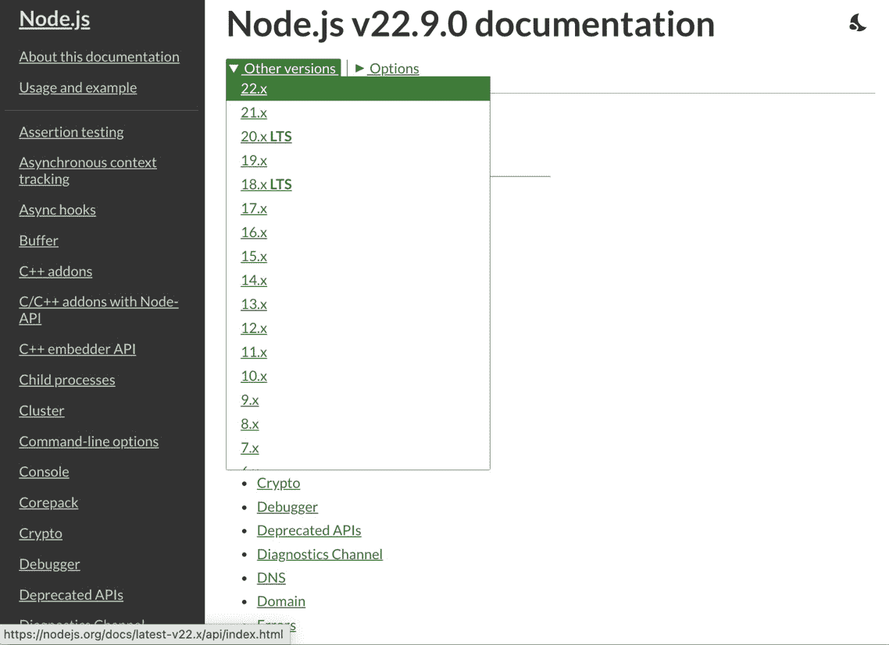
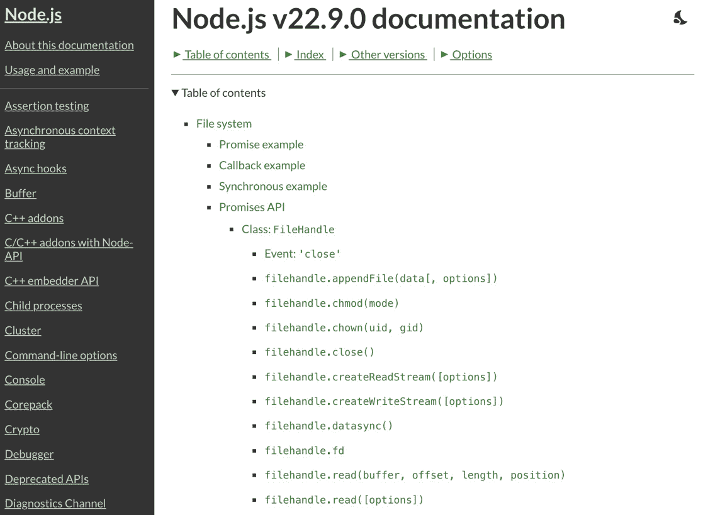
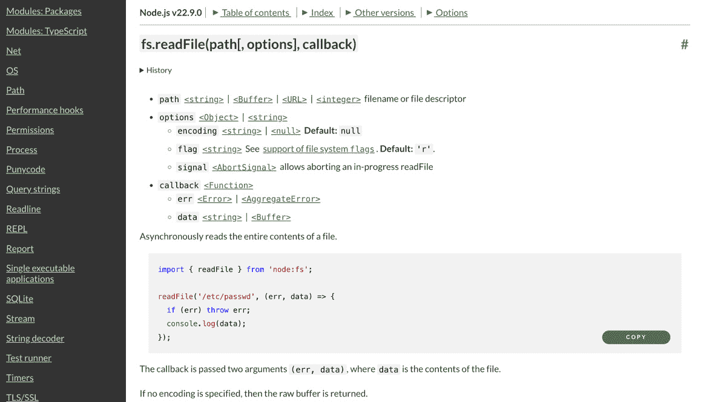
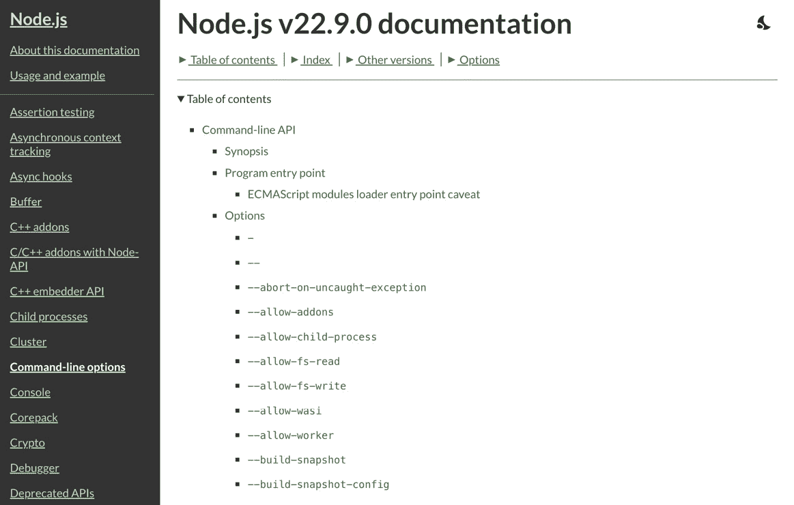
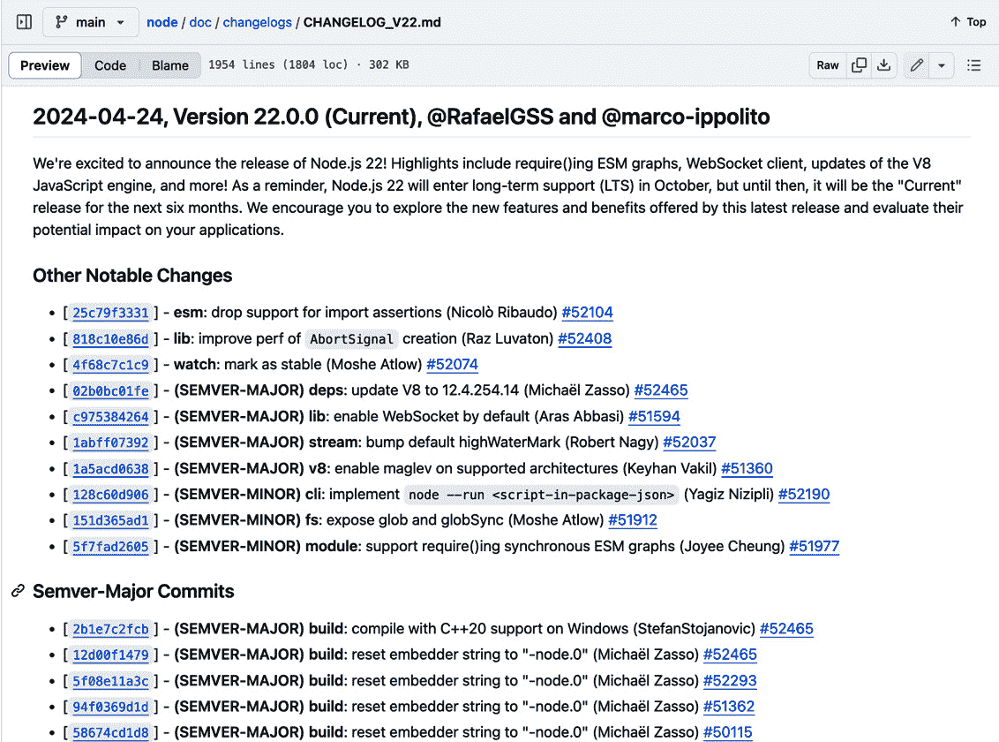

# 1

# 介绍 Node.js 22

Node.js 于 2009 年创建，是一个跨平台的、开源的 JavaScript 运行时，允许你在浏览器之外执行 JavaScript。Node.js 使用 Google Chrome 的 JavaScript 引擎 V8，使 JavaScript 能够在浏览器之外运行。Node.js 将 JavaScript 带到服务器，使我们能够使用 JavaScript 与操作系统、网络和文件系统交互。Node.js 是按照事件循环架构构建的，这使得它能够有效地处理输入/输出和并发操作。

今天，Node.js 是构建许多类型应用程序的流行技术选择，包括 HTTP 网络服务器、微服务、实时应用程序等。Node.js 成功的部分原因在于它使全栈开发在一种通用语言，JavaScript 中成为可能。

模块的大量生态系统支持了 Node.js 的成功。在 **npm** 注册表中，有超过 300 万个模块可用，其中许多将低级实现细节抽象为更高级、更易于使用的 API。在 **npm** 模块之上构建您的应用程序可以加快开发过程，同时促进代码共享和重用。

Node.js 现在已经超过十年历史，作为一项技术已经成熟。如今，它是构建各种规模应用程序的常见技术选择。许多大型企业都在生产中使用 Node.js。由于 Node.js 的广泛应用和依赖性，它被移至 OpenJS 基金会（之前称为 Node.js 基金会）之下。OpenJS 基金会为 JavaScript 项目提供了一个中立的平台，强调对开放治理的坚定承诺。开放治理促进了透明度和问责制，反过来，这有助于确保没有任何个人或公司对项目有过多控制。

本章介绍了 Node.js – 包括如何安装运行时和访问必要文档的说明。

本章将涵盖以下内容：

+   使用 **nvm** 安装 Node.js 22

+   访问 Node.js API 文档

+   在 Node.js 22 中采用新的 JavaScript 语法

+   介绍 Node.js 事件循环

# 技术要求

本章将需要访问终端、您选择的浏览器和互联网。

# 使用 nvm 安装 Node.js 22

Node.js 遵循发布计划并采用 **长期支持**（**LTS**）策略。发布计划基于 **语义化版本控制**（[`semver.org/`](https://semver.org/)）规范。

根据 Node.js 发布策略，Node.js 每年进行两次主要更新，分别定于四月和十月。这些主要版本可能引入对 API 的更改，可能会破坏兼容性。然而，Node.js 项目努力将此类破坏性更改的数量和严重性降到最低，旨在减少对最终用户的任何不便。

Node.js 的偶数主版本发布 6 个月后升级为 LTS 版本。偶数版本总是计划在 4 月发布，并在 10 月升级为 LTS。LTS 版本支持长达 30 个月。建议在生产中使用 Node.js 的 LTS 版本。LTS 发布计划的目的是为最终用户提供稳定性，同时也为用户提供一个可预测的发布时间表，以便用户可以适当地管理他们的升级。所有 Node.js 的 LTS 版本都有代号，以元素命名。Node.js 22 的 LTS 代号为“Jod”。

奇数主版本发布于 10 月，仅支持 6 个月。奇数版本主要推荐用于尝试新功能和测试迁移路径，但通常不建议在生产应用中使用。

Node.js 发布工作组负责 Node.js 的发布计划和流程。Node.js 发布计划和政策的文档可以在[`github.com/nodejs/release`](https://github.com/nodejs/release)找到。

在这本书中，我们将全程使用 Node.js 22。Node.js 22 于 2024 年 4 月发布。Node.js 22 于 2024 年 10 月升级为 LTS 版本，并计划支持至 2027 年 4 月。本食谱将涵盖如何使用**node 版本管理器**（**nvm**）安装 Node.js 22。**nvm**是 OpenJS 基金会的一个项目，提供了一种方便的方式来安装和更新 Node.js 版本。

## 准备工作

您可能还需要在您的设备上具有适当的权限来安装**nvm**。本食谱假设您在类 Unix 平台上。如果您在 Windows 上，应在 Windows WSL 下运行。

## 如何操作...

在本食谱中，我们将使用**nvm**安装 Node.js 22。请按照以下步骤操作：

1.  首先，我们需要安装**nvm**。**nvm**提供了一个可以下载和安装**nvm**的脚本。在您的终端中输入以下命令以执行**nvm**安装脚本：

    ```js
    $ curl -o- https://raw.githubusercontent.com/nvm-sh/nvm/v0.40.1/install.sh | bash
    ```

1.  **nvm**将自动尝试将其自身添加到您的路径中。关闭并重新打开您的终端以确保更改已生效。然后，输入以下命令以列出我们已安装的**nvm**版本；这也会确认**nvm**是否在我们的路径中可用：

    ```js
    $ nvm --version
    0.40.1
    ```

1.  要安装 Node.js 22，我们可以使用**$ nvm install**命令。我们可以提供我们希望安装的特定版本或主版本号。如果我们只指定主版本号，**nvm**将安装该主版本线的最新版本。输入以下命令以安装 Node.js 22 的最新版本：

    ```js
    $ nvm install 22
    Downloading and installing node v22.9.0...
    Downloading https://nodejs.org/dist/v22.9.0/node-v22.9.0-darwin-arm64.tar.xz...
    ######################################################################### 100.0%
    Computing checksum with sha256sum
    Checksums matched!
    Now using node v22.9.0 (npm v10.8.3)
    ```

    注意，此命令将安装 Node.js 22 的最新版本，因此您特定的版本安装可能与前面输出中显示的不同。

1.  Node.js 22 的最新版本现在应该已安装并可在您的路径中使用。您可以通过输入以下命令来确认：

    ```js
    $ node --version
    v22.9.0
    ```

1.  **nvm**还会安装与已安装的 Node.js 版本捆绑的**npm**版本。输入以下命令以确认已安装的**npm**版本：

    ```js
    $ npm --version
    10.8.3
    ```

1.  **nvm**使得安装和切换多个 Node.js 版本变得容易。我们可以输入以下命令来安装并切换到最新的 Node.js 20 版本：

    ```js
    $ nvm install 20
    Downloading and installing node v20.17.0...
    Downloading https://nodejs.org/dist/v20.17.0/node-v20.17.0-darwin-arm64.tar.xz...
    ############################################################################################################################################### 100.0%
    Computing checksum with sha256sum
    Checksums matched!
    Now using node v20.17.0 (npm v10.8.2)
    ```

1.  一旦我们安装了这些版本，我们可以使用**nvm use**命令在它们之间切换：

    ```js
    $ nvm use 22
    Now using node v22.9.0 (npm v10.8.3)
    ```

这样，我们就使用**nvm**安装了 Node.js 的最新版本 22。

## 它是如何工作的…

**nvm**是 Unix-like 平台上的 Node.js 版本管理器，并支持**可移植操作系统接口**（**POSIX**）兼容的 shell。POSIX 是一组由 IEEE 计算机协会定义的操作系统兼容性标准。

首先，我们下载并执行了**nvm**安装脚本。在底层，**nvm**安装脚本执行以下操作：

1.  克隆**nvm**GitHub 仓库（[`github.com/nvm-sh/nvm`](https://github.com/nvm-sh/nvm)）到**~/.nvm/**。

1.  尝试向适当的配置文件中添加一些源行以导入和加载**nvm**，其中配置文件是**~/.bash_profile**、**~/.bashrc**、**~/.profile**或**~/.zshrc**。

如果你使用的是之前提到的以外的配置文件，你可能需要手动将以下行添加到你的配置文件中以加载**nvm**。以下行在**nvm**安装文档（[`github.com/nvm-sh/nvm#install--update-script`](https://github.com/nvm-sh/nvm#install--update-script)）中指定：

```js
export NVM_DIR="$([ -z "${XDG_CONFIG_HOME-}" ] && printf %s "${HOME}/.nvm" || printf %s "${XDG_CONFIG_HOME}/nvm")"
[ -s "$NVM_DIR/nvm.sh" ] && \. "$NVM_DIR/nvm.sh" # This loads nvm
```

每次使用**$ nvm install**安装 Node.js 版本时，**nvm**将从官方 Node.js 下载服务器下载适合你平台的相应二进制文件。官方 Node.js 下载服务器可以直接访问[`nodejs.org/dist/`](https://nodejs.org/dist/)。**nvm**将存储它安装的所有 Node.js 版本在**~/.nvm/versions/node/**目录中。

**nvm**支持别名，可以用来安装 Node.js 的长版本。例如，你可以使用**$ nvm install --lts**命令来安装最新的 LTS 版本。

要卸载一个 Node.js 版本，你可以使用**$ nvm uninstall**命令。要更改默认的 Node.js 版本，使用**$ nvm alias default <version>**命令。默认版本是在你打开终端时将可用的版本。

如果你不想使用或无法使用**nvm**，你可以手动安装 Node.js。访问 Node.js 的**下载**页面（见[`nodejs.org/en/download`](https://nodejs.org/en/download)）以下载适合你平台的相应二进制文件。

Node.js 项目为许多平台提供了安装用的 TAR 文件。要通过 TAR 文件安装，你需要下载并解压 TAR 文件，然后将二进制位置添加到你的路径中。

除了 TAR 文件外，Node.js 项目还为 macOS（**.pkg**）和 Windows（**.msi**）提供了安装程序。由于手动安装 Node.js，当您需要时，您将需要手动安装 Node.js 的更新版本。

## 更多信息...

根据语义化版本规范允许的情况，当从 Node.js 主版本升级时，您可能会遇到破坏性更改，这些更改可能会影响或停止您的脚本或应用程序（包括任何依赖项）在先前版本下的执行方式。

在调试升级时，以下是一些建议：

+   查阅主要版本的发布说明。这些发布说明将突出显示任何破坏性更改、新功能或已弃用功能以及重要更新。了解发生了什么变化可以帮助您识别问题。请注意，如果您是从/to Node.js LTS 版本升级（例如，从 Node.js 20 升级到 22），您应该首先至少查阅每个中间主要版本的变更日志——即 21.0.0 和 22.0.0。

+   如果您是从非常旧的 Node.js 版本升级，通过中间版本进行增量升级可能是个明智的选择。这可以使识别和逐步解决兼容性问题变得更加容易。当使用如 **nvm** 这样的 Node.js 版本管理器时，这会变得更容易，因为您可以在不同的版本上运行和测试您的代码。

+   检查您项目的依赖项，并确保它们与新的 Node.js 版本兼容。过时或未维护的包可能无法与最新的 Node.js 版本正确工作。

+   为您的应用程序创建全面的测试套件。在升级 Node.js 之前和之后运行您的测试套件，以确保您的代码按预期运行。

+   使用 Node.js 调试工具。Node.js 提供了各种诊断工具，可以帮助您在升级过程中识别和解决问题。

+   利用在线社区、论坛和文档。Node.js 社区中的其他人可能在升级过程中遇到过类似问题，并可以提供宝贵的见解和解决方案。这可能包括在官方 Node.js 存储库之一上提出 GitHub 问题（[`github.com/nodejs/node`](https://github.com/nodejs/node) 或 [`github.com/nodejs/help`](https://github.com/nodejs/help)）。

请记住，调试 Node.js 升级可能需要时间和彻底的测试。为潜在挑战做好准备，并制定计划以减轻对应用程序功能可能造成的任何中断至关重要。

# 访问 Node.js API 文档

Node.js 项目提供了全面的 API 参考文档。Node.js API 文档是理解您正在使用的 Node.js 版本中哪些 API 可用的关键资源。Node.js 文档还描述了如何与 API 交互，包括给定方法接受的参数和方法返回值。

本指南将展示如何访问和浏览 Node.js API 文档。

## 准备工作

你需要访问你选择的浏览器和互联网连接来访问 Node.js API 文档。

## 如何操作…

这个菜谱将演示如何浏览 Node.js API 文档。按照以下步骤操作：

1.  首先，在你的浏览器中导航到 [`nodejs.org/api/`](https://nodejs.org/api/)。

    你将看到 Node.js API 文档的最新版本：


图 1.1 – Node.js API 文档首页

1.  将鼠标悬停在 **Other versions** 下拉菜单上，查看 Node.js 的其他发布版本。这样你可以更改你正在查看文档的 Node.js 版本：



图 1.2 – 显示 Other versions 下拉菜单的 Node.js API 文档

1.  现在，假设我们想要找到 **fs.readFile()** 方法的文档。**fs.readFile()** 方法通过 **文件系统** 核心模块暴露。首先，我们需要在左侧导航栏中找到并点击 **文件系统**。点击 **文件系统** 将带我们到 **文件系统** 核心模块 API 文档的目录：



图 1.3 – Node.js API 文档的文件系统子系统

1.  滚动直到你在目录中找到列出的 **fs.readFile()** 方法。在寻找特定的 API 时，使用浏览器搜索功能定位 API 定义可能是有益的。点击目录中的 **fs.readFile()** 链接。这将打开 API 定义：



图 1.4 – 显示 fs.readFile() API 定义的 Node.js API 文档

1.  现在，点击左侧导航栏中的 **命令行选项**。此页面详细介绍了可以传递给 Node.js 进程的所有可用命令行选项：



图 1.5 – 显示可用命令行选项的 Node.js API 文档

通过这样，我们已经学会了如何访问和浏览 Node.js API 文档。

## 它是如何工作的…

Node.js API 文档是构建 Node.js 应用程序时的一个重要参考资源。文档针对 Node.js 的每个版本。在本食谱中，我们访问了 Node.js 最新版本的文档，这是在[`nodejs.org/api/`](https://nodejs.org/api/)渲染的默认文档版本。以下 URL 可以用来访问 Node.js 特定版本的文档：[`nodejs.org/docs/v22.0.0/api/index.html`](https://nodejs.org/docs/v22.0.0/api/index.html)（将**v22.0.0**替换为您希望查看文档的特定版本）。

API 文档详细说明了 Node.js API 的使用，包括以下内容：

+   接受的参数及其类型

+   如果适用，API 返回的值和类型

在某些情况下，文档将提供更多信息，包括使用示例或示例代码来展示 API 的使用方法。

注意，有一些 API 没有文档。一些 Node.js API 有意未记录，因为它们被认为是仅限内部使用，并且不打算在 Node.js 核心运行时之外使用。

API 文档还详细说明了 API 的稳定性。Node.js 项目定义并使用以下四个稳定性指标：

+   **0 – 已废弃**：不鼓励使用这些 API。使用这些 API 时可能会发出警告。已废弃的 API 也将列在[`nodejs.org/docs/latest-v22.x/api/deprecations.html`](https://nodejs.org/docs/latest-v22.x/api/deprecations.html)。

+   **1 – 实验**：这些 API 被认为是不稳定的，可能会进行一些非向后兼容的更改。实验性 API 不受语义版本控制规则的限制。在生产和环境中使用这些 API 应谨慎进行。最近，Node.js 文档中的“实验”状态已被分解为多个阶段，以尝试表明功能的成熟度：

    +   **1.0 -** **早期开发**

    +   **1.1 -** **活跃开发**

    +   **1.2 -** **候选发布版**

+   **2 – 稳定**：对于稳定的 API，Node.js 项目将尝试确保兼容性。

+   **3 – 旧版**：旧版功能可能不再维护，或者可能有更现代的替代方案。然而，它们不太可能被移除，并继续遵守语义版本控制规则。

Node.js 文档由 Node.js 项目在 Node.js 核心仓库中维护。任何错误或建议的改进都可以在[`github.com/nodejs/node`](https://github.com/nodejs/node)提出。

## 还有更多...

Node.js 项目为 Node.js 的每个发布分支维护一个**.md**文件，详细说明每个发布中包含的个别提交。Node.js 22 的**CHANGELOG.md**文件可以在[`github.com/nodejs/node/blob/main/doc/changelogs/CHANGELOG_V22.md`](https://github.com/nodejs/node/blob/main/doc/changelogs/CHANGELOG_V22.md)找到。

以下是从 Node.js 22 **CHANGELOG.md** 文件中的一个片段：



图 1.6 – 示例 Node.js 22.0.0 CHANGELOG.md 条目

Node.js 项目突出了每个版本中的显著变化。**CHANGELOG.md** 文件标明了哪些提交根据语义化版本控制标准（[`semver.org/`](https://semver.org/)）被确定为 **SEMVER-MINOR**。标记为 **SEMVER-MINOR** 的条目表示功能添加。**CHANGELOG.md** 文件还将标明何时一个发布被认为是安全发布（修复了一个安全问题）。在安全发布的情况下，**显著变化** 部分会以句子 **This is a** **security release.** 开头。

对于主要版本，Node.js 项目在 Node.js 网站上发布一个发布公告，详细说明新功能和变化。Node.js 22 版本的发布公告可在 [`nodejs.org/en/blog/announcements/v22-release-announce`](https://nodejs.org/en/blog/announcements/v22-release-announce) 查找。

在升级 Node.js 时，可以使用 Node.js **CHANGELOG.md** 文件作为参考，帮助你了解新版本中包含哪些更新和变化。

# 在 Node.js 22 中采用新的 JavaScript 语法

JavaScript 语言的正式规范是 ECMAScript。新的 JavaScript 功能通过更新 Node.js 所基于的底层 V8 JavaScript 引擎而进入 Node.js。ECMAScript 每年都会更新，提供新的 JavaScript 语言特性和语法。

Node.js 的新主要版本通常包括对 V8 引擎的重大升级。Node.js 版本 22.0.0 伴随着 V8 版本 12.4 的发布。然而，V8 版本可能会在 Node.js 22 的生命周期内升级。

V8 的更新版本为 Node.js 运行时带来了底层性能改进以及新的 JavaScript 语言特性和语法。本配方将展示 Node.js 22 中引入的一些较新的 JavaScript 语言特性。

## 准备工作

对于这个配方，你需要安装 Node.js 22。你还需要能够访问终端。

## 如何操作…

在这个配方中，我们将使用 Node.js **Read Eval Print Loop** ( **REPL** ) 来测试 Node.js 22 中可用的较新 JavaScript 功能。按照以下步骤操作：

1.  首先，让我们打开 Node.js REPL。在你的终端中输入以下命令：

    ```js
    $ node
    ```

1.  这应该会打开 REPL，这是一个我们可以用来执行代码的接口。预期会看到以下输出：


图 1.7 – Node.js REPL

1.  首先输入以下命令。此命令将返回你使用的 Node.js 版本中嵌入的 V8 版本：

    ```js
    > process.versions.v8
    '12.4.254.21-node.19'
    ```

1.  自 Node.js 20 以来，新增了两个 JavaScript **String** 方法：

    +   **String.prototype.isWellFormed**：此方法返回提供的 **String** 是否是格式良好的 UTF-16

    +   **String.prototype.toWellFormed**：此方法将替换不成对的代理字符为**替换字符**（**U+FFFD**），从而使 UTF-16 字符串格式良好。

    你可以在 REPL 中演示这一点：

    ```js
    > "006E006F00640065".isWellFormed()
    true
    ```

1.  另一个最近添加的功能是**Intl.NumberFormat**内置对象，它提供基于语言的数字格式化。让我们来测试一下。在 REPL 中声明一个数字：

    ```js
    > const number = 123456.789;
    undefined
    ```

1.  接下来，让我们将这个数字格式化为**英国英镑**（**GBP**）的形式：

    ```js
    > new Intl.NumberFormat('en-UK', { style: 'currency', currency: 'GBP' }).format(number);
    '£123,456.79'
    ```

1.  在 Node.js 22 中，作为 V8 12.4 更新的部分，添加了新的**Set**方法，如**并集**、**交集**和**差集**。这些增强功能使得对数值集合的操作更加容易。以下是一个涉及质数和奇数的示例：

    ```js
    > const oddNumbers = new Set([1, 3, 5, 7]), primeNumbers = new Set([2, 3, 5, 7]);
    undefined
    > console.log('All Numbers:', [...(oddNumbers.union(primeNumbers))].toString());
    All Numbers: 1,3,5,7,2
    undefined
    > console.log('Common Numbers:', [...(oddNumbers.intersection(primeNumbers))].toString());
    Common Numbers: 3,5,7
    undefined
    > console.log('Exclusive Primes:', [...(primeNumbers.difference(oddNumbers))].toString());
    Exclusive Primes: 2
    ```

使用 REPL，我们已经探索了 Node.js 22 中可用的几个新的 JavaScript 语言特性。这次学习的目标是通过升级底层 Google Chrome V8 引擎，使新的 JavaScript 语言特性变得可用。

## 它是如何工作的...

新的 JavaScript 语言特性是通过更新底层 Google Chrome V8 JavaScript 引擎引入到 Node.js 中的。JavaScript 引擎解析并执行 JavaScript 代码。将 Google Chrome V8 引擎嵌入到 Node.js 中使得在浏览器之外执行 JavaScript 成为可能。Chrome 的 V8 JavaScript 引擎是许多可用的 JavaScript 引擎之一，Mozilla 的 SpiderMonkey 也是另一个主要的 JavaScript 引擎，它被用于 Mozilla Firefox 浏览器。

每 6 周，Google Chrome 的 V8 引擎就会发布一个新版本。Node.js 22 将继续将更新整合到 V8 中，前提是它们可以与**应用程序二进制接口**（**ABI**）兼容。ABI 描述了程序如何通过编译程序与函数和数据结构交互。它可以被认为是**应用程序编程接口**（**API**）的编译版本。

一旦发布了一个不再允许 ABI 兼容性的 V8 版本，Node.js 的具体发布线将固定在那个版本的 V8 上。然而，具体的 V8 补丁和修复可能继续直接应用于那个 Node.js 发布线。目前，Node.js 20 已固定在 V8 版本 11.3 上，而 Node.js 22 在撰写本文时处于 V8 12.4。Node.js 22 中的 V8 版本将继续更新，直到无法再维护新版本的 V8 的 ABI 兼容性。

V8 JavaScript 引擎使用**即时编译**（**JIT**）内部编译 JavaScript。JIT 编译加速了 JavaScript 的执行。当 V8 执行 JavaScript 时，它会获取有关正在执行的代码的数据。从这个数据中，V8 引擎可以进行推测性优化。推测性优化根据最近执行的代码预测即将到来的代码。这允许 V8 引擎为即将到来的代码进行优化。

V8 博客提供了新 V8 发布的公告，并详细介绍了 V8 的新功能和更新。V8 博客可通过[`v8.dev/blog`](https://v8.dev/blog)访问。

# 介绍 Node.js 事件循环

Node.js 事件循环是 Node.js 中的一个基本概念，它使 Node.js 能够高效地执行异步和非阻塞操作。这是一个负责在事件驱动环境中管理代码执行机制的机制。理解 Node.js 事件循环对于构建可扩展和响应式的应用程序至关重要，尤其是在处理如读取文件、发起网络请求或同时处理多个客户端连接等 I/O 密集型任务时。

## 准备工作

你需要安装 Node.js 22。你还需要能够访问终端。

## 如何做…

在这个菜谱中，我们将创建两个文件。一个将演示如何阻塞事件循环，而另一个将演示如何不阻塞事件循环。按照以下步骤操作：

1.  创建一个名为 **blocking.js** 的文件。

1.  添加以下代码：

    ```js
    // Blocking function
    function blockingOperation() {
      console.log('Start blocking operation');
      // Simulate a time-consuming synchronous operation (e.g., reading a large file)
      for (let i = 0; i < 1000000000; i++) {
        // This loop will keep the CPU busy for a while, blocking other operations
      }
      console.log('End blocking operation');
    }
    console.log('Before blocking operation');
    // Call the blocking function
    blockingOperation();
    console.log('After blocking operation');
    ```

1.  运行脚本并观察它是如何等待阻塞操作的：

    ```js
    $ node blocking.js
    Before blocking operation
    Start blocking operation
    End blocking operation
    After blocking operation
    ```

    此脚本通过使用保持 CPU 忙碌的同步循环来演示阻塞操作。当你运行脚本时，你会注意到它记录 **Start blocking operation** ，执行阻塞循环，并最终记录 **End blocking operation** 和 **After blocking operation** 。

1.  现在，让我们实现一个非阻塞脚本。创建一个名为 **non-blocking.js** 的文件。

1.  添加以下代码：

    ```js
    console.log('Before non-blocking operation');
    // Non-blocking operation (setTimeout)
    setTimeout(() => {
      console.log('Non-blocking operation completed');
    }, 2000); // Simulate a non-blocking operation that takes 2 seconds
    console.log('After non-blocking operation');
    ```

1.  运行脚本并观察其执行情况：

    ```js
    $ node non-blocking.js
    Before non-blocking operation
    After non-blocking operation
    Non-blocking operation completed
    ```

    此脚本通过使用 **setTimeout** 函数演示了非阻塞操作，该函数实现了至少 2 秒的延迟。当你运行此脚本时，它会记录 **Before non-blocking operation** ，安排超时，立即记录 **After non-blocking operation** ，然后，在 2 秒后，记录 **Non-blocking operation completed** 。这个例子演示了在 2 秒的延迟期间，Node.js 保持响应，可以继续执行其他任务，这表明此操作是非阻塞的。

1.  让我们通过 **process.nextTick()** 来演示 Node.js 事件循环。为此，创建一个名为 **next-tick.js** 的文件。

1.  将以下代码添加到 **next-tick.js** 中：

    ```js
    console.log('Start');
    process.nextTick(() => {
      console.log('Callback scheduled with
        process.nextTick #1');
    });
    setTimeout(() => {
      console.log('setTimeout #1 callback');
    }, 0);
    process.nextTick(() => {
      console.log('Callback scheduled with
        process.nextTick #2');
    });
    console.log('End');
    ```

1.  运行程序并观察它们的执行顺序：

    ```js
    $ node next-tick.js
    Start
    End
    Callback scheduled with process.nextTick #1
    Callback scheduled with process.nextTick #2
    setTimeout #1 callback
    ```

**Start** 和 **End** 记录语句立即执行，因为它们是主代码执行的一部分。使用 **process.nextTick()** 安排的两个回调在所有其他安排的回调之前执行，在 **setTimeout** 回调之前。这是因为 **process.nextTick()** 回调具有最高优先级，并在下一个事件循环周期的开始处运行。在 **process.nextTick()** 回调执行后，**setTimeout** 回调才会执行。

## 它是如何工作的…

Node.js 在单线程环境中运行，这意味着它使用单个主执行线程来执行您的 JavaScript 代码。然而，Node.js 可以通过利用异步、非阻塞 I/O 来处理许多并发操作。

Node.js 是事件驱动的，这意味着它依赖于事件和回调来响应各种操作或事件执行代码。事件可以是 I/O 操作（例如，读取文件或发起网络请求），定时器，或由您的代码触发的自定义事件。

关于 Node.js 处理 I/O 有一些关键概念需要理解：

+   **非阻塞**：Node.js 在操作完成之前不会等待每个操作，这被称为非阻塞。Node.js 可以同时处理多个任务，使其在 I/O 密集型操作中非常高效。

+   **事件队列**：当您执行异步操作，如读取文件时，Node.js 不会阻塞整个程序。相反，它将这些操作放入一个称为**事件队列**的队列中，并继续执行其他任务。

+   **事件循环**：**事件循环**持续运行并检查事件队列。如果队列中有完成的操作（例如，文件读取完成），它将执行与该操作关联的回调函数。

+   **回调函数**：当启动异步操作时，您通常会提供一个回调函数。当操作完成时，该函数会被调用。例如，如果您正在读取文件，回调函数将处理文件内容可用时的操作。

**libuv** ([`libuv.org/`](https://libuv.org/))作为底层库，通过提供跨平台的、高效的、并发的 I/O 框架来为 Node.js 事件循环提供动力。它使 Node.js 能够在各种操作系统上保持兼容性的同时，实现非阻塞、异步的特性。

## 更多内容

Node.js 事件循环操作一系列阶段。深入理解这一流程对于调试、性能优化以及充分利用 Node.js 的非阻塞方法至关重要。

当 Node.js 进程启动时，事件循环被初始化，并处理输入脚本。事件循环将持续运行，直到事件循环中没有待处理项或显式调用**process.exit()**。

事件循环阶段如下：

+   **定时器阶段**：此阶段检查是否有需要执行的已计划定时器。这些定时器通常使用如**setTimeout()**或**setInterval()**等函数创建。如果定时器指定的时长已过，其回调函数将被添加到 I/O 轮询阶段。

+   **待处理回调阶段**：在此阶段，事件循环检查已完成（或出错）I/O 操作的事件。这包括例如文件系统操作、网络请求和用户事件。如果这些操作中的任何一项已完成，它们的回调函数将在这一阶段执行。

+   **空闲和准备阶段**：这些阶段在典型应用开发中很少使用，通常保留用于特殊用例。空闲阶段运行在空闲期间安排执行的回调函数，而准备阶段用于为轮询事件做准备。

+   **轮询阶段**：轮询阶段是事件循环中大多数动作发生的地方。它执行以下任务：

    +   检查新的 I/O 事件（例如套接字上的传入数据）并执行其回调函数（如果有的话）。

    +   如果没有挂起的 I/O 事件，它将检查回调队列，以查找由计时器或 **setImmediate()** 安排的挂起回调。如果找到任何，它们将被执行。

    +   如果没有挂起的 I/O 事件或回调函数，事件循环可能会进入阻塞状态，等待新事件到来。这被称为“轮询”。

+   **检查阶段**：在这个阶段，使用 **setImmediate()** 注册的回调函数将被执行。任何回调函数都会在当前的轮询阶段之后执行，但在任何 I/O 回调函数之前。

+   **关闭回调阶段**：这个阶段负责执行关闭事件回调，例如使用 **socket.on('close', ...)** 事件注册的回调。

完成所有这些阶段后，事件循环检查是否有挂起的计时器、I/O 操作或其他事件。如果有，它将回到适当的阶段来处理它们。如果没有进一步的挂起事件，Node.js 进程将结束。

**process.nextTick()** 在阶段中未详细说明。这是因为 **process.nextTick()** 将提供的回调函数安排在事件循环的下一次 tick 上运行。重要的是，这个回调函数的执行优先级高于其他异步操作。**process.nextTick()** 回调函数在事件循环的当前阶段完成后执行，但在事件循环移动到下一个阶段之前。这允许你安排任务以更高的优先级运行，这使得它在确保某些函数在当前操作之后立即运行时非常有用。
