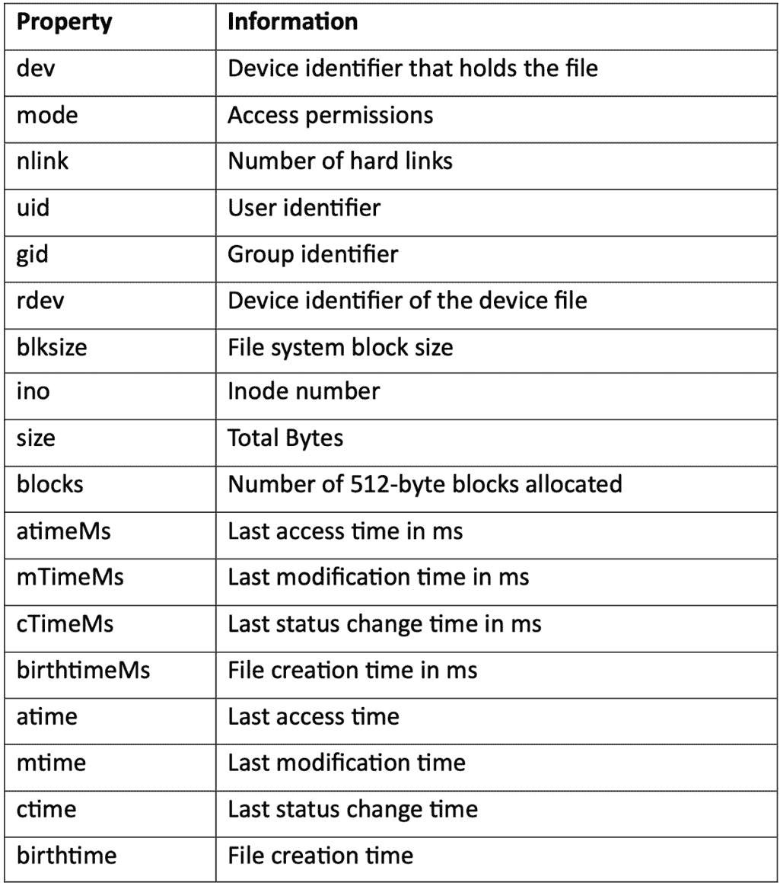

# 与文件系统交互

在 Node.js 之前，JavaScript 主要用于浏览器。Node.js 将 JavaScript 带到服务器，并使我们能够通过 JavaScript 与操作系统交互。今天，Node.js 是构建服务器端应用最受欢迎的技术之一。

Node.js 在基本层面上与操作系统交互：**输入和输出** ( **I/O** )。本章将探讨 Node.js 提供的核心 API，这些 API 允许我们与标准 I/O、文件系统和网络堆栈交互。

本章将向您展示如何同步和异步地读取和写入文件。Node.js 是为了处理异步代码并启用非阻塞模型而构建的。了解如何读取和写入异步代码是基本的学习，它将展示如何利用 Node.js 的功能。

我们还将了解 Node.js 提供的核心模块。我们将重点关注 **文件系统** 模块，它允许您与文件系统及文件交互。Node.js 的新版本添加了许多文件系统 API 的 **Promise** 变体，这些内容也将在本章中涉及。

本章将涵盖以下食谱：

+   与文件系统交互

+   文件操作

+   获取元数据

+   监视文件

# 技术要求

本章假设您已安装了最新版本的 Node.js 22，一个 **终端** 或 shell，以及您选择的编辑器。本章的代码可在 GitHub 的 [`github.com/PacktPublishing/Node.js-Cookbook-Fifth-Edition`](https://github.com/PacktPublishing/Node.js-Cookbook-Fifth-Edition) 中的 **Chapter02** 目录找到。

本章将使用 CommonJS 语法；有关 CommonJS 和 ECMAScript 模块的信息，请参阅 *第五章*。

# 与文件系统交互

**标准输入** ( **stdin** ) 指的是程序可以用来从命令行或终端读取输入的输入流。同样，**标准输出** ( **stdout** ) 指的是用于写入输出的流。**标准错误** ( **stderr** ) 是与 **stdout** 分离的流，通常用于输出错误和诊断数据。

在这个食谱中，我们将学习如何处理 **stdin** 的输入，将输出写入 **stdout**，并将错误记录到 **stderr**。

## 准备工作

对于这个食谱，我们首先创建一个名为 **greeting.js** 的单个文件。程序将通过 **stdin** 请求用户输入，通过 **stdout** 返回问候语，当提供无效输入时将错误记录到 **stderr**。同时，我们也创建一个工作目录：

```js
$ mkdir interfacing-with-io
$ cd interfacing-with-io
$ touch greeting.js
```

现在我们已经设置了目录和文件，我们可以继续进行食谱步骤。

## 如何操作…

在这个食谱中，我们将创建一个程序，可以从 **stdin** 读取并写入 **stdout** 和 **stderr**：

1.  首先，我们需要告诉程序监听用户输入。这可以通过向 **greeting.js** 添加以下行来实现：

    ```js
    console.log('What is your name?');
    process.stdin.on('data', (data) => {
      // processing on each data event
    });
    ```

1.  我们可以使用以下命令运行文件。注意，应用程序没有退出，因为它正在继续监听 **process.stdin** 数据事件：

    ```js
    $ node greeting.js
    ```

1.  使用 *Ctrl* + *C* 退出程序。

1.  我们现在可以告诉程序每次检测到数据事件时应该做什么。在 **// processing on each data event** 注释下方添加以下行：

    ```js
      const name = data.toString().trim().toUpperCase();
      process.stdout.write(`Hello ${name}!`);
    ```

1.  你现在可以向程序输入。当你按下 *Enter* 时，它将返回一个问候语和你的大写名字：

    ```js
    $ node greeting.js
    What is your name?
    Beth
    Hello BETH!
    ```

1.  我们现在可以添加一个检查输入字符串是否为空的检查，并在它是空的情况下向 **stderr** 记录。将你的文件更改为以下内容：

    ```js
    console.log('What is your name?');
    process.stdin.on('data', (data) => {
      // processing on each data event
      const name = data.toString().trim().toUpperCase();
      if (name !== '') {
        process.stdout.write(`Hello ${name}!`);
      } else {
        process.stderr.write('Input was empty.\n');
      }
    });
    ```

1.  再次运行程序并输入没有输入的 *Enter*：

    ```js
    $ node greeting.js
    What is your name?
    Input was empty.
    ```

我们现在创建了一个可以从 **stdin** 读取并写入 **stdout** 和 **stderr** 的程序。

## 它是如何工作的…

**process.stdin**、**process.stdout** 和 **process.stderr** 属性都是进程对象上的属性。全局进程对象提供了对 Node.js 进程的信息和控制。对于每个 I/O 通道（标准输入、标准输出、标准错误），它们在接收到每个数据块时都会发出数据事件。在本配方中，我们以交互模式运行程序，其中每个数据块由你在 shell 中按下 *Enter* 时的换行符确定。

The **process.stdin.on('data', (data) => {...});** 实例是监听这些数据事件的。每个数据事件返回一个 **Buffer** 对象。该 **Buffer** 对象（通常命名为 **data**）返回输入的二进制表示。

**const name = data.toString()** 实例是将 **Buffer** 对象转换为字符串。**trim()** 函数会从字符串的开始和结束处移除所有空白字符——包括空格、制表符和换行符。空白字符包括空格、制表符和换行符。

我们使用进程对象上的相应属性（**process.stdout.write**，**process.stderr.write**）向 **stdout** 和 **stderr** 写入。

在配方过程中，我们还使用了 *Ctrl* + *C* 来在 shell 中退出程序。*Ctrl* + *C* 向 Node.js 进程发送 **SIGINT**，或信号中断。有关信号事件的更多信息，请参阅 Node.js 进程 API 文档：[`nodejs.org/api/process.html#process_signal_events`](https://nodejs.org/api/process.html#process_signal_events)。

重要提示

**控制台 API**：在底层，**console.log** 和 **console.err** 使用 **process.stdout** 和 **process.stderr**。控制台方法是高级 API，包括自动格式化。通常，当需要更多对流的控制时，会使用控制台方法来提高便利性，并使用低级进程方法。

## 还有更多…

截至 Node.js 17.0.0 版本，Node.js 提供了一个实验性的 Readline Promises API，用于逐行读取文件。此 Promises API 变体允许您使用 **async** / **await** 而不是回调，提供了一种更现代、更简洁的处理异步操作的方法。

下面是一个如何使用 Promises API 变体创建一个类似于主菜谱中创建的 **greeting.js** 文件的示例程序：

```js
const readline = require('node:readline/promises');
async function greet () {
  const rl = readline.createInterface({
        input: process.stdin,
        output: process.stdout
      });
  const name = await rl.question('What is your name?\n');
  console.log(`Hello ${name}!`);
  rl.close();
}
greet();
```

此 Node.js 脚本使用了 **node:readline/promises** 模块，该模块提供了 Readline API 的 **Promise** 变体。它定义了一个异步函数 **greet()**，该函数在控制台中提示用户输入他们的名字，然后用个性化的消息问候他们——类似于主菜谱程序。使用 Readline Promises API 允许我们使用 **async** / **await** 语法来编写更干净的异步代码流。我们将在后面的菜谱和章节中介绍更多关于 **async** / **await** 语法的知识。

## 参见

+   在 *第三章* 的 *解耦 I/O* 菜谱

# 文件操作

Node.js 提供了多个核心模块，包括 **fs** 模块。**fs** 代表文件系统，此模块提供了与文件系统交互的 API。

在本菜谱和整本书中，我们将使用 **node:** 前缀来导入核心模块。

在本菜谱中，我们将学习如何使用 **fs** 模块中提供的同步函数来读取、写入和编辑文件。

## 准备工作

让我们先为这个菜谱准备一个目录和文件：

1.  为此菜谱创建另一个目录：

    ```js
    $ mkdir working-with-files
    $ cd working-with-files
    ```

1.  现在，让我们创建一个用于读取的文件。在您的 shell 中运行以下命令以创建包含一些简单文本的文件：

    ```js
    $ echo Hello World! > hello.txt
    ```

1.  我们还需要为我们的程序创建一个文件——创建一个名为 **readWriteSync.js** 的文件：

    ```js
    $ touch readWriteSync.js
    ```

重要提示

**touch** 工具是 Unix 类操作系统中的一个命令行工具，用于将文件或目录的访问和修改日期更新为当前时间。然而，当 **touch** 在没有额外参数的情况下运行在不存在文件上时，它将创建一个空文件，并使用该名称。**touch** 工具是创建空文件的典型方法。

## 如何操作…

在本菜谱中，我们将使用 **fs** 模块提供的同步函数同步地读取名为 **hello.txt** 的文件，操作文件内容，然后使用同步函数更新文件：

1.  我们将首先引入 **fs** 和 **path** 内置模块。将以下行添加到 **readWriteSync.js** 中：

    ```js
    const fs = require('node:fs');
    const path = require('node:path');
    ```

1.  现在，让我们创建一个变量来存储我们之前创建的 **hello.txt** 文件的文件路径：

    ```js
    const filepath = path.join(process.cwd(), 'hello.txt');
    ```

1.  我们现在可以使用 **fs** 模块提供的 **readFileSync()** 函数同步地读取文件内容。我们还将使用 **console.log()** 将文件内容打印到 **stdout**：

    ```js
    const contents = fs.readFileSync(filepath, 'utf8');
    console.log('File Contents:', contents);
    ```

1.  现在，我们可以编辑文件的内容了——我们将把小写文本转换为大写：

    ```js
    const upperContents = contents.toUpperCase();
    ```

1.  要更新文件，我们可以使用 **writeFileSync()** 函数。之后，我们还会添加一个 **log** 语句来指示文件已被更新：

    ```js
    fs.writeFileSync(filepath, upperContents);
    console.log('File updated.');
    ```

1.  使用以下命令运行您的程序：

    ```js
    $ node readWriteSync.js
    File Contents: Hello World!
    File updated.
    ```

1.  要验证内容是否已更新，您可以在终端中使用 **cat** 命令来显示 **hello.txt** 的内容：

    ```js
    $ cat hello.txt
    HELLO WORLD!
    ```

现在，您有一个程序，当运行时，将读取 **hello.txt** 的内容，将文本内容转换为大写，并更新文件。

## 它是如何工作的…

如同常见情况，文件的前两行需要程序所需的必要核心模块。

**const fs = require('node:fs');** 这一行将导入 Node.js 核心文件系统模块。Node.js 文件系统模块的 API 文档可在 [`nodejs.org/api/fs.html`](https://nodejs.org/api/fs.html) 找到。**fs** 模块提供了使用 Node.js 与文件系统交互的 API。同样，核心 **path** 模块提供了用于处理文件和目录路径的 API。**path** 模块 API 文档可在 [`nodejs.org/api/path.html`](https://nodejs.org/api/path.html) 找到。

接下来，我们使用 **path.join()** 和 **process.cwd()** 函数定义了一个变量来存储 **hello.txt** 的文件路径。**path.join()** 函数将提供的路径部分与特定平台的分隔符（例如，Unix 环境中的 **/** 和 Windows 环境中的 **\**）连接起来。

**process.cwd()** 函数是全局 process 对象上的一个函数，它返回 Node.js 进程的当前目录。此程序期望 **hello.txt** 文件与程序位于同一目录。

接下来，我们使用 **fs.readFileSync()** 函数读取文件。我们将要读取的文件路径和编码 UTF-8 传递给此函数。编码参数是可选的——当省略此参数时，函数将默认返回一个 **Buffer** 对象。

为了对文件内容进行操作，我们使用了字符串对象上可用的 **toUpperCase()** 函数。

最后，我们使用 **fs.writeFileSync()** 函数更新了文件。我们向 **fs.writeFileSync()** 函数传递了两个参数。第一个参数是我们希望更新的文件的路径，第二个参数是更新后的文件内容。

重要提示

**readFileSync()** 和 **writeFileSync()** API 都是同步的，这意味着它们将在文件读取或写入完成后才会阻塞/延迟并发操作。为了避免阻塞，您将想要使用这些函数的异步版本，这在本食谱的 *还有更多…* 部分中进行了介绍。

## 还有更多…

在整个过程中，我们都是同步地对文件进行操作的。然而，Node.js 的开发重点是使非阻塞 I/O 模型成为可能；因此，在许多（如果不是大多数）情况下，您会希望操作是异步的。

今天，在 Node.js 中处理异步代码有三种显著的方法——回调、Promises 和 **async** / **await** 语法。Node.js 的最早版本只支持回调模式。Promises 是随着 ECMAScript 2015（也称为 ES6）的 JavaScript 规范一起添加的，随后 Node.js 也添加了对 Promises 的支持。在添加 **Promise** 支持之后，Node.js 也添加了对 **async** / **await** 语法的支持。

所有当前支持的 Node.js 版本现在都支持回调、Promises 和 **async** / **await** 语法 - 你可能会在现代 Node.js 开发中看到这些中的任何一个。让我们探索如何使用这些技术异步处理文件。

### 异步处理文件

异步编程可以在其他操作进行时使某些任务或处理继续进行。

来自 *与文件一起工作* 食谱的程序是使用 **fs** 模块中可用的同步函数编写的：

```js
const fs = require('node:fs');
const path = require('node:path');
const filepath = path.join(process.cwd(), 'hello.txt');
const contents = fs.readFileSync(filepath, 'utf8');
console.log('File Contents:', contents);
const upperContents = contents.toUpperCase();
fs.writeFileSync(filepath, upperContents);
console.log('File updated.');
```

这意味着程序被阻塞，等待 **readFileSync()** 和 **writeFileSync()** 操作完成。这个程序可以被重写以利用异步 API。

**readFileSync()** 的异步版本是 **readFile()**。一般规则是，同步 API 的名称将附加“sync”后缀。异步函数需要一个回调函数传递给它。回调函数包含我们希望在异步任务完成时执行的代码。

以下步骤将实现与 *与文件一起工作* 食谱中的程序相同的行为，但使用异步方法：

1.  在本食谱中，**readFileSync()** 函数可以被更改为使用以下异步函数：

    ```js
    const fs = require('node:fs');
    const path = require('node:path');
    const filepath = path.join(process.cwd(),
      'hello.txt');
    fs.readFile(filepath, 'utf8', (err, contents) => {
      if (err) {
        return console.log(err);
      }
      console.log('File Contents:', contents);
      const upperContents = contents.toUpperCase();
      fs.writeFileSync(filepath, upperContents);
      console.log('File updated.');
    });
    ```

    注意，所有依赖于文件读取的处理都需要在回调函数内部进行。

1.  **writeFileSync()** 函数也可以替换为 **writeFile()** 异步函数：

    ```js
    const fs = require('node:fs');
    const path = require('node:path');
    const filepath = path.join(process.cwd(),
      'hello.txt');
    fs.readFile(filepath, 'utf8', (err, contents) => {
      if (err) {
        return console.log(err);
      }
      console.log('File Contents:', contents);
      const upperContents = contents.toUpperCase();
      fs.writeFile(filepath, upperContents, (err) => {
        if (err) throw err;
        console.log('File updated.');
      });
    });
    ```

    注意，我们现在有一个异步函数调用了另一个异步函数。不建议有太多的嵌套回调，因为它可能会对代码的可读性产生负面影响。考虑以下内容，看看过多的嵌套回调是如何阻碍代码的可读性的，这有时被称为“回调地狱”：

    ```js
    first(args, () => {
        second(args, () => {
            third(args, () => {});
        });
    });
    ```

1.  可以采取一些方法来避免过多的嵌套回调。一种方法是将回调函数拆分为显式命名的函数。例如，我们可以将文件重写，使得 **writeFile()** 调用包含在其自己的命名函数 **updateFile()** 中：

    ```js
    const fs = require('node:fs');
    const path = require('node:path');
    const filepath = path.join(process.cwd(), 'hello.txt');
    fs.readFile(filepath, 'utf8', (err, contents) => {
      if (err) {
        return console.log(err);
      }
      console.log('File Contents:', contents);
      const upperContents = contents.toUpperCase();
      updateFile(filepath, upperContents);
    });
    function updateFile (filepath, contents) {
      fs.writeFile(filepath, contents, function (err) {
        if (err) throw err;
        console.log('File updated.');
      });
    }
    ```

    另一种方法是使用 Promises，我们将在本章的 *使用 fs Promises API* 部分中介绍。但是，由于 Node.js 的最早版本不支持 Promises，回调的使用在许多 **npm** 模块和现有应用程序中仍然很普遍。

1.  为了演示此代码是异步的，我们可以使用**setInterval()**函数在程序运行时将字符串打印到屏幕上。**setInterval()**函数允许你安排在指定的毫秒延迟后执行一个函数。将以下行添加到程序末尾：

    ```js
    setInterval(() => process.stdout.write('**** \n'), 1).unref();
    ```

    注意到字符串每毫秒都会继续打印，即使在文件正在读取和重写之间。这表明文件读取和写入是以非阻塞方式实现的，因为操作仍在处理文件时完成。

重要提示

在**setInterval()**中使用**unref()**意味着这个计时器不会保持 Node.js 事件循环活跃。这意味着如果它是事件循环中唯一的活跃事件，Node.js 可能会退出。这对于你希望在将来执行某个操作但不想仅为了保持 Node.js 进程运行而使用计时器的情况非常有用。

1.  为了进一步演示这一点，你可以在文件的读取和写入之间添加一个延迟。为此，将**updateFile()**函数包裹在**setTimeout()**函数中。**setTimeout()**函数允许你传递一个函数和一个毫秒延迟：

    ```js
    setTimeout(() => updateFile(filepath, upperContents), 10);
    ```

1.  现在，我们程序的输出应该在文件读取和写入之间打印出更多的星号，因为这是我们添加了 10 毫秒延迟的地方：

    ```js
    $ node readFileAsync.js
    ****
    ****
    File Contents: HELLO WORLD!
    ****
    ****
    ****
    ****
    ****
    ****
    ****
    ****
    ****
    File updated.
    ```

我们现在可以看到，我们已经将程序从“与文件一起工作”食谱转换为使用回调语法异步处理文件操作。

### 使用 fs Promises API

**fs** Promises API 在 Node.js v10.0.0 版本中发布。该 API 提供了返回**Promise**对象而不是回调的文件系统函数。并非所有原始**fs**模块 API 都有等效的基于**Promise**的 API，因为只有原始 API 的一个子集被转换为提供**Promise** API。请参阅 Node.js API 文档以获取通过**fs** Promises API 提供的**fs**函数的完整列表：[`nodejs.org/docs/latest/api/fs.html#promises-api`](https://nodejs.org/docs/latest/api/fs.html#promises-api) .

**Promise**是一个用于表示异步函数完成的对象。命名基于该术语“promise”的一般定义——即做某事或某事将要发生的协议。一个**Promise**对象始终处于以下三种状态之一：

+   待定

+   已完成

+   已拒绝

**Promise**最初处于待定状态，并且将保持待定状态，直到它变为已完成——当任务成功完成时——或已拒绝——当任务失败时。

以下步骤将再次实现与食谱中程序相同的行为，但使用**fs** Promise API 方法：

1.  要使用该 API，你首先需要导入它：

    ```js
    const fs = require('node:fs/promises');
    ```

1.  然后，可以使用**readFile()**函数读取文件：

    ```js
    fs.readFile(filepath, 'utf8').then((contents) => {
        console.log('File Contents:', contents);
    });
    ```

1.  你还可以将**fs** Promises API 与**async** / **await**语法结合使用：

    ```js
    const fs = require('node:fs/promises');
    const path = require('node:path');
    const filepath = path.join(process.cwd(),
      'hello.txt');
    async function run () {
      try {
        const contents = await fs.readFile(filepath,
          'utf8');
        console.log('File Contents:', contents);
      } catch (error) {
        console.error(error);
      }
    }
    run();
    ```

本实现有两个值得注意的方面，包括以下内容的使用：

+   **async function run() {...}** : 定义了一个名为 **run()** 的异步函数。异步函数允许使用 **await** 关键字以更同步的方式处理承诺。

+   **await fs.readFile(filepath, 'utf8')** : 使用 **await** 关键字异步读取指定文件的文件内容。

现在，我们已经学会了如何使用 **fs** Promises API 与文件进行交互。

重要提示

由于本章使用了 CommonJS，因此有必要将 **async** / **await** 示例包装在一个函数中，因为 **await** 只能在 CommonJS 的异步函数内部调用。从 *第五章* 开始，我们将介绍 ECMAScript 模块，由于 ECMAScript 模块支持 **顶层 await**，因此不需要这个包装函数。

## 参见

+   本章的 *获取元数据* 食谱

+   本章的 *监视文件* 食谱

+   *第五章*

# 获取元数据

**fs** 模块通常提供基于 **Portable Operating System Interface** ( **POSIX** ) 函数的 API。**fs** 模块包括便于读取目录和文件元数据的 API。

在这个食谱中，我们将创建一个小程序，使用 **fs** 模块提供的函数返回有关文件的信息。

## 准备工作

1.  开始创建一个工作目录：

    ```js
    $ mkdir fetching-metadata
    $ cd fetching-metadata
    ```

1.  我们还需要创建一个用于读取的文件和一个用于程序的文件：

    ```js
    $ touch metadata.js
    $ touch file.txt
    ```

## 如何做…

使用 *准备工作* 部分中创建的文件，我们将创建一个程序，该程序提供有关作为参数传递给它的文件的信息：

1.  与之前的食谱一样，我们首先需要导入必要的核心模块。对于这个食谱，我们只需要导入 **fs** 模块：

    ```js
    const fs = require('node:fs');
    ```

1.  接下来，我们需要程序能够读取文件名作为命令行参数。为了读取文件参数，我们可以使用 **process.argv[2]**。将以下行添加到你的程序中：

    ```js
    const file = process.argv[2];
    ```

1.  现在，我们将创建我们的 **printMetadata** 函数：

    ```js
    function printMetadata(file) {
      const fileStats = fs.statSync(file);
      console.log(fileStats);
    }
    ```

1.  添加对 **printMetadata** 函数的调用：

    ```js
    printMetadata(file);
    ```

1.  你现在可以运行程序，传递给它 **./file.txt** 参数。使用以下命令运行你的程序：

    ```js
    $ node metadata.js ./file.txt
    ```

1.  预期看到以下输出：

    ```js
    Stats {
      dev: 16777231,
      mode: 33188,
      nlink: 1,
      uid: 501,
      gid: 20,
      rdev: 0,
      blksize: 4096,
      ino: 16402722,
      size: 0,
      blocks: 0,
      atimeMs: 1697208041116.9521,
      mtimeMs: 1697208041116.9521,
      ctimeMs: 1697208041116.9521,
      birthtimeMs: 1697208041116.9521,
      atime: 2023-10-13T14:40:41.117Z,
      mtime: 2023-10-13T14:40:41.117Z,
      ctime: 2023-10-13T14:40:41.117Z,
      birthtime: 2023-10-13T14:40:41.117Z
    }
    ```

    你可以尝试向 **file.txt** 添加一些随机文本，保存文件，然后重新运行你的程序；观察到的 **size** 和 **mtime** 值已更新。

1.  现在，让我们看看当我们向程序传递一个不存在的文件时会发生什么：

    ```js
    $ node metadata.js ./not-a-file.txt
    node:fs:1658
      const stats = binding.stat(
                            ^
    Error: ENOENT: no such file or directory, stat './not-a-file.txt'
    ```

    程序抛出了异常。

1.  我们应该捕获这个异常，并向用户输出一条消息，说明提供的文件路径不存在。为此，将 **printMetadata** 函数更改为以下内容：

    ```js
    function printMetadata(file) {
      try {
        const fileStats = fs.statSync(file);
        console.log(fileStats);
      } catch (err) {
        console.error('Error reading file path:', file);
      }
    }
    ```

1.  再次运行程序，使用一个不存在的文件：

    ```js
    $ node metadata.js ./not-a-file.txt
    Error reading file: ./not-a-file.txt
    ```

这次，你应该看到程序处理了错误而不是抛出异常。

## 它是如何工作的…

**process.argv** 属性是全局进程对象的一个属性，它返回一个包含传递给 Node.js 进程的参数的数组。**process.argv** 数组的第一个元素 **process.argv[0]** 是正在运行的 **node** 二进制文件的路径。第二个元素是我们正在执行的文件路径——在本例中，是 **metadata.js** 。在配方中，我们将文件名作为第三个命令行参数传递，因此用 **process.argv[2]** 来引用它。

接下来，我们创建了一个名为 **printMetadata()** 的函数，该函数调用了 **statSync(file)** 。**statSync()** 是一个同步函数，它返回传递给它的文件路径的信息。传递给该函数的文件路径可以是文件或目录。返回的信息以 **stats** 对象的形式呈现。以下表格列出了在 **stats** 对象上返回的信息：



表 2.1 – 列出在 stats 对象上返回的属性的表格

重要提示

在本配方中，我们只使用了同步的文件系统 API。对于大多数 **fs** API，每个函数都有同步和异步版本。有关使用异步文件系统 API 的更多信息，请参阅 *Working with files* 配方的 *Working with files asynchronously* 部分。

在本配方的最后几个步骤中，我们编辑了我们的 **printMetadata** 函数，以处理无效的文件路径。我们通过将 **statSync** 函数包裹在 **try** / **catch** 语句中来做到这一点。

## 还有更多...

接下来，我们将探讨如何检查文件访问权限、修改文件权限以及如何检查一个 **符号链接**（**symlink**）。

### 检查文件访问

如果您尝试读取、写入或编辑文件，建议您遵循我们在配方中使用的处理文件未找到错误的方法。

然而，如果您只想检查文件的存在，可以使用 **fs.access()** 或 **fs.accessSync()** API。具体来说，**fs.access()** 函数测试用户访问传递给它的文件或目录的权限。该函数还允许传递一个可选的 **mode** 参数，您可以使用 Node.js 文件访问常量请求函数执行特定的访问检查。Node.js 文件访问常量的列表可在 Node.js **fs** 模块 API 文档中找到：[`nodejs.org/api/fs.html#fs_file_access_constants`](https://nodejs.org/api/fs.html#fs_file_access_constants) 。这些使您能够检查 Node.js 进程是否可以读取、写入或执行提供的文件路径。

重要提示

现在已弃用的旧版 API，称为 **fs.exists()**。不建议您使用此函数。弃用此函数的原因是该方法的接口被发现存在错误，可能导致意外的竞争条件。应使用 **fs.access()** 或 **fs.stat()** API。

### 修改文件权限

Node.js **fs** 模块提供了可以用来更改给定文件权限的 API。与其他许多 **fs** 函数一样，存在异步 API **chmod()** 和等效的同步 API **chmodSync()**。两个函数分别接受文件路径和 **mode** 作为前两个参数。**chmod()** 函数接受第三个参数，即完成时要执行的回调函数。

重要提示

**chmod** 命令用于更改 Unix 和类似操作系统上的文件系统对象的访问权限。如果您不熟悉 Unix 文件权限，建议您参考 Unix 手册页（[`linux.die.net/man/1/chmod`](https://linux.die.net/man/1/chmod)）。

**mode** 参数可以是使用 **fs** 模块提供的系列常量构成的数字掩码形式，或者是一个由三个八进制数字组成的序列。用于创建定义用户权限的掩码的常量在 Node.js API 文档中定义：[`nodejs.org/api/fs.html#fs_file_modes`](https://nodejs.org/api/fs.html#fs_file_modes)。

假设你有一个文件，当前具有以下权限：

+   拥有者可读和可写

+   群组可读

+   只能由所有其他用户读取（有时被称为世界可读）

如果我们还想额外授予同一组用户的写访问权限，可以使用以下 Node.js 代码：

```js
const fs = require('node:fs');
const file = './file.txt';
fs.chmodSync(
  file,
  fs.constants.S_IRUSR |
    fs.constants.S_IWUSR |
    fs.constants.S_IRGRP |
    fs.constants.S_IWGRP |
    fs.constants.S_IROTH
);
```

如您所见，此代码相当冗长。添加复杂的权限序列需要传递许多常量以创建数字掩码。或者，我们可以向 **chmodSync()** 函数传递文件权限的八进制表示，这在使用 Unix 命令行上的 **chmod** 命令时很常见。

我们将使用命令行上的 **chmod 664** 的等效方式来更改权限，但通过 Node.js 实现：

```js
const fs = require('fs');
const file = './file.txt';
fs.chmodSync(file, 0o664);
```

重要提示

请参考[`mason.gmu.edu/~montecin/UNIXpermiss.htm`](https://mason.gmu.edu/~montecin/UNIXpermiss.htm)获取更多关于 Unix 权限如何工作的详细信息。

**Windows 文件权限**：Windows 操作系统上的文件权限不如 Unix 那样精细——只能表示文件为可写或不可写。

### 检查符号链接

符号链接是一个特殊的文件，它存储了对另一个文件或目录的引用。当在 *获取元数据* 菜单中的 **stat()** 或 **statSync()** 函数上运行符号链接时，该方法将返回符号链接所引用的文件的信息，而不是符号链接本身。

尽管如此，Node.js **fs** 模块确实提供了名为 **lstat()** 和 **lstatSync()** 的方法，这些方法可以检查符号链接本身。以下步骤将演示您如何使用这些方法来检查我们将创建的符号链接：

1.  要创建符号链接，可以使用以下命令：

    ```js
    $ ln -s file.txt link-to-file
    ```

    现在，你可以使用 Node.js 的 **Read-Eval-Print Loop** ( **REPL** ) 来测试 **lstatSync()** 函数。Node.js REPL 是一个交互式外壳，我们可以向其中传递语句，它将评估它们并将结果返回给用户。

1.  要进入 Node.js REPL，请在您的壳中输入 **node**：

    ```js
    $ node
    Welcome to Node.js v22.9.0.
    Type ".help" for more information.
    >
    ```

1.  你可以输入以下命令：

    ```js
    > console.log('Hello World!');
    Hello World!
    undefined
    ```

1.  现在，你可以尝试使用 **lstatSync** 命令：

    ```js
    > fs.lstatSync('link-to-file');
    Stats {
      dev: 16777224,
      mode: 41453,
      nlink: 1,
      ...
    }
    ```

注意，我们不需要显式导入 Node.js **fs** 模块。REPL 自动加载核心（内置）Node.js 模块，以便它们可供使用。REPL 是一个有用的工具，可以在不创建文件的情况下测试命令。

## 相关内容

+   本章的 *监视文件* 示例

# 监视文件

Node.js 的 **fs** 模块提供了功能，使您能够监视文件并跟踪文件或目录何时被创建、更新或删除。

在这个示例中，我们将创建一个名为 **watch.js** 的小程序，它使用 **watchFile()** API 监视文件中的更改，并在发生更改时打印一条消息。

## 准备工作

1.  对于这个食谱，我们希望在新的目录内工作。创建并切换到名为 **file-watching** 的目录：

    ```js
    $ mkdir file-watching
    $ cd file-watching
    ```

1.  我们还需要创建一个我们可以监视的文件：

    ```js
    $ echo Hello World! > file.txt
    ```

1.  创建一个 **watch.js** 文件：

    ```js
    $ touch watch.js
    ```

现在我们已经创建了我们的目录和文件，我们可以继续到食谱。

## 如何实现...

我们将创建一个程序来监视给定文件中的更改——在这个例子中，是我们在前面创建的 **file.txt** 文件。我们将使用 **fs** 模块，特别是 **watchFile()** 方法来实现这一点：

1.  要开始，导入所需的 Node.js 核心模块：

    ```js
    const fs = require('node:fs');
    const path = require('node:path');
    ```

1.  我们还需要程序访问我们创建的文件：

    ```js
    const file = path.join(process.cwd(), 'file.txt');
    ```

1.  接下来，我们调用 **fs.watchFile()** 函数：

    ```js
    fs.watchFile(file, (current, previous) => {
        return console.log(`${file} updated
          ${(current.mtime)}`);
    });
    ```

1.  现在，你可以使用以下命令在您的壳中运行程序：

    ```js
    $ node watch.js
    ```

1.  在您的编辑器中打开 **file.txt** 并进行一些编辑，每次编辑后保存。您会注意到每次保存时，在您运行 **watch.js** 的终端中都会出现一条日志条目：

    ```js
    ./file.txt updated Mon Oct 16 2023 00:44:19 GMT+0100 (British Summer Time)
    ```

1.  当我们在这里时，我们可以使时间戳更易读。为此，我们将使用 **Intl.DateTimeFormat** 对象。这是一个内置的 JavaScript 工具，用于操作日期和时间。

1.  添加并更改以下行以使用 **Intl.DateTimeFormat** 格式化日期：

    ```js
      const formattedTime = new Intl.DateTimeFormat('en-
        GB', {
        dateStyle: 'full',
        timeStyle: 'long'
      }).format(current.mtime);
      return console.log(`${file} updated
        ${formattedTime}`);
    ```

1.  重新运行程序并对 **file.txt** 进行进一步编辑——注意现在时间以您时区更易读的格式显示：

    ```js
    $ node watch.js
    ./file.txt updated Monday 16 October 2024 at 00:45:27 BST
    ```

## 工作原理...

在这个示例中，我们使用了 **watchFile()** 函数来监视给定文件上的更改。该函数接受三个参数——一个文件名、一个可选的选项列表和一个监听函数。**options** 对象可以包括以下内容：

+   **BigInt**：**BigInt**对象是一个 JavaScript 对象，允许你更可靠地表示更大的数字。默认值为**false**；当设置为**true**时，从**Stats**对象返回的数值将指定为**BigInt**。

+   **persistent**：此值表示 Node.js 进程是否应在文件仍在监视时继续运行。它默认设置为**true**。

+   **interval**：**interval**值控制文件应该多久轮询一次以检查更改，以毫秒为单位。当未提供间隔时，默认值为 5,007 毫秒。

传递给**watchFile()**函数的监听函数会在检测到更改时执行。监听函数的参数 current 和 previous 都是**Stats**对象，代表文件的当前状态和之前状态。

我们传递给**watchFile()**的监听函数会在被监视的文件检测到更改时执行。每次我们的**updated**函数返回**true**时，它都会将更新消息记录到**stdout**。

Node.js 的**fs**模块提供了一个名为**watch()**的另一个函数，该函数可以监视文件的变化，也可以监视目录。这个函数与**watchFile()**不同，因为它利用操作系统的底层文件系统通知实现，而不是轮询更改。

虽然比**watchFile()** API 更快、更可靠，但 Watch API 在不同平台之间并不一致。这是因为 Watch API 依赖于底层操作系统通知文件系统更改的方法。Node.js API 文档详细介绍了 Watch API 在不同平台上的限制：[`nodejs.org/docs/latest/api/fs.html#fs_availability`](https://nodejs.org/docs/latest/api/fs.html#fs_availability)。

**watch()**函数类似地接受三个参数——文件名、选项数组和一个监听函数。可以通过**options**参数传递的选项如下：

+   **persistent**：**persistent**选项是一个布尔值，表示 Node.js 进程是否应在文件仍在监视时继续运行。默认情况下，**persistent**选项设置为**true**。

+   **recursive**：**recursive**选项是另一个布尔值，允许用户指定是否应该监视子目录中的更改——默认值设置为**false**。**recursive**选项仅在 macOS 和 Windows 操作系统上受支持。

+   **encoding**：**encoding**选项用于指定应使用哪种字符编码来指定文件名——默认为**utf8**。

+   **Signal**：一个**AbortSignal**对象，可以用来取消文件监视。

传递给**watch()** API 的监听函数与传递给**watchFile()** API 的监听函数略有不同。监听函数的参数是**eventType**和**trigger**，其中**eventType**是**change**或**rename**，而**trigger**是触发事件的文件。以下代码表示与我们在食谱中实现的任务类似，但使用的是监视 API：

```js
const fs = require('node:fs');
const file = './file.txt';
fs.watch(file, (eventType, filename) => {
  const formattedTime = new Intl.DateTimeFormat('en-GB',
  {
    dateStyle: 'full',
    timeStyle: 'long'
  }).format(new Date());
  return console.log(`${filename} updated
    ${formattedTime}`);
});
```

食谱的最后几步涵盖了使用综合的**Intl.DateTimeFormat**实用工具来操作日期和时间。有关可用格式和 API 的列表，请参阅*MDN Web 文档*：[`developer.mozilla.org/en-US/docs/Web/JavaScript/Reference/Global_Objects/Intl/DateTimeFormat`](https://developer.mozilla.org/en-US/docs/Web/JavaScript/Reference/Global_Objects/Intl/DateTimeFormat)。

重要提示

**moment.js**库曾经是 JavaScript 中日期操作和格式化的首选库。然而，随着现代 JavaScript 的发展，内置功能如**Intl.DateTimeFormat**提供了类似的原生功能。此外，**moment.js**的维护者已经将其置于维护模式，这意味着不会添加新功能。考虑到其包大小的问题，许多开发者发现**moment.js**对于他们的项目来说不再是必需的，而是使用内置功能或更现代的替代库。

## 还有更多...

**nodemon**实用工具是 Node.js 中一个流行的**npm**模块实用工具，当它检测到代码更改时会自动重启您的应用程序。您无需在每次代码更改后手动停止和启动服务器，**nodemon**会自动处理。

**nodemon**的典型安装和使用方法如下：

```js
$ npm install --global nodemon // globally install nodemon
$ nodemon app.js // nodemon will watch for updates and restart
```

更新版本的 Node.js（晚于 v18.11.0）具有内置的监视模式功能。要启用监视模式，您需要提供**--watch**命令行进程标志：

```js
$ node --watch app.js
```

在监视模式下，对观察文件的修改将触发 Node.js 进程的重启。默认情况下，内置的监视模式将监视主入口文件以及任何所需的或导入的模块。

您也可以使用**--watch-path**命令行进程标志指定要监视的确切文件：

```js
$ node --watch-path=./src --watch-path=./test app.js
```

更多信息可以在 Node.js API 文档中找到：[`nodejs.org/dist/latest-v22.x/docs/api/cli.html#--watch`](https://nodejs.org/dist/latest-v22.x/docs/api/cli.html#--watch)。

## 参见

+   在*第一章*中，关于*在 Node.js 22 中采用新 JavaScript 语法的食谱*。
