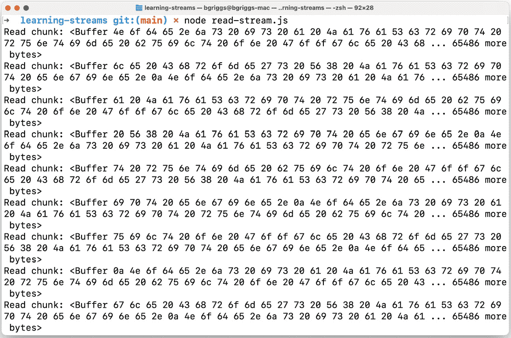
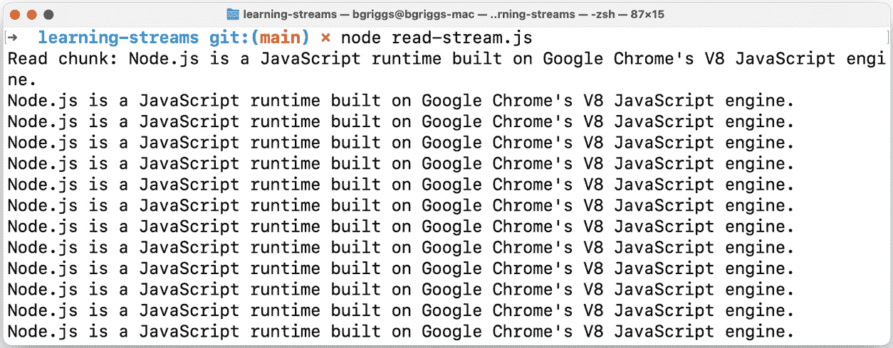
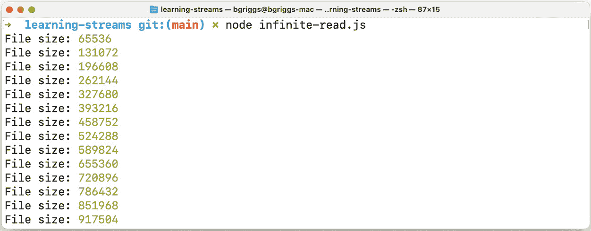
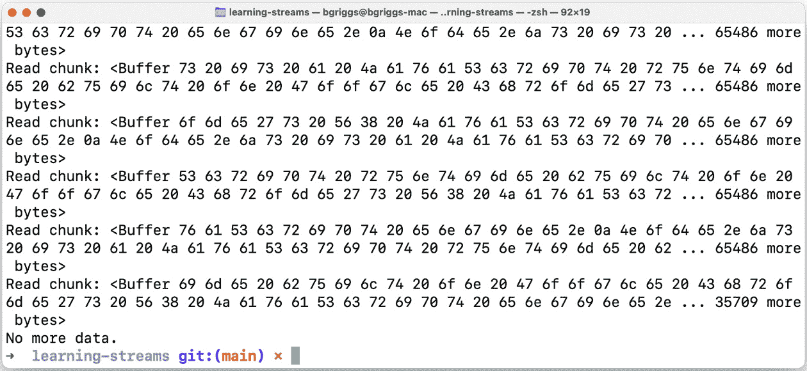

# 处理流

流是 Node.js 的关键特性之一。大多数 Node.js 应用程序都依赖于 Node.js 的底层流实现，无论是用于读取/写入文件、处理 HTTP 请求还是其他网络通信。流提供了一种机制，可以顺序地读取输入和写入输出。

通过顺序读取数据块，我们可以处理非常大的文件（或其他数据输入），这些文件通常太大，无法一次性读入内存并整体处理。流对于大数据应用或媒体流服务是基本的，在这些服务中，数据太大，无法一次性消费。

Node.js 中有四种主要的流类型：

+   **可读流**：用于读取数据，例如读取文件或从请求中读取数据。

+   **可写流**：用于写入数据，例如写入文件或将数据发送到响应。

+   **双工流**：用于读取和写入数据，例如 TCP 套接字。

+   **转换流**：一种双工流，它转换数据输入，然后输出转换后的数据。一个常见的例子是压缩流。

本章将演示我们如何创建这些不同类型的流，以及如何将这些类型的流连接起来形成流管道。

本章将涵盖以下食谱：

+   创建可读和可写流

+   与暂停的流交互

+   管道流

+   创建转换流

+   构建流管道

重要提示

本章的食谱将专注于 Node.js 22 中 Node.js 核心**stream**模块提供的流实现。因此，我们将不使用**readable-stream**模块（[`github.com/nodejs/readable-stream`](https://github.com/nodejs/readable-stream)）。**readable-stream**模块旨在通过提供一个可独立安装的模块作为流实现的镜像来减轻 Node.js 版本之间流实现的不一致性。在撰写本文时，**readable-stream**的最新主要版本是版本 4，它与 Node.js 18 的流实现相一致。

# 技术要求

对于本章，您应该已经安装了 Node.js 22，最好是 Node.js 22 的最新版本。您还需要访问终端、编辑器和互联网。

本章的代码示例可在本书的 GitHub 仓库（[`github.com/PacktPublishing/Node.js-Cookbook-Fifth-Edition`](https://github.com/PacktPublishing/Node.js-Cookbook-Fifth-Edition)）的**Chapter03**目录中找到。

# 创建可读和可写流

Node.js 的**stream**核心模块提供了 Node.js 流 API。本食谱将介绍如何在 Node.js 中使用流。它将涵盖如何创建可读流和可写流，以使用 Node.js 核心**fs**模块与文件交互。

## 准备工作

在深入这个食谱之前，我们必须通过创建目录和文件来设置我们的工作区：

1.  首先，让我们创建一个工作目录：

    ```js
    $ mkdir learning-streams
    $ cd learning-streams
    ```

1.  创建以下两个文件：

    ```js
    $ touch write-stream.js
    $ touch read-stream.js
    ```

现在，我们准备好开始这个菜谱了。

## 如何操作…

在这个菜谱中，我们将学习如何创建可读流和可写流。首先，我们将创建一个可写流，以便我们可以写入大文件。然后，我们将使用可读流读取这个大文件：

1.  首先，将 Node.js 核心**文件系统**模块导入到**write-stream.js**中：

    ```js
    const fs = require('node:fs');
    ```

1.  接下来，我们将使用**fs**模块上的**createWriteStream()**方法创建可写流：

    ```js
    const file = fs.createWriteStream('./file.txt');
    ```

1.  在这一点上，我们可以开始向文件写入内容。让我们多次将随机字符串写入文件：

    ```js
    const fs = require('node:fs');
    const file = fs.createWriteStream('./file.txt');
    for (let i = 0; i <= 100000; i++) {
      file.write(
        'Node.js is a JavaScript runtime built on Google
        Chrome\'s V8 JavaScript engine.\n'
      );
    }
    ```

1.  现在，我们可以使用以下命令运行脚本：

    ```js
    $ node write-stream.js
    ```

1.  这将在你的当前目录中创建一个名为**file.txt**的文件。文件大小约为**7.5M**。要检查文件是否存在，请在你的终端中输入以下命令：

    ```js
    $ ls -lh file.txt
    -rw-r--r--  1 bgriggs  staff   7.5M  8 Nov 16:30 file.txt
    ```

1.  接下来，我们将创建一个脚本，该脚本将创建一个可读流来读取文件内容。从导入**fs**核心模块开始**read-stream.js**文件：

    ```js
    const fs = require('node:fs');
    ```

1.  现在，我们可以使用**createReadStream()**方法创建我们的可读流：

    ```js
    const rs = fs.createReadStream('./file.txt');
    ```

1.  接下来，我们可以注册一个**data**事件处理程序，每次读取到数据块时都会执行：

    ```js
    rs.on('data', (data) => {
      console.log('Read chunk:', data);
    });
    ```

1.  我们还将添加一个**end**事件处理程序，当没有更多数据可以从流中消费时，它将被触发：

    ```js
    rs.on('end', () => {
      console.log('No more data.');
    });
    ```

1.  使用以下命令运行程序：

    ```js
    $ node read-stream.js
    ```

    预期将看到以**Buffer**数据形式记录的数据块：



图 3.1 – 流读取的数据块片段

1.  如果我们在**data**事件处理函数中的数据块上调用**toString()**，我们将看到处理过程中输出的**String**内容。将**data**事件处理函数更改为以下内容：

    ```js
    rs.on('data', (data) => {
      console.log('Read chunk:', data.toString());
    });
    ```

1.  使用以下命令重新运行脚本：

    ```js
    $ node read-stream.js
    ```

    预期将看到以下输出：



图 3.2 – 流读取的数据块片段，以字符串形式

通过这种方式，我们使用**createWriteStream()**创建了一个文件，然后使用**createReadStream()**读取了该文件。

## 它是如何工作的…

在这个菜谱中，我们使用**createReadStream()**和**createWriteStream()**核心**fs**方法顺序地写入和读取文件。Node.js 核心**fs**模块依赖于底层的 Node.js **stream**核心模块。通常，Node.js **stream**核心模块不会直接交互。你通常会通过高级 API 与 Node.js **stream**实现交互，例如**fs**模块公开的 API。

重要提示

关于 Node.js 底层流实现和 API 的更多信息，请参阅 Node.js **stream**模块文档，链接为[`nodejs.org/docs/latest-v22.x/api/stream.html`](https://nodejs.org/docs/latest-v22.x/api/stream.html)。

我们通过**fs.createWriteStream()**方法创建了一个可写流，以顺序写入我们的文件内容。**fs.createWriteStream()**方法接受两个参数。第一个是要写入文件的路径，而第二个是一个**options**对象，可以用来向流提供配置。

以下表格详细说明了我们可以通过一个**options**对象传递给**fs.createWriteStream()**方法的配置：

| **Option** | **描述** | **默认值** |
| --- | --- | --- |
| **flags** | 定义**文件系统**标志。 | **w** |
| **encoding** | 文件的编码。 | **utf8** |
| **fd** | **fd**值预期为一个文件描述符。当提供此值时，将忽略**path**参数。 | **null** |
| **mode** | 设置文件权限。 | **0o666** |
| **autoClose** | 当**autoClose**设置为**true**时，文件描述符将自动关闭。当**false**时，需要手动关闭文件描述符。 | **true** |
| **emitClose** | 控制流在销毁后是否发出**close**事件。 | **false** |
| **start** | 可以用作整数，指定开始写入数据的位置。 | **0** |
| **fs** | 用于覆盖**fs**实现。 | **null** |
| **signal** | 用于指定一个**AbortSignal**对象以编程方式取消流的写入。 | **null** |
| **highWaterMark** | 用于指定在应用背压之前可以缓冲的最大字节数。 | **16384** |

表 3.1 – 可以传递给 createWriteStream()方法的配置

重要注意事项

关于**文件系统**标志的更多信息，请参阅[`nodejs.org/api/fs.html#fs_file_system_flags`](https://nodejs.org/api/fs.html#fs_file_system_flags)。

然后，我们创建了一个可读流来顺序读取我们文件的 内容。**createReadStream()**方法是一个可读流的抽象。同样，此方法期望两个参数 - 第一个是读取内容的路径，第二个是一个**options**对象。以下表格详细说明了我们可以通过一个**options**对象传递给**createReadStream()**方法的选项：

| **Option** | **描述** | **默认值** |
| --- | --- | --- |
| **flags** | 定义**文件系统**标志。 | **r** |
| **encoding** | 文件的编码。 | **null** |
| **fd** | **fd**值预期为一个文件描述符。当提供此值时，将忽略**path**参数。 | **null** |
| **mode** | 设置文件权限，但仅在文件创建时。 | **0o666** |
| **autoClose** | 当**autoClose**设置为**true**时，文件描述符将自动关闭。当**false**时，需要手动关闭文件描述符。 | **true** |
| **emitClose** | 控制流在销毁后是否发出**close**事件。 | **false** |
| **start** | 可以用作整数，指定开始读取数据的位置。 | **0** |
| **end** | 可以用作整数，指定停止读取数据的位置。 | **Infinity** |
| **highWaterMark** | 指定在流停止读取输入之前存储在内部缓冲区中的最大字节数。 | 64 KiB |
| **fs** | 用于覆盖**fs**实现。 | **null** |
| **signal** | 用于指定一个**AbortSignal**对象以程序化取消流的读取。 | **null** |

表 3.2 – 可以传递给 createReadStream()方法的配置

在**read-stream.js**中，我们注册了一个**data**事件处理程序，每次我们的可读流读取一块数据时都会执行。我们可以看到随着读取，屏幕上会显示各个数据块的输出：

```js
Read chunk: <Buffer 20 62 75 69 6c 74 20 6f 6e 20 47 6f 6f 67 6c 65 20 43 68 72 6f 6d 65 27 73 20 56 38 20 4a 61 76 61 53 63 72 69 70 74 20 65 6e 67 69 6e 65 2e 0a 4e 6f ... 29149 more bytes>
```

一旦读取了所有文件数据，我们的**end**事件处理程序就会被触发——导致出现**没有更多****数据**的消息。

所有 Node.js 流都是**EventEmitter**类的实例（[`nodejs.org/api/events.html#events_class_eventemitter`](https://nodejs.org/api/events.html#events_class_eventemitter)）。流会发出一系列不同的事件。

以下事件在可读流上发出：

+   **close**：当流及其任何资源被关闭时发出。不会发出更多事件。

+   **data**：当从流中读取新数据时发出。

+   **end**：当所有可用数据都被读取时发出。

+   **error**：当可读流遇到错误时发出。

+   **pause**：当可读流被暂停时发出。

+   **readable**：当有可读数据时发出。

+   **resume**：当可读流在暂停状态下恢复时发出。

以下事件在可写流上发出：

+   **close**：当流及其任何资源被关闭时发出。不会发出更多事件。

+   **drain**：当可写流可以恢复写入数据时发出。

+   **error**：当可写流遇到错误时发出。

+   **finish**：当可写流结束，所有写入都已完成后发出。

+   **pipe**：当在可读流上调用**stream.pipe()**方法时发出。

+   **unpipe**：当在可读流上调用**stream.unpipe()**方法时发出。

## 更多内容...

让我们更深入地了解可读流，包括如何从无限数据源读取。我们还将学习如何使用更现代的异步迭代语法与可读流一起使用。

### 与无限数据交互

流使得与无限量的数据交互成为可能。让我们编写一个脚本，该脚本将按顺序、无限地处理数据：

1.  在**learning-streams**目录下，创建一个名为**infinite-read.js**的文件：

    ```js
    $ touch infinite-read.js
    ```

1.  我们需要一个无限的数据源。我们将使用**/dev/urandom**文件，该文件可在类 Unix 操作系统上使用。这是一个伪随机数生成器。将以下内容添加到**infinite-read.js**以计算**/dev/urandom**的持续大小：

    ```js
    const fs = require('node:fs');
    const rs = fs.createReadStream('/dev/urandom');
    let size = 0;
    rs.on('data', (data) => {
      size += data.length;
      console.log('File size:', size);
    });
    ```

1.  使用以下命令运行脚本：

    ```js
    $ node infinite-read.js
    ```

    预期将看到类似以下输出，显示**/dev/urandom**文件不断增长的大小：



图 3.3 – 显示/dev/urandom 文件不断增长大小的输出

此示例演示了我们可以如何使用流来处理无限量的数据。

### 带有异步迭代器的可读流

可读流是**异步可迭代对象**。这意味着我们可以使用**for await...of**语法来遍历流数据。在以下步骤中，我们将使用**for** **await...of**语法实现与主要食谱相同的功能：

1.  创建一个名为**for-await-read-stream.js**的文件：

    ```js
    $ touch for-await-read-stream.js
    ```

1.  要使用异步迭代器实现此食谱中的**read-stream.js**逻辑，请使用以下代码：

    ```js
    const fs = require('node:fs');
    const rs = fs.createReadStream('./file.txt');
    async function run () {
      for await (const chunk of rs) {
        console.log('Read chunk:', chunk.toString());
      }
      console.log('No more data.');
    }
    run();
    ```

1.  使用以下命令运行文件：

    ```js
    $ node for-await-read-stream.js
    ```

有关**for await...of**语法的更多信息，请参阅 MDN 网络文档（[`developer.mozilla.org/en-US/docs/Web/JavaScript/Reference/Statements/for-await...of`](https://developer.mozilla.org/en-US/docs/Web/JavaScript/Reference/Statements/for-await...of)）。

重要提示

通常，开发者应选择使用 Node.js 流 API 样式之一，因为使用**on('data')**、**on('readable')**、**pipe()**和/或异步迭代器的组合可能会导致行为不明确。

### 使用 Readable.from()生成可读流

**Readable.from()**方法由 Node.js 核心**stream**模块公开。此方法用于使用迭代器构建可读流。让我们更详细地看看：

1.  创建一个名为**async-generator.js**的文件：

    ```js
    $ touch async-generator.js
    ```

1.  从**stream**模块导入**Readable**类：

    ```js
    const { Readable } = require('node:stream');
    ```

1.  定义异步生成器函数。这将形成我们的可读流内容：

    ```js
    async function * generate () {
      yield 'Node.js';
      yield 'is';
      yield 'a';
      yield 'JavaScript';
      yield 'Runtime';
    }
    ```

    注意使用**函数**语法。这种语法定义了一个生成器函数。有关生成器语法的更多详细信息，请参阅 MDN 网络文档（[`developer.mozilla.org/en-US/docs/Web/JavaScript/Reference/Statements/function*`](https://developer.mozilla.org/en-US/docs/Web/JavaScript/Reference/Statements/function*)）。

1.  使用**Readable.from()**方法创建可读流，将**generate()**函数作为参数传递：

    ```js
    const readable = Readable.from(generate());
    ```

1.  要输出我们的可读流内容，注册一个**data**事件处理程序，打印块：

    ```js
    readable.on('data', (chunk) => {
      console.log(chunk);
    });
    ```

1.  在您的终端中输入以下命令来运行程序：

    ```js
    $ node async-generator.js
    ```

    预期将看到以下生成的值作为输出：

    ```js
    Node.js
    is
    a
    JavaScript
    Runtime
    ```

## 参见

+   *第二章*

+   本章的**与暂停流交互**食谱

+   本章的**管道流**食谱

+   本章的**创建转换流**食谱

+   本章的 *构建流管道* 菜单

# 与暂停流交互

Node.js 流可以是流动模式或暂停模式。在流动模式下，数据块会自动读取，而在暂停模式下，必须调用 **stream.read()** 方法来读取数据块。

在这个菜谱中，我们将学习如何与处于暂停模式的可读流交互，这是它在创建时的默认模式。

## 准备工作

在上一个菜谱中创建的 **learning-streams** 目录中，创建以下文件：

```js
$ touch paused-stream.js
```

现在我们已经准备好开始这个菜谱了。

## 如何做到这一点…

在这个菜谱中，我们将学习如何与处于暂停模式的可读流交互：

1.  首先，将 **fs** 模块导入到 **paused-stream.js** 中：

    ```js
    const fs = require('node:fs');
    ```

1.  接下来，使用 **createReadStream()** 方法创建一个可读流来读取 **file.txt** 文件：

    ```js
    const rs = fs.createReadStream('./file.txt');
    ```

1.  接下来，我们需要在可读流上注册一个 **readable** 事件处理程序：

    ```js
    rs.on('readable', () => {
      // Read data
    });
    ```

1.  现在，我们可以在 **readable** 事件处理程序中添加手动逻辑来读取数据块，直到没有更多数据可以消费：

    ```js
      // Read data
      let data = rs.read();
      while (data !== null) {
        console.log('Read chunk:', data.toString());
        data = rs.read();
      }
    ```

1.  现在，我们可以为我们的可读流注册一个 **end** 事件处理程序，当所有数据都被读取后，它会打印一条消息，指出 **没有更多数据**。

    ```js
    rs.on('end', () => {
      console.log('No more data.');
    });
    ```

1.  使用以下命令运行脚本：

    ```js
    $ node paused-stream.js
    ```

    预期看到以下输出，表明可读流的块正在被读取：



图 3.4 – 读取过程中的可读流块概述

有了这些，我们已经学会了如何在暂停模式下与可读流交互。我们通过监听可读事件并手动调用 **read()** 方法来做到这一点。

## 它是如何工作的…

在这个菜谱中，我们学习了如何与处于暂停模式的可读流交互。

默认情况下，可读流处于暂停模式。然而，在以下情况下，可读流会切换到流动模式：

+   当注册 **data** 事件处理程序时

+   当调用 **pipe()** 方法时

+   当调用 **resume()** 方法时

由于我们在这个菜谱中的程序没有做任何这些操作，所以我们的流保持在暂停模式。

如果一个可读流处于流动模式，在以下情况下它会切换回暂停模式：

+   当调用 **pause()** 方法且没有管道目标时

+   当在所有管道目标上调用 **unpipe()** 方法时

我们向我们的可读流添加了一个 **readable** 事件处理程序。如果可读流已经处于流动模式，注册一个可读事件处理程序将停止流（它切换到暂停模式）。

当可读流处于暂停模式时，必须手动调用**readableStream.read()**方法来消费流数据。在这个配方中，我们在**readable**事件处理器中添加了逻辑，继续读取流数据，直到数据值为**null**。数据值为**null**表示流已结束（所有当前可用的数据都已读取）。**readable**事件可以多次触发，表示有更多数据可用。

当流处于暂停模式时，我们可以更好地控制数据读取的时间。本质上，我们是从流中提取数据，而不是自动推送。

重要提示

通常情况下，如果可能的话，使用**pipe()**方法来处理可读流的消费数据是有价值的，因为内存管理是自动处理的。以下配方，*管道流*，将更详细地介绍**pipe()**方法。

## 参见

+   *第二章*

+   本章的*创建可读和可写流*配方

+   本章的*管道流*配方

+   本章的*创建转换流*配方

+   本章的*构建流管道*配方

# 管道流

管道是一种单向重定向形式。在我们的终端（DOS 或类 Unix），我们经常使用管道操作符（**|**）将一个程序的输出作为另一个程序的输入。例如，我们可以输入**$ ls | head -3**将**ls**命令的输出通过管道传递给**head -3**命令，结果返回目录中的前三个文件。

就像我们可以在我们的 shell 中使用管道操作符在程序之间传递输出一样，我们也可以使用 Node.js 的**pipe()**方法在流之间传递数据。

在这个配方中，我们将学习如何使用**pipe()**方法。

## 准备工作

按照以下步骤操作：

1.  创建一个工作目录：

    ```js
    $ mkdir piping-streams
    $ cd piping-streams
    ```

1.  首先创建一个名为**file.txt**的文件：

    ```js
    $ touch file.txt
    ```

1.  向**file.txt**添加一些示例数据，如下所示：

    ```js
    Node.js is a JavaScript runtime built on Google Chrome's V8 JavaScript engine.
    Node.js is a JavaScript runtime built on Google Chrome's V8 JavaScript engine.
    Node.js is a JavaScript runtime built on Google Chrome's V8 JavaScript engine.
    ```

现在，我们已经准备好开始这个配方。

## 如何操作…

在这个配方中，我们将学习如何将可读流通过管道连接到可写流：

1.  创建一个名为**pipe-stream.js**的文件：

    ```js
    $ touch pipe-stream.js
    ```

1.  接下来，通过导入**fs**模块来启动**pipe-stream.js**文件：

    ```js
    const fs = require('node:fs');
    ```

1.  使用**createReadStream()**方法创建一个可读流来读取**file.txt**：

    ```js
    const rs = fs.createReadStream('file.txt');
    ```

1.  现在，我们需要将我们的可读流通过管道连接到**process.stdout**，它返回一个连接到**STDOUT**的可写流：

    ```js
    rs.pipe(process.stdout);
    ```

1.  使用以下命令运行程序：

    ```js
    $ node pipe-stream.js
    ```

    预期看到以下输出：

    ```js
    Node.js is a JavaScript runtime built on Google Chrome's V8 JavaScript engine.
    Node.js is a JavaScript runtime built on Google Chrome's V8 JavaScript engine.
    Node.js is a JavaScript runtime built on Google Chrome's V8 JavaScript engine.
    ```

通过这样，我们已经使用**pipe()**方法将可读流连接到了可写流。

## 工作原理…

在这个食谱中，我们使用**createReadStream()**方法创建了一个可读流来读取我们的**file.txt**文件。然后，我们使用**pipe()**方法将这个可读流的输出导向**process.stdout**（一个可写流）。**pipe()**方法将数据事件处理程序附加到源流上，该处理程序将传入的数据写入目标流。

**pipe()**方法用于将数据通过流流导向。在底层，**pipe()**方法管理数据流，以确保目标可写流不会被更快的可读流淹没。

**pipe()**方法内置的管理有助于解决背压问题。当输入超过系统容量时，就会发生背压。对于流来说，这可能会发生在我们消费一个快速读取数据的流时，而可写流无法跟上。这可能导致在可写流写入之前，在进程中保留大量内存。在内存中存储的大量数据可能会降低 Node.js 进程的性能，或者在最坏的情况下导致进程崩溃。

默认情况下，当使用**pipe()**方法时，当源可读流发出**end**事件时，会在目标可写流上调用**stream.end()**。这意味着目标不再可写。

要禁用此默认行为，我们可以通过**options**参数向**pipe()**方法提供**{ end: false }**：

```js
sourceStream.pipe(destinationStream, {end: false});
```

此配置指示目标流在源流发出**end**事件后仍然保持打开状态。

## 更多内容...

Node.js 中的流链式操作允许通过连接多个流来实现高效的数据处理。这种方法通过最小化内存开销来实现数据转换，这对于压缩等操作来说是非常理想的。在下面的示例中，我们将演示读取文件、压缩其内容并将压缩数据写入新文件的过程，以突出**pipe()**在流链式操作中的使用：

```js
const fs = require('node:fs');
const zlib = require('node:zlib');
const readStream = fs.createReadStream('input.txt');
const writeStream = fs.createWriteStream('output.txt.gz');
// Chain the streams: read -> compress -> write
readStream.pipe(zlib.createGzip()).pipe(writeStream);
```

在此示例中，**readStream.pipe(zlib.createGzip()).pipe(writeStream);**从**input.txt**读取数据，即时压缩，并将压缩数据写入**output.txt.gz**。这一系列操作以高效的方式执行，展示了 Node.js 中流链式操作在数据处理任务中的优雅和强大。

在提供的示例中，没有明确显示错误处理，但在实际应用中这是至关重要的。在 Node.js 中，当链式操作流时，错误可以通过链传播。当使用**pipe()**时，应在每个涉及的流上监听错误，通过为每个流附加一个**error**事件监听器来实现。这确保了错误在发生时被捕获和管理。

## 参见

+   本章的**创建可读和可写流**食谱

+   本章的**创建转换流**食谱

+   本章的**构建流管道**食谱

# 创建转换流

转换流允许我们消费输入数据，处理这些数据，然后以处理后的形式输出数据。我们可以使用转换流以功能性和异步方式处理数据操作。可以将多个转换流串联起来，这样我们就可以将复杂处理分解为一系列任务。

在这个菜谱中，我们将使用 Node.js 核心模块 **stream** 创建一个转换流。

重要提示

**through2** 模块（[`www.npmjs.com/package/through2`](https://www.npmjs.com/package/through2)）非常受欢迎，并为创建 Node.js 转换流提供了一个包装器。然而，在过去的几年中，Node.js 核心流实现已经进行了许多简化和改进。今天，Node.js 流 API 提供了简化的构建方式，如本菜谱所示，这意味着我们可以直接使用 Node.js 核心来达到等效的语法，而不需要 **through2**。

## 准备工作

按照以下步骤操作：

1.  创建一个工作目录：

    ```js
    $ mkdir transform-streams
    $ cd transform-streams
    ```

1.  创建一个名为 **transform-stream.js** 的文件：

    ```js
    $ touch transform-stream.js
    ```

1.  我们还需要一些用于转换的样本数据。因此，创建一个名为 **file.txt** 的文件：

    ```js
    $ touch file.txt
    ```

1.  向 **file.txt** 文件中添加一些示例文本数据，例如以下内容：

    ```js
    Node.js is a JavaScript runtime built on Google Chrome's V8 JavaScript engine.
    Node.js is a JavaScript runtime built on Google Chrome's V8 JavaScript engine.
    Node.js is a JavaScript runtime built on Google Chrome's V8 JavaScript engine.
    ```

现在，我们已经准备好开始这个菜谱。

## 如何操作…

在这个菜谱中，我们将学习如何使用 Node.js 核心模块 **stream** 创建一个转换流。我们将创建的转换流将把文件中的所有文本转换为大写：

1.  首先将 Node.js 核心模块 **文件系统** 导入到 **transform-stream.js** 中：

    ```js
    const fs = require('node:fs');
    ```

1.  接下来，我们需要从 Node.js 核心模块 **stream** 中导入 **Transform** 类：

    ```js
    const { Transform } = require('node:stream');
    ```

1.  创建一个可读流以读取 **file.txt** 文件：

    ```js
    const rs = fs.createReadStream('./file.txt');
    ```

1.  一旦我们的文件内容通过我们的转换流处理，我们将将其写入一个名为 **newFile.txt** 的新文件。使用 **createWriteStream()** 方法创建一个可写流来写入此文件：

    ```js
    const newFile = fs.createWriteStream('./newFile.txt');
    ```

1.  接下来，我们需要定义我们的转换流。我们将命名我们的转换流为 **uppercase()**：

    ```js
    const uppercase = new Transform({
      transform (chunk, encoding, callback) {
        // Data processing
      }
    });
    ```

1.  现在，在我们的转换流中，我们将添加逻辑以将块转换为一个大写字符串。在 **// 数据处理** 注释下方，添加以下行：

    ```js
        callback(null, chunk.toString().toUpperCase());
    ```

    这将调用转换流的回调函数，并传递转换后的块。

1.  到目前为止，我们需要将所有流串联起来。我们将使用 **pipe()** 方法来完成。将以下行添加到文件底部：

    ```js
    rs.pipe(uppercase).pipe(newFile);
    ```

1.  在您的终端中输入以下命令来运行程序：

    ```js
    $ node transform-stream.js
    ```

1.  预期 **newFile.txt** 已由我们的程序创建。您可以通过在终端中运行 **cat** 命令，然后跟上新文件的名称来确认这一点：

    ```js
    $ cat newFile.txt
    NODE.JS IS A JAVASCRIPT RUNTIME BUILT ON GOOGLE CHROME'S V8 JAVASCRIPT ENGINE.
    NODE.JS IS A JAVASCRIPT RUNTIME BUILT ON GOOGLE CHROME'S V8 JAVASCRIPT ENGINE.
    NODE.JS IS A JAVASCRIPT RUNTIME BUILT ON GOOGLE CHROME'S V8 JAVASCRIPT ENGINE.
    ```

    注意，内容现在已为大写，这表明数据已通过转换流。

有了这些，我们已经学会了如何创建转换流来处理数据。我们的转换流将输入数据转换为大写字符串。之后，我们将可读流管道连接到转换流，并将转换流连接到可写流。

## 它是如何工作的...

转换流是双工流，这意味着它们实现了可读和可写流接口。转换流用于处理（或转换）输入，然后将其作为输出传递。

要创建转换流，我们必须从 Node.js 核心模块 **stream** 中导入 **Transform** 类。转换流构造函数接受以下两个参数：

+   **transform**：实现数据处理/转换逻辑的函数。

+   **flush**：如果转换过程产生额外的数据，将使用 **flush** 方法来刷新数据。此参数是可选的。

是 **transform()** 函数处理流输入并产生输出。请注意，通过输入流提供的块的数量不必要等于转换流输出的数量——在转换/处理过程中可能会省略一些块。

在底层，**transform()** 函数被附加到转换流的 **_transform()** 方法上。**_transform()** 方法是 **Transform** 类的一个内部方法，不打算直接调用（因此有下划线前缀）。

**_transform()** 方法接受以下三个参数：

+   **chunk**：要转换的数据。

+   **编码**：如果输入是 **String** 类型，编码将是 **String** 类型。如果是 **Buffer** 类型，此值设置为 **buffer**。

+   **callback(err, transformedChunk)**：一旦块被处理，就要调用的回调函数。期望回调函数有两个参数——第一个是错误，第二个是转换后的块。

在这个菜谱中，我们的 **transform()** 函数使用处理后的数据调用了 **callback()** 函数（我们的处理数据是 **chunk.toString().toUpperCase()**，将输入转换为一个大写字符串）。

重要提示

Node.js 内置了一些转换流。Node.js 核心模块 **crypto** 和 **zlib** 都公开了转换流。例如，**zlib.createGzip()** 方法是 **zlib** 模块公开的转换流，它压缩了被管道传输到它的文件。

## 更多内容...

在本节中，我们将学习如何使用 ECMAScript 6（**ES6**）语法创建转换流，以及我们如何创建一个对象模式的转换流。

### 采用 ES6 语法

在这个菜谱中，我们使用简化的构造函数方法实现了转换流。也可以使用 ES6 类语法来实现这些。以下步骤将演示这一点：

1.  创建一个名为 **transform-stream-es6.js** 的文件：

    ```js
    $ touch transform-stream-es6.js
    ```

1.  从这个菜谱中转换流可以如下实现：

    ```js
    const fs = require('node:fs');
    const { Transform } = require('node:stream');
    const rs = fs.createReadStream('./file.txt');
    const newFile = fs.createWriteStream('./newFile.txt');
    class Uppercase extends Transform {
      _transform (chunk, encoding, callback) {
        this.push(chunk.toString().toUpperCase());
        callback();
      }
    }
    rs.pipe(new Uppercase()).pipe(newFile);
    ```

    通过这段代码，我们可以更清晰地看到我们正在用我们的转换逻辑覆盖 **_transform()** 方法。

这个例子使用 ES6 语法创建了一个自定义的转换流，该流从 **file.txt** 读取内容，将其转换为大写，并写入到 **newFile.txt** 中。**Uppercase** 类扩展了 **Transform** 类，并覆盖了 **_transform** 方法来处理数据块，在将它们推送到写入流之前，使用 **chunk.toString().toUpperCase()** 将它们转换为大写。回调函数 **callback()** 被调用以指示当前数据块的处理的完成，允许流处理下一个数据块并保持数据流的规律性。

### 创建对象模式转换流

默认情况下，Node.js 流操作 **String**、**Buffer** 或 **Uint8Array** 对象。然而，也可以使用 Node.js 流在 **对象模式** 下工作。这允许我们使用其他 JavaScript 值（除了 **null** 值）。在对象模式下，从流中返回的值是通用的 JavaScript 对象。对象模式流的一个用例是实现一个查询数据库以获取大量用户记录的应用程序，然后逐个处理每个用户记录。

与对象模式的主要区别在于，**highWaterMark** 的值指的是对象的数目，而不是字节数。在之前的菜谱中，我们了解到 **highWaterMark** 的值决定了在流停止读取输入之前内部缓冲区中存储的最大字节数。对于对象模式流，此值设置为 **16** – 意味着一次缓冲 16 个对象。

要设置对象模式的流，我们必须通过 **options** 对象传递 **{ objectMode: true }**。

让我们演示如何创建一个对象模式的转换流：

1.  让我们创建一个名为 **object-streams** 的文件夹，包含一个名为 **object-stream.js** 的文件，并使用 **npm** 初始化项目：

    ```js
    $ mkdir object-streams
    $ cd object-streams
    $ npm init --yes
    $ touch object-stream.js
    ```

1.  安装 **ndjson** 模块：

    ```js
    $ npm install ndjson
    ```

1.  在 **object-stream.js** 中，从 Node.js 核心模块 **stream** 中导入 **Transform** 类：

    ```js
    const { Transform } = require('node:stream');
    ```

1.  接下来，从 **ndjson** 模块导入 **stringify()** 方法：

    ```js
    const { stringify } = require('ndjson');
    ```

1.  创建转换流，指定 **{ objectMode: true }** :

    ```js
    const Name = Transform({
      objectMode: true,
      transform: ({ forename, surname }, encoding,
        callback) => {
          callback(null, { name: forename + ' ' + surname
        });
      }
    });
    ```

1.  现在，我们可以创建我们的流链。我们将把 **Name** 转换流连接到 **stringify()** 方法（来自 **ndjson**），然后将结果连接到 **process.stdout** :

    ```js
    Name.pipe(stringify()).pipe(process.stdout);
    ```

1.  最后，仍然在 **object-stream.js** 中，我们将使用 **write()** 方法向 **Name** 转换流写入一些数据：

    ```js
    Name.write({ forename: 'John', surname: 'Doe' });
    Name.write({ forename: 'Jane', surname: 'Doe' });
    ```

1.  使用以下命令运行程序：

    ```js
    $ node object-stream.js
    ```

    这将输出以下内容：

    ```js
    {"name":"John Doe"}
    {"name":"Jane Doe"}
    ```

在这个例子中，我们创建了一个名为 **Name** 的转换流，它聚合了两个 JSON 属性（**forename** 和 **surname**）的值，并返回一个新的属性（**name**）带有聚合值。**Name** 转换流处于对象模式，并且既读取又写入对象。

我们将 **Name** 转换流连接到由 **ndjson** 模块提供的 **stringify()** 函数。**stringify()** 函数将流式 JSON 对象转换为换行符分隔的 JSON。**stringify()** 流是一个转换流，其中可写部分处于对象模式，但可读部分不是。

使用转换流（和双工流），你可以通过提供以下配置选项来独立指定流的可读或可写部分是否处于对象模式：

+   **readableObjectMode** : 当 **true** 时，双工流的可读部分处于对象模式

+   **writableObjectMode** : 当 **true** 时，双工流的可写部分处于对象模式

注意，也可以使用以下配置选项为双工流的可读或可写部分设置不同的 **highWaterMark** 值：

+   **readableHighWaterMark** : 为流的可读部分配置 **highWaterMark** 值

+   **writableHighWaterMark** : 为流的可写部分配置 **highWaterMark** 值

如果提供了 **highWaterMark** 值，则 **readableHighWaterMark** 和 **writableHighWaterMark** 配置值将没有效果，因为 **highWaterMark** 值具有优先级。

### 使用 map 和 filter 函数

Node.js 的较新版本（晚于 16.4.0 版本）为可读流提供了 **实验性** 的类似数组方法。这些方法可以像数组方法一样使用 - 例如，**Readable.map()** 和 **Readable.filter()** 方法提供了类似于 **Array.prototype.map()** 和 **Array.prototype.filter()** 的功能。

可以使用 **map()** 方法对流进行映射。对于流中的每个块，都会调用指定的函数。在本菜谱中创建的 **transform stream** 可以使用 **map()** 方法重写如下：

```js
const fs = require('node:fs');
const rs = fs.createReadStream('./file.txt');
const newFile = fs.createWriteStream('./newFile.txt');
rs.map((chunk) =>
  chunk.toString().toUpperCase()).pipe(newFile);
```

可以使用 **Readable.filter()** 方法来过滤可读流：

```js
const { Readable } = require('node:stream');
async function* generate() {
    yield 'Java';
    yield 'JavaScript';
    yield 'Rust';
}
// Filter the stream for words with 5 or more characters
Readable.from(generate()).filter((word) => word.length >=
  5).pipe(process.stdout);
```

这些是最近添加的两个函数，它们在可读流上提供了类似数组的方法。现在流上可用的类似数组方法还有很多：

+   **.** **drop()**

+   **.** **every()**

+   **.** **filter()**

+   **.** **find()**

+   **.** **flatMap()**

+   **.** **forEach()**

+   **.** **map()**

+   **.** **reduce()**

+   **.** **some()**

+   **.** **take()**

+   **.** **toArray()**

更多信息，包括这些方法的用法和参数，可以在 Node.js 流 API 文档中找到：[`nodejs.org/docs/latest-v22.x/api/stream.html`](https://nodejs.org/docs/latest-v22.x/api/stream.html) .

重要提示

在撰写本文时，类似数组的流方法被指定为 **实验性** 状态。

## 相关内容

+   本章的 *创建可读和可写流* 菜单

+   本章的 *管道流* 菜单

+   本章的 *构建流管道* 菜单

# 构建流管道

Node.js 核心**stream**模块提供了一个**pipeline()**方法。类似于我们可以使用 Node.js 核心流**pipe()**方法将一个流连接到另一个流，我们也可以使用**pipeline()**方法将多个流连接在一起。

与**pipe()**方法不同，**pipeline()**方法还转发错误，这使得处理流中的错误变得更加容易。

这个配方基于本章其他配方中涵盖的许多流概念。在这里，我们将使用**pipeline()**方法创建一个流管道。

## 准备工作

在深入这个配方之前，让我们通过创建目录和文件来设置我们的工作区：

1.  首先，创建一个名为**stream-pipelines**的工作目录：

    ```js
    $ mkdir stream-pipelines
    $ cd stream-pipelines
    ```

1.  创建一个名为**pipeline.js**的文件：

    ```js
    $ touch pipeline.js
    ```

1.  我们还需要一些样本数据来转换。创建一个名为**file.txt**的文件：

    ```js
    $ touch file.txt
    ```

1.  将一些虚拟文本数据添加到**file.txt**文件中：

    ```js
    Node.js is a JavaScript runtime built on Google Chrome's V8 JavaScript engine.
    Node.js is a JavaScript runtime built on Google Chrome's V8 JavaScript engine.
    Node.js is a JavaScript runtime built on Google Chrome's V8 JavaScript engine.
    ```

现在，我们已经准备好开始这个配方。

## 如何操作…

在这个配方中，我们将使用**pipeline()**方法创建一个流管道。我们的管道将读取**file.txt**文件，使用转换流将文件内容转换为大写，然后将新内容写入新文件：

1.  首先，将 Node.js 核心**fs**模块导入到**pipeline.js**中：

    ```js
    const fs = require('node:fs');
    ```

1.  接下来，我们需要从 Node.js 核心**stream**模块导入**pipeline()**方法和**Transform**类：

    ```js
    const { pipeline, Transform } = require('node:stream');
    ```

1.  接下来，我们将创建我们的转换流（有关转换流的更多信息，请参阅本章中的*创建转换流*配方）。这将把输入转换为大写字符串：

    ```js
    const uppercase = new Transform({
      transform (chunk, encoding, callback) {
        // Data processing
        callback(null, chunk.toString().toUpperCase());
      }
    });
    ```

1.  现在，我们可以开始创建流管道。首先，让我们调用**pipeline()**方法：

    ```js
    pipeline();
    ```

1.  **pipeline()**方法期望第一个参数是一个可读流。我们的第一个参数将是一个可读流，它将使用**createReadStream()**方法读取**file.txt**文件：

    ```js
    pipeline(
      fs.createReadStream('./file.txt')
    );
    ```

1.  接下来，我们需要将我们的转换流作为**pipeline()**方法的第二个参数添加：

    ```js
    pipeline(
      fs.createReadStream('./file.txt'),
      uppercase,
    );
    ```

1.  然后，我们可以将我们的可写流添加到管道中，以将**newFile.txt**文件写入管道：

    ```js
    pipeline(
      fs.createReadStream('./file.txt'),
      uppercase,
      fs.createWriteStream('./newFile.txt'),
    );
    ```

1.  最后，管道的最后一个参数是一个回调函数，该函数将在管道运行完成后执行。此回调函数将处理管道中的任何错误：

    ```js
    pipeline(
      fs.createReadStream('./file.txt'),
      uppercase,
      fs.createWriteStream('./newFile.txt'),
      (err) => {
        if (err) {
          console.error('Pipeline failed.', err);
        } else {
          console.log('Pipeline succeeded.');
        }
      }
    );
    ```

1.  在您的终端中，使用以下命令运行程序。您应该会看到一个消息表明**管道成功**：

    ```js
    $ node pipeline.js
    Pipeline succeeded.
    ```

1.  为了确认流管道成功，请验证**newFile.txt**文件是否包含**file.txt**的内容，但为 uppercase：

    ```js
    $ cat newFile.txt
    NODE.JS IS A JAVASCRIPT RUNTIME BUILT ON GOOGLE CHROME'S V8 JAVASCRIPT ENGINE.
    NODE.JS IS A JAVASCRIPT RUNTIME BUILT ON GOOGLE CHROME'S V8 JAVASCRIPT ENGINE.
    NODE.JS IS A JAVASCRIPT RUNTIME BUILT ON GOOGLE CHROME'S V8 JAVASCRIPT ENGINE.
    ```

通过这种方式，我们已经使用 Node.js 核心**stream**模块公开的**pipeline()**方法创建了一个流管道。

## 它是如何工作的…

**pipeline()**方法允许我们将流连接到一起——形成一个流流。

我们可以向流的**pipeline()**方法传递以下参数：

+   **source**：一个数据源流，从中读取数据

+   **...转换**：可以处理数据（包括**0**）的任意数量的转换流

+   **目的地**：一个目标流，用于写入处理后的数据

+   **回调**：当管道完成时调用的函数

我们将 **pipeline()** 方法传递给一系列流，按照它们需要运行的顺序，然后使用一个回调函数，该函数在管道完成时执行。

**pipeline()** 方法优雅地将流中发生的错误转发到回调。这是使用 **pipeline()** 方法而不是 **pipe()** 方法的优点之一。

**pipeline()** 方法还会通过调用 **stream.destroy()** 清理任何未终止的流。

## 还有更多...

在 Node.js 15 及更高版本中，有一套用于流的异步实用函数，这些函数使用 **Promise** 对象而不是回调。这些函数可以在 **stream/promises** 核心模块中找到。此模块包括与 Promises 兼容的 **stream.pipeline()** 和 **stream.finished()** 版本，提供了一种更现代、更符合 Promise 的流处理方法。

让我们将主菜谱中的流管道转换为使用 **Promise** 版本的 **stream.pipeline()**：

1.  创建一个名为 **promise-pipeline.js** 的文件：

    ```js
    $ touch promise-pipeline.js
    ```

1.  将以下内容添加到导入 Node.js 核心模块 **fs** 和 **stream/promises**：

    ```js
    const fs = require('node:fs');
    const { Transform } = require('node:stream');
    const { pipeline } = require('node:stream/promises');
    ```

1.  添加转换流：

    ```js
    const uppercase = new Transform({
      transform(chunk, encoding, callback) {
        // Data processing
        callback(null, chunk.toString().toUpperCase());
      },
    });
    ```

1.  由于我们将等待 **pipeline()**，我们需要将 **pipeline()** 逻辑包裹在一个异步函数中：

    ```js
    async function run() {
      await pipeline(
        fs.createReadStream('./file.txt'),
        uppercase,
        fs.createWriteStream('./newFile.txt')
      );
      console.log('Pipeline succeeded.');
    }
    ```

1.  最后，我们可以调用我们的 **run()** 函数，捕获任何错误：

    ```js
    run().catch((err) => {
      console.error('Pipeline failed.', err);
    });
    ```

1.  使用以下命令运行程序：

    ```js
    $ node promise-pipeline.js
    Pipeline Succeeded.
    ```

通过这样，我们展示了如何使用 Streams Promises API 通过 **pipeline()** 方法与 Promises 一起使用流。

重要提示

以前，**pipeline()** 方法可能通过使用 **util.promisify()** 实用方法转换为 **Promise** 形式。**util.promisify()** 方法用于将回调风格的函数转换为 **Promise** 形式。Streams Promises API 取代了使用此方法的需求。

## 参见

+   本章的 *创建可读和可写流* 菜谱

+   本章的 *管道流* 菜谱

+   本章的 *创建转换流* 菜谱
