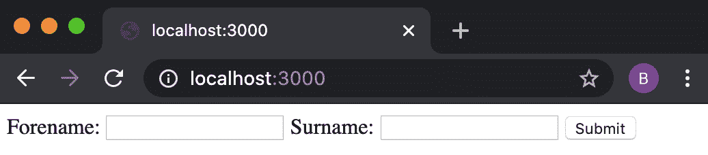

# 4

# 使用 Web 协议

Node.js 是以构建 Web 服务器为目标的。使用 Node.js，我们可以用几行代码快速创建一个 Web 服务器，这使我们能够自定义服务器的行为。

**HTTP** 代表 **超文本传输协议**，是一种支撑 **万维网**（**WWW**）的应用层协议。HTTP 是一种无状态协议，最初设计用于促进浏览器和服务器之间的通信。本章的食谱将重点介绍如何处理和发送 HTTP 请求。尽管这些食谱不需要深入了解 HTTP 的工作原理，但如果您对这一概念完全陌生，阅读一个高级概述将是有益的。*MDN Web 文档* 提供了 HTTP 的概述，请参阅 [`developer.mozilla.org/en-US/docs/Web/HTTP/Overview`](https://developer.mozilla.org/en-US/docs/Web/HTTP/Overview)。

本章将展示 Node.js 为与 Web 协议交互提供的低级核心 **应用程序编程接口**（**APIs**）。我们将从发送 HTTP 请求、创建 HTTP 服务器以及学习如何处理 **POST** 请求和文件上传开始。本章后面，我们将学习如何使用 Node.js 创建 WebSocket 服务器以及如何创建 **简单邮件传输协议**（**SMTP**）服务器。

理解 Node.js 如何与底层 Web 协议交互非常重要，因为这些 Web 协议和基本概念构成了大多数实际 Web 应用程序的基础。稍后，在 *第六章* 中，我们将学习如何使用将 Web 协议抽象为高级 API 的 Web 框架，但理解 Node.js 在低级别如何与 Web 协议交互同样重要。

本章将涵盖以下食谱：

+   发送 HTTP 请求

+   创建 HTTP 服务器

+   接收 HTTP **POST** 请求

+   处理文件上传

+   创建 WebSocket 服务器

+   创建 SMTP 服务器

# 技术要求

本章要求您安装 Node.js – 最好是 Node.js 22 的最新版本。此外，您还需要访问您选择的编辑器和浏览器。本章使用的代码示例可在 GitHub 上的 [`github.com/PacktPublishing/Node.js-Cookbook-Fifth-Edition`](https://github.com/PacktPublishing/Node.js-Cookbook-Fifth-Edition) 的 **Chapter04** 目录中找到。

# 发送 HTTP 请求

程序和应用程序通常需要从其他来源或服务器获取数据。在现代 Web 开发中，这通常是通过向来源或服务器发送 HTTP **GET** 请求来实现的。同样，应用程序或程序可能还需要将数据发送到其他来源或服务器。这通常是通过向目标来源或服务器发送包含数据的 HTTP **POST** 请求来实现的。

除了用于构建 HTTP 服务器外，Node.js 的核心 **http** 和 **https** 模块还公开了可以用于向其他服务器发送 HTTP 请求的 API。

在这个菜谱中，我们将使用 Node.js 核心模块 **http** 和 **https** 来发送 HTTP **GET** 请求和 HTTP **POST** 请求。

## 准备工作

首先，为这个菜谱创建一个名为 **making-requests** 的目录。我们还将创建一个名为 **requests.js** 的文件：

```js
$ mkdir making-requests
$ cd making-requests
$ touch requests.js
```

## 如何做到这一点…

我们将使用 Node.js 核心模块 **http** 来发送 HTTP **GET** 请求和 HTTP **POST** 请求。

1.  首先，在您的 **requests.js** 文件中导入 **http** 模块：

    ```js
    const http = require('node:http');
    ```

1.  现在，我们可以发送一个 HTTP **GET** 请求。我们将向 [`example.com`](http://example.com) 发送请求。这可以用一行代码完成：

    ```js
    http.get('http://example.com', (res) =>
      res.pipe(process.stdout));
    ```

1.  使用以下命令执行您的 Node.js 脚本。您应该会看到 [`example.com`](http://example.com) 的 HTML 表示形式打印到 **stdout**：

    ```js
    $ node requests.js
    ```

1.  现在，我们可以看看我们是如何发送 HTTP **POST** 请求的。首先，用 **//** 注释掉 HTTP **GET** 请求——保留它会使后续步骤的输出难以阅读：

    ```js
    // http.get('http://example.com', (res) =>
      res.pipe(process.stdout));
    ```

1.  对于我们的 HTTP **POST** 请求，我们首先需要定义我们要与请求一起发送的数据。为了实现这一点，我们定义一个名为 **payload** 的变量，它包含我们数据的 **JavaScript 对象表示法** ( **JSON** ) 表示：

    ```js
    const payload = JSON.stringify({
        'name': 'Laddie',
        'breed': 'Rough Collie'
    });
    ```

1.  我们还需要为我们要与 HTTP **POST** 请求一起发送的选项创建一个配置对象。我们将向 [`postman-echo.com`](http://postman-echo.com) 发送 HTTP **POST** 请求。这是一个测试端点，它将返回我们的 HTTP 头部、参数和 HTTP **POST** 请求的内容——镜像我们的请求：

    ```js
    const opts = {
      method: 'POST',
      hostname: 'postman-echo.com',
      path: '/post',
      headers: {
        'Content-Type': 'application/json',
        'Content-Length': Buffer.byteLength(payload)
      }
    };
    ```

重要提示

Postman ([`postman.com`](http://postman.com) ) 是一个用于 API 开发的平台，并提供了一个可以下载使用的 **表示状态转换** ( **REST** ) 客户端应用程序，用于发送 HTTP 请求。Postman 还提供了一个名为 Postman Echo 的服务——这提供了一个端点，您可以将其用于测试发送的 HTTP 请求。有关 Postman Echo 文档，请参阅此处：[`docs.postman-echo.com/?version=latest`](https://docs.postman-echo.com/?version=latest) 。

1.  要发送 HTTP **POST** 请求，请添加以下代码。这将把 HTTP 状态码和请求体的响应写入 **stdout**，一旦收到响应：

    ```js
    const req = http.request(opts, (res) => {
      process.stdout.write('Status Code: ' +
        res.statusCode + '\n');
      process.stdout.write('Body: ');
      res.pipe(process.stdout);
    });
    ```

1.  我们还应该捕获请求过程中发生的任何错误：

    ```js
    req.on('error', (err) => console.error('Error: ',
      err));
    ```

1.  最后，我们需要携带负载发送我们的请求：

    ```js
    req.end(payload);
    ```

1.  现在，执行您的程序，您应该会看到 Postman Echo API 对我们的 HTTP **POST** 请求做出响应：

    ```js
    $ node requests.js
    Status Code: 200
    Body: {
      "args": {},
      "data": {
        "name": "Laddie",
        "breed": "Rough Collie"
      },
      "files": {},
      "form": {},
      "headers": {
        "x-forwarded-proto": "http",
        "x-forwarded-port": "80",
        "host": "postman-echo.com",
        "x-amzn-trace-id": "Root=1-656ddcfe-
          52b1cf7a1671685c6985fa59",
        "content-length": "53",
        "content-type": "application/json"
      },
      "json": {
        "name": "Laddie",
        "breed": "Rough Collie"
      },
      "url": "http://postman-echo.com/post"
    }%
    ```

我们已经学习了如何使用 Node.js 核心模块 **http** 来发送 HTTP **GET** 和 HTTP **POST** 请求。

## 它是如何工作的…

在这个菜谱中，我们利用了 Node.js 核心模块 **http** 来发送 HTTP **GET** 和 HTTP **POST** 请求。Node.js 核心模块 **http** 依赖于底层的 Node.js 核心模块 **net**。

对于 HTTP **GET** 请求，我们使用两个参数调用 **http.get()** 函数。第一个参数是我们希望发送请求的端点，第二个参数是回调函数。回调函数在 HTTP **GET** 请求完成后执行，在这个菜谱中，我们的函数将我们从端点收到的响应转发到 **stdout**。

要发送 HTTP **POST** 请求，我们使用 **http.request()** 函数。此函数也接受两个参数。

**request()** 函数的第一个参数是 **options** 对象。在菜谱中，我们使用 **options** 对象来配置要使用的 HTTP 方法、主机名、请求应发送到的路径以及请求上要设置的标头。可以在 Node.js HTTP API 文档中查看可以传递给 **request()** 函数的完整配置选项列表（[`nodejs.org/api/http.html#http_http_request_options_callback`](https://nodejs.org/api/http.html#http_http_request_options_callback)）。

**request()** 函数的第二个参数是在 HTTP **POST** 请求完成后要执行的回调函数。我们的请求函数会写入 HTTP 状态码，并将请求的响应转发到 **标准输出**（**stdout**）。

在请求对象上添加了一个错误事件监听器来捕获和记录任何错误到 **stdout**：

```js
req.on('error', (err) => console.error('Error: ', err));
```

**req.end(payload);** 语句发送我们的请求并附带有效负载。

还可以将此 API 与 **Promise** 语法结合使用。将以下内容添加到名为 **requestPromise.js** 的文件中：

```js
const http = require('node:http');
function httpGet (url) {
  return new Promise((resolve, reject) => {
    http
      .get(url, (res) => {
        let data = '';
        res.on('data', (chunk) => {
          data += chunk;
        });
        res.on('end', () => {
          resolve(data);
        });
      })
      .on('error', (err) => {
        reject(err);
      });
  });
}
const run = async () => {
  const res = await httpGet('http://example.com');
  console.log(res);
};
run();
```

**httpGet()** 函数使用 **Promise** 来管理异步 HTTP **GET** 请求：在成功完成时解析为完整数据，如果请求失败则拒绝并返回错误。这种设置使得与 **async** / **await** 集成处理异步 HTTP 操作变得简单。

## 更多内容...

菜谱展示了如何通过 HTTP 发送 **GET** 和 **POST** 请求，但考虑如何通过 HTTPS 发送请求也同样值得。**HTTPS** 代表 **HyperText Transfer Protocol Secure**。HTTPS 是 HTTP 协议的扩展。通过 HTTPS 的通信是加密的。Node.js 核心提供了 **https** 模块，与 **http** 模块一起使用，用于处理 HTTPS 通信。

有可能将菜谱中的请求更改为使用 HTTPS，通过导入 **https** 核心模块并将任何 **http** 实例更改为 **https** 来实现。你还需要将请求发送到 HTTPS 端点：

```js
const https = require('node:https');
https.get('https://example.com', ...);
https.request('https://example.com', ...);
```

在使用传统的 HTTP 和 HTTPS 模块进行请求的基础知识之后，让我们转向探索如何使用 **Promise** 语法和最近添加的 Fetch API。

### 使用 Fetch API

让我们探索 **Fetch API**，这是一个为发送 HTTP 请求而设计的现代 Web API。虽然它在浏览器中已经存在了一段时间，但最近它已成为 Node.js 的默认功能。在 Node.js 中，Fetch API 是核心 HTTP 模块的高级替代品，它对底层的 HTTP API 提供了简化和用户友好的抽象。它采用基于 **Promise** 的方法来处理异步操作。

从 Node.js 版本 18 开始，Fetch API 作为全局 API 立即可用。Node.js 中的实现由 **undici** 提供，这是一个从头开始为 Node.js 开发的 HTTP/1.1 客户端。你可以在 [`undici.nodejs.org/#/`](https://undici.nodejs.org/#/) 找到有关 **undici** 的更多信息。

实现灵感来源于常用 **node-fetch** ([`npmjs.com/package/node-fetch`](https://npmjs.com/package/node-fetch)) 包。Node.js 对 Fetch API 的实现力求尽可能符合规范，但 Fetch API 规范的一些方面更偏向浏览器，因此在 Node.js 实现中被省略。

重要提示

你可以直接将 **undici** 作为模块用于对 HTTP 请求进行更底层和更精细的控制。阅读 **undici** API 文档以获取更多信息：[`undici.nodejs.org/#/`](https://undici.nodejs.org/#/)。

让我们看看使用 Node.js Fetch API 发送 HTTP **GET** 和 HTTP **POST** 请求的示例：

1.  创建一个名为 **fetchGet.js** 的文件和一个名为 **fetchPost.js** 的文件：

    ```js
    $ touch fetchGet.js fetchPost.js
    ```

1.  将以下内容添加到 **fetchGet.js** 中：

    ```js
    async function performGetRequest() {
      const url = 'https://api.github.com/orgs/nodejs';
      try {
        const response = await fetch(url);
        if (!response.ok) {
          throw new Error(`HTTP error! Status:
            ${response.status}`);
        }
        const data = await response.json();
        console.log('GET request successful:', data);
      } catch (error) {
        console.error('Error during GET request:',
          error);
      }
    }
    performGetRequest();
    ```

1.  你可以使用以下命令运行此示例：

    ```js
    $ node fetchGet.js
    GET request successful: {
      login: 'nodejs',
      id: 9950313,
      ...
    }
    ```

1.  为了演示使用 Node.js Fetch API 发送 HTTP **POST** 请求，将以下内容添加到 **fetchPost.js** 中：

    ```js
    async function performPostRequest() {
      const url = 'https://postman-echo.com/post';
      const postData = {
        name: 'Laddie',
        breed: 'Rough Collie'
      };
      try {
        const response = await fetch(url, {
          method: 'POST',
          headers: {
            'Content-Type': 'application/json'
          },
          body: JSON.stringify(postData)
        });
        if (!response.ok) {
          throw new Error(`HTTP error! Status:
            ${response.status}`);
        }
        const data = await response.json();
        console.log('POST request successful:', data);
      } catch (error) {
        console.error('Error during POST request:',
          error);
      }
    }
    performPostRequest();
    ```

    注意使用配置对象设置 HTTP 方法为 **POST** 并设置内容类型。

1.  使用以下命令运行示例：

    ```js
    $ node fetchPost.js
    POST request successful: {
      args: {},
      data: { name: 'Laddie', breed: 'Rough Collie' },
    ...
    ```

由于 Node.js 中 Fetch API 的实现旨在尽可能与规范兼容，你可以参考 *MDN Web 文档* 以获取更详细的使用信息：[`developer.mozilla.org/en-US/docs/Web/API/Fetch_API`](https://developer.mozilla.org/en-US/docs/Web/API/Fetch_API)。*MDN Web 文档* 为网络开发者提供了一个全面且常被认为是权威的资源。

重要提示

建议关注其更新和状态变化，因为 Node.js 可能会发布更新版本，以改进 Fetch API 的实现。请参阅 API 文档：[`nodejs.org/dist/latest-v22.x/docs/api/globals.html#fetch`](https://nodejs.org/dist/latest-v22.x/docs/api/globals.html#fetch)。

## 参见

+   本章中的 *创建 HTTP 服务器* 菜单

+   本章中的 *接收 HTTP POST 请求* 菜单

+   *第三章*、*第六章* 和 *第九章*

# 创建 HTTP 服务器

在构建大型复杂应用程序时，通常使用高级 Web 框架来实现 HTTP 服务器，而不是与核心 Node.js API 交互。然而，理解底层 API 是很重要的，在某些情况下，仅与底层 Node.js API 交互才能提供在某些情况下所需的细粒度控制。

在上一节中，我们探讨了 HTTP 的基础概念以及相关的 Node.js 核心 API。在本教程中，我们将指导您使用 Node.js 构建 HTTP 服务器的过程，我们最初将专注于处理 **GET** 请求——这是网络服务器的基本功能。

## 准备工作

首先，为这个食谱创建一个目录，并创建一个名为 **server.js** 的文件，该文件将包含我们的 HTTP 服务器：

```js
$ mkdir http-server
$ cd http-server
$ touch server.js
```

## 如何操作…

对于这个食谱，我们将使用核心 Node.js **http** 模块。**http** 模块的 API 文档可在 [`nodejs.org/api/http.html`](https://nodejs.org/api/http.html) 查找。在本食谱中，我们将创建一个“待办事项”任务服务器。

1.  首先，我们需要通过在 **server.js** 中添加以下行来导入核心 Node.js **http** 模块：

    ```js
    const http = require('node:http');
    ```

1.  我们首先定义服务器的域名和端口号：

    ```js
    const HOSTNAME = process.env.HOSTNAME || '0.0.0.0';
    const PORT = process.env.PORT || 3000;
    ```

1.  接下来，我们可以创建服务器并添加一些路由处理。在 **createServer()** 函数中，我们将引用我们在以下步骤中创建的 **error()**、**todo()** 和 **index()** 函数：

    ```js
    const server = http.createServer((req, res) => {
      if (req.method !== 'GET') return error(res, 405);
      if (req.url === '/todo') return todo(res);
      if (req.url === '/') return index(res);
      error(res, 404);
    });
    ```

1.  现在，让我们创建我们的 **error()** 函数。这个函数将接受一个响应对象和一个状态码作为参数，其中代码预期是一个 HTTP 状态码：

    ```js
    function error (res, code) {
      res.statusCode = code;
      res.end(`{"error":
        "${http.STATUS_CODES[code]}"}`);
    }
    ```

1.  我们现在将创建我们的 **todo()** 函数。目前，这个函数将只返回一个静态的 JSON 字符串，表示“待办事项”列表中的一个条目：

    ```js
    function todo (res) {
      res.end('[{"task_id": 1, "description": "walk the
        dog"}]}');
    }
    ```

1.  需要创建的最后一个函数是 **index()** 函数，当我们在 **/** 路由上执行 **GET** 请求时，该函数将被调用：

    ```js
    function index (res) {
      res.end('{"name": "todo-server"}');
    }
    ```

1.  最后，我们需要在我们的服务器上调用 **listen()** 函数。我们还将向 **listen()** 函数传递一个回调函数，该函数将在服务器启动后记录服务器正在监听的地址：

    ```js
    server.listen(PORT, HOSTNAME, () => {
      console.log(`Server listening on port
        ${server.address().port}`);
    });
    ```

1.  现在可以从我们的终端启动我们的服务器：

    ```js
    $ node server.js
    Server listening on port 3000
    ```

1.  在一个单独的终端窗口中，我们可以使用 cURL 向我们的服务器发送 **GET** 请求，或者在浏览器中访问我们的各种端点：

    ```js
    $ curl http://localhost:3000/
    {"name": "todo-server"}%
    $ curl http://localhost:3000/todo
    [{"task_id": 1, "description": "walk the dog"}]}%
    $ curl -X DELETE http://localhost:3000/
    {"error": "Method Not Allowed"}%
    $ curl http://localhost:3000/not-an-endpoint
    {"error": "Not Found"}%
    ```

我们已经构建了一个基本的“待办事项”列表服务器，我们可以向其发送 HTTP **GET** 请求，服务器会以 JSON 数据响应。

## 它是如何工作的…

Node.js 核心模块 **http** 提供了对 HTTP 协议功能的接口。

在这个食谱中，我们使用 **http** 模块暴露的 **createServer()** 函数创建了一个服务器。我们向 **createServer()** 函数传递了一个请求监听函数，该函数会在每次请求时执行。

每次收到指定路由的请求时，请求监听函数都会执行。请求监听函数有两个参数，**req** 和 **res**，其中 **req** 是请求对象，**res** 是响应对象。**http** 模块根据请求中的数据创建 **req** 对象。

可以将 **options** 对象作为第一个参数传递给 **createServer()** 函数。请参阅 Node.js 的 **http** 模块 API 文档，以了解可以传递给各种 **http** 函数的参数和选项：[`nodejs.org/api/http.html`](https://nodejs.org/api/http.html)。

**createServer()** 函数返回一个 **http.Server** 对象。我们通过调用 **listen()** 函数来启动服务器。我们向 **listen()** 函数传递我们的 **HOSTNAME** 和 **PORT** 参数，以指示服务器应该监听哪个主机名和端口号。

我们在菜谱中的请求处理器由三个 **if** 语句组成。第一个 **if** 语句检查 **req.method** 属性，以确定传入请求使用了哪个 HTTP 方法：

```js
  if (req.method !== 'GET') return error(res, 405);
```

在这个菜谱中，我们只允许 **GET** 请求。当检测到传入请求上的任何其他 HTTP 方法时，我们返回并调用我们的错误函数。

后两个 **if** 语句检查 **req.url** 的值：

```js
  if (req.url === '/todo') return todo(res);
  if (req.url === '/') return index(res);
```

请求对象上的 **url** 属性告诉我们请求被发送到了哪个路由。**req.url** 属性不提供完整的 **统一资源定位符** ( **URL** )，只是相对路径或“路由”段。这个菜谱中的 **if** 语句控制着对特定 URL 的每个请求调用哪个函数——这形成了一个 **简单** 的 **路由处理器**。

我们监听函数的最后一行调用了我们的 **error()** 函数。只有当我们的条件 **if** 语句都不满足时，这一行才会被执行。在我们的菜谱中，这将在请求发送到除 **/** 或 **/todo** 之外的其他任何路由时发生。

我们将响应对象 **res** 传递给我们的每个 **error()**、**todo()** 和 **index()** 函数。此对象是一个 **Stream** 对象。我们调用 **res.end()** 来返回所需的内容。

对于 **error()** 函数，我们传递一个额外的参数，**code**。我们使用它来传递并返回 HTTP 状态码。HTTP 状态码是 HTTP 协议规范的一部分（[`tools.ietf.org/html/rfc2616#section-10`](https://tools.ietf.org/html/rfc2616#section-10)）。下表显示了 HTTP 响应代码是如何分组的：

| **Range** | **用途** |
| --- | --- |
| **1xx** | 信息 |
| **2xx** | 成功 |
| **3xx** | 重定向 |
| **4xx** | 客户端错误 |
| **5xx** | 服务器错误 |

表 4.1 – 列出 HTTP 状态码及其用途的表格

在菜谱中，我们返回了以下错误代码：

+   404 – 未找到

+   405 – 方法不允许

**http** 模块公开了一个常量对象，该对象存储了所有 HTTP 响应代码及其对应描述：**http.STATUS_CODES**。我们使用它来返回带有 **http.STATUS_CODE** 的响应消息。

## 还有更多…

在菜谱中，我们使用以下行定义了 **HOSTNAME** 和 **PORT** 值的常量：

```js
const HOSTNAME = process.env.HOSTNAME || '0.0.0.0';
const PORT = process.env.PORT || 3000;
```

使用 **process.env** 允许将值设置为环境变量。如果环境变量未设置，那么我们使用 **OR** 逻辑运算符（**||**）将意味着我们的主机名和端口号默认为 **0.0.0.0** 和 **3000**。

允许通过环境变量设置主机名和端口号是一种良好的做法，因为这允许部署编排器，如 Kubernetes，在运行时注入这些值。

还可以将您的 HTTP 服务器绑定到随机空闲端口。为此，我们将 **PORT** 值设置为 **0**。您可以将分配 **PORT** 变量的代码更改为以下内容，以指示服务器监听随机空闲端口：

```js
const PORT = process.env.PORT || 0;
```

在 Node.js 中绑定到任何随机端口在部署到动态分配端口的平台（例如，云服务）或存在潜在端口冲突的场景（例如，同时运行多个实例）时很有用。

### 使用 --env-file

截至 Node.js 20.6.0 及更高版本，有一个新的命令行选项可以用于从文件中加载环境变量。这提供了类似于常用 **npm** 包 **dotenv**（[`www.npmjs.com/package/dotenv`](https://www.npmjs.com/package/dotenv)）的功能，通过从包含环境变量的文件中加载环境变量到 **process.env**。

文件中的每一行应包含一个键值对，表示环境变量，名称和值由等号（**=**）分隔。例如，您可以将以下内容添加到定义 **HOSTNAME** 和 **PORT** 变量的默认值，用于菜谱：

```js
HOSTNAME='0.0.0.0'
PORT=3000
```

通常，此文件将被称为 **.env** 用于本地开发，但通常也有多个环境文件表示不同的应用程序环境，例如 **.staging.env** 用于与您的开发中的预发布应用程序对应的环境值。

要加载环境中的值，您需要提供 **--env-file** 命令行选项：

```js
$ node --env-file=.env server.js
```

如果在环境和文件中定义了相同的变量，环境中的值将优先。

注意，在撰写本文时，此功能被指定为 **实验性** 状态，这意味着该功能可能会受到破坏性更改和/或删除的影响。更多详细信息可以在官方 API 文档中找到：[`nodejs.org/docs/latest-v22.x/api/cli.html#--env-fileconfig`](https://nodejs.org/docs/latest-v22.x/api/cli.html#--env-fileconfig)。

## 参见

+   本章中的 *接收 HTTP POST 请求* 菜单

+   *第六章* 和 *第十一章*

# 接收 HTTP POST 请求

与用于检索数据的 HTTP **GET** 方法不同，HTTP **POST** 方法用于向服务器传输数据。

为了能够接收 **POST** 数据，我们需要指导服务器如何接受和处理 **POST** 请求。一个 **POST** 请求通常在请求体中包含数据，这些数据被发送到服务器进行处理。通常，通过 HTTP **POST** 请求提交网页表单。

重要提示

在 PHP 中，可以通过 **$_POST** 数组访问 **POST** 数据。PHP 不遵循 Node.js 的非阻塞架构，这意味着 PHP 程序将等待或阻塞，直到 **$_POST** 值被填充。然而，Node.js 提供了与 HTTP 数据的异步交互，在较低级别上，这允许我们将传入的消息体作为流进行接口。这意味着传入流的处理在开发者的控制之下。

在这个菜谱中，我们将创建一个接受和处理 HTTP **POST** 请求的 Web 服务器。

## 准备工作

为了为这个菜谱做准备，我们首先设置项目结构。

1.  首先，为这个菜谱创建一个目录。我们还需要一个名为 **server.js** 的文件，该文件将包含我们的 HTTP 服务器：

    ```js
    $ mkdir post-server
    $ cd post-server
    $ touch server.js
    ```

1.  我们还需要创建一个名为 **public** 的子目录，其中包含一个名为 **form.html** 的文件，该文件将包含一个 HTML 表单：

    ```js
    $ mkdir public
    $ touch public/form.html
    ```

## 如何做…

我们将创建一个服务器，该服务器使用由 **http** 模块提供的 Node.js 核心 API 接受和处理 HTTP **GET** 和 HTTP **POST** 请求。

1.  首先，让我们设置一个带有名字和姓氏输入字段的 HTML 表单。打开 **form.html** 并添加以下内容：

    ```js
    <form method="POST">
        <label for="forename">Forename:</label>
        <input id="forename" name="forename">
        <label for="surname">Surname:</label>
        <input id="surname" name="surname">
        <input type="submit" value="Submit">
    </form>
    ```

1.  接下来，打开 **server.js** 文件并导入 **fs**、**http** 和 **path** Node.js 核心模块：

    ```js
    const http = require('node:http');
    const fs = require('node:fs');
    const path = require('node:path');
    ```

1.  在下一行，我们将创建对 **form.html** 文件的引用：

    ```js
    const form = fs.readFileSync(path.join(__dirname, 'public', 'form.html'));
    ```

1.  现在，将以下代码行添加到 **server.js** 文件中，以设置服务器。我们还将创建一个 **get()** 函数来返回表单，并创建一个名为 **error()** 的错误处理函数：

    ```js
    http
      .createServer((req, res) => {
        if (req.method === 'GET') {
          get(res);
          return;
        }
        error(405, res);
      })
      .listen(3000, () => console.log('Server running on
        http://localhost:3000/'));
    function get (res) {
      res.writeHead(200, {
        'Content-Type': 'text/html'
      });
      res.end(form);
    }
    function error (code, res) {
      res.statusCode = code;
      res.end(http.STATUS_CODES[code]);
    }
    ```

1.  启动您的服务器并确认您可以在浏览器中通过 **http://localhost:3000** 查看表单：

    ```js
    $ node server.js
    ```

    预期在您的浏览器中看到以下 HTML 表单：

    

图 4.1 – 显示 HTML 表单的浏览器窗口

1.  在您的浏览器中，点击表单上的 **提交** 按钮。注意，您会收到一个 **方法不被允许** 的错误消息。这是因为我们还没有在我们的请求监听器函数中添加处理 **POST** 请求的条件语句。现在让我们添加一个。在检查 **GET** 请求的 **if** 语句下方添加以下代码：

    ```js
      if (req.method === 'POST') {
          post(req, res);
          return;
        }
    ```

1.  现在，我们还需要定义我们的 **post()** 函数。在您的 **server.js** 文件下方添加此函数，理想情况下就在 **get()** 函数定义下方：

    ```js
    function post (req, res) {
      if (req.headers['content-type'] !==
        'application/x-www-form-urlencoded') {
        error(415, res);
        return;
      }
      let input = '';
      req.on('data', (chunk) => {
        input += chunk.toString();
      });
      req.on('end', () => {
        console.log(input);
        res.end(http.STATUS_CODES[200]);
      });
    }
    ```

1.  重新启动你的服务器，在浏览器中返回到 **http://localhost:3000**，并提交表单。你应该看到一个 **OK** 消息返回。如果你查看运行服务器的终端窗口，你可以看到服务器接收到了你的数据：

    ```js
    $ node server.js
    forename=Ada&surname=Lovelace
    ```

我们现在创建了一个服务器，它使用 **http** 模块提供的 Node.js 核心 API 接受并处理 HTTP **GET** 和 HTTP **POST** 请求。

## 它是如何工作的...

Node.js 的核心 **http** 模块建立在并交互于 Node.js 的核心 **net** 模块之上。**net** 模块与 Node.js 内置的底层 C 库交互，称为 **libuv**。**libuv** C 库处理网络套接字 **输入/输出**（**I/O**）并处理 C 和 JavaScript 层之间的数据传递。

与之前的配方一样，我们调用 **createServer()** 函数，它返回一个 HTTP 服务器对象。然后，在服务器对象上调用 **listen()** 方法指示 **http** 模块在指定的地址和端口上开始监听传入的数据。

当服务器接收到 HTTP 请求时，**http** 模块将创建代表 HTTP 请求（**req**）和 HTTP 响应（**res**）的对象。之后，我们的请求处理器被调用，并带有 **req** 和 **res** 参数。

我们的路由处理器有以下 **if** 语句，它们检查每个请求以确定它是否是 HTTP **GET** 请求或 HTTP **POST** 请求：

```js
http
  .createServer((req, res) => {
    if (req.method === 'GET') {
      get(res);
      return;
    }
    if (req.method === 'POST') {
      post(req, res);
      return;
    }
    error(405, res);
  })
  .listen(3000);
```

我们的 **get()** 函数将 **Content-Type** HTTP 头设置为 **text/html**，因为我们期望返回一个 HTML 表单。我们调用 **res.end()** 函数来完成 **WriteStream**，写入响应，并结束 HTTP 连接。有关 **WriteStream** 的更多信息，请参阅 *第三章*。

同样，我们的 **post()** 函数检查 **Content-Type** 头部以确定我们是否可以支持提供的值。在这种情况下，我们只接受 **Content-Type** 头为 **application/x-www-form-urlencode**，如果请求发送了任何其他内容类型，我们的错误函数将被调用。

在我们的请求处理器函数中，我们注册了一个数据事件的监听器。每次接收到数据块时，我们使用 **toString()** 方法将其转换为字符串，并将其追加到我们的输入变量中。

一旦从客户端接收到所有数据，就会触发 **end** 事件。我们向 **end** 事件监听器传递一个回调函数，该函数仅在接收到所有数据时被调用。我们的回调记录接收到的数据并返回一个 **HTTP** **OK** 状态消息。

## 还有更多...

Node.js 服务器通常允许通过 JSON 进行交互。让我们看看我们如何处理发送 JSON 数据的 HTTP **POST** 请求。具体来说，这意味着接受和处理具有 **application/json** 内容类型的内容。

让我们将服务器从当前配方转换为处理 JSON 数据。

1.  首先，将现有的 **server.js** 文件复制到一个名为 **json-server.js** 的新文件中：

    ```js
    $ cp server.js json-server.js
    ```

1.  然后，我们将更改我们的 **post()** 函数以检查请求的 **Content-Type** 标头是否设置为 **application/json**：

    ```js
    function post (req, res) {
      if (req.headers['content-type'] !==
        'application/json') {
          error(415, res);
          return;
        }
    ...
    ```

1.  我们还需要将我们的 **end** 事件监听器函数更改为解析并返回 JSON 数据：

    ```js
      req.on('end', () => {
        try {
          const parsed = JSON.parse(input);
          console.log('Received data: ', parsed);
          res.end('{"data": ' + input + '}');
        } catch (err) {
          error(400, res);
        }
      });
    ```

1.  让我们现在测试我们的服务器是否可以处理 **POST** 路由。我们将使用 **cURL** 命令行工具来完成此操作。在一个终端窗口中启动你的服务器：

    ```js
    $ node json-server.js
    ```

1.  在另一个终端窗口中，输入以下命令：

    ```js
    $ curl --header "Content-Type: application/json" \
      --request POST \
      --data '{"forename":"Ada","surname":"Lovelace"}' \
      http://localhost:3000/
    {"data": {"forename":"Ada","surname":"Lovelace"}}%
    ```

1.  现在，我们可以在我们的 **form.html** 文件中添加以下脚本，该脚本将我们的 HTML 表单数据转换为 JSON，并通过 **POST** 请求发送到服务器。在关闭表单标签（**</form>**）之后添加以下内容：

    ```js
    <script>
      document.forms[0].addEventListener("submit", (event) => {
        event.preventDefault();
        let data = {
          forename:
            document.getElementById("forename").value,
          surname:
            document.getElementById("surname").value,
        };
        console.log("data", data);
        fetch("http://localhost:3000", {
          method: "post",
          headers: {
            "Content-Type": "application/json",
          },
          body: JSON.stringify(data),
        }).then(function (response) {
          console.log(response);
          return response.json();
        });
      });
    </script>
    ```

使用 **$ node json-server.js** 重新启动你的 JSON 服务器，并在浏览器中导航到 **http://localhost:3000**。如果我们现在在我们的浏览器中完成输入字段并提交表单，我们应该在服务器日志中看到请求已成功发送到服务器。注意，我们使用 **event.preventDefault()** 将阻止浏览器在表单提交时重定向网页。

我们的表单和服务器的行为与我们在 *接收 HTTP POST 请求* 菜谱中创建的服务器类似，不同之处在于前端表单通过发送表单数据的 JSON 表示的 HTTP **POST** 请求与后端交互。通过 JSON 与后端服务器交互的客户端前端是现代网络架构的典型做法。

## 参见

+   *第三章*、*第六章* 和 *第十一章*

# 处理文件上传

将文件上传到网络是一个常见的活动，无论是图片、视频还是文档。与简单的 **POST** 数据相比，文件需要不同的处理。浏览器将正在上传的文件嵌入到多部分消息中。

多部分消息允许将多个内容片段组合成一个有效负载。要处理多部分消息，我们需要使用多部分解析器。

在这个菜谱中，我们将使用 **formidable** 模块作为我们的多部分解析器来处理文件上传。本菜谱中的文件上传将存储在磁盘上。

## 准备工作

要开始，让我们为我们的文件上传菜谱设置基础。

1.  首先，让我们创建一个名为 **file-upload** 的新文件夹，并创建一个 **server.js** 文件：

    ```js
    $ mkdir file-upload
    $ cd file-upload
    $ touch server.js
    ```

1.  由于我们将在这个菜谱中使用 **npm** 模块，我们需要初始化我们的项目：

    ```js
    $ npm init --yes
    ```

1.  我们还需要创建两个子目录：一个名为 **public** 的目录用于存储我们的 HTML 表单，另一个名为 **uploads** 的目录用于存储我们的上传文件：

    ```js
    $ mkdir public
    $ mkdir uploads
    ```

## 如何做到这一点…

在这个菜谱中，我们将创建一个可以处理文件上传并将文件存储在服务器上的服务器。

1.  首先，我们应该创建一个包含文件输入字段的 HTML 表单。在 **public** 目录中创建一个名为 **form.html** 的文件。将以下内容添加到 **form.html** 中：

    ```js
    <form method="POST" enctype="multipart/form-data">
        <label for="userfile">File:</label>
        <input type="file" id="userfile"
          name="userfile"><br>
        <input type="submit">
    </form>
    ```

1.  现在，我们应该安装我们的多部分解析器模块，**formidable**：

    ```js
    $ npm install formidable
    ```

1.  现在，我们可以开始创建我们的服务器。在 **server.js** 中，我们将导入所需的模块并创建一个变量来存储我们的 **form.html** 文件的路径：

    ```js
    const fs = require('node:fs');
    const http = require('node:http');
    const path = require('node:path');
    const form = fs.readFileSync(path.join(__dirname,
      'public', 'form.html'));
    const { formidable } = require('formidable');
    ```

1.  接下来，我们将创建我们的服务器，并为 **GET** 和 **POST** 请求创建处理程序。这就像我们在 *接收 HTTP POST 请求* 食谱中构建的服务器：

    ```js
    http
      .createServer((req, res) => {
        if (req.method === 'GET') {
          get(res);
          return;
        }
        if (req.method === 'POST') {
          post(req, res);
          return;
        }
        error(405, res);
      })
     .listen(3000, () => {
        console.log('Server listening on
          http://localhost:3000');
      });
    function get (res) {
      res.writeHead(200, {
        'Content-Type': 'text/html'
      });
      res.end(form);
    }
    function error (code, res) {
      res.statusCode = code;
      res.end(http.STATUS_CODES[code]);
    }
    ```

1.  现在，我们将添加我们的 **post()** 函数。这个函数将处理文件上传：

    ```js
    function post (req, res) {
      if (!/multipart\/form-
        data/.test(req.headers['content-type'])) {
          error(415, res);
          return;
      }
      const form = formidable({
        keepExtensions: true,
        uploadDir: './uploads'
      });
      form.parse(req, (err, fields, files) => {
        if (err) return error(400, err);
        res.writeHead(200, {
          'Content-Type': 'application/json'
        });
        res.end(JSON.stringify({ fields, files }));
      });
    }
    ```

1.  启动服务器并在浏览器中导航到 **http://localhost:3000**：

    ```js
    $ node server.js
    Server listening on http://localhost:3000
    ```

1.  点击按钮上传文件（它可能被命名为 **Choose File**、**Browse** 或类似，具体取决于您的浏览器和/或操作系统）并在文件资源管理器中选择任何要上传的文件。您应该看到文件指示它已被选中。提交文件。您的服务器应该已成功接收并存储文件，并以 JSON 格式的数据响应存储的文件：

    ```js
    {
      "fields": {
      },
      "files": {
        "userfile": [
          {
            "size": 21,
            "filepath": "/Users/beth/Node.js-
    Cookbook/Chapter04/file-upload/uploads/ac36e936ec65f3b0699442f00.txt",
            "newFilename":
               "ac36e936ec65f3b0699442f00.txt",
            "mimetype": "text/plain",
            "mtime": "2024-04-15T02:52:18.886Z",
            "originalFilename": "file.txt"
          }
        ]
      }
    }
    ```

1.  如果我们列出 **uploads** 目录的内容，我们应该看到上传的文件：

    ```js
    $ ls uploads
    ac36e936ec65f3b0699442f00.txt
    ```

我们创建了一个可以处理文件上传的服务器，并通过在浏览器中上传文件来测试了这一点。

## 它是如何工作的…

在食谱的第一步中，我们设置了一个带有文件输入的 HTML 表单。表单元素上的 **enctype="multipart/form-data"** 属性指示浏览器将请求的 **Content-Type** 标头设置为 **multipart/form-data**。这也指示浏览器将待上传的文件嵌入到多部分消息中。

**post()** 函数检查 **Content-Type** 标头是否设置为 **multipart/form-data**。如果此标头未设置，我们调用我们的错误函数并返回一个带有消息 **Unsupported Media Type** 的 **415** HTTP 状态码。

在 **post()** 函数中，我们使用配置选项初始化了一个 **formidable** 对象，并将其赋值给一个名为 **form** 的常量：

```js
  const form = formidable({
    keepExtensions: true,
    uploadDir: './uploads'
  });
```

第一个配置选项 **keepExtensions:true** 指示 **formidable** 保留上传文件的文件扩展名。**uploadDir** 选项用于指示 **formidable** 应将上传的文件存储在哪里，在我们的食谱中，我们将此设置为 **uploads** 目录。

接下来，我们调用 **form.parse()** 函数。此函数解析请求并收集请求中的表单数据。解析后的表单数据作为字段数组和文件数组传递给我们的回调函数。

在我们的 **form.parse()** 回调函数中，我们首先检查在 **form.parse()** 函数执行过程中是否发生了任何错误，如果有错误发生，则返回一个错误。假设表单数据成功解析，我们返回对请求的响应，这是一个 HTTP 状态码 200，**OK**。我们还返回 **formidable** 默认提供的有关上传文件的信息，以 JSON 格式的字符串表示。

Node.js 中的**强大**库在上传文件时使用随机文件名以防止冲突。分配唯一的名称有助于避免诸如文件覆盖等问题，例如，多个用户可能会上传同名文件，从而替换现有数据。此方法还有助于通过防止故意尝试覆盖敏感文件或预测和访问服务器上的文件来减轻与用户输入相关的安全风险。

这个配方演示了社区模块如**formidable**如何承担繁重的工作并处理复杂但常见的问题。在这个例子中，它使我们免于从头开始编写多部分解析器。有关在选择要包含在您的应用程序中的模块时应考虑的因素，请参阅*第五章*中的*消耗 Node.js 模块*配方。

重要提示

允许上传任何类型和任何大小的文件会使您的服务器容易受到**拒绝服务**（**DoS**）攻击。攻击者可能会故意尝试上传过大或恶意文件来减慢您的服务器。建议您添加客户端和服务器端验证来限制服务器将接受的文件类型和大小。

## 还有更多...

在这个配方中，我们看到了如何处理只包含一个文件输入的简单表单。现在，让我们看看我们如何一次性处理多个文件的上传，以及我们如何在上传文件的同时处理其他类型的表单数据。

### 上传多个文件

在某些情况下，您可能希望同时将多个文件上传到服务器。方便的是，使用**formidable**，这默认支持。我们只需要对我们的**form.html**文件进行一个更改，即在输入元素中添加**multiple**属性：

```js
<form method="POST" enctype="multipart/form-data">
    <label for="userfile">File:</label>
    <input type="file" id="userfile" name="userfile"
      multiple><br>
    <input type="submit">
</form>
```

使用**node server.js**启动服务器并导航到**http://localhost:3000**。现在，当您点击**上传**时，您应该能够选择多个文件进行上传。在 macOS 上，要选择多个文件，您可以按住**Shift**键并选择多个文件。然后，在提交多个文件后，**formidable**将返回有关上传的每个文件的详细信息。您应该会看到如下所示的 JSON 输出：

```js
{
  "fields": {},
  "files": {
    "userfile": [
      {
        "size": 334367,
        "filepath": "/Users/beth/Node.js-Cookbook/Chapter04/file-upload/uploads/8bcdb0be88a49a8e1aec95e00.jpg",
        "newFilename":
          "8bcdb0be88a49a8e1aec95e00.jpg",
        "mimetype": "image/jpeg",
        "mtime": "2024-04-15T02:57:23.589Z",
        "originalFilename": "photo.jpg"
      },
      {
        "size": 21,
        "filepath": "/Users/beth/Node.js-Cookbook/Chapter04/file-upload/uploads/8bcdb0be88a49a8e1aec95e01.txt",
        "newFilename":
          "8bcdb0be88a49a8e1aec95e01.txt",
        "mimetype": "text/plain",
        "mtime": "2024-04-15T02:57:23.589Z",
        "originalFilename": "file.txt"
      }
    ]
  }
}
```

### 处理多个输入类型

表单中包含多种输入类型是很常见的。除了文件输入类型外，它还可能包含文本、密码、日期或其他输入类型。**formidable**模块可以处理混合数据类型。

HTML 输入元素

对于定义的输入类型的完整列表，请参阅 MDN 网络文档[`developer.mozilla.org/en-US/docs/Web/HTML/Element/input`](https://developer.mozilla.org/en-US/docs/Web/HTML/Element/input)。

让我们扩展在配方中创建的 HTML 表单，以包含一些额外的文本输入字段，以展示**formidable**如何处理多个输入类型。

首先，让我们向我们的**form.html**文件添加一个文本输入：

```js
<form method="POST" enctype="multipart/form-data">
    <label for="user">User:</label>
    <input type="text" id="user" name="user"><br>
    <label for="userfile">File:</label>
    <input type="file" id="userfile" name="userfile"><br>
    <input type="submit">
</form>
```

使用 **node server.js** 启动服务器，并导航到 **http://localhost:3000**。在 **user** 字段中输入文本，并选择要上传的文件。点击 **提交**。

你将收到一个包含所有表单数据的 JSON 响应，如下所示：

```js
{
  "fields": { "user" : ["Beth"] },
  "files": {
    "userfile": [
      {
        "size": 21,
        "filepath": "/Users/beth/Node.js-Cookbook/Chapter04/file-upload/uploads/659d0cc8a8898fce93231aa00.txt",
        "newFilename": "659d0cc8a8898fce93231aa00.txt",
        "mimetype": "text/plain",
        "mtime": "2024-04-15T02:59:22.633Z",
        "originalFilename": "file.txt"
      }
    ]
  }
}
```

字段信息由 **form.parse()** 函数自动处理，使字段可供服务器访问。

## 参见

+   *第五章*，*第六章*，和 *第九章*

# 创建 WebSocket 服务器

**WebSocket 协议**允许浏览器和服务器之间进行双向通信。WebSocket 通常用于构建实时网络应用程序，如即时消息客户端。

在这个食谱中，我们将使用第三方 **ws** 模块创建一个我们可以通过浏览器与之交互的 WebSocket 服务器。

## 准备工作

首先，我们需要准备我们的项目目录，包括食谱所需的必要文件。

1.  首先创建一个名为 **websocket-server** 的目录，包含两个文件——一个名为 **client.js**，另一个名为 **server.js**：

    ```js
    $ mkdir websocket-server
    $ cd websocket-server
    $ touch client.js
    $ touch server.js
    ```

1.  此外，为了我们的客户，让我们创建一个包含名为 **index.html** 文件的公共目录：

    ```js
    $ mkdir public
    $ touch public/index.html
    ```

1.  由于我们将使用第三方 **npm** 模块，我们还需要初始化我们的项目：

    ```js
    $ npm init --yes
    ```

## 如何做到这一点…

在这个食谱中，我们将创建一个 WebSocket 服务器和一个客户端，并在两者之间发送消息。

1.  首先安装 **ws** 模块：

    ```js
    $ npm install ws
    ```

1.  在 **server.js** 中导入 **ws** 模块：

    ```js
    const WebSocket = require('ws');
    ```

1.  现在，我们可以定义我们的 **WebSocketServer** 实例，包括它应该可访问的端口号：

    ```js
    const WebSocketServer = new WebSocket.Server({
      port: 3000
    });
    ```

1.  我们需要监听对 **WebSocketServer** 实例的连接和消息：

    ```js
    WebSocketServer.on('connection', (socket) => {
      socket.on('message', (msg) => {
        console.log('Received:', msg.toString());
        if (msg.toString() === 'Hello')
          socket.send('World!');
      });
    });
    ```

1.  现在，让我们创建我们的客户端。将以下内容添加到 **client.js** 中：

    ```js
    const fs = require('node:fs');
    const http = require('node:http');
    const index = fs.readFileSync('public/index.html');
    const server = http.createServer((req, res) => {
      res.setHeader('Content-Type', 'text/html');
      res.end(index);
    });
    server.listen(8080);
    ```

1.  打开 **index.html** 并添加以下内容：

    ```js
    <h1>Communicating with WebSockets</h1>
    <input id="msg" /><button id="send">Send</button>
    <div id="output"></div>
    <script>
        const ws = new WebSocket('ws://localhost:3000');
        const output =
          document.getElementById('output');
        const send = document.getElementById('send');
        send.addEventListener('click', () => {
            const msg =
              document.getElementById('msg').value;
            ws.send(msg);
            output.innerHTML += log('Sent', msg);
        });
        function log(event, msg) {
            return '<p>' + event + ': ' + msg + '</p>';
        }
        ws.onmessage = function (e) {
            output.innerHTML += log('Received', e.data);
        };
        ws.onclose = function (e) {
            output.innerHTML += log('Disconnected',
              e.code);
        };
        ws.onerror = function (e) {
            output.innerHTML += log('Error', e.data);
        };
    </script>
    ```

1.  现在，在一个终端窗口中启动你的服务器，在另一个终端窗口中启动你的客户端：

    ```js
    $ node server.js
    $ node client.js
    ```

1.  在浏览器中访问 **http://localhost:8080**，你应该看到一个简单的输入框和一个 **提交** 按钮。在输入框中输入 **Hello** 并点击 **提交**。WebSocket 服务器应该响应 **World!**。

如果我们查看运行服务器的终端窗口，我们应该看到服务器接收到了消息：**Received: Hello**。这意味着我们现在已经有一个客户端和服务器通过 WebSocket 进行通信。

我们已经创建了一个 WebSocket 服务器和客户端，并展示了它们如何交换消息。现在，让我们看看它是如何工作的。

## 它是如何工作的…

在这个食谱中，我们使用了 **ws** 模块来定义一个 WebSocket 服务器：

```js
const WebSocketServer = new WebSocket.Server({
  port: 3000,
});
```

我们注册了一个连接事件的监听器。传递给这个函数的函数在每次有新的 WebSocket 连接时执行。在连接事件回调函数中，我们有一个 socket 实例，在其中注册了一个消息事件的监听器，该监听器在接收到该 socket 上的消息时执行。

对于我们的客户端，我们定义了一个常规 HTTP 服务器来提供我们的 **index.html** 文件。我们的 **index.html** 文件包含在浏览器中执行的 JavaScript。在这个 JavaScript 中，我们创建了一个连接到我们的 WebSocket 服务器，提供了 **ws** 对象正在监听的端点：

```js
    const ws = new WebSocket('ws://localhost:3000');
```

要向我们的 WebSocket 服务器发送消息，我们只需在 **ws** 对象上调用 **send** 方法，使用 **ws.send(msg)** 。

我们将 **ws.send(msg)** 包裹在一个事件监听器中。该事件监听器正在监听 **Submit** 按钮的 “click” 事件，这意味着当 **Submit** 按钮被点击时，我们会将消息发送到 WebSocket。

在我们的 **index.html** 脚本中，我们在 WebSocket 上注册了事件监听器函数，包括 **onmessage**、**onclose** 和 **onerror** 事件监听器：

```js
    ws.onmessage = function (e) {
        output.innerHTML += log('Received', e.data);
    };
    ws.onclose = function (e) {
        output.innerHTML += log('Disconnected', e.code);
    };
    ws.onerror = function (e) {
        output.innerHTML += log('Error', e.data);
    };
```

这些函数在其相应的事件上执行。例如，当我们的 WebSocket 接收到消息时，**onmessage()** 事件监听器函数将执行。我们使用这些事件监听器根据事件向我们的网页添加输出。

## 更多内容…

现在，我们已经学会了如何使用 WebSocket 在浏览器和服务器之间进行通信。但也可以在 Node.js 中创建一个 WebSocket 客户端，使两个 Node.js 程序能够通过以下步骤使用 WebSocket 进行通信：

1.  首先，在 **websocket-server** 目录内创建一个新文件，命名为 **node-client.js** ：

    ```js
    $ touch node-client.js
    ```

1.  导入 **ws** 模块并创建一个新的 WebSocket 对象，该对象配置为指向我们在 *创建 WebSocket 服务器* 菜谱中创建的 WebSocket 服务器：

    ```js
    const WebSocket = require('ws');
    const ws = new WebSocket('ws://localhost:3000');
    ```

1.  现在，我们将在我们的套接字上设置一些监听器。我们将添加对 **open**、**close** 和 **message** 事件的监听：

    ```js
    ws.on('open', () => {
      console.log('Connected');
    });
    ws.on('close', () => {
      console.log('Disconnected');
    });
    ws.on('message', (message) => {
      console.log('Received:', message.toString());
    });
    ```

1.  现在，让我们每 3 秒向 WebSocket 服务器发送一个 **'Hello'** 消息。我们将使用 **setInterval()** 函数来实现这一点：

    ```js
    setInterval(() => {
      ws.send('Hello');
    }, 3000);
    ```

1.  在单独的终端窗口中启动 WebSocket 服务器和基于 Node.js 的客户端：

    ```js
    $ node server.js
    $ node node-client.js
    ```

1.  你应该期望服务器每 3 秒对你的 **'Hello'** 消息做出响应，并返回 **World!** 消息：

    ```js
    Connected
    Received: World!
    Received: World!
    Received: World!
    ```

现在，你已经创建了两个 Node.js 程序之间的 WebSocket 通信。

## 相关内容

+   在 *第二章* 的 *与标准 I/O 接口* 菜谱

+   在 *第二章* 的 *通过套接字通信* 菜谱

+   *第六章*

# 创建 SMTP 服务器

**SMTP** 是一种用于发送电子邮件的协议。在本菜谱中，我们将使用名为 **smtp-server** 的第三方 **npm** 模块来设置 SMTP 服务器。

你可能每天都会在收件箱中收到几封自动发送的电子邮件。在 *更多内容…* 部分中，我们将学习如何通过 Node.js 向我们创建的 SMTP 服务器发送电子邮件。

## 准备中

首先，让我们创建一个名为 **server-smtp** 的目录和一个名为 **server.js** 的文件：

```js
$ mkdir server-smtp
$ cd server-smtp
$ touch server.js
```

由于我们将使用来自 **npm** 的第三方 **smtp-server** 模块，我们需要初始化我们的项目：

```js
$ npm init --yes
```

重要提示

注意，我们无法将此菜谱的目录命名为 **smtp-server**，因为 **npm** 拒绝允许您安装项目名称与模块名称相同的模块。如果我们命名目录为 **smtp-server**，我们的 **package.json** 名称也将设置为 **smtp-server**，我们将无法使用相同名称安装模块。

## 如何做到这一点…

在这个菜谱中，我们将创建一个可以接收电子邮件消息的 SMTP 服务器。我们将使用 **smtp-server** 模块来实现这一点。

1.  首先，开始安装 **smtp-server** 模块：

    ```js
    $ npm install smtp-server
    ```

1.  接下来，我们需要打开 **server.js** 并导入 **server-smtp** 模块：

    ```js
    const SMTPServer = require('smtp-
      server').SMTPServer;
    ```

1.  让我们定义 SMTP 服务器应可访问的端口号：

    ```js
    const PORT = 4321;
    ```

1.  现在，我们将创建一个 SMTP 服务器对象：

    ```js
    const server = new SMTPServer({
      disabledCommands: ['STARTTLS', 'AUTH'],
      logger: true
    });
    ```

1.  我们还应该捕获任何错误。在服务器对象上注册一个错误事件监听函数：

    ```js
    server.on('error', (err) => {
      console.error(err);
    });
    ```

1.  最后，我们可以调用 **listen()** 函数来启动我们的 SMTP 服务器：

    ```js
    server.listen(PORT);
    ```

1.  启动您的 SMTP 服务器：

    ```js
    $ node server.js
    [2020-04-27 21:57:51] INFO  SMTP Server listening on [::]:4321
    ```

1.  您可以使用新的终端中的 **nc** 或 **telnet** 命令行工具测试到服务器的连接：

    ```js
    $ telnet localhost 4321
    $ nc -c localhost 4321
    ```

我们现在已经确认我们的 SMTP 服务器可用，并正在端口 **4321** 上监听。

## 它是如何工作的…

在菜谱中，我们利用了 **smtp-server** 模块。此模块负责 SMTP 协议的实现，这意味着我们可以专注于程序的逻辑，而不是底层实现细节。

**smtp-server** 模块提供了高级 API。在菜谱中，我们使用了以下内容来创建一个新的 SMTP 服务器对象：

```js
const server = new SMTPServer({
  disabledCommands: ['STARTTLS', 'AUTH'],
  logger: true
});
```

**SMTPServer** 对象的构造函数接受许多参数。可以传递给 **SMTPServer** 构造函数的完整选项列表可在 **nodemailer** 文档中找到，网址为 [`nodemailer.com/extras/smtp-server/`](https://nodemailer.com/extras/smtp-server/) 。

在这个菜谱中，我们添加了 **disabledCommands: ['STARTTLS', 'AUTH']** 选项。此选项为了简化，禁用了 **传输层安全性** ( **TLS** ) 支持和身份验证。然而，在生产环境中，不建议禁用 TLS 支持和身份验证。相反，建议强制执行 TLS。您可以使用 **smtp-server** 模块通过指定 **secure:true** 选项来实现这一点。

如果您希望强制执行连接的 TLS，您还需要定义一个私钥和证书。如果没有提供证书，则模块将生成自签名证书；然而，许多客户端会拒绝这些证书。

在 **SMTPServer** 构造函数中指定的第二个选项是 **logger:true** 选项，它启用了 SMTP 服务器的日志记录。

为了启动我们的 **SMTPServer** 构造函数，我们在 **SMTPServer** 对象上调用 **listen()** 函数。可以将端口号、主机名和回调函数传递给 **listen()** 函数。在这种情况下，我们只提供了端口号；主机名将默认为 **localhost** 。

## 还有更多…

现在我们已经设置了一个简单的 SMTP 服务器，我们应该尝试通过 Node.js 向其发送电子邮件。

使用 Node.js 发送电子邮件，我们可以使用来自**npm**的**nodemailer**模块。此模块由与在*创建 SMTP* *服务器*配方中使用的**smtp-server**模块相同的组织提供。

1.  让我们从在我们的**server-smtp**目录中安装**nodemailer**模块开始：

    ```js
    $ npm install nodemailer
    ```

1.  接下来，我们将创建一个名为**send-email.js**的文件：

    ```js
    $ touch send-email.js
    ```

1.  我们需要添加到**send-email.js**文件以导入**nodemailer**模块的第一行代码如下：

    ```js
    const nodemailer = require('nodemailer');
    ```

1.  接下来，我们需要设置传输对象；我们将配置**transporter**对象以连接到在*创建 SMTP* *服务器*配方中创建的 SMTP 服务器：

    ```js
    const transporter = nodemailer.createTransport({
      host: 'localhost',
      port: 4321,
    });
    ```

1.  接下来，我们可以在**transporter**对象上调用**sendMail()**函数：

    ```js
    transporter.sendMail(
      {
        from: 'beth@example.com',
        to: 'laddie@example.com',
        subject: 'Hello',
        text: 'Hello world!',
      },
      (err, info) => {
        if (err) {
          console.log(err);
        }
        console.log("Message Sent:", info);
      }
    );
    ```

    **sendMail()**函数的第一个参数是一个表示电子邮件的对象，包括发送者和接收者的电子邮件地址、主题行和电子邮件正文。第二个参数是一个回调函数，在邮件发送后执行。

1.  要测试我们的**send-email.js**程序，首先启动 SMTP 服务器：

    ```js
    $ node server.js
    ```

1.  在第二个终端窗口中，运行你的**send-email.js**程序：

    ```js
    $ node send-email.js
    ```

1.  你应该期望从服务器看到以下输出：

    ```js
    [2020-04-27 23:05:44] INFO  [#cifjnbwdwbhcf54a] Connection from [127.0.0.1]
    [2020-04-27 23:05:44] DEBUG [#cifjnbwdwbhcf54a] S: 220 Beths-MBP.lan ESMTP
    [2020-04-27 23:05:44] DEBUG [#cifjnbwdwbhcf54a] C: EHLO Beths-MBP.lan
    [2020-04-27 23:05:44] DEBUG [#cifjnbwdwbhcf54a] S: 250-Beths-MBP.lan Nice to meet you, [127.0.0.1]
    [2020-04-27 23:05:44] DEBUG [#cifjnbwdwbhcf54a] 250-PIPELINING
    [2020-04-27 23:05:44] DEBUG [#cifjnbwdwbhcf54a] 250-8BITMIME
    [2020-04-27 23:05:44] DEBUG [#cifjnbwdwbhcf54a] 250 SMTPUTF8
    [2020-04-27 23:05:44] DEBUG [#cifjnbwdwbhcf54a] C: MAIL FROM:<beth@example.com>
    [2020-04-27 23:05:44] DEBUG [#cifjnbwdwbhcf54a] S: 250 Accepted
    [2020-04-27 23:05:44] DEBUG [#cifjnbwdwbhcf54a] C: RCPT TO:<laddie@example.com>
    [2020-04-27 23:05:44] DEBUG [#cifjnbwdwbhcf54a] S: 250 Accepted
    [2020-04-27 23:05:44] DEBUG [#cifjnbwdwbhcf54a] C: DATA
    [2020-04-27 23:05:44] DEBUG [#cifjnbwdwbhcf54a] S: 354 End data with <CR><LF>.<CR><LF>
    [2020-04-27 23:05:44] INFO  <received 261 bytes>
    [2020-04-27 23:05:44] DEBUG [#cifjnbwdwbhcf54a] C: <261 bytes of DATA>
    [2020-04-27 23:05:44] DEBUG [#cifjnbwdwbhcf54a] S: 250 OK: message queued
    [2020-04-27 23:05:44] INFO  [#cifjnbwdwbhcf54a] Connection closed to [127.0.0.1]
    ```

1.  你应该从**send-email.js**程序看到以下输出：

    ```js
    Message Sent: { accepted: [ 'laddie@example.com' ],
      rejected: [],
      ehlo: [ 'PIPELINING', '8BITMIME', 'SMTPUTF8' ],
      envelopeTime: 4,
      messageTime: 2,
      messageSize: 279,
      response: '250 OK: message queued',
      envelope: { from: 'beth@example.com', to: [
        'laddie@example.com' ] },
      messageId: '<fde460ce-f83a-95e2-5f8a-
        76dd11f6e61f@example.com>' }
    ```

这表明我们已经成功创建了一个 SMTP 服务器，并且能够从另一个 Node.js 程序向 SMTP 服务器发送电子邮件。

## 参见

+   *第五章*和*第九章*
