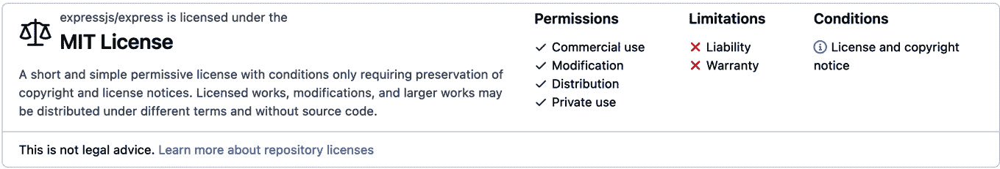
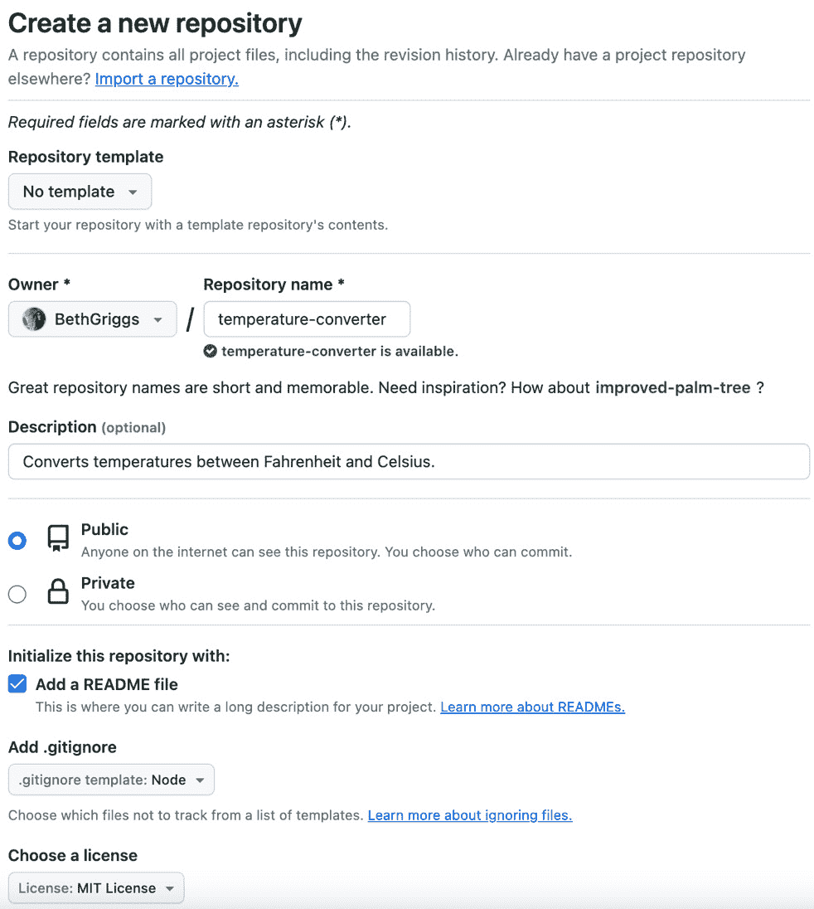
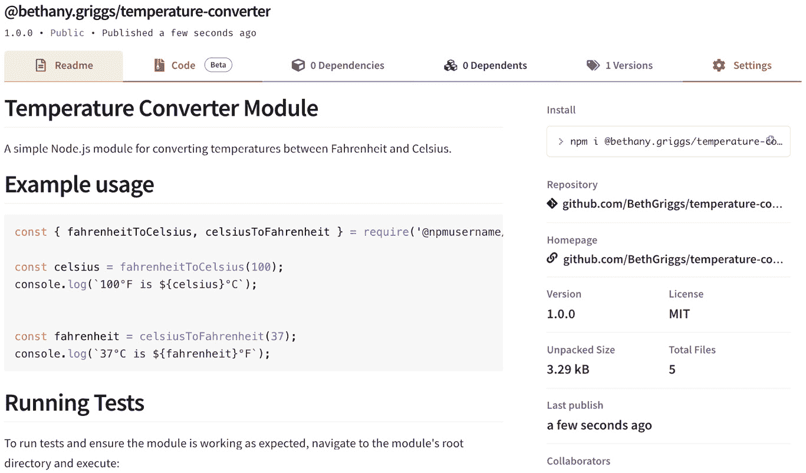

# 第五章：开发 Node.js 模块

Node.js 的一个主要吸引力是庞大的外部第三方库生态系统。**Node.js 模块**是您想要包含在应用程序中的库或一系列函数。大多数模块将提供一个 API 来暴露功能。**npm** 注册处是大多数 Node.js 模块存储的地方，那里有超过一百万个可用的 Node.js 模块。

本章将首先介绍如何使用 **npm** **命令行** **界面** ( **CLI** ) 从 **npm** 注册处消费现有的 Node.js 模块，以便在您的应用程序中使用。

在本章的后面部分，您将学习如何开发和发布您自己的 Node.js 模块到 **npm** 注册处。还将介绍如何使用 **ECMAScript Modules** ( **ESM** ) 语法，该语法在所有当前支持的 Node.js 版本中可用。本章中的菜谱是相互关联的，因此建议您按顺序完成它们。

本章将涵盖以下菜谱：

+   消费 Node.js 模块

+   搭建模块

+   编写模块代码

+   发布模块

+   使用 ESM

# 技术要求

本章将要求您安装 Node.js，最好是最新版本的 Node.js 22，并且您应该已经安装了与 Node.js 捆绑的 **npm** CLI。**node** 和 **npm** 应该在您的 shell（或终端）路径中。 

重要提示

建议使用 **Node Version Manager** ( **nvm** ) 安装 Node.js。这是一个工具，它使您能够在大多数类 Unix 平台上轻松切换 Node.js 版本。如果您使用的是 Windows，您可以从 [`nodejs.org/en/`](https://nodejs.org/en/) 安装 Node.js。

您可以通过在终端中输入以下命令来确认已安装的 Node.js 和 **npm** 版本：

```js
$ node --version
v22.9.0
$ npm --version
10.8.3
```

**npm** CLI 是 Node.js 默认的包管理器，并且我们将在本章中使用捆绑的 **npm** CLI 来安装和发布模块。

重要提示

**npm** CLI 作为默认的包管理器捆绑在 Node.js 中。npm, Inc. 也是拥有 **npm** 注册处的公司的名称（[`npmjs.org/`](https://npmjs.org/)）。

注意，由于我们将从 **npm** 注册处下载和发布模块，因此本章将需要互联网访问。

# 消费 Node.js 模块

在这个菜谱中，我们将学习如何使用 **npm** CLI 从公共 **npm** 注册处消费 **npm** 模块。

重要提示

**Yarn** 是一个流行的 JavaScript 包管理器，于 2016 年创建，作为对 **npm** CLI 的替代。当 Yarn 发布时，**npm** 没有提供 **package-lock.json** 功能来保证安装特定模块版本的稳定性。这是 Yarn 的一个关键特性。在撰写本文时，Yarn CLI 提供了与 **npm** CLI 相似的使用体验。Yarn 维护了一个注册表，它是 **npm** 注册表的反向代理。有关 Yarn 的更多信息，请查看他们的 *入门* 指南：[`yarnpkg.com/getting-started`](https://yarnpkg.com/getting-started) 。

## 准备工作

要开始，我们首先需要创建一个新的工作目录：

```js
$ mkdir consuming-modules
$ cd consuming-modules
```

我们还需要一个文件，我们可以尝试在其中执行导入的模块：

```js
$ touch require-express.js
```

## 如何操作...

在本节中，我们将设置一个项目并安装 **express** 模块，这是一个常用的 Node.js 网络框架，也是新用户学习运行时经常学习的第一个模块之一。

1.  首先，我们需要初始化一个新的项目。通过输入以下内容来完成此操作：

    ```js
    $ npm init
    ```

1.  您需要逐步通过实用程序来回答命令行实用程序中的问题。如果您不确定，可以简单地按 *Enter* 键接受默认值。

1.  **npm init** 命令应该在您的项目目录中生成了一个 **package.json** 文件。它应该看起来像这样：

    ```js
    {
      "name": "consuming-modules",
      "version": "1.0.0",
      "main": "require-express.js",
      "scripts": {
        "test": "echo \"Error: no test specified\" &&
          exit 1"
      },
      "author": "",
      "license": "ISC",
      "description": ""
    }
    ```

1.  现在，我们可以安装我们的模块。要在项目目录中安装 **express** 模块，请输入以下命令：

    ```js
    $ npm install express
    ```

1.  如果我们再次查看 **package.json** 文件，我们应该会看到模块已经被添加到了 **dependencies** 字段中：

    ```js
    {
      "name": "consuming-modules",
      "version": "1.0.0",
      "description": "",
      "main": "require-express.js",
      "scripts": {
        "test": "echo \"Error: no test specified\" &&
          exit 1"
      },
      "author": "",
      "license": "ISC",
      "dependencies": {
        "express": "⁴.18.2"
      }
    }
    ```

    此外，请注意，现在在您的项目目录中已经创建了一个 **node_modules** 目录和一个 **package-lock.json** 文件。

1.  现在，我们可以打开我们的 **require-express.js** 文件。我们只需要添加以下行来测试我们是否可以导入并使用该模块：

    ```js
    const express = require('express');
    ```

1.  预期程序在引入 **express** 模块后立即执行并终止。如果模块没有成功安装，我们会看到以下错误：

    ```js
    $ node require-express.js
    internal/modules/cjs/loader.js:979
      throw err;
      ^
    Error: Cannot find module 'express'
    ```

我们现在已成功从 **npm** 注册表中下载了一个第三方模块并将其导入到我们的应用程序中，以便可以使用它。

## 它是如何工作的…

脚本使用了 **npm**（Node.js 中的 CLI 打包工具）和 **npm** 公共注册表来下载 **express** 第三方模块。

脚本的第一步是 **npm init** 命令。此命令在当前工作目录中初始化一个新的项目。默认情况下，运行此命令将打开一个 CLI 工具，它会询问一些关于您项目的信息。以下表格定义了请求的属性：

| **属性** | **定义** |
| --- | --- |
| 包名 | 指定项目的名称。在发布到 **npm** 注册表时，名称必须是唯一的。名称可以由一个作用域前缀；例如，**@organization/package** 。 |
| 版本 | 项目的初始版本。Node.js 模块通常遵循语义化版本控制标准。默认值是**1.0.0**。 |
| 描述 | 对你的项目的简要描述，以帮助用户了解你的项目做什么以及其目的。 |
| 入口点 | 你的 Node.js 应用程序或模块的入口点文件。它是当你的模块被另一个应用程序要求时将被执行的主文件的路径。默认值是**index.js**。 |
| 测试命令 | 用于定义在执行**npm test**或**npm run test**时运行的命令。通常，这将是你执行测试套件的命令。 |
| Git 仓库 | 指定你的项目源代码仓库的位置。这对于想要访问代码、报告问题或贡献的开发者和用户很有帮助。 |
| 关键词 | 与你的项目相关的关键词。 |
| 作者 | 项目作者列表。 |
| 许可证 | 指示项目分发的许可类型。这对于用户了解他们如何使用和分享你的项目很重要。 |

表 5.1 – 表格详细说明了 package.json 文件的默认属性

必须的属性只有包名和版本。也可以跳过 CLI 实用程序，通过输入以下内容接受所有默认值：

```js
$ npm init --yes
```

可以使用**npm config**命令配置默认答案。这可以通过以下命令实现：

```js
$ npm config set init.author.name "Your Name"
```

一旦**npm init**命令完成，它将在你的当前工作目录中生成一个**package.json**文件。该**package.json**文件执行以下操作：

+   它列出了你的项目所依赖的包，作为一个*蓝图*或一系列指令，说明需要安装哪些依赖项

+   提供了一种机制，让你可以指定你的项目可以使用的包的版本——基于语义化版本控制规范（[`semver.org/`](https://semver.org/)）。

在下一步骤中，我们使用了**npm install express**命令来安装**express**模块。该命令会连接到**npm**注册表，下载具有**express**名称标识符的模块的最新版本。

重要提示

默认情况下，当提供模块名称时，**npm install**命令会查找具有该名称的模块，并从公共**npm**注册表下载它。但也可以传递其他参数给**npm install**命令，例如 GitHub URL，然后命令会安装该 URL 上可用的内容。有关更多信息，请参阅**npm** CLI 文档：[`docs.npmjs.com/cli/v10/commands/npm-install`](https://docs.npmjs.com/cli/v10/commands/npm-install)。

当**安装**命令完成后，它将模块内容放入一个**node_modules**目录中。如果当前项目中没有，但有**package.json**，该命令也会创建一个**node_modules**目录。

如果您查看 **node_modules** 目录的内容，您会注意到除了 **express** 模块之外还有其他内容。这是因为 **express** 有依赖项，它们的依赖项也可能有依赖项。

当安装一个模块时，您实际上和经常是在安装一个整个模块树。以下输出显示了配方中 **node_modules** 目录结构的一个片段：

```js
$ ls node_modules
     |-- accepts
     |-- escape-html
     |-- ipaddr.js
     |-- raw-body
     |-- array-flatten
     |-- etag
     |-- media-typer
     |-- safe-buffer
     |-- ...
```

您也可以使用 **npm list** 命令来列出您的 **node_modules** 目录的内容。

您也可能注意到已创建了一个 **package-lock.json** 文件。**package-lock.json** 类型的文件是在 **npm** 版本 5 中引入的。**package-lock.json** 与 **package.json** 的区别在于 **package-lock.json** 文件定义了 **node_modules** 树中所有模块的特定版本。

由于依赖项的安装方式，两个具有相同 **package.json** 文件的开发者运行 **npm install** 时可能会遇到不同的结果。这主要是因为 **package.json** 文件可以指定可接受的模块范围。

例如，在我们的配方中，我们安装了 **express** 的最新版本，这导致了以下范围：

```js
"express": "⁴.18.2"
```

**^** 字符表示它将允许安装所有高于 v4.18.2 的版本，但不能安装 v5.x.x。如果开发者在运行 **npm install** 命令之间发布了 v4.18.3，那么开发者 A 很可能得到 v4.18.2，而开发者 B 将得到 v4.18.3。

如果开发者在之间共享 **package-lock.json** 文件，他们将确保安装相同版本的 **express** 以及 **express** 所有依赖项的相同版本。

**npm** CLI 还可以使用 **npm shrinkwrap** 命令生成 **npm-shrinkwrap.json** 文件。**npm-shrinkwrap.json** 文件的结构与 **package-lock.json** 文件相同，并且具有类似的作用。**package-lock.json** 文件不能发布到注册表，而 **npm-shrinkwrap.json** 可以。通常，当发布 **npm** 模块时，您可能不想包含 **npm-shrinkwrap.json** 文件，因为它会阻止模块接收传递依赖项更新。

如果一个包中存在 **npm-shrinkwrap.json** 文件，这意味着该包的所有安装都将生成相同的依赖项。**npm-shrinkwrap.json** 文件对于确保生产环境中的安装一致性非常有用。

在配方的最后一步，我们导入了 **express** 模块来测试它是否已安装并可访问：

```js
const express = require('express');
```

注意，这与您导入 Node.js 核心模块的方式相同。模块加载算法将首先检查您是否正在请求一个核心 Node.js 模块；然后它将在 **node_modules** 文件夹中查找具有该名称的模块。

还可以使用 **require()** 通过传递路径来导入文件，如下所示：

```js
const file = require('./file.js');
```

## 还有更多...

现在我们已经了解了一些关于消费 Node.js 模块的知识，我们将探讨开发依赖、全局模块以及消费 Node.js 模块时应考虑的因素。

### 理解开发依赖

在 **package.json** 中，你可以区分开发依赖和常规依赖。**开发依赖**通常用于支持你开发应用程序的工具。

开发依赖不应该被要求运行你的应用程序。在区分运行应用程序所需的依赖和开发应用程序所需的依赖时，这一点尤其有用，尤其是在部署应用程序时。你的生产应用程序部署可以省略开发依赖，这使得生成的生产应用程序更小。开发依赖的一个非常常见的用途是用于代码检查和格式化。

要安装开发依赖，你需要向 **install** 命令提供 **--save-dev** 参数。例如，要安装 **semistandard**，我们可以使用以下命令：

```js
$ npm install --save-dev --save-exact semistandard
```

**--save-exact** 参数将锁定 **package.json** 文件中的确切版本。

注意，在 **package.json** 中为开发依赖创建了一个单独的部分：

```js
{
  "name": "consuming-modules",
  "version": "1.0.0",
  "description": "",
  "main": "require-express.js",
  "scripts": {
    "test": "echo \"Error: no test specified\" && exit 1"
  },
  "author": "",
  "license": "ISC",
  "dependencies": {
    "express": "⁴.18.2"
  },
  "devDependencies": {
    "semistandard": "17.0.0"
  }
}
```

你可以使用以下命令执行已安装的 **semistandard** 可执行文件：

```js
$ ./node_modules/semistandard/bin/cmd.js
```

### 安装全局模块

有可能全局安装 Node.js 模块。通常，你将全局安装的模块类型是二进制文件或你希望在终端中可访问的程序。要全局安装一个模块，你需要在 **install** 命令中传递 **--global** 命令，如下所示：

```js
$ npm install --global lolcatjs
```

这不会将 **lolcatjs** 安装到你的 **node_modules** 文件夹中。相反，它将被安装到你的 Node.js 安装目录下的 **bin** 文件夹中。要查看安装位置，你可以使用 **which** 命令（或在 Windows 上使用 **where**）：

```js
$ which lolcatjs
/Users/bgriggs/.nvm/versions/node/v20.11.0/bin/lolcatjs
```

**bin** 目录很可能已经包含在你的路径中，因为那里存储了 **node** 和 **npm** 的二进制文件。因此，任何全局安装的可执行程序也将可在你的 shell 中使用。现在，你应该能够从你的 shell 中调用 **lolcatjs** 模块：

```js
$ lolcatjs --help
```

在 **npm** v5.2 中，**npm** 向他们的 CLI 添加了 **npx** 命令。这个命令允许你执行全局模块，而无需在系统中全局安装它。你可以使用以下命令执行 **lolcatjs** 模块，而无需将其存储：

```js
$ npx lolcatjs
```

通常，**npx** 应该足够用于大多数你希望执行的模块。使用 **npx** 可能更可取，因为它允许你运行包而不污染全局命名空间。它还可以在基于项目的每个包上执行不同版本时有所帮助，因为它避免了任何全局版本冲突。

### 负责任地消费模块

您可能会希望利用 Node.js 模块生态系统来构建您的应用程序。模块提供了常见问题和任务的解决方案和实现，因此重用现有代码可以在开发应用程序时节省您的时间。

正如您在菜谱中看到的，简单地引入网络框架**express**就引入了超过 80 个其他模块。引入这么多模块会增加风险，尤其是如果您正在使用这些模块进行生产工作负载。

在选择将 Node.js 模块包含到您的应用程序中时，您应该考虑许多因素。以下三个因素尤其需要注意：

+   **安全性**：您能否依赖该模块来修复安全漏洞？第九章将更详细地介绍如何检查您模块中的已知安全问题。

+   **许可**：如果您与开源库链接然后分发软件，您的软件需要遵守链接库的许可。许可可能从限制性/保护性到宽容性不等。在 GitHub 上，您可以导航到许可文件，它将为您提供关于许可允许内容的简要概述：



图 5.1 – GitHub 许可信息

+   **维护**：您还需要考虑该模块的维护情况。许多模块将源代码发布到 GitHub，并将错误报告作为 GitHub 问题公开。通过查看这些问题以及维护者如何/何时响应错误报告，您应该能够了解该模块的维护情况。

## 参见

+   本章中的*构建模块框架*菜谱

+   本章中的*编写模块代码*菜谱

+   本章中的*发布模块*菜谱

+   *第六章*和*第九章*

# 构建模块框架

在这个菜谱中，我们将构建我们的第一个模块；也就是说，我们将为我们的模块设置一个典型的文件和目录结构，并学习如何使用**npm** CLI 初始化我们的项目。我们还将创建一个 GitHub 仓库来存储我们的模块代码。GitHub 是一个托管提供商，允许用户存储基于**Git**的仓库，其中 Git 是一个**版本控制系统**（**VCS**）。

我们将要制作的模块将提供一个 API，该 API 可以将华氏温度转换为摄氏温度，反之亦然。

## 准备工作

本菜谱将要求您拥有 GitHub 账户（[`github.com/join`](https://github.com/join)）以发布源代码，以及**npm**账户（[`www.npmjs.com/signup`](https://www.npmjs.com/signup)）以发布您的模块。

## 如何做到这一点...

在这个菜谱中，我们将使用**npm** CLI 来初始化我们的**temperature-converter**模块。

1.  让我们创建一个 GitHub 仓库来存储我们的模块代码。为此，您可以从 GitHub 导航栏点击 **+** | **New repository**，或者导航到 [`github.com/new`](https://github.com/new) 。指定仓库名称为 **temperature-converter** 。请注意，仓库名称不必与模块名称匹配。

1.  当您在这里时，还建议添加 Node.js 的默认 **.gitignore** 文件和与 **package.json** 中的许可字段匹配的许可文件。您应该会看到以下 GitHub **用户界面** ( **UI** ) 用于创建新仓库：



图 5.2 – GitHub 创建新仓库界面

重要提示

一个 **.gitignore** 文件会通知 Git 在项目中忽略哪些文件。GitHub 为每种语言或运行时提供默认的 **.gitignore** 文件。GitHub 为 Node.js 提供的默认 **.gitignore** 文件可在[`github.com/github/gitignore/blob/master/Node.gitignore`](https://github.com/github/gitignore/blob/master/Node.gitignore) 上查看。请注意，**node_modules** 会自动添加到 **.gitignore** 中。**package.json** 文件指示需要为项目安装哪些模块，并且通常期望每个开发者都会在自己的开发环境中运行 **npm install** 命令，而不是将 **node_modules** 目录提交到源代码控制。

1.  现在仓库已初始化，我们可以使用 shell 中的 Git CLI 来克隆仓库。输入以下命令来克隆仓库，用您的 GitHub 用户名替换对仓库的引用：

    ```js
    $ git clone git@github.com:username/temperature-converter.git
    Cloning into 'temperature-converter'...
    remote: Enumerating objects: 5, done.
    remote: Counting objects: 100% (5/5), done.
    remote: Compressing objects: 100% (5/5), done.
    remote: Total 5 (delta 0), reused 0 (delta 0), pack-reused 0
    Receiving objects: 100% (5/5), done.
    ```

重要提示

建议使用 **Secure Shell** ( **SSH** ) 来克隆仓库。如果您尚未为 GitHub 设置 SSH 密钥，那么您应该遵循[`docs.github.com/en/authentication/connecting-to-github-with-ssh`](https://docs.github.com/en/authentication/connecting-to-github-with-ssh) 中的步骤。

1.  切换到新克隆的目录并观察现有文件：

    ```js
    $ cd temperature-converter
    $ ls
    LICENSE   README.md
    ```

1.  您还可以运行 **git status** 和 **git log** 命令来查看我们的状态：

    ```js
    $ git status
    On branch main
    Your branch is up to date with 'origin/main'.
    nothing to commit, working tree clean
    ```

1.  现在我们已经创建了我们的仓库，并在本地有一个副本来工作，我们可以初始化我们的模块：

    ```js
    $ npm init
    ```

1.  您可以使用 *Enter* 接受默认值或按以下方式完成值。该命令将为您创建一个 **package.json** 文件。打开文件，您应该会看到以下输出：

    ```js
    {
      "name": "temperature-converter",
      "version": "0.1.0",
      "description": "Converts temperatures between Fahrenheit and Celsius.",
      "main": "index.js",
      "scripts": {
        "test": "echo \"Error: no test specified\" && exit 1"
      },
      "keywords": [
        "temperature",
        "converter",
        "utility"
      ],
      "author": "Beth Griggs",
      "license": "MIT",
      "repository": {
        "type": "git",
        "url": "git+https://github.com/BethGriggs/temperature-converter.git"
      },
      "bugs": {
        "url": "https://github.com/BethGriggs/temperature-converter/issues"
      },
      "homepage": "https://github.com/BethGriggs/temperature-converter#readme"
    }
    ```

1.  打开 **README.md** 文件并添加一些简单的文本，然后保存。例如，您可以在 **Markdown** 格式中添加一个简单的标题：**#** **temperature-converter** 。

1.  现在，我们将使用以下命令提交这些更改：

    ```js
    $ git add package.json README.md
    $ git commit --message "first commit"
    $ git push origin main
    ```

    当这成功时，您应该会看到以下输出：

    ```js
    Enumerating objects: 6, done.
    Counting objects: 100% (6/6), done.
    Delta compression using up to 10 threads
    Compressing objects: 100% (4/4), done.
    Writing objects: 100% (4/4), 1020 bytes | 1020.00 KiB/s, done.
    Total 4 (delta 1), reused 0 (delta 0), pack-reused 0
    remote: Resolving deltas: 100% (1/1), completed with 1 local object.
    To github.com:username/temperature-converter.git
       c0f53ef..6d27a2a  main -> main
    ```

我们已经看到了如何使用 Git 和 **npm** CLI 初始化我们的 **temperature-converter** 模块。

## 工作原理…

为了启动我们的项目，我们首先设置一个 GitHub 仓库，它作为存储和管理我们的代码库的中心枢纽。这涉及到在 GitHub 上创建一个新的仓库，我们将在此存储我们的模块代码，指定名称为**temperature-converter**。此外，我们抓住机会包括一个**.gitignore**文件，该文件通知 Git 排除哪些文件不进行版本控制，并添加一个许可文件，定义他人如何使用我们的代码。

一旦我们的仓库建立起来，我们使用 Git CLI 在本地克隆它。克隆会在我们的本地机器上创建仓库的副本，使我们能够离线工作在代码库上，并在准备好时将更改推送到远程仓库。我们进入克隆的目录以检查其内容，并使用**git status**和**git log**来审查仓库的状态和历史。

我们的本地设置准备就绪后，我们使用**npm**初始化我们的模块。**npm init**命令引导我们创建一个**package.json**文件，该文件包含关于我们的项目的基本元数据，例如其名称、版本和依赖项。此文件作为我们模块的蓝图，并确保在不同环境中的一致性。

为了完成我们的初始设置，我们将更改提交到仓库中。这涉及到暂存**package.json**和**README.md**文件，用描述性消息提交它们，并将更改推送到 GitHub 上的远程仓库。这一步确保了我们的项目历史记录得到良好的记录，并且我们的最新更改已发布。

重要提示

Git 是一个强大的工具，通常用于软件的源代码控制。如果你对 Git 不熟悉，GitHub 提供了一个交互式指南，你可以通过[`guides.github.com/introduction/flow/`](https://guides.github.com/introduction/flow/)来学习。

## 还有更多...

在这个食谱中，我们指定了模块版本为 v0.1.0，以遵循语义化版本控制。让我们更详细地看看这一点。

**语义化版本控制**，通常缩写为**SemVer**，是一个广为人知的版本控制标准。Node.js 本身尽可能地遵循语义化版本控制。

语义化版本号的形式为**X.Y.Z**，以下适用：

+   **X**代表主版本

+   **Y**代表次要版本

+   **Z**代表补丁版本

简而言之，语义化版本控制指出，当你进行破坏性 API 更改时，增加主版本，即第一个值。第二个数字，即次要版本，是在向后兼容（或非破坏性）方式中添加新功能时增加的。补丁版本，即第三个数字，用于错误修复和非破坏性、非增量更新。

主版本号 0 保留用于初始开发，并且直到 v1 发布之前进行破坏性更改是可以接受的。关于初始版本应该是什么版本，常常存在争议。在菜谱中，我们以 v0.1.0 版本开始，这样我们就可以在早期开发中进行破坏性更改，而无需增加主版本号。

遵循语义版本控制是 Node.js 模块生态系统中的常见做法。**npm** CLI 通过允许在**package.json**中使用**semver**范围来考虑这一点 – 参考本章中**消费 Node.js 模块**菜谱的*更多内容…*部分或访问[`docs.npmjs.com/files/package.json#dependencies`](https://docs.npmjs.com/files/package.json#dependencies)以获取有关**npm**版本范围的更多信息。

**npm** CLI 提供了一个 API 来支持语义版本控制。**npm version**命令可以与**major**、**minor**或**patch**一起使用，以在您的**package.json**文件中增加适当的版本号。还可以向**npm**版本命令传递其他参数，包括对预版本的支持 – 参考文档[`docs.npmjs.com/cli/version`](https://docs.npmjs.com/cli/version)以获取更多信息。

## 参见

+   本章中的**编写模块代码**菜谱

+   本章中的**发布模块**菜谱

# 编写模块代码

在这个菜谱中，我们将开始编写我们的模块代码。我们将编写的模块将公开两个 API，用于将提供的温度从华氏度转换为摄氏度，反之亦然。我们还将安装一个流行的代码格式化工具，以保持我们的模块代码一致性，并添加一些简单的测试用例。

## 准备工作

确保您位于**temperature-converter**文件夹中，并且存在**package.json**，表示我们有一个初始化的项目目录。

我们还需要为我们的模块创建第一个 JavaScript 文件：

```js
$ touch index.js
```

之后，我们将尝试测试导入和使用模块，因此让我们创建两个文件以备使用：

```js
$ touch test.js
```

## 如何做到这一点…

我们将从这个菜谱开始安装一个代码格式化工具，以保持我们的模块代码风格一致。到这个菜谱结束时，我们将创建我们的第一个 Node.js 模块。

1.  首先，让我们将**semistandard**添加为我们的模块的代码格式化工具。当知道其他用户将消费或贡献我们的模块时，保持代码格式的一致性非常重要：

    ```js
    $ npm install --save-dev --save-exact semistandard
    ```

1.  对于此模块的初始实现，我们将公开两个 API – 一个用于将华氏度转换为摄氏度，我们将命名为**fahrenheitToCelsius()**，另一个用于相反的转换，命名为**celsiusToFahrenheit()**。我们将使用已知的数学公式来转换这两种温度单位。首先打开**index.js**并添加以下内容以定义**fahrenheitToCelsius()**函数：

    ```js
    // Convert Fahrenheit to Celsius
    function fahrenheitToCelsius(fahrenheit) {
        return (fahrenheit - 32) * 5 / 9;
    }
    ```

1.  现在，我们可以添加相应的**celsiusToFahrenheit()**函数来进行反向转换：

    ```js
    // Convert Celsius to Fahrenheit
    function celsiusToFahrenheit(celsius) {
        return (celsius * 9 / 5) + 32;
    }
    ```

1.  接下来，我们在文件的底部添加关键行，使两个函数可用：

    ```js
    // Export the conversion functions
    module.exports = {
        fahrenheitToCelsius,
        celsiusToFahrenheit
    };
    ```

1.  现在，我们可以使用以下命令从命令行测试我们的小程序是否工作：

    ```js
    $ node --print "require('./').fahrenheitToCelsius(100)"
    37.77777777777778
    $ node --print "require('./').celsiusToFahrenheit(37)"
    98.6
    ```

1.  现在，让我们为我们的模块创建一个简单的测试文件。我们将使用核心的 **assert** 模块来实现这个：

    ```js
    const assert = require('assert');
    const { fahrenheitToCelsius, celsiusToFahrenheit }
      = require('./index');
    // Test fahrenheitToCelsius
    assert.strictEqual(fahrenheitToCelsius(32), 0, '32°F should be 0');
    assert.strictEqual(fahrenheitToCelsius(212), 100, '212°F should be 100');
    // Test celsiusToFahrenheit
    assert.strictEqual(celsiusToFahrenheit(0), 32, '0°C should be 32');
    assert.strictEqual(celsiusToFahrenheit(100), 212, '100°C should be 212');
    console.log('All tests passed!');
    ```

    注意，我们正在导入模块并测试这两个温度转换函数。

1.  现在，我们可以运行我们的测试文件：

    ```js
    $ node test.js
    All tests passed!
    ```

1.  现在，让我们定义 **npm run lint** 和 **npm run test** 脚本来分别运行我们的代码检查器和测试。打开 **package.json** 文件，并将 **scripts** 属性替换为以下内容：

    ```js
      "scripts": {
        "lint": "semistandard *.js",
        "test": "node test.js"
      },
    ```

1.  现在，我们可以使用 **npm run lint** 运行我们的代码检查器：

    ```js
    $ npm run lint
    > temperature-converter@0.1.0 lint
    > semistandard *.js
    ```

    如果有任何代码检查问题，**semistandard** 会提醒你。这些问题可以通过运行以下命令来解决：

    ```js
    $ npm run lint -- --fix
    ```

1.  我们也可以使用 **npm test** 命令运行我们的测试：

    ```js
    $ npm test
    > temperature-converter@0.1.0 test
    > node test.js
    All tests passed!
    ```

1.  现在我们已经实现了、进行了代码检查和测试，我们可以使用 Git 提交更新并将模块代码推送到 GitHub：

    ```js
    $ git add package.json package-lock.json index.js test.js
    $ git commit --message 'implement temperature converter, add tests'
    $ git push origin main
    ```

我们现在已经创建了一个模块，它公开了两个 API，并添加了一个测试用例作为良好习惯。

## 它是如何工作的...

为了确保我们的模块代码库的一致性和可读性，我们首先将流行的代码格式化工具 **semistandard** 纳入我们的开发工作流程。这确保了我们的代码遵循标准化的样式，使得其他开发者更容易理解和协作我们的项目。

由于已将 **semistandard** 作为开发依赖项安装，我们继续实现模块的核心功能。我们定义了两个转换函数，**fahrenheitToCelsius()** 和 **celsiusToFahrenheit()**，利用已知的温度转换数学公式。这些函数封装在我们的 **index.js** 文件中，使得它们可以在模块内部使用。

为了将转换函数公开给外部使用，我们在文件的底部添加了一个 **export** 语句，允许其他模块根据需要导入和使用它们。这为与我们的模块功能交互提供了一个清晰的接口。

为了验证实现的正确性，我们创建了一个简单的测试文件 **test.js**，使用 Node.js 内置的 **assert** 模块。此文件包含每个转换函数的测试用例，确保它们在各种输入条件下产生预期的结果。

在运行测试文件后，我们确认所有测试都通过，这表明我们的模块功能按预期运行。然后，我们通过定义用于代码格式化和验证的 **npm** 脚本来增强我们的开发工作流程。

运行 **npm run lint** 会检查我们的代码库是否符合编码标准，而 **npm test** 则执行我们的测试套件以验证实现的正确性。任何偏离编码标准或失败的测试都会被突出显示以便解决。我们可以为项目创建尽可能多的自定义脚本。

重要提示

**npm** CLI 支持许多快捷方式。例如，**npm install**可以缩短为**npm i**。**npm test**命令可以缩短为**npm t**。**npm run-script**命令可以缩短为**npm run**。有关更多详细信息，请参阅**npm** CLI 文档：[`docs.npmjs.com/cli-documentation/cli`](https://docs.npmjs.com/cli-documentation/cli)。

最后，当我们的代码库实现、验证和组织完成后，我们使用 Git 提交我们的更改并将它们推送到我们的 GitHub 仓库。这确保了我们的项目历史记录得到良好记录，并且我们的最新更新可供协作者获取。

## 参见

+   本章的“发布模块”菜谱

+   *第八章*

# 发布模块

这个菜谱将指导你如何准备和发布你的模块到**npm**注册表。将你的模块发布到**npm**注册表将使其可供其他开发者查找并包含到他们的应用程序中。这就是**npm**生态系统的运作方式：开发者将编写和发布模块到**npm**，供其他开发者消费和重用在他们的 Node.js 应用程序中。

在这个菜谱中，我们将发布我们在这个章节的“编写模块代码”菜谱中创建的**温度转换器**模块到**npm**注册表。具体来说，我们将把我们的模块发布到一个作用域命名空间中，因此你可以预期你的模块将在**@npmusername/temperature-converter**处可用。

## 准备工作

此菜谱依赖于本章的“编写模块代码”菜谱。我们将把在该菜谱中创建的**温度转换器**模块发布到**npm**注册表。你可以从 GitHub 仓库[`github.com/PacktPublishing/Node.js-Cookbook-Fifth-Edition/tree/main/Chapter05/temperature-converter`](https://github.com/PacktPublishing/Node.js-Cookbook-Fifth-Edition/tree/main/Chapter05/temperature-converter)中的“编写模块代码”菜谱获取模块代码。

此菜谱还需要你有一个**npm**账户。前往[`www.npmjs.com/signup`](https://www.npmjs.com/signup)注册账户。注意记录你的**npm**用户名。

## 如何操作…

此菜谱将指导将模块发布到**npm**注册表的过程。

1.  一旦你注册了**npm**账户，你可以使用以下命令授权你的**npm**客户端：

    ```js
    $ npm login
    npm notice Log in on https://registry.npmjs.org/
    Login at:
    https://www.npmjs.com/login?next=/login/cli/{UUID}
    Press ENTER to open in the browser...
    Logged in on https://registry.npmjs.org/.
    ```

1.  让我们更新在“搭建模块框架”菜谱中初始化 GitHub 仓库时自动为我们创建的**README.md**文件。拥有一个适当且清晰的**README.md**文件很重要，这样偶然发现该模块的用户可以了解它做什么以及它是否适合他们的用例。在你的编辑器中打开**README.md**文件，并更新以下内容，记得将**npm**用户名改为你自己的：

    ```js
    # Temperature Converter Module
     A simple Node.js module for converting temperatures between Fahrenheit and Celsius.
    # Example usage
    ```js

    const { fahrenheitToCelsius, celsiusToFahrenheit }

    = require('@npmusername/temperature-converter');

    const celsius = fahrenheitToCelsius(100);

    console.log(`100°F is ${celsius}°C`);

    const fahrenheit = celsiusToFahrenheit(37);

    console.log(`37°C is ${fahrenheit}°F`);

    ```js
    # Running Tests
     To run tests and ensure the module is working as expected, navigate to the module's root directory and execute:
    ```sh

    $ npm run test

    ```js
    # License
    This project is licensed under the MIT License.
    ```

重要提示

我们刚刚创建的 **README** 文件是使用 Markdown 编写的。**.md** 或 **.MD** 后缀表示它是一个 Markdown 文件。Markdown 是一种在 GitHub 上广泛使用的文档语法。要了解更多关于 Markdown 的信息，请查看 GitHub 的指南：[`guides.github.com/features/mastering-markdown/`](https://guides.github.com/features/mastering-markdown/)。许多流行的编辑器都有可用的插件，这样你就可以在你的编辑器中渲染 Markdown。

1.  现在，我们需要在 **package.json** 文件中更新我们的模块名称，以匹配我们的范围模块名称。让我们也将这个模块版本设为 **1.0.0**。你可以手动编辑 **package.json**，或者重新运行 **npm init** 命令来用任何新值覆盖它。记得将 **npm** 用户名改为你自己的：

    ```js
    {
      "name": "@npmusername/temperature-converter",
      "version": "1.0.0",
      "description": "Converts temperatures between Fahrenheit and Celsius.",
      "main": "index.js",
      "scripts": {
        "lint": "semistandard *.js",
        "test": "node test.js"
      },
      "keywords": [
        "temperature",
        "converter",
        "utility"
      ],
      "author": "Forename Surname",
      "license": "MIT",
      "devDependencies": {
        "semistandard": "17.0.0"
      },
      "repository": {
        "type": "git",
        "url": "git+https://github.com/username/temperature-converter.git"
      },
      "bugs": {
        "url": "https://github.com/username/temperature-converter/issues"
      },
      „homepage": „https://github.com/username/temperature-converter#readme"
    }
    ```

1.  保持你的公共 GitHub 仓库是最新的是很理想的。通常，模块作者会在 GitHub 上创建一个与推送到 **npm** 的版本匹配的标签。这可以作为用户查看特定版本的模块源代码的审计跟踪，而无需通过 **npm** 下载它。然而，请注意，没有任何东西强制要求你发布到 **npm** 的代码必须与你发布到 GitHub 的代码匹配：

    ```js
    $ git add .
    $ git commit --message "v1.0.0"
    $ git push origin main
    $ git tag v1.0.0
    $ git push origin v1.0.0
    ```

1.  现在，我们准备好使用以下命令将我们的模块发布到 **npm** 注册表：

    ```js
    $ npm publish --access=public
    ```

1.  你可以通过导航到 [`www.npmjs.com/package/@npmusername/temperature-converter`](https://www.npmjs.com/package/@npmusername/temperature-converter) 来检查你的发布是否成功。你可能会看到以下关于你的模块的信息：



图 5.3 – npmjs.com 上的 npm 模块信息

## 它是如何工作的...

我们首先使用 **npm login** 命令认证了我们的本地 **npm** 客户端。**npm** 客户端提供了设置访问控制的能力，以便某些用户可以发布到特定的模块或范围。

**npm login** 命令标识了你是谁以及你有什么权利发布。你也可以使用 **npm logout** 命令登出。

实际发布到注册表的命令如下：

```js
$ npm publish --access=public
```

**npm publish** 命令尝试将包发布到 **package.json** 文件中 **name** 字段指定的位置。在配方中，我们将其发布到了一个范围包中——具体来说，我们使用了我们自己的用户名范围。范围包有助于避免命名冲突。你可以通过不传递一个命名范围来将你的包发布到全局范围，但如果你有一个常见的包名，你可能会遇到命名冲突。

我们还传递了**--access=public**标志。当发布到范围包时，我们需要明确表示我们希望该模块是公开的。**npm** CLI 允许您将范围包的模块发布为公开或私有。要私有发布模块，您需要有一个付费的**npm**账户。请注意，当发布到全局作用域时，不需要**--access=public**标志，因为全局命名空间中的所有模块都是公开的。

**npm publish**命令打包了我们的模块代码并将其上传到**npm**注册表。由于从**npm init**命令生成的**package.json**文件具有一致的属性，**npm**可以提取并在此模块页面上呈现该信息。如图所示，**npm**根据我们的**package.json**文件中的信息自动填充了**README**文件、版本和 GitHub 链接。

## 还有更多...

接下来，我们将考虑预发布脚本和**.npmignore**文件，并查看如何发布到私有注册表。

### 使用预发布脚本

**npm** CLI 支持**prepublishOnly**脚本。此脚本仅在模块打包和发布之前运行。这有助于在发布前捕获错误。如果发生错误，可能需要发布第二个版本来纠正此错误，这可能会给您的模块消费者带来潜在的避免不便。

让我们在我们的模块中添加一个**prepublishOnly**脚本。我们的**prepublishOnly**脚本现在只是运行我们的**lint**脚本。以下是如何添加**prepublishOnly**脚本：

```js
  "scripts": {
    "prepublishOnly": "npm run lint",
    "lint": "semistandard *.js",
    "test": "node test.js"
  }
```

通常，模块作者会在他们的**prepublishOnly**脚本中包括重新运行他们的测试套件：

```js
"prepublishOnly": "npm run lint && npm test",
```

### 使用.npmignore 和 package.json 的“files”属性

与指定哪些文件不应被跟踪或提交到存储库的**.gitignore**文件一样，**.npmignore**省略了其中列出的文件。**.npmignore**类型的文件不是必需的，如果您没有它但有**.gitignore**文件，那么**npm**将省略与**.gitignore**文件匹配的文件和目录。如果存在这样的文件，**.npmignore**文件将覆盖**.gitignore**。

常常添加到**.npmignore**文件中的文件和目录类型是测试文件。如果您在大小方面有一个特别大的测试套件，那么您应该考虑通过将它们添加到您的**.npmignore**文件中来排除这些文件。使用您的模块的用户通常不需要将测试套件捆绑到他们的应用程序中——排除这些和其他多余的文件可以减少所有消费者模块的大小。

一个仅排除**test**目录的**.npmignore**文件看起来如下：

```js
# Dependency directories
test/
```

请记住，一旦创建了 **.npmignore** 文件，它将被视为 **.npm** 包中应忽略哪些文件的 **真实来源**（**SOT**）。值得检查您的 **.gitignore** 文件，并确保您添加到那里的项目也添加到 **.npmignore** 中。

在 **package.json** 文件中，您还可以定义一个 **"files"** 属性，允许您指定在发布包时应包含的文件路径或模式数组。这不仅仅是一个排除列表，它还充当了发布内容的包含列表。

例如，如果您有一个包含各种实用函数的 Node.js 模块，但只想公开主要功能和相关文档，您可以在您的 **package.json** 文件中指定 “ **files": ["lib/", "docs/", "README.md"]**。这确保了当用户安装您的包时，只包含指定目录中的文件以及 **README.md** 文件，而所有其他内部文件或目录都将从发布的包中排除。

在 **package.json** 文件中通过定义 **"files"** 而不是使用 **.npmignore** 文件中的排除列表来提供允许列表可能更可取，因为它消除了忘记在 **.npmignore** 文件中排除文件的风险。

为了确保您的包在发布时只包含所需的文件，您可以在本地环境中执行 **npm pack** 命令。此命令在当前工作目录中创建一个 tarball，反映了发布过程中使用的流程。

重要提示

虽然 TypeScript 和其他转换器在本书中没有详细介绍，但在发布到 **npm** 时，通常只发布输出文件，例如 JavaScript 文件，而不是源文件，例如 TypeScript 文件。这种做法确保包消费者只接收到运行模块所需的必要文件。为了实现这一点，您可以使用 **.npmignore** 文件或 **package.json** 中的 **"files"** 属性来排除源文件，并仅包含编译后的输出。

### 私有注册表

**npm** CLI 支持配置为指向 **私有注册表**。私有注册表是一种设置了某种形式的访问控制的注册表。通常，这些是由希望将其部分代码保留在公共注册表之外的企业和组织设置的。这可能是因为业务政策限制。这使得企业能够在遵守业务政策的同时，在其组织成员之间共享模块。同样，私有注册表也可以用作缓存机制。

您可以使用以下命令更改您指向的注册表：

```js
$ npm config set registry https://registry.your-registry.npme.io/
```

您可以使用以下命令查看您指向的注册表：

```js
$ npm config get registry
https://registry.npmjs.org/
```

注意，这两个都使用了 **npm config** 命令。您可以使用以下命令列出您所有的 **npm config** 设置：

```js
$ npm config list
; "user" config from /Users/bgriggs/.npmrc
; node bin location = /Users/bgriggs/.nvm/versions/node/v22.9.0/bin/node
; node version = v22.9.0
; npm local prefix = /Users/bgriggs/Node.js-Cookbook/Chapter05/temperature-converter
; npm version = 10.2.4
; cwd = /Users/bgriggs/Node.js-Cookbook/Chapter05/temperature-converter
; HOME = /Users/bgriggs
; Run `npm config ls -l` to show all defaults
```

**.npmrc** 文件是 **npm** 的配置文件，可用于全局或按项目设置各种 **npm** 配置。此文件允许您持久地配置 **npm** 设置，例如注册表 URL 和身份验证令牌。例如，要将 **npm** 指向私有注册表，您可以将以下行添加到 **.** **npmrc** 文件中：

```js
registry= https://registry.your-registry.npme.io/
```

在此文件中还有许多其他可配置设置和自定义选项；有关更多信息，请参阅 **npm** 文档：[`docs.npmjs.com/cli/v10/configuring-npm/npmrc`](https://docs.npmjs.com/cli/v10/configuring-npm/npmrc)。

# 使用 ECMAScript 模块

ESM 代表了包装 JavaScript 代码以供重用的官方标准。ESM 在 **ECMAScript 2015**（**ES6**）中引入，以将统一的模块系统带给 JavaScript 语言，这是多年来缺失且需求迫切的功能。与 Node.js 用于服务器端开发的 **CommonJS**（**CJS**）模块不同，ESM 提供了一种静态分析代码导入和导出的方法，允许进行诸如摇树优化等优化，从而消除未使用的代码。

ESM 引入 Node.js 生态系统标志着重要的里程碑，为开发者提供了跨不同环境（包括浏览器）兼容的标准化模块系统的优势，在这些环境中，模块可以原生加载，无需捆绑工具。

配置 Node.js 以使用 ESM 涉及理解和设置项目结构以适应新的语法和模块解析策略。默认情况下，Node.js 将 **.js** 文件视为 CJS 模块，但通过在项目的 **package.json** 文件中包含一个 **"type": "module"** 条目，Node.js 将切换为将具有 **.js** 扩展名的文件视为 ESM。

或者，开发者可以使用 **.mjs** 扩展名来为打算作为模块处理的 JavaScript 文件。这个设置阶段至关重要，因为它为使用 **import** 和 **export** 关键字导入和导出模块奠定了基础，从而远离 CJS 的 **require** 和 **module.exports** 语法。在 Node.js 中启用 ESM 不仅使服务器端开发与前端实践保持一致，而且为 JavaScript 生态系统中的代码共享和模块化开辟了新的可能性。

## 准备工作

核心 ESM 支持默认启用，并在所有当前支持的 Node.js 版本中指定为稳定状态。然而，一些单个 ESM 功能仍然是实验性的。

在本食谱中，我们将创建一个计算各种几何形状面积和周长的迷你项目。这个食谱将作为在 Node.js 中使用 ESM 的介绍，并演示命名和默认导出的使用。

要开始，请确保您正在使用 Node.js 22 并创建一个工作目录：

```js
$ mkdir ecmascript-modules
$ cd ecmascript-modules
```

我们还将为我们的几何形状模块准备一些文件：

```js
$ touch index.js circle.js rectangle.js
```

## 如何操作…

在这个菜谱中，我们将创建用于计算圆形和矩形等几何形状面积和周长的模块。我们还将创建一个用于四舍五入的实用工具。

1.  首先，我们需要初始化我们的模块。对于这个菜谱，我们只需接受默认值：

    ```js
    $ npm init --yes
    ```

1.  现在，由于我们计划在整个项目中使用 ESM 语法，我们应该在**package.json**文件中设置**"type": "module"**条目：

    ```js
    {
      "name": "ecmascript-modules",
      "version": "1.0.0",
      "description": "",
      "type": "module",
      "main": "index.js",
      "scripts": {
        "test": "echo \"Error: no test specified\" && exit 1"
      },
      "keywords": [],
      "author": "",
      "license": "ISC"
    }
    ```

1.  现在，让我们创建一个**圆形模块**。此模块将使用默认的**导出**语句来导出主函数——即计算面积。它还将公开一个用于计算圆周长的函数作为命名导出。将以下代码添加到**circle.js**：

    ```js
    const PI = Math.PI;
    function area(radius) {
      return PI * radius * radius;
    }
    function circumference(radius) {
      return 2 * PI * radius;
    }
    export default area;
    export { circumference };
    ```

    注意，我们正在使用**Math**命名空间对象来获取π的值。

1.  接下来，我们将创建一个**矩形模块**（**rectangle.js**）。此模块将导出面积和周长函数，但这次只使用命名导出。将以下代码添加到**rectangle.js**：

    ```js
    function area(length, width) {
      return length * width;
    }
    function perimeter(length, width) {
      return 2 * (length + width);
    }
    export { area, perimeter };
    ```

1.  接下来，我们将实现一个小型的**数学实用工具**。我们只需添加一个四舍五入值的函数。创建一个名为**mathUtils.js**的文件：

    ```js
    $ touch mathUtils.js
    ```

1.  将以下代码添加到**mathUtils.js**：

    ```js
    export function round(number, precision) {
      const factor = Math.pow(10, precision);
      return Math.round(number * factor) / factor;
    }
    ```

1.  最后，我们将实现**主模块**（**index.js**）。此模块将导入并使用来自几何模块和实用工具模块的函数。此模块将展示我们可以以各种方式导入：

    ```js
    import circleArea, { circumference } from './circle.js';
    import * as rectangle from './rectangle.js';
    import { round } from './mathUtils.js';
    function calculateCircleMetrics(radius) {
      console.log(`Circle with radius ${radius}:`);
      console.log(`Area: ${round(circleArea(radius),
        2)}`);
      console.log(`Circumference:
        ${round(circumference(radius), 2)}`);
    }
    function calculateRectangleMetrics(length, width) {
      console.log(`\nRectangle with length ${length}
        and width ${width}:`);
      console.log(`Area: ${round(rectangle.area(length,
        width), 2)}`);
      console.log(`Perimeter:
        ${round(rectangle.perimeter(length, width),
        2)}`);
    }
    calculateCircleMetrics(5);
    calculateRectangleMetrics(10, 5);
    ```

    此模块演示了如何使用不带花括号的默认导出、带花括号的命名导出，以及使用**import *** **as**语法将模块的所有命名导出作为对象导入。

1.  通过运行以下命令来执行你的应用程序：

    ```js
    $ node index.js
    Circle with radius 5:
    Area: 78.54
    Circumference: 31.42
    Rectangle with length 10 and width 5:
    Area: 50
    Perimeter: 30
    ```

    你应该能看到圆和矩形的计算度量，展示了如何在模块化的 Node.js 应用程序中使用默认和命名导出。

本项目展示了在 Node.js 项目中使用 ESM（模块化）来组织和结构化 JavaScript 代码的灵活性和效率。通过计算几何形状的度量示例，我们看到了如何正确使用默认和命名导出，使我们的代码模块化和可重用。

## 它是如何工作的...

本教程的结构围绕在 Node.js 环境中使用 ESM（模块化）进行模块化编程的概念。本菜谱的主要目标是展示如何利用 ESM 构建一个组织良好、易于维护和可扩展的项目。我们通过开发一个小型应用程序来实现这一点，该应用程序旨在计算几何形状的面积和周长。

项目以具有**package.json**文件的标准 Node.js 应用程序启动。通过在**package.json**文件中将**"type": "module"**设置为，我们指示 Node.js 将具有**.js**扩展名的文件视为 ESM 文件。

几何计算被划分为针对每个形状的独立模块。这种模块化方法展示了单一责任的概念，即每个模块负责与特定几何形状相关的一组特定功能。这种方法对于那些使用过其他 **面向对象编程** ( **OOP** ) 语言（如 Java）的人来说将很熟悉。

对于圆模块（ **circle.js** ），我们实现了计算圆面积（作为默认导出）和周长（作为命名导出）的函数。使用默认导出主要函数说明了如何展示模块的主要功能，而命名导出通常用于次要功能。

对于矩形模块（ **rectangle.js** ），我们只包含了计算矩形面积和周长的函数的命名导出。使用命名导出突出了如何在单个模块中将多个相关功能分组并单独导出。

我们引入了一个实用模块（ **mathUtils.js** ）来执行舍入操作。这个模块的存在强调了将共享功能抽象到模块中的实用性，使它们在整个项目中可重用。

主要模块 **index.js** 作为应用程序的入口点。它动态导入几何模块和实用模块，使用它们的函数根据用户输入或预定义值执行计算。虽然这是一个简化的例子，但它展示了如何从模块中导入默认和命名导出，突出了 ESM 在处理各种导出类型方面的多功能性。

## 还有更多…

CJS 由于在庞大的 **npm** 模块生态系统中拥有悠久的历史，因此在 Node.js 应用程序中仍然被广泛使用。由于原生浏览器支持、模块优化能力和与 ECMAScript 标准的一致性，ESM 正在越来越多地被用于新项目。

理解这些差异对于在 Node.js 和更广泛的 JavaScript 生态系统中导航的开发者至关重要，尤其是在处理可能需要集成两种模块类型的应用程序和项目时。

重要提示

在当前 Node.js 开发状态下，开发者通常必须导航这两个模块系统。因此，本书后续章节中的一些食谱将使用 ESM 语法。在某些情况下，这是由于某些 **npm** 模块现在仅支持 ESM。

### CJS 和 ESM 之间的差异

在 Node.js 中，CJS 和 ESM 之间的差异是理解如何在 JavaScript 应用程序中有效使用模块的基础。让我们更深入地看看这些：

| **CJS** | **ESM** |
| --- | --- |
| 使用 **require()** 导入模块，使用 **module.exports** 或 **exports** 导出。 | 使用 **import** 和 **export** 语句导入和导出模块。 |
| 同步加载模块。 | 支持异步加载，允许使用动态 **import()** 语句。 |
| 支持非静态、运行时模块解析，允许根据运行时条件进行条件导入。 | 静态结构使得**import**/**export**语句可以在编译时进行分析，从而可能导致 JavaScript 引擎进行潜在优化。 |
| CJS 模块可以通过动态的**import()**语句或通过创建包装模块来使用 ESM，但需要注意避免双重包风险等问题。 | ESM 可以使用默认导入来导入 CJS 模块。 |
| 导出在导入时被复制，这意味着导入后对导出值的更改不会反映在导入模块中。 | 支持活绑定，允许导入的值在导出模块中更改时更新。 |
| 不支持**顶层 await**，因为它依赖于同步模块加载。 | 启用顶层 await，允许模块在继续之前等待异步操作。 |
| 通常使用**.js**扩展名，尽管也可以显式使用**.cjs**扩展名。 | 虽然**.js**可以用于（在**package.json**中设置**"type": "module"**），但**.mjs**扩展名可以用来显式标记文件为 ESM。 |
| 模块有自己的作用域但共享一个全局对象。 | 模块默认以**严格模式**执行，并拥有自己的作用域，具有更隔离的环境。 |

表 5.2 – CJS 和 ESM 模块之间的关键差异

### 与 CJS 模块的互操作性

在 Node.js 项目中采用 ESM 模块的一个关键方面是理解它们如何与传统 CJS 模块系统互操作。鉴于现有的大量 Node.js 包和应用都使用 CJS，掌握如何在单个项目中同时处理这两种模块系统至关重要。本节探讨了实现 ESM 和 CJS 模块之间互操作性的机制和实践，确保平稳过渡和集成过程。

ESM 可以使用**import**语句导入 CJS 模块，这得益于 Node.js 内置的互操作性支持。然而，由于 CJS 模块不能像 ESM 那样进行静态分析，因此需要注意一些细微差别：

+   **默认导入**：在 ESM 文件中导入 CJS 模块时，整个模块的导出被视为单个默认导出。这意味着您不能直接从 CJS 模块中直接使用命名导入：

    ```js
    // Importing a CommonJS module in ESM
    import cjsModule from './module.cjs';
    console.log(cjsModule.someFunction());
    ```

+   **动态导入**：您可以使用**import()**函数动态导入 CJS 模块。这种方法返回一个**Promise**，该 Promise 解析为 CJS 模块的导出，允许异步模块加载：

    ```js
    // Dynamically importing a CommonJS module
    import('./module.cjs').then((cjsModule) => {
      console.log(cjsModule.someFunction());
    });
    ```

+   **将 ESM 模块导出以供 CJS 使用**：当在 CJS 代码中使用 ESM 模块时，由于 CJS 的**require()**函数是同步的，因此这个过程受到一定程度的限制，该函数不支持 ESM 的异步模块加载。然而，存在一些解决方案。

一种常见的方法是创建一个 CJS 包装模块，该模块动态导入 ESM 模块，然后导出其功能。这需要使用异步模式，如**async**、**await**或 promises：

```js
// CJS wrapper for an ESM module
const esmModule = await import('./module.mjs');
module.exports = esmModule.default;
```

提供 ESM 和 CJS 入口点的项目需要意识到双重包风险，即以两种格式加载的单个包可能会导致状态问题或实例重复。

当创建模块时，建议您记录您的包或应用程序是否支持 ESM 和 CJS，并提供有关消费者如何将其导入其项目的指南。如果您同时发布，还建议您在 ESM 和 CJS 环境中彻底测试您的模块，以捕获任何互操作性问题。

重要提示：

Node.js 现在通过使用带有**--experimental-require-module**标志的**require()**来提供对加载 ES 模块的实验性支持。此功能允许在特定条件下加载 ES 模块，例如当文件具有**.mjs**扩展名或当最近的 package.json 中设置**"type": "module"**时。然而，如果模块或其依赖项包含顶层 await，将抛出**ERR_REQUIRE_ASYNC_MODULE**错误，需要**import()**来处理异步模块。

这个功能旨在提高 CommonJS 和 ES 模块之间的互操作性，但作为一个实验性特性，它可能在未来的 Node.js 版本中发生变化。更多信息，请访问：[`nodejs.org/api/modules.html#loading-ecmascript-modules-using-require`](https://nodejs.org/api/modules.html#loading-ecmascript-modules-using-require)。

### ECMAScript Modules 的高级主题

在 Node.js 中提高对 ESM 的理解涉及探索更复杂的功能和策略，这些功能和策略可以优化和增强您应用程序的功能。您可以探索一些更高级的主题，以了解 ESM 开发者的好处和考虑因素：

+   **动态导入表达式**：动态导入允许您根据需要加载模块，使用返回**Promise**的**import()**函数。这个特性特别有用，可以通过将代码拆分成更小的块，只在需要时加载，来减少初始加载时间并优化应用程序的资源利用。

+   **模块缓存和预加载**：Node.js 缓存导入的模块以避免在每次需要时重新加载它们，从而提高性能。预加载模块涉及在需要之前加载模块，可能通过减少与运行时加载模块相关的延迟来加快应用程序的启动速度。

+   **摇树优化**：摇树优化是一个与静态代码分析工具和打包器（如 **Webpack**）相关的术语。它指的是从最终包中消除未使用的代码。为了使摇树优化有效，模块必须使用静态 **导入** 和 **导出** 语句，因为这允许打包器确定哪些导出被使用，哪些可以安全地删除，从而生成更小、更高效的包。

+   **模块解析自定义**：也可以通过配置如何解析导入指定符到实际模块文件来自定义模块解析。Node.js 提供了一个名为 **自定义钩子** 的实验性功能，允许你通过注册一个导出钩子的文件来自定义模块解析和加载。有关更多信息，请参阅该功能的 Node.js API 文档：[`nodejs.org/api/module.html#customization-hooks`](https://nodejs.org/api/module.html#customization-hooks)。

## 参见

+   本章中的 *搭建模块* 菜谱

+   本章中的 *编写模块代码* 菜谱

+   *第八章*
