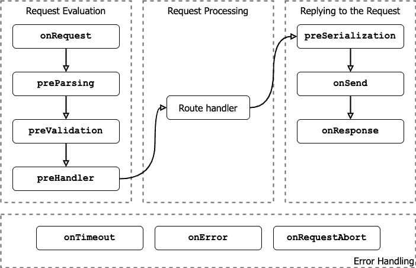
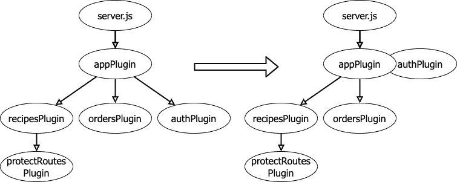

# 6

# 使用 Fastify – Web 框架

在*第四章*中，我们学习了 Node.js 核心提供的低级 API，用于构建 Web 应用程序。然而，使用这些 API 有时可能会具有挑战性，需要大量努力将概念性想法转化为功能性软件。因此，在 Node.js 生态系统中，Web 框架对于快速开发健壮的 HTTP 服务器至关重要。Web 框架将 Web 协议抽象为高级 API，允许你在不需要处理日常任务的情况下实现业务逻辑，例如解析 HTTP 请求体或重新发明内部路由器。

本章介绍了 Fastify，这是目前 Node.js 中速度最快且开销最低的 Web 框架。Fastify 高度重视提升开发者的体验，在确保卓越的应用程序性能的同时，帮助你构建 API。它紧密遵循 Web 标准，确保兼容性和可靠性。此外，它具有令人印象深刻的可扩展性，允许你根据独特需求自定义服务器。

我们将通过以下学习路径来探索 Fastify：

+   使用 Fastify 创建 API 入门

+   将代码拆分为小型插件

+   添加路由

+   使用钩子实现身份验证

+   使用钩子破坏封装

+   实现业务逻辑

+   验证输入数据

+   使用序列化提高应用程序性能

+   配置和测试 Fastify 应用程序

# 技术要求

要成功完成本章，你需要以下内容：

+   安装 Node.js v22

+   一个 IDE，例如 VS Code ([`code.visualstudio.com/`](https://code.visualstudio.com/))

+   一个带有**curl**的运行命令行 ([`curl.se/download.html`](https://curl.se/download.html))

+   从[`www.mongodb.com/`](https://www.mongodb.com/)安装 MongoDB

本章中所有代码片段均可在 GitHub 上找到：[`github.com/PacktPublishing/Node.js-Cookbook-Fifth-Edition/tree/main/Chapter06`](https://github.com/PacktPublishing/Node.js-Cookbook-Fifth-Edition/tree/main/Chapter06)。

# 使用 Fastify 创建 API 入门

**Fastify** ([`fastify.dev/`](https://fastify.dev/)) 是一个用于构建 Web 应用程序的 Node.js Web 框架。它简化了 HTTP 服务器的开发以及 API 的创建，以简单、高效、可扩展和安全的方式进行。Fastify 的第一个稳定版本发布于 2018 年。从那时起，它已经积累了庞大的社区，每月下载量超过 700 万。此外，它还保持着一致的发布计划，大约每两年进行一次主要版本更新。

因为实践经验通常是学习最有效的方法，所以在本章中，我们将承担实现我们全新的幻想餐厅 API 服务器的任务！我们的目标包括显示菜单、允许厨师添加或删除食谱，以及允许客人下单，厨师将接收并烹饪！

因此，让我们开始我们的 Fastify 实践课程，并在本章结束时，您将评估 Fastify 是否易于使用！

## 准备工作

首先，我们需要设置开发环境。为此，您可以在终端中运行以下命令来创建一个新的 Node.js 项目：

```js
$ mkdir fastify-restaurant
$ cd fastify-restaurant
$ npm init –yes
$ npm pkg set type=module
```

在这个阶段，我们已经使用安装的 **fastify** 模块初始化了 **fastify-restaurant** 文件夹。

## 如何操作...

要构建一个 Fastify 服务器，我们需要遵循以下步骤：

1.  安装 **fastify** 版本 5 模块：

    ```js
    $ npm install fastify@5
    ```

1.  创建一个包含以下内容的 **index.js** 文件以导入依赖项：

    ```js
    import { fastify } from 'fastify';
    ```

1.  多亏了导入的依赖项，我们可以通过执行 **fastify** 工厂函数来实例化一个 Fastify 实例。**app** 常量将是我们 **根应用程序实例**，它标识您可用的 Fastify API：

    ```js
    const serverOptions = {
      logger: true
    };
    const app = fastify(serverOptions);
    ```

    注意，我们正在将 **serverOptions** 对象作为参数传递。它包含 **logger: true** 属性以打开应用程序日志！**fastify** 工厂接受许多选项，我们将在本章后面看到。

1.  使用 **app** 实例，我们可以通过 **get()** 方法向服务器添加路由。处理程序返回我们希望作为响应返回的有效负载。在这种情况下，我们向 **/** 端点添加一个 HTTP **GET** 处理程序：

    ```js
    app.get('/', async function homeHandler () {
      return {
        api: 'fastify-restaurant-api',
        version: 1
      };
    });
    ```

1.  我们创建一个 **port** 变量，以便选择服务器监听 HTTP 请求的位置：

    ```js
    const port = process.env.PORT || 3000;
    ```

    我们从环境设置中读取变量或设置默认值。这很有用，因为通常在我们安装应用程序的服务器上，PORT 设置已经设置（例如，Heroku）。

1.  最后，我们可以通过调用 **listen** 方法来启动我们的服务器。具有 **0.0.0.0** 值的 **host** 参数将配置您的服务器以接受来自任何 IPv4 地址的连接：

    ```js
    await app.listen({ host: '0.0.0.0', port });
    ```

    这种设置对于在 Docker 容器中运行或任何直接可访问互联网的应用程序至关重要。没有这种配置，外部客户端将无法访问您的 HTTP 服务器。

1.  我们现在可以使用以下命令启动服务器：

    ```js
    $ node index.js
    {"level":30,"time":1693925618687,"pid":123,"hostname":"MyPc","msg":"Server listening at http://127.0.0.1:3000"}
    {"level":30,"time":1693925618687,"pid":123,"hostname":"MyPc","msg":"Server listening at http://192.168.1.174:3000"}
    ```

    如您所注意到的，我们可以看到多个 HTTP 服务器正在监听的 IP 地址。这是由于 **0.0.0.0** 主机配置，它监听本地主机名和本地 IP 地址以处理外部调用。如果我们将 **0.0.0.0** 更改为 **localhost**，我们的 HTTP 服务器将仅从本地 PC 可用，并打印一条日志消息。

1.  控制台日志告诉我们服务器已成功启动；因此，如果您打开一个新的终端并运行 **curl** 命令，您将得到以下结果：

    ```js
    $ curl http://localhost:3000
    {"api":"fastify-restaurant-api","version":1}
    ```

在几行代码中，你已经创建了一个带有日志记录器的 Fastify 服务器，该服务器已准备好使用，并且在 **/** 路由上响应 JSON 有效负载！

正如我们所见，Fastify 配备了众多内置功能，例如应用程序日志记录器，通过使用流行的 Node.js 日志记录器 **pino** ([`getpino.io/`](https://getpino.io/)) 和自动处理 JSON 格式，无需额外的依赖项。

在下一个菜谱中，我们将重构代码，开始为我们的项目赋予形状。

# 将代码拆分为小型插件

我们在 *使用 Fastify 创建 API 入门* 菜谱中实现了 API 根端点，这通常用作健康检查，以验证服务器是否成功启动。然而，我们不能不断地将所有应用程序的路由添加到 **index.js** 文件中；否则，它很快就会变得难以阅读。因此，让我们将我们的 **index.js** 文件拆分。

## 如何操作...

要拆分我们的 **index.js** 文件，请按照以下步骤操作：

1.  创建一个 **app.js** 文件，并将以下服务器配置的 **serverOptions** 常量移动到该文件中：

    ```js
    const serverOptions = {
      logger: true
    };
    ```

1.  我们定义我们的第一个插件接口：

    ```js
    async function appPlugin (app, opts) {
      app.get('/', async function homeHandler () {
        return {
          api: 'fastify-restaurant-api',
          version: 1
        };
      });
    }
    ```

    插件是一个接受两个参数的 **async** 函数：第一个是一个 Fastify 服务器实例，第二个是一个 **options** 对象，目前它是空的。我们将在 *使用钩子实现身份验证* 菜谱中使用它。如果它不是一个 **async** 函数，这个函数可能会有不同的声明。在这种情况下，将会有第三个参数：**function syncAppPlugin(app, opts, next){}**；这是一个我们必须调用来告诉 Fastify 框架插件何时加载的函数。

1.  最后，我们需要将插件函数作为默认导出，将服务器配置作为命名导出选项：

    ```js
    export default appPlugin;
    export { serverOptions as options };
    ```

1.  现在，我们需要创建一个 **server.js** 文件，如下所示：

    ```js
    import { fastify } from 'fastify';
    import appPlugin, { options } from './app.js';
    const app = fastify(options);
    app.register(appPlugin);
    const port = process.env.PORT || 3000;
    await app.listen({ host: '0.0.0.0', port });
    ```

1.  现在，我们需要尝试确保我们已经正确完成了重构；您可以执行 **node server.js** 命令，它应该启动服务器，就像在之前的 *使用 Fastify 创建 API 入门* 菜谱中所做的那样。

我们已经在 **app.js** 中创建了我们的初始 Fastify 插件。

## 它是如何工作的...

重要提示，本节的目的不是深入探讨 Fastify 强大的插件系统，我们将在 *使用钩子实现身份验证* 菜谱中全面探索它。在此阶段，我们主要利用它作为组织代码为可管理组件的工具。

重要提示

**app.js** 文件作为我们应用程序的入口点。我们选择以与 **fastify-cli** 兼容的格式导出菜谱代码（[`github.com/fastify/fastify-cli`](https://github.com/fastify/fastify-cli)）。这个工具旨在简化应用程序启动并提高我们的开发者体验。虽然我们不会在本书中深入探讨其细节，但值得注意的是，我们在这里编写的代码将为您提供无缝过渡到 **fastify-cli** 的灵活性，如果您将来选择这样做的话。

**server.js** 文件只有一个目的；它导入 **app.js** 文件并使用选项对象实例化根应用程序实例，就像我们在 *使用 * *Fastify* *创建 API 入门* *的食谱中所做的那样。

这里值得注意的添加是 **register()** 方法。这个 Fastify 函数将插件附加到 Fastify 服务器上，确保它们按照注册的顺序顺序加载。在注册一个函数插件后，它不会执行，直到我们执行 **listen()** 、 **ready()** 或 **inject()** 方法。我们将在 *配置和测试 Fastify * *应用程序* *的食谱中探讨后两种方法。

这次的微小重构代表了一个重要的进步，因为它增强了我们对 Fastify 插件接口的理解。此外，它巧妙地将业务逻辑与启动网络服务器的技术任务分开。因此，**server.js** 文件将不再改变，使我们能够专注于**app.js** 文件。

我们将在接下来的食谱中添加我们的初始业务逻辑路由，所以请保持关注！

# 添加路由

为了指定应用程序如何响应用户请求，必须定义路由。每个路由主要通过 HTTP 方法和一个 URL 模式来标识，这些必须与传入的请求相匹配以执行相关处理器函数。我们目前只公开了一个单独的路由：**GET /** 。如果你尝试访问不同的端点，你将收到 **404 Not** **Found** 响应：

```js
$ curl http://localhost:3000/example
{"message":"Route GET:/example not found","error":"Not Found","statusCode":404}
```

Fastify 自动处理 404 响应。当客户端尝试访问不存在的路由时，Fastify 将默认生成并发送 404 响应。

由于我们正在开发一个网络服务器以提供我们幻想餐厅的 API，因此概述我们需要实现的路由以实现我们的目标至关重要。一些必要的路由可能包括以下内容：

+   **GET /menu** : 检索餐厅的菜单

+   **GET /recipes** : 与 **GET /** **menu** 处理器相同的逻辑进行响应

+   **POST /recipes** : 允许厨师向菜单添加新菜品

+   **DELETE /recipes/:id** : 允许厨师从菜单中删除一个菜谱

+   **POST /orders** : 允许客人点菜

+   **GET /orders** : 返回待处理订单列表

+   **PATCH /orders/:orderId** : 允许厨师更新订单状态

为了有效地实现所有这些路由，我们应该遵循迭代方法，在每次迭代中持续增强我们的代码。我们的开发流程步骤如下：

1.  **定义路由处理器** : 首先通过一个空处理器定义路由。我们将在本食谱中介绍它。

1.  **实现路由逻辑** : 在你的路由处理器中包含必要的逻辑以处理任务，例如检索菜单、添加新菜单项、处理订单和更新订单状态。我们将在 *使用 * *hooks* *实现身份验证* *的食谱中这样做。

1.  **验证和错误处理**：实现验证检查以确保传入的数据准确无误，并通过提供有信息性的错误消息和适当的 HTTP 状态码来优雅地处理错误。

1.  **测试**：彻底测试每个路由以确认其按预期工作。考虑各种场景，包括有效和无效的输入。我们将在 *配置和测试 Fastify 应用程序* 菜谱中介绍这一点。

1.  **文档**：我们绝不能忘记在我们的源代码中编写一个全面的 **README.md** 文件，以简化我们团队的工作。

那么，让我们从第一步开始。

## 如何做到这一点...

在我们的端点集中，我们可以区分两个主要实体：**recipes** 和 **orders**。对于定义路由处理程序，请遵循以下步骤：

1.  为了提高代码组织性，我们将创建两个不同的文件，每个实体一个。此外，为了保持结构化的方法，我们将建立一个 **routes/** 文件夹，并在其中创建 **routes/recipes.js** 文件。

1.  我们需要定义的初始路由是 **GET /menu**。在这种情况下，我们使用通用的 **route()** 方法来构建它。此方法需要一个包含三个必填参数的输入对象：**method**、**url** 和 **handler**，如下面的示例所示：

    ```js
    function recipesPlugin (app, opts, next) {
      app.route({
        method: 'GET',
        url: '/menu',
        handler: menuHandler
      });
      next();
    }
    ```

    对于可接受参数的完整列表，请参阅 https://fastify.dev/docs/latest/Reference/Routes/#routes-options 上的文档。请注意，我们必须执行 **next** 参数，如 *将代码拆分为小型插件* 菜谱中讨论的那样。这仅是定义插件的一种另一种风格，并且在我们不需要在插件加载期间进行异步操作时，这是性能最佳的选择。此外，重要的是要记住，它必须是最后一个执行的操作，并且在调用它之后，无法再添加更多路由。

1.  在 **plugin** 函数旁边定义一个新的 **menuHandler** 函数，这可能会引发问题，我们如何访问服务器的资源？Fastify 简化了这一过程：

    ```js
    async function menuHandler (request, reply) {
      this.log.info('Logging GET /menu from this');
      request.log.info('Logging GET /menu from request');
      throw new Error('Not implemented');
    }
    export default recipesPlugin;
    ```

    当你定义一个命名函数，如前一个代码示例所示，你可以在其上下文中使用 **this** 关键字。在这种情况下，**this** 等同于 **app** 变量，它让你可以访问所有服务器资源，例如数据库或配置设置，正如我们将在 *添加路由* 菜谱中探讨的那样。然而，正如这个特定的例子所示，我们引入了 **this.log** 和 **request.log** 属性，它们提供了对日志对象的访问，使我们能够无缝地将日志集成到我们的应用程序中。

1.  在继续之前，我们绝不能忘记在注册新插件时更新 **app.js** 文件：

    ```js
    import recipesPlugin from './routes/recipes.js';
    async function appPlugin (app, opts) {
      // ...
      app.register(recipesPlugin);
    }
    ```

1.  现在，我们可以使用 **node server.js** 命令启动服务器，并对它执行调用：

    ```js
    $ curl http://localhost:3000/menu
    {"statusCode":500,"error":"Internal Server Error","message":"Not implemented"}%
    ```

    我们将在本食谱的 *如何工作…* 部分详细讨论 **routes/recipes.js** 的源代码。现在，我们可以在 **recipesPlugin** 函数的主体中定义剩余的路由。因此，我们可以通过添加新路由来更深入地了解 Fastify 的语法。

1.  **GET /recipes** 端点结合了我们在 *创建 Fastify API 入门* 食谱的 *步骤 4* 中看到的 **get()** 方法和通用的 **route()** 方法。你可以指定 **url** 作为第一个参数，以及路由的选项作为第二个参数：

    ```js
      app.get('/recipes', { handler: menuHandler });
    ```

    这里最酷的事情是我们正在为 **/menu** 和 **/recipes** 端点使用相同的 **menuHandler** 函数，这与我们在本食谱介绍中早期设定的要求相一致。

1.  现在，在之前的工作基础上，定义 **POST /recipes** 路由似乎是一个简单直接的任务：

    ```js
      app.post('/recipes', async function addToMenu
        (request, reply) {
          throw new Error('Not implemented');
        });
    ```

1.  最后，让我们进一步讨论 **DELETE /recipes/:id** 路由的定义。首先，URL 字符串中的 **:id** 模式充当 **路径参数**。路径参数是 URL 的位置变量段。当客户端向 **/recipes/something** 发送 **DELETE** 请求时，**something** 的值将被分配给 **request.params.id** 属性。值得注意的是，**request.params** 是一个 JSON 对象，它包含你可以在 URL 中定义的所有路径参数。其次，我们已将 **removeFromMenu** 函数定义为同步函数，这意味着它不是 **async**。在这种情况下，我们不能直接返回或抛出所需的响应体。相反，我们必须调用 **reply.send()** 方法，该方法负责将响应负载传输到客户端。这个负载可以是一个字符串、一个 JSON 对象、一个缓冲区、一个流或一个错误对象：

    ```js
      app.delete('/recipes/:id', function removeFromMenu
        (request, reply) {
          reply.send(new Error('Not implemented'));
        });
    ```

重要提示

不要混合异步和同步：强调一点，你不能混合异步和同步处理程序风格；否则，控制台上将出现意外的错误。作为一个关键要点，请记住以下指南：如果处理程序是异步的，则返回所需的负载；否则，如果处理程序是同步的，你必须使用 **reply.send()** 函数来发送响应。根据我的经验，在项目中坚持异步风格更有效，这样可以避免团队和不同背景之间的混淆。此外，**reply** 对象是 Fastify 的一个基本组件，它提供了额外的实用工具，使你能够根据需要自定义响应代码或附加新的响应头。我们将在 *使用钩子实现身份验证* 的食谱中展示一个示例。

## 它是如何工作的…

在前面的代码片段中，我们发现自己在重复执行与我们在*使用 Fastify 创建 API 入门*食谱中为**GET /**路由执行的过程类似的过程。然而，在这个例子中，我们正在使用 Fastify 提供的替代语法。在这个新的插件中，对于**./routes/recipes.js**声明，我们使用回调风格。重要的是要注意，我们在插件的末尾调用**next()**函数。如果您省略了它，Fastify 将失败启动，并触发**FST_ERR_PLUGIN_TIMEOUT - 插件未在指定时间内启动：'recipesPlugin'。您可能忘记了调用'done'函数或解析一个**Promise**错误。

**curl**请求说明了 Fastify 如何使用默认的错误处理器；它捕获任何抛出的错误，并返回带有错误消息的 500 HTTP 状态码。

如果我们转到服务器的日志输出，我们应该看到以下内容与记录的错误堆栈跟踪一起：

```js
{"level":30,"time":1694013232783,"pid":1,"hostname":"MyPC","msg":"Logging GET /menu from this"}
{"level":30,"time":1694013232783,"pid":1,"hostname":" MyPC ","reqId":"req-2","msg":"Logging GET /menu from request"}
```

您可以观察到前面代码块中突出显示的差异。当您使用请求的**log**时，日志条目将包含一个**reqId**字段。这个功能在区分哪些日志与特定请求相关，以及帮助重建 HTTP 请求在应用程序中执行的全部操作序列方面非常有用。Fastify 默认为每个请求分配一个唯一的标识符，从**req-1**开始，并递增数字。此外，每次服务器重启后，这个计数器都会重置到初始状态。

重要提示

如果您想自定义请求 ID，您有两个选择。您可以配置**requestIdHeader**服务器选项，指示 Fastify 从特定的 HTTP 头中提取 ID。或者，您可以提供一个**genReqId**函数，让您完全控制 ID 生成过程。有关更多信息，请参阅官方文档[`fastify.dev/docs/latest/Reference/Server`](https://fastify.dev/docs/latest/Reference/Server)。

## 还有更多...

到目前为止，我们已经为**recipes.js**文件建立了框架。现在是时候创建一个新的**routes/orders.js**文件，并定义完成我们目标所需的最后三个路由。我鼓励您将这项任务作为一个练习来承担。如果您遇到任何问题，您可以检查以下代码以获得灵感：

```js
async function ordersPlugin (app, opts) {
  async function notImplemented (request, reply) {
    throw new Error('Not implemented');
  }
  app.post('/orders', { handler: notImplemented });
  app.get('/orders', { handler: notImplemented });
  app.patch('/orders/:orderId', { handler: notImplemented
    });
}
export default ordersPlugin;
```

不要忘记更新**app.js**文件以公开新的空路由。

按照这个食谱，您应该已经准备好声明各种路由并返回纯数据，例如字符串或 JSON 对象。在下一个食谱中，我们将通过探索 Fastify 插件系统和其组件来实现我们 API 的基本业务逻辑。

# 使用钩子实现身份验证

我们已经利用 Fastify 插件来组织路由并增强我们项目的可维护性，但这些只是 Fastify **插件系统**提供的优势中的一部分。插件系统的关键特性如下：

+   **封装**：所有添加到插件中的钩子、插件和装饰器都绑定到插件上下文，确保它们保持在插件的范围内。

+   **隔离**：每个插件实例都是自包含的，独立运行，避免对同级插件的任何修改。这种隔离确保了一个插件中的更改或问题不会影响其他插件。

+   **继承**：插件继承其父插件的配置，允许插件以分层和模块化的方式组织，使得管理复杂的应用程序结构更加容易。

这些概念一开始可能看起来很复杂，但在这个食谱中，我们将它们付诸实践。具体来说，我们将实现只有厨师才能访问的路由保护机制。这是防止未经授权的用户尝试对幻想餐厅的菜单进行破坏性更改的关键步骤。

认证必须允许厨师用户访问这些端点：

+   **POST /recipes**

+   **DELETE /recipes/:id**

+   **PATCH /orders/:orderId**

为了简化逻辑，我们定义厨师为任何包含有效密钥值的 **x-api-key** 标头的 HTTP 请求。如果认证失败，服务器必须返回 **401 – 未授权** 的 HTTP 响应。这种方法简化了厨师访问的验证过程。

## 准备工作

在进入代码之前，我建议测试所有列出的端点，以确认您可以访问它们并收到预期的 **未实现** 错误消息。在本食谱结束时，我们预计执行以下 **curl** 命令将导致 **未授权** 错误：

```js
$ curl -X POST http://localhost:3000/recipes
$ curl -X DELETE http://localhost:3000/recipes/fake-id
$ curl -X PATCH http://localhost:3000/orders/fake-id
```

我们现在将通过一个试错示例来探索所有插件系统特性。因此，请准备好重新启动服务器并执行 **curl** 命令。

重要提示

通过手动终止 Node.js 进程来重新启动 Fastify 服务器可能很麻烦。为了简化此过程，您可以使用 **node --watch server.js** 参数运行应用程序。Node.js 20 引入了监视模式功能，该功能在文件更改时自动重新启动进程，使开发更加高效。

## 如何操作…

要实现认证，我们需要遵循以下步骤：

1.  通过添加 **onRequest** **钩子** 编辑 **routes/recipes.js** 文件：

    ```js
    function recipesPlugin (app, opts, next) {
      app.addHook('onRequest', async function isChef
        (request, reply) {
          if (request.headers['x-api-key'] !== 'fastify-
            rocks') {
              reply.code(401)
              throw new Error('Invalid API key');
          }
        });
      // ...
      next();
    }
    ```

    钩子是一个函数，它在应用程序的生命周期中或在单个请求和响应周期中按需执行。它提供了将自定义逻辑注入框架本身的能力，增强了可重用性，并允许在应用程序执行的特定点上定制 **行为**。

1.  让我们通过运行以下 **curl** 命令来观察其效果：

    ```js
    $ curl -X POST http://localhost:3000/recipes
    {"statusCode":401,"error":"Unauthorized","message":"Invalid API key"}
    $ curl -X PATCH http://localhost:3000/orders/fake-id
    {"statusCode":500,"error":"Internal Server Error","message":"Not implemented"}
    $ curl -X GET http://localhost:3000/recipes/fake-id
    {"statusCode":401,"error":"Unauthorized","message":"Invalid API key"}
    ```

## 它是如何工作的…

我们引入了**onRequest**钩子。这意味着每当有新的 HTTP 请求进入服务器时，**isChef**函数都会运行。这个钩子的逻辑是验证**request.headers**属性，检查预期的头是否具有**fastify-rocks**值。如果检查失败，钩子会在使用**reply.code()**方法设置 HTTP 响应状态码后抛出错误。

如果我们分析控制台输出，我们可以看到插件系统正在运行：

+   **封装**：我们在**recipesPlugin**函数中集成了一个钩子，并且这个钩子的功能会在同一插件作用域内定义的每个路由上执行。因此，**GET /recipes**路由返回了一个 401 错误，展示了钩子如何在插件上下文中封装并一致地应用逻辑。

+   **隔离**：每当 Fastify 执行**register()**方法时，它会生成一个新的**插件实例**，类似于**plugin**函数声明中的**app**参数。这个实例作为**根应用程序**实例的子对象，确保与兄弟插件隔离，并允许构建独立的组件。这种隔离是为什么**PATCH /orders/fake-id**请求不受影响，并继续返回旧的**未实现**错误。这突出了**ordersPlugin**的作用域与**recipesPlugin**的作用域保持隔离。

要评估**继承**功能，你必须将**onRequest**钩子从**routes/recipes.js**文件移动到**app.js**文件。经过这次修改后，执行之前的 curl 命令确实会导致**未授权**错误。这种结果发生是因为**ordersPlugin**和**recipesPlugin**都是**appPlugin**插件实例的子实例，并继承了其所有钩子，包括**onRequest**钩子。

## 还有更多...

我们如何解决当前所有路由都受保护的场景？探索插件系统提供了多种方法来实现这一目标，因为它严重依赖于您的项目结构和您需要考虑的上下文。让我们看看**routes/**文件夹中每个插件的两个方法。

第一步是集中认证逻辑；为了实现这一点，我们引入了**装饰器**。装饰器使您能够增强 Fastify 组件的默认功能，减少代码重复，并提供快速访问应用程序资源，如数据库连接。装饰器可以附加到服务器实例、请求或回复对象；这取决于它所属的上下文。让我们在移除**onRequest**钩子后将其添加到**app.js**中：

```js
async function appPlugin (app, opts) {
  app.decorateRequest('isChef', function isChef () {
    return this.headers['x-api-key'] === 'fastify-rocks';
  });
  app.decorate('authOnlyChef', async function (request,
    reply) {
      if (!request.isChef()) {
        reply.code(401);
        throw new Error('Invalid API key');
      }
  });
  // ...
}
```

我们定义了一个**isChef**请求装饰器，使得在**appPlugin**上下文及其子插件实例中执行**request.isChef()**函数成为可能。**isChef**函数中的逻辑很简单，只有当检测到有效的头信息时，才返回**true**的布尔值。需要注意的是，当我们定义请求或回复装饰器时，**this**上下文分别指向请求或回复对象。这个上下文对于在装饰器函数中访问这些对象至关重要。

接下来，我们引入了一个名为**authOnlyChef**的实例装饰器。这个装饰器提供了一个与之前定义的**onRequest**钩子相同的 API。它可以通过**app.authOnlyChef**属性访问，提供了一个方便的方式来在需要时为厨师在各个路由和插件中应用特定的认证逻辑。

定义装饰器不会执行任何逻辑；为了使它们独立执行，我们需要在路由中使用它们。让我们转到**routes/orders.js**文件并修改**/orders/:orderId**路由以实现保护：

```js
  app.patch('/orders/:orderId', {
    onRequest: app.authOnlyChef,
    handler: notImplemented
  });
```

我们已经配置了**onRequest**路由的选项属性来定义一个特定于该路由的钩子。Fastify 为你提供了钩子附加的粒度控制；你可以将钩子函数分配给整个服务器实例或单个路由。此外，你可以将**onRequest**字段设置为钩子函数的数组，这些函数将按添加的顺序执行。这允许对请求处理流程进行精确控制。

当你需要设置少量路由时，这种语法是完美的，但如果我们有很多路由需要保护呢？让我们看看在**routes/recipes.js**文件中我们能做什么：

```js
function recipesPlugin (app, opts, next) {
  app.get('/menu', { handler: menuHandler });
  app.get('/recipes', { handler: menuHandler });
  app.register(async function protectRoutesPlugin (plugin,
    opts) {
      plugin.addHook('onRequest', plugin.authOnlyChef);
      plugin.post('/recipes', async function addToMenu
        (request, reply) {
          throw new Error('Not implemented');
        });
      plugin.delete('/recipes/:id', function removeFromMenu
        (request, reply) {
          reply.send(new Error('Not implemented'));
        });
    });
  next();
}
```

为了简化对包含受保护路由和公开路由的食谱路由的保护，你可以在**recipesPlugin**中创建一个新的**protectRoutesPlugin**插件实例。在这个上下文中，你可以将**onRequest**钩子添加到在该上下文中定义的所有路由。在这种情况下，我将第一个参数命名为**plugin**，以区分**app**上下文。**plugin**参数作为**app**的子上下文，继承所有直到根应用程序实例的钩子和装饰器。这使得它可以访问**authOnlyChef**函数。此外，我们只将需要保护的路线移动到这个新的**plugin**函数中，有效地将它们从父作用域中隔离出来。请记住，继承是从父上下文流向子上下文，而不是相反。这种方法增强了代码组织，并保持了 Fastify 插件系统中封装、隔离和继承的好处。

通过我们所做的更改，你现在可以执行在此配方中最初测试的**curl**命令。你应该只期望为需要保护的路线收到**未授权**错误，而其他路线应保持自由访问。这证明了选择性路线保护中身份验证逻辑的成功实现。

Fastify 有两个不同的系统来管理其内部工作流程：**应用程序生命周期**和**请求生命周期**。虽然 Fastify 内部管理这两个生命周期，但它提供了灵活性，允许你通过监听和响应与这些生命周期相关的事件来注入自定义逻辑。这种能力使你能够根据特定的应用程序需求和用例调整端点周围的数据流。

当你正在监听由应用程序生命周期触发的事件时，你应该参考**应用程序钩子**（https://fastify.dev/docs/latest/Reference/Hooks#application-hooks）。这些钩子允许你在服务器启动和关闭期间进行干预。以下是一个这些钩子的快速列表以及它们何时触发：

| **钩子名称** | **在以下情况下触发** | **接口** |
| --- | --- | --- |
| **onRoute** | 服务器实例添加了一个新的端点 | 它必须是一个同步函数 |
| **onRegister** | 创建了一个新的封装上下文 | 它必须是一个同步函数 |
| **onReady** | 通过 HTTP 服务器加载的应用程序尚未监听传入的请求 | 它可以是同步或异步函数 |
| **onListen** | 应用程序加载，HTTP 服务器正在监听传入的请求 | 它可以是同步或异步函数。如果它抛出错误，则不会阻塞应用程序启动 |
| **preClose** | 服务器开始关闭阶段，仍在监听传入的请求 | 它可以是同步或异步函数 |
| **onClose** | 服务器已停止监听新的 HTTP 请求并正在停止，允许你执行清理或最终化任务，例如关闭数据库连接 | 它可以是同步或异步函数。此钩子按相反顺序执行 |

表 6.1 – 应用程序钩子概述

*表 6.1*提供了所有应用程序钩子的全面概述。需要注意的是，这些钩子按照它们的注册顺序执行，除了**onClose**钩子，它按照执行的反向顺序执行，因为它确保最后创建的资源首先关闭，类似于**后进先出**（**LIFO**）队列的操作。这种顺序对于在服务器关闭期间正确清理资源至关重要。另一个重要的方面是，Fastify 确保如果这些钩子中的任何一个未能成功执行，服务器将不会启动。这个特性非常有价值，因为这些钩子可以用来在应用程序处理器使用之前验证关键外部资源的就绪状态。这确保了你的应用程序以可靠的状态启动，增强了健壮性和稳定性。需要注意的是，防止服务器启动的规则不适用于**onListen**和**onClose**钩子。在这些特定情况下，Fastify 保证所有注册的钩子函数都将被执行，无论其中一个是否遇到错误。这种行为确保了在存在某些钩子错误的情况下，在服务器启动和关闭期间执行必要的清理和最终化任务。

应用程序钩子服务于各种目的，但主要目的包括以下内容：

+   **缓存预热**：你可以在服务器即将启动时使用**onReady**钩子来准备和预加载缓存，这可以显著提高处理器性能。

+   **资源检查**：如果你的处理器依赖于第三方服务器或外部资源，你可以在服务器启动时使用这些钩子来验证资源是否正常运行，确保你的应用程序的依赖项可用。

+   **监控**：这些钩子对于记录和监控服务器启动信息非常有价值，例如配置细节或服务器关闭的原因，有助于调试和可观察性。

+   **面向方面编程**：通过利用**onRegister**和**onRoute**钩子，你可以应用面向方面编程技术来操作路由选项，并将额外的属性或行为注入到你的路由中。这允许对应用程序逻辑进行强大的定制和模块化。

作为一项练习，尝试将这些钩子添加到每个应用程序的文件中：

```js
app.addHook('onReady', async function hook () {
  this.log.info(`onReady runs from file
    ${import.meta.url}`);
});
app.addHook('onClose', function hook (app, done) {
  app.log.info(`onClose runs from file
    ${import.meta.url}`);
  done()
});
```

事实上，在这些钩子上下文中，**this** 关键字代表 Fastify 实例，这使您能够访问服务器上的所有装饰器和资源。这包括应用程序日志记录器，它可以通过常见的、已建立的 Fastify 风格进行访问。值得注意的是，与插件声明类似，Fastify 的钩子支持异步和同步接口。在异步钩子的情况下，您不需要采取任何特定行动。然而，在同步钩子的情况下，您有一个访问 **done** 参数的权限，如前一个代码片段中的 **onClose** 钩子所示。在同步钩子中调用此函数是必要的，以指示成功执行；否则，钩子管道将被阻塞，并且它将不会完成，直到超时发生，这可能导致服务器关闭。

在对应用程序钩子进行了全面的概述之后，现在让我们将注意力转向与请求生命周期相关的 **请求钩子**（[`fastify.dev/docs/latest/Reference/Hooks#requestreply-hooks`](https://fastify.dev/docs/latest/Reference/Hooks#requestreply-hooks)），这些钩子与请求生命周期相关联。这个生命周期定义了 HTTP 请求进入服务器时经历的各个步骤。您可以在以下图中可视化此过程：



图 6.1 – 请求生命周期

在 *图 6* *.1* 中，请求生命周期步骤用包含在该特定阶段触发的钩子名称的虚线框表示。让我们跟随一个传入的 HTTP 请求的路径，并按发生的顺序描述 Fastify 内部发生的事情：

1.  **路由选择**：当收到 HTTP 请求时，Fastify 根据请求的 URL 和 HTTP 方法将其路由到特定的处理程序。如果没有找到匹配的路由，Fastify 将执行默认的 404 处理程序。

1.  **请求初始化**：在确定路由处理程序之后，执行 **onRequest** 钩子。在这个阶段，请求体尚未解析。请求对象不包含 **body** 属性。这是一个丢弃不应处理的请求（如未经授权的请求）的合适点。由于请求有效载荷尚未读取，服务器资源不会浪费在不必要的处理上。

1.  **请求有效载荷操作**：如果 HTTP 请求被认为是可以处理的，**preParsing** 钩子提供了对请求有效载荷流的访问，可以进行操作。常见的用例包括解密加密的请求有效载荷或解压缩用户输入。

1.  **有效载荷验证**：Fastify 包含一个内置的验证系统，我们将在本章的 *验证输入数据* 菜单中进一步探讨。您可以通过监听 **preValidation** 钩子来修改在验证之前解析的有效载荷。

1.  **完整请求解析**：在执行包含业务逻辑的路由处理程序之前，会执行**preHandler**钩子。在此阶段，请求被完全解析，你可以通过**request.body**字段访问其内容。

1.  **路由处理程序执行**：请求进入主路由处理程序以执行与路由定义关联的函数。当你使用**reply.send()**或返回有效载荷作为响应时，响应的最后一个阶段开始向客户端发送响应有效载荷。

1.  **有效载荷序列化**：在序列化过程开始之前，会触发**preSerialization**钩子。在这里，你可以操作有效载荷，将其适配到特定格式，或将不可序列化的对象转换为纯 JSON 对象。

1.  **响应准备**：在向客户端发送响应有效载荷之前，会调用**onSend**钩子。它可以访问序列化的有效载荷内容并应用额外的操作，例如加密或压缩。

1.  **请求完成**：最后，请求生命周期中的最后一步是**onResponse**钩子。此钩子在成功将有效载荷发送到客户端后执行，标志着 HTTP 请求的完成。

确实，当简单的 HTTP 请求进入 Fastify 服务器时，涉及许多事情，如请求生命周期中所示。此外，*图 6.1*展示了三个专门用于管理在整个请求生命周期中可能发生的错误的额外钩子。这些特定错误的钩子提供了优雅和有效地处理错误的方法，确保了 Fastify 应用程序的可靠性和健壮性。Fastify 中的这三个特定错误的钩子提供了管理不同错误场景的方法：

+   **onTimeout**：当连接套接字处于空闲状态时，此钩子会被触发。要启用此钩子，你必须设置服务器的**connectionTimeout**选项（默认值为**0**，表示禁用）。你指定的毫秒数决定了应用程序完成请求生命周期的最大时间。如果超过此时间限制，**onTimeout**钩子就会启动并关闭连接。

+   **onError**：当服务器将错误作为响应有效载荷发送给客户端时，此钩子会被触发。它允许你在请求处理过程中发生错误时执行自定义操作。

+   **onRequestAbort**：当客户端在请求完全处理之前提前关闭连接时，此钩子会被执行。在这种情况下，由于连接已经关闭，你将无法向客户端发送数据。此钩子对于清理与已中止请求关联的任何资源非常有用。

现在，你已经全面了解了 Fastify 的钩子，这将在你深入使用插件系统时非常有价值。因此，让我们开始使用 Fastify 的所有强大功能，包括钩子、装饰器和插件，来实现幻想餐厅的业务逻辑。

# 打破封装

在这个新的菜谱中，我们将更深入地探讨 Fastify 插件系统，扩展我们对之前所探索内容的理解。Fastify 提供了一系列工具，每个工具都服务于特定的目的，熟悉它们将大大增强你自定义和控制应用程序生命周期和行为各个方面的能力。

## 准备工作

在之前的 *使用钩子实现身份验证* 菜谱中，我们学习了各种钩子，但并未看到它们的实际应用。现在，让我们通过开发一个自定义身份验证插件来应用我们的知识。目前，我们的身份验证逻辑分散在 **app.js** 文件中，然后被 **orders.js** 和 **recipes.js** 所使用。虽然它可行，但缺乏集中化。为了解决这个问题，我们旨在创建一个公司范围内的插件，可以轻松集成到所有我们的项目中，在注册插件时直接提供标准化的身份验证逻辑。

## 如何做到这一点…

要通过打破 **封装** 创建一个通用插件，我们需要遵循以下步骤：

1.  在一个新文件夹中创建一个新的 **plugins/auth.js** 实例，然后将 **app.js** 中的装饰器移动到这个新文件中：

    ```js
    async function authPlugin (app, opts) {
      app.decorateRequest('isChef', function () {
        return this.headers['x-api-key'] === 'fastify-
          rocks';
      });
      app.decorate('authOnlyChef', async function(request,
        reply){
          if (!request.isChef()) {
            reply.code(401);
            throw new Error('Invalid API key');
          }
        });
    }
    export default authPlugin;
    ```

1.  如往常一样，在 **app.js** 文件中注册插件：

    ```js
    import authPlugin from './plugins/auth.js';
    async function appPlugin (app, opts) {
      app.register(authPlugin);
      app.register(recipesPlugin);
      app.register(ordersPlugin);
    }
    ```

    到目前为止，这没有什么新意，但如果你尝试启动服务器，它将无法工作。让我通过绘制 Fastify 上下文结构来展示原因：



图 6.2 – Fastify 树结构

在 *图 6.2* 中，每个节点代表一个自包含的上下文。多亏了插件系统，这些上下文中的每一个都可以拥有自己的钩子、装饰器和插件。在图形的左侧，你可以观察到我们应用程序的当前结构。值得注意的是，由于隔离，定义在 **authPlugin** 函数中的装饰器对 **recipesPlugin** 或 **ordersPlugin** 函数不可用。为了纠正这一点，我们应该考虑将 **authPlugin** 节点在树结构中向上移动。通过这样做，食谱和订单插件将继承装饰器，从而实现无缝集成和功能。实施这一行动将涉及让 **server.js** 注册 **authPlugin**，然后 **authPlugin** 注册 **appPlugin**。虽然这种方法可行，但由于其复杂性和嵌套依赖，源代码难以理解。因此，在这种情况下，我们想要 **打破封装**，如图 *6.2* 的右侧所示。

1.  通过运行 **npm install fastify-plugin@5** 安装一个新的模块。

1.  将 **authPlugin** 函数用 **fastify-plugin** 包装，如下面的代码片段所示：

    ```js
    import fp from 'fastify-plugin';
    async function authPlugin (app, opts) {
      // ...
    }
    export default fp(authPlugin);
    ```

    重新启动服务器后，一切应该像之前一样正常工作。这是因为打破封装上下文就像使用父 Fastify 实例一样。如果我们将**fastify-plugin**应用到迄今为止我们实现的每个文件上，我们实际上会将所有内容合并到一个上下文中，相当于根应用程序上下文。不幸的是，这会导致丢失插件系统提供的所有功能。一般来说，您可能只将**fastify-plugin**用于那些您打算在组织内重用的插件。

1.  我们的工作还没有完成，因为我们只移动了装饰器。现在，我们的目标是集中管理路由如何应用身份验证逻辑。为了实现这一点，我们将利用**onRoute**钩子。将以下代码添加到**auth.js**文件中：

    ```js
    async function authPlugin (app, opts) {
      // ...
      app.addHook('onRoute', function hook (routeOptions) {
        if (routeOptions.config?.auth === true) {
          routeOptions.onRequest =
          [app.authOnlyChef].concat(routeOptions.onRequest
            || []);
        }
      });
    }
    ```

    如在*更多内容...*部分所述的*使用钩子实现身份验证*食谱中提到，**onRoute**钩子必须是一个同步函数。它将路由的选项作为其第一个参数接收。这个函数的目的是检查**routeOptions**是否包含设置为 true 的**auth**标志。如果满足这个条件，我们将**authOnlyChef**装饰器函数注入到**routeOptions.onRequest**中。

    值得强调的是，代码确保**authOnlyChef**是**onRequest**链中的第一个函数。这很重要，因为 Fastify 会按照它们出现的顺序执行这些函数。此外，值得一提的是，输入的**routeOption.onRequest**可以是钩子数组或单个函数。代码示例使用**Array.concat()**函数无缝处理这两种情况。

1.  现在，我们可以回到**orders.js**文件，并更新**PATCH /orders/:orderId**处理器如下：

    ```js
      app.patch('/orders/:orderId', {
        config: { auth: true },
        handler: notImplemented
      });
    ```

    我们已经用新的方法替换了之前的**onRequest** **[app.authOnlyChef]**配置。

通过利用路由的**config**属性，我们将应用程序的属性与 Fastify 的字段隔离开来，以防止冲突。这种更新的设置提供了几个优点，包括**authPlugin**能够在不要求每次更新都更改路由配置的情况下随着时间的推移而发展。这种模式与**面向方面编程**相一致，因为它通过简单的布尔配置动态引入功能。

## 更多...

作为练习，现在尝试自己更新**recipes.js**文件，然后比较您的代码与以下解决方案：

```js
function recipesPlugin (app, opts, next) {
  // ...
  app.post('/recipes', {
    config: { auth: true },
    handler: async function addToMenu (request, reply) {
      throw new Error('Not implemented');
    }
  });
  app.delete('/recipes/:id', {
    config: { auth: true },
    handler: function removeFromMenu (request, reply) {
      reply.send(new Error('Not implemented'));
    }
  });
  next();
}
```

如前所述，我们已经设置了**config.auth**选项，并且删除了**protectRoutesPlugin**代码，因为创建封装的上下文不再必要。

干得好！在这个菜谱中，我们涵盖了大量的内容，从钩子开始，然后转到装饰器，学习如何管理封装的上下文，并在必要时将其打破。在下一个菜谱中，我们将深入实现我们直到现在为止只声明的路由的业务逻辑。所以，让我们做好准备，开始吧！

# 使用钩子实现业务逻辑

假想餐厅的 API 有一个特定的目标：满足我们餐厅的需求。在*添加* *路由*的菜谱中，我们考察了整体流程，但没有深入细节，例如以下内容：

+   每个端点的输入是什么？

+   每个服务的预期输出应该是什么？

+   我们应该在哪里存储数据？

在这个菜谱中，我们将更详细地探讨这些关键方面。所以，让我们从数据和它的存储开始！

## 准备工作

我们需要一个数据库来存储和检索应用程序数据。为此，我们将使用知名的 NoSQL 数据库**MongoDB**（[`www.mongodb.com/`](https://www.mongodb.com/)）。MongoDB 是一个流行的 NoSQL 数据库，它以灵活的、类似 JSON 的文档形式存储数据，为各种应用程序提供可扩展性和高性能。需要注意的是，MongoDB 的细节不是本章的重点，因此我不会深入描述其内部工作原理。

重要提示

如果你安装了 Docker，你可以通过运行以下命令来运行 MongoDB 服务器：**docker run -d -p 27017:27017 --name fastify-mongo mongo:5**。它将使用官方的 MongoDB 镜像启动一个容器，并准备好使用。最后，要停止它，你可以运行这个命令代替：**docker container stop fastify-mongo**。

## 如何做到这一点…

要将我们的应用程序连接到 MongoDB，我们需要遵循以下步骤：

1.  安装官方的 Fastify 模块：

    ```js
    $ npm i @fastify/mongodb@9
    ```

1.  然后，我们可以在**plugins/datasource.js**文件中创建一个新的插件，我们将连接到数据库：

    ```js
    import fp from 'fastify-plugin';
    import fastifyMongo from '@fastify/mongodb';
    async function datasourcePlugin (app, opts) {
      app.log.info('Connecting to MongoDB')
      app.register(fastifyMongo, {
        url: 'mongodb://localhost:27017/restaurant'
      });
    }
    export default fp(datasourcePlugin);
    ```

1.  更新**app.js**，添加**app.register(datasourcePlugin)**代码，就像在*打破* *封装*菜谱的*步骤 2*中执行的那样。

1.  如果你使用正确初始化的数据库启动应用程序，它应该像往常一样启动，你应该观察到我们添加的新日志行，以确认我们的插件正在被加载。

1.  接下来，我们必须在 MongoDB 数据源和我们的业务逻辑之间建立一个数据层。这允许我们确定我们的路由必须执行的基本操作，并从中提取一个子集作为装饰器：

    ```js
    async function datasourcePlugin (app, opts) {
      app.register(fastifyMongo, { ... });
      app.decorate('source', {
        async insertRecipe (recipe) { /* todo */ },
        async readRecipes (filters, sort) { /* todo */ },
        async deleteRecipe (recipeId) { /* todo */ },
        async insertOrder (order) { /* todo */ },
        async readOrders (filters, sort) { /* todo */ },
        async markOrderAsDone (orderId) { /* todo */ }
      });
    }
    ```

1.  在前面的代码片段中，我们添加了一个新的**source**对象装饰器。每个对象的字段引用一个**async**函数，它将只执行其名称所表示的操作。所以，让我们开始实现第一个函数：

    ```js
        async insertRecipe (recipe) {
          const { db } = app.mongo;
          const _id = new app.mongo.ObjectId();
          recipe._id = _id;
          recipe.id = _id.toString();
          const collection = db.collection('menu');
          const result = await
            collection.insertOne(recipe);
          return result.insertedId;
        }
    ```

    此函数将输入 JSON 对象**recipe**插入到**menu**集合中，并返回生成的 id。如前所述，这一数据层不应执行任何业务逻辑。**app.mongo**是由**@fastify/mongodb**模块创建的装饰器，如在此处所述：[`github.com/fastify/fastify-mongodb`](https://github.com/fastify/fastify-mongodb)，这指的是 MongoDB 客户端，因此你可以完全控制它。

重要提示

在前面的代码块中，**recipe._id = _id;**中的**_id**属性和**recipe.id = _id.toString()**中的**id**属性具有相同的值。我们引入**id**属性是为了防止暴露与我们的数据库相关的任何信息。当我们使用**_id**属性时，它主要是由 MongoDB 服务器为内部目的定义和使用的，我们选择使用**id**以保持应用程序数据的一定抽象和安全级别。

1.  要使用**insertRecipe**函数，我们需要实现**POST /recipes**端点，如下所示：

    ```js
      app.post('/recipes', {
        config: { auth: true },
        handler: async function addToMenu (request, reply)
        {
          const { name, country, description, order, price
            } = request.body;
          const newPlateId = await
            app.source.insertRecipe({
              name,
              country,
              description,
              order,
              price,
              createdAt: new Date()
            });
          reply.code(201);
          return { id: newPlateId };
        }
      });
    ```

    当**addToMenu**函数处理器运行时，我们 100%确信认证钩子是成功的，并且只有有效的厨师在执行它。因此，函数逻辑从**request.body**输入数据读取以组成一个新的 JSON 对象。这一步是必要的，以避免插入客户端可能提交给我们的端点的意外字段（到数据库中）。然后，调用**app.source.insertRecipe**装饰器来保存数据。作为最后的操作，我们将 HTTP 响应状态设置为**201 – 已创建**（对于标准 HTTP 状态码的完整列表，请参阅此处：[`developer.mozilla.org/en-US/docs/Web/HTTP/Status`](https://developer.mozilla.org/en-US/docs/Web/HTTP/Status)）。

1.  我们现在可以通过运行以下**curl**命令来尝试：

    ```js
    $ curl -X POST http://localhost:3000/recipes -H "Content-Type: application/json" -H "x-api-key: fastify-rocks" -d '{"name":"Lasagna","country":"Italy","price":12}'
    {"id":"64f9f3eaee2d03172a8c5efe"}
    ```

    我们的测试还没有结束。你必须尝试运行相同的**curl**命令，但你需要删除**x-api-key**头信息或更改其值。在这些情况下，我们期望出现**401 – 未授权**错误。

重要提示

与使用**curl**向应用程序服务器运行 HTTP 请求相比，采用具有**图形用户界面**（**GUI**）的 HTTP 客户端可能更容易。以下是一个完整的列表，你可以选择你喜欢的：[`github.com/mrmykey/awesome-http-clients/blob/main/Readme.md#gui`](https://github.com/mrmykey/awesome-http-clients/blob/main/Readme.md#gui)。

1.  在考虑本节完成之前，我们需要从数据库中读取，因此让我们在**plugins/datasource.js**文件中实现**readRecipes**函数：

    ```js
        async readRecipes (filters, sort = { order: 1 }) {
          const collection =
            app.mongo.db.collection('menu');
          const result = await
            collection.find(filters).sort(sort).toArray();
          return result;
        }
    ```

    在这个搜索函数中，我们使用的是标准的 MongoDB API（[`www.mongodb.com/docs/drivers/node/current/fundamentals/crud/read-operations/retrieve/`](https://www.mongodb.com/docs/drivers/node/current/fundamentals/crud/read-operations/retrieve/)）。我们可能想要过滤数据，因此我们期望有一个 **filters** 参数。而 **sort** 参数则是为了以正确的顺序返回菜品数组，例如，开胃菜将具有 **order=0**，主菜将具有 **order=1**，依此类推。

1.  最后，我们可以更新 **routes/recipes.js** 文件，添加新的 **menuHandler** 代码：

    ```js
    async function menuHandler (request, reply) {
      const recipes = await this.source.readRecipes();
      return recipes;
    }
    ```

1.  如同往常，我们可以通过调用服务器来查看结果，以检查此代码是否按预期工作：

    ```js
    $ curl http://localhost:3000/menu
    ```

    **/menu** 端点应该返回一个数组，包含我们在测试阶段存储在菜单集合中的所有菜品！

重要提示

我们是否应该实现分页？我们的 **GET /menu** 端点提供了一个数据列表，通常认为评估列表是否过大，以至于无法在一次 HTTP 请求中返回是一个最佳实践。在这个特定案例中，返回整个菜单被认为是可接受的。然而，如果菜单包含数百个菜谱，你可能需要考虑实现分页逻辑，将数据分成可管理的块。你可以在本文中找到如何实现两种不同分页模式的指导：[`backend.cafe/streaming-postgresql-data-with-fastify`](https://backend.cafe/streaming-postgresql-data-with-fastify)。尽管文章讨论的是 PostgreSQL，但这些分页模式也可以用于 MongoDB。

在这个菜谱中，我们学习了如何建立数据库连接。值得注意的是，Fastify 贡献者支持各种流行的数据库，包括 **PostgreSQL**、**MySQL** 和 **Redis** 等。你可以在 [`fastify.dev/ecosystem`](https://fastify.dev/ecosystem) 找到支持的数据库的完整列表。在接下来的菜谱中，我们将讨论用于保护我们的端点免受恶意用户攻击的数据验证，并且我们将继续实现缺失的路由处理程序。

# 验证输入数据

在 *实现业务逻辑* 的菜谱中，我们将来自 **POST /recipes** 端点的输入数据存储到了数据库中。然而，我们没有实现任何验证逻辑，这意味着我们可能将字符串插入到 **price** 字段，或者插入一个没有 **name** 的菜谱。此外，考虑到安全问题，恶意用户可能会插入描述过于庞大的菜谱，这可能会对你的应用程序的性能和存储造成风险。

在后端世界中，有一条规则：永远不要信任用户的输入。Fastify 非常了解这一点，因此它集成了一个强大且功能齐全的验证过程。让我们看看它是如何发挥作用的。

## 如何操作...

按照以下步骤集成验证过程：

1.  将**schema**属性添加到**POST /recipes**路由选项中：

    ```js
      const jsonSchemaBody = {
        type: 'object',
        required: ['name', 'country', 'order', 'price'],
        properties: {
          name: { type: 'string', minLength: 3, maxLength:
            50 },
          country: { type: 'string', enum: ['ITA', 'IND']
            },
          description: { type: 'string' },
          order: { type: 'number', minimum: 0, maximum:
            100 },
          price: { type: 'number', minimum: 0, maximum: 50
            }
        }
      };
      app.post('/recipes', {
        config: { auth: true },
        schema: {
          body: jsonSchemaBody
        },
        handler: async function addToMenu (request, reply)
        {
          // ...
        }
      });
    ```

    **jsonSchemaBody**常量是在**JSON schema**格式中定义的对象。此格式遵循 JSON schema 标准中概述的规范，该标准为描述 JSON 文档的结构和约束提供了一个框架，包括请求体中的文档。通过使用 JSON schema 解释器，你可以评估给定的 JSON 对象是否符合预定义的结构和约束，从而增强 API 请求的验证过程。Fastify 包括 AJV ([`ajv.js.org/`](https://ajv.js.org/))模块来处理 JSON 模式并验证请求的组件。

    路由选项**schema**属性接受以下字段：

    +   **body**：此模式用于在请求评估期间验证**request.body**，正如我们在*图 6.2*中看到的。

    +   **params**：此模式验证**request.params**，它包含请求 URL 的路径参数。

    +   **headers**：可以验证**request.headers**；因此，我们可以通过添加一个需要设置**x-api-key**头部的 JSON 模式来提高受认证的路由的安全性。

    +   **query**：我们可以使用这个来验证包含所有查询字符串参数的**request.query**对象。

    +   **response**：这是一个特殊的字段，它不接受默认的 JSON 模式。我们将在下一个*通过序列化增强应用程序性能*菜谱中看到它的实际应用。

1.  现在，如果我们用新的路由配置重新启动服务器，我们将通过运行与*实现业务逻辑*菜谱中的*步骤 8*相同的命令来遇到第一个**400 –** **Bad Request**响应：

    ```js
    $ curl -X POST http://localhost:3000/recipes -H "Content-Type: application/json" -H "x-api-key: fastify-rocks" -d '{"name":"Lasagna","country":"Italy","price":12}'
    {"statusCode":400,"code":"FST_ERR_VALIDATION","error":"Bad Request","message":"body must have required property 'order'"}%
    ```

    值得注意的是，在你的场景中，当你预期报告两个错误时，你只收到了一个错误消息：

    1.  第一个错误应该与不正确的**country**值相关。JSON 模式指定了仅两个 ISO 代码的枚举，而提供的数据不匹配任何一个。

    1.  第二个错误与缺少**order**属性有关，但似乎只有这个错误在输出消息中被显示。

    这种情况是由于 Fastify 使用的默认 AJV 配置引起的。你可以在[`github.com/fastify/ajv-compiler#ajv-configuration`](https://github.com/fastify/ajv-compiler#ajv-configuration)查看默认设置：

    ```js
    {
      coerceTypes: 'array',
      useDefaults: true,
      removeAdditional: true,
      uriResolver: require('fast-uri'),
      addUsedSchema: false,
      allErrors: false
    }
    ```

1.  要解决此问题并启用**allErrors**选项，你应该配置在**app.js**文件中导出的服务器选项对象。以下是你可以如何修改配置：

    ```js
    const options = {
      logger: true,
      ajv: {
        customOptions: {
          allErrors: true
        }
      }
    };
    ```

1.  通过重新启动应用程序并重新运行**curl**命令，我们应该得到这个新的输出：

    ```js
    {"statusCode":400,"code":"FST_ERR_VALIDATION","error":"Bad Request","message":"body must have required property 'order', body/country must be equal to one of the allowed values"}
    ```

1.  注意，**ajv.customOptions**字段将与默认配置合并，因此请验证每个选项，并将其设置为最适合你需求的方式。验证步骤是最重要的，需要额外的关注来保护你的 API。让我建议我首选的配置：

    ```js
    customOptions: {
      removeAdditional: 'all'
    }
    ```

    **removeAdditional** 选项将强制删除所有在路由的 JSON 模式中未明确列出的输入字段。这个特性是一个有价值的补充，可以增强安全性。重要的是要注意，如果您未为特定路由指定 JSON 模式，则不会应用删除逻辑，并且所有输入字段将保持原样。

1.  我们必须首先实现 **deleteRecipe** 函数；因此，我们进入 **plugins/datasource.js** 文件并编写以下代码：

    ```js
        async deleteRecipe (recipeId) {
          const collection =
            app.mongo.db.collection('menu');
          const result = await collection.deleteOne({ _id:
            new app.mongo.ObjectId(recipeId) });
          return result.deletedCount;
        }
    ```

    要从 MongoDB 中删除项目，我们将 **id** 的输入封装在 **ObjectId** 中。这是必要的，因为 MongoDB 在执行文档删除时期望 **_id** 字段是一个 **ObjectId**。

1.  我们可以继续实现 **DELETE /recipes/:id** 处理程序，使用我们所学到的所有新知识：

    ```js
      app.delete('/recipes/:id', {
        config: { auth: true },
        schema: {
          params: {
            type: 'object',
            properties: {
              id: { type: 'string', minLength: 24,
                maxLength: 24 }
            }
          }
        },
        handler: async function removeFromMenu (request,
          reply) {
          const { id } = request.params;
          const [recipe] = await app.source.readRecipes({
            id });
          if (!recipe) {
            reply.code(404);
            throw new Error('Not found');
          }
          await app.source.deleteRecipe(id);
          reply.code(204);
        }
      });
    ```

    路由的定义在 **schema.params** 属性中包含一个 JSON 模式以验证输入的 **id**。我们执行严格的检查以确保 **id** 的长度正好是 24 个字符，这是一项安全措施，旨在防止潜在的长期代码注入攻击。请注意，此验证严格相关于 MongoDB，并且它展示了您如何保护您的路由免受恶意行为者的影响。因此，根据您的需求调整此配置。

    同时，在 **removeFromMenu** 函数实现中，我们首先读取数据库中的食谱。注意使用数组解构，因为 **readRecipes** 函数返回一个数组。如果数据库中缺少项目，我们将返回一个 **404 - Not Found** 错误。否则，我们删除记录并返回一个 **204** 响应状态码，表示删除成功。

1.  是时候测试我们的代码了。因此，我们可以像往常一样尝试使用 **curl** 命令：

    ```js
    $ curl -X POST http://localhost:3000/recipes -H "Content-Type: application/json" -H "x-api-key: fastify-rocks" -d '{"name":"Lasagna","country":"ITA","price":12,"order":1}'
    {"id":"64fad8e761d11acc30098d0c"}
    $ curl -X DELETE http://localhost:3000/recipes/111111111111111111111111 -H "x-api-key: fastify-rocks"
    {"statusCode":404,"error":"Not Found","message":"Not found"}
    $ curl -X DELETE http://localhost:3000/recipes/64fad8e761d11acc30098d0c -H "x-api-key: fastify-rocks"
    ```

在这个食谱中，我们已经成功实现了在 **routes/recipes.js** 文件中定义的所有路由。在下一个食谱中，我们将继续实现 **routes/orders.js** 中定义的路由，同时介绍另一个令人兴奋的 Fastify 功能：序列化！

# 使用序列化提高应用程序性能

序列化步骤将业务逻辑生成的高级数据（包括 JSON 对象或错误）转换为低级数据，例如字符串或缓冲区，然后作为对客户端请求的响应发送。它涉及将复杂对象转换为适当的数据类型，以便有效地传输到客户端。实际上，正如在 *使用钩子实现身份验证* 食谱中提到的，只有当路由处理程序不返回字符串、流或缓冲区时，才会启动序列化过程，因为这些对象已经序列化并准备好作为对客户端的 HTTP 响应进行传输。尽管如此，当您处理 JSON 对象时，此过程是无法避免的。

Fastify 集成了一个序列化模块，它通过利用 JSON 模式定义来简化对象到 JSON 字符串的转换。这个模块被称为**fast-json-stringify**，与标准的**JSON.stringify()**函数相比，提供了显著的性能提升。实际上，对于小型负载，它将序列化过程加速了两倍。随着负载的增长，其性能优势会缩小，这在他们的基准测试中有所体现，基准测试可在[`github.com/fastify/fast-json-stringify/`](https://github.com/fastify/fast-json-stringify/)找到。

## 如何做到这一点...

我们将对**/orders**端点应用序列化，但首先，我们必须创建一个订单。为此，请遵循以下步骤：

1.  让我们实现**insertOrder**函数：

    ```js
        async insertOrder (order) {
          const _id = new app.mongo.ObjectId();
          order._id = _id;
          order.id = _id.toString();
          const collection =
            app.mongo.db.collection('orders');
          const result = await
            collection.insertOne(order);
          return result.insertedId;
        }
    ```

    代码片段应该对你来说很熟悉。我们立即将输入对象插入到**orders**集合中。然后，我们可以在**routes/orders.js**中实现路由处理器。

1.  由于我们需要处理用户输入，我们可以定义这个 JSON 模式：

    ```js
      const orderJsonSchema = {
        type: 'object',
        required: ['table', 'dishes'],
        properties: {
          table: { type: 'number', minimum: 1 },
          dishes: {
            type: 'array',
            minItems: 1,
            items: {
              type: 'object',
              required: ['id', 'quantity'],
              properties: {
                id: { type: 'string', minLength: 24,
                  maxLength: 24 },
                quantity: { type: 'number', minimum: 1 }
              }
            }
          }
        }
      };
    ```

    它定义了两个属性：

    +   **table**：这有助于我们了解哪个客户下了订单。

    +   **dishes**：这是一个必须至少包含一个项目的 JSON 对象数组。每个项目都必须包含食谱的**id**和**quantity**。

    多亏了 JSON 模式，我们可以避免很多无聊的**if**语句和检查，例如检查**quantity**输入字段是否为负值！

1.  最后，我们可以继续进行路由实现：

    ```js
      app.post('/orders', {
        schema: {
          body: orderJsonSchema
        },
        handler: async function createOrder (request,
          reply) {
            const order = {
              status: 'pending',
              createdAt: new Date(),
              items: request.body.dishes
            };
          const orderId = await
            this.source.insertOrder(order);
          reply.code(201);
          return { id: orderId };
        }
      });
    ```

    现在你可能已经熟悉了**createOrder**函数。为了简化，我们将直接存储**request.body.dishes**数组而不验证 ID。然而，我建议实现一个**preHandler**钩子来处理这个验证步骤，这是 JSON 模式无法完成的，我鼓励你将其作为练习来考虑。

1.  我们已经准备好尝试这个路由：

    ```js
    $ curl -X POST http://localhost:3000/orders -H "Content-Type: application/json" -d '{"table":42,"dishes":[{"id":"64fad8e761d11acc30098d0c","quantity":2},{"id":"64fad8e761d11acc30098d0z","quantity":1}]}'
    {"id":"64faeccfac24fcc42c6ffda8"}
    ```

    干得好！我们已经巩固了在*实现业务逻辑*食谱中学到的知识。我们现在可以继续到**GET /orders**路由，看看序列化过程是如何实际工作的。

1.  如同往常，我们应该首先实现数据库访问；因此，在**plugins/datasource.js**中，我们可以编写以下代码：

    ```js
    async readOrders (filters, sort = { createdAt: -1 }) {
          const collection =
            app.mongo.db.collection('orders');
          const result = await
            collection.find(filters).sort(sort).toArray();
          return result;
        }
    ```

    在提供的代码片段中，并没有什么实质性的新内容，除了我们正在使用**createdAt**进行反向排序来配置默认排序。这种安排优先处理旧订单，确保它们首先得到履行。

1.  然后，我们可以转向端点处理器：

    ```js
    app.get('/orders', {
      handler: async function readOrders (request, reply)
      {
        const orders = await this.source.readOrders({
          status: 'pending' });
        const recipesIds = orders.flatMap(order =>
          order.items.map(item => item.id));
        const recipes = await this.source.readRecipes({
          id: { $in: recipesIds } });
        return orders.map(order => {
          order.items = order.items
            .map(item => {
              const recipe = recipes.find(recipe =>
                recipe.id === item.id)
              return recipe ? { ...recipe, quantity:
                item.quantity } : undefined;
              })
              .filter(recipe => recipe !== undefined);
            return order;
          });
        }
      });
    ```

    **readOrders**函数引入了比我们在*步骤 5*中看到的更复杂的逻辑。以下是它所采取的步骤概述：

    1.  初始时，它读取所有待处理的订单。

    1.  然后，它收集所有订单中使用的食谱 ID，通过运行单个查询来选择实际使用的那些食谱，从而优化性能。

    1.  最后，它遍历订单数组，用从数据库中最初读取的项目数组替换相应的食谱项目。

    值得注意的是，我们已经展示了如何在单个处理程序中使用多个数据源方法。如果我们想进一步优化代码，我们可以使用 MongoDB 的 **$lookup** 来执行单个数据库查询，而不是我们之前所做的两个查询。

1.  一个值得注意的细节是使用过滤器跳过系统中未找到的食谱。这是一个边缘情况考虑，因为订单可能包含在创建后已删除的食谱，在这种情况下，我们希望确保这些已删除的食谱不会显示在输出中。我们准备通过在 shell 中执行命令来测试此实现：

    ```js
    $ curl http://localhost:3000/orders
    ```

    我们期望在系统中显示大量订单的输出。以下是一个订单输出的示例：

    ```js
    [
      {
        "status": "pending",
        "createdAt": "2023-09-08T09:56:49.750Z",
        "items": [
          {
            "name": "Lasagna",
            "country": "ITA",
            "description": "Lasagna is a traditional Italian dish made with alternating layers of pasta, cheese, and sauce.",
            "order": 1,
            "price": 12,
            "quantity": 1,
            "createdAt": "2023-09-08T09:54:28.904Z",
            "id": "64faefcc9094146c83d2ffd7"
          }
        ],
        "id": "64faefe19094146c83d2ffd8"
      }
    ]
    ```

    如您所见，提供的信息包含比目标用户所需更多的细节。现在是时候配置序列化过程，以确保呈现给用户的数据简明扼要且与其需求相关。

1.  在 **routes/orders.js** 文件中，添加此 JSON 模式：

    ```js
      const orderListSchema = {
        type: 'array',
        items: {
          type: 'object',
          properties: {
            id: { type: 'string' },
            createdAt: { type: 'string', format: 'date-
              time' },
            items: {
              type: 'array',
              items: {
                type: 'object',
                properties: {
                  name: { type: 'string' },
                  order: { type: 'number' },
                  quantity: { type: 'number' }
                }
              }
            }
          }
        }
      };
    ```

    **orderListSchema** 专门说明了我们希望在响应有效载荷中获得的字段，仅映射属性类型，而不指定属性以定义最大字符串长度或有效数字范围。值得注意的是 **format** 属性，它允许对日期字段的输出进行自定义。然而，重要的是要澄清，这个概念有时可能会被误解：用于序列化的 JSON 模式不执行任何验证，而仅过滤数据。因此，添加到 JSON 模式中的任何附加验证规则在序列化过程中都将被忽略。

1.  要将 JSON 模式应用于端点，我们必须按照以下方式编辑路由的选项：

    ```js
      app.get('/orders', {
        schema: {
          response: {
            200: orderListSchema
          }
        },
        handler: async function readOrders (request,
          reply) {}
      };
    ```

    在序列化过程中使用 JSON 模式时，配置 **schema.response** 对象是至关重要的。值得注意的是，您可以指定特定模式应应用的 HTTP 状态码。您有灵活性来为不同的状态码定义不同的模式。此外，还有一个方便的 Fastify 模式可供利用。通过在模式中设置 **"2xx"** 属性，它将用于从 200 到 299 的所有 HTTP 状态码，从而简化了一组成功响应的方案配置。

1.  如果我们从 *步骤 7* 运行 **curl** 命令，我们将得到更好的输出：

    ```js
    [
      {
        "id": "64faefe19094146c83d2ffd8",
        "createdAt": "2023-09-08T09:56:49.750Z",
        "items": [
          {
            "name": "Lasagna",
            "order": 1,
            "quantity": 1
          }
        ]
      }
    ]
    ```

    通过成功实现订单端点的 JSON 模式以序列化输出，您已经提高了应用程序的速度和安全性。这种方法确保只返回指定的字段，防止随着时间的推移数据库演变时意外泄露敏感数据。将 JSON 模式作为响应的一部分指定，始终被认为是维护对客户端暴露的数据的控制并提高整体安全性的良好实践。

通过到目前为止我们所了解的知识和工具，您应该已经准备好完成最终 **PATH /orders/:orderId** 路由的实现。如果您遇到任何疑问或需要进一步指导，可以参考书中仓库中提供的完整源代码 [`github.com/PacktPublishing/Node.js-Cookbook-Fifth-Edition/tree/main/Chapter06`](https://github.com/PacktPublishing/Node.js-Cookbook-Fifth-Edition/tree/main/Chapter06)。

一旦您完成这个路由，您可以考虑整个应用程序已经完成。虽然还有进一步改进的空间，例如为所有路由添加 JSON 模式，但由于我们已经涵盖了其背后的基本概念，因此详细研究这一点可能被认为是可选的。现在，您已经准备好进入下一部分，在那里您将学习如何为您的 Fastify 应用程序编写测试。

# 配置和测试 Fastify 应用程序

在上一个菜谱中，我提到该应用程序可以被认为是完整的。然而，一个应用程序只有在拥有全面的测试套件时才真正达到完整，在这个菜谱中，我们的重点转向测试我们的端点，以断言其功能和正确性。这种测试确保了当我们未来对代码进行更改时，我们可以可靠地验证我们没有引入任何新的错误或回归。

在这个菜谱中，我们将使用新的 Node.js 测试运行器，提前预览*第八章*，我们将更深入地探讨这个主题，并以更专注的方式进行。目前，我们将介绍基础知识，以便您开始测试。所以，让我们开始这个新目标！

## 准备工作

我们将从这个菜谱开始，先读取应用程序的配置，然后编写应用程序测试。

到目前为止，我们在代码中硬编码了某些元素，包括以下内容：

+   数据库连接 URL

+   用于身份验证的 API 密钥

然而，这种方法并不适合我们的应用程序，因为我们应该有灵活性，根据需要更改这些值，尤其是在不同的环境中。在这种情况下，最佳实践是访问系统提供的环境变量。此外，这是编写测试的要求，允许我们根据需要注入不同的配置，以测试各种场景和环境。

## 如何操作...

要完成这个任务，我们需要遵循以下步骤：

1.  安装一个新的 Fastify 模块：

    ```js
    $ npm install @fastify/env@5
    ```

1.  然后，我们需要创建一个新的文件，**plugins/config.js**，内容如下：

    ```js
    import fp from 'fastify-plugin';
    import fastifyEnv from '@fastify/env';
    async function configPlugin (app, opts) {
      const envSchema = {
        type: 'object',
        required: ['API_KEY', 'DATABASE_URL'],
        properties: {
          NODE_ENV: { type: 'string', default:
            'development' },
          PORT: { type: 'integer', default: 3000 },
          API_KEY: { type: 'string' },
          DATABASE_URL: { type: 'string' }
        }
      };
      app.register(fastifyEnv, {
        confKey: 'appConfig',
        schema: envSchema,
        data: opts.applicationEnv
      });
    }
    export default fp(configPlugin);
    ```

    即使你是第一次遇到这段插件代码，它也应该相当容易理解。此插件定义了一个带有 JSON 模式的 **envSchema** 常量。此模式随后用作 **@fastify/env** 模块的配置。此模块将提供的输入模式与 **process.env** 对象进行验证。因此，如果缺少或配置错误所需的配置，应用程序将无法成功启动。此外，**confKey** 选项允许你为该模块将要添加的服务器装饰器设置一个自定义名称。

1.  如果你将此插件注册到 **app.js** 文件中并尝试重启服务器，你将在启动过程中遇到错误：

    ```js
    Error: env must have required property 'API_KEY', env must have required property 'DATABASE_URL'
    ```

    为了修复这个配置问题，我们需要开始在插件声明中传递 **opts** 参数。让我们使用自顶向下的方法来解决这个问题。

1.  首先，打开 **server.js** 文件并执行以下更新：

    ```js
    const app = fastify(options);
    app.register(appPlugin, {
      applicationEnv: {
        API_KEY: 'fastify-rocks',
        DATABASE_URL:
    'mongodb://localhost:27017/restaurant',
        ...process.env
      }
    });
    ```

    我们在注册 **appPlugin** 时引入了一个配置对象。**applicationEnv** 属性是通过将 **process.env** 与代码中指定的默认值合并而得到的。在 **process.env** 包含 **API_KEY** 或 **DATABASE_URL** 的值的情况下，这些特定于环境的值将优先于代码中定义的默认值。

1.  现在，我们需要回到 **app.js** 并相应地更新它：

    ```js
    import configPlugin from './plugins/config.js';
    // ...
    async function appPlugin (app, opts) {
      // ...
      app.register(configPlugin, opts);
      // ...
    }
    ```

    在此上下文中，**opts** 参数对应于我们在 **server.js** 文件中最近添加的第二个对象参数。因此，**configPlugin** 也接收相同的对象，因为我们是在注册时添加的。如果我们回顾这个菜谱中的初始代码片段，它展示了 **configPlugin** 的实现，你会注意到我们已经向 **@fastify/env** 提供了 **opts.applicationEnv** 选项。这表明它现在正在读取正确的配置。

1.  通过这些调整，我们应该能够成功重启服务器。

1.  我们已经更改了很多代码，但仍需要从插件中删除硬编码的配置。现在，让我们从 **app.js** 文件开始做：

    ```js
    async function appPlugin (app, opts) {
      // ...
      await app.register(configPlugin, opts);
      app.register(datasourcePlugin, { databaseUrl:
        app.appConfig.DATABASE_URL });
      app.register(authPlugin, { tokenValue:
        app.appConfig.API_KEY });
      // ...
    }
    ```

    在这个代码片段中，你会注意到一个新的语法：**await app.register()**。现在，**await** 是至关重要的，因为没有它，你的服务器将无法启动。作为提醒，在 *将代码拆分为小插件* 的菜谱中，我们讨论了插件函数只有在以下方法之一被调用时才会执行：**app.listen()**、**app.ready()** 或 **app.inject()**。虽然这个原则仍然是正确的，但使用 **await app.register()** 有效地触发了 Fastify 在等待行之前启动加载过程，确保在进一步执行之前完成必要的设置。实际上，我们在下一行使用了 **app.appConfig** 装饰器，并且如果不在（await）**configPlugin** 中等待，这个字段将保持未定义状态。

1.  在**plugins/datasource.js**文件中，我们可以更新 MongoDB 的设置：

    ```js
      app.register(fastifyMongo, {
        url: opts.databaseUrl
      });
    ```

1.  在**plugins/auth.js**文件中，我们可以按照以下方式移除硬编码的 API 密钥：

    ```js
      app.decorateRequest('isChef', function () {
        return this.headers['x-api-key'] ===
          opts.tokenValue;
      });
    ```

    干得好！你现在已经实现了一个动态应用程序，它根据环境调整其配置，在启动前验证先决条件，并通过利用等待插件的能力，利用 Fastify 插件系统的另一个特性。此外，你改进了身份验证和数据源插件，使它们更具可配置性，并适合在组织内的项目中使用。通过通过**register**方法配置插件，我们可以创建与应用程序其余部分解耦的插件，并且不需要**app.appConfig**装饰器即可工作。

    在所有这些组件就绪的情况下，你已充分准备开始编写你的测试套件。你创建的动态配置在你开始项目的测试阶段将证明非常有价值。

    你的 Fastify 应用程序可以有效地由**appPlugin**实例和由**app.js**文件导出的服务器配置来表示。实际上，测试**server.js**文件的价值很小，因为它主要是一个简单的运行器，当需要时可以很容易地由**fastify-cli**模块替换。

1.  为 Fastify 应用程序编写测试的第一步是启用创建一个**test/helper.js**文件：

    ```js
    import { fastify } from 'fastify';
    import appPlugin, { options } from '../app.js';
    const defaultTestEnv = {
      NODE_ENV: 'test',
      API_KEY: 'test-suite',
      DATABASE_URL: 'mongodb://localhost:27017/restaurant-
        test-run'
    };
    async function buildApplication (env, serverOptions =
      { logger: false }) {
        const testServerOptions = Object.assign({},
          options, serverOptions);
        const testEnv = Object.assign({}, defaultTestEnv,
          env);
        const app = fastify(testServerOptions);
        app.register(appPlugin, { applicationEnv: testEnv
        });
      return app;
    }
    export { buildApplication };
    ```

    我们已经准备好编写我们的第一个测试文件：**test/app.test.js**。

1.  我们必须导入新的**Node.js 测试****runner**模块：

    ```js
    import { test } from 'node:test';
    import { strictEqual, deepStrictEqual, ok } from
      'node:assert';
    ```

    它的完整 API 列表可以在官方文档[`nodejs.org/api/test.html`](https://nodejs.org/api/test.html)中找到。

1.  我们需要导入**buildApplication**实用工具：

    ```js
    import { buildApplication } from './helper.js';
    ```

1.  我们需要使用**test**函数定义一个测试用例。第一个参数是一个描述性字符串，有助于识别当前正在执行的哪个测试。第二个参数是一个异步函数，它接受一个测试上下文参数：

    ```js
    test('GET /', async function (t) {
      const app = await buildApplication();
      t.after(async function () {
        await app.close();
      });
      const response = await app.inject({
        method: 'GET',
        url: '/'
      });
      strictEqual(response.statusCode, 200);
      deepStrictEqual(response.json(), {
        api: 'fastify-restaurant-api',
        version: 1
      });
    });
    ```

1.  要运行测试文件，我们需要执行以下命令：

    ```js
    $ node --test test/app.test.js
    ✔ GET / (56.81025ms)
    ℹ tests 1
    ℹ suites 0
    ℹ pass 1
    ℹ fail 0
    ℹ cancelled 0
    ℹ skipped 0
    ℹ todo 0
    ℹ duration_ms 341.573042
    ```

## 它是如何工作的…

**test/helper.js**导出一个**buildApplication**函数，该函数实例化 Fastify 根服务器实例并注册**appPlugin**，正如**server.js**文件所执行的那样。以下是一些差异：

+   **app**常量只是返回，我们没有调用**listen()**方法。这样，我们就不会阻塞主机的端口。

+   默认服务器的选项与**server.js**相同，只是关闭了日志记录。无论如何，我们可以通过向工厂函数提供第二个参数来自定义它们。

+   默认的环境设置不读取**process.env**对象，但它定义了良好的默认值，以便在每一个本地开发环境中运行应用程序。

由于我们正在运行应用程序，将建立与数据库的连接。为了确保测试成功完成，在测试执行所有断言之后关闭服务器和数据库连接是至关重要的。这个清理步骤对于后续测试的正确运行和避免资源泄漏至关重要。

最后，我们可以使用 Fastify 的 **app.inject()** 方法。与调用 **listen** 方法不同，这种方法启动服务器时不会主动监听传入的 HTTP 请求，从而实现更快的执行。然后，**inject** 方法生成一个模拟的 HTTP 请求并将其发送到服务器，服务器会以处理真实请求相同的方式处理它，生成 HTTP 响应。此方法返回 HTTP 响应，使我们能够验证其内容以验证我们的预期。**inject** 方法接受一个对象参数，用于指定各种 HTTP 请求组件。我们将在本食谱的 *还有更多...* 部分中探索更多示例。

在测试用例结束时，我们断言响应具有正确的状态码和有效载荷。

测试输出提供了整个执行过程的摘要。在发生错误的情况下，它会显示一个详细的消息，指出失败的断言。出于实验目的，你可以尝试通过修改 **deepStrictEqual** 检查来破坏测试，例如，通过编辑 **version** 属性。这将帮助你观察测试如何对更改和失败做出响应，从而允许你根据需要对其进行优化和改进。

## 还有更多...

在结束这个食谱之前，检查一个更复杂的测试用例可能会有所帮助，所以让我们快速分析一下这段代码：

```js
test('An unknown user cannot create a recipe', async function (t) {
  const testApiKey = 'test-suite-api-key';
  const app = await buildApplication({
    API_KEY: testApiKey
  });
  t.after(async function () {
    await app.close();
  });
  const pizzaRecipe = { name: 'Pizza', country: 'ITA',
    price: 8, order: 2 };
  const notChefResponse = await app.inject({
    method: 'POST',
    url: '/recipes',
    payload: pizzaRecipe,
    headers: {
      'x-api-key': 'invalid-key'
    }
  });
  strictEqual(notChefResponse.statusCode, 401);
});
```

这个新的测试用例检查了 **未知用户不能创建食谱** 的条件。在这种情况下，我们在 **buildApplication** 函数中注入一个自定义 API 密钥，然后确认如果 **POST /recipes** 请求缺少有效的头信息，它将被拒绝。我们还看到，**inject** 方法接受 **payload** 和 **headers** 字段来控制每个请求的各个方面。

此外，我们可以通过引入一个额外的测试用例来增强代码，以确保有效的厨师确实可以创建食谱，并且新创建的食谱会出现在菜单上。这个额外的测试将进一步验证应用程序的功能：

```js
test('Only a Chef can create a recipe', async function (t) {
  const testApiKey = 'test-suite-api-key';
  const app = await buildApplication({
    API_KEY: testApiKey
  });
  t.after(async function () {
    await app.close();
  });
  const pizzaRecipe = { name: 'Pizza', country: 'ITA',
    price: 8, order: 2 };
  const response = await app.inject({
    method: 'POST',
    url: '/recipes',
    payload: pizzaRecipe,
    headers: {
      'x-api-key': testApiKey
    }
  });
  strictEqual(response.statusCode, 201);
  const recipeId = response.json().id;
  const menu = await app.inject('/menu');
  strictEqual(menu.statusCode, 200);
  const recipes = menu.json();
  const expectedPizza = recipes.find(r => r.id ===
    recipeId);
  ok(expectedPizza, 'Pizza recipe must be found');
});
```

注意，**app.inject()** 方法还有一个快捷方式来运行简单的 **GET** 请求。它只需要 URL 字符串。

为应用程序的路由实现测试以覆盖所有用例是熟练掌握 API 和测试套件的有价值练习。你现在拥有了完成这项任务所需的基本知识，可以通过运用你所学的知识来应对。请参考书籍的源代码仓库以获取更多代码示例和指导。祝你好运，恭喜你在进步上取得的成就！

在本章中，你深入研究了 Fastify 的一些最关键特性，包括插件系统和大量的钩子。你还对 Fastify 应用程序的基本方面有了深入了解，例如配置和代码复用。此外，你在使用 MongoDB 方面的熟练度无疑也得到了提高。

如果你热衷于 Fastify 并渴望探索更多，你可能会发现由*Packt Publishing*出版的书籍《*使用 Fastify 加速服务器端开发*》[`www.packtpub.com/product/accelerating-server-side-development-with-fastify/9781800563582`](https://www.packtpub.com/product/accelerating-server-side-development-with-fastify/9781800563582)是进一步深化你在这一强大框架中的知识和技能的无价资源。继续保持你的出色工作！
