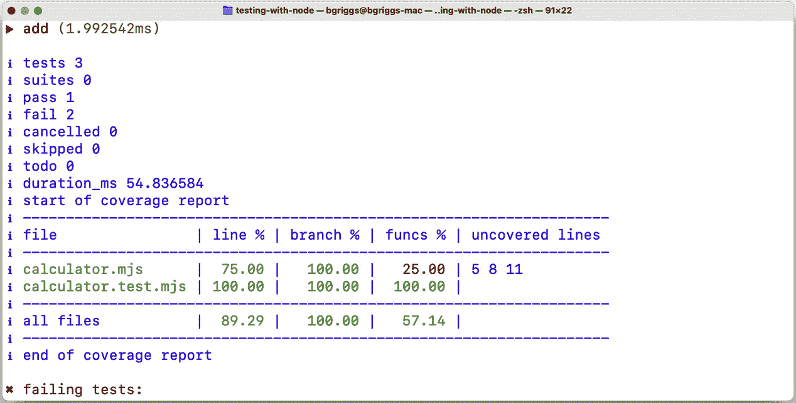
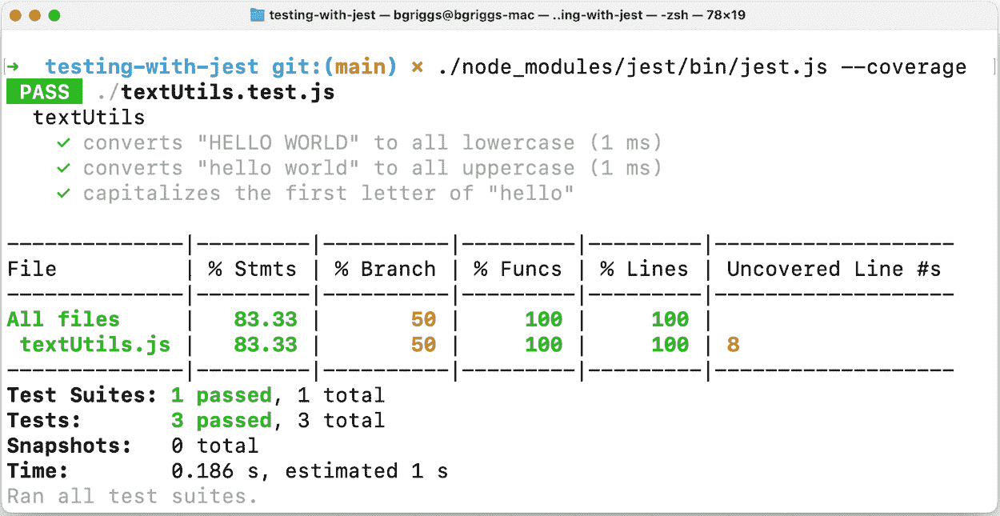
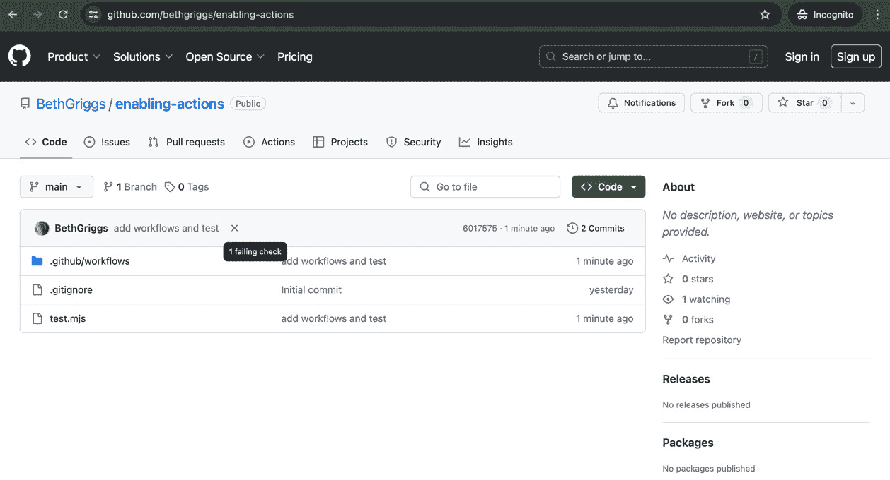
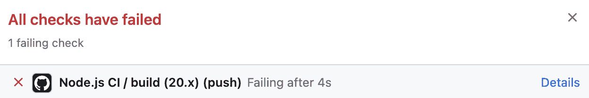
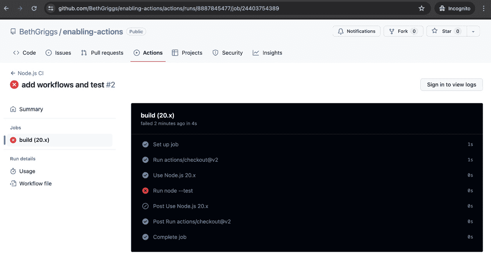
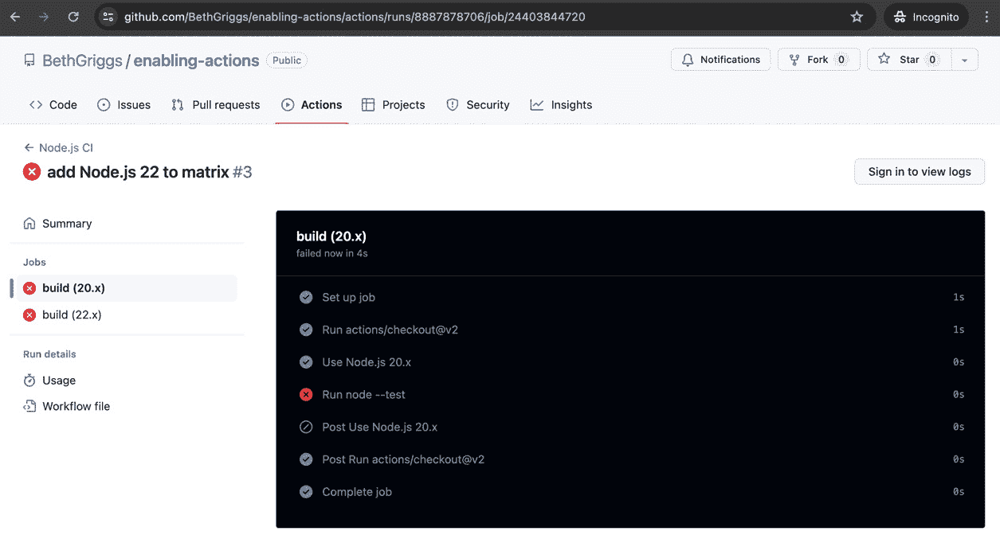

# 8

# 使用 Node.js 进行测试

测试使您能够快速有效地识别代码中的错误。测试用例应编写为验证每段代码是否产生预期的输出或结果。额外的优势是，这些测试可以作为您应用程序预期行为的文档形式。

单元测试是一种测试类型，其中对代码的各个单元进行测试。小型单元测试为您的程序提供了细粒度的规范，以便进行测试。确保您的代码库被单元测试覆盖有助于开发、调试和重构过程，因为它提供了行为和质量的基准度量。拥有全面的测试套件可以更早地发现错误，从而节省时间和金钱，因为错误发现得越早，修复成本就越低。

本章将首先介绍一些关键技巧，这些技巧包含在 Node.js 最近版本中内置的测试运行器中。我们还将探索一些流行的测试框架。测试框架提供组件和实用工具，例如测试运行器，用于运行自动化测试。本章后面的食谱将介绍其他测试概念——包括**存根**、**用户界面**（**UI**）测试以及如何配置**持续集成**（**CI**）测试。

本章将涵盖以下食谱：

+   使用 **node:test** 进行测试

+   使用 Jest 进行测试

+   模拟 HTTP 请求

+   使用 Puppeteer

+   配置 CI 测试

# 技术要求

本章假设您已安装 Node.js，最好是 Node.js 22 的最新版本。您还需要访问您选择的编辑器和浏览器。在整个食谱中，我们将从公共 **npm** 仓库安装模块。

食谱的代码可在本书的 GitHub 仓库（[`github.com/PacktPublishing/Node.js-Cookbook-Fifth-Edition`](https://github.com/PacktPublishing/Node.js-Cookbook-Fifth-Edition)）中的 **Chapter08** 目录中找到。

# 使用 node:test 进行测试

Node.js 在版本 18 中引入了内置测试运行器作为实验性功能，随后在版本 20 中将其稳定化。这一添加标志着 Node.js 运行时开发哲学的重大转变，从“小型核心”转向将更多实用工具添加到运行时本身。

包含内置测试运行器的决定受到了更广泛行业趋势的影响，即向编程语言和运行时中包含更多内置工具。这种转变部分是对安全问题的回应，例如与依赖项漏洞相关的风险。通过提供原生测试解决方案，Node.js 旨在使其环境中的测试成为一等公民，减少由第三方测试运行器提供的潜在攻击面。

Node.js 的内置测试运行器没有像 Jest 等许多常见和流行的测试框架那样广泛的 API。它被设计成一个最小化和轻量级的，但功能齐全的测试实用程序，没有额外功能和配置的开销。

本教程将指导你了解使用 Node.js 内置测试运行器的基础知识，演示它如何在不使用第三方测试框架的情况下在你的项目中执行有效的测试。

## 准备工作

在这个菜谱中，我们将创建并使用一个基本的计算器应用程序来演示使用内置的**node:test**模块进行单元测试的基本原理。在整个菜谱中，我们将使用在*第五章*中介绍的**ECMAScript Module**（**ESM**）语法。

1.  让我们先创建一个工作目录并初始化我们的项目目录：

    ```js
    $ mkdir testing-with-node
    $ cd testing-with-node
    ```

1.  创建一个名为**calculator.mjs**的文件：

    ```js
    $ touch calculator.mjs
    ```

1.  现在，我们可以在**calculator.mjs**中添加以下内容来创建我们的计算器程序：

    ```js
    export const add = (number1, number2) => {
        return number1 + number2;
    };
    export const subtract = (number1, number2) => {
        return number1 - number2;
    };
    export const multiply = (number1, number2) => {
        return number1 * number2;
    };
    export const divide = (number1, number2) => {
        return number1 / number2;
    };
    ```

现在我们已经设置了项目目录并准备好了一个应用程序进行测试，我们可以继续到菜谱步骤。

## 如何做...

在这个菜谱中，我们将使用在*准备就绪*部分创建的小型计算器应用程序的内置**node:test**模块添加单元测试。

1.  第一步是确保我们使用的是具有**node --test**命令的 Node.js 版本。在您的终端中输入以下命令，并期望看到测试运行器执行：

    ```js
    $ node --test
    ℹ tests 0
    ℹ suites 0
    ℹ pass 0
    ℹ fail 0
    ℹ cancelled 0
    ℹ skipped 0
    ℹ todo 0
    ℹ duration_ms 3.212584
    ```

1.  现在，我们应该创建一个名为**calculator.test.mjs**的文件，它将包含我们的测试：

    ```js
    $ touch calculator.test.mjs
    ```

1.  在**calculator.test.mjs**中，我们首先需要导入**node:test**模块：

    ```js
    import test from 'node:test';
    import assert from 'node:assert';
    ```

1.  接下来，我们可以从我们的**calculator.js**程序中导入**add()**函数。我们将仅导入和测试**add()**函数作为示例：

    ```js
    import { add } from './calculator.mjs';
    ```

1.  有时，使用子测试来组织我们的测试是有用的。为了演示这一点，我们将为**add()**函数创建一个测试父级，稍后我们将添加子测试：

    ```js
    test('add', async (t) => {
    });
    ```

1.  现在，我们可以编写我们的第一个测试用例作为一个子测试。我们的第一个测试将向**add()**函数传递整数测试值，并确认我们得到预期的结果。添加以下内容：

    ```js
    test('add', async (t) => {
      await t.test('add integers', () => {
        assert.equal(add(1, 2), 3);
        assert.equal(add(2, 3), 5);
        assert.equal(add(3, 4), 7);
      });
    });
    ```

1.  使用终端中的**node --test**命令运行测试：

    ```js
    $ node --test
    ```

1.  接下来，我们可以添加第二个子测试。这次，我们将以字符串的形式传递数字而不是整数。这个测试预计会失败，因为我们的**calculator.mjs**程序不包含将字符串输入转换为整数的逻辑。在第一个子测试下方添加以下内容：

    ```js
    await t.test('add strings', () => {
      assert.equal(add('1', '2'), 3);
    });
    ```

1.  现在，我们可以在终端窗口中输入以下命令来运行测试：

    ```js
    $ node --test
    ```

1.  你应该会看到以下输出，表明第一个测试通过，第二个测试失败：

    ```js
    ▶ add
      ✔ add integers (0.442953ms)
      ✖ add strings (1.909008ms)
        AssertionError [ERR_ASSERTION]: '12' == 3
            at TestContext.<anonymous> (file:///Users/beth/Node.js-Cookbook/testing-with-node/calculator.test.mjs:14:12)
            at Test.runInAsyncScope (node:async_hooks:206:9)
            at Test.run (node:internal/test_runner/test:639:25)
            at Test.start (node:internal/test_runner/test:550:17)
    ...
    ```

我们学习了如何使用**node:test**模块为我们的应用程序编写单元测试。我们已经执行了这些测试，并产生了测试结果的**Test Anything Protocol**（**TAP**）摘要。

## 它是如何工作的...

在提供的示例中，我们使用 Node.js 的内置模块**node:test**，首先使用 ESM 语法导入必要的模块。这包括从**node:test**导入的**test**，用于测试框架功能，从**node:assert**导入的**assert**，用于断言，以及从本地模块**calculator.mjs**导入的**add()**函数，该函数是待测试的函数。

重要提示

使用**node:**方案前缀导入**node:test**模块至关重要，如下所示：**const test = require('node:test');**。这个模块是第一个仅通过**node:**前缀暴露的模块之一。尝试不使用**node:**前缀导入它，如**const test = require('test');**，将会导致错误。

测试是通过**test()**函数构建的，其中每个测试用例都被封装在一个异步函数中。在每个测试中，使用**await t.test(...)**定义子测试，这有助于按层次组织测试，并在一个测试块中干净地管理多个断言或设置过程。对于断言条件，使用**assert.strictEqual()**来比较预期和实际结果，确保类型和值都相等。

Node.js 中的**node:assert**模块提供了一套断言函数，用于验证不变性，主要用于编写测试。关键断言包括**assert.strictEqual()**，它检查预期值和实际值之间的严格相等性，以及**assert.deepStrictEqual()**，它执行对象和数组的深度相等性比较。该模块还提供了**assert.ok()**来测试一个值是否为**真值**，以及**assert.rejects()**和**assert.doesNotReject()**来处理应该或不应该拒绝的承诺。这个断言套件允许开发者强制执行代码中的预期行为和值。有关可用断言的完整列表，请参阅 Node.js assert 模块文档：[`nodejs.org/docs/latest/api/assert.html#assert`](https://nodejs.org/docs/latest/api/assert.html#assert)。

要运行这些测试，可以直接使用 Node.js 在命令行中执行脚本，运行**node --test**。这种方法直接将测试结果输出到控制台，指示哪些测试已通过或失败。使用 Node.js 的内置测试工具的方法简化了测试过程，消除了对外部库的需求——减少了开销并最小化了第三方依赖。

在配方中，我们使用**spec**格式输出了测试结果。当使用**node:test**模块与**终端界面**（**TTY**）一起使用时，默认输出报告器设置为**spec**。**spec**报告器以人类可读的方式格式化测试结果。如果标准输出不是 TTY，模块默认使用**tap**报告器，它以 TAP 格式输出测试结果。

可以使用 **--test-reporter** 命令行标志指定替代测试报告输出。有关可用报告器的详细信息，请参阅 Node.js 文档：[`nodejs.org/docs/latest-v22.x/api/test.html#test-reporters`](https://nodejs.org/docs/latest-v22.x/api/test.html#test-reporters)。

## 更多内容...

为了进一步加深你对核心 **node:test** 模块的理解，让我们探索测试运行器用于定位和执行测试的默认文件模式，以及简化测试过程的附加功能。

### 理解 Node.js 默认测试文件模式

Node.js 测试运行器会自动根据文件名查找并运行测试文件，通过查找匹配特定模式的文件来实现——本质上，这些模式是文件是测试的指示器。这些模式使用通配符（*****）和可选组（**?(...)**）来包含各种文件名和扩展名。双星号（******）表示 Node.js 搜索所有目录和子目录，因此无论测试文件在哪里，只要它们匹配模式，就会被找到。

以下是 Node.js 测试运行器默认搜索的常见模式：

+   ****/*.test.?(c|m)js**：这将在任何目录中找到以 **.test.js**、**.test.cjs** 或 **.test.mjs** 结尾的文件

+   ****/*-test.?(c|m)js**：与第一个模式类似，但用于以 **-test.js**、**-test.cjs** 或 **-test.mjs** 结尾的文件

+   ****/*_test.?(c|m)js** 捕获以 **_test.js**、**_test.cjs** 或 **_test.mjs** 结尾的文件

+   ****/test-*.?(c|m)js** 查找以 **test-** 开头并以 **.js**、**.cjs** 或 **.mjs** 结尾的文件

+   ****/test.?(c|m)js** 匹配名为 **test.js**、**test.cjs** 或 **test.mjs** 的文件

+   ****/test/**/*.?(c|m)js** 深入任何 **test** 目录并找到任何子目录中具有 **.js**、**.cjs** 或 **.mjs** 扩展名的文件

为了确保 Node.js 可以找到并运行你的测试而无需额外配置，建议按照这些模式命名你的测试文件。这有助于保持项目组织并符合常见的 Node.js 实践。

### 过滤测试

使用 **node:test** 模块，有多个选项可用于过滤测试，以管理在测试运行期间执行哪些测试。这种灵活性在开发或调试期间专注于特定测试时非常有用：

+   **跳过测试**：可以使用 **skip** 选项或测试上下文中的 **skip()** 方法跳过测试。这对于暂时禁用测试而不从代码库中删除它非常有用。例如，使用 **{ skip: true }** 标记测试或在使用 **test()** 函数时使用 **t.skip()** 将阻止其执行：

    ```js
    test('add strings', { skip : true }, () => {
      assert.equal(add('1', '2'), 3);
    });
    ```

+   **标记测试为 todo**：当一个测试尚未实现或已知为不可靠时，它可以被标记为 **todo**。这些测试仍然会运行，但它们的失败不会计入测试套件的成功。使用 **{ todo: true }** 选项或 **t.todo()** 可以有效地注释这些测试。

+   **专注于特定测试**：使用 **{ only: true }** 选项来专注于运行特定的测试，跳过所有未标记此选项的其他测试。这在需要隔离测试进行审查而不运行整个测试套件时特别有用。

+   **按测试名称过滤**：使用 **--test-name-pattern** 命令行选项可以根据测试名称进行过滤。当你想运行匹配特定命名模式或约定的测试子集时，这很有用。模式被视为正则表达式。例如，使用 **--test-name-pattern="add"** 运行测试套件将仅执行名称中包含 **"add"** 的测试。

### 收集代码覆盖率

**代码覆盖率** 是一个关键指标，用于评估在测试期间源代码的执行程度，帮助开发者识别其代码库中未测试的部分。在 Node.js 中，启用代码覆盖率很简单，但请注意，此功能目前是实验性的。

你可以通过使用带有 **--experimental-test-coverage** 命令行标志启动 Node.js 来启用它。此设置会自动收集覆盖率统计信息，并在所有测试完成后报告。报告不包括 Node.js 核心模块和 **node_modules** 目录内的文件覆盖率。

可以通过使用注解来控制哪些行包含在代码覆盖率中：

+   **/* node:coverage disable */** 和 **/* node:coverage enable */** ，它们可以排除特定行或代码块不被计数

+   **/* node:coverage ignore next */** 用于排除以下行

+   **/* node:coverage ignore next n */** 用于排除以下 **n** 行

可以通过内置的报告器如 **tap** 和 **spec** 概括覆盖率结果，或通过 **lcov** 报告器详细展示，该报告器生成适合深入分析的 **lcov** 文件。

重要提示

当前 **--experimental-test-coverage** 的实现存在限制，例如缺少源映射支持以及无法从覆盖率报告中排除特定文件或目录。

要收集来自食谱示例的代码覆盖率，你可以运行以下命令：

```js
$ node --test --experimental-test-coverage
```

预期将看到以下输出：



图 8.1 – 显示 node:test 代码覆盖率报告的终端窗口

## 参见

+   本章的 *使用 Jest 进行测试* 食谱

+   本章的 *配置持续集成测试* 食谱

+   *编写模块代码* 食谱在 *第五章*

# 使用 Jest 进行测试

Jest 是由 Facebook 开发的一个广泛使用的开源 JavaScript 测试框架。它特别适用于测试 React 应用程序，尽管其多功能性也扩展到 Node.js 环境。Jest 是一个具有众多捆绑功能的具有观点的测试框架。

在本指南中，我们将探讨如何有效地使用 Jest 编写和结构测试。您将学习 Jest 的关键原则以及如何设置您的测试环境。此外，我们将探索 Jest 在衡量和报告测试覆盖率方面的功能，以帮助您了解您的代码库被测试覆盖得有多好。

## 准备工作

我们将使用 Jest 测试一个提供一些文本实用函数的程序。

1.  首先，让我们创建和初始化我们的项目目录：

    ```js
    $ mkdir testing-with-jest
    $ cd testing-with-jest
    $ npm init --yes
    ```

1.  我们需要一个程序来测试。创建一个名为 **textUtils.js** 的文件：

    ```js
    $ touch textUtils.js
    ```

1.  将以下代码添加到 **textUtils.js** 中：

    ```js
    function lowercase (str) {
      return str.toLowerCase();
    }
    function uppercase (str) {
      return str.toUpperCase();
    }
    function capitalize (str) {
      if (!str) return str;
      return str.charAt(0).toUpperCase() +
        str.slice(1).toLowerCase();
    }
    module.exports = { lowercase, uppercase, capitalize };
    ```

1.  我们还将创建一个名为 **textUtils.test.js** 的测试文件：

    ```js
    $ touch textUtils.test.js
    ```

现在我们已经初始化了目录和文件，我们可以继续进行菜谱步骤。

## 如何做到这一点…

在这个菜谱中，我们将学习如何使用 Jest 编写和结构各种测试。

1.  首先，我们需要将 Jest 作为开发依赖项安装：

    ```js
    $ npm install --save-dev jest
    ```

1.  我们还将更新我们的 **package.json** 文件中的 **npm** 测试脚本来调用 **jest** 测试运行器。将 **"test"** 脚本字段更改为以下内容：

    ```js
      "scripts": {
        "test": "jest"
      }
    ```

1.  在 **textUtils.test.js** 中，我们首先需要导入我们的 **textUtils.js** 模块，以便我们可以对其进行测试。将以下行添加到测试文件的顶部：

    ```js
    const { lowercase, uppercase, capitalize } =
      require('./textUtils');
    ```

1.  添加一个 Jest **describe()** 块。Jest **describe()** 块用于对测试进行分组和结构。添加以下内容：

    ```js
    describe('textUtils', () => {
    });
    ```

1.  在 **describe()** 块内，我们可以开始添加我们的测试用例。我们使用 Jest 的 **test()** 语法来定义每个测试。我们的测试将使用 Jest 的断言语法来验证当我们调用我们的 **lowercase()** 和 **uppercase()** 函数时，它们会产生预期的结果。在 **describe()** 块内添加以下代码以创建三个测试用例：

    ```js
      test('converts "HELLO WORLD" to all lowercase', ()
        => {
          expect(lowercase('HELLO WORLD')).toBe('hello
            world');
      });
      test('converts "hello world" to all uppercase', ()
        => {
          expect(uppercase('hello world')).toBe('HELLO
            WORLD');
      });
      test('capitalizes the first letter of "hello"', ()
        => {
          expect(capitalize('hello')).toBe('Hello');
      });
    ```

1.  现在，我们可以运行我们的测试。我们可以在终端中输入 **npm test** 命令来运行测试。Jest 将打印出我们的测试结果摘要：

    ```js
    $ npm test
    > testing-with-jest@1.0.0 test
    > jest
     PASS  ./textUtils.test.js
      textUtils
        ✓ converts "HELLO WORLD" to all lowercase (2 ms)
        ✓ converts "hello world" to all uppercase (1 ms)
        ✓ capitalizes the first letter of "hello"
    Test Suites: 1 passed, 1 total
    Tests:       3 passed, 3 total
    Snapshots:   0 total
    Time:        0.342 s, estimated 1 s
    Ran all test suites.
    ```

1.  Jest 提供了一个内置的代码覆盖率功能。运行此命令将显示我们的程序中哪些行已被测试用例覆盖。您可以通过将 **--coverage** 标志传递给 Jest 可执行文件来启用覆盖率报告。在您的终端中输入以下命令以引用已安装的 Jest 可执行文件并报告代码覆盖率：

    ```js
    $ ./node_modules/jest/bin/jest.js --coverage
    ```

    期望看到以下输出：



图 8.2 – 显示 Jest 代码覆盖率报告的终端窗口

注意，代码覆盖率报告指出我们在 textUtils.js 中没有覆盖第 8 行。注意，根据您的代码格式，具体的行号可能会有所不同。有了这些信息，我们可以添加一个测试用例来满足这一行。

1.  将以下测试用例添加到 **textUtils.test.js** 中以覆盖缺失的行：

    ```js
      test('return empty string as it is', () => {
        expect(capitalize('')).toBe('');
      });
    ```

1.  现在，你可以使用以下命令重新运行代码覆盖率报告，并期望看到我们的代码现在是 100% 覆盖的：

    ```js
    $ ./node_modules/jest/bin/jest.js --coverage
    ```

现在，我们已经使用 Jest 为我们的 **textUtils.js** 模块创建了一个测试，并学习了如何生成代码覆盖率报告。

## 它是如何工作的…

我们 **textUtils.test.js** 文件的第一行导入了我们的 **textUtils.js** 模块，这使得我们可以在测试时调用它。

我们使用 Jest 的 **describe()** 和 **test()** 函数组织了我们的测试。**describe()** 函数用于定义一组测试。**describe()** 方法接受两个参数。第一个是测试组的名称，第二个参数是一个回调函数，该函数可以包含测试用例或嵌套的 **describe()** 块。

Jest 的 **test()** 语法用于定义测试用例。**test()** 方法接受两个参数。第一个是测试名称，第二个是包含测试逻辑的回调函数。

这个程序的测试逻辑只有一行，它断言当我们调用 **uppercase('hello world')** 时，会返回预期的 **HELLO WORLD** 值。这个断言使用了 Jest 的 **Expect** 内置断言库 ([`www.npmjs.com/package/expect`](https://www.npmjs.com/package/expect))。我们使用了 **Expect** 库中的 **toBe()** 断言来比较两个值。

**Expect** 提供了许多断言方法，包括 **toBe()**、**toContain()**、**toThrow()** 等。断言的完整列表可以在 Jest 的 API 文档的 **Expect** 部分中找到 [`jestjs.io/docs/en/expect.html#methods`](https://jestjs.io/docs/en/expect.html#methods) 。

还可以通过在我们的语句中添加 **.not** 来反转断言，如下面的示例所示：

```js
  expect(uppercase('hello')).not.toBe('hello');
```

要运行我们的测试用例，我们调用位于 **node_modules** 目录中的 **jest** 测试运行器。Jest 可执行文件运行测试，自动查找包含 **test.js** 的文件。运行器执行我们的测试，然后生成结果摘要。

在食谱的最后一步，我们启用了 Jest 的代码覆盖率报告。代码覆盖率是衡量在执行测试时我们的程序代码中有多少行被触发的度量。100% 的代码覆盖率意味着你的程序中的每一行都被测试套件所覆盖。这有助于你轻松地检测由代码更改引入的缺陷。一些开发者和组织为代码覆盖率设定了可接受的阈值，并实施限制，以确保代码覆盖率百分比不会下降。

## 还有更多……

Jest 提供的功能比其他一些流行的 Node.js 测试库更多 **out of the box** ( **OOTB** )。让我们看看其中的一些。

### 设置和清理

Jest 为测试提供了设置和清理功能。可以使用 **beforeEach()** 和 **beforeAll()** 函数分别运行设置步骤，在每次或所有测试之前。同样，可以使用 **afterEach()** 和 **afterAll()** 函数分别运行清理步骤，在每次或所有测试之后。

以下伪代码演示了这些函数如何使用：

```js
describe('test', () => {
  beforeAll(() => {
    // Runs once before all tests
  });
  beforeEach(() => {
    // Runs before each test
  });
  afterEach(() => {
    // Runs after each test
  });
  afterAll(() => {
    // Runs after all tests
  });
});
```

### 使用 Jest 进行模拟

模拟（Mocks）允许你在不执行代码的情况下测试你的代码或函数的交互。模拟通常用于测试依赖于第三方服务或 API 的情况，你不想在运行测试套件时向这些服务发送真实请求。模拟（Mocking）有一些好处，包括测试套件的执行速度更快，并确保你的测试不会受到网络条件的影响。

Jest 提供了开箱即用的模拟功能。我们可以使用模拟来验证我们的函数是否以正确的参数被调用，而不需要执行该函数。

例如，我们可以将菜谱中的测试更改为使用以下代码模拟 **uppercase()** 模块：

```js
describe('uppercase', () => {
  test('uppercase hello returns HELLO', () => {
    uppercase = jest.fn(() => 'HELLO');
    const result = uppercase('hello');
    expect(uppercase).toHaveBeenCalledWith('hello');
    expect(result).toBe('HELLO');
  });
});
```

**jest.fn(() => 'HELLO');** 方法返回一个新的模拟函数。我们将这个函数赋值给一个名为 **uppercase** 的变量。参数是一个返回字符串 **'HELLO'** 的回调函数——这是为了演示我们如何模拟函数的返回值。

**Expect** 的 **.toHaveBeenCalled()** 方法验证我们的模拟函数是否以正确的参数被调用。如果你在测试套件中无法执行某个函数，你可以使用模拟来验证该函数是否以正确的参数被调用。

### 测试异步代码

测试异步代码对于确保 Node.js 应用程序按预期运行至关重要，尤其是在处理 API 调用、数据库事务或任何依赖于承诺解析或回调的过程时。Jest 提供了一种清晰直接的方式来处理测试中的这些异步操作，确保在做出断言之前它们已经完成。

在 Jest 中测试异步代码最常见的方法是使用 **async** / **await** 语法以及 Jest 的 **.resolves** 和 **.rejects** 匹配器。例如，考虑一个返回承诺解析到一些数据的 **fetchData()** 函数：

```js
function fetchData() {
    return new Promise((resolve) => {
        setTimeout(() => resolve('hello'), 1000);
    });
}
```

你可以编写一个 Jest 测试来验证 **fetchData()** 是否解析为预期的值：

```js
test('data is hello', async () => {
    await expect(fetchData()).resolves.toBe('hello');
});
```

这个测试将等待 **fetchData()** 承诺解析，多亏了 **await** 关键字，然后检查解析的值是否匹配 **'hello'** 。

或者，如果你正在处理使用回调的异步代码，你可以使用 Jest 的 **done()** 回调来处理这种模式：

```js
function fetchDataCallback(callback) {
    setTimeout(() => { callback('hello');  }, 1000);
}
test('the data is hello', done => {
    function callback(data) {
        try {
            expect(data).toBe('hello');
            done();
        } catch (error) {
            done(error);
        }
    }
    fetchDataCallback(callback);
});
```

在这个测试中，一旦回调接收到数据，**done()** 就会被调用一次，向 Jest 信号测试已完成。如果期望中存在错误，使用带有 **error** 参数的 **done()** 调用允许 Jest 正确处理错误。

## 参见

+   本章中的 *配置持续集成测试* 菜谱

+   本章的 *编写模块代码* 菜谱 第五章

# 模拟 HTTP 请求

你构建的 Node.js 应用程序通常依赖于并消耗外部服务或 API。在进行单元测试时，你通常不希望你的测试向外部服务发送请求。你消耗的外部服务的请求是计费或速率限制的，你不想你的测试用例消耗这些配额。

也可能你的测试需要访问服务凭证。这意味着项目上的每个开发者都必须在运行测试套件之前访问这些凭证。

为了能够在不向外部服务发送请求的情况下对代码进行单元测试，你可以伪造一个请求和响应。这个概念被称为模拟。模拟可以用来模拟 API 调用，而不发送请求。模拟还有一个额外的优点，即减少任何请求延迟，可能使测试比发送真实请求更快地运行。

模拟和模拟测试的概念经常被混淆。模拟为被测试的单元提供预定义的响应以进行隔离，而模拟也通过确保方法以某些参数被调用来验证交互。

在这个菜谱中，我们将使用 Sinon.js，这是一个提供模拟功能的库。

## 准备工作

要开始，让我们为这个菜谱设置我们的目录和文件。

1.  创建一个目录并初始化项目：

    ```js
    $ mkdir stubbing-http-requests
    $ cd stubbing-http-requests
    $ npm init --yes
    ```

1.  现在，我们将创建一个向第三方服务发送请求的程序。创建一个名为 **github.mjs** 的文件：

    ```js
    $ touch github.mjs
    ```

1.  在我们的 **github.mjs** 文件中，我们将向 **https://api.github.com/users/** 端点发送一个 HTTP **GET** 请求。将以下内容添加到 **github.mjs**：

    ```js
    export async function getGitHubUser(username) {
      const response = await
        fetch(`https://api.github.com/users/${username}`);
      return response.json();
    }
    ```

现在我们有一个向 GitHub API 发送 HTTP 请求的程序，我们可以继续到菜谱步骤，我们将学习如何模拟请求。

## 如何做到这一点…

在这个菜谱中，我们将学习如何在测试中模拟 HTTP 请求。但首先我们需要创建一个测试用例。我们将使用 **node:test** 以避免安装额外的测试框架。

1.  创建一个名为 **github.test.mjs** 的文件：

    ```js
    $ touch github.test.mjs
    ```

1.  将以下内容添加到 **github.test.mjs** 中，以创建一个用于 **getGithubUser()** 函数的测试用例，使用 **node:test**：

    ```js
    import * as assert from 'node:assert';
    import { test } from 'node:test';
    import { getGitHubUser } from './github.mjs';
    test('Get GitHub user by username', async (t) => {
      const githubUser = await getGitHubUser('octokit');
      assert.strictEqual(githubUser.id, 3430433);
      assert.strictEqual(githubUser.login, 'octokit');
      assert.strictEqual(githubUser.name, 'Octokit');
    });
    ```

1.  我们可以运行测试来检查它是否通过：

    ```js
    $ node --test --test-reporter=tap
    TAP version 13
    # Subtest: Get GitHub user by username
    ok 1 - Get GitHub user by username
      ---
      duration_ms: 279.80306
      ...
    1..1
    # tests 1
    # suites 0
    # pass 1
    # fail 0
    # cancelled 0
    # skipped 0
    # todo 0
    # duration_ms 426.372579
    ```

1.  现在，我们可以继续到 [模拟](https://www.npmjs.com/package/sinon)。我们首先需要安装 l **sinon**（[`www.npmjs.com/package/sinon`](https://www.npmjs.com/package/sinon)）作为开发依赖项：

    ```js
    $ npm install --save-dev sinon
    ```

1.  然后，在 **github.test.mjs** 中，我们需要导入 **sinon**。在导入 **node:test** 模块的那行下面添加以下内容：

    ```js
    import sinon from 'sinon';
    ```

1.  为了能够模拟请求，我们需要存储对 GitHub API 的真实请求的输出。在这种情况下，我们将创建一个 **fakeResponse** 常量，只返回我们正在验证的值。将以下内容添加到测试用例的开始部分：

    ```js
      const fakeResponse = Promise.resolve({
        json: () => Promise.resolve({
          id: 3430433,
          login: 'octokit',
          name: 'Octokit'
        })
      });
    ```

1.  接下来，我们需要添加一行指令，让测试使用模拟的 **fetch()** 函数而不是真实函数：

    ```js
      sinon.stub(global, 'fetch').returns(fakeResponse);
    ```

1.  在测试用例中调用我们的 **getGitHubUser('octokit')** 之后，我们应该恢复原始的 **fetch()** 方法，以便其他测试或代码可以使用它。我们可以通过使用 **sinon.restore();** 来实现这一点。将此行添加到调用 **getGitHubUser('octokit')** 的下方。

1.  您的完整 **github.test.mjs** 文件现在应该看起来像以下这样：

    ```js
    import * as assert from 'node:assert';
    import { test } from 'node:test';
    import sinon from 'sinon';
    import { getGitHubUser } from './github.mjs';
    test('Get GitHub user by username', async (t) => {
      const fakeResponse = Promise.resolve({
        json: () => Promise.resolve({
          id: 3430433,
          login: 'octokit',
          name: 'Octokit'
        })
      });
      sinon.stub(global, 'fetch').returns(fakeResponse);
      const githubUser = await getGitHubUser('octokit');
      sinon.restore();
      assert.strictEqual(githubUser.id, 3430433);
      assert.strictEqual(githubUser.login, 'octokit');
      assert.strictEqual(githubUser.name, 'Octokit');
    });
    ```

1.  让我们重新运行测试并检查在模拟请求后它们是否仍然通过：

    ```js
    $ node --test --test-reporter=tap
    TAP version 13
    # Subtest: Get GitHub user by username
    ok 1 - Get GitHub user by username
      ---
      duration_ms: 2.510738
      ...
    1..1
    # tests 1
    # suites 0
    # pass 1
    # fail 0
    # cancelled 0
    # skipped 0
    # todo 0
    # duration_ms 129.078933
    ```

注意这次测试运行的 **duration_ms** 值减少了 – 这是因为我们没有通过网络发送真实请求。

我们现在已经学会了如何使用 Sinon.js 模拟 API 请求。

## 它是如何工作的…

在配方中，Sinon.js 用于模拟从 GitHub API 获取用户数据的函数的行为。我们不是执行实际的网络请求，这可能会很慢并消耗有限的 API 请求配额，而是用“模拟”替换全局的 **fetch()** 方法。这个 **stub()** 函数旨在解析为一个预定的对象，该对象代表 GitHub 用户的资料。

初始时，必要的模块和实用工具被导入：**node:assert** 用于断言，**node:test** 用于定义测试用例，以及 **sinon** 用于创建模拟。我们还导入了计划要测试的 **getGitHubUser()** 函数。

Sinon.js 用于创建全局 **fetch()** 函数的模拟。该模拟旨在返回一个类似于实际 GitHub API 预期响应的假响应。这个假响应是一个 *promise*，它解析为一个具有 **json()** 方法的对象。这反过来又返回一个解析为包含我们的测试 GitHub 用户 **id**、**login** 和 **name** 属性的对象的 *promise* – 模仿 GitHub API 响应的格式。

当使用 **octokit** 用户名调用 **getGitHubUser()** 时，模拟的 **fetch()** 函数拦截调用并返回一个假响应。因此，**getGitHubUser** **()** 将此响应处理为如果它是一个来自 API 的真实响应，但不会产生网络延迟。在模拟的 API 调用之后，实际的用户对象被等待并检查与预期值是否一致，以确认 **getGitHubUser()** 函数按预期处理响应。

断言之后，调用 **sinon.restore()**，这将恢复原始的 **fetch()** 方法。这确保了后续的测试或其他代码库的其它部分不会受到此测试中 **fetch()** 方法模拟的影响。这种做法确保了测试的隔离性，并防止了对其他测试的副作用。

这个配方通过演示如何使用 Sinon.js 模拟单个方法，提供了一个对模拟过程的概述。模拟可以用来替换测试系统中的任何部分，从单个函数到整个模块，这在微服务架构中尤其有用，因为服务可能依赖于其他服务的响应。

## 参见

+   本章中的 *使用 Jest 进行测试* 配方

+   本章中的 *配置持续集成测试* 配方

# 使用 Puppeteer

UI 测试是一种用于识别 **图形用户界面**（**GUIs**）问题的技术，尤其是在网络应用程序中。尽管 Node.js 主要是一个服务器端平台，但它经常被用来开发网络应用程序，其中 UI 测试发挥着关键作用。

例如，如果你有一个包含 HTML 表单的应用程序，你可以使用 UI 测试来验证 HTML 表单是否包含正确的输入字段集合。UI 测试还可以验证与界面的交互，例如模拟按钮点击或超链接激活。

Puppeteer 是一个开源库，它提供了一个无头 Chromium 实例，可以与它进行程序化交互以自动化 UI 测试。由于其原生支持和易于集成，它特别适用于 Node.js 环境。

在这个配方中，我们将使用 Puppeteer ([`pptr.dev/`](https://pptr.dev/)) 对 **http://example.com/** 网站进行 UI 测试。然而，Node.js 中用于 UI 测试的其他流行替代方案包括 Selenium、Cypress 和 Playwright。虽然这些工具的高层次原理和目的相似，但每个工具都有其优势，可以根据特定的需求（如跨浏览器测试、设置简便性和集成能力）进行选择。

## 准备工作

通过设置一个新的项目目录并创建一个初始测试文件来为 Puppeteer 准备你的开发环境。

1.  创建一个目录并初始化我们的项目目录：

    ```js
    $ mkdir using-puppeteer
    $ cd using-puppeteer
    $ npm init --yes
    ```

1.  接下来，我们将创建我们的 UI 测试文件：

    ```js
    $ touch test.js
    ```

现在我们已经初始化了项目目录，我们准备进入配方步骤。

## 如何做到这一点...

在这个配方中，我们将学习如何使用 Puppeteer 测试网页。我们将验证我们从 **https://example.com** 收到预期的内容。我们将使用 Node.js 核心库 **assert** 进行断言逻辑。

1.  第一步是安装 **puppeteer** 模块。我们将把 **puppeteer** 模块作为开发依赖项安装，因为它只会在测试中使用：

    ```js
    $ npm install --save-dev puppeteer
    ```

    注意，这可能需要很长时间，因为它正在下载无头浏览器 Chromium。

1.  接下来，我们将打开 **test.js** 并添加以下行以导入 **assert** 和 **puppeteer** 模块：

    ```js
    const assert = require('node:assert');
    const puppeteer = require('puppeteer');
    ```

1.  接下来，我们将创建一个名为 **runTest()** 的异步函数，它将包含所有的测试逻辑：

    ```js
    async function runTest() {
    }
    ```

1.  在 **runTest()** 函数中，我们需要启动 Puppeteer。通过添加以下行来实现，该行调用 Puppeteer 的 **launch()** 函数：

    ```js
      const browser = await puppeteer.launch();
    ```

1.  接下来，也在 **runTest()** 函数内部，我们需要创建一个新的 Puppeteer 浏览器页面：

    ```js
      const page = await browser.newPage();
    ```

1.  我们现在可以指示 Puppeteer 加载一个 URL。我们通过在 **page** 对象上调用 **goto()** 函数来实现这一点：

    ```js
      await page.goto('https://example.com');
    ```

1.  现在我们已经获得了网页的句柄（ **https://example.com** ），我们可以通过调用 Puppeteer 的 **$eval()** 函数来从网页中提取值。我们向 **$eval()** 函数提供了 **h1** 标签，表示我们想要抽象 **h1** 元素和一个回调函数。回调函数将返回 **h1** 元素的 **innerText** 值。添加以下行以提取 **h1** 值：

    ```js
      const title = await page.$eval('h1', (el) =>
        el.innerText);
    ```

1.  现在，我们可以添加我们的断言。我们期望标题为 **"Example Domain"** 。添加以下断言语句。我们还将添加一个 **console.log()** 语句以输出值——你通常不会在真实测试用例中这样做，以避免在 **STDOUT** 中产生噪音，但它将帮助我们了解发生了什么：

    ```js
      console.log('Title value:', title);
      assert.equal(title, 'Example Domain');
    ```

1.  我们需要调用 **browser.close()**；否则，Puppeteer 将继续模拟，Node.js 进程将永远不会退出。在 **runTest()** 函数中，添加以下行：

    ```js
      browser.close();
    ```

1.  最后，我们只需调用我们的 **runTest()** 函数。将以下内容添加到 **test.js** 的底部，在 **runTest()** 函数外部：

    ```js
     runTest();
    ```

1.  我们现在可以运行测试了。在您的终端中输入以下命令以运行测试：

    ```js
    $ node test.js
    Title value: Example Domain
    ```

我们现在已经使用 Puppeteer 创建了我们的第一个 UI 测试。

## 它是如何工作的...

在配方中，我们使用了 Puppeteer 创建了一个测试，以验证 **https://example.com** 网页在 **h1** HTML 元素标签内返回标题 **'Example Domain'**。大多数 Puppeteer API 都是异步的，因此我们在整个配方中使用了 **async** / **await** 语法。

当我们调用 **puppeteer.launch()** 时，Puppeteer 初始化了一个新的无头 Chrome 实例，我们可以通过 JavaScript 与之交互。由于使用 Puppeteer 进行测试具有无头 Chrome 实例的开销，因此它可能不如其他类型的测试性能好。然而，由于 Puppeteer 在底层与 Chrome 交互，它提供了非常接近最终用户与 Web 应用程序交互的模拟。

一旦启动了 Puppeteer，我们就通过在 **browser** 对象上调用 **newPage()** 方法初始化了一个 **page** 对象。**page** 对象用于表示一个网页。在 **page** 对象上，我们随后调用了 **goto()** 方法，该方法用于告诉 Puppeteer 应为该对象加载哪个 URL。

在 **page** 对象上调用 **$eval()** 方法以从网页中提取值。在配方中，我们将 **$eval()** 方法的 **h1** 作为第一个参数传递。这指示 Puppeteer 识别并提取 HTML **<h1>** 元素。第二个参数是一个回调函数，它提取 **<h1>** 元素的 **innerText** 值。对于 **http://example.com** ，这提取了 **'Example Domain'** 值。

在 **runTest()** 函数的末尾，我们调用了 **browser.close()** 方法来指示 Puppeteer 结束 Chrome 模拟。这是必要的，因为 Puppeteer 将继续使用 Node.js 进程永不退出来模拟 Chrome。

这是一个简单的例子，但它为理解 UI 测试自动化工作原理奠定了基础。这个测试脚本很容易扩展，允许模拟更复杂用户交互，如表单提交、导航和错误处理。

## 还有更多...

也可以在非无头模式下运行 Puppeteer。你可以通过向 **launch()** 方法传递一个参数来实现：

```js
   const browser = await puppeteer.launch({
        headless: false
    });
```

在此模式下，当你运行测试时，你会看到 Chromium UI，并且可以在测试执行时跟踪你的测试。这在调试 Puppeteer 测试时可能很有用。

## 参见

+   本章中的 *使用 Jest 进行测试* 菜谱

+   本章中的 *配置持续集成测试* 菜谱

# 配置持续集成测试

持续集成（CI）是一种开发实践，开发者会定期将他们的代码合并到源代码库中。为了保持源代码的完整性，通常在每次代码更改被接受之前都会运行自动化测试。

GitHub 是最广泛使用的源代码仓库托管平台之一。使用 GitHub，当你希望将更改合并到主 Git 分支或仓库时，你将打开一个 **pull request**（**PR**）。GitHub 提供了配置每个 PR 应该运行的检查的功能。要求 PR 在接受之前通过应用程序或模块的单元测试是一个常见且良好的实践。

有许多 CI 产品可以启用你的单元测试执行（GitHub Actions、Travis CI 以及许多其他）。这些程序中的大多数都为休闲开发者提供有限的免费层，为企业和企业提供了付费的商业计划。

在这个菜谱中，我们将学习如何配置 GitHub Actions 来运行我们的 Node.js 测试。

## 准备工作

对于这个菜谱，你需要一个 GitHub 账户。如果你不熟悉 Git 和 GitHub，请参考 *第五章* 中的 *构建模块* 菜谱。

为了能够配置 GitHub Actions 来运行单元测试，我们首先需要创建一个 GitHub 仓库和一些示例单元测试。

1.  通过 [`github.com/new`](https://github.com/new) 创建一个新的 GitHub 仓库。将新仓库命名为 **enabling-actions**。同时，通过下拉菜单添加 *Node* **.gitignore** 模板。

1.  使用以下命令克隆你的 GitHub 仓库，将 **<username>** 替换为你的 GitHub 用户名：

    ```js
    $ git clone https://github.com/<username>/enabling-actions.git
    Cloning into 'enabling-actions'...
    remote: Enumerating objects: 3, done.
    remote: Counting objects: 100% (3/3), done.
    remote: Compressing objects: 100% (2/2), done.
    remote: Total 3 (delta 0), reused 0 (delta 0), pack-reused 0
    Receiving objects: 100% (3/3), done.
    ```

1.  我们现在需要使用 **npm** 初始化我们的项目并安装 **tape** 测试库：

    ```js
    $ cd enabling-actions
    ```

1.  我们还需要创建一个测试。创建一个名为 **test.mjs** 的文件：

    ```js
    $ touch test.mjs
    ```

1.  将以下内容添加到 **test.mjs** 中以创建我们的单元测试：

    ```js
    import { strictEqual } from 'node:assert';
    import { test } from 'node:test';
    test('test integer addition', async (t) => {
      strictEqual(1 + 1, 2, '1 + 1 should equal 2');
    });
    test('test string addition', async (t) => {
      // This test is expected to fail because "11" is not numerically 2
      strictEqual('1' + '1', 2, 'Concatenation of "1" and
        "1" does not equal 2');
    });
    ```

1.  现在我们已经初始化了项目并有一些单元测试，我们可以继续配置 GitHub Actions。

## 如何操作...

在这个菜谱中，我们将学习如何配置 CI，以便在将新更改推送到我们的 GitHub 仓库时运行我们的单元测试。

1.  我们需要在我们的仓库中创建一个 GitHub Actions 工作流程文件。创建一个 **.** **github/workflows** 目录：

    ```js
    $ mkdir -p .github/workflows
    $ touch .github/workflows/test.yml
    ```

1.  将以下内容添加到 **test.yml** 文件中。这将指示 GitHub Actions 使用 Node.js 20 运行我们的测试。请注意，YAML 文件对空白和缩进都很敏感：

    ```js
    name: Node.js CI
    on:
      push:
        branches: [ main ]
      pull_request:
        branches: [ main ]
    jobs:
      build:
        runs-on: ubuntu-latest
        strategy:
          matrix:
            node-version: [ 20.x ]
        steps:
        - uses: actions/checkout@v4
        - name: Use Node.js ${{ matrix.node-version }}
          uses: actions/setup-node@v4
          with:
            node-version: ${{ matrix.node-version }}
        - run: node --test
    ```

1.  现在，我们已经准备好提交我们的代码。在您的终端中输入以下内容以提交代码：

    ```js
    $ git add .github/ test.mjs
    $ git commit --message "add workflows and test"
    $ git push origin main
    ```

1.  在您的浏览器中导航到 **https://github.com/<username>/enabling-actions** 并确认您的代码已推送到仓库。预期它看起来如下：



图 8.3 – GitHub UI 显示 enabling-actions 仓库中的代码

1.  一旦测试运行完成，GitHub Actions 将指示构建失败。这是故意的，因为我们故意创建了一个预期会失败的测试用例。这通过一个红色的叉号图标表示。当点击此图标时，我们将看到有关测试运行的更多详细信息：



图 8.4 – 失败的 GitHub Actions 构建模态

1.  点击 **详情**，它将带您到该测试运行的 **操作** 选项卡：



图 8.5 – GitHub Actions 构建日志

注意，我们可以看到具体的失败步骤，**Run node --test**。您应该能够点击每个步骤以展开并查看日志。

我们已经在我们的 GitHub 仓库中成功启用了 GitHub Actions CI。

## 它是如何工作的…

在 Node.js 应用程序的 GitHub Actions 工作流程配置中，我们概述了一个特定的 CI 流程，该流程旨在在向主分支提交和 PR 时自动化测试。以下是工作流程如何工作的详细分解，其中包含来自 **test.yml** 文件的代码片段示例。

工作流程从在 YAML 文件中的 **on** 键下定义事件触发器开始。它被设置为在 **push** 和 **pull_request** 事件上激活，具体针对 **main** 分支：

```js
on:
  push:
    branches: [ main ]
  pull_request:
    branches: [ main ]
```

此代码片段确保任何推送到 **main** 或对 **main** 提出任何 PR 的代码都将启动 CI 流程。

接下来，我们定义作业环境和指定要测试的 Node.js 版本，使用矩阵策略。这种方法允许跨多个版本进行测试，增强兼容性验证：

```js
jobs:
  build:
    runs-on: ubuntu-latest
    strategy:
      matrix:
        node-version: [20.x, 22.x]
```

当我们使用测试矩阵跨多个版本进行测试时，我们可能会看到以下类似界面：



图 8.6 – GitHub Actions 作业显示在 Node.js 20 和 22 上的构建

**runs-on: ubuntu-latest** 步骤指定作业应在最新可用的 Ubuntu 版本上运行。**matrix.node-version** 初始设置为测试 Node.js 20，但它被扩展到也包括 Node.js 22，展示了如何轻松地将额外的版本纳入测试策略。

在环境设置之后，工作流程包括以下步骤：检出代码、设置 Node.js、安装依赖项以及运行测试：

```js
    steps:
    - uses: actions/checkout@v4
    - name: Use Node.js ${{ matrix.node-version }}
      uses: actions/setup-node@v4
      with:
        node-version: ${{ matrix.node-version }}
    - run: node --test
```

**actions/checkout@v4** 步骤将仓库内容检出至 GitHub Actions 运行器，允许工作流程访问代码。**actions/setup-node@v4** 步骤配置运行器使用由矩阵定义的特定版本的 Node.js。

通过整合这些步骤，GitHub Actions 工作流程自动化了测试过程，确保所有集成到 **main** 分支的新代码都通过了严格的测试流程。这不仅确保了代码质量，还有助于在开发周期早期识别问题，使其更容易管理和修复。

GitHub 分支保护

可以配置 GitHub 以阻止合并请求（PR）直到它们通过构建/持续集成（CI）运行。这可以在您的 GitHub 仓库设置中进行配置。有关如何配置分支保护的信息，请参阅[`docs.github.com/en/repositories/configuring-branches-and-merges-in-your-repository/managing-protected-branches/about-protected-branches`](https://docs.github.com/en/repositories/configuring-branches-and-merges-in-your-repository/managing-protected-branches/about-protected-branches)。

GitHub Actions，就像其他 CI 提供商一样，提供了一个强大且灵活的平台，用于自动化各种开发任务的流程。虽然本教程侧重于为典型的 Node.js 应用程序设置 CI 工作流程，但 GitHub Actions 的范围远不止于此，允许实现多种复杂的流程。

## 参见

+   本章的 *使用 node:test 进行测试* 菜单

+   *第五章* 的 *搭建模块* 菜单
