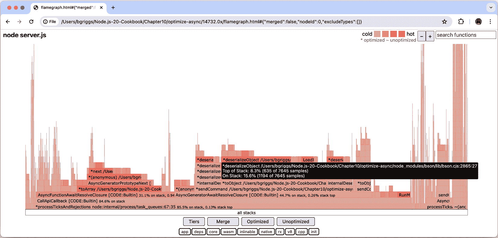

# 10

# 优化性能

性能优化是一项永无止境的活动。总可以进一步优化。本章中的食谱将展示典型的性能优化工作流程。

性能优化工作流程从建立基线开始。通常，这涉及到以某种方式对应用程序进行基准测试。在 Web 服务器的情况下，这可能意味着测量我们的服务器每秒可以处理多少个请求。必须记录基线度量，以便我们有证据证明任何性能改进。

确定基线后，下一步是识别瓶颈。本章中的食谱将涵盖使用火焰图和内存分析器等工具来帮助我们识别应用程序中的特定瓶颈。使用这些性能工具将确保我们的优化努力投资在正确的位置。

识别瓶颈是理解优化工作应该从哪里开始的第一步，性能工具可以帮助我们确定起点。例如，火焰图可以识别导致瓶颈的具体函数。在进行了必要的优化之后，必须通过重新运行初始基线测试来验证这些更改。这使我们能够有数值证据来支持优化是否提高了应用程序的性能。

本章将涵盖以下食谱：

+   基准测试 HTTP 请求

+   解读火焰图

+   检测内存泄漏

+   优化同步函数

+   优化异步函数

+   与工作线程协同工作

# 技术要求

您应该安装最新版本的 Node.js 22，以及访问终端的权限。您还需要访问您选择的编辑器和浏览器。

“优化同步函数”食谱将需要使用 MongoDB。我们将使用 Docker 来提供容器化的 MongoDB 实例。请参阅*第七章*，获取有关如何通过 Docker 使用 MongoDB 的详细技术设置信息。

本章将使用的代码示例可以在本书的 GitHub 仓库中找到，网址为[`github.com/PacktPublishing/Node.js-Cookbook-Fifth-Edition`](https://github.com/PacktPublishing/Node.js-Cookbook-Fifth-Edition)，在**第十章**目录下。

# 基准测试 HTTP 请求

正如我们在本书中看到的，HTTP 通信是许多 Node.js 应用程序和微服务的基础。对于这些应用程序，HTTP 请求应该尽可能高效地处理。为了能够优化，我们首先必须记录我们应用程序性能的基线度量。一旦我们记录了基线，我们就能确定我们的优化努力的影响。

为了创建基准，有必要模拟应用程序的负载并记录其响应情况。对于基于 HTTP 的应用程序，我们必须模拟向服务器发送的 HTTP 请求。

在这个菜谱中，我们将使用名为 **autocannon**（[`github.com/mcollina/autocannon`](https://github.com/mcollina/autocannon)）的工具来捕捉一个 HTTP 网络服务器的基准性能指标，该工具将模拟 HTTP 请求。

## 准备中

在这个菜谱中，我们将使用 **autocannon** 工具来基准测试 Express.js Web 服务器。我们不会从头创建 Web 服务器，而是使用 Express.js 生成器来创建一个。Web 服务器将在 **http://localhost:3000** 返回一个 HTML 页面：

1.  输入以下命令以使用 Express.js 生成器生成一个示例 Web 服务器：

    ```js
    $ npx express-generator --no-view benchmarking-http
    $ cd benchmarking-http
    $ npm install
    ```

1.  **autocannon** 工具可在 **npm** 注册表中找到。全局安装 **autocannon** 模块：

    ```js
    $ npm install --global autocannon
    ```

现在我们已经创建了一个用于测试的 Web 服务器，我们可以开始这个菜谱了。

## 如何操作…

在这个菜谱中，我们将学习如何使用 **autocannon** 工具来基准测试 HTTP 请求：

1.  使用以下命令启动 Express.js Web 服务器：

    ```js
    $ npm start
    ```

1.  在您的浏览器中导航到 **http://localhost:3000**。您应该看到以下输出：


图 10.1 – 浏览器窗口显示“欢迎使用 Express”网页

1.  我们已经确认服务器已启动，并且正在响应 **http://localhost:3000** 上的请求。现在，我们可以使用 **autocannon** 工具来基准测试我们的 HTTP 请求。打开一个新的终端窗口并输入以下命令以运行 **autocannon** 的负载测试：

    ```js
    $ autocannon --connections 100 http://localhost:3000/
    ```

1.  当 **autocannon** 负载测试运行时，切换到您启动 Web 服务器所在的终端窗口。您应该看到大量传入的请求：


图 10.2 – Express.js 服务器接收多个 HTTP GET 请求

1.  切换回运行 **autocannon** 负载测试的终端窗口。一旦负载测试完成，您应该看到类似以下输出的结果，详细说明了结果：


图 10.3 – autocannon 结果摘要

1.  观察结果表。第一个表详细说明了请求延迟。平均值为 **12.74** 毫秒。第二个表详细说明了请求量。在这里，记录了我们的服务器平均每秒处理了 **7,555.2** 个请求，平均吞吐量为 **3.71** MB/秒。

通过这样，我们已经学会了如何使用 **autocannon** 工具来基准测试 HTTP 请求。

## 工作原理…

**autocannon** 工具是一个用 Node.js 编写的跨平台 HTTP 压测工具，并发布到 **npm** 注册表。

在这个配方中，我们使用**autocannon**在**http://localhost:3000**端点对我们的 Express.js 网络服务器进行负载测试。我们传递了**autocannon**的**--connections 100**标志。此标志指示**autocannon**为我们的服务器分配一个包含**100**个并发连接的池。如果我们省略了这个标志，**autocannon**将默认分配**10**个并发连接。并发连接的数量应该调整以最好地代表您服务器预期的负载，以便您可以模拟生产工作负载。

重要提示

这个配方使用了**autocannon**的全格式命令行标志以提高可读性。然而，与许多命令行标志一样，也可以使用缩写形式。**--connections**标志可以缩写为**-c**，而**--duration**标志可以缩写为**-d**。

注意，**autocannon**默认运行 10 秒的负载测试，在完成上一个请求后立即在每个套接字上发送新的请求。可以使用**--duration**标志扩展负载测试的长度。例如，您可以使用以下命令将本配方中显示的负载测试扩展到 20 秒：

```js
$ autocannon --connections 100 --duration 20 http://localhost:3000/
```

默认情况下，**autocannon**以两个表格的形式输出负载测试的数据。第一个表格详细说明了请求延迟，而第二个表格详细说明了请求量。

**请求延迟**是指从请求发出到收到响应所经过的时间。请求延迟表被分解成各种百分位数。**2.5%**百分位数记录了最快的**2.5%**的请求，而**99%**百分位数记录了最慢的**1%**的请求。在基准测试请求时，记录和考虑最好和最坏的情况可能是有用的。延迟表还详细说明了平均延迟、标准偏差和记录的最大延迟。一般来说，延迟越低越好。

请求量表详细说明了每秒的请求数（**Req/Sec**）和吞吐量，吞吐量以每秒处理的字节数（**Bytes/Sec**）记录。同样，结果被分解成百分位数，以便可以解释最好和最坏的情况。对于这两个指标，数值越高越好，因为它表明服务器在给定时间内处理了更多的请求。

重要提示

更多关于可用**autocannon**命令行标志的信息，请参阅 GitHub 上的*Usage*文档：[`github.com/mcollina/autocannon#usage`](https://github.com/mcollina/autocannon#usage)。

## 更多内容…

接下来，我们将介绍如何使用**autocannon**来基准测试 HTTP **POST**请求。我们还将考虑如何在基准测试期间最佳地复制生产环境，以及这如何改变我们的延迟和吞吐量。

### 基准测试 HTTP POST 请求

在这个示例中，我们测试了一个 HTTP **GET** 请求。**autocannon** 工具允许你使用其他 HTTP 方法发送请求，例如 HTTP **POST**。

让我们看看如何使用 **autocannon** 发送带有 JSON 有效负载的 HTTP **POST** 请求：

1.  在同一目录（ **benchmarking-http** ）中创建一个名为 **post-server.js** 的文件：

    ```js
    $ touch post-server.js
    ```

1.  现在，我们需要在 Express.js 服务器上定义一个端点，该端点将处理带有 JSON 有效负载的 HTTP **POST** 请求。将以下内容添加到 **post-server.js** 中：

    ```js
    const express = require('express');
    const app = express();
    const bodyParser = require('body-parser');
    app.use(bodyParser.json());
    app.use(bodyParser.urlencoded({ extended: false }));
    app.post('/', (req, res) => {
      res.send(req.body);
    });
    app.listen(3000, () => {
      console.log('Server listening on port 3000');
    });
    ```

1.  现在，我们需要启动 **post-server.js**：

    ```js
    $ node post-server.js
    ```

1.  在另一个单独的终端窗口中，输入以下命令以对 HTTP **POST** 请求进行负载测试。请注意，我们向 **autocannon** 传递了 **--method**、**--headers** 和 **--body** 标志：

    ```js
    $ autocannon --connections 100 --method POST --headers 'content-type=application/json' --body '{ "hello": "world"}' http://localhost:3000/
    ```

    与主示例一样，**autocannon** 将运行负载测试并输出结果摘要。

这展示了我们如何使用 **autocannon** 模拟其他 HTTP 方法请求，包括带有有效负载的请求。

### 复制生产环境

在测量性能时，尽可能复制生产环境非常重要；否则，我们可能会产生误导性的结果。开发和生产中的应用程序的行为可能不同，这可能导致性能差异。

我们可以使用 Express.js 生成的应用程序来演示性能结果可能因运行环境的不同而有所不同。

使用 **express-generator** 在名为 **benchmarking-views** 的新目录中生成一个 Express.js 应用程序。有关 Express.js 生成器的更多信息，请参阅*第六章*中的*创建 Express.js Web 应用程序*配方。在这个例子中，我们将使用 **pug** 视图引擎生成一个简单的 HTML 页面：

1.  在您的终端中输入以下命令以生成应用程序：

    ```js
    $ npx express-generator --views=pug benchmarking-views
    $ cd benchmarking-views
    $ npm install
    ```

1.  使用以下命令启动服务器：

    ```js
    $ npm start
    ```

1.  在一个新的终端窗口中，使用 **autocannon** 对 **http://localhost:3000** 进行负载测试：

    ```js
    $ autocannon --connections 100 http://localhost:3000/
    ```

    一旦负载测试完成，**autocannon** 将输出负载测试结果摘要：


图 10.4 – autocannon 从开发模式运行的结果摘要

在这个负载测试中，每秒的平均请求数约为 1,584，平均吞吐量约为每秒 632 kB。这比我们在主示例中基准测试的 HTTP **GET** 请求慢得多。

请求较慢的原因是，在开发模式下，Pug 模板引擎将为每个请求重新加载模板。这在开发模式下很有用，因为模板的更改可以在不重启服务器的情况下反映出来。当模式设置为生产时，Express.js 将不再为每个请求重新加载模板。这将导致性能差异。

1.  使用以下命令以生产模式重启 Express.js 服务器：

    ```js
    $ NODE_ENV=production npm start
    ```

1.  现在，在您的另一个终端窗口中，使用 **autocannon** 重新运行相同的基准测试：

    ```js
    $ autocannon --connections 100 http://localhost:3000/
    ```

1.  比较两次运行的输出：


图 10.5 – 生产模式运行中的 autocannon 结果摘要

在第二次负载测试中，我们可以看到每秒的平均请求数增加到约 **8744**（从 **1584** 增加），吞吐量增加到每秒 **3.49** MB（从 **632** kB 增加）。这种性能提升是由于模板在生产模式下被缓存。

这强调了在最能代表预期生产环境的测试环境中基准测试我们的应用程序的必要性。

## 参见

+   本章中的 *解释火焰图* 菜谱

+   本章中的 *检测内存泄漏* 菜谱

+   本章中的 *优化同步函数* 菜谱

+   本章中的 *优化异步函数* 菜谱

# 解释火焰图

火焰图是一种可视化工具，它允许我们识别应用程序中的“热点代码路径”。术语“热点代码路径”用来描述程序中消耗相对较多时间的执行路径，这可以表明应用程序中的瓶颈。

火焰图提供了应用程序在执行期间的调用栈的可视化。从这个可视化中，我们可以确定在应用程序运行时哪些函数在 CPU 上花费了最多时间。

在这个菜谱中，我们将使用 **0x** 火焰图工具（[`github.com/davidmarkclements/0x`](https://github.com/davidmarkclements/0x)）为我们的 Node.js 应用程序生成火焰图。

## 准备工作

我们需要创建一个可以分析的应用程序。**分析**是一种程序分析类型，它测量我们的程序中函数或方法被使用的频率和持续时间。我们将使用 Express.js 生成器来创建基础应用程序。我们的应用程序将使用 **pug** 视图引擎：

```js
$ npx express-generator --views=pug flamegraph-app
$ cd flamegraph-app
$ npm install
```

现在我们已经生成了一个应用程序，我们准备开始生成火焰图。

## 如何操作…

在这个菜谱中，我们将使用 **0x** 工具来分析我们的服务器并生成火焰图。我们还需要使用本章中介绍的 *HTTP 请求基准测试* 菜谱中的 **autocannon** 工具，在应用程序上生成负载：

1.  首先，我们需要确保我们已经全局安装了 **autocannon** 和 **0x** 工具：

    ```js
    $ npm install --global autocannon 0x
    ```

1.  现在，我们不再使用 **node** 二进制文件启动服务器，而是需要使用 **0x** 可执行文件启动。如果我们打开 **package.json** 文件，我们会看到 **npm start** 脚本是 **node ./bin/www**。我们需要在终端命令中将 **node** 二进制文件替换为 **0x**：

    ```js
    $ 0x ./bin/www
    Profiling
    ```

1.  现在，我们需要在服务器上生成一些负载。在新的终端窗口中，使用 **autocannon** 基准测试工具通过运行以下命令来生成负载：

    ```js
    $ autocannon --connections 100 http://localhost:3000
    ```

1.  当**autocannon**负载测试完成后，您将看到以下输出：


图 10.6 – autocannon 结果摘要

注意，在这个负载测试中，我们的服务器平均每秒处理**1512**个请求。

1.  返回启动服务器的终端窗口并按下*Ctrl* + *C*。这将停止服务器。此时，**0x**将捕获的堆栈转换为火焰图。

1.  按下*Ctrl* + *C*后，您将看到以下输出。此输出详细说明了**0x**生成火焰图的位置。观察发现，**0x**工具创建了一个名为**96552.0x**的目录，其中**96552**是服务器进程的**进程标识符**（**PID**）：


图 10.7 – 0x 工具生成火焰图

1.  使用 Google Chrome 打开在**flamegraph-app**目录中生成的**flamegraph.html**文件。您可以通过复制火焰图的路径并将其粘贴到 Google Chrome 地址栏中来实现这一点。您将看到生成的火焰图和一些控件。

1.  观察到火焰图中的条形具有不同的阴影。较深（较红）的阴影表示热点代码路径。

重要提示

即使运行相同的负载测试，每个生成的火焰图也可能略有不同。在您的设备上生成的火焰图可能看起来与这个配方中显示的输出不同。这是由于分析过程的非确定性，这可能会对火焰图的输出产生微妙的影响。然而，一般来说，火焰图的整体结果和瓶颈是一致的。

1.  识别一个较暗的帧。在示例火焰图中，我们可以看到**readFileSync()**帧方法有一个较深的阴影——这表明该函数在 CPU 上花费了相对较多的时间：


图 10.8 – 0x 火焰图概览，突出显示 readFileSync()作为热点帧

1.  点击较暗的帧。如果难以识别帧，您可以在右上角的**搜索**栏中输入**readFileSync**，之后该帧将被突出显示。点击帧后，**0x**将展开所选帧的父级和子级堆栈：


图 10.9 – 0x 火焰图概览，显示 readFileSync()的钻入视图

从钻入视图，我们可以看到热点代码路径。从火焰图中，我们可以对哪些函数值得投入时间进行优化做出明智的猜测。在这种情况下，我们可以看到对 **handleTemplateCache()** 的引用。在之前的配方中，*HTTP 请求基准测试*，我们学习了当处于开发模式时，**pug** 如何为每个请求重新加载模板。这就是造成瓶颈的原因。让我们改变应用程序，使其以生产模式运行，并看看对负载测试结果和火焰图的影响。

1.  使用以下命令在生产模式下重新启动 Express.js 服务器：

    ```js
    $ NODE_ENV=production 0x ./bin/www
    ```

1.  使用 **autocannon** 工具重新运行负载测试：

    ```js
    $ autocannon --connections 100 http://localhost:3000
    ```

1.  从负载测试的结果中，我们可以看到我们的服务器每秒处理的请求数量增加了。在这个运行中，我们的负载测试报告说，我们的服务器平均每秒处理了大约 **7688** 个请求，比我们更改 Express.js 服务器以使其在生产模式下运行之前的 **1512** 个请求有所增加：


图 10.10 – 生产模式运行中的 autocannon 结果摘要

1.  如前所述，一旦 **autocannon** 负载测试完成，使用 *Ctrl* + *C* 停止您的服务器。将生成一个新的火焰图。在新浏览器中打开新的火焰图，并观察新的火焰图与第一个不同。注意第二个火焰图突出显示了一组不同的较暗的帧。这是因为我们已经解决了第一个瓶颈。热点代码路径是相对的。尽管我们已经提高了应用程序的性能，但火焰图将识别下一组热点代码路径：


图 10.11 – 生产模式下的 0x 火焰图概览

使用这种方法，我们用 **0x** 生成了一张火焰图，这使得我们能够识别出应用程序中的瓶颈。

## 它是如何工作的...

在这个配方中，我们使用了 **0x** 工具来分析和生成应用程序的火焰图。我们的应用程序是一个小型、生成的 Express.js 网络服务器。**autocannon** 工具被用来向我们的网络服务器添加负载，以便我们可以生成一个代表生产工作负载的火焰图。

要使用 **0x** 工具，我们必须用 **0x** 启动我们的服务器。当我们用 **0x** 启动应用程序时，将启动两个进程。

第一个进程使用 Node.js 二进制文件 **node** 来启动我们的程序。当 **0x** 启动 node 进程时，它将 **--perf-basic-prof** 命令行标志传递给进程。此命令行标志允许 C++ V8 函数调用映射到相应的 JavaScript 函数调用。

第二个进程启动本地系统的堆栈跟踪工具。在 Linux 上，将调用 **perf** 工具，而在 macOS 和 SmartOS 上，将调用 **dtrace** 工具。这些工具捕获底层的 C 级函数调用。

基础系统堆栈跟踪工具将进行采样。**采样**是在采样时 CPU 正在执行的所有函数的快照，它还将记录父函数调用。

样本堆栈根据调用层次结构分组，将父函数调用和子函数调用分组在一起。这些组就是所谓的 **火焰图**，因此得名 **火焰图**。同一个函数可能出现在多个火焰图中。

火焰图中每一行都称为一个帧。**帧**代表一个函数调用。帧的宽度对应于该函数被分析器在 CPU 上观察的时间量。每个帧的时间表示汇总了所有子函数所需的时间，因此图形呈现为三角形或 *火焰* 形状。

深色（红色）的帧表示相对于其他函数，该函数在堆栈顶部的花费时间更多。这意味着该函数在 CPU 上花费了大量的时间，这表明可能存在瓶颈。

重要提示

Chrome DevTools 还可以用来分析 CPU，这有助于识别瓶颈。使用 **--inspect** 命令行标志，可以使用 Chrome DevTools 调试和分析了 Node.js 进程。请参阅 *第十二章* 的 *使用 Chrome DevTools 进行调试* 菜谱以获取有关使用 Chrome DevTools 调试 Node.js 程序的更多信息。

## 参考信息

+   本章的 *创建 Express.js 网络应用程序* 菜谱

+   本章的 *基准测试 HTTP 请求* 菜谱

+   本章的 *检测内存泄漏* 菜谱

+   本章的 *优化同步函数* 菜谱

+   本章的 *优化异步函数* 菜谱

+   在 *第十二章* 的 *使用 Chrome DevTools 进行调试* 菜谱

# 检测内存泄漏

内存泄漏会大幅降低应用程序的性能，并可能导致崩溃。V8 在其堆中管理对象和动态数据，这是一个基于二叉树的结构，用于管理父子节点关系。V8 的 **垃圾回收器**（**GC**）负责管理堆。它回收任何不再使用的内存 – 释放内存以便可以重用。

当一块内存从未被垃圾回收器（GC）回收时，就会发生内存泄漏，因此它是闲置且低效的。这会导致未使用的内存片段留在堆上。当许多这些未使用的内存块积累在堆中时，可能会影响应用程序的性能。在最坏的情况下，未使用的内存可能会消耗所有可用的堆空间，这反过来又可能导致应用程序崩溃。

在这个菜谱中，我们将学习如何使用 Chrome DevTools 来分析内存，使我们能够检测和修复内存泄漏。

## 准备工作

这个配方需要你安装 Chrome DevTools，它集成在 Google Chrome 浏览器中。访问 [`www.google.com/chrome/`](https://www.google.com/chrome/) 下载 Google Chrome：

1.  我们将使用 **autocannon** 工具将负载导向我们的应用程序。使用以下命令从 **npm** 注册表安装 **autocannon**：

    ```js
    $ npm install --global autocannon
    ```

1.  我们还需要创建一个工作目录：

    ```js
    $ mkdir profiling-memory
    $ cd profiling-memory
    $ npm init --yes
    ```

1.  创建一个名为 **leaky-server.js** 的文件。这个 HTTP 服务器将故意包含一个内存泄漏：

    ```js
    $ touch leaky-server.js
    ```

1.  将以下内容添加到 **leaky-server.js**：

    ```js
    const http = require('node:http');
    const server = http.createServer((req, res) => {
      server.on('connection', () => { });
      res.end('Hello World!');
    });
    server.listen(3000, () => {
      console.log('Server listening on port 3000');
    });
    ```

现在我们已经安装了必要的工具并创建了一个包含内存泄漏的示例应用程序，我们可以继续进行本配方步骤。

## 如何做到这一点…

在这个配方中，我们将使用 Chrome DevTools 来识别内存泄漏：

1.  内存泄漏可能会随着应用程序运行时间的增长而逐渐恶化。有时，应用程序运行几天或几周后，内存泄漏才会导致应用程序崩溃。我们可以使用 Node.js 进程的 **--max-old-space-size** 命令行标志来增加或减少最大 V8 旧内存大小（以 MB 为单位）。为了演示内存泄漏的存在，我们将这个值设置得非常小。使用以下命令启动 **leaky-server.js**：

    ```js
    $ node --max-old-space-size=10 leaky-server.js
    Server listening on port 3000
    ```

1.  在第二个终端窗口中，使用 **autocannon** 工具将负载导向服务器：

    ```js
    $ autocannon http://localhost:3000
    ```

1.  回到你启动服务器的终端窗口，观察服务器是否因 **JavaScript 堆内存不足** 而崩溃：


图 10.12 – JavaScript 堆内存不足错误

1.  现在，我们将开始使用 Chrome DevTools 对我们的应用程序进行性能分析。首先，我们必须使用以下命令重新启动服务器：

    ```js
    $ node --inspect leaky-server.js
    ```

1.  在 Google Chrome 中导航到 **chrome://inspect** 并点击 **inspect**（位于 **leaky-server.js** 下方）。这应该会打开 Chrome DevTools 界面。

1.  确保你处于 **内存** 选项卡，并且已选择 **堆快照**。点击 **快照**：


图 10.13 – Chrome DevTools 内存界面

你应该在界面的左侧看到 **快照 1** 出现：


图 10.14 – Chrome DevTools 内存快照界面

1.  返回你的第二个终端窗口并重新运行 **autocannon** 基准测试：

    ```js
    $ autocannon http://localhost:3000
    ```

1.  一旦负载测试完成，返回你的 Chrome DevTools 窗口。返回 **内存** 选项卡的 **配置文件** 界面并再次进行快照：


图 10.15 – Chrome DevTools 内存快照界面

注意 **Console** 选项卡中的 **MaxListenersExceededWarning** – 这将在 *There’s* *more…* 部分进行更详细的介绍。

1.  现在我们有了两个快照，我们可以使用 Chrome DevTools 来比较它们。为此，将下拉窗口从 **Summary** 更改为 **Comparison**：


图 10.16 – Chrome DevTools 内存快照比较界面

1.  注意到构造函数现在是按 delta 排序的——两个快照之间的差异。展开 **(array)** 构造函数和其中包含的 **(object elements) [ ]** 对象；你应该看到以下输出：


图 10.17 – Chrome DevTools 内存快照比较界面展开

1.  展开视图表明，有大量的 **connectionListener()** 事件来自 **leaky-server.js** 的 *第 4 行*。如果我们查看该行，我们会看到它从 **server.on('connection',...** 块开始。这是我们内存泄漏的地方。我们在每个请求上注册了连接事件的监听器，导致我们的服务器最终耗尽内存。我们需要将这个事件监听器移出我们的请求处理函数。创建一个名为 **server.js** 的新文件：

    ```js
    $ touch server.js
    ```

1.  将以下内容添加到 **server.js** 文件中：

    ```js
    const http = require('node:http');
    const server = http.createServer((req, res) => {
      res.end('Hello World!');
    });
    server.on('connection', () => {});
    server.listen(3000, () => {
      console.log('Server listening on port 3000');
    });
    ```

1.  关闭 Chrome DevTools 窗口，然后重新运行相同的实验。使用 **$ node --inspect server.js** 启动服务器并获取快照。在第二个终端窗口中，使用 **$ autocannon http://localhost:3000** 直接加载到服务器并获取另一个快照。现在，当我们比较这两个快照时，我们会看到 **(array)** 构造函数的 **# Delta** 值显著降低：


图 10.18 – Chrome DevTools 内存快照比较界面

注意到 **MaxListenersExceededWarning** 警告不再出现，这表明我们已经修复了内存泄漏。

通过这样，我们学习了如何获取我们应用程序的堆快照，使我们能够诊断我们应用程序中的内存泄漏。

## 它是如何工作的…

V8 JavaScript 引擎被 Google Chrome 和 Node.js 都使用。共同的底层引擎意味着我们可以使用 Chrome DevTools 来调试和配置 Node.js 应用程序。为了启用调试客户端，我们必须将 **--inspect** 命令行标志传递给 **node** 进程。传递此标志指示 V8 检查器打开一个接受 WebSocket 连接的端口。WebSocket 连接允许客户端和 V8 检查器进行交互。

V8 JavaScript 引擎保留了所有在 JavaScript 代码中引用的对象和原始数据。JavaScript 堆可以通过内部 V8 API（**v8_inspector**）暴露。Chrome DevTools 使用这个内部 API 提供工具界面，包括我们在本食谱中使用的 **内存分析器** 界面。

我们使用 Chrome DevTools 的**Memory**接口对服务器进行了初始堆快照。这个快照被认为是我们的基线。然后，我们使用**autocannon**工具在服务器上生成负载，以模拟随时间的使用情况。对于我们的服务器，内存泄漏可以通过默认的**autocannon**负载（**10**秒内的**10**个连接）观察到。一些内存泄漏可能只有在相当大的负载下才能观察到；在这些情况下，我们需要在服务器上模拟更极端的负载，可能需要更长时间。

autocannon

本章中的**Benchmarking HTTP requests**配方更详细地介绍了我们如何使用**autocannon**工具模拟更极端的服务器负载。

一旦我们将负载引导到我们的服务器，我们就进行了第二个堆快照。这显示了负载对堆大小的影响。我们的第二个快照比第一个大得多，这是内存泄漏的迹象。堆快照的**比较**视图可以用来识别哪些构造函数具有最大的 delta 值。

通过检查和展开**（数组）**构造函数，我们发现了一个从我们的**leaky-server.js**文件的第 4 行开始的**connection** **Listener()**事件的长列表。这使得我们能够识别内存泄漏。请注意，**（数组）**构造函数指的是 V8 使用的内部结构。对于 JavaScript 数组，构造函数将命名为**Array**。

一旦内存泄漏被识别并修复，谨慎的做法是重新运行测试，并确认新的堆快照显示 delta 值有所减少。由于负载，快照仍然可能比初始基线快照要大，但是它不应该像我们之前的**leaky-server.js**文件那样大幅增加。

## 还有更多……

在这个配方中，当处于负载下时，**leaky-server.js**在崩溃之前发出了**MaxListenersExceededWarning**：

```js
$ node --max-old-space-size=10 leaky-server.js
Server listening on port 3000
(node:16402) MaxListenersExceededWarning: Possible EventEmitter memory leak detected. 11 connection listeners added to [Server]. Use emitter.setMaxListeners() to increase limit
```

默认情况下，Node.js 允许为单个事件注册的最大监听器数量为**10**。在**leaky-server.js**中，我们为每个请求注册一个新的监听器。一旦我们的应用程序注册了第 11 个请求，它就会发出**MaxListenersExceededWarning**。这是一个内存泄漏的早期警告信号。可以更改最大监听器的数量。要更改单个**EventEmitter**实例的阈值，我们可以使用**emitter.setMaxListeners()**方法。例如，要将服务器上的最大监听器数量降低到**1**，我们可以将**leaky-server.js**更改为以下内容：

```js
const http = require('node:http');
const server = http.createServer((req, res) => {
  server.setMaxListeners(1);
  server.on('connection', () => { });
  res.end('Hello World!');
});
server.listen(3000, () => {
  console.log('Server listening on port 3000');
});
```

然后，如果我们再次运行相同的实验，注册了两个事件监听器后，我们会看到以下错误：

```js
(node:16629) MaxListenersExceededWarning: Possible EventEmitter memory leak detected. 2 connection listeners added to [Server]. Use emitter.setMaxListeners() to increase limit
```

还可以使用**EventEmitter.defaultMaxListeners**属性来更改所有**EventEmitter**实例的默认最大监听器数量。这应该谨慎进行，因为它将影响所有**EventEmitter**实例。您可以使用以下内容来设置**EventEmitter.defaultMaxListeners**的值：

```js
require('events').EventEmitter.defaultMaxListeners = 15;
```

注意，**emitter.setMaxListeners()** 将始终优先于通过 **EventEmitter.defaultMaxListeners** 设置的全局默认值。在提高最大监听器阈值之前，考虑你是否无意中掩盖了应用程序中的内存泄漏是值得的。

## 参见

+   本章中的 *解释火焰图* 菜谱

+   本章中的 *优化同步函数* 菜谱

+   本章中的 *优化异步函数* 菜谱

+   *第十二章* 中的 *使用 Chrome DevTools 调试* 菜谱

# 优化同步函数

本章前面的菜谱介绍了如何在应用程序中检测热点代码路径。一旦确定了热点代码路径，我们就可以集中优化工作，以减少瓶颈。

优化任何热点代码路径是很重要的，因为任何处理时间较长的函数都可能阻止 I/O 和其他函数的执行，影响应用程序的整体性能。

本菜谱将介绍如何进行微基准测试和优化同步函数。**微基准测试**是一种性能测试类型，它关注于更大系统中的一个小型、特定的代码片段或功能。我们将使用 Benchmark.js ([`benchmarkjs.com/`](https://benchmarkjs.com/)) 来创建微基准测试。

## 准备工作

在实际应用中，我们会使用工具如火焰图或分析器来识别应用程序中的慢速函数。对于这个菜谱，我们将创建一个单一的慢速函数，这样我们就可以学习如何进行微基准测试和优化：

1.  首先，为这个菜谱的代码创建一个目录并初始化项目：

    ```js
    $ mkdir optimize-sync
    $ cd optimize-sync
    $ npm init --yes
    ```

1.  我们还需要安装 Benchmark.js：

    ```js
    $ npm install benchmark
    ```

现在我们已经初始化了目录，我们可以开始这个菜谱。

## 如何操作...

假设我们已经识别出代码库中的瓶颈，并且它恰好是一个名为 **sumOfSquares()** 的函数。我们的任务是使这个函数更快：

1.  首先，让我们创建一个名为 **slow.js** 的文件，它将包含我们的未优化函数：

    ```js
    $ touch slow.js
    ```

1.  将以下内容添加到 **slow.js** 中以创建慢速的 **sumOfSquares()** 实现。这使用了 **Array.from()** 方法来生成一个整数数组。**map** 函数用于将数组中的每个数字平方，而 **reduce** 函数用于求和数组中的元素：

    ```js
    function sumOfSquares(maxNumber) {
      const array = Array.from(Array(maxNumber + 1).keys());
      return array
        .map((number) => {
          return number ** 2;
        })
        .reduce((accumulator, item) => {
          return accumulator + item;
        });
    }
    ```

1.  现在我们有了函数的慢速版本，让我们将其转换成一个模块，这样我们就可以轻松地进行基准测试。如果我们的函数是更大脚本或应用程序的一部分，尝试将其提取为独立的脚本或模块以使其能够独立进行基准测试是有意义的。将以下行添加到 **slow.js** 的底部：

    ```js
    module.exports = sumOfSquares;
    ```

1.  现在，我们可以使用 Benchmark.js 为我们的 **sumOfSquares()** 函数编写一个微基准测试。创建一个名为 **benchmark.js** 的文件：

    ```js
    $ touch benchmark.js
    ```

1.  将以下代码添加到 **benchmark.js** 中，为我们的 **sumOfSquares()** 函数创建一个基准测试：

    ```js
    const benchmark = require('benchmark');
    const slow = require('./slow');
    const suite = new benchmark.Suite();
    const maxNumber = 100;
    suite.add('slow', function () {
      slow(maxNumber);
    });
    suite.on('complete', printResults);
    suite.run();
    function printResults () {
      this.forEach((benchmark) => {
        console.log(benchmark.toString());
      });
      console.log('Fastest implementation is', this.filter('fastest')[0].name);
    }
    ```

    此文件包含 Benchmark.js 的配置，一个调用我们的**slow.js**模块的单个基准测试，以及一个**printResults()**函数，该函数输出基准测试运行信息。

1.  现在，我们可以使用以下命令运行基准测试：

    ```js
    $ node benchmark.js
    slow x 231,893 ops/sec ±0.90% (90 runs sampled)
    Fastest implementation is slow
    ```

1.  让我们使用**0x**工具生成一个火焰图。火焰图可以帮助我们确定我们的代码中哪一行在 CPU 上花费了最多时间。使用以下命令通过**0x**生成火焰图：

    ```js
    $ npx 0x benchmark.js
    ```

1.  在你的浏览器中打开火焰图。在以下示例中，有一个粉红色的帧，表示一个热代码路径。将鼠标悬停在更热的帧上以识别它们引用的应用程序中的哪一行：


图 10.19 – 0x 火焰图概述，显示 slow.js 的第 9 行上的热帧

1.  在火焰图中，我们可以看到最热的函数是位于**slow.js**的**第 9 行**上的一个匿名函数。如果我们查看我们的代码，我们会看到这指向了我们对**Array.reduce()**的使用。请注意，如果你以不同的方式格式化此菜谱的代码，行号可能会有所不同。

1.  由于我们怀疑是**Array.reduce()**的使用导致我们的操作变慢，我们应该尝试以过程形式（使用**for**循环）重写该函数，以查看是否可以提高性能。创建一个名为**loop.js**的文件：

    ```js
    $ touch loop.js
    ```

1.  将以下内容添加到**loop.js**中，以创建**sumOfSquares()**函数的过程实现：

    ```js
    function sumOfSquares(maxNumber) {
        let i = 0;
        let sum = 0;
        for (i; i <= maxNumber; i++) {
            sum += i ** 2;
        }
        return sum;
    }
    module.exports = sumOfSquares;
    ```

1.  现在，让我们为**loop.js**中**sumOfSquares()**函数的实现添加一个基准测试。首先，在**benchmark.js**中**slow.js**导入下方添加以下行以导入**loop.js**模块：

    ```js
    const loop = require('./loop');
    ```

1.  然后，在慢速运行下方添加一个新的基准测试：

    ```js
    suite.add('loop', function () {
      loop(maxNumber);
    });
    ```

1.  重新运行基准测试。这次，它将运行我们的两个实现并确定哪个更快：

    ```js
    $ node benchmark.js
    slow x 247,958 ops/sec ±1.17% (90 runs sampled)
    loop x 7,337,014 ops/sec ±0.86% (94 runs sampled)
    Fastest implementation is loop
    ```

通过这样，我们已经确认了我们的过程/循环实现的**sumOfSquares()**函数比原始实现要快得多。

## 它是如何工作的……

此菜谱逐步展示了优化同步函数调用的过程，从**sumOfSquares()**函数的慢速实现开始。

我们使用 Benchmark.js 创建了一个微基准测试，以创建**slow.js**中初始**sumOfSquares()**实现的基线度量。这个基线度量被称为微基准测试。**微基准测试**用于基准测试应用程序的一个小方面。在我们的情况下，它是针对单个**sumOfSquares()**函数的。

一旦我们创建了微基准测试，我们就通过**0x**运行基准测试以生成火焰图。这个火焰图使我们能够确定哪些帧在 CPU 上花费了最多时间，这为我们提供了关于**sumOfSquares()**函数中哪一行代码是瓶颈的指示。

从火焰图中，我们确定**sumOfSquares()**函数中**map**和**reduce**函数的使用减慢了操作速度。因此，我们创建了**sumOfSquares()**的第二个实现。第二个实现使用了传统的过程式代码（一个**for**循环）。一旦我们有了函数的第二个实现，在**loop.js**中，我们将其添加到我们的基准测试中。这使我们能够比较两种实现，以查看哪种更快。

根据每秒可以处理的操作数量，我们发现**loop.js**比初始的**slow.js**实现显著更快。编写微基准测试的好处是，你有了优化效果的证据和确认。

## 相关内容

+   本章的*基准测试 HTTP 请求*菜谱

+   本章的*解释火焰图*菜谱

+   本章的*检测内存泄漏*菜谱

+   本章的*优化异步函数*菜谱

+   本章的*使用工作线程*菜谱

# 优化异步函数

Node.js 运行时考虑到 I/O，因此具有异步编程模型。在本章的前几节菜谱中，我们探讨了如何诊断同步 JavaScript 函数中的性能问题。

然而，性能瓶颈可能作为异步工作流的一部分出现。在这个菜谱中，我们将介绍如何分析和优化异步性能问题。

## 准备工作

在这个菜谱中，我们将诊断一个与 MongoDB 数据库通信的 Express.js 网络服务器中的瓶颈。有关 MongoDB 的更多信息，请参阅*第五章*中的*使用 MongoDB 存储和检索数据*菜谱：

1.  要启动 MongoDB，我们将使用 Docker（如*第五章*中所述）。确保 Docker 正在运行，然后在您的终端中输入以下命令以初始化 MongoDB 数据库：

    ```js
    $ docker run --publish 27017:27017 --name node-mongo --detach mongo:7
    ```

1.  现在，我们需要创建一个工作目录。我们还将从**npm**安装**express**和**mongodb**模块：

    ```js
    $ mkdir optimize-async
    $ cd optimize-async
    $ npm init --yes
    $ npm install express mongodb
    ```

1.  为了模拟一个真实的应用程序，MongoDB 中需要有一些数据。创建一个名为**values.js**的文件：

    ```js
    $ touch values.js
    ```

1.  将以下内容添加到**values.js**中。这将创建一个加载脚本，将一系列数字输入我们的 MongoDB 数据库：

    ```js
    const { MongoClient } = require('mongodb');
    const URL = 'mongodb://localhost:27017/';
    const numberOfValues = 1000;
    const values = [];
    for (let count = 0; count < numberOfValues; count++) {
      values.push({ value: Math.round(Math.random() * 100000) });
    }
    async function main () {
      const client = new MongoClient(URL);
      try {
        await client.connect();
        const db = client.db('data');
        await db.collection('values').insertMany(values);
        console.log(`Added ${numberOfValues} random values.`);
      } catch (err) {
        console.error(err);
      } finally {
        await client.close();
      }
    }
    main().catch(console.error);
    ```

1.  运行**values.js**脚本以填充此菜谱的数据库：

    ```js
    $ node values.js
    ```

1.  确保全局安装了**0x**和**autocannon**性能工具：

    ```js
    $ npm install --global 0x autocannon
    ```

现在我们已经初始化了目录，并且有一个包含一些样本数据的 MongoDB 数据库可用，让我们开始这个菜谱。

## 如何操作…

在这个菜谱中，我们将诊断一个与 MongoDB 数据库通信的 Web 应用程序中的瓶颈。我们将构建一个示例应用程序，计算数据库中存储的所有值的平均值：

1.  创建一个名为**server.js**的文件。这将存储我们的服务器，该服务器计算数据库中值的平均值：

    ```js
    $ touch server.js
    ```

1.  将以下代码添加到**server.js**中：

    ```js
    const { MongoClient } = require('mongodb');
    const express = require('express');
    const URL = 'mongodb://localhost:27017/';
    const app = express();
    (async () => {
      try {
        const client = new MongoClient(URL);
        await client.connect();
        const db = client.db('data');
        const values = db.collection('values');
        app.get('/', async (req, res) => {
          try {
            const data = await values.find({}).toArray();
            const average =
              data.reduce((accumulator, value) => accumulator + value.value, 0) /
              data.length;
            res.send(`Average of all values is ${average}.`);
          } catch (err) {
            res.send(err);
          }
        });
        app.listen(3000, () => {
          console.log('Server is running on port 3000');
        });
      } catch (err) {
        console.error(err);
      }
    })();
    ```

1.  在终端中输入以下命令以启动服务器：

    ```js
    $ node server.js
    Server is running on port 3000
    ```

1.  在浏览器中导航到**http://localhost:3000**以检查服务器是否正在运行。你期望看到一条消息，打印出我们在*准备就绪*部分持久化到数据库的随机值的平均值。

1.  在第二个终端中，我们将使用**autocannon**基准测试工具来模拟对服务器的负载：

    ```js
    $ autocannon --connections 500 http://localhost:3000
    ```

    一旦负载测试完成，你期望看到以下**autocannon**结果摘要：


图 10.20 – autocannon 结果摘要，针对 server.js

这个负载测试显示平均每秒大约**317**个请求。

1.  现在，让我们看看我们应用中的瓶颈在哪里。我们将使用**0x**工具生成火焰图。使用以下命令重新启动服务器：

    ```js
    $ 0x server.js
    ```

1.  在第二个终端中，让我们再次使用**autocannon**工具模拟对服务器的负载：

    ```js
    $ autocannon --connections 500 http://localhost:3000
    ```

1.  停止服务器并在浏览器中打开生成的火焰图。你期望看到一个类似于以下火焰图：



图 10.21 – 0x 火焰图概述，显示 deserializeObject()热帧

1.  如我们在本章的*解释火焰图*食谱中所学，较深色/红色较重的帧可以表示我们应用中的瓶颈。在我们的例子中，**deserializeObject()**函数看起来是最热的，这意味着它在 CPU 上花费了最多的时间。这在基于 MongoDB 的应用程序中是一个常见的瓶颈。**deserializeObject()**中的瓶颈与我们从 MongoDB 实例查询和接收的大量数据有关。

1.  让我们尝试通过预先计算并将平均值存储在数据库中来解决这个问题瓶颈。这应该通过减少我们从 MongoDB 请求的数据量以及消除计算平均值的需要来帮助。我们将创建一个名为**calculate-average.js**的脚本，该脚本计算平均值并将其存储在 MongoDB 中。创建**calculate-average.js**文件：

    ```js
    $ touch calculate-average.js
    ```

1.  将以下代码添加到**calculate-average.js**：

    ```js
    const { MongoClient } = require('mongodb');
    const URL = 'mongodb://localhost:27017/';
    async function main () {
      const client = new MongoClient(URL);
      try {
        await client.connect();
        const db = client.db('data');
        const values = db.collection('values');
        const averages = db.collection('averages');
        const data = await values.find({}).toArray();
        // Calculate average
        const average =
          data.reduce((accumulator, value) => accumulator + value.value, 0) /
          data.length;
        await averages.insertOne({ value: average });
        console.log('Stored average in database.');
      } catch (err) {
        console.error(err);
      } finally {
        await client.close();
      }
    }
    main().catch(console.error);
    ```

1.  运行**calculate-averages.js**脚本来计算并存储平均值到数据库中：

    ```js
    $ node calculate-average.js
    Stored average in database.
    ```

1.  现在，我们可以重写服务器，使其返回存储的平均值，而不是在每次请求时计算它。创建一个名为**server-no-processing.js**的新文件：

    ```js
    $ touch server-no-processing.js
    ```

1.  将以下内容添加到**server-no-processing.js**：

    ```js
    const { MongoClient } = require('mongodb');
    const express = require('express');
    const URL = 'mongodb://localhost:27017/';
    const app = express();
    async function main () {
      const client = new MongoClient(URL);
      try {
        await client.connect();
        const db = client.db('data');
        const average = db.collection('averages');
        app.get('/', async (req, res) => {
          try {
            const data = await average.findOne({});
            res.send(`Average of all values is ${data.value}.`);
          } catch (err) {
            console.error(err);
            res.status(500).send('Error fetching average');
          }
        });
        app.listen(3000, () => {
          console.log('Server is listening on port 3000');
        });
      } catch (err) {
        console.error(err);
      }
    }
    main().catch(console.error);
    ```

1.  让我们重新运行**autocannon**基准测试。使用**$ node server-no-process.js**命令启动服务器。然后在第二个终端窗口中重新运行**autocannon**负载测试：

    ```js
    $ autocannon --connections 500 http://localhost:3000
    ```

    一旦负载测试完成，你期望看到**autocannon**结果摘要：


图 10.22 – autocannon 结果摘要，针对 server-no-processing.js

在这里，我们可以看到，每秒请求的平均数量从**server.js**中的大约**317**增加到使用预先计算的**server-no-processing.js**中的**6430**。

在这个配方中，我们学习了如何从 MongoDB 获取和加工大量数据可能会在我们的应用程序中引入瓶颈。我们通过预先计算和存储平均值来解决这个配方中展示的瓶颈。

## 它是如何工作的…

这个配方演示了一个与 MongoDB 数据库通信的应用程序中的瓶颈。

慢速是由请求的大量数据和每次请求计算平均值引起的。通过使用**0x**工具生成火焰图，可以诊断出导致瓶颈的具体函数。

在这个情况下，瓶颈问题通过预先计算平均值并将其存储在数据库中得到了解决。这意味着，我们不再需要为每个请求查询数据库中的所有值并计算平均值，而是可以直接查询并获取平均值。这显著提高了性能。

修改数据模型以存储预先计算的平均值，这样就不需要在每个请求上计算它，这是值得的。然而，在实际应用中，可能并不总是能够编辑数据模型来存储计算值。在构建新应用时，考虑应该将哪些数据存储在数据模型中，以最小化实时服务器上的计算量，这是值得考虑的。

预先计算平均值这样的微优化可以通过减少运行时计算来提高性能。这些小的改进可以提升效率，尤其是在高负载下。然而，过早的优化可能会使代码复杂化，使得维护更加困难。因此，通常建议优先考虑那些为您的应用程序和最终用户提供实质性性能提升的优化。

## 参见

+   *第六章*中的*创建 Express.js Web 应用程序*配方

+   *第七章*中的*使用 MongoDB 存储和检索数据*配方

+   本章中的*基准测试 HTTP 请求*配方

+   本章中的*检测内存泄漏*配方

+   本章中的*优化同步函数*配方

+   本章中的*与工作线程一起工作*配方

# 与工作线程一起工作

JavaScript 是一种单线程编程语言，意味着它在一个进程内一次只执行一个任务。Node.js 也是在一个线程上运行的，但它使用事件循环来处理异步操作，允许非阻塞 I/O 调用。尽管如此，事件循环一次只处理一个任务。因此，CPU 密集型任务可能会阻塞事件循环并降低应用程序的整体性能。

要在 Node.js 中有效地处理 CPU 密集型任务，你应该考虑使用工作线程。工作线程在 Node.js 版本 12 及以后被宣布为稳定，并且可以通过核心 **worker_threads** 模块访问。工作线程 API 允许你在多个线程上并行运行 JavaScript 代码，非常适合 CPU 密集型操作。

本教程将介绍 **worker_threads** 模块，并演示如何使用它来管理 CPU 密集型任务。

## 准备工作

首先，确保你正在使用 Node.js 22。然后，创建一个名为 **worker-app** 的工作目录：

```js
$ mkdir worker-app
$ cd worker-app
```

现在我们已经创建了一个工作目录，我们可以开始这个菜谱。

## 如何操作…

在这个菜谱中，我们将学习如何利用工作线程来处理 CPU 密集型任务：

1.  我们首先创建一个简化的工作线程，它返回 **Hello <name>!** 字符串。创建一个名为 **hello-worker.js** 的文件：

    ```js
    $ touch hello-worker.js
    ```

1.  在 **hello-worker.js** 中，我们需要导入必要的类和方法：

    ```js
    const {
      Worker,
      isMainThread,
      parentPort,
      workerData
    } = require('node:worker_threads');
    ```

1.  现在，我们需要使用 **worker_threads** 模块的 **isMainThread()** 方法创建一个 **if** 语句。**if** 块内的任何内容将在主线程上执行。**else** 块内的代码将在工作线程中执行。在 **hello-worker.js** 中添加以下内容：

    ```js
    if (isMainThread) {
      // Main thread code
    } else {
      // Worker code
    }
    ```

1.  现在，让我们填充主线程代码。首先，创建一个新的工作线程，并将两个参数传递给 **Worker** 构造函数。第一个参数将是工作线程主脚本或模块的文件名。在这种情况下，我们将使用 **__filename** 来引用当前文件。第二个参数将是一个 **options** 对象，它将指定一个 **workerData** 属性，该属性包含我们想要传递到工作线程的名字。**workerData** 属性用于与工作线程共享值。在 **// Main thread code** 注释下方添加以下行：

    ```js
      const worker = new Worker(__filename, {
        workerData: 'Beth'
      });
    ```

1.  现在，我们期望工作线程将一个值传回主线程。为了捕获这个值，我们可以创建一个工作线程消息事件监听器。在工作线程初始化下方添加以下行：

    ```js
      worker.on('message', (msg) => {
        console.log(msg);
      });
    ```

1.  现在，我们可以编写工作线程代码，该代码将构建问候语。使用 **parentPort.postMessage()** 方法将值返回到主线程。在 **// Worker code** 注释下方添加以下代码：

    ```js
      const greeting = `Hello ${workerData}!`;
      parentPort.postMessage(greeting);
    ```

1.  现在，使用以下命令运行程序：

    ```js
    $ node hello-worker.js
    Hello Beth!
    ```

1.  现在，让我们尝试一些 CPU 密集型任务，并比较使用和不使用工作线程时的行为。首先，创建一个名为 **fibonacci.js** 的文件。这个文件将包含一个计算给定索引的斐波那契数的程序。创建 **fibonacci.js** 文件：

    ```js
    $ touch fibonacci.js
    ```

1.  在 **fibonacci.js** 中添加以下内容：

    ```js
    const n = 10;
    // Fibonacci calculator
    const fibonacci = (n) => {
      let a = 0;
      let b = 1;
      let next = 1;
      let i = 2;
      for (i; i <= n; i++) {
        next = a + b;
        a = b;
        b = next;
      }
      console.log(`The Fibonacci number at position ${n} is ${next}`);
    };
    fibonacci(n);
    console.log('...');
    ```

1.  使用以下命令运行脚本：

    ```js
    $ node fibonacci.js
    The Fibonacci number at position 10 is 55
    ...
    ```

    在这个例子中，**fibonacci()** 函数会阻塞 **console.log("...");** 的执行，直到 **fibonacci()** 函数运行完成。

1.  现在，让我们尝试使用工作线程来编写它，看看我们如何避免阻塞主线程。创建一个名为 **fibonacci-worker.js** 的文件：

    ```js
    $ touch fibonacci-worker.js
    ```

1.  首先，将以下导入添加到**fibonacci-worker.js**中：

    ```js
    const {
      Worker,
      isMainThread,
      parentPort,
      workerData
    } = require('node:worker_threads');
    ```

1.  接下来，就像我们在*步骤 8*中的**fibonacci.js**所做的那样，添加**斐波那契****计算器**函数：

    ```js
    const n = 10;
    // Fibonacci calculator
    const fibonacci = (n) => {
      let a = 0;
      let b = 1;
      let next = 1;
      let i = 2;
      for (i; i <= n; i++) {
        next = a + b;
        a = b;
        b = next;
      }
      return next;
    };
    ```

1.  最后，我们可以实现一个结构，使我们能够使用**工作线程**。添加以下代码：

    ```js
    if (isMainThread) {
      // Main thread code
      const worker = new Worker(__filename, {
        workerData: n
      });
      worker.on('message', (msg) => {
        console.log(`The Fibonacci number at position ${n} is ${msg}`);
      });
      console.log('...');
    } else {
      // Worker code
      parentPort.postMessage(fibonacci(workerData));
    }
    ```

1.  现在，使用以下命令运行此脚本：

    ```js
    $ node fibonacci-worker.js
    ...
    The Fibonacci number at position 10 is 55
    ```

    注意到**console.log("...");**在**fibonacci()**函数返回结果之前被打印出来。**fibonacci()**函数已经被卸载到工作线程，这意味着主线程上的工作可以继续。

通过这样，我们已经学会了如何使用 Node.js 核心的**worker_threads**模块将任务卸载到工作线程。

## 它是如何工作的...

这个菜谱作为工作线程的介绍。正如我们所见，工作线程可以用来处理 CPU 密集型计算。将 CPU 密集型计算卸载到工作线程可以帮助避免阻塞 Node.js 事件循环。这意味着应用程序可以在处理 CPU 密集型任务的同时继续处理其他工作——例如，I/O 操作。

工作线程通过 Node.js 核心的**worker_threads**模块暴露。为了在这个菜谱中使用工作线程，我们从**worker_threads**核心模块导入了以下四个资产：

+   **工作线程**：代表一个独立的 JavaScript 线程的工作线程类。

+   **isMainThread**：一个属性，如果代码不在工作线程中运行，则返回**true**。

+   **parentPort**：这是一个消息端口，允许从工作线程到父线程的通信。

+   **workerData**：这个属性克隆了传递给工作线程构造函数的数据。这是从主线程将初始数据传递到工作线程的方式。

在这个菜谱中，我们使用以下代码初始化了一个工作线程：

```js
  const worker = new Worker(__filename, {
    workerData: n,
  });
```

**Worker**构造函数需要一个强制性的第一个参数——即，一个文件名。这个文件名是工作线程主脚本或模块的路径。

第二个参数是一个**选项**对象，它可以接受许多不同的配置选项。在**fibonacci-worker.js**中，我们只提供了一个配置选项，**workerData**，将**n**的值传递给工作线程。可以通过工作线程的**options**对象传递的完整选项列表可以在 Node.js **worker_threads** API 文档中找到（[`nodejs.org/api/worker_threads.html#worker_threads_new_worker_filename_options`](https://nodejs.org/api/worker_threads.html#worker_threads_new_worker_filename_options)）。

一旦初始化了工作线程，我们就可以在上面注册事件监听器。在这个菜谱中，我们注册了一个消息事件监听器函数，每次从工作线程接收到消息时都会执行。可以在工作线程上监听以下事件：

+   **error**：当工作线程抛出未捕获的异常时发出。

+   **exit**：当工作线程停止执行代码时发出。

+   **message**：当工作线程使用**parentPort.postMessage()**发出消息时触发

+   **messagerror**：在反序列化消息失败时触发

+   **online**：当工作线程开始执行 JavaScript 代码时触发

我们使用**parentPort.postMessage()**将**fibonacci(n)**的值发送回父线程。在父线程中，我们注册一个消息事件监听器以检测来自工作线程的传入消息。

有了这些，我们已经介绍了工作线程，并展示了如何使用它们来处理 CPU 密集型任务。
