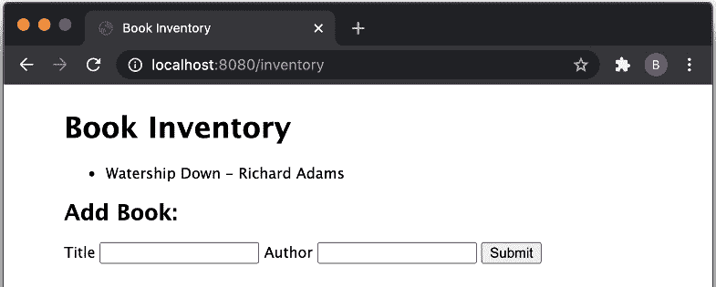

# 11

# 部署 Node.js 微服务

**微服务**这一术语用于描述基于微服务架构范式构建的应用程序。这种架构鼓励将大型应用程序构建为一系列较小的模块化应用程序，每个应用程序专注于一个关键关注点。微服务架构与过去的单体架构形成对比。**单体**是指处理许多不同关注点的应用程序的术语。

采用微服务架构有许多好处。确保应用程序只服务于一个目的意味着应用程序可以被优化以最好地服务于该目的。微服务有助于解耦系统的各个部分，如果出现问题，这可以导致更容易的调试。采用微服务架构还使您能够独立扩展系统的不同部分。

采用微服务架构不仅具有技术上的好处。将微服务分离到单独的代码库可以使较小的团队能够对其负责的微服务拥有自主权。许多基于微服务的系统是用各种框架和语言编写的。开发团队可以选择他们认为最适合其微服务的语言和框架。

然而，由于需要管理多个服务，微服务可能会增加复杂性，这需要成熟的 DevOps 实践和全面的监控。因此，微服务通常不适用于管理开销大于其益处的简单应用程序。

Node.js 微服务通常公开**RESTful** API。**表示状态转移**（**REST**）非常流行。RESTful API 通过 HTTP 公开其 API，并适当使用 HTTP 动词。例如，如果博客服务公开了 RESTful API，您会期望它公开一个端点，您可以通过发送 HTTP GET 请求来检索博客文章。同样，它可能还会公开一个端点，您可以通过发送带有数据的 HTTP POST 请求来发布新的博客。

微服务和容器技术相辅相成。云和容器技术的采用率正在增长，其中 Docker 和 Kubernetes 是部署基于微服务的应用程序的首选。

本章包含以下食谱：

+   使用 LoopBack 生成微服务

+   消费微服务

+   构建 Docker 容器

+   发布 Docker 镜像

+   部署到 Kubernetes

# 技术要求

您需要安装 Node.js，最好是最新版本——Node.js 22。您还需要访问您选择的编辑器和浏览器。

在完成本章之前，建议您对 HTTP 协议有所了解——您可以参考*第四章*。

本章的后三个食谱需要您已安装 **Docker for Desktop**。建议您从 [`docs.docker.com/engine/install/`](https://docs.docker.com/engine/install/) 安装 Docker for Desktop。

本章的食谱代码可以在 [`github.com/PacktPublishing/Node.js-Cookbook-Fifth-Edition`](https://github.com/PacktPublishing/Node.js-Cookbook-Fifth-Edition) 的 **Chapter11** 文件夹中找到。

# 使用 LoopBack 生成微服务

**LoopBack** ( [`loopback.io/`](https://loopback.io/) ) 是一个可扩展的开源 Node.js 框架，专为创建 REST API 和微服务而构建。LoopBack 的早期版本既受到了 Express.js 网络框架的启发，又直接基于该框架。最新版本 LoopBack 4 经历了重大重构，并使用 TypeScript 重新编写。这次重构使得维护者能够在不受先前版本中做出的技术实现决策限制的情况下扩展 LoopBack 的功能。

在这个食谱中，我们将使用 LoopBack 4 **命令行界面** ( **CLI** ) 来生成一个 Node.js 微服务。

## 准备工作

为了准备食谱，我们需要全局安装 LoopBack CLI。在您的终端中输入以下命令：

```js
$ npm install --global @loopback/cli
```

现在我们已经全局安装了 LoopBack CLI，让我们继续到食谱。

## 如何做到这一点...

在这个食谱中，我们将生成一个 RESTful API，这将形成我们的 Node.js 微服务。我们将创建的 RESTful API 将模仿书店库存：

1.  LoopBack CLI 应该作为 **lb4** 可用在你的路径中。要开始生成项目，我们调用 LoopBack CLI，提供一个项目名称。让我们将我们的项目命名为 **loopback-bookstore**。在您的终端中输入以下命令：

    ```js
    $ lb4 loopback-bookstore
    ```

1.  输入命令将启动一个交互式界面，其中 LoopBack CLI 将请求您新项目的信息。对于项目描述、项目根目录和应用程序类名，只需按 *Enter* 键接受默认名称。

1.  第四个 CLI 问题会询问用户在项目中应启用哪些功能。按 *Enter* 键启用所有功能。如果您看到一个后续命令详细说明 Yarn 可用，请输入 **N** 以表示我们不希望默认启用它。

1.  您现在应该看到 LoopBack CLI 在构建您的应用程序。在终端窗口中，您应该期望看到以下输出开始，详细说明已创建的文件和目录：

    ```js
        force loopback-bookstore/.yo-rc.json
       create loopback-bookstore/.eslintignore
       create loopback-bookstore/.eslintrc.js
       create loopback-bookstore/.mocharc.json
       create loopback-bookstore/.prettierignore
       create loopback-bookstore/.prettierrc
       create loopback-bookstore/DEVELOPING.md
       create loopback-bookstore/package.json
       create loopback-bookstore/tsconfig.json
    ...
    ```

1.  LoopBack CLI 已经生成了我们的应用程序。它也应该已经自动安装了我们的 **npm** 依赖项。导航到应用程序目录，并使用以下命令启动应用程序：

    ```js
    $ cd loopback-bookstore
    $ npm install
    $ npm start
    ```

1.  如果您在浏览器中导航到 **http://localhost:3000**，您应该期望看到应用程序正在运行：


图 11.1 – LoopBack 书店应用程序生成的 LoopBack 主页

1.  返回您的终端并按*Ctrl* + *C*停止应用程序。到目前为止，LoopBack CLI 刚刚生成了一个基本的工程结构。现在我们可以构建我们的书店 API。我们可以使用 LoopBack 的模型生成器来完成此操作。输入以下命令以开始创建模型：

    ```js
    $ lb4 model
    ```

1.  LoopBack 的模型生成器将打开一个交互式 CLI，我们可以定义模型及其属性。我们想要创建的是一个**实体**类型的书籍。首先，添加**id**属性，它将是一个数字。您还需要向模型中添加**author**和**title**属性，这两个属性都应该是必填的，并且是字符串类型。通过交互会话输入这些属性。会话的转储应该看起来如下所示：


图 11.2 – LoopBack 模型生成器预期转储的概述

1.  现在我们已经创建了我们的模型，我们需要使用 LoopBack 的数据源 CLI 创建我们的数据源。在您的终端窗口中输入以下命令：

    ```js
    $ lb4 datasource
    ```

1.  交互式 CLI 将请求有关数据源的信息。我们将使用内存数据存储。您应该提供的值应该是**数据源名称：local**和**内存数据库**。对于最后两个问题，按*Enter*键接受默认设置。期望您的会话转储与以下内容匹配：


图 11.3 – LoopBack 数据源生成器转储的概述

1.  接下来，我们需要创建一个 LoopBack 存储库。这是一个将数据源和模型绑定的 LoopBack 类。输入以下命令以启动存储库生成器界面：

    ```js
    $ lb4 repository
    ```

1.  对于存储库，我们希望为**Book**模型使用**LocalDatasource**，并基于**DefaultCrudRepository**基类。终端应该匹配以下输出：


图 11.4 – LoopBack 存储库生成器预期的转储

1.  现在，我们需要创建一个 LoopBack 控制器。LoopBack 控制器处理 API 请求和响应。输入以下命令以启动控制器生成器界面：

    ```js
    $ lb4 controller
    ```

1.  我们的控制器应该是一个名为**Books**的**REST 控制器**，具有创建、读取、更新和删除（**CRUD**）**功能**。对于剩余的问题，您可以通过按*Enter*键接受默认设置。终端应该看起来如下所示：


图 11.5 – LoopBack 控制器生成器转储的概述

1.  使用 **$ npm start** 启动应用程序，并导航到 **http://localhost:3000/explorer/**。这将打开 LoopBack API 探索器，我们可以使用它来测试我们的 API。观察到的各种 HTTP 动词的路由已自动为我们生成：


图 11.6 – loopback-bookstore 应用程序的 LoopBack API 探索器

1.  在探索器中导航到 HTTP POST 路由。点击 **尝试一下** 按钮将打开一个界面，您可以在其中将书籍添加到库存中。更改示例 **标题** 和 **作者** 值，然后点击 **执行**：


图 11.7 – LoopBack API 探索器请求界面

1.  导航到 **http://localhost:3000/books**。此路由将返回存储的所有书籍的 JSON 数组。预期将看到我们在上一步添加的书籍：

    ```js
    [{"id":1,"title":"Watership Down","author":"Richard Adams"}]
    ```

我们使用 LoopBack CLI 生成了一个表示书店库存的 RESTful API。

## 它是如何工作的...

该示例演示了如何为示例书店库存构建 RESTful API。

我们提供给生成器的第一个命令是 **$ lb4 loopback-bookstore**。此命令为我们的应用程序构建 LoopBack 项目结构。在示例中，我们启用了以下所有可选功能：

+   **ESLint**：一个流行的代码检查器，具有一些预定义的代码检查规则

+   **Prettier**：一个流行的代码格式化工具，本书中的示例都使用了它

+   **Mocha**：一个 Node.js 测试框架

+   **Loopback Build**：一组 LoopBack 构建助手，通过 **@loopback/build** 模块公开

+   **VSCode**：VSCode 编辑器的配置文件

+   **Docker**：为应用程序生成 **Dockerfile** 和 **.dockerignore**

+   **存储库**：启用方便的方法，可以自动绑定存储库类

+   **服务**：包括服务代理导入（有关服务的更多信息，请参阅 [`loopback.io/doc/en/lb4/Service.html`](https://loopback.io/doc/en/lb4/Service.html)）

一旦选择了可选功能，LoopBack CLI 将生成基础应用程序结构。此结构包括与所选可选功能相关的目录和文件。例如，生成了 **eslintrc.js** 和 **mocharc.js** 文件来配置 ESLint 和 Mocha。

我们使用 LoopBack 模型生成器创建了我们需要存储的数据表示。在我们的例子中，我们创建了一个名为 **Book** 的模型，其中包含我们希望为每本书存储的数据。LoopBack 生成器帮助我们添加了这些属性，包括指定属性的类型以及它们是否为必需或可选属性。在更大和更复杂的 API 中，通常会有多个模型，其中一些模型可能引用其他模型，类似于关系数据库的结构。

模型生成器在**src/models/book.model.ts**中创建了我们的**Book**模型。模型文件包含了一个以 TypeScript 类形式表示的书籍。

在创建模型后，我们使用 LoopBack 数据源生成器创建了一个数据源。我们选择使用内存数据源以避免需要配置数据库实例。使用内存数据源意味着默认情况下，当我们停止 API 运行时，数据将丢失。LoopBack 处理数据源集成，消除了开发者创建和设置数据存储连接的需要。在大多数情况下，这意味着开发者不需要编写特定于数据存储的代码，这使得在数据存储之间切换变得更加容易。

使用 LoopBack 4，为我们的**Book**模型创建一个存储库是必要的。存储库充当模型的一个接口，提供强类型的数据操作。

食谱的最后一步涉及生成一个控制器来处理 API 请求和响应。我们指示生成器为**Book**模型创建一个具有 CRUD 功能的 REST 控制器。**CRUD**涵盖了四个基本功能，这些功能使持久化存储成为可能。

**Book**控制器在**src/controllers/books.controller.ts**中创建，并包含用于处理我们的**Book**模型的每个 REST API 操作的生成函数。例如，以下代码在控制器中生成以处理对**/books**路由的 HTTP GET 请求。此路由返回数据存储中的所有书籍：

```js
@get('/books', {
    responses: {
      '200': {
        description: 'Array of Book model instances',
        content: {
          'application/json': {
            schema: {
              type: 'array',
              items: getModelSchemaRef(Book, {includeRelations: true}),
            },
          },
        },
      },
    },
  })
  async find(
    @param.filter(Book) filter?: Filter<Book>,
  ): Promise<Book[]> {
    return this.bookRepository.find(filter);
  }
```

创建的控制器、存储库和数据源在启动时都会被加载并绑定到应用程序上。这由**@loopback/boot**模块处理。

在食谱的最后部分，我们使用了 API 探索器（**http://localhost:3000/explorer/**）向我们的 API 发送请求。路由探索器显示了可用的路由并为每个路由提供了示例请求，允许以直观的方式测试您的 API。此探索器使用 Swagger UI（[`swagger.io/`](https://swagger.io/)）实现。

LoopBack 还允许为 API 生成 OpenAPI 规范文档，为 RESTful API 提供了一个标准接口，包括 API 路由的人机和机器可读定义。这可以通过运行**npm run openapi-spec ./open-api.json**命令实现，该命令将创建一个包含 OpenAPI 规范的**open-api.json**文件。

这个食谱强调了生成 RESTful Node.js API 而无需编写任何代码是可能的。一旦您的基 API 生成，就可以扩展应用程序以包含任何必要的业务逻辑。LoopBack 抽象并处理与创建 API 相关的某些常见技术任务，例如实现 CRUD 操作。这使得开发者能够专注于其微服务的业务逻辑，而不是底层和重复的技术实现。

## 参见

+   *第六章*

+   本章的 *消费微服务* 菜单

# 消费微服务

在这个菜谱中，我们将创建一个 Express.js 网络应用程序，该应用程序将消费在之前的菜谱 *使用 LoopBack 生成微服务* 中创建的 **loopback-bookstore** 微服务。这将展示现代网络架构是如何基于微服务模式实现的。

## 准备工作

在这个菜谱中，我们将消费在 *使用 LoopBack 生成微服务* 菜谱中创建的微服务。如果您尚未完成该菜谱，您可以从 Packt GitHub 仓库的 [`github.com/PacktPublishing/Node.js-Cookbook-Fifth-Edition`](https://github.com/PacktPublishing/Node.js-Cookbook-Fifth-Edition) 中的 **Chapter11/loopback-bookstore** 目录中获取代码。

我们还将创建一个前端网络应用程序，使用 Express.js 生成器为我们的网络应用程序创建基础。有关 Express.js 生成器的更多信息，请访问 [`expressjs.com/en/starter/generator.html`](https://expressjs.com/en/starter/generator.html) 。

在您的终端中输入以下命令以使用 Express.js 生成器创建基本应用程序：

```js
$ npx express-generator --view=ejs ./bookstore-web-app
$ cd bookstore-web-app
$ npm install
```

我们将创建一个路由和 HTML 表单来添加书籍到书店库存。让我们提前创建这些文件：

```js
$ touch routes/inventory.js views/inventory.ejs
```

现在我们已经有一个基本的 Express.js 网络应用程序，我们可以继续到菜谱步骤，我们将扩展应用程序以与书店库存微服务交互。

## 如何操作…

我们将使用 Express.js 构建一个网络应用程序，该应用程序将消费我们的 **loopback-bookstore** 微服务。该网络应用程序应使我们能够查看库存并添加书籍到库存：

1.  首先，向应用程序添加两个路由。我们将添加的第一个路由是 **/inventory** 路由，它将接受 HTTP GET 请求。此路由将返回库存中的书籍列表以及一个可以用来添加书籍到库存的 HTML 表单。第二个路由将接受在 **/inventory/add** 端点的 HTTP POST 请求。**/inventory/add** 路由将与书店库存微服务交互以持久化新书。将以下内容添加到 **routes/inventory.js** 中以创建这两个路由：

    ```js
    const { Router } = require('express');
    const router = Router();
    router.get('/', function (req, res) {
      fetch('http://localhost:3000/books')
        .then((res) => res.json())
        .then((json) =>
          res.render('inventory', {
            books: json,
          })
        );
    });
    router.post('/add', function (req, res) {
      console.log(req.body);
      fetch('http://localhost:3000/books', {
        method: "POST",
        body: JSON.stringify(req.body),
        headers: { 'Content-Type': 'application/json' },
      })
        .then(res.redirect('/inventory'))
        .catch((err) => {
          throw err;
        });
    });
    module.exports = router;
    ```

1.  现在，在 **app.js** 中，我们需要注册我们的新 **inventory** 路由器。将以下行添加到 **app.js** 中，首先使用 **var** 导入路由器，以保持与生成的其他文件的兼容性。在以下其他路由导入下方添加以下内容：

    ```js
    var inventoryRouter = require('./routes/inventory');
    ```

1.  接下来，我们需要指导我们的 Express.js 应用程序使用 **inventory** 路由器。在 **app.use('/users', usersRouter);** 下方添加以下行：

    ```js
    app.use('/inventory', inventoryRouter);
    ```

1.  我们的库存路由引用了一个名为**嵌入式 JavaScript**（**EJS**）的模板文件，名为**inventory.ejs**。此模板文件将输出库存中存储的所有书籍列表，并暴露一个我们可以用来向库存添加书籍的表单。将以下内容添加到我们在本菜谱*入门*部分创建的**views/inventory.ejs**文件中：

    ```js
    <!DOCTYPE html>
    <html>
      <head>
        <title>Book Inventory</title>
        <link rel='stylesheet' href='/stylesheets/style.css' />
      </head>
      <body>
        <h1>Book Inventory</h1>
        <ul>
            <% for(let book of books) { %>
                <li><%= book.title %> - <%= book.author %></li>
            <% } %>
        </ul>
        <h2>Add Book:</h2>
        <form action="/inventory/add" method="POST">
            <label for="title">Title</label>
            <input type="text" name="title" />
            <label for="author">Author</label>
            <input type="text" name="author" />
            <button type="submit" value="Submit">Submit</button>
        </form>
      </body>
    </html>
    ```

1.  从上一个菜谱中启动您的**loopback-bookstore**微服务。请在**loopback-bookstore**目录内执行此操作：

    ```js
    $ npm start
    ```

1.  现在，在另一个终端窗口中，使用以下命令启动**bookstore-web-app**应用程序。我们还将传递一个**PORT**环境变量到启动命令，以设置自定义端口。Express.js 网络应用程序默认端口为**3000**，但这个端口已经被我们的**loopback-bookstore**微服务占用，因此我们需要提供一个替代端口。从**bookstore-web-app**目录运行以下命令：

    ```js
    $ PORT=8080 npm start
    ```

1.  在浏览器中导航到**http://localhost:8080/inventory**，并期望看到以下输出：


图 11.8 – 显示空的书店库存和添加新书的 HTML 表单的 HTML 页面

1.  现在我们可以尝试向库存中添加一本书。填写**标题**和**作者**输入字段，然后点击**提交**按钮。提交后，你应该期望看到你提交的书籍被添加到库存中：



图 11.9 – 显示已填充书店库存的网页

我们已经成功构建了一个与我们的**loopback-bookstore**微服务通信的前端网络应用程序。

## 工作原理…

在菜谱中，我们实现了一个由我们的**loopback-bookstore**微服务支持的前端网络应用程序层。

当我们的**/inventory**网页加载时，在幕后，Express.js 网络前端从 loopback 微服务查询数据。

我们的 Express.js 服务器向**http://localhost:3000/books**端点发送 HTTP POST 请求。请求提供了 HTML 表单数据。

一旦完成对 LoopBack 微服务的请求，Express.js 网络应用程序将重定向到**/inventory**路由。这将刷新模板，然后列出新添加的书籍。

这种架构展示了您如何通过分别构建后端 API（在本例中为**loopback-microservice**）来模块化应用程序，从而与前端网络应用程序分离。这使得两个应用程序可以独立扩展，并保持代码松散耦合。

对于更大的系统，通常会有许多微服务相互通信。

## 参见

+   在*第四章*的*接收 HTTP POST 请求*菜谱中

+   *第六章*

+   本章中*使用 LoopBack 生成微服务*的菜谱

# 构建 Docker 容器

一旦我们有了 Node.js 微服务，我们需要将其打包以便部署到云端。云和容器技术相辅相成，其中最普遍的容器技术之一是 Docker。

Docker 是一个用于使用容器创建、部署和运行应用程序的工具。容器使您能够将应用程序及其所有依赖项打包在一起。容器通常被说成类似于虚拟机，关键区别在于 Docker 允许应用程序重用相同的 Linux 内核，而虚拟机则是虚拟化整个操作系统。

将微服务容器化的关键好处是它被封装起来，这意味着容器包含了微服务运行所需的一切。这有助于使应用程序在机器之间具有可移植性和一致性。

如 Docker 这样的容器技术被视为部署到现代云环境的事实上工具，通常与 Kubernetes 这样的容器编排器结合使用，我们将在本章的 *Deploying to Kubernetes* 配方中介绍。

Docker 和 Kubernetes 是大型且复杂的科技。本章将重点展示如何利用 Docker 和 Kubernetes 来部署 Node.js 微服务。关于 Docker 和 Kubernetes 的深入概述超出了本书的范围。有关 Docker 和 Kubernetes 的更详细信息，请参阅以下链接：

+   Kubernetes 概述：[`kubernetes.io/docs/tutorials/kubernetes-basics/`](https://kubernetes.io/docs/tutorials/kubernetes-basics/)

+   Kubernetes 安装指南：[`kubernetes.io/docs/setup/`](https://kubernetes.io/docs/setup/)

在这个配方中，我们将把一个示例 Node.js 微服务打包到 Docker 容器中。

## 准备工作

对于这个配方，您需要安装 Docker。建议从 [`docs.docker.com/engine/install/`](https://docs.docker.com/engine/install/) 安装 Docker for Desktop。

确保 Docker 正在运行。您可以在终端窗口中输入以下命令进行测试：

```js
$ docker run hello-world
```

此命令从 Docker Hub 拉取 **hello-world** 镜像并创建一个容器来运行它。Docker Hub 是 Docker 镜像的中央存储库，几乎类似于 Docker 镜像的 **npm** 注册表。

**hello-world** 镜像是您可以使用来测试 Docker 是否已安装并正确运行的示例镜像。当您运行此镜像时，您应该会看到 **Hello from Docker!** 以及其他帮助文本返回。

我们还需要一个 API 或微服务，将其构建到 Docker 容器中。我们将使用 Fastify CLI 生成 API。有关 Fastify 的更多信息，请参阅 *第六章*。

在您的终端窗口中输入以下命令，在名为 **fastify-microservice** 的新目录中生成一个示例 API：

```js
$ npx fastify-cli generate fastify-microservice
$ cd fastify-microservice
```

既然我们已经确认 Docker 已安装并且我们有一个示例微服务，我们可以继续到配方步骤，我们将构建一个容器。

## 如何操作…

在这个菜谱中，我们将构建一个用于我们的 **fastify-microservice** 的容器：

1.  首先，在 **fastify-microservice** 目录中创建一个 **Dockerfile** 文件和一个 **.dockerignore** 文件：

    ```js
    $ touch Dockerfile .dockerignore
    ```

1.  **Dockerfile** 文件是一组指令，用于构建我们的应用程序或微服务的容器。打开 **Dockerfile** 文件并添加以下行：

    ```js
    FROM node:22
    WORKDIR "/app"
    RUN apt-get update \
     && apt-get dist-upgrade -y \
     && apt-get clean \
     && echo 'Finished installing dependencies'
    COPY package*.json ./
    RUN npm install --production
    COPY . /app
    ENV PORT 3000
    EXPOSE 3000
    USER node
    CMD ["npm", "start"]
    ```

1.  接下来，我们将创建 **.dockerignore** 文件。类似于 **.gitignore** 文件，**.dockerignore** 文件用于排除文件被构建到容器中。将以下内容添加到 **.** **dockerignore** 文件中：

    ```js
    .git
    .gitignore
    node_modules
    npm-debug.log
    ```

1.  我们现在已准备好构建微服务。我们通过使用 **docker build** 命令，并使用 **fastify-microservice** 作为我们镜像的标签来完成此操作：

    ```js
    $ docker build --tag fastify-microservice .
    ```

1.  当 Docker 构建镜像时，你预计会看到以下输出：


图 11.10 – 显示已填充的书店库存的网页

1.  在你的终端窗口中输入以下命令以列出所有 Docker 镜像。你应该期望在列表中看到 **fastify-microservice** Docker 镜像：

    ```js
    $ docker images
    ```

1.  现在我们可以运行 Docker 镜像作为 Docker 容器，通过传递 **--publish** 标志来指示 Docker 将容器内的端口 **3000** 映射到本地机器上的端口 **3000**。输入以下命令：

    ```js
    $ docker run --publish 3000:3000 fastify-microservice
    > fastify-microservice@1.0.0 start /app
    > fastify start -l info app.js
    {"level":30,"time":1594555188739,"pid":19,"hostname":"f83abfa3276a","msg":"Server listening at http://0.0.0.0:3000"}
    ```

1.  你应该能够导航到 **http://localhost:3000/example** 并看到 **这是一个** **示例** 输出。

1.  在你的终端窗口中按 *Ctrl* + *C* 停止你的容器。

我们现在已经成功构建了我们第一个容器化的微服务。

## 它是如何工作的...

容器使你能够将你的应用程序打包到一个隔离的环境中。**Dockerfile** 用于定义环境。环境应包括运行应用程序代码所需的库和依赖项。

让我们检查 **Dockerfile** 文件的内容：

+   **FROM node:22** : **node** 指令用于初始化一个新的构建阶段。一个 **Dockerfile** 文件必须以一个 **FROM** 指令开始，该指令指向一个有效的 Docker 镜像，该镜像可以用作我们镜像的基础。在这个例子中，镜像基于 Docker 官方 Node.js 镜像。

+   **RUN apt-get update...** : 这行指令指示 Docker 使用 **Advanced Package Tool** ( **APT** ) 更新容器的操作系统依赖项，APT 是 Debian 的默认包管理器。确保操作系统依赖项是最新的，这对于确保你的依赖项包含最新的修复和补丁非常重要。

+   **COPY package*.json ./** : 如果存在，此命令会将 **package.json** 和 **package-lock.json** 文件复制到容器中。

+   **RUN npm install --production**：这根据之前复制到容器中的**package*.json**文件在容器内执行**npm install**命令。必须在容器内运行**npm install**，因为某些依赖项可能具有需要根据容器 OS 构建的本机组件。例如，如果您在本地使用 macOS 开发并且有本机依赖项，您不能简单地复制**node_modules**的内容到容器中，因为本机 macOS 依赖项在基于 Debian 的容器中无法工作。

+   **COPY . /app.**：这把我们的应用程序代码复制到容器中。请注意，**COPY**命令将忽略**.dockerignore**文件中列出的所有模式。这意味着**COPY**命令不会将**node_modules**和其他信息复制到容器中。

+   **ENV PORT 3000**：这将在容器中设置**PORT**环境变量为**3000**。

+   **EXPOSE 3000**：**EXPOSE**指令用作文档形式，说明哪个端口打算公开给容器化应用程序。它不会公开端口。

+   **USER node**：这指示 Docker 以**node**用户运行镜像。**node**用户是由 Docker 官方 Node.js 镜像创建的。如果省略，镜像将默认以 root 用户运行。在可能的情况下，您应该以无特权的（非 root）用户运行容器，以作为安全缓解措施。

+   **CMD ["npm", "start"]**：这执行启动应用程序的命令。

**Dockerfile**中命令的顺序很重要。对于**Dockerfile**文件中的每个命令，Docker 都会在镜像中创建一个新的层。Docker 只会重建已更改的层，因此**Dockerfile**文件中命令的顺序可能会影响重建时间。这就是为什么我们在运行**npm install**之后将应用程序代码复制到容器中，因为我们更经常改变应用程序代码，而不是改变我们的依赖项。

使用**docker history**命令可以查看一个镜像的 Docker 层。例如，**$ docker history fastify-microservice**将输出我们的**fastify-microservice**镜像的层：


图 11.11 – fastify-microservice 镜像的 Docker 历史输出概述

**$ docker build --tag fastify-microservice .**命令基于当前目录中**Dockerfile**文件中的指令构建 Docker 镜像。

要运行镜像，我们调用**docker run --publish 3000:3000 fastify-microservice**。我们传递这个命令我们想要运行的镜像名称，以及我们希望公开的端口。**--publish 3000:3000**选项将主机上的端口**3000**映射到容器上的端口**3000**，确保任何发送到主机端口**3000**的流量都会转发到容器上的端口**3000**。

## 更多内容...

在创建 Docker 镜像时，使其尽可能小是很重要的。将生产镜像仅包含运行应用程序所需的生产依赖库和库被认为是良好的实践。为了创建更小的镜像，我们可以利用 Docker 的多阶段构建功能（[`docs.docker.com/develop/develop-images/multistage-build/`](https://docs.docker.com/develop/develop-images/multistage-build/)）。

Docker 多阶段构建允许我们在同一个 **Dockerfile** 文件中定义多个 Docker 镜像。对于 Node.js 应用程序，我们可以将 *构建* 和 *运行* 步骤拆分到单独的容器中。结果是最终的生成容器，即 **运行** 容器，将是一个更小、更轻量级的容器。

我们可以使用以下多阶段 **Dockerfile** 文件来容器化我们的 **fastify-microservice**：

```js
FROM node:22
WORKDIR "/app"
RUN apt-get update \
 && apt-get dist-upgrade -y \
 && apt-get clean \
 && echo 'Finished installing dependencies'
COPY package*.json ./
RUN npm install --production
FROM node:22-slim
WORKDIR "/app"
RUN apt-get update \
 && apt-get dist-upgrade -y \
 && apt-get clean \
 && echo 'Finished installing dependencies'
COPY --from=0 /app/node_modules /app/node_modules
COPY . /app
ENV NODE_ENV production
ENV PORT 3000
USER node
EXPOSE 3000
CMD ["npm", "start"]
```

注意到在 **Dockerfile** 文件中有两个 **FROM** 指令，这表明有两个构建阶段。

第一个构建阶段创建了一个容器，用于处理依赖项的安装和任何构建任务。在我们的例子中，第一个容器执行了 **npm install** 命令。**node_modules** 可能包含原生插件，这意味着第一个容器需要相关的编译器和依赖项。

第二个容器使用的是基于 **node:22-slim** 的镜像。**node:22-slim** 镜像是官方 Node.js Docker 镜像的一个变体，其中包含了运行 Node.js 所需的最小库。这个镜像是一个更小、更轻量级的镜像。常规的 **node** Docker 镜像大小约为 1 GB，而多阶段的 **slim** 镜像大小约为 200 MB。当部署到云端时，在许多情况下，你将按每 MB 收费。最小化镜像大小可以节省成本。

重要提示

一旦你完成了本章中的菜谱，你应该停止并删除 Docker 容器和镜像。否则，容器和镜像可能会留在你的系统中并消耗系统资源。使用 **$ docker ps** 列出你的容器。定位容器标识符，并将其传递给 **$ docker stop <containerID>** 来停止容器。然后，使用 **$ docker rm -f <containerID>** 来删除容器。同样，要删除 Docker 镜像，请使用 **$ docker image rm <image>** 命令。你也可以（谨慎使用）使用 **$ docker system prune --all** 命令来删除系统上的所有镜像和容器。

## 参见

+   *第六章*

+   本章中的 *发布 Docker 镜像* 菜谱

+   本章中的 *部署到 Kubernetes* 菜谱

# 发布 Docker 镜像

Docker Hub 提供了一个全球镜像存储库。在本章和*第七章*中，我们已经从 Docker Hub 存储库中拉取了 Docker 镜像。这包括我们用作本章*构建一个 Docker 容器*菜谱基础的 Docker 官方 Node.js 镜像。

在这个菜谱中，我们将发布我们的**fastify-microservice**镜像到 Docker Hub。

## 准备工作

此菜谱将使用前一个菜谱中创建的镜像，*构建一个* *Docker 容器*。

如果您还没有完成那个菜谱，代码可在 Packt GitHub 存储库（[`github.com/PacktPublishing/Node.js-Cookbook-Fifth-Edition`](https://github.com/PacktPublishing/Node.js-Cookbook-Fifth-Edition)）的**Chapter11/fastify-microservice**目录中找到。

## 如何操作…

在这个菜谱中，我们将注册一个 Docker Hub 账户并将我们的**fastify-microservice**镜像发布到 Docker Hub：

1.  首先，我们需要创建一个 Docker Hub 账户。访问[`hub.docker.com/signup`](https://hub.docker.com/signup)以创建账户。您需要输入您的详细信息并点击**注册**。

1.  一旦您创建了您的 Docker Hub 账户，您需要认证您的 Docker 客户端。通过在终端中输入以下命令来完成此操作：

    ```js
    $ docker login
    ```

1.  一旦我们认证了 Docker 客户端，我们就需要重新标记我们的镜像以便将其推送到 Docker Hub。使用以下命令标记镜像，将**<namespace>**替换为您的 Docker Hub ID：

    ```js
    $ docker tag fastify-microservice <namespace>/fastify-microservice
    ```

1.  现在，我们需要使用**docker push**命令推送新标记的镜像：

    ```js
    $ docker push <namespace>/fastify-microservice
    Using default tag: latest
    The push refers to repository [docker.io/<namespace>/fastify-microservice]
    2e4fc733214e: Preparing
    f4ab51cf75a4: Preparing
    92f894697ee2: Preparing
    69619ce237eb: Preparing
    3e23088f380e: Preparing
    ...
    ```

1.  您现在可以导航到**https://hub.docker.com/repository/docker/<namespace>/fastify-microservice**以验证您的镜像是否已发布到 Docker Hub。同样，您需要将**<namespace>**替换为您的 Docker Hub ID。您可能会看到以下类似的输出：


图 11.12 – 已发布的 fastify-microservice 镜像的 Docker Hub 视图

1.  如果您点击**标签**，您应该会看到我们的 Docker 镜像有一个名为**latest**的标签。

1.  现在也可以使用以下命令拉取镜像：

    ```js
    $ docker pull <namespace>/fastify-microservice
    ```

我们已将包含我们的**fastify-microservice**镜像的 Docker 镜像推送到 Docker Hub。

## 它是如何工作的…

我们首先使用**<namespace>/fastify-microservice**标记标记了**fastify-microservice**镜像。此标记格式指示 Docker，此镜像与 Docker Hub 上的存储库相关联。一旦我们适当地标记了我们的镜像，我们就使用**docker push**命令将镜像发布到 Docker Hub。

默认情况下，我们的 Docker Hub 镜像将是公开可访问的。通常不期望生产级微服务公开发布到 Docker Hub，以避免泄露任何专有代码或机密。Docker Hub 确实提供了私有镜像功能，但免费账户计划下的用户限制在一个私有注册库。可以通过 Docker Hub 注册付费账户计划，该计划提供无限私有仓库。

当部署用于生产级系统的镜像时，通常创建一个私有 Docker 注册库。Docker 提供了一个注册库镜像（[`hub.docker.com/_/registry`](https://hub.docker.com/_/registry)），可用于配置私有注册库。有关设置私有注册库的更多信息，请参阅[`docs.docker.com/registry/deploying/`](https://docs.docker.com/registry/deploying/)。

当引用存储在私有注册库中的镜像时，使用**<IP>:<PORT>/<IMAGE>**格式，其中 IP 是私有注册库的地址。许多领先的云服务提供商也提供商业容器注册库解决方案，可用于避免管理容器注册库的开销。

## 更多内容...

在这个配方中，我们没有为我们的 Docker 镜像指定版本标签。因此，Docker 默认为我们的镜像创建**latest**版本标签。每次我们重建镜像而不明确指定版本标签时，**latest**标签都会自动更新。

通常认为，将 Docker Hub 镜像版本化与版本化应用程序的方式相似是一种良好的实践。对 Docker Hub 镜像进行版本化提供了镜像的历史记录，这使得在出现问题时可以回滚到早期镜像版本。

我们可以使用以下命令为我们的**fastify-microservice**镜像打标签，用我们的 Docker Hub 用户名替换命名空间：

```js
$ docker tag fastify-microservice <namespace>/fastify-microservice:1.0.0
```

前面的命令中指定了**1.0.0**版本，以匹配我们在**package.json**文件中声明的版本。这只是我们可以在版本化方面采取的许多方法之一，因为目前没有关于如何版本化 Docker 镜像的正式标准。其他选项包括增量版本化方案，甚至可以使用应用程序代码的 Git 提交 SHA 作为版本标签。

我们使用以下命令将镜像推送到 Docker Hub：

```js
$ docker push <namespace>/fastify-microservice:1.0.0
```

如果我们导航到 Docker Hub 上**fastify-microservice**镜像的**标签**面板，我们应该能够看到我们新推送的镜像版本可用。

## 参见

+   *第六章*

+   本章的*构建 Docker 容器*配方

+   本章的*部署到 Kubernetes*配方

# 部署到 Kubernetes

Kubernetes 是一个由 Google 最初开发的开源容器编排和管理系统。如今，Kubernetes 项目由云原生计算基金会（[`www.cncf.io/`](https://www.cncf.io/)）维护。

Kubernetes 是一个全面且复杂的工具，提供了以下功能，以及其他功能：

+   服务发现和负载均衡

+   存储编排

+   自动部署和回滚

+   自动装箱，指定每个容器需要的 CPU 和内存量

+   自我修复

+   机密和配置管理

Kubernetes 的一个过于简化的描述是，它是一个用于管理容器的工具。

这个配方将作为 Kubernetes 的介绍，展示我们如何将打包在 Docker 容器中的微服务部署到 Kubernetes。

## 准备工作

你应该已经安装了 Node.js 22，并且可以访问你选择的编辑器和浏览器。这个配方还依赖于我们在本章的 *构建 Docker 容器* 配方中创建的 **fastify-microservice** 镜像。如果你还没有完成那个配方，你可以从 Packt GitHub 仓库（[`github.com/PacktPublishing/Node.js-Cookbook-Fifth-Edition`](https://github.com/PacktPublishing/Node.js-Cookbook-Fifth-Edition)）的 **Chapter11/fastify-microservice** 目录中下载代码。

对于这个配方，你还需要安装 Docker 和 Kubernetes。可以通过 Docker for Desktop 安装和启用 Kubernetes。建议从 [`docs.docker.com/engine/install/`](https://docs.docker.com/engine/install/) 安装 Docker for Desktop。

重要提示

这个配方是基于使用 Docker for Desktop 编写的，它处理 Kubernetes 的设置和 **kubectl** CLI 的安装。然而，Docker for Desktop 仅适用于 macOS 和 Windows 操作系统。在 Linux 上，可以使用 **minikube** 作为替代方案，这是一个在你的本地设备上运行 Kubernetes 集群的工具。与 Docker for Desktop 相比，Minikube 的设置更为复杂。首先，你需要手动安装 **kubectl** CLI（[`kubernetes.io/docs/tasks/tools/install-kubectl/`](https://kubernetes.io/docs/tasks/tools/install-kubectl/)），然后按照 [`kubernetes.io/docs/tasks/tools/install-minikube`](https://kubernetes.io/docs/tasks/tools/install-minikube) 中的 Minikube 安装说明进行操作。

要在 Docker for Desktop 中启用 Kubernetes，请执行以下步骤：

1.  点击菜单栏中的 **Docker** 图标。

1.  导航到 **首选项/设置** | **Kubernetes** 选项卡（如图下截图所示）：


图 11.13 – Docker for Desktop Kubernetes 选项卡

1.  打勾 **启用** **Kubernetes** 复选框。

1.  点击 **应用** 和 **重启**。

Kubernetes 的安装将花费一些时间。安装过程将在你的笔记本电脑上实例化运行 Kubernetes 集群所需的所有镜像。**kubectl** CLI 也将安装在 **/usr/local/bin/kubectl** 下。我们将使用 **kubectl** CLI 与我们的 Kubernetes 集群进行交互。

如果你已经使用 Kubernetes，请确保你已配置为使用 **docker-desktop** 上下文。为此，请执行以下步骤：

1.  点击菜单栏中的 Docker 图标。

1.  点击 **Kubernetes** 并选择 **docker-desktop** 上下文。

1.  打开一个新的终端窗口，通过输入以下命令来验证 Docker 和 **kubectl** CLI 是否存在。预期将看到类似以下内容的输出：

    ```js
    $ docker --version
    Docker version 26.1.4, build 5650f9b
    $ kubectl version
    Client Version: v1.29.2
    Kustomize Version: v5.0.4-0.20230601165947-6ce0bf390ce3
    Server Version: v1.29.2
    ```

如果出现任何问题，请参考官方 Docker for Desktop 安装和 [`docs.docker.com/desktop/#get-started`](https://docs.docker.com/desktop/#get-started) 的 *入门* 指南。

现在，我们已经安装并启动了 Docker 和 Kubernetes，我们可以进入我们的步骤。

## 如何做到这一点...

在这个菜谱中，我们将部署我们的 **fastify-microservice** 镜像到 Kubernetes。我们将使用 **kubectl** CLI 与我们的 Kubernetes 集群进行交互：

1.  首先，让我们测试一些 **kubectl** 命令。输入以下命令以列出我们集群中现有的 Kubernetes 节点和服务：

    ```js
    $ kubectl get nodes
    NAME             STATUS   ROLES           AGE    VERSION
    docker-desktop   Ready    control-plane   109s   v1.29.2
    $ kubectl get services
    NAME         TYPE        CLUSTER-IP   EXTERNAL-IP    PORT(S)   AGE
    kubernetes   ClusterIP   10.96.0.1    <none>        443/TCP   110s
    ```

1.  现在，我们可以继续部署我们的 **fastify-microservice** 镜像。让我们首先确保我们已经构建了 Docker 镜像。为此，请在 **fastify-microservice** 目录下运行以下命令：

    ```js
    $ docker build --tag fastify-microservice .
    ```

1.  接下来，我们将创建我们的部署文件。部署文件将是一组用于配置 Kubernetes 的 YAML 文件。我们将在名为 **deployment** 的子目录中创建一个子目录来保存部署文件：

    ```js
    $ mkdir deployment
    $ touch deployment/fastify-app.yml deployment/fastify-app-svc.yml
    ```

1.  我们将创建一个 Kubernetes 部署。我们可以使用 YAML 文件来配置 Kubernetes 部署。要创建部署 YAML 文件，请将以下内容添加到 **deployment/fastify-app.yml**：

    ```js
    apiVersion: apps/v1
    kind: Deployment
    metadata:
      name: fastify-app
      labels:
        app: fastify
    spec:
      replicas: 3
      selector:
        matchLabels:
          app: fastify
      template:
        metadata:
          labels:
            app: fastify
        spec:
          containers:
          - name: fastify-app
            image: fastify-microservice:latest
            imagePullPolicy: Never
            ports:
            - containerPort: 3000
    ```

1.  要创建 Kubernetes 部署，我们需要应用描述部署的 YAML 文件。我们可以通过要求我们的 Kubernetes 集群列出其部署来确认部署已被创建。通过输入以下两个命令来完成此操作：

    ```js
    $ kubectl apply --filename deployment/fastify-app.yml
    deployment.apps/fastify-app created
    $ kubectl get deployments
    NAME          READY   UP-TO-DATE   AVAILABLE   AGE
    fastify-app   3/3     3            3           7m19s
    ```

1.  在我们的 YAML 文件中，我们指示 Kubernetes 创建三个副本。这意味着将创建三个 Kubernetes 容器组。Kubernetes 容器组是一组部署在同一主机上的一个或多个容器，它们共享相同的网络命名空间和存储卷。

    我们可以通过以下命令列出我们 Kubernetes 集群中的所有容器组来确认这些容器组已被创建：

    ```js
    $ kubectl get pods
    NAME                           READY   STATUS    RESTARTS   AGE
    fastify-app-749687fd5f-2vxcb   1/1     Running   0          6s
    fastify-app-749687fd5f-94rlc   1/1     Running   0          6s
    fastify-app-749687fd5f-rvx6n   1/1     Running   0          6s
    ```

1.  现在，让我们继续了解如何公开运行在容器组中的 **fastify-microservice** 镜像的实例。我们通过创建一个 Kubernetes 服务来实现这一点。将以下内容添加到 **fastify-app-svc.yml** 以创建 Kubernetes 服务：

    ```js
    apiVersion: v1
    kind: Service
    metadata:
      name: fastify-app-svc
      labels:
        run: fastify
    spec:
      selector:
        app: fastify
      ports:
        - protocol: TCP
          port: 3000
          targetPort: 3000
      type: NodePort
    ```

1.  要创建在上一步骤中定义的 Kubernetes 服务，我们需要使用以下命令应用服务 YAML 文件。我们可以通过提供 **kubectl get service** 命令来确认 Kubernetes 服务已被创建。请在您的终端中输入以下内容：

    ```js
    $ kubectl apply --filename deployment/fastify-app-svc.yml
    service/fastify-app-svc created
    $ kubectl get service
    NAME              TYPE        CLUSTER-IP    EXTERNAL-IP   PORT(S)          AGE
    fastify-app-svc   NodePort    10.97.82.33   <none>        3000:31815/TCP   15m
    kubernetes        ClusterIP   10.96.0.1     <none>        443/TCP          65d
    ```

现在我们已经创建了一个 Kubernetes 服务，我们应该能够通过浏览器访问应用程序。您需要通过外部端口访问应用程序，该端口号在上一步骤的输出中详细说明。在先前的示例中，应用程序位于 **https://localhost:31815/example** ，但您需要替换端口号，因为 Kubernetes 会随机分配它。默认情况下，外部端口号将在 **30000** 到 **32767** 的范围内，因为这是 Kubernetes 分配给 **NodePort 服务** 的默认范围。您可能会看到以下输出：


图 11.14 – 浏览器显示这是示例字符串

我们现在已经将我们的容器化 **fastify-microservice** 镜像推送到我们的本地 Kubernetes 集群。

## 它是如何工作的…

在配方中，我们将我们的 **fastify-microservice** 镜像部署到了在 Docker for Desktop 下运行的本地 Kubernetes 集群。许多领先的云服务提供商都提供商业 Kubernetes 服务，如果您不想管理 Kubernetes 集群，可以使用这些服务。这些商业服务扩展了 Kubernetes 开源项目，这意味着底层 Kubernetes 技术在云服务提供商之间保持一致。大多数提供商都提供 CLI 来与其 Kubernetes 服务交互；然而，这些 CLI 提供的 API 往往只是 **kubectl** 命令的包装器或快捷方式。

以下是从主要云服务提供商处可用的商业 Kubernetes 服务的选择：

+   亚马逊弹性 Kubernetes 服务: [`aws.amazon.com/eks/`](https://aws.amazon.com/eks/)

+   微软 Azure Kubernetes 服务: [`azure.microsoft.com/en-gb/services/kubernetes-service/`](https://azure.microsoft.com/en-gb/services/kubernetes-service/)

+   谷歌 Kubernetes 引擎: [`cloud.google.com/kubernetes-engine`](https://cloud.google.com/kubernetes-engine)

+   IBM 云 Kubernetes 服务: [`www.ibm.com/products/kubernetes-service`](https://www.ibm.com/products/kubernetes-service)

配方依赖于我们的 **fastify-microservice** 镜像在本地机器上构建和可用。

我们在 **deployment/fastify-app.yml** 文件中声明了一个 Kubernetes 部署。Kubernetes 部署是 Kubernetes 中的一个资源对象。Kubernetes 部署允许您定义应用程序的生命周期。生命周期定义包括以下内容：

+   部署要使用的镜像已包含。在配方中，部署 YAML 引用了本章“构建 Docker 容器”配方中创建的本地 **fastify-microservice** 镜像。请注意，我们可以提供外部镜像，例如来自 Docker Hub 的镜像，或者引用私有注册表中的镜像。

+   应该可用的副本或 Pod 的数量已包含。

+   如何更新副本或 Pod 已详细说明。

在**deployment/fastify-app.yml**中，我们声明应该有三个副本，因此 Kubernetes 创建了三个 Pod。我们设置三个副本，以便如果一个 Pod 崩溃，其他两个 Pod 可以处理负载。所需的副本数量将取决于特定应用程序的典型负载。拥有多个实例是 Kubernetes 提供“高可用性”行为的一部分；在某个 Pod 崩溃的情况下，有其他 Pod 可以处理负载可以减少停机时间。如果我们手动使用**docker delete pod <podname>**杀死一个 Pod，Kubernetes 会自动尝试重启并启动一个新的 Pod 来替代它。这展示了 Kubernetes 的“自动重启”行为。

为了访问我们的应用程序，我们需要定义一个 Kubernetes 服务。此服务用于暴露在多个 Pod 上运行的应用程序。在食谱的情况下，我们创建了一个 Kubernetes 服务来暴露**fastify-microservice**，该服务在三个 Pod 上运行。Kubernetes 为 Kubernetes Pod 组创建一个单一的 DNS 名称，使它们之间能够进行负载均衡。

这个食谱只是在部署简单的 Node.js 微服务的背景下触及了 Kubernetes。对 Kubernetes 的全面介绍超出了本书的范围。有关 Kubernetes 的更详细信息，您可以参考以下指南：

+   Kubernetes 概述：[`kubernetes.io/docs/tutorials/kubernetes-basics/`](https://kubernetes.io/docs/tutorials/kubernetes-basics/)

+   Kubernetes 设置指南：[`kubernetes.io/docs/setup/`](https://kubernetes.io/docs/setup/)

## 更多内容...

Kubernetes 致力于实现应用程序的高可用性，以最小化停机时间。当部署您的微服务更新版本时，Kubernetes 将执行滚动更新。滚动更新的目标是实现零停机时间，通过逐步更新单个 Pod 实例的新版本微服务。

我们可以通过更新我们的微服务并指示 Kubernetes 部署微服务的更新版本来演示 Kubernetes 滚动更新：

1.  我们可以从对**fastify-microservice**进行小改动开始。打开**routes/example/index.js**，将第 5 行返回的响应更改为以下内容：

    ```js
        return 'this is an updated example'
    ```

1.  现在我们需要重建我们的微服务容器。我们将为此镜像添加版本**2.0.0**的标签。输入以下命令以重建和标记镜像：

    ```js
    $ docker build --tag fastify-microservice:2.0.0 .
    ```

1.  现在我们需要更新我们的 Kubernetes 部署。打开**deployment/fastify-app.yml**，将镜像更改为引用我们的新标签：

    ```js
            image: fastify-microservice:2.0.0
    ```

1.  现在我们需要使用以下命令重新应用我们的 Kubernetes 部署配置：

    ```js
    $ kubectl apply --filename deployment/fastify-app.yml
    deployment.apps/fastify-app configured
    ```

1.  输入以下命令以获取我们的 Kubernetes 服务的**NodePort**。我们需要这个端口从浏览器访问应用程序：

    ```js
    $ kubectl describe service fastify-app-svc | grep NodePort:
    NodePort:                 <unset>  31815/TCP
    ```

1.  导航到**http://localhost:<NodePort>/example**，其中**NodePort**是上一条命令输出的端口。

浏览器应返回 **this is an updated example** 字符串，表示已进行滚动更新。

重要提示

完成此菜谱，包括 *更多内容…* 部分，您应该删除您创建的 Kubernetes 资源，以避免对系统造成不必要的负载。要删除部署，请使用 **$ kubectl delete deployment fastify-app** 命令。同样，要删除 Kubernetes 服务，请使用 **$ kubectl delete service** **fastify-app-svc** 命令。

## 参见

+   *第六章*

+   本章中的 *构建 Docker 容器* 菜谱

+   本章中的 *发布 Docker 镜像* 菜谱
