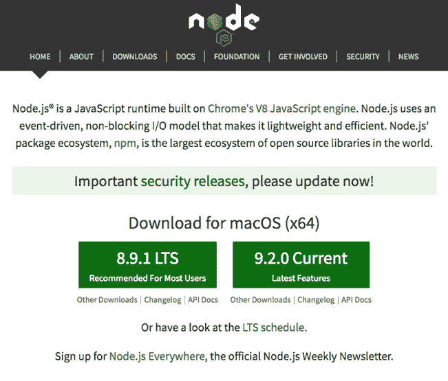
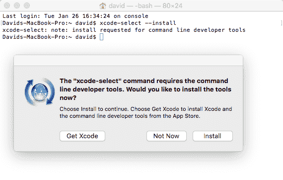
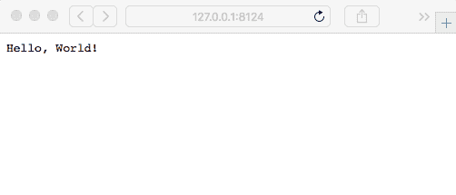

# 设置 Node.js

在开始使用 Node.js 之前，你必须设置你的开发环境。在接下来的章节中，我们将使用它进行开发和非生产部署。

在本章中，我们将涵盖以下主题：

+   如何在 Linux、macOS 或 Windows 上从源代码和预包装的二进制文件安装 Node.js

+   如何安装**Node 包管理器**（**NPM**）和一些流行工具

+   Node.js 模块系统

+   Node.js 和 JavaScript 语言从 ECMAScript 委员会的改进

所以，让我们开始吧。

# 系统要求

Node.js 运行在 POSIX-like 操作系统上，包括各种 UNIX 衍生版本（例如 Solaris）或类似系统（Linux、macOS 等），以及 Microsoft Windows。它可以在大小不同的机器上运行，包括微小的 ARM 设备，如用于 DIY 软件/硬件项目的 Raspberry Pi 微嵌入式计算机。

Node.js 现在可以通过包管理系统获得，这减少了从源代码编译和安装的需求。

由于许多 Node.js 包是用 C 或 C++编写的，你必须有一个 C 编译器（如 GCC），Python 2.7（或更高版本）和`node-gyp`包。如果你计划在网络代码中使用加密，你还需要 OpenSSL 加密库。现代 UNIX 衍生版本几乎都包含这些，Node.js 的配置脚本，在从源代码安装时使用，将检测它们的存在。如果你需要安装它们，Python 可以在[`python.org`](http://python.org)获取，OpenSSL 可以在[`openssl.org`](http://openssl.org)获取。

# 使用包管理器安装 Node.js

现在安装 Node.js 的首选方法是使用包管理器中可用的版本，例如`apt-get`或 MacPorts。包管理器通过帮助维护计算机上软件的当前版本，确保按需更新依赖包，通过输入简单的命令（如`apt-get update`）来简化你的生活。让我们首先来了解一下这一点。

# 使用 MacPorts 在 macOS 上安装

MacPorts 项目([`www.macports.org/`](http://www.macports.org/))多年来一直在为 macOS 打包大量开源软件包，他们也打包了 Node.js。在你使用他们网站上的安装程序安装 MacPorts 之后，安装 Node.js 基本上是这样的简单：

```js
$ port search nodejs npm
...
nodejs6 @6.12.0 (devel, net)
    Evented I/O for V8 JavaScript

nodejs7 @7.10.1 (devel, net)
    Evented I/O for V8 JavaScript

nodejs8 @8.9.1 (devel, net)
    Evented I/O for V8 JavaScript

nodejs9 @9.2.0 (devel, net)
    Evented I/O for V8 JavaScript

Found 6 ports.
--
npm4 @4.6.1 (devel)
    node package manager

npm5 @5.5.1 (devel)
    node package manager

Found 4 ports.

$ sudo port install nodejs8 npm5
.. long log of downloading and installing prerequisites and Node
$ which node
/opt/local/bin/node
$ node --version
v8.9.1 
```

# 使用 Homebrew 在 macOS 上安装

Homebrew 是另一个适用于 macOS 的开源软件包管理器，有人说它是 MacPorts 的完美替代品。它可以通过他们的主页[`brew.sh/`](http://brew.sh/)获取。按照他们网站上的说明安装 Homebrew，并确保 Homebrew 正确设置后，使用以下命令：

```js
$ brew update
... long wait and lots of output
$ brew search node
==> Searching local taps...
node  libbitcoin-node node-build node@6 nodeenv
leafnode llnode node@4 nodebrew nodenv
==> Searching taps on GitHub...
caskroom/cask/node-profiler
==> Searching blacklisted, migrated and deleted formulae...
```

然后，按照以下方式安装：

```js
$ brew install node
...
==> Installing node
==> Downloading https://homebrew.bintray.com/bottles/node-8.9.1.el_capitan.bottle.tar.gz
######################################################################## 100.0%
==> Pouring node-8.9.1.el_capitan.bottle.tar.gz
==> Caveats
Bash completion has been installed to:
 /usr/local/etc/bash_completion.d
==> Summary
/usr/local/Cellar/node/8.9.1: 5,012 files, 49.6MB
```

一旦以这种方式安装，就可以按照以下方式运行 Node.js 命令：

```js
$ node --version
v8.9.1  
```

# 从包管理系统在 Linux、*BSD 或 Windows 上安装

Node.js 现在通过大多数包管理系统提供。Node.js 网站上的说明目前列出了适用于大量 Linux、FreeBSD、OpenBSD、NetBSD、macOS 甚至 Windows 的 Node.js 打包版本。有关更多信息，请访问 [`nodejs.org/en/download/package-manager/`](https://nodejs.org/en/download/package-manager/)。

例如，在 Debian 和其他基于 Debian 的 Linux 发行版（如 Ubuntu）上，使用以下命令：

```js
# curl -sL https://deb.nodesource.com/setup_10.x | sudo -E bash -
# sudo apt-get install -y nodejs
# sudo apt-get install -y build-essential  
```

要下载其他 Node.js 版本（此示例显示版本 10.x），修改 URL 以适应。

# 在 Windows Subsystem for Linux (WSL) 中安装 Node.js

**Windows Subsystem for Linux** (**WSL**) 允许您在 Windows 上安装 Ubuntu、openSUSE 或 SUSE Linux Enterprise。这三个都可通过 Windows 10 内置的商店获得。您可能需要更新 Windows 以使安装生效。

一旦安装，Linux 特定的说明将在 Linux 子系统中安装 Node.js。

要安装 WSL，请参阅 [`msdn.microsoft.com/en-us/commandline/wsl/install-win10`](https://msdn.microsoft.com/en-us/commandline/wsl/install-win10)。

# 在 Windows 上打开具有管理员权限的 PowerShell

在 Windows 上安装工具时，您将运行的某些命令需要在具有提升权限的 PowerShell 窗口中执行。我们提到这一点是因为启用 WSL 的过程包括在这样一个 PowerShell 窗口中运行的命令。

该过程很简单：

1.  在开始菜单中，在应用程序搜索框中输入 PowerShell。

1.  结果菜单将列出 PowerShell。

1.  右键单击 PowerShell 条目。

1.  弹出的上下文菜单将有一个“以管理员身份运行”的条目。点击它。

结果命令窗口将具有管理员权限，标题栏将显示为管理员：Windows PowerShell。

# 从 nodejs.org 安装 Node.js 发行版

[`nodejs.org/en/`](https://nodejs.org/en/) 网站为 Windows、macOS、Linux 和 Solaris 提供了内置的二进制文件。我们只需访问网站，点击安装按钮，然后运行安装程序。对于具有包管理器的系统，例如我们刚才讨论的系统，最好使用包管理系统。这是因为你会发现保持最新版本更容易。但是，这并不适用于所有人，因为：

+   有些人可能更愿意安装二进制文件而不是处理包管理器

+   他们的系统没有包管理器

+   他们的包管理系统中的 Node.js 实现已过时

简单地访问 Node.js 网站，您会看到如下截图。页面会尽力确定您的操作系统并提供相应的下载。如果您需要其他内容，请点击页眉中的“下载”链接以获取所有可能的下载：



对于 macOS，安装程序是一个 `PKG` 文件，提供了典型的安装过程。对于 Windows，安装程序只是带你通过典型的安装向导过程。

安装程序完成后，你将拥有命令行工具，如 `node` 和 `npm`，你可以使用它们运行 Node.js 程序。在 Windows 上，你将获得一个预先配置好的 Windows 命令行版本，以便与 Node.js 一起使用。

# 在 POSIX 类似系统上从源代码安装

安装预包装的 Node.js 发行版是首选的安装方法。然而，在几种情况下，从源代码安装 Node.js 是可取的：

+   它可以让你根据需要优化编译器设置

+   它可以让你交叉编译，例如，用于嵌入式 ARM 系统

+   你可能需要保留多个 Node.js 构建，以便进行测试

+   你可能正在处理 Node.js 本身

现在你已经对整体有了了解，让我们动手处理一些构建脚本。一般过程遵循你可能已经对其他开源软件包执行过的常规 `configure`、`make` 和 `make install` 流程。如果没有，不要担心，我们会引导你完成这个过程。

官方安装说明包含在源代码分布中的 `README.md` 文件中，地址为 [`github.com/nodejs/node/blob/master/README.md`](https://github.com/nodejs/node/blob/master/README.md)。

# 安装先决条件

有三个先决条件：C 编译器、Python 和 OpenSSL 库。Node.js 编译过程会检查它们的存在，如果 C 编译器或 Python 不存在，则会失败。安装这些软件的具体方法取决于你的操作系统。

这类命令将检查它们的存在：

```js
$ cc --version
Apple LLVM version 7.0.2 (clang-700.1.81)
Target: x86_64-apple-darwin15.3.0
Thread model: posix
$ python
Python 2.7.11 (default, Jan  8 2016, 22:23:13) 
[GCC 4.2.1 Compatible Apple LLVM 7.0.2 (clang-700.1.81)] on darwin
Type "help", "copyright", "credits" or "license" for more information.
>>>
```

详细信息请参阅：[`github.com/nodejs/node/blob/master/BUILDING.md`](https://github.com/nodejs/node/blob/master/BUILDING.md)。

Node.js 构建工具不支持 Python 3.x。

# 在 macOS 上安装开发者工具

开发者工具（如 GCC）在 macOS 上是可选安装。幸运的是，它们很容易获取。

你从 Xcode 开始，它可以通过 Mac App Store 免费获取。只需搜索 Xcode 并点击获取按钮。安装 Xcode 后，打开一个终端窗口并输入以下命令：

```js
$ xcode-select --install
```

这将安装 Xcode 命令行工具：



想要了解更多信息，请访问 [`osxdaily.com/2014/02/12/install-command-line-tools-mac-os-x/`](http://osxdaily.com/2014/02/12/install-command-line-tools-mac-os-x/)。

# 在所有 POSIX 类似系统上从源代码安装

从源代码编译 Node.js 的过程如下：

1.  从以下地址下载源代码：

1.  [`nodejs.org/download.`](http://nodejs.org/download) 使用 `./configure` 配置源代码以进行构建。

1.  运行 `make`，然后 `make install`。

源代码包可以通过浏览器下载，或者如下所示，替换为你喜欢的版本：

```js
$ mkdir src
$ cd src
$ wget https://nodejs.org/dist/v10.0.0/node-v10.0.0.tar.gz
$ tar xvfz node-v10.0.0.tar.gz
$ cd node-v10.0.0
```

现在我们配置源，以便可以构建。这就像许多其他开源软件包一样，有一长串选项可以自定义构建：

```js
$ ./configure --help
```

要使安装位于你的主目录中，请按以下方式运行：

```js
$ ./configure --prefix=$HOME/node/10.0.0
..output from configure  
```

如果你打算并行安装多个 Node.js 版本，将版本号放入路径中很有用，如下所示。这样，每个版本都将位于单独的目录中。通过适当地更改 `PATH` 变量，可以简单地切换 Node.js 版本：

```js
# On bash shell:
$ export PATH=${HOME}/node/VERSION-NUMBER/bin:${PATH}
# On csh
$ setenv PATH ${HOME}/node/VERSION-NUMBER/bin:${PATH}
```

安装多个 Node.js 版本的更简单方法是后面描述的 `nvm` 脚本。

如果你想在系统目录中安装 Node.js，只需省略 `--prefix` 选项，它将默认安装到 `/usr/local`。

一段时间后，它将停止，并且很可能已成功配置源树以在所选目录中安装。如果这没有成功，打印的错误信息将描述需要解决的问题。一旦配置脚本满意，你可以继续下一步。

配置脚本满意后，编译软件：

```js
$ make
.. a long log of compiler output is printed
$ make install
```

如果你打算在系统目录中安装，请按以下方式执行最后一步：

```js
$ make
$ sudo make install
```

安装完成后，你应该确保将安装目录添加到你的 `PATH` 变量中，如下所示：

```js
$ echo 'export PATH=$HOME/node/10.0.0/bin:${PATH}' >>~/.bashrc
$ . ~/.bashrc  
```

对于 `csh` 用户，使用以下语法来创建一个导出的环境变量：

```js
$ echo 'setenv PATH $HOME/node/10.0.0/bin:${PATH}' >>~/.cshrc
$ source ~/.cshrc  
```

这应该会生成以下目录：

```js
$ ls ~/node/10.0.0/
bin   include   lib   share
$ ls ~/node/10.0.0/bin  
```

# 在 Windows 上从源安装

之前引用的 `BUILDING.md` 文档中有说明。一种方法是使用 Visual Studio 的构建工具，或者使用完整的 Visual Studio 2017 产品：

+   Visual Studio 2017: [`www.visualstudio.com/downloads/`](https://www.visualstudio.com/downloads/)

+   构建工具: [`www.visualstudio.com/downloads/#build-tools-for-visual-studio-2017`](https://www.visualstudio.com/downloads/#build-tools-for-visual-studio-2017)

需要三个额外的工具：

+   Git for Windows: [`git-scm.com/download/win`](http://git-scm.com/download/win)

+   Python: [`www.python.org/`](https://www.python.org/)

+   OpenSSL: [`www.openssl.org/source/`](https://www.openssl.org/source/) 和 [`wiki.openssl.org/index.php/Binaries`](https://wiki.openssl.org/index.php/Binaries)

然后，运行包含的 `.\vcbuild` 脚本来执行构建。

# 使用 nvm 安装多个 Node.js 实例

通常，你不会安装多个 Node.js 版本，这样做会增加系统的复杂性。但是，如果你正在修改 Node.js 本身，或者正在针对不同的 Node.js 发布版测试你的软件，你可能希望拥有多个 Node.js 安装。这样做的方法是我们已经讨论过的简单变体。

在之前讨论从源代码构建 Node.js 时，我们提到可以在不同的目录中安装多个 Node.js 实例。只有当你需要自定义 Node.js 构建，大多数人会满足于预构建的 Node.js 二进制文件。它们也可以安装到不同的目录中。

要在 Node.js 版本之间切换，只需更改 `PATH` 变量（在 POSIX 系统上），如下所示，使用你安装 Node.js 的目录：

```js
$ export PATH=/usr/local/node/VERSION-NUMBER/bin:${PATH}  
```

过了一段时间后，维护这些内容开始变得有点繁琐。对于每个发布版，你都必须在你的 Node.js 安装中设置 Node.js、NPM 以及你想要的任何第三方模块。此外，显示用于更改 `PATH` 的命令并不十分理想。富有创造力的程序员们已经创建了几个版本管理器，以简化管理多个 Node.js/NPM 发布版，并提供智能方式更改 `PATH` 的命令：

+   Node 版本管理器：[`github.com/tj/n`](https://github.com/tj/n)

+   Node 版本管理器：[`github.com/creationix/nvm`](https://github.com/creationix/nvm)

它们都维护多个同时运行的 Node 版本，并允许你轻松地在版本之间切换。安装说明可在它们各自的网站上找到。

例如，使用 `nvm`，你可以运行以下命令：

```js
$ nvm ls
...
 v6.0.0
 v6.1.0
 v6.2.2
 v6.3.1
 v6.4.0
 ...
 v6.11.2
 v7.0.0
 v7.1.0
 v7.10.0
 v8.0.0
 v8.1.3
 v8.2.1
 v8.5.0
 v8.9.1
 v8.9.3
 v9.2.0
 v9.4.0
 v9.5.0
 v9.10.1
 v9.11.1
 -> v10.0.0
 -> system
node -> stable (-> v8.9.1) (default)
stable -> 8.9 (-> v8.9.1) (default)
iojs -> N/A (default)
$ nvm use 10
Now using node v10.0.0 (npm v5.6.0)
$ node --version
v10.0.0
$ nvm use v4.2
Now using node v4.2.0 (npm v2.14.7)
$ node --version
v4.2.0
$ nvm install 9
Downloading https://nodejs.org/dist/v9.2.0/node-v9.2.0-darwin-x64.tar.xz...
######################################################################## 100.0%
WARNING: checksums are currently disabled for node.js v4.0 and later
Now using node v9.2.0 (npm v5.5.1)
$ node --version
v9.2.0
$ which node
/Users/david/.nvm/versions/node/v9.2.0/bin/node
$ /usr/local/bin/node --version
v8.9.1
$ /opt/local/bin/node --version
v8.9.1
```

这表明你可以安装一个系统范围内的 Node.js，同时使用 `nvm` 管理多个私有 Node.js 版本，并在需要时切换它们。当新的 Node.js 版本发布时，使用 `nvm` 安装它们非常简单，即使你的操作系统官方打包版本没有立即更新。

# 在 Windows 上安装 nvm

不幸的是，`nvm` 不支持 Windows。幸运的是，存在几个针对 Windows 的 `nvm` 概念的特定克隆：

+   [`github.com/coreybutler/nvm-windows`](https://github.com/coreybutler/nvm-windows)

+   [`github.com/marcelklehr/nodist`](https://github.com/marcelklehr/nodist)

另一种方法是使用 WSL。因为在 WSL 中，你是在与 Linux 命令行交互，所以你可以使用 `nvm` 本身。

本书中的许多示例都是使用 `nvm-windows` 应用程序测试的。它们的行为略有不同，但与 Linux 和 macOS 上的 `nvm` 大致相同。最大的变化是 `nvm use` 和 `nvm install` 命令中的版本号指定符。

在 Linux 和 macOS 上使用 `nvm`，你可以输入一个简单的版本号，例如 `nvm use 8`，它将自动替换指定 Node.js 版本的最新发布版。使用 `nvm-windows`，相同的命令会像你输入了 "`nvm use 8.0.0`" 一样执行。换句话说，使用 `nvm-windows`，你必须使用确切的版本号。幸运的是，使用 "`nvm list available`" 命令可以轻松地获取支持的版本列表。

# 原生代码模块和 node-gyp

虽然我们在这本书中不会讨论原生代码模块的开发，但我们确实需要确保它们可以被构建。NPM 仓库中的一些模块是原生代码，它们必须使用 C 或 C++编译器编译以生成相应的`.node`文件（`.node`扩展名用于二进制原生代码模块）。

模块通常会将自己描述为其他库的包装器。例如，`libxslt`和`libxmljs`模块是同名 C/C++库的包装器。模块包含 C/C++源代码，并且在安装时，会自动运行一个脚本来使用`node-gyp`进行编译。

`node-gyp`工具是一个用 Node.js 编写的跨平台命令行工具，用于编译 Node.js 的原生插件模块。我们已经多次提到原生代码模块，这正是用于将它们编译用于 Node.js 的工具。

您可以通过运行以下命令轻松看到这一过程：

```js
$ mkdir temp
$ cd temp
$ npm install libxmljs libxslt  
```

这是在一个临时目录中完成的，因此您可以在之后删除它。如果您的系统没有安装用于编译原生代码模块的工具，您将看到错误信息。否则，您将在输出中看到一个`node-gyp`执行过程，后面跟着许多与编译 C/C++文件明显相关的文本行。

`node-gyp`工具的先决条件类似于从源代码编译 Node.js 的先决条件。具体来说，需要一个 C/C++编译器、一个 Python 环境以及其他构建工具，如 Git。对于 Unix/macOS/Linux 系统，这些工具很容易获得。对于 Windows 系统，您应该安装：

+   Visual Studio 构建工具：[`www.visualstudio.com/downloads/#build-tools-for-visual-studio-2017`](https://www.visualstudio.com/downloads/#build-tools-for-visual-studio-2017)

+   Windows 版的 Git：[`git-scm.com/download/win`](http://git-scm.com/download/win)

+   Windows 版的 Python：[`www.python.org/`](https://www.python.org/)

通常，您不需要担心安装`node-gyp`。这是因为它作为 NPM 的一部分在幕后安装。这样做是为了让 NPM 能够自动构建原生代码模块。

它的 GitHub 仓库包含在[`github.com/nodejs/node-gyp`](https://github.com/nodejs/node-gyp)上的文档。

阅读其仓库中的`node-gyp`文档，将使您对之前讨论的编译先决条件以及原生代码模块的开发有更清晰的理解。

# Node.js 版本策略和应使用哪个版本

在上一节中，我们提到了许多不同的 Node.js 版本号，您可能对应该使用哪个版本感到困惑。本书的目标是 Node.js 版本 10.x，并且预计我们将涵盖的所有内容都与 Node.js 10.x 及其后续版本兼容。

从 Node.js 4.x 开始，Node.js 团队采用了一种双轨方法。偶数版本的发布（4.x、6.x、8.x 等等）被称为**长期支持**（**LTS**），而奇数版本的发布（5.x、7.x、9.x 等等）是当前新功能开发的地方。虽然开发分支保持稳定，但 LTS 发布版定位为生产使用，并将接收多年的更新。

在撰写本文时，Node.js 8.x 是当前的长期支持（LTS）版本；Node.js 9.x 刚刚发布，最终将成为 Node.js 10.x，而 Node.js 10.x 最终将成为 LTS 版本。关于发布计划的完整详情，请参阅 [`github.com/nodejs/LTS/`](https://github.com/nodejs/LTS/)。

每次新的 Node.js 发布都会带来重大影响，除了通常的性能改进和错误修复之外，还会引入最新的 V8 JavaScript 引擎版本。反过来，这也意味着随着 V8 团队实现这些功能，将引入更多的 ES-2015/2016/2017 特性。在 Node.js 8.x 中，`async/await` 函数出现，而在 Node.js 10.x 中，对标准 ES6 模块格式的支持也出现了。

一个实际的考虑因素是新的 Node.js 发布是否会破坏您的代码。随着 V8 追上 ECMAScript，新的语言特性始终在添加，Node.js 团队有时会在 Node.js API 中进行破坏性更改。如果您在一个 Node.js 版本上进行了测试，它会在更早的版本上工作吗？Node.js 的更改是否会破坏我们做出的某些假设？

NPM 包管理器帮助我们确保我们的包能够在正确的 Node.js 版本上执行。这意味着我们可以在第三章中将要探讨的 `package.json` 文件中指定一个包的兼容 Node.js 版本。

我们可以在 `package.json` 中添加如下条目：

```js
engines: { 
  "node": ">=6.x" 
} 
```

这意味着它确实意味着所提供的包与 Node.js 6.x 或更高版本兼容。

当然，您的开发机器可能安装了多个 Node.js 版本。您需要您的软件声明的支持版本，以及您希望评估的任何后续版本。

# 编辑器和调试器

由于 Node.js 代码是 JavaScript，任何具有 JavaScript 意识的编辑器都将是有用的。与一些其他语言如此复杂，以至于需要一个具有代码补全功能的 IDE 一样，一个简单的编程编辑器对于 Node.js 开发来说就足够了。

有两个编辑器值得特别提及，因为它们是用 Node.js 编写的：Atom 和 Microsoft Visual Studio Code。

Atom ([`atom.io/`](https://atom.io/)) 自称为 21 世纪的 hackable 编辑器。它可以通过编写使用 Atom API 的 Node.js 模块进行扩展，配置文件也易于编辑。换句话说，它以与其他许多编辑器相同的方式 hackable，追溯到 Emacs，这意味着编写一个软件模块来添加编辑器的功能。Electron 框架是为了构建 Atom 而发明的，Electron 是使用 Node.js 构建桌面应用程序的一个超级简单的方法。

微软 Visual Studio Code ([`code.visualstudio.com/`](https://code.visualstudio.com/)) 也是一个可修改的编辑器——嗯，主页上说是可扩展和可定制的，这意味着相同的意思——它也是开源的，并且是用 Electron 实现的。但它不是一个空洞的模仿编辑器，模仿 Atom 而不添加任何自己的东西。相反，Visual Studio Code 是一个真正的程序员编辑器，本身就有很多有趣的功能。

关于调试器，有几个有趣的选择。从 Node.js 6.3 开始，`inspector` 协议使得可以使用 Google Chrome 调试器。Visual Studio Code 内置了一个也使用 `inspector` 协议的调试器。

要查看调试选项和工具的完整列表，请参阅 [`nodejs.org/en/docs/guides/debugging-getting-started/`](https://nodejs.org/en/docs/guides/debugging-getting-started/)。

# 运行和测试命令

现在你已经安装了 Node.js，我们想做两件事——验证安装是否成功，并让你熟悉命令行工具。

# Node.js 的命令行工具

Node.js 的基本安装包括两个命令，`node` 和 `npm`。我们已经看到了 `node` 命令的使用。它用于运行命令行脚本或服务器进程。另一个，`npm`，是 Node.js 的包管理器。

验证你的 Node.js 安装是否正常工作的最简单方法也是获取 Node.js 帮助的最佳方式。输入以下命令：

```js
$ node --help
Usage: node [options] [ -e script | script.js | - ] [arguments]
 node inspect script.js [arguments]

Options:
 -v, --version print Node.js version
 -e, --eval script evaluate script
 -p, --print evaluate script and print result
 -c, --check syntax check script without executing
 -i, --interactive always enter the REPL even if stdin
 does not appear to be a terminal
 -r, --require module to preload (option can be repeated)
 - script read from stdin (default; interactive mode if a tty)
 --inspect[=[host:]port] activate inspector on host:port
 (default: 127.0.0.1:9229)
 --inspect-brk[=[host:]port]
 activate inspector on host:port
 and break at start of user script
 --inspect-port=[host:]port
 set host:port for inspector

... many more options
Environment variables:
NODE_DEBUG ','-separated list of core modules
 that should print debug information
NODE_DISABLE_COLORS set to 1 to disable colors in the REPL
NODE_EXTRA_CA_CERTS path to additional CA certificates
 file
NODE_ICU_DATA data path for ICU (Intl object) data
 (will extend linked-in data)
NODE_NO_WARNINGS set to 1 to silence process warnings
NODE_NO_HTTP2 set to 1 to suppress the http2 module
NODE_OPTIONS set CLI options in the environment
 via a space-separated list
NODE_PATH ':'-separated list of directories
 prefixed to the module search path
NODE_PENDING_DEPRECATION set to 1 to emit pending deprecation
 warnings
NODE_REPL_HISTORY path to the persistent REPL history
 file
NODE_REDIRECT_WARNINGS write warnings to path instead of
 stderr
OPENSSL_CONF load OpenSSL configuration from file

Documentation can be found at https://nodejs.org/
```

注意，Node.js 和 V8（在之前的命令行中未显示）都有选项。记住，Node.js 是建立在 V8 之上的；它拥有自己的选项宇宙，主要关注字节码编译或垃圾回收和堆算法的细节。输入 `node --v8-options` 来查看它们的完整列表。

在命令行中，你可以指定选项、单个脚本文件以及该脚本的参数列表。我们将在下一节 *使用 Node.js 运行简单脚本* 中进一步讨论脚本参数。

不带参数运行 Node.js 会让你进入一个交互式 JavaScript 命令行界面：

```js
$ node
> console.log('Hello, world!');
Hello, world!
undefined  
```

你可以在 Node.js 脚本中编写的任何代码都可以在这里编写。命令解释器提供了一个良好的面向终端的用户体验，并且对于交互式地玩弄你的代码很有用。你确实在玩你的代码，不是吗？很好！

# 使用 Node.js 运行简单脚本

现在，让我们看看如何使用 Node.js 运行脚本。这很简单；让我们先参考之前显示的帮助信息。命令行模式只是一个脚本文件名和一些脚本参数，这对于任何在其他语言中编写过脚本的人来说应该很熟悉。

使用任何处理纯文本文件的文本编辑器都可以创建和编辑 Node.js 脚本，例如 VI/VIM、Emacs、Notepad++、Atom、Visual Studio Code、Jedit、BB Edit、TextMate 或 Komodo。如果它是一个面向程序员的编辑器，那么语法高亮就很有帮助。

对于本书中的这个和其他示例，文件的位置实际上并不重要。然而，为了整洁起见，你可以在计算机的 home 目录中创建一个名为 `node-web-dev` 的目录，并在其中为每一章创建一个目录（例如，`chap02` 和 `chap03`）。

首先，创建一个名为 `ls.js` 的文本文件，内容如下：

```js
const fs = require('fs');
const util = require('util');
const fs_readdir = util.promisify(fs.readdir);

(async () => {
 const files = await fs_readdir('.');
 for (let fn of files) {
 console.log(fn);
 }
})().catch(err => { console.error(err); });
```

接下来，通过输入以下命令来运行它：

```js
$ node ls.js
ls.js
```

这是对 Unix `ls` 命令的一个肤浅的廉价模仿（好像你从名字中看不出来一样）。`readdir` 函数是 Unix `readdir` 系统调用的近似（在终端窗口中输入 `man 3 readdir` 以了解更多信息）并用于列出目录中的文件。

我们使用内联 `async` 函数、`await` 关键字和 ES2015 的 `for..of` 循环来编写这个。使用 `util.promisify`，我们可以将任何回调函数转换为返回 Promise 的函数，这样 Promise 就可以很好地与 `await` 关键字配合使用。

默认情况下，`fs` 模块函数使用回调模式，这与大多数 Node.js 模块相同。但在 `async` 函数中，如果函数返回 promises 则更为方便。使用 `util.promisify` 我们可以实现这一点。

此脚本硬编码为列出当前目录中的文件。真正的 `ls` 命令需要一个目录名，所以让我们稍微修改一下脚本。

命令行参数存储在名为 `process.argv` 的全局数组中。因此，我们可以修改 `ls.js`，将其复制为 `ls2.js`，如下所示，以查看这个数组的工作方式：

```js
const fs = require('fs');
const util = require('util');
const fs_readdir = util.promisify(fs.readdir);

(async () => {
  var dir = '.';
  if (process.argv[2]) dir = process.argv[2];
  const files = await fs_readdir(dir);
  for (let fn of files) {
    console.log(fn);
  }
})().catch(err => { console.error(err); });
```

你可以按照以下方式运行它：

```js
$ pwd
/Users/David/chap02
$ node ls2 ..
chap01
chap02
$ node ls2
app.js
ls.js
ls2.js
```

我们只是检查了命令行参数是否存在，`if (process.argv[2])`。如果存在，我们覆盖了 `dir` 变量的值，`dir = process.argv[2]`，然后我们使用它作为 `readdir` 参数。

如果你给它一个不存在的目录路径名，将会抛出一个错误，并使用 `catch` 子句打印出来。看起来是这样的：

```js
$ node ls2.js /nonexistent
{ Error: ENOENT: no such file or directory, scandir '/nonexistent'
 errno: -2,
 code: 'ENOENT',
 syscall: 'scandir',
 path: '/nonexistent' }
```

# 转换为异步函数和 Promise 模式

在上一节中，我们讨论了 `util.promisify` 以及其将回调函数转换为返回 Promise 的能力。后者在异步函数中表现良好，因此函数返回 Promise 是更可取的。

更精确地说，`util.promisify`需要提供一个使用错误优先回调范式的函数。这些函数的最后一个参数是一个回调函数，其第一个参数被解释为错误指示器，因此得名错误优先回调。`util.promisify`返回的函数将返回一个 Promise。

Promise 与错误优先回调具有相同的目的。如果指示有错误，Promise 将解析为拒绝状态，而如果指示成功，Promise 将解析为成功状态。正如我们在这些示例中看到的那样，在`async`函数中，Promise 被处理得非常好。

Node.js 生态系统拥有大量使用错误优先回调的错误处理函数。社区已经开始了一个转换过程，其中函数将返回一个 Promise，并且可能也会为了 API 兼容性而采用错误优先回调。

Node.js 10 中的新特性之一就是这样的转换示例。在`fs`模块中有一个子模块，名为`fs.promises`，它具有相同的 API 但生成 Promise 对象。我们可以将前面的示例重写如下：

```js
const fs = require('fs').promises;
(async () => {
 var dir = '.';
 if (process.argv[2]) dir = process.argv[2];
 const files = await fs.readdir(dir);
```

```js
 for (let fn of files) {
     console.log(fn);
 }
})().catch(err => { console.error(err); });
```

正如你所看到的，`fs.promises`模块中的函数在不需要回调函数的情况下返回一个 Promise。你可以将新程序保存为`ls2-promises.js`，然后按照以下方式运行：

```js
$ node ls2-promises.js 
(node:40329) ExperimentalWarning: The fs.promises API is experimental
app.js ls.js
ls2-promises.js
ls2.js
```

API 目前处于实验状态，因此我们看到了这个警告。

另一个选择是第三方模块`fs-extra`。此模块在标准`fs`模块之外具有扩展的 API。一方面，如果未提供回调函数，则其函数返回一个 Promise，否则调用回调。此外，它还包括几个有用的函数。

在本书的其余部分，我们将使用`fs-extra`，因为这些额外的函数。有关模块的文档，请参阅：[`www.npmjs.com/package/fs-extra`](https://www.npmjs.com/package/fs-extra)。

# 使用 Node.js 启动服务器

你将要运行的许多脚本都是服务器进程。我们将在稍后运行很多这样的脚本。由于我们仍然处于验证安装和让你熟悉使用 Node.js 的双重模式，我们想要运行一个简单的 HTTP 服务器。让我们借用 Node.js 主页上的简单服务器脚本（[`nodejs.org`](http://nodejs.org)）。

创建一个名为`app.js`的文件，包含以下内容：

```js
const http = require('http'); 
http.createServer(function (req, res) { 
  res.writeHead(200, {'Content-Type': 'text/plain'}); 
  res.end('Hello, World!\n'); 
}).listen(8124, '127.0.0.1'); 
console.log('Server running at http://127.0.0.1:8124'); 
```

按照以下方式运行：

```js
$ node app.js
Server running at http://127.0.0.1:8124  
```

这是你可以用 Node.js 构建的最简单的 Web 服务器。如果你对它是如何工作的感兴趣，请翻到第四章[2e4fd521-22f2-4df0-810c-54c972ed8e6e.xhtml]，*HTTP 服务器和客户端*；第五章[e4322e55-673b-45c5-b64e-fc107d57ef03.xhtml]，*你的第一个 Express 应用程序*；以及第六章，*实现移动优先范式*。目前，只需在你的浏览器中访问`http://127.0.0.1:8124`，即可看到 Hello, World!消息：



一个值得思考的问题是为什么当 `ls.js` 退出时，这个脚本没有退出。在这两种情况下，脚本的执行都达到了脚本的末尾；在 `app.js` 中，Node.js 进程没有退出，而在 `ls.js` 中则退出了。

原因在于存在活跃的事件监听器。Node.js 总是启动一个事件循环，在 `app.js` 中，`listen` 函数创建了一个实现 HTTP 协议的事件 `listener`。这个事件监听器使 `app.js` 保持运行，直到你做某些事情，例如在终端窗口中输入 *Ctrl* + *C*。在 `ls.js` 中，没有创建长时间运行的事件监听器的代码，因此当 `ls.js` 到达其脚本的末尾时，`node` 进程将退出。

# NPM - Node.js 包管理器

Node.js 本身是一个相当基础的系统，它是一个带有一些有趣的异步 I/O 库的 JavaScript 解释器。使 Node.js 有趣的事情之一是 Node.js 第三方模块生态系统的快速增长。

在这个生态系统中心的是 NPM。虽然 Node.js 模块可以作为源代码下载并手动组装以供 Node.js 程序使用，但这很繁琐，并且很难实现可重复的构建过程。NPM 给我们提供了一个更简单的方法；NPM 是 Node.js 的既定标准包管理器，它极大地简化了下载和使用这些模块的过程。我们将在下一章详细讨论 NPM。

留意的人会注意到 `npm` 已经通过之前讨论的所有安装方法安装了。过去，`npm` 是单独安装的，但今天它已经与 Node.js 打包在一起。

现在我们已经安装了 `npm`，让我们快速试用一下。**hexy** 程序是一个用于打印文件十六进制转储的实用工具。这是一件非常 1970 年代的事情，但仍然非常有用。它现在为我们提供了快速安装和尝试的东西：

```js
$ npm install -g hexy
/opt/local/bin/hexy -> /opt/local/lib/node_modules/hexy/bin/hexy_cmd.js
+ hexy@0.2.10
added 1 package in 1.107s
```

添加 `-g` 标志可以使模块在命令行 shell 的当前工作目录之外全局可用。全局安装当模块提供命令行界面时最有用。当一个包提供命令行脚本时，`npm` 会设置它。对于全局安装，命令被正确安装，以便所有计算机用户使用。

根据你的 Node.js 安装方式，可能需要使用 `sudo` 运行：

```js
$ sudo npm install -g hexy
```

安装完成后，你可以这样运行新安装的程序：

```js
$ hexy --width 12 ls.js
00000000: 636f 6e73 7420 6673 203d 2072 const.fs.=.r
0000000c: 6571 7569 7265 2827 6673 2729 equire('fs')
00000018: 3b0a 636f 6e73 7420 7574 696c ;.const.util
00000024: 203d 2072 6571 7569 7265 2827 .=.require('
00000030: 7574 696c 2729 3b0a 636f 6e73 util');.cons
0000003c: 7420 6673 5f72 6561 6464 6972 t.fs_readdir
00000048: 203d 2075 7469 6c2e 7072 6f6d .=.util.prom
00000054: 6973 6966 7928 6673 2e72 6561 isify(fs.rea
00000060: 6464 6972 293b 0a0a 2861 7379 ddir);..(asy
0000006c: 6e63 2028 2920 3d3e 207b 0a20 nc.().=>.{..
00000078: 2063 6f6e 7374 2066 696c 6573 .const.files
00000084: 203d 2061 7761 6974 2066 735f .=.await.fs_
00000090: 7265 6164 6469 7228 272e 2729 readdir('.')
0000009c: 3b0a 2020 666f 7220 2866 6e20 ;...for.(fn.
000000a8: 6f66 2066 696c 6573 2920 7b0a of.files).{.
000000b4: 2020 2020 636f 6e73 6f6c 652e ....console.
000000c0: 6c6f 6728 666e 293b 0a20 207d log(fn);...}
000000cc: 0a7d 2928 292e 6361 7463 6828 .})().catch(
000000d8: 6572 7220 3d3e 207b 2063 6f6e err.=>.{.con
000000e4: 736f 6c65 2e65 7272 6f72 2865 sole.error(e
000000f0: 7272 293b 207d 293b           rr);.});
```

再次，我们将在下一章深入探讨 NPM。**hexy** 实用工具既是 Node.js 库，也是用于打印这些旧式十六进制转储的脚本。

# Node.js、ECMAScript 2015/2016/2017 以及更远

2015 年，ECMAScript 委员会发布了 JavaScript 语言期待已久的重大更新。这次更新为 JavaScript 带来了许多新特性，如 Promises、箭头函数和类对象。语言更新为改进奠定了基础。这应该会极大地提高我们编写清晰、可理解的 JavaScript 代码的能力。

浏览器制造商正在添加这些迫切需要的特性，这意味着 V8 引擎也在添加这些特性。这些特性从 4.x 版本开始进入 Node.js。

要了解 Node.js 中 ES-2015 的当前状态，请访问[`nodejs.org/en/docs/es6/`](https://nodejs.org/en/docs/es6/)。

默认情况下，Node.js 只启用了 V8 认为稳定的 ES-2015/2016/2017 特性。可以通过命令行选项启用更多特性。几乎完整的特性可以通过`--es_staging`选项启用。网站文档提供了更多信息。

Node green 网站([`node.green/`](http://node.green/))列出了 Node.js 版本中大量特性的状态。

ES2017 语言规范发布在：

[`www.ecma-international.org/publications/standards/Ecma-262.htm`](https://www.ecma-international.org/publications/standards/Ecma-262.htm)。

TC-39 委员会在 GitHub 上完成其工作[`github.com/tc39`](https://github.com/tc39)。

ES-2015 特性在 JavaScript 语言中做出了重大改进。其中一个特性，`Promise`类，应该意味着对 Node.js 编程中常见惯用的根本性重新思考。在 ES-2017 中，一对新的关键字`async`和`await`将简化 Node.js 中的异步代码编写，并应该鼓励 Node.js 社区进一步重新思考平台上的常见惯用。

有许多新的 JavaScript 特性，但让我们快速浏览其中两个我们将广泛使用的特性。

第一个是一个更轻量级的函数语法，称为箭头函数：

```js
fs.readFile('file.txt', 'utf8', (err, data) => { 
  if (err) ...; // do something with the error 
  else ...;  // do something with the data 
}); 
```

这不仅仅是用肥箭头替换`function`关键字这种语法糖。箭头函数不仅更轻量级，而且更容易阅读。轻量级的代价是改变箭头函数内部`this`的值。在常规函数中，`this`在函数内部有一个独特的值。在箭头函数中，`this`与包含箭头函数的作用域具有相同的值。这意味着，当使用箭头函数时，我们不需要跳过任何障碍来将`this`带入回调函数，因为`this`在代码的两个级别上都是相同的。

下一个特性是`Promise`类，它用于延迟和异步计算。将代码执行延迟以实现异步行为是 Node.js 的一个关键范式，它需要两个惯用约定：

+   异步函数的最后一个参数是一个回调函数，当需要进行异步执行时会被调用

+   回调函数的第一个参数是一个错误指示器

虽然方便，但这些约定导致了多层代码金字塔，这可能难以理解和维护：

```js
doThis(arg1, arg2, (err, result1, result2) => { 
    if (err) ...; 
    else { 
         // do some work 
         doThat(arg2, arg3, (err2, results) => { 
              if (err2) ...; 
              else { 
                     doSomethingElse(arg5, err => { 
                             if (err) .. ; 
                             else ..; 
                     }); 
              } 
         }); 
    } 
}); 
```

根据特定任务所需的步骤数量，代码金字塔可以变得相当深。`Promise` 将使我们解开代码金字塔并提高可靠性，因为错误处理更直接且易于捕获所有错误。

创建 `Promise` 类的方式如下：

```js
function doThis(arg1, arg2) { 
    return new Promise((resolve, reject) => { 
        // execute some asynchronous code 
        if (errorIsDetected) return reject(errorObject); 
        // When the process is finished call this: 
        resolve(result1, result2); 
    }); 
}
```

而不是传递回调函数，调用者接收一个 `Promise` 对象。当正确使用时，前面的金字塔可以编码如下：

```js
doThis(arg1, arg2) 
.then(result => { 
  // This can receive only one value, hence to
  // receive multiple values requires an object or array
  return doThat(arg2, arg3); 
}) 
.then((results) => { 
  return doSomethingElse(arg5); 
}) 
.then(() => { 
   // do a final something 
}) 
.catch(err => { 
   // errors land here 
}); 
```

这之所以有效，是因为 `Promise` 类支持链式调用，如果 `then` 函数返回一个 `Promise` 对象。

`async/await` 特性实现了 `Promise` 类的承诺，以简化异步编程。此特性在 `async` 函数内激活：

```js
async function mumble() {
   // async magic happens here
}
```

`async` 箭头函数如下：

```js
const mumble = async () => {
    // async magic happens here
};
```

它的使用方式如下：

```js
async function doSomething(arg1, arg2, arg3, arg4, arg5) {
    var { result1, result2 } = await doThis(arg1, arg2);
    var results = await doThat(arg2, arg3);
    await doSomethingElse(arg5);
    // do a final something
    return finalResult;
}
```

与我们最初使用的嵌套结构相比，这难道不是一股清新的空气吗？

`await` 关键字与 `Promise` 一起使用。它自动等待 `Promise` 解决。如果 `Promise` 成功解决，则返回值，如果它以错误解决，则抛出该错误。处理结果和抛出错误都以自然的方式处理。

此示例还展示了另一个 ES2015 特性：解构。可以使用以下方式提取对象的字段：

```js
var { value1, value2 } = {
    value1: "Value 1", value2: "Value 2", value3: "Value3"
};
```

我们有一个包含三个字段的对象，但只提取其中的两个字段。

# 使用 Babel 来使用实验性的 JavaScript 特性

Babel 转译器（[`babeljs.io/`](http://babeljs.io/））是使用旧实现上的前沿 JavaScript 特性的绝佳方式。**转译**一词意味着 Babel 将 JavaScript 代码重写为其他 JavaScript 代码，具体来说，是将 ES-2015 或 ES-2016 特性重写为旧 JavaScript 代码。Babel 将 JavaScript 源代码转换为抽象语法树，然后操作该树以使用旧 JavaScript 功能重写代码，然后将该树写入 JavaScript 源代码文件。

换句话说，Babel 将 JavaScript 代码重写为 JavaScript 代码，应用所需的转换，例如将 ES2015/2016 特性转换为可以在网页浏览器中运行的 ES5 代码。

许多人使用 Babel 来尝试 TC-39 委员会正在推进的新 JavaScript 特性提案。其他人使用 Babel 在不支持这些特性的 JavaScript 引擎的项目中使用新的 JavaScript 特性。

Node Green 网站明确指出，Node.js 几乎支持所有 ES2015/2016/2017 特性。因此，从实际的角度来看，我们不再需要为 Node.js 项目使用 Babel。

对于网页浏览器来说，一组 ECMAScript 特性从提出到我们可以在浏览器端代码中可靠地使用它们之间有一个更长的时间滞后。这并不是因为网页浏览器的制造商在采用新特性方面缓慢，因为 Google、Mozilla 和 Microsoft 团队都是积极采用最新特性的。不幸的是，苹果的 Safari 团队似乎在采用新特性方面较慢。然而，更慢的是新浏览器在现有计算机群体中的渗透率。

因此，现代 JavaScript 程序员需要熟悉 Babel。

我们目前还没有准备好展示这些功能的示例代码，但我们可以继续记录 Babel 工具的设置。有关设置文档的更多信息，请访问 [http://babeljs.io/docs/setup/](http://babeljs.io/docs/setup/)，然后点击 CLI 按钮。

为了简要了解 Babel，我们将使用它来转换我们之前看到的脚本，以便在 Node.js 6.x 上运行。在这些脚本中，我们使用了异步函数，这些函数在 Node.js 6.x 中不受支持。

在包含 `ls.js` 和 `ls2.js` 的目录中，输入以下命令：

```js
$ npm install babel-cli \
       babel-plugin-transform-es2015-modules-commonjs \
       babel-plugin-transform-async-to-generator
```

这将安装 Babel 软件，以及一些转换插件。Babel 有一个插件系统，这样您就可以启用项目所需的转换。在这个例子中，我们的主要目标是把之前展示的 `async` 函数转换为 Generator 函数。Generators 是 ES2015 中引入的一种新类型的函数，它是 `async` 函数实现的基础。

由于 Node.js 6.x 没有提供 `util.promisify`，我们需要进行一项替换：

```js
// const fs_readdir = util.promisify(fs.readdir);
const fs_readdir = dir => {
   return new Promise((resolve, reject) => {
       fs.readdir(dir, (err, fileList) => {
           if (err) reject(err);
           else resolve(fileList);
       });
    });
};
```

这种结构大致就是 `util.promisify` 函数所做的事情。

接下来，创建一个名为 `.babelrc` 的文件，包含以下内容：

```js
{
 "plugins": [
   "transform-es2015-modules-commonjs",
   "transform-async-to-generator"
 ]
}
```

此文件指示 Babel 使用我们之前安装的命名转换插件。

由于我们安装了 `babel-cli`，因此安装了一个 `babel` 命令，这样我们就可以输入以下内容：

```js
$ ./node_modules/.bin/babel -help  
```

要转换您的代码，请运行以下命令：

```js
$ ./node_modules/.bin/babel ls2.js -o ls2-babel.js  
```

此命令将转换指定的文件，生成一个新文件。新文件如下：

```js
'use strict';

function _asyncToGenerator(fn) { return function () { var gen = fn.apply(this, arguments); return new Promise(function (resolve, reject) { function step(key, arg) { try { var info = genkey; var value = info.value; } catch (error) { reject(error); return; } if (info.done) { resolve(value); } else { return Promise.resolve(value).then(function (value) { step("next", value); }, function (err) { step("throw", err); }); } } return step("next"); }); }; }

const fs = require('fs');
const util = require('util');
// const fs_readdir = util.promisify(fs.readdir);

const fs_readdir = dir => {
 return new Promise((resolve, reject) => {
   fs.readdir(dir, (err, fileList) => {
     if (err) reject(err);
     else resolve(fileList);
   });
 });
};

_asyncToGenerator(function* () {
 var dir = '.';
 if (process.argv[2]) dir = process.argv[2];
 const files = yield fs_readdir(dir);
 for (let fn of files) {
     console.log(fn);
 }
})().catch(err => {
 console.error(err);
});
```

这段代码并不是为了让人容易阅读。相反，它是为了编辑原始源文件，然后将其转换为您的目标 JavaScript 引擎。需要注意的是，转换后的代码使用 Generator 函数代替了 `async` 函数，并使用 `yield` 关键字代替了 `await` 关键字。`_asyncToGenerator` 函数实现了与异步函数类似的功能。

转换后的脚本如下运行：

```js
$ node ls2-babel
.babelrc
app.js
babel
ls.js
ls2-babel.js
ls2.js
node_modules
```

换句话说，它运行方式与 `async` 版本相同，但是在较旧的 Node.js 版本上。

# 摘要

在本章中，您学习了关于安装 Node.js、使用其命令行工具以及运行 Node.js 服务器的大量知识。我们还快速浏览了许多将在本书后面章节中详细讲解的细节，所以请耐心等待。

具体来说，我们涵盖了下载和编译 Node.js 源代码，安装 Node.js，无论是用于个人目录中的开发还是部署在系统目录中，以及安装 NPM——与 Node.js 一起使用的既定标准包管理器。我们还看到了如何运行 Node.js 脚本或 Node.js 服务器。然后，我们查看了一下 ES-2015/2016/2017 的新特性。最后，我们看到了如何使用 Babel 在你的代码中实现这些特性。

现在我们已经了解了如何设置基本系统，我们就可以开始使用 Node.js 实现应用程序了。首先，你必须学习 Node.js 应用程序和模块的基本构建块，这些内容我们将在下一章中进行讲解。
