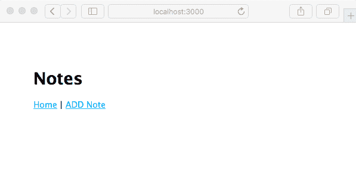
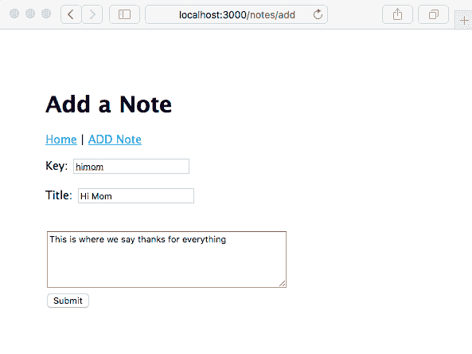
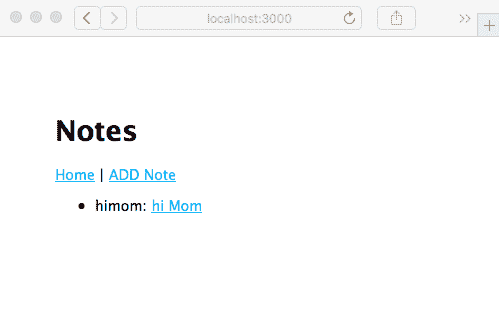
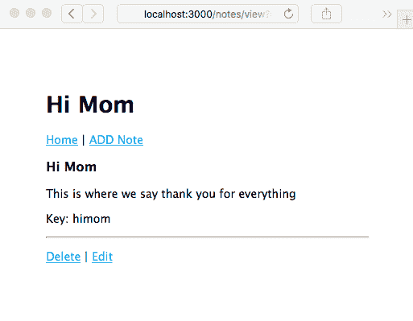
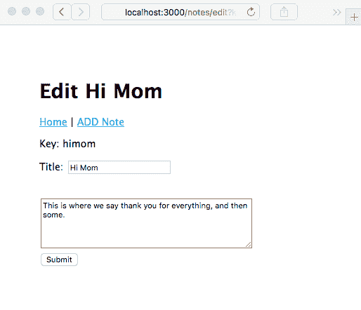
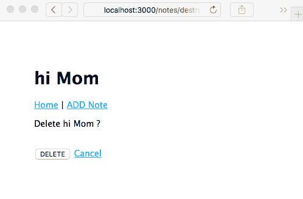
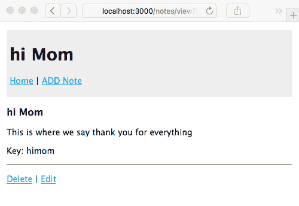
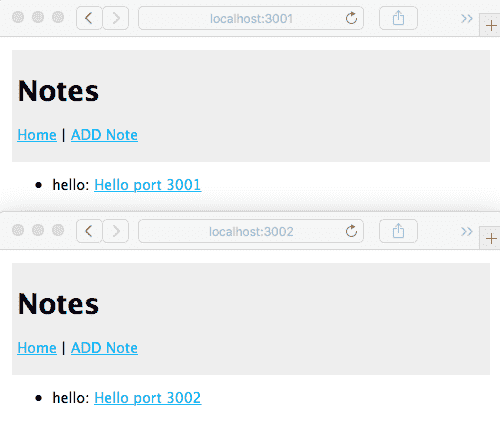

# 第五章：您的第一个 Express 应用程序

现在我们已经尝试构建了 Node.js 的 Express 应用程序，让我们来构建一个执行有用功能的应用程序。我们将构建的应用程序将保存笔记列表，并让我们探索真实应用程序的一些方面。

在本章中，我们只构建应用程序的基本基础设施，而在后面的章节中，我们将大大扩展应用程序。

本章涵盖的主题包括

+   在 Express 路由函数中使用承诺（Promises）和异步函数

+   将 MVC 范式应用于 Express 应用程序

+   构建 Express 应用程序

+   JavaScript 类定义

+   实现 CRUD 范式

+   Handlebars 模板

# 承诺（Promises）、异步函数和 Express 路由函数

在我们开始开发我们的应用程序之前，我们必须更深入地了解一对新的 ES-2015/2016/2017 特性，这些特性共同彻底改变了 JavaScript 编程：`Promise`类和`async`函数。两者都用于延迟和异步计算，可以使深层嵌套的回调成为过去式：

+   `Promise`表示一个尚未完成但预期将在未来完成的操作。我们已经看到了 Promise 的使用。当承诺的结果（或错误）可用时，会调用`.then`或`.catch`函数。

+   *生成器*函数是一种新的函数类型，它可以暂停和恢复，并可以从函数的中间返回结果。

+   这两个特性与另一个特性混合，即迭代协议，以及一些新的语法，以创建`async`函数。

`async`函数的魔力在于我们可以像编写同步代码一样编写异步代码。它仍然是异步代码，这意味着长时间运行的请求处理器不会阻塞事件循环。代码看起来就像我们在其他语言中编写的同步代码。一条语句跟在另一条语句后面，错误以异常的形式抛出，结果落在下一行代码上。承诺（Promise）和`async`函数的改进如此之大，以至于 Node.js 社区切换范式（即重写面向回调的遗留 API）极具吸引力。

在过去的几年里，已经使用了几种其他方法来管理异步代码，你可能会遇到使用这些其他技术的代码。在`Promise`对象标准化之前，至少有两种实现可用：Bluebird ([`bluebirdjs.com/`](http://bluebirdjs.com/)) 和 Q ([`www.npmjs.com/package/q`](https://www.npmjs.com/package/q))。使用非标准的 Promise 库应谨慎考虑，因为与标准 Promise 对象保持兼容性是有价值的。

**死亡金字塔**这个名字来源于代码在几层嵌套后的形状。任何多阶段过程都可以迅速升级到 15 层深的嵌套代码。考虑以下示例：

```js
router.get('/path/to/something', (req, res, next) => { 
  doSomething(arg1, arg2, (err, data1) => { 
    if (err) return next(err); 
    doAnotherThing(arg3, arg2, data1, (err2, data2) => { 
      if (err2) return next(err2); 
      somethingCompletelyDifferent(arg1, arg42, (err3, data3) => { 
        if (err3) return next(err3); 
        doSomethingElse((err4, data4) => { 
          if (err4) return next(err4); 
          res.render('page', { data }); 
        }); 
      }); 
    }); 
  }); 
});
```

将其重写为`async`函数将使这更加清晰。要做到这一点，我们需要检查以下想法：

+   使用 Promise 管理异步结果

+   生成器函数和 Promise

+   `async`函数

我们是这样生成一个 Promise 的：

```js
exports.asyncFunction = function(arg1, arg2) { 
  return new Promise((resolve, reject) => { 
    // perform some task or computation that's asynchronous 
    // for any error detected: 
    if (errorDetected) return reject(dataAboutError); 
    // When the task is finished 
    resolve(theResult); 
  }); 
}; 
```

注意，`asyncFunction`是一个异步函数，但它不接收回调。相反，它返回一个`Promise`对象，异步代码在传递给`Promise`类的回调中执行。

您的代码必须通过`resolve`和`reject`函数来指示异步操作的状态。正如函数名所暗示的，`reject`表示发生了错误，而`resolve`表示成功的结果。您的调用者随后可以使用该函数如下：

```js
asyncFunction(arg1, arg2) 
.then((result) => { 
   // the operation succeeded 
   // do something with the result
   return newResult;
}) 
.catch(err => { 
   // an error occurred 
}); 
```

系统足够灵活，传递给`.then`的函数可以返回某些内容，例如另一个 Promise，并且您可以一起链式调用`.then`。在`.then`处理程序中返回的值（如果有）将成为一个新的 Promise 对象，通过这种方式，您可以构建一个`.then`和`.catch`调用的链，以管理一系列异步操作。

一系列异步操作将被实现为`.then`函数的链，正如我们将在下一节中看到的。

# Promise 和错误处理

Promise 对象可以处于三种状态之一：

+   **Pending**：这是初始状态，既未满足也未拒绝

+   **Fulfilled**：这是执行成功时的最终状态

    产生了一个结果

+   **Rejected**：这是执行失败时的最终状态

考虑这段代码片段类似于我们在本章后面将要使用的代码：

```js
notes.read(req.query.key) 
.then(note => { return filterNote(note); }) 
.then(note => { return swedishChefSpeak(note); }) 
.then(note => { 
    res.render('noteview', { 
        title: note ? note.title : "", 
        notekey: req.query.key, 
        note: note 
    }); 
}) 
.catch(err => { next(err); }); 
```

在这段小代码中，有几个地方可能会发生错误。`notes.read`函数有几个可能的失败模式：`filterNote`函数可能会在检测到跨站脚本攻击时发出警报。瑞典厨师可能会罢工。`res.render`或使用的模板可能会失败。但我们只有一种方法来捕获和报告错误。我们遗漏了什么吗？

`Promise`类会自动捕获错误，将它们发送到与`Promise`关联的操作链中。如果`Promise`类本身有错误，它会跳过`.then`函数，并调用它找到的第一个`.catch`函数。换句话说，使用 Promise 的实例提供了更高的确保捕获和报告错误的可能性。在旧的传统中，错误报告更复杂，很容易忘记添加正确的错误处理。

# 平滑我们的异步代码

我们要解决的问题是在 JavaScript 中异步编码会导致“死亡金字塔”。为了解释，让我们重述 Ryan Dahl 给出的作为 Node.js 主要语法的例子：

```js
db.query('SELECT ..etc..', function(err, resultSet) { 
   if (err) { 
      // Instead, errors arrive here 
   } else { 
      // Instead, results arrive here 
    } 
}); 
// We WANT the errors or results to arrive here 
```

目标是避免使用长时间操作阻塞事件循环。使用回调函数延迟处理结果或错误是一个出色的解决方案，并且是 Node.js 的基础习语。回调函数的实现导致了这种金字塔形问题。也就是说，结果和错误落在回调中。而不是将它们传递到下一行代码，错误和结果被埋藏。

Promise 帮助简化代码，使其不再呈现金字塔形状。它们还捕获错误，确保将结果传递到有用的位置。但那些错误和结果仍然隐藏在匿名函数内部，并没有传递到下一行代码。

此外，使用 Promise 会导致一些样板代码，这会掩盖程序员的意图。它比常规回调函数的样板代码少，但样板代码仍然存在。

幸运的是，ECMAScript 委员会一直在努力解决这个问题。

# Promise 和生成器催生了异步函数

生成器和相关的迭代协议是一个大主题，我们将简要介绍。

迭代协议是新的 `for..of` 循环和其他一些新循环结构背后的原理。这些结构可以与任何产生迭代器的对象一起使用。有关更多信息，请参阅 [`developer.mozilla.org/en-US/docs/Web/JavaScript/Reference/Iteration_protocols`](https://developer.mozilla.org/en-US/docs/Web/JavaScript/Reference/Iteration_protocols).

生成器是一种可以使用 `yield` 关键字停止和启动的函数。生成器产生一个迭代器，其值是传递给 `yield` 语句的任何内容。有关更多信息，请参阅 [`developer.mozilla.org/en-US/docs/Web/JavaScript/Reference/Global_Objects/Generator`](https://developer.mozilla.org/en-US/docs/Web/JavaScript/Reference/Global_Objects/Generator).

考虑这个：

```js
$ cat gen.js
function* gen() {
    yield 1;
    yield 2;
    yield 3;
    yield 4;
}
for (let g of gen()) {
   console.log(g); }
$ node gen.js
1
2
3
4

```

`yield` 语句使生成器函数暂停，并在其 `next` 函数的下一个调用上提供值。`next` 函数在这里没有明确显示，但它控制循环，是迭代协议的一部分。而不是循环，尝试多次调用 `gen().next()`：

```js
var geniter = gen();
console.log(geniter.next());
console.log(geniter.next());
console.log(geniter.next());
```

你会看到这个：

```js
$ node gen.js
{ value: 1, done: false }
{ value: 2, done: false }
{ value: 3, done: false }
```

迭代协议指出，当 `done` 为 `true` 时，迭代器完成。在这种情况下，我们没有调用它足够多次以触发迭代器的结束状态。

生成器变得有趣的地方在于与返回 Promise 的函数一起使用。Promise 是通过迭代器提供的。消耗迭代器的代码可以等待 Promise 获取其值。一系列异步操作可以放在生成器中，并以可迭代的方式调用。

通过一个额外的函数，一个生成器函数以及返回 Promise 的异步函数可以是一种编写异步代码的好方法。我们在第二章，“设置 Node.js”，探索 Babel 时看到了这个例子。Babel 有一个插件可以将 `async` 函数重写为生成器以及一个辅助函数，我们查看了解译后的代码和辅助函数。`co` 库（[`www.npmjs.com/package/co`](https://www.npmjs.com/package/co)）是实现生成器异步编码的流行辅助函数。创建一个名为 `2files.js` 的文件：

```js
const fs = require('fs-extra');
const co = require('co');
const util = require('util');
co(function* () {
  var texts = [
    yield fs.readFile('hello.txt', 'utf8'),
    yield fs.readFile('goodbye.txt', 'utf8')
  ];
  console.log(util.inspect(texts));
});
```

然后按照以下方式运行它：

```js
$ node 2files.js
[ 'Hello, world!\n', 'Goodbye, world!\n' ]
```

通常，`fs.readFile` 将其结果发送到回调函数，我们会构建一个金字塔形状的小段代码来完成这个任务。`fs-extra` 模块包含了内置 `fs` 模块中所有函数的实现，但改为返回 Promise 而不是回调函数。因此，这里显示的每个 `fs.readFile` 都返回一个在文件内容完全读入内存时解决的 Promise。`co` 所做的是管理等待 Promise 解决（或拒绝）的舞蹈，并返回 Promise 的值。因此，使用两个合适的文本文件，我们得到了执行 `2files.js` 的结果。

重要的是代码非常清晰和易于阅读。我们不会陷入管理异步操作所需的样板代码。程序员的意图非常明确。

`async` 函数结合了生成器和 Promise，并在 JavaScript 语言中定义了一种标准化的语法。创建一个名为 `2files-async.js` 的文件：

```js
const fs    = require('fs-extra');
const util  = require('util');
async function twofiles() {
    var texts = [
        await fs.readFile('hello.txt', 'utf8'),
        await fs.readFile('goodbye.txt', 'utf8')
    ];
    console.log(util.inspect(texts));
}
twofiles().catch(err => { console.error(err); });

```

然后按照以下方式运行它：

```js
$ node 2files-async.js 
[ 'Hello, world!\n', 'Goodbye, world!\n' ]
```

清晰。易于阅读。程序员的意图非常明确。无需依赖任何附加库，语法内置在 JavaScript 语言中。最重要的是，所有操作都以自然的方式处理。错误通过抛出异常自然地指示。异步操作的结果自然地作为操作的结果出现，`await` 关键字有助于结果的传递。

为了看到真正的优势，让我们回到之前提到的“灾难金字塔”示例：

```js
router.get('/path/to/something', async (req, res, next) => { 
   try {
       let data1 = await doSomething(req.query.arg1, req.query.arg2);
       let data2 = await doAnotherThing(req.query.arg3, req.query.arg2, 
       data1);
       let data3 = await somethingCompletelyDifferent(req.query.arg1,
                                                      req.query.arg42);
       let data4 = await doSomethingElse();
       res.render('page', { data1, data2, data3, data4 }); 
   } catch(err) {
       next(err);
   }
}); 
```

除了 `try/catch` 之外，与作为回调金字塔的形式相比，这个例子变得非常简洁。所有异步回调的样板代码都被删除了，程序员的意图清晰可见。

为什么需要 `try/catch`？通常，`async` 函数会捕获抛出的错误，并自动正确地报告它们。但因为这个例子是在 Express 路由函数中，所以我们受限于其功能。Express 无法识别 `async` 函数，因此它不知道要寻找抛出的错误。相反，我们必须 `catch` 它们并调用 `next(err)`。

此改进仅适用于在 `async` 函数内部执行的代码。`async` 函数外部的代码仍然需要回调或 Promises 来进行异步编程。此外，`async` 函数的返回值是一个 Promise。

有关 `async` 函数的详细信息，请参阅官方规范 [`tc39.github.io/ecmascript-asyncawait/`](https://tc39.github.io/ecmascript-asyncawait/)。

# Express 和 MVC 范式

Express 不强制要求您如何构建应用程序的模型、视图和控制器模块，或者是否应该遵循任何类型的 MVC 范式。正如我们在上一章中学到的，Express 生成器创建的空白应用程序提供了 MVC 模型的两个方面：

+   `views` 目录包含模板文件，控制显示部分，对应于视图。

+   `routes` 目录包含实现应用程序识别的 URL 的代码，并协调对每个 URL 的响应。这对应于控制器。

这让你想知道模型对应的代码应该放在哪里。模型持有应用程序数据，根据控制器的指令进行更改，并为视图代码提供所需的数据。至少，模型代码应该与控制器代码分开在不同的模块中。这是为了确保职责的清晰分离，例如，便于对每个模块进行单元测试。

我们将采用的方法是在 `views` 和 `routes` 目录的兄弟目录中创建一个 `models` 目录。`models` 目录将包含存储笔记和相关数据的模块。`models` 目录中模块的 API 将提供创建、读取、更新或删除数据项的函数 **C****reate**、**R****ead**、**U****pdate** 和 **D****elete** 或 **D****estroy**（**CRUD** 模型）以及其他视图代码执行其功能所需的函数。

CRUD 模型（创建、读取、更新、删除）是持久数据存储的四个基本操作。`Notes` 应用程序被构建为一个 CRUD 应用程序，以展示实现这些操作。

我们将使用名为 `create`、`read`、`update` 和 `destroy` 的函数来实现每个基本操作。

我们使用动词 `destroy` 而不是 `delete`，因为 `delete` 是 JavaScript 中的一个保留字。

# 创建笔记应用程序

让我们像以前一样开始创建 *Notes* 应用程序，使用 Express 生成器为我们提供一个起点：

```js
$ mkdir notes
$ cd notes
$ npm install express-generator@4.x
$ ./node_modules/.bin/express --view=hbs --git .
destination is not empty, continue? [y/N] y

 create : .
 create : ./package.json
 create : ./app.js
 create : ./.gitignore
 create : ./public
 create : ./routes
 create : ./routes/index.js
 create : ./routes/users.js
 create : ./views
 create : ./views/index.hbs
 create : ./views/layout.hbs
 create : ./views/error.hbs
 create : ./bin
 create : ./bin/www
 create : ./public/stylesheets
 create : ./public/stylesheets/style.css

 install dependencies:
 $ cd . && npm install

 run the app:
 $ DEBUG=notes:* npm start

 create : ./public/javascripts
 create : ./public/images
$ npm install
added 82 packages and removed 5 packages in 97.188s
$ npm uninstall express-generator
up to date in 8.325s
```

如果您愿意，可以运行 `npm start` 并在浏览器中查看空白应用程序。相反，让我们继续设置代码。

# 您的第一个笔记模型

创建一个名为 `models` 的目录，作为 `views` 和 `routes` 目录的兄弟目录。

然后，在那个目录中创建一个名为 `Note.js` 的文件，并将此代码放入其中：

```js
const _note_key = Symbol('key');
const _note_title = Symbol('title');
const _note_body = Symbol('body');

module.exports = class Note { 
    constructor(key, title, body) { 
        this[_note_key] = key; 
        this[_note_title] = title; 
        this[_note_body] = body; 
    } 

    get key() { return this[_note_key]; }
    get title() { return this[_note_title]; }
    set title(newTitle) { this[_note_title] = newTitle; }
    get body() { return this[_note_body]; }
    set body(newBody) { this[_note_body] = newBody; }
};
```

这定义了一个新的类，`Note`，用于在我们的 `Notes` 应用程序中使用。目的是存储与应用程序用户之间交换的笔记相关数据。

# 理解 ES-2015 类定义

这种对象类定义在 ES-2015 中是新的，它简化了类定义的过程，使得 JavaScript 中的类定义更接近其他语言的语法。在底层，JavaScript 类仍然使用基于原型的继承，但语法更简单，程序员甚至不需要考虑对象原型。

我们可以使用`instanceof`运算符来可靠地确定一个对象是否是笔记：

```js
$ node
> const Note = require('./Note');
> typeof Note
'function'
> const aNote = new Note('foo', 'The Rain In Spain', 'Falls mainly on the plain');
> var notNote = {}
> notNote instanceof Note
false
> aNote instanceof Note
true
> typeof aNote
'object'
```

这表明使用`instanceof`运算符是识别对象的明显方法。`typeof`运算符告诉我们`Note`是一个函数（因为背后是基于原型的继承），以及`Note`类的实例是一个对象。使用`instanceof`，我们可以轻松地确定一个对象是否是给定类的实例。

在`Note`类中，我们使用了`Symbol`实例来提供一定程度的数据隐藏。JavaScript 类不提供数据隐藏机制——例如，你不能像 Java 中那样将字段标记为`private`。了解如何隐藏实现细节是有用的。这是面向对象编程的一个重要属性，因为拥有随意更改实现的能力是有用的。还有控制哪些代码可以操作对象字段的问题。

首先，我们声明了 getter 和 setter 函数来提供对值的访问。我们在第四章中介绍了正常的 getter/setter 用法，*HTTP 服务器和客户端*。

通过使用属性的名称来访问基于 getter 的字段，而不是调用一个函数 - `aNote.title`而不是`aNote.title()`。这看起来像是通过赋值或访问值来访问对象属性。实际上，在每次访问时都会执行在类中定义的函数。您可以通过只实现 getter 而没有 setter 来定义只读属性，就像我们对`key`字段所做的那样。

在前面的定义和简单地定义匿名对象之间存在显著差异：

```js
{
   key: 'foo', title: 'The Rain in Spain',
   body: 'Falls mainly on the plain'
}
```

我们在 JavaScript 中经常编写这样的代码。它简单、快捷，是一种非常流畅的函数间数据共享方式。但是，没有隐藏实现细节的措施，也没有明确的对象类型标识。

在`Note`类中，我们可以使用这个`constructor`方法：

```js
class Note {
  constructor(key, title, body) {
     this.key = key;
     this.title = title;
     this.body = body;
 }
}
```

这实际上与匿名对象相同，因为没有隐藏任何细节，也没有在代码层面实现控制，即没有明确指定哪些代码可以对对象实例做什么。匿名对象唯一的优势是使用`instanceof`运算符来识别对象实例。

我们选择的方法使用了也是随着 ES-2015 引入的 Symbol 类。Symbol 是一个不透明的对象，有两个主要用途：

+   生成唯一的键作为属性字段，就像之前的`Note`类中那样

+   作为像 COLOR_RED 这样的概念的符号标识符

您可以通过一个生成`Symbol`实例的工厂方法来定义一个 Symbol：

```js
> let symfoo = Symbol('foo')
```

每次调用符号工厂方法时，都会创建一个新的唯一实例。例如，`Symbol('foo') === Symbol('foo')` 是 `false`，同样 `symfoo === Symbol('foo')` 也是 `false`，因为等号两边的每个实例都是新创建的。然而，`symfoo === symfoo` 是 `true`，因为它们是同一个实例。

实际上这意味着，如果我们尝试直接访问一个字段，将会失败：

```js
> aNote[Symbol('title')]
undefined
```

记住，每次我们使用符号工厂方法时，我们都会得到一个新的实例。`Symbol('title')` 的新实例与 `Note.js` 模块内部使用的实例不是同一个实例。

重要的是，使用 `Symbol` 对象为字段提供了一定程度的功能隐藏。

# 填充内存笔记模型

在 `models` 目录中创建一个名为 `notes-memory.js` 的文件，包含以下代码：

```js
const Note = require('./Note');

var notes = [];

exports.update = exports.create = async function(key, title, body) {
    notes[key] = new Note(key, title, body);
    return notes[key];
};

exports.read = async function(key) {
    if (notes[key]) return notes[key];
    else throw new Error(`Note ${key} does not exist`);
};

exports.destroy = async function(key) {
    if (notes[key]) {
        delete notes[key];
    } else throw new Error(`Note ${key} does not exist`);
};

exports.keylist = async function() { return Object.keys(notes); };
exports.count = async function() { return notes.length; };
exports.close = async function() { }
```

这是一个相当直观的简单内存数据存储。每个笔记实例的 `key` 被用作数组的索引，该数组反过来又包含笔记实例。简单、快速且易于实现。它不支持任何长期数据持久性。存储在这个模型中的任何数据，当服务器被关闭时都会消失。

我们使用了 `async` 函数，因为将来我们将在文件系统或数据库中存储数据。因此，我们需要一个异步 API。

`create` 和 `update` 函数由同一个函数处理。在笔记应用的这个阶段，这两个函数的代码可以完全相同，因为它们执行的是完全相同的操作。稍后，当我们为笔记添加数据库支持时，`create` 和 `update` 函数将需要不同。例如，在 SQL 数据模型中，`create` 将通过 `INSERT INTO` 命令实现，而 `update` 将通过 `UPDATE` 命令实现。

# 笔记主页

我们将修改启动应用程序以支持创建、编辑、更新、查看和删除笔记。让我们先修复主页。它应该显示笔记列表，并且顶部的导航栏应该链接到一个“添加笔记”页面，这样我们就可以始终添加新的笔记。

虽然我们将修改生成的 `app.js`，但为了支持主页，它不需要任何修改。这些代码行与主页相关：

```js
const index = require('./routes/index'); 
.. 
app.use('/', index); 
```

此外，为了支持 Handlebars 模板，`app.js` 需要以下更改：

```js
const hbs = require('hbs');
...
app.set('view engine', 'hbs');
hbs.registerPartials(path.join(__dirname, 'partials'));

```

我们将把 Handlebars 的 `partials` 放在一个名为 `partials` 的目录中，该目录是 `views` 目录的兄弟目录。将 `routes/index.js` 修改为以下内容：

```js
const express = require('express');
const router = express.Router();
const notes = require('../models/notes-memory');

/* GET home page. */
router.get('/', async (req, res, next) => {
  let keylist = await notes.keylist();
  let keyPromises = keylist.map(key => {
    return notes.read(key)
  });
  let notelist = await Promise.all(keyPromises);
  res.render('index', { title: 'Notes', notelist: notelist });
});

module.exports = router;
```

这收集了将在主页上显示的笔记的相关数据。默认情况下，我们将显示一个简单的笔记标题表格。我们确实需要讨论一下这项技术。

`Promise.all` 函数执行一个 Promise 数组。Promise 是并行评估的，允许我们的代码可能对服务进行并行请求。这应该比逐个顺序请求执行得更快。

我们可以编写一个简单的 `for` 循环，如下所示：

```js
let keylist = await notes.keylist();
let notelist = [];
for (key of keylist) {
    let note = await notes.read(keylist);
    notelist.push({ key: note.key, title: note.title });
}
```

虽然阅读起来更简单，但笔记是一次性检索的，没有机会重叠`read`操作。

Promise 数组是用`map`函数构建的。使用`map`，我们可以遍历一个数组以生成一个新的数组。在这种情况下，新数组包含由`notes.read`函数调用生成的 Promise。

因为我们在代码中写了`await Promise.all`，所以一旦所有 Promise 都成功，`notelist`数组将完全填充正确的数据。如果任何 Promise 失败——换句话说，被拒绝——将抛出异常。我们所做的是排一个异步操作列表，并优雅地等待它们全部完成。

然后，`notelist`数组被传递到我们即将编写的`view`模板中。

从`views/layout.hbs`开始，包含以下内容：

```js
<!DOCTYPE html>
<html>
 <head>
 <title>{{title}}</title>
 <link rel='stylesheet' href='/stylesheets/style.css' />
 </head>
  <body>
  {{> header }}
  {{{body}}}
  </body>
</html>
```

这是生成的文件，增加了页面标题的部分。我们已经在`partials`目录中声明了`partials`。创建`partials/header.hbs`，包含以下内容：

```js
<header>
 <h1>{{ title }}</h1>
  <div class='navbar'>
  <p><a href='/'>Home</a> | <a href='/notes/add'>ADD Note</a></p>
  </div>
</header>
```

将`views/index.hbs`更改为以下内容：

```js
{{#each notelist}}
<ul>
  <li>{{ key }}:
  <a href="/notes/view?key={{ key }}">{{ title }}</a>
  </li>
</ul>
{{/each}}
```

这只是遍历笔记数据数组并格式化一个简单的列表。每个条目都链接到带有`key`参数的`/notes/view` URL。我们还没有查看那段代码，但这个 URL 显然会显示笔记。另一个值得注意的是，如果`notelist`为空，则不会生成列表的 HTML。

当然，还有更多可以添加到这个里面。例如，只需在这里添加适当的`script`标签，就可以很容易地为每个页面添加 jQuery 支持。

我们现在已经写足够的内容来运行应用程序；让我们查看主页：

```js
$ DEBUG=notes:* npm start

> notes@0.0.0 start /Users/David/chap05/notes
> node ./bin/www

 notes:server Listening on port 3000 +0ms
GET / 200 87.300 ms - 308
GET /stylesheets/style.css 200 27.744 ms - 111
```

如果我们访问`http://localhost:3000`，我们将看到以下页面：



因为还没有任何笔记，所以没有东西可以显示。点击主页链接只是刷新页面。点击添加笔记链接会抛出错误，因为我们还没有（目前）实现那段代码。这表明`app.js`中提供的错误处理器正在按预期执行。

# 添加一个新笔记 – 创建

现在，让我们看看如何创建笔记。因为应用程序没有为`/notes/add` URL 配置路由，我们必须添加一个。为此，我们需要一个笔记控制器。

在`app.js`中，进行以下更改。

注释掉这些行：

```js
// var users = require('./routes/users'); 
.. 
// app.use('/users', users); 
```

在这个阶段，`笔记`应用不支持用户，这些路由也不需要。这将在未来的章节中改变。

我们真正需要做的是添加`notes`控制器的代码：

```js
// const users = require('./routes/users'); 
const notes  = require('./routes/notes'); 
.. 
// app.use('/users', users); 
app.use('/notes', notes); 
```

现在，我们将添加一个包含`notes`路由器的控制器模块。创建一个名为`routes/notes.js`的文件，包含以下内容：

```js
const util = require('util'); 
const express = require('express'); 
const router = express.Router(); 
const notes = require('../models/notes-memory'); 

// Add Note. 
router.get('/add', (req, res, next) => { 
    res.render('noteedit', { 
        title: "Add a Note", 
        docreate: true, 
        notekey: "", note: undefined 
    }); 
}); 

module.exports = router; 
```

结果的`/notes/add` URL 对应于`partials/header.hbs`中的链接。

在`views`目录中，添加一个名为`noteedit.hbs`的模板，包含以下内容：

```js
<form method='POST' action='/notes/save'> 
<input type='hidden' name='docreate' value='<%= 
                  docreate ? "create" : "update"%>'> 
<p>Key: 
{{#if docreate }}
    <input type='text' name='notekey' value=''/> 
{{else}} 
    {{#if note }}{{notekey}}{{/if}} 
    <input type='hidden' name='notekey'
         value='{{#if note }}{{notekey}}{{/if}}'/> 
{{/if}} 
</p> 
<p>Title: <input type='text' name='title' 
        value='{{#if note }}{{note.title}}{{/if}}' /></p> 
<br/><textarea rows=5 cols=40 name='body' >
    {{#if note }}{{note.body}}{{/if}} 
    </textarea> 
<br/><input type='submit' value='Submit' /> 
</form>
```

我们将重用这个模板来支持编辑笔记和创建新笔记。

注意，在这种情况下传递给模板的`note`和`notekey`对象是空的。模板检测到这种条件并确保输入区域为空。此外，还传递了一个名为`docreate`的标志，以便表单记录它是否用于创建或更新笔记。目前，我们正在添加一个新的笔记，因此不存在笔记对象。模板代码正在被编写为防御性，以避免抛出错误。

这个模板是一个将数据`POST`到`/notes/save` URL 的表单。如果你现在运行应用程序，它将显示错误消息，因为没有为该 URL 配置任何路由。

要支持`/notes/save` URL，请将以下内容添加到`routes/notes.js`：

```js

// Save Note (update)
router.post('/save', async (req, res, next) => {
    var note;
    if (req.body.docreate === "create") {
        note = await notes.create(req.body.notekey,
                req.body.title, req.body.body);
    } else {
        note = await notes.update(req.body.notekey,
                req.body.title, req.body.body);
    }
    res.redirect('/notes/view?key='+ req.body.notekey);
});
```

因为这个 URL 也将用于创建和更新笔记，所以它需要检测`docreate`标志并调用适当的模型操作。

模型为`notes.create`和`notes.update`都返回一个 Promise。当然，我们必须根据`docreate`标志调用相应的模型函数。

这是一个`POST`操作处理程序。由于`bodyParser`中间件，表单数据被添加到`req.body`对象中。附加到`req.body`的字段直接对应于 HTML 表单中的元素。

现在，我们可以再次运行应用程序并使用添加笔记表单：



但在点击提交按钮后，我们得到了一个错误消息。目前还没有实现`/notes/view` URL。

您可以修改位置框中的 URL 以重新访问`http://localhost:3000`，您将在主页上看到如下截图：



笔记实际上就在那里；我们只需要实现`/notes/view`。让我们继续。

# 查看笔记 – 阅读

现在我们已经了解了如何创建笔记，我们需要继续阅读它们。这意味着实现`/notes/view` URL 的控制器逻辑和视图模板。

将以下路由函数添加到`routes/notes.js`：

```js
// Read Note (read)
router.get('/view', async (req, res, next) => {
    var note = await notes.read(req.query.key);
    res.render('noteview', {
        title: note ? note.title : "",
        notekey: req.query.key, note: note
    });
});
```

因为这个路由挂载在处理`/notes`的路由器上，所以这个路由处理`/notes/view`。

如果`notes.read`成功读取笔记，它将使用`noteview`模板进行渲染。如果出现问题，我们将通过 Express 向用户显示错误。

将`noteview.hbs`模板添加到`views`目录中，如下代码所示：

```js
{{#if note}}<h3>{{ note.title }}</h3>{{/if}}
{{#if note}}<p>{{ note.body }}</p>{{/if}}
<p>Key: {{ notekey }}</p>
{{#if notekey }}
    <hr/>
    <p><a href="/notes/destroy?key={{notekey}}">Delete</a>
     | <a href="/notes/edit?key={{notekey}}">Edit</a></p>
{{/if}}
```

这很简单：从笔记对象中提取数据并使用 HTML 显示。底部有两个链接，一个链接到`/notes/destroy`以删除笔记，另一个链接到`/notes/edit`以编辑它。

目前这两个代码都不存在。但这不会阻止我们继续执行应用程序：



如预期的那样，使用这段代码，应用程序正确地重定向到`/notes/view`，我们可以看到我们的成果。同样，如预期的那样，点击删除或编辑链接将给出错误，因为代码尚未实现。

# 编辑现有笔记 – 更新

现在我们已经看了 `create` 和 `read` 操作，让我们看看如何更新或编辑一个笔记。

在 `routes/notes.js` 中添加此路由函数：

```js
// Edit note (update)
router.get('/edit', async (req, res, next) => {
    var note = await notes.read(req.query.key);
    res.render('noteedit', {
        title: note ? ("Edit " + note.title) : "Add a Note",
        docreate: false,
        notekey: req.query.key, note: note
    });
});
```

我们正在重用 `noteedit.ejs` 模板，因为它可以用于 `create` 和 `update`/`edit` 操作。注意，我们为 `docreate` 传递 `false`，通知模板它将被用于编辑。

在这种情况下，我们首先检索笔记对象，然后将其传递给模板。这样，模板就为编辑而不是笔记创建设置了。当用户点击提交按钮时，我们将最终进入前面截图所示的相同 `/notes/save` 路由处理器。它已经做了正确的事情：在模型中调用 `notes.update` 方法而不是 `notes.create`。

因为那是我们需要做的全部，我们可以继续重新运行应用程序：



在这里点击提交按钮，你将被重定向到 `/notes/view` 屏幕，然后可以阅读新编辑的笔记。回到 `/notes/view` 屏幕：我们刚刚处理了编辑链接，但删除链接仍然产生错误。

# 删除笔记 – 销毁

现在，让我们看看如何实现 `/notes/destroy` URL 来删除笔记。

在 `routes/notes.js` 中添加以下路由函数：

```js
// Ask to Delete note (destroy)
router.get('/destroy', async (req, res, next) => {
    var note = await notes.read(req.query.key);
    res.render('notedestroy', {
        title: note ? note.title : "",
        notekey: req.query.key, note: note
    });
});
```

删除笔记是一个重要的步骤，仅仅是因为如果我们出错，没有回收站可以从中恢复。因此，我们想要询问用户他们是否确定要删除那个笔记。在这种情况下，我们检索笔记，然后渲染以下页面，显示一个问题以确保他们确实想要删除笔记。

在 `views` 目录下，添加一个 `notedestroy.hbs` 模板：

```js
<form method='POST' action='/notes/destroy/confirm'>
<input type='hidden' name='notekey' value='{{#if note}}{{notekey}}{{/if}}'>
<p>Delete {{note.title}}?</p>
<br/><input type='submit' value='DELETE' /> 
<a href="/notes/view?key={{#if note}}{{notekey}}{{/if}}">Cancel</a>
</form>
```

这是一个简单的表单，要求用户通过点击按钮来确认。取消链接只是将他们送回到 `/notes/view` 页面。点击提交按钮会在 `/notes/destroy/confirm` URL 上生成一个 `POST` 请求。

那个 URL 需要一个请求处理器。将以下代码添加到 `routes/notes.js`：

```js
// Really destroy note (destroy)
router.post('/destroy/confirm', async (req, res, next) => {
    await notes.destroy(req.body.notekey);
    res.redirect('/');
});
```

这调用模型中的 `notes.destroy` 函数。如果成功，浏览器将被重定向到主页。如果不成功，将向用户显示错误消息。重新运行应用程序，我们现在可以查看其效果：



现在应用程序中的所有功能都正常工作，你可以点击任何按钮或链接，保留你想要的全部笔记。

# 主题化 Express 应用程序

Express 团队已经做了相当不错的工作，确保 Express 应用程序一开始看起来就很好。我们的笔记应用不会赢得任何设计奖项，但至少它不丑陋。现在基本应用已经运行，我们可以从许多方面来改进它。让我们快速看一下如何为主题化 Express 应用程序。在第六章 *实现移动优先范式* 中，我们将更深入地探讨，重点关注那个至关重要的目标——满足移动市场的需求。

如果你使用推荐的方法 `npm start` 运行 *Notes* 应用程序，你会在控制台窗口中看到一些活动日志。其中之一如下：

```js
GET /stylesheets/style.css 304 0.702 ms - - 
```

这是因为我们在 `layout.hbs` 中添加的这一行代码：

```js
<link rel='stylesheet' href='/stylesheets/style.css' /> 
```

这个文件最初是由 Express Generator 自动生成的，并放置在 `public` 目录中。`public` 目录由 Express 静态文件服务器管理，使用 `app.js` 中的这一行：

```js
app.use(express.static(path.join(__dirname, 'public'))); 
```

让我们打开 `public/stylesheets/style.css` 并查看一下：

```js
body { 
  padding: 50px; 
  font: 14px "Lucida Grande", Helvetica, Arial, sans-serif; 
} 

a { 
  color: #00B7FF; 
} 
```

一个突出的问题是应用程序内容在屏幕的顶部和左侧有大量的空白空间。原因是 `body` 标签有 `padding: 50px` 样式。更改它非常简单。

由于 Express 静态文件服务器中没有缓存，我们可以简单地编辑 CSS 文件并重新加载页面，CSS 也会被重新加载。你可以像为生产网站那样开启缓存控制头和 ETags 生成。有关详细信息，请查看在线 Express 文档。

这需要一点工作：

```js
body { 
  padding: 5px; 
  .. 
} 
.. 
header { 
    background: #eeeeee; 
    padding: 5px; 
} 
```

因此，我们将得到以下内容：



我们使用这种方法也不会赢得任何设计奖项，但这是品牌和主题化可能性的开始。

一般而言，我们构建页面模板的方式，应用全局主题只需在 `layout.hbs` 中添加适当的代码，以及相应的样式表和其他资源。许多现代主题框架，如 Twitter 的 Bootstrap，通过 CDN 服务器提供 CSS 和 JavaScript 文件，使得将其集成到网站设计中变得极其简单。

对于 jQuery，请参阅[`jquery.com/download/`](http://jquery.com/download/)。

Google 的托管库服务提供了一系列托管在 Google CDN 基础设施上的库。请参阅[`developers.google.com/speed/libraries/`](https://developers.google.com/speed/libraries/)。

虽然使用第三方 CDN 托管这些资源很简单，但自己托管它们更安全。这不仅意味着你负责应用程序的带宽消耗，而且可以确保不会受到第三方服务中断的影响。尽管 Google 可能很可靠，但他们的服务可能会中断，如果这意味着 jQuery 和 Bootstrap 无法加载，你的客户可能会认为你的网站出了问题。但如果这些文件是从与你的应用程序相同的服务器加载的，那么这些文件交付的可靠性将正好等于你应用程序的可靠性。

在第六章，*实现移动优先范式*中，我们将探讨一种简单的方法将那些前端库添加到你的应用程序中。

# 扩展规模 - 运行多个 Notes 实例

现在我们已经有一个运行中的应用程序，你可能已经玩了一段时间，并创建了、读取了、更新了和删除了许多笔记。

假设一下，这不是一个玩具应用，而是一个每天能吸引一百万用户的有趣应用。处理高负载通常意味着添加服务器、负载均衡器以及许多其他东西。核心部分是同时运行多个应用实例以分散负载。

让我们看看同时运行多个 Notes 应用实例会发生什么。

第一件事是确保实例在不同的端口上。在 `bin/www` 中，你会看到设置 `PORT` 环境变量控制着正在使用的端口。如果 `PORT` 变量未设置，它默认为 `http://localhost:3000`，或者我们一直在使用的那个。

让我们打开 `package.json` 并将这些行添加到 `scripts` 部分：

```js
"scripts": { 
    "start": "DEBUG=notes:* node ./bin/www", 
    "server1": "DEBUG=notes:* PORT=3001 node ./bin/www", 
    "server2": "DEBUG=notes:* PORT=3002 node ./bin/www" },
```

`server1` 脚本在 `PORT 3001` 上运行，而 `server2` 脚本在 `PORT 3002` 上运行。不是很好吗，所有这些都在一个地方有文档记录？

然后，在一个命令窗口中运行以下命令：

```js
$ npm run server1

> notes@0.0.0 server1 /Users/David/chap05/notes
> DEBUG=notes:* PORT=3001 node ./bin/www

 notes:server Listening on port 3001 +0ms
```

在另一个命令窗口中运行以下命令：

```js
$ npm run server2

> notes@0.0.0 server2 /Users/David/chap05/notes
> DEBUG=notes:* PORT=3002 node ./bin/www

 notes:server Listening on port 3002 +0ms
```

这给我们提供了 Notes 应用的两个实例。使用两个浏览器窗口访问 `http://localhost:3001` 和 `http://localhost:3002`。输入一些笔记，你可能会看到类似这样的内容：



在编辑并添加一些注释后，你的两个浏览器窗口可能看起来像前面的截图。这两个实例不共享相同的数据池。每个实例都在自己的进程和内存空间中运行。你在其中一个中添加注释，它不会显示在另一个屏幕上。

此外，因为模型代码没有在任何地方持久化数据，所以笔记不会被保存。你可能已经写下了有史以来最伟大的 Node.js 编程书籍，但一旦应用服务器重启，它就消失了。

通常，你运行多个应用实例以扩展性能。这就是“给服务器加把劲”的老方法。为了使其工作，数据当然必须共享，并且每个实例必须访问相同的数据源。通常，这涉及到数据库。当涉及到用户身份信息时，甚至可能需要武装警卫。

稍等——我们很快就会讨论数据库实现。在那之前，我们将介绍移动优先开发。

# 摘要

我们在本章中已经走了很长的路。

我们从“末日金字塔”开始，讨论 `Promise` 对象和 `async` 函数如何帮助我们驯服异步代码。我们将在整本书中使用这些技术。

我们迅速转向使用 Express 编写真实应用的框架。目前，它将数据保存在内存中，但它具有将成为支持实时协作注释的笔记应用的基本功能。

在下一章中，我们将浅尝辄止地涉足响应式、移动友好的网页设计领域。鉴于移动计算设备的日益普及，在考虑桌面电脑用户之前，首先解决移动设备的问题变得必要。为了触及每天数百万的用户，笔记应用的用户在使用智能手机时需要良好的用户体验。

在接下来的章节中，我们将继续扩展笔记应用的功能，从数据库存储模型开始。
