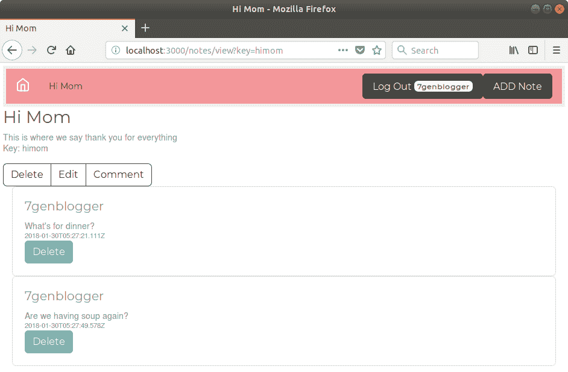
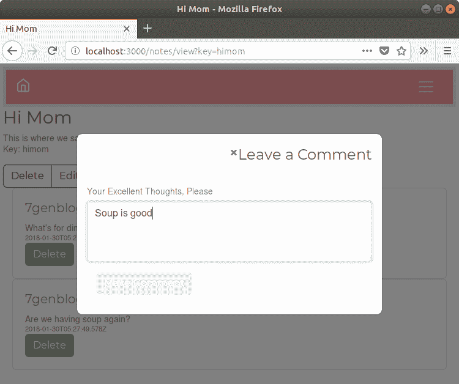

# 使用 Socket.IO 实现动态客户端/服务器交互

网络的原始设计模型类似于 20 世纪 70 年代大型机的工作方式。老式的哑终端，如 IBM 3270，和 Web 浏览器都遵循请求-响应范式。用户发送请求，远端计算机发送响应屏幕。虽然 Web 浏览器可以显示比老式的哑终端更复杂的信息，但在两种情况下，交互模式都是用户请求的来回，每次都导致服务器屏幕或，在 Web 浏览器的情况下，页面发送一屏或一页数据。

如果你想知道这个历史课是关于什么的，那么请求-响应范式在 Node.js HTTP 服务器 API 中是显而易见的，如下面的代码所示：

```js
http.createServer(function (request, response) {
   ... handle request
}).listen();
```

这种范式再明确不过了。`请求`和`响应`就在那里。

最初的 Web 浏览器是在基于文本的用户界面之上的一个进步，HTML 混合了图像、不同颜色、字体和尺寸的文本。随着 CSS 的出现，HTML 得到了改进，iframe 允许嵌入各种类型的媒体，JavaScript 也得到了改进，所以我们有了相当不同的范式。Web 浏览器仍然在发送请求并接收数据页面，但这些数据可以非常复杂，更重要的是，JavaScript 增加了交互性。

一种新技术是保持与服务器之间的开放连接，以便在服务器和客户端之间进行持续的数据交换。这种 Web 应用程序模型的变化被称为实时网络。在某些情况下，网站保持与 Web 浏览器的开放连接，实时更新网页是其中一个目标。

一些观察者认为，传统的 Web 应用程序可能会不真实地显示其数据；也就是说，如果两个人正在查看一个页面，而一个人编辑了该页面，那么那个人的浏览器将更新为页面的正确副本，而另一个浏览器则没有更新。两个浏览器显示页面的不同版本，其中一个是不真实的。如果第一个浏览器的人删除了该页面，第二个浏览器甚至可以显示一个不再存在的页面。有些人认为，如果其他人的浏览器在页面编辑后立即刷新以显示新内容会更好。

这就是实时网络的一个可能作用；页面在页面内容变化时自动更新。各种系统都支持同一网站上的用户之间的实时交互。无论是看到 Facebook 评论在撰写时弹出，还是协作编辑的文档，Web 上出现了一种新的交互范式。

我们即将在笔记应用程序中实现这种行为。

创造 Node.js 的一个原始目的是支持实时网络。**Comet** 应用程序架构（Comet 与 AJAX 有关，而且巧合的是，这两个名字也是家庭清洁产品的名称）涉及长时间保持 HTTP 连接打开，数据通过该通道在浏览器和服务器之间来回流动。术语 Comet 由 Alex Russell 在 2006 年的博客文章中引入（[`infrequently.org/2006/03/comet-low-latency-data-for-the-browser/`](http://infrequently.org/2006/03/comet-low-latency-data-for-the-browser/))，作为实现客户端和服务器之间这种实时双向数据交换的架构模式的通用术语。那篇博客文章呼吁开发一个与 Node.js 非常相似的编程平台。

为了简化任务，我们将依赖 `Socket.IO` 库 ([`socket.io/`](http://socket.io/))。这个库简化了浏览器和服务器之间的双向通信，并且可以支持各种协议，并为老旧的浏览器提供回退。

我们将涵盖以下主题：

+   现代网络浏览器中的实时通信

+   `Socket.IO` 库

+   将 `Socket.IO` 集成到 Express 应用程序以支持实时通信

+   实时通信的用户体验

# 介绍 Socket.IO

`Socket.IO` 的目标是使每个浏览器和移动设备都能实现实时应用*。*它支持多种传输协议，并为特定浏览器选择最佳协议。

如果你使用 WebSockets 实现你的应用程序，它将仅限于支持该协议的现代浏览器。因为 `Socket.IO` 落后于许多备用协议（WebSockets、Flash、XHR 和 JSONP），它支持广泛的网络浏览器，包括一些老旧的浏览器。

作为应用程序的作者，你不必担心 `Socket.IO` 在特定浏览器中使用的具体协议。相反，你可以实现业务逻辑，而库会为你处理细节。

`Socket.IO` 要求客户端库能够进入浏览器。这个库已经提供，并且易于实例化。你将在浏览器端和服务器端使用相似的 `Socket.IO` API 进行代码编写。

`Socket.IO` 提供的模型类似于 `EventEmitter` 对象。程序员使用 `.on` 方法来监听事件，使用 `.emit` 方法来发送它们。通过 `Socket.IO` 库，这些事件在浏览器和服务器之间发送，库负责来回传递。

关于 `Socket.IO` 的信息可在 [`socket.io/`](https://socket.io/) 找到。

# 使用 Express 初始化 Socket.IO

`Socket.IO` 通过将自己包装在 HTTP 服务器对象周围来工作。回想一下 第四章，*HTTP 服务器和客户端*，在那里我们编写了一个模块，该模块挂钩到 HTTP 服务器方法，以便我们可以监视 HTTP 事务。HTTP Sniffer 为每个 HTTP 事件附加一个监听器以打印出事件。但如果你用这个想法来做实际的工作呢？Socket.IO 使用一个类似的概念，通过监听 HTTP 请求并使用 Socket.IO 协议与浏览器中的客户端代码通信来响应特定的请求。

要开始，让我们首先复制上一章的代码。如果你为那个代码创建了一个名为 `chap08` 的目录，创建一个新的名为 `chap09` 的目录并将源树复制到那里。

我们不会对用户身份验证微服务进行更改，但当然我们会使用它进行用户身份验证。

在 Notes 源目录中，安装这些新模块：

```js
$ npm install socket.io@2.x passport.socketio@3.7.x --save
```

我们将使用第八章，*多用户身份验证的微服务方式*中使用的 `passport` 模块，将用户身份验证集成到我们将要实现的某些实时交互中。

要初始化 `Socket.IO`，我们必须对 Notes 应用程序的启动方式做一些重大的修改。到目前为止，我们使用了 `bin/www.mjs` 脚本和 `app.mjs`，每个脚本托管 Notes 启动步骤的不同部分。`Socket.IO` 初始化要求这些步骤按照与我们之前所做不同的顺序发生。因此，我们必须将这两个脚本合并为一个。我们将做的是将 `bin/www.mjs` 脚本的内容复制到 `app.mjs` 的适当部分，然后我们将使用 `app.mjs` 来启动 Notes。

在 `app.mjs` 的开头，添加以下 `import` 语句：

```js
import http from 'http';
import passportSocketIo from 'passport.socketio'; 
import session from 'express-session';
import sessionFileStore from 'session-file-store';
const FileStore = sessionFileStore(session); 

export const sessionCookieName = 'notescookie.sid';
const sessionSecret = 'keyboard mouse'; 
const sessionStore = new FileStore({ path: "sessions" }); 
```

`passport.socketio` 模块将 `Socket.IO` 与基于 PassportJS 的用户身份验证集成。我们将很快配置此支持。会话管理的配置现在在 `Socket.IO`、Express 和 Passport 之间共享。这些行将配置集中到 `app.mjs` 中的一个地方，因此我们可以更改一次以影响需要它的所有地方。

使用此方法初始化 HTTP 服务器对象：

```js
const app = express();

export default app;

const server = http.createServer(app);
import socketio from 'socket.io';
const io = socketio(server); 

io.use(passportSocketIo.authorize({ 
  cookieParser: cookieParser, 
  key: sessionCookieName, 
  secret: sessionSecret, 
  store: sessionStore 
})); 
```

这将 `export default app` 行从文件的底部移动到这个位置。这个位置不是更有意义吗？

`io` 对象是我们进入 `Socket.IO` API 的入口点。我们需要将此对象传递给任何需要使用该 API 的代码。仅仅在其他模块中 require `socket.io` 模块是不够的，因为 `io` 对象是包装 `server` 对象的东西。相反，我们将把 `io` 对象传递给任何需要使用它的模块。

`io.use` 函数在 `Socket.IO` 中安装了类似于 Express 中间件的函数。在这种情况下，我们将 Passport 身份验证集成到 `Socket.IO` 中：

```js
var port = normalizePort(process.env.PORT || '3000');
app.set('port', port);

server.listen(port);
server.on('error', onError);
server.on('listening', onListening);
```

此代码是从 `bin/www.mjs` 复制的，并设置监听端口。它依赖于三个也将从 `bin/www.mjs` 复制到 `app.mjs` 的函数：

```js
app.use(session({ 
  store: sessionStore, 
  secret: sessionSecret,
  resave: true, 
  saveUninitialized: true,
  name: sessionCookieName
})); 
initPassport(app);
```

这改变了 Express 会话支持的配置，以匹配我们之前设置的配置变量。这些变量与设置 `Socket.IO` 会话集成时使用的变量相同，这意味着它们都在同一页面上。

使用此方法在路由模块中初始化 `Socket.IO` 代码：

```js
app.use('/', index);
app.use('/users', users); 
app.use('/notes', notes);

indexSocketio(io); 
// notesSocketio(io); 
```

这是我们将 `io` 对象传递给必须使用它的模块的地方。这样，Notes 应用程序就可以向网络浏览器发送有关 Notes 变更的消息。这意味着什么将在下一部分中变得清晰。所需的是类似于 Express 路由函数的，因此从 `Socket.IO` 客户端发送/接收消息的代码也将位于路由模块中。

我们还没有编写这两个函数（请耐心等待）。为了支持这一点，我们需要在顶部的 `import` 语句中进行更改：

```js
import { socketio as indexSocketio, router as index } from './routes/index';
```

每个路由模块将导出一个名为 `socketio` 的函数，我们将需要将其重命名，如下所示。这个函数将接收 `io` 对象，并处理任何基于 `Socket.IO` 的通信。我们还没有编写这些函数。

然后，在 `app.mjs` 文件的末尾，我们将复制来自 `bin/www.mjs` 的剩余代码，这样 HTTP 服务器就会在我们的选定端口上监听：

```js
function normalizePort(val) {
  var port = parseInt(val, 10);
  if (isNaN(port)) { // named pipe
    return val;
  }
  if (port >= 0) { // port number
    return port;
  }
  return false;
}

/**
 * Event listener for HTTP server "error" event.
 */

function onError(error) {
  if (error.syscall !== 'listen') { throw error; }

  var bind = typeof port === 'string' ? 'Pipe ' + port : 'Port ' + 
  port;

  // handle specific listen errors with friendly messages
  switch (error.code) {
    case 'EACCES':
      console.error(bind + ' requires elevated privileges');
      process.exit(1);
      break;
    case 'EADDRINUSE':
      console.error(bind + ' is already in use');
      process.exit(1);
      break;
    default:
      throw error;
  }
}

/**
 * Event listener for HTTP server "listening" event.
 */

function onListening() {
  var addr = server.address();
  var bind = typeof addr === 'string' ? 'pipe ' + addr : 'port ' + addr.port;
  debug('Listening on ' + bind);
}
```

然后，在 `package.json` 文件中，我们必须启动 `app.mjs` 而不是 `bin/www.mjs`：

```js
  "scripts": { 
    "start": "DEBUG=notes:* SEQUELIZE_CONNECT=models/sequelize-sqlite.yaml NOTES_MODEL=sequelize USER_SERVICE_URL=http://localhost:3333 node --experimental-modules ./app",
    "start-server1": "DEBUG=notes:* SEQUELIZE_CONNECT=models/sequelize-sqlite.yaml NOTES_MODEL=sequelize USER_SERVICE_URL=http://localhost:3333 PORT=3000 node --experimental-modules ./app",
    "start-server2": "DEBUG=notes:* SEQUELIZE_CONNECT=models/sequelize-sqlite.yaml NOTES_MODEL=sequelize USER_SERVICE_URL=http://localhost:3333 PORT=3002 node --experimental-modules ./app",
   ... 
  },
```

在这一点上，如果你愿意，可以删除 `bin/www.mjs`。你也可以尝试启动服务器，但它会失败，因为 `indexSocketio` 函数尚不存在。

# Notes 主页的实时更新

我们正在努力实现的目标是 Notes 主页能够自动更新笔记列表，当笔记被编辑或删除时。我们迄今为止所做的是重构应用程序启动，以便在 Notes 应用程序中初始化 `Socket.IO`。目前还没有行为上的变化，除了它将因为缺少函数而崩溃。

这种方法是在笔记被创建、更新或删除时，Notes 模型类发送消息。在路由类中，我们将监听这些消息，然后将笔记标题列表发送给所有连接到 Notes 应用的浏览器。

到目前为止，Notes 模型一直是一个被动的文档存储库，现在它需要向任何感兴趣的各方发出事件。这是监听器模式，从理论上讲，将会有代码对了解笔记何时被创建、编辑或销毁感兴趣。目前，我们将利用这一知识来更新 Notes 主页，但还有许多其他潜在的应用。

# Notes 模型作为一个 `EventEmitter` 类

`EventEmitter` 是实现监听器支持的类。让我们创建一个新的模块，`models/notes-events.mjs`，包含以下内容：

```js
import EventEmitter from 'events'; 
class NotesEmitter extends EventEmitter {
    noteCreated(note)  { this.emit('notecreated', note); }
    noteUpdate (note)  { this.emit('noteupdate', note); }
    noteDestroy (data) { this.emit('notedestroy', data); }
} 

export default new NotesEmitter();
```

该模块为我们维护与 Notes 相关事件的监听器。我们创建了一个 `EventEmitter` 的子类，因为它已经知道如何管理监听器。该对象的实例作为默认导出。

现在，让我们更新 `models/notes.mjs` 以使用 `notes-events` 来发送事件。因为我们有一个单独的模块 `notes.mjs`，用于将调用分发给各个 Notes 模型，这个模块提供了一个关键点，我们可以在这里拦截操作并发送事件。否则，我们就必须将事件发送代码集成到每个 Notes 模型中。

```js
import _events from './notes-events'; 
export const events = _events;
```

我们需要 `import` 这个模块以在此处使用，同时也需要导出它，以便其他模块也可以发送 Notes 事件。通过这样做，另一个导入 Notes 的模块可以调用 `notes.events.function` 来使用 `notes-events` 模块。

这种技术被称为 **重新导出**。有时，你需要从模块 *A* 导出一个实际上定义在模块 *B* 中的函数。因此，模块 *A* 从模块 *B* 导入该函数，并将其添加到其导出中。

然后，我们对这些函数进行了一些修改：

```js
export async function create(key, title, body) {
    const note = await model().create(key, title, body);
    _events.noteCreated(note);
    return note;
}

export async function update(key, title, body) {
    const note = await model().update(key, title, body);
    _events.noteUpdate(note);
    return note;
}

export async function destroy(key) {
    await model().destroy(key);
    _events.noteDestroy({ key });
    return key;
}
```

Notes 模型函数的合约是它们返回一个 `Promise`，因此我们的调用者将使用 `await` 来解析这个 `Promise`。这里有三个步骤：

1.  调用当前 `model` 类中的相应函数，并 `await` 它的结果

1.  向我们的监听器发送相应的消息

1.  返回值，因为这是一个 `async` 函数，所以值将以 `Promise` 的形式接收，并满足这些函数的合约

# Notes 主页的实时更改

Notes 模型现在在 Notes 创建、更新或销毁时发送事件。为了使其有用，这些事件必须显示给我们的用户。让事件对用户可见意味着应用程序的控制器和视图部分必须消费这些事件。

让我们从修改 `routes/index.mjs` 开始：

```js
router.get('/', async (req, res, next) => {
  try {
    let notelist = await getKeyTitlesList();
    res.render('index', { 
      title: 'Notes', notelist: notelist,
      user: req.user ? req.user : undefined
    });
  } catch (e) { next(e); }
});
```

我们需要重用原始路由函数的一部分，以便在另一个函数中使用它。因此，我们将原本位于此块中的代码抽取到一个新的函数中，名为 `getKeyTitlesList`：

```js
async function getKeyTitlesList() { 
  const keylist = await notes.keylist();
  var keyPromises = keylist.map(key => { 
      return notes.read(key).then(note => { 
          return { key: note.key, title: note.title }; 
      }); 
  }); 
  return Promise.all(keyPromises); 
}; 
```

原始路由函数的这一部分现在是一个独立的函数。它使用 `Promise.all` 来管理读取所有内容的流程，生成一个包含所有现有 Notes 的 `key` 和 `title` 的项目数组。

```js
export function socketio(io) { 
  var emitNoteTitles = async () => { 
      const notelist = await getKeyTitlesList()
      io.of('/home').emit('notetitles', { notelist }); 
  }; 
  notes.events.on('notecreated', emitNoteTitles); 
  notes.events.on('noteupdate', emitNoteTitles); 
  notes.events.on('notedestroy', emitNoteTitles); 
};
```

这里是我们在修改 `app.mjs` 时讨论的 `socketio` 函数。我们接收 `io` 对象，然后使用它向所有连接的浏览器发出 `notestitles` 事件。

`io.of('/namespace')` 方法限制了后续操作只能在该指定的命名空间内进行。在这种情况下，我们向 `/home` 命名空间发送了一个 `notestitle` 消息。

`io.of` 方法定义了 `Socket.IO` 所称的命名空间。命名空间限制了通过 `Socket.IO` 发送的消息的作用域。默认命名空间是 `/`，命名空间看起来像路径名，因为它们是一系列由斜杠分隔的名称。向命名空间发出的任何事件都会发送到监听该命名空间的任何套接字。

代码，在这种情况下，相当直接。它监听我们刚刚实现的事件，`notecreated`、`noteupdate` 和 `notedestroy`。对于这些事件中的每一个，它都会发出一个包含笔记键和标题列表的事件 `notetitles`。

就这些了！

随着笔记的创建、更新和删除，我们确保主页会相应刷新。主页模板`views/index.hbs`将需要代码来接收该事件并重写页面以匹配。

# 修改主页和布局模板

`Socket.IO`在客户端和服务器上运行，两者通过 HTTP 连接来回通信。这需要在客户端浏览器中加载客户端 JavaScript 库。我们希望在实现`Socket.IO`服务的笔记应用的每个页面上，都必须加载客户端库并具有针对我们应用的定制客户端代码。

Notes 中的每个页面都需要不同的`Socket.IO`客户端实现，因为每个页面有不同的要求。这影响了我们在 Notes 中加载 JavaScript 代码的方式。

最初，我们只是在`layout.hbs`的底部放置 JavaScript 代码，因为每个页面都需要相同的 JavaScript 模块集。但现在我们已经确定了每个页面需要不同的 JavaScript 集合。此外，一些 JavaScript 需要在`layout.hbs`底部当前加载的 JavaScript 之后加载。具体来说，jQuery 目前是在`layout.hbs`中加载的，但我们希望在`Socket.IO`客户端中使用 jQuery 在每个页面上执行 DOM 操作。因此，需要进行一些模板重构。

创建一个文件，`partials/footerjs.hbs`，包含以下内容：

```js
<!-- jQuery first, then Popper.js, then Bootstrap JS -->
<script src="img/jquery.min.js"></script>
<script src="img/popper.min.js"></script>
<script src="img/bootstrap.min.js"></script>
<script src="img/feather.js"></script>
<script>
 feather.replace()
</script>
```

这之前是在`views/layout.hbs`的底部。我们现在需要按照以下方式修改该文件：

```js
<body>
    {{> header }}
    {{{body}}}
</body>
```

然后，在每一个模板（`error.hbs`、`index.hbs`、`login.hbs`、`notedestroy.hbs`、`noteedit.hbs`和`noteview.hbs`）的底部添加以下行：

```js
{{> footerjs}}
```

到目前为止，这还没有改变页面中将要加载的内容，因为`footerjs`包含的正是`layout.hbs`底部的原有内容。但它给了我们加载`Socket.IO`客户端代码的自由，在`footerjs`中的脚本加载之后。

在`views/index.hbs`的底部添加以下内容，在`footerjs`部分之后：

```js
{{> footerjs}}

<script src="img/socket.io.js"></script> 
<script> 
$(document).ready(function () { 
  var socket = io('/home'); 
  socket.on('notetitles', function(data) { 
    var notelist = data.notelist; 
    $('#notetitles').empty(); 
    for (var i = 0; i < notelist.length; i++) { 
      notedata = notelist[i]; 
      $('#notetitles') 
      .append('<a class="btn btn-lg btn-block btn-outline-dark" 
      href="/notes/view?key='+ 
      notedata.key +'">'+ notedata.title +'</a>'); 
    } 
  }); 
}); 
</script> 
```

第一行是我们加载`Socket.IO`客户端库的地方。你会注意到我们从未设置任何 Express 路由来处理`/socket.io` URL。相反，`Socket.IO`库为我们完成了这项工作。

由于我们已经加载了 jQuery（以支持 Bootstrap），我们可以轻松确保使用`$(document).ready`在页面完全加载后执行此代码。

此代码首先将一个`socket`对象连接到`/home`命名空间。该命名空间用于与笔记主页相关的事件。然后我们监听`notetitles`事件，对于该事件，一些 jQuery DOM 操作会清除当前笔记列表并在屏幕上渲染新的列表。

就这样。我们`routes/index.mjs`中的代码监听了笔记模型的各种事件，并相应地向浏览器发送了`notetitles`事件。浏览器代码接收该笔记信息列表并重新绘制屏幕。

您可能会注意到我们的浏览器端 JavaScript 没有使用 ES-2015/2016/2017 特性。当然，如果我们这样做，代码会更为简洁。我们如何知道我们的访客是否使用足够现代的浏览器来支持这些语言特性呢？我们可以使用 Babel 将 ES-2015/2016/2017 代码转换为任何浏览器都能运行的 ES5 代码。然而，在浏览器中仍然编写 ES5 代码可能是一个有用的权衡。

# 运行带有实时主页更新的笔记

我们现在已经实现了足够的功能来运行应用程序并看到一些实时动作。

就像你之前做的那样，在一个窗口中启动用户信息微服务：

```js
$ npm start

> user-auth-server@0.0.1 start /Users/david/chap09/users
> DEBUG=users:* PORT=3333 SEQUELIZE_CONNECT=sequelize-sqlite.yaml node --experimental-modules user-server

(node:11866) ExperimentalWarning: The ESM module loader is experimental.
 users:service User-Auth-Service listening at http://127.0.0.1:3333 +0ms
```

然后，在另一个窗口中，启动笔记应用程序：

```js
$ npm start 

> notes@0.0.0 start /Users/david/chap09/notes 
> DEBUG=notes:* SEQUELIZE_CONNECT=models/sequelize-sqlite.yaml NOTES_MODEL=sequelize USER_SERVICE_URL=http://localhost:3333 node --experimental-modules ./app 

(node:11998) ExperimentalWarning: The ESM module loader is experimental. 
  notes:debug-INDEX Listening on port 3000 +0ms
```

然后，在浏览器窗口中，转到`http://localhost:3000`并登录到笔记应用程序。为了看到实时效果，请打开多个浏览器窗口。如果您可以从多台计算机上使用笔记，那么也请这样做。

在一个浏览器窗口中，开始创建和删除笔记，同时让其他浏览器窗口查看主页。创建一个笔记，它应该立即在另一个浏览器窗口的主页上显示。删除一个笔记，它应该立即消失。

# 查看笔记时的实时动作

现在我们可以看到笔记应用中某个部分的实时变化真是太酷了。让我们转到`/notes/view`页面看看我们能做什么。想到的功能如下：

+   如果其他人编辑了笔记，则更新笔记

+   如果其他人删除了笔记，则将查看者重定向到主页

+   允许用户在笔记上留下评论

对于前两个功能，我们可以依赖于来自笔记模型的现有事件。第三个功能将需要一个消息子系统，所以我们将在本章稍后讨论。

在`routes/notes.mjs`中，将以下内容添加到模块的末尾：

```js
export function socketio(io) { 
    notes.events.on('noteupdate',  newnote => { 
        io.of('/view').emit('noteupdate', newnote); 
    }); 
    notes.events.on('notedestroy', data => { 
        io.of('/view').emit('notedestroy', data); 
    }); 
}; 
```

在`app.mjs`的顶部，进行以下修改：

```js
import { socketio as indexSocketio, router as index } from './routes/index';
import { router as users, initPassport } from './routes/users';
import { socketio as notesSocketio, router as notes } from './routes/notes'; 
```

在`app.mjs`中取消注释那一行代码，因为我们现在已经实现了我们稍后要实现的功能：

```js
indexSocketio(io); 
notesSocketio(io); 
```

这使得笔记应用程序在笔记更新或销毁时发送`noteupdate`和`notedestroy`消息。目的地是`/view`命名空间。我们需要对笔记视图模板进行相应的修改，以便它能够正确处理。这意味着任何查看应用程序中任何笔记的浏览器都将连接到这个命名空间。每个这样的浏览器都将接收到有关任何笔记更改的事件，即使这些笔记没有被查看。这意味着客户端代码将不得不检查键，并且只有当事件指的是正在显示的笔记时才采取行动。

# 为实时动作更改笔记视图模板

就像我们之前做的那样，为了使用户能够看到这些事件，我们不仅需要在模板中添加客户端代码到`views/noteview.hbs`，还需要对模板进行一些小的修改：

```js
<div class="container-fluid">
    <div class="row"><div class="col-xs-12">
        {{#if note}}<h3 id="notetitle">{{ note.title }}</h3>{{/if}}
        {{#if note}}<div id="notebody">{{ note.body }}</div>{{/if}}
        <p>Key: {{ notekey }}</p>
    </div></div>
    {{#if user }}
    {{#if notekey }}
        <div class="row"><div class="col-xs-12">
        <div class="btn-group">
            <a class="btn btn-outline-dark" 
                href="/notes/destroy?key={{notekey}}" 
                role="button">Delete</a>
            <a cl e template, views/noteview.hb 
 ass="btn btn-outline-dark" 
                href="/notes/edit?key={{notekey}}" 
                role="button">Edit</a>
        </div>
        </div></div>
    {{/if}}
    {{/if}}
</div>

{{> footerjs}}

{{#if notekey }}
<script src="img/socket.io.js"></script> 
<script> 
$(document).ready(function () { 
 io('/view').on('noteupdate', function(note) { 
 if (note.key === "{{ notekey }}") { 
 $('h3#notetitle').empty(); 
 $('h3#notetitle').text(note.title); 
 $('#notebody').empty(); 
 $('#notebody').text(note.body); 
 } 
 }); 
 io('/view').on('notedestroy', function(data) { 
 if (data.key === "{{ notekey }}") { 
 window.location.href = "/"; 
 } 
 }); 
}); 
</script> 
{{/if}}
```

我们连接到`/view`命名空间，消息就是从这里发送的。当`noteupdate`或`notedestroy`消息到达时，我们检查键值以确定它是否与正在显示的笔记的键值匹配。

这里使用了一种重要的技术，需要理解。我们在服务器上混合了执行的 JavaScript，以及在浏览器中执行的 JavaScript。我们必须将客户端代码接收到的`notekey`与该页面正在查看的笔记的`notekey`进行比较。后者`notekey`值在服务器上是已知的，而前者是在客户端知道的。

记住，在`{{ .. }}`定界符内的代码是由服务器上的 Handlebars 模板引擎进行解释的。考虑以下内容：

```js
if (note.key === "{{ notekey }}") { 
  .. 
} 
```

这个比较是在浏览器中到达的消息中的`notekey`值和服务器上的`notekey`变量之间进行的。该变量包含正在显示的笔记的键值。因此，在这种情况下，我们能够确保这些代码片段仅针对屏幕上显示的笔记执行。

对于`noteupdate`事件，我们取新的笔记内容并在屏幕上显示。为了实现这一点，我们必须添加`id=`属性到 HTML 中，这样我们就可以使用 jQuery 选择器来操作 DOM。

对于`notedestroy`事件，我们简单地让浏览器窗口返回主页。被查看的笔记已被删除，用户继续查看一个不再存在的笔记是没有意义的。

# 在查看笔记的同时运行带有实时更新的笔记

到目前为止，你现在可以重新运行笔记应用并尝试这个功能。

按照之前的方式启动用户身份验证服务器和笔记应用。然后在浏览器中，打开多个笔记应用的窗口。这次，让一个窗口显示主页，另外两个窗口显示笔记。在其中一个窗口中编辑笔记以进行更改，并观察主页和查看笔记的页面上的文本是否发生了变化。

然后删除笔记，观察它从主页消失，以及查看笔记的浏览器窗口现在显示在主页上。

# 为笔记实现用户间聊天和评论

这很酷！我们现在在编辑、删除或创建笔记时，笔记中有了实时更新。现在让我们将其提升到下一个层次，并实现类似用户间聊天的功能。

我们可以将笔记应用的概念进行转型，并朝着社交网络的方向发展。在大多数这样的网络中，用户发布内容（笔记、图片、视频等），其他用户对这些内容进行评论。如果做得好，这些基本元素可以发展成为一个大型社区，人们相互分享笔记。虽然笔记应用有点像玩具，但它并不太远离成为一个基本社交网络。我们现在进行的评论方式是朝着这个方向迈出的一小步。

在每个笔记页面上，我们将有一个区域来显示 Notes 用户的消息。每条消息将显示用户名、时间戳以及他们的消息。我们还需要一个方法让用户发布消息，并允许用户删除消息。

这些操作将在不刷新屏幕的情况下执行。相反，运行在网页内部的代码将向服务器发送命令并动态地采取行动。

让我们开始吧。

# 存储消息的数据模型

我们需要首先实现一个用于存储消息的数据模型。所需的基本字段包括一个唯一的 ID、发送消息的人的用户名、消息发送到的命名空间、他们的消息，以及最后一条消息发送的时间戳。当收到或删除消息时，模型必须发出事件，以便我们可以在网页上执行正确的操作。

这个模型实现将针对`Sequelize`编写。如果你更喜欢其他存储解决方案，你可以完全在其他的数据库存储系统中重新实现相同的 API。

创建一个新文件，`models/messages-sequelize.mjs`，包含以下内容：

```js
import Sequelize from 'sequelize';
import jsyaml from 'js-yaml'; 
import fs from 'fs-extra'; 
import util from 'util'; 
import EventEmitter from 'events'; 

class MessagesEmitter extends EventEmitter {} 

import DBG from 'debug';
const debug = DBG('notes:model-messages'); 
const error = DBG('notes:error-messages'); 

var SQMessage; 
var sequlz; 

export const emitter = new MessagesEmitter();
```

这设置了正在使用的模块，并初始化了`EventEmitter`接口。我们还导出了`EventEmitter`作为`emitter`，以便其他模块可以使用它：

```js
async function connectDB() { 

    if (typeof sequlz === 'undefined') {
        const yamltext = await 
        fs.readFile(process.env.SEQUELIZE_CONNECT, 'utf8');
        const params = jsyaml.safeLoad(yamltext, 'utf8'); 
        sequlz = new Sequelize(params.dbname, 
                 params.username, params.password, params.params); 
    }

    if (SQMessage) return SQMessage.sync(); 

    SQMessage = sequlz.define('Message', { 
        id: { type: Sequelize.INTEGER, autoIncrement: true, primaryKey: 
        true }, 
        from: Sequelize.STRING, 
        namespace: Sequelize.STRING, 
        message: Sequelize.STRING(1024), 
        timestamp: Sequelize.DATE 
    }); 
    return SQMessage.sync(); 
}
```

这定义了我们在数据库中的消息模式。我们将使用与 Notes 相同的数据库，但消息将存储在自己的表中。

`id`字段将由调用者提供；相反，它将自动生成。因为它是一个`autoIncrement`字段，所以数据库将为添加的每条消息分配一个新的`id`号：

```js
export async function postMessage(from, namespace, message) { 
    const SQMessage = await connectDB();
    const newmsg = await SQMessage.create({ 
        from, namespace, message, timestamp: new Date() 
    }); 
    var toEmit = { 
        id: newmsg.id, from: newmsg.from, 
        namespace: newmsg.namespace, message: newmsg.message, 
        timestamp: newmsg.timestamp 
    }; 
    emitter.emit('newmessage', toEmit); 
}
```

当用户发布新的评论/消息时，应该调用此操作。我们首先将其存储在数据库中，然后发出一个事件表示消息已被创建：

```js
export async function destroyMessage(id, namespace) { 
    const SQMessage = await connectDB();
    const msg = await SQMessage.find({ where: { id } });
    if (msg) {
        msg.destroy();
        emitter.emit('destroymessage', { id, namespace }); 
    }
}
```

当用户请求删除消息时，应该调用此操作。使用`Sequelize`，我们必须首先找到消息，然后通过调用其`destroy`方法来删除它。一旦完成，我们发出一个消息表示消息已被销毁：

```js
export async function recentMessages(namespace) { 
    const SQMessage = await connectDB();
    const messages = SQMessage.findAll({ 
        where: { namespace }, order: [ 'timestamp' ], limit: 20 
    });
    return messages.map(message => { 
        return { 
            id: message.id, from: message.from, 
            namespace: message.namespace, message: message.message, 
            timestamp: message.timestamp 
        }; 
    }); 
}
```

虽然这是在查看笔记时调用的，但它被通用化以适用于任何 Socket.IO 命名空间。它找到与给定命名空间关联的最新的 20 条消息，并将清理后的列表返回给调用者。

# 向 Notes 路由添加消息

现在我们可以在数据库中存储消息了，让我们将其集成到 Notes 路由模块中。

在`routes/notes.mjs`中，将以下内容添加到`import`语句中：

```js
import * as messages from '../models/messages-sequelize'; 
```

如果你希望为消息实现不同的数据存储模型，你需要更改这个`import`语句。你应该考虑使用环境变量来指定模块名称，就像我们在其他地方所做的那样：

```js
// Save incoming message to message pool, then broadcast it 
router.post('/make-comment', ensureAuthenticated, async (req, res, next) => { 
    try {
        await messages.postMessage(req.body.from, 
            req.body.namespace, req.body.message);
        res.status(200).json({ });
    } catch(err) {
        res.status(500).end(err.stack); 
    }
}); 

// Delete the indicated message 
router.post('/del-message', ensureAuthenticated, async (req, res, next) => { 
    try {
        await messages.destroyMessage(req.body.id, req.body.namespace);
        res.status(200).json({ });
    } catch(err) { 
        res.status(500).end(err.stack); 
    }
}); 
```

这对路由`/notes/make-comment`和`/notes/del-message`用于发布新的评论或删除现有的评论。每个都调用相应的数据模型函数，然后向调用者发送适当的响应。

记住`postMessage`将消息存储在数据库中，然后它转身向其他浏览器发出该消息。同样，`destroyMessage`从数据库中删除消息，然后向其他浏览器发出一条消息，表示该消息已被删除。最后，`recentMessages`的结果将反映数据库中的当前消息集。

这两个都会由浏览器中的 AJAX 代码调用：

```js
module.exports.socketio = function(io) { 
    io.of('/view').on('connection', function(socket) {
        // 'cb' is a function sent from the browser, to which we
        // send the messages for the named note.
        socket.on('getnotemessages', (namespace, cb) => {
            messages.recentMessages(namespace).then(cb)
            .catch(err => console.error(err.stack));
        });
    });

    messages.emitter.on('newmessage', newmsg => {
        io.of('/view').emit('newmessage', newmsg); 
    });
    messages.emitter.on('destroymessage', data => {
        io.of('/view').emit('destroymessage', data); 
    });
 .. 
}; 
```

这是我们将要添加到之前查看的代码中的 Socket.IO 粘合代码。

来自浏览器的`getnotemessages`消息请求给定笔记的消息列表。这调用模型中的`recentMessages`函数。这使用了 Socket.IO 的一个特性，客户端可以传递一个回调函数，服务器端 Socket.IO 代码可以调用该回调，并给它一些数据。

我们还监听由消息模型发出的`newmessage`和`destroymessage`消息，向浏览器发送相应的消息。这些消息使用之前描述的方法发送。

# 修改消息视图模板

我们需要回到`views/noteview.hbs`进行更多更改，以便我们可以查看、创建和删除消息。这次，我们将添加很多代码，包括使用 Bootstrap modal 弹出窗口获取消息，几个与服务器通信的 AJAX 调用，当然，还有更多的 Socket.IO 内容。

# 使用 Modal 窗口来撰写消息

Bootstrap 框架有一个 Modal 组件，它在桌面应用程序的 Modal 对话框中起到类似的作用。你弹出 Modal，它阻止与其他网页部分的交互，你将内容输入到 Modal 中的字段，然后点击一个按钮使其关闭。

这段新代码替换了在`views/noteview.hbs`中定义的现有编辑和删除按钮段：

```js
{{#if user}}
{{#if notekey}}
    <div class="row"><div class="col-xs-12">
    <div class="btn-group">
        <a class="btn btn-outline-dark" href="/notes/destroy?key=
        {{notekey}}" 
            role="button">Delete</a>
        <a class="btn btn-outline-dark" href="/notes/edit?key=
        {{notekey}}" 
            role="button">Edit</a>
        <button type="button" class="btn btn-outline-dark" 
            data-toggle="modal" 
            data-target="#notes-comment-modal">Comment</button> 
    </div>
    </div></div>

    <div id="noteMessages"></div> 
{{/if}}
{{/if}}
```

这增加了在笔记上发布评论的支持。用户将看到一个 Modal 弹出窗口，在其中他们可以写下他们的评论。我们稍后会展示 Modal 的代码。

我们添加了一个新的按钮，标签为“评论”，用户将点击它以开始发布消息的过程。这个按钮通过`data-target`属性中指定的元素 ID 与 Modal 连接。ID 将与包裹 Modal 的最外层`div`匹配。这种`div`元素和类名的结构来自 Bootstrap 网站[`getbootstrap.com/docs/4.0/components/modal/`](http://getbootstrap.com/docs/4.0/components/modal/)。

让我们在`views/noteview.hbs`的底部添加 Modal 的代码。

```js
{{> footerjs}}

{{#if notekey}}
{{#if user}}
<div class="modal fade" id="notes-comment-modal" tabindex="-1" 
      role="dialog" aria-labelledby="noteCommentModalLabel" aria-hidden="true">
 <div class="modal-dialog modal-dialog-centered" role="document">
   <div class="modal-content">
     <div class="modal-header">
         <button type="button" class="close" data-dismiss="modal" aria-
         label="Close"> 
         <span aria-hidden="true">&times;</span> 
         </button> 
         <h4 class="modal-title" id="noteCommentModalLabel">Leave a 
         Comment</h4> 
     </div>
     <div class="modal-body">
       <form method="POST" id="submit-comment" class="well" data-async  
             data-target="#rating-modal" action="/notes/make-comment"> 
         <input type="hidden" name="from" value="{{ user.id }}"> 
         <input type="hidden" name="namespace" value="/view-
         {{notekey}}"> 
         <input type="hidden" name="key" value="{{notekey}}"> 
         <fieldset> 
           <div class="form-group"> 
             <label for="noteCommentTextArea"> 
             Your Excellent Thoughts, Please</label> 
             <textarea id="noteCommentTextArea" name="message" 
                       class="form-control" rows="3"></textarea> 
           </div> 

           <div class="form-group"> 
             <div class="col-sm-offset-2 col-sm-10"> 
               <button id="submitNewComment" type="submit" class="btn 
               btn-default">
               Make Comment</button> 
             </div> 
           </div> 
         </fieldset> 
      </form> 
   </div>
 </div>
 </div>
</div>
{{/if}} 
{{/if}} 
```

这里的关键部分是包含在`div.modal-body`元素内的 HTML 表单。它是一个简单、正常的 Bootstrap 增强表单，底部有一个正常的提交按钮。几个隐藏的`input`元素用于在请求中传递额外信息。

以这种方式设置 HTML 后，Bootstrap 将确保当用户点击评论按钮时触发此模态。用户可以通过点击关闭按钮来关闭模态。否则，我们需要实现代码来处理表单的 AJAX 提交，以避免页面重新加载。

# 发送、显示和删除消息

注意，这些代码片段被`{{#if}}`语句包裹，这样只有足够权限的用户才能显示某些用户界面元素。未登录的用户当然不应该能够发布消息。

现在我们有很多 Socket.IO 代码要添加：

```js
{{#if notekey}}
{{#if user}}
<script> 
$(document).ready(function () { ... });
{{/if}}
{{/if}}
```

另有一个代码部分用于处理`noteupdate`和`notedestroy`消息。这个新部分与处理评论的消息有关。

我们需要处理发布新评论的表单提交，在首次查看笔记时获取最近的消息，监听来自服务器的新消息或删除消息的事件，在屏幕上渲染消息，并处理删除消息的请求：

```js
$(document).ready(function () { 
    io('/view').emit('getnotemessages', '/view-{{notekey}}', function(msgs) {
        $('#noteMessages').empty();
        if (msgs.length > 0) {
            msgs.forEach(function(newmsg) {
                $('#noteMessages').append(formatMessage(newmsg));
            });
            $('#noteMessages').show();
            connectMsgDelButton();
        } else $('#noteMessages').hide();
    });
    var connectMsgDelButton = function() {
        $('.message-del-button').on('click', function(event) {
            $.post('/notes/del-message', {
                id: $(this).data("id"),
                namespace: $(this).data("namespace")
            },
            function(response) { });
            event.preventDefault();
        });
    };
    var formatMessage = function(newmsg) {
        return '<div id="note-message-'+ newmsg.id +'" class="card">'
            +'<div class="card-body">'
            +'<h5 class="card-title">'+ newmsg.from +'</h5>'
            +'<div class="card-text">'+ newmsg.message
            +' <small style="display: block">'+ newmsg.timestamp 
            +'</small></div>'
            +' <button type="button" class="btn btn-primary message-
            del-button" data-id="'
            + newmsg.id +'" data-namespace="'+ newmsg.namespace +'">'
            +'Delete</button>'
            +'</div>'
            +'</div>';
    };
    io('/view').on('newmessage', function(newmsg) {
        if (newmsg.namespace === '/view-{{notekey}}') {
            $('#noteMessages').prepend(formatMessage(newmsg));
            connectMsgDelButton();
        }
    });
    io('/view').on('destroymessage', function(data) {
        if (data.namespace === '/view-{{notekey}}') {
            $('#noteMessages #note-message-'+ data.id).remove();
        }
    });

    $('form#submit-comment').submit(function(event) {
        // Abort any pending request
        if (request) { request.abort(); }
        var $form = $('form#submit-comment');
        var $target = $($form.attr('data-target'));
        var request = $.ajax({
            type: $form.attr('method'),
            url: $form.attr('action'),
            data: $form.serialize()
        });
        request.done(function (response, textStatus, jqXHR) { });
        request.fail(function (jqXHR, textStatus, errorThrown) {
            alert("ERROR "+ jqXHR.responseText);
        });
        request.always(function () {
            // Reenable the inputs
            $('#notes-comment-modal').modal('hide');
        });
        event.preventDefault();
    });
}); 
```

`$('form#submit-comment').submit`中的代码处理评论表单的表单提交。因为我们已经有了 jQuery，我们可以使用它的 AJAX 支持向服务器发送请求，而不会导致页面重新加载。

使用`event.preventDefault`，我们确保默认操作不会发生。对于表单提交，这意味着浏览器页面不会重新加载。实际上，会向`/notes/make-comment`发送一个 HTTP POST 请求，其中包含表单`input`元素的值作为数据负载。这些值中包含三个隐藏的输入，`from`、`namespace`和`key`，提供了有用的标识数据。

如果你参考了`/notes/make-comment`路由定义，这将调用`messagesModel.postMessage`将消息存储到数据库中。然后该函数发布一个事件，`newmessage`，我们的服务器端代码将其转发到连接到命名空间的任何浏览器。在此之后不久，浏览器将收到一个`newmessage`事件。

`newmessage`事件通过`formatMessage`函数添加一个消息块。消息的 HTML 被`prepend`到`#noteMessages`。

当页面首次加载时，我们希望检索当前的消息。这是通过`io('/view').emit('getnotemessages', ..`触发的。这个函数，正如其名所示，向服务器发送一个`getnotemessages`消息。我们之前已经展示了处理此消息的服务器端处理程序的实现，在`routes/notes.mjs`中。

如果你还记得，我们说过 Socket.IO 支持提供由服务器在响应事件时调用的回调函数。你只需将一个函数作为`.emit`调用的最后一个参数传递。该函数在通信的另一端可用，以便在适当的时候调用。为了使这一点更清晰，我们在浏览器端有一个由服务器端代码调用的回调函数。

在这种情况下，服务器端调用我们的回调函数，传递一个消息列表。消息列表到达客户端回调函数，它在`#noteMessages`区域显示它们。它使用 jQuery DOM 操作擦除任何现有消息，然后使用`formatMessage`函数将每条消息渲染到消息区域。

消息显示模板在`formatMessage`中很简单。它使用 Bootstrap `card`来提供良好的视觉效果。还有一个用于删除消息的按钮。

在`formatMessage`中，我们为每条消息创建了一个删除按钮。这些按钮需要一个事件处理程序，事件处理程序是通过`connectMsgDelButton`函数设置的。在这种情况下，我们向`/notes/del-message`发送一个 HTTP POST 请求。我们再次使用 jQuery AJAX 支持来发送该 HTTP 请求。

`/notes/del-message`路由反过来调用`messagesModel.destroyMessage`来完成这项任务。该函数随后发出一个事件，`destroymessage`，该事件被发送回浏览器。正如你所看到的，`destroymessage`事件处理程序使用 jQuery DOM 操作移除相应的消息。我们小心地为每条消息添加了一个`id`属性，以便于移除。

由于毁灭的背面是创造，我们需要让`newmessage`事件处理程序紧挨着`destroymessage`事件处理程序。它还使用 jQuery DOM 操作将新消息插入到`#noteMessages`区域。

# 运行笔记并传递消息

这段代码很多，但我们现在有了编写消息、在屏幕上显示它们以及删除它们的能力，而且无需页面刷新。

你可以像我们之前做的那样运行应用程序，首先在一个命令行窗口中启动用户认证服务器，然后在另一个窗口中启动笔记应用程序：



在输入消息时，模态窗口看起来是这样的：



尝试使用多个浏览器窗口查看相同的笔记或不同的笔记。这样，你可以验证笔记只出现在相应的笔记窗口中。

# 模态窗口的其他应用

我们使用模态和一些 AJAX 代码来避免由于表单提交而导致的页面刷新。在当前的笔记应用程序中，当创建新笔记、编辑现有笔记和删除现有笔记时，可以使用类似的技术。在这种情况下，我们会使用模态、一些 AJAX 代码来处理表单提交，以及一些 jQuery 代码来更新页面而不会引起刷新。

但是，等等，这还不是全部。考虑一下在流行的社交网络上常见的动态实时用户界面魔法。想象一下需要哪些事件和/或 AJAX 调用。

当你在 Twitter 上点击一张图片时，它会弹出一个模态窗口，展示图片的更大版本。Twitter 新发推文窗口也是一个模态窗口。Facebook 使用了许多不同的模态窗口，例如在分享帖子、举报垃圾邮件帖子或进行 Facebook 设计师认为需要弹出窗口的其他许多操作时。

如我们所见，Socket.IO 为我们提供了一个丰富的服务器和客户端之间事件传递的基础，这可以构建为用户提供的多用户、多通道通信体验。

# 摘要

尽管在本章中我们已经取得了很大的进步，但也许 Facebook 并不需要担心我们向将笔记应用转化为社交网络迈出的这些小步。本章为我们提供了探索一些真正酷的伪实时通信技术的机会，这些技术可以在浏览器会话之间进行。

查找“实时”这个词的技术定义，你会发现真正的实时网络并非真正意义上的实时。实时软件的实际含义涉及具有严格时间边界的软件，它必须在指定的时间约束内对事件做出响应。实时软件通常用于嵌入式系统，以响应按钮按下，应用于各种不同的应用，如垃圾食品分配器和重症监护室中的医疗设备。吃太多垃圾食品可能会导致你进入重症监护室，在这两种情况下，你都会由实时软件提供服务。试着记住这个短语的不同含义之间的区别。

在本章中，你学习了如何使用 Socket.IO 来实现伪实时网络体验，使用 `EventEmitter` 类在应用程序的不同部分之间发送消息，jQuery、AJAX 以及其他浏览器端的 JavaScript 技术，同时避免在发起 AJAX 调用时刷新页面。

在下一章中，我们将探讨在真实服务器上部署 Node.js 应用程序。在我们的笔记本电脑上运行代码很酷，但要达到更高的水平，应用程序需要得到适当的部署。
