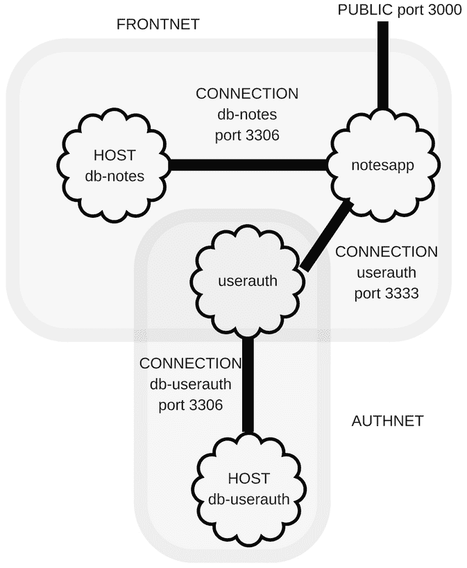
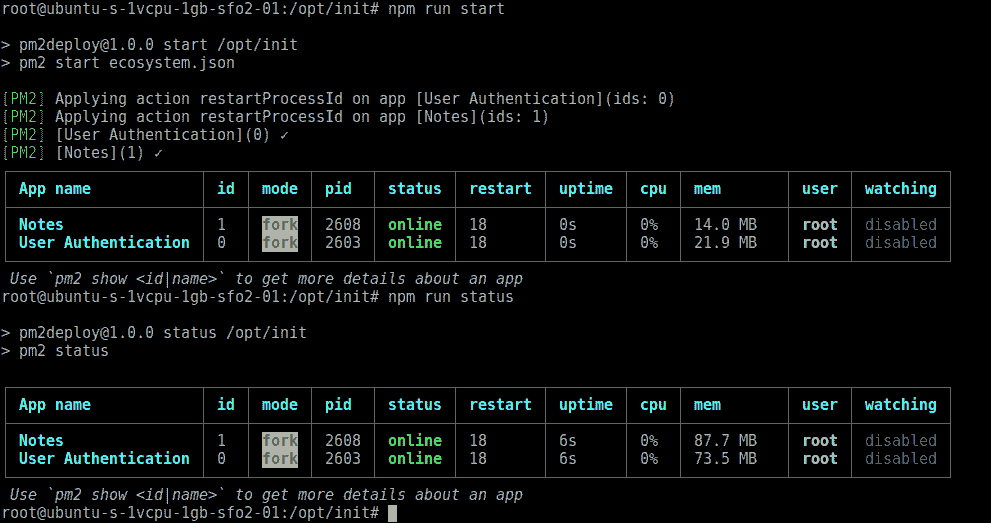
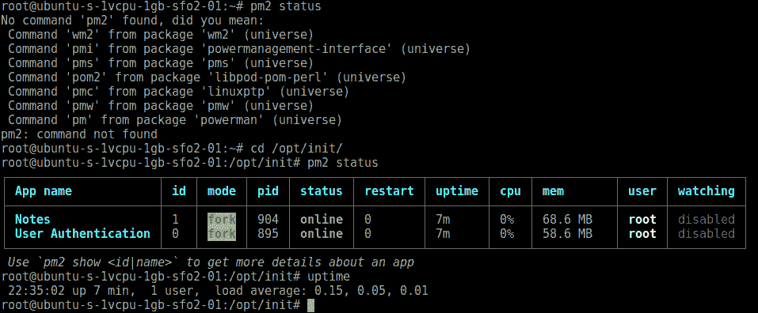
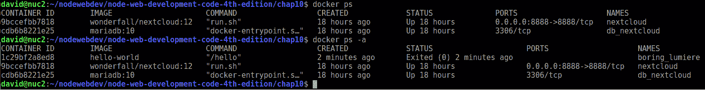
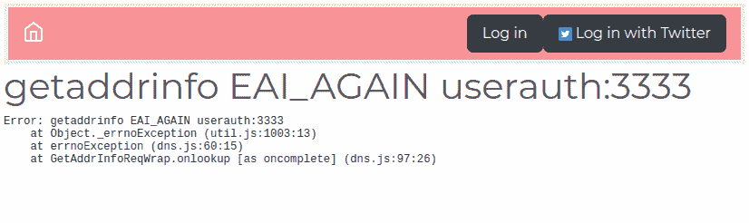
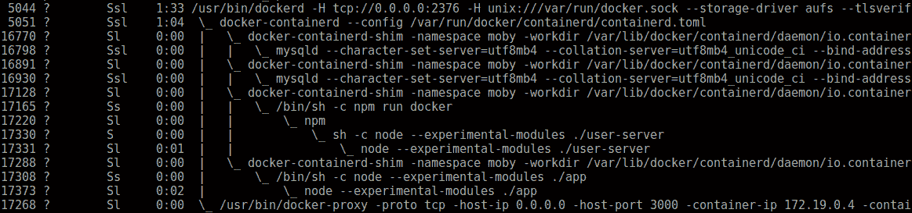

# 部署 Node.js 应用

现在笔记应用已经相当完善，是时候考虑如何将其部署到真实的服务器上了。我们已经创建了一个最小化的协作笔记概念实现，它运行得相当不错。为了成长，笔记应用必须离开我们的笔记本电脑，在真实的服务器上运行。目标是研究 Node.js 应用的部署方法。

在本章中，我们将涵盖以下主题：

+   符合传统 LSB 规范的 Node.js 部署

+   使用 PM2 提高可靠性

+   部署到**虚拟专用服务器**（**VPS**）提供商

+   使用 Docker 进行微服务部署（我们有四个不同的服务要部署）

+   部署到 Docker 托管提供商

第一项任务是复制上一章的源代码。建议你创建一个新的目录，`chap10`，作为`chap09`目录的兄弟目录，并将`chap09`中的所有内容复制到`chap10`。

# 笔记应用架构和部署考虑因素

在我们开始部署笔记应用之前，我们需要回顾其架构。要部署笔记应用，我们必须了解我们打算做什么。

我们已经将服务分为两组，如下所示：



用户认证服务器应该是系统更安全的部分。在我们的笔记本电脑上，我们无法创建围绕该服务的预期保护墙，但我们即将实施这种保护。

提高安全性的一个策略是尽可能少地暴露端口。这减少了所谓的攻击面，简化了我们对应用加固以防止安全漏洞的工作。在笔记应用中，我们恰好有一个需要暴露的端口，即用户通过它访问应用的 HTTP 服务。其他端口，即 MySQL 服务器端口和用户认证服务端口，应该被隐藏。

在内部，笔记应用需要访问笔记数据库和用户认证服务。该服务反过来又需要访问用户认证数据库。根据目前的设想，Notes 应用之外的服务不需要访问这两个数据库或认证服务。

实现这种分割需要两个或三个子网，具体取决于你希望走多远。第一个，FrontNet，包含笔记应用及其数据库。第二个，AuthNet，包含认证服务及其数据库。第三个可能的子网将包含笔记和认证服务。子网配置必须限制可以访问子网的主机，并在子网之间创建安全墙。

# 传统 Linux Node.js 服务部署

传统 Linux/Unix 服务器应用程序部署使用 **init 脚本** 来管理后台进程。它们会在系统启动时启动，并在系统停止时干净地关闭。虽然这是一个简单的模型，但具体细节在不同 **操作系统**（**OS**）之间差异很大。

一种常见的方法是使用 `/etc/init.d` 目录中的 shell 脚本来管理 `init` 进程的后台进程。其他操作系统使用其他进程管理器，例如 `upstart` 或 `launchd`。

Node.js 项目本身不包含任何用于管理任何操作系统上服务器进程的脚本。Node.js 更像是一个构建工具包，包含构建服务器的零件和部件，但它本身不是一个完整的、经过抛光的服务器框架。在 Node.js 上实现一个完整的网络服务意味着创建脚本以集成到您操作系统的进程管理中。开发这些脚本的任务取决于我们。

网络服务必须：

+   可靠性：例如，当服务器进程崩溃时自动重启

+   可管理性：意味着它与系统管理实践很好地集成

+   可观察性：意味着管理员必须能够从服务中获取状态和活动信息

为了展示涉及的内容，让我们使用 PM2 来实现 Notes 的后台服务器进程管理。PM2 检测系统类型，并可以自动与进程管理系统集成。它将创建一个 LSB 风格的 init 脚本（[`wiki.debian.org/LSBInitScripts`](http://wiki.debian.org/LSBInitScripts)），或根据您服务器上进程管理系统的要求创建其他脚本。

对于这次部署，我们将设置一个单独的 Ubuntu 17.10 服务器。您应该从托管提供商那里租用一个 **虚拟专用服务器**（**VPS**），并在那里进行所有安装和配置。从主要提供商那里租用一个小型机器实例，以通过本章所需的时间，只需花费几美元。

您也可以使用笔记本电脑上的 **VirtualBox** 来完成本节中的任务。只需在 VirtualBox 中安装 Debian 或 Ubuntu 作为虚拟机，然后按照本节中的说明操作。这不会完全像使用远程 VPS 托管提供商那样，但不需要租用服务器。

便笺和用户身份验证服务都将运行在该服务器上，以及一个单独的 MySQL 实例。虽然我们的目标是实现 FrontNet 和 AuthNet 之间的强分离，但由于有两个 MySQL 实例，我们目前不会这样做。

# 前置条件 – 数据库配置

Linux 软件包管理系统不允许我们安装两个 MySQL 实例。相反，我们通过使用具有不同用户名和访问权限的单独数据库在同一 MySQL 实例中实现分离。

第一步是确保 MySQL 已安装在你的服务器上。对于 Ubuntu，**DigitalOcean**有一个相当不错的教程：[`www.digitalocean.com/community/tutorials/how-to-install-mysql-on-ubuntu-14-04`](https://www.digitalocean.com/community/tutorials/how-to-install-mysql-on-ubuntu-14-04)。虽然该教程的 Ubuntu 版本已经过时，但说明仍然足够准确。

MySQL 服务器必须支持从`localhost`的 TCP 连接。编辑配置文件`/etc/mysql/my.cnf`，添加以下行：

```js
bind-address = 127.0.0.1
```

这限制了 MySQL 服务器连接到服务器上的进程。一个恶意用户必须入侵服务器才能访问你的数据库。现在我们的数据库服务器已可用，让我们设置两个数据库。

在`chap10/notes/models`目录下，创建一个名为`mysql-create-db.sql`的文件，包含以下内容：

```js
CREATE DATABASE notes;
CREATE USER 'notes'@'localhost' IDENTIFIED BY 'notes';
GRANT ALL PRIVILEGES ON notes.* TO 'notes'@'localhost' WITH GRANT OPTION;  
```

在`chap10/users`目录下，创建一个名为`mysql-create-db.sql`的文件，包含以下内容：

```js
CREATE DATABASE userauth;
CREATE USER 'userauth'@'localhost' IDENTIFIED BY 'userauth';
GRANT ALL PRIVILEGES ON userauth.* TO 'userauth'@'localhost' WITH GRANT OPTION;  
```

我们不能在服务器上运行这些脚本，因为 Notes 应用程序尚未复制到服务器上。当完成这一步后，我们将以以下方式运行脚本：

```js
$ mysql -u root -p <chap10/users/mysql-create-db.sql
$ mysql -u root -p <chap10/notes/models/mysql-create-db.sql  
```

这将创建两个数据库，`notes`和`userauth`，以及相关的用户名和密码。每个用户只能访问他们关联的数据库。稍后，我们将使用 YAML 配置文件设置 Notes 和用户认证服务以访问这些数据库。

# 在 Ubuntu 上安装 Node.js

根据 Node.js 文档([`nodejs.org/en/download/package-manager/`](https://nodejs.org/en/download/package-manager/))，对于 Debian 或 Ubuntu Linux 发行版，推荐的安装方法如下：

```js
$ curl -sL https://deb.nodesource.com/setup_10.x | sudo -E bash -
$ sudo apt-get update
$ sudo apt-get install -y nodejs build-essential  
```

我们之前已经见过，所以将 Node.js 期望的版本号替换到 URL 中。以这种方式安装意味着随着新的 Node.js 版本发布，升级可以通过正常的软件包管理程序轻松完成。

# 在服务器上设置 Notes 和用户认证

在将 Notes 和用户认证代码复制到这个服务器之前，让我们做一些编码来为迁移做准备。我们知道 Notes 和认证服务必须使用之前给出的用户名和密码通过`localhost`访问 MySQL 实例。

使用我们迄今为止采用的方法，这意味着为`Sequelize`参数创建一对 YAML 文件，并在`package.json`文件中更改环境变量以匹配。

创建一个`chap10/notes/models/sequelize-server-mysql.yaml`文件，包含以下内容：

```js
dbname: notes 
username: notes 
password: notes12345
params: 
    host: localhost 
    port: 3306 
    dialect: mysql 
```

在测试过程中发现，简单的密码如`notes`不被 MySQL 服务器接受，需要更长的密码。在`chap10/notes/package.json`中，将以下行添加到`scripts`部分：

```js
"on-server": "SEQUELIZE_CONNECT=models/sequelize-server-mysql.yaml NOTES_MODEL=sequelize USER_SERVICE_URL=http://localhost:3333 PORT=3000 node --experimental-modules ./app",  
```

然后创建一个`chap10/users/sequelize-server-mysql.yaml`文件，包含以下代码：

```js
dbname: userauth 
username: userauth 
password: userauth 
params: 
    host: localhost 
    port: 3306 
    dialect: mysql 
```

这些配置文件中显示的密码显然无法通过任何安全审计。

在`chap10/users/package.json`中，将以下行添加到`scripts`部分：

```js
"on-server": "PORT=3333 SEQUELIZE_CONNECT=sequelize-server-mysql.yaml node --experimental-modules ./user-server", 
```

这将配置身份验证服务以访问刚刚创建的数据库。

现在我们需要在服务器上选择一个位置来安装应用程序代码：

```js
# ls /opt  
```

这个空目录看起来是一个不错的选择。只需将 `chap10/notes` 和 `chap10/users` 上传到你的首选位置。在上传之前，请从两个目录中删除 `node_modules` 目录。

这样做是为了节省上传时间，同时也是因为简单的事实，即你在笔记本电脑上安装的任何原生代码模块都将与服务器不兼容。

在你的笔记本电脑上，你可能运行这样的命令：

```js
$ rsync --archive --verbose ./ root@159.89.145.190:/opt/
```

使用分配给正在使用的服务器的实际 IP 地址或域名。

你最终应该得到以下类似的内容：

```js
# ls /opt
notes  users  
```

然后，在每个目录中运行以下命令：

```js
# rm -rf node_modules
# npm install  
```

我们以 `root` 身份运行这些命令，而不是可以运行 `sudo` 命令的用户 ID。所选托管提供商（DigitalOcean）提供的机器配置为用户以 `root` 身份登录。其他 VPS 托管提供商将提供需要以普通用户身份登录的机器，然后使用 `sudo` 执行特权操作。在阅读这些说明时，请注意我们显示的命令提示符。我们遵循了以下惯例：`$` 用于以普通用户身份运行的命令，`#` 用于以 `root` 身份运行的命令。如果你以普通用户身份运行，需要运行 `root` 命令，那么请使用 `sudo` 运行该命令。

最简单的方法是直接删除整个 `node_modules` 目录，然后让 `npm install` 执行其工作。记住，我们是这样设置 `PATH` 环境变量的：

```js
# export PATH=./node_modules/.bin:${PATH}  
```

你可以将这个命令放在服务器的登录脚本（`.bashrc`, `.cshrc` 等）中，以便自动启用。

最后，你现在可以运行之前编写的 SQL 脚本以设置数据库实例：

```js
# mysql -u root -p <users/mysql-create-db.sql
# mysql -u root -p <notes/models/mysql-create-db.sql  
```

然后，你应该能够手动启动服务以检查一切是否正常工作。MySQL 实例已经过测试，所以我们只需要启动用户身份验证和笔记服务：

```js
# cd /opt/users
# DEBUG=users:* npm run on-server

> user-auth-server@0.0.1 on-server /opt/users
> PORT=3333 SEQUELIZE_CONNECT=sequelize-server-mysql.yaml node --experimental-modules ./user-server

(node:9844) ExperimentalWarning: The ESM module loader is experimental.

```

然后，在另一个终端会话中登录到服务器并运行以下命令：

```js
# cd /opt/users/
# PORT=3333 node users-add.js 
Created { id: 1, username: 'me', password: 'w0rd', provider: 'local',
 familyName: 'Einarrsdottir', givenName: 'Ashildr', middleName: '',
 emails: '[]', photos: '[]',
 updatedAt: '2018-02-02T00:43:16.923Z', createdAt: '2018-02-02T00:43:16.923Z' }
# PORT=3333 node users-list.js 
List [ { id: 'me', username: 'me', provider: 'local',
 familyName: 'Einarrsdottir', givenName: 'Ashildr', middleName: '',
 emails: '[]', photos: '[]' } ]
```

前面的命令既测试了后端用户身份验证服务是否正常工作，又提供了一个我们可以用来登录的用户账户。`users-list` 命令演示了它的工作原理。

你可能会遇到错误：

```js
 users:error /create-user Error: Please install mysql2 package manually

```

这是在 `Sequelize` 内部生成的。`mysql2` 驱动是一个替代的 MySQL 驱动程序，用纯 JavaScript 实现，并包括对返回 Promises 的支持，以便在 `async` 函数中平滑使用。如果你确实收到这条消息，请继续安装该软件包，并记住将此依赖项添加到你的 `package.json` 中。

现在，我们可以启动笔记服务：

```js
# cd ../notes
# npm run on-server

> notes@0.0.0 on-server /opt/notes
> SEQUELIZE_CONNECT=models/sequelize-server-mysql.yaml NOTES_MODEL=sequelize USER_SERVICE_URL=http://localhost:3333 PORT=3000 node --experimental-modules ./app

(node:9932) ExperimentalWarning: The ESM module loader is experimental.
```

然后，我们可以使用我们的网络浏览器连接到应用程序。由于你可能没有与这个服务器关联的域名，笔记可以通过服务器的 IP 地址访问，例如 `http://159.89.145.190:3000/`。

在这些示例中，我们使用的是用于测试本节中指令的 VPS 的 IP 地址。您使用的 IP 地址当然会不同。

到现在为止，您应该知道验证笔记是否正常工作的步骤。创建一些笔记，打开几个浏览器窗口，查看实时通知是否工作，等等。一旦您确认笔记在服务器上正常工作，请终止进程并继续下一节，我们将设置在服务器启动时运行。

# 调整 Twitter 认证以在服务器上工作

我们之前为笔记设置的 Twitter 应用将无法工作，因为服务器的认证 URL 不正确。目前，我们可以使用之前创建的用户配置文件登录。如果您想看到 OAuth 与 Twitter 一起工作，请访问`apps.twitter.com`并重新配置应用以使用服务器的 IP 地址。

由于托管位置不是我们的笔记本电脑，Twitter 的`callbackURL`必须指向正确的位置。默认值是`http://localhost:3000`，用于笔记本电脑。但现在我们需要使用服务器的 IP 地址。在`notes/package.json`中，向`on-server`脚本添加以下环境变量：

```js
TWITTER_CALLBACK_HOST=http://159.89.145.190:3000 
```

使用分配给正在使用的服务器的实际 IP 地址或域名。在实际部署中，我们将在这里使用域名。

# 设置 PM2 以管理 Node.js 进程

有许多方法可以管理服务器进程，以确保进程崩溃时可以重启，等等。我们将使用**PM2** ([`pm2.keymetrics.io/`](http://pm2.keymetrics.io/))，因为它针对 Node.js 进程进行了优化。它将进程管理和监控集成到一个应用程序中。

让我们在`init`目录下创建一个目录，以便使用 PM2。PM2 网站建议您全局安装此工具，但作为十二要素应用模型的学生，我们认识到最好使用明确声明的依赖项，并避免全局未管理的依赖项。

创建一个包含以下内容的`package.json`文件：

```js
{
  "name": "pm2deploy",
  "version": "1.0.0",
  "scripts": {
    "start": "pm2 start ecosystem.json",
    "stop": "pm2 stop ecosystem.json",
    "restart": "pm2 restart ecosystem.json",
    "status": "pm2 status",
    "save": "pm2 save",
    "startup": "pm2 startup"
  },
  "dependencies": {
    "pm2": "².9.3"
  }
}

```

使用`npm install`命令按常规安装 PM2。

在正常的 PM2 使用中，我们使用`pm2 start script-name.js`启动脚本。我们可以创建一个`/etc/init`脚本来完成此操作，但 PM2 还支持一个名为`ecosystem.json`的文件，可以用来管理进程集群。我们有两个进程需要一起管理，即面向用户的笔记应用和后端的用户认证服务。

创建一个名为`ecosystem.json`的文件，包含以下内容：

```js
{
  "apps" : [
    {
      "name": "User Authentication",
      "script": "user-server.mjs",
      "cwd": "/opt/users",
      "node_args": "--experimental-modules",
      "env": {
        "PORT": "3333",
        "SEQUELIZE_CONNECT": "sequelize-server-mysql.yaml"
      },
      "env_production": { "NODE_ENV": "production" }
    },
    {
      "name": "Notes",
      "script": "app.mjs",
      "cwd": "/opt/notes",
      "node_args": "--experimental-modules",
      "env": {
        "PORT": "3000",
        "SEQUELIZE_CONNECT": "models/sequelize-server-mysql.yaml",
        "NOTES_MODEL": "sequelize",
        "USER_SERVICE_URL": "http://localhost:3333",
        "TWITTER_CONSUMER_KEY": "..",
        "TWITTER_CONSUMER_SECRET": "..",
        "TWITTER_CALLBACK_HOST": "http://45.55.37.74:3000"
      },
      "env_production": { "NODE_ENV": "production" }
    }
  ]
}

```

此文件描述了包含两个服务的目录，每个服务的运行脚本，命令行选项以及要使用的环境变量。这是与`package.json`脚本中相同的信息，但表述得更清晰。调整`TWITTER_CALLBACK_HOST`以匹配服务器的 IP 地址。有关文档，请参阅[`pm2.keymetrics.io/docs/usage/application-declaration/`](http://pm2.keymetrics.io/docs/usage/application-declaration/)。

然后，我们使用`npm run start`启动服务，屏幕上显示如下：



您可以再次将浏览器导航到您服务器的 URL，例如 `http://159.89.145.190:3000`，并检查笔记是否正在运行。一旦启动，以下是一些有用的命令：

```js
# pm2 list
# pm2 describe 1
# pm2 logs 1  
```

这些命令让您可以查询服务状态。

`pm2 monit` 命令为您提供系统活动的伪图形监控器。有关文档，请参阅 [`pm2.keymetrics.io/docs/usage/monitoring/`](http://pm2.keymetrics.io/docs/usage/monitoring/)。

`pm2 logs` 命令解决了我们在其他地方提出的应用日志管理问题。活动日志应被视为事件流，并应适当捕获和管理。使用 PM2，输出会自动捕获，可以查看，日志文件可以轮换和清除。有关文档，请参阅 [`pm2.keymetrics.io/docs/usage/log-management/`](http://pm2.keymetrics.io/docs/usage/log-management/)。

如果我们重新启动服务器，这些进程不会随服务器一起启动。我们该如何处理这种情况？这非常简单，因为 PM2 可以为我们生成一个 `init` 脚本：

```js
# pm2 save
[PM2] Saving current process list...
[PM2] Successfully saved in /root/.pm2/dump.pm2

# pm2 startup
[PM2] Init System found: systemd
Platform systemd
Template
[Unit]
Description=PM2 process manager
Documentation=https://pm2.keymetrics.io/
After=network.target

... more output is printed
```

`pm2 save` 命令保存当前状态。当时正在运行的所有服务都将被保存并由生成的启动脚本管理。

下一步是生成启动脚本，使用 `pm startup` 命令。PM2 支持在多个操作系统上生成启动脚本，但以这种方式运行时，它会自动检测系统类型并生成正确的启动脚本。它还会安装启动脚本，并启动它运行。有关更多信息，请参阅 [`pm2.keymetrics.io/docs/usage/startup/`](http://pm2.keymetrics.io/docs/usage/startup/) 的文档。

如果您仔细查看输出，将打印出一些有用的命令。具体细节将根据您的操作系统而有所不同，因为每个操作系统都有自己的后台进程管理命令。在这种情况下，安装是针对使用 `systemctl` 命令的，如输出所验证：

```js
Command list 
[ 'systemctl enable pm2-root', 
  'systemctl start pm2-root', 
  'systemctl daemon-reload', 
  'systemctl status pm2-root' ] 
[PM2] Writing init configuration in /etc/systemd/system/pm2-root.service 
[PM2] Making script booting at startup... 
...
[DONE]  
>>> Executing systemctl start pm2-root 
[DONE]  
>>> Executing systemctl daemon-reload 
[DONE]  
>>> Executing systemctl status pm2-root

```

您可以自行运行以下命令：

```js
# systemctl status pm2-root 
● pm2-root.service - PM2 process manager 
 Loaded: loaded (/etc/systemd/system/pm2-root.service; enabled; vendor preset: enabled) 
 Active: active (running) since Fri 2018-02-02 22:27:45 UTC; 29min ago 
 Docs: https://pm2.keymetrics.io/ 
 Process: 738 ExecStart=/opt/init/node_modules/pm2/bin/pm2 resurrect (code=exited, status=0/SUCCESS) 
 Main PID: 873 (PM2 v2.9.3: God) 
 Tasks: 30 (limit: 4915) 
 Memory: 171.6M 
 CPU: 11.528s 
 CGroup: /system.slice/pm2-root.service 
 ├─873 PM2 v2.9.3: God Daemon (/root/.pm2) 
 ├─895 node /opt/users/user-server.mjs 
 └─904 node /opt/notes/app.mjs

```

要验证 PM2 是否按广告宣传的那样启动服务，请重新启动您的服务器，然后使用 PM2 检查状态：



首先要注意的是，在最初登录到 `root` 账户时，`pm2 status` 命令不可用。我们已将 PM2 本地安装到 `/opt/init`，该命令仅在目录中可用。

在进入那个目录后，我们现在可以运行该命令并查看状态。请记住在 `TWITTER_CALLBACK_HOST` 环境变量中设置正确的 IP 地址或域名。否则，使用 Twitter 登录将失败。

现在，笔记应用已经在相当好的管理系统下。我们可以在服务器上轻松更新其代码并重启服务。如果服务崩溃，PM2 将自动重启它。日志文件会自动保存供我们查阅。

PM2 还支持从我们的笔记本电脑上的源代码进行部署，我们可以将其推送到预发布或生产环境。为了支持这一点，我们必须将部署信息添加到`ecosystem.json`文件中，然后运行`pm2 deploy`命令将代码推送到服务器。有关更多信息，请参阅 PM2 网站：[`pm2.keymetrics.io/docs/usage/deployment/`](http://pm2.keymetrics.io/docs/usage/deployment/)。

虽然 PM2 在管理服务器进程方面做得很好，但我们开发的系统对于互联网规模的服务来说是不够的。如果笔记应用突然成为病毒式热门，我们突然需要在全球范围内部署一百万台服务器怎么办？像这样逐个部署和维护服务器，是不可扩展的。

我们还跳过了在开始时实现架构决策。将用户认证数据放在同一服务器上是一个安全风险。我们希望将这些数据部署到不同的服务器上，并实施更严格的安全措施。

在下一节中，我们将探讨一个新的系统，Docker，它解决了这些问题以及更多。

# 使用 Docker 进行 Node.js 微服务部署

Docker([`docker.com`](http://docker.com))是软件行业的新宠。兴趣像野火一样迅速蔓延，催生了众多项目，其中许多项目的名称都包含与运输集装箱相关的双关语。

它被描述为**一个为开发者和系统管理员提供的开放平台，用于分布式应用**。它围绕 Linux 容器化技术设计，专注于描述任何 Linux 变种的软件配置。

Docker 自动化了在软件容器中的应用部署。Linux 容器的基本概念可以追溯到 20 世纪 70 年代首次实现的`chroot`监狱，以及其他如 Solaris Zones 这样的系统。Docker 的实现基于 Linux cgroups、内核命名空间和具有联合文件系统能力的文件系统，这些结合在一起使得 Docker 成为它所是的样子。这有点像是在说技术术语，所以让我们尝试一个更简单的解释。

Docker 容器是 Docker 镜像的运行实例。镜像是由开发者设计的，用于特定目的的 Linux 操作系统和应用配置。开发者使用**Dockerfile**来描述镜像。Dockerfile 是一个相对简单的脚本，它展示了 Docker 如何构建镜像。Docker 镜像被设计成可以复制到任何服务器，在那里镜像被实例化为 Docker 容器。

运行中的容器会让你感觉就像你在一个虚拟服务器内部，这个服务器运行在虚拟机上。但 Docker 容器化与 VirtualBox 这样的虚拟机系统非常不同。容器内部运行的进程实际上是在宿主操作系统上运行的。容器化技术（cgroups、内核命名空间等）创建了一种错觉，即它们在 Dockerfile 中指定的 Linux 变体上运行，即使宿主操作系统完全不同。你的宿主操作系统可能是 Ubuntu，而容器操作系统可能是 Fedora 或 OpenSUSE；Docker 使这一切都能正常工作。

相比之下，使用虚拟机软件（如 VirtualBox 和 VMWare 等），你感觉就像在使用一台真正的计算机。有一个虚拟 BIOS 和虚拟化的系统硬件，你必须安装一个完整的客户操作系统。你必须遵循计算机拥有的每一个仪式，包括如果是一个封闭源系统（如 Windows）的话，还需要确保许可证的安全。

虽然 Docker 主要针对 Linux 的 x86 版本，但它也适用于多个基于 ARM 的操作系统以及其他处理器。你甚至可以在单板计算机上运行 Docker，例如树莓派，用于面向硬件的物联网项目。像 Resin.IO 这样的操作系统已优化，仅用于运行 Docker 容器。

Docker 生态系统包含许多工具，并且它们的数量正在迅速增加。为了我们的目的，我们将专注于以下三个特定工具：

+   **Docker engine**：这是核心执行系统，负责协调一切。它运行在 Linux 宿主系统上，提供了一个基于网络的 API，客户端应用程序使用它来发出 Docker 请求，例如构建、部署和运行容器。

+   **Docker machine**：这是一个客户端应用程序，在宿主计算机上执行围绕 Docker Engine 实例配置的功能。

+   **Docker compose**：这可以帮助你在一个文件中定义一个多容器应用程序，包括所有依赖项。

使用 Docker 生态系统，你可以创建一个完整的子网和服务宇宙来实现你的梦想应用。这个宇宙可以在你的笔记本电脑上运行，也可以部署到全球范围内的云托管设施网络。攻击者可以攻击的表面积由开发者严格定义。多容器应用程序甚至会在服务之间限制访问，使得即使攻击者成功入侵容器，也很难突破容器。

使用 Docker，我们首先将在笔记本电脑上设计之前图中所示的系统。然后，我们将该系统迁移到服务器上的 Docker 实例。

# 在你的笔记本电脑上安装 Docker

学习如何在笔记本电脑上安装 Docker 的最佳地方是 Docker 文档网站。我们寻找的是 Docker **社区版**（**CE**）。还有 Docker **企业版**（**EE**），具有更多功能和一些支付支持费用的机会：

+   macOS 安装 – [`docs.docker.com/docker-for-mac/install/`](https://docs.docker.com/docker-for-mac/install/)

+   Windows 安装 – [`docs.docker.com/docker-for-windows/install/`](https://docs.docker.com/docker-for-windows/install/)

+   Ubuntu 安装 – [`docs.docker.com/install/linux/docker-ce/ubuntu/`](https://docs.docker.com/install/linux/docker-ce/ubuntu/)

+   为其他几个发行版提供了说明。一些有用的 Linux 后安装说明可在[`docs.docker.com/install/linux/linux-postinstall/`](https://docs.docker.com/install/linux/linux-postinstall/)找到。

因为 Docker 在 Linux 上运行，所以它不会在 macOS 或 Windows 上原生运行。在任一操作系统上安装都需要在虚拟机内部安装 Linux，然后在那个虚拟 Linux 机器上运行 Docker 工具。你必须自己手动设置那些日子已经一去不复返了。Docker 团队通过为 Mac 和 Windows 开发易于使用的 Docker 应用程序来简化了这一过程。Docker for Windows 和 Docker for Mac 捆绑了 Docker 工具和轻量级虚拟机软件。结果是极其轻量，Docker 容器可以在后台运行，对系统的影响很小。

你可能会在 macOS 上找到将 Docker Toolbox 作为安装 Docker 的方法的参考资料。该应用程序已经不再使用，已被 Docker for Windows 和 Docker for Mac 所取代。

# 使用 Docker for Windows/macOS 启动 Docker

要启动 Docker for Windows 或 Mac 非常简单。你只需找到并双击应用程序图标。它将以任何其他原生应用程序的方式启动。启动后，它管理一个虚拟机（不是 VirtualBox），其中运行着 Docker Engine 的 Linux 实例。在 macOS 上，会出现一个菜单栏图标，你可以通过它来控制`Docker.app`，而在 Windows 上，系统托盘中会有一个图标。

有可用的设置，使得每次启动笔记本电脑时 Docker 都会自动启动。

在两者上，CPU 必须支持**虚拟化**。Docker for Windows 和 Docker for Mac 捆绑的超轻量级虚拟机管理程序，反过来又需要 CPU 的虚拟化支持。

对于 Windows 系统，可能需要 BIOS 配置。请参阅[`docs.docker.com/docker-for-windows/troubleshoot/#virtualization-must-be-enabled`](https://docs.docker.com/docker-for-windows/troubleshoot/#virtualization-must-be-enabled)。

对于 Mac，这需要 2010 年或更新的硬件，以及 Intel 对**内存管理单元**（MMU）虚拟化的硬件支持，包括**扩展页表**（EPT）和无限制模式。你可以通过运行`sysctl kern.hv_support`来检查此支持。它还要求 macOS 10.11 或更高版本。

# 尝试 Docker

设置完成后，我们可以使用本地的 Docker 实例来创建 Docker 容器，运行一些命令，并总体上学习如何使用这个惊人的系统。

就像许多软件之旅一样，这一旅程从说出`Hello World`开始：

```js
$ docker run hello-world 
Unable to find image 'hello-world:latest' locally 
latest: Pulling from library/hello-world 
ca4f61b1923c: Pull complete 
Digest: sha256:66ef312bbac49c39a89aa9bcc3cb4f3c9e7de3788c944158df3ee0176d32b751 
Status: Downloaded newer image for hello-world:latest 

Hello from Docker! 
This message shows that your installation appears to be working correctly. 

To generate this message, Docker took the following steps: 
 1\. The Docker client contacted the Docker daemon. 
 2\. The Docker daemon pulled the "hello-world" image from the Docker Hub. 
 (amd64) 
 3\. The Docker daemon created a new container from that image which runs the 
 executable that produces the output you are currently reading. 
 4\. The Docker daemon streamed that output to the Docker client, which sent it 
 to your terminal. 

To try something more ambitious, you can run an Ubuntu container with: 
 $ docker run -it ubuntu bash 

Share images, automate workflows, and more with a free Docker ID: 
 https://cloud.docker.com/ 

For more examples and ideas, visit: 
 https://docs.docker.com/engine/userguide/

```

`docker run` 命令下载一个 Docker 镜像，该镜像名称在命令行中指定，然后从该镜像初始化一个 Docker 容器，并运行该容器。在这种情况下，名为 `hello-world` 的镜像在本地计算机上不存在，因此需要下载并初始化。完成这些操作后，`hello-world` 容器被执行并打印出这些说明。

你可以查询你的计算机以查看，尽管 `hello-world` 容器已经执行并完成，但它仍然存在：



`docker ps` 命令列出正在运行的 Docker 容器。正如我们所见，`hello-world` 容器不再运行，但使用 `-a` 开关，`docker ps` 也会显示那些存在但当前未运行的容器。我们还看到，这台计算机安装了一个 Nextcloud 实例及其关联的数据库。

当你完成对容器的使用后，可以使用以下命令进行清理：

```js
$ docker rm boring_lumiere
boring_lumiere 
```

名称 `boring_lumiere` 是 Docker 自动生成的容器名称。虽然镜像名称是 `hello-world`，但这不是容器名称。Docker 生成了容器名称，这样你就有了一个比容器 ID 列表中显示的十六进制 ID 更用户友好的标识符。在创建容器时，指定任何你喜欢的容器名称都很简单。

# 为用户认证服务创建 AuthNet

在我们脑海中围绕这些理论旋转的时候，是时候做一些实际的事情了。让我们先设置用户认证服务。在前面显示的图中，这将是一个标记为 AuthNet 的框，其中包含一个 MySQL 实例和认证服务器。

# MySQL 的 Docker 容器

要查找公开可用的 Docker 镜像，请访问 [`hub.docker.com/`](https://hub.docker.com/) 并进行搜索。你会找到许多现成的 Docker 镜像。例如，Nextcloud 及其关联的数据库，在我们尝试运行 `hello-world` 应用程序时已展示过安装。这两个都是从它们各自的项目团队提供的，安装和运行容器的简单（或多或少）操作就是输入 `docker run nextcloud`。安装 Nextcloud 及其关联的数据库，以及许多其他打包的应用程序，如 GitLab，与我们要构建 AuthNet 的过程非常相似，所以你即将学习的技能非常实用。

仅针对 MySQL，就有超过 11,000 个容器可供选择。幸运的是，MySQL 团队提供的两个容器非常受欢迎且易于使用。`mysql/mysql-server` 镜像配置起来稍微简单一些，所以我们使用这个。

可以指定 Docker 镜像名称，以及一个通常表示软件版本号的 *tag*。在这种情况下，我们将使用 `mysql/mysql-server:5.7`，其中 `mysql/mysql-server` 是容器名称，`5.7` 是 tag。MySQL 5.7 是当前的 GA 版本。按照以下方式下载镜像：

```js
$ docker pull mysql/mysql-server:5.7
5.7: Pulling from mysql/mysql-server
4040fe120662: Pull complete 
d049aa45d358: Pull complete 
a6c7ed00840d: Pull complete 
853789d8032e: Pull complete 
Digest: sha256:1b4c7c24df07fa89cdb7fe1c2eb94fbd2c7bd84ac14bd1779e3dec79f75f37c5
Status: Downloaded newer image for mysql/mysql-server:5.7
```

这个操作总共下载了四个镜像，因为此镜像是在三个其他镜像之上构建的。我们将在学习如何构建 Dockerfile 时了解它是如何工作的。

可以使用以下方式使用此镜像启动容器：

```js
$ docker run --name=mysql --env MYSQL_ROOT_PASSWORD=f00bar  mysql/mysql-server:5.7 
[Entrypoint] MySQL Docker Image 5.7.21-1.1.4 
[Entrypoint] Initializing database 
[Entrypoint] Database initialized 
... 
[Entrypoint] ignoring /docker-entrypoint-initdb.d/* 
[Entrypoint] Server shut down 
[Entrypoint] MySQL init process done. Ready for start up. 
[Entrypoint] Starting MySQL 5.7.21-1.1.4

```

我们以前台模式启动了这个服务。容器名称是`mysql`。我们设置了一个环境变量，根据镜像文档，这个环境变量初始化了`root`密码。在另一个窗口中，我们可以进入容器并按照以下方式运行 MySQL 客户端：

```js
$ docker exec -it mysql mysql -u root -p 
Enter password:  
Welcome to the MySQL monitor.  Commands end with ; or \g. 
Your MySQL connection id is 4 
Server version: 5.7.21 MySQL Community Server (GPL) 

Copyright (c) 2000, 2018, Oracle and/or its affiliates. All rights reserved. 

Oracle is a registered trademark of Oracle Corporation and/or its 
affiliates. Other names may be trademarks of their respective 
owners. 

Type 'help;' or '\h' for help. Type '\c' to clear the current input statement. 

mysql> show databases; 
+--------------------+ 
| Database           | 
+--------------------+ 
| information_schema | 
| mysql              | 
| performance_schema | 
| sys                | 
+--------------------+ 
4 rows in set (0.00 sec) 

mysql> 
```

**`docker exec`**命令允许你在容器内部运行程序。`-it`选项表示命令以交互方式在分配的终端上运行。将`mysql`替换为`bash`，您就有一个交互式的`bash`命令外壳。

这个`mysql`命令实例正在容器内部运行。默认情况下，容器配置为不暴露任何外部端口，并且有一个默认的`my.cnf`文件。

数据库文件被锁定在容器内部。一旦删除该容器，数据库就会消失。Docker 容器旨在是短暂的，根据需要创建和销毁，而数据库旨在是永久的，有时其寿命以几十年计算。

换句话说，我们可以轻松安装和启动 MySQL 实例是很酷的。但有几个缺陷：

+   从其他软件访问数据库

+   将数据库文件存储在容器外部以延长其使用寿命

+   自定义配置，因为数据库管理员喜欢调整设置

+   需要与用户身份验证服务一起连接到 AuthNet

在继续之前，让我们清理一下。在终端窗口中，输入以下命令：

```js
$ docker stop mysql 
mysql $ docker rm mysql
mysql

```

这就结束了容器的关闭和清理工作。并且，为了重申之前提到的观点，该容器中的数据库已经消失。如果该数据库包含关键信息，那么您就失去了它，没有任何机会恢复数据。

# 初始化 AuthNet

Docker 支持在容器之间创建虚拟桥接网络。记住，Docker 容器具有许多已安装 Linux 操作系统的功能。每个容器都可以有自己的 IP 地址（或多个）和暴露的端口。Docker 支持创建一个虚拟以太网段，称为**桥接网络**。这些网络仅存在于主机计算机中，默认情况下，主机计算机之外的所有设备都无法访问。

因此，Docker 桥接网络具有严格受限的访问权限。任何连接到桥接网络的 Docker 容器都可以与其他连接到该网络的容器通信。容器通过主机名找到彼此，Docker 包含一个内嵌的 DNS 服务器来设置所需的主机名。该 DNS 服务器配置为不需要域名中的点，这意味着每个容器的 DNS/主机名仅仅是容器名称，而不是像`container-name.service`这样的名称。使用主机名来识别容器的策略是 Docker 对服务发现的实现。

创建一个名为 `authnet` 的目录，作为 `users` 和 `notes` 目录的兄弟目录。我们将在该目录中工作 `AuthNet`。

创建一个包含以下内容的文件，`buildauthnet.sh`：

```js
docker network create --driver bridge authnet
```

输入以下内容：

```js
$ sh -x buildauthnet.sh
+ docker network create --driver bridge authnet 
3021e2069278c2acb08d94a2d31507a43f089db1c02eecc97792414b498eb785
```

这将创建一个 Docker 桥接网络。

# Windows 上的脚本执行

在 Windows 上执行脚本的方式不同，因为它使用 PowerShell 而不是 `bash`，以及许多其他考虑因素。为此，以及随后的脚本，进行以下更改。

PowerShell 脚本文件名必须以 `.ps1` 扩展名结尾。对于这些脚本中的大多数，这就足够了，因为脚本非常简单。要执行脚本，只需在 PowerShell 窗口中键入 `.\scriptname.ps1`。换句话说，在 Windows 上，刚刚显示的脚本必须命名为 `buildauthnet.ps1`，并且以 `.\buildauthnet.ps1` 的方式执行。

要执行脚本，您可能需要更改 PowerShell 执行策略：

```js
PS C:\Users\david\chap10\authnet> Get-ExecutionPolicy
Restricted
PS C:\Users\david\chap10\authnet> Set-ExecutionPolicy Unrestricted
```

显然，这种更改存在安全考虑，因此完成时请将执行策略改回。

在 Windows 上，一个更简单的方法是将这些命令粘贴到 PowerShell 窗口中。

# 链接 Docker 容器

在 Docker 的早期，我们被告知使用 `--link` 选项来链接容器。使用该选项，Docker 会在 `/etc/hosts` 中创建条目，以便一个容器可以通过其主机名引用另一个容器。该选项还安排了链接容器之间的 TCP 端口和卷的访问。这允许创建多容器服务，使用私有 TCP 端口进行通信，而不向容器外的进程暴露任何内容。

今天，我们被告知 `--link` 选项是一个过时特性，而我们应该使用 `bridge` 网络。在本章中，我们将专注于使用 `bridge` 网络。

您可以按以下方式列出网络：

```js
$ docker network ls 
NETWORK ID          NAME                DRIVER              SCOPE 
3021e2069278        authnet             bridge              local

```

使用以下命令查看网络的详细信息：

```js
$ docker network inspect authnet
 ... much JSON output

```

目前，这不会显示任何连接到 `authnet` 的容器。输出显示了网络名称、该网络的 IP 地址范围、默认网关以及其他有用的网络配置信息。由于没有任何东西连接到网络，让我们开始构建所需的容器。

# db-userauth 容器

现在我们有了网络，我们可以开始将容器连接到该网络。然后我们将探索容器，看看它们有多私密。

创建一个包含以下内容的脚本，`startdb.sh`：

```js
docker run --name db-userauth --env MYSQL_RANDOM_ROOT_PASSWORD=true \ 
    --env MYSQL_USER=userauth --env MYSQL_PASSWORD=userauth \ 
    --env MYSQL_DATABASE=userauth \ 
    --volume `pwd`/my.cnf:/etc/my.cnf \
    --volume `pwd`/../userauth-data:/var/lib/mysql \ 
    --network authnet mysql/mysql-server:5.7

```

在 Windows 上，您需要将脚本命名为 `startdb.ps1`，并将文本全部放在一行中，而不是使用反斜杠扩展行。此外，挂载在 `/var/lib/mysql` 上的卷必须单独创建。请使用以下命令：

```js
docker volume create db-userauth-volume

docker run --name db-userauth --env MYSQL_RANDOM_ROOT_PASSWORD=true --env MYSQL_USER=userauth --env MYSQL_PASSWORD=userauth --env MYSQL_DATABASE=userauth --volume $PSScriptRoot\my.cnf:/etc/my.cnf --volume db-userauth-volume:/var/lib/mysql --network authnet mysql/mysql-server:5.7
```

当运行时，容器将被命名为`db-userauth`。为了增加一点安全性，`root`密码已经被随机化。我们定义了一个名为`userauth`的数据库，通过名为`userauth`的用户访问，使用密码`userauth`。这并不完全安全，所以请随意选择更好的名称和密码。容器连接到`authnet`网络。

有两个`--volume`选项需要我们讨论。在 Docker 术语中，卷是容器内部的一个可以从中挂载到容器外部的实体。在这种情况下，我们正在定义一个名为`userauth-data`的卷，在主机文件系统中将其挂载为容器内的`/var/lib/mysql`。同时，我们定义一个本地的`my.cnf`文件，在容器内用作`/etc/my.cnf`。

对于 Windows 版本，我们对`--volume`挂载进行了两个更改。我们指定`/etc/my.cnf`的挂载为`$PSScriptRoot\my.cnf:/etc/my.cnf`，因为这是在 PowerShell 中引用本地文件的方式。

对于`/var/lib/mysql`，我们引用了一个单独创建的卷。该卷是通过`volume create`命令创建的，并且在该命令中没有机会控制卷的位置。重要的是卷必须位于容器外部，这样数据库文件才能在容器的销毁/创建周期中幸存。

综合这些设置，意味着数据库文件和配置文件位于容器外部，因此将超出特定容器的生命周期。要获取`my.cnf`，你将不得不运行一次容器而不使用`--volume `pwd`/my.cnf:/etc/my.cnf`选项，这样你就可以将默认的`my.cnf`文件复制到`authnet`目录中。

首先不使用该选项运行脚本一次：

```js
$ sh startdb.sh 
... much output
[Entrypoint] GENERATED ROOT PASSWORD: UMyh@q]@j4qijyj@wK4s4SkePIkq
... much output

```

输出与之前看到的类似，但这次会给出随机的密码：

```js
$ docker network inspect authnet
```

这将告诉你`db-userauth`容器连接到了`authnet`：

```js
$ docker exec -it db-userauth mysql -u userauth -p 
Enter password:  
Welcome to the MySQL monitor.  Commands end with ; or \g.
   ... much output mysql> show databases; 
+--------------------+ 
| Database           | 
+--------------------+ 
| information_schema | 
| userauth           | 
+--------------------+ 
2 rows in set (0.00 sec) 

mysql> use userauth; 
Database changed 
mysql> show tables; 
Empty set (0.00 sec)

```

我们看到我们的数据库已经创建，但它为空。但我们这样做是为了获取`my.cnf`文件：

```js
$ docker cp db-userauth:/etc/my.cnf . 
$ ls 
my.cnf  mysql-data  startdb.sh 

```

使用`docker cp`命令用于在容器内外复制文件。如果你使用过`scp`，语法将很熟悉。

一旦你有了`my.cnf`文件，你可能想要进行一大堆设置更改。首先需要做的具体更改是注释掉读取`socket=/var/lib/mysql/mysql.sock`的行，其次是添加读取`bind-address = 0.0.0.0`的行。这些更改的目的是将 MySQL 服务配置为监听 TCP 端口而不是 Unix 域套接字。这使得从容器外部与 MySQL 服务进行通信成为可能。结果将是：

```js
# socket=/var/lib/mysql/mysql.sock 
bind-address = 0.0.0.0
```

现在停止`db-userauth`服务，并删除容器，就像我们之前做的那样。编辑`startdb`脚本以启用将`/etc/my.cnf`挂载到容器中的行，然后重新启动容器：

```js
$ docker stop db-userauth 
db-userauth
$ docker rm db-userauth   
db-userauth $ sh ./startdb.sh 
[Entrypoint] MySQL Docker Image 5.7.21-1.1.4 
[Entrypoint] Starting MySQL 5.7.21-1.1.4

```

现在，如果我们检查`authnet`网络，我们会看到以下内容：

```js
$ docker network inspect authnet 
        "Name": "authnet",
         ...
                    "Subnet": "172.18.0.0/16", 
                    "Gateway": "172.18.0.1"
        ... 
 "Containers": { 
 "Name": "db-userauth", 
 "MacAddress": "02:42:ac:12:00:02", 
 "IPv4Address": "172.18.0.2/16",
   ...
```

换句话说，`authnet`网络拥有网络号`172.18.0.0/16`，而`db-userauth`容器被分配了`172.18.0.2`。这种详细程度很少很重要，但第一次设置时仔细检查设置是有用的，这样我们就能理解我们正在处理的内容：

```js
# cat /etc/resolv.conf 
search attlocal.net 
nameserver 127.0.0.11 
options ndots:0

```

如我们之前所述，在 Docker 桥接网络设置中运行着一个 DNS 服务器，并且域名解析被配置为使用`nodots`。这样，Docker 容器的名称就是该容器的 DNS 主机名：

```js
# mysql -h db-userauth -u userauth -p 
Enter password: 
Welcome to the MySQL monitor.  Commands end with ; or \g. 
Your MySQL connection id is 33 
Server version: 5.7.21 MySQL Community Server (GPL)

```

使用容器名称作为主机名来访问 MySQL 服务器。

# 认证服务的 Dockerfile

在`users`目录下，创建一个名为`Dockerfile`的文件，包含以下内容：

```js
FROM node:10

ENV DEBUG="users:*" 
ENV PORT="3333" 
ENV SEQUELIZE_CONNECT="sequelize-docker-mysql.yaml" 
ENV REST_LISTEN="0.0.0.0" 

RUN mkdir -p /userauth
COPY package.json sequelize-docker-mysql.yaml *.mjs *.js /userauth/
WORKDIR /userauth
RUN apt-get update -y \
 && apt-get -y install curl python build-essential git ca-certificates \
 && npm install --unsafe-perm 

EXPOSE 3333 
CMD npm run docker 
```

Dockerfile 描述了在服务器上安装应用程序的过程。请参阅[`docs.docker.com/engine/reference/builder/`](https://docs.docker.com/engine/reference/builder/)以获取文档。它们记录了 Docker 容器镜像中各个组件的组装，以及 Dockerfile 中的指令用于构建 Docker 镜像。

`FROM`命令指定了一个预存在的镜像，从这个镜像中可以派生出一个特定的镜像。我们之前讨论过这个问题；您可以从现有的镜像开始构建 Docker 容器。我们正在使用的官方 Node.js Docker 镜像([`hub.docker.com/_/node/`](https://hub.docker.com/_/node/))是从`debian:jessie`派生出来的。因此，容器内可用的命令是 Debian 提供的，我们使用`apt-get`安装更多软件包。我们使用 Node.js 10，因为它支持 ES6 模块和我们已经使用过的其他功能。

`ENV`命令定义环境变量。在这种情况下，我们使用的是用户身份验证服务中定义的相同环境变量，但我们有一个新的`REST_LISTEN`变量。我们稍后会看看这个变量。

`RUN`命令是我们运行构建容器所需的 shell 命令的地方。首先，我们需要创建一个`/userauth`目录，该目录将包含服务源代码。`COPY`命令将文件复制到该目录。然后我们需要运行一个`npm install`，以便我们可以运行服务。但首先我们使用`WORKDIR`命令将当前工作目录移动到`/userauth`，这样`npm install`就可以在正确的位置运行。我们还安装必要的 Debian 软件包，以便可以安装任何原生代码 Node.js 软件包。

建议您始终将`apt-get update`与`apt-get install`组合在同一条命令行中，如下所示，这是因为 Docker 构建缓存。当重新构建镜像时，Docker 从第一行更改的命令开始。通过将这两个命令放在一起，您可以确保每次更改要安装的包列表时都会执行`apt-get update`。关于完整讨论，请参阅[`docs.docker.com/develop/develop-images/dockerfile_best-practices/`](https://docs.docker.com/develop/develop-images/dockerfile_best-practices/)中的文档。

在此命令的末尾是`npm install --unsafe-perm`。这里的问题是这些命令是以`root`身份运行的。通常，当`npm`以`root`身份运行时，它会将其用户 ID 更改为非特权用户。然而，这可能会导致失败，而`--unsafe-perm`选项防止更改用户 ID。

`EXPOSE`命令通知 Docker 容器监听命名的 TCP 端口。这并不意味着端口会超出容器。

最后，`CMD`命令记录了容器执行时要启动的过程。`RUN`命令在构建容器时执行，而`CMD`则说明了容器启动时要执行的内容。

我们本可以在容器中安装 PM2，然后使用 PM2 命令启动服务。但 Docker 能够实现相同的功能，因为它支持在服务进程崩溃时自动重启容器。我们稍后会看到如何做到这一点。

# 为 Docker 配置身份验证服务

我们为`SEQUELIZE_CONNECT`使用不同的文件。创建一个名为`users/sequelize-docker-mysql.yaml`的新文件，包含以下内容：

```js
dbname: userauth 
username: userauth 
password: userauth 
params: 
    host: db-userauth 
    port: 3306 
    dialect: mysql 
```

不同之处在于，我们不是使用`localhost`作为数据库主机，而是使用`db-userauth`。之前，我们探索了`db-userauth`容器并确定这是容器的主机名。通过在这个文件中使用`db-userauth`，身份验证服务将使用容器中的数据库。

现在，我们需要处理名为`REST_LISTEN`的环境变量。之前，身份验证服务器只监听`http://localhost:3333`。我们这样做是为了安全目的，即限制哪些进程可以连接到服务。在 Docker 中，我们需要从容器外部连接到这个服务，以便其他容器可以连接到这个服务。因此，它必须监听来自 localhost 外部的连接。

在`users-server.mjs`中，我们需要进行以下更改：

```js
server.listen(process.env.PORT, 
  process.env.REST_LISTEN ? process.env.REST_LISTEN : "localhost", 
  () => { log(server.name +' listening at '+ server.url); }); 
```

即，如果存在`REST_LISTEN`变量，REST 服务器会告诉它监听其指示的内容，否则服务将监听`localhost`。通过 Dockerfile 中的环境变量，身份验证服务将监听整个世界（`0.0.0.0`）。我们是鲁莽行事，放弃了我们作为受托人保管所有这些用户识别信息的神圣职责吗？不。请耐心等待。我们将简要描述如何将此服务和其数据库连接到`AuthNet`，并防止其他任何进程访问`AuthNet`。

# 构建和运行身份验证服务的 Docker 容器

在`users/package.json`中，在`scripts`部分添加以下行：

```js
"docker": "node --experimental-modules ./user-server",
"docker-build": "docker build -t node-web-development/userauth ."
```

之前，我们将配置环境变量放入了 `package.json`。在这种情况下，配置环境变量在 Dockerfile 中。这意味着我们需要一种方法来运行服务器，除了 Dockerfile 中的环境变量外，不使用任何其他环境变量。有了这个 `scripts` 条目，我们可以执行 `npm run docker`，然后 Dockerfile 中的环境变量将提供所有配置。

我们可以按照以下方式构建认证服务：

```js
$ npm run docker-build

> user-auth-server@0.0.1 docker-build /Users/david/chap10/users
> docker build -t node-web-development/userauth .

Sending build context to Docker daemon 33.8MB
Step 1/11 : FROM node:9.5
 ---> a696309517c6
Step 2/11 : ENV DEBUG="users:*"
 ---> Using cache
 ---> f8cc103432e8

Step 3/11 : ENV PORT="3333"
 ---> Using cache
 ---> 39b24b8b554e
... more output
```

`docker build` 命令从 Dockerfile 构建一个容器。正如我们之前所说的，这个过程从 `FROM` 命令中定义的镜像开始。然后构建逐步进行，输出会逐字逐句地显示执行过程中的每一步。

然后创建一个脚本，`authnet/startserver.sh`，或者在 Windows 上命名为 `startserver.ps1`，包含以下命令：

```js
docker run -it --name userauth --net=authnet node-web-development/userauth
```

这启动了新构建的容器，给它命名为 `userauth`，并将其附加到 `authnet`：

```js
$ sh -x startserver.sh 
+ docker run -it --name userauth --net=authnet node-web-development/userauth

> user-auth-server@0.0.1 docker /userauth
> node --experimental-modules ./user-server

(node:17) ExperimentalWarning: The ESM module loader is experimental.
 users:service User-Auth-Service listening at http://0.0.0.0:3333 +0ms

```

这将启动用户认证服务。在 Windows 上，通过 `.\startserver.ps1` 启动它。你应该记得它是一个 REST 服务，因此通过 `users-add.js` 和其他脚本运行它。但是，由于我们没有从服务中公开端口，我们必须在容器内部运行这些脚本。

我们可以通过两种方式确定容器是否公开了一个公共端口。最简单的方法是运行 `docker ps -a` 并查看容器列表详情。有一个标记为 PORTS 的列，对于 `userauth`，我们看到 `3333/tcp`。这是 Dockerfile 中 EXPOSE 命令的副作用。如果该端口被公开，它将出现在 PORTS 列表中，形式为 `0.0.0.0:3333->3333/tcp`。记住 `userauth` 容器和 `authnet` 整体的目标是它不会公开访问，因为存在安全顾虑。

# 探索 Authnet

让我们探索我们刚刚创建的内容：

```js
$ docker network inspect authnet  
```

这会打印出一个大型的 JSON 对象，描述了网络及其附加的容器，这是我们之前看过的。如果一切顺利，我们将看到现在有两个容器附加到 `authnet`，而之前只有一个。

让我们进入 `userauth` 容器并四处看看：

```js
$ docker exec -it userauth bash
root@a29d833287bf:/userauth# ls 
node_modules                 user-server.mjs  users-list.js 
package-lock.json            users-add.js     users-sequelize.mjs 
package.json                 users-delete.js 
sequelize-docker-mysql.yaml  users-find.js

```

`/userauth` 目录位于容器内，正好是使用 `COPY` 命令放入容器的文件，加上 `node_modules:` 中安装的文件。

```js
root@a29d833287bf:/userauth# PORT=3333 node users-list.js 
List [] 
root@a29d833287bf:/userauth# PORT=3333 node users-add.js 
Created { id: 1, username: 'me', password: 'w0rd', provider: 'local', 
 familyName: 'Einarrsdottir', givenName: 'Ashildr', 
 middleName: '', emails: '[]', photos: '[]', 
 updatedAt: '2018-02-05T01:54:53.320Z', createdAt: '2018-02-
 05T01:54:53.320Z' } 
root@a29d833287bf:/userauth# PORT=3333 node users-list.js 
List [ { id: 'me', username: 'me', provider: 'local', 
 familyName: 'Einarrsdottir', givenName: 'Ashildr', middleName: '', 
 emails: '[]', photos: '[]' } ]

```

我们向认证服务添加用户的测试是成功的：

```js
root@a29d833287bf:/userauth# ps -eafw 
UID        PID  PPID  C STIME TTY          TIME CMD 
root         1     0  0 01:52 pts/0    00:00:00 /bin/sh -c npm run docker 
root         9     1  0 01:52 pts/0    00:00:00 npm 
root        19     9  0 01:52 pts/0    00:00:00 sh -c node --experimental-modules ./user-server 
root        20    19  0 01:52 pts/0    00:00:01 node --experimental-modules ./user-server 
root        30     0  0 01:54 pts/1    00:00:00 bash 
root        70    30  0 01:57 pts/1    00:00:00 ps -eafw 
root@a29d833287bf:/userauth# ping db-userauth 
PING db-userauth (172.18.0.2): 56 data bytes 
64 bytes from 172.18.0.2: icmp_seq=0 ttl=64 time=0.105 ms 
64 bytes from 172.18.0.2: icmp_seq=1 ttl=64 time=0.077 ms 
^C--- db-userauth ping statistics --- 
2 packets transmitted, 2 packets received, 0% packet loss 
round-trip min/avg/max/stddev = 0.077/0.091/0.105/0.000 ms 
root@a29d833287bf:/userauth# ping userauth 
PING userauth (172.18.0.3): 56 data bytes 
64 bytes from 172.18.0.3: icmp_seq=0 ttl=64 time=0.132 ms 
64 bytes from 172.18.0.3: icmp_seq=1 ttl=64 time=0.095 ms 
^C--- userauth ping statistics --- 
2 packets transmitted, 2 packets received, 0% packet loss

```

进程列表是值得研究的。进程 PID 1 是 Dockerfile 中的 `npm run docker` 命令。进程从那里继续到运行实际服务器的 `node` 进程。

`ping` 命令可以证明两个容器作为与容器名称匹配的主机名是可用的。

然后，你可以登录到 `db-userauth` 容器并检查数据库：

```js
$ docker exec -it db-userauth bash 
bash-4.2# mysql -u userauth -p 
Enter password:  
Welcome to the MySQL monitor.  Commands end with ; or \g.
 ... mysql> use userauth 

Database changed 
mysql> show tables; 
+--------------------+ 
| Tables_in_userauth | 
+--------------------+ 
| Users              | 
+--------------------+ 
1 row in set (0.00 sec) 

mysql> select * from Users; 
+----+----------+----------+----------+---------------+-----------+--...
| id | username | password | provider | familyName    | givenName |  ...
+----+----------+----------+----------+---------------+-----------+--...
|  1 | me       | w0rd     | local    | Einarrsdottir | Ashildr   |  ...
+----+----------+----------+----------+---------------+-----------+--...
1 row in set (0.00 sec)

```

我们已经成功地将用户认证服务 Docker 化为两个容器，`db-userauth` 和 `userauth`。我们检查了运行中的容器内部，发现了一些有趣的东西。但是，我们的用户需要运行出色的笔记应用，我们不能满足于现状。

# 为笔记应用创建 FrontNet

我们已经将系统后端部分设置在一个 Docker 容器中，以及一个用于连接后端容器的私有网桥网络。我们现在需要设置另一个私有网桥网络，`frontnet`，并将系统另一半连接到该网络。

创建一个名为 `frontnet` 的目录，这是我们将在其中开发构建和运行该网络的工具的地方。在该目录中，创建一个名为 `buildfrontnet.sh` 的文件，或者在 Windows 上，创建一个名为 `buildfrontnet.ps1` 的文件，包含以下内容：

```js
docker network create --driver bridge frontnet
```

让我们继续创建 `frontnet` 网桥网络：

```js
$ sh -x buildfrontnet.sh 
+ docker network create --driver bridge frontnet
f3df227d4bfff57bc7aed1e096a2ad16f6cebce4938315a54d9386a42d1ae3ed
$ docker network ls
NETWORK ID NAME DRIVER SCOPE
3021e2069278 authnet bridge local
f3df227d4bff frontnet bridge local  
```

我们将从这里开始，类似于 `authnet` 的创建方式。然而，我们可以更快地完成工作，因为我们已经掌握了基础知识。

# 笔记应用的 MySQL 容器

从 `authnet` 目录中，将 `my.cnf` 和 `startdb.sh` 文件复制到 `frontnet` 目录。

`my.cnf` 文件可能可以不修改直接使用，但我们需要对 `startdb.sh` 文件进行一些修改：

```js
docker run --name db-notes --env MYSQL_RANDOM_ROOT_PASSWORD=true \
 --env MYSQL_USER=notes --env MYSQL_PASSWORD=notes12345 \
 --env MYSQL_DATABASE=notes \
 --volume `pwd`/my.cnf:/etc/my.cnf \
 --volume `pwd`/../notes-data:/var/lib/mysql \
 --network frontnet mysql/mysql-server:5.7
```

在 Windows 上，将包含以下内容的文件命名为 `startdb.ps1`：

```js
docker volume create notes-data-volume

docker run --name db-notes --env MYSQL_RANDOM_ROOT_PASSWORD=true --env MYSQL_USER=notes --env MYSQL_PASSWORD=notes12345 --env MYSQL_DATABASE=notes --volume $PSScriptRoot\my.cnf:/etc/my.cnf --volume notes-data-volume:/var/lib/mysql --network frontnet mysql/mysql-server:5.7
```

这些更改只是将 `userauth` 替换为 `notes` 的简单替换，然后运行它：

```js
$ mkdir ../notes-data
$ sh -x startdb.sh 
+ pwd
+ pwd
+ docker run --name db-notes --env MYSQL_RANDOM_ROOT_PASSWORD=true --env MYSQL_USER=notes --env MYSQL_PASSWORD=notes12345 --env MYSQL_DATABASE=notes --volume /home/david/nodewebdev/node-web-development-code-4th-edition/chap10/frontnet/my.cnf:/etc/my.cnf --volume /home/david/nodewebdev/node-web-development-code-4th-edition/chap10/frontnet/../notes-data:/var/lib/mysql --network frontnet mysql/mysql-server:5.7
[Entrypoint] MySQL Docker Image 5.7.21-1.1.4
[Entrypoint] Initializing database
[Entrypoint] Database initialized
[Entrypoint] GENERATED ROOT PASSWORD: 3kZ@q4hBItYGYj3Mes!AdiP83Nol
[Entrypoint] ignoring /docker-entrypoint-initdb.d/*
[Entrypoint] Server shut down
[Entrypoint] MySQL init process done. Ready for start up.
[Entrypoint] Starting MySQL 5.7.21-1.1.4
```

对于 Windows，只需运行 `.\startdb.ps1`。

此数据库将在 `frontnet` 上的 `db-notes` 域名下可用。因为它连接到 `frontnet`，所以它不会被连接到 `authnet` 的容器访问。

```js
$ docker exec -it userauth bash 
root@0a2009334b79:/userauth# ping db-notes 
ping: unknown host

```

由于 `db-notes` 在不同的网络段上，我们已经实现了隔离。

# Docker 化笔记应用

在 `notes` 目录中，创建一个名为 `Dockerfile` 的文件，包含以下内容：

```js
FROM node:10 

ENV DEBUG="notes:*,messages:*" 
ENV SEQUELIZE_CONNECT="models/sequelize-docker-mysql.yaml" 
ENV NOTES_MODEL="sequelize" 
ENV USER_SERVICE_URL="http://userauth:3333" 
ENV PORT="3000" 
ENV NOTES_SESSIONS_DIR="/sessions" 
# ENV TWITTER_CONSUMER_KEY="..."
# ENV TWITTER_CONSUMER_SECRET="..."
# Use this line when the Twitter Callback URL
# has to be other than localhost:3000
# ENV TWITTER_CALLBACK_HOST=http://45.55.37.74:3000 

RUN mkdir -p /notesapp /notesapp/minty /notesapp/partials /notesapp/public /notesapp/routes /notesapp/theme /notesapp/views
COPY minty/ /notesapp/minty/
COPY models/*.mjs models/sequelize-docker-mysql.yaml /notesapp/models/
COPY partials/ /notesapp/partials/
COPY public/ /notesapp/public/
COPY routes/ /notesapp/routes/
COPY theme/ /notesapp/theme/
COPY views/ /notesapp/views/
COPY app.mjs package.json /notesapp/

WORKDIR /notesapp
RUN apt-get update -y \
 && apt-get -y install curl python build-essential git ca-certificates \
 && npm install --unsafe-perm

# Uncomment to build the theme directory
# WORKDIR /notesapp/theme
# RUN npm run download && npm run build && npm run clean

WORKDIR /notesapp

VOLUME /sessions 
EXPOSE 3000 
CMD node --experimental-modules ./app
```

这与用于认证服务的 Dockerfile 类似。我们使用 `notes/package.json` 中的环境变量，以及一个新的变量，这里还涉及一些新技巧，所以让我们来看看。

最明显的变化是 `COPY` 命令的数量。笔记应用涉及很多子目录和文件，必须安装，因此更为复杂。我们首先创建笔记应用部署树的最顶层目录，然后逐个将每个子目录复制到容器文件系统中的相应子目录。

在 `COPY` 命令中，目标目录的尾部斜杠很重要。为什么？因为文档说明尾部斜杠很重要。

最大的问题是：为什么使用多个 `COPY` 命令，例如这个？这本来是非常简单的：

```js
COPY . /notesapp
```

但是，避免将 `node_modules` 目录复制到容器中是很重要的。容器中的 `node_modules` 必须在容器内构建，因为容器操作系统几乎肯定与宿主操作系统不同。任何原生代码模块都必须为正确的操作系统构建。这个限制导致了将特定文件简洁地复制到目标位置的疑问。

我们已经开发了一个过程来构建 Bootstrap 4 主题，这个主题我们在第六章 *实现移动优先范式* 中进行了开发。如果你有一个 Bootstrap 4 主题需要构建，只需在 Dockerfile 中取消注释相应的行。这些行将工作目录移动到 `/notesapp/theme`，然后运行脚本构建主题。在主题构建完成后，`theme/package.json` 中需要一个新的脚本，用于删除 `theme/node_modules` 目录：

```js
 "scripts": {
    ...
    "clean": "rm -rf bootstrap-4.0.0/node_modules"
    ...
}
```

我们还有一个新的 `SEQUELIZE_CONNECT` 文件。创建 `models/sequelize-docker-mysql.yaml` 包含以下内容：

```js
dbname: notes 
username: notes 
password: notes12345
params: 
    host: db-notes 
    port: 3306 
    dialect: mysql 
```

这将通过使用命名的数据库、用户名和密码，访问 `db-notes` 域名下的数据库服务器。

注意到 `USER_SERVICE_URL` 变量不再访问 `localhost` 上的认证服务，而是访问 `userauth`。`userauth` 域名目前仅由 AuthNet 上的 DNS 服务器宣传，但 Notes 服务在 FrontNet 上。这意味着我们必须将 `userauth` 容器连接到 FrontNet 交换网络，以便在那里也能知道其名称。我们将在稍后讨论这个问题。

在 第八章*多用户认证的微服务方式* 中，我们讨论了保护 Twitter 提供的 API 密钥的必要性。

我们不想在源代码中提交密钥，但它们必须放在某个地方。在 Dockerfile 中为指定 `TWITTER_CONSUMER_KEY` 和 `TWITTER_CONSUMER_SECRET` 提供了占位符。

`TWITTER_CALLBACK_HOST` 的值需要反映 Notes 部署的位置。目前，它仍然在你的笔记本电脑上，但到本章结束时，它将被部署到服务器上，那时它将需要服务器的 IP 地址或域名。

新的变量是 `NOTES_SESSIONS_DIR` 和相应的 `VOLUME` 声明。如果我们运行多个 Notes 实例，它们可以通过共享这个卷来共享会话数据。

支持 `NOTES_SESSIONS_DIR` 变量需要在 `app.mjs` 中进行一个更改：

```js
const sessionStore  = new FileStore({ 
    path: process.env.NOTES_SESSIONS_DIR ?             
          process.env.NOTES_SESSIONS_DIR : "sessions" 
}); 
```

我们可以使用环境变量来定义会话数据存储的位置，而不是使用硬编码的目录名。或者，有 `sessionStore` 实现适用于各种服务器，如 REDIS，它可以在不同主机系统上的容器之间共享会话数据。

在 `notes/package.json` 中，添加以下脚本：

```js
"scripts": {
    ...
    "docker": "node --experimental-modules ./app",
    "docker-build": "docker build -t node-web-development/notes ."
    ...
}
```

至于认证服务器，这让我们可以构建容器，然后，在容器内，我们可以运行服务。

现在我们可以构建容器镜像：

```js
$ npm run docker-build

> notes@0.0.0 docker-build /Users/david/chap10/notes
> docker build -t node-web-development/notes .

Sending build context to Docker daemon 76.27MB
Step 1/22 : FROM node:9.5
 ---> a696309517c6
Step 2/22 : ENV DEBUG="notes:*,messages:*"
 ---> Using cache
 ---> 8628ecad9fa4
```

接下来，在`frontnet`目录中，创建一个名为`startserver.sh`的文件，或者在 Windows 上，`startserver.ps1`：

```js
docker run -it --name notes --net=frontnet -p 3000:3000 node-web-development/notes
```

与身份验证服务不同，Notes 应用程序容器必须将端口导出到公共网络。否则，公众将永远无法享受我们正在构建的这项美好创造。`-p`选项是我们指示 Docker 公开端口的命令。

第一个数字是从容器发布的 TCP 端口号，第二个数字是容器内的 TCP 端口号。一般来说，此选项将容器内的端口号映射到公共可访问的端口号。

然后按照以下方式运行它：

```js
$ sh -x startserver.sh 
+ docker run -it --name notes --net=frontnet -p 3000:3000 node-web-development/notes
(node:6) ExperimentalWarning: The ESM module loader is experimental.
 notes:debug-INDEX Listening on port 3000 +0ms
```

在 Windows 上，运行`.\startserver.ps1`。

到目前为止，我们可以将我们的浏览器连接到`http://localhost:3000`并开始使用 Notes 应用程序。但我们会很快遇到一个问题：



用户体验团队会对这个丑陋的错误消息大喊大叫，所以把它放在你的待办事项中生成一个更漂亮的错误屏幕。例如，一群鸟把鲸鱼从海洋中拉出来是受欢迎的。

这个错误意味着 Notes 无法访问名为`userauth`的主机上的任何内容。该主机确实存在，因为容器正在运行，但它不在`frontnet`上，并且从`notes`容器无法访问。也就是说：

```js
$ docker exec -it notes bash 
root@125a196c3fd5:/notesapp# ping userauth 
ping: unknown host 
root@125a196c3fd5:/notesapp# ping db-notes 
PING db-notes (172.19.0.2): 56 data bytes 
64 bytes from 172.19.0.2: icmp_seq=0 ttl=64 time=0.136 ms 
^C--- db-notes ping statistics --- 
1 packets transmitted, 1 packets received, 0% packet loss 
round-trip min/avg/max/stddev = 0.136/0.136/0.136/0.000 ms 
root@125a196c3fd5:/notesapp# 

```

如果你检查 FrontNet 和 AuthNet，你会看到附加到每个容器的容器不重叠：

```js
$ docker network inspect frontnet
$ docker network inspect authnet
```

在本章开头的架构图中，我们展示了`notes`和`userauth`容器之间的连接。这个连接是必需的，以便`notes`可以对其用户进行身份验证。但这个连接尚不存在。

不幸的是，简单地更改`startserver.sh`（`startserver.ps1`）不起作用：

```js
docker run -it --name notes --net=authnet --net=frontnet -p 3000:3000 node-web-development/notes
```

虽然在启动容器时指定多个`--net`选项在概念上很简单，但 Docker 不支持这一点。它静默地接受显示的命令，但只连接容器到最后一个提到的网络。相反，Docker 要求你采取第二步将容器连接到第二个网络：

```js
$ docker network connect authnet notes
```

在没有其他更改的情况下，Notes 应用程序现在将允许你登录并开始添加和编辑笔记。

有一个明显的架构问题正盯着我们。我们是将`userauth`服务连接到`frontnet`，还是将`notes`服务连接到`authnet`？为了验证任一方向都能解决问题，运行以下命令：

```js
$ docker network disconnect authnet notes 
$ docker network connect frontnet userauth

```

第一次，我们将`notes`连接到`authnet`，然后将其从`authnet`断开连接，然后将`userauth`连接到`frontnet`。这意味着我们尝试了两种组合，并且正如预期的那样，在两种情况下`notes`和`userauth`都能进行通信。

这是一个针对安全专家的问题，因为考虑的是任何入侵者可用的攻击向量。假设 Notes 存在一个安全漏洞，允许入侵者获取访问权限。我们如何限制通过该漏洞可访问的内容？

主要观察结果是，通过将`notes`连接到`authnet`，`notes`不仅能够访问`userauth`，还能访问`db-userauth`：

```js
$ docker network disconnect frontnet userauth
$ docker network connect authnet notes
$ docker exec -it notes bash
root@7fce818e9a4d:/notesapp# ping userauth
PING userauth (172.18.0.3): 56 data bytes
64 bytes from 172.18.0.3: icmp_seq=0 ttl=64 time=0.103 ms
^C--- userauth ping statistics ---
1 packets transmitted, 1 packets received, 0% packet loss
round-trip min/avg/max/stddev = 0.103/0.103/0.103/0.000 ms
root@7fce818e9a4d:/notesapp# ping db-userauth
PING db-userauth (172.18.0.2): 56 data bytes
64 bytes from 172.18.0.2: icmp_seq=0 ttl=64 time=0.201 ms
^C--- db-userauth ping statistics ---
1 packets transmitted, 1 packets received, 0% packet loss
round-trip min/avg/max/stddev = 0.201/0.201/0.201/0.000 ms
root@7fce818e9a4d:/notesapp# 
```

这个序列重新连接了`notes`到`authnet`，并展示了访问`userauth`和`db-userauth`容器的能力。因此，一个成功的入侵者可以访问`db-userauth`数据库，这是我们想要防止的结果。我们最初的图示显示了`notes`和`db-userauth`之间没有这样的连接。

由于我们使用 Docker 的目标是限制攻击向量，我们在两个容器/网络连接设置之间有一个清晰的区分。将`userauth`附加到`frontnet`限制了可以访问`db-userauth`的容器数量。入侵者必须首先入侵`notes`，然后入侵`userauth`才能访问用户信息数据库。除非，我们的业余安全审计尝试有缺陷。

# 控制 MySQL 数据卷的位置

`db-userauth`和`db-notes`Dockerfile 包含`VOLUME /var/lib/mysql`，当我们启动容器时，我们给出了`--volume`选项，为该容器目录分配了一个主机目录：

```js
docker run --name db-notes \
  ...
  --volume `pwd`/../notes-data:/var/lib/mysql \
  ...
```

我们可以很容易地看到这连接了一个主机目录，因此它出现在容器中的那个位置。只需使用`ls`等工具检查主机目录，就可以看到在该目录中创建了与 MySQL 数据库对应的文件。

`VOLUME`指令指示 Docker 在容器外部创建一个目录，并将该目录映射到容器内部，在指定的路径上挂载。`VOLUME`指令本身并不控制主机计算机上的目录名称。如果没有给出`--volume`选项，Docker 仍然会安排将目录内容保留在容器外部。这很有用，至少数据可以在容器外部访问，但你没有控制位置。

如果我们不使用`--volume`选项为`/var/lib/mysql`重新启动`db-notes`容器，我们可以检查容器以发现 Docker 将卷放在哪里：

```js
$ docker inspect --format '{{json .Mounts}}' db-notes
[{"Type":"bind",
"Source":"/Users/david/chap10/frontnet/my.cnf","Destination":"/etc/my.cnf",
"Mode":"","RW":true,"Propagation":"rprivate"},{"Type":"volume","Name":"39f9a80b49e3ecdebc7789de7b7dd2366c400ee7fbfedd6e4df18f7e60bad409",
"Source":"/var/lib/docker/volumes/39f9a80b49e3ecdebc7789de7b7dd2366c400ee7fbfedd6e4df18f7e60bad409/_data","Destination":"/var/lib/mysql",
"Driver":"local","Mode":"","RW":true,"Propagation":""}]
```

这不是一个用户友好的路径名，但你可以在该目录中窥探，并看到 MySQL 数据库确实存储在那里。使用用户友好的路径名来使用卷的最简单方法是使用我们之前显示的`--volume`选项。

我们拥有的另一个优点是轻松切换数据库。例如，我们可以使用预先准备好的测试数据库测试 Notes，这些数据库充满了用斯瓦希里语（`notes-data-swahili`）、罗马尼亚语（`notes-data-romanian`）、德语（`notes-data-german`）和英语（`notes-data-english`）编写的笔记。每个测试数据库都可以存储在命名的目录中，针对特定语言的测试就像运行带有不同`--volume`选项的 notes 容器一样简单。

在任何情况下，如果你使用`--volume`选项重新启动`notes`容器，你可以检查容器并看到目录已挂载到你指定的目录：

```js
$ docker inspect --format '{{json .Mounts}}' db-notes 
[{"Type":"bind",
"Source":"/Users/david/chap10/frontnet/my.cnf","Destination":"/etc/my.cnf",
"Mode":"","RW":true,"Propagation":"rprivate"},
{"Type":"bind",
"Source":"/Users/david/chap10/notes-data","Destination":"/var/lib/mysql",
"Mode":"","RW":true,"Propagation":"rprivate"}]

```

使用 `--volume` 选项，我们已经控制了容器目录对应的宿主目录的位置。

需要注意的最后一件事是，控制这些目录的位置使得备份和对此数据进行其他管理操作变得更加容易。

# Docker 部署后台服务

使用我们迄今为止编写的脚本，Docker 容器在前台运行。这使得调试服务变得更容易，因为你可以看到错误。对于生产部署，我们需要 Docker 容器从终端分离出来，并确保它将自动重启。这两个属性很容易实现。

简单地更改这个模式：

```js
$ docker run -it ...
```

到这个模式：

```js
$ docker run --detach --restart always ...
```

`-it` 选项是导致 Docker 容器在前台运行的原因。使用这些选项会导致 Docker 容器从您的终端分离出来运行，如果服务进程死亡，容器将自动重启。

# 使用 Docker Compose 部署到云端

这很酷，因为我们能够创建我们所创建的软件服务的封装实例。但承诺是使用 Docker 化的应用程序在云服务上进行部署。换句话说，我们需要将所有这些学习应用到在公共互联网服务器上部署 Notes，并具有相当高安全性的任务中。

我们已经证明，使用 Docker，Notes 可以分解成四个具有高度隔离性的容器，彼此之间以及与外界之间。

另一个明显的问题是：我们上一节中的流程部分是手工的，部分是自动化的。我们创建了脚本来启动系统的各个部分，根据十二要素应用程序模型，这是一个好的实践。但我们没有自动化整个流程来启动 Notes 和认证服务。这个解决方案也无法扩展到一台机器之外。

让我们先从最后一个问题开始——可扩展性。在 Docker 生态系统中，有几种 Docker 管理器服务可用。管理器会自动在一组机器上部署和管理 Docker 容器。Docker 管理器的例子包括 Docker Swarm（内置在 Docker CLI 中）、Kubernetes、CoreOS Fleet 和 Apache Mesos。这些是能够根据需要自动增加/减少资源、将容器从一个主机移动到另一个主机等强大系统。我们提到这些系统是为了在你需求增长时进行进一步学习。

Docker compose ([`docs.docker.com/compose/overview/`](https://docs.docker.com/compose/overview/)) 将解决我们已识别的其他问题。它允许我们轻松地定义和运行多个 Docker 容器作为一个完整的应用程序。它使用 YAML 文件 `docker-compose.yml` 来描述容器、它们的依赖关系、虚拟网络和卷。虽然我们将使用它来描述部署到单个主机机器上，但 Docker compose 可以用于多机部署，特别是当与 Docker Swarm 结合使用时。理解 Docker compose 将为理解/使用其他工具提供基础，例如 Swarm 或 Kubernetes。

Docker machine ([`docs.docker.com/machine/overview/`](https://docs.docker.com/machine/overview/)) 是一个工具，用于在虚拟主机上安装 Docker Engine，无论是本地还是远程，以及在这些主机上管理 Docker 容器。我们将使用它来在云托管服务上配置服务器，并将容器推送到该服务器。它也可以用于在 VirtualBox 实例内配置笔记本电脑上的虚拟主机。

在继续之前，请确保 Docker compose 和 Docker machine 已安装。如果您已安装 Docker for Windows 或 Docker for Mac，它们将与所有其他内容一起安装。在 Linux 上，您必须按照之前提供的链接中的说明单独安装它们。

# Docker compose 文件

让我们先创建一个名为 `compose` 的目录，作为 `users` 和 `notes` 目录的兄弟目录。在那个目录中，创建一个名为 `docker-compose.yml` 的文件：

```js
version: '3'
services:

  db-userauth:
    image: "mysql/mysql-server:5.7"
    container_name: db-userauth
    command: [ "mysqld", "--character-set-server=utf8mb4", 
              "--collation-server=utf8mb4_unicode_ci",
              "--bind-address=0.0.0.0" ]
    expose:
      - "3306"
    networks:
      - authnet
    volumes:
      - db-userauth-data:/var/lib/mysql
      - ../authnet/my.cnf:/etc/my.cnf
    environment:
      MYSQL_RANDOM_ROOT_PASSWORD: "true"
      MYSQL_USER: userauth
      MYSQL_PASSWORD: userauth
      MYSQL_DATABASE: userauth
    restart: always

  userauth:
    build: ../users
    container_name: userauth
    depends_on:
      - db-userauth
    networks:
      - authnet
      - frontnet
    restart: always

  db-notes:
    image: "mysql/mysql-server:5.7"
    container_name: db-notes
    command: [ "mysqld", "--character-set-server=utf8mb4", 
              "--collation-server=utf8mb4_unicode_ci",
              "--bind-address=0.0.0.0" ]
    expose:
      - "3306"
    networks:
      - frontnet
    volumes:
      - db-notes-data:/var/lib/mysql
      - ../frontnet/my.cnf:/etc/my.cnf
    environment:
      MYSQL_RANDOM_ROOT_PASSWORD: "true"
      MYSQL_USER: notes
      MYSQL_PASSWORD: notes12345
      MYSQL_DATABASE: notes
    restart: always

  notes:
    build: ../notes
    container_name: notes
    restart: always
    depends_on:
      - db-notes
    networks:
      - frontnet
    ports:
      - "3000:3000"
    restart: always

networks:
  frontnet:
    driver: bridge
  authnet:
    driver: bridge

volumes: 
  db-userauth-data: 
  db-notes-data:
```

这就是对整个笔记部署的描述。它处于相当高的抽象层次，大致相当于我们迄今为止使用的命令行工具上的选项。更详细的信息位于 Dockerfile 中，这些 Dockerfile 由 compose 文件引用。

`version` 行表示这是一个版本 3 的 compose 文件。版本号由 `docker-compose` 命令检查，以便正确解释其内容。完整的文档值得一读，请参阅[`docs.docker.com/compose/compose-file/`](https://docs.docker.com/compose/compose-file/)。

在这里使用了三个主要部分：**服务**、**卷**和**网络**。服务部分描述了正在使用的容器，网络部分描述了网络，卷部分描述了卷。每个部分的内容都与我们在之前运行的命令的意图/目的相匹配。我们已经处理过的所有信息都在这里，只是重新排列了一下。

有两个数据库容器，`db-userauth` 和 `db-notes`。它们都使用 `image` 标签引用 Dockerhub 上的镜像。对于数据库，我们没有创建 Dockerfile，而是直接从 Dockerhub 镜像构建。在 compose 文件中也是这样做的。

对于`userauth`和`notes`容器，我们创建了一个 Dockerfile。包含该文件的目录通过`build`标签进行引用。要构建容器，`docker-compose`会在指定的目录中查找名为`Dockerfile`的文件。`build`标签有更多选项，这些选项在官方文档中有讨论。

`container_name`属性等同于`--name`属性，并指定了容器的用户友好名称。我们必须指定容器名称，以便指定容器主机名，以便进行 Docker 风格的发现。

`command`标签覆盖了 Dockerfile 中的`CMD`标签。我们为两个数据库容器指定了此标签，因此我们可以指示 MySQL 绑定到 IP 地址`0.0.0.0`。尽管我们没有为数据库容器创建 Dockerfile，但 MySQL 维护者创建了一个 Dockerfile。

`networks`属性列出了此容器必须连接的网络，并且与`--net`参数完全等价。尽管`docker`命令不支持多个`--net`选项，但我们可以将多个网络列在`compose`文件中。在这种情况下，网络是桥接网络。正如我们之前所做的那样，网络本身必须单独创建，在`compose`文件中，这是在`*networks*`部分完成的。

我们系统中的每个网络都是一个`桥接`网络。这一事实在`compose`文件中有描述。

`expose`属性声明了从容器中暴露哪些端口，并且等同于`EXPOSE`标签。然而，暴露的端口不会发布到主机机器外部。`ports`属性声明了要发布的端口。在端口声明中，我们有两个端口号：第一个是发布的端口号，第二个是容器内的端口号。这正好等同于之前使用的`-p`选项。

`notes`容器有几个环境变量，例如`TWITTER_CONSUMER_KEY`和`TWITTER_CONSUMER_SECRET`，你可能更愿意将它们存储在这个文件中，而不是在 Dockerfile 中。

`depends_on`属性让我们可以控制启动顺序。依赖于另一个容器的容器将等待被依赖的容器启动后才开始。

`volumes`属性描述了容器目录到`host`目录的映射。在这种情况下，我们定义了两个卷名，`db-userauth-data`和`db-notes-data`，然后用于卷映射。

要探索卷，请从以下命令开始：

```js
$ docker volume ls 
DRIVER              VOLUME NAME 
... 
local               compose_db-notes-data 
local               compose_db-userauth-data 
...

```

卷名与`compose`文件中的相同，但前面加上`compose*_*`。

你可以使用`docker`命令行来检查卷位置：

```js
$ docker volume inspect compose_db-notes-data
$ docker volume inspect compose_db-userauth-data  
```

如果更合适的话，你可以在`compose`文件中指定一个路径名：

```js
db-auth: 
  .. 
  volumes: 
    # - db-userauth-data:/var/lib/mysql 
    - ../userauth-data:/var/lib/mysql 

db-notes: 
  .. 
  volumes: 
    # - db-notes-data:/var/lib/mysql 
    - ../notes-data:/var/lib/mysql 
```

这是我们之前所做的相同配置。它使用`userauth-data`和`notes-data`目录作为它们各自数据库容器的 MySQL 数据文件。

`environment`标签描述了容器将接收的环境变量。与之前一样，应使用环境变量来注入配置数据。

`restart`属性控制容器死亡时或何时发生的情况。当容器启动时，它会运行`CMD`指令中命名的程序，当该程序退出时，容器也会退出。但如果该程序旨在*永远*运行，Docker 是否应该知道它应该重启进程？我们可以使用后台进程管理器，如 Supervisord 或 PM2。但，我们也可以使用 Docker 的`restart`选项。

`restart`属性可以取以下四个值之一：

+   `no` – 不重启

+   `on-failure:count` – 重启最多*N*次

+   `always` – 总是重启

+   `unless-stopped` – 如果容器未被明确停止，则启动容器

# 使用 Docker Compose 运行笔记应用

在 Windows 上，我们可以直接运行本节中的命令。

在将此部署到服务器之前，让我们在笔记本电脑上使用`docker-compose`运行它：

```js
$ docker stop db-notes userauth db-auth notesapp
db-notes
userauth
db-auth
notesapp
$ docker rm db-notes userauth db-auth notesapp
db-notes
userauth
db-auth
notesapp  
```

我们首先需要停止并删除现有的容器。因为 compose 文件想要启动与我们之前构建的具有相同名称的容器，所以我们还需要删除现有的容器：

```js
$ docker-compose build
Building db-auth
.. lots of output
$ docker-compose up
Creating db-auth
Recreating compose_db-notes_1
Recreating compose_userauth_1
Recreating compose_notesapp_1
Attaching to db-auth, db-notes, userauth, notesapp 
```

完成这些后，我们可以构建容器，使用`docker-compose build`，然后启动它们运行，使用`docker-compose up`。

第一次测试是在`userauth`中执行 shell 以运行我们的用户数据库脚本：

```js
$ docker exec -it userauth bash
root@9972adbbdbb3:/userauth# PORT=3333 node users-add.js 
Created { id: 2,
 username: 'me', password: 'w0rd', provider: 'local',
 familyName: 'Einarrsdottir', givenName: 'Ashildr', middleName: '',
 emails: '[]', photos: '[]',
 updatedAt: '2018-02-07T02:24:04.257Z', createdAt: '2018-02-07T02:24:04.257Z' }
root@9972adbbdbb3:/userauth# 
```

现在我们已经证明认证服务可以工作，顺便还创建了一个用户账户，你应该能够浏览到笔记应用并运行它。

你还可以尝试 ping 不同的容器以确保应用网络拓扑已经正确创建。

如果你使用 Docker 命令行工具来探索正在运行的容器和网络，你会看到它们有新的名称。新名称与旧名称类似，但前面有字符串`compose_`作为前缀。这是使用 Docker Compose 的副作用。

默认情况下，`docker-compose`会附加到容器，以便在终端上打印日志输出。来自所有四个容器的输出将混合在一起。幸运的是，每一行都由容器名称开头。

当你完成系统测试后，只需在终端上输入*CTRL* +* C*：

```js
^CGracefully stopping... (press Ctrl+C again to force) 
Stopping db-userauth ... done 
Stopping userauth    ... done 
Stopping db-notes    ... done 
Stopping notes       ... done

```

要避免在终端附加到容器的情况下运行，请使用`-d`选项。这表示从终端断开连接并在后台运行。

使用`docker-compose down`命令是降低由 compose 文件描述的系统的一种替代方法。

`up`命令构建、重新创建并启动容器。构建步骤可以使用`docker-compose build`命令单独处理。同样，启动和停止容器也可以通过使用`docker-compose start`和`docker-compose-stop`命令单独处理。

在所有情况下，你的命令行应该位于包含 `docker-compose.yml` 文件的目录中。这是该文件的默认名称。可以使用 `-f` 选项来指定不同的文件名。

# 使用 Docker Compose 部署到云主机

我们在我们的笔记本电脑上验证了由 compose 文件描述的服务按预期工作。现在容器启动已经自动化，解决了我们之前提到的一个问题。现在是时候看看如何将应用部署到云主机提供商了。这就是我们转向 Docker machine 的原因。

Docker machine 可以用来在你的笔记本电脑上的 VirtualBox 主机内部配置 Docker 实例。我们将要做的是在 DigitalOcean 上配置 Docker 系统。`docker-machine` 命令带有支持大量云主机提供商的驱动程序。很容易根据其他提供商调整这里显示的说明，只需替换不同的驱动程序即可。

在注册 DigitalOcean 账户后，点击仪表板中的 API 链接。我们需要一个 API 令牌来授予 `docker-machine` 访问账户的权限。完成创建令牌的过程，并保存你获得的令牌字符串。Docker 网站有一个教程，见 [`docs.docker.com/machine/examples/ocean/`](https://docs.docker.com/machine/examples/ocean/)。

拿到令牌后，输入以下命令：

```js
$ docker-machine create --driver digitalocean --digitalocean-size 2gb \
 --digitalocean-access-token TOKEN-FROM-PROVIDER \
 sandbox
Running pre-create checks...
Creating machine...
(sandbox) Creating SSH key...
(sandbox) Creating Digital Ocean droplet...
(sandbox) Waiting for IP address to be assigned to the Droplet...
Waiting for machine to be running, this may take a few minutes...
Detecting operating system of created instance...
Waiting for SSH to be available...
Detecting the provisioner...
Provisioning with ubuntu(systemd)...
Installing Docker...
Copying certs to the local machine directory...
Copying certs to the remote machine...
Setting Docker configuration on the remote daemon...
Checking connection to Docker...
Docker is up and running!
To see how to connect your Docker Client to the Docker Engine running on this virtual machine, run: docker-machine env sandbox
```

如我们之前所述，`digitalocean` 驱动程序与 Digital Ocean 一起使用。Docker 网站有一个驱动程序列表，见 [`docs.docker.com/machine/drivers/`](https://docs.docker.com/machine/drivers/)。

这里打印了很多关于设置事项的信息。最重要的是最后的消息。一系列环境变量被用来告诉 `docker` 命令连接到 Docker 引擎实例的位置。正如消息所说，运行：`docker-machine env sandbox`：

```js
$ docker-machine env sandbox
export DOCKER_TLS_VERIFY="1"
export DOCKER_HOST="tcp://45.55.37.74:2376"
export DOCKER_CERT_PATH="/home/david/.docker/machine/machines/sandbox"
export DOCKER_MACHINE_NAME="sandbox"
# Run this command to configure your shell: 
# eval $(docker-machine env sandbox)
```

这是用来访问我们刚刚创建的 Docker 主机的环境变量。你还应该去你的云主机提供商仪表板查看，确认主机已经被创建。此命令还给我们一些要遵循的指示：

```js
$ eval $(docker-machine env sandbox) 
$ docker-machine ls 
NAME      ACTIVE   DRIVER         STATE     URL                      SWARM   DOCKER        ERRORS 
sandbox   *        digitalocean   Running   tcp://45.55.37.74:2376           v18.01.0-ce    

```

这表明我们在选择的云主机提供商的主机上运行了一个 Docker 引擎实例。

在这个阶段，一个有趣的测试是在这个终端上运行 `docker ps -a`，然后在另一个没有这些环境变量的终端上运行它。这应该会显示云主机没有任何容器，而你的本地机器可能有一些容器（取决于你当前正在运行的内容）：

```js
$ docker run hello-world 
Unable to find image 'hello-world:latest' locally 
latest: Pulling from library/hello-world 
ca4f61b1923c: Pull complete  
Digest: sha256:66ef312bbac49c39a89aa9bcc3cb4f3c9e7de3788c944158df3ee0176d32b751 
Status: Downloaded newer image for hello-world:latest 
 ... $ docker images 
REPOSITORY          TAG                 IMAGE ID            CREATED             SIZE 
hello-world         latest              f2a91732366c        2 months ago        1.85kB

```

在这里，我们已经验证了可以在远程主机上启动一个容器。

下一步是为新机器构建我们的容器。因为我们已经将环境变量切换到指向新服务器，所以这些命令会导致在那里而不是在我们的笔记本电脑上执行操作：

```js
$ docker-compose build
db-userauth uses an image, skipping
db-notes uses an image, skipping
Building notes
Step 1/22 : FROM node:9.5
9.5: Pulling from library/node
f49cf87b52c1: Pull complete
7b491c575b06: Pull complete
b313b08bab3b: Pull complete
51d6678c3f0e: Pull complete
...
```

由于我们更改了环境变量，构建现在是在 `sandbox` 机器上进行的，而不是像之前那样在我们的笔记本电脑上。

这将花费一些时间，因为远程机器上的 Docker 镜像缓存为空。此外，构建`notesapp`和`userauth`容器会将整个源树复制到服务器上，并在服务器上运行所有构建步骤。

如果默认内存大小为 500 MB（在撰写本文时 DigitalOcean 的默认值），构建可能会失败。如果是这样，首先尝试将主机内存大小调整至至少 2 GB。

构建完成后，在远程机器上启动容器：

```js
$ docker-compose up 
Creating notes ... done
Recreating db-userauth ... done
Recreating db-notes ... done
Creating notes ... 
Attaching to db-userauth, db-notes, userauth, notes
```

容器启动后，你应该像之前那样测试`userauth`容器。不幸的是，第一次这样做时，该命令会失败。问题在于`docker-compose.yml`中的这些行：

```js
 - ../authnet/my.cnf:/etc/my.cnf
...
 - ../frontnet/my.cnf:/etc/my.cnf
```

在这种情况下，构建发生在远程机器上，`docker-machine`命令不会将命名文件复制到服务器。因此，当 Docker 尝试启动容器时，它无法这样做，因为该卷挂载无法满足，因为文件根本不存在。这意味着需要对`docker-compose.yml`进行一些修改，并添加两个新的 Dockerfile。

首先，对`docker-compose.yml`进行以下更改：

```js
 ...
  db-userauth:
    build: ../authnet
    container_name: db-userauth
    networks:
      - authnet
    volumes:
      - db-userauth-data:/var/lib/mysql
    restart: always
  ...
 db-notes:
    build: ../frontnet
    container_name: db-notes
    networks:
      - frontnet
    volumes:
      - db-notes-data:/var/lib/mysql
    restart: always
```

我们现在不是从 Docker 镜像构建数据库容器，而是从一对 Dockerfile 构建。现在我们必须创建这两个 Dockerfile。

在`authnet`中创建一个名为`Dockerfile`的文件，包含以下内容：

```js
FROM mysql/mysql-server:5.7
EXPOSE 3306
COPY my.cnf /etc/
ENV MYSQL_RANDOM_ROOT_PASSWORD="true"
ENV MYSQL_USER=userauth
ENV MYSQL_PASSWORD=userauth
ENV MYSQL_DATABASE=userauth
CMD [ "mysqld", "--character-set-server=utf8mb4", \
  "--collation-server=utf8mb4_unicode_ci", "--bind-address=0.0.0.0" ]
```

这将复制`docker-compose.yml`中曾经是`db-userauth`描述的某些设置。重要的是我们现在`COPY`了`my.cnf`文件，而不是使用卷挂载。

在`frontnet`中创建一个包含以下内容的`Dockerfile`：

```js
FROM mysql/mysql-server:5.7
EXPOSE 3306
COPY my.cnf /etc/
ENV MYSQL_RANDOM_ROOT_PASSWORD="true"
ENV MYSQL_USER=notes
ENV MYSQL_PASSWORD=notes12345
ENV MYSQL_DATABASE=notes
CMD [ "mysqld", "--character-set-server=utf8mb4", \
  "--collation-server=utf8mb4_unicode_ci", "--bind-address=0.0.0.0" ]
```

这与之前相同，但更改了一些关键值。

在进行这些更改后，我们现在可以构建容器并启动它们：

```js
$ docker-compose build
... much output
$ docker-compose up --force-recreate
... much output
```

现在我们有一个可工作的构建，并且可以启动容器，让我们检查它们并验证一切是否正常工作。

在`userauth`中执行一个 shell 来测试和设置用户数据库：

```js
$ docker exec -it userauth bash
root@931dd2a267b4:/userauth# PORT=3333 node users-list.js 
List [ { id: 'me', username: 'me', provider: 'local',
 familyName: 'Einarrsdottir', givenName: 'Ashildr', middleName: '',
 emails: '[]', photos: '[]' } ] 
```

如前所述，这验证了`userauth`服务正在运行，远程容器已设置，并且我们可以继续使用笔记应用。

问题是：使用哪个 URL？服务不在`localhost`上，因为它在远程服务器上。我们没有分配域名，但服务器有一个 IP 地址。

运行以下命令：

```js
$ docker-machine ip sandbox
45.55.37.74
```

Docker 会告诉你 IP 地址，你应该将其作为 URL 的基础。因此，在你的浏览器中访问`http://IP-ADDRESS:3000`

将笔记部署到远程服务器后，你应该检查我们之前查看的所有内容。桥接网络应该存在，如之前所示，容器之间有相同的有限访问。唯一的公开访问应该是`notes`容器的端口`3000`。

记住为你的服务器适当地设置`TWITTER_CALLBACK_HOST`环境变量。

由于我们的数据库容器挂载了一个卷来存储数据，让我们看看这个卷在服务器上的位置：

```js
$ docker volume ls
DRIVER VOLUME NAME
local compose_db-notes-data
local compose_db-userauth-data
```

这些是预期的卷，每个容器一个：

```js
$ docker volume inspect compose_db-notes-data
[
 {
 "CreatedAt": "2018-02-07T06:30:06Z",
 "Driver": "local",
 "Labels": {
 "com.docker.compose.project": "compose",
 "com.docker.compose.volume": "db-notes-data"
 },
 "Mountpoint": "/var/lib/docker/volumes/compose_db-notes-
 data/_data",
 "Name": "compose_db-notes-data",
 "Options": {},
 "Scope": "local"
 }
]
```

这些是目录，但它们并不位于我们的笔记本电脑上。相反，它们位于远程服务器上。访问这些目录意味着登录到远程服务器以查看：

```js
$ docker-machine ssh sandbox
Welcome to Ubuntu 16.04.3 LTS (GNU/Linux 4.4.0-112-generic x86_64)

 * Documentation: https://help.ubuntu.com
 * Management: https://landscape.canonical.com
 * Support: https://ubuntu.com/advantage

 Get cloud support with Ubuntu Advantage Cloud Guest:
 http://www.ubuntu.com/business/services/cloud

4 packages can be updated.
0 updates are security updates.

Last login: Wed Feb 7 04:00:29 2018 from 108.213.68.139
root@sandbox:~#
```

从这个点开始，你可以检查这些卷对应的目录，并看到它们确实包含 MySQL 配置和数据文件：

```js
root@sandbox:~# ls /var/lib/docker/volumes/compose_db-notes-data/_data 
auto.cnf         client-key.pem  ib_logfile1  mysql.sock.lock     public_key.pem 
ca-key.pem       ib_buffer_pool  ibtmp1       notes               server-cert.pem 
ca.pem           ibdata1         mysql        performance_schema  server-key.pem 
client-cert.pem  ib_logfile0     mysql.sock   private_key.pem     sys

```

你还会发现 Docker 命令行工具将正常工作。进程列表特别有趣：



仔细观察，你会看到对应于系统中每个容器的进程。这些进程在宿主操作系统中运行。Docker 为这些进程创建了配置/隔离层，以创建进程似乎在另一个操作系统下运行的假象，以及各种系统/网络配置文件，如容器截图中所指定的。

Docker 相对于虚拟化方法（如 VirtualBox）所声称的优势是 Docker 非常轻量级。我们在这里可以看到为什么 Docker 是轻量级的：没有虚拟化层，只有容器化过程（`docker-containerd-shim`）。

一旦你确认 Notes 在远程服务器上运行正常，你可以按照以下步骤关闭它并移除：

```js
$ docker-compose stop
Stopping notesapp ... done
Stopping userauth ... done
Stopping db-notes ... done
Stopping db-auth ... done
```

这将一次性关闭所有容器：

```js
$ docker-machine stop sandbox
Stopping "sandbox"...
Machine "sandbox" was stopped.
```

这将关闭远程机器。云托管提供商的控制面板将显示 Droplet 已停止。

在这一点上，如果你愿意，可以继续删除 Docker 机器实例：

```js
$ docker-machine rm sandbox
About to remove sandbox
Are you sure? (y/n): y
Successfully removed sandbox  
```

如果你确实确定要删除机器，前面的命令就会完成这项任务。一旦这样做，机器将从你的云托管提供商控制面板中删除。

# 摘要

本章已经是一次相当长的旅程。我们从仅存在于我们笔记本电脑上的应用程序，到探索两种将 Node.js 应用程序部署到生产服务器的途径。

我们首先回顾了 Notes 应用程序架构及其对部署的影响。这使得你能够理解服务器部署需要做什么。

然后，你学习了在 Linux 上使用 init 脚本来部署服务的传统方法。PM2 是在这种环境中管理后台进程的有用工具。你还学习了如何使用虚拟机托管服务来配置远程服务器。

然后，你长途跋涉进入了 Docker 的世界，这是一个用于在机器上部署服务的新兴且令人兴奋的系统。你学习了如何编写 Dockerfile，以便 Docker 知道如何构建服务镜像。你学习了在笔记本电脑或远程服务器上部署 Docker 镜像的几种方法。你还学习了如何使用 Docker Compose 描述多容器应用程序。

你几乎准备好结束这本书了。你在旅途中学到了很多；还有两件事要讨论。

在下一章，我们将学习单元测试和功能测试。虽然测试驱动开发的核心原则是在编写应用程序之前编写单元测试，但我们采取了相反的做法，将关于单元测试的章节放在这本书的末尾。这并不意味着单元测试不重要，因为它极其重要。

在最后一章，我们将探讨如何加固我们的应用程序和应用基础设施，以抵御攻击者。
