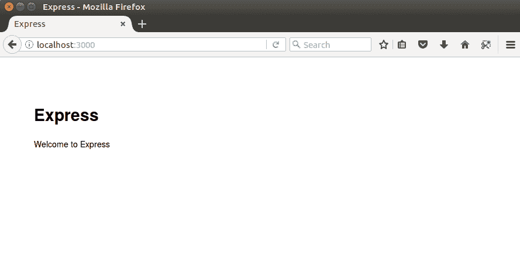
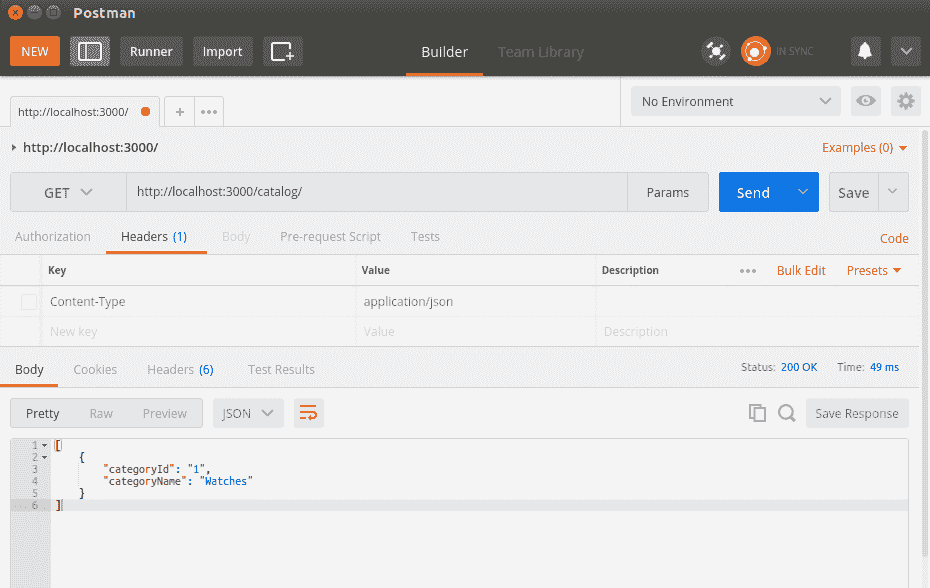
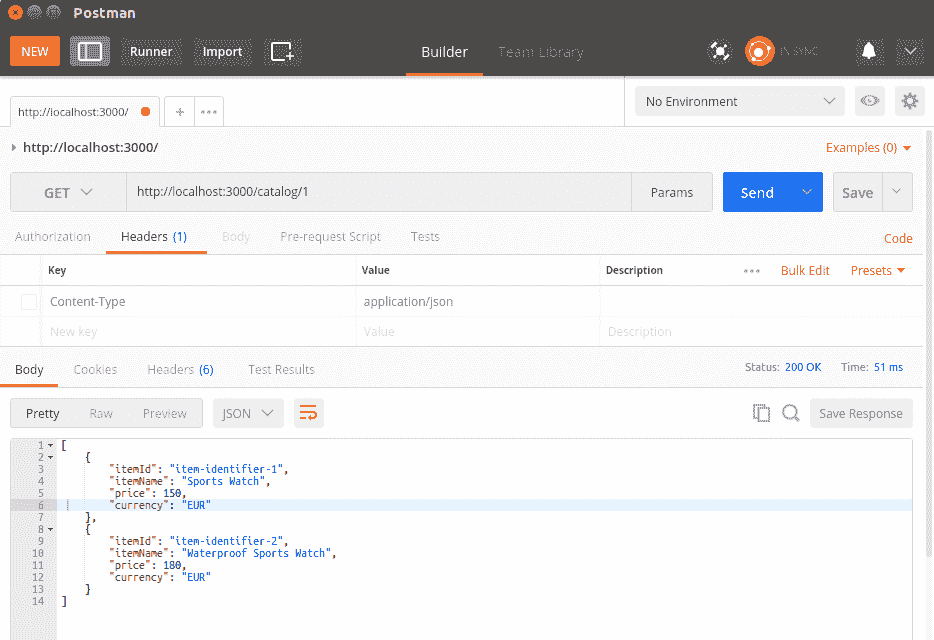
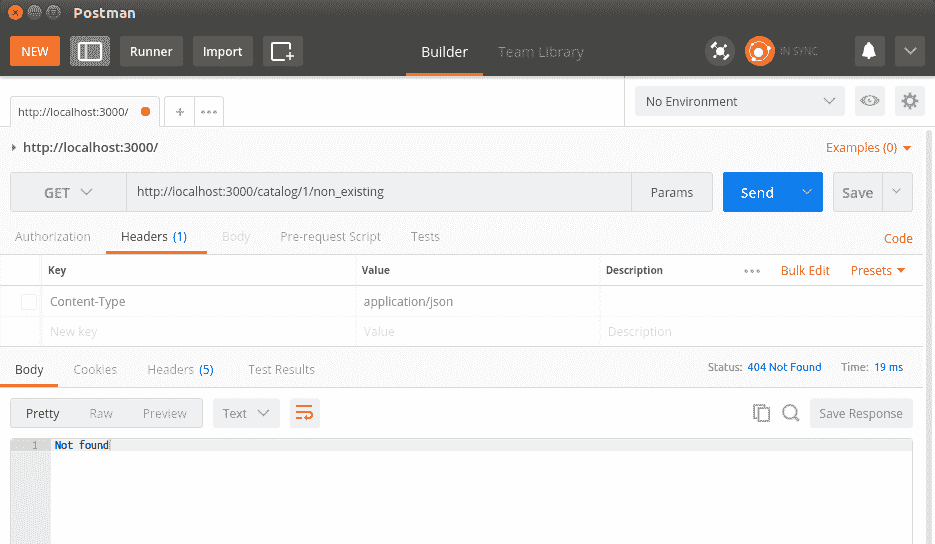

# 构建典型的 Web API

我们的第一版 API 将是一个只读版本，并且不会支持创建或更新目录中的项目，就像现实世界的应用那样。相反，我们将专注于 API 定义本身，并在稍后考虑数据存储。当然，使用文件存储向数百万用户公开的数据绝对不是一种选择，因此本书稍后将为我们的应用程序提供一个数据库层，在研究了现代 NoSQL 数据库解决方案之后。

我们还将涵盖内容协商这一主题，这是一种机制，允许消费者指定请求数据的预期格式。最后，我们将探讨几种公开服务不同版本的方法，以防服务以不向后兼容的方式发展。

总结来说，在本章中，你将学习以下内容：

+   如何指定 Web API

+   如何实现路由

+   如何查询 API

+   内容协商

+   API 版本控制

在本章之后，你应该能够完全指定一个 RESTful API，并将几乎准备好开始实现实际的 Node.js RESTful 服务。

# 指定 API

一个项目通常从定义 API 将要公开的操作开始。根据 REST 原则，操作通过 HTTP 方法和 URI 来暴露。每个操作执行的动作不应与其 HTTP 方法的自然含义相矛盾。以下表格详细说明了我们 API 的操作：

| **方法** | **URI** | **描述** |
| --- | --- | --- |
| `GET` | `/category` | 获取目录中所有可用的类别。 |
| `GET` | `/category/{category-id}/` | 获取特定类别下所有可用的项目。 |
| `GET`  |  `/category/{category-id}/{item-id}`  | 通过其 ID 检索特定类别中的项目。 |
| `POST` | `/category` | 创建一个新的类别；如果它存在，则更新它。 |
| `POST`  | `/category/{category-id}/`  | 在指定的类别中创建一个新的项目。如果项目存在，则更新它。 |
| `PUT`  |  `/category/{category-id}`  | 更新类别。 |
| `PUT` | `/category/{category-id}/{item-id}` | 更新指定类别中的项目。 |
| `DELETE` | `/category/{category-id}` | 删除现有的类别。 |
| `DELETE` | `/category/{category-id}/{item-id}` | 删除指定类别中的项目。 |

第二步是选择适合我们的目录应用程序数据的适当格式。JSON 对象是 JavaScript 的原生支持。它们在应用程序的演变过程中易于扩展，并且几乎可以被任何平台消费。因此，JSON 格式似乎是我们逻辑上的选择。以下是本书中将使用的项目对象和类别对象的 JSON 表示：

```js
{ 
    "itemId": "item-identifier-1", 
    "itemName": "Sports Watch", 
    "category": "Watches", 
    "categoryId": 1,
    "price": 150, 
    "currency": "EUR"
} 

{
    "categoryName" : "Watches",
    "categoryId" : "1",
    "itemsCount" : 100,
    "items" : [{
            "itemId" : "item-identifier-1",
            "itemName":"Sports Watch",
            "price": 150,
            "currency" : "EUR"    
     }]
}
```

到目前为止，我们的 API 已经定义了一组操作和要使用的数据格式。下一步是实现一个模块，该模块将导出函数，为路由中的每个操作提供服务。

首先，让我们创建一个新的 Node.js Express 项目。选择一个存储你项目的目录，然后在你的 shell 终端中执行`express chapter3`。如果你使用的是 Windows，在生成项目之前你需要安装`express-generator`模块。`express-generator`将在所选目录中创建一个初始的 Express 项目布局。这个布局为你提供了默认的项目结构，确保你的 Express 项目遵循标准的项目结构。这使得你的项目更容易导航。

下一步是将项目导入到 Atom IDE 中。在项目标签页的任何位置右键单击，然后选择“添加项目文件夹”，然后选择 Express 为你生成的目录。

正如你所见，Express 已经为我们做了一些后台工作，并为我们的应用程序创建了一个起点：`app.js`。它还为我们创建了一个`package.json`文件。让我们看看这些文件中的每一个，从`package.json`开始：

```js
{
  "name": "chapter3",
  "version": "1.0.0",
  "description": "",
  "main": "app.js",
  "scripts": {
    "test": "test"
  },
  "author": "",
  "license": "ISC",
  "dependencies": {
 "dependencies": {
    "body-parser": "~1.13.2",
    "cookie-parser": "~1.3.5",
    "debug": "~2.2.0",
    "express": "~4.16.1",
    "jade": "~1.11.0",
    "morgan": "~1.6.1",
    "serve-favicon": "~2.3.0"

  }
}
```

由于我们创建了一个空的 Node.js Express 项目，我们最初只依赖 Express 框架，一些中间件模块如`morgan`、`body-parser`和`cookie-parser`，以及 Jade 模板语言。Jade 是一种简单的模板语言，用于在模板中生成 HTML 代码。如果你对此感兴趣，你可以在[`www.jade-lang.com`](http://www.jade-lang.com/)了解更多信息。

写作时 Express 框架的当前版本是 4.16.1；要更新它，请在`chapter3`目录中执行`npm install express@4.16.1 --save`命令。此命令将更新应用程序的依赖项到所需版本。`--save`选项将更新并保存依赖项的新版本到项目的`package.json`文件中。

当你引入新的模块依赖项时，你需要自己确保`package.json`文件保持最新，以维护应用程序依赖的模块的准确状态。

我们将在本章稍后讨论中间件模块是什么。

现在，我们将忽略`public`和`view`目录的内容，因为它们与我们当前的 RESTful 服务无关。这些目录包含可能在我们决定稍后开发基于 Web 的服务消费者时有所帮助的自动生成的样式表和模板文件。

我们已经提到，Express 项目在`app.js`中为我们的 Web 应用程序创建了一个起点。让我们更深入地看看它：

```js
var express = require('express');
var path = require('path');
var favicon = require('serve-favicon');
var logger = require('morgan');
var cookieParser = require('cookie-parser');
var bodyParser = require('body-parser');

var routes = require('./routes/index');
var users = require('./routes/users');

var app = express();

// view engine setup
app.set('views', path.join(__dirname, 'views'));
app.set('view engine', 'jade');

// uncomment after placing your favicon in /public
//app.use(favicon(path.join(__dirname, 'public', 'favicon.ico')));
app.use(logger('dev'));
app.use(bodyParser.json());
app.use(bodyParser.urlencoded({ extended: false }));
app.use(cookieParser());
app.use(express.static(path.join(__dirname, 'public')));

app.use('/', routes);
app.use('/users', users);

// catch 404 and forward to error handler
app.use(function(req, res, next) {
  var err = new Error('Not Found');
  err.status = 404;
  next(err);
});

// error handlers

// development error handler
// will print stacktrace
if (app.get('env') === 'development') {
  app.use(function(err, req, res, next) {
    res.status(err.status || 500);
    res.render('error', {
      message: err.message,
      error: err
    });
  });
}

// production error handler
// no stacktraces leaked to user
app.use(function(err, req, res, next) {
  res.status(err.status || 500);
  res.render('error', {
    message: err.message,
    error: {}
  });
});

module.exports = app;
```

显然，Express 生成器为我们做了很多工作，因为它实例化了 Express 框架，并围绕它分配了一个完整的发展环境。它做了以下几件事：

+   配置了要在我们的应用程序中使用的中间件，`body-parser`、默认的路由器以及开发环境中的错误处理中间件

+   注入了一个 morgan 中间件模块的日志实例

+   配置了 Jade 模板，因为它已被选为我们的应用程序的默认模板

+   配置了我们的 Express 应用程序将监听的默认 URI，`/`和`/users`，并为它们创建了虚拟处理函数。

为了成功启动生成的应用程序，您必须安装`app.js`中使用的所有模块。此外，在安装它们后，请确保使用`--save`选项更新您的`package.json`文件的依赖项。

Express 生成器还为您创建了一个启动脚本。它位于项目的`bin/www`目录下，如下面的代码片段所示：

```js
#!/usr/bin/env node

/**
 * Module dependencies.
 */

var app = require('../app');
var debug = require('debug')('chapter3:server');
var http = require('http');

/**
 * Get port from environment and store in Express.
 */

var port = normalizePort(process.env.PORT || '3000');
app.set('port', port);

/**
 * Create HTTP server.
 */

var server = http.createServer(app);

/**
 * Listen on provided port, on all network interfaces.
 */

server.listen(port);
server.on('error', onError);
server.on('listening', onListening);

/**
 * Normalize a port into a number, string, or false.
 */

function normalizePort(val) {
  var port = parseInt(val, 10);

  if (isNaN(port)) {
    // named pipe
    return val;
  }

  if (port >= 0) {
    // port number
    return port;
  }

  return false;
}

/**
 * Event listener for HTTP server "error" event.
 */

function onError(error) {
  if (error.syscall !== 'listen') {
    throw error;
  }

  var bind = typeof port === 'string'
    ? 'Pipe ' + port
    : 'Port ' + port;

  // handle specific listen errors with friendly messages
  switch (error.code) {
    case 'EACCES':
      console.error(bind + ' requires elevated privileges');
      process.exit(1);
      break;
    case 'EADDRINUSE':
      console.error(bind + ' is already in use');
      process.exit(1);
      break;
    default:
      throw error;
  }
}

/**
 * Event listener for HTTP server "listening" event.
 */

function onListening() {
  var addr = server.address();
  var bind = typeof addr === 'string'
    ? 'pipe ' + addr
    : 'port ' + addr.port;
  debug('Listening on ' + bind);
}
```

要启动应用程序，请执行`node bin/www`；这将执行上面的脚本并启动 Node.js 应用程序。因此，在浏览器中请求`http://localhost:3000`将导致调用默认的`GET`处理程序，它将返回一个欢迎响应：



Express 应用程序的默认欢迎消息

生成器创建了一个虚拟的`routes/users.js`；它暴露了一个与位于`/users`位置的虚拟模块相关联的路由。请求它将导致调用用户路由的`list`函数，该函数输出一个静态响应：“响应资源”。

我们的应用程序将不会使用模板语言和样式表，因此让我们删除设置应用程序配置中视图和视图引擎属性的行。此外，我们将实现自己的路由。因此，我们不需要为我们的应用程序绑定`/`和`/users` URI，也不需要`user`模块；相反，我们将利用一个`catalog`模块，并从路由：

```js
var express = require('express');
var path = require('path');
var favicon = require('serve-favicon');
var logger = require('morgan');
var cookieParser = require('cookie-parser');
var bodyParser = require('body-parser');

var routes = require('./routes/index');
var catalog = require('./routes/catalog')
var app = express();

//uncomment after placing your favicon in /public
//app.use(favicon(path.join(__dirname, 'public', 'favicon.ico')));
app.use(logger('dev'));
app.use(bodyParser.json());
app.use(bodyParser.urlencoded({ extended: false }));
app.use(cookieParser());
app.use(express.static(path.join(__dirname, 'public')));

app.use('/', routes);
app.use('/catalog', catalog);

// catch 404 and forward to error handler
app.use(function(req, res, next) {
  var err = new Error('Not Found');
  err.status = 404;
  next(err);
});

//development error handler will print stacktrace
if (app.get('env') === 'development') {
  app.use(function(err, req, res, next) {
    res.status(err.status || 500);
    res.render('error', {
      message: err.message,
      error: err
    });
  });
}

// production error handler no stacktraces leaked to user
app.use(function(err, req, res, next) {
  res.status(err.status || 500);
  res.render('error', {
    message: err.message,
    error: {}
  });
});

module.exports = app;

```

因此，经过这次清理后，我们的应用程序看起来干净多了，我们准备继续前进。

在做那之前，尽管如此，有一个术语需要进一步解释：中间件。它是在调用用户定义的处理程序之前，由`Express.js`路由层调用的链式函数的子集。中间件函数可以完全访问`request`和`response`对象，并且可以修改它们中的任何一个。中间件链总是按照定义的顺序调用，因此了解特定中间件的具体操作至关重要。一旦中间件函数完成，它将通过将其下一个参数作为函数调用，来调用链中的下一个函数。在执行完整个链之后，将调用用户定义的请求处理程序。

这里是适用于中间件链的基本规则：

+   中间件函数具有以下签名：`function (request, response, next)`。

+   中间件函数是按照它们添加到应用程序链中的顺序执行的。这意味着，如果您希望您的中间件函数在特定路由之前被调用，您需要在其声明路由之前添加它。

+   中间件函数使用它们的第三个参数`next`作为一个函数来指示它们已完成工作并退出。当链中最后一个函数的`next()`参数被调用时，链式执行完成，`request`和`response`对象达到由中间件设置的状态，并传递给定义的处理程序。

现在我们已经知道了中间件函数是什么，让我们明确一下当前使用的中间件函数为我们应用提供了什么。`body-parser`中间件是 Express 框架内置的解析器。它在中间件执行完成后解析`request`体，并填充`request`对象，即它提供了 JSON 有效负载处理。

现在是时候继续前进并实现我们的用户模块，该模块将被映射到我们的 URI 上。该模块将被命名为`modules/catalog.js`：

```js
var fs = require('fs');

function readCatalogSync() {
   var file = './data/catalog.json';
   if (fs.existsSync(file)) {
     var content = fs.readFileSync(file);
     var catalog = JSON.parse(content);
     return catalog;
   }
   return undefined;
 }

exports.findItems = function(categoryId) {
  console.log('Returning all items for categoryId: ' + categoryId);
  var catalog = readCatalogSync();
  if (catalog) {
    var items = [];
    for (var index in catalog.catalog) {
        if (catalog.catalog[index].categoryId === categoryId) {
          var category = catalog.catalog[index];
          for (var itemIndex in category.items) {
            items.push(category.items[itemIndex]);
          }
        }
    }
    return items;
  }
  return undefined;
}

exports.findItem = function(categoryId, itemId) {
  console.log('Looking for item with id' + itemId);
  var catalog = readCatalogSync();
  if (catalog) {
    for (var index in catalog.catalog) {
        if (catalog.catalog[index].categoryId === categoryId) {
          var category = catalog.catalog[index];
          for (var itemIndex in category.items) {
            if (category.items[itemIndex].itemId === itemId) {
              return category.items[itemIndex];
            }
          }
        }
    }
  }
  return undefined;
}

exports.findCategoryies = function() {
  console.log('Returning all categories');
  var catalog = readCatalogSync();
  if (catalog) {
    var categories = [];
    for (var index in catalog.catalog) {
        var category = {};
        category["categoryId"] = catalog.catalog[index].categoryId;
        category["categoryName"] = catalog.catalog[index].categoryName;

        categories.push(category);
    }
    return categories;
  }
  return [];
}
```

目录模块是围绕存储在`data`目录中的`catalog.json`文件构建的。源文件的内容是通过`readCatalogSync`函数中的文件系统模块`fs`同步读取的。文件系统模块提供了多种有用的文件系统操作，例如创建、重命名或删除文件或目录的函数；截断；链接；`chmod`函数；以及同步和异步文件访问以读取和写入数据。在我们的示例应用中，我们旨在使用最直接的方法，因此我们实现了利用文件系统模块的`readFileSync`函数读取`catalog.json`文件的函数。它在一个同步调用中返回文件的内容，作为字符串。模块中的所有其他函数都导出，可以根据不同的标准查询源文件的内容。

目录模块导出以下函数：

+   `findCategories`: 这个函数返回一个包含`catalog.json`文件中所有类别的 JSON 对象数组

+   `findItems (categoryId)`: 这个函数返回一个表示给定类别中所有项目的 JSON 对象数组

+   `findItem(categoryId, itemId)`: 这个函数返回一个表示给定类别中单个项目的 JSON 对象

现在我们已经有了三个完整的函数，让我们看看如何将它们绑定到我们的 Express 应用中。

# 实现路由

在 Node.js 术语中，路由是一个 URI 和函数之间的绑定。Express 框架提供了内置的路由支持。一个`express`对象实例包含以每个 HTTP 动词命名的函数：`get`、`post`、`put`和`delete`。它们的语法如下：`function(uri, handler);`。

它们用于将处理函数绑定到在 URI 上执行的具体 HTTP 操作。处理函数通常接受两个参数：`request`和`response`。让我们通过一个简单的`Hello route`应用来看看它：

```js
var express = require('express'); 
var app = express(); 

app.get('/hello', function(request, response){ 
  response.send('Hello route'); 
}); 

app.listen(3000); 
```

在本地主机上运行此示例并访问 `http://localhost:3000/hello` 将导致调用您的处理函数，并响应说 `Hello route`，但路由可以为您提供更多功能。它允许您定义带有参数的 URI；例如，让我们使用 `/hello/:name` 作为路由字符串。它告诉框架所使用的 URI 由两部分组成：一个静态部分（`hello`）和一个变量部分（`name` 参数）。

此外，当路由字符串和处理函数与 Express 实例的 `get` 函数定义一致时，参数集合将直接在处理函数的 `request` 参数中可用。为了演示这一点，让我们稍微修改一下之前的示例：

```js
var express = require('express'); 
var app = express(); 

app.get('/hello:name', function(request, response){ 
  response.send('Hello ' + request.params.name); 
}); 

app.listen(3000); 
```

如前述代码片段所示，我们使用冒号 (`:`) 来分隔 URI 的参数部分和静态部分。在 Express 路由中可以有多个参数；例如，`/category/:category-id/items/:item-id` 定义了一个用于显示属于某个类别的项目的路由，其中 `category-id` 和 `item-id` 是参数。

现在让我们试试。请求 `http://localhost:3000/hello/friend` 将导致以下输出：

```js
hello friend
```

这就是我们可以如何使用 Express 提供参数化 URI 的方法。这是一个很好的功能，但通常还不够。在 Web 应用程序中，我们习惯于使用 `GET` 参数提供额外的参数。

不幸的是，Express 框架在处理 `GET` 参数方面并不出色。因此，我们必须利用 `url` 模块。它是 Node.js 内置的，提供了一种使用 URL 解析的简单方法。让我们再次使用我们的 `hello` 结果，并在应用程序中用其他参数扩展它，使其在请求 `/hello` 时输出 `hello all`，当请求的 URI 是 `/hello?name=friend` 时输出 `hello friend`：

```js
var express = require('express'); 
var url = require('url'); 
var app = express(); 

app.get('/hello', function(request, response){ 
   var getParams = url.parse(request.url, true).query; 

   if (Object.keys(getParams).length == 0) {       
      response.end('Hello all');    
   } else {
      response.end('Hello ' + getParams.name); 
   }    
}); 

app.listen(3000); 
```

这里有一些值得注意的事情。我们使用了 `url` 模块的 `parse` 函数。它接受一个 URL 作为其第一个参数，并接受一个布尔值作为可选的第二个参数，该参数指定是否应该解析查询字符串。`url.parse` 函数返回一个关联对象。我们使用 `Object.keys` 与它一起使用，将关联对象中的键转换为数组，以便我们可以检查其长度。这将帮助我们检查我们的 URI 是否带有 `GET` 参数。除了以每个 HTTP 动词命名的路由函数外，还有一个名为 `all` 的函数。当使用时，它将所有 HTTP 动作路由到指定的 URI。

现在我们已经了解了在 Node.js 和 Express 环境中路由和 `GET` 参数是如何工作的，我们准备为 `catalog` 模块定义一个路由并将其绑定到我们的应用程序中。以下是在 `routes/catalog.js` 中定义的路由。

```js
var express = require('express');
var catalog = require('../modules/catalog.js')

var router = express.Router();

router.get('/', function(request, response, next) {
  var categories = catalog.findCategoryies();
  response.json(categories);
});

router.get('/:categoryId', function(request, response, next) {
  var categories = catalog.findItems(request.params.categoryId);
  if (categories === undefined) {
    response.writeHead(404, {'Content-Type' : 'text/plain'});
    response.end('Not found');
  } else {
    response.json(categories);
  }
});

router.get('/:categoryId/:itemId', function(request, response, next) {
  var item = catalog.findItem(request.params.categoryId, request.params.itemId);
  if (item === undefined) {
    response.writeHead(404, {'Content-Type' : 'text/plain'});
    response.end('Not found');
  } else {
  response.json(item);
  }
});
module.exports = router;

```

首先，从 Express 模块创建一个 `Router` 实例。以下是一个很好地描述了我们刚刚实现的路由的表格。这将在我们稍后测试我们的 API 时很有帮助：

| **HTTP 方法** | **路由** | **目录模块函数** |
| --- | --- | --- |
| `GET` | `/catalog` | `findCategories()` |
| `GET` | `/catalog/:categoryId` | `findItems(categoryId)`  |
| `GET` | `/catalog/:categoryId/:itemId` | `findItem(categoryId, itemId)`  |

# 使用测试数据查询 API

我们需要一些测试数据来测试我们的服务，因此让我们使用项目 `data` 目录下的 `catalog.json` 文件。这些数据将允许我们测试所有三个功能，但为了做到这一点，我们需要一个能够向端点发送 REST 请求的客户端。如果你还没有为测试应用程序创建 Postman 项目，现在是创建它的合适时机。

请求 `/catalog` 应返回 `test` 文件中的所有类别：



因此，请求 `/catalog/1` 应该返回包含 `Watches` 类别下所有项目的列表：



最后，请求 `http://localhost:3000/catalog/1/item-identifier-1` 将仅显示由 `item-identifier-1` 标识的项目，请求不存在的项目将导致状态码为 `404` 的响应：



# 内容协商

到目前为止，目录服务只支持 JSON 格式，因此只能与媒体类型 `application/json` 一起工作。假设我们的服务必须以不同的格式提供数据，例如，JSON 和 XML。那么，消费者需要明确定义他们需要的数据格式。在 REST 中执行内容协商的最佳方式长期以来一直是一个非常有争议的话题。

在他关于正确实现内容协商的著名讨论中，Roy Fielding 提出了以下观点：

所有重要的资源都必须有 URI。

然而，这留下了一个如何以不同数据格式公开相同资源的空白，因此 Roy 继续以下观点：

代理驱动协商更为有效，但我在 HTTP 工作组主席和我最初为 HTTP/1.1 设计的代理驱动协商之间有很大的分歧，我的原始代理驱动设计实际上被委员会埋没了。为了正确进行协商，客户端需要了解所有替代方案以及它应该用作书签的内容。

虽然人们仍然可以选择通过提供自定义 `GET` 参数来保持 URI 驱动的协商，但 REST 社区已经选择了坚持 Roy 的代理驱动协商建议。现在，自从这个论点被提出以来已经近十年，已经证明他们做出了正确的决定。代理驱动协商利用了 `Accept` HTTP 头部。

`Accept` HTTP 头指定了消费者愿意处理的资源的媒体类型。除了`Accept`头之外，消费者还可以使用`Accept-Language`和`Accept-Encoding`头指定结果应提供什么语言和编码。如果服务器无法以预期的格式提供结果，它可以选择返回默认值或使用`HTTP 406 Not acceptable`，以避免在客户端引起数据混淆错误。

Node.js HTTP `response`对象包含一个名为`format`的方法，该方法根据在`request`对象中设置的`Accept` HTTP 头执行内容协商。它使用内置的`request.accepts()`来选择适当的请求处理器。如果没有找到，服务器将调用默认处理器，并以`HTTP 406 Not acceptable`响应。让我们创建一个演示，说明如何在我们的路由之一中使用`format`方法。为此，让我们假设我们在`catalog`模块中实现了一个名为`list_groups_in_xml`的函数，该函数以 XML 格式提供组数据：

```js
app.get('/catalog', function(request, response) { 
    response.format( { 
      'text/xml' : function() { 
         response.send(catalog.findCategoiesXml()); 
      }, 
      'application/json' : function() { 
         response.json(catalog.findCategoriesJson()); 
      }, 
      'default' : function() {. 
         response.status(406).send('Not Acceptable'); 
      }    
    }); 
}); 
```

这就是您如何以清晰直接的方式实现内容协商。

# API 版本化

所有应用程序 API 的演变是一个不可避免的事实。然而，具有未知数量消费者的公共 API（如 RESTful 服务）的演变是一个敏感话题。因为消费者可能无法适当地处理修改后的数据，而且无法通知他们所有人，所以我们需要尽可能保持我们的 API 向后兼容。这样做的一种方法是为我们应用程序的不同版本使用不同的 URI。目前，我们的目录 API 可在`/catalog`处访问。

当推出新版本（例如，版本 2）的时机成熟时，我们可能需要将旧版本保留在另一个 URI 上以保持向后兼容。最佳实践是将版本号编码在 URI 中，例如`/v1/catalog`，并将`/catalog`映射到最新版本。因此，请求`/catalog`将导致重定向到`/v2/catalog`，并使用 HTTP `3xx`状态码来指示重定向到最新版本。

另一种版本化的选择是保持 API 的 URI 稳定，并依赖于指定版本的定制 HTTP 头。但这种方法在向后兼容性方面并不稳定，因为修改应用程序中请求的 URL 比修改请求中发送的头部更自然。

# 自测问题

为了获得额外的信心，请通过这一系列陈述并声明它们是正确还是错误：

1.  一个启用了 REST 的端点必须支持与 REST 原则相关的所有 HTTP 方法

1.  当内容协商失败时，由于传递给`Accept`头部的值中包含不支持的媒体类型，301 是适当的响应状态码。

1.  当使用参数化路由时，开发者可以指定参数的类型，例如，它是一个数字类型还是一个字面量类型。

# 摘要

在本章中，我们深入探讨了一些更复杂的话题。让我们总结一下我们覆盖的内容。我们首先指定了我们的 Web API 的操作，并定义操作是一个 URI 和 HTTP 动作的组合。接下来，我们实现了路由并将它们绑定到一个操作上。然后，我们使用 Postman REST 客户端请求我们路由的 URI 来请求每个操作。在内容协商部分，我们处理了`Accept` HTTP 头，以提供消费者请求的格式。最后，我们讨论了 API 版本的话题，这允许我们开发向后兼容的 API。

在本章中，我们使用传统的文件系统存储来存储我们的数据。这不适合 Web 应用程序。因此，在下一章中，我们将探讨现代、可扩展和可靠的 NoSQL 存储。
