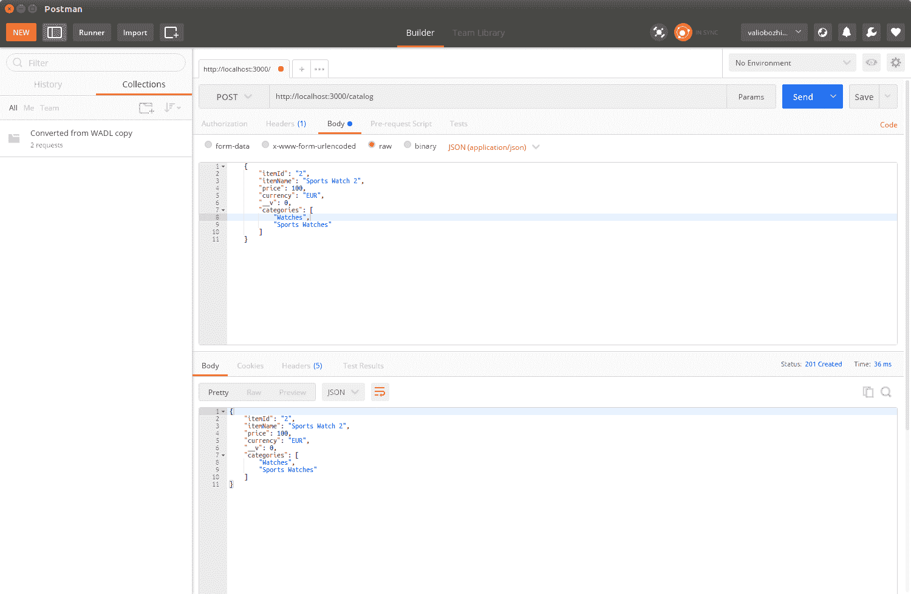

# 使用 NoSQL 数据库

在上一章中，我们实现了一个示例应用程序，它提供了一个只读服务，提供了目录数据。为了简化，我们在这种实现中引入了性能瓶颈，使用了文件存储。这种存储不适合 Web 应用程序。它依赖于 33 个物理文件，阻止我们的应用程序处理重负载，因为文件存储由于磁盘 I/O 操作而缺乏多租户支持。换句话说，我们绝对需要寻找一个更好的存储解决方案，当需要时，它可以轻松扩展，以满足我们 REST 启用应用程序的需求。现在，NoSQL 数据库在 Web 和云环境中被广泛使用，确保零停机时间和高可用性。与传统的交易性 SQL 数据库相比，它们有以下优势：

+   他们**支持模式版本**；也就是说，它们可以与对象表示一起工作，而不是根据一个或多个表的定义来填充对象状态。

+   它们是**可扩展的**，因为它们存储实际的对象。数据演变是隐式支持的，所以你只需要调用存储修改后对象的操作。

+   它们被设计成**高度分布式**和**可扩展**的。

几乎所有的现代 NoSQL 解决方案都支持集群，并且可以进一步扩展，包括你的应用程序的负载。此外，它们中的大多数都有通过 HTTP 的 REST 启用接口，这简化了在高可用性场景中使用负载均衡器的使用。传统的数据库驱动程序通常不可用于传统的客户端语言，如 JavaScript，因为它们需要本地库或驱动程序。然而，NoSQL 的想法源于使用文档数据存储。因此，它们中的大多数都支持 JSON 格式，这是 JavaScript 的本地格式。最后但同样重要的是，大多数 NoSQL 解决方案都是开源的，并且可以免费使用，提供了开源项目提供的所有好处：社区、示例和自由！

在本章中，我们将探讨 MongoDB NoSQL 数据库及其与之交互的 Mongoose 模块。我们将了解如何为数据库模型设计并实现自动化测试。最后，在本章的结尾，我们将移除文件存储瓶颈，并将我们的应用程序移动到几乎可以投入生产的状态。

# MongoDB – 文档存储数据库

MongoDB 是一个开源的文档数据库，内置了对 JSON 格式的支持。它提供了基于文档中任何可用属性的完整索引支持。由于其可扩展性功能，它非常适合高可用性场景。MongoDB 可在 [`mms.mongodb.com`](https://mms.mongodb.com/) 上使用，其管理服务为 **MongoDB 管理服务**（**MMS**）。它们利用并自动化大多数需要执行的开发操作，以保持您的云数据库处于良好状态，包括升级、进一步扩展、备份、恢复、性能和安全警报。

让我们继续前进并安装 MongoDB。Windows、Linux、macOS 和 Solaris 的安装程序可在 [`www.mongodb.org/downloads`](http://www.mongodb.org/downloads) 获取。Linux 用户可以在所有流行的发行版仓库中找到 MongoDB，而 Windows 用户可以利用一个用户友好的向导，该向导将引导您完成安装步骤，在典型安装中，您只需接受许可协议并提供安装路径即可。

安装成功后，执行以下命令以启动 MongoDB。如果您想指定数据存储的特定位置，您必须使用 `--dbpath` 参数。可选地，您可以通过 `--rest` 参数启动 MongoDB HTTP 控制台：

```js
mongod --dbpath ./data --rest
```

与 MongoDB 通信的默认端口是 `27017`，其 HTTP 控制台默认配置为使用比数据端口高 1,000 的端口。因此，控制台的默认端口将是 `28017`。HTTP 控制台提供了有关数据库的有用信息，例如日志、健康状态、可用数据库等。我强烈建议您花些时间熟悉它。控制台还可以用作数据库的 RESTful 健康检查服务，因为它提供了关于运行数据库服务和最后发生的错误的 JSON 编码信息：

```js
GET /replSetGetStatus?text=1 HTTP/1.1
Host: localhost:28017
Connection: Keep-Alive
User-Agent: RestClient-Tool

HTTP/1.0 200 OK
Content-Length: 56
Connection: close
Content-Type: text/plain;charset=utf-8

{
"ok": 0,
"errmsg": "not running with --replSet"
}
```

此 REST 接口可用于脚本或应用程序中，以自动化提供数据库引擎当前状态的更改通知等。

控制台的日志部分显示您的服务器正在成功运行（如果正在运行的话）。现在我们准备进一步了解如何将 Node.js 连接到 MongoDB。

# 使用 Mongoose 进行数据库建模

**Mongoose** 是一个模块，它以对象文档映射器（**ODM**）风格将 Node.js 连接到 MongoDB。它为存储在数据库中的文档提供了 **创建、读取、更新和删除**（也称为 **CRUD**）功能。Mongoose 使用模式定义了使用的文档的结构。模式是 Mongoose 中数据定义的最小单元。模型是由模式定义构建的。它是一个类似于构造函数的函数，可以用来创建或查询文档。文档是模型的实例，代表与存储在 MongoDB 中的文档一对一的映射。模式-模型-文档层次结构提供了一种自我描述的方式来定义对象，并允许轻松的数据验证。

让我们从使用 `npm` 安装 Mongoose 开始：

```js
npm install mongoose
```

现在我们已经安装了 Mongoose 模块，我们的第一步将是定义一个将代表目录中项目的模式：

```js
var mongoose = require('mongoose'); 
var Schema = mongoose.Schema;
var itemSchema = new Schema ({
    "itemId" : {type: String, index: {unique: true}},
    "itemName": String,
    "price": Number,
    "currency" : String,
    "categories": [String]
}); 
```

以下代码片段创建了一个项目模式的定义。定义模式是直接的，并且相当类似于 JSON 模式定义；你必须描述和属性化其类型，并可选地为每个键提供额外的属性。在目录应用程序的情况下，我们需要使用 `itemId` 作为唯一索引以避免有两个具有相同 ID 的不同项目。因此，除了将其类型定义为 `String` 之外，我们还使用 `index` 属性来描述 `itemId` 字段的值必须对每个单独的项目是唯一的。

Mongoose 引入了术语 **模型**。模型是从模式定义编译出的类似于构造函数的函数。模型的实例代表可以保存到或从数据库中读取的文档。创建模型实例是通过调用 `mongoose` 实例的 `model` 函数并传递模型应使用的模式来完成的：

```js
var CatalogItem = mongoose.model('Item', itemSchema);
```

模型还公开了用于查询和数据操作的功能。假设我们已经初始化了一个模式并创建了一个模型，将新项目存储到 MongoDB 中就像创建一个新的 `model` 实例并调用其 `save` 函数一样简单：

```js
var mongoose = require('mongoose');

mongoose.connect('mongodb://localhost/catalog');
var db = mongoose.connection;

db.on('error', console.error.bind(console, 'connection error:'));
db.once('open', function() {
  var watch = new CatalogItem({
    itemId: 9 ,
    itemName: "Sports Watch1",
    brand: 'А1',
    price: 100,
    currency: "EUR",
    categories: ["Watches", "Sports Watches"]
  });

  watch.save((error, item, affectedNo)=> {
    if (!error) {
      console.log('Item added successfully to the catalog');
    } else {
      console.log('Cannot add item to the catlog');
    }
  });
});

db.once('open', function() {
  var filter = {
    'itemName' : 'Sports Watch1',
    'price': 100
  }

  CatalogItem.find(filter, (error, result) => {
    if (error) {
      consoloe.log('Error occured');
    } else {
      console.log('Results found:'+ result.length);
      console.log(result);
    }
  });
});

```

以下是如何使用模型来查询代表属于 `Watches` 组并命名为 `Sports Watches` 的运动手表的文档：

```js
db.once('open', function() {
  var filter = {
    'itemName' : 'Sports Watch1',
    'price': 100
  }
  CatalogItem.findOne(filter, (error, result) => {
    if (error) {
      consoloe.log('Error occurred');
    } else {
      console.log(result);
    }
  });
});
```

模型还公开了一个 `findOne` 函数，这是一种方便的方式，通过其唯一索引查找对象，然后对其进行一些数据操作，即进行删除或更新操作。以下示例删除了一个项目：

```js
CatalogItem.findOne({itemId: 1 }, (error, data) => { 
  if (error) {  
    console.log(error); 
    return; 
  } else { 
    if (!data) { 
    console.log('not found'); 
      return; 
    } else { 
      data.remove(function(error){ 
        if (!error) { data.remove();} 
        else { console.log(error);} 
        }); 
      } 
    } 
 });
```

# 使用 Mocha 测试 Mongoose 模型

Mocha 是 JavaScript 最受欢迎的测试框架之一；其主要目标是提供一个简单的方式来测试异步 JavaScript 代码。让我们全局安装 Mocha，以便我们可以在未来开发的任何 Node.js 应用程序中使用它：

```js
npm install -g mocha
```

我们还需要一个可以与 Mocha 一起使用的断言库。断言库提供了验证实际值与预期值的功能，当它们不相等时，断言库将导致测试失败。`Should.js` 断言库模块易于使用，它将成为我们的选择，因此让我们也全局安装它：

```js
npm install -g should
```

现在我们已经安装了我们的测试模块，我们需要在 `package.json` 文件中指定我们的 `testcase` 文件路径。让我们通过在脚本节点中添加一个指向 Mocha 和 `testcase` 文件的 `test` 元素来修改它：

```js
{ 
"name": "chapter4", 
"version": "0.0.0", 
"private": true, 
"scripts": { 
"start": "node ./bin/www", 
"test": "mocha test/model-test.js" 
 }, 
"dependencies": { 
"body-parser": "~1.13.2", 
"cookie-parser": "~1.3.5", 
"debug": "~2.2.0", 
"express": "~4.16.0", 
"jade": "~1.11.0", 
"morgan": "~1.6.1", 
"serve-favicon": "~2.3.0" 
 } 
} 
```

这将告诉 npm 包管理器在执行 `npm` 测试时触发 Mocha。

Mongoose 测试的自动化不应受数据库当前状态的影响。为了确保每次测试运行的结果都是可预测的，我们需要确保数据库状态与我们预期的完全一致。我们将在 `test` 目录中实现一个名为 `prepare.js` 的模块。它将在每次测试运行之前清除数据库：

```js
var mongoose = require('mongoose');
beforeEach(function (done) {
  function clearDatabase() {
    for (var i in mongoose.connection.collections) {
      mongoose.connection.collections[i].remove(function() 
      {});
    }
    return done();
  }
  if (mongoose.connection.readyState === 0) {
    mongoose.connect(config.db.test, function (err) {
      if (err) {
        throw err;
      }
      return clearDatabase();
    });
  } else {
    return clearDatabase();
  }
});
afterEach(function (done) {
  mongoose.disconnect();
  return done();
});
```

接下来，我们将实现一个 Mocha 测试，该测试创建一个新项目：

```js
var mongoose = require('mongoose');
var should = require('should');
var prepare = require('./prepare');

const model = require('../model/item.js');
const CatalogItem = model.CatalogItem;

mongoose.createConnection('mongodb://localhost/catalog');

describe('CatalogItem: models', function () {
  describe('#create()', function () {
    it('Should create a new CatalogItem', function (done) {

      var item = {
        "itemId": "1",
        "itemName": "Sports Watch",
        "price": 100,
        "currency": "EUR",
        "categories": [
          "Watches",
          "Sports Watches"
        ]

      };

      CatalogItem.create(item, function (err, createdItem) {
        // Check that no error occured
        should.not.exist(err);
        // Assert that the returned item has is what we expect

        createdItem.itemId.should.equal('1');
        createdItem.itemName.should.equal('Sports Watch');
        createdItem.price.should.equal(100);
        createdItem.currency.should.equal('EUR');
        createdItem.categories[0].should.equal('Watches');
        createdItem.categories[1].should.equal('Sports Watches');
        //Notify mocha that the test has completed
        done();
      });
    });
  });
});
```

现在执行 `npm test` 将导致 MongoDB 数据库被调用，从传递的 JSON 对象中创建一个项目。插入后，断言回调将执行，确保 Mongoose 传递的值与数据库返回的值相同。试一试并破坏测试——只需在断言中更改期望值为一个无效值——你会看到测试失败。

# 在 Mongoose 模型周围创建用户定义的模型

在看到模型如何工作之后，是时候创建一个用户定义的模块，该模块封装了目录的所有 CRUD 操作。由于我们打算在一个 RESTful 网络应用程序中使用该模块，因此将模式定义和模型创建放在模块外部，并将它们作为每个模块函数的参数提供似乎是合理的。相同的模式定义在单元测试中使用，确保模块的稳定性。现在让我们为每个 CRUD 函数添加一个实现，从 `remove()` 函数开始。它根据其 `id` 查找项目，如果存在，则从数据库中删除：

```js
exports.remove = function (request, response) {
  console.log('Deleting item with id: '    + request.body.itemId);
  CatalogItem.findOne({itemId: request.params.itemId}, function(error, data) {
      if (error) {
          console.log(error);
          if (response != null) {
              response.writeHead(500, contentTypePlainText);
              response.end('Internal server error');
          }
          return;
      } else {
          if (!data) {
              console.log('Item not found');
              if (response != null) {
                  response.writeHead(404, contentTypePlainText);
                  response.end('Not Found');
              }
              return;
          } else {
              data.remove(function(error){
                  if (!error) {
                      data.remove();
                      response.json({'Status': 'Successfully deleted'});
                  }
                  else {
                      console.log(error);
                      response.writeHead(500, contentTypePlainText);
                      response.end('Internal Server Error');
                  }
              });
          }
      }
  });
}
```

`saveItem()` 函数将请求体有效负载作为参数。有效的更新请求将包含一个 `item` 对象的新状态，该对象以 JSON 格式表示。首先，从 JSON 对象中解析出 `itemId`。然后执行查找。如果存在项目，则对其进行更新。否则，创建一个新的项目：

```js
exports.saveItem = function(request, response)
{
  var item = toItem(request.body);
  item.save((error) => {
    if (!error) {
      item.save();
      response.writeHead(201, contentTypeJson);
      response.end(JSON.stringify(request.body));
    } else {
      console.log(error);
      CatalogItem.findOne({itemId : item.itemId    },
      (error, result) => {
        console.log('Check if such an item exists');
            if (error) {
                console.log(error);
                response.writeHead(500, contentTypePlainText);
                response.end('Internal Server Error');
            } else {
                if (!result) {
                    console.log('Item does not exist. Creating a new one');
                    item.save();
                    response.writeHead(201, contentTypeJson);
                    response.
                    response.end(JSON.stringify(request.body));
                } else {
                    console.log('Updating existing item');
                    result.itemId = item.itemId;
                    result.itemName = item.itemName;
                    result.price = item.price;
                    result.currency = item.currency;
                    result.categories = item.categories;
                    result.save();
                    response.json(JSON.stringify(result));
                }
           }
      });
    }
  });
};
```

`toItem()` 函数将 JSON 有效负载转换为 `CatalogItem` 模型实例，即项目文档：

```js
function toItem(body) {
    return new CatalogItem({
        itemId: body.itemId,
        itemName: body.itemName,
        price: body.price,
        currency: body.currency,
        categories: body.categories
    });
}
```

我们还需要提供一种查询数据的方法，因此让我们实现一个查询特定类别中所有项目的函数：

```js
exports.findItemsByCategory = function (category, response) {
    CatalogItem.find({categories: category}, function(error, result) {
        if (error) {
            console.error(error);
            response.writeHead(500, { 'Content-Type': 'text/plain' });
            return;
        } else {
            if (!result) {
                if (response != null) {
                    response.writeHead(404, contentTypePlainText);
                    response.end('Not Found');
                }
                return;
            }

            if (response != null){
                response.setHeader('Content-Type', 'application/json');
                response.send(result);
            }
            console.log(result);
        }
    });
}
```

与 `findItemsByCategory` 类似，以下是一个根据 ID 查找项目的函数：

```js
exports.findItemById = function (itemId, response) {
    CatalogItem.findOne({itemId: itemId}, function(error, result) {
        if (error) {
            console.error(error);
            response.writeHead(500, contentTypePlainText);
            return;
        } else {
            if (!result) {
                if (response != null) {
                    response.writeHead(404, contentTypePlainText);
                    response.end('Not Found');
                }
                return;
            }

            if (response != null){
                response.setHeader('Content-Type', 'application/json');
                response.send(result);
            }
            console.log(result);
        }
    });
}
```

最后，有一个函数可以列出存储在数据库中的所有目录项。它使用 Mongoose 模型的`find`函数来查找模型的所有文档，并使用其第一个参数作为过滤器。我们想要一个返回所有现有文档的函数；这就是为什么我们提供了一个空对象。这将返回所有可用的项目。结果在`callback`函数中可用，这是模型`find`函数的第二个参数：

```js
exports.findAllItems = function (response) {
    CatalogItem.find({}, (error, result) => {
        if (error) {
            console.error(error);
            return null;
        }
        if (result != null) {
            response.json(result);
        } else {
```

```js
      response.json({});
    }
    });
};
```

`catalog`模块将是我们的 RESTful 服务的基石。它负责所有数据操作操作，以及不同类型的查询。它以可重用的方式封装了所有操作。

# 将 NoSQL 数据库模块连接到 Express

现在我们已经有了针对模型和用户定义模块的自动化测试，这确保了模块的稳定性，并使其准备好更广泛的应用。

是时候构建一个新的基于 Express 的应用程序并添加一个路由，将新模块公开给该应用程序：

```js
const express = require('express');
const router = express.Router();

const catalog = require('../modules/catalog');
const model = require('../model/item.js');

router.get('/', function(request, response, next) {
  catalog.findAllItems(response);
});

router.get('/item/:itemId', function(request, response, next) {
  console.log(request.url + ' : querying for ' + request.params.itemId);
  catalog.findItemById(request.params.itemId, response);
});
router.get('/:categoryId', function(request, response, next) {
  console.log(request.url + ' : querying for ' + request.params.categoryId);
  catalog.findItemsByCategory(request.params.categoryId, response);
});

router.post('/', function(request, response, next) {
  console.log('Saving item using POST method);
  catalog.saveItem(request, response);
});

router.put('/', function(request, response, next) {
  console.log('Saving item using PUT method');
  catalog.saveItem(request, response);
});

router.delete('/item/:itemId', function(request, response, next) {
  console.log('Deleting item with id: request.params.itemId);
  catalog.remove(request, response);
});

module.exports = router;
```

总结一下，我们将目录数据服务模块的每个功能路由到了 RESTful 服务的操作：

+   `GET /catalog/item/:itemId`: 这将调用 `catalog.findItemById()`

+   `POST /catalog`: 这将调用 `catalog.saveItem()`

+   `PUT /catalog`: 这将调用 `catalog.saveItem()`

+   `DELETE / catalog/item/:id`: 这将调用 `catalog.remove()`

+   `GET /catalog/:category`: 这将调用 `catalog.findItemsByCategory()`

+   `GET /catalog/`: 这将调用 `catalog.findAllItems()`

由于我们已经公开了我们的操作，我们现在可以执行一些更严肃的 REST 测试。让我们启动 Postman 并测试新公开的端点：



花些时间彻底测试每个操作。这将帮助你建立信心，确保目录数据服务模块确实有效，同时也会让你更熟悉 HTTP 响应的提供和读取方式。作为一个 RESTful API 开发者，你应该能够流畅地阅读 HTTP 转储，这些转储显示了不同的请求负载和状态码。

# 自我测试问题

请回答以下问题：

+   你会如何使用 Mongoose 对多值属性的单一值执行查询？

+   定义一个测试 Node.js 模块操作 NoSQL 数据库的策略。

# 摘要

在本章中，我们探讨了 MongoDB，一个强大的面向文档的数据库。我们使用了它，并利用 Mocha 实现了数据库层的自动化测试。现在是时候构建一个完整的 RESTful Web 服务了。在下一章中，我们将通过包括通过文档属性进行搜索的支持来扩展用户定义的模块，并添加过滤和分页功能，这将最终演变成完整的 RESTful 服务实现。
