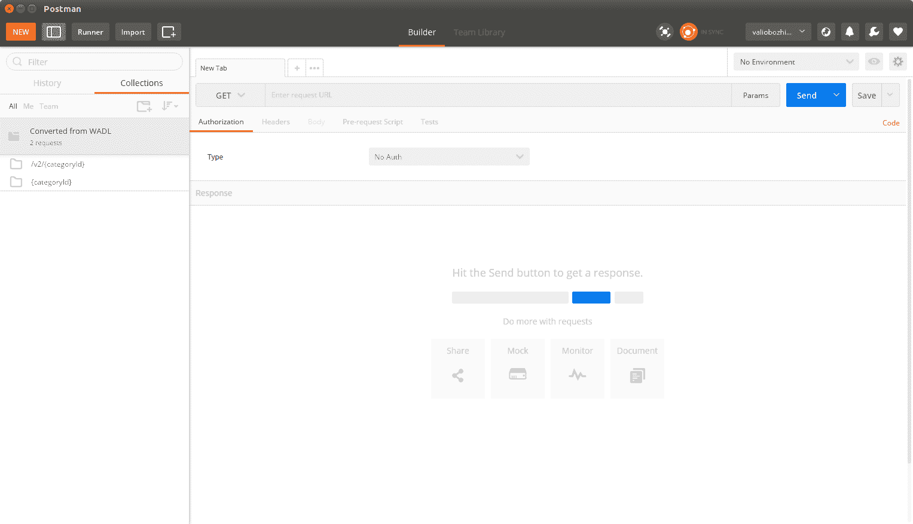
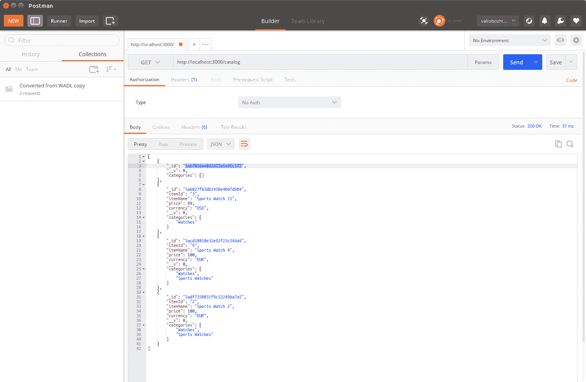

# Restful API 设计指南

在上一章中，我们实现了一个目录模块，该模块公开了目录应用程序中项目的数据操作功能。这些函数使用`express.js`的**请求**对象解析请求体中的数据，然后执行适当的数据库操作。每个函数根据需要使用相关状态码和响应体有效载荷填充**响应**对象。最后，我们将每个函数绑定到一个路由，接受 HTTP 请求。

现在，是时候更深入地研究路由的 URL 和每个操作返回的 HTTP 状态码了。

在本章中，我们将涵盖以下主题：

+   端点 URL 和 HTTP 状态码最佳实践

+   可扩展性和版本控制

+   链接数据

# 端点 URL 和 HTTP 状态码最佳实践

每个 RESTful API 操作都是对 URL 发起的 HTTP 请求和适当的 HTTP 方法的组合。

当执行操作时，每个操作将返回一个状态码，指示调用是否成功。成功的调用通过 HTTP 2XX 状态码表示，而未正确执行的调用则通过错误状态码表示——如果错误在客户端，则为 4XX，如果服务器无法处理有效请求，则为 5xx。

拥有一个明确指定的 API 对于其采用至关重要。此类规范不仅应完全列出每个操作的状态码，还应指定预期的数据格式，即其支持的媒体类型。

以下表格定义了 Express.js Router 将如何公开 API 操作，并应作为其参考规范：

| 方法 | URI | 媒体类型 | 描述 | 状态码 |
| --- | --- | --- | --- | --- |
| GET | /catalog | application/json | 返回目录中的所有项目。 | 200 OK500 内部服务器错误 |
| GET | /catalog/{categoryId} | application/json | 返回所选类别的所有项目。如果该类别不存在，则返回 404。 | 200 OK,404 NOT FOUND500 内部服务器错误 |
| GET | /item/{itemId} | application/json | 返回所选 itemId 的单个项目。如果没有这样的项目，则返回 404。 | 200 OK,404 NOT FOUND500 内部服务器错误 |
| POST | /item/ | application/json | 创建新项目；如果存在具有相同标识符的项目，则将其更新。当创建项目时，返回一个**Location**头。它提供了可以访问新创建项目的 URL。 | 201 已创建 200 OK500 内部服务器错误 |
| PUT | /item/{itemId} | application/json | 更新现有项目；如果提供的标识符不存在，则创建它。当创建项目时，返回一个**Location**头。它提供了可以访问新创建项目的 URL。 | 201 已创建 200 OK500 内部服务器错误 |
| DELETE | /item/{itemId} | application/json | 删除现有项目；如果提供的标识符的项目不存在，则返回 404。 | 200 OK, 404 NOT FOUND, 500 Internal Server Error |

目录应用程序处理两种类型的实体：项目和类别。每个项目实体包含一个属于它的类别集合。正如您所看到的，类别在我们的应用程序中只是一个逻辑实体；只要至少有一个项目引用它，它就会存在，当没有项目引用它时，它将不再存在。这就是为什么应用程序只为类型为项目的资源暴露数据操作路由，而类别的操作更多或更少是只读的。更仔细地查看暴露项目数据操作 URL，我们可以看到与 REST 基本原理相一致的一个清晰模式——一个资源通过单个 URL 暴露，并且它支持由请求的 HTTP 方法确定的资源操作。总的来说，以下是良好定义的 API 应遵循的通常接受的规则。它们与每个资源操作在语义上是相关的：

+   当创建一个**新**资源时，服务使用**201 已创建**状态码，后跟一个位置头，指定新创建的资源可以访问的 URL。

+   创建资源的操作可以实施以优雅地拒绝创建已使用唯一标识符的资源；在这种情况下，操作应使用适当的**409 冲突**状态码或更通用的**400 错误请求**来指示非成功调用。然而，通用状态码始终应后跟一个有意义的错误解释。在我们的实现中，我们选择了一种不同的方法——如果存在，我们从创建操作更新资源，并通过返回**200 OK**状态码而不是**201 已创建**来通知调用者资源已被更新。

+   **更新**操作类似于创建操作；然而，它始终期望一个资源标识符作为参数，如果具有此标识符的资源存在，它将使用 HTTP PUT 请求正文中提供的新状态更新。**200 OK**状态码表示成功调用。实现可能决定使用**404 Not Found**状态码拒绝处理不存在的资源，或者使用传递的标识符创建新资源。在这种情况下，它将返回**201 已创建**状态码，后跟一个位置头，指定新创建的资源可以访问的 URL。我们的 API 使用第二种选项。

+   虽然**删除**可以通过**204 No Content**状态和进一步的负载来表示，但大多数用户代理会期望**2xx** HTTP 状态后面跟着一个体。因此，为了与大多数代理保持兼容，我们的 API 将使用**200 OK**状态码来表示成功的删除，后面跟着一个 JSON 负载：`{'Status': 'Successfully deleted'}`。状态码**404 Not found**将表示提供的标识符不存在。

+   根据一般规则，**5XX**不应表示应用程序状态错误，而应表示更严重的错误，例如应用程序服务器或数据库故障。

+   最佳实践是`update`和`create`操作应返回资源的整个状态作为有效载荷。例如，如果一个资源使用最小属性集创建，所有未指定的属性将获得默认值；响应体应包含对象的完整状态。对于更新也是如此；即使更新操作只部分更新资源状态，响应也应返回完整状态。这可能会在用户代理需要检查新状态时节省额外的 GET 请求。

现在我们已经定义了一些关于操作应该如何表现的一般性建议，现在是时候在 API 的新版本中实现它们了。

# 发现和探索 RESTful 服务

发现 RESTful 服务的话题有一个漫长而复杂的历史。HTTP 规范指出，资源应该是自描述的，并且应该由 URI 唯一标识。依赖资源应通过使用它们自己的唯一 URI 来链接依赖关系。发现 RESTful 服务意味着从一个服务导航到另一个服务，遵循它提供的链接。

在 2009 年，一个名为**Web Application Discovery Language**（WADL）的规范被发明出来。它的目的是记录从 Web 应用程序暴露的每个 URI，以及它支持的 HTTP 方法和它期望的参数。URI 的响应媒体类型也被描述。这对于文档目的非常有用，这就是 WADL 文件在 RESTful 服务提供方面能为我们提供的一切。

不幸的是，目前还没有 Node.js 模块可以自动为给定的 express 路由生成 WADL 文件。我们将不得不手动创建一个 WADL 文件来演示它是如何被其他客户端用于发现的。

下面的列表显示了一个示例 WADL 文件，描述了在`/catalog`、`/catalog/v2/{categoryId}`可用的资源：

```js
<?xml version="1.0" encoding="UTF-8"?>
<application   >
   <grammer>
      <include href="items.xsd" />
      <include href="error.xsd" />
   </grammer>
   <resources base="http://localhost:8080/catalog/">
      <resource path="{categoryId}">
         <method name="GET">
            <request>
               <param name="category" type="xsd:string" style="template" />
            </request>
            <response status="200">
               <representation mediaType="application/xml" element="service:item" />
               <representation mediaType="application/json" />
            </response>
            <response status="404">
               <representation mediaType="text/plain" element="service:item" />
            </response>
         </method>
      </resource>
      <resource path="/v2/{categoryId}">
         <method name="GET">
            <request>
               <param name="category" type="xsd:string" style="template" />
            </request>
            <response status="200">
               <representation mediaType="application/xml" element="service:item" />
               <representation mediaType="application/json" />
            </response>
            <response status="404">
               <representation mediaType="text/plain" element="service:item" />
            </response>
         </method>
      </resource>
   </resources>
</application>
```

如您所见，WADL 格式非常简单直接。它基本上描述了每个资源的 URI，提供了它使用的媒体类型和在该 URI 上预期的状态码信息。许多第三方 RESTful 客户端理解 WADL 语言，并可以从给定的 WADL 文件中生成请求消息。

让我们在 Postman 中导入 WADL 文件。点击导入按钮，并选择您的 WADL 文件：



在 Postman 中导入 WADL 文件以获取服务的存根。这是 Postman 的屏幕截图。这里的个人设置并不重要。图片的目的只是展示窗口的外观。

如您所见，导入 WADL 文件的结果是我们有一个项目可以及时测试 REST 服务的各个方面。WADL 文件中定义的所有路由现在都方便地作为右侧菜单上的单独请求实体可用。不仅如此；除了 WADL 标准，目前 Swagger 文档格式被广泛采用，并已成为描述 RESTful 服务的非正式标准，因此我们也可以用它来简化服务的采用和发现。在下一章中，我们将将这些描述文件绑定到我们的服务上。这是生产准备阶段的一个重要步骤。

# 可扩展性和版本控制

我们已经在 第十三章 中定义了一些基本的版本控制规则，*构建典型的 Web API*。现在让我们将这些规则应用到我们在上一章中实现的 MongoDB 数据库感知模块中。我们的起点将是使当前 API 的消费者能够继续在新的 URL 上使用相同的版本。这将保持向后兼容，直到他们成功采用并测试新版本。

保持 REST API 的稳定性不仅仅是将一个端点从一个 URI 移动到另一个 URI。执行重定向然后有一个行为不同的 API 是没有意义的。因此，我们需要确保移动的端点的行为保持不变。为了确保我们不改变之前实现的行为，让我们将当前的行为从 `catalog.js` 模块移动到一个新的模块，通过将文件重命名为 `catalogV1.js`。然后，将其复制到 `catalogV2.js` 模块，在那里我们将引入所有新的功能；但在做之前，我们必须将版本 1 从 `/`, `/{categoryId}`, `/{itemId}` 重定向到 `/v1`, `/v1/{categoryId}`, `/v1/{itemId}`：

```js
const express = require('express');
const router = express.Router();

const catalogV1 = require('../modules/catalogV1');
const model = require('../model/item.js');

router.get('/v1/', function(request, response, next) {
  catalogV1.findAllItems(response);
});

router.get('/v1/item/:itemId', function(request, response, next) {
  console.log(request.url + ' : querying for ' + request.params.itemId);
  catalogV1.findItemById(request.params.itemId, response);
});

router.get('/v1/:categoryId', function(request, response, next) {
  console.log(request.url + ' : querying for ' + request.params.categoryId);
  catalogV1.findItemsByCategory(request.params.categoryId, response);
});

router.post('/v1/', function(request, response, next) {
  catalogV1.saveItem(request, response);
});

router.put('/v1/', function(request, response, next) {
  catalogV1.saveItem(request, response);
});

router.delete('/v1/item/:itemId', function(request, response, next) {
  catalogV1.remove(request, response);
});

router.get('/', function(request, response) {
  console.log('Redirecting to v1');
  response.writeHead(301, {'Location' : '/catalog/v1/'});
  response.end('Version 1 is moved to /catalog/v1/: ');
});

module.exports = router;
```

由于我们的 API 的版本 2 尚未实现，对 `/` 的 `GET` 请求将导致收到 `301 永久移动` HTTP 状态，然后重定向到 `/v1/`。这将通知我们的消费者 API 正在演变，他们很快需要决定是否通过显式请求其新 URI 继续使用版本 1，或者为采用版本 2 做准备。

尝试一下！启动修改后的节点应用程序，并从 Postman 发送一个 GET 请求到 `http://localhost:3000/catalog`：



您将看到您的请求被重定向到新的路由位置 `http://localhost:3000/catalog/v1`。

现在我们已经完成了目录的版本 1，是时候考虑在版本 2 中添加的进一步扩展了。目前，目录服务支持列出类别中的所有项目以及通过其 ID 获取项目。现在是时候充分利用文档数据库 MongoDB 并实现一个函数，使我们的 API 消费者能够根据其任何属性查询项目。例如，列出具有与查询参数（如价格或颜色）匹配的属性的特定类别的所有项目，或按项目名称搜索。RESTful 服务通常公开面向文档的数据。然而，它们的用途不仅限于文档。在下一章中，我们将以这种方式扩展目录，使其也能够存储与每个项目链接的二进制数据——一张图片。为此，我们将在第十六章的*处理任意数据*部分使用 MongoDB 的二进制格式**Binary JSON**（**BSON**）。

回到搜索扩展，我们已经使用了`Mongoose.js`模型的`find()`和`findOne()`函数。到目前为止，我们使用它们在 JavaScript 代码中以静态方式提供要搜索的文档属性的名称。然而，`find()`的此过滤参数只是一个 JSON 对象，其中键是文档属性，值是用于查询的属性值。这是我们将在版本 2 中添加的第一个新函数。它通过任意属性及其值查询 MongoDB：

```js
exports.findItemsByAttribute = function (key, value, response) {
      var filter = {};
      filter[key] = value;
      CatalogItem.find(filter, function(error, result) {
          if (error) {
              console.error(error);
              response.writeHead(500, contentTypePlainText);
              response.end('Internal server error');
              return;
          } else {
              if (!result) {
                  if (response != null) {
                     response.writeHead(200, contentTypeJson);
                     response.end({});
                  }
                  return;
              }
              if (response != null){
                  response.setHeader('Content-Type', 'application/json');
                  response.send(result);
              }
```

```js
          }
      });
    }
```

此函数使用提供的属性和值作为参数在模型上调用 find。我们将此函数绑定到路由器的`/v2/item/` GET 处理器。

最后，我们的目标是实现`/v2/item/?currency=USD`，它只返回以美元货币出售的项目的记录，正如传递的 GET 参数的值所指示的。这样，如果我们修改模型以添加额外的属性，例如颜色和大小，我们就可以查询具有相同颜色或任何其他属性的所有项目。

当查询字符串中没有提供参数时，我们将保持返回所有可用项目的旧行为，但我们将解析第一个提供的`GET`参数并将其用作`findItemsByAttribute()`函数中的过滤器：

```js
router.get('/v2/items', function(request, response) {
    var getParams = url.parse(request.url, true).query;
    if (Object.keys(getParams).length == 0) {
      catalogV2.findAllItems(response);
    } else {
      var key = Object.keys(getParams)[0];
      var value = getParams[key];
      catalogV2.findItemsByAttribute(key, value, response);
    }
});
```

在此函数中，最有趣的部分可能是 URL 解析。如您所见，我们继续使用相同的老策略来检查是否提供了任何`GET`参数。我们解析 URL 以获取查询字符串，然后使用内置的`Object.keys`函数检查解析后的键/值列表是否包含元素。如果包含，我们取第一个元素并提取其值。键和值都传递给`findByAttribute`函数。

你可能希望通过提供由多个`GET`参数提供的多个参数来进一步改进版本 2，以提供搜索支持。我将把这个留给你作为练习。

# 链接数据

每个目录应用程序都支持与该项目绑定的图片或图片集。为此，在下一章中，我们将看到如何与 MongoDB 中的二进制对象一起工作。然而，现在是决定如何将二进制数据语义链接到项目文档的时候了。以这种方式扩展模型模式，使其包含文档中二进制数据的 base64 表示，绝对不是一个好主意，因为将文本编码和二进制数据混合在一个格式中从来都不是一个好主意。这增加了应用程序的复杂性，并使其容易出错：

```js
{
  "_id": "5a4c004b0eed73835833cc9a",
  "itemId": "1",
  "itemName": "Sports Watch",
  "price": 100,
  "currency": "EUR",
  "categories": [
    "Watches",
    "Sports Watches"
  ],
  "image":" 
iVBORw0KGgoAAAANSUhEUgAAAJEAAACRCAMAAAD0BqoRAAAAGXRFWHRTb2Z0d2FyZQBBZG9iZSBJbWFnZVJlYWR5ccllPAAAAyJpVFh0WE1MOmNvbS5hZG9iZS54bXAAAAAAADw/eHBhY2tldCBiZWdpbj0i77u/IiBpZD0iVzVNME1wQ2VoaUh6cmVTek5UY3prYzlkIj8+IDx4OnhtcG1ldGEgeG1sbnM6eD0iYWRvYmU6bnM6bWV0YS8iIHg6eG1wdGs9IkFkb2JlIFhNUCBDb3JlIDUuMC1jMDYwIDYxLjEzNDc3NywgMjAxMC8wMi8xMi0xNzozMjowMCAgICAgICAgIj4gPHJkZjpSREYgeG1sbnM6cmRmPSJodHRwOi8vd3d3LnczLm9yZy8xOTk5LzAyLzIyLXJkZi1zeW50YXgtbnMjIj4gPHJkZjpEZXNuzjcmlwdGlvbiByZGY6YWJvdXQ9IiIgeG1sbnM6eG1wPSJodHRwOi8vbnMuYWRvYmUuY29tL3hhcC8xLjAvIiB4bWxuczp4bXBNTT0iaHR0cDovL25zLmFkb2JlLmNvbS94YXAvMS4wL21tLyIgeG1sbnM6c3RSZWY9Imh0dHA6Ly9ucy5hZG9iZS5jb20veGFwLzEuMC9zVHlwZS9SZXNvdXJjZVJlZiMiIHhtcDpDcmVhdG9yVG9vbD0iQWRvYmUgUGhvdG9zaG9wIENTNSBNYWNpbnRvc2giIHhtcE1NOkluc3RhbmNlSUQ9InhtcC5paWQ6MjMwNjQ1NDdFNjJCMTFERkI5QzU4OTFCMjJCQzEzM0EiIHhtcE1NOkRvY3VtZW50SUQ9InhtcC5kaWQ6MjMwNjQ1NDhFNjJCMTFERkI5QzU4OTFCMjJCQzEzM0EiPiA8eG1wTU06RGVyaXZlZEZyb20gc3RSZWY6aW5zdGFuY2VJRD0ieG1wLmlpZDoyMzA2NDU0NUU2MkIxMURGQjlDNTg5MUIyMkJDMTMzQSIgc3RSZWY6ZG9jdW1lbnRJRD0ieG1wLmRpZDoyMzA2NDU0NkU2MkIxMURGQjlDNTg5MUIyMkJDMTMzQSIvPiA8L3JkZjpEZXNjcmlwdGlvbj4gPC9yZGY6UkRGPiA8L3g6eG1wbWV0YT4gPD94cGFja2V0IGVuZD0iciI/Px5Xq1XXhWFY1+v151/b3ij5tI/GPEVP0e8U/SPAABPLjHnaJ6XvAAAAAElFTkSuQmCC 
"} 
```

想象一下，对于一个非过滤查询的结果可以有多大，如果只有几百个项目，并且所有这些项目都将图片的二进制表示作为 JSON 属性的值。为了避免这种情况，我们将为每个项目返回图片，图片的 URL 逻辑上链接到资源的 URL——`/catalog/v2/item/{itemId}/image`。

这样，如果某个项目分配了图片，它将在一个已知的位置被提供。然而，这种方法并没有在语义上将二进制项目与其对应的资源链接起来，就像在访问`/catalog/v2/item/{itemId}`时，没有任何指示表明它是否分配了图片。为了解决这个问题，让我们在项目路由的响应中使用一个自定义的 HTTP 头：

```js
GET http://localhost:3000/catalog/v2/item/1 HTTP/1.1 
Host: localhost:3000 
Connection: Keep-Alive 
User-Agent: Apache-HttpClient/4.1.1 (java 1.5) 

HTTP/1.1 200 OK 
X-Powered-By: Express 
Content-Type: application/json; charset=utf-8 
Content-Length: 152 
Image-Url: http://localhost:3000/catalog/v2/item/1/image
ETag: W/"98-2nJj2mZdLV2YDME3WYCyEwIXfuA" 
Date: Thu, 01 Feb 2018 13:50:43 GMT 
Connection: keep-alive 

{
  "_id": "5a4c004b0eed73835833cc9a",
  "itemId": "1",
  "itemName": "Sports Watch",
  "price": 100,
  "currency": "EUR",
  "__v": 0,
  "categories": [
    "Watches",
    "Sports Watches"
  ]
}
```

当响应中存在时，`Image-Url`头指示该项目绑定了一个额外的资源，并且头部的值提供了它可用的地址。使用这种方法，我们将二进制资源在语义上链接到了我们的文档中。

在下一章中，我们将实现处理与目录中项目绑定的任意项目操作的路线。

# 摘要

在本章中，我们详细讨论了如何通过 RESTful API 公开资源；我们密切关注 URL 最佳实践，并研究了 HTTP 状态码的适当使用，这些状态码表示我们操作的各种状态。

我们讨论了版本控制和可扩展性的主题，其中我们使用了`301 Moved Permanently`状态码来自动将 API 调用重定向到不同的 URL。

最后，我们找到了如何将我们的资源项目与任意二进制表示的数据进行语义链接的方法。
