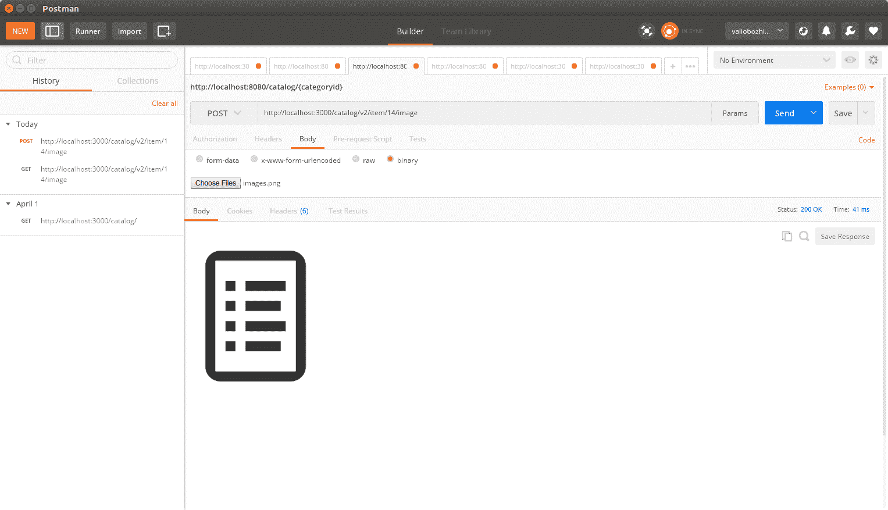
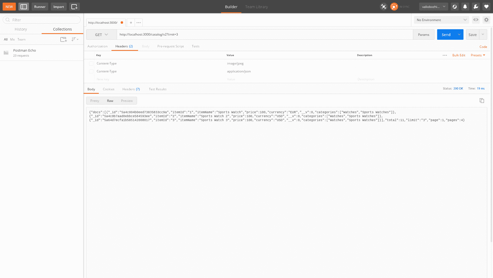
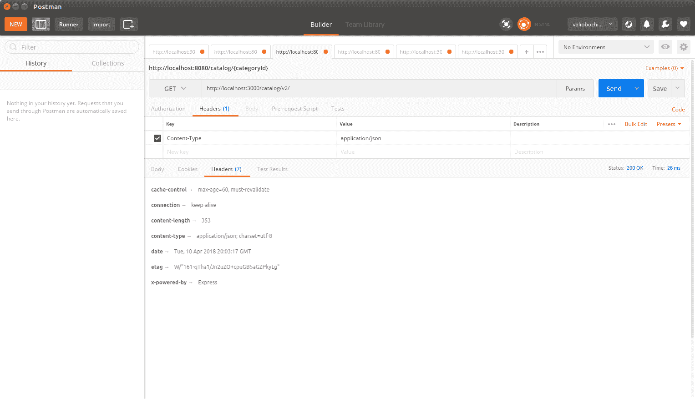

# 第十六章：实现一个完整的 RESTful 服务

到目前为止，我们已经创建了我们的 RESTful 服务的第二个版本，并且通过不同的 URL 公开了这两个版本，以确保向后兼容。我们为其数据库层实现了单元测试，并讨论了如何适当地使用 HTTP 状态码。在本章中，我们将扩展该实现——通过向服务的第二个版本提供非文档—二进制数据的处理，并将其相应地链接到相关的文档。

我们将探讨一种方便地向消费者展示大型结果集的方法。为此，我们将向我们的 API 引入分页以及进一步的过滤功能。

有时候应该考虑将缓存数据响应作为一个选项。我们将探讨其优点和缺点，并在必要时决定启用缓存。

最后，我们将深入探讨 REST 服务的发现和探索。

总结一下，以下是将目录数据服务转变为完整 RESTful 服务需要进一步实现的内容：

+   处理任意数据

+   在现实世界中处理链接数据

+   分页和过滤

+   缓存

+   发现和探索

# 处理任意数据

MongoDB 使用 BSON（二进制 JSON）作为主要的数据格式。它是一种二进制格式，在单个称为**document**的实体中存储键/值对。例如，一个示例 JSON，`{"hello":"world"}`，在 BSON 编码时变为`\x16\x00\x00\x00\x02hello\x00\x06\x00\x00\x00world\x00\x00`。

BSON 存储数据而不是字面量。例如，如果图像是文档的一部分，它不需要被转换为 base64 编码的字符串；相反，它将直接以二进制数据的形式存储，与普通的 JSON 不同，它通常将此类数据表示为 base64 编码的字节，但这显然不是最有效的方式。

Mongoose 模式允许通过模式类型—**buffer**—以 BSON 格式存储二进制内容。它可以存储高达 16 MB 的二进制内容（图像、ZIP 存档等）。相对较小的存储容量背后的原因是防止在传输过程中过度使用内存和带宽。

**GridFS**规范解决了 BSON 的限制，并允许您处理大于 16 MB 的数据。GridFS 将数据分成存储为单独文档条目的块。默认情况下，每个块的大小高达 255 KB。当从数据存储请求数据时，GridFS 驱动程序检索所有所需的块，并按组装顺序返回它们，就像它们从未被分割过一样。这种机制不仅允许存储大于 16 MB 的数据，还允许消费者以部分形式检索数据，这样就不必将其完全加载到内存中。因此，该规范隐式地启用了流式传输支持。

GridFS 实际上提供了更多功能——它支持为给定的二进制数据存储元数据，例如其格式、文件名、大小等。元数据存储在单独的文件中，可用于更复杂的查询。有一个非常实用的 Node.js 模块叫做 `gridfs-stream`。它使得在 MongoDB 中轻松进行数据流进出成为可能，就像在其他模块中一样，它作为一个 `npm` 包安装。因此，让我们全局安装它并看看它是如何使用的；我们还将使用 `-s` 选项以确保项目 `package.json` 中的依赖项得到更新：

```js
    npm install -g -s gridfs-stream
```

要创建一个 `Grid` 实例，你需要确保数据库连接已经打开：

```js
const mongoose = require('mongoose')
const Grid = require('gridfs-stream');

mongoose.connect('mongodb://localhost/catalog');
var connection = mongoose.connection;
var gfs = Grid(connection.db, mongoose.mongo);   
```

通过 `createReadStream()` 和 `createWriteStream()` 函数进行流式读写操作。每个流进数据库的数据都必须设置一个 `ObjectId` 属性。`ObjectId` 唯一地标识二进制数据条目，就像它标识 MongoDB 中的任何其他文档一样；使用这个 `ObjectId`，我们可以通过这个标识符在 MongoDB 集合中找到或删除它。

让我们通过添加获取、添加和删除分配给项目的图像的功能来扩展目录服务。为了简单起见，该服务将支持每个项目一个图像，因此将有一个单独的函数负责添加图像。每次调用它时，它都会覆盖现有的图像，因此合适的名称是 `saveImage`：

```js
exports.saveImage = function(gfs, request, response) {

    var writeStream = gfs.createWriteStream({
            filename : request.params.itemId,
            mode : 'w'
        });

        writeStream.on('error', function(error) {
            response.send('500', 'Internal Server Error');
            console.log(error);
            return;
        })

        writeStream.on('close', function() {
            readImage(gfs, request, response);
        });

    request.pipe(writeStream);
}
```

如您所见，我们只需要创建一个 GridFS 写入流实例来清除 MongoDB 中的数据。它需要一些选项，提供 MongoDB 条目的 `ObjectId` 以及一些额外的元数据，例如标题以及写入模式。然后，我们简单地调用请求的 pipe 函数。管道操作将导致将请求中的数据流到写入流中，并以这种方式安全地存储在 MongoDB 中。一旦存储，与 `writeStream` 关联的 `close` 事件就会发生，这时我们的函数会读取数据库中存储的任何内容，并在 HTTP 响应中返回该图像。

检索图像是相反的过程——创建一个带有选项的 `readStream`，`_id` 参数的值应该是任意数据的 `ObjectId`，可选的文件名和读取模式：

```js
function readImage(gfs, request, response) {

  var imageStream = gfs.createReadStream({
      filename : request.params.itemId,
      mode : 'r'
  });

  imageStream.on('error', function(error) {
    console.log(error);
    response.send('404', 'Not found');
    return;
  });

  response.setHeader('Content-Type', 'image/jpeg');
  imageStream.pipe(response);
}
```

在将读取流管道到响应之前，必须设置适当的 `Content-Type` 标头，以便将任意数据以适当的图像媒体类型（在我们的例子中是 `image/jpeg`）呈现给客户端。

最后，我们从我们的模块中导出一个函数，用于从 MongoDB 中检索图像。我们将使用该函数将其绑定到从数据库读取图像的 express 路由：

```js
exports.getImage = function(gfs, itemId, response) {
     readImage(gfs, itemId, response);
};
```

从 MongoDB 删除任意数据也是直截了当的。你必须从两个内部 MongoDB 集合中删除条目，即 `fs.files`，其中保存了所有文件，以及 `fs.files.chunks`：

```js
exports.deleteImage = function(gfs, mongodb, itemId, response) {
  console.log('Deleting image for itemId:' + itemId);

    var options = {
            filename : itemId,
    };

    var chunks = mongodb.collection('fs.files.chunks');
    chunks.remove(options, function (error, image) {
        if (error) {
            console.log(error);
            response.send('500', 'Internal Server Error');
            return;
       } else {
           console.log('Successfully deleted image for item: ' + itemId);
       }
    });

    var files = mongodb.collection('fs.files');
    files.remove(options, function (error, image) {
        if (error) {
            console.log(error);
            response.send('500', 'Internal Server Error');
            return;
        }

        if (image === null) {
            response.send('404', 'Not found');
            return;
        } else {
           console.log('Successfully deleted image for primary item: ' + itemId);
           response.json({'deleted': true});
        }
    });
}

```

让我们将新的功能绑定到适当的物品路由并测试它：

```js
router.get('/v2/item/:itemId/image',
  function(request, response){
    var gfs = Grid(model.connection.db, mongoose.mongo);
    catalogV2.getImage(gfs, request, response);
});

router.get('/item/:itemId/image',
  function(request, response){
    var gfs = Grid(model.connection.db, mongoose.mongo);
    catalogV2.getImage(gfs, request, response);
});

router.post('/v2/item/:itemId/image',
  function(request, response){
    var gfs = Grid(model.connection.db, mongoose.mongo);
    catalogV2.saveImage(gfs, request, response);
});

router.post('/item/:itemId/image',
  function(request, response){
    var gfs = Grid(model.connection.db, mongoose.mongo);
    catalogV2.saveImage(gfs, request.params.itemId, response);
});

router.put('/v2/item/:itemId/image',
  function(request, response){
    var gfs = Grid(model.connection.db, mongoose.mongo);
    catalogV2.saveImage (gfs, request.params.itemId, response);
});

router.put('/item/:itemId/image',
function(request, response){
  var gfs = Grid(model.connection.db, mongoose.mongo);
  catalogV2.saveImage(gfs, request.params.itemId, response);
});

router.delete('/v2/item/:itemId/image',
function(request, response){
  var gfs = Grid(model.connection.db, mongoose.mongo);
  catalogV2.deleteImage(gfs, model.connection,
  request.params.itemId, response);
});

router.delete('/item/:itemId/image',
function(request, response){
  var gfs = Grid(model.connection.db, mongoose.mongo);
  catalogV2.deleteImage(gfs, model.connection,  request.params.itemId, response);
});
```

由于撰写本文时，版本 2 是我们 API 的最新版本，因此它暴露的任何新功能都应在这两个位置可用：`/catalog`和`/v2/catalog`。

让我们启动 Postman 并向现有项目发送一个图像，假设我们有一个 ID 为 14 的项目`/catalog/v2/item/14/image`：



使用 Postman 向项目分配图像的 POST 请求。这是一个 Postman 的截图。这里的个别设置并不重要。图像的目的只是展示窗口的外观。

请求处理完毕后，二进制数据存储在网格数据存储中，图像在响应中返回。

# 链接

在上一章的链接数据部分，我们定义了如果目录中的项目分配了图像，这将通过名为 Image-URL 的 HTTP 头指示。

让我们修改目录的 V2 版本的`findItemById`函数。我们将使用 GridFS 现有的函数来检查是否有图像绑定到所选项目；如果有项目分配了图像，其 URL 将通过 Image-Url 头在响应中可用：

```js
exports.findItemById = function (gfs, request, response) {
    CatalogItem.findOne({itemId: request.params.itemId}, function(error, result) {
        if (error) {
            console.error(error);
            response.writeHead(500,    contentTypePlainText);
            return;
        } else {
            if (!result) {
                if (response != null) {
                    response.writeHead(404, contentTypePlainText);
                    response.end('Not Found');
                }
                return;
            }

            var options = {
                filename : result.itemId,
            };
            gfs.exist(options, function(error, found) {
                if (found) {
                    response.setHeader('Content-Type', 'application/json');
                    var imageUrl = request.protocol + '://' + request.get('host') + request.baseUrl + request.path + '/image';
                    response.setHeader('Image-Url', imageUrl);
                    response.send(result);
                } else {
                    response.json(result);
                }
            });
        }
    });
}
```

到目前为止，我们已经将一个项目链接到其图像；然而，这使我们的数据部分链接，因为有一个从项目到其图像的链接，但没有相反的链接。让我们改变这一点，并通过修改`readImage`函数向图像响应提供`Item-Url`头：

```js
function readImage(gfs, request, response) {

  var imageStream = gfs.createReadStream({
      filename : request.params.itemId,
      mode : 'r'
  });

  imageStream.on('error', function(error) {
    console.log(error);
    response.send('404', 'Not found');
    return;
  });

  var itemImageUrl = request.protocol + '://' + request.get('host') + request.baseUrl+ request.path;
  var itemUrl = itemImageUrl.substring(0, itemImageUrl.indexOf('/image'));
  response.setHeader('Content-Type', 'image/jpeg');
  response.setHeader('Item-Url', itemUrl);

  imageStream.pipe(response);
}
```

现在请求`http://localhost:3000/catalog/v2/item/3/`将返回以 JSON 格式编码的项目：

```js
GET http://localhost:3000/catalog/v2/item/3/image HTTP/1.1 
Accept-Encoding: gzip,deflate 
Host: localhost:3000 

HTTP/1.1 200 OK 
X-Powered-By: Express 
Content-Type: application/json; charset=utf-8 
Image-Url: http://localhost:3000/catalog/v2/item/3/image 
Content-Length: 137 
Date: Tue, 03 Apr 2018 19:47:41 GMT 
Connection: keep-alive 

{
   "_id": "5ab827f65d61450e40d7d984",
   "itemId": "3",
   "itemName": "Sports Watch 11",
   "price": 99,
   "currency": "USD",
   "__v": 0,
   "categories": ["Watches"]
}
```

查看响应头，我们发现`Image-Url`头部的值，`http://localhost:3000/catalog/v2/item/3/image`提供了与项目链接的图像的 URL。

请求图像结果如下：

```js
GET http://localhost:3000/catalog/v2/item/3/image HTTP/1.1 
Host: localhost:3000 
Connection: Keep-Alive 

HTTP/1.1 200 OK 
X-Powered-By: Express 
Content-Type: image/jpeg 
Item-Url: http://localhost:3000/catalog/v2/item/3 
Connection: keep-alive 
Transfer-Encoding: chunked 

<BINARY DATA>
```

这次，响应提供了与项目链接的图像的有效负载和一个特殊头**Item-Url**。其值——`http://localhost:3000/catalog/v2/item/3`——是项目资源可用的地址。现在如果项目图像出现在图像搜索结果中，与图像链接的项目 URL 也将是结果的一部分。通过这种方式，我们在不修改或损害其有效负载的情况下，在语义上链接了这两个数据。

# 实现分页和过滤

一旦部署到网络，每个服务都可供大量消费者使用。他们不仅会使用它来获取数据，还会插入新数据。在某个时刻，这不可避免地会导致数据库中存在大量数据。为了保持服务用户友好并保持合理的响应时间，我们需要注意提供合理部分的大数据，确保在请求`/catalog` URI 时不需要返回几十万个项目。

Web 数据消费者习惯于拥有各种分页和过滤功能。在本章的早期，我们实现了`findIfindItemsByAttribute()`函数，它允许通过项目的任何属性进行过滤。现在，是时候引入分页功能，以便通过 URI 参数在`resultset`中进行导航了：

`mongoose.js`模型可以利用不同的插件模块在其之上提供额外的功能。这样一个插件模块是`mongoose-paginate`。Express 框架还提供了一个名为`express-paginate`的分页中间件。它提供了与 Mongoose 结果页的即插即用链接和导航：

1.  在开始开发分页机制之前，我们应该安装这两个有用的模块：

```js
npm install -g -s express-paginate
npm install -g -s mongoose-paginate
```

1.  下一步是在我们的应用程序中创建`express-paginate`中间件的实例：

```js

expressPaginate = require('express-paginate'); 
```

1.  通过调用其`middleware()`函数在应用程序中初始化分页中间件。其参数指定每页的默认限制和最大结果限制：

```js
app.use(expressPaginate.middleware(limit, maxLimit); 
```

1.  然后，在创建模型之前，将`mongoose-pagination`实例作为插件提供给`CatalogItem`模式。以下是`item.js`模块如何导出该插件以及模型的方式：

```js
var mongoose = require('mongoose');
var mongoosePaginate = require('mongoose-paginate');
var Schema = mongoose.Schema;

mongoose.connect('mongodb://localhost/catalog');

var itemSchema = new Schema ({
    "itemId" : {type: String, index: {unique: true}},
    "itemName": String,
    "price": Number,
    "currency" : String,
    "categories": [String]
});
console.log('paginate');
itemSchema.plugin(mongoosePaginate);
var CatalogItem = mongoose.model('Item', itemSchema);

module.exports = {CatalogItem : CatalogItem, connection : mongoose.connection};
```

1.  最后，调用模型的`paginate()`函数以分页方式获取请求的条目：

```js

CatalogItem.paginate({}, {page:request.query.page, limit:request.query.limit},
    function (error, result){
        if(error) {
            console.log(error);
            response.writeHead('500',
               {'Content-Type' : 'text/plain'});
            response.end('Internal Server Error');
         } else {
           response.json(result);
         }
});
```

第一个参数是 Mongoose 应用于其查询的过滤器。第二个参数是一个对象，指定请求的页码和每页的条目数。第三个参数是一个回调处理函数，通过其参数提供结果和任何可用的错误信息：

+   `error`：这指定了查询是否成功执行

+   `result`：这是从数据库检索到的数据

`express-paginate`中间件通过丰富 Express 处理函数的`request`和`response`对象，使得在 Web 环境中无缝集成`mongoose-paginate`模块。

`request`对象获得两个新属性：`query.limit`，它告诉中间件页面上的条目数，以及`query.page`，它指定请求的页码。请注意，中间件将忽略初始化中间件时指定的`maxLimit`值更大的`query.limit`值。这防止了消费者覆盖最大限制，并让你完全控制你的应用程序。

这是目录模块第二版中`paginate`函数的实现：

```js
exports.paginate = function(model, request, response) {
    var pageSize = request.query.limit;
    var page = request.query.page;
    if (pageSize === undefined) {
        pageSize = 100;
    }
    if (page === undefined) {
        page = 1;
    }

    model.paginate({}, {page:page, limit:pageSize},
            function (error, result){
                if(error) {
                    console.log(error);
                    response.writeHead('500',
                        {'Content-Type' : 'text/plain'});
                    response.end('Internal Server Error');
                }
                else {
                    response.json(result);
                }
            });
}
```

以下是从包含 11 个项目的数据集中查询，每页限制五个项目的响应：

```js
{
  "docs": [
    {
      "_id": "5a4c004b0eed73835833cc9a",
      "itemId": "1",
      "itemName": "Sports Watch 1",
      "price": 100,
      "currency": "EUR",
      "__v": 0,
      "categories": [
        "Watches",
        "Sports Watches"
      ]
    },
    {
      "_id": "5a4c0b7aad0ebbce584593ee",
      "itemId": "2",
      "itemName": "Sports Watch 2",
      "price": 100,
      "currency": "USD",
      "__v": 0,
      "categories": [
        "Sports Watches"
      ]
    },
    {
      "_id": "5a64d7ecfa1b585142008017",
      "itemId": "3",
      "itemName": "Sports Watch 3",
      "price": 100,
      "currency": "USD",
      "__v": 0,
      "categories": [
        "Watches",
        "Sports Watches"
      ]
    },
    {
      "_id": "5a64d9a59f4dc4e34329b80f",
      "itemId": "8",
      "itemName": "Sports Watch 4",
      "price": 100,
      "currency": "EUR",
      "__v": 0,
      "categories": [
        "Watches",
        "Sports Watches"
      ]
    },
    {
      "_id": "5a64da377d25d96e44c9c273",
      "itemId": "9",
      "itemName": "Sports Watch 5",
      "price": 100,
      "currency": "USD",
      "__v": 0,
      "categories": [
        "Watches",
        "Sports Watches"
      ]
    }
  ],
  "total": 11,
  "limit": "5",
  "page": "1",
  "pages": 3
}
```

`docs`属性包含所有作为结果的一部分的项目。其大小与所选的限制值相同。`pages`属性提供总页数；在此示例中，其值为 3，因为 11 个项目分布在三个页面上，每个页面包含五个项目。`Total`属性给出了项目总数。

启用分页的最后一步是修改 `/v2/` 路由以开始使用新创建的功能：

```js
  router.get('/v2/', function(request, response) {
    var getParams = url.parse(request.url, true).query;
    if (getParams['page'] !=null) {
      catalogV2.paginate(model.CatalogItem, request, response);
    } else {
      var key = Object.keys(getParams)[0];
      var value = getParams[key];
      catalogV2.findItemsByAttribute(key, value, response);
    }
});
```

我们将为默认路由 `/catalog` 使用 HTTP `302 Found` 状态。这样，所有进入的请求都将被重定向到 `/v2/`：

```js
router.get('/', function(request, response) {
  console.log('Redirecting to v2');
  response.writeHead(302, {'Location' : '/catalog/v2/'});
  response.end('Version 2 is is available at /catalog/v2/: ');
});
```

在这里使用适当的重定向状态码对于任何 RESTful 网络服务的生命周期至关重要。返回 `302 Found`，然后进行重定向，确保 API 的消费者始终可以在该位置获得最新的版本。此外，从开发角度来看，使用重定向而不是代码重复也是一种良好的实践。

当你在两个版本之间时，你应该始终考虑使用 HTTP `301 Moved Permanently` 状态来显示前一个版本已移动的位置，以及使用 HTTP `302 Found` 状态来显示当前版本的实际 URI。

现在，回到分页，由于请求的页码和限制数字作为 `GET` 参数提供，我们不希望将其与过滤功能混淆，因此有一个显式的检查。只有在请求中提供了页码或限制 `GET` 参数时，才会使用分页。否则，将执行搜索。

最初，我们设置了最大限制为 100 个结果和默认限制为 10，因此，在尝试新的分页功能之前，请确保将比默认限制更多的项目插入到数据库中。这将使测试结果更加明显。

现在，让我们试一试。请求 `/catalog?limit=3` 将返回一个只包含两个项目的列表，如下所示：



分页启用结果。这是 Postman 的截图。这里的个别设置并不重要。图片的目的只是展示窗口的外观。

如示例所示，总页数是四页。总项目数存储在数据库中为 11。由于我们没有在请求中指定页码参数，分页隐式地返回了第一页。要导航到下一页，只需将 `&page=2` 添加到 URI 中。

还可以尝试更改 `limit` 属性，请求 `/catalog/v2?limit=4`。这将返回前四个项目，并且响应将显示总页数为三页。

# 缓存

当我们讨论 Roy Fielding 定义的 REST 原则时，我们提到缓存是一个相当敏感的话题。最终，我们的消费者在执行查询时将期望获得最新的结果。然而，从统计学的角度来看，在网络上公开的数据更有可能被读取而不是更新或删除。

因此，考虑到从服务器卸载部分负载到缓存，一些由公共 URL 暴露的资源成为数百万请求的主题是合理的。HTTP 协议允许我们在给定时间段内缓存一些响应。例如，当在短时间内接收到多个请求时，查询给定组（如 `/catalog/v2`）的目录中的所有项目，我们的服务可以利用特殊的 HTTP 头，这将强制 HTTP 服务器在定义的时间段内缓存响应。这将防止对底层数据库服务器的重复请求。

在 HTTP 服务器级别上通过特殊的响应头来实现缓存。HTTP 服务器使用 `Cache-Control` 头来指定给定响应应该被缓存多长时间。缓存需要无效化之前的时间通过其 `max-age` 属性设置，其值以秒为单位提供。当然，有一个很好的 Node.js 模块提供了用于缓存的中间件函数，称为 `express-cache-control`。

# 在 Express 应用程序中提供 `Cache-Control` 头

让我们使用 NPM 软件包管理器来安装它；再次，我们将全局安装它并使用 `-s` 选项，这将自动更新 `package.json` 文件以包含新的 `express-cache-control` 依赖项：

```js
    npm install -g -s express-cache-control
```

使用 `express-cache-control` 中间件启用缓存需要三个简单的步骤：

1.  获取模块：

```js
      CacheControl = require("express-cache-control") 
```

1.  创建 `CacheControl` 中间件的实例：

```js
 var cache = new CacheControl().middleware;
```

1.  将中间件实例绑定到你想启用缓存的路线：

```js
router.get('/v2/', cache('minutes', 1), function(request, response) {
    var getParams = url.parse(request.url, true).query;
    if (getParams['page'] !=null || getParams['limit'] != null) {
      catalogV2.paginate(model.CatalogItem, request, response);
    } else {
      var key = Object.keys(getParams)[0];
      var value = getParams[key];
      catalogV2.findItemsByAttribute(key, value, response);
    }
});
```

通常，提供许多结果条目的常见 URI 应该是缓存的主题，而不是提供具体条目数据的 URI。在我们的应用程序中，只有 `/catalog` URI 会使用缓存。`max-age` 属性必须根据你应用程序的负载来选择，以最小化不准确响应。

让我们通过在 Postman 中请求 `/catalog/v2` 来测试我们的更改：



缓存控制头指示已启用缓存。这是一张 Postman 的截图。这里的个别设置并不重要。图片的目的只是展示窗口的外观。

如预期，`express-cache-control` 中间件已经完成了它的任务——`Cache-Control` 头现在包含在响应中。`must-revalidate` 选项确保在 `max-age` 间隔过期后缓存内容被无效化。现在，如果你为特定项再次发起请求，你会看到响应没有使用 `express-cache-control` 中间件，这是因为它需要在每个单独的路由中显式提供。它不会用于相互派生的 URI。

对任何 `/v1/` 路由的 `GET` 请求的响应将不包含 `Cache-Control` 头，因为它是我们 API 的第 2 版支持的，而 `Cache-Control` 中间件仅在主目录路由 `/catalog/v2/` 或 `/catalog` 中使用。

# 摘要

恭喜！在本章中，你成功地将一个支持 REST 的端点转换成了一个完整的 RESTful 网络服务，该服务支持过滤以提高可用性，并支持分页以方便导航。该服务提供任意和 JSON 数据，并且已准备好应对高负载场景，因为它在其关键部分实现了缓存。有一点应该引起你的注意，那就是在处理任何公共 API 的新旧版本之间的重定向时，适当使用 HTTP 状态码。

在 REST 应用程序中实现适当的 HTTP 状态非常重要，因此我们使用了相当罕见的状况，例如`301 永久移动`和`302 找到`。
