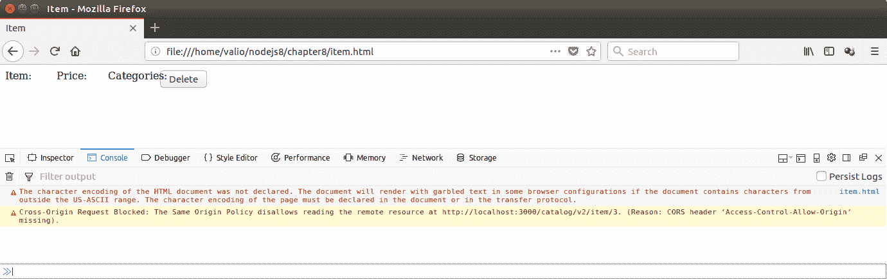
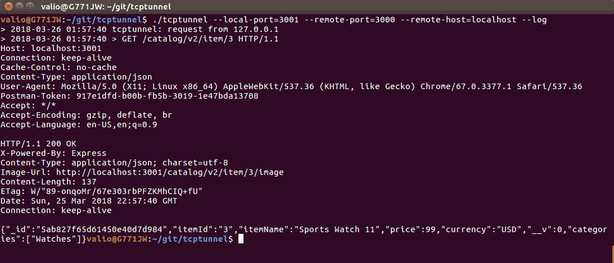
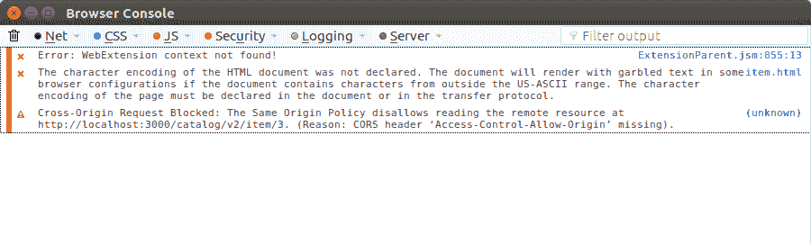
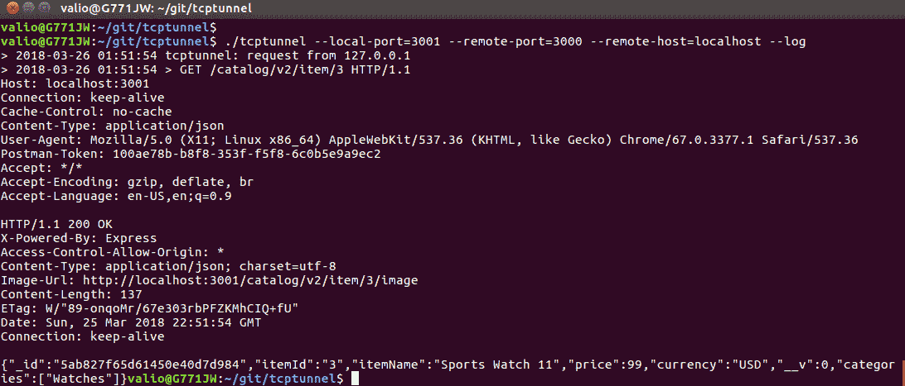

# 消费 RESTful API

为了展示与我们 API 消费相关的一些更高级的主题，我们将实现一个非常简单的网络客户端。这将帮助我们涵盖这些主题，并且可以作为目录消费者的参考实现。对于这个前端客户端，我们将使用著名的 JavaScript 库，jQuery。利用它将帮助我们涵盖以下内容：

+   使用 jQuery 消费 RESTful 服务

+   内容分发网络

+   在线故障排除和问题识别

+   跨源资源共享策略

+   处理不同 HTTP 状态码的客户端处理

# 使用 jQuery 消费 RESTful 服务

JQuery 是一个快速、轻量级且功能强大的 JavaScript 库；它通过在 DOM 三加载后直接访问 HTML 元素来消除与 DOM 相关的复杂性。要在 HTML 文档中使用 jQuery，你必须导入它：

`<script type="text/javascript" src="img/jquery-3.3.1.min.js "></script>`

假设在一个 HTML 文档的某个地方，有一个定义为`<input type="button" id="btnDelete" value="Delete"/>`的按钮。

要将函数分配给这个按钮的点击事件，使用 JQuery 意味着我们需要做以下操作：

1.  在 HTML 文档中导入 jQuery 库

1.  确保 HTML 文档的 DOM 文档已完全加载

1.  使用由 ID 属性定义的标识符访问按钮

1.  将处理函数作为参数传递给`click`事件：

```js
$(document).ready(function() {
    $('#btn').click(function () {
       alert('Clicked');
    });
});
```

`$('#identifier')`表达式提供了对 DOM 三中元素的直接访问，`$`表示一个对象被引用，括号内的值，由`#`前缀指定，指定了其标识符。jQuery 只有在整个文档加载完毕后才能访问元素；这就是为什么应该在`${document).ready()`块作用域内访问元素。

类似地，你可以通过一个标识符`txt`访问文本输入的值：

```js
  $(document).ready(function() {
    var textValue = $('#txt').val();
    });
  });
```

jQuery 中的`$(document)`对象是预定义的，代表 HTML 页面的整个 DOM 文档。以类似的方式，jQuery 预定义了一个用于 AJAX 启用通信的函数，即发送 HTTP 请求到 HTTP 端点。这个函数以**Asynchronous JavaScript + XML-** AJAX 命名，它是 JavaScript 应用程序与 HTTP 启用后端通信的事实标准。如今，**JSON**被广泛使用；然而，AJAX 的命名转换仍然用作异步通信的术语，无论数据格式如何；这就是为什么 jQuery 中的预定义函数被称为`$.ajax(options, handlers)`。

要使用`$.ajax`函数发送 HTTP 请求，通过提供端点 URL、请求的 HTTP 方法和其内容类型来调用它；结果将在回调函数中返回。以下示例显示了如何从我们的目录中请求标识符为 3 的项目：

```js
  $.ajax({
      contentType: 'application/json',
      url: 'http://localhost:3000/catalog/v2/item/3',
      type: 'GET',
      success: function (item, status, xhr) {
          if (status === 'success') {
              //the item is successfully retrieved load & display its details here
          }
      }
      ,error: function (xhr, options, error) {
        //Item was not retrieved due to an error handle it here
      }
    });
  });
```

向端点发送数据相当类似：

```js
  $.ajax({
    url: "http://localhost:3000/catalog/v2/",
    type: "POST",
    dataType: "json",
    data: JSON.stringify(newItem),
     success: function (item, status, xhr) {
       if (status === 'success') {
         //item was created successfully
       }
     },
     error: function(xhr, options, error) {
       //Error occurred while creating the iteam
     }
   });

```

简单地使用适当的选项`type`设置为 POST，并将`dateType`设置为 JSON。这将指定要发送到端点的 POST 请求是以 JSON 格式。对象的有效负载作为`data`属性的值提供。

调用`delete`方法相当类似：

```js
      $.ajax({
        contentType: 'application/json',
        url: 'http://localhost:3000/catalog/v2/item/3',
        type: 'DELETE',
        success: function (item, status, xhr) {
            if (status === 'success') {
              //handle successful deletion
            }
        }        
        ,error: function (xhr, options, error) {
            //handle errors on delete
        }
      });
```

对于本书的范围，对 jQuery 如何工作有一个基本理解就足够了。现在，让我们将这些内容粘合在一起，创建两个 HTML 页面；这样，我们将处理创建、显示和删除目录中的项，从显示项并允许其删除的页面开始。此页面使用`GET`请求从目录中加载项，然后在 HTML 页面中以类似表格的方式显示项的属性：

```js
<html>
<head><title>Item</title></head>
<body>
    <script type="text/javascript" src="img/jquery-3.3.1.min.js "></script>
  <script>
  $(document).ready(function() {
    $('#btnDelete').click(function () {
      $.ajax({
        contentType: 'application/json',
        url: 'http://localhost:3000/catalog/v2/item/3',
        type: 'DELETE',
        success: function (item, status, xhr) {
            if (status === 'success') {
              $('#item').text('Deleted');
              $('#price').text('Deleted');
              $('#categories').text('Deleted');
            }
        }
        ,error: function (xhr, options, error) {
          alert('Unable to delete item');
        }
      });
    });
    $.ajax({
      contentType: 'application/json',
      url: 'http://localhost:3000/catalog/v2/item/3',
      type: 'GET',
      success: function (item, status, xhr) {
          if (status === 'success') {
            $('#item').text(item.itemName);
            $('#price').text(item.price + ' ' + item.currency);
            $('#categories').text(item.categories);
          }
      }
      ,error: function (xhr, options, error) {
        alert('Unable to load details');
      }
    });
  });
  </script>
  <div>
    <div style="position: relative">
      <div style="float:left; width: 80px;">Item: </div>
      <div><span id="item"/>k</div>
    </div>
    <div style="position: relative">
      <div style="float:left; width: 80px;">Price: </div>
      <div><span id="price"/>jjj</div>
    </div>
    <div style="position: relative">
      <div style="float:left; width: 80px;">Categories: </div>
      <div><span id="categories"/>jjj</div>
    </div>
    <div><input type="button" id="btnDelete" value="Delete"/></div>
  </div>
</body>
</html>
```

处理创建的页面相当相似。然而，它为项目的字段提供文本输入而不是 span 标签，而在视图页面将显示加载项的属性数据。JQuery 提供了一个简化的输入控件访问模型，而不是 DOM——只需按如下方式访问输入元素：

```js
<html>
<head><title>Item</title></head>
<body>
  <script type="text/javascript" src="img/jquery-3.3.1.min.js "></script>
  <script>
  $(document).ready(function() {
    $('#btnCreate').click(function(){
      var txtItemName = $('#txtItem').val();
      var txtItemPrice = $('#txtItemPrice').val();
      var txtItemCurrency = $('#txtItemCurrency').val();
      var newItem = {
        itemId: 4,
        itemName: txtItemName,
        price: txtItemPrice,
        currency: txtItemCurrency,
        categories: [
          "Watches"
        ]
      };
      $.ajax({
        url: "http://localhost:3000/catalog/v2/",
        type: "POST",
        dataType: "json",
        data: JSON.stringify(newItem),
        success: function (item, status, xhr) {
              alert(status);
            }
      });
    })
  });
  </script>
  <div>
    <div style="position: relative">
      <div style="float:left; width: 80px;">Id: </div>
      <div><input type="text" id="id"/></div>

      <div style="float:left; width: 80px;">Item: </div>
      <div><input type="text" id="txtItem"/></div>
    </div>
    <div style="position: relative">
      <div style="float:left; width: 80px;">Price: </div>
      <div><input type="text" id="price"/></div>
    </div>
    <div style="position: relative">
      <div style="float:left; width: 80px;">Categories: </div>
      <div><input type="text" id="categories"/></div>
    </div>
    <div><input type="button" id="btnCreate" value="Create"/></div>
  </div>
</body>
</html>
```

让我们试一试，通过在浏览器中选择直接从文件系统中打开我们的静态页面来在视图页面中加载现有项。看起来我们遇到了某种问题，因为没有显示任何内容。启用浏览器开发者工具进行客户端调试也没有提供更多信息：



它表示内容部分被阻止；然而，并不清楚这是否是由于后端相关错误，或者客户端发生了某些错误。我们将在下一节中查看如何解决此类问题。

# 在线故障排除和问题识别

有时客户端和服务器之间的交互会失败，此类失败的原因通常需要分析；否则，其根本原因将保持未知。我们发现我们的客户端应用程序没有加载，因此没有显示现有项的数据。让我们通过在客户端和服务器之间设置一个`http`隧道来尝试调查其根本原因。这将是一种基于 MiM（中间人）的调查，因为我们将在一个端口上监听并将传入的请求重定向到另一个端口，以查看服务器是否返回正确的响应或其管道在中间某处被破坏。市面上有各种 TCP 隧道；我一直在使用 GitHub 上可用的简单开源隧道，网址为[`github.com/vakuum/tcptunnel`](https://github.com/vakuum/tcptunnel)。其作者还维护了一个单独的网站，您可以从那里下载适用于最常见操作系统的预构建二进制文件；它们可在[`www.vakuumverpackt.de/tcptunnel/`](http://www.vakuumverpackt.de/tcptunnel/)找到。

在您构建或下载隧道副本后，按照以下方式启动它：

`./tcptunnel --local-port=3001 --remote-port=3000 --remote-host=localhost --log`

这将启动应用程序监听端口 3001，并将每个传入请求转发到端口 3000 的位置；`--log`选项指定所有通过隧道的流量都应该在控制台中记录。最后，修改 HTML 页面以使用端口 3001 而不是 3000，然后让我们在端口`3001`上对新请求 id 为 3 的项目执行新的 GET 请求，这次是`http://localhost:3001/catalog/v2/item/3`：



令人惊讶的是，隧道显示服务器以`200 OK`和相关的有效负载正常响应。所以看起来问题不在服务器端。

好吧，既然错误显然不是在服务器端，我们就尝试深入调查客户端发生了什么。如今，所有流行的浏览器都有所谓的开发者工具。它们提供了对`http`日志、动态渲染的代码、HTML 文档的 DOM 树等的访问。让我们使用 Mozilla Firefox 调用我们的 RESTful GET 操作，看看它的 Web 控制台会记录关于我们请求的什么信息。打开 Mozilla Firefox 菜单，选择`Web 开发者`，然后选择`浏览器控制台`：



哈哈！看起来我们找到了：`跨源请求被阻止：同源策略阻止读取远程资源...`。

这个错误在客户端级别阻止了服务器端响应。在下一节中，我们将看到这实际上意味着什么。

# 跨源资源共享

跨站 HTTP 请求是指指向从请求它们的域不同的域的资源请求。在我们的情况下，我们从文件系统启动客户端，并从网络地址请求资源。这被认为是一个潜在的**跨站脚本**请求，根据[`w3.org/cors/TR/cors`](http://w3.org/cors/TR/cors)的**W3C 建议**，应该谨慎处理。这意味着如果请求外部资源，请求它的域——它的源——应该在一个头中明确指定，只要通常不允许加载外部资源。这种机制防止跨站脚本（XSS）攻击，并且基于 HTTP 头。

以下 HTTP 请求头指定了客户端如何处理外部资源：

+   `Origin`定义了请求的来源

+   `Access-Control-Request-Method`定义了请求资源所使用的 HTTP 方法

+   `Access-Control-Request-Header`定义了与外部资源请求一起允许的任何头

在服务器端，以下头指示响应是否适合 CORS 启用客户端请求：

+   `Access-Control-Allow-Origin`：此头如果存在，则指定请求者的主机被允许通过重复它，或者它可以指定所有远程源都被允许通过返回一个通配符：`*`

+   `Access-Control-Allow-Methods`：此标头指定服务器允许来自跨域的 HTTP 方法

+   `Access-Control-Allow-Headers`：此标头指定服务器允许来自跨域的 HTTP 标头

有一些其他的 `Access-Control-*` 标头，可以在根据凭据和请求的最大存活时间来决定是否提供 XSS 请求时使用，但基本上，最重要的还是用于允许的来源、允许的方法和允许的标头。

有一个节点模块可以处理服务器端的 `CORS` 配置；它通过 `npm install -g cors` 安装，并且可以通过中间件模块轻松地在我们的应用程序中启用。只需在所有公开的路由中使用它，并将其传递给应用程序：

```js
app.use(cors());
```

在启用 `cors` 中间件之后使用隧道，以查看服务器现在将优雅地处理来自不同来源的请求，通过提供设置为 '*' 的 "Access-Control-Allow-Origin" 标头：



# 内容分发网络

当我们将 jQuery 库导入到我们的客户端应用程序中时，我们直接从供应商那里引用其优化的源代码，如下所示：`<script type="text/javascript" src="img/jquery-3.3.1.min.js "/>`.

现在，假设由于某种原因，这个网站暂时或永久性地关闭；这将使我们的应用程序无法使用，因为导入将无法工作。

内容分发网络在这些情况下提供了帮助。它们作为库或其他静态媒体内容的存储库，确保即使供应商出现问题，所需资源也将可用，不会中断服务。最受欢迎的 JavaScript CDN 之一是 [`cdnjs.com/`](https://cdnjs.com/)；它提供了最常用的 JS 库。我们将把我们的客户端切换到从这个 CDN 而不是从其供应商网站 `<script type="text/javascript" src="img/jquery-3.3.1.min.js "/>` 引用 jQuery 库。

虽然直接下载您的 JS 库并将它们放置在 node.js 项目的静态目录中几乎没有什么问题，但这可能会导致您的库依赖项中直接包含本地更改和修复。这很容易导致不兼容的更改，并阻止您的应用程序轻松切换到未来的新版本。只要您的依赖项是开源的，您就应该努力通过贡献修复或报告错误来改进它们，而不是在您自己的本地分支中进行修复。尽管如此，如果您不幸遇到一个您可以轻松修复的错误，您可以将库分支以更快地解决问题。然而，始终考虑将修复贡献回社区。一旦被接受，就切换回官方版本；否则，您在下一次遇到问题时会发现自己处于困难境地，如果从分支版本报告，社区会跟踪它更加困难。这就是开源的美丽之处，这就是为什么您应该始终考虑消费 JavaScript API 的内容分发网络。它们将在您应用程序生命周期的任何时刻为您提供所需的稳定性和支持。

# 在客户端处理 HTTP 状态码

我们花了不少时间来处理 RESTful 服务应该如何优雅地表示每个状态，包括错误状态。一个定义良好的 API 应该要求其消费者优雅地处理所有错误，并为每个状态提供尽可能多的信息，而不仅仅是说“发生了错误”。这就是为什么它应该查找返回的状态码，并清楚地区分由错误的负载引起的客户端请求，例如 `400 Bad Request` 或由错误的媒体类型引起的 `415 Unsupported media types`，或者与身份验证相关的错误，例如 `401 Unauthorized`。

错误响应的状态码在 jQuery 回调函数的 `error` 回调中可用，并应用于向请求提供详细信息：

```js
 $.ajax({
        url: "http://localhost:3000/catalog/v2/",
        type: "POST",
        dataType: "json",
        data: JSON.stringify(newItem),
        success: function (item, status, jqXHR) {
            alert(status);
        },
        error: function(jqXHR, statusText, error) {
            switch(jqXHR.status) {
               case 400: alert('Bad request'); break;
               case 401: alert('Unauthroizaed'); break;
               case 404: alert('Not found'); break;
               //handle any other client errors below
               case 500: alert('Internal server error); break;
               //handle any other server errors below
            }
        }
      });
```

失败的请求由错误回调函数处理。它将 `jqXHR` ——即 `XmlHttpRequest` JavaScript*—*对象作为其第一个参数提供。它携带所有请求/响应相关信息的传递，例如状态码和头信息。使用它来确定请求的服务器返回了什么，以便您的应用程序可以更细致地处理不同的错误。

# 摘要

在本章中，我们使用 jQuery 库实现了一个简单的基于 Web 的客户端。我们利用这个客户端来演示跨源资源共享策略的工作原理，并使用中间人手段来调试线上的问题。最后，我们探讨了客户端应该如何处理错误。这一章让我们离旅程的终点更近一步，因为我们获得了我们服务的第一个消费者。在下一章中，我们将向您介绍将服务推向生产前的最后一步——选择其安全模型。
