# 模块和工具包

现在我们已经回顾了 Node.js 的新特性，并且我们知道什么是微服务，是时候看看我们可以使用哪些工具或模块来创建一个微服务了。我们将回顾几个选项，并构建一个简单或复杂的微服务，以便我们可以指出每种方法的优缺点。

我们将查看不同的模块：

+   **Seneca**：基于属性匹配的微服务工具包

+   **Hydra**：一个打包了几个模块的包，可以帮助你解决许多微服务问题，如分发和监控

# 塞涅卡

让我们看看名为 Seneca 的框架，它被设计用来帮助你开发基于消息的微服务。它有两个显著的特点：

+   **T** **ransport agnostic**：通信和消息传输与你的服务逻辑分离，并且很容易更换传输方式

+   **模式匹配**：消息是 JSON 对象，每个函数都根据对象属性暴露它们可以处理的消息类型

塞涅卡真正有趣的是它根据对象模式暴露函数的能力。让我们先安装塞涅卡：

```js
npm install seneca
```

现在，让我们忘记传输，并在同一文件中创建生成者和消费者。让我们看看一个示例：

```js
const seneca  = require("seneca");
const service = seneca();

service.add({ math: "sum" }, (msg, next) => {
    next(null, {
        sum : msg.values.reduce((total, value) => (total + value), 0)
    });
});

service.act({ math: "sum", values: [ 1, 2, 3 ] }, (err, msg) => {
    if (err) return console.error(err);

    console.log("sum = %s", msg.sum);
});
```

我们首先包含`seneca`模块并创建一个新的服务。然后我们暴露一个匹配对象，该对象具有等于`sum`的`math`属性。这意味着任何具有`math`属性且等于`sum`的请求对象都将传递给这个函数。这个函数接受两个参数。第一个，我们称之为`msg`，是请求对象。第二个参数，`next`，是函数完成或发生错误时应该调用的回调。在这种情况下，我们期望一个也具有`values`列表的对象，并且我们通过使用数组中可用的`reduce`方法来返回所有值的总和。最后，我们调用`act`，期望它消费我们的生成者。我们传递一个具有等于`sum`的`math`属性和值列表的对象。我们的生成者应该被调用并返回总和。

假设你将此代码放在`app.js`中，如果你在命令行中运行它，你应该会看到类似以下内容：

```js
$ node app
sum = 6
```

让我们尝试复制我们之前的堆栈示例。这次，我们不再在代码中使用消费者和生成者，而是使用`curl`作为消费者，就像我们之前做的那样。

首先，我们需要创建我们的`service`。正如我们之前所看到的，我们通过加载 Seneca 并创建一个实例来完成这个任务：

```js
const seneca  = require("seneca");
const service = seneca({ log: "silent" });
```

我们明确表示我们现在不关心日志记录。现在，让我们创建一个变量来保存我们的堆栈：

```js
const stack = [];
```

然后，我们创建我们的生产者。我们将创建三个：一个用于向栈中添加元素，称为`push`；一个用于从栈中移除最后一个元素，称为`pop`；一个用于查看栈，称为`get`。`push`和`pop`都将返回最终的栈结果。第三个生产者只是一个辅助函数，这样我们就可以在不执行任何操作的情况下查看栈。

要向栈中添加元素，我们定义：

```js
service.add("stack:push,value:*", (msg, next) => {
    stack.push(msg.value);

    next(null, stack);
});
```

这里有一些新内容需要查看：

+   我们将模式定义为字符串而不是对象。这个动作字符串是扩展对象定义的快捷方式。

+   我们明确指出需要一个值。

+   我们还表明我们不在乎值是什么（记住，这是模式匹配）。

我们现在定义一个更简单的函数来移除`stack`的最后一个元素：

```js
service.add("stack:pop", (msg, next) => {
    stack.pop();

    next(null, stack);
});
```

这个操作比较简单，因为我们不需要一个值，我们只是移除最后一个元素。我们不会处理栈已经为空的情况。一个空数组不会抛出异常，但在实际场景中，你可能希望得到另一个响应。

我们的第三个函数甚至更简单，我们只是返回`stack`：

```js
service.add("stack:get", (msg, next) => {
    next(null, stack);
});
```

最后，我们需要告诉我们的`service`监听消息。默认传输是 HTTP，我们只需像之前示例中那样指定端口`3000`：

```js
service.listen(3000);
```

将所有这些代码放入一个文件中并尝试运行。你可以使用 curl 或者直接在浏览器中尝试。在这种情况下，Seneca 不会区分 HTTP 动词。让我们先检查我们的`stack`。URL 描述了一个我们想要执行的操作（`/act`），查询参数被转换成我们的模式：

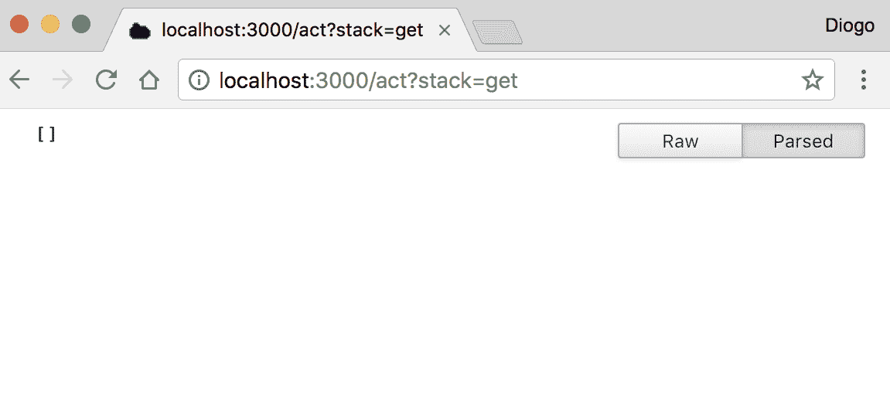

然后，我们可以尝试向我们的`stack`添加值`one`并查看最终的`stack`：

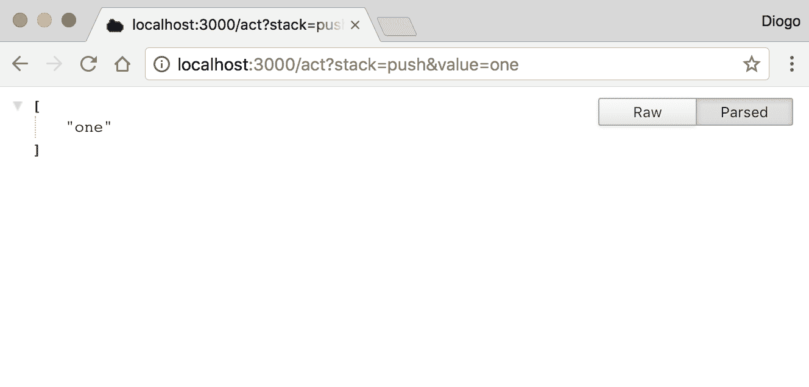

我们可以继续添加值`two`并查看`stack`的增长情况：

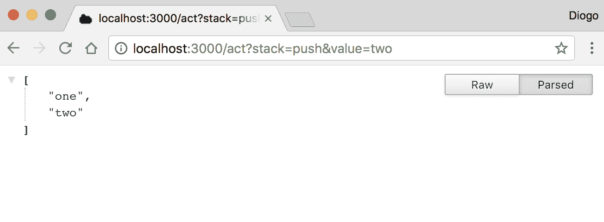

如果我们尝试移除最后一个元素，我们会看到`stack`缩小：

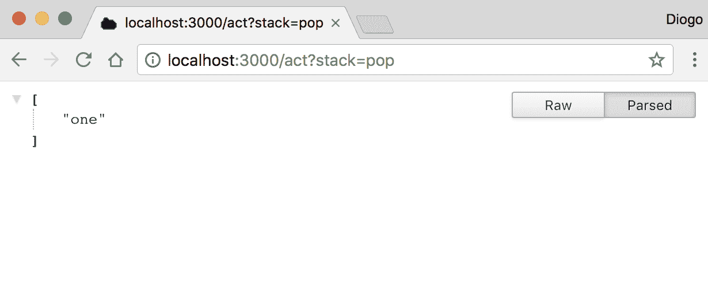

就像在 Express 中一样，Seneca 也有可以安装和使用的中间件。在这种情况下，中间件被称为插件。默认情况下，Seneca 包含了一些核心插件用于传输，包括 HTTP 和 TCP 传输都得到了支持。还有更多的传输方式可用，例如**高级消息队列协议**（**AMQP**）和 Redis。

此外，还有用于持久数据的存储插件，并且支持多种数据库服务器，包括关系型和非关系型。Seneca 提供了一个类似对象关系映射（**ORM**）的接口来管理数据实体。你可以操作实体，并在开发中使用简单的存储，然后稍后迁移到生产存储。让我们看看一个更复杂的例子：

```js
const async   = require("async");
const seneca  = require("seneca");
const service = seneca();

service.use("basic");
service.use("entity");
service.use("jsonfile-store", { folder : "data" });

const stack = service.make$("stack");

stack.load$((err) => {
    if (err) throw err;

    service.add("stack:push,value:*", (msg, next) => {
        stack.make$().save$({ value: msg.value }, (err) => {
            return next(err, { value: msg.value });
        });
    });

    service.add("stack:pop,value:*", (msg, next) => {
        stack.list$({ value: msg.value }, (err, items) => {
            async.each(items, (item, next) => {
                item.remove$(next);
            }, (err) => {
                if (err) return next(err);

                return next(err, { remove: items.length });
            });
        });
    });

    service.add("stack:get", (msg, next) => {
        stack.list$((err, items) => {
            if (err) return next(err);

            return next(null, items.map((item) => (item.value)));
        });
    });

    service.listen(3000);
});
```

只需运行这段新代码，我们就可以通过发送一些请求来测试它的行为。首先，让我们通过请求来查看我们的`stack`：

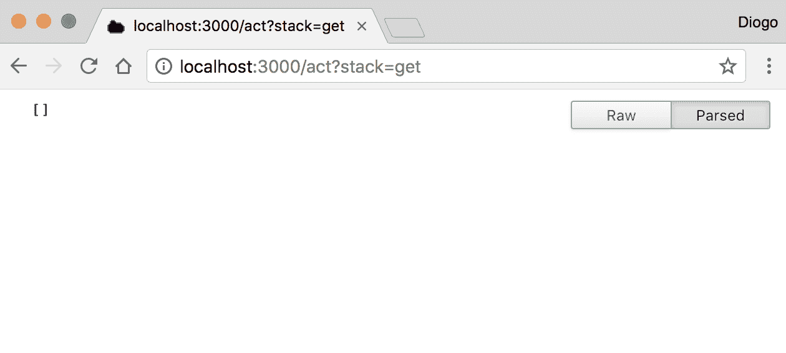

没有什么不同。现在，让我们向`stack`添加值`one`：

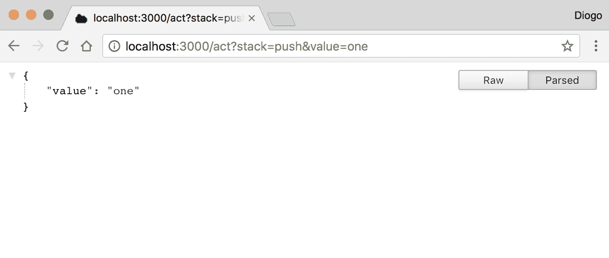

嗯，我们还没有收到最终的`堆栈`。我们可以这样做，但相反，我们更改了服务以返回刚刚添加的确切项目。这实际上是一种确认我们刚刚做了什么的不错的方法。让我们再添加一个：

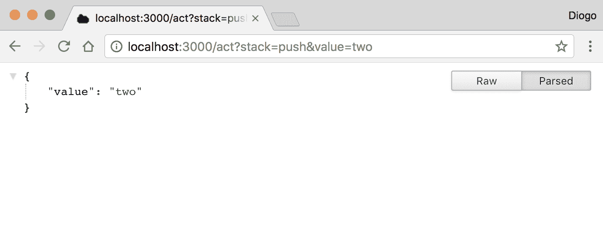

再次，它返回了我们刚刚添加的值。现在，让我们看看我们的堆栈：

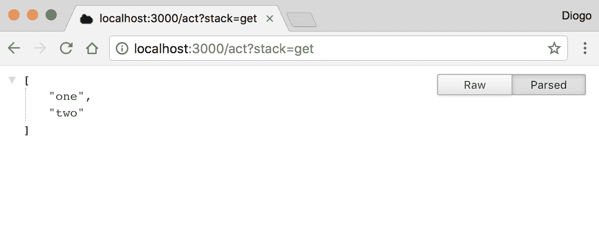

我们的`堆栈`现在有了我们的两个值。现在与之前的代码相比有一个很大的不同。我们正在使用 Seneca 提供的 *entities* API，它帮助您使用类似于 ORM 的简单抽象层或对于熟悉 Ruby 的人来说，类似于`ActiveRecord`来存储和操作数据对象。

我们的新代码，而不是仅仅弹出最后一个值，而是移除我们指定的值。所以，让我们移除值`one`而不是`two`：

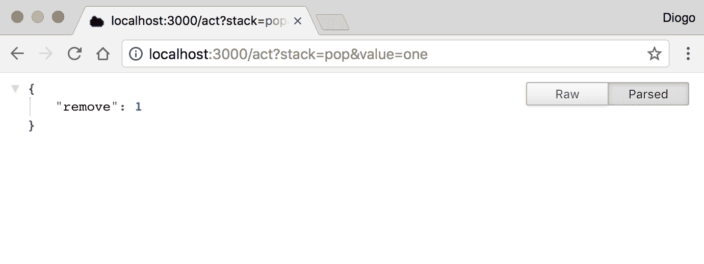

成功！我们恰好移除了一个项目。我们的代码将移除所有匹配值的`堆栈`中的项目（它没有重复检查，因此您可以有重复的项目）。让我们再次尝试移除相同的项：

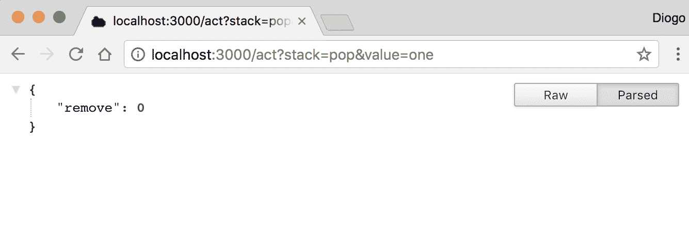

没有更多项匹配`one`，所以它没有移除任何东西。我们现在可以检查我们的`堆栈`并确认我们仍然有值`two`：

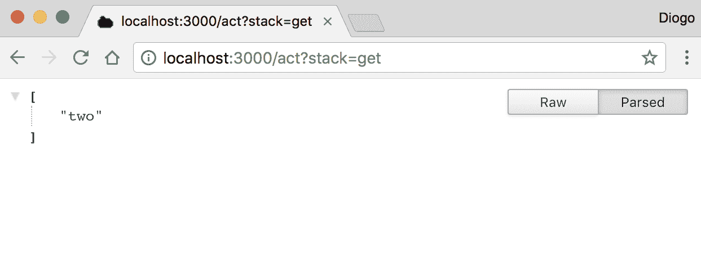

正确！而且，作为额外奖励，您可以停止和重新启动代码，而您的堆栈仍然具有值`two`。这是因为我们正在使用 JSON 文件存储插件。

当使用 Chrome 或任何其他浏览器进行测试时，请注意，有时，当您在输入时，浏览器会提前发出请求。因为我们已经测试了我们的第一个代码，它有相同的 URL 地址，浏览器可能会重复请求，您可能会得到一个包含重复值的堆栈，而不知道为什么。这就是原因。

# Hydra

让我们回到 Express。如您之前所见，它是在`http`模块之上的一个坚如磐石的层。尽管它在某种程度上原始的模块中添加了一个重要的基础层，但它仍然缺少您需要制作良好微服务的大多数功能。

由于市面上有大量的插件可以扩展 Express，因此挑选一个对我们有用的插件列表可能会有些困难。

在选择正确的列表后，您仍然需要做出其他决定：

+   我该如何使用多个实例分发我的服务？

+   服务如何被发现？

+   我该如何监控我的服务是否正常运行？

进入 Hydra，这是一个促进构建分布式微服务的框架。Hydra 利用 Express 的力量，并帮助您创建微服务或与微服务进行通信。

它将默认启用您：

+   进行服务注册和服务发现，使您的微服务能够被发现并可被发现。

+   与微服务进行通信，并在多个实例之间负载均衡通信，处理失败的实例，并自动将请求重定向到其他正在运行的实例。

+   监控实例，检查微服务是否可用且正常运行

与我们之前审查的其他模块不同，Hydra 有一个依赖项不能直接使用 NPM 安装。Hydra 使用 Redis 来实现其目标。在继续之前，请查找 Redis 网站上的信息 [`redis.io/`](https://redis.io/) 在你的操作系统上安装它。如果你有 macOS 并使用 Homebrew，输入以下命令来安装 `redis`：

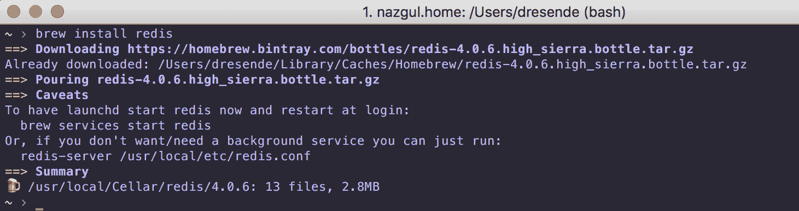

现在，让我们确保 `redis` 已成功启动：

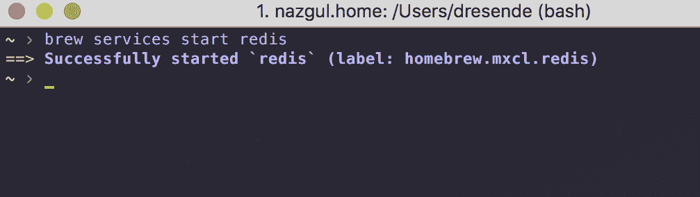

之后，我们需要安装 Hydra 命令行工具：

```js
sudo npm install -g yo generator-fwsp-hydra hydra-cli
```

现在我们需要配置与 Redis 的连接。我们通过创建一个配置文件来完成这个操作。输入命令并遵循指示。如果你是在本地安装的（或使用了前面的指示），你应该回答类似于以下截图的内容：

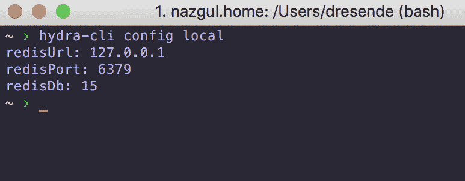

现在，让我们创建一个非常简单的微服务，只是为了看看工作流程是什么样的。Hydra 使用 `yeoman` 工具进行脚手架搭建。要创建一个服务，输入以下命令并遵循指示：

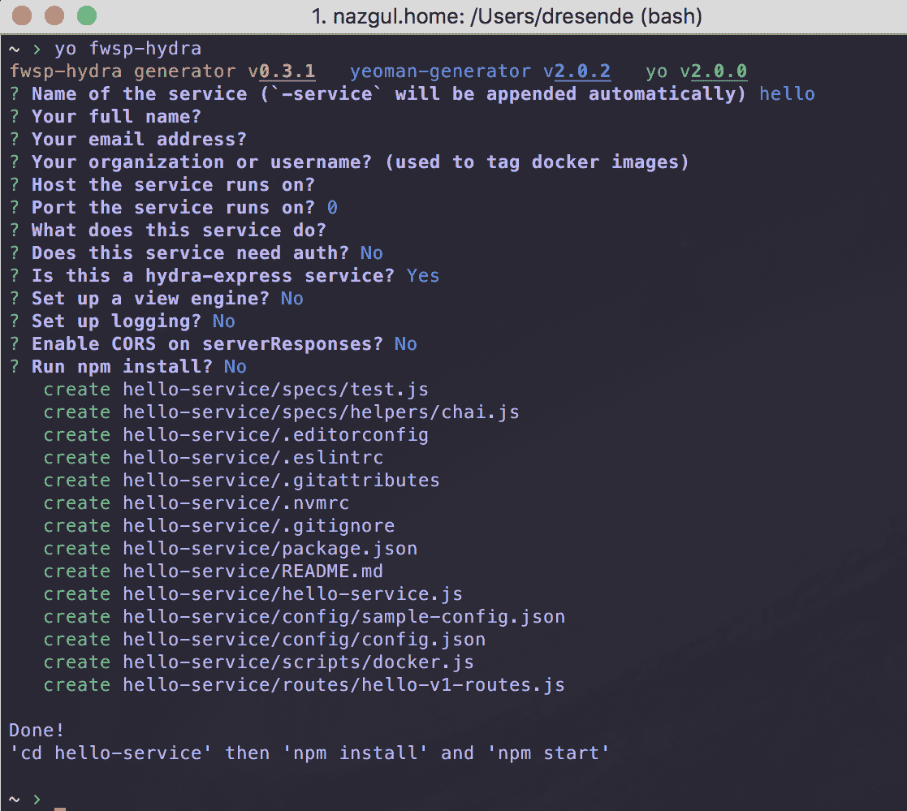

在服务名称处，只需输入 hello。对于其余问题，按 *Enter* 使用默认值。最后，进入创建的文件夹并安装依赖项：

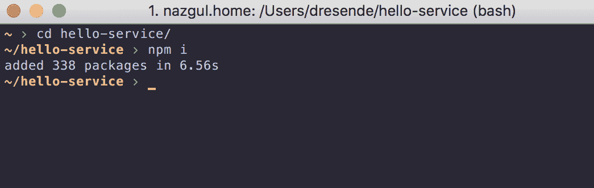

服务现在已准备好启动。你可能已经在搭建服务时看到了这些指示。让我们启动服务：

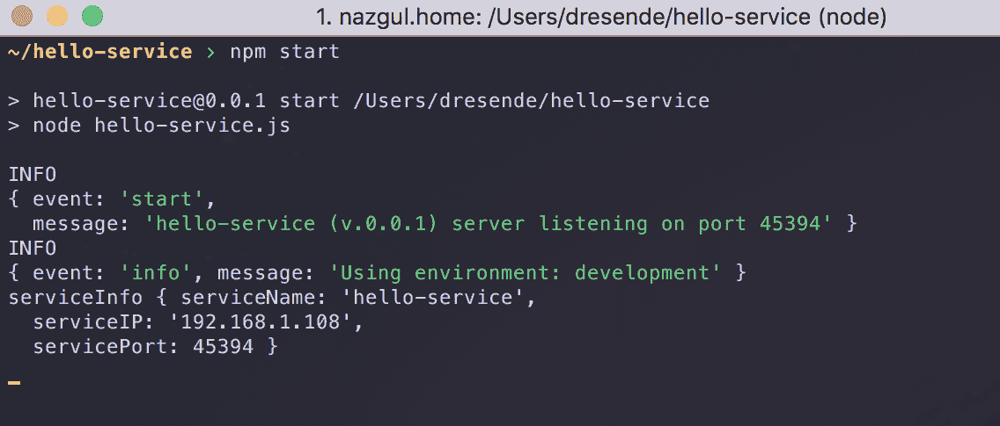

如前一个截图所示，服务已启动，并附加到本地 IP（192.168.1.108）和端口（45394）。在你的代码编辑器中打开该文件夹：

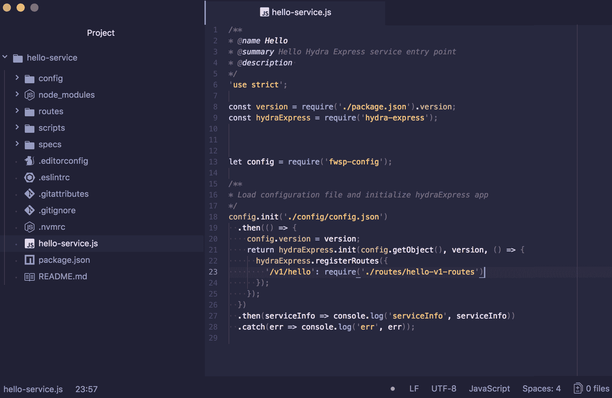

你会在基本文件夹中看到一个名为 `hello-service.js` 的文件，其中包含服务路由。你可以找到指向 `routes/hello-v1-routes.js` 中另一个文件的 `/v1/hello` 路由：

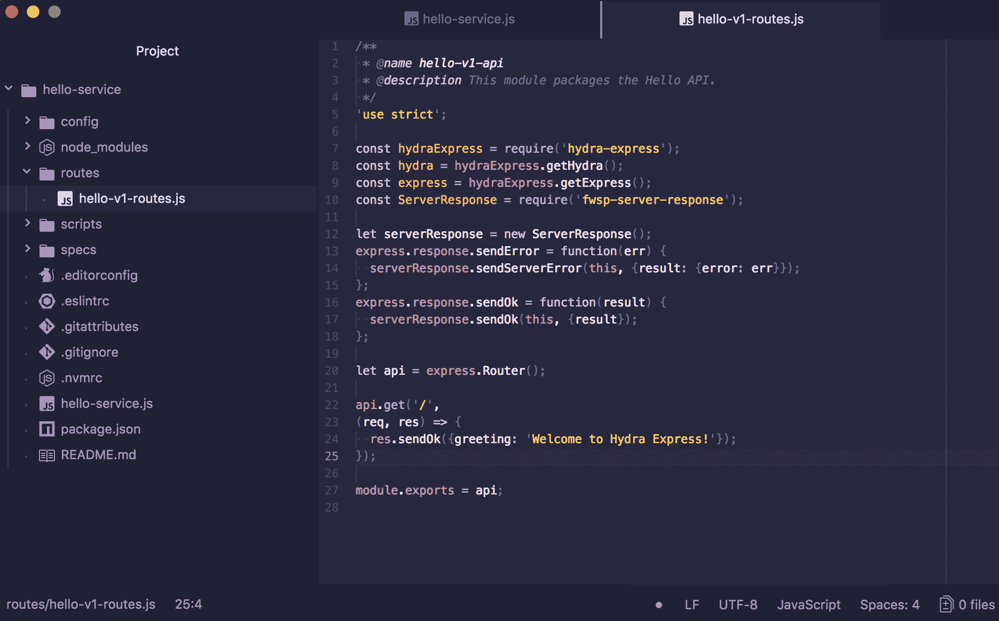

在那个文件中，你会看到对该路由的响应。现在，让我们跳转到网页浏览器，看看它是否启动并运行：

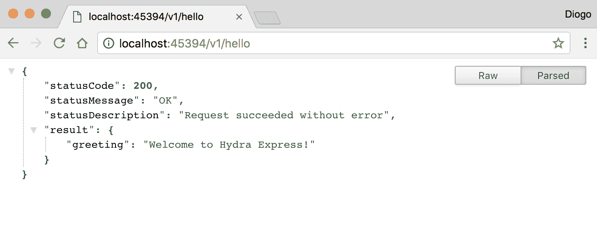

我们在文件中看到的内容位于 JSON 响应的 result 属性中。我们只是部署了第一个 Hydra 微服务，而没有写一行代码！

# 摘要

我们刚刚介绍了一系列不同的模块和工具包，以帮助开发微服务。从 Seneca 的模式到 Hydra 包，有许多方法可供选择。

它们针对不同的受众群体，满足不同的需求。我建议你尝试其中的一些，以帮助你做出更好的选择，而不仅仅是选择一个。

让我们深入研究这些工具，并开始创建一个更完整的微服务。在下一章中，我们将构建一个有用的微服务，涵盖不同的用例，同时开发一个功能齐全且分布式的微服务。
