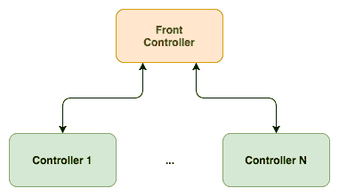
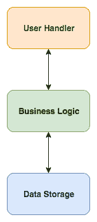
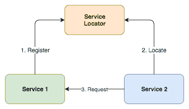
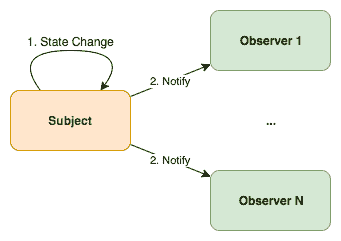
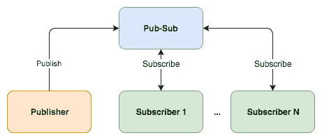
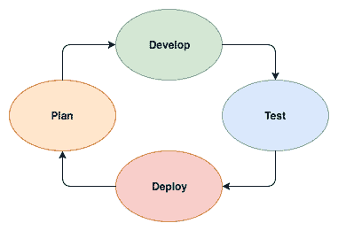

# 第二十四章：设计模式

在上一章中，我们成功地将我们的服务部署到云提供商，而无需对代码进行根本性的更改。我们使用数据库来存储我们的数据，我们唯一需要做的就是指向新的位置。

在规范和开发过程中，遇到具有一种或多种解决方法的有挑战性的问题是常见的。你在开发过程中选择的方法或路径被称为设计模式，因为它们是你设计的一部分。

一些设计模式比其他模式更常见。一些是众所周知的，而另一些则不那么为人所知。一些是好的设计模式，你应该遵循它们。其他则因为它们在短期或长期带来的缺点而不好。

在本章中，我们将探讨选择良好模式的重要性；我们将查看一些常见的架构模式，并回顾我们整本书中遵循的持续集成，直到我们成功地将服务部署到云端。

# 选择模式

模式不是库或类，它们是概念，是针对常见编程问题的可重用解决方案，针对特定用例进行了测试和优化。由于它们只是解决特定问题的概念，因此必须在每种语言中实现。

每个模式都有其优点和缺点，为问题选择错误模式可能会给你带来很大的麻烦。

模式可以加快开发过程，因为它们提供了经过良好测试和验证的开发范例。重用模式有助于防止问题，并提高熟悉模式的开发者之间的代码可读性。

模式在高性能应用程序中具有重大意义。有时，为了获得一些灵活性，模式会在代码中引入一个新的间接层次，这可能会降低性能。你应该选择何时引入模式，或者何时引入模式会损害你正在追求的性能指标。

了解良好的模式对于避免相反的情况：反模式至关重要。反模式是开始看起来不错，但后来却变成你做出的最糟糕决定的某种东西。反模式不是特定的模式，而更像是一些常见的错误，大多数人认为你不应该使用的策略。最常见和最频繁出现的反模式包括：

+   **重复自己**：不要重复过多的代码部分。退后一步，看看大局，然后重构它。一些开发者倾向于将这种重构视为应用程序的复杂性，但实际上它可以使你的应用程序更简单。如果你认为你无法理解重构的简单性，不要忘记在代码中添加一些介绍性注释。

+   **金锤或银弹**：不要认为你最喜欢的语言或框架是普遍适用的。大多数语言实际上可以做到任何事情，至少是成熟的那些，以及庞大的社区。这并不意味着语言在执行某些任务时表现良好。如果你的目标是性能，尝试在腰间带上几把锤子。

+   **异常编程**：不要在出现新情况时添加新代码来处理。这里的新情况，我说的不是新功能；我说的是代码没有预料到的行为。例如，当你制作某种类型的文件上传功能时，记住在传输过程中可能会发生错误，文件可能为空，内容奇怪，非常大，等等。

+   **偶然编程**：不要通过试错直到成功来编程。这真的是你应该避免的事情。偶然编程有时可能会使你的代码在某些情况下（偶然）工作，而在其他情况下产生错误的行为。

# 架构模式

当开发微服务，尤其是微服务生态系统时，一些模式变得非常明显，你会在不知不觉中使用它们。仅从架构模式来看，这里有一些你可能觉得有趣的模式。也许你之前已经使用过它们了。

# 前端控制器

**前端控制器**模式是指所有请求都指向你的架构中的一个单一点，称为处理器，然后它处理并调度请求到其他处理器。例如，负载均衡器和反向代理使用这种模式：

横向扩展很有用，尤其是在**前端控制器**只是路由请求时，这样它可以处理比每个单独控制器更多的请求，而每个控制器需要一些时间来实际处理每个请求。

这种模式在帮助其他服务不必知道控制器在哪里，并选择负载最低、应该更快处理请求的控制器方面也非常有用。

# 分层

分层模式在文件系统、操作系统（以及虚拟机）中很常见。这种模式包括创建不同的层，从原始数据到用户看到的数据：

理念是将不同层的复杂性分开，每一层都不必知道其他层是如何执行它们的任务：

+   处理数据结构并以快速和安全的方式存储它们

+   操作数据结构并向它们添加业务逻辑

+   处理用户请求并以本地化格式显示数据

# 服务定位器

**服务定位器**模式实际上是一种反模式。它不被认为是良好的实践，因为它会给生态系统增加更多的复杂性。该模式由一个中央注册表组成，称为**服务定位器**，服务在这里注册它们的能力，其他服务可以咨询注册表，了解它们所需的服务位于何处：

**服务定位器**与前端控制器类似，但增加了复杂性，因为你需要联系服务定位器和所需的服务，而不仅仅是向前端控制器发出简单请求。

# 观察者

观察者模式在 Node.js 中每天都会被使用。它由一个**主题**组成，该主题维护一个依赖者列表，称为观察者，它们会收到**主题**上发生的任何状态变化的通知：

你可以在你的网页浏览器中看到这种情况，每次某些代码（**观察者**）将事件监听器附加到对象或界面元素（**主题**）上时。

# 发布-订阅

另一个非常相似的模式是发布-订阅模式，通常缩写为**Pub-Sub**。这个模式几乎与上一个模式完全相同。你有订阅者，正如其名所示，订阅特定的事件、主题或你想要称之为什么的东西，然后你有发布者，它们会发出这些事件或向这些主题发送信息：

与之前模式的区别可能看起来非常微小，但实际上非常重要。**发布-订阅**模式涉及第三方服务，与观察者模式不同，发布者对订阅者没有任何了解。这消除了处理和直接通知订阅者的需求，从而简化了你的代码。

这种模式对于微服务通信非常有用。它涉及一个第三方，该第三方抽象化了状态变化的通知。此外，发布者和订阅者对彼此没有任何了解。

# 使用模式

选择好的设计模式本质上是在选择最佳实践。并非所有设计模式都适合每一个目的，但许多情况下，它们会使你的生活变得更轻松。也许一开始你可能不会注意到任何区别，但从长远来看，你应该会注意到。

良好的设计模式也有间接的优势。你会在网上找到更多的文档和示例，以及更广泛的选择范围，例如，在使用发布-订阅模式时，你将找到许多类型的实现，可以与你的服务集成。

选择适合你需求的设计模式也涉及到规划和了解你现在需要什么以及将来你需要什么。考虑边缘情况，看看模式是否能够处理它们。

# 规划你的微服务

开发微服务可能看起来像是一项简单的任务。正如其名所示，它是一个微服务。但这也并不一定正确，因为有时我们倾向于将本应简单的事情复杂化。

这并不意味着服务应该是简单的，它可以相当复杂。应该简单的是服务的目标和属性。关于它做什么以及它不应该做什么，不应该有任何疑问。

在编写任何一行代码之前，你应该先了解一些我称之为服务特征的几个方面，例如：

+   它是用来做什么的？它将执行哪些任务？

+   其他服务将如何使用它？它将使用什么协议？

+   它会取代另一个服务吗？它会覆盖相同的任务吗？

这可以用一个词来概括——目的。如果你没有明确定义它的目的，只是开始开发它能够处理的任务，你最终会得到一个混合服务，这与微服务的主要目标相偏离。

在明确目的之后，你可以选择最佳的模式并规划个别任务。第一个任务可能需要更长的时间来开发，因为你正在为服务创建基础布局。

不要忘记尽快添加测试、覆盖率和文档。我知道这可能是大多数开发者倾向于忽略的事情，但将来它会给你带来麻烦。对于第一个简单的任务，添加一个简单的测试会更简单。在这个阶段，代码覆盖率也会更容易。如果你在规划个别任务，添加文档也应该更容易。

在完成第一个任务并进行了适当的测试后，你应该设置你的第一次部署。这将结束你的第一个开发周期，并带你回到规划阶段。如果你保持这个循环，通过小任务，你会更快地开发和部署：

这种类型的小任务简单循环将允许你进行所谓的**持续集成**和**持续部署**，其中你能够开发并部署到测试集群。如果一切通过测试，更改可以自动测试和部署。

# 开发中的障碍

如我们之前所见，微服务架构有许多优点，例如将代码拆分为更小的孤立项目，这使得开发或甚至委派责任变得更加容易。

这些优势是有代价的，那就是构建一个更复杂的系统或应用程序。由于微服务应该如何工作，信息屏障是固有的。负责某种信息的微服务应该是唯一一个操作它的服务，迫使任何其他服务与之通信才能访问信息。

这让你对信息有更精细的控制，因为你知道负责它的服务，你可以强制服务或用户身份验证，包括授权甚至速率访问限制。但是，这意味着一个复杂的应用程序往往会惩罚网络，因为会有大量的服务间消息传递。

服务的消息传递意味着网络流量和延迟。如果服务不在同一个本地网络中，这最终会创建明显的延迟。添加某种缓存服务以加速访问也会增加更多复杂性。

尽管每个微服务的测试和开发应该比单体应用程序更容易，但整体来看微服务测试框架，并且有两个或更多服务一起测试，会更加复杂。

最后，避免一种被称为纳米服务的东西。这被认为是一种反模式，就是你过度细化你的架构，创建了过于小的服务，将你的开发复杂化到了极致。

在微服务的数量和每个微服务将执行的任务之间找到一个良好的平衡。把它们想象成一个将处理特定任务的人。这个任务是否过于简单以至于只需要一个人来做？这个人不应该有来自同一上下文的更广泛的任务集吗？

# 摘要

今天的应用程序有空间容纳微服务。应用程序不再是单体架构，并且早已离开了传统的计算机架构。用户不断要求应用程序之间的集成和互操作性。

微服务通过分离不同的上下文，如前端、后端、移动或简单的 API，帮助开发者降低应用程序的复杂性。它们是一个概念，或者是一个模式，当使用得当，可以给你带来巨大的力量，并分割复杂性和责任。

但是，微服务不仅仅是这样。微服务通过仅复制所需的服务而不是完整的单体应用程序来帮助你水平扩展，节省资源，最终节省金钱。

外面有太多可以探索的东西；我们只是刚刚触及了表面。有大量的云提供商和工具供你实验和选择最适合你的。记住，熟能生巧，所以回到你的工作桌前，祝你好运！
