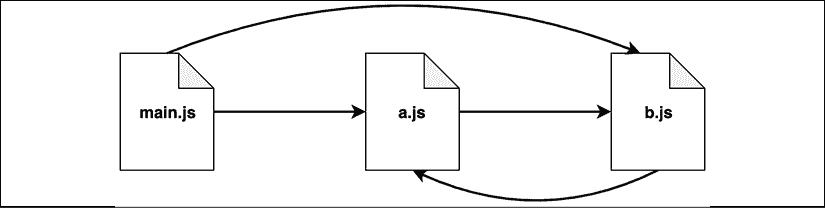
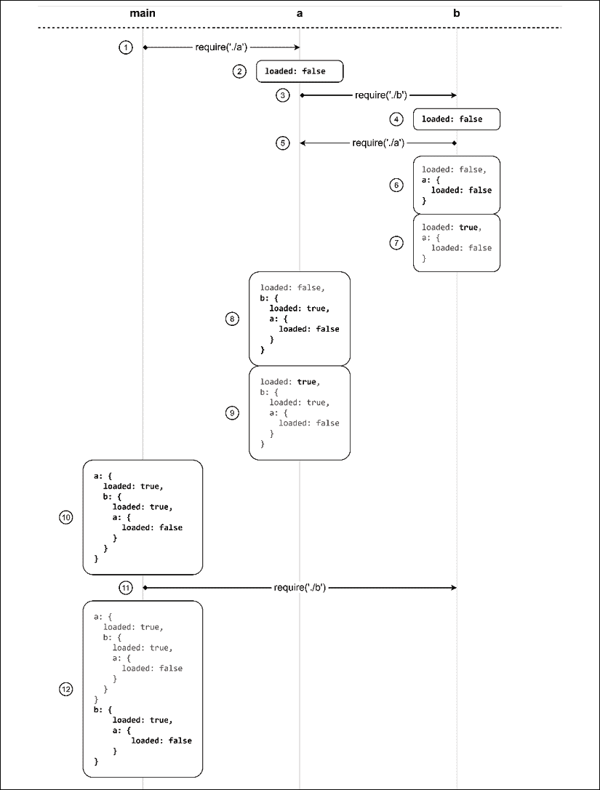
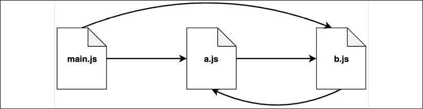
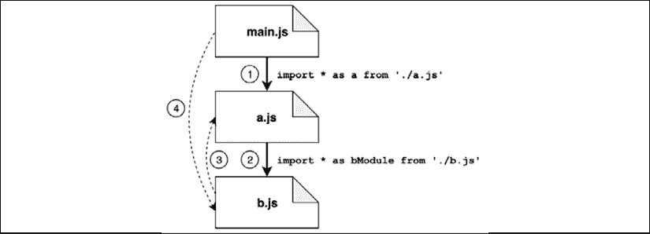
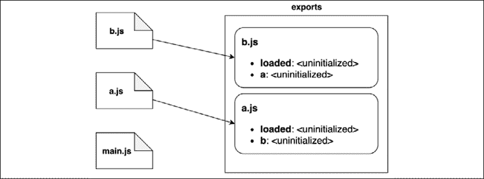
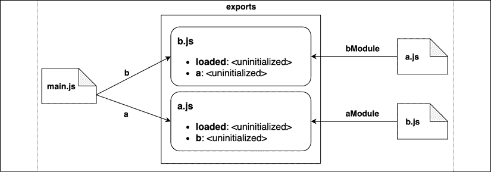
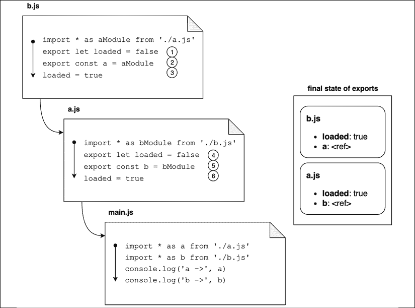

# 模块系统

在*第一章*，*Node.js 平台*中，我们简要介绍了模块在 Node.js 中的重要性。我们讨论了模块如何在定义 Node.js 哲学和编程体验的一些支柱中扮演基础角色。但当我们谈论模块时，我们实际上指的是什么？为什么它们如此重要？

用通用术语来说，模块是非平凡应用程序的砖块。模块允许你将代码库划分为可以独立开发和测试的小单元。模块也是通过保持所有未明确标记为导出的函数和变量私有来强制信息隐藏的主要机制。

如果你来自其他语言，你可能已经看到过类似的概念被不同的名称所提及：**包**（Java、Go、PHP、Rust 或 Dart）、**组件**（.NET）、**库**（Ruby）或 **单元**（Pascal 方言）。术语并不是完全可互换的，因为每种语言或生态系统都有自己的独特特征，但这些概念之间存在显著的相似性。

很有趣的是，Node.js 目前有两个不同的模块系统：**CommonJS**（**CJS**）和 **ECMAScript 模块**（**ESM** 或 **ES 模块**）。在本章中，我们将讨论为什么存在两种选择，我们将了解它们的优缺点，最后，我们将分析一些在使用或编写 Node.js 模块时相关的常见模式。到本章结束时，你应该能够做出实用的选择，关于如何有效地使用模块以及如何编写你自己的自定义模块。

理解 Node.js 的模块系统和模块模式非常重要，因为我们将在这个书的其他章节中依赖这些知识。

简而言之，这是我们将在本章中讨论的主要主题：

+   模块为什么是必要的以及 Node.js 中可用的不同模块系统

+   CommonJS 内部和模块模式

+   Node.js 中的 ES 模块（ESM）

+   CommonJS 和 ESM 之间的差异和互操作性

让我们从为什么我们需要模块开始。

# 模块的需求

一个好的模块系统应该有助于解决软件工程的一些基本需求：

+   *有一种方法可以将代码库分割成多个文件*。这有助于使代码更加有序，更容易理解，同时也便于独立开发和测试各种功能。

+   *允许代码在不同项目之间重用*。实际上，一个模块可以实现一个通用的功能，这可能对不同的项目都有用。在模块中组织这样的功能可以使其更容易被引入可能希望使用它的不同项目中。

+   *封装*（或 *信息隐藏*）。通常，隐藏实现复杂性并仅暴露具有明确职责的简单接口是一个好主意。大多数模块系统允许选择性地隐藏代码的 *私有* 部分，同时暴露一个 *公共* 接口，例如函数、类或对象，这些对象旨在被模块的消费者使用。

+   *管理依赖关系*。一个好的模块系统应该使模块开发者能够构建在现有模块之上，包括第三方模块。模块系统还应该使模块用户能够导入给定模块运行所需的依赖链（临时依赖）。

很重要要明确区分 *模块* 和 *模块系统*。我们可以将模块定义为实际的软件单元，而模块系统是允许我们在项目中定义模块并使用它们的语法和工具。

# JavaScript 和 Node.js 中的模块系统

并非所有编程语言都内置了模块系统，JavaScript 在很长一段时间内都缺少这一功能。

在浏览器环境中，可以通过使用不同的 `<script>` 标签将代码库拆分为多个文件，然后通过这些标签导入它们。多年来，这种方法足以构建简单的交互式网站，JavaScript 开发者也设法在没有完全成熟的模块系统的情况下完成任务。

只有当 JavaScript 浏览器应用程序变得更加复杂，并且像 *jQuery*、*Backbone* 和 *AngularJS* 这样的框架接管了生态系统时，JavaScript 社区才提出了几个旨在定义一个可以在 JavaScript 项目中有效采用的模块系统的倡议。其中最成功的是 **异步模块定义** (**AMD**)，由 RequireJS ([nodejsdp.link/requirejs](http://nodejsdp.link/requirejs)) 推广，后来是 **通用模块定义** (**UMD** – [nodejsdp.link/umd](http://nodejsdp.link/umd))。

当 Node.js 被创建时，它被构想为具有直接访问底层文件系统的 JavaScript 服务器运行时，因此有独特的机遇引入一种不同的模块管理方式。这个想法不是依赖于 HTML `<script>` 标签和通过 URL 可访问的资源。相反，选择完全依赖于本地文件系统上的 JavaScript 文件。对于其模块系统，Node.js 提出了一种 *CommonJS* 规范（有时也称为 *CJS*，[nodejsdp.link/commonjs](http://nodejsdp.link/commonjs)）的实现，该规范旨在为无浏览器的环境提供 JavaScript 的模块系统。

CommonJS 自从 Node.js 诞生以来一直是 Node.js 中的主导模块系统，也因*模块打包器*如 Browserify ([nodejsdp.link/browserify](http://nodejsdp.link/browserify)) 和 webpack ([nodejsdp.link/webpack](http://nodejsdp.link/webpack))而在浏览器环境中变得非常突出。

2015 年，随着*ECMAScript 6*（也称为*ECMAScript 2015*或*ES2015*）的发布，终于提出了一个标准模块系统的官方提案：*ESM*或*ECMAScript 模块*。ESM 为 JavaScript 生态系统带来了许多创新，其中之一就是试图弥合浏览器和服务器上模块管理的差距。

ECMAScript 6 仅定义了 ESM 的语法和语义方面的正式规范，但没有提供任何实现细节。不同的浏览器公司和 Node.js 社区花费了几年的时间才提出了该规范的稳固实现。从版本 13.2 开始，Node.js 提供了对 ESM 的稳定支持。

在撰写本文时，普遍的看法是 ESM 将成为浏览器和服务器环境中管理 JavaScript 模块的事实标准。然而，现实情况是，大多数项目仍然严重依赖 CommonJS，ESM 要赶上并最终成为主导标准还需要一段时间。

为了提供一个关于 Node.js 中模块相关模式的全面概述，在本章的第一部分，我们将以 CommonJS 的上下文来讨论它们，然后在章节的第二部分，我们将使用 ESM 回顾我们的学习成果。

本章的目标是让你对这两种模块系统都感到舒适，但在本书的其余部分，我们只将使用 ESM 作为我们的代码示例。我们的想法是鼓励你尽可能多地利用 ESM，这样你的代码将更具未来性。

如果你在这本书出版几年后阅读这一章，你可能不太担心 CommonJS，你可能想直接跳到 ESM 部分。这可能没问题，但我们仍然鼓励你通读整个章节，因为理解 CommonJS 及其特性无疑将有助于你更深入地理解 ESM 及其优势。

# 模块系统和其模式

正如我们所说，模块是非平凡应用的结构基石，也是通过保持所有未明确标记为导出的函数和变量私有来强制信息隐藏的主要机制。

在深入探讨 CommonJS 的具体细节之前，让我们讨论一个通用的模式，这个模式有助于信息隐藏，我们将在构建简单的模块系统中使用它，即**揭示模块模式**。

## 揭示模块模式

JavaScript 在浏览器中的一个较大问题是缺乏命名空间。每个脚本都在全局作用域中运行；因此，内部应用程序代码或第三方依赖项可能会污染作用域，同时暴露它们自己的功能片段。这可能会非常有害。例如，想象一下，一个第三方库实例化了一个名为 `utils` 的全局变量。如果任何其他库或应用程序代码意外地覆盖或修改了 `utils`，依赖于它的代码可能会以某种不可预测的方式崩溃。如果其他库或应用程序代码意外地调用了仅用于内部使用的另一个库的函数，也可能发生不可预测的副作用。

简而言之，依赖于全局作用域是非常危险的，尤其是在你的应用程序增长并越来越多地依赖于其他个人实现的功能时。

解决这类问题的一个流行技术被称为**揭示模块模式**，其形式如下：

```js
const myModule = (() => {
  const privateFoo = () => {}
  const privateBar = []
  const exported = {
    publicFoo: () => {},
    publicBar: () => {}
  }
  return exported
})**()** // once the parenthesis here are parsed, the function
     // will be invoked
console.log(myModule)
console.log(myModule.privateFoo, myModule.privateBar) 
```

这种模式利用了自调用函数。这种类型的函数有时也被称为**立即执行函数表达式**（**IIFE**），它用于创建一个私有作用域，仅导出那些打算公开的部分。

在 JavaScript 中，函数内部创建的变量不能从外部作用域（函数外部）访问。函数可以使用 `return` 语句有选择性地将信息传播到外部作用域。

这种模式本质上是在利用这些属性来隐藏私有信息，并仅导出面向公众的 API。

在前面的代码中，`myModule` 变量只包含导出的 API，而模块的其他内容实际上从外部几乎无法访问。

`log` 语句将打印出类似以下内容：

```js
{ publicFoo: [Function: publicFoo],
  publicBar: [Function: publicBar] }
undefined undefined 
```

这表明只有 `exported` 属性可以直接从 `myModule` 访问。

正如我们稍后将看到的，这种模式背后的思想被用作 CommonJS 模块系统的基础。

# CommonJS 模块

CommonJS 是最初内置到 Node.js 中的第一个模块系统。Node.js 的 CommonJS 实现遵循 CommonJS 规范，并增加了一些自定义扩展。

让我们总结一下 CommonJS 规范的两个主要概念：

+   `require` 是一个函数，允许你从本地文件系统中导入一个模块

+   `exports` 和 `module.exports` 是特殊的变量，可以用来从当前模块导出公共功能。

目前这些信息已经足够了；我们将在接下来的几节中学习更多关于 CommonJS 规范的细节和一些细微差别。

## 一个自制的模块加载器

要理解 CommonJS 在 Node.js 中的工作方式，让我们从头开始构建一个类似的系统。下面的代码创建了一个函数，它模拟了 Node.js 原始 `require()` 函数的一部分功能。

让我们首先创建一个函数，该函数加载模块的内容，将其封装在私有作用域中，并对其进行评估：

```js
function loadModule (filename, module, require) {
  const wrappedSrc =
    `(function (module, exports, require) {
      ${fs.readFileSync(filename, 'utf8')}
    })(module, module.exports, require)`
  eval(wrappedSrc)
} 
```

模块的源代码本质上被封装在一个函数中，就像在揭示模块模式中一样。这里的区别在于我们向模块传递了一个变量列表，特别是`module`、`exports`和`require`。请注意，封装函数的`exports`参数是如何初始化为`module.exports`的内容的，因为我们稍后将会讨论这一点。

另一个需要提及的重要细节是，我们正在使用`readFileSync`来读取模块的内容。虽然通常不建议使用文件系统 API 的同步版本，但在这里这样做是有意义的。这样做的原因是，在 CommonJS 中加载模块是故意同步操作。这种方法确保了，如果我们正在导入多个模块，它们（及其依赖项）将以正确的顺序加载。我们将在本章稍后讨论这个方面。

请记住，这只是一个示例，在实际应用中你很少需要评估某些源代码。例如`eval()`或`vm`模块（[nodejsdp.link/vm](http://nodejsdp.link/vm)）的功能可能会被错误地使用或输入错误，从而打开代码注入攻击的系统。它们应该始终谨慎使用或完全避免。

让我们现在实现`require()`函数：

```js
function require (moduleName) {
  console.log(`Require invoked for module: ${moduleName}`)
  const id = require.resolve(moduleName)                   // (1)
  if (require.cache[id]) {                                 // (2)
    return require.cache[id].exports
  }
  // module metadata
  const module = {                                         // (3)
    exports: {},
    id
  }
  // Update the cache
  require.cache[id] = module                               // (4)
  // load the module
  loadModule(id, module, require)                          // (5)
  // return exported variables
  return module.exports                                    // (6)
}
require.cache = {}
require.resolve = (moduleName) => {
  /* resolve a full module id from the moduleName */
} 
```

之前的功能模拟了 Node.js 原始`require()`函数的行为，该函数用于加载模块。当然，这只是为了教育目的，并不准确或完整地反映了真实`require()`函数的内部行为，但了解 Node.js 模块系统的内部结构，包括模块的定义和加载方式是非常有用的。

我们的`homemade module`系统的工作原理如下所述：

1.  模块名称被接受为输入，我们首先要做的事情是解析模块的完整路径，我们称之为`id`。这个任务委托给`require.resolve()`，它实现了一个特定的解析算法（我们稍后将会讨论）。

1.  如果模块之前已经被加载过，它应该存在于缓存中。如果是这种情况，我们立即返回它。

1.  如果模块之前从未被加载过，我们为第一次加载设置环境。特别是，我们创建一个包含`exports`属性的`module`对象，该属性初始化为一个空对象字面量。这个对象将由模块的代码填充以导出其公共 API。

1.  在第一次加载后，`module`对象被缓存。

1.  模块源代码从其文件中读取，并像之前看到的那样进行评估。我们向模块提供我们刚刚创建的`module`对象以及`require()`函数的引用。模块通过操作或替换`module.exports`对象来导出其公共 API。

1.  最后，`module.exports` 的内容，它代表了模块的公共 API，被返回给调用者。

如我们所见，Node.js 模块系统的运作并没有什么神奇之处。技巧全部在于我们围绕模块源代码创建的包装以及我们运行它的模拟环境。

## 定义一个模块

通过查看我们的自定义 `require()` 函数是如何工作的，我们现在应该能够理解如何定义一个模块。以下代码提供了一个示例：

```js
// load another dependency
const dependency = require('./anotherModule')
// a private function
function log() {
  console.log(`Well done ${dependency.username}`)
}
// the API to be exported for public use
module.exports.run = () => {
  log()
} 
```

需要记住的基本概念是，除非被分配给 `module.exports` 变量，否则模块内部的所有内容都是私有的。当模块使用 `require()` 加载时，这个变量的内容会被缓存并返回。

## `module.exports` 与 `exports`

对于许多还不熟悉 Node.js 的开发者来说，使用 `exports` 和 `module.exports` 来公开公共 API 的区别是一个常见的混淆来源。我们的自定义 `require()` 函数的代码再次消除了任何疑虑。`exports` 变量只是 `module.exports` 初始值的引用。我们已经看到，这样的值本质上是在模块加载之前创建的一个简单的对象字面量。

这意味着我们只能向由 `exports` 变量引用的对象附加新属性，如下面的代码所示：

```js
exports.hello = () => {
  console.log('Hello')
} 
```

重新分配 `exports` 变量没有任何效果，因为它不会改变 `module.exports` 的内容。它只会重新分配变量本身。因此，以下代码是错误的：

```js
exports = () => {
  console.log('Hello')
} 
```

如果我们想要导出除了对象字面量之外的内容，比如一个函数、一个实例，甚至是字符串，我们必须按照以下方式重新分配 `module.exports`：

```js
module.exports = () => {
  console.log('Hello')
} 
```

## `require` 函数是同步的

我们应该注意的一个非常重要的细节是，我们自制的 `require()` 函数是同步的。实际上，它使用简单的直接方式返回模块内容，并且不需要回调。这同样适用于原始的 Node.js `require()` 函数。因此，对 `module.exports` 的任何赋值都必须是同步的。例如，以下代码是不正确的，它会导致问题：

```js
setTimeout(() => {
  module.exports = function() {...}
}, 100) 
```

`require()` 的同步特性对我们定义模块的方式有重要影响，因为它限制我们在模块定义过程中主要使用同步代码。这是为什么核心 Node.js 库提供同步 API 作为大多数异步 API 的替代方案的一个重要原因。

如果我们需要为模块添加一些异步初始化步骤，我们总是可以定义并导出一个未初始化的模块，该模块将在稍后异步初始化。然而，这种方法的问题在于，使用 `require()` 加载这样的模块并不能保证它已经准备好使用。在 *第十一章*，*高级技巧* 中，我们将详细分析这个问题，并提出一些优雅地解决这个问题的模式。

为了满足好奇心，你可能想知道，在 Node.js 的早期阶段，它曾经有一个异步版本的`require()`，但很快就被移除了，因为它过于复杂化了一个实际上只应在初始化时使用且异步 I/O 带来的复杂性大于优势的功能。

## 解析算法

术语*依赖地狱*描述了一种情况，即两个或多个程序依赖项依次依赖于一个共享依赖项，但需要不同的不兼容版本。Node.js 通过根据模块加载的位置加载模块的不同版本优雅地解决了这个问题。所有这个特性的优点都归功于 Node.js 包管理器（如 npm 或 yarn）组织应用程序依赖项的方式，以及`require()`函数中使用的解析算法。

现在我们快速概述一下这个算法。正如我们所见，`resolve()`函数接受一个模块名称（我们将称之为`moduleName`）作为输入，并返回模块的完整路径。然后使用此路径来加载其代码，并用于唯一标识该模块。解析算法可以分为以下三个主要分支：

+   **文件模块**：如果`moduleName`以`/`开头，它已经被视为模块的绝对路径，并按原样返回。如果它以`./`开头，则`moduleName`被视为相对路径，该路径从要求模块的目录开始计算。

+   **核心模块**：如果`moduleName`不以`/`或`./`开头，算法将首先尝试在核心 Node.js 模块中搜索。

+   **包模块**：如果没有找到与`moduleName`匹配的核心模块，则搜索将继续，通过在从要求模块开始向上导航的目录结构中查找第一个找到的匹配的`node_modules`目录中的模块来继续搜索。算法将继续在目录树中向上搜索下一个`node_modules`目录，直到达到文件系统的根目录。

对于文件和包模块，文件和目录都可以匹配`moduleName`。特别是，算法将尝试匹配以下内容：

+   `<moduleName>.js`

+   `<moduleName>/index.js`

+   在<moduleName>/package.json 的`main`属性中指定的目录/文件

解析算法的完整、正式文档可以在[nodejsdp.link/resolve](http://nodejsdp.link/resolve)找到。

`node_modules`目录实际上是包管理器安装每个包的依赖项的地方。这意味着，根据我们刚才描述的算法，每个包都可以有自己的私有依赖项。例如，考虑以下目录结构：

```js
myApp
├── foo.js
└── node_modules
    ├── depA
    │   └── index.js
    ├── depB
    │   ├── bar.js
    │   └── node_modules
    │       └── depA
    │           └── index.js
    └── depC
        ├── foobar.js
        └── node_modules
            └── depA
                └── index.js 
```

在前面的示例中，`myApp`、`depB` 和 `depC` 都依赖于 `depA`。然而，它们各自都有自己的依赖版本！遵循解析算法的规则，使用 `require('depA')` 将根据请求它的模块加载不同的文件，例如：

+   从 `/myApp/foo.js` 调用 `require('depA')` 将加载 `/myApp/node_modules/depA/index.js`

+   从 `/myApp/node_modules/depB/bar.js` 调用 `require('depA')` 将加载 `/myApp/node_modules/depB/node_modules/depA/index.js`

+   从 `/myApp/node_modules/depC/foobar.js` 调用 `require('depA')` 将加载 `/myApp/node_modules/depC/node_modules/depA/index.js`

解析算法是 Node.js 依赖管理健壮性的核心部分，它使得在一个应用程序中拥有数百甚至数千个包而不会发生冲突或版本兼容性问题成为可能。

当我们调用 `require()` 时，解析算法会透明地为我们应用。然而，如果需要，任何模块都可以通过简单地调用 `require.resolve()` 直接使用它。

## 模块缓存

每个模块只有在第一次被 `require()` 调用时才会被加载和评估，因为任何后续的 `require()` 调用将简单地返回缓存的版本。这可以通过查看我们自制的 `require()` 函数的代码来清楚地了解。缓存对于性能至关重要，但它也有一些重要的功能影响：

+   它使得模块依赖中存在循环成为可能

+   它在一定程度上保证了从给定包内部要求相同的模块时，总是返回相同的实例

模块缓存通过 `require.cache` 变量暴露，因此如果需要可以直接访问它。一个常见的用例是通过删除 `require.cache` 变量中的相对键来使任何缓存的模块失效，这种做法在测试期间可能很有用，但在正常情况下应用则非常危险。

## 循环依赖

许多人认为循环依赖是一个固有的设计问题，但实际上它可能在真实的项目中发生，因此了解它如何与 CommonJS 一起工作对我们来说很有用。如果我们再次查看我们的自制 `require()` 函数，我们立即可以窥见它可能的工作方式及其注意事项。

但让我们通过一个示例一起看看 CommonJS 在处理循环依赖时的行为。假设我们有 *图 2.1* 中表示的场景：



图 2.1：循环依赖的示例

一个名为 `main.js` 的模块需要 `a.js` 和 `b.js`。反过来，`a.js` 需要 `b.js`。但 `b.js` 也依赖于 `a.js`！很明显，这里有一个循环依赖，因为模块 `a.js` 需要模块 `b.js`，而模块 `b.js` 也需要模块 `a.js`。让我们看看这两个模块的代码：

+   模块 `a.js`:

    ```js
    exports.loaded = false
    const b = require('./b')
    module.exports = {
      b,
      loaded: true // overrides the previous export
    } 
    ```

+   模块 `b.js`:

    ```js
    exports.loaded = false
    const a = require('./a')
    module.exports = {
      a,
      loaded: true
    } 
    ```

现在，让我们看看这些模块是如何被 `main.js` 引入的：

```js
const a = require('./a')
const b = require('./b')
console.log('a ->', JSON.stringify(a, null, 2))
console.log('b ->', JSON.stringify(b, null, 2)) 
```

如果我们运行 `main.js`，我们会看到以下输出：

```js
a -> {
  "b": {
    "a": {
      "loaded": false
    },
    "loaded": true
  },
  "loaded": true
}
b -> {
  "a": {
    "loaded": false
  },
  "loaded": true
} 
```

这个结果揭示了使用 CommonJS 的循环依赖的注意事项，即，根据加载这些依赖项的顺序，我们应用程序的不同部分将会有不同的视图，来查看模块 `a.js` 和模块 `b.js` 导出的内容。虽然这两个模块在从 `main.js` 模块引入时都会立即完全初始化，但当从 `b.js` 加载时，`a.js` 模块将是不完整的。特别是，它的状态将是 `b.js` 被引入时的状态。

为了更详细地了解幕后发生的事情，让我们一步一步地分析不同的模块是如何被解释的，以及它们的局部作用域是如何变化的：



图 2.2：在 Node.js 中管理依赖循环的视觉表示

步骤如下：

1.  处理从 `main.js` 开始，它立即引入 `a.js`

1.  模块 `a.js` 首先做的事情是将一个名为 `loaded` 的导出值设置为 `false`

1.  在这一点上，模块 `a.js` 引入模块 `b.js`

1.  与 `a.js` 类似，模块 `b.js` 首先做的事情是将一个名为 `loaded` 的导出值设置为 `false`

1.  现在，`b.js` 引入 `a.js`（循环）

1.  由于 `a.js` 已经被遍历，它目前导出的值立即被复制到模块 `b.js` 的作用域中

1.  模块 `b.js` 最后将 `loaded` 值更改为 `true`

1.  现在 `b.js` 已完全执行，控制权返回到 `a.js`，此时 `a.js` 持有模块 `b.js` 当前状态的副本在其自己的作用域中

1.  模块 `a.js` 的最后一步是将它的 `loaded` 值设置为 `true`

1.  模块 `a.js` 现已完全执行，控制权返回到 `main.js`，此时 `main.js` 的内部作用域中有一个模块 `a.js` 当前状态的副本

1.  `main.js` 引入 `b.js`，它立即从缓存中加载

1.  模块 `b.js` 的当前状态被复制到 `main.js` 的作用域中，在那里我们最终可以看到每个模块的状态的完整图景

正如我们所说的，这里的问题是模块 `b.js` 对模块 `a.js` 有一个部分视图，并且当在 `main.js` 中引入 `b.js` 时，这个部分视图会被传播。如果我们交换两个模块在 `main.js` 中引入的顺序，这种行为应该会激发一种直觉，如果实际尝试这样做，你会看到这次将是 `a.js` 模块接收到 `b.js` 的一个不完整版本。

我们现在明白，如果我们失去了控制哪个模块先被加载，这可能会变得相当模糊，如果项目足够大，这种情况很容易发生。

在本章的后面部分，我们将看到 ESM 如何以更有效的方式处理循环依赖。同时，如果你正在使用 CommonJS，请非常小心这种行为及其可能对你的应用程序产生的影响。

在下一节中，我们将讨论一些在 Node.js 中定义模块的模式。

# 模块定义模式

模块系统除了是加载依赖项的机制外，也是定义 API 的工具。像任何其他与 API 设计相关的问题一样，需要考虑的主要因素是私有功能和公共功能之间的平衡。目标是最大化信息隐藏和 API 可用性，同时与其他软件质量，如*可扩展性*和*代码重用*相平衡。

在本节中，我们将分析一些在 Node.js 中定义模块的最流行模式，例如命名导出、导出函数、类和实例以及猴子补丁。每个模式都有其自己的信息隐藏、可扩展性和代码重用之间的平衡。

## 命名导出

暴露公共 API 的最基本方法是使用**命名导出**，这涉及到将我们想要公开的值分配给由`exports`（或`module.exports`）引用的对象的属性。这样，生成的导出对象就变成了相关功能集的容器或命名空间。

以下代码展示了实现此模式的模块：

```js
// file logger.js
exports.info = (message) => {
  console.log(`info: ${message}`)
}
exports.verbose = (message) => {
  console.log(`verbose: ${message}`)
} 
```

导出的函数随后作为加载的模块的属性可用，如下面的代码所示：

```js
// file main.js
const logger = require('./logger')
logger.info('This is an informational message')
logger.verbose('This is a verbose message') 
```

大多数 Node.js 核心模块都使用这种模式。然而，CommonJS 规范只允许使用`exports`变量来公开成员。因此，命名导出模式是与 CommonJS 规范真正兼容的唯一模式。使用`module.exports`是 Node.js 提供的一种扩展，以支持更广泛的模块定义模式，我们将在下面看到。

## 导出函数

最受欢迎的模块定义模式之一是将整个`module.exports`变量重新分配给一个函数。这种模式的主要优势在于它允许你只公开单一功能，这为模块提供了一个清晰的入口点，使其更容易理解和使用；它也很好地遵守了*小表面面积*原则。这种定义模块的方式在社区中也被称为**substack 模式**，这是其最著名的采用者之一，詹姆斯·哈利戴（昵称 substack – [`github.com/substack`](https://github.com/substack))。以下示例中看看这个模式：

```js
// file logger.js
module.exports = (message) => {
  console.log(`info: ${message}`)
} 
```

这种模式的可能扩展是使用导出的函数作为其他公共 API 的命名空间。这是一个非常强大的组合，因为它仍然给模块提供了单一入口点（主要导出函数）的清晰性，同时允许我们公开具有次要或更高级用例的其他功能。以下代码展示了如何通过使用导出的函数作为命名空间来扩展我们之前定义的模块：

```js
module.exports.verbose = (message) => {
  console.log(`verbose: ${message}`)
} 
```

以下代码演示了如何使用我们刚刚定义的模块：

```js
// file main.js
const logger = require('./logger')
logger('This is an informational message')
logger.verbose('This is a verbose message') 
```

尽管只导出一个函数可能看起来像是一种限制，但实际上，这是一种将重点放在单一功能上的完美方式，这是模块最重要的功能，同时减少对次要或内部方面的可见性，这些方面作为导出函数本身的属性被暴露出来。Node.js 的模块化强烈鼓励采用**单一职责原则**（**SRP**）：每个模块应该负责单一功能，并且这种责任应该完全封装在模块中。

## 导出一个类

导出类的模块是导出函数的模块的一种特殊化。区别在于，使用这种新的模式，我们允许用户使用构造函数创建新实例，同时也赋予他们扩展其原型和创建新类的权限。以下是这个模式的示例：

```js
class Logger {
  constructor (name) {
    this.name = name
  }
  log (message) {
    console.log(`[${this.name}] ${message}`)
  }
  info (message) {
    this.log(`info: ${message}`)
  }
  verbose (message) {
    this.log(`verbose: ${message}`)
  }
}
module.exports = Logger 
```

然后，我们可以按照以下方式使用前面的模块：

```js
// file main.js
const Logger = require('./logger')
const dbLogger = new Logger('DB')
dbLogger.info('This is an informational message')
const accessLogger = new Logger('ACCESS')
accessLogger.verbose('This is a verbose message') 
```

导出一个类仍然为模块提供了一个单一的入口点，但与子栈模式相比，它暴露了更多的模块内部结构。另一方面，它允许在扩展其功能时拥有更多的权力。

## 导出一个实例

我们可以利用`require()`的缓存机制轻松定义由构造函数或工厂创建的状态化实例，这些实例可以在不同的模块之间共享。以下代码展示了这种模式的示例：

```js
// file logger.js
class Logger {
  constructor (name) {
    this.count = 0
    this.name = name
  }
  log (message) {
    this.count++
    console.log('[' + this.name + '] ' + message)
  }
}
module.exports = new Logger('DEFAULT') 
```

这个新定义的模块可以按照以下方式使用：

```js
// main.js
const logger = require('./logger')
logger.log('This is an informational message') 
```

由于模块被缓存，每个需要`logger`模块的模块实际上总是检索到同一个对象实例，从而共享其状态。这种模式非常类似于创建一个**单例**。然而，它并不能保证在整个应用程序中实例的唯一性，就像传统单例模式中发生的那样。在分析解析算法时，我们注意到一个模块可能在应用程序的依赖树中被安装多次。这导致同一个逻辑模块有多个实例，所有这些实例都在同一个 Node.js 应用程序的上下文中运行。我们将在第七章“创建型设计模式”中更详细地分析单例模式和它的注意事项。

这个模式的一个有趣细节是，它并不排除创建新实例的机会，即使我们没有明确导出类。实际上，我们可以依赖导出实例的`constructor`属性来构建相同类型的新的实例：

```js
const customLogger = new logger.constructor('CUSTOM')
customLogger.log('This is an informational message') 
```

正如你所见，通过使用`logger.constructor()`，我们可以实例化新的`Logger`对象。请注意，这种技术必须谨慎使用，或者最好完全避免。考虑一下，如果模块作者决定没有明确导出类，他们可能希望保持这个类是私有的。

## 修改其他模块或全局作用域

一个模块甚至可以不导出任何内容。这看起来可能有些不合适；然而，我们不应忘记，一个模块可以修改全局作用域及其中的任何对象，包括缓存中的其他模块。请注意，这些通常被认为是不良做法，但鉴于这种模式在某些情况下（例如，用于测试）可能是有用且安全的，并且有时在现实世界的项目中使用，了解这一点是值得的。

我们提到，一个模块可以修改全局作用域中的其他模块或对象；嗯，这被称为**猴子补丁**。它通常指的是在运行时修改现有对象以改变或扩展其行为或应用临时修复的做法。

以下示例展示了我们如何向另一个模块添加一个新函数：

```js
// file patcher.js
// ./logger is another module
require('./logger').customMessage = function () {
  console.log('This is a new functionality')
} 
```

使用我们新的`patcher`模块就像编写以下代码一样简单：

```js
// file main.js
require('./patcher')
const logger = require('./logger')
logger.customMessage() 
```

这里描述的技术使用起来可能非常危险。主要问题是拥有一个修改全局命名空间或其他模块的模块是一种具有*副作用*的操作。换句话说，它影响了其作用域之外实体的状态，这可能导致难以预测的后果，尤其是在多个模块与同一实体交互时。想象一下有两个不同的模块试图设置相同的全局变量，或者修改同一模块的相同属性。效果可能是不可预测的（哪个模块获胜？），但更重要的是，它会对整个应用程序产生影响。

因此，再次谨慎使用这项技术，并确保在这样做时理解所有可能的副作用。

如果你想看看这个如何在实际中发挥作用，可以看看`nock`（[nodejsdp.link/nock](http://nodejsdp.link/nock)），这是一个允许你在测试中模拟 HTTP 响应的模块。`nock`工作的方式是通过猴子补丁 Node.js 的`http`模块，并改变其行为，使其提供模拟的响应而不是发出真实的 HTTP 请求。这允许我们的单元测试在没有触及实际生产 HTTP 端点的情况下运行，这在编写依赖于第三方 API 的代码的测试时非常方便。

在这个阶段，我们应该对 CommonJS 及其通常使用的某些模式有一个相当完整的理解。在下一节中，我们将探讨 ECMAScript 模块，也称为 ESM。

# ESM：ECMAScript 模块

ECMAScript 模块（也称为 ES 模块或 ESM）作为 ECMAScript 2015 规范的一部分被引入，目的是为 JavaScript 提供一个适用于不同执行环境的官方模块系统。ESM 规范试图保留一些来自先前现有模块系统（如 CommonJS 和 AMD）的好想法。语法非常简单且紧凑。它支持循环依赖和异步加载模块的可能性。

ESM 和 CommonJS 之间最重要的区别在于 ES 模块是 **静态的**，这意味着导入在模块的顶层描述，并且不在任何控制流语句之外。此外，导入模块的名称不能在运行时通过表达式动态生成，只允许使用常量字符串。

例如，以下代码在使用 ES 模块时将是不合法的：

```js
if (condition) {
  import module1 from 'module1'
} else {
  import module2 from 'module2'
} 
```

在 CommonJS 中，写如下内容是完全可行的：

```js
let module = null
if (condition) {
  module = require('module1')
} else {
  module = require('module2')
} 
```

初看之下，ESM 的这一特性可能看似不必要的限制，但事实上，静态导入打开了许多与 CommonJS 的动态特性不实用的有趣场景。例如，静态导入允许对依赖关系树进行静态分析，这允许进行诸如死代码消除（摇树）等优化。

## 在 Node.js 中使用 ESM

Node.js 默认会将每个 `.js` 文件视为使用 CommonJS 语法编写的；因此，如果我们在一个 `.js` 文件中使用 ESM 语法，解释器将直接抛出一个错误。

有几种方法可以告诉 Node.js 解释器将给定的模块视为 ES 模块而不是 CommonJS 模块：

+   给模块文件添加 `.mjs` 扩展名。

+   在最近的父 `package.json` 中添加一个名为 "`type`" 的字段，其值为 `"module"`。

在本书的其余部分和提供的代码示例中，我们将继续使用 `.js` 扩展名，以便使代码更容易为大多数文本编辑器所访问，因此如果您直接从书中复制粘贴示例，请确保您也创建一个包含 `"type":"module"` 条目的 `package.json` 文件。

现在我们来看看 ESM 语法。

## 命名导出和导入

ESM 允许我们通过 `export` 关键字从模块中导出功能。

注意，与 CommonJS 使用的复数形式（`exports` 和 `module.exports`）不同，ESM 使用单数词 `export`。

在 ES 模块中，一切都是私有的，默认情况下只有导出的实体可以从其他模块公开访问。

可以在想要向模块用户公开的实体前使用 `export` 关键字。让我们看一个例子：

```js
// logger.js
// exports a function as `log`
export function log (message) {
  console.log(message)
}
// exports a constant as `DEFAULT_LEVEL`
export const DEFAULT_LEVEL = 'info'
// exports an object as `LEVELS`
export const LEVELS = {
  error: 0,
  debug: 1,
  warn: 2,
  data: 3,
  info: 4,
  verbose: 5
}
// exports a class as `Logger`
export class Logger {
  constructor (name) {
    this.name = name
  }
  log (message) {
    console.log(`[${this.name}] ${message}`)
  }
} 
```

如果我们要从模块中导入实体，可以使用 `import` 关键字。语法相当灵活，允许我们导入一个或多个实体，甚至可以重命名导入。让我们看一些例子：

```js
import * as loggerModule from './logger.js'
console.log(loggerModule) 
```

在这个例子中，我们使用了 `*` 语法（也称为 **命名空间导入**）来导入模块的所有成员，并将它们分配给本地的 `loggerModule` 变量。这个例子将输出类似以下内容：

```js
[Module] {
  DEFAULT_LEVEL: 'info',
  LEVELS: { error: 0, debug: 1, warn: 2, data: 3, info: 4,
    verbose: 5 },
  Logger: [Function: Logger],
  log: [Function: log]
} 
```

如我们所见，我们模块中导出的所有实体现在都可以在 `loggerModule` 命名空间中访问。例如，我们可以通过 `loggerModule.log` 来引用 `log()` 函数。

非常重要的是要注意，与 CommonJS 不同，在 ESM 中我们必须指定导入模块的文件扩展名。在 CommonJS 中，我们可以使用`./logger`或`./logger.js`，而在 ESM 中，我们被迫使用`./logger.js`。

如果我们使用一个大型模块，通常我们不想导入它的所有功能，而只想导入其中的一到几个实体：

```js
import { log } from './logger.js'
log('Hello World') 
```

如果我们想导入多个实体，可以这样操作：

```js
import { log, Logger } from './logger.js'
log('Hello World')
const logger = new Logger('DEFAULT')
logger.log('Hello world') 
```

当我们使用这种类型的`import`语句时，实体将被导入到当前作用域中，因此存在名称冲突的风险。例如，以下代码将无法工作：

```js
import { log } from './logger.js'
const log = console.log 
```

如果我们尝试执行前面的代码片段，解释器将失败并显示以下错误：

```js
SyntaxError: Identifier 'log' has already been declared 
```

在这种情况下，我们可以通过使用`as`关键字重命名导入的实体来解决这个问题：

```js
import { log as log2 } from './logger.js'
const log = console.log
log('message from log')
log2('message from log2') 
```

这种方法在由从不同模块导入具有相同名称的两个实体而引起的冲突时特别有用，因此更改原始名称超出了消费者的控制范围。

## 默认导出和导入

CommonJS 广泛使用的一个特性是通过`module.exports`的赋值来导出一个未命名的实体。我们了解到这一点非常方便，因为它鼓励模块开发者遵循单一职责原则，仅暴露一个清晰的接口。在 ESM 中，我们可以通过所谓的**默认导出**做类似的事情。默认导出使用了`export default`关键字，其形式如下：

```js
// logger.js
export default class Logger {
  constructor (name) {
    this.name = name
  }
  log (message) {
    console.log(`[${this.name}] ${message}`)
  }
} 
```

在这种情况下，名称`Logger`被忽略，导出的实体在`default`名称下注册。这个导出名称以特殊方式处理，可以按以下方式导入：

```js
// main.js
import MyLogger from './logger.js'
const logger = new MyLogger('info')
logger.log('Hello World') 
```

与命名 ESM 导入的区别在于，在这里，由于默认导出被认为是未命名的，我们可以导入它，同时给它赋予我们选择的本地名称。在这个例子中，我们可以用任何在我们上下文中有意义的东西来替换`MyLogger`。这与我们处理 CommonJS 模块的方式非常相似。注意，我们不需要用括号包裹导入名称，也不需要在重命名时使用`as`关键字。

在内部，默认导出等同于一个名为`default`的命名导出。我们可以通过运行以下代码片段轻松验证这个说法：

```js
// showDefault.js
import * as loggerModule from './logger.js'
console.log(loggerModule) 
```

当执行上述代码时，将打印出类似以下内容：

```js
[Module] { default: [Function: Logger] } 
```

然而，我们无法显式地导入默认实体。事实上，类似以下的内容将失败：

```js
import { default } from './logger.js' 
```

执行将因`SyntaxError: Unexpected reserved word`错误而失败。这是因为`default`关键字不能用作变量名。它可以作为一个对象的属性，所以在前面的例子中，使用`loggerModule.default`是正确的，但我们不能在作用域中直接有一个名为`default`的变量。

## 混合导出

在 ES 模块中，可以混合命名导出和默认导出。让我们看看一个例子：

```js
// logger.js
export default function log (message) {
  console.log(message)
}
export function info (message) {
  log(`info: ${message}`)
} 
```

以下代码将 `log()` 函数作为默认导出和名为 `info()` 的命名导出导出。请注意，`info()` 可以内部引用 `log()`。不可能用 `default()` 替换对 `log()` 的调用，因为这将会是一个语法错误（Unexpected token `default`）。

如果我们想导入默认导出和一个或多个命名导出，我们可以使用以下格式：

```js
import mylog, { info } from './logger.js' 
```

在前面的例子中，我们正在从 `logger.js` 导入默认导出为 `mylog`，同时也导入了命名导出 `info`。

现在我们来讨论一下默认导出和命名导出之间的关键细节和区别：

+   命名导出是明确的。预定的名称允许 IDE 为开发者提供自动导入、自动完成和重构工具的支持。例如，如果我们输入 `writeFileSync`，编辑器可能会自动在当前文件的开头添加 `import { writeFileSync } from 'fs'`。相反，默认导出使得所有这些事情变得更加复杂，因为某个功能在不同的文件中可能有不同的名称，因此仅根据给定的名称就难以推断哪个模块可能提供该功能。

+   默认导出是一种方便的机制，用于传达模块最重要的单个功能。从用户的角度来看，在没有知道绑定确切名称的情况下，导入明显功能的一部分可能更容易。

+   在某些情况下，默认导出可能会使应用死代码消除（tree shaking）变得更加困难。例如，一个模块可能只提供默认导出，这是一个所有功能都作为该对象属性暴露的对象。当我们导入这个默认对象时，大多数模块打包器都会认为整个对象都在使用中，它们将无法从导出的功能中消除任何未使用的代码。

由于这些原因，通常认为坚持使用命名导出是良好的实践，特别是当你想要暴露多个功能时，并且只有当你想要导出明确的功能时才使用默认导出。

这并不是一条硬性规则，并且有一些值得注意的例外。例如，所有 Node.js 核心模块都有默认导出和多个命名导出。此外，React ([nodejsdp.link/react](http://nodejsdp.link/react)) 使用混合导出。

仔细考虑你特定模块的最佳方法以及你希望你的模块用户拥有怎样的开发者体验。

## 模块标识符

**模块标识符**（也称为*模块指定符*）是我们可以在我们的 `import` 语句中使用的不同类型的值，用于指定我们想要加载的模块的位置。

到目前为止，我们只看到了相对路径，但还有其他几种可能性，还有一些需要注意的细微差别。让我们列出所有可能性：

+   *相对指定符*如`./logger.js`或`../logger.js`。它们用于引用相对于导入文件位置的路径。

+   *绝对指定符*如`file:///opt/nodejs/config.js`。它们直接且明确地指向一个完整路径。请注意，这是使用 ESM 引用模块绝对路径的唯一方式，使用`/`或`//`前缀将不起作用。这与 CommonJS 有显著不同。

+   *裸指定符*是像`fastify`或`http`这样的标识符，它们代表在`node_modules`文件夹中可用的模块，通常通过包管理器（如 npm）或作为 Node.js 核心模块安装。

+   类似于`fastify/lib/logger.js`的*深度导入指定符*，它指的是`node_modules`包内的一个路径（在这个例子中是`fastify`）。

在浏览器环境中，可以通过指定模块 URL 直接导入模块，例如，[`unpkg.com/lodash`](https://unpkg.com/lodash)。这个特性在 Node.js 中不受支持。

## 异步导入

正如我们在前一小节中看到的，`import`语句是静态的，因此受到两个重要限制：

+   模块标识符不能在运行时构建

+   模块导入在文件的顶层声明，并且不能在控制流语句内嵌套。

在某些情况下，这些限制可能会变得过于严格。想象一下，例如，如果我们必须为当前用户的语言导入一个特定的翻译模块，或者一个依赖于用户操作系统的模块变体。

此外，如果我们只想在用户访问需要该模块的功能时加载给定的模块，该模块可能特别庞大，该怎么办？

为了让我们能够克服这些限制，ES 模块提供了*异步导入*（也称为*动态导入*）。

异步导入可以通过使用特殊的`import()`运算符在运行时执行。

`import()`运算符在语法上等同于一个接受模块标识符作为参数的函数，它返回一个解析为模块对象的承诺。

我们将在第五章中学习更多关于承诺的内容，即“使用承诺和 Async/Await 的异步控制流模式”，所以现在不必过于担心理解特定承诺语法的所有细微差别。

模块标识符可以是前一小节中讨论的静态导入支持的任何模块标识符。现在，让我们通过一个简单的例子来看看如何使用动态导入。

我们想要构建一个命令行应用程序，该程序可以用不同的语言打印“Hello World”。在未来，我们可能会支持更多的短语和语言，因此为每种支持的语言有一个包含所有用户界面字符串的文件是有意义的。

让我们为我们要支持的一些语言创建一些示例模块：

```js
// strings-el.js
export const HELLO = 'Γεια σου κόσμε'
// strings-en.js
export const HELLO = 'Hello World'
// strings-es.js
export const HELLO = 'Hola mundo'
// strings-it.js
export const HELLO = 'Ciao mondo'
// strings-pl.js
export const HELLO = 'Witaj świecie' 
```

现在让我们创建一个主脚本，它从命令行接收一个语言代码，并以所选语言打印“Hello World”：

```js
// main.js
const SUPPORTED_LANGUAGES = ['el', 'en', 'es', 'it', 'pl']   // (1)
const selectedLanguage = process.argv[2]                     // (2)
if (!SUPPORTED_LANGUAGES.includes(selectedLanguage)) {       // (3)
  console.error('The specified language is not supported')
  process.exit(1)
}
const translationModule = `./strings-${selectedLanguage}.js` // (4)
**import****(translationModule)**                                    // (5)
  .then((**strings**) => {                                       // (6)
    console.log(strings.HELLO)
  }) 
```

脚本的第一个部分相当简单。我们在那里做的事情是：

1.  定义一个支持的语言列表。

1.  从命令行传入的第一个参数中读取所选语言。

1.  最后，我们处理所选语言不受支持的情况。

代码的第二部分是我们实际使用动态导入的地方：

1.  首先，我们根据选定的语言动态构建我们想要导入的模块的名称。注意，模块名称需要是模块文件的相对路径，这就是为什么我们在文件名前添加`./`的原因。

1.  我们使用`import()`运算符来触发模块的动态导入。

1.  动态导入是异步发生的，因此我们可以使用返回的 promise 上的`.then()`钩子来通知模块何时准备好使用。传递给`then()`的函数将在模块完全加载后执行，`strings`将是动态导入的模块命名空间。之后，我们可以访问`strings.HELLO`并将其值打印到控制台。

现在我们可以这样执行这个脚本：

```js
node main.js it 
```

我们应该看到*Ciao mondo*被打印到我们的控制台。

## 模块加载深入探讨

要理解 ESM（ECMAScript 模块）实际上是如何工作的以及它如何有效地处理循环依赖，我们必须更深入地了解在使用 ES 模块时 JavaScript 代码是如何被解析和评估的。

在本节中，我们将学习如何加载 ECMAScript 模块，我们将介绍只读活绑定（readonly live bindings）的概念，最后，我们将讨论一个具有循环依赖的例子。

### 加载阶段

解释器的目标是构建所有必要模块的图（一个**依赖图**）。

在通用术语中，**依赖图**可以被定义为表示一组对象依赖关系的**有向图**（[nodejsdp.link/directed-graph](http://nodejsdp.link/directed-graph)）。在本节中，当我们提到依赖图时，我们想要表明 ECMAScript 模块之间的依赖关系。正如我们将看到的，使用依赖图允许我们确定在给定项目中所有必要模块应该加载的顺序。

实质上，依赖图是解释器用来确定模块之间如何相互依赖以及代码需要执行的顺序的。当`node`解释器启动时，它被传递一些要执行的代码，通常是 JavaScript 文件的形式。这个文件是依赖解析的起点，被称为**入口点**。从入口点开始，解释器将以深度优先的方式递归地找到并跟随所有的`import`语句，直到所有必要的代码都被探索和评估。

更具体地说，这个过程分为三个独立阶段：

+   **第一阶段 - 构建（或解析）**：找到所有导入，并递归地加载每个模块从相应文件的内容。

+   **第二阶段 - 实例化**：对于每个导出实体，在内存中保留一个命名引用，但暂时不分配任何值。此外，为所有`import`和`export`语句创建引用，跟踪它们之间的依赖关系（**链接**）。在此阶段尚未执行任何 JavaScript 代码。

+   **第三阶段 - 评估**：Node.js 最终执行代码，以便所有之前实例化的实体都可以获得实际值。现在可以从入口点运行代码，因为所有空白都已经填满。

简单来说，我们可以这样说，第一阶段是关于找到所有点，第二阶段是连接这些点以创建路径，最后，第三阶段按照正确的顺序遍历这些路径。

初看起来，这种方法似乎与 CommonJS 没有太大区别，但实际上有一个根本的区别。由于它的动态性，CommonJS 会在探索依赖图时执行所有文件。我们已经看到，每次发现新的`require`语句时，所有之前的代码都已经执行。这就是为什么你可以在`if`语句或循环中使用`require`，并从变量中构造模块标识符的原因。

在 ESM 中，这三个阶段完全相互独立，没有代码可以在完全构建依赖图之前执行，因此模块导入和导出必须是静态的。

### 只读的实时绑定

ES 模块的另一个基本特征，有助于解决循环依赖，是这样一个想法：导入的模块对其导出值是有效的*只读实时绑定*。

让我们用一个简单的例子来澄清这意味着什么：

```js
// counter.js
export let count = 0
export function increment () {
  count++
} 
```

本模块导出两个值：一个简单的整数计数器，称为`count`，以及一个`increment`函数，该函数将计数器增加一。

现在我们来编写一些使用此模块的代码：

```js
// main.js
import { count, increment } from './counter.js'
console.log(count) // prints 0
increment()
console.log(count) // prints 1
count++ // TypeError: Assignment to constant variable! 
```

在这段代码中，我们可以看到我们可以在任何时候读取`count`的值，并使用`increment()`函数来更改它，但当我们尝试直接修改`count`变量时，我们会得到一个错误，就像我们试图修改一个`const`绑定一样。

这证明了当一个实体在作用域中被导入时，其原始值的绑定不能被更改（*只读绑定*），除非在原始模块的作用域内更改绑定值（*实时绑定*），这超出了消费者代码的直接控制。

这种方法与 CommonJS 在本质上不同。事实上，在 CommonJS 中，当从模块中请求时，整个`exports`对象被复制（浅复制）。这意味着，如果原始变量（如数字或字符串）的值在以后被更改，请求模块将无法看到这些更改。

### 循环依赖解决

现在为了闭合循环，让我们重新实现我们在*CommonJS 模块*部分看到的循环依赖示例，使用 ESM 语法：



图 2.3：循环依赖的示例场景

首先，让我们看看模块`a.js`和`b.js`：

```js
// a.js
import * as bModule from './b.js'
export let loaded = false
export const b = bModule
loaded = true
// b.js
import * as aModule from './a.js'
export let loaded = false
export const a = aModule
loaded = true 
```

现在让我们看看如何在`main.js`文件（入口点）中导入这两个模块：

```js
// main.js
import * as a from './a.js'
import * as b from './b.js'
console.log('a ->', a)
console.log('b ->', b) 
```

注意，这次我们不是使用`JSON.stringify`，因为这将因为`TypeError: Converting circular structure to JSON`而失败，因为`a.js`和`b.js`之间存在实际的循环引用。

当我们运行`main.js`时，我们将看到以下输出：

```js
a -> <ref *1> [Module] {
  b: [Module] { a: [Circular *1], loaded: true },
  loaded: true
}
b -> <ref *1> [Module] {
  a: [Module] { b: [Circular *1], loaded: true },
  loaded: true
} 
```

这里有趣的是，模块`a.js`和`b.js`对彼此有一个完整的了解，这与 CommonJS 的情况不同，在 CommonJS 中，它们只会持有彼此的部分信息。我们可以看到，因为所有的`loaded`值都被设置为`true`。此外，`a`中的`b`是对当前作用域中可用的相同`b`实例的实际引用，反之亦然。这就是为什么我们不能使用`JSON.stringify()`来序列化这些模块的原因。最后，如果我们交换模块`a.js`和`b.js`导入的顺序，最终结果不会改变，这与 CommonJS 的工作方式相比是另一个重要的不同点。

值得花更多时间观察这个特定示例的模块解析（解析、实例化和评估）三个阶段中发生的情况。

#### 阶段 1：解析

在解析阶段，代码从入口点（`main.js`）开始探索。解释器只查找`import`语句以找到所有必要的模块并从模块文件中加载源代码。依赖图以深度优先的方式探索，每个模块只访问一次。这样，解释器构建了一个看起来像树结构的依赖视图，如图*图 2.4*所示：



图 2.4：使用 ESM 解析循环依赖

根据*图 2.4*中的示例，让我们讨论解析阶段的各种步骤：

1.  从`main.js`开始，第一个导入直接进入`a.js`。

1.  在`a.js`中，我们发现一个指向`b.js`的导入。

1.  在`b.js`中，我们也有一个指向`a.js`的导入（我们的循环），但由于`a.js`已经被访问过，这条路径不再被探索。

1.  在这一点上，探索开始回溯：`b.js`没有其他导入，所以我们回到`a.js`；`a.js`没有其他`import`语句，所以我们回到`main.js`。在这里，我们发现另一个指向`b.js`的导入，但这个模块已经被探索过了，所以这条路径被忽略。

到这一点，我们对依赖图的深度优先访问已经完成，并且我们有一个模块的线性视图，如图*图 2.5*所示：


图 2.5：移除循环的模块图的线性视图

这种特定的视图相当简单。在更现实的场景中，有更多模块的情况下，视图将更像是一个树状结构。

#### 第二阶段：实例化

在实例化阶段，解释器从上一阶段获得的树形视图的底部到顶部遍历。对于每个模块，解释器将首先查找所有导出属性，并在内存中构建导出名称的映射：



图 2.6：实例化阶段的视觉表示

*图 2.6* 描述了每个模块实例化的顺序：

1.  解释器从 `b.js` 开始，发现该模块导出 `loaded` 和 `a`。

1.  然后，解释器移动到 `a.js`，该模块导出 `loaded` 和 `b`。

1.  最后，它移动到不导出任何功能的 `main.js`。

1.  注意，在这个阶段，导出映射仅跟踪导出的名称；它们关联的值目前被视为未初始化。

经过这一系列步骤后，解释器将再次遍历以将导出的名称链接到导入它们的模块，如图 2.7 所示：



图 2.7：模块间导出与导入的链接

我们可以通过以下步骤描述图 2.7 中我们看到的内容：

1.  模块 `b.js` 将链接 `a.js` 的导出，将其称为 `aModule`。

1.  相应地，`a.js` 将链接到 `b.js` 的所有导出，将其称为 `bModule`。

1.  最后，`main.js` 将导入 `b.js` 中的所有导出，将其称为 `b`；同样，它将导入 `a.js` 中的所有内容，将其称为 `a`。

1.  再次强调，所有值仍然未初始化。在这个阶段，我们只是在链接下一阶段末将可用的值的引用。

#### 第三阶段：评估

最后一步是评估阶段。在这个阶段，每个文件中的所有代码最终都会被执行。执行顺序再次是自下而上的，遵循我们原始依赖图的后序深度优先遍历。采用这种方法，`main.js` 是最后一个被执行的文件。这样，我们可以确保在开始执行我们的主要业务逻辑之前，所有导出的值都已初始化：



图 2.8：评估阶段的视觉表示

按照图 2.8 中的图示进行，这是发生的情况：

1.  执行从 `b.js` 开始，第一条要评估的语句将模块的 `loaded` 导出初始化为 `false`。

1.  类似地，这里导出的属性`a`将被评估。这次，它将被评估为指向表示模块`a.js`的模块对象的引用。

1.  `loaded`属性的值被更改为`true`。此时，我们已经完全评估了模块`b.js`的导出状态。

1.  现在，执行流程转移到`a.js`。同样，我们首先将`loaded`设置为`false`。

1.  在这一点上，`b`导出被评估为指向模块`b.js`的引用。

1.  最后，将`loaded`属性更改为`true`。现在我们终于评估了`a.js`的所有导出。

在完成所有这些步骤之后，`main.js`中的代码可以执行，此时所有导出属性都已完全评估。由于导入的模块作为引用进行跟踪，我们可以确信每个模块都有其他模块的最新视图，即使在存在循环依赖的情况下。

## 修改其他模块

我们看到通过 ES 模块导入的实体是只读的实时绑定，因此我们无法从外部模块重新分配它们。

然而，有一个注意事项。确实，我们不能从另一个模块更改现有模块的默认导出或命名导出的绑定，但如果这些绑定之一是对象，我们仍然可以通过重新分配一些对象属性来修改该对象本身。

这个注意事项可以给我们足够的自由来改变其他模块的行为。为了演示这个想法，让我们编写一个可以改变核心`fs`模块行为的模块，使其防止模块访问文件系统并返回模拟数据。这种模块在编写依赖于文件系统的组件的测试时可能很有用：

```js
// mock-read-file.js
import fs from 'fs'                                        // (1)
const originalReadFile = fs.readFile                       // (2)
let mockedResponse = null
function mockedReadFile (path, cb) {                       // (3)
  setImmediate(() => {
    cb(null, mockedResponse)
  })
}
export function mockEnable (respondWith) {                 // (4)
  mockedResponse = respondWith
  fs.readFile = mockedReadFile
}
export function mockDisable () {                           // (5)
  fs.readFile = originalReadFile
} 
```

让我们回顾一下前面的代码：

1.  我们首先导入`fs`模块的默认导出。我们稍后会回到这个问题，现在只需记住`fs`模块的默认导出是一个包含允许我们与文件系统交互的函数集合的对象。

1.  我们想用模拟实现来替换`readFile()`函数。在这样做之前，我们保存了对原始实现的引用。我们还声明了一个`mockedResponse`值，我们将在稍后使用它。

1.  `mockedReadFile()`函数是我们想要用来替换原始实现的实际模拟实现。这个函数使用`mockedResponse`的当前值调用回调。请注意，这是一个简化的实现；真正的函数在回调参数之前接受一个可选的`options`参数，并且能够处理不同类型的编码。

1.  导出的`mockEnable()`函数可以用来激活模拟功能。原始实现将被替换为模拟实现。模拟实现将通过`respondWith`参数返回传递给这里的相同值。

1.  最后，导出的`mockDisable()`函数可以用来恢复`fs.readFile()`函数的原始实现。

现在我们来看一个使用此模块的简单示例：

```js
// main.js
import fs from 'fs'                                          // (1)
import { mockEnable, mockDisable } from './mock-read-file.js'
mockEnable(Buffer.from('Hello World'))                       // (2)
fs.readFile('fake-path', (err, data) => {                    // (3)
  if (err) {
    console.error(err)
    process.exit(1)
  }
  console.log(data.toString()) // 'Hello World'
})
mockDisable() 
```

让我们一步一步地讨论这个例子中发生了什么：

1.  我们首先做的是导入`fs`模块的默认导出。再次注意，我们导入的正是默认导出，就像我们在`mock-read-file.js`模块中所做的那样，但关于这一点我们稍后再说。

1.  在这里我们启用模拟功能。我们希望，对于每个读取的文件，都模拟它包含字符串“Hello World”。

1.  最后，我们使用一个假路径读取文件。这段代码将打印“Hello World”，因为它将使用`readFile()`函数的模拟版本。请注意，在调用此函数后，我们通过调用`mockDisable()`来恢复原始实现。

这种方法可行，但非常脆弱。实际上，有几种方式这种方法可能不起作用。

在`mock-read-file.js`的一侧，我们可以尝试对`fs`模块进行以下两种导入：

```js
import * as fs from 'fs' // then use fs.readFile 
```

或者

```js
import { readFile } from 'fs' 
```

这两种导入都是有效的，因为`fs`模块将所有文件系统函数作为命名导出（除了一个默认导出，它是一个具有相同函数集合的属性的对象）。

前面的两个`import`语句存在某些问题：

+   我们会得到一个只读的活绑定到`readFile()`函数中，因此，我们将无法从外部模块对其进行修改。如果我们尝试这些方法，尝试重新分配`readFile()`时将会得到错误。

+   另一个问题出在我们的`main.js`的消费者端，我们也可以使用这两种替代的导入样式。在这种情况下，我们最终不会使用模拟功能，因此代码在尝试读取一个不存在的文件时将触发错误。

为什么使用上面提到的两种`import`语句之一不会工作，是因为我们的模拟工具只修改了作为默认导出对象内部注册的`readFile()`函数的副本，而没有修改模块顶层作为命名导出可用的那个。

这个特定的例子向我们展示了在 ESM 的上下文中，猴子补丁可能更加复杂且不可靠。因此，测试框架如 Jest（[nodejsdp.link/jest](http://nodejsdp.link/jest)）提供了特殊功能，以便更可靠地模拟 ES 模块（[nodejsdp.link/jest-mock](http://nodejsdp.link/jest-mock)）。

另一种可以用来模拟模块的方法是依赖于一个特殊 Node.js 核心模块`module`中可用的钩子（[nodejsdp.link/module-doc](http://nodejsdp.link/module-doc)）。一个利用此模块的简单库是`mocku`（[nodejsdp.link/mocku](http://nodejsdp.link/mocku)）。如果你好奇，可以查看它的源代码。

我们还可以使用来自 `module` 包的 `syncBuiltinESMExports()` 函数。当这个函数被调用时，默认导出对象中属性的值会被重新映射到等效的命名导出中，从而有效地允许我们将应用于模块功能的外部更改传播到命名导出中：

```js
import fs, { readFileSync } from 'fs'
import { syncBuiltinESMExports } from 'module'
fs.readFileSync = () => Buffer.from('Hello, ESM')
syncBuiltinESMExports()
console.log(fs.readFileSync === readFileSync) // true 
```

我们可以利用这一点，通过在启用模拟或恢复原始功能后调用 `syncBuiltinESMExports()` 函数，使我们的小型文件系统模拟工具变得更加灵活。

注意，`syncBuiltinESMExports()` 只适用于内置的 Node.js 模块，例如我们例子中的 `fs` 模块。

这就结束了我们对 ESM 的探索。到目前为止，我们应该能够欣赏 ESM 的工作方式，它如何加载模块，以及它如何处理循环依赖。为了结束这一章，我们现在准备讨论一些 CommonJS 和 ECMAScript 模块之间的关键差异和一些有趣的互操作性技术。

# ESM 和 CommonJS 的差异与互操作性

我们已经提到了 ESM 和 CommonJS 之间的一些重要差异，例如在使用 ESM 进行导入时必须显式指定文件扩展名，而 CommonJS 的 `require` 函数中文件扩展名是完全可选的。

让我们通过讨论 ESM 和 CommonJS 之间的一些其他重要差异来结束这一章，以及当需要时这两个模块系统如何协同工作。

## ESM 在严格模式下运行

ES 模块在隐式严格模式下运行。这意味着我们不需要在每个文件的开始处显式添加 `"use strict"` 语句。严格模式不能被禁用；因此，我们不能使用未声明的变量或 `with` 语句，或者有其他仅在非严格模式下可用的功能，但这绝对是一件好事，因为严格模式是一种更安全的执行模式。

如果你好奇想了解更多关于两种模式之间差异的信息，你可以查看 MDN Web Docs 上的一篇非常详细的文章（[`nodejsdp.link/strict-mode`](https://nodejsdp.link/strict-mode)）。

## 缺失的 ESM 引用

在 ESM 中，一些重要的 CommonJS 引用没有被定义。这些包括 `require`、`exports`、`module.exports`、`__filename` 和 `__dirname`。如果我们尝试在 ES 模块中使用它们，由于它也在严格模式下运行，我们将得到一个 `ReferenceError`：

```js
console.log(exports) // ReferenceError: exports is not defined
console.log(module) // ReferenceError: module is not defined
console.log(__filename) // ReferenceError: __filename is not defined
console.log(__dirname) // ReferenceError: __dirname is not defined 
```

我们已经详细讨论了 CommonJS 中 `exports` 和 `module` 的含义；`__filename` 和 `__dirname` 代表当前模块文件的绝对路径及其父文件夹的绝对路径。当我们需要构建相对于当前文件的相对路径时，这些特殊变量非常有用。

在 ESM 中，可以使用特殊对象 `import.meta` 来获取当前文件 URL 的引用。具体来说，`import.meta.url` 是对当前模块文件的引用，其格式类似于 `file:///path/to/current_module.js`。此值可以用来以绝对路径的形式重建 `__filename` 和 `__dirname`：

```js
import { fileURLToPath } from 'url'
import { dirname } from 'path'
const __filename = fileURLToPath(import.meta.url)
const __dirname = dirname(__filename) 
```

也可以按照以下方式重新创建 `require()` 函数：

```js
import { createRequire } from 'module'
const require = createRequire(import.meta.url) 
```

现在我们可以使用 `require()` 在 ES 模块的上下文中导入来自 CommonJS 模块的功能。

另一个有趣的不同之处在于 `this` 关键字的行怍。

在 ES 模块的全局作用域中，`this` 是 `undefined`，而在 CommonJS 中，`this` 是对 `exports` 的引用：

```js
// this.js - ESM
console.log(this) // undefined
// this.cjs – CommonJS
console.log(this === exports) // true 
```

## 互操作性

在上一节中，我们讨论了如何使用 `module.createRequire` 函数在 ESM 中导入 CommonJS 模块。也可以使用标准的 `import` 语法从 ESM 中导入 CommonJS 模块。但这仅限于默认导出：

```js
import packageMain from 'commonjs-package' // Works
import { method } from 'commonjs-package'  // Errors 
```

不幸的是，从 CommonJS 模块中导入 ES 模块是不可能的。

此外，ESM 不能直接将 JSON 文件作为模块导入，这是 CommonJS 中常用的一项功能。以下 `import` 语句将失败：

```js
import data from './data.json' 
```

它将产生一个 `TypeError` (`Unknown file extension: .json`)。

为了克服这一限制，我们可以再次使用 `module.createRequire` 工具：

```js
import { createRequire } from 'module'
const require = createRequire(import.meta.url)
const data = require('./data.json')
console.log(data) 
```

目前正在进行支持 JSON 模块原生功能的工作，即使在 ESM 中，因此我们可能不久后就不需要依赖 `createRequire()` 来实现这一功能。

# 摘要

在本章中，我们深入探讨了模块是什么，为什么它们有用，以及为什么我们需要模块系统。我们还了解了 JavaScript 中模块的历史，以及今天在 Node.js 中可用的两种模块系统，即 CommonJS 和 ESM。我们还探讨了在创建模块或使用第三方模块时一些有用的常见模式。

你现在应该能够舒适地理解和编写利用 CommonJS 和 ESM 特性的代码。

在本书的其余部分，我们将主要依赖 ES 模块，但你现在应该能够灵活地做出选择，并在必要时有效地处理 CommonJS。

在下一章中，我们将开始探讨使用 JavaScript 进行异步编程的概念，并深入探讨回调、事件及其模式。
