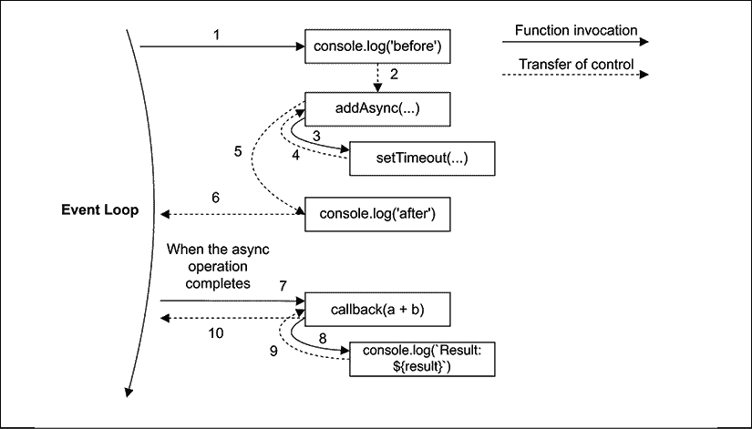

# 回调和事件

在同步编程中，我们将代码概念化为一系列连续的计算步骤，这些步骤解决特定问题。每个操作都是阻塞的，这意味着只有当操作完成时，才能执行下一个操作。这种方法使得代码非常易于阅读、理解和调试。

在另一方面，在异步编程中，一些操作，如读取文件或执行网络请求，被启动并在“后台”执行。当我们调用异步操作时，接下来的指令会立即执行，即使前面的异步操作尚未完成。在这种情况下，我们需要一种方式来通知异步操作完成，然后使用操作的结果继续执行流程。在 Node.js 中，通知异步操作完成的最基本机制是**回调**，它只是由运行时调用的一个函数，该函数带有异步操作的结果。

回调是所有其他异步机制的基础性构建块。实际上，没有回调，我们就不会有承诺，因此也不会有 async/await；我们也不会有流或事件。这就是为什么了解回调的工作原理很重要的原因。

在本章中，你将更深入地了解 Node.js 回调模式，并理解在实践中编写异步代码意味着什么。我们将逐步了解约定、模式和陷阱，到本章结束时，你将掌握回调模式的基础。

你还将了解观察者模式，它可以被认为是回调模式的一个近亲。观察者模式——由`EventEmitter`体现——使用回调来处理多个异构事件，并且在 Node.js 编程中是最广泛使用的组件之一。

总结来说，这是本章你将学习的内容：

+   回调模式的工作原理、Node.js 中使用的约定以及如何处理其最常见的陷阱

+   观察者模式及其在 Node.js 中使用`EventEmitter`类实现的方法

# 回调模式

回调是反应器模式（在前一章中介绍）的处理器的具体体现。它们是那些赋予 Node.js 独特编程风格印记之一。

回调是用于传播操作结果的函数，这正是我们在处理异步操作时所需要的。在异步世界中，它们取代了`return`指令的使用，而`return`指令始终是同步执行的。JavaScript 是回调的理想语言，因为函数是一等对象，可以轻松地分配给变量、作为参数传递、从另一个函数调用返回，或存储在数据结构中。实现回调的另一个理想结构是**闭包**。使用闭包，我们可以引用函数创建时的环境；这样，我们就可以始终维护异步操作请求的上下文，无论其回调何时或在哪里被调用。

如果你需要刷新关于闭包的知识，你可以参考 MDN Web Docs 上的文章[`nodejsdp.link/mdn-closures`](http://nodejsdp.link/mdn-closures)。

在本节中，我们将分析这种特定的编程风格，它使用回调而不是`return`指令。

## 延续传递风格

在 JavaScript 中，回调是一个作为参数传递给另一个函数的函数，当操作完成时，它将使用结果被调用。在函数式编程中，这种传播结果的方式被称为**延续传递风格**（**CPS**）。

这是一个通用概念，它并不总是与异步操作相关联。事实上，它仅仅表明结果是通过传递给另一个函数（回调）来传播的，而不是直接返回给调用者。

### 同步 CPS

为了阐明这个概念，让我们看看一个简单的同步函数：

```js
function add (a, b) {
  return a + b
} 
```

如果你在这里感到困惑，这里并没有什么特殊的事情发生。结果是使用`return`指令返回给调用者的。这也被称为**直接风格**，它代表了同步编程中返回结果最常见的方式。

前一个函数的等价 CPS 如下所示：

```js
function addCps (a, b, callback) {
  callback(a + b)
} 
```

`addCps()`函数是一个同步的 CPS 函数。它是同步的，因为它只有在回调完成执行后才会完成其执行。以下代码演示了这一点：

```js
console.log('before')
addCps(1, 2, result => console.log(`Result: ${result}`))
console.log('after') 
```

由于`addCps()`是同步的，之前的代码将简单地打印以下内容：

```js
before
Result: 3
after 
```

现在，让我们看看异步 CPS 是如何工作的。

### 异步 CPS

让我们考虑一个`addCps()`函数是异步的情况：

```js
function additionAsync (a, b, callback) {
  setTimeout(() => callback(a + b), 100)
} 
```

在之前的代码中，我们使用`setTimeout()`来模拟回调的异步调用。`setTimeout()`将任务添加到事件队列中，在给定数量的毫秒数后执行。这显然是一个异步操作。现在，让我们尝试使用`additionAsync()`并看看操作顺序如何变化：

```js
console.log('before')
additionAsync(1, 2, result => console.log(`Result: ${result}`))
console.log('after') 
```

上述代码将打印以下内容：

```js
before
after
Result: 3 
```

由于`setTimeout()`触发异步操作，它不会等待回调执行；相反，它立即返回，将控制权交还给`additionAsync()`，然后再交还给其调用者。在 Node.js 中，这个特性至关重要，因为它在发送异步请求后立即将控制权交还给事件循环，从而允许处理队列中的新事件。

*图 3.1* 展示了它是如何工作的：



图 3.1：异步函数调用的控制流

当异步操作完成时，执行将从导致展开的异步函数提供的回调处恢复，从事件循环开始，因此它有一个新的栈。这正是 JavaScript 真正派上用场的地方。多亏了闭包，即使回调在时间上和位置上不同，也能轻松地维护异步函数调用者的上下文。

总结一下，同步函数会阻塞直到完成其操作。异步函数立即返回，并在事件循环的后续周期将结果传递给处理程序（在我们的例子中，是一个回调）。

### 非 CPS 回调

在某些情况下，回调参数的存在可能会让我们认为一个函数是异步的或正在使用 CPS（Continuation Passing Style）。这并不总是正确的。以`Array`对象的`map()`方法为例：

```js
const result = [1, 5, 7].map(element => element - 1)
console.log(result) // [0, 4, 6] 
```

显然，回调仅用于遍历数组的元素，而不是传递操作的结果。实际上，结果是通过直接风格同步返回的。非 CPS 回调和 CPS 回调之间没有语法上的区别。因此，回调的意图应在 API 的文档中明确说明。

在下一节中，我们将讨论每个 Node.js 开发者都应该注意的回调的一个最重要的陷阱。

## 同步或异步？

您已经看到，根据函数的性质（同步或异步），指令的执行顺序发生了根本性的变化。这在正确性和效率方面对整个应用程序的流程都有强烈的影响。以下是对这两种范式及其缺陷的分析。一般来说，必须避免在 API 的性质上造成不一致和混淆，因为这样做可能会导致一系列可能很难检测和重现的问题。为了推动我们的分析，我们将以一个不一致的异步函数为例。

### 一个不可预测的函数

最危险的情况之一是 API 在某些条件下表现为同步，而在其他条件下表现为异步。以下代码是一个例子：

```js
import { readFile } from 'fs'
const cache = new Map()
function inconsistentRead (filename, cb) {
  if (cache.has(filename)) {
    // invoked synchronously
    cb(cache.get(filename))
  } else {
    // asynchronous function
    readFile(filename, 'utf8', (err, data) => {
      cache.set(filename, data)
      cb(data)
    })
  }
} 
```

前面的函数使用`cache`映射来存储不同文件读取操作的结果。请记住，这只是一个例子；它没有错误管理，并且缓存逻辑本身也不是最优的（在*第十一章*，*高级技巧*中，您将学习如何正确处理异步缓存）。但除此之外，前面的函数是危险的，因为它在第一次读取文件并设置缓存之前是异步的，但在文件内容已经在缓存中之后，对于所有后续请求都是同步的。

### 解放 Zalgo

现在，让我们讨论一下使用不可预测的函数，例如我们刚刚定义的函数，如何轻易地破坏一个应用程序。考虑以下代码：

```js
function createFileReader (filename) {
  const listeners = []
  inconsistentRead(filename, value => {
    listeners.forEach(listener => listener(value))
  })
  return {
    onDataReady: listener => listeners.push(listener)
  }
} 
```

当前面的函数被调用时，它创建了一个新的对象，充当通知器，允许我们为文件读取操作设置多个监听器。当读取操作完成且数据可用时，所有监听器将同时被调用。前面的函数使用我们的`inconsistentRead()`函数来实现这一功能。让我们看看如何使用`createFileReader()`函数：

```js
const reader1 = createFileReader('data.txt')
reader1.onDataReady(data => {
  console.log(`First call data: ${data}`)
  // ...sometime later we try to read again from
  // the same file
  const reader2 = createFileReader('data.txt')
  reader2.onDataReady(data => {
    console.log(`Second call data: ${data}`)
  })
}) 
```

前面的代码将打印以下内容：

```js
First call data: some data 
```

如您所见，第二个读者的回调从未被调用。让我们看看原因：

+   在创建`reader1`期间，我们的`inconsistentRead()`函数是异步的，因为没有可用的缓存结果。这意味着任何`onDataReady`监听器将在事件循环的另一个周期中稍后调用，所以我们有足够的时间注册我们的监听器。

+   然后，`reader2`是在事件循环的某个周期中创建的，此时请求的文件的缓存已经存在。在这种情况下，对`inconsistentRead()`的内部调用将是同步的。因此，它的回调将立即被调用，这意味着`reader2`的所有监听器也将同步调用。然而，我们在`reader2`创建之后注册监听器，所以它永远不会被调用。

我们的`inconsistentRead()`函数的回调行为真的很不可预测，因为它取决于许多因素，例如其调用的频率、作为参数传递的文件名以及加载文件所需的时间。

您刚才看到的错误在真实应用程序中可能非常复杂，难以识别和重现。想象一下在一个网络服务器中使用类似的函数，那里可能有多个并发请求。想象一下看到一些请求挂起，没有任何明显的原因，也没有记录任何错误。这绝对可以被认为是一个讨厌的缺陷。

npm 的创建者、前 Node.js 项目负责人 Isaac Z. Schlueter 在他的博客文章中，将这种不可预测函数的使用比作*释放 Zalgo*。

Zalgo 是一个关于一个被认为会导致疯狂、死亡和世界毁灭的邪恶实体的互联网传说。如果您不熟悉 Zalgo，欢迎您去了解它是什么。

您可以在[Isaac Z. Schlueter 的原始帖子](http://nodejsdp.link/unleashing-zalgo)中找到。

### 使用同步 API

从释放 Zalgo 的例子中可以学到的是，对于 API 来说，明确定义其性质至关重要：要么是同步的，要么是异步的。

对我们的`inconsistentRead()`函数的一个可能的修复方案是使其完全同步。这是可能的，因为 Node.js 为大多数基本 I/O 操作提供了一套同步直接风格 API。例如，我们可以使用`fs.readFileSync()`函数来代替其异步对应函数。代码将如下所示：

```js
import { readFileSync } from 'fs'
const cache = new Map()
function consistentReadSync (filename) {
  if (cache.has(filename)) {
    return cache.get(filename)
  } else {
    const data = readFileSync(filename, 'utf8')
    cache.set(filename, data)
    return data
  }
} 
```

您可以看到，整个函数也被转换成了直接风格。如果一个函数是同步的，那么它没有必要使用 CPS（Continuation Passing Style）。实际上，始终使用直接风格实现同步 API 是最佳实践。这将消除对其本质的任何混淆，并且从性能角度来看也会更高效。

**模式**

总是为纯同步函数选择直接风格。

请记住，将 API 从 CPS（Continuation Passing Style）转换为直接风格，或从异步转换为同步或反之亦然，可能还需要更改所有使用该 API 的代码的风格。例如，在我们的案例中，我们将不得不完全更改`createFileReader()`API 的接口，并使其始终以同步方式工作。

此外，使用同步 API 而不是异步 API 也有一些注意事项：

+   对于特定的功能，同步 API 可能并不总是可用。

+   同步 API 将阻塞事件循环，并暂停任何并发请求。这将破坏 Node.js 的并发模型，减慢整个应用程序的速度。您将在本书的后面部分看到这对我们的应用程序真正意味着什么。

在我们的`consistentReadSync()`函数中，由于同步 I/O API 仅在每次调用时针对每个文件名调用一次，而缓存的值将被用于所有后续调用，因此部分缓解了阻塞事件循环的风险。如果我们有有限数量的静态文件，那么使用`consistentReadSync()`对我们的事件循环不会有太大影响。如果我们必须读取许多文件，并且只读取一次，那么情况可能会迅速变化。

在许多情况下，在 Node.js 中使用同步 I/O 被强烈反对，但在某些情况下，这可能是最简单、最有效率的解决方案。始终评估您的特定用例，以便选择正确的替代方案。例如，在启动应用程序时使用同步阻塞 API 加载配置文件是完全合理的。

**模式**

适度使用阻塞 API，并且仅在它们不影响应用程序处理并发异步操作的能力时使用。

### 使用延迟执行保证异步性

另一个修复我们的 `inconsistentRead()` 函数的替代方案是使其完全异步。这里的技巧是将同步回调调用安排在“将来”执行，而不是在同一个事件循环周期内立即执行。在 Node.js 中，这可以通过 `process.nextTick()` 实现，它会在当前运行的操作完成后延迟函数的执行。它的功能非常简单：它接受一个回调作为参数，并将其推送到事件队列的顶部，在所有挂起的 I/O 事件之前，并立即返回。然后，回调将在当前运行的操作将控制权交回事件循环时立即被调用。

让我们将这种技术应用到修复我们的 `inconsistentRead()` 函数，如下所示：

```js
import { readFile } from 'fs'
const cache = new Map()
function consistentReadAsync (filename, callback) {
  if (cache.has(filename)) {
    // deferred callback invocation
    process.nextTick(() => callback(cache.get(filename)))
  } else {
    // asynchronous function
    readFile(filename, 'utf8', (err, data) => {
      cache.set(filename, data)
      callback(data)
    })
  }
} 
```

现在，多亏了 `process.nextTick()`，我们的函数在任何情况下都能保证异步调用其回调。尝试用它来代替 `inconsistentRead()` 函数，并验证确实已经消除了 Zalgo。

**模式**

你可以通过使用 `process.nextTick()` 来延迟回调的执行，从而保证回调异步调用。

另一个用于延迟代码执行的 API 是 `setImmediate()`。虽然它的目的与 `process.nextTick()` 非常相似，但其语义却大不相同。使用 `process.nextTick()` 延迟的回调被称为 **微任务**，它们将在当前操作完成后立即执行，甚至在任何其他 I/O 事件触发之前。另一方面，使用 `setImmediate()`，执行将在所有 I/O 事件处理完毕后的一个事件循环阶段中排队。由于 `process.nextTick()` 在任何已安排的 I/O 之前运行，它将更快地执行，但在某些情况下，它也可能无限期地延迟任何 I/O 回调的运行（也称为 **I/O 饥饿**），例如在递归调用的情况下。而 `setImmediate()` 永远不会发生这种情况。

使用 `setTimeout(callback, 0)` 的行为与 `setImmediate()` 类似，但在典型情况下，使用 `setImmediate()` 安排的回调比使用 `setTimeout(callback, 0)` 安排的回调执行得更快。要了解为什么，我们必须考虑事件循环在不同的阶段执行所有回调；对于我们所考虑的事件类型，我们有定时器（`setTimeout()`），它在 I/O 回调之前执行，而 I/O 回调又会在 `setImmediate()` 回调之前执行。这意味着，如果我们在一个 `setTimeout()` 回调、一个 I/O 回调，或者在这两个阶段之后的微任务队列中安排一个 `setImmediate()` 任务，那么回调将在紧接当前阶段的阶段中执行。`setTimeout()` 回调必须等待事件循环的下一个周期。

当我们分析本书后面使用延迟调用运行同步 CPU 密集型任务时，你会更好地理解这些 API 之间的区别。

接下来，我们将探讨在 Node.js 中定义回调所使用的约定。

## Node.js 回调约定

在 Node.js 中，CPS API 和回调遵循一组特定的约定。这些约定适用于 Node.js 核心 API，但也被绝大多数用户模块和应用所遵循。因此，了解这些约定并在需要设计使用回调的异步 API 时确保遵守它们非常重要。

### 回调放在最后

在所有核心 Node.js 函数中，标准约定是当一个函数接受回调作为输入时，必须将其作为最后一个参数传递。

让我们以下面的 Node.js 核心 API 为例：

```js
readFile(filename, [options], callback) 
```

如您从前面函数的签名中看到的，回调总是放在最后一个位置，即使在存在可选参数的情况下也是如此。这种约定的原因是，如果回调在原地定义，函数调用将更易于阅读。

### 任何错误总是首先出现

在 CPS 中，错误像任何其他类型的结果一样传播，这意味着使用回调。在 Node.js 中，由 CPS 函数产生的任何错误总是作为回调的第一个参数传递，任何实际的结果从第二个参数开始传递。如果操作成功且没有错误，第一个参数将是 `null` 或 `undefined`。以下代码展示了如何定义符合此约定的回调：

```js
readFile('foo.txt', 'utf8', (err, data) => {
  if(err) {
    handleError(err)
  } else {
    processData(data)
  }
}) 
```

总是检查错误的存在是一种最佳实践，因为不这样做会使您更难调试代码并发现可能的失败点。另一个需要考虑的重要约定是，错误必须始终是 `Error` 类型。这意味着简单的字符串或数字永远不会作为错误对象传递。

### 传播错误

在同步、直接风格的函数中传播错误使用的是众所周知的 `throw` 语句，它会导致错误在调用栈中向上跳转，直到被捕获。

然而，在异步 CPS 中，通过简单地将错误传递给链中的下一个回调来正确地传播错误。典型的模式如下：

```js
import { readFile } from 'fs'
function readJSON (filename, callback) {
  readFile(filename, 'utf8', (err, data) => {
    let parsed
    if (err) {
      // propagate the error and exit the current function
      return callback(err)
    }
    try {
      // parse the file contents
      parsed = JSON.parse(data)
    } catch (err) {
      // catch parsing errors
      return callback(err)
    }
    // no errors, propagate just the data
    callback(null, parsed)
  })
} 
```

注意我们是如何传播 `readFile()` 操作接收到的错误的。我们既没有抛出它，也没有返回它；相反，我们只是像使用任何其他结果一样使用回调。此外，注意我们是如何使用 `try...catch` 语句来捕获 `JSON.parse()` 抛出的任何错误，这是一个同步函数，因此使用传统的 `throw` 指令将错误传播给调用者的。最后，如果一切顺利，`callback` 将以 `null` 作为第一个参数被调用，表示没有错误。

也很有趣地注意到我们如何在 `try` 块中避免调用 `callback`。这是因为这样做会捕获从回调执行中抛出的任何错误，而这通常不是我们想要的。

### 未捕获的异常

有时，可能会发生错误被抛出但未在异步函数的回调中捕获的情况。例如，如果我们忘记在之前定义的`readJSON()`函数中将`JSON.parse()`用`try...catch`语句包裹起来。在异步回调内部抛出错误会导致错误跳转到事件循环，因此它永远不会传播到下一个回调。在 Node.js 中，这是一个无法恢复的状态，应用程序将以非零退出代码退出，并将堆栈跟踪打印到`stderr`接口。

为了演示这一点，让我们尝试从之前定义的`readJSON()`函数中移除围绕`JSON.parse()`的`try...catch`块：

```js
function readJSONThrows (filename, callback) {
  readFile(filename, 'utf8', (err, data) => {
    if (err) {
      return callback(err)
    }
    callback(null, JSON.parse(data))
  })
} 
```

现在，在我们刚刚定义的函数中，没有方法可以捕获来自`JSON.parse()`的潜在异常。如果我们尝试用以下代码解析一个无效的 JSON 文件：

```js
readJSONThrows('invalid_json.json', (err) => console.error(err)) 
```

这将导致应用程序突然终止，控制台上将打印出类似于以下内容的堆栈跟踪：

```js
SyntaxError: Unexpected token h in JSON at position 1
    at JSON.parse (<anonymous>)
    at file:///.../03-callbacks-and-events/08-uncaught-errors/index.js:8:25
    at FSReqCallback.readFileAfterClose [as oncomplete] (internal/fs/read_file_context.js:61:3) 
```

现在，如果你查看前面的堆栈跟踪，你会看到它从内置的`fs`模块内部开始，并且正好是从原生 API 完成读取并将结果通过事件循环返回到`fs.readFile()`函数的那个点。这清楚地表明异常是从我们的回调，沿着调用栈向上，然后直接进入事件循环，最终在那里被捕获并抛出到控制台。

这也意味着将`readJSONThrows()`的调用用`try...catch`块包裹起来不会起作用，因为该块操作的栈与我们的回调被调用的栈不同。以下代码展示了刚刚描述的反模式：

```js
try {
  readJSONThrows('invalid_json.json', (err) => console.error(err))
} catch (err) {
  console.log('This will NOT catch the JSON parsing exception')
} 
```

前面的`catch`语句永远不会收到 JSON 解析错误，因为它将在抛出错误的调用栈中向上传播，即事件循环中，而不是触发异步操作的那个函数中。

如前所述，当异常到达事件循环时，应用程序将终止。然而，我们仍然有机会在应用程序终止之前执行一些清理或记录操作。事实上，当这种情况发生时，Node.js 将在退出进程之前发出一个名为`uncaughtException`的特殊事件。以下代码展示了示例用法：

```js
process.on('uncaughtException', (err) => {
  console.error(`This will catch at last the JSON parsing exception: ${err.message}`)
  // Terminates the application with 1 (error) as exit code.
  // Without the following line, the application would continue
  process.exit(1)
}) 
```

重要的是要理解，未捕获的异常会使应用程序处于一种无法保证一致性的状态，这可能导致不可预见的问题。例如，可能仍然有未完成的 I/O 请求正在运行，或者闭包可能已经变得不一致。这就是为什么在收到未捕获的异常后，始终建议，尤其是在生产环境中，不要让应用程序在异常后继续运行。相反，进程应立即退出，可选地运行一些必要的清理任务，理想情况下，监督进程应重新启动应用程序。这也被称为 **fail-fast** 方法，并且在 Node.js 中是推荐的做法。

我们将在第十二章，*可扩展性和架构模式*中更详细地讨论监督者（supervisors）。

这就结束了我们对回调模式的温和介绍。现在，是时候认识观察者模式了，它是 Node.js 这样的事件驱动平台中的另一个关键组件。

# 观察者模式

在 Node.js 中使用的另一个重要且基本的设计模式是 **观察者模式**。与反应器模式（Reactor pattern）和回调函数（callbacks）一起，观察者模式是掌握 Node.js 异步世界的绝对要求。

观察者模式是模拟 Node.js 的反应性特性的理想解决方案，并且是回调函数的完美补充。让我们给出一个正式的定义，如下：

观察者模式定义了一个对象（称为主题），当其状态发生变化时，可以通知一组观察者（或监听器）。

与回调模式的主要区别在于，主题（subject）实际上可以通知多个观察者（observers），而传统的 CPS 回调通常只会将结果传播给一个监听器，即回调函数。

## EventEmitter

在传统的面向对象编程中，观察者模式需要接口、具体类和层次结构。在 Node.js 中，所有这些都变得简单得多。观察者模式已经内置到核心中，并通过 `EventEmitter` 类提供。`EventEmitter` 类允许我们将一个或多个函数注册为监听器，当触发特定事件类型时，这些函数将被调用。*图 3.2* 从视觉上解释了这一概念：


图 3.2：监听器从 EventEmitter 接收事件

`EventEmitter` 是从 `events` 核心模块导出的。以下代码展示了我们如何获取对其的引用：

```js
import { EventEmitter } from 'events'
const emitter = new EventEmitter() 
```

`EventEmitter` 的基本方法如下：

+   `on(event, listener)`: 此方法允许我们为给定的事件类型（字符串）注册一个新的监听器（函数）。

+   `once(event, listener)`: 此方法注册一个新的监听器，在事件首次发出后将被移除。

+   `emit(event, [arg1], [...])`: 此方法产生一个新的事件，并提供额外的参数传递给监听器。

+   `removeListener(event, listener)`: 此方法移除指定事件类型的监听器。

所有的前面方法都会返回 `EventEmitter` 实例以允许链式调用。`listener` 函数的签名是 `function([arg1], [...])`，所以它简单地接受在事件发出时提供的参数。

你已经可以看到，监听器与传统 Node.js 回调之间有一个很大的区别。实际上，第一个参数不是一个错误，但它可以是调用 `emit()` 时传递的任何数据。

## 创建和使用 EventEmitter

现在我们来看看我们如何在实际中使用一个 `EventEmitter`。最简单的方法是创建一个新的实例并立即使用它。以下代码展示了一个函数，它使用 `EventEmitter` 在实时中通知其订阅者当在文件列表中匹配到特定的正则表达式时：

```js
import { EventEmitter } from 'events'
import { readFile } from 'fs'
function findRegex (files, regex) {
  const emitter = new EventEmitter()
  for (const file of files) {
    readFile(file, 'utf8', (err, content) => {
      if (err) {
        return emitter.emit('error', err)
      }
      emitter.emit('fileread', file)
      const match = content.match(regex)
      if (match) {
        match.forEach(elem => emitter.emit('found', file, elem))
      }
    })
  }
  return emitter
} 
```

我们刚才定义的函数返回一个 `EventEmitter` 实例，该实例将产生三个事件：

+   `fileread`，当正在读取文件时

+   `found`，当找到匹配项时

+   `error`，当读取文件时发生错误

现在我们来看看我们的 `findRegex()` 函数如何使用：

```js
findRegex(
  ['fileA.txt', 'fileB.json'],
  /hello \w+/g
)
  .on('fileread', file => console.log(`${file} was read`))
  .on('found', (file, match) => console.log(`Matched "${match}" in ${file}`))
  .on('error', err => console.error(`Error emitted ${err.message}`)) 
```

在我们刚才定义的代码中，我们为 `findRegex()` 函数创建的 `EventEmitter` 产生的三种事件类型中的每一种都注册了一个监听器。

## 传播错误

与回调一样，当发生错误条件时，`EventEmitter` 不能只是 `throw` 一个异常。相反，惯例是发出一个特殊的事件，称为 `error`，并将一个 `Error` 对象作为参数传递。这正是我们在之前定义的 `findRegex()` 函数中所做的。

`EventEmitter` 会以特殊的方式处理 `error` 事件。如果发出此类事件且没有找到相关监听器，它将自动抛出异常并退出应用程序。因此，建议始终为 `error` 事件注册监听器。

## 使任何对象可观察

在 Node.js 的世界中，正如你在前面的例子中看到的，`EventEmitter` 很少单独使用。相反，它更常见的是被其他类扩展。在实践中，这使任何类都能继承 `EventEmitter` 的功能，从而成为一个可观察的对象。

为了演示这个模式，让我们尝试在一个类中实现 `findRegex()` 函数的功能，如下所示：

```js
import { EventEmitter } from 'events'
import { readFile } from 'fs'
class FindRegex extends EventEmitter {
  constructor (regex) {
    super()
    this.regex = regex
    this.files = []
  }
  addFile (file) {
    this.files.push(file)
    return this
  }
  find () {
    for (const file of this.files) {
      readFile(file, 'utf8', (err, content) => {
        if (err) {
          return this.emit('error', err)
        }
        this.emit('fileread', file)
        const match = content.match(this.regex)
        if (match) {
          match.forEach(elem => this.emit('found', file, elem))
        }
      })
    }
    return this
  }
} 
```

我们刚才定义的 `FindRegex` 类通过扩展 `EventEmitter` 成为一个完整的可观察类。始终记得在构造函数中使用 `super()` 来初始化 `EventEmitter` 的内部结构。

以下是我们刚才定义的 `FindRegex` 类的用法示例：

```js
const findRegexInstance = new FindRegex(/hello \w+/)
findRegexInstance
  .addFile('fileA.txt')
  .addFile('fileB.json')
  .find()
  .on('found', (file, match) => console.log(`Matched "${match}" in file ${file}`))
  .on('error', err => console.error(`Error emitted ${err.message}`)) 
```

你现在会注意到`FindRegex`对象也提供了`on()`方法，这是从`EventEmitter`继承而来的。这在 Node.js 生态系统中是一个相当常见的模式。例如，核心 HTTP 模块的`Server`对象继承自`EventEmitter`函数，因此它能够产生诸如`request`（当接收到新请求时）、`connection`（当建立新连接时）或`closed`（当服务器套接字关闭时）等事件。

扩展`EventEmitter`的其他显著例子是 Node.js 流。我们将在*第六章*，*使用流进行编码*中更详细地分析流。

## EventEmitter 和内存泄漏

当订阅具有长期生命周期的可观察对象时，一旦不再需要，我们取消订阅监听器非常重要。这允许我们释放监听器作用域中对象使用的内存，并防止**内存泄漏**。未释放的`EventEmitter`监听器是 Node.js（以及 JavaScript 总体上）中内存泄漏的主要来源。

内存泄漏是一种软件缺陷，其中不再需要的内存没有被释放，导致应用程序的内存使用无限增长。例如，考虑以下代码：

```js
const thisTakesMemory = 'A big string....'
const listener = () => {
  console.log(thisTakesMemory)
}
emitter.on('an_event', listener) 
```

变量`thisTakesMemory`在监听器中被引用，因此它的内存保留直到监听器从`emitter`中释放，或者直到`emitter`本身被垃圾回收，这只能发生在没有更多活动引用它时，使其变得不可达。

你可以在[nodejsdp.link/garbage-collection](http://nodejsdp.link/garbage-collection)找到关于 JavaScript 垃圾回收和可达性概念的详细解释。

这意味着如果一个`EventEmitter`在整个应用程序运行期间都保持可达状态，那么所有它的监听器也是如此，以及它们所引用的所有内存。例如，如果我们为每个进入的 HTTP 请求注册一个监听器到“永久”的`EventEmitter`，并且从不释放它，那么我们就会导致内存泄漏。应用程序使用的内存将无限增长，有时缓慢，有时快速，但最终会导致应用程序崩溃。为了防止这种情况，我们可以使用`EventEmitter`的`removeListener()`方法来释放监听器：

```js
emitter.removeListener('an_event', listener) 
```

`EventEmitter`有一个非常简单的内置机制来警告开发者关于可能的内存泄漏。当一个事件注册的监听器数量超过特定数量（默认为 10）时，`EventEmitter`将产生一个警告。有时，注册超过 10 个监听器是完全正常的，因此我们可以通过使用`EventEmitter`的`setMaxListeners()`方法来调整这个限制。

我们可以用`once(event, listener)`便利方法代替`on(event, listener)`，在事件第一次接收后自动注销监听器。然而，请注意，如果我们指定的事件从未发出，那么监听器永远不会释放，这可能导致内存泄漏。

## 同步和异步事件

与回调函数一样，事件也可以相对于触发产生它们的任务的时间同步或异步地发出。我们绝对不能在同一个`EventEmitter`中混合这两种方法，但更重要的是，我们绝对不应该使用同步和异步代码的混合来发出相同的事件类型，以避免在*Unleashing Zalgo*部分中描述的相同问题。同步和异步事件之间的主要区别在于监听器注册的方式。

当事件异步发出时，我们可以在触发产生事件的任务之后注册新的监听器，直到当前调用栈将控制权交给事件循环。这是因为事件保证不会在事件循环的下一个周期之前被触发，因此我们可以确信我们不会错过任何事件。

我们之前定义的`FindRegex()`类在调用`find()`方法后异步发出其事件。这就是为什么我们可以在调用`find()`方法之后注册监听器，而不会丢失任何事件，如下面的代码所示：

```js
findRegexInstance
  .addFile(...)
  .find()
  .on('found', ...) 
```

另一方面，如果我们启动任务后同步地发出事件，我们必须在启动任务之前注册所有监听器，否则我们会错过所有事件。为了了解这是如何工作的，让我们修改之前定义的`FindRegex`类，并将`find()`方法改为同步：

```js
find () {
  for (const file of this.files) {
    let content
    try {
      content = readFileSync(file, 'utf8')
    } catch (err) {
      this.emit('error', err)
    }
    this.emit('fileread', file)
    const match = content.match(this.regex)
    if (match) {
      match.forEach(elem => this.emit('found', file, elem))
    }
  }
  return this
} 
```

现在，在我们启动`find()`任务之前，让我们尝试注册一个监听器，然后在该任务启动后注册第二个监听器，看看会发生什么：

```js
const findRegexSyncInstance = new FindRegexSync(/hello \w+/)
findRegexSyncInstance
  .addFile('fileA.txt')
  .addFile('fileB.json')
  // this listener is invoked
  .on('found', (file, match) => console.log(`[Before] Matched "${match}"`))
  .find()
  // this listener is never invoked
  .on('found', (file, match) => console.log(`[After] Matched "${match}"`)) 
```

如预期的那样，在`find()`任务调用之后注册的监听器永远不会被调用；实际上，前面的代码将打印：

```js
[Before] Matched "hello world"
[Before] Matched "hello NodeJS" 
```

有一些（很少见）情况下，以同步方式发出事件是有意义的，但`EventEmitter`的本质在于其处理异步事件的能力。大多数时候，同步发出事件是一个明显的迹象，表明我们根本不需要`EventEmitter`，或者在其他地方，同一个可观察对象正在异步地发出另一个事件，这可能导致 Zalgo 类型的情况。

可以使用`process.nextTick()`将同步事件的发出延迟，以确保它们是异步发出的。

## `EventEmitter`与回调函数

定义异步 API 时常见的困境是决定是否使用`EventEmitter`或简单地接受回调。一般区分规则是语义的：当需要以异步方式返回结果时，应使用回调；而当需要传达某事已发生时，应使用事件。

但除了这个简单的原则之外，由于这两种范式在大多数情况下是等价的，并且允许我们达到相同的结果，因此会产生很多混淆。以下代码作为例子：

```js
import { EventEmitter } from 'events'
function helloEvents () {
  const eventEmitter = new EventEmitter()
  setTimeout(() => eventEmitter.emit('complete', 'hello world'), 100)
  return eventEmitter
}
function helloCallback (cb) {
  setTimeout(() => cb(null, 'hello world'), 100)
}
helloEvents().on('complete', message => console.log(message))
helloCallback((err, message) => console.log(message)) 
```

从功能的角度来看，`helloEvents()`和`helloCallback()`两个函数可以被认为是等价的。第一个使用事件传达超时的完成，而第二个使用回调。但真正区分它们的是可读性、语义以及实现或使用它们所需的代码量。

虽然不能给出一个确定性的规则来指导你选择一种风格或另一种风格，但以下是一些提示，帮助你决定使用哪种方法：

+   回调在支持不同类型的事件方面有一些局限性。实际上，我们仍然可以通过传递类型作为回调的参数或接受多个回调（每个回调对应一个支持的事件）来区分多个事件。然而，这不能被认为是一个优雅的 API。在这种情况下，`EventEmitter`可以提供更好的接口和更简洁的代码。

+   当同一个事件可能发生多次，或者根本不会发生时，应使用`EventEmitter`。实际上，回调预期只被调用一次，无论操作是否成功。存在可能重复的情况应该让我们重新思考发生的语义性质，这更类似于必须传达的事件，而不是要返回的结果。

+   使用回调的 API 只能通知一个特定的回调，而使用`EventEmitter`允许我们为同一事件注册多个监听器。

## 结合回调和事件

有一些特定情况下，`EventEmitter`可以与回调一起使用。这种模式非常强大，因为它允许我们使用传统的回调异步传递结果，同时返回一个`EventEmitter`，它可以用来提供关于异步过程状态的更详细说明。

这种模式的一个例子是由`glob`包提供的（[nodejsdp.link/npm-glob](http://nodejsdp.link/npm-glob)），这是一个执行 glob 样式的文件搜索的库。模块的主要入口点是它导出的函数，该函数具有以下签名：

```js
const eventEmitter = glob(pattern, [options], callback) 
```

函数接受一个 `pattern` 作为第一个参数，一组 `options`，以及一个 `callback`，该 `callback` 被调用时，会传入与提供的模式匹配的所有文件的列表。同时，该函数返回一个 `EventEmitter`，它提供了关于搜索过程状态的更详细报告。例如，可以通过监听 `match` 事件来实时通知匹配发生，通过 `end` 事件获取所有匹配文件的列表，或者通过监听 `abort` 事件来了解过程是否被手动终止。以下代码展示了实际应用中的样子：

```js
import glob from 'glob'
glob('data/*.txt',
  (err, files) => {
    if (err) {
      return console.error(err)
    }
    console.log(`All files found: ${JSON.stringify(files)}`)
  })
  .on('match', match => console.log(`Match found: ${match}`)) 
```

将 `EventEmitter` 与传统回调函数结合使用是一种优雅的方式来提供对同一 API 的两种不同方法。一种方法通常意味着更简单、更直接的使用方式，而另一种则针对更复杂的场景。

`EventEmitter` 还可以与其他异步机制（如承诺，我们将在第五章 *使用承诺和 Async/Await 的异步控制流模式* 中探讨）结合使用。在这种情况下，只需返回一个包含承诺和 `EventEmitter` 的对象（或数组）。然后，调用者可以像这样解构该对象：`{promise, events} = foo()`。

# 概述

在本章中，我们首次接触到了编写异步代码的实际方面。你发现了整个 Node.js 异步基础设施的两个支柱——回调和 `EventEmitter`——并且我们详细探讨了它们的使用案例、约定和模式。我们还探讨了处理异步代码的一些陷阱，并学习了避免它们的方法。掌握本章内容为学习本书其余部分将展示的更高级异步技术铺平了道路。

在下一章中，你将学习如何使用回调函数处理复杂的异步控制流。

# 练习

+   **3.1 简单事件**：修改异步 `FindRegex` 类，使其在查找过程开始时发出一个事件，并将输入文件列表作为参数传递。提示：注意 Zalgo 问题！

+   **3.2 计时器**：编写一个函数，该函数接受一个 `number` 和一个 `callback` 作为参数。该函数将返回一个 `EventEmitter`，该 `EventEmitter` 每隔 50 毫秒发出一个名为 `tick` 的事件，直到从函数调用开始经过的毫秒数达到指定的数值。当经过的毫秒数达到时，该函数还将调用 `callback`，并提供作为结果的 `tick` 事件的总计数。提示：可以使用 `setTimeout()` 递归地安排另一个 `setTimeout()`。

+   **3.3 简单修改**：修改在练习 3.2 中创建的函数，使其在函数调用后立即发出一个 `tick` 事件。

+   **3.4 玩转错误处理**：修改在练习 3.3 中创建的函数，使其在`tick`时刻（包括我们在练习 3.3 中添加的初始时刻）的戳记可以被 5 整除时产生一个错误。使用回调和事件发射器来传播这个错误。提示：使用`Date.now()`获取戳记，并使用取余（`%`）运算符来检查戳记是否可以被 5 整除。
