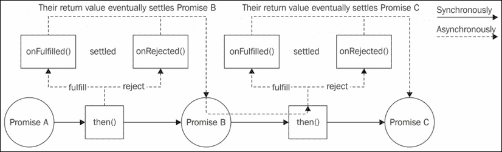
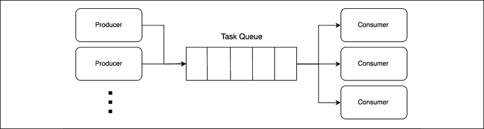

# 5

# 使用 Promise 和 Async/Await 的异步控制流模式

回调是 Node.js 中异步编程的低级构建块，但它们远非开发者友好。实际上，在上一个章节中，我们学习了使用回调实现不同控制流结构的技术，并且可以说，与它们试图完成的任务（低）复杂度相比，它们相当复杂且冗长。特别是串行执行流程，这是我们编写的代码中占主导地位的控制流结构，很容易导致未经训练的开发者编写受回调地狱问题影响的代码。除此之外，即使正确实现，串行执行流程似乎也过于复杂且容易出错。让我们也记住回调的错误管理是多么脆弱；如果我们忘记转发错误，那么它就会丢失，如果我们忘记捕获由某些同步代码抛出的任何异常，那么程序就会崩溃。而且这一切还不考虑 Zalgo 总是紧随其后。

Node.js 和 JavaScript 多年来一直因缺乏对如此常见且普遍存在的问题的本地解决方案而受到批评。幸运的是，多年来，社区一直在努力寻找新的解决方案，最终，经过许多迭代、讨论和多年的等待，今天我们终于有了对“回调问题”的适当解决方案。

向更好的异步代码体验迈出的第一步是**Promise**，一个“携带”异步操作状态和最终结果的对象。Promise 可以轻松地串联起来以实现串行执行流程，并且可以像任何其他对象一样移动。Promise 极大地简化了异步代码；然而，仍有改进的空间。因此，为了使普遍的串行执行流程尽可能简单，引入了一个新的构造，称为**async/await**，它最终可以使异步代码看起来像同步代码。

在当今的现代化 Node.js 编程中，async/await 是处理异步代码时首选的构造。然而，async/await 建立在 Promise 之上，正如 Promise 建立在回调之上。因此，了解并掌握所有这些内容对于以正确的方法解决我们的异步编程问题至关重要。

在本章中，你将学习以下内容：

+   Promise 的工作原理以及如何有效地使用它们来实现我们已知的控制流结构。

+   async/await 语法，这将成为我们在 Node.js 中处理异步代码的主要工具。

到本章结束时，你将了解 JavaScript 中用于驯服异步代码的两个最重要的组件。那么，让我们通过发现 Promise 来开始吧。

# Promise

承诺是 ECMAScript 2015 标准（或 ES6，这就是为什么它们也被称为 ES6 承诺）的一部分，并且自版本 4 以来在 Node.js 中原生可用。但承诺的历史可以追溯到几年前，当时有数十种实现，最初具有不同的功能和行为。最终，大多数这些实现都选择了一个称为**Promises/A+**的标准。

承诺代表了向提供对异步结果传播的健壮替代品迈出的重大一步。正如我们将看到的，使用承诺将使所有主要的异步控制流结构更容易阅读、更简洁、更健壮，与基于回调的替代品相比。

## 什么是承诺？

`Promise`是一个对象，它体现了异步操作最终的结果（或错误）。在承诺术语中，我们说当异步操作尚未完成时，`Promise`是**挂起的**，当操作成功完成时，它是**已履行的**，当操作因错误而终止时，它是**被拒绝的**。一旦`Promise`被履行或拒绝，它就被认为是**已解决的**。

要接收**履行值**或与拒绝相关的错误（**原因**），我们可以使用`Promise`实例的`then()`方法。以下是其签名：

```js
promise.then(onFulfilled, onRejected) 
```

在前面的签名中，`onFulfilled`是一个回调，它最终将接收`Promise`的履行值，而`onRejected`是另一个回调，它将接收拒绝的原因（如果有）。两者都是可选的。

为了了解承诺如何改变我们的代码，让我们考虑以下基于回调的代码：

```js
asyncOperation(arg, (err, result) => {
  if(err) {
    // handle the error
  }
  // do stuff with the result
}) 
```

承诺使我们能够将这种典型的传递风格代码转换为结构更好、更优雅的代码，如下所示：

```js
asyncOperationPromise(arg)
  .then(result => {
    // do stuff with result
  }, err => {
    // handle the error
  }) 
```

在上面的代码中，`asyncOperationPromise()`返回一个`Promise`，然后我们可以使用它来接收函数最终结果的履行值或拒绝原因。到目前为止，似乎没有什么重大事件发生，但`then()`方法的一个关键属性是它**同步地**返回另一个`Promise`。

此外，如果`onFulfilled`或`onRejected`函数中的任何一个返回一个值*x*，则`then()`方法返回的`Promise`将：

+   如果*x*是一个值，则使用*x*来履行

+   如果*x*是一个`Promise`，则使用*x*的履行值来履行

+   如果*x*是一个`Promise`，则使用*x*的最终拒绝原因来拒绝

这种行为允许我们构建承诺的*链*，使得异步操作可以轻松地聚合和排列成几个配置。此外，如果我们没有指定`onFulfilled`或`onRejected`处理程序，满足值或拒绝原因将自动转发到链中的下一个承诺。例如，这允许我们自动将错误传播到整个链，直到被`onRejected`处理程序捕获。有了承诺链，任务的顺序执行突然变得简单：

```js
asyncOperationPromise(arg)
  .then(result1 => {
    // returns another promise
    return asyncOperationPromise(arg2)
  })
  .then(result2 => {
    // returns a value
    return 'done'
  })
  .then(undefined, err => {
    // any error in the chain is caught here
  }) 
```

以下图表提供了对`Promise`链工作方式的另一种视角：



图 5.1：承诺链执行流程

*图 5.1*展示了当我们使用承诺链时程序是如何流动的。当我们对**Promise A**调用`then()`时，我们同步地接收到**Promise B**作为结果，当我们对**Promise B**调用`then()`时，我们同步地接收到**Promise C**作为结果。最终，当**Promise A**解决时，它将满足或拒绝，这会导致分别调用`onFulfilled()`或`onRejected()`回调。这样的回调执行结果将满足或拒绝**Promise B**，这样的结果反过来又传播到在**Promise B**上调用`then()`时传递给`onFulfilled()`或`onRejected()`回调。对**Promise C**和链中后续的任何其他承诺的执行将继续以类似的方式进行。

承诺的一个重要特性是，无论我们是否以同步方式使用值解决`Promise`，`onFulfilled()`和`onRejected()`回调都**保证**异步调用，并且最多调用一次。不仅如此，即使`Promise`对象在调用`then()`时已经处于已解决状态，`onFulfilled()`和`onRejected()`回调也会异步调用。这种行为保护我们的代码免受那些可能无意中释放 Zalgo（参见*第三章*，*回调和事件*）的情况，使我们的异步代码在无需额外努力的情况下更加一致和健壮。

现在是最好的一部分。如果在`onFulfilled()`或`onRejected()`处理程序中抛出异常（使用`throw`语句），则`then()`方法返回的`Promise`将自动拒绝，抛出的异常作为拒绝原因提供。这比 CPS 有巨大的优势，因为它意味着使用承诺，异常将自动在链中传播，`throw`语句最终变得可用。

## Promises/A+和 thenables

从历史上看，承诺有许多不同的实现，其中大多数互不兼容，这意味着无法在来自使用不同`Promise`实现的库的`Promise`对象之间创建链。

JavaScript 社区非常努力地解决这个限制，这些努力导致了 `Promises/A+` 规范的创建。该规范详细说明了 `then()` 方法的行为，提供了一个可互操作的基线，使得来自不同库的 `Promise` 对象能够无缝地相互工作。今天，大多数 `Promise` 实现都使用这个标准，包括 JavaScript 和 Node.js 的原生 `Promise` 对象。

对于 `Promises/A+` 规范的详细概述，你可以参考官方网站 [nodejsdp.link/promises-aplus](http://nodejsdp.link/promises-aplus)。

由于采用了 Promises/A+ 标准，许多 `Promise` 实现包括原生 JavaScript `Promise` API，都将任何具有 `then()` 方法的对象视为类似 `Promise` 的对象，也称为 **可等待的**。这种行为允许不同的 `Promise` 实现无缝地相互交互。

基于对象的外部行为（而不是其实际类型）来识别（或类型化）对象的技术称为 **鸭子类型**，并且在 JavaScript 中被广泛使用。

## Promise API

现在让我们快速浏览一下原生 JavaScript `Promise` 的 API。这只是一个概述，让你了解我们可以用 promises 做什么，所以如果你现在觉得事情不是很清楚，不要担心；我们将在整本书中有很多机会使用这些 API。

`Promise` 构造函数 (`new Promise((resolve, reject) => {})`) 创建一个新的 `Promise` 实例，该实例根据提供的函数的行为来满足或拒绝。构造函数提供的函数将接收两个参数：

+   `resolve(obj)`: 这是一个函数，当被调用时，会用提供的实现值来满足 `Promise`，如果 `obj` 是一个值，则 `obj` 将作为实现值。如果 `obj` 是一个 `Promise` 或一个可等待的值，则它将是 `obj` 的实现值。

+   `reject(err)`: 这个方法用原因 `err` 拒绝 `Promise`。按照惯例，`err` 应该是一个 `Error` 实例。

现在，让我们看看 `Promise` 对象最重要的静态方法：

+   `Promise.resolve(obj)`: 这个方法从一个 `Promise`、一个可等待的值或一个值创建一个新的 `Promise`。如果传递了一个 `Promise`，则直接返回该 `Promise`。如果提供了一个可等待的值，则将其转换为当前使用的 `Promise` 实现。如果提供了一个值，则 `Promise` 将使用该值来满足。

+   `Promise.reject(err)`: 这个方法创建一个拒绝的 `Promise`，其拒绝原因为 `err`。按照惯例，`err` 应该是一个 `Error` 实例。

+   `Promise.all(iterable)`: 这个方法创建一个`Promise`，当输入`iterable`（如`Array`）对象中的每个项目都完成时，它将完成。如果`iterable`对象中的任何`Promise`拒绝，则`Promise.all()`返回的`Promise`将拒绝，拒绝原因是第一个拒绝原因。`iterable`对象中的每个项目都可以是一个`Promise`、一个通用的`thenable`或一个值。

+   `Promise.allSettled(iterable)`: 这个方法等待所有输入`Promise`完成或拒绝，然后返回一个包含每个输入`Promise`的完成值或拒绝原因的对象数组。每个输出对象都有一个`status`属性，它可以等于`'fulfilled'`或`'rejected'`，以及一个包含完成值的`value`属性，或包含拒绝原因的`reason`属性。与`Promise.all()`的区别在于，`Promise.allSettled()`将始终等待每个`Promise`完成或拒绝，而不是在其中一个`Promise`拒绝时立即拒绝。

+   `Promise.race(iterable)`: 这个方法返回一个`Promise`，它与`iterable`中的第一个解决的`Promise`等价。

最后，以下是在`Promise`实例上可用的主要方法：

+   `promise.then(onFulfilled, onRejected)`: 这是`Promise`的基本方法。它的行为与之前提到的 Promises/A+标准兼容。

+   `promise.catch(onRejected)`: 这个方法只是`promise.then(undefined, onRejected)`的语法糖（[nodejsdp.link/syntactic-sugar](http://nodejsdp.link/syntactic-sugar)）。

+   `promise.finally(onFinally)`: 这个方法允许我们设置一个`onFinally`回调，当`Promise`解决（无论是完成还是拒绝）时将被调用。与`onFulfilled`和`onRejected`不同，`onFinally`回调不会接收任何输入参数，并且从它返回的任何值都将被忽略。`finally`返回的`Promise`将以当前`Promise`实例相同的完成值或拒绝原因解决。所有这些中只有一个例外，那就是我们在`onFinally`回调内部`throw`或返回一个拒绝的`Promise`的情况。在这种情况下，返回的`Promise`将拒绝，拒绝原因是抛出的错误或返回的拒绝`Promise`的拒绝原因。

现在我们来看一个例子，说明我们如何使用其构造函数从头开始创建一个`Promise`。

## 创建一个`Promise`

现在我们来看一下如何使用其构造函数创建一个`Promise`。从头开始创建`Promise`是一个低级操作，通常在我们需要将使用另一种异步风格的 API（例如基于回调的风格）转换为 API 时需要。大多数时候，作为开发者的我们，是其他库产生的`Promise`的消费者，我们创建的大多数`Promise`将来自`then()`方法。尽管如此，在某些高级场景中，我们需要手动使用其构造函数创建一个`Promise`。

为了演示如何使用`Promise`构造函数，让我们创建一个函数，该函数返回一个`Promise`，在指定数量的毫秒数后解析为当前日期。让我们看看它：

```js
function delay (milliseconds) {
  return new Promise((resolve, reject) => {
    setTimeout(() => {
      resolve(new Date())
    }, milliseconds)
  })
} 
```

如你可能已经猜到的，我们使用了`setTimeout()`来调用`Promise`构造函数的`resolve()`函数。我们可以注意到整个函数体都被`Promise`构造函数所包裹；这是在从头创建`Promise`时经常看到的一种代码模式。

我们刚才创建的`delay()`函数可以与以下代码一起使用：

```js
console.log(`Delaying...${new Date().getSeconds()}s`)
delay(1000)
  .then(newDate => {
    console.log(`Done ${newDate.getSeconds()}s`)
  }) 
```

`then()`处理程序中的`console.log()`将在调用`delay()`后大约 1 秒执行。

Promises/A+规范指出，`then()`方法的`onFulfilled`和`onRejected`回调必须只调用一次，并且是专一的（只调用一个或另一个）。一个符合规范的 Promise 实现确保即使我们多次调用`resolve`或`reject`，`Promise`也只被解析或拒绝一次。

## Promisification

当提前知道基于回调的函数的一些特性时，可以创建一个函数，将这样的基于回调的函数转换成返回`Promise`的等效函数。这种转换称为**promisification**。

例如，让我们考虑 Node.js 风格的基于回调的函数中使用的约定：

+   回调是函数的最后一个参数

+   （如果有的话）错误总是作为第一个参数传递给回调

+   任何返回值都传递给回调后的错误

基于这些规则，我们可以轻松地创建一个通用函数，将 Node.js 风格的基于回调的函数`promisifies`。让我们看看这个函数的样子：

```js
function promisify (callbackBasedApi) {
  return function promisified (...args) {
    return new Promise((resolve, reject) => {              // (1)
      const newArgs = [
        ...args,
        function (err, result) {                           // (2)
          if (err) {
            return reject(err)
          }
          resolve(result)
        }
      ]
      callbackBasedApi(...newArgs)                         // (3)
    })
  }
} 
```

前面的函数返回另一个名为`promisified()`的函数，它代表了作为输入提供的`callbackBasedApi`的 promisified 版本。这是它的工作方式：

1.  `promisified()`函数使用`Promise`构造函数创建一个新的`Promise`，并立即将其返回给调用者。

1.  在传递给`Promise`构造函数的函数中，我们确保将一个特殊的回调函数传递给`callbackBasedApi`。因为我们知道回调函数总是最后到来，所以我们只需将它附加到传递给`promisified()`函数的参数列表（`args`）中。在特殊的回调函数中，如果我们收到一个错误，我们立即拒绝`Promise`；否则，我们使用给定的`result`来解析它。

1.  最后，我们只需使用我们构建的参数列表调用`callbackBasedApi`。

现在，让我们使用我们新创建的`promisify()`函数来 promisify 一个 Node.js 函数。我们可以使用核心`crypto`模块的`randomBytes()`函数，该函数生成包含指定数量随机字节的缓冲区。`randomBytes()`函数接受一个回调作为最后一个参数，并且遵循我们非常熟悉的约定。让我们看看它是什么样子：

```js
import { randomBytes } from 'crypto'
const randomBytesP = promisify(randomBytes)
randomBytesP(32)
  .then(buffer => {
    console.log(`Random bytes: ${buffer.toString()}`)
  }) 
```

之前的代码应该在控制台打印一些乱码；这是因为并非所有生成的字节都有对应的可打印字符。

我们在这里创建的承诺化函数仅用于教育目的，并且缺少一些功能，例如处理返回多个结果的回调的能力。在现实生活中，我们会使用`util`核心模块的`promisify()`函数来承诺化我们的 Node.js 风格的回调函数。您可以在[`nodejsdp.link/promisify`](http://nodejsdp.link/promisify)查看其文档。

## 顺序执行和迭代

现在我们已经知道足够的信息，可以将我们在上一章创建的网页蜘蛛应用程序转换为使用承诺。让我们直接从版本 2 开始，这个版本是按顺序下载网页链接的。

我们可以通过`fs`模块的`promises`对象访问核心`fs` API 的已承诺化版本。例如：`import { promises } from 'fs'`。

在`spider.js`模块中，首先需要执行的是导入我们的依赖项，并将我们打算使用的任何基于回调的函数进行承诺化：

```js
import { promises as fsPromises } from 'fs'                // (1)
import { dirname } from 'path'
import superagent from 'superagent'
import mkdirp from 'mkdirp'
import { urlToFilename, getPageLinks } from './utils.js'
import { promisify } from 'util'
const mkdirpPromises = promisify(mkdirp)                   // (2) 
```

与上一章的`spider.js`模块相比，这里有两个主要区别：

1.  我们导入`fs`模块的`promises`对象，以便访问所有已经承诺化的`fs`函数。

1.  我们手动承诺化`mkdirp()`函数。

现在，我们可以开始转换`download()`函数：

```js
function download (url, filename) {
  console.log(`Downloading ${url}`)
  let content
  return superagent.get(url)                               // (1)
    .then((res) => {
      content = res.text                                   // (2)
      return mkdirpPromises(dirname(filename))
    })
    .then(() => fsPromises.writeFile(filename, content))
    .then(() => {
      console.log(`Downloaded and saved: ${url}`)
      return content                                       // (3)
    })
} 
```

我们可以直接欣赏使用承诺实现顺序异步操作的优雅性。我们只需要一个干净且非常直观的`then()`调用链。

与函数的上一版本相比，这次我们利用了`superagent`包对承诺的原生支持。我们不是在`superagent.get()`返回的请求对象上调用`end()`，而是简单地调用`then()`来发送请求（1）并接收一个承诺，该承诺满足/拒绝请求的结果。

`download()`函数的最终返回值是链中最后一个`then()`调用的返回的`Promise`，它满足于网页的`content`（3），我们在第一个`then()`调用的`onFulfilled`处理程序中初始化了它。这确保了调用者只有在所有操作（`get`、`mkdirp`和`writeFile`）完成后才会收到满足于`content`的`Promise`。

在我们刚刚看到的`download()`函数中，我们已经按顺序执行了一组已知的异步操作。然而，在`spiderLinks()`函数中，我们必须处理对动态异步任务集的顺序迭代。让我们看看我们如何实现这一点：

```js
function spiderLinks (currentUrl, content, nesting) {
  let promise = Promise.resolve()                            // (1)
  if (nesting === 0) {
    return promise
  }
  const links = getPageLinks(currentUrl, content)
  for (const link of links) {
    promise = promise.then(() => spider(link, nesting - 1))  // (2)
  }
  return promise
} 
```

要异步遍历网页上的所有链接，我们不得不动态构建如下所示的承诺链：

1.  首先，我们定义了一个“空”的`Promise`，它解析为`undefined`。这个`Promise`被用作我们链的起点。

1.  然后，在循环中，我们使用链中前一个 `promise` 的 `then()` 调用获取一个新的 `Promise` 来更新 `promise` 变量。这实际上是我们使用 promises 的异步迭代模式。

在 `for` 循环的末尾，`promise` 变量将包含最后一个 `then()` 调用的 promise，因此它只有在链中的所有 promises 都已解决时才会解析。

**模式（使用 promises 的顺序迭代）**

使用循环动态构建一个 promises 链。

现在，我们终于可以将 `spider()` 函数转换：

```js
export function spider (url, nesting) {
  const filename = urlToFilename(url)
  return fsPromises.readFile(filename, 'utf8')
    .catch((err) => {
      if (err.code !== 'ENOENT') {
        throw err
      }
      // The file doesn't exist, so let's download it
      return download(url, filename)
    })
    .then(content => spiderLinks(url, content, nesting))
} 
```

在这个新的 `spider()` 函数中，我们使用 `catch()` 来处理由 `readFile()` 产生的任何错误。特别是，如果错误代码是 `'ENOENT'`，这意味着文件尚不存在，因此我们需要下载相应的 URL。`download()` 返回的 `Promise`，如果得到满足，将返回 URL 的 `content`。另一方面，如果 `readFile()` 生成的 `Promise` 得到满足，它将 *跳过* `catch()` 处理程序并直接进入下一个 `then()`。在这两种情况下，最后一个 `then()` 调用的 `onFulfilled` 处理程序将始终接收到网页的 `content`，无论是来自本地文件还是来自新的下载。

现在我们已经将 `spider()` 函数也转换好了，我们最终可以修改 `spider-cli.js` 模块：

```js
spider(url, nesting)
  .then(() => console.log('Download complete'))
  .catch(err => console.error(err)) 
```

这里的 `catch()` 处理程序将拦截来自整个 `spider()` 进程的任何错误。

如果我们再次审视迄今为止所编写的所有代码，我们会愉快地发现我们没有包含任何错误传播逻辑（正如在使用回调时我们被迫要做的那样）。这显然是一个巨大的优势，因为它大大减少了我们代码中的模板代码量以及遗漏任何异步错误的机会。

这完成了我们使用 promises 的网络爬虫应用程序第二个版本的实现。

使用 `reduce()` 函数的顺序迭代模式的替代方案，可以用于更紧凑的实现：

```js
const promise = tasks.reduce((prev, task) => {
  return prev.then(() => {
    return task()
  })
}, Promise.resolve()) 
```

## 并行执行

使用 promises 另一种变得简单的执行流程是并行执行流程。实际上，我们所需做的只是使用内置的 `Promise.all()` 方法。这个辅助函数创建了一个新的 `Promise`，只有当所有输入的 promises 都得到满足时才会得到满足。如果这些 promises 之间没有因果关系（例如，它们不是同一个 promises 链的一部分），那么它们将并行执行。

为了演示这一点，让我们考虑我们网络爬虫应用程序的第三个版本，它并行下载页面上的所有链接。让我们再次更新 `spiderLinks()` 函数以实现使用 promises 的并行执行流程：

```js
function spiderLinks (currentUrl, content, nesting) {
  if (nesting === 0) {
    return Promise.resolve()
  }
  const links = getPageLinks(currentUrl, content)
  const promises = links.map(link => spider(link, nesting - 1))
  return Promise.all(promises)
} 
```

这个模式包括在`links.map()`循环中同时启动所有`spider()`任务。同时，调用`spider()`返回的每个`Promise`都被收集到最终的`promises`数组中。与顺序迭代循环相比，这个循环的关键区别在于我们不需要等待列表中的前一个`spider()`任务完成就开始一个新的任务。所有`spider()`任务都在循环中同时启动，在相同的事件循环周期中。

一旦我们有了所有的承诺，我们将它们传递给`Promise.all()`方法，它返回一个新的`Promise`，当数组中的所有承诺都满足时，它将被满足。换句话说，当所有下载任务完成时，它将被满足。此外，如果输入数组中的任何承诺拒绝，`Promise.all()`返回的`Promise`将立即拒绝。这正是我们在这个版本的蜘蛛程序中想要的。

## 有限并行执行

到目前为止，承诺并没有辜负我们的期望。我们能够极大地改进我们用于串行和并行执行的代码。现在，考虑到这个流程只是串行和并行执行的结合，有限并行执行应该不会有太大的不同。

在本节中，我们将直接实现一个解决方案，允许我们全局限制蜘蛛任务并发性。换句话说，我们将在一个类中实现我们的解决方案，我们可以使用它来实例化对象，我们可以将这些对象传递给同一应用程序的不同函数。如果你只对局部限制一组任务的并行执行有一个简单的解决方案，你仍然可以应用本节中将要看到的相同原则来实现`Array.map()`的特殊异步版本。我们将这个练习留给你；你可以在本章末尾找到更多详细信息和提示。

对于一个支持承诺和有限并发性的`map()`函数的现成、生产就绪实现，你可以信赖`p-map`包。更多信息请访问[nodejsdp.link/p-map](http://nodejsdp.link/p-map)。

### 使用承诺实现 TaskQueue 类

为了全局限制我们蜘蛛下载任务的并发性，我们将重用我们在上一章中实现的`TaskQueue`类。让我们从`next()`方法开始，在这里我们触发一系列任务的执行，直到达到并发限制：

```js
next () {
  while (this.running < this.concurrency && this.queue.length) {
    const task = this.queue.shift()
    task().finally(() => {
      this.running--
      this.next()
    })
    this.running++
  }
} 
```

`next()`方法的核心变化在于我们调用`task()`的地方。实际上，现在我们期望`task()`返回一个`Promise`，所以我们只需要在那个`Promise`上调用`finally()`，这样我们就可以在它满足或拒绝时重置正在运行的任务计数。

现在，我们实现一个新的方法，称为 `runTask()`。这个方法负责排队一个特殊的包装函数，并返回一个新构建的 `Promise`。这样的 `Promise` 将本质上转发 `task()` 最终返回的 `Promise` 的结果（实现或拒绝）。让我们看看这个方法的样子：

```js
runTask (task) {
  return new Promise((resolve, reject) => {                // (1)
    this.queue.push(() => {                                // (2)
      return task().then(resolve, reject)                  // (4)
    })
    process.nextTick(this.next.bind(this))                 // (3)
  })
} 
```

在我们刚刚看到的方法中：

1.  我们使用其构造函数创建一个新的 `Promise`。

1.  我们向任务队列中添加了一个特殊的包装函数。这个函数将在稍后的 `next()` 运行时执行，当有足够的并发槽位时。

1.  我们调用 `next()` 来触发一组新的任务运行。我们将此推迟到事件循环的后续运行，以确保 `task` 总是相对于 `runTask()` 的调用异步执行。这防止了我们在 *第三章*，*回调和事件* 中描述的问题（例如，Zalgo）。实际上，我们可以在 `next()` 方法中注意到，在 `finally()` 处理程序中，还有一个对 `next()` 本身的调用，它总是异步的。

1.  当我们排队的包装函数最终运行时，我们执行作为输入接收到的 `task`，并将它的结果（实现值或拒绝原因）转发到外部的 `Promise`，即我们从 `runTask()` 方法返回的那个 `Promise`。

通过这种方式，我们已经使用承诺完成了我们新的 `TaskQueue` 类的实现。接下来，我们将使用这个新的 `TaskQueue` 类版本来实现我们网络爬虫的版本 4。

### 更新网络爬虫

现在是时候将我们的网络爬虫适配以使用我们刚刚创建的 `TaskQueue` 类实现一个有限的并行执行流程了。

首先，我们需要将 `spider()` 函数拆分为两个函数，一个简单地初始化一个新的 `TaskQueue` 对象，另一个实际执行爬取任务，我们将它称为 `spiderTask()`。然后，我们需要更新 `spiderLinks()` 函数以调用新创建的 `spiderTask()` 函数，并将接收到的任务 `queue` 实例作为输入转发。让我们看看这一切看起来是什么样子：

```js
function spiderLinks (currentUrl, content, nesting, queue) {
  if (nesting === 0) {
    return Promise.resolve()
  }
  const links = getPageLinks(currentUrl, content)
  const promises = links
    .map(link => spiderTask(link, nesting - 1, queue))
  return Promise.all(promises)                             // (2)
}
const spidering = new Set()
function spiderTask (url, nesting, queue) {
  if (spidering.has(url)) {
    return Promise.resolve()
  }
  spidering.add(url)
  const filename = urlToFilename(url)
  return queue
    .runTask(() => {                                       // (1)
      return fsPromises.readFile(filename, 'utf8')
        .catch((err) => {
          if (err.code !== 'ENOENT') {
            throw err
          }
          // The file doesn't exists, so let's download it
          return download(url, filename)
        })
    })
    .then(content => spiderLinks(url, content, nesting, queue))
}
export function spider (url, nesting, concurrency) {
  const queue = new TaskQueue(concurrency)
  return spiderTask(url, nesting, queue)
} 
```

我们刚刚看到的代码中的关键指令是调用 `queue.runTask()` (1)。在这里，我们排队（因此限制）的任务仅包括从本地文件系统或远程 URL 位置检索 URL 的内容。只有当队列运行了这个任务之后，我们才能继续爬取网页的链接。请注意，我们故意将 `spiderLinks()` 保持在我们想要限制的任务之外。这是因为 `spiderLinks()` 可能会触发更多的 `spiderTasks()`，如果爬取过程的深度高于队列的并发限制，这将会造成死锁。

我们还可以注意到，在 `spiderLinks()` 中，我们简单地继续使用 `Promise.all()` (2) 并行下载网页上的所有链接。这是因为限制任务并发是 `queue` 的责任。

在生产代码中，你可以使用`p-limit`包（可在[nodejsdp.link/p-limit](http://nodejsdp.link/p-limit)找到）来限制一组任务的并发性。该包本质上实现了我们刚刚展示的模式，但封装在一个稍微不同的 API 中。

这就结束了我们对 JavaScript Promise 的探索。接下来，我们将学习关于 async/await 配对的内容，这将彻底改变我们处理异步代码的方式。

# Async/await

正如我们刚刚看到的，Promise 比回调前进了一大步。它们允许我们编写干净、易读的异步代码，并提供一组只有在使用基于回调的异步代码时才能通过样板代码实现的保障。然而，当涉及到编写顺序异步代码时，Promise 仍然不是最优的。`Promise`链确实比回调地狱要好得多，但仍然，我们必须对链中的每个任务调用`then()`并创建一个新的函数。这对于肯定是在日常编程中最常用到的控制流来说仍然太多。JavaScript 需要一个正确的方式来处理无处不在的异步顺序执行流，而随着 ECMAScript 标准中**异步函数**和`await`**表达式**（简称**async/await**）的引入，答案出现了。

async/await 的二分法允许我们编写在每个异步操作上看似阻塞的函数，等待结果后再继续执行后续语句。正如我们将看到的，任何使用 async/await 的异步代码的可读性都可以与传统同步代码相媲美。

今天，async/await 是处理 Node.js 和 JavaScript 中异步代码的推荐结构。然而，async/await 并没有取代我们迄今为止所学的所有关于异步控制流模式的内容；相反，正如我们将看到的，async/await 在很大程度上依赖于 Promise。 

## 异步函数和 await 表达式

异步函数是一种特殊类型的函数，在其中可以使用`await`表达式在给定的`Promise`上“暂停”执行，直到它解析。让我们考虑一个简单的例子，并使用我们在*创建一个 Promise*子节中实现的`delay()`函数。`delay()`函数返回的`Promise`在给定数量的毫秒数后解析，其值为当前日期。让我们使用这个函数与 async/await 配对：

```js
async function playingWithDelays () {
  console.log('Delaying...', new Date())
  const dateAfterOneSecond = await delay(1000)
  console.log(dateAfterOneSecond)
  const dateAfterThreeSeconds = await delay(3000)
  console.log(dateAfterThreeSeconds)
  return 'done'
} 
```

如我们从前面的函数中可以看到，async/await 似乎像魔法一样工作。代码甚至看起来不包含任何异步操作。然而，不要误解；这个函数并不是同步运行的（它们被称为异步函数是有原因的！）在每一个`await`表达式中，函数的执行被暂停，其状态被保存，控制权返回给事件循环。一旦被`await`的`Promise`解决，控制权将返回给异步函数，返回`Promise`的完成值。

`await`表达式与任何值一起工作，而不仅仅是`Promise`。如果提供了除`Promise`之外的其他值，那么它的行为类似于等待它首先传递给`Promise.resolve()`的值。

现在我们来看看如何调用我们的新异步函数：

```js
playingWithDelays()
  .then(result => {
    console.log(`After 4 seconds: ${result}`)
  }) 
```

从前面的代码中，我们可以清楚地看出异步函数可以像任何其他函数一样被调用。然而，最细心的你可能已经注意到了异步函数的另一个重要特性：它们总是返回一个`Promise`。这就像异步函数的返回值被传递给`Promise.resolve()`然后返回给调用者一样。

调用异步函数是瞬时的，就像任何其他异步操作一样。换句话说，异步函数同步地返回一个`Promise`。然后这个`Promise`将根据函数产生的结果或错误最终解决。

从对 async/await 的第一次接触中，我们可以看到承诺在我们的讨论中仍然占主导地位。事实上，我们可以将 async/await 视为承诺的语法糖，用于更简单的消费。正如我们将看到的，所有使用 async/await 的异步控制流模式都使用承诺及其 API 进行大部分重负载操作。

## 使用 async/await 的错误处理

Async/await 不仅提高了在标准条件下异步代码的可读性，而且在处理错误时也有帮助。事实上，async/await 最大的好处之一是能够使`try...catch`块的行为规范化，使其能够无缝地与同步的*throws*和异步的`Promise`拒绝一起工作。让我们用一个例子来展示这一点。

### 统一的 try...catch 体验

让我们定义一个函数，该函数返回一个在给定毫秒数后拒绝错误的`Promise`。这与我们非常熟悉的`delay()`函数非常相似：

```js
function delayError (milliseconds) {
  return new Promise((resolve, reject) => {
    setTimeout(() => {
      reject(new Error(`Error after ${milliseconds}ms`))
    }, milliseconds)
  })
} 
```

接下来，让我们实现一个可以同步`throw`错误或`await`一个将拒绝的`Promise`的异步函数。这个函数展示了同步`throw`和`Promise`拒绝是如何被同一个`catch`块捕获的：

```js
async function playingWithErrors (throwSyncError) {
  try {
    if (throwSyncError) {
      throw new Error('This is a synchronous error')
    }
    await delayError(1000)
  } catch (err) {
    console.error(`We have an error: ${err.message}`)
  } finally {
    console.log('Done')
  }
} 
```

现在，以这种方式调用函数：

```js
playingWithErrors(true) 
```

将打印以下内容到控制台：

```js
We have an error: This is a synchronous error
Done 
```

当以`false`作为输入调用函数时，如下所示：

```js
playingWithErrors(false) 
```

将产生以下输出：

```js
We have an error: Error after 1000ms
Done 
```

如果我们还记得在*第四章*，*使用回调的异步控制流模式*中我们如何处理错误，我们一定会欣赏到 promises 和 async/await 引入的巨大改进。现在，错误处理就像它应该的那样：简单、易读，最重要的是，支持同步和异步错误。

### “return”与“return await”陷阱

使用 async/await 处理错误时，一个常见的反模式是返回一个拒绝给调用者的`Promise`，并期望错误被返回`Promise`的函数的本地`try...catch`块捕获。

例如，考虑以下代码：

```js
async function errorNotCaught () {
  try {
    return delayError(1000)
  } catch (err) {
    console.error('Error caught by the async function: ' +
      err.message)
  }
}
errorNotCaught()
  .catch(err => console.error('Error caught by the caller: ' +
    err.message)) 
```

`delayError()`返回的`Promise`没有在本地等待，这意味着它以原样返回给调用者。因此，本地的`catch`块永远不会被调用。事实上，前面的代码将输出：

```js
Error caught by the caller: Error after 1000ms 
```

如果我们的目的是在返回给调用者的值之前，捕获由异步操作产生的任何错误，那么我们必须在该`Promise`上使用`await`表达式。以下代码演示了这一点：

```js
async function errorCaught () {
  try {
    return await delayError(1000)
  } catch (err) {
    console.error('Error caught by the async function: ' +
      err.message) }
}
errorCaught()
  .catch(err => console.error('Error caught by the caller: ' +
    err.message)) 
```

我们所做的只是将`await`添加到`return`关键字之后。这足以让异步函数“处理”本地`Promise`，因此也可以捕获任何本地拒绝。为了确认，当我们运行前面的代码时，我们应该看到以下输出：

```js
Error caught by the async function: Error after 1000ms 
```

## 顺序执行和迭代

我们对使用 async/await 的控制流模式的探索从顺序执行和迭代开始。我们已经多次提到，async/await 的核心优势在于它使异步串行执行易于编写和直接阅读。这在我们迄今为止编写的所有代码示例中都已经很明显；然而，现在我们将开始转换我们的网络爬虫版本 2。Async/await 的使用和理解如此简单，以至于这里真的没有什么模式可以研究。我们将直接进入代码，没有任何前言。

因此，让我们从我们的网络爬虫的`download()`函数开始；这是使用 async/await 的样子：

```js
async function download (url, filename) {
  console.log(`Downloading ${url}`)
  const { text: content } = await superagent.get(url)
  await mkdirpPromises(dirname(filename))
  await fsPromises.writeFile(filename, content)
  console.log(`Downloaded and saved: ${url}`)
  return content
} 
```

让我们暂时欣赏一下`download()`函数变得多么简单和紧凑。让我们仅仅考虑一下，同样的功能以前是用两个不同的函数通过回调实现的，总共用了 19 行代码。现在我们只需要 7 行。而且，代码现在完全扁平，没有任何嵌套。这让我们对 async/await 对我们代码的巨大积极影响有了更深的认识。

现在，让我们看看如何使用 async/await 异步地遍历一个数组。这可以在`spiderLinks()`函数中看到示例：

```js
async function spiderLinks (currentUrl, content, nesting) {
  if (nesting === 0) {
    return
  }
  const links = getPageLinks(currentUrl, content)
  for (const link of links) {
    await spider(link, nesting - 1)
  }
} 
```

即使在这里，也没有什么模式可以学习。我们只是简单地遍历一个`links`列表，并对每个项目，我们`await`在`spider()`返回的`Promise`上。

下一个代码片段展示了使用 async/await 实现的 `spider()` 函数。这里要注意的是，如何仅使用 `try...catch` 语句轻松处理错误，使代码更容易阅读：

```js
export async function spider (url, nesting) {
  const filename = urlToFilename(url)
  let content
  try {
    content = await fsPromises.readFile(filename, 'utf8')
  } catch (err) {
    if (err.code !== 'ENOENT') {
      throw err
    }
    content = await download(url, filename)
  }
  return spiderLinks(url, content, nesting)
} 
```

使用 `spider()` 函数，我们已经完成了将我们的网络蜘蛛应用程序转换为 async/await 的转换。正如你所见，这是一个相当顺畅的过程，但结果却非常令人印象深刻。

### 反模式——使用 Array.forEach 和 async/await 进行顺序执行

值得注意的是，存在一种常见的反模式，即开发者会尝试使用 `Array.forEach()` 或 `Array.map()` 来实现带有 async/await 的顺序异步迭代，这当然不会按预期工作。

为了了解原因，让我们看看 `spiderLinks()` 函数中异步迭代的以下替代实现（这是错误的！）：

```js
links.forEach(async function iteration(link) {
  await spider(link, nesting - 1)
}) 
```

在前面的代码中，`iteration` 函数对 `links` 数组的每个元素调用一次。然后在 `iteration` 函数中，我们对 `spider()` 返回的 `Promise` 使用 `await` 表达式。然而，`iteration` 函数返回的 `Promise` 被 `forEach()` 忽略了。结果是，所有的 `spider()` 函数都在同一个事件循环的轮次中调用，这意味着它们是并行启动的，并且在调用 `forEach()` 后立即继续执行，而不等待所有 `spider()` 操作完成。

## 并行执行

使用 async/await 并行运行一组任务主要有两种方式；一种纯粹使用 `await` 表达式，另一种依赖于 `Promise.all()`。它们都很容易实现；然而，请注意，依赖于 `Promise.all()` 的方法是推荐的（也是最优的）方法。

让我们看看两个示例。让我们考虑我们的网络蜘蛛的 `spiderLinks()` 函数。如果我们想纯粹使用 `await` 表达式来实现无限并行的异步执行流程，我们可以用以下代码来实现：

```js
async function spiderLinks (currentUrl, content, nesting) {
  if (nesting === 0) {
    return
  }
  const links = getPageLinks(currentUrl, content)
  const promises = links.map(link => spider(link, nesting - 1))
  for (const promise of promises) {
    await promise
  }
} 
```

就这样——非常简单。在前面的代码中，我们首先并行启动所有的 `spider()` 任务，并用 `map()` 收集它们的 promises。然后我们循环，并对每个 promise 使用 `await`。

起初，这似乎很整洁且功能齐全；然而，它有一个小的副作用。如果数组中的 `Promise` 被拒绝，我们必须等待数组中所有先前的 promises 都解决，`spiderLinks()` 返回的 `Promise` 才会拒绝。在大多数情况下，这并不理想，因为我们通常希望尽快知道操作是否失败。幸运的是，我们已经有了一个内置函数，它的行为正好符合我们的需求，那就是 `Promise.all()`。实际上，`Promise.all()` 会在输入数组中提供的任何 promises 被拒绝时立即拒绝。因此，我们可以简单地依赖这种方法，即使对于所有我们的 async/await 代码。而且，由于 `Promise.all()` 只返回另一个 `Promise`，我们可以简单地对其调用 `await` 来获取多个异步操作的结果。以下代码展示了示例：

```js
const results = await Promise.all(promises) 
```

因此，总结一下，我们推荐的带有并行执行和 async/await 的 `spiderLinks()` 函数实现几乎与使用 promises 的实现相同。唯一的可见区别是我们现在使用了一个异步函数，它总是返回一个 `Promise`：

```js
async function spiderLinks (currentUrl, content, nesting) {
  if (nesting === 0) {
    return
  }
  const links = getPageLinks(currentUrl, content)
  const promises = links.map(link => spider(link, nesting - 1))
  return Promise.all(promises)
} 
```

我们刚刚学到的关于并行执行和 async/await 的内容只是重申了 async/await 与 promises 不可分割的事实。大多数与 promises 一起工作的实用工具也将无缝地与 async/await 一起工作，我们不应该犹豫在异步函数中利用它们。

## 有限并行执行

要使用 async/await 实现有限并行执行模式，我们可以简单地重用我们在 *Promises* 部分的 *有限并行执行* 子部分中创建的 `TaskQueue` 类。我们可以直接使用它，或者将其内部转换为 async/await。将 `TaskQueue` 类转换为 async/await 是一个简单的操作，我们将把它留给你作为练习。无论如何，`TaskQueue` 的外部接口不应改变；两种实现都将有一个返回 `Promise` 的 `runTask()` 方法，该 `Promise` 在任务被队列运行时解决。

从这个假设出发，将网络爬虫 v4 从 promises 转换为 async/await 也是一个简单的任务，我们在这里不会展示所有步骤，因为我们不会学到任何新东西。相反，在本节中，我们将检查 `TaskQueue` 类的第三个变体，它使用 async/await 和 **生产者-消费者** 方法。

将这种方法应用于我们问题的通用思路如下：

+   在一方面，我们有一个未知的 *生产者* 集合，它们将任务添加到队列中。

+   在另一方面，我们有一个预定义的 *消费者* 集合，负责一次提取和执行队列中的任务。

以下图表应该有助于我们理解设置：



图 5.2：使用生产者-消费者模式实现有限并行执行

消费者的数量将决定执行任务的并发性。这里的挑战是在队列为空时将消费者“休眠”，并在有新任务要运行时再次“唤醒”他们。但我们是幸运的，因为 Node.js 是单线程的，所以将任务“休眠”只是将控制权交还给事件循环，而“恢复”任务相当于调用一个回调。

考虑到这一点，让我们看看一些代码。我们将创建一个新的类，称为`TaskQueuePC`，它有一个与我们在本章之前实现的一个`TaskQueue`类类似的公共接口。采用自顶向下的方法，让我们看看我们如何实现构造函数：

```js
export class TaskQueuePC {
  constructor (concurrency) {
    this.taskQueue = []
    this.consumerQueue = []
    // spawn consumers
    for (let i = 0; i < concurrency; i++) {
      this.consumer()
    }
  }
  // ... 
```

首先，我们可以注意到我们现在有两个队列，一个用于存储我们的任务（`taskQueue`），另一个用于存储我们的休眠消费者（`consumerQueue`）。在不久的将来，我们将更清楚地了解这些队列的用途。在我们构造函数的第二部分，我们生成与我们要达到的并发性一样多的消费者。让我们看看消费者是什么样的：

```js
async consumer () {
  while (true) {                                           // (1)
    try {
      const task = await this.getNextTask()                // (2)
      await task()                                         // (3)
    } catch (err) {
      console.error(err)                                   // (4)
    }
  }
} 
```

我们的消费者是一个无限`while`循环（1）。在每次迭代中，我们尝试使用`getNextTask()`（2）从队列中检索一个新的任务。正如我们将看到的，如果队列为空，这将导致当前消费者休眠。当最终有新的`task`可用时，我们只需执行它（3）。上述操作抛出的任何错误都不应导致消费者停止，所以我们只是记录它（4）并继续下一迭代。

从外观上看，它可能看起来`TaskQueuePC`中的每个消费者都是一个实际的线程。实际上，我们的`consumer()`函数有一个无限循环，并且它可以“暂停”直到被某个其他“线程”唤醒。实际上，我们不应忘记每个消费者都是一个异步函数，这不过是围绕 promises 和 callbacks 构建的一个好语法。`while`循环看起来可能是在持续消耗 CPU 周期，但实际上，这个循环在底层更类似于异步递归，而不是传统的`while`循环。

通过下一个代码片段，我们应该开始了解正在发生的事情。让我们看看`getNextTask()`的实现：

```js
async getNextTask () {
  return new Promise((resolve) => {
    if (this.taskQueue.length !== 0) {
      return resolve(this.taskQueue.shift())               // (1)
    }
    this.consumerQueue.push(resolve)                       // (2)
  })
} 
```

`getNextTask()`方法返回一个新`Promise`，如果队列为空，则解析为队列中的第一个任务。第一个任务从`taskQueue`中移除并用作调用`resolve`（1）的参数。如果队列是空的，我们将通过将`resolve`回调排队到`consumerQueue`中推迟`Promise`的解析。这将有效地使`Promise`——以及等待`Promise`的消费者——休眠。

现在是整个`TaskQueuePC`类的“粘合”部分，这对应于算法的*生产者*端。这是在`runTask()`方法中实现的：

```js
runTask (task) {
  return new Promise((resolve, reject) => {
    const taskWrapper = () => {                            // (1)
      const taskPromise = task()
      taskPromise.then(resolve, reject)
      return taskPromise
    }
    if (this.consumerQueue.length !== 0) {                 // (2)
      const consumer = this.consumerQueue.shift()
      consumer(taskWrapper)
    } else {                                               // (3)
      this.taskQueue.push(taskWrapper)
    }
  })
} 
```

首先，我们创建一个 `taskWrapper` 函数（1），当执行时，它负责运行输入的 `task` 并将 `task()` 返回的 `Promise` 的状态转发给 `runTask()` 返回的外部 `Promise`。接下来，如果 `consumerQueue` 不为空（2），这意味着至少有一个消费者正在休眠，等待运行新任务。然后我们从队列中提取第一个消费者（记住，这本质上是由 `getNextTask()` 返回的 `Promise` 的 `resolve` 回调）并立即通过传递 `taskWrapper` 来调用它。如果所有消费者都已经忙碌（3），我们将 `taskWrapper` 推入 `taskQueue`。

这标志着我们 `TaskQueuePC` 类的实现完成。`TaskQueuePC` 类的公共接口与我们之前在 *Promises* 部分实现的 `TaskQueue` 类的接口相同，因此将我们的网络爬虫代码迁移到新算法将是一个简单的任务。

这也标志着我们对 async/await 构造的探索结束。但在我们结束本章之前，我们将深入探讨一个影响 promises 的微妙问题。

# 无限递归 promise 解析链的问题

到目前为止，你应该对 promises 的工作原理以及如何使用它们来实现最常见的控制流结构有了深刻的理解。因此，现在是讨论每个专业 Node.js 开发者都应该了解和理解的高级主题的正确时机。这个高级主题是关于由无限 `Promise` 解析链引起的内存泄漏。这个错误似乎影响了实际的 Promises/A+ 规范，因此没有任何符合规范的实现可以免疫。

在编程中，有许多任务没有预定义的结束或接受一个可能无限的数据数组作为输入的情况是很常见的。我们可以将以下内容包括在内，例如实时音频/视频流的编码/解码、实时加密货币市场数据的处理以及物联网传感器的监控。但我们可以有比这些更简单的情况，例如在大量使用函数式编程时。

以一个简单的例子来说明，让我们考虑以下代码，它使用 promises 定义了一个简单的无限操作：

```js
function leakingLoop () {
  return delay(1)
    .then(() => {
      console.log(`Tick ${Date.now()}`)
      return leakingLoop()
    })
} 
```

我们刚刚定义的 `leakingLoop()` 函数使用我们本章开头创建的 `delay()` 函数来模拟异步操作。当指定的毫秒数已过去时，我们打印当前的时间戳，并递归地调用 `leakingLoop()` 以重新开始操作。有趣的部分是，`leakingLoop()` 返回的 `Promise` 永远不会解析，因为它的状态取决于 `leakingLoop()` 的下一次调用，而 `leakingLoop()` 的下一次调用又取决于 `leakingLoop()` 的下一次调用，如此循环。这种情况创建了一个永远不会解决的承诺链，它将导致严格遵循 Promises/A+ 规范的 `Promise` 实现中发生内存泄漏，包括 JavaScript ES6 promises。

为了演示泄漏，我们可以尝试多次运行 `leakingLoop()` 函数，以强调泄漏的效果：

```js
for (let i = 0; i < 1e6; i++) {
  leakingLoop()
} 
```

然后，我们可以使用我们喜欢的进程检查器查看进程的内存占用情况，并注意到它无限增长，直到（几分钟之后）进程完全崩溃。

解决这个问题的方法是打断 `Promise` 解析的链。我们可以通过确保 `leakingLoop()` 返回的 `Promise` 的状态不依赖于 `leakingLoop()` 下一次调用的返回的 `Promise` 来实现这一点。

我们可以通过简单地移除一个 `return` 指令来确保这一点：

```js
function nonLeakingLoop () {
  delay(1)
    .then(() => {
      console.log(`Tick ${Date.now()}`)
      nonLeakingLoop()
    })
} 
```

现在，如果我们在这个示例程序中使用这个新函数，我们应该看到进程的内存占用会随着垃圾收集器的各种运行计划上下波动，这意味着没有内存泄漏。

然而，我们刚刚提出的解决方案彻底改变了原始 `leakingLoop()` 函数的行为。特别是，这个新函数不会传播递归深处产生的任何错误，因为各种 `Promise` 的状态之间没有联系。这种不便可以通过在函数中添加一些额外的日志来缓解。但有时新的行为本身可能不是一个选择。因此，一个可能的解决方案是将递归函数用 `Promise` 构造函数包装起来，如下面的代码示例所示：

```js
function nonLeakingLoopWithErrors () {
  return new Promise((resolve, reject) => {
    (function internalLoop () {
      delay(1)
        .then(() => {
          console.log(`Tick ${Date.now()}`)
          internalLoop()
        })
        .catch(err => {
          reject(err)
        })
    })()
  })
} 
```

在这种情况下，我们仍然在递归的各个阶段创建的 `Promise` 之间没有任何联系；然而，`nonLeakingLoopWithErrors()` 函数返回的 `Promise` 仍然会在任何异步操作失败时拒绝，无论在递归的哪个深度发生。

第三个解决方案利用了 async/await。实际上，使用 async/await 我们可以通过一个简单的无限 `while` 循环来 *模拟* 递归的 `Promise` 链，如下所示：

```js
async function nonLeakingLoopAsync () {
  while (true) {
    await delay(1)
    console.log(`Tick ${Date.now()}`)
  }
} 
```

在这个函数中，我们也保留了原始递归函数的行为，即任何由异步任务（在这种情况下为 `delay()`）抛出的错误都会传播到原始函数调用者。

我们应该注意，如果我们选择用实际的异步递归步骤（如下所示）而不是 `while` 循环来实现 async/await 解决方案，我们仍然会有内存泄漏：

```js
async function leakingLoopAsync () {
  await delay(1)
  console.log(`Tick ${Date.now()}`)
  return leakingLoopAsync()
} 
```

上述代码仍然会创建一个无限循环的 `Promise` 链，这些 `Promise` 永远不会解析，因此仍然受到等效基于 Promise 的实现相同的内存泄漏问题的影响。

如果你想了解更多关于本节中讨论的内存泄漏信息，你可以查看相关的 Node.js 问题 [nodejsdp.link/node-6673](http://nodejsdp.link/node-6673) 或 Promises/A+ GitHub 仓库中的相关问题 [nodejsdp.link/promisesaplus-memleak](http://nodejsdp.link/promisesaplus-memleak)。

因此，下次你在构建无限承诺链时，记得要仔细检查是否存在创建内存泄漏的条件，正如你在本节中学到的。如果是这样，你可以应用所提出的解决方案之一，确保选择最适合你上下文的那一个。

# 摘要

在本章中，我们学习了如何使用承诺和 async/await 语法来编写更简洁、更清晰、更易于阅读的异步代码。

正如我们所看到的，承诺和 async/await 极大地简化了串行执行流程，这是最常用的控制流程。事实上，使用 async/await，编写一系列异步操作几乎与编写同步代码一样容易。由于`Promise.all()`实用工具，并行运行一些异步操作也非常容易。

但使用承诺和 async/await 的优势并不仅限于此。我们已经了解到，它们提供了一种透明的防护，可以防止代码中混合同步/异步行为等棘手情况（即我们在*第三章*，*回调和事件*中讨论的 Zalgo）。除此之外，使用承诺和 async/await 的错误管理要直观得多，并且出错的机会更少（例如，忘记转发错误，这是使用回调的代码中严重的错误来源）。

在模式和技巧方面，我们绝对应该记住承诺链（用于串行运行任务）、承诺化和生产者-消费者模式。同时，注意在使用`Array.forEach()`与 async/await（你可能做错了）时，并记住在异步函数中简单`return`和`return await`之间的区别。

在 Node.js 和 JavaScript 的世界中，回调仍然被广泛使用。我们在遗留 API 中找到它们，在与本地库交互的代码中，或者在需要微优化特定例程时。这就是为什么它们对我们这些 Node.js 开发者来说仍然很重要；然而，对于我们的大多数日常编程任务来说，与回调相比，承诺和 async/await 是一个巨大的进步，因此它们现在是 Node.js 中处理异步代码的事实标准。这就是为什么我们将在本书的其余部分也使用承诺和 async/await 来编写我们的异步代码。

在下一章中，我们将探讨与异步代码执行相关的一个令人着迷的主题，这同样是整个 Node.js 生态系统中的另一个基本构建块，即流。

# 练习

+   **5.1 解构** `Promise.all()`：利用承诺、async/await 或两者的组合实现自己的`Promise.all()`版本。该函数必须在功能上与其原始对应版本等效。

+   **5.2** 使用承诺的`TaskQueue`：尽可能将`TaskQueue`类的内部实现从承诺迁移到 async/await。提示：你不可能在所有地方都使用 async/await。

+   **5.3 基于 Promise 的生产者-消费者模式**：更新`TaskQueuePC`类的内部方法，使其仅使用 Promise，移除任何 async/await 语法的使用。提示：无限循环必须变为异步递归。注意递归`Promise`解析内存泄漏！

+   **5.4 异步的`map()`函数**：实现一个支持 Promise 和并发限制的并行异步版本的`Array.map()`。该函数不应直接利用本章中我们介绍的`TaskQueue`或`TaskQueuePC`类，但它可以使用底层模式。我们将定义的函数为`mapAsync(iterable, callback, concurrency)`，它将接受以下作为输入：

    +   一个`iterable`，例如一个数组。

    +   一个`callback`，它将接收可迭代对象中的每个项目作为输入（与原始的`Array.map()`完全一样）并可以返回一个`Promise`或一个简单的值。

    +   一个`concurrency`，它定义了在每次给定时间点`callback`可以并行处理的可迭代对象中的项目数量。
