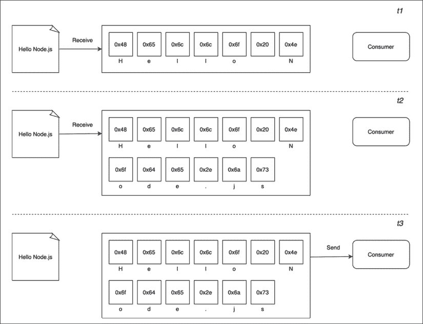
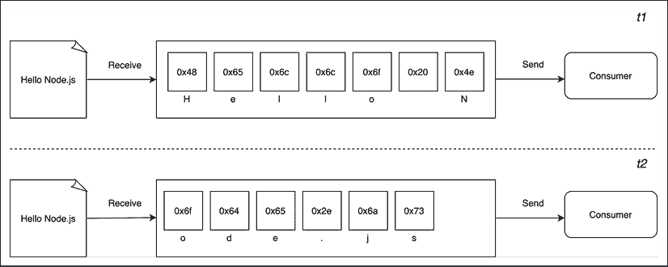
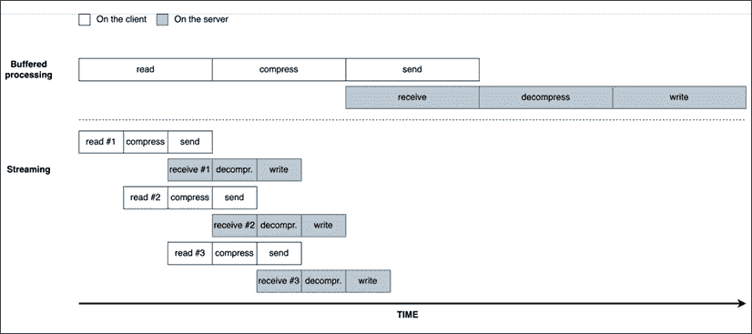
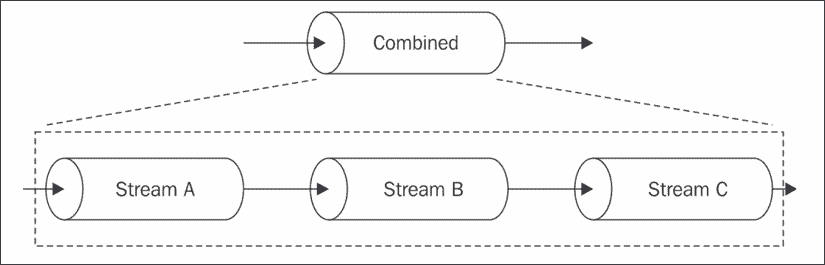
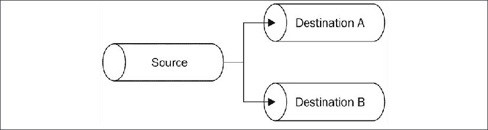
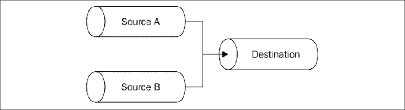
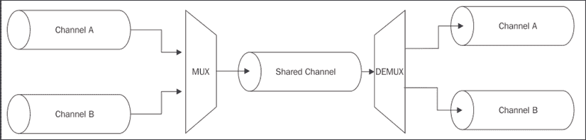
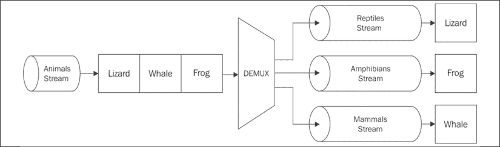

# 6

# 使用流进行编码

流是 Node.js 中最重要组件和模式之一。社区中有一个口号：“流一切东西！”，这本身就足以描述流在 Node.js 中的作用。Node.js 社区的主要贡献者 Dominic Tarr 将流定义为“Node 最好的、最被误解的想法。”有多个原因使得 Node.js 流如此吸引人；再次强调，这不仅仅与技术属性相关，如性能或效率，更多的是关于它们的优雅性和它们完美融入 Node.js 哲学的方式。

本章旨在提供对 Node.js 流的全面理解。本章的前半部分作为对主要思想、术语和 Node.js 流背后的库的介绍。在后半部分，我们将涵盖更高级的主题，最重要的是，我们将探索有用的流模式，这些模式可以使你的代码在许多情况下更加优雅和有效。

在本章中，你将学习以下主题：

+   为什么流在 Node.js 中如此重要

+   理解、使用和创建流

+   流作为编程范式：在许多不同场景中利用其力量，而不仅仅是用于 I/O

+   流的模式和在不同配置中连接流

不再拖延，让我们一起来发现为什么流是 Node.js 的基石之一。

# 发现流的重要性

在基于事件的平台如 Node.js 中，处理 I/O 最有效的方式是实时，一旦输入可用就消费它，一旦应用程序产生输出就发送它。

在本节中，我们将为你提供一个对 Node.js 流及其优势的初步介绍。请记住，这只是一个概述，因为更详细的分析如何使用和组合流将在本章的后面部分进行。

## 缓冲与流

几乎本书中到目前为止我们所见到的所有异步 API 都是使用*缓冲模式*工作的。对于输入操作，缓冲模式会将来自资源的所有数据收集到一个缓冲区中，直到操作完成；然后它将作为一个单一的数据块传递回调用者。下面的图展示了这一范式的视觉示例：



图 6.1：缓冲

在*图 6.1*中，我们可以看到，在时间*t1*，从资源接收了一些数据并保存到缓冲区中。在时间*t2*，接收到了另一个数据块——最后一个数据块，这完成了读取操作，因此，在*t3*，整个缓冲区被发送到消费者。

另一方面，流允许我们在数据从资源到达时立即处理这些数据。这在上面的图中有所展示：



图 6.2：流

这次，*图 6.2* 显示，一旦从资源接收到每个新的数据块，它就会立即传递给消费者，现在消费者有机会立即处理它，而无需等待所有数据都收集到缓冲区中。

但这两种方法之间有什么区别呢？纯粹从效率的角度来看，流在空间（内存使用）和时间（计算时钟时间）方面都可以更高效。然而，Node.js 流还有一个重要的优点：**可组合性**。现在让我们看看这些属性对我们设计和编写应用程序的方式有什么影响。

## 空间效率

首先，流允许我们做一些通过缓冲数据一次性处理不可能完成的事情。例如，考虑我们必须读取一个非常大的文件的情况，比如说，几百兆字节甚至几吉字节。显然，当文件完全读取时，使用返回大缓冲区的 API 不是一个好主意。想象一下同时读取这些大文件；我们的应用程序很容易耗尽内存。此外，V8 中的缓冲区大小有限。你不能分配超过几个吉字节的数据，所以我们可能会在耗尽物理内存之前就遇到障碍。

缓冲区的实际最大大小会随着平台和 Node.js 的版本而变化。如果你想知道在特定平台上字节的限制是多少，你可以运行以下代码：

```js
import buffer from 'buffer'
console.log(buffer.constansts.MAX_LENGTH) 
```

### 使用缓冲 API 进行 Gzipping

为了做一个具体的例子，让我们考虑一个简单的命令行应用程序，该程序使用 GZIP 格式压缩文件。使用缓冲 API，这样的应用程序在 Node.js 中的样子如下（为了简洁，省略了错误处理）：

```js
import { promises as fs } from 'fs'
import { gzip } from 'zlib'
import { promisify } from 'util'
const gzipPromise = promisify(gzip)
const filename = process.argv[2]
async function main () {
  const data = await fs.readFile(filename)
  const gzippedData = await gzipPromise(data)
  await fs.writeFile(`${filename}.gz`, gzippedData)
  console.log('File successfully compressed')
}
main() 
```

现在，我们可以尝试将前面的代码放入一个名为`gzip-buffer.js`的文件中，然后使用以下命令运行它：

```js
node gzip-buffer.js <path to file> 
```

如果我们选择一个足够大的文件（例如，大约 8 GB），我们很可能会收到一个错误消息，说我们正在尝试读取的文件大小超过了最大允许的缓冲区大小：

```js
RangeError [ERR_FS_FILE_TOO_LARGE]: File size (8130792448) is greater than possible Buffer: 2147483647 bytes 
```

这正是我们预期的，也是我们使用错误方法的一个迹象。

### 使用流进行 Gzipping

我们修复 Gzip 应用程序并使其能够处理大文件的最简单方法就是使用流 API。让我们看看这是如何实现的。让我们编写一个新的模块，代码如下：

```js
// gzip-stream.js
import { createReadStream, createWriteStream } from 'fs'
import { createGzip } from 'zlib'
const filename = process.argv[2]
createReadStream(filename)
  .pipe(createGzip())
  .pipe(createWriteStream(`${filename}.gz`))
  .on('finish', () => console.log('File successfully compressed')) 
```

“这就完了？”你可能问。是的！正如我们所说的，流之所以神奇，是因为它们的接口和可组合性，这使得代码干净、优雅和简洁。我们将在稍后更详细地看到这一点，但现在，重要的是要认识到程序将平稳地运行在任何大小的文件上，并且具有恒定的内存利用率。自己试试（但请考虑压缩大文件可能需要一段时间）。

注意，为了简洁，在先前的例子中我们省略了错误处理。在本章的后面部分，我们将讨论使用流的正确错误处理的细微差别。在此之前，请注意，大多数示例都将缺少适当的错误处理。

## 时间效率

现在，让我们考虑一个应用程序的案例，该应用程序压缩一个文件并将其上传到远程 HTTP 服务器，然后服务器将其解压缩并保存到文件系统中。如果我们的应用程序的客户端组件是使用缓冲 API 实现的，上传将仅在读取并压缩整个文件后开始。另一方面，解压缩将在服务器上仅在接收到所有数据后开始。为了达到相同的结果，一个更好的解决方案是使用流。在客户端机器上，流允许我们在从文件系统读取数据块后立即压缩并发送数据，而在服务器上，它们允许我们在从远程对等方接收到每个数据块后立即解压缩。让我们通过构建我们之前提到的应用程序来演示这一点，从服务器端开始。

让我们创建一个名为 `gzip-receive.js` 的模块，包含以下代码：

```js
import { createServer } from 'http'
import { createWriteStream } from 'fs'
import { createGunzip } from 'zlib'
import { basename, join } from 'path'
const server = createServer((req, res) => {
  const filename = basename(req.headers['x-filename'])
  const destFilename = join('received_files', filename)
  console.log(`File request received: ${filename}`)
  req
    .pipe(createGunzip())
    .pipe(createWriteStream(destFilename))
    .on('finish', () => {
      res.writeHead(201, { 'Content-Type': 'text/plain' })
      res.end('OK\n')
      console.log(`File saved: ${destFilename}`)
    })
})
server.listen(3000, () => console.log('Listening on http://localhost:3000')) 
```

在前面的例子中，`req` 是一个流对象，服务器使用它从网络中以块的形式接收请求数据。多亏了 Node.js 流，每个数据块在接收后立即解压缩并保存到磁盘上。

你可能已经注意到，在我们的服务器应用程序中，我们使用 `basename()` 来从接收到的文件名中移除任何可能的路径。这是一个安全最佳实践，因为我们想确保接收到的文件正好保存到我们的 `received_files` 文件夹中。如果没有 `basename()`，恶意用户可能会构建一个请求，有效地覆盖系统文件并将恶意代码注入到服务器机器中。例如，想象一下如果 `filename` 被设置为 `/usr/bin/node` 会发生什么？在这种情况下，攻击者可以有效地用任何任意文件替换我们的 Node.js 解释器。

我们应用程序的客户端将进入一个名为 `gzip-send.js` 的模块，其代码如下：

```js
import { request } from 'http'
import { createGzip } from 'zlib'
import { createReadStream } from 'fs'
import { basename } from 'path'
const filename = process.argv[2]
const serverHost = process.argv[3]
const httpRequestOptions = {
  hostname: serverHost,
  port: 3000,
  path: '/',
  method: 'PUT',
  headers: {
    'Content-Type': 'application/octet-stream',
    'Content-Encoding': 'gzip',
    'X-Filename': basename(filename)
  }
}
const req = request(httpRequestOptions, (res) => {
  console.log(`Server response: ${res.statusCode}`)
})
createReadStream(filename)
  .pipe(createGzip())
  .pipe(req)
  .on('finish', () => {
    console.log('File successfully sent')
  }) 
```

在前面的代码中，我们再次使用流从文件中读取数据，然后从文件系统读取后立即压缩并发送每个数据块。

现在，为了尝试这个应用程序，我们首先使用以下命令启动服务器：

```js
node gzip-receive.js 
```

然后，我们可以通过指定要发送的文件和服务器地址（例如，`localhost`）来启动客户端：

```js
node gzip-send.js <path to file> localhost 
```

如果我们选择一个足够大的文件，我们可以欣赏数据从客户端流向服务器的过程。但为什么这种数据流动的范式——与使用缓冲 API 相比——更有效率？*图 6.3* 应该会使这个概念更容易理解：



图 6.3：缓冲和流比较

当一个文件被处理时，它会经过一系列的连续阶段：

1.  [客户端] 从文件系统读取

1.  [客户端] 压缩数据

1.  [客户端] 发送到服务器

1.  [服务器] 从客户端接收

1.  [服务器] 解压缩数据

1.  [服务器] 将数据写入磁盘

为了完成处理，我们必须像装配线一样按顺序经过每个阶段，直到结束。在*图 6.3*中，我们可以看到，使用缓冲 API，整个过程完全是顺序的。为了压缩数据，我们首先必须等待整个文件被读取，然后，为了发送数据，我们必须等待整个文件被读取和压缩，依此类推。

使用流，一旦我们收到第一块数据，装配线就会启动，而不需要等待整个文件被读取。但更令人惊讶的是，当下一块数据可用时，不需要等待之前的一组任务完成；相反，另一个装配线会并行启动。这之所以能完美工作，是因为我们执行的每个任务都是异步的，因此可以被 Node.js 并行化。唯一的约束是每个阶段中块到达的顺序必须保持不变。Node.js 流内部实现会为我们维护这个顺序。

如*图 6.3*所示，使用流的结果是整个过程所需时间更少，因为我们没有浪费时间等待所有数据一次性被读取和处理。

## 可组合性

我们之前看到的代码已经展示了如何通过`pipe()`方法组合流，这使得我们可以连接不同的处理单元，每个单元负责单一的功能，完全符合 Node.js 的风格。这是可能的，因为流有一个统一的接口，并且它们可以通过 API 相互理解。唯一的前提是管道中的下一个流必须支持由前一个流产生的数据类型，这可以是二进制、文本，甚至是我们将在本章后面看到的对象。

为了看看这个属性的强大之处，我们可以尝试向之前构建的`gzip-send`/`gzip-receive`应用程序添加一个加密层。

为了做到这一点，我们需要对我们的客户端和服务器进行一些小的修改。

### 添加客户端加密

让我们从客户端开始：

```js
// ...
**import** **{ createCipheriv, randomBytes }** **from****'crypto'**       // (1)
const filename = process.argv[2]
const serverHost = process.argv[3]
**const** **secret = Buffer.from(process.argv[****4****],** **'hex'****)**         // (2)
**const** **iv = randomBytes(****16****)**                                 // (3)
// ... 
```

让我们回顾一下我们在这里做了哪些改变：

1.  首先，我们导入`createCipheriv()` `Transform`流和`randomBytes()`函数，这两个都来自`crypto`模块。

1.  我们从命令行获取服务器的加密密钥。我们期望字符串以十六进制字符串的形式传递，因此我们读取这个值，并使用设置为`hex`模式的缓冲区将其加载到内存中。

1.  最后，我们生成一个随机字节序列，我们将使用它作为文件加密的初始化向量。

现在，我们可以更新负责创建 HTTP 请求的代码片段：

```js
const httpRequestOptions = {
  hostname: serverHost,
  headers: {
    'Content-Type': 'application/octet-stream',
    'Content-Encoding': 'gzip',
    'X-Filename': basename(filename),
    **'X-Initialization-Vector'****: iv.toString(****'hex'****)**          // (1)
  }
}
// ...
const req = request(httpRequestOptions, (res) => {
  console.log(`Server response: ${res.statusCode}`)
})
createReadStream(filename)
  .pipe(createGzip())
  **.pipe(createCipheriv(****'aes192'****, secret, iv))**              // (2)
  .pipe(req)
// ... 
```

这里主要的改变是：

1.  我们将初始化向量作为 HTTP 头传递给服务器。

1.  我们在 Gzip 阶段之后加密数据。

客户端部分到此结束。

### 添加服务器端解密

现在，让我们重构服务器。我们首先需要做的是从核心 `crypto` 模块导入一些实用函数，我们可以使用这些函数来生成一个随机加密密钥（密钥）：

```js
// ...
import { createDecipheriv, randomBytes } from 'crypto'
const secret = randomBytes(24)
console.log(`Generated secret: ${secret.toString('hex')}`) 
```

生成的密钥以十六进制字符串的形式打印到控制台，以便我们可以与我们的客户共享。

现在，我们需要更新文件接收逻辑：

```js
const server = createServer((req, res) => {
  const filename = basename(req.headers['x-filename'])
  **const** **iv = Buffer.from(**
    **req.headers[****'x-initialization-vector'****],** **'hex'****)**         // (1)
  const destFilename = join('received_files', filename)
  console.log(`File request received: ${filename}`)
  req
    **.pipe(createDecipheriv(****'aes192'****, secret, iv))**          // (2)
    .pipe(createGunzip())
    .pipe(createWriteStream(destFilename))
    // ... 
```

在这里，我们正在应用两个更改：

1.  我们必须读取客户端发送的加密**初始化向量**([nodejsdp.link/iv](http://nodejsdp.link/iv))。

1.  我们流式传输管道的第一步现在负责使用 `crypto` 模块的 `createDecipheriv` `Transform` 流解密传入的数据。

只需付出很少的努力（几行代码），我们就为我们的应用程序添加了一个加密层；我们只需使用一些已经可用的 `Transform` 流（`createCipheriv` 和 `createDecipheriv`）并将它们包含在客户端和服务器流处理管道中。以类似的方式，我们可以添加和组合其他流，就像我们在玩乐高积木一样。

这种方法的主要优势是可重用性，但正如我们从代码中看到的那样，流还使代码更干净、更模块化。出于这些原因，流通常不仅用于处理纯 I/O，而且还作为简化代码和模块化代码的手段。

现在我们已经引入了流，我们准备以更结构化的方式探索 Node.js 中可用的不同类型的流。

# 流入门

在上一节中，我们学习了为什么流如此强大，但也了解到它们在 Node.js 中无处不在，从其核心模块开始。例如，我们已经看到 `fs` 模块有 `createReadStream()` 用于从文件读取和 `createWriteStream()` 用于向文件写入，HTTP 的 `request` 和 `response` 对象本质上也是流，`zlib` 模块允许我们使用流式接口压缩和解压缩数据，最后，`crypto` 模块甚至公开了一些有用的流式原语，如 `createCipheriv` 和 `createDecipheriv`。

现在我们知道了流为什么如此重要，让我们退一步，更详细地探索它们。

## 流的解剖结构

在 Node.js 中，每个流都是 `stream` 核心模块中可用的四个基本抽象类之一的一个实现：

+   `Readable`

+   `Writable`

+   `Duplex`

+   `Transform`

每个 `stream` 类也是 `EventEmitter` 的一个实例。实际上，流可以产生几种类型的事件，例如当 `Readable` 流完成读取时产生 `end` 事件，当 `Writable` 流完成写入时产生 `finish` 事件，或者在出现错误时产生 `error` 事件。

流之所以如此灵活的一个原因是它们不仅可以处理二进制数据，而且几乎可以处理任何 JavaScript 值。实际上，它们支持两种操作模式：

+   **二进制模式**：以块的形式流式传输数据，例如缓冲区或字符串

+   **对象模式**：将数据作为一系列离散对象流式传输（允许我们使用几乎任何 JavaScript 值）

这两种操作模式使我们能够不仅使用流进行 I/O，而且还可以将其用作工具，以优雅的方式在函数式风格中组合处理单元，正如我们将在本章后面看到的那样。

让我们从介绍`Readable`流类开始，深入探讨 Node.js 流。

## 可读流

`Readable`流表示数据源。在 Node.js 中，它使用`Readable`抽象类实现，该类在`stream`模块中可用。

### 从流中读取

从`Readable`流接收数据有两种方法：**非流动**（或**暂停**）和**流动**。让我们更详细地分析这些模式。

#### 非流动模式

非流动或暂停模式是读取`Readable`流的默认模式。这涉及到将监听器附加到流上，监听`readable`事件，该事件表示有新数据可供读取。然后，在一个循环中，我们持续读取数据，直到内部缓冲区清空。这可以通过使用`read()`方法来完成，该方法从内部缓冲区同步读取并返回一个表示数据块内容的`Buffer`对象。`read()`方法具有以下签名：

```js
readable.read([size]) 
```

使用这种方法，数据在需要时被强制从流中拉取。

为了展示这是如何工作的，让我们创建一个名为`read-stdin.js`的新模块，该模块实现了一个简单的程序，它从标准输入（也是一个`Readable`流）读取，并将所有内容回显到标准输出：

```js
process.stdin
  .on('readable', () => {
    let chunk
    console.log('New data available')
    while ((chunk = process.stdin.read()) !== null) {
      console.log(
        `Chunk read (${chunk.length} bytes): "${chunk.toString()}"`
      )
    }
  })
  .on('end', () => console.log('End of stream')) 
```

`read()`方法是一个同步操作，它从`Readable`流的内部缓冲区中拉取数据块。默认情况下，如果流以二进制模式工作，返回的块是一个`Buffer`对象。

在以二进制模式工作的`Readable`流中，我们可以通过在流上调用`setEncoding(encoding)`并提供一个有效的编码格式（例如，`utf8`）来读取字符串而不是缓冲区。当流传输 UTF-8 文本数据时，这种方法是推荐的，因为流将正确处理多字节字符，进行必要的缓冲以确保没有字符被分割成单独的数据块。换句话说，流产生的每个数据块都将是一个有效的 UTF-8 字节序列。

注意，你可以在`Readable`流上多次调用`setEncoding()`，即使在你已经开始从流中读取数据之后。编码将在下一个可用的数据块上动态切换。流本质上是二进制的；编码只是对流发出的二进制数据的视图。

数据仅从 `Readable` 监听器中读取，该监听器在新的数据可用时立即被调用。当内部缓冲区中没有更多数据可用时，`read()` 方法返回 `null`；在这种情况下，我们必须等待另一个 `readable` 事件被触发，告诉我们可以再次读取，或者等待表示流结束的 `end` 事件。当流以二进制模式工作时，我们还可以通过将 `size` 值传递给 `read()` 方法来指定我们感兴趣读取的数据量。这在实现网络协议或解析特定数据格式时特别有用。

现在，我们已经准备好运行 `read-stdin.js` 模块并对其进行实验。让我们在控制台中输入一些字符，然后按 Enter 键以查看数据被回显到标准输出。为了终止流并生成一个优雅的 `end` 事件，我们需要插入一个 `EOF`（文件结束）字符（在 Windows 上使用 Ctrl + Z，在 Linux 和 macOS 上使用 Ctrl + D）。

我们还可以尝试将我们的程序与其他进程连接起来。这可以通过管道操作符（`|`）实现，它将一个程序的标准输出重定向到另一个程序的标准输入。例如，我们可以运行以下命令：

```js
cat <path to a file> | node read-stdin.js 
```

这是一个令人惊叹的演示，说明了流式处理范式是一个通用的接口，它使我们的程序能够通信，无论它们是用哪种语言编写的。

#### 流动模式

从流中读取的另一种方式是通过将监听器附加到 `data` 事件。这将使流切换到使用 **流动模式**，其中数据不是通过 `read()` 拉取，而是数据一到就推送到 `data` 监听器。例如，我们之前创建的 `read-stdin.js` 应用程序在流动模式下将看起来像这样：

```js
process.stdin
  .on('data', (chunk) => {
    console.log('New data available')
    console.log(
      `Chunk read (${chunk.length} bytes): "${chunk.toString()}"`
    )
  })
  .on('end', () => console.log('End of stream')) 
```

与非流动模式相比，流动模式在控制数据流方面提供了更少的灵活性。流的默认操作模式是非流动模式，因此要启用流动模式，需要将监听器附加到 `data` 事件或显式调用 `resume()` 方法。为了暂时停止流从发出 `data` 事件，我们可以调用 `pause()` 方法，这将导致任何传入的数据被缓存在内部缓冲区中。调用 `pause()` 将将流切换回非流动模式。

#### 异步迭代器

`可读`流也是异步迭代器；因此，我们可以将我们的 `read-stdin.js` 示例重写如下：

```js
async function main () {
  for await (const chunk of process.stdin) {
    console.log('New data available')
    console.log(
      `Chunk read (${chunk.length} bytes): "${chunk.toString()}"`
    )
  }
  console.log('End of stream')
}
main() 
```

我们将在第九章 *行为设计模式* 中更详细地讨论异步迭代器，所以现在不必太担心前面示例中的语法。重要的是要知道，如果您需要编写一个消耗整个 `Readable` 流并返回 `Promise` 的函数，这种语法可能会非常有用。

### 实现可读流

现在我们已经知道了如何从流中读取，下一步是学习如何实现一个新的自定义`Readable`流。要做到这一点，需要通过从`stream`模块继承原型`Readable`来创建一个新的类。具体的流必须提供一个`_read()`方法的实现，该方法的签名如下：

```js
readable._read(size) 
```

`Readable`类的内部将调用`_read()`方法，然后它将开始使用`push()`填充内部缓冲区：

```js
readable.push(chunk) 
```

请注意，`read()`是由流消费者调用的方法，而`_read()`是由流子类实现的方法，不应直接调用。下划线通常表示该方法不是公开的，不应直接调用。

为了演示如何实现新的`Readable`流，我们可以尝试实现一个生成随机字符串的流。让我们创建一个新的模块`random-stream.js`，其中包含我们的随机字符串生成器的代码：

```js
import { Readable } from 'stream'
import Chance from 'chance'
const chance = new Chance()
export class RandomStream extends Readable {
  constructor (options) {
    super(options)
    this.emittedBytes = 0
  }
  _read (size) {
    const chunk = chance.string({ length: size })          // (1)
    this.push(chunk, 'utf8')                               // (2)
    this.emittedBytes += chunk.length
    if (chance.bool({ likelihood: 5 })) {                  // (3)
      this.push(null)
    }
  }
} 
```

在文件顶部，我们加载我们的依赖项。那里没有什么特别的地方，除了我们正在加载一个名为`chance`的 npm 模块（[nodejsdp.link/chance](http://nodejsdp.link/chance)），这是一个用于生成各种随机值的库，从数字到字符串到整个句子。

下一步是创建一个新的类`RandomStream`，指定`Readable`为其父类。在前面的代码中，在`RandomStream`构造函数中调用`super(options)`将调用父类的构造函数，允许我们初始化流的内部状态。

如果你有一个只调用`super(options)`的构造函数，你可以将其删除，因为你将继承父构造函数。但请务必记住，每次你需要编写自定义构造函数时都要调用`super(options)`。

可以通过`options`对象传递的可能的参数包括以下内容：

+   `encoding`参数，用于将缓冲区转换为字符串（默认为`null`）

+   一个标志来启用对象模式（`objectMode`，默认为`false`）

+   内部缓冲区中存储的数据的上限，在此之后不应再从源读取更多数据（`highWaterMark`，默认为`16KB`）

好的，现在让我们解释一下`_read()`方法：

1.  该方法使用`chance`生成一个长度等于`size`的随机字符串。

1.  它将字符串推入内部缓冲区。请注意，由于我们正在推送字符串，我们还需要指定编码，`utf8`（如果块只是一个二进制`Buffer`，则此操作不是必需的）。

1.  它通过将`null`推入内部缓冲区来随机终止流，概率为 5%，以指示`EOF`情况，换句话说，流的结束。

注意，`_read()`函数中的`size`参数是一个建议参数。尊重它是好的，只推送调用者请求的数据量，尽管这样做不是强制性的。

当我们调用`push()`时，我们应该检查它是否返回`false`。当这种情况发生时，这意味着接收流的内部缓冲区已达到`highWaterMark`限制，我们应该停止向其中添加更多数据。这被称为**背压**，我们将在本章下一节中更详细地讨论它。

`RandomStream`就到这里，我们现在可以使用它了。让我们看看如何实例化一个`RandomStream`对象并从中拉取一些数据：

```js
// index.js
import { RandomStream } from './random-stream.js'
const randomStream = new RandomStream()
randomStream
  .on('data', (chunk) => {
    console.log(`Chunk received (${chunk.length} bytes): ${chunk.toString()}`)
  })
  .on('end', () => {
    console.log(`Produced ${randomStream.emittedBytes} bytes of random data`)
  }) 
```

现在，一切准备就绪，我们可以尝试我们的新自定义流。像往常一样执行`index.js`模块，并观察屏幕上流动的随机字符串集。

#### 简化构造

对于简单的自定义流，我们可以通过使用`Readable`流的**简化构造**方法来避免创建一个自定义类。使用这种方法，我们只需要调用`new Readable(options)`并在选项集中传递一个名为`read()`的方法。这里的`read()`方法与我们在类扩展方法中看到的`_read()`方法具有完全相同的语义。让我们用简化构造方法重写我们的`RandomStream`：

```js
import { Readable } from 'stream'
import Chance from 'chance'
const chance = new Chance()
let emittedBytes = 0
const randomStream = new Readable({
  read (size) {
    const chunk = chance.string({ length: size })
    this.push(chunk, 'utf8')
    emittedBytes += chunk.length
    if (chance.bool({ likelihood: 5 })) {
      this.push(null)
    }
  }
})
// now use randomStream instance directly ... 
```

当你不需要管理复杂的状态时，这种方法尤其有用，它允许你利用更简洁的语法。在前面的例子中，我们创建了一个自定义流的单个实例。如果我们想采用简化构造方法但需要创建多个自定义流的实例，我们可以将初始化逻辑包装在一个工厂函数中，我们可以多次调用该函数来创建这些实例。

#### 可读流来自可迭代对象

你可以轻松地使用`Readable.from()`辅助工具从数组或其他**可迭代**对象（即**生成器**、**迭代器**和**异步迭代器**）创建`Readable`流实例。

为了熟悉这个辅助工具，让我们看看一个简单的例子，我们将数据从数组转换为`Readable`流：

```js
import { Readable } from 'stream'
const mountains = [
  { name: 'Everest', height: 8848 },
  { name: 'K2', height: 8611 },
  { name: 'Kangchenjunga', height: 8586 },
  { name: 'Lhotse', height: 8516 },
  { name: 'Makalu', height: 8481 }
]
const mountainsStream = Readable.from(mountains)
mountainsStream.on('data', (mountain) => {
  console.log(`${mountain.name.padStart(14)}\t${mountain.height}m`)
}) 
```

从这段代码中我们可以看出，`Readable.from()`方法非常简单易用：第一个参数是一个可迭代实例（在我们的例子中是`mountains`数组）。`Readable.from()`接受一个额外的可选参数，可以用来指定流选项，如`objectMode`。

注意，我们不必显式地将`objectMode`设置为`true`。默认情况下，`Readable.from()`会将`objectMode`设置为`true`，除非明确选择将其设置为`false`。流选项可以作为函数的第二个参数传递。

运行前面的代码将产生以下输出：

```js
 Everest    8848m
            K2    8611m
 Kangchenjunga    8586m
        Lhotse    8516m
        Makalu    8481m 
```

尽量不要在内存中实例化大型数组。想象一下，在前面的例子中，如果我们想列出世界上所有的山脉。大约有 100 万座山脉，如果我们一开始就将它们全部加载到数组中，我们会分配相当大的内存。即使我们通过一个`Readable`流消耗数组中的数据，所有数据已经被预先加载，所以我们实际上是在浪费流的内存效率。始终最好是分块加载和消耗数据，你可以通过使用原生的流，如`fs.createReadStream`，通过构建自定义流，或者使用`Readable.from`与懒迭代器，如生成器、迭代器或异步迭代器来实现。我们将在第九章，*行为设计模式*中看到后者的示例。

## 可写流

`Writable`流表示一个数据目的地。例如，想象一下文件系统上的一个文件、一个数据库表、一个套接字、标准错误或标准输出接口。在 Node.js 中，它使用`stream`模块中的`Writable`抽象类实现。

### 向流中写入

将一些数据推送到`Writable`流是一个简单的过程；我们只需要使用`write()`方法，该方法具有以下签名：

```js
writable.write(chunk, [encoding], [callback]) 
```

`encoding`参数是可选的，如果`chunk`是一个字符串（默认为`utf8`，如果`chunk`是缓冲区则忽略），则可以指定。另一方面，`callback`函数在数据块被刷新到底层资源时被调用，也是可选的。

要表示不再向流中写入数据，我们必须使用`end()`方法：

```js
writable.end([chunk], [encoding], [callback]) 
```

我们可以通过`end()`方法提供一个数据块；在这种情况下，`callback`函数相当于注册了一个监听器到`finish`事件，该事件在流中写入的所有数据都已刷新到底层资源时触发。

现在，让我们通过创建一个小型 HTTP 服务器来演示它是如何工作的，该服务器输出一个随机字符串序列：

```js
// entropy-server.js
import { createServer } from 'http'
import Chance from 'chance'
const chance = new Chance()
const server = createServer((req, res) => {
  res.writeHead(200, { 'Content-Type': 'text/plain' })     // (1)
  while (chance.bool({ likelihood: 95 })) {                // (2)
    res.write(`${chance.string()}\n`)                      // (3)
  }
  res.end('\n\n')                                          // (4)
  res.on('finish', () => console.log('All data sent'))     // (5)
})
server.listen(8080, () => {
  console.log('listening on http://localhost:8080')
}) 
```

我们创建的 HTTP 服务器写入到`res`对象中，它是`http.ServerResponse`的一个实例，也是一个`Writable`流。以下是解释发生的情况：

1.  我们首先写入 HTTP 响应的头部。请注意，`writeHead()`不是`Writable`接口的一部分；实际上，它是`http.ServerResponse`类暴露的一个辅助方法，并且特定于 HTTP 协议。

1.  我们启动一个循环，其终止概率为 5%（我们指示`chance.bool()`返回`true` 95%的时间）。

1.  在循环内部，我们将一个随机字符串写入流中。

1.  一旦我们退出循环，我们就在流上调用`end()`，表示不再写入更多数据。此外，我们还提供了一个包含两个换行符的最终字符串，在结束之前写入流中。

1.  最后，我们为`finish`事件注册了一个监听器，该事件将在所有数据都已刷新到底层套接字时触发。

要测试服务器，我们可以打开地址为`http://localhost:8080`的浏览器，或者从终端使用以下`curl`命令：

```js
curl localhost:8080 
```

在这一点上，服务器应该开始向您选择的 HTTP 客户端发送随机字符串（请记住，一些浏览器可能会缓冲数据，流式传输的行为可能不明显）。

### 背压

与真实管道系统中流动的液体类似，Node.js 流也可能遭受瓶颈，即数据写入速度超过流可以消耗的速度。处理此问题的机制涉及缓冲传入的数据；然而，如果流不对写入者提供任何反馈，我们可能会遇到越来越多的数据积累在内部缓冲区中的情况，导致不希望的内存使用水平。

为了防止这种情况发生，当内部缓冲区超过`highWaterMark`限制时，`writable.write()`将返回`false`。在`Writable`流中，`highWaterMark`属性是内部缓冲区大小的限制，超过这个限制，`write()`方法开始返回`false`，表示应用程序现在应该停止写入。当缓冲区清空时，会触发`drain`事件，表示现在可以安全地开始写入。这种机制称为**背压**。

背压是一种建议机制。即使`write()`返回`false`，我们也可以忽略这个信号并继续写入，使缓冲区无限增长。当达到`highWaterMark`阈值时，流不会自动阻塞；因此，建议始终保持警觉并尊重背压。

本节中描述的机制同样适用于`Readable`流。事实上，`Readable`流也存在背压，它是在`_read()`内部调用的`push()`方法返回`false`时触发的。然而，那是一个特定于流实现者的问题，所以我们通常不太经常处理它。

我们可以通过修改之前创建的`entropy-server.js`模块来快速演示如何考虑`Writable`流的背压：

```js
// ...
const server = createServer((req, res) => {
  res.writeHead(200, { 'Content-Type': 'text/plain' })
  function generateMore () {                                // (1)
    while (chance.bool({ likelihood: 95 })) {
      const randomChunk = chance.string({                   // (2)
        length: (16 * 1024) - 1
      })
      const shouldContinue = res.write(`${randomChunk}\n`)  // (3)
      if (!shouldContinue) {
        console.log('back-pressure')
        return res.once('drain', generateMore)
      }
    }
    res.end('\n\n')
  }
  generateMore()
  res.on('finish', () => console.log('All data sent'))
})
// ... 
```

之前代码最重要的步骤可以总结如下：

1.  我们将主要逻辑封装在一个名为`generateMore()`的函数中。

1.  为了增加接收一些背压的机会，我们将数据块的大小增加到 16 KB 减去 1 字节，这非常接近默认的`highWaterMark`限制。

1.  在写入一块数据后，我们检查`res.write()`的返回值。如果我们收到`false`，这意味着内部缓冲区已满，我们应该停止发送更多数据。当这种情况发生时，我们退出函数，并使用`generateMore()`注册另一个写入周期，以便在`drain`事件触发时进行。

如果我们现在再次尝试运行服务器，然后使用`curl`生成客户端请求，有很大可能性会出现一些背压，因为服务器以非常高的速率产生数据，这比底层套接字可以处理的速度要快。

### 实现 Writable 流

我们可以通过继承`Writable`类并提供`_write()`方法的实现来创建一个新的`Writable`流。让我们立即尝试，同时在讨论过程中详细说明。

让我们构建一个接收以下格式的对象的`Writable`流：

```js
{
  path: <path to a file>
  content: <string or buffer>
} 
```

对于这些对象中的每一个，我们的流必须将`content`属性保存到在给定`path`处创建的文件中。我们可以立即看出，我们的流输入是对象，而不是字符串或缓冲区。这意味着我们的流必须工作在对象模式下。

让我们称这个模块为`to-file-stream.js`：

```js
import { Writable } from 'stream'
import { promises as fs } from 'fs'
import { dirname } from 'path'
import mkdirp from 'mkdirp-promise'
export class ToFileStream extends Writable {
  constructor (options) {
    super({ ...options, objectMode: true })
  }
  _write (chunk, encoding, cb) {
    mkdirp(dirname(chunk.path))
      .then(() => fs.writeFile(chunk.path, chunk.content))
      .then(() => cb())
      .catch(cb)
  }
} 
```

我们为我们的新流创建了一个新类，该类从`stream`模块扩展了`Writable`。

我们必须调用父构造函数来初始化其内部状态；我们还需要确保`options`对象指定流在对象模式下工作（`objectMode: true`）。`Writable`接受的其它选项如下：

+   `highWaterMark`（默认为 16 KB）：这控制了背压限制。

+   `decodeStrings`（默认为`true`）：这启用了在将字符串传递给`_write()`方法之前自动将字符串解码为二进制缓冲区的功能。在对象模式下，此选项被忽略。

最后，我们为`_write()`方法提供了一个实现。正如你所见，该方法接受一个数据块和一个编码（仅在二进制模式下且流选项`decodeStrings`设置为`false`时才有意义）。此外，该方法还接受一个回调函数（`cb`），当操作完成时需要调用该函数；不需要传递操作的结果，但如果需要，我们仍然可以传递一个错误，这将导致流发出一个`error`事件。

现在，为了尝试我们刚刚构建的流，我们可以创建一个新的模块并对该流执行一些写操作：

```js
import { join } from 'path'
import { ToFileStream } from './to-file-stream.js'
const tfs = new ToFileStream()
tfs.write({
  path: join('files', 'file1.txt'), content: 'Hello' })
tfs.write({
  path: join('files', 'file2.txt'), content: 'Node.js' })
tfs.write({
  path: join('files', 'file3.txt'), content: 'streams' })
tfs.end(() => console.log('All files created')) 
```

在这里，我们创建并使用了我们的第一个自定义`Writable`流。像往常一样运行新模块并检查其输出。你将看到执行后，在名为`files`的新文件夹内将创建三个新的文件。

#### 简化构建

正如我们在`Readable`流中看到的，`Writable`流也提供了一个简化的构建机制。如果我们使用`Writable`流的简化构建来重写我们的`ToFileStream`，它将看起来像这样：

```js
// ...
const tfs = new Writable({
  objectMode: true,
  write (chunk, encoding, cb) {
    mkdirp(dirname(chunk.path))
      .then(() => fs.writeFile(chunk.path, chunk.content))
      .then(() => cb())
      .catch(cb)
  }
})
// ... 
```

使用这种方法，我们只是使用`Writable`构造函数并传递一个实现我们`Writable`实例自定义逻辑的`write()`函数。请注意，使用这种方法，`write()`函数的名称中没有下划线。我们还可以传递其他构造选项，如`objectMode`。

## Duplex 流

一个 `Duplex` 流是一个既是 `Readable` 又是 `Writable` 的流。当我们需要描述一个既是数据源又是数据目的地的实体时，它非常有用，例如网络套接字。`Duplex` 流继承了 `stream.Readable` 和 `stream.Writable` 的方法，所以这对我们来说并不陌生。这意味着我们可以 `read()` 或 `write()` 数据，或者监听 `readable` 和 `drain` 事件。

要创建一个自定义的 `Duplex` 流，我们必须为 `_read()` 和 `_write()` 提供实现。传递给 `Duplex()` 构造函数的 `options` 对象内部转发到 `Readable` 和 `Writable` 构造函数。这些选项与我们在前面的章节中讨论的选项相同，新增了一个名为 `allowHalfOpen`（默认为 `true`）的选项，如果设置为 `false`，则当只有其中一部分（`Readable` 或 `Writable`）结束时，两部分都会结束。

如果我们需要在一边使用对象模式，在另一边使用二进制模式，我们可以独立使用 `readableObjectMode` 和 `writableObjectMode` 选项。

## 转换流

`Transform` 流是一种特殊的 `Duplex` 流，专门设计用来处理数据转换。仅举几个具体的例子，我们在本章开头讨论的 `zlib.createGzip()` 和 `crypto.createCipheriv()` 函数分别创建用于压缩和加密的 `Transform` 流。

在一个简单的 `Duplex` 流中，从流中读取的数据和写入流中的数据之间没有直接的关系（至少，流对此类关系是无关紧要的）。想想 TCP 套接字，它只是向远程对等方发送和接收数据；套接字并不了解输入和输出之间的任何关系。*图 6.4* 阐述了 `Duplex` 流中的数据流：


图 6.4：`Duplex` 流示意图

另一方面，`Transform` 流会对它们从 `Writable` 端接收到的每个数据块应用某种转换，然后在其 `Readable` 端提供转换后的数据。*图 6.5* 展示了 `Transform` 流中的数据流：


图 6.5：`Transform` 流示意图

从外部看，`Transform` 流的接口与 `Duplex` 流的接口完全相同。然而，当我们想要构建一个新的 `Duplex` 流时，我们必须提供 `_read()` 和 `_write()` 方法，而对于实现一个新的 `Transform` 流，我们必须填写另一对方法：`_transform()` 和 `_flush()`。

让我们通过一个例子看看如何创建一个新的 `Transform` 流。

### 实现转换流

让我们实现一个替换给定字符串出现的 `Transform` 流。为此，我们必须创建一个名为 `replaceStream.js` 的新模块。让我们直接进入实现：

```js
import { Transform } from 'stream'
export class ReplaceStream extends Transform {
  constructor (searchStr, replaceStr, options) {
    super({ ...options })
    this.searchStr = searchStr
    this.replaceStr = replaceStr
    this.tail = ''
  }
  _transform (chunk, encoding, callback) {
    const pieces = (this.tail + chunk).split(this.searchStr)  // (1)
    const lastPiece = pieces[pieces.length - 1]               // (2)
    const tailLen = this.searchStr.length - 1
    this.tail = lastPiece.slice(-tailLen)
    pieces[pieces.length - 1] = lastPiece.slice(0, -tailLen)
    this.push(pieces.join(this.replaceStr))                   // (3)
    callback()
  }
  _flush (callback) {
    this.push(this.tail)
    callback()
  }
} 
```

在这个例子中，我们创建了一个新的类，它扩展了 `Transform` 基类。该类的构造函数接受三个参数：`searchStr`、`replaceStr` 和 `options`。正如你所想象的那样，它们允许我们定义要匹配的文本和用作替换的字符串，以及一个用于对底层 `Transform` 流进行高级配置的 `options` 对象。我们还初始化了一个内部 `tail` 变量，它将被 `_transform()` 方法稍后使用。

现在，让我们分析 `_transform()` 方法，这是我们新类中的核心。`_transform()` 方法几乎与 `Writable` 流的 `_write()` 方法的签名相同，但它不是将数据写入底层资源，而是使用 `this.push()` 将其推入内部读取缓冲区，这与我们在 `Readable` 流的 `_read()` 方法中所做的一样。这展示了 `Transform` 流的两端是如何连接的。

`ReplaceStream` 的 `_transform()` 方法实现了我们算法的核心。在缓冲区中搜索和替换字符串是一个简单的任务；然而，当数据是流式传输的，并且可能的匹配项可能分布在多个块中时，这完全是另一回事。代码遵循的步骤可以解释如下：

1.  我们的算法使用 `searchStr` 作为分隔符，在内存中分割数据（`tail` 数据和当前 `chunk`）。

1.  然后，它取操作生成的数组中的最后一个元素，并提取最后 `searchString.length - 1` 个字符。结果保存在 `tail` 变量中，并将被添加到下一个数据块的开头。

1.  最后，使用 `replaceStr` 作为分隔符将 `split()` 生成的所有片段连接起来，并推入内部缓冲区。

当流结束时，我们可能在 `tail` 变量中还有一些内容尚未推入内部缓冲区。这正是 `_flush()` 方法的作用；它在流结束前被调用，这是我们最后一次机会来最终化流或推入任何剩余的数据，以完全结束流。

`_flush()` 方法只接受一个回调函数，我们必须确保在所有操作完成后调用它，这将导致流被终止。这样，我们就完成了 `ReplaceStream` 类。

现在，是时候尝试新的流了。让我们创建一个脚本，将一些数据写入流，然后读取转换后的结果：

```js
import { ReplaceStream } from './replace-stream.js'
const replaceStream = new ReplaceStream('World', 'Node.js')
replaceStream.on('data', chunk => console.log(chunk.toString()))
replaceStream.write('Hello W')
replaceStream.write('orld!')
replaceStream.end() 
```

为了让我们的流更难一些，我们将搜索词（即 `World`）分散到两个不同的块中，然后，使用流动模式，我们从同一个流中读取，记录每个转换后的块。运行前面的程序应该会产生以下输出：

```js
Hel
lo Node.js
! 
```

请注意，前面的输出被分成多行，因为我们正在使用 `console.log()` 打印它。这使我们能够展示我们的实现能够正确地替换字符串匹配，即使匹配文本跨越多个数据块。

#### 简化构建

不足为奇，即使是 `Transform` 流也支持简化构建。到目前为止，我们应该已经对这种 API 的外观有了直觉，所以让我们直接动手重写之前的例子，使用这种方法：

```js
const searchStr = 'World'
const replaceStr = 'Node.js'
let tail = ''
const replaceStream = new Transform({
  defaultEncoding: 'utf8',
  transform (chunk, encoding, cb) {
    const pieces = (tail + chunk).split(searchStr)
    const lastPiece = pieces[pieces.length - 1]
    const tailLen = searchStr.length - 1
    tail = lastPiece.slice(-tailLen)
    pieces[pieces.length - 1] = lastPiece.slice(0, -tailLen)
    this.push(pieces.join(replaceStr))
    cb()
  },
  flush (cb) {
    this.push(tail)
    cb()
  }
})
// now write to replaceStream ... 
```

如预期的那样，简化构建通过直接实例化一个新的 `Transform` 对象，并通过 `options` 对象直接通过 `transform()` 和 `flush()` 函数传递我们的特定转换逻辑来实现。请注意，这里的 `transform()` 和 `flush()` 没有前置下划线。

### 使用 Transform 流过滤和聚合数据

正如我们在上一节中提到的，`Transform` 流是实现数据转换管道的完美构建块。在上一节中，我们展示了 `Transform` 流可以替换文本流中的单词的例子。但 `Transform` 流也可以用来实现其他类型的数据转换。例如，使用 `Transform` 流来实现数据过滤和数据聚合是非常常见的。

只为了做一个实际例子，让我们假设我们被一家财富 500 强公司要求分析一个包含 2020 年所有销售的大文件。公司希望我们使用 `data.csv`，这是一个 CSV 格式的销售报告，来计算在意大利进行的销售的总利润。

为了简单起见，让我们假设存储在 CSV 文件中的销售数据每行包含三个字段：项目类型、销售国家和利润。因此，这样的文件可能看起来像这样：

```js
type,country,profit
Household,Namibia,597290.92
Baby Food,Iceland,808579.10
Meat,Russia,277305.60
Meat,Italy,413270.00
Cereal,Malta,174965.25
Meat,Indonesia,145402.40
Household,Italy,728880.54
[... many more lines] 
```

现在，很明显，我们必须找到所有 `country` 字段为 "Italy" 的记录，并在过程中将匹配行的 `profit` 值累加到一个单独的数字中。

为了以流式处理方式处理 CSV 文件，我们可以使用出色的 `csv-parse` 模块 ([nodejsdp.link/csv-parse](http://nodejsdp.link/csv-parse))。

假设我们暂时已经实现了我们的自定义流来过滤和聚合数据，这个任务的可能的解决方案可能看起来像这样：

```js
import { createReadStream } from 'fs'
import parse from 'csv-parse'
import { FilterByCountry } from './filter-by-country.js'
import { SumProfit } from './sum-profit.js'
const csvParser = parse({ columns: true })
createReadStream('data.csv')             // (1)
  .pipe(csvParser)                       // (2)
  .pipe(new FilterByCountry('Italy'))    // (3)
  .pipe(new SumProfit())                 // (4)
  .pipe(process.stdout)                  // (5) 
```

这里提出的流式管道由五个步骤组成：

1.  我们将源 CSV 文件作为流读取。

1.  我们使用 `csv-parse` 库将文档的每一行解析为 CSV 记录。对于每一行，这个流将发出一个包含 `type`、`country` 和 `profit` 属性的对象。

1.  我们通过国家过滤所有记录，仅保留匹配国家 "Italy" 的记录。所有不匹配 "Italy" 的记录将被丢弃，这意味着它们将不会传递到管道中的其他步骤。请注意，这是我们必须实现的自定义 `Transform` 流之一。

1.  对于每条记录，我们累积利润。这个流最终会发出一个字符串，表示在意大利销售的产品总利润值。这个值只有在原始文件的所有数据都完全处理完毕后才会由流发出。请注意，这是我们必须实现的第二个自定义`Transform`流，以完成此项目。

1.  最后，前一步骤发出的数据将在标准输出中显示。

现在，让我们实现`FilterByCountry`流：

```js
import { Transform } from 'stream'
export class FilterByCountry extends Transform {
  constructor (country, options = {}) {
    options.objectMode = true
    super(options)
    this.country = country
  }
  _transform (record, enc, cb) {
    if (record.country === this.country) {
      this.push(record)
    }
    cb()
  }
} 
```

`FilterByCountry`是一个自定义的`Transform`流。我们可以看到构造函数接受一个名为`country`的参数，这允许我们指定要过滤的国家名称。在构造函数中，我们还设置了流以`objectMode`模式运行，因为我们知道它将被用于处理对象（CSV 文件的记录）。

在`_transform`方法中，我们检查当前记录的国家是否与构建时指定的国家匹配。如果匹配，则通过调用`this.push()`将记录传递到管道的下一阶段。无论记录是否匹配，我们都需要调用`cb()`来表示当前记录已成功处理，并且流已准备好接收另一个记录。

**模式：转换过滤器**

以条件方式调用`this.push()`，以允许只有一些数据达到管道的下一阶段。

最后，让我们实现`SumProfit`过滤器：

```js
import { Transform } from 'stream'
export class SumProfit extends Transform {
  constructor (options = {}) {
    options.objectMode = true
    super(options)
    this.total = 0
  }
  _transform (record, enc, cb) {
    this.total += Number.parseFloat(record.profit)
    cb()
  }
  _flush (cb) {
    this.push(this.total.toString())
    cb()
  }
} 
```

此流也需要以`objectMode`模式运行，因为它将接收代表 CSV 文件记录的对象。请注意，在构造函数中，我们还初始化了一个名为`total`的实例变量，并将其值设置为`0`。

在`_transform()`方法中，我们处理每条记录，并使用当前的`profit`值来增加`total`。重要的是要注意，这次我们没有调用`this.push()`。这意味着在数据通过流流动时不会发出任何值。尽管如此，我们仍然需要调用`cb()`，以表示当前记录已被处理，并且流已准备好接收另一个记录。

为了在所有数据都处理完毕时发出最终结果，我们必须使用`_flush()`方法定义一个自定义的刷新行为。在这里，我们最终调用`this.push()`来发出结果`total`值的字符串表示。请记住，`_flush()`是在流关闭之前自动调用的。

**模式：流聚合**

使用`_transform()`处理数据并累积部分结果，然后在`_flush()`方法中调用`this.push()`以在所有数据都处理完毕时发出结果。

这就完成了我们的示例。现在，你可以从代码仓库中获取 CSV 文件并执行此程序，以查看意大利的总利润是多少。毫不奇怪，这将是一大笔钱，因为我们谈论的是一家《财富》500 强公司的利润！

## 透传流

值得一提的是，还有一种第五种类型的流，那就是`PassThrough`。这种类型的流是一种特殊的`Transform`流，它输出每个数据块而不应用任何转换。

`PassThrough`可能是最被低估的流类型，但实际上，在几种情况下，它可以成为我们工具箱中非常有价值的工具。例如，`PassThrough`流对于可观察性或实现延迟管道和懒流模式非常有用。

### 可观察性

如果我们想要观察通过一个或多个流流动的数据量，我们可以通过将`data`事件监听器附加到`PassThrough`实例，然后在流管道的某个点上管道此实例来实现。让我们看看一个简化的例子，以便能够欣赏这个概念：

```js
import { PassThrough } from 'stream'
let bytesWritten = 0
const monitor = new PassThrough()
monitor.on('data', (chunk) => {
  bytesWritten += chunk.length
})
monitor.on('finish', () => {
  console.log(`${bytesWritten} bytes written`)
})
monitor.write('Hello!')
monitor.end() 
```

在这个例子中，我们创建了一个新的`PassThrough`实例，并使用`data`事件来计算通过流流动的字节数。我们还使用`finish`事件将总量输出到控制台。最后，我们使用`write()`和`end()`直接将一些数据写入流。这只是一个说明性的例子；在更现实的场景中，我们会在流管道的某个点上管道我们的`monitor`实例。例如，如果我们想要监控在章节的第一个文件压缩示例中写入磁盘的字节数，我们可以轻松地通过这样做来实现：

```js
createReadStream(filename)
  .pipe(createGzip())
  **.pipe(monitor)**
  .pipe(createWriteStream(`${filename}.gz`)) 
```

这种方法的优点是，我们不需要触及管道中其他现有的任何流，因此如果我们需要观察管道的其他部分（例如，假设我们想知道未压缩数据的字节数），我们可以轻松地将`monitor`移动到管道的某个点上。

注意，您可以通过使用自定义转换流来实现`monitor`流的替代版本。在这种情况下，您必须确保接收到的块被无修改或延迟地推送到，这正是`PassThrough`流会自动为您做的。两种方法都是同样有效的，所以选择您觉得更自然的方法。

### 延迟管道

在某些情况下，我们可能需要使用接受流作为输入参数的 API。这通常不是什么大问题，因为我们已经知道如何创建和使用流。然而，如果我们想要通过流读取或写入的数据在调用给定的 API 之后才可用，这可能会变得稍微复杂一些。

为了更具体地可视化这个场景，让我们想象一下，我们必须使用一个 API，该 API 提供了一个函数来将文件上传到数据存储服务：

```js
function upload (filename, contentStream) {
  // ...
} 
```

此函数实际上是一个简化版本，通常在像亚马逊简单存储服务（Amazon Simple Storage Service, S3）或 Azure Blob 存储服务这样的文件存储服务的 SDK 中可用。通常，这些库会向用户提供一个更灵活的函数，该函数可以接收不同格式的数据内容（例如，一个字符串、一个缓冲区或一个`Readable`流）。

现在，如果我们想从文件系统上传文件，这是一个简单的操作，我们可以这样做：

```js
import { createReadStream } from 'fs'
upload('a-picture.jpg', createReadStream('/path/to/a-picture.jpg')) 
```

但如果我们想在上传之前对文件流进行一些处理怎么办。例如，假设我们想压缩或加密数据？此外，如果我们必须在`upload`函数调用之后异步执行此转换怎么办？

在这种情况下，我们可以向`upload()`函数提供一个`PassThrough`流，它将有效地充当占位符。`upload()`函数的内部实现将立即尝试从其中消耗数据，但在我们实际写入之前，流中不会有任何数据。此外，直到我们关闭它，流才被认为是完整的，因此`upload()`函数将不得不等待数据通过`PassThrough`实例流动以启动上传。

让我们看看一个可能的命令行脚本，该脚本使用这种方法从文件系统上传文件，并使用**Brotli**压缩进行压缩。我们将假设第三方`upload()`函数在一个名为`upload.js`的文件中提供：

```js
import { createReadStream } from 'fs'
import { createBrotliCompress } from 'zlib'
import { PassThrough } from 'stream'
import { basename } from 'path'
import { upload } from './upload.js'
const filepath = process.argv[2]                           // (1)
const filename = basename(filepath)
const contentStream = new PassThrough()                    // (2)
upload(`${filename}.br`, contentStream)                    // (3)
  .then((response) => {
    console.log(`Server response: ${response.data}`)
  })
  .catch((err) => {
    console.error(err)
    process.exit(1)
  })
createReadStream(filepath)                                 // (4)
  .pipe(createBrotliCompress())
  .pipe(contentStream) 
```

在本书的存储库中，您将找到一个完整的实现示例，允许您将文件上传到您可以在本地运行的 HTTP 服务器。

让我们回顾一下上一个例子中发生的事情：

1.  我们从第一个命令行参数中获取我们想要上传的文件的路径，并使用`basename`从给定的路径中推断出文件名。

1.  我们创建一个内容流的占位符作为`PassThrough`实例。

1.  现在，我们通过传递我们的文件名（添加了`.br`后缀，表示使用 Brotli 压缩）和占位符内容流来调用`upload`函数。

1.  最后，我们通过链式连接一个文件系统的`Readable`流、一个 Brotli 压缩`Transform`流，最后将我们的内容流作为目的地来创建一个管道。

当此代码执行时，上传将在我们调用`upload()`函数时开始（可能建立与远程服务器的连接），但数据将在稍后开始流动，即当我们的管道初始化时。请注意，我们的管道在处理完成后也会关闭`contentStream`，这将向`upload()`函数表明所有内容都已完全消耗。

**模式**

当你需要为将来要读取或写入的数据提供一个占位符时，请使用`PassThrough`流。

我们也可以使用这种模式来转换 `upload()` 函数的接口。而不是接受一个 `Readable` 流作为输入，我们可以让它返回一个 `Writeable` 流，然后可以使用它来提供我们想要上传的数据：

```js
function createUploadStream (filename) {
  // ...
  // returns a writable stream that can be used to upload data
} 
```

如果我们被要求实现这个函数，我们可以通过使用 `PassThrough` 实例以非常优雅的方式实现它，如下面的示例实现所示：

```js
function createUploadStream (filename) {
  const connector = new PassThrough()
  upload(filename, connector)
  return connector
} 
```

在前面的代码中，我们使用 `PassThrough` 流作为连接器。这个流成为了一个完美的抽象，在这种情况下，库的消费者可以在任何后续阶段写入数据。

然后，可以使用 `createUploadStream()` 函数如下所示：

```js
const upload = createUploadStream('a-file.txt')
upload.write('Hello World')
upload.end() 
```

这本书的仓库还包含一个采用这种替代模式的 HTTP 上传示例。

## 懒流

有时，我们需要同时创建大量流，例如，将它们传递给一个函数进行进一步处理。一个典型的例子是在使用 `archiver` ([nodejsdp.link/archiver](http://nodejsdp.link/archiver)) 包时，这是一个用于创建归档文件如 TAR 和 ZIP 的包。`archiver` 包允许你从一组流中创建一个归档，这些流代表要添加的文件。问题是如果我们想传递大量流，比如来自文件系统的文件，我们可能会遇到 `EMFILE, too many open files` 错误。这是因为 `fs` 模块中的 `createReadStream()` 函数实际上会在创建每个新流时打开一个文件描述符，即使在你开始从这些流中读取之前。

用更通用的术语来说，创建流实例可能会立即初始化昂贵的操作（例如，打开文件或套接字，初始化与数据库的连接等），即使在我们实际上开始使用这样的流之前。如果你正在创建大量流实例以供以后使用，这可能不是你所希望的。

在这些情况下，你可能希望延迟昂贵的初始化，直到你实际上需要从流中消耗数据。

通过使用像 `lazystream` ([nodejsdp.link/lazystream](http://nodejsdp.link/lazystream)) 这样的库，我们可以实现这一点。这个库允许你有效地为实际的流实例创建代理，其中代理实例是在实际开始从代理中消耗数据之前不会创建的。

在以下示例中，`lazystream` 允许我们为特殊的 Unix 文件 `/dev/urandom` 创建一个懒 `Readable` 流：

```js
import lazystream from 'lazystream'
const lazyURandom = new lazystream.Readable(function (options) {
  return fs.createReadStream('/dev/urandom')
}) 
```

我们传递给 `new lazystream.Readable()` 的函数实际上是一个工厂函数，它在必要时生成代理流。

在幕后，`lazystream` 是通过使用一个 `PassThrough` 流实现的，该流仅在第一次调用其 `_read()` 方法时，通过调用工厂函数创建代理实例，并将生成的流管道连接到 `PassThrough` 本身。消费流的代码对这里发生的代理行为一无所知，并且它将数据消费得就像它直接从 `PassThrough` 流中流出一样。`lazystream` 实现了类似的实用工具，用于创建懒 `Writable` 流。

从头开始创建懒 `Readable` 和 `Writable` 流可能是一个有趣的练习，留给你来完成。如果你卡住了，可以查看 `lazystream` 的源代码，从中获得如何实现此模式的灵感。

在下一节中，我们将更详细地讨论 `.pipe()` 方法，并查看连接不同流以形成处理管道的其他方法。

## 使用管道连接流

Unix 管道的概念是由 Douglas Mcllroy 发明的。这使得一个程序的输出可以连接到下一个程序的输入。看看以下命令：

```js
echo Hello World! | sed s/World/Node.js/g 
```

在前面的命令中，`echo` 将 `Hello World!` 写入其标准输出，然后通过管道 `|` 操作符重定向到 `sed` 命令的标准输入（感谢管道操作符）。然后，`sed` 将 `World` 的任何出现替换为 `Node.js` 并将结果打印到其标准输出（这次是控制台）。

以类似的方式，Node.js 流可以使用 `Readable` 流的 `pipe()` 方法连接，该方法的接口如下：

```js
readable.pipe(writable, [options]) 
```

非常直观地，`pipe()` 方法将来自 `readable` 流的数据泵入提供的 `writable` 流。此外，当 `readable` 流发出 `end` 事件时，`writable` 流会自动结束（除非我们指定 `{end: false}` 作为 `options`）。`pipe()` 方法返回第一个参数中传入的 `writable` 流，允许我们创建链式调用，如果这样的流也是 `Readable`（例如 `Duplex` 或 `Transform` 流）。

将两个流一起管道化将创建 *吸力*，允许数据自动流向 `writable` 流，因此不需要调用 `read()` 或 `write()`，但更重要的是，不再需要控制背压，因为它会自动处理。

为了提供一个快速示例，我们可以创建一个新的模块，该模块从标准输入获取文本流，在构建我们的自定义 `ReplaceStream` 时应用之前讨论的 *replace* 转换，然后将数据推回标准输出：

```js
// replace.js
import { ReplaceStream } from './replace-stream.js'
process.stdin
  .pipe(new ReplaceStream(process.argv[2], process.argv[3]))
  .pipe(process.stdout) 
```

前面的程序将来自标准输入的数据管道连接到 `ReplaceStream` 的一个实例，然后将其返回到标准输出。现在，为了尝试这个小应用程序，我们可以利用 Unix 管道将一些数据重定向到其标准输入，如下面的示例所示：

```js
echo Hello World! | node replace.js World Node.js 
```

这应该会产生以下输出：

```js
Hello Node.js! 
```

这个简单的例子表明，流（特别是文本流）是一个通用的接口，而管道是几乎神奇地组合和互联所有这些接口的方式。

### 管道和错误处理

当使用 `pipe()` 时，`error` 事件不会自动通过管道传播。例如，看看这个代码片段：

```js
stream1
  .pipe(stream2)
  .on('error', () => {}) 
```

在前面的管道中，我们将只捕获来自 `stream2` 的错误，这是我们附加监听器的流。这意味着，如果我们想捕获 `stream1` 产生的任何错误，我们必须直接将其附加另一个错误监听器，这将使我们的例子看起来像这样：

```js
stream1
  .on('error', () => {})
  .pipe(stream2)
  .on('error', () => {}) 
```

这显然不是理想的情况，尤其是在处理具有大量步骤的管道时。更糟糕的是，在发生错误的情况下，失败的流仅从管道中取消管道连接。失败的流没有被正确销毁，这可能会留下悬挂的资源（例如，文件描述符、连接等）并导致内存泄漏。前面代码片段的更健壮（但不够优雅）的实现可能如下所示：

```js
function handleError (err) {
  console.error(err)
  stream1.destroy()
  stream2.destroy()
}
stream1
  .on('error', handleError)
  .pipe(stream2)
  .on('error', handleError) 
```

在这个例子中，我们为 `stream1` 和 `stream2` 注册了 `error` 事件的处理器。当发生错误时，我们的 `handleError()` 函数会被调用，我们可以记录错误并销毁管道中的每个流。这确保了所有分配的资源都得到了适当的释放，并且错误得到了优雅的处理。

### 使用 `pipeline()` 函数进行更好的错误处理

在管道中手动处理错误不仅麻烦，而且容易出错——如果我们能避免的话，这绝对是我们应该避免的事情！

幸运的是，核心的 `stream` 包提供了一个出色的实用函数，可以使构建管道变得更加安全和愉快，这个实用函数就是 `pipeline()` 辅助函数。

简而言之，你可以如下使用 `pipeline()` 函数：

```js
pipeline(stream1, stream2, stream3, ... , cb) 
```

这个辅助函数将所有传递给参数列表的流管道连接到下一个流。对于每个流，它还会注册适当的 `error` 和 `close` 监听器。这样，当管道成功完成或因错误中断时，所有流都会被正确销毁。最后一个参数是一个可选的回调函数，当流完成时将被调用。如果是因为错误而完成，回调函数将使用给定的错误作为第一个参数调用。

为了使用这个辅助函数积累一些实践经验，让我们编写一个简单的命令行脚本，实现以下管道：

+   从标准输入读取 Gzip 数据流

+   解压缩数据

+   将所有文本转换为大写

+   对结果数据进行 gzip 压缩

+   将数据发送回标准输出

让我们称这个模块为 `uppercasify-gzipped.js`：

```js
import { createGzip, createGunzip } from 'zlib'          // (1)
import { Transform, pipeline } from 'stream'
const uppercasify = new Transform({                      // (2)
  transform (chunk, enc, cb) {
    this.push(chunk.toString().toUpperCase())
    cb()
  }
})
pipeline(                                                // (3)
  process.stdin,
  createGunzip(),
  uppercasify,
  createGzip(),
  process.stdout,
  (err) => {                                             // (4)
    if (err) {
      console.error(err)
      process.exit(1)
    }
  }
) 
```

在这个例子中：

1.  我们从 `zlib` 和 `stream` 模块导入必要的依赖。

1.  我们创建了一个简单的 `Transform` 流，它将每个数据块转换为大写。

1.  我们定义我们的管道，按顺序列出所有流实例。

1.  我们添加一个回调来监控流的完成。在发生错误的情况下，我们在标准错误接口中打印错误，并以错误代码 `1` 退出。

管道将自动启动，通过读取标准输入并生成标准输出数据来启动。

我们可以使用以下命令测试我们的脚本：

```js
echo 'Hello World!' | gzip | node uppercasify-gzipped.js | gunzip 
```

这应该会产生以下输出：

```js
HELLO WORLD! 
```

如果我们尝试从前面的命令序列中移除 `gzip` 步骤，我们的脚本将失败，并出现类似于以下错误的错误：

```js
Error: unexpected end of file
    at Zlib.zlibOnError [as onerror] (zlib.js:180:17) {
  errno: -5,
  code: 'Z_BUF_ERROR'
} 
```

这个错误是由使用 `createGunzip()` 函数创建的流引发的，该函数负责解压缩数据。如果数据实际上没有被压缩，解压缩算法将无法处理数据，并会失败。在这种情况下，`pipeline()` 将负责清理错误并销毁管道中的所有流。

`pipeline()` 函数可以通过使用核心 `util` 模块中的 `promisify()` 辅助函数轻松地进行 `promisified`。

现在我们已经对 Node.js 流有了坚实的理解，我们准备进入一些更复杂的流模式，如控制流和高级管道模式。

# 流的异步控制流模式

通过我们迄今为止提供的示例，应该很清楚，流不仅可以用于处理 I/O，还可以作为一种优雅的编程模式，可以用于处理任何类型的数据。但优势不仅限于其简单的外观；流还可以被利用将“异步控制流”转变为“**流控制**”，正如我们将在本节中看到的那样。

## 顺序执行

默认情况下，流将按顺序处理数据。例如，`Transform` 流的 `_transform()` 函数只有在通过调用 `callback()` 完成前一次调用后，才会被用于处理下一块数据。这是流的一个重要特性，对于按正确顺序处理每一块数据至关重要，但也可以被利用将流转变为传统控制流模式的优雅替代方案。

代码总是比过多的解释要好，所以让我们通过一个示例来展示如何使用流按顺序执行异步任务。让我们创建一个函数，将作为输入接收的一组文件连接起来，确保按照它们提供的顺序执行。让我们创建一个新的模块，名为 `concat-files.js`，并定义其内容如下：

```js
import { createWriteStream, createReadStream } from 'fs'
import { Readable, Transform } from 'stream'
export function concatFiles (dest, files) {
  return new Promise((resolve, reject) => {
    const destStream = createWriteStream(dest)
    Readable.from(files)                                    // (1)
      .pipe(new Transform({                                 // (2)
        objectMode: true,
        transform (filename, enc, done) {
          const src = createReadStream(filename)
          src.pipe(destStream, { end: false })
          src.on('error', done)
          src.on('end', done)                               // (3)
        }
      }))
      .on('error', reject)
      .on('finish', () => {                                 // (4)
        destStream.end()
        resolve()
      })
  })
} 
```

前面的函数通过将 `files` 数组转换为流来实现对 `files` 数组的顺序迭代。算法可以解释如下：

1.  首先，我们使用 `Readable.from()` 将 `files` 数组转换为 `Readable` 流。这个流以对象模式运行（这是使用 `Readable.from()` 创建的流的默认设置），并且它将发出文件名：每个块都是一个表示文件路径的字符串。块顺序尊重 `files` 数组中文件的顺序。

1.  接下来，我们创建一个自定义的 `Transform` 流来处理序列中的每个文件。由于我们接收字符串，我们将选项 `objectMode` 设置为 `true`。在我们的转换逻辑中，对于每个文件，我们创建一个 `Readable` 流来读取文件内容并将其管道传输到 `destStream`（目标文件的 `Writable` 流）。我们确保在指定 `{ end: false }` 选项后不关闭 `destStream`，这样在源文件读取完成后就不会关闭。

1.  当源文件的所有内容都通过 `destStream` 管道传输后，我们调用 `done` 函数来传达当前处理的完成，这是触发下一个文件处理的必要条件。

1.  当所有文件都处理完毕后，将触发 `finish` 事件；我们最终可以结束 `destStream` 并调用 `concatFiles()` 的 `cb()` 函数，这标志着整个操作完成。

现在，我们可以尝试使用我们刚刚创建的小模块。让我们在一个新文件中这样做，文件名为 `concat.js`：

```js
import { concatFiles } from './concat-files.js'
async function main () {
  try {
    await concatFiles(process.argv[2], process.argv.slice(3))
  } catch (err) {
    console.error(err)
    process.exit(1)
  }
  console.log('All files concatenated successfully')
}
main() 
```

现在，我们可以通过将目标文件作为第一个命令行参数传递，然后跟上一系列要连接的文件来运行前面的程序；例如：

```js
node concat.js all-together.txt file1.txt file2.txt 
```

这应该会创建一个名为 `all-together.txt` 的新文件，其中按顺序包含 `file1.txt` 和 `file2.txt` 的内容。

通过 `concatFiles()` 函数，我们能够仅使用流实现异步顺序迭代。这是一个优雅且紧凑的解决方案，丰富了我们的工具集，包括我们在 *第四章* 中探索的 *使用回调的异步控制流模式*，以及 *第五章* 中的 *使用 Promises 和 Async/Await 的异步控制流模式*。

**模式**

使用流或流组合，可以轻松按顺序迭代一组异步任务。

在下一节中，我们将探讨如何使用 Node.js 流来实现无序并行任务执行。

## 无序并行执行

我们刚刚看到流按顺序处理每个数据块，但有时这可能会成为瓶颈，因为我们没有充分利用 Node.js 的并发性。如果我们必须为每个数据块执行慢速的异步操作，那么并行化执行并加快整体过程可能是有利的。当然，只有当数据块之间没有关系时，这种模式才能应用，对于对象流这种情况可能经常发生，但对于二进制流则很少发生。

**注意**

当数据处理的顺序很重要时，不能使用无序并行流。

为了并行化 `Transform` 流的执行，我们可以应用我们在 *第四章* 中学到的相同模式，即 *使用回调的异步控制流模式*，但需要对它们进行一些调整以使其与流一起工作。让我们看看这是如何工作的。

### 实现无序并行流

让我们立即通过一个示例演示如何实现一个无序的并行流。让我们创建一个名为 `parallel-stream.js` 的模块，并定义一个通用的 `Transform` 流，该流并行执行给定的转换函数：

```js
import { Transform } from 'stream'
export class ParallelStream extends Transform {
  constructor (userTransform, opts) {                    // (1)
    super({ objectMode: true, ...opts })
    this.userTransform = userTransform
    this.running = 0
    this.terminateCb = null
  }
  _transform (chunk, enc, done) {                        // (2)
    this.running++
    this.userTransform(
      chunk,
      enc,
      this.push.bind(this),
      this._onComplete.bind(this)
    )
    done()
  }
  _flush (done) {                                        // (3)
    if (this.running > 0) {
      this.terminateCb = done
    } else {
      done()
    }
  }
  _onComplete (err) {                                    // (4)
    this.running--
    if (err) {
      return this.emit('error', err)
    }
    if (this.running === 0) {
      this.terminateCb && this.terminateCb()
    }
  }
} 
```

让我们一步一步分析这个新类：

1.  如您所见，构造函数接受一个 `userTransform()` 函数，然后将其保存为实例变量。我们调用父构造函数，并且为了方便，我们默认启用对象模式。

1.  接下来，轮到 `_transform()` 方法。在这个方法中，我们执行 `userTransform()` 函数，然后增加正在运行的任务计数。最后，我们通过调用 `done()` 通知 `Transform` 流当前转换步骤已完成。触发并行处理另一个项目的技巧正是这个。我们不是等待 `userTransform()` 函数完成后再调用 `done()`；相反，我们立即这样做。另一方面，我们向 `userTransform()` 提供一个特殊的回调，即 `this._onComplete()` 方法。这允许我们在 `userTransform()` 执行完成后得到通知。

1.  `_flush()` 方法在流终止之前被调用，所以如果还有任务正在运行，我们可以通过不立即调用 `done()` 回调来挂起释放 `finish` 事件。相反，我们将其分配给 `this.terminateCallback` 变量。

1.  要理解流是如何正确终止的，我们必须查看 `_onComplete()` 方法。这个最后的方法在每次异步任务完成时被调用。它检查是否还有更多任务正在运行，如果没有，它将调用 `this.terminateCallback()` 函数，这将导致流结束，释放 `_flush()` 方法中挂起的 `finish` 事件。

我们刚刚构建的 `ParallelStream` 类允许我们轻松创建一个并行执行其任务的 `Transform` 流，但有一个注意事项：它不会保留接收到的项目顺序。事实上，异步操作可以在任何时间完成并推送数据，无论它们何时开始。我们立即理解，这个属性与通常数据顺序很重要的二进制流不太兼容，但它肯定可以用于某些类型的对象流。

### 实现 URL 状态监控应用程序

现在，让我们将我们的 `ParallelStream` 应用到一个具体的例子中。让我们想象我们想要构建一个简单的服务来监控大量 URL 的状态。让我们想象所有这些 URL 都包含在一个单独的文件中，并且以换行符分隔。

流可以提供一种非常高效且优雅的解决方案，特别是如果我们使用我们的 `ParallelStream` 类来并行化 URL 的检查。

立即在一个名为 `check-urls.js` 的新模块中构建这个简单的应用程序：

```js
import { pipeline } from 'stream'
import { createReadStream, createWriteStream } from 'fs'
import split from 'split'
import superagent from 'superagent'
import { ParallelStream } from './parallel-stream.js'
pipeline(
  createReadStream(process.argv[2]),                       // (1)
  split(),                                                 // (2)
  new ParallelStream(                                      // (3)
    async (url, enc, push, done) => {
      if (!url) {
        return done()
      }
      try {
        await superagent.head(url, { timeout: 5 * 1000 })
        push(`${url} is up\n`)
      } catch (err) {
        push(`${url} is down\n`)
      }
      done()
    }
  ),
  createWriteStream('results.txt'),                        // (4)
  (err) => {
    if (err) {
      console.error(err)
      process.exit(1)
    }
    console.log('All urls have been checked')
  }
) 
```

如我们所见，使用流，我们的代码看起来非常优雅和直接：所有内容都包含在一个单一的流管道中。让我们看看它是如何工作的：

1.  首先，我们从提供的文件创建一个`Readable`流。

1.  我们将输入文件的 内容通过`split` ([nodejsdp.link/split](http://nodejsdp.link/split)) 流，这是一个`Transform`流，确保每行数据都在不同的数据块中发出。

1.  然后，是时候使用我们的`ParallelStream`来检查 URL 了。我们通过发送一个`head`请求并等待响应来完成这个操作。当操作完成后，我们将结果推送到流中。

1.  最后，所有结果都会被导入到一个文件中，名为`results.txt`。

现在，我们可以使用如下命令运行`check-urls.js`模块：

```js
node check-urls.js urls.txt 
```

在这里，文件`urls.txt`包含一个 URL 列表（每行一个）；例如：

```js
https://mario.fyi
https://loige.co
http://thiswillbedownforsure.com 
```

当命令运行完成后，我们将看到创建了一个文件，名为`results.txt`。这个文件包含了操作的结果；例如：

```js
http://thiswillbedownforsure.com is down
https://mario.fyi is up
https://loige.co is up 
```

结果的写入顺序很可能与输入文件中指定的 URL 顺序不同。这是我们的流并行执行任务的明确证据，并且它不会在流中的各种数据块之间强制执行任何顺序。

出于好奇，我们可能想尝试用普通的`Transform`流替换`ParallelStream`，并比较两种流的行为和性能（你可能想将此作为练习）。直接使用`Transform`要慢得多，因为每个 URL 都是按顺序检查的，但另一方面，文件`results.txt`中结果的顺序得到了保留。

在下一节中，我们将看到如何扩展这个模式以限制在给定时间内运行的并行任务的数量。

## 无序限制的并行执行

如果我们尝试运行`check-urls.js`应用程序来检查包含数千或数百万个 URL 的文件，我们肯定会遇到问题。我们的应用程序将一次性创建大量连接，并行发送大量数据，这可能会破坏应用程序的稳定性和整个系统的可用性。正如我们所知，保持负载和资源使用在控制之下的解决方案是限制并行任务的并发性。

让我们通过创建一个`limited-parallel-stream.js`模块来查看这是如何通过流实现的，这个模块是我们在上一节中创建的`parallel-stream.js`的改编。

让我们看看它的样子，从其构造函数开始（我们将突出显示更改的部分）：

```js
export class **LimitedParallelStream** extends Transform {
  constructor (**concurrency**, userTransform, opts) {
    super({ ...opts, objectMode: true })
    **this****.concurrency = concurrency**
    this.userTransform = userTransform
    this.running = 0
    **this****.continueCb =** **null**
    **this****.terminateCb =** **null**
  }
// ... 
```

我们需要一个`concurrency`限制作为输入，这次我们将保存两个回调，一个用于任何挂起的`_transform`方法（`continueCb`——关于这一点我们将在下一节中详细说明）和另一个用于`_flush`方法的回调（`terminateCb`）。

接下来是`_transform()`方法：

```js
 _transform (chunk, enc, done) {
    this.running++
    this.userTransform(
      chunk,
      enc,
      this.push.bind(this),
      this._onComplete.bind(this)
    )
    **if** **(****this****.running <** **this****.concurrency) {**
      **done()**
    **}** **else** **{**
      **this****.continueCb = done**
    **}**
  } 
```

这次，在 `_transform()` 方法中，在我们调用 `done()` 并触发下一项的处理之前，我们必须检查是否有任何空闲的执行槽位。如果我们已经达到了并发运行的流的最大数量，我们只需将 `done()` 回调保存到 `continueCb` 变量中，以便在任务完成时立即调用它。

`_flush()` 方法与 `ParallelStream` 类中的方法完全相同，所以让我们直接实现 `_onComplete()` 方法：

```js
 _onComplete (err) {
    this.running--
    if (err) {
      return this.emit('error', err)
    }
    **const** **tmpCb =** **this****.continueCb**
    **this****.continueCb =** **null**
    **tmpCb && tmpCb()**
    if (this.running === 0) {
      this.terminateCb && this.terminateCb()
    }
  } 
```

每当任务完成时，我们调用任何保存的 `continueCb()`，这将导致流解除阻塞，触发下一项的处理。

`LimitedParallelStream` 类就到这里。我们现在可以在 `check-urls.js` 模块中使用它来代替 `ParallelStream`，并且我们的任务并发性将限制为我们设置的值。

## 有序并行执行

我们之前创建的并行流可能会打乱发出的数据的顺序，但有些情况下这是不可接受的。事实上，有时我们需要每个块以接收到的相同顺序发出。然而，并非所有的希望都破灭了：我们仍然可以并行运行转换函数；我们唯一要做的就是排序每个任务发出的数据，使其遵循接收到的数据相同的顺序。

这种技术涉及使用缓冲区在运行的任务发出块时重新排序块。为了简洁，我们不会提供这样一个流的实现，因为它在这个书籍的范围内容易变得冗长。我们将要做的是重用 npm 上为这个特定目的构建的一个可用包，即 `parallel-transform` ([nodejsdp.link/parallel-transform](http://nodejsdp.link/parallel-transform))。

我们可以通过修改现有的 `check-urls` 模块来快速检查有序并行执行的行为。假设我们希望我们的结果以与输入文件中的 URL 相同的顺序写入，同时在并行执行我们的检查。我们可以使用 `parallel-transform` 来实现这一点：

```js
//...
import parallelTransform from 'parallel-transform'
pipeline(
  createReadStream(process.argv[2]),
  split(),
  parallelTransform(4, async function (url, done) {
    if (!url) {
      return done()
    }
    console.log(url)
    try {
      await request.head(url, { timeout: 5 * 1000 })
      this.push(`${url} is up\n`)
    } catch (err) {
      this.push(`${url} is down\n`)
    }
    done()
  }),
  createWriteStream('results.txt'),
  (err) => {
    if (err) {
      console.error(err)
      process.exit(1)
    }
    console.log('All urls have been checked')
  }
) 
```

在这个例子中，`parallelTransform()` 创建了一个对象模式的 `Transform` 流，以最大并发性 4 执行我们的转换逻辑。如果我们尝试运行这个新的 `check-urls.js` 版本，我们现在会看到 `results.txt` 文件以输入文件中 URL 出现的顺序列出结果。重要的是要注意，尽管输出顺序与输入相同，但异步任务仍然并行运行，并且可能以任何顺序完成。

当使用有序并行执行模式时，我们需要注意慢速项目可能会阻塞管道或无限期地增长内存。实际上，如果有一个项目需要非常长的时间才能完成，根据模式的实现，它可能会导致包含待处理有序结果的缓冲区无限期地增长，或者整个处理过程会阻塞，直到慢速项目完成。采用第一种策略，我们是在优化性能，而采用第二种策略，我们得到可预测的内存使用。`parallel-transform` 实现选择可预测的内存利用，并维护一个内部缓冲区，其大小不会超过指定的最大并发数。

通过这一点，我们完成了对使用流的异步控制流模式的分析。接下来，我们将关注一些管道模式。

# 管道模式

就像现实生活中的管道工一样，Node.js 流也可以通过遵循不同的模式相互连接。实际上，我们可以将两个不同流的流程合并为一个，将一个流的流程分割成两个或更多管道，或者根据条件重定向流程。在本节中，我们将探讨可以应用于 Node.js 流的最重要管道模式。

## 组合流

在本章中，我们强调了流提供了一个简单的基础设施来模块化和重用我们的代码，但在这个谜题中还有一个缺失的部分：如果我们想模块化和重用整个管道怎么办？如果我们想将多个流组合起来，使其从外部看起来像一个怎么办？以下图示展示了这意味着什么：



图 6.6：组合流

从 *图 6.6* 中，我们应该已经得到了一些关于它是如何工作的提示：

+   当我们向组合流写入时，实际上是在向管道的第一个流写入。

+   当我们从组合流读取时，实际上是在从管道的最后一个流读取。

组合流通常是一个 `Duplex` 流，它通过将第一个流连接到其 `Writable` 端，并将最后一个流连接到其 `Readable` 端来构建。

要从两个不同的流中创建一个 `Duplex` 流，一个 `Writable` 流和一个 `Readable` 流，我们可以使用一个 npm 模块，例如 `duplexer2` ([nodejsdp.link/duplexer2](http://nodejsdp.link/duplexer2)) 或 `duplexify` ([nodejsdp.link/duplexify](http://nodejsdp.link/duplexify))。

但这还不够。事实上，组合流的一个重要特性是它必须捕获并传播管道中任何流发出的所有错误。正如我们之前提到的，当我们使用`pipe()`时，任何错误事件都不会自动沿着管道向下传播，我们应该为每个流显式地附加一个错误监听器。我们看到我们可以使用`pipeline()`辅助函数来克服`pipe()`在错误管理方面的限制，但`pipe()`和`pipeline()`辅助函数的问题在于，这两个函数只返回管道中的最后一个流，所以我们只得到（最后一个）`Readable`组件，而不是（第一个）`Writable`组件。

我们可以通过以下代码片段非常容易地验证这一点：

```js
import { createReadStream, createWriteStream } from 'fs'
import { Transform, pipeline } from 'stream'
import { strict as assert } from 'assert'
const streamA = createReadStream('package.json')
const streamB = new Transform({
  transform (chunk, enc, done) {
    this.push(chunk.toString().toUpperCase())
    done()
  }
})
const streamC = createWriteStream('package-uppercase.json')
const pipelineReturn = pipeline(
  streamA,
  streamB,
  streamC,
  () => {
    // handle errors here
  })
assert.strictEqual(streamC, pipelineReturn) // valid
const pipeReturn = streamA.pipe(streamB).pipe(streamC)
assert.strictEqual(streamC, pipeReturn) // valid 
```

从前面的代码中，应该很明显，仅使用`pipe()`或`pipeline()`，构建组合流并不是一件简单的事情。

总结一下，组合流有两个主要优势：

+   我们可以通过隐藏其内部管道将其作为一个黑盒重新分发。

+   我们简化了错误管理，因为我们不需要为管道中的每个流附加错误监听器，只需为组合流本身附加即可。

组合流是一种相当常见的做法，所以如果我们没有特别的需求，我们可能只想重用现有的库，如`pumpify`（[nodejsdp.link/pumpify](http://nodejsdp.link/pumpify)）。

这个库提供了一个非常简单的接口。实际上，你只需要调用`pumpify()`，传递你管道中想要的所有流，就可以获得一个组合流。这与`pipeline()`的签名非常相似，只是没有回调：

```js
const combinedStream = pumpify(streamA, streamB, streamC) 
```

当我们这样做时，`pumpify`将创建一个由我们的流组成的管道，返回一个新的组合流，该流抽象了我们的管道的复杂性，并提供了之前讨论的优势。

如果你好奇构建像`pumpify`这样的库需要什么，你应该查看其在 GitHub 上的源代码（[nodejsdp.link/pumpify-gh](http://nodejsdp.link/pumpify-gh)）。一个有趣的事实是，内部上，`pumpify`使用了`pump`（[nodejsdp.link/pump](http://nodejsdp.link/pump)），这是一个在 Node.js 的`pipeline()`辅助函数之前诞生的模块。`pump`实际上是启发`pipeline()`开发的模块。如果你比较它们的源代码，你会发现，不出所料，这两个模块有很多共同之处。

### 实现组合流

为了说明组合流的简单示例，让我们考虑以下两个`Transform`流的情况：

+   一种既能压缩又能加密数据的方法

+   一种既能解密又能解压缩数据的方法

使用像`pumpify`这样的库，我们可以轻松地构建这些流（在一个名为`combined-streams.js`的文件中）通过组合一些我们从核心库中已经可用的流：

```js
import { createGzip, createGunzip } from 'zlib'
import {
  createCipheriv,
  createDecipheriv,
  scryptSync
} from 'crypto'
import pumpify from 'pumpify'
function createKey (password) {
  return scryptSync(password, 'salt', 24)
}
export function createCompressAndEncrypt (password, iv) {
  const key = createKey(password)
  const combinedStream = pumpify(
    createGzip(),
    createCipheriv('aes192', key, iv)
  )
  combinedStream.iv = iv
  return combinedStream
}
export function createDecryptAndDecompress (password, iv) {
  const key = createKey(password)
  return pumpify(
    createDecipheriv('aes192', key, iv),
    createGunzip()
  )
} 
```

现在，我们可以将这些组合流用作黑盒，例如，创建一个通过压缩和加密文件来归档文件的小型应用程序。让我们在名为 `archive.js` 的新模块中这样做：

```js
import { createReadStream, createWriteStream } from 'fs'
import { pipeline } from 'stream'
import { randomBytes } from 'crypto'
import { createCompressAndEncrypt } from './combined-streams.js'
const [,, password, source] = process.argv
const iv = randomBytes(16)
const destination = `${source}.gz.enc`
pipeline(
  createReadStream(source),
  createCompressAndEncrypt(password, iv),
  createWriteStream(destination),
  (err) => {
    if (err) {
      console.error(err)
      process.exit(1)
    }
    console.log(`${destination} created with iv: ${iv.toString('hex')}`)
  }
) 
```

注意，我们不必担心 `archiveFile` 中有多少步骤。实际上，我们只是将其视为当前管道中的一个单独的流。这使得我们的组合流在其它上下文中易于重用。

现在，要运行 `archive` 模块，只需在命令行参数中指定一个密码和一个文件：

```js
node archive.js mypassword /path/to/a/file.txt 
```

此命令将创建一个名为 `/path/to/a/file.txt.gz.enc` 的文件，并且会将生成的初始化向量打印到控制台。

现在，作为一个练习，你可以使用 `createDecryptAndDecompress()` 函数创建一个类似的脚本，该脚本接受一个密码、一个初始化向量和归档文件，然后解压缩它。

在实际应用中，通常更倾向于将初始化向量作为加密数据的一部分包含在内，而不是要求用户传递它。实现这一点的其中一种方法是通过让归档流发出的前 16 个字节代表初始化向量。解压缩实用程序需要相应更新，以便在以流式方式处理数据之前消耗前 16 个字节。这种方法会添加一些额外的复杂性，这超出了本示例的范围，因此我们选择了更简单的解决方案。一旦你对流感到舒适，我们鼓励你尝试实现一个作为练习的解决方案，其中初始化向量不需要由用户传递。

通过这个示例，我们清楚地展示了结合流的重要性。一方面，它允许我们创建可重用的流组合，另一方面，它简化了管道的错误管理。

## 分叉流

我们可以通过将单个 `Readable` 流管道到多个 `Writable` 流中来执行流的分叉。当我们想要将相同的数据发送到不同的目的地时，这很有用；例如，两个不同的套接字或两个不同的文件。它也可以用于我们想要对相同的数据执行不同的转换，或者当我们想要根据某些标准分割数据时。如果你熟悉 Unix 命令 `tee` ([nodejsdp.link/tee](http://nodejsdp.link/tee))，这正是在 Node.js 流中应用了相同的概念！

*图 6.7* 给出了此模式的图形表示：



图 6.7：分叉流

在 Node.js 中分叉一个流相当简单，但有一些注意事项需要记住。让我们从一个示例开始讨论这个模式。一旦我们有了示例，我们就能更容易地欣赏这个模式的注意事项。

### 实现一个多校验和生成器

让我们创建一个小型实用程序，输出给定文件的 `sha1` 和 `md5` 哈希。让我们把这个新模块叫做 `generate-hashes.js`：

```js
import { createReadStream, createWriteStream } from 'fs'
import { createHash } from 'crypto'
const filename = process.argv[2]
const sha1Stream = createHash('sha1').setEncoding('hex')
const md5Stream = createHash('md5').setEncoding('hex')
const inputStream = createReadStream(filename)
inputStream
  .pipe(sha1Stream)
  .pipe(createWriteStream(`${filename}.sha1`))
inputStream
  .pipe(md5Stream)
  .pipe(createWriteStream(`${filename}.md5`)) 
```

非常简单，对吧？`inputStream`变量在一侧被管道导入到`sha1Stream`，在另一侧导入到`md5Stream`。有一些幕后发生的事情需要注意：

+   当`inputStream`结束时，`md5Stream`和`sha1Stream`将自动结束，除非我们在调用`pipe()`时指定了`{ end: false }`作为选项。

+   流的两个分支将接收相同的数据块，因此当我们对数据进行副作用操作时必须非常小心，因为这会影响我们发送数据的每个流。

+   背压将自动工作；来自`inputStream`的流量将像分叉的最慢分支一样快。换句话说，如果一个目的地暂停源流以处理长时间的背压，所有其他目的地也将等待。此外，一个目的地无限期地阻塞将阻塞整个管道！

+   如果我们在开始从源消费数据（异步管道）之后将数据管道到另一个流，新的流将只会接收新的数据块。在这些情况下，我们可以使用`PassThrough`实例作为占位符来收集从开始消费流的那一刻起的所有数据。然后，`PassThrough`流可以在任何未来的时间点读取，而不会丢失任何数据。只是要注意，这种方法可能会产生背压并阻塞整个管道，正如前一点所讨论的。

## 合并流

合并操作是分叉操作的相反操作，它涉及将一组`Readable`流通过管道导入一个单一的`Writable`流，如图*6.8*所示：



图 6.8: 合并流

将多个流合并为一个通常是一个简单的操作；然而，我们必须注意我们处理`end`事件的方式，因为使用默认选项（其中`{ end: true }`）会导致目的地流在任何一个源流结束时立即结束。这通常会导致错误，因为其他活跃的源流会继续向已经终止的流写入数据。

解决这个问题的方法是，在将多个源流合并到单个目的地时使用`{ end: false }`选项，然后在所有源流完成读取后，仅对目的地调用`end()`。

### 合并文本文件

为了做一个简单的例子，让我们实现一个小程序，它接受一个输出路径和任意数量的文本文件，然后将每个文件的行合并到目的地文件中。我们的新模块将被命名为`merge-lines.js`。让我们从一些初始化步骤开始定义其内容：

```js
import { createReadStream, createWriteStream } from 'fs'
import split from 'split'
const dest = process.argv[2]
const sources = process.argv.slice(3) 
```

在前面的代码中，我们只是在加载所有依赖项并初始化包含目的地文件名（`dest`）和所有源文件名（`sources`）的变量。

接下来，我们将创建目的地流：

```js
const destStream = createWriteStream(dest) 
```

现在，是时候初始化源流了：

```js
let endCount = 0
for (const source of sources) {
  const sourceStream = createReadStream(source, { highWaterMark: 16 })
  sourceStream.on('end', () => {
    if (++endCount === sources.length) {
      destStream.end()
      console.log(`${dest} created`)
    }
  })
  sourceStream
    .pipe(split((line) => line + '\n'))
    **.pipe(destStream, {** **end****:** **false** **})**
} 
```

在前面的代码中，我们为每个源文件创建了一个`Readable`流。然后，对于每个源流，我们附加了一个`end`监听器，它只会在所有文件都完全读取完毕时终止目标流。最后，我们将每个源流通过`split()`管道传输，这是一个`Transform`流，确保我们为每一行文本生成一个块，并将结果最终通过管道传输到目标流。这就是真正的合并发生的时候。我们将多个源流通过管道传输到一个单一的目标流中。

我们现在可以使用以下命令执行此代码：

```js
node merge-lines.js <destination> <source1> <source2> <source3> ... 
```

如果你用足够大的文件运行此代码，你会注意到目标文件将包含来自所有源文件的随机交织的行（一个低至 16 字节的`highWaterMark`使得这一特性更加明显）。在某些类型的对象流和某些按行分割的文本流（如我们当前的例子）中，这种行为可能是可接受的，但处理大多数二进制流时通常是不希望的。

有一种模式的变体允许我们按顺序合并流；它包括依次消费源流。当前一个流结束时，下一个流开始发出块（就像*连接*所有源输出的结果）。像往常一样，在 npm 上，我们可以找到一些也处理这种情况的包。其中之一是`multistream`([`npmjs.org/package/multistream`](https://npmjs.org/package/multistream))。

## 复用和解复用

在合并流模式中有一个特定的变体，我们并不真的想要仅仅将多个流合并在一起，而是使用一个共享通道来传递一组流的 数据。这是一个概念上不同的操作，因为源流在共享通道内部保持逻辑上的分离，这允许我们在数据达到共享通道的另一端后再次拆分流。*图 6.9*清晰地说明了这种情况：



图 6.9：复用和解复用流

将多个流（在这种情况下也称为通道）组合在一起以允许通过单个流传输的操作称为**复用**，而相反的操作，即从从共享流接收到的数据中重建原始流，称为**解复用**。执行这些操作的*设备*分别称为**复用器**（或**mux**）和**解复用器**（或**demux**）。这在计算机科学和电信领域是一个广泛研究的话题，因为它是几乎所有类型通信媒体的基础，如电话、无线电、电视，当然还有互联网本身。对于本书的范围，我们将不会深入解释，因为这个主题非常广泛。

在本节中，我们想要展示的是如何使用共享的 Node.js 流来传输多个逻辑上分离的流，然后在共享流的另一端再次分离。

### 构建远程日志记录器

让我们用一个例子来引导我们的讨论。我们想要一个小的程序，该程序启动一个子进程，并将它的标准输出和标准错误重定向到一个远程服务器，该服务器反过来将两个流保存到两个单独的文件中。因此，在这种情况下，共享介质是一个 TCP 连接，而要复用的两个通道是子进程的`stdout`和`stderr`。我们将利用一种称为**分组交换**的技术，这种技术与 IP、TCP 和 UDP 等协议中使用的技术相同。分组交换涉及将数据封装成*数据包*，允许我们指定对复用、路由、控制流量、检查损坏数据等有用的各种元信息。我们在示例中实现的协议非常简约。我们像*图 6.10*所示那样将数据封装成简单的数据包：


图 6.10：远程日志记录器数据包的字节结构

如*图 6.10*所示，数据包包含实际数据，同时也包含一个头部（*通道 ID* + *数据长度*），这使得能够区分每个流的数据，并使解复用器能够将数据包路由到正确的通道。

#### 客户端 – 复用

让我们从客户端开始构建我们的应用程序。通过大量的创意，我们将模块命名为`client.js`。这代表应用程序负责启动子进程并复用其流的那个部分。

因此，让我们首先定义模块。首先，我们需要一些依赖项：

```js
import { fork } from 'child_process'
import { connect } from 'net' 
```

现在，让我们实现一个执行多个源复用的函数：

```js
function multiplexChannels (sources, destination) {
  let openChannels = sources.length
  for (let i = 0; i < sources.length; i++) {
    sources[i]
      .on('readable', function () {                           // (1)
        let chunk
        while ((chunk = this.read()) !== null) {
          const outBuff = Buffer.alloc(1 + 4 + chunk.length)  // (2)
          outBuff.writeUInt8(i, 0)
          outBuff.writeUInt32BE(chunk.length, 1)
          chunk.copy(outBuff, 5)
          console.log(`Sending packet to channel: ${i}`)
          destination.write(outBuff)                          // (3)
        }
      })
      .on('end', () => {                                      // (4)
        if (--openChannels === 0) {
          destination.end()
        }
      })
  }
} 
```

`multiplexChannels()`函数接受要复用的源流和目标通道作为输入，然后执行以下步骤：

1.  对于每个源流，它注册一个监听`readable`事件的监听器，在那里我们使用非流动模式从流中读取数据。

1.  当读取一个块时，我们将它封装成一个包含以下内容的包：1 个字节（`UInt8`）用于通道 ID，4 个字节（`UInt32BE`）用于包大小，然后是实际数据。

1.  当数据包准备好后，我们将其写入目标流。

1.  最后，我们注册一个监听`end`事件的监听器，以便在所有源流结束时终止目标流。

我们的协议能够复用多达 256 个不同的源流，因为我们只有 1 个字节用于标识通道。

现在，我们客户端的最后部分变得非常简单：

```js
const socket = connect(3000, () => {                       // (1)
  const child = fork(                                      // (2)
    process.argv[2],
    process.argv.slice(3),
    { silent: true }
  )
  multiplexChannels([child.stdout, child.stderr], socket)  // (3)
}) 
```

在这个最后的代码片段中，我们执行以下操作：

1.  我们创建一个新的 TCP 客户端连接到地址`localhost:3000`。

1.  我们通过使用第一个命令行参数作为路径来启动子进程，同时我们将`process.argv`数组中的其余部分作为子进程的参数。我们指定选项`{silent: true}`，这样子进程就不会继承父进程的`stdout`和`stderr`。

1.  最后，我们获取子进程的`stdout`和`stderr`，并使用`mutiplexChannels()`函数将它们多路复用到套接字的`Writable`流。

#### 服务器端 – 解复用

现在，我们可以处理创建应用程序的服务器端（`server.js`），在那里我们从远程连接解复用流并将它们管道传输到两个不同的文件。

让我们先创建一个名为`demultiplexChannel()`的函数：

```js
import { createWriteStream } from 'fs'
import { createServer } from 'net'
function demultiplexChannel (source, destinations) {
  let currentChannel = null
  let currentLength = null
  source
    .on('readable', () => {                                  // (1)
      let chunk
      if (currentChannel === null) {                         // (2)
        chunk = source.read(1)
        currentChannel = chunk && chunk.readUInt8(0)
      }
      if (currentLength === null) {                          // (3)
        chunk = source.read(4)
        currentLength = chunk && chunk.readUInt32BE(0)
        if (currentLength === null) {
          return null
        }
      }
      chunk = source.read(currentLength)                     // (4)
      if (chunk === null) {
        return null
      }
      console.log(`Received packet from: ${currentChannel}`)
      destinations[currentChannel].write(chunk)              // (5)
      currentChannel = null
      currentLength = null
    })
    .on('end', () => {                                       // (6)
      destinations.forEach(destination => destination.end())
      console.log('Source channel closed')
    })
} 
```

前面的代码可能看起来很复杂，但实际上并不复杂。多亏了 Node.js `Readable`流的功能，我们可以轻松实现我们小协议的解复用，如下所示：

1.  我们以非流动模式从流中开始读取。

1.  首先，如果我们还没有读取通道 ID，我们尝试从流中读取 1 个字节并将其转换为数字。

1.  下一步是读取数据长度。我们需要 4 个字节，所以即使不太可能，我们可能没有足够的内部缓冲区数据，这将导致`this.read()`调用返回`null`。在这种情况下，我们简单地中断解析，并在下一个`readable`事件时重试。

1.  当我们最终也能读取数据大小，我们就知道要从内部缓冲区中提取多少数据，所以我们尝试读取所有数据。

1.  当我们读取所有数据后，我们可以将其写入正确的目标通道，确保重置`currentChannel`和`currentLength`变量（这些将用于解析下一个数据包）。

1.  最后，我们确保在源通道结束时结束所有目标通道。

现在我们能够解复用源流，让我们将我们的新函数投入使用：

```js
const server = createServer((socket) => {
  const stdoutStream = createWriteStream('stdout.log')
  const stderrStream = createWriteStream('stderr.log')
  demultiplexChannel(socket, [stdoutStream, stderrStream])
})
server.listen(3000, () => console.log('Server started')) 
```

在前面的代码中，我们首先在端口`3000`上启动一个 TCP 服务器；然后，对于每个接收到的连接，我们创建两个指向两个不同文件的`Writable`流：一个用于标准输出，另一个用于标准错误。这些是我们的目标通道。最后，我们使用`demultiplexChannel()`将`socket`流解复用到`stdoutStream`和`stderrStream`。

#### 运行复用/解复用应用

现在，我们准备尝试我们的新复用/解复用应用，但首先，让我们创建一个小的 Node.js 程序来生成一些示例输出；让我们称它为`generate-data.js`：

```js
console.log('out1')
console.log('out2')
console.error('err1')
console.log('out3')
console.error('err2') 
```

好的；现在，我们准备尝试我们的远程日志应用。首先，让我们启动服务器：

```js
node server.js 
```

然后，我们将通过提供我们想要启动的文件作为子进程来启动客户端：

```js
node client.js generateData.js 
```

客户端将几乎立即运行，但在进程结束时，`generate-data.js`应用程序的标准输入和标准输出将通过一个单一的 TCP 连接传输，然后在服务器上被解复用为两个单独的文件。

请注意，由于我们正在使用`child_process.fork()`([nodejsdp.link/fork](http://nodejsdp.link/fork))，我们的客户端将只能启动其他 Node.js 模块。

### 多路复用和解复用对象流

我们刚刚展示的示例演示了如何多路复用和解复用二进制/文本流，但值得一提的是，相同的规则也适用于对象流。最大的区别在于，当使用对象时，我们已经有了一种使用原子消息（对象）传输数据的方式，因此多路复用就像在每个对象中设置一个`channelID`属性一样简单。解复用只需简单地读取`channelID`属性，并将每个对象路由到正确的目标流。

另一种仅涉及解复用的模式是根据某些条件路由来自源的数据。使用这种模式，我们可以实现复杂的流程，例如*图 6.11*中所示：



图 6.11：解复用对象流

在*图 6.11*中使用的解复用器接收代表*动物*的对象流，并根据动物的类别：*爬行动物*、*两栖动物*或*哺乳动物*，将每个对象分配到正确的目标流。

使用相同的原理，我们也可以为流实现一个`if...else`语句。为了获得一些灵感，请查看`ternary-stream`包([nodejsdp.link/ternary-stream](http://nodejsdp.link/ternary-stream))，它允许我们做到这一点。

# 概述

在本章中，我们简要介绍了 Node.js 流及其一些最常见用例。我们了解了为什么流在 Node.js 社区中受到如此赞誉，并掌握了它们的基本功能，使我们能够在这个新世界中探索更多并轻松导航。我们分析了某些高级模式，并开始理解如何以不同的配置连接流，掌握了互操作性的重要性，这也是流如此灵活和强大的原因。

如果我们无法对单个流进行操作，我们可能通过连接其他流来实现，这与*每个模块一件事*的哲学非常契合。此时，应该很清楚，流不仅仅是 Node.js 的一个*值得了解*的功能；它们是一个基本的部分——处理二进制数据、字符串和对象的关键模式。我们之所以专门用一整章来介绍它们，并非偶然。

在接下来的几章中，我们将专注于传统的面向对象设计模式。但不要被误导；尽管 JavaScript 在某种程度上是一种面向对象的语言，但在 Node.js 中，函数式或混合方法通常更受欢迎。在阅读下一章之前，摒弃所有偏见。

# 练习

+   **6.1 数据压缩效率**：编写一个命令行脚本，该脚本接受一个文件作为输入，并使用`zlib`模块（Brotli、Deflate、Gzip）中可用的不同算法对其进行压缩。你希望生成一个比较表，比较算法在给定文件上的压缩时间和压缩效率。提示：这可能是 fork 模式的一个很好的用例，但请记住，我们在本章前面讨论它时已经做了一些重要的性能考虑。

+   **6.2 流数据处理**：在 Kaggle 上，你可以找到许多有趣的数据集，例如伦敦犯罪数据([nodejsdp.link/london-crime](http://nodejsdp.link/london-crime))。你可以以 CSV 格式下载数据，并构建一个流处理脚本，分析数据并尝试回答以下问题：

    +   近年来犯罪数量是增加还是减少了？

    +   伦敦最危险的区域是哪些？

    +   每个区域最常见的犯罪是什么？

    +   最常见的犯罪是什么？

    提示：你可以使用`Transform`流和`PassThrough`流的组合来解析和观察数据流。然后，你可以为数据构建内存聚合，这有助于你回答前面的问题。此外，你不需要在一个管道中完成所有操作；你可以构建非常专业的管道（例如，每个问题一个），并使用 fork 模式将解析后的数据分配到它们中。

+   **6.3 通过 TCP 进行文件共享**：构建一个客户端和一个服务器，以通过 TCP 传输文件。如果你在之上添加了一层加密，并且能够一次性传输多个文件，那么你会得到额外的分数。一旦你的实现准备就绪，将客户端代码和你的 IP 地址给一个朋友或同事，然后请他们给你发送一些文件！提示：你可以使用多路复用/解复用功能一次性接收多个文件。

+   **6.4 使用可读流进行动画**：你知道你可以只用`Readable`流来创建令人惊叹的终端动画吗？好吧，为了理解我们在这里谈论的内容，试着在你的终端中运行`curl parrot.live`并看看会发生什么！如果你认为这很酷，为什么不尝试创建一些类似的东西呢？提示：如果你需要一些帮助来弄清楚如何实现这个功能，你可以通过浏览器访问其 URL 来查看`parrot.live`的实际源代码。
