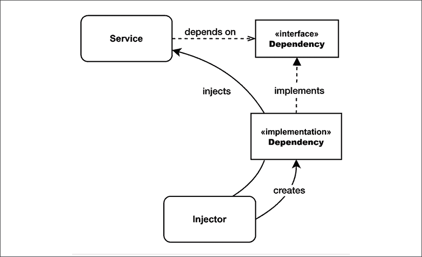

# 7

# 创建型设计模式

设计模式是对重复性问题的一种可重用解决方案。这个术语在定义上非常广泛，可以跨越应用程序的多个领域。然而，这个术语通常与 90 年代由几乎传奇的**四人帮**（**GoF**）在《设计模式：可复用面向对象软件元素》一书中普及的知名面向对象模式相关联：Erich Gamma、Richard Helm、Ralph Johnson 和 John Vlissides。我们通常会把这些特定的模式集称为**传统**设计模式或 GoF 设计模式。

在 JavaScript 中应用这组面向对象设计模式并不像在经典面向对象语言中那样线性化和正式。正如我们所知，JavaScript 是面向对象、基于原型的，并且具有动态类型。它还将函数视为一等公民，并允许函数式编程风格。这些特性使 JavaScript 成为一种非常灵活的语言，为开发者提供了巨大的力量，但同时也导致了编程风格、约定、技术和最终其生态系统模式的碎片化。使用 JavaScript，有如此多的方式可以达到相同的结果，以至于每个开发者都有自己的观点，认为这是解决问题的关键方法。这一现象的明显表现是 JavaScript 生态系统中框架和有偏见的库的丰富性；可能没有其他语言曾经见过这么多，尤其是在 Node.js 为 JavaScript 带来了新的惊人可能性并创造了如此多的新场景之后。

在这种情况下，JavaScript 的本质也影响了传统设计模式。在 JavaScript 中实现传统设计模式的方式有很多，以至于传统的强面向对象实现不再相关。

在某些情况下，这些设计模式的传统实现甚至是不可能的，因为正如我们所知，JavaScript 没有真正的类或抽象接口。然而，每个模式背后的原始想法、它解决的问题以及解决方案的核心概念并没有改变。

在本章以及接下来的两章中，我们将看到一些最重要的 GoF 设计模式如何应用于 Node.js 及其哲学，从而从另一个角度重新发现它们的重要性。在这些传统模式中，我们还将探讨一些从 JavaScript 生态系统本身诞生的“不那么传统”的设计模式。

在本章中，我们将特别探讨一类称为**创建型**的设计模式。正如其名称所暗示的，这些模式解决与对象创建相关的问题。例如，*工厂*模式允许我们将对象的创建封装在一个函数中。*揭示构造函数*模式允许我们在对象创建期间仅公开私有对象属性和方法，而*建造者*模式简化了复杂对象的创建。最后，*单例*模式和*依赖注入*模式帮助我们连接应用程序内部的模块。

本章以及接下来的两章假设您已经对 JavaScript 中的继承机制有所了解。同时，请被告知，我们通常会使用通用且更直观的图表来描述模式，而不是使用标准的 UML 图。这是因为许多模式不仅可以在类的基础上实现，还可以在对象甚至函数的基础上实现。

# 工厂

我们将从 Node.js 中最常见的设计模式之一开始：**工厂**。正如您将看到的，工厂模式非常灵活，不仅仅只有一个用途。其主要优势在于它能够将对象的创建与特定的实现解耦。这使得我们能够创建在运行时确定类的对象。工厂还允许我们暴露比类更小的“表面区域”；类可以被扩展或操作，而工厂作为一个函数，提供给用户的选择更少，使其更健壮且更容易理解。最后，工厂还可以通过利用闭包来强制执行封装。

## 解耦对象创建和实现

我们已经强调过，在 JavaScript 中，函数式范式通常比纯面向对象设计更受欢迎，因为它简单、易用，且*表面区域小*。这在创建新对象实例时尤其如此。实际上，调用工厂，而不是使用`new`运算符或`Object.create()`直接从类创建新对象，在许多方面都更加方便和灵活。

首先，工厂允许我们 *将对象的创建与其实现分离*。本质上，工厂封装了新实例的创建，使我们能够在创建方式上拥有更多的灵活性和控制。在工厂内部，我们可以选择使用 `new` 操作符创建一个新实例，或者利用闭包动态构建一个具有状态的字面量对象，甚至根据特定条件返回不同的对象类型。工厂的消费者对实例的创建方式一无所知。事实是，通过使用 `new`，我们使代码绑定到一种特定的对象创建方式，而使用工厂，我们可以获得几乎免费的更多灵活性。作为一个快速示例，让我们考虑一个简单的工厂，它创建一个 `Image` 对象：

```js
function createImage (name) {
  return new Image(name)
}
const image = createImage('photo.jpeg') 
```

`createImage()` 工厂可能看起来完全没有必要；为什么不直接使用 `new` 操作符实例化 `Image` 类呢？为什么不写点像下面这样的东西呢？

```js
const image = new Image(name) 
```

正如我们之前提到的，使用 `new` 关键字将我们的代码绑定到一种特定的对象类型上，在前面的例子中是绑定到 `Image` 对象类型。另一方面，工厂（factory）提供了更大的灵活性。想象一下，如果我们想要重构 `Image` 类，将其拆分成更小的类，每个类对应我们支持的每种图像格式。

如果我们将工厂作为创建新图像的唯一方式公开，我们可以简单地按照以下方式重写它，而不会破坏任何现有代码：

```js
function createImage (name) {
  if (name.match(/\.jpe?g$/)) {
    return new ImageJpeg(name)
  } else if (name.match(/\.gif$/)) {
    return new ImageGif(name)
  } else if (name.match(/\.png$/)) {
    return new ImagePng(name)
  } else {
    throw new Error('Unsupported format')
  }
} 
```

我们的工厂还允许我们隐藏类，并防止它们被扩展或修改（记住小表面面积原则？）。在 JavaScript 中，这可以通过仅导出工厂，同时保持类为私有来实现。

## 一种强制封装的机制

由于闭包，工厂也可以用作 **封装** 机制。

封装（Encapsulation）指的是通过阻止外部代码直接操作某些组件的内部细节来控制对这些细节的访问。与组件的交互仅通过其公共接口进行，将外部代码与组件实现细节的变化隔离开来。封装是面向对象设计的基本原则之一，与继承、多态和抽象并列。

在 JavaScript 中，强制封装的主要方法之一是通过函数作用域和闭包。工厂使得强制私有变量变得简单直接。例如，考虑以下内容：

```js
function createPerson (name) {
  const privateProperties = {}
  const person = {
    setName (name) {
      if (!name) {
        throw new Error('A person must have a name')
      }
      privateProperties.name = name
    },
    getName () {
      return privateProperties.name
    }
  }
  person.setName(name)
  return person
} 
```

在前面的代码中，我们利用闭包创建了两个对象：一个代表工厂返回的公共接口的`person`对象，以及一组不可从外部访问且只能通过`person`对象提供的接口进行操作的`privateProperties`。例如，在前面的代码中，我们确保一个人的`name`永远不会为空；如果`name`只是`person`对象的一个普通属性，那么这种强制措施将不可能实现。

使用闭包并不是我们用来强制封装的唯一技术。实际上，还有其他可能的方法：

+   使用 Node.js 12 中引入的私有类字段（hashbang `#` 前缀语法）。更多关于这个话题的信息请参阅：[nodejsdp.link/tc39-private-fields](http://nodejsdp.link/tc39-private-fields)。这是最现代的方法，但在撰写本文时，该功能仍然是实验性的，并且尚未包含在官方 ECMAScript 规范中。

+   使用 WeakMaps。更多关于这个话题的信息请参阅：[nodejsdp.link/weakmaps-private](http://nodejsdp.link/weakmaps-private)。

+   如下文章中解释的，使用符号：[nodejsdp.link/symbol-private](http://nodejsdp.link/symbol-private)。

+   在构造函数中定义私有变量（如 Douglas Crockford 所推荐：[nodejsdp.link/crockford-private](http://nodejsdp.link/crockford-private)）。这是传统但也是最知名的方法。

+   使用约定，例如，将属性名前缀为下划线"`_`"。然而，这从技术上讲并不能阻止成员被外部读取或修改。

## 构建一个简单的代码分析器

现在，让我们通过一个工厂来构建一个完整的示例。让我们构建一个简单的代码分析器，一个具有以下属性的对象：

+   一个触发分析会话开始的`start()`方法

+   一个`end()`方法来终止会话并将执行时间记录到控制台

让我们从创建一个名为`profiler.js`的文件开始，该文件将包含以下内容：

```js
class Profiler {
  constructor (label) {
    this.label = label
    this.lastTime = null
  }
  start () {
    this.lastTime = process.hrtime()
  }
  end () {
    const diff = process.hrtime(this.lastTime)
    console.log(`Timer "${this.label}" took ${diff[0]} seconds ` +
      `and ${diff[1]} nanoseconds.`)
  }
} 
```

我们刚刚定义的`Profiler`类使用 Node.js 的默认高分辨率计时器在`start()`被调用时保存当前时间，然后在`end()`执行时计算经过的时间，并将结果打印到控制台。

现在，如果我们打算在现实世界的应用程序中使用这样的分析器来计算不同例程的执行时间，我们可以很容易地想象出大量分析信息被打印到控制台，尤其是在生产环境中。我们可能想要做的是将分析信息重定向到另一个来源，例如，一个专门的日志文件，或者如果应用程序以生产模式运行，可以选择完全禁用分析器。很明显，如果我们直接使用`new`运算符实例化`Profiler`对象，我们将在客户端代码或`Profiler`对象本身中需要一些额外的逻辑来在不同的逻辑之间切换。

或者，我们可以使用工厂来抽象`Profiler`对象的创建，这样，根据应用程序是否在生产模式下运行，我们可以返回一个完全工作的`Profiler`实例或具有相同接口但方法为空的模拟对象。这正是我们将在`profiler.js`模块中做的。我们不会导出`Profiler`类，而是只导出我们的工厂。以下是其代码：

```js
const noopProfiler = {
  start () {},
  end () {}
}
export function createProfiler (label) {
  if (process.env.NODE_ENV === 'production') {
    return noopProfiler
  }
  return new Profiler(label)
} 
```

`createProfiler()`函数是我们的工厂，其作用是抽象`Profiler`对象的创建与其实现。如果应用程序在生产模式下运行，我们返回`noopProfiler`，它实际上什么也不做，有效地禁用了任何分析。如果应用程序不在生产模式下运行，那么我们将创建并返回一个新的、完全功能的`Profiler`实例。

多亏了 JavaScript 的动态类型，我们能够在一种情况下使用`new`运算符返回一个对象，在另一种情况下返回一个简单的对象字面量（这也被称为**鸭子类型**，你可以在[nodejsdp.link/duck-typing](http://nodejsdp.link/duck-typing)上了解更多关于它的信息）。这证实了我们在工厂函数内部可以以任何我们喜欢的方式创建对象。我们还可以根据特定条件执行额外的初始化步骤或返回不同类型的对象，同时将对象的使用者与所有这些细节隔离开来。我们可以轻松理解这种简单模式的力量。

现在，让我们稍微玩一下我们的分析器工厂。让我们创建一个算法来计算给定数字的所有因子，并使用我们的分析器来记录其运行时间：

```js
// index.js
import { createProfiler } from './profiler.js'
function getAllFactors (intNumber) {
  const profiler = createProfiler(
    `Finding all factors of ${intNumber}`)
  profiler.start()
  const factors = []
  for (let factor = 2; factor <= intNumber; factor++) {
    while ((intNumber % factor) === 0) {
      factors.push(factor)
      intNumber = intNumber / factor
    }
  }
  profiler.end()
  return factors
}
const myNumber = process.argv[2]
const myFactors = getAllFactors(myNumber)
console.log(`Factors of ${myNumber} are: `, myFactors) 
```

`profiler`变量包含我们的`Profiler`对象，其实现将由运行时的`createProfiler()`工厂根据`NODE_ENV`环境变量来决定。

例如，如果我们以生产模式运行模块，我们将不会得到任何分析信息：

```js
NODE_ENV=production node index.js 2201307499 
```

当我们在开发模式下运行模块时，我们会看到分析信息被打印到控制台：

```js
node index.js 2201307499 
```

我们刚才展示的例子只是工厂函数模式的一个简单应用，但它清楚地显示了将对象的创建与其实现分离的优势。

## 在野外

正如我们所说的，工厂在 Node.js 中非常常见。我们可以在流行的*Knex* ([nodejsdp.link/knex](http://nodejsdp.link/knex)) 包中找到一个例子。Knex 是一个支持多个数据库的 SQL 查询构建器。它的包只导出一个函数，这是一个工厂。工厂执行各种检查，根据数据库引擎选择正确的方言对象来使用，并最终创建并返回 Knex 对象。查看[nodejsdp.link/knex-factory](http://nodejsdp.link/knex-factory)中的代码。

# 构建者

Builder 是一种创建型设计模式，通过提供流畅的接口简化了复杂对象的创建，允许我们逐步构建对象。这大大提高了创建此类复杂对象的可读性和开发者体验。

我们可以从 Builder 模式中受益的最明显的情况是，一个构造函数具有长列表的参数，或者接受许多复杂参数作为输入的类。通常，这类类需要预先设置许多参数，因为所有这些参数都是构建一个完整且一致状态的实例所必需的，因此在考虑潜在解决方案时必须考虑这一点。

因此，让我们看看该模式的一般结构。想象一下有一个`Boat`类，其构造函数如下所示：

```js
class Boat {
  constructor (hasMotor, motorCount, motorBrand, motorModel,
               hasSails, sailsCount, sailsMaterial, sailsColor,
               hullColor, hasCabin) {
    // ...
  }
} 
```

调用这样的构造函数将生成一些难以阅读的代码，这些代码很容易出错（哪个参数是什么？）。以下代码为例：

```js
const myBoat = new Boat(true, 2, 'Best Motor Co. ', 'OM123', true, 1,
                        'fabric', 'white', 'blue', false) 
```

改进此构造函数设计的第一步是将所有参数聚合到一个单一的对象字面量中，如下所示：

```js
class Boat {
  constructor (allParameters) {
    // ...
  }
}
const myBoat = new Boat({
  hasMotor: true,
  motorCount: 2,
  motorBrand: 'Best Motor Co. ',
  motorModel: 'OM123',
  hasSails: true,
  sailsCount: 1,
  sailsMaterial: 'fabric',
  sailsColor: 'white',
  hullColor: 'blue',
  hasCabin: false
}) 
```

如我们从之前的代码中可以注意到的，这个新的构造函数确实比原来的好，因为它允许我们清楚地看到每个参数接收的是什么值。然而，我们可以做得更好。使用单一对象字面量一次性传递所有输入的一个缺点是，唯一知道实际输入的方式是查看类文档，或者更糟糕的是，查看类的代码。除此之外，没有强制性的协议指导开发者创建一个连贯的类。例如，如果我们指定`hasMotor: true`，那么我们还需要指定`motorCount`、`motorBrand`和`motorModel`，但这个接口中没有传达这种信息给我们。

Builder 模式甚至修复了这些最后的几个缺陷，并提供了一个简单易读、自我文档化的流畅接口，它为创建一个连贯的对象提供了指导。让我们看看`BoatBuilder`类，它实现了`Boat`类的 Builder 模式：

```js
class BoatBuilder {
  withMotors (count, brand, model) {
    this.hasMotor = true
    this.motorCount = count
    this.motorBrand = brand
    this.motorModel = model
    return this
  }
  withSails (count, material, color) {
    this.hasSails = true
    this.sailsCount = count
    this.sailsMaterial = material
    this.sailsColor = color
    return this
  }
  hullColor (color) {
    this.hullColor = color
    return this
  }
  withCabin () {
    this.hasCabin = true
    return this
  }
  build() {
    return new Boat({
      hasMotor: this.hasMotor,
      motorCount: this.motorCount,
      motorBrand: this.motorBrand,
      motorModel: this.motorModel,
      hasSails: this.hasSails,
      sailsCount: this.sailsCount,
      sailsMaterial: this.sailsMaterial,
      sailsColor: this.sailsColor,
      hullColor: this.hullColor,
      hasCabin: this.hasCabin
    })
  }
} 
```

为了充分欣赏 Builder 模式对我们创建`Boat`对象方式产生的积极影响，让我们看看一个示例：

```js
const myBoat = new BoatBuilder()
  .withMotors(2, 'Best Motor Co. ', 'OM123')
  .withSails(1, 'fabric', 'white')
  .withCabin()
  .hullColor('blue')
  .build() 
```

如我们所见，我们的`BoatBuilder`类的角色是收集创建`Boat`所需的所有参数，使用一些辅助方法。我们通常有一个方法用于每个参数或相关参数集，但并没有一个确切的规定。这取决于 Builder 类的设计者来决定每个负责收集输入参数的方法的名称和行为。

我们可以总结一些实现 Builder 模式的一般规则，如下所示：

+   主要目标是把复杂的构造函数分解成多个更易读、更易管理的步骤。

+   尝试创建可以一次性设置多个相关参数的建造者方法。

+   根据接收到的 setter 方法输入的值推断并隐式设置参数，并且通常尝试将尽可能多的参数设置相关逻辑封装到 setter 方法中，以便建造者接口的消费者可以免于这样做。

+   如果需要，可以在将参数传递给正在构建的类的构造函数之前进一步操作这些参数（例如，类型转换、归一化或额外验证），以进一步简化建造者类消费者剩余的工作。

在 JavaScript 中，建造者模式不仅可以应用于调用函数，而不仅仅是使用构造函数来构建对象。实际上，从技术角度来看，这两种场景几乎是相同的。处理函数时的主要区别是，我们不会有一个 `build()` 方法，而会有一个 `invoke()` 方法，它使用建造者对象收集的参数调用复杂的函数，并将任何最终结果返回给调用者。

接下来，我们将通过一个更具体的例子来应用我们刚刚学到的建造者模式（Builder pattern）。

## 实现 URL 对象建造者

我们希望实现一个 `Url` 类，它可以保存标准 URL 的所有组件，验证它们，并将它们格式化回字符串。这个类将故意保持简单和最小化，因此对于标准的生产使用，我们建议使用内置的 `URL` 类 ([nodejsdp.link/docs-url](http://nodejsdp.link/docs-url))。

现在，让我们在名为 `url.js` 的文件中实现我们的自定义 `Url` 类：

```js
export class Url {
  constructor (protocol, username, password, hostname,
    port, pathname, search, hash) {
    this.protocol = protocol
    this.username = username
    this.password = password
    this.hostname = hostname
    this.port = port
    this.pathname = pathname
    this.search = search
    this.hash = hash
    this.validate()
  }
  validate () {
    if (!this.protocol || !this.hostname) {
      throw new Error('Must specify at least a ' +
        'protocol and a hostname')
    }
  }
  toString () {
    let url = ''
    url += `${this.protocol}://`
    if (this.username && this.password) {
      url += `${this.username}:${this.password}@`
    }
    url += this.hostname
    if (this.port) {
      url += this.port
    }
    if (this.pathname) {
      url += this.pathname
    }
    if (this.search) {
      url += `?${this.search}`
    }
    if (this.hash) {
      url += `#${this.hash}`
    }
    return url
  }
} 
```

标准 URL 由多个组件组成，因此为了包含所有这些组件，`Url` 类的构造函数不可避免地会很大。调用这样的构造函数可能是一个挑战，因为我们必须跟踪参数的位置，以知道我们正在传递 URL 的哪个组件。看看以下示例以了解这一点：

```js
return new Url('https', null, null, 'example.com', null, null, null,
  null) 
```

这正是我们刚刚学到的建造者模式适用的完美场景。现在就让我们来做这件事。计划是创建一个名为 `UrlBuilder` 的类，它为每个参数（或相关参数组）提供了一个设置方法，这些参数是实例化 `Url` 类所必需的。最后，建造者将有一个 `build()` 方法，用于检索使用所有在建造者中设置的参数创建的新 `Url` 实例。因此，让我们在名为 `urlBuilder.js` 的文件中实现建造者：

```js
export class UrlBuilder {
  setProtocol (protocol) {
    this.protocol = protocol
    return this
  }
  setAuthentication (username, password) {
    this.username = username
    this.password = password
    return this
  }
  setHostname (hostname) {
    this.hostname = hostname
    return this
  }
  setPort (port) {
    this.port = port
    return this
  }
  setPathname (pathname) {
    this.pathname = pathname
    return this
  }
  setSearch (search) {
    this.search = search
    return this
  }
  setHash (hash) {
    this.hash = hash
    return this
  }
  build () {
    return new Url(this.protocol, this.username, this.password,
      this.hostname, this.port, this.pathname, this.search,
      this.hash)
  }
} 
```

这应该相当直接。只需注意我们如何将 `username` 和 `password` 参数组合成一个单独的 `setAuthentication()` 方法。这清楚地传达了这样一个事实：如果我们想在 `Url` 中指定任何认证信息，我们必须提供 `username` 和 `password`。

现在，我们已经准备好尝试我们的 `UrlBuilder` 并见证它相对于直接使用 `Url` 类的优势。我们可以在名为 `index.js` 的文件中这样做：

```js
import { UrlBuilder } from './urlBuilder.js'
const url = new UrlBuilder()
  .setProtocol('https')
  .setAuthentication('user', 'pass')
  .setHostname('example.com')
  .build()
console.log(url.toString()) 
```

如我们所见，代码的可读性有了显著提高。每个设置方法清楚地给出了我们正在设置什么参数的提示，而且在此基础上，它们还提供了一些关于如何设置这些参数的指导（例如，`username`和`password`必须一起设置）。

构建器模式也可以直接实现在目标类中。例如，我们可以通过添加一个空构造函数（因此没有在对象创建时的验证）和为各种组件设置的方法来重构`Url`类，而不是创建一个单独的`UrlBuilder`类。然而，这种方法有一个主要的缺陷。使用与目标类分离的构建器的好处是始终产生保证处于一致状态的实例。例如，`UrlBuilder.build()`返回的每个`Url`对象都保证是有效的并且处于一致状态；在这些对象上调用`toString()`将始终返回一个有效的 URL。如果我们直接在`Url`类上实现 Builder 模式，则不能这么说。事实上，在这种情况下，如果我们正在设置各种 URL 组件时调用`toString()`，其返回值可能不是有效的。这可以通过添加额外的验证来缓解，但代价是增加了更多的复杂性。

## 在野外

构建器模式在 Node.js 和 JavaScript 中相当常见，因为它提供了一个非常优雅的解决方案来创建复杂对象或调用复杂函数的问题。一个完美的例子是使用`http`和`https`内置模块的`request()` API 创建新的 HTTP(S)客户端请求。如果我们查看其文档（可在[nodejsdp.link/docs-http-request](http://nodejsdp.link/docs-http-request)找到），我们可以立即看到它接受大量的选项，这是 Builder 模式可能提供更好的接口的通常迹象。事实上，最受欢迎的 HTTP(S)请求包装器之一，`superagent`([nodejsdp.link/superagent](http://nodejsdp.link/superagent))，旨在通过实现 Builder 模式来简化新请求的创建，从而提供一个流畅的接口来逐步创建新请求。以下代码片段是一个示例：

```js
superagent
  .post('https://example.com/api/person')
  .send({ name: 'John Doe', role: 'user' })
  .set('accept', 'json')
  .then((response) => {
    // deal with the response
  }) 
```

从之前的代码中，我们可以注意到这是一个不寻常的构建器；实际上，我们没有`build()`或`invoke()`方法（或任何具有类似目的的其他方法），也没有使用`new`运算符。触发请求的实际上是调用`then()`方法。值得注意的是，`superagent`请求对象不是一个 Promise，而是一个自定义的*thenable*，其中`then()`方法触发了使用构建器对象构建的请求的执行。

我们已经在**第五章**中讨论了*thenables*，即**异步控制流模式与 Promises 和 Async/Await**。

如果你查看库的代码，你将看到在`Request`类中构建者模式的应用实例（[nodejsdp.link/superagent-src-builder](http://nodejsdp.link/superagent-src-builder)）。

这标志着我们对构建者模式的探索结束。接下来，我们将探讨揭示构造者模式。

# 揭示构造者

揭示构造者模式是那些你不会在“四人帮”书中找到的模式之一，因为它直接源于 JavaScript 和 Node.js 社区。它解决了一个非常棘手的问题，即：我们如何在对象的创建时刻“揭示”对象的某些私有功能？这在当我们希望只允许在对象的创建阶段操作对象的内部时尤其有用。这允许一些有趣的场景，例如：

+   创建在创建时只能修改的对象

+   创建在创建时只能定义自定义行为的对象

+   创建在创建时只能初始化一次的对象

这些只是揭示构造者模式所启用的可能性中的一小部分。但要更好地理解所有可能的用例，让我们通过查看以下代码片段来了解模式的内容：

```js
//                    (1)               (2)          (3)
const object = new SomeClass(function executor(revealedMembers) {
  // manipulation code ...
}) 
```

如我们从之前的代码中可以看到，揭示构造者模式由三个基本元素组成；一个**构造函数**（1），它接受一个函数作为输入（**执行器**（2）），在创建时被调用，并接收对象内部的一部分作为输入（**揭示成员**（3））。

为了使模式生效，揭示的功能必须在其他情况下不可由对象的用户访问。这可以通过我们在上一节中提到的有关工厂模式的封装技术之一来实现。

Domenic Denicola 是第一个在他的博客文章中识别并命名该模式的人，该文章可以在[nodejsdp.link/domenic-revealing-constructor](http://nodejsdp.link/domenic-revealing-constructor)找到。

现在，让我们通过几个例子来更好地理解揭示构造者模式的工作原理。

## 构建不可变缓冲区

**不可变**对象和数据结构具有许多优秀的属性，使它们在无数情况下成为使用它们的可变（或可更改）对应物的理想选择。不可变指的是对象的一个属性，一旦创建，其数据或状态就变得不可修改。

使用不可变对象，我们不需要在将它们传递给其他库或函数之前创建**防御性副本**。我们简单地有一个强有力的保证，根据定义，它们不会被修改，即使它们被传递到我们不知道或无法控制的代码中。

修改不可变对象只能通过创建一个新的副本来完成，这可以使代码更易于维护和推理。我们这样做是为了更容易地跟踪状态变化。

不可变对象的另一个常见用例是高效的变更检测。由于每次变更都需要复制，如果我们假设每个副本都对应一个修改，那么检测变更就像使用严格相等运算符（或三元等`===`）一样简单。这种技术在前端编程中被广泛使用，以高效地检测 UI 是否需要刷新。

在这个上下文中，现在让我们使用 Revealing Constructor 模式创建 Node.js `Buffer`组件的简单不可变版本（[nodejsdp.link/docs-buffer](http://nodejsdp.link/docs-buffer)）。该模式允许我们仅在创建时操作不可变缓冲区。

让我们在名为`immutableBuffer.js`的新文件中实现我们的不可变缓冲区，如下所示：

```js
const MODIFIER_NAMES = ['swap', 'write', 'fill']
export class ImmutableBuffer {
  constructor (size, executor) {
    const buffer = Buffer.alloc(size)                         // (1)
    const modifiers = {}                                      // (2)
    for (const prop in buffer) {                              // (3)
      if (typeof buffer[prop] !== 'function') {
        continue
      }
      if (MODIFIER_NAMES.some(m => prop.startsWith(m))) {     // (4)
        modifiers[prop] = buffer[prop].bind(buffer)
      } else {
        this[prop] = buffer[prop].bind(buffer)                // (5)
      }
    }
    executor(modifiers)                                       // (6)
  }
} 
```

现在我们来看看我们的新`ImmutableBuffer`类是如何工作的：

1.  首先，我们根据`size`构造函数参数指定的尺寸分配一个新的 Node.js `Buffer`（`buffer`）。

1.  然后，我们创建一个对象字面量（`modifiers`），用于保存所有可以修改缓冲区的函数。

1.  之后，我们遍历我们的内部`buffer`的所有属性（自有和继承的），确保跳过所有不是函数的属性。

1.  接下来，我们尝试识别当前`prop`是否是一个允许我们修改`buffer`的方法。我们通过尝试将其名称与`MODIFIER_NAMES`数组中的字符串之一进行匹配来完成此操作。如果我们有这样的方法，我们将其绑定到`buffer`实例，然后将其添加到`modifiers`对象中。

1.  如果我们的方法不是修改器方法，那么我们将其直接添加到当前实例（`this`）中。

1.  最后，我们调用构造函数中接收到的`executor`函数，并将`modifiers`对象作为参数传递，这将允许`executor`修改我们的内部`buffer`。

在实践中，我们的`ImmutableBuffer`充当其消费者和内部`buffer`对象之间的**代理**。`buffer`实例的一些方法直接通过`ImmutableBuffer`接口（主要是只读方法）公开，而其他方法则提供给执行器函数（修改器方法）。

我们将在第八章*结构型设计模式*中更详细地分析 Proxy 模式。

请记住，这只是一个 Revealing Constructor 模式的演示，因此不可变缓冲区的实现故意保持简单。例如，我们没有公开缓冲区的大小或提供其他初始化缓冲区的方法。我们将把这些留给你作为练习。

现在，让我们编写一些代码来演示如何使用我们新的`ImmutableBuffer`类。让我们创建一个名为`index.js`的新文件，包含以下代码：

```js
import { ImmutableBuffer } from './immutableBuffer.js'
const hello = 'Hello!'
const immutable = new ImmutableBuffer(hello.length,
  ({ write }) => {                                         // (1)
    write(hello)
  })
console.log(String.fromCharCode(immutable.readInt8(0)))    // (2)
// the following line will throw
// "TypeError: immutable.write is not a function"
// immutable.write('Hello?')                               // (3) 
```

从之前的代码中，我们可以注意到的第一点是执行器函数如何使用`write()`函数（它是修改器方法的一部分）将字符串写入缓冲区（1）。以类似的方式，执行器函数本可以使用`fill()`、`writeInt8()`、`swap16()`或`modifiers`对象中公开的任何其他方法。

我们刚才看到的代码也展示了新的 `ImmutableBuffer` 实例仅暴露不修改缓冲区的方法，例如 `readInt8()`（2），而它不提供任何更改缓冲区内容的方法（3）。

## 在野外

揭示构造函数模式提供了非常强的保证，因此，它主要用在需要提供无懈可击封装的上下文中。该模式的一个完美应用是在由数十万开发者使用的组件中，这些组件必须提供无偏见接口和严格的封装。然而，我们也可以在我们的项目中使用该模式来提高可靠性，并简化与其他人和团队之间的代码共享（因为它可以使对象对第三方更安全）。

揭示构造函数模式的一个流行应用是在 JavaScript 的 `Promise` 类中。有些人可能已经注意到了这一点。当我们从头创建一个新的 `Promise` 时，其构造函数接受一个 `executor` 函数作为输入，该函数将接收用于修改 `Promise` 内部状态的 `resolve()` 和 `reject()` 函数。让我们回顾一下它的样子：

```js
return new Promise((resolve, reject) => {
  // ...
}) 
```

一旦创建，`Promise` 状态就不能通过其他方式更改。我们所能做的就是使用我们在 *第五章* 中学习的方法来接收其实现值或拒绝原因，即 *异步控制流模式与 Promises 和 Async/Await*。

# 单例

现在，我们将花一些时间讨论在面向对象编程中最常用的模式之一，即 **单例** 模式。正如我们将看到的，单例是那些在 Node.js 中有简单实现且几乎不值得讨论的模式之一。然而，有一些注意事项和限制，每个优秀的 Node.js 开发者都必须知道。

单例模式的目的在于确保一个类只有一个实例，并集中其访问。在应用程序的所有组件中使用单个实例有几个原因：

+   为了共享有状态信息

+   为了优化资源使用

+   为了同步对资源的访问

如您所想象，这些场景相当常见。以一个典型的 `数据库` 类为例，它提供了对数据库的访问：

```js
// 'Database.js'
export class Database {
  constructor (dbName, connectionDetails) {
    // ...
  }
  // ...
} 
```

这样一个类的典型实现通常保持一个数据库连接池，因此，为每个请求创建一个新的 `数据库` 实例是没有意义的。此外，一个 `数据库` 实例可能存储一些有状态信息，例如挂起的交易列表。因此，我们的 `数据库` 类符合单例模式的两项标准。因此，我们通常希望在应用程序开始时配置和实例化一个单一的 `数据库` 实例，并让每个组件使用这个单一的共享 `数据库` 实例。

许多 Node.js 的新手对如何正确实现单例模式感到困惑；然而，答案比我们想象的要简单。只需从一个模块中导出一个实例就足以获得非常类似单例模式的东西。例如，以下代码行：

```js
// file 'dbInstance.js'
import { Database } from './Database.js'
**export****const** **dbInstance** = new Database('my-app-db', {
    url: 'localhost:5432',
    username: 'user',
    password: 'password'
}) 
```

通过简单地导出我们`Database`类的新实例，我们就可以假设在当前包内（这可以很容易地是整个应用程序的代码），我们只会有一个`dbInstance`模块的实例。这是因为，正如我们从*第二章*，*模块系统*中了解到的，Node.js 会缓存模块，确保在每次导入时不会执行其代码。

例如，我们可以很容易地通过以下代码行获得我们之前定义的`dbInstance`模块的共享实例：

```js
import { dbInstance } from './dbInstance.js' 
```

但有一个注意事项。模块是使用其完整路径作为查找键进行缓存的，因此它只保证在当前包内是单例。实际上，每个包在其`node_modules`目录内可能都有自己的私有依赖集，这可能导致同一包和同一模块的多个实例，从而使我们的单例不再真正是唯一的！当然，这是一个罕见的情况，但了解其后果是很重要的。

以例如，我们之前看到的`Database.js`和`dbInstance.js`文件被封装在一个名为`mydb`的包中的情况为例。以下代码行将位于其`package.json`文件中：

```js
{
  "name": "mydb",
  "version": "2.0.0",
  "type": "module",
  "main": "dbInstance.js"
} 
```

接下来，考虑两个包（`package-a`和`package-b`），它们各自都有一个名为`index.js`的单个文件，包含以下代码：

```js
import { dbInstance } from 'mydb'
export function getDbInstance () {
  return dbInstance
} 
```

`package-a`和`package-b`都依赖于`mydb`包。然而，`package-a`依赖于`mydb`包的`1.0.0`版本，而`package-b`依赖于同一包的`2.0.0`版本（在我们的例子中，它有一个相同的实现，但在其`package.json`文件中指定了不同的版本）。

根据我们刚才描述的结构，我们最终会得到以下包依赖树：

```js
app/
`-- node_modules
    |-- package-a
    |  `-- node_modules
    |      `-- mydb
    `-- package-b
        `-- node_modules
            `-- mydb 
```

我们最终得到一个像这里这样的目录结构，因为`package-a`和`package-b`需要`mydb`模块的两个不同不兼容版本（例如，`1.0.0`与`2.0.0`）。在这种情况下，一个典型的包管理器，如`npm`或`yarn`，不会将依赖项“提升”到顶层的`node_modules`目录，而是会安装每个包的私有副本，试图解决版本不兼容问题。

根据我们刚才看到的目录结构，`package-a`和`package-b`都依赖于`mydb`包；反过来，我们的根包`app`依赖于`package-a`和`package-b`。

我们刚才描述的场景将违反数据库实例唯一性的假设。实际上，考虑以下位于`app`包根目录的文件（`index.js`）：

```js
import { getDbInstance as getDbFromA } from 'package-a'
import { getDbInstance as getDbFromB } from 'package-b'
const isSame = getDbFromA() === getDbFromB()
console.log('Is the db instance in package-a the same ' +
  `as package-b? ${isSame ? 'YES' : 'NO'}`) 
```

如果你运行前面的文件，你会注意到对“包-a 中的 db 实例与包-b 中的实例是否相同？”这个问题的答案是“不”。实际上，“包-a”和“包-b”将实际加载两个不同的`dbInstance`对象实例，因为`mydb`模块将解析到不同的目录，这取决于它被要求的包。这显然违反了单例模式的假设。

如果相反，`包-a`和`包-b`都需要两个相互兼容的`mydb`包版本，例如，`².0.1`和`².0.7`，那么包管理器会将`mydb`包安装到顶级`node_modules`目录中（这种做法被称为**依赖提升**），从而有效地与`包-a`、`包-b`和根包共享相同的实例。

到目前为止，我们可以很容易地说，文献中描述的单例模式在 Node.js 中并不存在，除非我们使用真正的**全局变量**来存储它，如下所示：

```js
global.dbInstance = new Database('my-app-db', {/*...*/}) 
```

这保证了实例在整个应用程序中是唯一的，而不仅仅是同一个包中的。然而，请考虑，大多数时候，我们并不真的需要一个**纯**单例。实际上，我们通常在应用程序的主包中创建和导入单例，或者在应用程序的一个子组件中，该子组件已经被模块化成依赖项。

如果你正在创建一个将被第三方使用的包，尽量保持其无状态，以避免本节中讨论的问题。

在本书的整个过程中，为了简单起见，我们将使用术语单例来描述由模块导出的类实例或具有状态的对象，即使这并不代表严格意义上的单例。

接下来，我们将看到处理模块之间依赖关系的两种主要方法，一种基于单例模式，另一种利用依赖注入模式。

# 模块连接

每个应用程序都是几个组件的聚合结果，随着应用程序的增长，我们连接这些组件的方式成为维护性和项目成功与否的关键因素。

当组件 A 需要组件 B 来满足某个功能时，我们说“A 依赖于 B”，或者相反，“B 是 A 的依赖”。为了理解这个概念，让我们举一个例子。

假设我们想要编写一个用于博客系统的 API，该系统使用数据库来存储其数据。我们可以有一个通用的模块实现数据库连接（`db.js`）和一个博客模块，该模块公开创建和从数据库检索博客文章的主要功能（`blog.js`）。

下图说明了数据库模块和博客模块之间的关系：


图 7.1：博客模块和数据库模块之间的依赖关系图

在本节中，我们将看到如何使用两种不同的方法来建模这种依赖关系，一种基于单例模式，另一种使用依赖注入模式。

## 单例依赖

将两个模块连接起来的最简单方法是通过利用 Node.js 的模块系统。以这种方式连接的状态化依赖实际上是单例，正如我们在上一节中讨论的那样。

为了看到实际效果，我们将使用数据库连接的单例实例来实现我们之前描述的简单博客应用程序。让我们看看这种方法的可能实现（文件 `db.js`）：

```js
import { dirname, join } from 'path'
import { fileURLToPath } from 'url'
import sqlite3 from 'sqlite3'
const __dirname = dirname(fileURLToPath(import.meta.url))
export const db = new sqlite3.Database(
  join(__dirname, 'data.sqlite')) 
```

在前面的代码中，我们使用 SQLite ([nodejsdp.link/sqlite](http://nodejsdp.link/sqlite)) 作为数据库来存储我们的帖子。为了与 SQLite 交互，我们使用 npm 中的模块 `sqlite3` ([nodejsdp.link/sqlite3](http://nodejsdp.link/sqlite3))。SQLite 是一个数据库系统，它将所有数据保存在单个本地文件中。在我们的数据库模块中，我们决定使用一个名为 `data.sqlite` 的文件，该文件与模块保存在同一文件夹中。

上述代码创建了一个指向我们的数据文件的新数据库实例，并将数据库连接对象作为名为 `db` 的单例导出。

现在，让我们看看我们如何实现 `blog.js` 模块：

```js
import { promisify } from 'util'
import { db } from './db.js'
const dbRun = promisify(db.run.bind(db))
const dbAll = promisify(db.all.bind(db))
export class Blog {
  initialize () {
    const initQuery = `CREATE TABLE IF NOT EXISTS posts (
      id TEXT PRIMARY KEY,
      title TEXT NOT NULL,
      content TEXT,
      created_at TIMESTAMP DEFAULT CURRENT_TIMESTAMP
    );`
    return dbRun(initQuery)
  }
  createPost (id, title, content, createdAt) {
    return dbRun('INSERT INTO posts VALUES (?, ?, ?, ?)',
      id, title, content, createdAt)
  }
  getAllPosts () {
    return dbAll('SELECT * FROM posts ORDER BY created_at DESC')
  }
} 
```

`blog.js` 模块导出一个名为 `Blog` 的类，包含三个方法：

+   `initialize()`: 如果不存在，则创建 `posts` 表。该表将用于存储博客帖子的数据。

+   `createPost()`: 接收创建帖子所需的所有必要参数。它将执行一个 `INSERT` 语句将新帖子添加到数据库中。

+   `getAllPosts()`: 从数据库中检索所有可用的帖子，并将它们作为数组返回。

现在，让我们创建一个模块来尝试我们刚刚创建的博客模块（文件 `index.js`）的功能：

```js
import { Blog } from './blog.js'
async function main () {
  const blog = new Blog()
  await blog.initialize()
  const posts = await blog.getAllPosts()
  if (posts.length === 0) {
    console.log('No post available. Run `node import-posts.js`' +
      ' to load some sample posts')
  }
  for (const post of posts) {
    console.log(post.title)
    console.log('-'.repeat(post.title.length))
    console.log(`Published on ${new Date(post.created_at)
      .toISOString()}`)
    console.log(post.content)
  }
}
main().catch(console.error) 
```

前面的模块非常简单。我们使用 `blog.getAllPosts()` 获取所有帖子的数组，然后遍历它，并为每个帖子显示数据，稍作格式化。

你可以使用提供的 `import-posts.js` 模块在运行 `index.js` 之前将一些示例帖子加载到数据库中。你可以在本书的代码存储库中找到 `import-posts.js`，以及其他与此示例相关的文件。

作为一项有趣的练习，你可以尝试修改 `index.js` 模块以生成 HTML 文件；一个用于博客索引，然后为每个博客帖子创建一个专门的文件。这样，你就可以构建自己的最小化静态网站生成器了！

如前述代码所示，我们可以通过利用单例模式传递`db`实例来实施一个非常简单的命令行博客管理系统。大多数时候，这就是我们管理应用中有状态依赖关系的方式；然而，在某些情况下，这可能不足以解决问题。

如我们在前面的例子中所做的那样，使用单例当然是最简单、最直接和最易读的解决方案来传递有状态依赖关系。然而，如果我们想在测试期间模拟数据库，或者如果我们想允许博客 CLI 或 API 的用户选择另一个数据库后端，而不是我们默认提供的标准 SQLite 后端，会发生什么呢？对于这些用例，单例可能会成为实现良好结构化解决方案的障碍。

我们可以在我们的`db.js`模块中引入`if`语句，根据某些环境条件或配置选择不同的实现。或者，我们可以篡改 Node.js 模块系统来拦截数据库文件的导入，并用其他东西替换它。但是，正如你可以想象的，这些解决方案远非优雅。

在下一节中，我们将学习另一种连接模块的策略，这可能是解决我们在此讨论的一些问题的理想解决方案。

## 依赖注入

Node.js 模块系统和单例模式可以作为组织应用程序组件和连接组件的强大工具。然而，它们并不总是保证成功。一方面，它们易于使用且非常实用；另一方面，它们可能会在组件之间引入更紧密的*耦合*。

在前面的例子中，我们可以看到`blog.js`模块与`db.js`模块紧密耦合。事实上，我们的`blog.js`模块按设计不能在没有`database.js`模块的情况下工作，也不能在必要时使用不同的数据库模块。我们可以通过利用**依赖注入模式**轻松修复这两个模块之间的紧密耦合。

**依赖注入**（**DI**）是一种非常简单的模式，其中组件的依赖关系由外部实体*提供*作为输入，通常被称为**注入器**。

注入器初始化不同的组件并将它们的依赖关系连接在一起。它可能是一个简单的初始化脚本，也可能是一个更复杂的*全局容器*，该容器映射所有依赖关系并集中连接系统的所有模块。这种方法的优点是提高了解耦性，特别是对于依赖于有状态实例（例如，数据库连接）的模块。使用依赖注入（DI），每个依赖关系都不是硬编码到模块中，而是从外部接收。这意味着依赖模块可以被配置为使用任何兼容的依赖关系，因此模块本身可以在不同的环境中以最小的努力重用。

以下图表说明了这个概念：



图 7.2：依赖注入示意图

在*图 7.2*中，我们可以看到通用服务期望一个具有预定接口的依赖项。**注入器**负责检索或创建一个实际的具体实例，该实例实现了这样的接口并将其（或“注入”）到服务中。换句话说，注入器的目标是提供一个满足服务依赖项的实例。

为了演示这个模式在实际中的应用，让我们通过使用依赖注入（DI）来连接其模块，重构我们在上一节中构建的简单博客系统。让我们首先重构`blog.js`模块：

```js
import { promisify } from 'util'
export class Blog {
  **constructor** **(db) {**
    **this****.db = db**
    **this****.dbRun = promisify(db.run.bind(db))**
    **this****.dbAll = promisify(db.all.bind(db))**
  **}**
  initialize () {
    const initQuery = `CREATE TABLE IF NOT EXISTS posts (
      id TEXT PRIMARY KEY,
      title TEXT NOT NULL,
      content TEXT,
      created_at TIMESTAMP DEFAULT CURRENT_TIMESTAMP
    );`
    return this.dbRun(initQuery)
  }
  createPost (id, title, content, createdAt) {
    return this.dbRun('INSERT INTO posts VALUES (?, ?, ?, ?)',
      id, title, content, createdAt)
  }
  getAllPosts () {
    return this.dbAll(
      'SELECT * FROM posts ORDER BY created_at DESC')
  }
} 
```

如果你将新版本与旧版本进行比较，它们几乎相同。只有两个小但重要的区别：

+   我们不再导入数据库模块

+   `Blog`类的构造函数接受`db`作为参数

新的构造函数参数`db`是在运行时需要由`Blog`类的客户端组件提供的预期依赖项。这个客户端组件将成为依赖项的注入器。由于 JavaScript 没有表示抽象接口的方法，因此提供的依赖项预期将实现`db.run()`和`db.all()`方法。这被称为鸭子类型，正如本书前面提到的。

让我们现在重写我们的`db.js`模块。这里的目的是摆脱单例模式，并设计出一个更可重用和可配置的实现：

```js
import sqlite3 from 'sqlite3'
export function createDb (dbFile) {
  return new sqlite3.Database(dbFile)
} 
```

这个新的`db`模块实现提供了一个名为`createDb()`的工厂函数，它允许我们在运行时创建数据库的新实例。它还允许我们在创建时传递数据库文件的路径，这样我们就可以创建独立的实例，如果需要的话，可以写入不同的文件。

在这个阶段，我们已经几乎拥有了所有的构建块，我们唯一缺少的是注入器。我们将通过重新实现`index.js`模块来给出注入器的示例：

```js
import { dirname, join } from 'path'
import { fileURLToPath } from 'url'
import { Blog } from './blog.js'
import { createDb } from './db.js'
const __dirname = dirname(fileURLToPath(import.meta.url))
async function main () {
  **const** **db = createDb(join(__dirname,** **'data.sqlite'****))**
  **const** **blog =** **new** **Blog(db)**
  await blog.initialize()
  const posts = await blog.getAllPosts()
  if (posts.length === 0) {
    console.log('No post available. Run `node import-posts.js`' +
      ' to load some sample posts')
  }
  for (const post of posts) {
    console.log(post.title)
    console.log('-'.repeat(post.title.length))
    console.log(`Published on ${new Date(post.created_at)
      .toISOString()}`)
    console.log(post.content)
  }
}
main().catch(console.error) 
```

这段代码与之前的实现也非常相似，除了两个重要的变化（在前面代码中突出显示）：

1.  我们使用工厂函数`createDb()`创建数据库依赖项（`db`）。

1.  当我们实例化`Blog`类时，我们明确地“注入”数据库实例。

在我们博客系统的这个实现中，`blog.js`模块与实际的数据库实现完全解耦，使其更易于组合和独立测试。

我们看到了如何将依赖项作为构造函数参数注入（**构造函数注入**），但依赖项也可以在调用函数或方法时传递（**函数注入**）或通过分配对象的相关属性显式注入（**属性注入**）。

不幸的是，依赖注入模式在解耦和可重用性方面提供的优势是有代价的。一般来说，在编码时无法解决依赖关系使得理解系统各个组件之间的关系变得更加困难。这在大型应用中尤其如此，我们可能会有大量的服务，并且具有复杂的依赖图。

此外，如果我们回顾一下我们之前示例脚本中实例化数据库依赖的方式，我们可以看到我们必须确保在调用我们的`Blog`实例的任何函数之前创建了数据库实例。这意味着，当以原始形式使用时，依赖注入强制我们手动构建整个应用的依赖图，并确保我们以正确的顺序进行。当需要连接的模块数量变得过高时，这可能会变得难以管理。

另一个称为**控制反转**的模式允许我们将连接应用模块的责任转移到第三方实体。这个实体可以是一个**服务定位器**（一个用于检索依赖的简单组件，例如`serviceLocator.get('db')`）或一个**依赖注入容器**（一个根据代码本身或配置文件中指定的某些元数据将依赖注入到组件中的系统）。你可以在 Martin Fowler 的博客上找到更多关于这些组件的信息，网址为[nodejsdp.link/ioc-containers](http://nodejsdp.link/ioc-containers)。尽管这些技术有点偏离 Node.js 的做法，但其中一些最近已经获得了一些人气。查看`inversify`([nodejsdp.link/inversify](http://nodejsdp.link/inversify))和`awilix`([nodejsdp.link/awilix](http://nodejsdp.link/awilix))以了解更多信息。

# 摘要

在本章中，你被温和地引入了一系列关于对象创建的传统设计模式。其中一些模式既基本又关键，你可能已经在某种方式或另一种方式中使用了它们。

例如，工厂模式和单例模式是面向对象编程中最为普遍的两种模式。然而，在 JavaScript 中，它们的实现和意义与*四人帮*书中所设想的不同。例如，工厂模式变得非常灵活，与 JavaScript 语言的混合特性（即半面向对象和半函数式）完美地协同工作。另一方面，单例模式变得如此简单易实现，以至于它几乎不是一个模式，但它携带了一系列你应该注意的注意事项。

在本章你学到的模式中，建造者模式可能看起来是保留其传统面向对象形式最多的一种。然而，我们已经向你展示了它也可以用来调用复杂函数，而不仅仅是构建对象。

另一方面，揭示构造器模式值得一个单独的分类。它源于 JavaScript 语言本身的必要性，为在构造时仅“揭示”某些私有对象属性的问题提供了一个优雅的解决方案。在本质上较为宽松的语言中，它提供了强大的保证。

最后，你学习了将组件连接起来的两种主要技术：单例和依赖注入。我们已经看到了第一种是最简单、最实用的方法，而第二种则更强大，但实施起来可能也更复杂。

正如我们已经提到的，这仅仅是关于传统设计模式的一系列三个章节中的第一个。在这些章节中，我们将尝试在创造力和严谨性之间找到正确的平衡。我们不仅想展示可以重用来改进我们代码的模式，还想表明它们的实现并不是最重要的细节；实际上，它可以有很大的变化，甚至与其他模式重叠。然而，真正重要的是蓝图、指南和每个模式的基础思想。这是我们可以利用来以有趣的方式设计更好的 Node.js 应用程序的真实可重用信息块。

在下一章中，你将学习另一类传统设计模式，称为 **结构** 模式。正如其名所示，这些模式旨在改进我们组合对象的方式，以构建更复杂、更灵活且可重用的结构。

# 练习

+   **7.1 控制台颜色工厂**：创建一个名为 `ColorConsole` 的类，该类只有一个名为 `log()` 的空方法。然后，创建三个子类：`RedConsole`、`BlueConsole` 和 `GreenConsole`。每个 `ColorConsole` 子类的 `log()` 方法将接受一个字符串作为输入，并将该字符串使用赋予类名的颜色打印到控制台。然后，创建一个工厂函数，该函数接受颜色作为输入，例如 `'red'`，并返回相关的 `ColorConsole` 子类。最后，编写一个小型的命令行脚本以尝试新的控制台颜色工厂。您可以使用以下 Stack Overflow 答案作为在控制台使用颜色的参考：[nodejsdp.link/console-colors](http://nodejsdp.link/console-colors)。

+   **7.2 请求构建器**：围绕内置的 `http.request()` 函数创建自己的 Builder 类。该构建器必须能够提供至少基本的设施来指定 HTTP 方法、URL、URL 的查询组件、头部参数以及最终要发送的正文数据。为了发送请求，提供一个返回调用 `Promise` 的 `invoke()` 方法。您可以在以下网址找到 `http.request()` 的文档：[nodejsdp.link/docs-http-request](http://nodejsdp.link/docs-http-request)。

+   **7.3 无篡改队列**：创建一个名为 `Queue` 的类，该类只有一个公开的方法，即 `dequeue()`。该方法返回一个 `Promise`，该 `Promise` 在从内部 `queue` 数据结构中提取新元素时解析。如果队列为空，则 `Promise` 将在添加新项目时解析。`Queue` 类还必须有一个揭示性的构造函数，该构造函数向执行器提供一个名为 `enqueue()` 的函数，该函数将新元素推送到内部队列的末尾。`enqueue()` 函数可以异步调用，并且还必须注意“解除”由 `dequeue()` 方法返回的任何 `Promise`。为了尝试 `Queue` 类，你可以在执行器函数中构建一个小型 HTTP 服务器。这样的服务器将接收来自客户端的消息或任务，并将它们推入队列。然后，循环将使用 `dequeue()` 方法消费所有这些消息。
