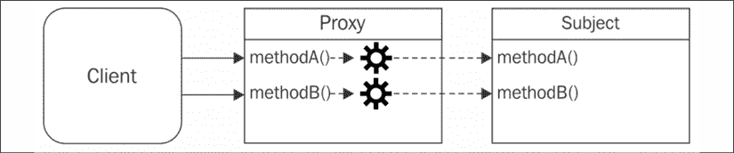
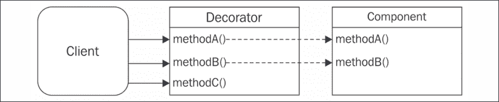
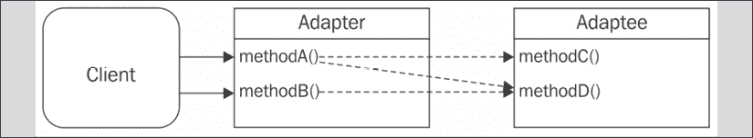

# 8

# 结构型设计模式

在本章中，我们将探讨一些最流行的结构型设计模式，并了解它们如何应用于 Node.js。结构型设计模式专注于提供实现实体之间关系的方法。

尤其是在本章中，我们将检查以下模式：

+   **代理**：一种允许我们控制对另一个对象访问的设计模式

+   **装饰器**：一种常见的动态增强现有对象行为的设计模式

+   **适配器**：一种允许我们通过不同的接口访问对象功能的设计模式

在本章中，我们还将探讨一些有趣的概念，例如**响应式编程**（**RP**），并且我们还将花一些时间与 LevelDB 进行互动，这是一种在 Node.js 生态系统中普遍采用的数据库技术。

到本章结束时，你将熟悉几个结构型设计模式可能很有用的场景，并且你将能够有效地在 Node.js 应用程序中实现它们。

# 代理

**代理**是一个控制对另一个对象（称为**主题**）访问的对象。代理和主题具有相同的接口，这使得我们可以透明地互换它们；实际上，这种模式的另一个名称是**代表**。

代理拦截了要执行在主题上的所有或部分操作，增强或补充了它们的行为。*图 8.1* 展示了该模式的示意图：



图 8.1：代理模式示意图

*图 8.1* 展示了代理和主题具有相同的接口，以及这对于客户端来说是透明的，客户端可以使用其中一个或另一个进行互换。代理将每个操作转发给主题，通过额外的预处理或后处理增强其行为。

重要的是要注意，我们这里讨论的不是类之间的代理；代理模式涉及包装主题的实际实例，从而保留其内部状态。

在某些情况下，代理可能很有用，例如：

+   **数据验证**：代理在将数据转发给主题之前对其进行验证

+   **安全**：代理验证客户端是否有权执行操作，并且只有在检查结果为正时才将请求传递给主题

+   **缓存**：代理保留一个内部缓存，以便只有在数据尚未存在于缓存中时，才在主题上执行代理操作

+   **延迟初始化**：如果创建主题对象成本较高，代理可以延迟其创建，直到真正需要时

+   **日志记录**：代理拦截方法调用及其相关参数，并按发生时的顺序记录它们

+   **远程对象**：代理可以将远程对象转换为本地对象

还有更多代理模式的应用，但这些应该能让我们了解其目的。

## 实现代理的技术

当代理一个对象时，我们可以决定拦截它的所有方法或只拦截其中的一些，而将其他方法直接委托给主题。这可以通过几种方式实现，在本节中，我们将介绍其中的一些。

我们将使用一个简单的示例，一个看起来像这样的`StackCalculator`类：

```js
class StackCalculator {
  constructor () {
    this.stack = []
  }
  putValue (value) {
    this.stack.push(value)
  }
  getValue () {
    return this.stack.pop()
  }
  peekValue () {
    return this.stack[this.stack.length - 1]
  }
  clear () {
    this.stack = []
  }
  divide () {
    const divisor = this.getValue()
    const dividend = this.getValue()
    const result = dividend / divisor
    this.putValue(result)
    return result
  }
  multiply () {
    const multiplicand = this.getValue()
    const multiplier = this.getValue()
    const result = multiplier * multiplicand
    this.putValue(result)
    return result
  }
} 
```

此类实现了一个简化版的堆栈计算器。这个计算器的想法是将所有操作数（值）都保存在堆栈中。当你执行一个操作，例如乘法，乘数和被乘数将被从堆栈中提取出来，乘法的结果将被推回堆栈。这与你的手机上实际实现的计算器应用的方式并没有太大的不同。

下面是一个示例，说明我们如何使用`StackCalculator`执行一些乘法和除法操作：

```js
const calculator = new StackCalculator()
calculator.putValue(3)
calculator.putValue(2)
console.log(calculator.multiply()) // 3*2 = 6
calculator.putValue(2)
console.log(calculator.multiply()) // 6*2 = 12 
```

还有一些实用方法，例如`peekValue()`，它允许我们查看堆栈顶部的值（最后插入的值或最后操作的运算结果），以及`clear()`，它允许我们重置堆栈。

有趣的事实：在 JavaScript 中，当你执行除以零的操作时，你会得到一个神秘的值，称为`Infinity`。在许多其他编程语言中，除以零是一个非法操作，会导致程序恐慌或抛出运行时异常。

在接下来的几节中，我们的任务将利用代理模式通过提供对除以零的更保守行为来增强`StackCalculator`实例：而不是返回`Infinity`，我们将抛出一个显式的错误。

### 对象组合

组合是一种技术，通过将一个对象与另一个对象组合，以扩展或使用其功能。在代理模式的具体情况下，创建了一个与主题具有相同接口的新对象，并在代理内部以实例变量或闭包变量的形式存储主题的引用。主题可以在创建时从客户端注入，或者由代理本身创建。

以下示例实现了一个使用对象组合的安全计算器：

```js
class SafeCalculator {
  constructor (calculator) {
    this.calculator = calculator
  }
  // proxied method
  divide () {
    // additional validation logic
    const divisor = this.calculator.peekValue()
    if (divisor === 0) {
      throw Error('Division by 0')
    }
    // if valid delegates to the subject
    return this.calculator.divide()
  }
  // delegated methods
  putValue (value) {
    return this.calculator.putValue(value)
  }
  getValue () {
    return this.calculator.getValue()
  }
  peekValue () {
    return this.calculator.peekValue()
  }
  clear () {
    return this.calculator.clear()
  }
  multiply () {
    return this.calculator.multiply()
  }
}
const calculator = new StackCalculator()
const safeCalculator = new SafeCalculator(calculator)
calculator.putValue(3)
calculator.putValue(2)
console.log(calculator.multiply())     // 3*2 = 6
safeCalculator.putValue(2)
console.log(safeCalculator.multiply()) // 6*2 = 12
calculator.putValue(0)
console.log(calculator.divide())       // 12/0 = Infinity
safeCalculator.clear()
safeCalculator.putValue(4)
safeCalculator.putValue(0)
console.log(safeCalculator.divide())   // 4/0 -> Error 
```

`safeCalculator`对象是原始`calculator`实例的代理。通过在`safeCalculator`上调用`multiply()`，我们最终会在`calculator`上调用相同的方法。对于`divide()`也是如此，但在这个情况下，我们可以看到，如果我们尝试除以零，根据我们在主题或代理上执行除法，我们将会得到不同的结果。

为了使用组合实现这个代理，我们必须拦截我们感兴趣要操作的方法（`divide()`），而将其他方法简单地委托给主题（`putValue()`、`getValue()`、`peekValue()`、`clear()`和`multiply()`）。

注意，计算器状态（栈中的值）仍然由 `calculator` 实例维护；`safeCalculator` 将只调用 `calculator` 上的方法来读取或按需突变状态。

在前面的代码片段中展示的代理的另一种实现可能只是使用一个对象字面量和工厂函数：

```js
function createSafeCalculator (calculator) {
  return {
    // proxied method
    divide () {
      // additional validation logic
      const divisor = calculator.peekValue()
      if (divisor === 0) {
        throw Error('Division by 0')
      }
      // if valid delegates to the subject
      return calculator.divide()
    },
    // delegated methods
    putValue (value) {
      return calculator.putValue(value)
    },
    getValue () {
      return calculator.getValue()
    },
    peekValue () {
      return calculator.peekValue()
    },
    clear () {
      return calculator.clear()
    },
    multiply () {
      return calculator.multiply()
    }
  }
}
const calculator = new StackCalculator()
const safeCalculator = createSafeCalculator(calculator)
   // ... 
```

这种实现比基于类的实现更简单、更简洁，但，再次强调，它迫使我们显式地将所有方法委托给主题。

对于复杂的类，需要委托许多方法可能会非常繁琐，并可能使实现这些技术变得更难。创建一个委托大多数方法的代理的一种方法是通过使用为我们生成所有方法的库，例如 `delegates` ([nodejsdp.link/delegates](http://nodejsdp.link/delegates))。一个更现代、更原生的方法是使用 `Proxy` 对象，我们将在本章后面讨论。

### 对象增强

**对象增强**（或**猴子补丁**）可能是代理对象仅几个方法的简单且最常见的方式。它涉及通过替换方法及其代理实现来直接修改主题。

在我们的计算器示例的上下文中，可以这样操作：

```js
function patchToSafeCalculator (calculator) {
  const divideOrig = calculator.divide
  calculator.divide = () => {
    // additional validation logic
    const divisor = calculator.peekValue()
    if (divisor === 0) {
      throw Error('Division by 0')
    }
    // if valid delegates to the subject
    return divideOrig.apply(calculator)
  }
  return calculator
}
const calculator = new StackCalculator()
const safeCalculator = patchToSafeCalculator(calculator)
// ... 
```

当我们只需要代理一个或几个方法时，这种技术肯定很方便。你注意到我们没有在这里重新实现 `multiply()` 方法和其他所有委托方法了吗？

不幸的是，简单是以直接突变 `subject` 对象为代价的，这可能是危险的。

当主题与其他代码库的部分共享时，应尽量避免所有突变。实际上，“猴子补丁”主题可能会产生不希望看到的副作用，影响我们应用程序的其他组件。仅在主题存在于受控上下文或私有作用域中时使用此技术。如果你想了解为什么“猴子补丁”是一种危险的做法，你可以尝试在原始的 `calculator` 实例中调用除以零。如果你这样做，你会看到原始实例现在会抛出一个错误，而不是返回 `Infinity`。原始行为已被改变，这可能会对应用程序的其他部分产生意外的影响。

在下一节中，我们将探讨内置的 `Proxy` 对象，它是实现代理模式及其他功能的强大替代方案。

### 内置的代理对象

ES2015 规范引入了一种创建强大代理对象的原生方法。

我们在谈论的是 ES2015 的 `Proxy` 对象，它由一个接受 `target` 和 `handler` 作为参数的 `Proxy` 构造函数组成：

```js
const proxy = new Proxy(target, handler) 
```

在这里，`target` 代表代理应用到的对象（我们规范定义中的**主题**），而 `handler` 是一个特殊对象，它定义了代理的行为。

`handler` 对象包含一系列具有预定义名称的可选方法，称为 **trap 方法**（例如，`apply`、`get`、`set` 和 `has`），当在代理实例上执行相应的操作时，这些方法会自动被调用。

为了更好地理解这个 API 的工作原理，让我们看看如何使用 `Proxy` 对象来实现我们的安全计算器代理：

```js
const safeCalculatorHandler = {
  get: (target, property) => {
    if (property === 'divide') {
      // proxied method
      return function () {
        // additional validation logic
        const divisor = target.peekValue()
        if (divisor === 0) {
          throw Error('Division by 0')
        }
        // if valid delegates to the subject
        return target.divide()
      }
    }
    // delegated methods and properties
    return target[property]
  }
}
const calculator = new StackCalculator()
const safeCalculator = new Proxy(
  calculator,
  safeCalculatorHandler
)
// ... 
```

在使用 `Proxy` 对象实现安全计算器代理的这个实现中，我们采用了 `get` trap 来拦截对原始对象属性和方法（包括对 `divide()` 方法的调用）的访问。当拦截到对 `divide()` 的访问时，代理返回一个修改后的函数版本，该版本实现了检查可能除以零的额外逻辑。请注意，我们可以通过使用 `target[property]` 简单地返回所有其他方法和不改变属性。

最后，重要的是要提到 `Proxy` 对象继承了主题的原型，因此运行 `safeCalculator instanceof StackCalculator` 将返回 `true`。

通过这个例子，应该很清楚 `Proxy` 对象允许我们在不修改主题的情况下，以简单的方式代理我们需要的部分，而不必明确地委派所有其他属性和方法。

#### `Proxy` 对象的附加功能和限制

`Proxy` 对象是 JavaScript 语言本身深度集成的一个特性，它使开发者能够拦截和自定义可以在对象上执行的多项操作。这一特性开辟了以前难以实现的新颖有趣的场景，例如 *元编程*、*操作符重载* 和 *对象虚拟化*。

让我们再看一个例子来澄清这个概念：

```js
const evenNumbers = new Proxy([], {
  get: (target, index) => index * 2,
  has: (target, number) => number % 2 === 0
})
console.log(2 in evenNumbers) // true
console.log(5 in evenNumbers) // false
console.log(evenNumbers[7])   // 14 
```

在这个例子中，我们创建了一个包含所有偶数的虚拟数组。它可以作为一个常规数组使用，这意味着我们可以使用常规数组语法（例如，`evenNumbers[7]`）访问数组中的项目，或者使用 `in` 操作符（例如，`2 in evenNumbers`）检查数组中是否存在元素。这个数组被认为是 *虚拟的*，因为我们从未在其中存储数据。

```js
Proxy object, it is not implementing the Proxy pattern. This example allows us to see that, even though the Proxy object is commonly used to implement the Proxy pattern (hence the name), it can also be used to implement other patterns and use cases. As an example, we will see later in this chapter how to use the Proxy object—to implement the Decorator pattern.
```

看一下实现，这个代理使用一个空数组作为目标，然后在处理器中定义了 `get` 和 `has` traps：

+   `get` trap 拦截对数组元素的访问，返回给定索引的偶数

+   相反，`has` trap 拦截 `in` 操作符的使用，并检查给定的数字是否为偶数

`Proxy` 对象支持其他几个有趣的 traps，如 `set`、`delete` 和 `construct`，并允许我们创建可以在需要时撤销的代理，禁用所有 traps 并恢复 `target` 对象的原始行为。

分析所有这些功能超出了本章的范围；这里重要的是理解 `Proxy` 对象为实施代理设计模式提供了一个强大的基础。

如果你好奇想了解 `Proxy` 对象提供的所有功能和陷阱方法，你可以在相关的 MDN 文章中了解更多信息，链接为 [nodejsdp.link/mdn-proxy](http://nodejsdp.link/mdn-proxy)。另一个好的来源是 Google 的这篇详细文章，链接为 [nodejsdp.link/intro-proxy](http://nodejsdp.link/intro-proxy)。

虽然 `Proxy` 对象是 JavaScript 语言的强大功能，但它存在一个非常重要的限制：`Proxy` 对象不能完全 *transpiled* 或 *polyfilled*。这是因为 `Proxy` 对象的一些陷阱只能在运行时级别实现，不能简单地用纯 JavaScript 重新编写。如果你在使用不支持 `Proxy` 对象的老旧浏览器或老旧版本的 Node.js，这一点需要特别注意。

**Transpilation**：即 *transcompilation* 的简称。它表示通过将源代码从一种源编程语言翻译成另一种编程语言来编译源代码的行为。在 JavaScript 的情况下，这种技术用于将使用语言新功能的程序转换为可以在不支持这些新功能的较老运行时上运行的等效程序。

**Polyfill**：提供标准 API 实现的代码，可以在没有该 API 的环境中（通常为老旧浏览器或运行时）导入。`core-js` ([nodejsdp.link/corejs](http://nodejsdp.link/corejs)) 是 JavaScript 最完整的 polyfill 库之一。

### 不同代理技术的比较

组合可以被认为是一种简单且 *安全* 的创建代理的方式，因为它在不改变原始行为的情况下保留了主题。它的唯一缺点是我们必须手动委托所有方法，即使我们只想代理其中之一。此外，我们可能还需要委托对主题属性的访问。

可以使用 `Object.defineProperty()` 来委托对象属性。更多信息请参阅 [nodejsdp.link/define-prop](http://nodejsdp.link/define-prop)。

另一方面，对象增强会修改主题，这不一定总是理想的，但它不遭受与委托相关的各种不便。因此，在这两种方法之间，当修改主题是可选项时，对象增强通常是在所有这些情况下首选的技术。

然而，至少有一种情况下组合几乎是必要的；这就是当我们想要控制主题的初始化时，例如，只在需要时创建它（*延迟初始化*）。

最后，如果你需要拦截函数调用或对对象属性有不同类型的访问，即使是动态的，`Proxy`对象是首选方法。`Proxy`对象提供了一种高级的访问控制，这是其他技术所无法提供的。例如，`Proxy`对象允许我们拦截对象中键的删除，并执行属性存在检查。

再次强调，`Proxy`对象不会修改主题，因此可以在主题在应用程序的不同组件之间共享的上下文中安全使用。我们还看到，使用`Proxy`对象，我们可以轻松地执行所有我们想要保持不变的属性和方法的重定向。

在下一节中，我们将展示一个更现实的示例，利用代理模式，并使用它来比较我们迄今为止讨论的不同技术，以实现此模式。

## 创建日志可写流

为了看到代理模式在实际示例中的应用，我们现在将构建一个作为可写流代理的对象，它拦截所有对`write()`方法的调用，并在每次发生这种情况时记录一条消息。我们将使用`Proxy`对象来实现我们的代理。让我们将我们的代码写入一个名为`logging-writable.js`的文件中：

```js
export function createLoggingWritable (writable) {
  return new Proxy(writable, {                             // (1)
    get (target, propKey, receiver) {                      // (2)
      if (propKey === 'write') {                           // (3)
        return function (...args) {                        // (4)
          const [chunk] = args
          console.log('Writing', chunk)
          return writable.write(...args)
        }
      }
      return target[propKey]                               // (5)
    }
  })
} 
```

在前面的代码中，我们创建了一个工厂，它返回作为参数传递的`writable`对象的代理版本。让我们看看实现的主要要点：

1.  我们使用 ES2015 的`Proxy`构造函数创建并返回原始`writable`对象的代理。

1.  我们使用`get`陷阱来拦截对对象属性的访问。

1.  我们检查访问的属性是否是`write`方法。如果是这样，我们返回一个函数来代理原始行为。

1.  这里代理实现逻辑很简单：我们从传递给原始函数的参数列表中提取当前的`chunk`，记录块的内容，最后，我们使用给定的参数列表调用原始方法。

1.  我们返回任何其他未更改的属性。

我们现在可以使用这个新创建的函数并测试我们的代理实现：

```js
import { createWriteStream } from 'fs'
import { createLoggingWritable } from './logging-writable.js'
const writable = createWriteStream('test.txt')
const writableProxy = createLoggingWritable(writable)
writableProxy.write('First chunk')
writableProxy.write('Second chunk')
writable.write('This is not logged')
writableProxy.end() 
```

代理没有改变流的原生接口或其外部行为，但如果我们运行前面的代码，现在我们会看到写入`writableProxy`流中的每个数据块都会透明地记录到控制台。

## 使用代理的变更观察者

**变更观察者模式**是一种设计模式，其中对象（主题）通知一个或多个观察者任何状态变化，以便它们可以“反应”变化的发生。

虽然非常相似，但变更观察者模式不应与第三章中讨论的观察者模式混淆，即*回调和事件*。变更观察者模式专注于允许检测属性变化，而观察者模式是一个更通用的模式，它采用事件发射器来传播关于系统中发生的事件的信息。

代理证明是创建可观察对象的有效工具。让我们看看`create-observable.js`中可能的实现：

```js
export function createObservable (target, observer) {
  const observable = new Proxy(target, {
    set (obj, prop, value) {
      if (value !== obj[prop]) {
        const prev = obj[prop]
        obj[prop] = value
        observer({ prop, prev, curr: value })
      }
      return true
    }
  })
  return observable
} 
```

在前面的代码中，`createObservable()`接受一个`target`对象（要观察其变化的对象）和一个`observer`（每次检测到变化时调用的函数）。

在这里，我们通过 ES2015 Proxy 创建`observable`实例。代理实现了`set`陷阱，每次设置属性时都会触发。实现比较当前值与新值，如果它们不同，目标对象将被修改，并且观察者会收到通知。当观察者被调用时，我们传递一个包含与变化相关的信息的对象字面量（属性的名称、旧值和当前值）。

这是对变更观察者模式的一个简化实现。更高级的实现支持多个观察者，并使用更多的陷阱来捕获其他类型的突变，例如字段删除或原型更改。此外，我们的实现不会递归地创建嵌套对象或数组的代理——更高级的实现也会处理这些情况。

现在我们来看看如何利用可观察对象，在一个简单的发票应用程序中，发票总金额会根据观察到的发票各个字段的变化自动更新：

```js
import { createObservable } from './create-observable.js'
function calculateTotal (invoice) {                          // (1)
  return invoice.subtotal -
    invoice.discount +
    invoice.tax
}
const invoice = {
  subtotal: 100,
  discount: 10,
  tax: 20
}
let total = calculateTotal(invoice)
console.log(`Starting total: ${total}`)
const obsInvoice = createObservable(                         // (2)
  invoice,
  ({ prop, prev, curr }) => {
    total = calculateTotal(invoice)
    console.log(`TOTAL: ${total} (${prop} changed: ${prev} -> ${curr})`)
  }
)
                                                             // (3)
obsInvoice.subtotal = 200 // TOTAL: 210
obsInvoice.discount = 20  // TOTAL: 200
obsInvoice.discount = 20  // no change: doesn't notify
obsInvoice.tax = 30       // TOTAL: 210
console.log(`Final total: ${total}`) 
```

在前面的示例中，发票由`subtotal`值、`discount`值和`tax`值组成。总金额可以从这三个值中计算得出。让我们更详细地讨论实现：

1.  我们声明一个函数来计算给定发票的总金额，然后我们创建一个`invoice`对象和一个用于存储其`total`值的变量。

1.  在这里，我们创建了一个`invoice`对象的观察者版本。每当原始发票对象发生变化时，我们都会重新计算总金额，并且也会打印一些日志以跟踪变化。

1.  最后，我们对可观察的发票应用一些更改。每次我们修改`obsInvoice`对象时，观察者函数都会被触发，总金额会更新，并且会在屏幕上打印一些日志。

如果我们运行这个示例，我们将在控制台看到以下输出：

```js
Starting total: 110
TOTAL: 210 (subtotal changed: 100 -> 200)
TOTAL: 200 (discount changed: 10 -> 20)
TOTAL: 210 (tax changed: 20 -> 30)
Final total: 210 
```

在这个例子中，我们可以使总计算逻辑变得任意复杂，例如，通过在计算中引入新的字段（运费、其他税费等）。在这种情况下，将新字段引入 `invoice` 对象并更新 `calculateTotal()` 函数将相当简单。一旦我们这样做，新属性的任何变化都将被观察，并且 `total` 将随着每个变化而保持更新。

可观察者是 **响应式编程**（**RP**）和 **函数式响应式编程**（**FRP**）的基石。如果你对这些编程风格感兴趣，可以查看 *响应式宣言*，在 [nodejsdp.link/reactive-manifesto](http://nodejsdp.link/reactive-manifesto)。

## 在野外

代理模式和更具体的变更观察者模式是广泛采用的模式，可以在后端项目和库以及前端世界中找到。一些利用这些模式的项目包括以下内容：

+   LoopBack ([nodejsdp.link/loopback](http://nodejsdp.link/loopback)) 是一个流行的 Node.js 网络框架，它使用代理模式提供拦截和增强控制器上方法调用的功能。这种功能可以用来构建自定义验证或认证机制。

+   Vue.js 3 版本（[nodejsdp.link/vue](http://nodejsdp.link/vue)），一个非常流行的 JavaScript 响应式 UI 框架，使用代理模式通过 `Proxy` 对象重新实现了可观察属性。

+   MobX ([nodejsdp.link/mobx](http://nodejsdp.link/mobx)) 是一个著名的响应式状态管理库，通常与 React 或 Vue.js 结合使用在前端应用程序中。与 Vue.js 类似，MobX 使用 `Proxy` 对象实现响应式可观察对象。

# 装饰器

装饰器是一种结构型设计模式，它通过动态地增强现有对象的行为来实现。与经典继承不同，因为行为不是添加到同一类的所有对象上，而是仅添加到显式装饰的实例上。

在实现上，它与代理模式非常相似，但不是增强或修改对象现有接口的行为，而是通过新的功能来增强它，如 *图 8.2* 所述：



图 8.2：装饰器模式示意图

在 *图 8.2* 中，`Decorator` 对象通过添加 `methodC()` 操作来扩展 `Component` 对象。现有的方法通常被委派给装饰对象，而不进行进一步处理，但在某些情况下，它们也可能被拦截并添加额外的行为。

## 实现装饰器的技术

虽然代理和装饰器在概念上是两种不同的模式，具有不同的意图，但它们实际上共享相同的实现策略。我们很快就会回顾它们。这次我们想使用装饰器模式，以便能够“装饰”我们的 `StackCalculator` 类的实例，使其也暴露一个新的方法 `add()`，我们可以使用它来执行两个数字之间的加法操作。我们还将使用装饰器来拦截对 `divide()` 方法的所有调用，并实现我们在 `SafeCalculator` 示例中已经看到的相同的除以零检查。

### 组合

使用组合，装饰的组件被包裹在一个新对象周围，这个新对象通常继承自它。在这种情况下，装饰器只需定义新方法，并将现有方法委托给原始组件：

```js
class EnhancedCalculator {
  constructor (calculator) {
    this.calculator = calculator
  }
  // new method
  add () {
    const addend2 = this.getValue()
    const addend1 = this.getValue()
    const result = addend1 + addend2
    this.putValue(result)
    return result
  }
  // modified method
  divide () {
    // additional validation logic
    const divisor = this.calculator.peekValue()
    if (divisor === 0) {
      throw Error('Division by 0')
    }
    // if valid delegates to the subject
    return this.calculator.divide()
  }
  // delegated methods
  putValue (value) {
    return this.calculator.putValue(value)
  }
  getValue () {
    return this.calculator.getValue()
  }
  peekValue () {
    return this.calculator.peekValue()
  }
  clear () {
    return this.calculator.clear()
  }
  multiply () {
    return this.calculator.multiply()
  }
}
const calculator = new StackCalculator()
const enhancedCalculator = new EnhancedCalculator(calculator)
enhancedCalculator.putValue(4)
enhancedCalculator.putValue(3)
console.log(enhancedCalculator.add())      // 4+3 = 7
enhancedCalculator.putValue(2)
console.log(enhancedCalculator.multiply()) // 7*2 = 14 
```

如果你记得我们为代理模式实现的组合实现，你可能看到这里的代码看起来相当相似。

我们创建了新的 `add()` 方法，并增强了原始的 `divide()` 方法的功能（有效地复制了我们在之前的 `SafeCalculator` 示例中看到的特性）。最后，我们将 `putValue()`、`getValue()`、`peekValue()`、`clear()` 和 `multiply()` 方法委托给原始主题。

### 对象增强

**对象装饰**也可以通过直接将新方法附加到装饰对象（猴子补丁）来实现，如下所示：

```js
function patchCalculator (calculator) {
  // new method
  calculator.add = function () {
    const addend2 = calculator.getValue()
    const addend1 = calculator.getValue()
    const result = addend1 + addend2
    calculator.putValue(result)
    return result
  }
  // modified method
  const divideOrig = calculator.divide
  calculator.divide = () => {
    // additional validation logic
    const divisor = calculator.peekValue()
    if (divisor === 0) {
      throw Error('Division by 0')
    }
    // if valid delegates to the subject
    return divideOrig.apply(calculator)
  }
  return calculator
}
const calculator = new StackCalculator()
const enhancedCalculator = patchCalculator(calculator)
// ... 
```

注意，在这个例子中，`calculator` 和 `enhancedCalculator` 引用同一个对象（`calculator == enhancedCalculator`）。这是因为 `patchCalculator()` 正在修改原始的 `calculator` 对象，然后返回它。你可以通过调用 `calculator.add()` 或 `calculator.divide()` 来确认这一点。

### 使用代理对象进行装饰

可以通过使用 `Proxy` 对象来实现对象装饰。一个通用的例子可能如下所示：

```js
const enhancedCalculatorHandler = {
  get (target, property) {
    if (property === 'add') {
      // new method
      return function add () {
        const addend2 = target.getValue()
        const addend1 = target.getValue()
        const result = addend1 + addend2
        target.putValue(result)
        return result
      }
    } else if (property === 'divide') {
      // modified method
      return function () {
        // additional validation logic
        const divisor = target.peekValue()
        if (divisor === 0) {
          throw Error('Division by 0')
        }
        // if valid delegates to the subject
        return target.divide()
      }
    }
    // delegated methods and properties
    return target[property]
  }
}
const calculator = new StackCalculator()
const enhancedCalculator = new Proxy(
  calculator,
  enhancedCalculatorHandler
)
// ... 
```

如果我们要比较这些不同的实现，分析代理模式时讨论的相同注意事项也适用于装饰器。让我们专注于通过一个现实生活中的例子来练习这个模式！

## 装饰 LevelUP 数据库

在我们开始编写下一个示例之前，让我们简单地说几句关于 **LevelUP**，我们现在将要与之工作的模块。

### 介绍 LevelUP 和 LevelDB

**LevelUP** ([nodejsdp.link/levelup](http://nodejsdp.link/levelup)) 是围绕 Google 的 **LevelDB** 的 Node.js 包装器，LevelDB 是最初为在 Chrome 浏览器中实现 IndexedDB 而构建的键值存储，但它远不止于此。由于它的极简主义和可扩展性，LevelDB 被定义为“Node.js 的数据库”。像 Node.js 一样，LevelDB 提供了极快的性能和最基本的功能集，允许开发者在其之上构建任何类型的数据库。

Node.js 社区，在这个例子中是 Rod Vagg，没有错过将这个数据库的力量带入 Node.js 世界的机会，创建了 LevelUP。它最初作为 LevelDB 的包装器，后来发展到支持多种后端，从内存存储到其他 NoSQL 数据库，如 Riak 和 Redis，再到 Web 存储引擎，如 IndexedDB 和 localStorage，允许我们在服务器和客户端上使用相同的 API，开辟了一些非常有趣的场景。

今天，围绕 LevelUP 有一个庞大的生态系统，由插件和模块组成，它们扩展了核心以实现复制、二级索引、实时更新、查询引擎等功能。在 LevelUP 之上还构建了完整的数据库，包括 CouchDB 克隆 PouchDB（[nodejsdp.link/pouchdb](http://nodejsdp.link/pouchdb)），甚至一个图数据库 LevelGraph（[nodejsdp.link/levelgraph](http://nodejsdp.link/levelgraph)），它可以在 Node.js 和浏览器上运行！

在[nodejsdp.link/awesome-level](http://nodejsdp.link/awesome-level)了解更多关于 LevelUP 生态系统的信息。

### 实现 LevelUP 插件

在下一个示例中，我们将向您展示如何使用装饰器模式创建一个简单的 LevelUP 插件，特别是对象增强技术，这是最简单但也是最实用和有效的方法来为对象添加额外功能。

为了方便起见，我们将使用`level`包（[nodejsdp.link/level](http://nodejsdp.link/level)），它捆绑了`levelup`和默认适配器`leveldown`，后者使用 LevelDB 作为后端。

我们想要构建的是一个 LevelUP 插件，允许我们在某个模式的对象被保存到数据库时接收通知。例如，如果我们订阅了一个模式如`{a: 1}`，我们希望在对象如`{a: 1, b: 3}`或`{a: 1, c: 'x'}`被保存到数据库时收到通知。

让我们从创建一个名为`level-subscribe.js`的新模块开始构建我们的小型插件。然后我们将插入以下代码：

```js
export function levelSubscribe (db) {
  db.subscribe = (pattern, listener) => {                // (1)
    db.on('put', (key, val) => {                         // (2)
      const match = Object.keys(pattern).every(
        k => (pattern[k] === val[k])                     // (3)
      )
      if (match) {
        listener(key, val)                               // (4)
      }
    })
  }
  return db
} 
```

这就是我们的插件的全部内容；它极其简单。让我们简要分析一下前面的代码：

1.  我们使用一个名为`subscribe()`的新方法来装饰`db`对象。我们直接将方法附加到提供的`db`实例上（对象增强）。

1.  我们监听数据库上执行的任何`put`操作。

1.  我们执行一个非常简单的模式匹配算法，该算法验证提供的模式中的所有属性也存在于正在插入的数据中。

1.  如果有匹配项，我们通知监听器。

现在我们编写一些代码来测试我们的新插件：

```js
import { dirname, join } from 'path'
import { fileURLToPath } from 'url'
import level from 'level'
import { levelSubscribe } from './level-subscribe.js'
const __dirname = dirname(fileURLToPath(import.meta.url))
const dbPath = join(__dirname, 'db')
const db = level(dbPath, { valueEncoding: 'json' })      // (1)
levelSubscribe(db)                                       // (2)
db.subscribe(                                            // (3)
  { doctype: 'tweet', language: 'en' },
  (k, val) => console.log(val)
)
db.put('1', {                                            // (4)
  doctype: 'tweet',
  text: 'Hi',
  language: 'en'
})
db.put('2', {
  doctype: 'company',
  name: 'ACME Co.'
}) 
```

这就是前面代码的工作原理：

1.  首先，我们初始化我们的 LevelUP 数据库，选择存储文件的目录和值的默认编码。

1.  然后，我们附加我们的插件，它装饰了原始的`db`对象。

1.  到目前为止，我们已经准备好使用我们插件提供的新功能，即`subscribe()`方法，我们指定我们感兴趣的具有`doctype: 'tweet'`和`language: 'en'`的所有对象。

1.  最后，我们使用`put`在数据库中保存一些值。第一次调用触发了与我们的订阅相关联的回调，我们应该看到存储的对象打印到控制台。这是因为在这种情况下，对象与订阅相匹配。第二次调用不会生成任何输出，因为存储的对象不符合订阅标准。

这个例子展示了装饰器模式在其最简单实现中的实际应用，即对象增强。它可能看起来像是一个微不足道的模式，但如果使用得当，它无疑具有强大的功能。

为了简单起见，我们的插件仅与`put`操作结合使用，但它可以很容易地扩展到与`batch`操作一起工作 ([nodejsdp.link/levelup-batch](http://nodejsdp.link/levelup-batch))。

## 在野外

要了解装饰器在实际世界中的更多用法示例，您可以检查一些 LevelUP 插件的代码：

+   `level-inverted-index` ([nodejsdp.link/level-inverted-index](http://nodejsdp.link/level-inverted-index)): 这是一个插件，它向 LevelUP 数据库添加倒排索引，使我们能够在数据库存储的值中执行简单的文本搜索

+   `levelplus` ([nodejsdp.link/levelplus](http://nodejsdp.link/levelplus)): 这是一个向 LevelUP 数据库添加原子更新的插件

除了 LevelUP 插件外，以下项目也是采用装饰器模式的好例子：

+   `json-socket` ([nodejsdp.link/json-socket](http://nodejsdp.link/json-socket)): 这个模块使得通过 TCP（或 Unix）套接字发送 JSON 数据变得更加容易。它被设计用来装饰现有的`net.Socket`实例，该实例通过添加额外的方法和行为而得到增强。

+   `fastify` ([nodejsdp.link/fastify](http://nodejsdp.link/fastify)) 是一个暴露 API 以装饰 Fastify 服务器实例并添加额外功能或配置的 Web 应用程序框架。使用这种方法，额外的功能可以提供给应用程序的不同部分。这是一个相当通用的装饰器模式实现。要了解更多信息，请查看专门的文档页面 [nodejsdp.link/fastify-decorators](http://nodejsdp.link/fastify-decorators)。

# 代理和装饰器之间的界限

在本书的这一部分，您可能对代理模式和装饰器模式之间的区别有一些合理的疑问。这两个模式确实非常相似，有时可以互换使用。

在其经典形态中，装饰器模式被定义为一种机制，允许我们通过添加新行为来增强现有对象，而代理模式用于控制对具体或虚拟对象的访问。

这两个模式之间有一个概念上的区别，这主要基于它们在运行时的使用方式。

你可以将装饰器模式看作是一个包装器；你可以取不同类型的对象，并决定用装饰器来包装它们，以增加额外的功能。相反，代理用于控制对对象的访问，并且它不会改变原始接口。因此，一旦你创建了一个代理实例，你就可以将其传递给期望原始对象的环境。

当涉及到实现时，这些差异在强类型语言中通常更为明显，在这些语言中，你传递的对象类型会在编译时进行检查。在 Node.js 生态系统中，由于 JavaScript 语言的动态性，代理模式和装饰器模式之间的界限相当模糊，并且这两个名称经常被互换使用。我们也看到了相同的技巧可以用来实现这两种模式。

当处理 JavaScript 和 Node.js 时，我们的建议是避免陷入这两个模式的命名和规范定义的泥潭。我们鼓励你从整体上看待代理和装饰器解决的问题类别，并将这两个模式视为互补的，有时可以互换的工具。

# 适配器

适配器模式允许我们使用不同的接口访问对象的功能。

适配器的真实生活例子是一个允许你将 USB Type-A 电缆插入 USB Type-C 端口的设备。在通用意义上，适配器将具有给定接口的对象转换，以便它可以在期望不同接口的环境中使用。

在软件中，适配器模式用于将对象的接口（**适配者**）与客户端期望的另一个接口兼容。让我们看看*图 8.3*来澄清这个概念：



图 8.3：适配器模式示意图

在*图 8.3*中，我们可以看到适配器本质上是对适配者的包装，暴露了不同的接口。该图还突出了适配器的操作也可以是适配者一个或多个方法调用的组合。从实现的角度来看，最常见的技术是组合，其中适配器的方 法提供了一个连接到适配者方法的桥梁。这种模式相当直接，所以让我们立即开始一个示例。

## 通过文件系统 API 使用 LevelUP

现在，我们将围绕 LevelUP API 构建一个适配器，将其转换为一个与核心 `fs` 模块兼容的接口。特别是，我们将确保每个对 `readFile()` 和 `writeFile()` 的调用都会转换为对 `db.get()` 和 `db.put()` 的调用。这样我们就能将 LevelUP 数据库用作简单文件系统操作的存储后端。

让我们先创建一个名为 `fs-adapter.js` 的新模块。我们将从加载依赖项并导出 `createFsAdapter()` 工厂函数开始，我们将使用这个工厂函数来构建适配器：

```js
import { resolve } from 'path'
export function createFSAdapter (db) {
  return ({
    readFile (filename, options, callback) {
      // ...
    },
    writeFile (filename, contents, options, callback) {
      // ...
    }
  })
} 
```

接下来，我们将在工厂内部实现 `readFile()` 函数，并确保其接口与 `fs` 模块原始函数的接口兼容：

```js
 readFile (filename, options, callback) {
      if (typeof options === 'function') {
        callback = options
        options = {}
      } else if (typeof options === 'string') {
        options = { encoding: options }
      }
      db.get(resolve(filename), {                           // (1)
        valueEncoding: options.encoding
      },
      (err, value) => {
        if (err) {
          if (err.type === 'NotFoundError') {               // (2)
            err = new Error(`ENOENT, open "${filename}"`)
            err.code = 'ENOENT'
            err.errno = 34
            err.path = filename
          }
          return callback && callback(err)
        }
        callback && callback(null, value)                   // (3)
      })
    } 
```

在之前的代码中，我们必须做一些额外的工作来确保我们新函数的行为尽可能接近原始的 `fs.readFile()` 函数。该函数执行的步骤描述如下：

1.  要从 `db` 实例中检索文件，我们调用 `db.get()`，使用 `filename` 作为键，确保始终使用其完整路径（使用 `resolve()`）。我们将数据库使用的 `valueEncoding` 选项的值设置为等于任何作为输入接收到的 `encoding` 选项。

1.  如果在数据库中找不到键，我们将创建一个错误，错误代码为 `ENOENT`，这是原始 `fs` 模块用来指示文件缺失的代码。任何其他类型的错误都会直接转发到 `callback`（在本例的范围内，我们只适配最常见的错误条件）。

1.  如果键值对成功从数据库中检索出来，我们将使用 `callback` 将值返回给调用者。

我们创建的函数不想成为 `fs.readFile()` 函数的完美替代品，但它确实在大多数情况下完成了其工作。

为了完成我们的小适配器，现在让我们看看如何实现 `writeFile()` 函数：

```js
 writeFile (filename, contents, options, callback) {
      if (typeof options === 'function') {
        callback = options
        options = {}
      } else if (typeof options === 'string') {
        options = { encoding: options }
      }
      db.put(resolve(filename), contents, {
        valueEncoding: options.encoding
      }, callback)
    } 
```

如我们所见，在这种情况下我们也没有一个完美的包装器。我们忽略了某些选项，例如文件权限（`options.mode`），并且我们将从数据库接收到的任何错误原样转发。

我们的新适配器现在准备好了。如果我们现在编写一个小测试模块，我们可以尝试使用它：

```js
import fs from 'fs'
fs.writeFile('file.txt', 'Hello!', () => {
  fs.readFile('file.txt', { encoding: 'utf8' }, (err, res) => {
    if (err) {
      return console.error(err)
    }
    console.log(res)
  })
})
// try to read a missing file
fs.readFile('missing.txt', { encoding: 'utf8' }, (err, res) => {
  console.error(err)
}) 
```

之前的代码使用了原始的 `fs` API 来在文件系统中执行一些读写操作，并且应该在控制台打印出类似以下内容：

```js
Error: ENOENT, open "missing.txt"
Hello! 
```

现在，我们可以尝试用我们的适配器替换 `fs` 模块，如下所示：

```js
import { dirname, join } from 'path'
import { fileURLToPath } from 'url'
import level from 'level'
import { createFSAdapter } from './fs-adapter.js'
const __dirname = dirname(fileURLToPath(import.meta.url))
const db = level(join(__dirname, 'db'), {
  valueEncoding: 'binary'
})
const fs = createFSAdapter(db)
// ... 
```

再次运行我们的程序应该产生相同的输出，除了我们没有使用文件系统 API 直接读取或写入我们指定的文件部分。相反，使用我们的适配器执行的任何操作都将转换为在 LevelUP 数据库上执行的操作。

我们刚刚创建的适配器可能看起来很愚蠢；用数据库代替真实文件系统的目的是什么？然而，我们应该记住，LevelUP 本身就有适配器，使得数据库也能够在浏览器中运行。其中之一是`level-js` ([nodejsdp.link/level-js](http://nodejsdp.link/level-js))。现在我们的适配器就变得非常有意义了。我们可以使用类似的方法来允许利用`fs`模块的代码在 Node.js 和浏览器上运行。我们很快就会意识到，当涉及到与浏览器共享代码时，适配器是一个极其重要的模式，正如我们将在第十章“通用 Web 应用程序的 JavaScript”中更详细地看到的那样。

## 在野外

适配器模式在现实世界中有很多实例。我们在这里列出了一些最显著的例子供您探索和分析：

+   我们已经知道 LevelUP 能够与不同的存储后端一起运行，从默认的 LevelDB 到浏览器中的 IndexedDB。这是通过创建各种适配器来复制内部（私有）LevelUP API 来实现的。查看其中的一些示例，了解它们是如何在[nodejsdp.link/level-stores](http://nodejsdp.link/level-stores)中实现的。

+   JugglingDB 是一个多数据库 ORM，当然，它使用了多个适配器来使其与不同的数据库兼容。查看其中的一些示例，请访问[nodejsdp.link/jugglingdb-adapters](http://nodejsdp.link/jugglingdb-adapters)。

+   nanoSQL ([nodejsdp.link/nanosql](http://nodejsdp.link/nanosql))是一个现代的多模型数据库抽象库，它大量使用适配器模式来支持大量的数据库。

+   我们创建的示例的完美补充是`level-filesystem` ([nodejsdp.link/level-filesystem](http://nodejsdp.link/level-filesystem))，这是在 LevelUP 之上对`fs` API 的正确实现。

# 摘要

结构型设计模式无疑是软件工程中最广泛采用的设计模式之一，因此对它们有信心是非常重要的。在本章中，我们探讨了代理模式、装饰器模式和适配器模式，并讨论了在 Node.js 环境中实现这些模式的不同方法。

我们看到了代理模式如何成为一个非常有价值的工具来控制对现有对象的访问。在本章中，我们还提到了代理模式如何启用不同的编程范式，例如使用变更观察者模式进行响应式编程。

在本章的第二部分，我们发现装饰器模式是一个非常有价值的工具，可以用来向现有对象添加额外的功能。我们看到了它的实现与代理模式并没有太大的区别，并且我们探讨了围绕 LevelDB 生态系统构建的一些示例。

最后，我们讨论了适配器模式，它允许我们包装现有的对象，并通过不同的接口公开其功能。我们看到了这个模式可以用来向期望不同接口的组件公开现有功能。在我们的示例中，我们看到了如何使用这个模式来实现一个与 `fs` 模块提供的接口兼容的替代存储层。

代理、装饰器和适配器非常相似，它们之间的区别可以从接口消费者的角度来欣赏：代理提供与包装对象相同的接口，装饰器提供增强的接口，而适配器提供不同的接口。

在下一章中，我们将通过探索行为设计模式类别来完成我们在 Node.js 中的传统设计模式之旅。这个类别包括诸如策略模式、中间件模式和迭代器模式等重要模式。你准备好发现行为设计模式了吗？

# 练习

+   **8.1 HTTP 客户端缓存**: 为你最喜欢的 HTTP 客户端库编写一个代理，缓存给定 HTTP 请求的响应，这样如果你再次发出相同的请求，响应将立即从本地缓存返回，而不是从远程 URL 获取。如果你需要灵感，可以查看 `superagent-cache` 模块 ([nodejsdp.link/superagent-cache](http://nodejsdp.link/superagent-cache))。

+   **8.2 带时间戳的日志**: 为 `console` 对象创建一个代理，通过在日志中打印的消息前添加当前时间戳来增强每个日志功能（`log()`、`error()`、`debug()` 和 `info()`）。例如，执行 `consoleProxy.log('hello')` 应该在控制台打印出类似 `2020-02-18T15:59:30.699Z hello` 的内容。

+   **8.3 带颜色的控制台输出**: 为控制台编写一个装饰器，添加 `red(message)`、`yellow(message)` 和 `green(message)` 方法。这些方法的行为必须像 `console.log(message)` 一样，除了它们将分别以红色、黄色或绿色打印消息。在前一章的一个练习中，我们已经指向了一些有用的包来创建带颜色的控制台输出。如果你想尝试不同的方法，可以看看 `ansi-styles` ([nodejsdp.link/ansi-styles](http://nodejsdp.link/ansi-styles))。

+   **8.4 虚拟文件系统**: 修改我们的 LevelDB 文件系统适配器示例，将文件数据写入内存而不是 LevelDB。你可以使用一个对象或一个 `Map` 实例来存储文件名及其相关数据的键值对。

+   **8.5 懒缓冲区**: 你能否实现 `createLazyBuffer(size)`，一个生成给定大小 `Buffer` 的虚拟代理的工厂函数？代理实例应在第一次调用 `write()` 时才实例化 `Buffer` 对象（实际上分配给定数量的内存）。如果没有尝试向缓冲区写入，则不应创建 `Buffer` 实例。
