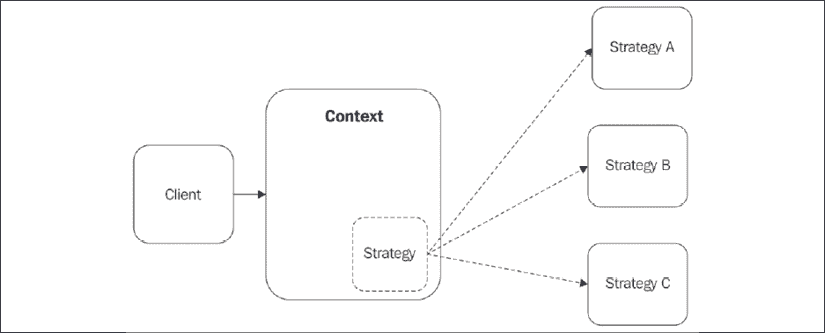
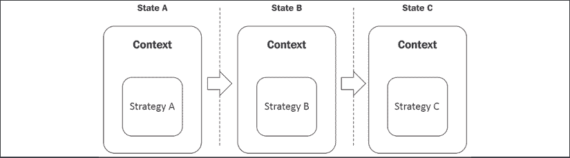
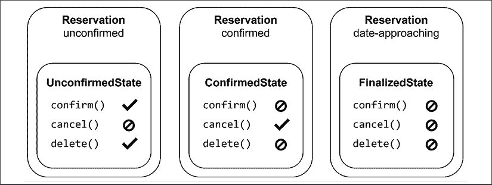
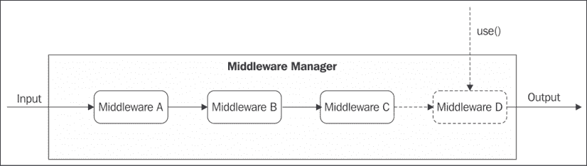
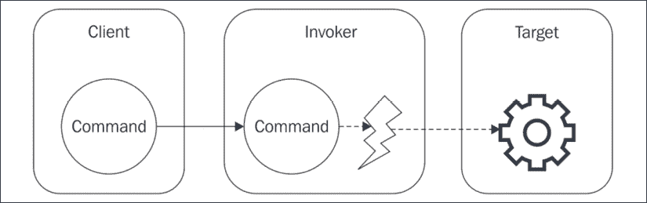

# 第九章：行为设计模式

在前两章中，我们学习了有助于我们创建对象和构建复杂对象结构的模式。现在，是时候转向软件设计的另一个方面了，这涉及到组件的行为。在本章中，我们将学习如何组合对象以及如何定义它们之间的通信方式，以便结果结构的行 为变得可扩展、模块化、可重用和可适应。诸如“如何在运行时更改算法的部分？”、“我如何根据对象的状态改变其行为？”以及“我如何在不知道其实施的情况下遍历一个集合？”等问题是本章中展示的模式所解决的典型问题。

你已经遇到了这个类别中一个显著的成员，那就是我们在*第三章*，*回调和事件*中介绍的观察者模式。观察者模式是 Node.js 平台的基础模式之一，因为它为我们提供了一个简单的接口来处理事件和订阅，这些是 Node 事件驱动架构的生命力。

如果你已经熟悉**四人帮**（**GoF**）设计模式，在本章中，你将再次见证这些模式在 JavaScript 中的实现与纯面向对象方法相比可能有多么根本的不同。这一论点的绝佳例子可以在你将在本章后面遇到的迭代器模式中找到。实际上，要实现迭代器模式，我们实际上不需要扩展任何类或构建任何复杂的层次结构。相反，我们只需要向一个类中添加一个特殊的方法。此外，本章中特别的一个模式，中间件，与另一个流行的 GoF 模式紧密相似，即责任链模式，但在 Node.js 中的实现已经变得如此标准化，以至于它可以被认为是一个独立的模式。

现在，是时候卷起袖子，动手实践一些行为设计模式了。在本章中，你将学习以下内容：

+   策略模式，它帮助我们改变组件的部分以适应特定的需求

+   状态模式，它允许我们根据组件的状态来改变其行为

+   模板模式，它允许我们重用组件的结构来定义新的组件

+   迭代器模式，它为我们提供了一个遍历集合的通用接口

+   中间件模式，它允许我们定义一个模块化的处理步骤链

+   命令模式，它实现了执行例程所需的信息，使得此类信息可以轻松地传输、存储和处理

# 策略

**策略模式**允许一个称为**上下文**的对象通过将*可变*部分提取到单独的可互换对象中（称为**策略**）来支持其逻辑的变化。上下文实现了一族算法的公共逻辑，而策略实现可变部分，允许上下文根据不同的因素（如输入值、系统配置或用户偏好）调整其行为。

策略通常是解决方案家族的一部分，并且它们都实现了上下文期望的相同接口。以下图示展示了我们刚刚描述的情况：



图 9.1：策略模式的一般结构

*图 9.1*展示了上下文对象如何将其结构中的不同策略插入其中，就像它们是机器的互换部件一样。想象一辆车；它的轮胎可以被认为是其适应不同道路条件的策略。我们可以安装冬季轮胎以适应雪地道路，因为它们有钉子，而我们可以选择安装高性能轮胎以适应长途行驶的公路。一方面，我们不想为了实现这一点而更换整个汽车，另一方面，我们也不想拥有一辆有八轮的汽车以便它能走每一条可能的道路。

我们很快就能理解这个模式是多么强大。它不仅有助于分离给定问题中的关注点，而且还使我们的解决方案具有更好的灵活性和适应同一问题的不同变体。

策略模式在所有那些需要支持组件行为变化且需要复杂条件逻辑（大量的`if...else`或`switch`语句）或混合同一家族的不同组件的情况下特别有用。想象一个名为`Order`的对象，它代表电子商务网站上的一次在线订单。该对象有一个名为`pay()`的方法，正如其名，它最终确定订单并将资金从用户转移到在线商店。

为了支持不同的支付系统，我们有几种选择：

+   在`pay()`方法中使用`if...else`语句根据选择的支付选项完成操作

+   将支付逻辑委托给一个实现特定支付网关逻辑的策略对象

在第一种解决方案中，我们的`Order`对象无法支持其他支付方式，除非修改其代码。此外，当支付选项的数量增加时，这可能会变得相当复杂。相反，使用策略模式使`Order`对象能够支持几乎无限的支付方式，同时将其范围限制在仅管理用户细节、购买项目和相对价格，并将完成支付的任务委托给另一个对象。

现在我们用一个简单、现实的例子来演示这个模式。

## 多格式配置对象

让我们考虑一个名为`Config`的对象，它包含一组由应用程序使用的配置参数，例如数据库 URL、服务器的监听端口等。`Config`对象应该能够提供一个简单的接口来访问这些参数，同时也应该提供一种使用持久存储（例如文件）导入和导出配置的方法。我们希望能够支持不同的格式来存储配置，例如 JSON、INI 或 YAML。

通过应用我们关于策略模式的所学，我们可以立即识别出`Config`对象的变量部分，这部分功能允许我们序列化和反序列化配置。这将由我们的策略来实现。

让我们创建一个新的模块，名为`config.js`，并定义我们配置管理器的*通用*部分：

```js
import { promises as fs } from 'fs'
import objectPath from 'object-path'
export class Config {
  constructor (formatStrategy) {                           // (1)
    this.data = {}
    this.formatStrategy = formatStrategy
  }
  get (configPath) {                                       // (2)
    return objectPath.get(this.data, configPath)
  }
  set (configPath, value) {                                // (2)
    return objectPath.set(this.data, configPath, value)
  }
  async load (filePath) {                                  // (3)
    console.log(`Deserializing from ${filePath}`)
    this.data = this.formatStrategy.deserialize(
      await fs.readFile(filePath, 'utf-8')
    )
  }
  async save (filePath) {                                  // (3)
    console.log(`Serializing to ${filePath}`)
    await fs.writeFile(filePath,
      this.formatStrategy.serialize(this.data))
  }
} 
```

这就是前面代码中发生的事情：

1.  在构造函数中，我们创建了一个名为`data`的实例变量来保存配置数据。然后我们还存储了`formatStrategy`，它代表我们将用于解析和序列化数据的组件。

1.  我们提供了两个方法，`set()`和`get()`，通过利用名为`object-path`的库（[nodejsdp.link/object-path](http://nodejsdp.link/object-path)）使用点路径表示法（例如，`property.subProperty`）来访问配置属性。

1.  `load()`和`save()`方法是我们分别委托给策略的数据反序列化和序列化的地方。这是根据在构造函数中传入的`formatStrategy`来改变`Config`类逻辑的地方。

如我们所见，这种非常简单且整洁的设计使得`Config`对象在加载和保存数据时能够无缝地支持不同的文件格式。最好的部分是，支持这些各种格式的逻辑并没有硬编码在任何地方，因此`Config`类可以在不进行任何修改的情况下适应几乎任何文件格式，只要提供了正确的策略。

为了展示这一特性，我们现在在名为`strategies.js`的文件中创建几个格式策略。让我们从一个用于解析和序列化数据的策略开始，该策略使用 INI 文件格式，这是一个广泛使用的配置格式（更多信息请参阅：[nodejsdp.link/ini-format](http://nodejsdp.link/ini-format))。

对于这个任务，我们将使用一个名为`ini`的 npm 包（[nodejsdp.link/ini](http://nodejsdp.link/ini))）：

```js
import ini from 'ini'
export const iniStrategy = {
  deserialize: data => ini.parse(data),
  serialize: data => ini.stringify(data)
} 
```

实际上并没有什么复杂的！我们的策略只是简单地实现了约定的接口，以便它能够被`Config`对象使用。

同样，我们接下来要创建的下一个策略允许我们支持 JSON 文件格式，这在 JavaScript 以及一般的 Web 开发生态系统中被广泛使用：

```js
export const jsonStrategy = {
  deserialize: data => JSON.parse(data),
  serialize: data => JSON.stringify(data, null, '  ')
} 
```

现在，为了展示一切是如何结合在一起的，让我们创建一个名为`index.js`的文件，并尝试使用不同的格式加载和保存一个示例配置：

```js
import { Config } from './config.js'
import { jsonStrategy, iniStrategy } from './strategies.js'
async function main () {
  const iniConfig = new Config(iniStrategy)
  await iniConfig.load('samples/conf.ini')
  iniConfig.set('book.nodejs', 'design patterns')
  await iniConfig.save('samples/conf_mod.ini')
  const jsonConfig = new Config(jsonStrategy)
  await jsonConfig.load('samples/conf.json')
  jsonConfig.set('book.nodejs', 'design patterns')
  await jsonConfig.save('samples/conf_mod.json')
}
main() 
```

我们的测试模块揭示了策略模式的核心属性。我们只定义了一个 `Config` 类，它实现了配置管理器的公共部分，然后，通过使用不同的策略进行序列化和反序列化数据，我们创建了支持不同文件格式的不同 `Config` 类实例。

我们刚才看到的例子只展示了我们选择策略的可能替代方案之一。其他有效的方法可能包括以下内容：

+   **创建两个不同的策略家族**：一个用于反序列化，另一个用于序列化。这将允许从一个格式读取并保存到另一个格式。

+   **动态选择策略**：根据提供的文件扩展名，`Config` 对象可以维护一个映射 `extension → strategy` 并用它来选择给定扩展名的正确算法。

正如我们所见，我们有几种选择策略的选项，而正确的策略仅取决于你的需求和你在功能和想要获得的简单性之间的权衡。

此外，模式的实现本身也可以有很大的变化。例如，在其最简单的形式中，上下文和策略都可以是简单的函数：

```js
function context(strategy) {...} 
```

尽管这可能看起来微不足道，但在像 JavaScript 这样的编程语言中，函数是一等公民并且被大量使用，这一点不应被低估。

尽管存在所有这些变化，但模式背后的理念并没有改变；正如往常一样，实现可以略有变化，但驱动模式的核心理念始终相同。

策略模式和适配器模式的结构可能看起来很相似。然而，两者之间有一个实质性的区别。适配器对象不会向适配者添加任何行为；它只是使它可以通过另一个接口使用。这也可能需要实现一些额外的逻辑来将一个接口转换为另一个接口，但这种逻辑仅限于这项任务。然而，在策略模式中，上下文和策略实现了算法的两个不同部分，因此两者都实现了一些逻辑，并且两者对于构建最终的算法（当结合在一起时）都是必不可少的。

## 在野外

Passport（[nodejsdp.link/passportjs](http://nodejsdp.link/passportjs)）是 Node.js 的一个认证框架，它允许 Web 服务器支持不同的认证方案。使用 Passport，我们可以以最小的努力为我们 Web 应用程序提供*使用 Facebook 登录*或*使用 Twitter 登录*的功能。Passport 使用策略模式将认证过程中使用的通用逻辑与可以改变的部分（即实际的认证步骤）分开。例如，我们可能想使用 OAuth 来获取访问令牌以访问 Facebook 或 Twitter 个人资料，或者简单地使用本地数据库来验证用户名/密码对。对于 Passport 来说，这些都是完成认证过程的不同策略，正如我们可以想象的那样，这允许库支持几乎无限数量的认证服务。看看在[nodejsdp.link/passport-strategies](http://nodejsdp.link/passport-strategies)上支持的不同认证提供者数量，以了解策略模式能做什么。

# 状态

**状态**模式是策略模式的一种特殊化，其中策略根据上下文的*状态*而变化。

在上一节中，我们看到了如何根据不同的变量，如配置属性或输入参数，来选择策略，一旦这个选择完成，策略在上下文对象的整个生命周期中保持不变。在状态模式中，相反，策略（在这种情况下也称为**状态**）是动态的，可以在上下文的生命周期内改变，从而允许其行为根据其内部状态进行适应。

下图展示了该模式的表示：



图 9.2：状态模式

*图 9.2*展示了上下文对象如何通过三个状态（A、B 和 C）进行转换。使用状态模式，在上下文的不同状态中，我们选择不同的策略。这意味着上下文对象将根据其所在的状态采取不同的行为。

为了使这更容易理解，让我们考虑一个例子：假设我们有一个酒店预订系统和一个名为`Reservation`的对象，它模拟了一个房间预订。这是一个典型的需要根据对象的状态来适应其行为的情况。

考虑以下一系列事件：

+   当预订最初创建时，用户可以使用名为`confirm()`的方法确认预订。当然，他们不能取消它（使用`cancel()`），因为它还没有被确认（调用者会收到一个异常，例如）。然而，如果他们在购买前改变主意，他们可以删除它（使用`delete()`）。

+   一旦预订被确认，再次使用`confirm()`方法就没有意义了；然而，现在应该可以取消预订，但不能再删除它，因为它必须保留以供记录。

+   在预订日期的前一天，不应再有可能取消预订；那时已经太晚了。

现在，假设我们必须在一个单体对象中实现我们刚才描述的预订系统。我们已经开始想象所有必要的`if...else`或`switch`语句，以便根据预订的状态启用/禁用每个操作。



图 9.3：状态模式的一个示例应用

如*图 9.3*所示，状态模式在这种情况下是完美的：将会有三种策略，所有这些策略都实现了所描述的三个方法（`confirm()`、`cancel()`和`delete()`），每个策略只实现一个行为——对应于模型化的状态。通过使用这种模式，`Reservation`对象从一个行为切换到另一个行为应该非常容易；这只需要在每个状态变化时激活不同的策略（状态对象）。

状态转换可以由上下文对象、客户端代码或状态对象本身来启动和控制。最后一个选项通常在灵活性和解耦方面提供最佳结果，因为上下文不需要了解所有可能的状态以及如何在这些状态之间转换。

现在，让我们处理一个更具体的例子，以便我们可以应用我们关于状态模式所学到的知识。

## 实现一个基本的容错套接字

让我们构建一个 TCP 客户端套接字，当与服务器连接丢失时不会失败；相反，我们希望在服务器离线期间发送的所有数据都排队，然后在连接重新建立后立即再次尝试发送。我们希望在简单的监控系统上下文中利用这个套接字，其中一组机器定期发送有关其资源利用率的统计数据。如果收集这些资源的服务器崩溃，我们的套接字将继续在本地排队等待数据，直到服务器重新上线。

让我们首先创建一个名为`failsafeSocket.js`的新模块，该模块定义了我们的上下文对象：

```js
import { OfflineState } from './offlineState.js'
import { OnlineState } from './onlineState.js'
export class FailsafeSocket {
  constructor (options) {                                  // (1)
    this.options = options
    this.queue = []
    this.currentState = null
    this.socket = null
    this.states = {
      offline: new OfflineState(this),
      online: new OnlineState(this)
    }
    this.changeState('offline')
  }
  changeState (state) {                                    // (2)
    console.log(`Activating state: ${state}`)
    this.currentState = this.states[state]
    this.currentState.activate()
  }
  send (data) {                                            // (3)
    this.currentState.send(data)
  }
} 
```

`FailsafeSocket`类由三个主要元素组成：

1.  构造函数初始化了各种数据结构，包括在套接字离线期间将包含任何发送数据的队列。它还创建了一组两个状态：一个用于实现套接字离线时的行为，另一个用于套接字在线时。

1.  `changeState()`方法负责从一个状态转换到另一个状态。它只是更新`currentState`实例变量，并在目标状态上调用`activate()`。

1.  `send()` 方法包含 `FailsafeSocket` 类的主要功能。这是我们想要根据离线/在线状态有不同的行为的地方。正如我们所看到的，这是通过将操作委托给当前活动状态来实现的。

让我们现在看看这两个状态看起来像什么，从 `offlineState.js` 模块开始：

```js
import jsonOverTcp from 'json-over-tcp-2'                  // (1)
export class OfflineState {
  constructor (failsafeSocket) {
    this.failsafeSocket = failsafeSocket
  }
  send (data) {                                            // (2)
    this.failsafeSocket.queue.push(data)
  }
  activate () {                                            // (3)
    const retry = () => {
      setTimeout(() => this.activate(), 1000)
    }
    console.log('Trying to connect...')
    this.failsafeSocket.socket = jsonOverTcp.connect(
      this.failsafeSocket.options,
      () => {
        console.log('Connection established')
        this.failsafeSocket.socket.removeListener('error', retry)
        this.failsafeSocket.changeState('online')
      }
    )
    this.failsafeSocket.socket.once('error', retry)
  }
} 
```

我们刚刚创建的模块负责在套接字离线时管理其行为。这是它的工作方式：

1.  我们将使用一个名为 `json-over-tcp-2` 的小型库（[nodejsdp.link/json-over-tcp-2](http://nodejsdp.link/json-over-tcp-2)）而不是使用原始 TCP 套接字。这将极大地简化我们的工作，因为库将负责处理通过套接字传输到 JSON 对象的所有解析和格式化。

1.  `send()` 方法仅负责排队它接收到的任何数据。我们假设我们是离线的，所以我们将这些数据对象保存起来以备后用。这就是我们在这里需要做的所有事情。

1.  `activate()` 方法尝试使用 `json-over-tcp-2` 套接字与服务器建立连接。如果操作失败，它将在一秒后再次尝试。它将继续尝试，直到建立有效的连接，在这种情况下，`failsafeSocket` 的状态将过渡到在线状态。

接下来，让我们创建 `onlineState.js` 模块，这是我们将在其中实现 `OnlineState` 类的地方：

```js
export class OnlineState {
  constructor (failsafeSocket) {
    this.failsafeSocket = failsafeSocket
    this.hasDisconnected = false
  }
  send (data) {                                            // (1)
    this.failsafeSocket.queue.push(data)
    this._safeWrite(data)
  }
  _safeWrite (data) {                                      // (2)
    this.failsafeSocket.socket.write(data, (err) => {
      if (!this.hasDisconnected && !err) {
        this.failsafeSocket.queue.shift()
      }
    })
  }
  activate () {                                            // (3)
    this.hasDisconnected = false
    for (const data of this.failsafeSocket.queue) {
      this._safeWrite(data)
    }
    this.failsafeSocket.socket.once('error', () => {
      this.hasDisconnected = true
      this.failsafeSocket.changeState('offline')
    })
  }
} 
```

`OnlineState` 类模拟了 `FailsafeSocket` 在与服务器建立活动连接时的行为。这是它的工作方式：

1.  `send()` 方法将数据排队，然后立即尝试直接将其写入套接字，因为我们假设我们是在线的。它将使用内部 `_safeWrite()` 方法来完成这项工作。

1.  `_safeWrite()` 方法尝试将数据写入套接字的可写流（请参阅官方文档 [nodejsdp.link/writable-write](http://nodejsdp.link/writable-write)），并等待数据被写入底层资源。如果没有返回错误，并且在此期间套接字没有断开连接，这意味着数据已成功发送，因此我们将它从队列中删除。

1.  `activate()` 方法清除套接字离线期间排队的任何数据，并开始监听任何 `error` 事件；我们将此视为套接字离线的症状（为了简单起见）。当发生这种情况时，我们将过渡到 `offline` 状态。

对于我们的 `FailsafeSocket` 来说，这就结束了。现在我们准备构建一个客户端和一个服务器来尝试它。让我们将服务器代码放入一个名为 `server.js` 的模块中：

```js
import jsonOverTcp from 'json-over-tcp-2'
const server = jsonOverTcp.createServer({ port: 5000 })
server.on('connection', socket => {
  socket.on('data', data => {
    console.log('Client data', data)
  })
})
server.listen(5000, () => console.log('Server started')) 
```

然后，客户端代码，这是我们真正感兴趣的，将放入 `client.js`：

```js
import { FailsafeSocket } from './failsafeSocket.js'
const failsafeSocket = new FailsafeSocket({ port: 5000 })
setInterval(() => {
  // send current memory usage
  failsafeSocket.send(process.memoryUsage())
}, 1000) 
```

我们的服务器简单地打印出它接收到的任何 JSON 消息，而我们的客户端每秒发送一次它们的内存利用率测量值，利用一个 `FailsafeSocket` 对象。

要尝试我们构建的小系统，我们应该同时运行客户端和服务器，然后我们可以通过停止并重新启动服务器来测试`failsafeSocket`的功能。我们应该看到客户端的状态在`online`和`offline`之间变化，并且在服务器离线期间收集的任何内存测量值都会排队，并在服务器重新上线后立即重新发送。

这个示例应该清楚地展示状态模式如何帮助提高必须根据其状态调整行为的组件的模块化和可读性。

在本节中我们构建的`FailsafeSocket`类只是为了演示状态模式，并不想成为一个完整且 100%可靠的解决方案来处理 TCP 套接字的连接问题。例如，我们没有验证写入套接字流中的所有数据是否被服务器接收，这需要一些与我们要描述的模式不直接相关的额外代码。对于生产环境，你可以依赖 ZeroMQ ([nodejsdp.link/zeromq](http://nodejsdp.link/zeromq))。我们将在本书的*第十三章*，*消息和集成模式*中讨论一些使用 ZeroMQ 的模式。

# 模板

我们将要分析的下一个模式被称为**模板**，它与策略模式有很多共同之处。模板模式定义了一个抽象类，它实现了组件的骨架（表示公共部分），其中一些步骤被留为未定义。子类可以通过实现缺失的部分，即所谓的**模板方法**，来填充组件中的空白。这个模式的目的是使定义一个类家族成为可能，这些类都是某个组件家族的变体。下面的 UML 图显示了我们所描述的结构：


图 9.4：模板模式的 UML 图

在*图 9.4*中显示的三个具体类扩展了模板类，并为`templateMethod()`方法提供了实现，该方法在 C++术语中是*抽象*或*纯虚*的。在 JavaScript 中，我们没有正式的方式来定义抽象类，所以我们能做的就是保留该方法未定义，或者将其分配给一个总是抛出异常的函数，以指示该方法必须实现。模板模式可以被认为比我们迄今为止看到的其他模式更传统地面向对象，因为继承是其实现的核心部分。

模板和策略的目的非常相似，但两者之间的主要区别在于它们的结构和实现。两者都允许我们在不改变公共部分的情况下改变组件的可变部分。然而，策略允许我们在运行时动态地做到这一点，而模板则是在定义具体类的那一刻就确定了完整的组件。在这些假设下，模板模式可能更适合那些我们想要创建组件预包装变体的情况。像往常一样，选择哪种模式取决于开发者，开发者必须考虑每个用例的利弊。

现在我们来处理一个示例。

## 配置管理模板

为了更好地了解策略和模板之间的区别，我们现在重新实现 *策略* 模式部分中定义的 `Config` 对象，但这次使用模板。与 `Config` 对象的前一个版本一样，我们希望能够使用不同的文件格式加载和保存一组配置属性。

让我们先定义模板类。我们将称之为 `ConfigTemplate`：

```js
import { promises as fsPromises } from 'fs'
import objectPath from 'object-path'
export class ConfigTemplate {
  async load (file) {
    console.log(`Deserializing from ${file}`)
    this.data = this._deserialize(
      await fsPromises.readFile(file, 'utf-8'))
  }
  async save (file) {
    console.log(`Serializing to ${file}`)
    await fsPromises.writeFile(file, this._serialize(this.data))
  }
  get (path) {
    return objectPath.get(this.data, path)
  }
  set (path, value) {
    return objectPath.set(this.data, path, value)
  }
  _serialize () {
    throw new Error('_serialize() must be implemented')
  }
  _deserialize () {
    throw new Error('_deserialize() must be implemented')
  }
} 
```

`ConfigTemplate` 类实现了配置管理逻辑的公共部分，即设置和获取属性，以及将其加载和保存到磁盘。然而，它将 `_serialize()` 和 `_deserialize()` 的实现留空；这些实际上是我们的模板方法，将允许创建支持特定配置格式的具体 `Config` 类。模板方法名称开头的下划线表示它们仅用于内部使用，这是一种标记受保护方法的简单方法。由于在 JavaScript 中无法声明抽象方法，我们只需将它们定义为 **占位符**，如果调用它们（换句话说，如果它们没有被具体子类覆盖），则抛出错误。

现在我们将使用我们的模板创建一个具体类，例如，一个允许我们使用 JSON 格式加载和保存配置的类：

```js
import { ConfigTemplate } from './configTemplate.js'
export class JsonConfig extends ConfigTemplate {
  _deserialize (data) {
    return JSON.parse(data)
  }
  _serialize (data) {
    return JSON.stringify(data, null, '  ')
  }
} 
```

`JsonConfig` 类扩展了我们的模板类 `ConfigTemplate`，并为 `_deserialize()` 和 `_serialize()` 方法提供了具体的实现。

同样，我们可以使用相同的模板类实现一个支持 `.ini` 文件格式的 `IniConfig` 类：

```js
import { ConfigTemplate } from './configTemplate.js'
import ini from 'ini'
export class IniConfig extends ConfigTemplate {
  _deserialize (data) {
    return ini.parse(data)
  }
  _serialize (data) {
    return ini.stringify(data)
  }
} 
```

现在我们可以使用我们的具体配置管理类来加载和保存一些配置数据：

```js
import { JsonConfig } from './jsonConfig.js'
import { IniConfig } from './iniConfig.js'
async function main () {
  const jsonConfig = new JsonConfig()
  await jsonConfig.load('samples/conf.json')
  jsonConfig.set('nodejs', 'design patterns')
  await jsonConfig.save('samples/conf_mod.json')
  const iniConfig = new IniConfig()
  await iniConfig.load('samples/conf.ini')
  iniConfig.set('nodejs', 'design patterns')
  await iniConfig.save('samples/conf_mod.ini')
}
main() 
```

注意与策略模式的区别：格式化和解析配置数据的逻辑是直接嵌入到类本身中，而不是在运行时选择。

通过最小的努力，模板模式允许我们通过重用从父模板类继承的逻辑和接口，并仅提供少量抽象方法的实现，来获得一个新的、完全工作的配置管理器。

## 在野外

这个模式对我们来说不应该完全陌生。我们在*第六章*，*使用流编码*中已经遇到过它，当时我们在扩展不同的流类以实现自定义流。在那个背景下，模板方法是`_write()`、`_read()`、`_transform()`或`_flush()`方法，具体取决于我们想要实现的流类。要创建一个新的自定义流，我们需要从一个特定的抽象流类继承，并为模板方法提供实现。

接下来，我们将学习一个非常重要且无处不在的模式，这个模式也内置到 JavaScript 语言本身中，即迭代器模式。

# 迭代器

**迭代器**模式是一个基本模式，它如此重要且常用，以至于通常内置到编程语言本身中。所有主要的编程语言都以某种方式实现了该模式，包括当然的 JavaScript（从 ECMAScript2015 规范开始）。

迭代器模式定义了一个通用的接口或协议，用于迭代容器的元素，例如数组或树型数据结构。通常，迭代容器元素的算法取决于数据的实际结构。想想迭代数组与遍历树：在前一种情况下，我们只需要一个简单的循环；在后一种情况下，需要一个更复杂的树遍历算法（[nodejsdp.link/tree-traversal](http://nodejsdp.link/tree-traversal)）。使用迭代器模式，我们隐藏了关于正在使用的算法或数据结构的细节，并为迭代任何类型的容器提供了一个通用接口。本质上，迭代器模式允许我们将遍历算法的实现与消费遍历操作结果（元素）的方式解耦。

然而，在 JavaScript 中，迭代器甚至与其他类型的结构（不一定是容器）一起工作得很好，例如事件发射器和流。因此，我们可以更普遍地说，迭代器模式定义了一个接口，用于迭代按顺序产生或检索的元素。

## 迭代器协议

在 JavaScript 中，迭代器模式是通过**协议**而不是通过正式的结构（如继承）来实现的。这本质上意味着迭代器模式的实现者和消费者之间的交互将使用预定义形状的接口和对象进行通信。

在 JavaScript 中实现迭代器模式的起点是**迭代器协议**，它定义了一个生成值序列的接口。因此，我们将实现具有以下行为的`next()`方法的对象称为**迭代器**：每次调用该方法时，函数返回迭代过程中通过一个称为**迭代器结果**的对象的下一个元素，该对象有两个属性——`done`和`value`：

+   当迭代完成时，`done` 被设置为 `true`，换句话说，当没有更多元素可以返回时。否则，`done` 将是 `undefined` 或 `false`。

+   `value` 包含迭代的当前元素，如果 `done` 是 `true`，则可以将其留为 `undefined`。如果即使在 `done` 是 `true` 的情况下设置了 `value`，那么可以说 `value` 包含迭代的 **返回值**，这是一个不属于正在迭代的元素的值，但它与整个迭代相关（例如，迭代所有元素所花费的时间或所有迭代的元素的平均值，如果元素是数字）。

没有任何东西阻止我们向迭代器返回的对象添加额外的属性。然而，这些属性将被内置构造或 API 消费迭代器时简单地忽略（我们稍后会遇到这些）。 

让我们用一个简单的例子来演示如何实现迭代器协议。让我们实现一个名为 `createAlphabetIterator()` 的工厂函数，它创建一个迭代器，允许我们遍历所有英文字母。这样的函数看起来会是这样：

```js
const A_CHAR_CODE = 65
const Z_CHAR_CODE = 90
function createAlphabetIterator () {
  let currCode = A_CHAR_CODE
  return {
    next () {
      const currChar = String.fromCodePoint(currCode)
      if (currCode > Z_CHAR_CODE) {
        return { done: true }
      }
      currCode++
      return { value: currChar, done: false }
    }
  }
} 
```

迭代的逻辑实际上非常简单；在每次调用 `next()` 方法时，我们只是简单地增加一个表示字母字符码的数字，将其转换为字符，然后使用迭代器协议定义的对象形状返回它。

迭代器永远返回 `done: true` 并不是必需的。实际上，存在许多迭代器是 **无限** 的情况。一个例子是每次迭代返回一个随机数的迭代器。另一个例子是计算数学级数的迭代器，例如斐波那契数列或常数 `pi` 的位数（作为一个练习，你可以尝试将以下算法转换为使用迭代器：[nodejsdp.link/pi-js](http://nodejsdp.link/pi-js)）。请注意，即使迭代器在理论上是无界的，这并不意味着它不会有计算或空间限制。例如，斐波那契数列返回的数字会很快变得非常大。

需要注意的重要方面是，迭代器通常是一个非常态对象，因为我们必须以某种方式跟踪迭代的当前 *位置*。在前面的例子中，我们设法在闭包（`currCode` 变量）中保持状态，但这只是我们能够做到的一种方式。例如，我们可以在实例变量中保持状态。这在调试方面通常更好，因为我们可以在任何时间从迭代器本身读取迭代的状态，但另一方面，它并不能阻止外部代码修改实例变量，从而干扰迭代的状态。这取决于你决定每个选项的利弊。

迭代器确实也可以是完全无状态的。例如，返回随机元素并随机完成或永远不会完成的迭代器，以及在第 1 次迭代时停止的迭代器。

现在，让我们看看我们如何使用刚刚构建的迭代器。考虑以下代码片段：

```js
const iterator = createAlphabetIterator()
let iterationResult = iterator.next()
while (!iterationResult.done) {
  console.log(iterationResult.value)
  iterationResult = iterator.next()
} 
```

如前所述的代码所示，消耗迭代器的代码本身可以被认为是一种模式。然而，正如我们将在本节后面看到的，这并不是我们消耗迭代器的唯一方式。实际上，JavaScript 有更多方便和优雅的方式来使用迭代器。

迭代器可以可选地指定两个额外的方法：`return([value])` 和 `throw(error)`。第一个方法按照惯例用于向迭代器发出信号，消费者在迭代完成之前已经停止了迭代，而第二个方法用于向迭代器传达已发生错误条件。这两个方法在内置迭代器中很少使用。

## 可迭代协议

**可迭代协议**定义了一种标准化的方式，使一个对象能够返回一个迭代器。这样的对象被称为**可迭代对象**。通常，一个可迭代对象是一个元素的容器，例如数据结构，但它也可以是一个虚拟表示一组元素的对象，例如`Directory`对象，这将允许我们遍历目录中的文件。

在 JavaScript 中，我们可以通过确保它实现了**@@iterator**方法来定义一个可迭代对象，换句话说，一个可以通过内置符号`Symbol.iterator`访问的方法。

`@@name`约定根据 ES6 规范表示一个**已知**的符号。要了解更多信息，您可以查看 ES6 规范的相应部分，[nodejsdp.link/es6-well-known-symbols](http://nodejsdp.link/es6-well-known-symbols)。

这样的`@@iterator`方法应该返回一个迭代器对象，该对象可以用来遍历可迭代对象所表示的元素。例如，如果我们的可迭代对象是一个类，我们会有以下类似的内容：

```js
class MyIterable {
  // other methods...
  [Symbol.iterator] () {
    // return an iterator
  }
} 
```

为了展示这在实践中是如何工作的，让我们创建一个类来管理以二维矩阵结构组织的信息。我们希望这个类实现迭代器协议，这样我们就可以使用迭代器扫描矩阵中的所有元素。让我们创建一个名为 `matrix.js` 的文件，包含以下内容：

```js
export class Matrix {
  constructor (inMatrix) {
    this.data = inMatrix
  }
  get (row, column) {
    if (row >= this.data.length ||
      column >= this.data[row].length) {
      throw new RangeError('Out of bounds')
    }
    return this.data[row][column]
  }
  set (row, column, value) {
    if (row >= this.data.length ||
      column >= this.data[row].length) {
      throw new RangeError('Out of bounds')
    }
    this.data[row][column] = value
  }
  [Symbol.iterator] () {
    let nextRow = 0
    let nextCol = 0
    return {
      next: () => {
        if (nextRow === this.data.length) {
          return { done: true }
        }
        const currVal = this.data[nextRow][nextCol]
        if (nextCol === this.data[nextRow].length - 1) {
          nextRow++
          nextCol = 0
        } else {
          nextCol++
        }
        return { value: currVal }
      }
    }
  }
} 
```

如我们所见，该类包含在矩阵中获取和设置值的基本方法，以及`@@iterator`方法，实现了我们的可迭代协议。`@@iterator`方法将返回一个迭代器，正如可迭代协议所指定的，这样的迭代器遵循迭代器协议。迭代器的逻辑非常简单：我们只是简单地从左上角到右下角遍历矩阵的单元格，通过扫描每一行的每一列；我们通过利用两个索引`nextRow`和`nextCol`来实现这一点。

现在，是时候尝试我们的可迭代 `Matrix` 类了。我们可以在一个名为 `index.js` 的文件中这样做：

```js
import { Matrix } from './matrix.js'
const matrix2x2 = new Matrix([
  ['11', '12'],
  ['21', '22']
])
const iterator = matrix2x2[Symbol.iterator]()
let iterationResult = iterator.next()
while (!iterationResult.done) {
  console.log(iterationResult.value)
  iterationResult = iterator.next()
} 
```

在前面的代码中，我们只是创建了一个`Matrix`实例的样本，然后使用`@@iterator`方法获取一个迭代器。接下来，正如我们已经知道的，只是迭代器返回的元素的样板代码。迭代的输出应该是`'11'`、`'12'`、`'21'`、`'22'`。

## 迭代器和可迭代对象作为原生 JavaScript 接口

在这个阶段，你可能会有疑问：“定义迭代器和可迭代对象的这些协议有什么用呢？” 好吧，拥有一个标准化的接口允许第三方代码以及语言本身围绕我们刚刚看到的两个协议进行建模。这样，我们就可以拥有接受可迭代对象作为输入的 API（甚至是原生的）以及语法结构。

例如，接受可迭代对象的最明显的语法结构是`for...of`循环。我们在上一个代码示例中看到，迭代 JavaScript 迭代器是一个相当标准的操作，其代码主要是样板。实际上，我们总是有一个调用`next()`来检索下一个元素，以及一个检查迭代结果的`done`属性是否设置为`true`，这表示迭代结束。但是，不用担心，只需将可迭代对象传递给`for...of`指令，就可以无缝地迭代其迭代器返回的元素。这允许我们使用直观且紧凑的语法处理迭代：

```js
for (const element of matrix2x2) {
  console.log(element)
} 
```

另一个与可迭代对象兼容的结构是扩展运算符：

```js
const flattenedMatrix = [...matrix2x2]
console.log(flattenedMatrix) 
```

同样，我们也可以使用可迭代对象进行解构赋值操作：

```js
const [oneOne, oneTwo, twoOne, twoTwo] = matrix2x2
console.log(oneOne, oneTwo, twoOne, twoTwo) 
```

以下是一些接受可迭代对象的 JavaScript 内置 API：

+   `Map([iterable])`: [nodejsdp.link/map-constructor](http://nodejsdp.link/map-constructor)

+   `WeakMap([iterable])`: [nodejsdp.link/weakmap-constructor](http://nodejsdp.link/weakmap-constructor)

+   `Set([iterable])`: [nodejsdp.link/set-constructor](http://nodejsdp.link/set-constructor)

+   `WeakSet([iterable])`: [nodejsdp.link/weakset-constructor](http://nodejsdp.link/weakset-constructor)

+   `Promise.all(iterable)`: [nodejsdp.link/promise-all](http://nodejsdp.link/promise-all)

+   `Promise.race(iterable)`: [nodejsdp.link/promise-race](http://nodejsdp.link/promise-race)

+   `Array.from(iterable)`: [nodejsdp.link/array-from](http://nodejsdp.link/array-from)

在 Node.js 方面，一个接受可迭代对象的可注意的 API 是`stream.Readable.from(iterable, [options])` ([nodejsdp.link/readable-from](http://nodejsdp.link/readable-from))，它从一个可迭代对象创建一个可读流。

注意，我们刚刚看到的所有 API 和语法结构都接受一个可迭代的输入，而不是迭代器。但是，如果我们有一个返回迭代器的函数，比如我们的`createAlphabetIterator()`示例，我们该怎么办？我们如何利用所有内置的 API 和语法结构？一个可能的解决方案是在迭代器对象本身中实现`@@iterator`方法，这将简单地返回迭代器对象本身。这样我们就能写出如下内容：

```js
for (const letter of createAlphabetIterator()) {
  //...
} 
```

JavaScript 本身定义了许多可迭代的，可以使用我们刚刚看到的 API 和结构。最值得注意的是`Array`，但还有其他数据结构，如`Map`和`Set`，甚至`String`都实现了`@@iterable`方法。在 Node.js 领域，`Buffer`可能是最著名的可迭代对象。

确保数组不包含重复元素的一个技巧是以下内容：`const uniqArray = Array.from(new Set(arrayWithDuplicates))`。这也展示了可迭代对象如何为不同的组件提供一种使用共享接口进行通信的方式。

## 生成器

ES2015 规范引入了一种与迭代器紧密相关的语法结构。我们谈论的是**生成器**，也称为**半协程**。它们是标准函数的泛化，其中可以有多个入口点。在标准函数中，我们只能有一个入口点，这对应于函数本身的调用，但生成器可以被挂起（使用`yield`语句），然后在稍后时间恢复。在其他方面，生成器非常适合实现迭代器，实际上，正如我们稍后将看到的，生成器函数返回的生成器对象确实既是迭代器又是可迭代的。

### 生成器理论

要定义一个**生成器函数**，我们需要使用`function*`声明（`function`关键字后跟一个星号）：

```js
function * myGenerator () {
  // generator body
} 
```

调用一个生成器函数不会立即执行其主体。相反，它将返回一个**生成器对象**，正如我们之前提到的，这个对象既是迭代器又是可迭代的。但这还没有结束；在生成器对象上调用`next()`将启动或恢复生成器的执行，直到调用`yield`指令或生成器返回（无论是隐式还是显式地使用`return`指令）。在生成器内部，使用关键字`yield`后跟一个值`x`相当于从迭代器返回`{done: false, value: x}`，而返回一个值`x`相当于返回`{done: true, value: x}`。

### 一个简单的生成器函数

为了演示我们刚刚学到的内容，让我们看看一个简单的生成器`fruitGenerator()`，它将产生两个水果的名称并返回它们的成熟季节：

```js
function * fruitGenerator () {
  yield 'peach'
  yield 'watermelon'
  return 'summer'
}
const fruitGeneratorObj = fruitGenerator()
console.log(fruitGeneratorObj.next())                      // (1)
console.log(fruitGeneratorObj.next())                      // (2)
console.log(fruitGeneratorObj.next())                      // (3) 
```

上述代码将打印以下文本：

```js
 { value: 'peach', done: false }
    { value: 'watermelon', done: false }
    { value: 'summer', done: true } 
```

这是对刚刚发生的事情的简要说明：

1.  当第一次调用`fruitGeneratorObj.next()`时，生成器开始执行，直到它达到第一个`yield`命令，这使生成器暂停并返回值`'peach'`给调用者。

1.  在第二次调用`fruitGeneratorObj.next()`时，生成器从第二个`yield`命令开始恢复，这反过来又使执行再次暂停，同时将值`'watermelon'`返回给调用者。

1.  最后一次调用`fruitGeneratorObj.next()`导致生成器从其最后一条指令恢复执行，即`return`语句，这终止了生成器，返回值`'summer'`，并将`result`对象中的`done`属性设置为`true`。

由于生成器对象也是一个可迭代对象，我们可以在`for...of`循环中使用它。例如：

```js
for (const fruit of fruitGenerator()) {
  console.log(fruit)
} 
```

前面的循环将打印：

```js
peach
watermelon 
```

为什么没有打印出`summer`？嗯，`summer`并没有由我们的生成器产生，而是返回了，这表明迭代已经完成，`summer`作为返回值（而不是作为元素）。

### 控制生成器迭代器

生成器对象不仅仅是标准迭代器，实际上，它们的`next()`方法可以可选地接受一个参数（而迭代器协议规定它不需要接受一个参数）。这样的参数作为`yield`指令的返回值传递。为了展示这一点，让我们创建一个新的简单生成器：

```js
function * twoWayGenerator () {
  const what = yield null
  yield 'Hello ' + what
}
const twoWay = twoWayGenerator()
twoWay.next()
console.log(twoWay.next('world')) 
```

当执行时，前面的代码打印出`Hello world`。这意味着以下情况发生了：

1.  第一次调用`next()`方法时，生成器达到第一个`yield`语句，然后被暂停。

1.  当调用`next('world')`时，生成器从它被暂停的点恢复，即`yield`指令，但这次我们有一个传递回生成器的值。这个值将被设置为`what`变量。然后生成器将`what`变量追加到字符串`'Hello '`，并产生结果。

生成器对象还提供了两个其他额外功能，即可选的`throw()`和`return()`迭代器方法。第一个方法的行为类似于`next()`，但它会在生成器内部抛出一个异常，就像它在最后一个`yield`点被抛出一样，并返回具有`done`和`value`属性的规范迭代器对象。第二个，`return()`方法，强制生成器终止，并返回一个如下的对象：`{done: true, value: returnArgument}`，其中`returnArgument`是传递给`return()`方法的参数。

以下代码展示了这两个方法的演示：

```js
function * twoWayGenerator () {
  try {
    const what = yield null
    yield 'Hello ' + what
  } catch (err) {
    yield 'Hello error: ' + err.message
  }
}
console.log('Using throw():')
const twoWayException = twoWayGenerator()
twoWayException.next()
console.log(twoWayException.throw(new Error('Boom!')))
console.log('Using return():')
const twoWayReturn = twoWayGenerator()
console.log(twoWayReturn.return('myReturnValue')) 
```

运行前面的代码将在控制台打印以下内容：

```js
Using throw():
{ value: 'Hello error: Boom!', done: false }
Using return():
{ value: 'myReturnValue', done: true } 
```

如我们所见，`twoWayGenerator()`函数将在第一个`yield`指令返回时立即接收到一个异常。这正好像在生成器内部抛出一个异常一样工作，这意味着它可以像任何其他异常一样被捕获和处理，使用`try...catch`块。相反，`return()`方法将简单地停止生成器的执行，导致给定的值作为生成器的返回值提供。

### 如何使用生成器代替迭代器

生成器对象也是迭代器。这意味着生成器函数可以被用来实现可迭代对象的`@@iterator`方法。为了演示这一点，让我们将之前的`Matrix`迭代示例转换为生成器。让我们更新我们的`matrix.js`文件如下：

```js
export class Matrix {
  // ...rest of the methods (stay unchanged)
  * [Symbol.iterator] () {                                 // (1)
    let nextRow = 0                                        // (2)
    let nextCol = 0
    while (nextRow !== this.data.length) {                 // (3)
      yield this.data[nextRow][nextCol]
      if (nextCol === this.data[nextRow].length - 1) {
        nextRow++
        nextCol = 0
      } else {
        nextCol++
      }
    }
  }
} 
```

我们刚才看到的代码片段中有几个有趣的方面。让我们更详细地分析它们：

1.  首先，要注意的是`@@iterator`方法现在是一个生成器（注意方法名前的星号`*`）。

1.  我们用来维护迭代状态的变量现在只是生成器的局部变量，而在`Matrix`类的上一个版本中，这两个变量是闭包的一部分。这是可能的，因为当生成器被调用时，它的局部状态在重新进入时被保留。

1.  我们正在使用一个标准的循环来遍历矩阵的元素。这肯定比试图想象一个调用迭代器`next()`方法的循环更直观。

如我们所见，生成器是编写迭代器的一个很好的替代方案。它们将提高我们迭代例程的可读性，并提供相同级别的功能（甚至更好）。

**生成器委托**指令`yield * iterable`是另一个接受可迭代对象作为参数的 JavaScript 内置语法的例子。该指令将遍历可迭代对象的元素，并逐个产生每个元素。

## 异步迭代器

我们之前看到的迭代器从它们的`next()`方法同步返回一个值。然而，在 JavaScript 和尤其是在 Node.js 中，迭代需要执行异步操作以产生项的情况非常常见。

想象一下，例如，迭代一个 HTTP 服务器接收到的请求，或者迭代一个 SQL 查询的结果，或者迭代分页 REST API 的元素。在所有这些情况下，能够从迭代器的`next()`方法返回一个 Promise 将非常有用，或者更好的是，使用 async/await 结构。

嗯，这正是**异步迭代器**；它们是返回一个 Promise 的迭代器，由于这仅是额外要求之一，这意味着我们也可以使用一个异步函数来定义迭代器的`next()`方法。同样，**异步可迭代对象**是实现了`@@asyncIterator`方法的对象，换句话说，是一个可以通过`Symbol.asyncIterator`键访问的方法，它返回（同步地）一个异步迭代器。

异步可迭代可以使用 `for await...of` 语法进行迭代，这只能在异步函数内部使用。使用 `for await...of` 语法，我们实际上是在迭代器模式的基础上实现了一个顺序异步执行流程。本质上，它只是以下循环的语法糖：

```js
const asyncIterator = iterable[Symbol.asyncIterator]()
let iterationResult = await asyncIterator.next()
while (!iterationResult.done) {
  console.log(iterationResult.value)
  iterationResult = await asyncIterator.next()
} 
```

这意味着 `for await...of` 语法也可以用来迭代简单的可迭代对象（不仅仅是异步可迭代对象），例如，迭代一个承诺数组。即使迭代器的所有元素（或没有）都不是承诺，它也会正常工作。

为了快速演示这一点，让我们创建一个类，它接受一个 URL 列表作为输入，并允许我们迭代它们的可用状态（`up`/`down`）。让我们把这个类叫做 `CheckUrls`：

```js
import superagent from 'superagent'
export class CheckUrls {
  constructor (urls) {                                     // (1)
    this.urls = urls
  }
  [Symbol.asyncIterator] () {
    const urlsIterator = this.urls[Symbol.iterator]()      // (2)
    return {
      async next () {                                      // (3)
        const iteratorResult = urlsIterator.next()         // (4)
        if (iteratorResult.done) {
          return { done: true }
        }
        const url = iteratorResult.value
        try {
          const checkResult = await superagent             // (5)
            .head(url)
            .redirects(2)
          return {
            done: false,
            value: `${url} is up, status: ${checkResult.status}`
          }
        } catch (err) {
          return {
            done: false,
            value: `${url} is down, error: ${err.message}`
          }
        }
      }
    }
  }
} 
```

让我们分析一下前面代码最重要的部分：

1.  `CheckUrls` 类构造函数接受一个 URL 列表作为输入。由于我们现在知道如何使用迭代器和可迭代对象，我们可以说这个 URL 列表可以是任何可迭代对象。

1.  在我们的 `@@asyncIterator` 方法中，我们从 `this.urls` 对象中获取一个迭代器，正如我们刚才说的，它应该是一个可迭代对象。我们可以通过简单地调用它的 `@@iterable` 方法来实现这一点。

1.  注意现在 `next()` 方法是一个 `async` 函数。这意味着它将始终返回一个承诺，这是异步可迭代协议所要求的。

1.  在 `next()` 方法中，我们使用 `urlsIterator` 获取列表中的下一个 URL，除非没有更多，在这种情况下，我们只需简单地返回 `{done: true}`。

1.  注意我们现在可以使用 `await` 指令异步获取发送到当前 URL 的 `HEAD` 请求的结果。

现在，让我们使用我们之前提到的 `for await...of` 语法来迭代 `CheckUrls` 对象：

```js
import { CheckUrls } from './checkUrls.js'
async function main () {
  const checkUrls = new CheckUrls([
    'https://nodejsdesignpatterns.com',
    'https://example.com',
    'https://mustbedownforsurehopefully.com'
  ])
  for await (const status of checkUrls) {
    console.log(status)
  }
}
main() 
```

如我们所见，`for await...of` 语法是迭代异步可迭代的一种非常直观的方式，而且正如我们很快就会看到的，它可以与一些有趣的内置可迭代对象结合使用，以获得访问异步信息的新方法。

`for await...of` 循环（以及它的同步版本）如果因为 `break`、`return` 或 `exception` 被提前中断，将会调用迭代器的可选 `return()` 方法。这可以用来立即执行通常在迭代完成时执行的任何清理任务。

## 异步生成器

除了异步迭代器之外，我们还可以有 **异步生成器**。要定义一个 **异步生成器函数**，只需在函数定义前加上关键字 `async`：

```js
async function * generatorFunction() {
  // ...generator body
} 
```

如您所想象，异步生成器允许在它们的主体中使用 `await` 指令，并且它们的 `next()` 方法的返回值是一个承诺，该承诺解析为一个具有规范 `done` 和 `value` 属性的对象。这样，**异步生成器对象**也是有效的异步迭代器。它们也是有效的异步可迭代对象，因此可以在 `for await...of` 循环中使用。

为了展示异步生成器如何简化异步迭代器的实现，让我们将前一个例子中看到的 `CheckUrls` 类转换为使用异步生成器：

```js
export class CheckUrls {
  constructor (urls) {
    this.urls = urls
  }
  async * [Symbol.asyncIterator] () {
    for (const url of this.urls) {
      try {
        const checkResult = await superagent
          .head(url)
          .redirects(2)
        yield `${url} is up, status: ${checkResult.status}`
      } catch (err) {
        yield `${url} is down, error: ${err.message}`
      }
    }
  }
} 
```

有趣的是，使用异步生成器代替裸异步迭代器使我们能够节省几行代码，并且生成的逻辑也更易于阅读和明确。

## 异步迭代器和 Node.js 流

如果我们停下来思考一下异步迭代器和 Node.js 可读流之间的关系，我们会惊讶于它们在目的和行为上的相似性。事实上，我们可以这样说，异步迭代器确实是一种流结构，因为它们可以用来逐块处理异步资源的数据，就像可读流发生的那样。

`stream.Readable` 实现了 `@@asyncIterator` 方法，使其成为一个异步可迭代对象。这为我们提供了一个额外的、可能甚至更直观的机制来从可读流中读取数据，归功于 `for await...of` 构造。

为了快速演示这一点，考虑以下示例，其中我们取当前进程的 `stdin` 流并将其管道输入到 `split()` 转换流中，该流将在找到换行符时发出新块。然后，我们使用 `for await...of` 循环遍历每一行：

```js
import split from 'split2'
async function main () {
  const stream = process.stdin.pipe(split())
  for await (const line of stream) {
    console.log(`You wrote: ${line}`)
  }
}
main() 
```

这段示例代码将在我们按下回车键之后，仅将我们写入标准输入的内容打印出来。要退出程序，您只需按下 Ctrl + C。

如我们所见，这种消费可读流的不同方式确实非常直观和紧凑。前一个例子也展示了两个范例——迭代器和流——之间的相似性。它们如此相似，以至于它们可以几乎无缝地互操作。为了进一步证明这一点，只需考虑函数 `stream.Readable.from(iterable, [options])` 接受一个可迭代对象作为参数，它可以是同步的或异步的。该函数将返回一个包装提供的可迭代对象的可读流，"适配"其接口以符合可读流（这也是一个很好的适配器模式示例，我们在第八章的*结构型设计模式*中已经遇到过）。

因此，如果流和异步迭代器如此紧密相关，您实际上应该使用哪一个呢？这，像往常一样，取决于用例和许多其他因素；然而，为了帮助您做出决定，这是一个列出两个构造之间差异方面的列表：

+   流是*推送*，意味着数据由流推入内部缓冲区，然后从缓冲区中消费。异步迭代器默认是*拉取*（除非迭代器明确实现了其他逻辑），意味着数据仅在消费者请求时检索/生成。

+   流更适合处理二进制数据，因为它们天生提供内部缓冲和背压。

+   可以使用一个众所周知且简化的 API，`pipe()`，来组合流，而异步迭代器则不提供任何标准化的组合方法。

我们也可以迭代一个`EventEmitter`。使用`events.on(emitter, eventName)`实用函数，我们实际上可以得到一个异步可迭代对象，其迭代器将返回所有匹配指定`eventName`的事件。

## 在野外

迭代器和，特别是异步迭代器，在 Node.js 生态系统中迅速获得人气。实际上，在许多情况下，它们正在成为流和自定义迭代机制的优选替代方案。

例如，`@databases/pg`、`@databases/mysql`和`@databases/sqlite`包分别是访问 Postgres、MySQL 和 SQLite 数据库的流行库（更多信息请参阅[nodejsdp.link/atdatabases](http://nodejsdp.link/atdatabases)）。

它们都提供了一个名为`queryStream()`的函数，该函数返回一个异步可迭代对象，可以用来轻松迭代查询结果。例如：

```js
for await (const record of db.queryStream(sql`SELECT * FROM my_table`)) {
  // do something with record
} 
```

在内部，迭代器将自动处理查询结果的游标，所以我们只需简单地使用`for await...of`构造进行循环。

另一个在 API 中大量依赖迭代器的库示例是`zeromq`包（[nodejsdp.link/npm-zeromq](http://nodejsdp.link/npm-zeromq)）。我们将在下一节中看到一个关于中间件模式的详细示例，当我们继续探讨其他行为模式时。

# 中间件

在 Node.js 中，最独特的模式之一无疑是**中间件**。不幸的是，它也是对经验不足的开发者来说最令人困惑的之一，尤其是对于来自企业编程世界的开发者。这种困惑的原因可能与传统中间件术语的含义有关，在企业架构术语中，它代表各种帮助抽象底层机制（如 OS API、网络通信、内存管理等）的软件套件，使开发者能够只关注应用程序的业务案例。在这种情况下，中间件术语会让人联想到 CORBA、企业服务总线、Spring、JBoss 和 WebSphere 等主题，但在其更通用的含义中，它也可以定义任何充当底层服务和应用程序之间粘合剂的软件层（字面上，是*中间的软件*）。

## Express 中的中间件

Express（[nodejsdp.link/express](http://nodejsdp.link/express)）在 Node.js 世界中普及了中间件术语，将其绑定到一个非常具体的设计模式。在 Express 中，实际上，中间件代表一组服务，通常是函数，它们组织在一个管道中，并负责处理传入的 HTTP 请求及其相关响应。

Express 因其非常非侵入性和最小化而闻名，中间件模式是主要原因。实际上，Express 中间件是一种有效的策略，允许开发者轻松创建和分发新功能，这些功能可以轻松添加到应用程序中，而无需扩展框架的最小化核心。

Express 中间件的签名如下：

```js
function (req, res, next) { ... } 
```

在这里，`req` 是传入的 HTTP 请求，`res` 是响应，而 `next` 是当当前中间件完成其任务时被调用的回调，这反过来又触发了管道中的下一个中间件。

Express 中间件执行的任务示例包括以下内容：

+   解析请求体

+   压缩/解压缩请求和响应

+   生成访问日志

+   管理会话

+   管理加密的 Cookies

+   提供跨站请求伪造（**CSRF**）保护

如果我们仔细思考，这些都是与应用程序的主要业务逻辑不严格相关的任务，也不是 Web 服务器最小核心的必要部分。它们是配件，为应用程序的其余部分提供支持，并允许实际的请求处理器只关注它们的主要业务逻辑。本质上，这些任务是“中间的软件。”

## 中间件作为一种模式

在 Express 中实现中间件的技术并不新颖，实际上，它可以被认为是 Node.js 版本的拦截过滤器（**Intercepting Filter**）模式和责任链（**Chain of Responsibility**）模式。用更通用的术语来说，它也代表了一种处理**管道**，这让我们想起了流。今天，在 Node.js 中，中间件这个词的使用已经远远超出了 Express 框架的边界，它指代了一种特定的模式，即通过将一组处理单元、过滤器和处理程序以函数的形式连接起来，形成一个异步序列，以执行任何类型数据的预处理和后处理。这种模式的主要优势是**灵活性**。事实上，中间件模式允许我们以极小的努力获得一个插件基础设施，提供了一种无侵入性的方法来扩展系统，添加新的过滤器和处理程序。

如果你想了解更多关于拦截过滤器（**Intercepting Filter**）模式的信息，以下文章是一个很好的起点：[nodejsdp.link/intercepting-filter](http://nodejsdp.link/intercepting-filter)。同样，在以下 URL 上也有关于责任链（**Chain of Responsibility**）模式的良好概述：[nodejsdp.link/chain-of-responsibility](http://nodejsdp.link/chain-of-responsibility)。

以下图表显示了中间件模式的组件：



图 9.5：中间件模式的结构

模式的核心组件是**中间件管理器**，它负责组织和执行中间件函数。模式最重要的实现细节如下：

+   新的中间件可以通过调用`use()`函数（这个函数的名称是许多中间件模式实现中的常见约定，但我们可以选择任何名称）进行注册。通常，新的中间件只能附加到管道的末尾，但这不是一条严格的规则。

+   当接收到新的数据处理时，注册的中间件会在异步顺序执行流中调用。管道中的每个单元都接收前一个单元执行的结果作为输入。

+   每个中间件都可以决定停止进一步处理数据。这可以通过调用一个特殊函数、不调用回调（如果中间件使用回调的话），或者通过传播一个错误来实现。错误情况通常触发另一个专门用于处理错误的中间件序列的执行。

在管道中处理和传播数据没有严格的规则。在管道中传播数据修改的策略包括：

+   为输入数据增加额外的属性或函数

+   维护数据的不变性，并始终返回处理结果的新副本

正确的方法取决于中间件管理器的实现方式以及中间件本身执行的处理类型。

## 为 ZeroMQ 创建一个中间件框架

现在我们通过构建围绕**ZeroMQ**（[nodejsdp.link/zeromq](http://nodejsdp.link/zeromq)）消息库的中间件框架来演示这个模式。ZeroMQ（也称为 ZMQ 或ØMQ）提供了一种简单接口，用于使用各种协议在网络中交换原子消息。它以其性能而闻名，其基本抽象集是专门构建来简化自定义消息架构的实现。因此，ZeroMQ 经常被选择来构建复杂的分布式系统。

在第十三章“消息和集成模式”中，我们将有机会更详细地分析 ZeroMQ 的功能。

ZeroMQ 的接口相当低级，因为它只允许我们使用字符串和二进制缓冲区作为消息。因此，任何编码或自定义数据格式化都必须由库的用户实现。

在下一个示例中，我们将构建一个中间件基础设施来抽象通过 ZeroMQ 套接字传输的数据的前处理和后处理，这样我们就可以透明地处理 JSON 对象，同时无缝压缩通过网络传输的消息。

### 中间件管理器

建立围绕 ZeroMQ 的中间件基础设施的第一步是创建一个组件，当接收到或发送新消息时负责执行中间件管道。为此，让我们创建一个新的模块，命名为`zmqMiddlewareManager.js`，并定义它：

```js
export class ZmqMiddlewareManager {
  constructor (socket) {                                     // (1)
    this.socket = socket
    this.inboundMiddleware = []
    this.outboundMiddleware = []
    this.handleIncomingMessages()
      .catch(err => console.error(err))
  }
  async handleIncomingMessages () {                          // (2)
    for await (const [message] of this.socket) {
      await this
        .executeMiddleware(this.inboundMiddleware, message)
        .catch(err => {
          console.error('Error while processing the message', err)
        })
    }
  }
  async send (message) {                                     // (3)
    const finalMessage = await this
      .executeMiddleware(this.outboundMiddleware, message)
    return this.socket.send(finalMessage)
  }
  use (middleware) {                                         // (4)
    if (middleware.inbound) {
      this.inboundMiddleware.push(middleware.inbound)
    }
    if (middleware.outbound) {
      this.outboundMiddleware.unshift(middleware.outbound)
    }
  }
  async executeMiddleware (middlewares, initialMessage) {    // (5)
    let message = initialMessage
    for await (const middlewareFunc of middlewares) {
      message = await middlewareFunc.call(this, message)
    }
    return message
  }
} 
```

让我们详细讨论我们如何实现我们的`ZmqMiddlewareManager`：

1.  在类的第一部分，我们定义了一个构造函数，该构造函数接受一个 ZeroMQ 套接字作为参数。在构造函数中，我们创建了两个空列表，将包含我们的中间件函数，一个用于入站消息，另一个用于出站消息。接下来，我们立即开始处理来自套接字的消息。我们在 `handleIncomingMessages()` 方法中这样做。

1.  在 `handleIncomingMessages()` 方法中，我们使用 ZeroMQ 套接字作为异步可迭代对象，并通过 `for await...of` 循环处理任何传入的消息，并将其传递给中间件的 `inboundMiddleware` 列表。

1.  与 `handleIncomingMessages()` 类似，`send()` 方法将传入的 `message` 参数传递给 `outboundMiddleware` 管道。处理的结果存储在 `finalMessage` 变量中，然后通过套接字发送。

1.  `use()` 方法用于将新的中间件函数添加到我们的内部管道中。在我们的实现中，每个中间件都是成对出现的；它是一个包含两个属性的对象，分别是 `inbound` 和 `outbound`。每个属性都可以用来定义要添加到相应列表中的中间件函数。在此需要注意的是，入站中间件被推送到 `inboundMiddleware` 列表的末尾，而出站中间件则是通过 `unshift()` 方法插入到 `outboundMiddleware` 列表的开头。这是因为互补的入站/出站中间件函数通常需要以相反的顺序执行。例如，如果我们想使用 JSON 对入站消息进行解压缩然后反序列化，那么对于出站来说，我们应该首先进行序列化然后压缩。这种将中间件成对组织的约定并不是通用模式的严格部分，而只是我们特定示例的实现细节。

1.  最后一个方法 `executeMiddleware()` 代表了我们组件的核心，因为它负责执行中间件函数。作为输入接收到的 `middleware` 数组中的每个函数依次执行，并且中间件函数执行的输出传递给下一个函数。请注意，我们在每个中间件函数返回的每个结果上使用 `await` 指令；这允许中间件函数同步地返回一个值，也可以使用承诺异步返回。最后，最后一个中间件函数的输出返回给调用者。

为了简洁，我们不支持错误中间件管道。通常，当一个中间件函数传播错误时，会执行另一组专门用于处理错误的中间件函数。这可以通过我们在这里展示的相同技术轻松实现。例如，我们可以在 `inboundMiddleware` 和 `outboundMiddleware` 之外接受一个额外的（可选的）`errorMiddleware` 函数。

### 实现中间件以处理消息

现在我们已经实现了我们的中间件管理器，我们可以创建我们的第一对中间件函数来演示如何处理输入和输出消息。正如我们所说，我们中间件基础设施的一个目标是有过滤功能来序列化和反序列化 JSON 消息。因此，让我们创建一个新的中间件来处理这个问题。在一个名为 `jsonMiddleware.js` 的新模块中，让我们包含以下代码：

```js
export const jsonMiddleware = function () {
  return {
    inbound (message) {
      return JSON.parse(message.toString())
    },
    outbound (message) {
      return Buffer.from(JSON.stringify(message))
    }
  }
} 
```

我们中间件的输入部分将接收到的消息反序列化为输入，而输出部分将数据序列化为字符串，然后将其转换为缓冲区。

以类似的方式，我们可以在名为 `zlibMiddleware.js` 的文件中实现一对中间件函数，用于使用 `zlib` 核心模块（[nodejsdp.link/zlib](http://nodejsdp.link/zlib)）来压缩/解压缩消息：

```js
import { inflateRaw, deflateRaw } from 'zlib'
import { promisify } from 'util'
const inflateRawAsync = promisify(inflateRaw)
const deflateRawAsync = promisify(deflateRaw)
export const zlibMiddleware = function () {
  return {
    inbound (message) {
      return inflateRawAsync(Buffer.from(message))
    },
    outbound (message) {
      return deflateRawAsync(message)
    }
  }
} 
```

与 JSON 中间件相比，我们的 zlib 中间件函数是异步的，并返回一个 promise 作为结果。正如我们所知，这完全由我们的中间件管理器支持。

你可以注意到我们框架使用的中间件与 Express 中使用的中间件相当不同。这是完全正常的，并且完美地展示了我们如何将此模式适应我们的特定需求。

### 使用 ZeroMQ 中间件框架

现在，我们已经准备好使用我们刚刚创建的中间件基础设施。为此，我们将构建一个非常简单的应用程序，其中客户端以固定的时间间隔向服务器发送一个 *ping*，服务器则回显接收到的消息。

从实现的角度来看，我们将依赖于使用 ZeroMQ 提供的 req/rep 套接字对实现的请求/回复消息模式。然后我们将套接字包裹在我们的 `ZmqMiddlewareManager` 中，以获得我们构建的中间件基础设施的所有优势，包括用于序列化和反序列化 JSON 消息的中间件。

我们将在 *第十三章*，*消息和集成模式*中分析请求/回复模式和其他消息模式。

#### 服务器

让我们从创建一个名为 `server.js` 的文件中的服务器端应用程序开始：

```js
import zeromq from 'zeromq'                                  // (1)
import { ZmqMiddlewareManager } from './zmqMiddlewareManager.js'
import { jsonMiddleware } from './jsonMiddleware.js'
import { zlibMiddleware } from './zlibMiddleware.js'
async function main () {
  const socket = new zeromq.Reply()                          // (2)
  await socket.bind('tcp://127.0.0.1:5000')
  const zmqm = new ZmqMiddlewareManager(socket)              // (3)
  zmqm.use(zlibMiddleware())
  zmqm.use(jsonMiddleware())
  zmqm.use({                                                 // (4)
    async inbound (message) {
      console.log('Received', message)
      if (message.action === 'ping') {
        await this.send({ action: 'pong', echo: message.echo })
      }
      return message
    }
  })
  console.log('Server started')
}
main() 
```

我们应用程序的客户端部分工作如下：

1.  我们首先加载必要的依赖。`zeromq` 包本质上是一个基于原生 ZeroMQ 库的 JavaScript 接口。参见 [nodejsdp.link/npm-zeromq](http://nodejsdp.link/npm-zeromq)。

1.  接下来，在 `main()` 函数中，我们创建一个新的 ZeroMQ `Reply` 套接字并将其绑定到本地的 `5000` 端口。

1.  接下来是包裹 ZeroMQ 和我们的中间件管理器，然后添加 zlib 和 JSON 中间件的步骤。

1.  最后，我们准备好处理来自客户端的请求。我们将通过简单地添加另一个中间件来完成这项工作，这次我们将使用它作为请求处理器。

由于我们的请求处理程序位于 zlib 和 JSON 中间件之后，我们将收到已解压缩和反序列化的接收消息。另一方面，传递给`send()`的任何数据都将由出站中间件处理，在我们的例子中，它将序列化然后压缩数据。

#### 客户端

在我们的小应用程序的客户端部分，在一个名为`client.js`的文件中，我们将有以下代码：

```js
import zeromq from 'zeromq'
import { ZmqMiddlewareManager } from './zmqMiddlewareManager.js'
import { jsonMiddleware } from './jsonMiddleware.js'
import { zlibMiddleware } from './zlibMiddleware.js'
async function main () {
  const socket = new zeromq.Request()                      // (1)
  await socket.connect('tcp://127.0.0.1:5000')
  const zmqm = new ZmqMiddlewareManager(socket)
  zmqm.use(zlibMiddleware())
  zmqm.use(jsonMiddleware())
  zmqm.use({
    inbound (message) {
      console.log('Echoed back', message)
      return message
    }
  })
  setInterval(() => {                                      // (2)
    zmqm.send({ action: 'ping', echo: Date.now() })
      .catch(err => console.error(err))
  }, 1000)
  console.log('Client connected')
}
main() 
```

客户端应用程序的大部分代码与服务器非常相似。明显的差异是：

1.  我们创建一个`Request`套接字，而不是`Reply`套接字，并将其连接到远程（或本地）主机，而不是绑定到本地端口。中间件设置的其余部分与服务器上的设置完全相同，只是我们的请求处理程序现在只是打印它接收到的任何消息。这些消息应该是我们对`ping`请求的*pong*回复。

1.  客户端应用程序的核心逻辑是一个定时器，每秒发送一个*ping*消息。

现在，我们已经准备好尝试我们的客户端/服务器对，并看到应用程序的实际运行。首先，启动服务器：

```js
node server.js 
```

然后，我们可以在另一个终端中使用以下命令启动客户端：

```js
node client.js 
```

到目前为止，我们应该看到客户端正在发送消息，服务器正在回显它们。

我们的中间件框架完成了它的任务。它允许我们透明地解压缩/压缩和反序列化/序列化我们的消息，从而让处理程序可以自由地专注于它们的业务逻辑。

## 在野外

我们在介绍本节时提到，在 Node.js 中普及中间件模式的库是 Express ([nodejsdp.link/express](http://nodejsdp.link/express))。因此，我们可以轻松地说，Express 也是中间件模式最著名的例子之一。

另外两个有趣的例子是：

+   Koa ([nodejsdp.link/koa](http://nodejsdp.link/koa))，被称为 Express 的继任者。它是由 Express 背后的同一团队创建的，并且与它共享其哲学和主要设计原则。Koa 的中间件与 Express 略有不同，因为它使用现代编程技术，如 async/await，而不是回调。

+   Middy ([nodejsdp.link/middy](http://nodejsdp.link/middy))是中间件模式应用于不同于 Web 框架的典型例子。实际上，Middy 是 AWS Lambda 函数的中间件引擎。

接下来，我们将探讨命令模式，正如我们很快就会看到的，这是一个非常灵活和多样化的模式。

# 命令

在 Node.js 中具有巨大重要性的另一个设计模式是**命令**。在其最通用的定义中，我们可以将任何封装了在以后某个时间执行操作所需所有信息的对象视为命令。因此，我们不是直接调用方法或函数，而是创建一个表示执行此类调用的意图的对象。然后，将负责将意图具体化为实际操作的另一个组件。传统上，此模式围绕四个主要组件构建，如图 9.6 所示：



图 9.6：命令模式的组件

命令模式的典型配置可以描述如下：

+   **命令**是封装了调用方法或函数所需信息的对象。

+   **客户端**是创建命令并将其提供给调用者的组件。

+   **调用者**是负责在目标上执行命令的组件。

+   **目标**（或**接收者**）是调用的主题。它可以是单独的函数或对象的某个方法。

正如我们将看到的，这四个组件可以根据我们想要实现模式的方式有很大的不同。这一点现在不应该听起来很新鲜。

使用命令模式而不是直接执行操作有几种应用：

+   可以安排命令在以后的时间执行。

+   命令可以轻松序列化并通过网络发送。这个简单的属性使我们能够将工作分配到远程机器上，从浏览器传输命令到服务器，创建 **远程过程调用**（RPC）系统等。

+   命令使得记录系统上执行的所有操作的历史变得容易。

+   命令是某些数据同步和冲突解决算法的重要组成部分。

+   如果一个命令尚未执行，则可以取消其执行。它还可以被撤销（取消），将应用程序的状态恢复到命令执行之前。

+   可以将几个命令组合在一起。这可以用来创建原子事务，或者实现一种机制，使得组内的所有操作可以同时执行。

+   可以对一组命令执行不同的转换，例如删除重复项、连接和拆分，或者应用更复杂的算法，如**操作转换**（OT），它是大多数今天实时协作软件（如协作文本编辑）的基础。

可以在 [nodejsdp.link/operational-transformation](http://nodejsdp.link/operational-transformation) 找到关于 OT（操作转换）工作原理的精彩解释。

前面的列表清楚地表明了此模式的重要性，尤其是在像 Node.js 这样的平台上，网络和异步执行是关键玩家。

现在，我们将更详细地探讨几种不同的命令模式实现，以便给您一个关于其范围的概念。

## 任务模式

我们可以从最基本且最简单的命令模式实现开始：**任务模式**。在 JavaScript 中创建一个表示调用的对象的最简单方法当然是创建一个围绕函数定义或**绑定函数**的闭包：

```js
function createTask(target, ...args) {
  return () => {
    target(...args)
  }
} 
```

这（大部分）等同于执行：

```js
const task = target.bind(null, ...args) 
```

这看起来一点也不新。事实上，我们在整本书中已经多次使用过这种模式，特别是在*第四章*，*使用回调的异步控制流模式*。这项技术使我们能够使用一个单独的组件来控制和调度我们的任务执行，这本质上等同于命令模式的调用者。

## 一个更复杂的命令

现在我们来处理一个更具体的例子，利用命令模式。这次，我们想要支持*撤销*和*序列化*。让我们从命令的*目标*开始，这是一个负责向类似 Twitter 的服务发送状态更新的小对象。我们将使用这样一个服务的模拟以简化（`statusUpdateService.js`文件）：

```js
const statusUpdates = new Map()
// The Target
export const statusUpdateService = {
  postUpdate (status) {
    const id = Math.floor(Math.random() * 1000000)
    statusUpdates.set(id, status)
    console.log(`Status posted: ${status}`)
    return id
  },
  destroyUpdate (id) => {
    statusUpdates.delete(id)
    console.log(`Status removed: ${id}`)
  }
} 
```

我们刚刚创建的`statusUpdateService`代表了我们的命令模式的目标。现在，让我们实现一个工厂函数，用于创建一个命令来表示发布新的状态更新。我们将在一个名为`createPostStatusCmd.js`的文件中完成这项工作：

```js
export function createPostStatusCmd (service, status) {
  let postId = null
  // The Command
  return {
    run () {
      postId = service.postUpdate(status)
    },
    undo () {
      if (postId) {
        service.destroyUpdate(postId)
        postId = null
      }
    },
    serialize () {
      return { type: 'status', action: 'post', status: status }
    }
  }
} 
```

前面的函数是一个工厂，它产生命令来模拟“发布状态”意图。每个命令实现了以下三个功能：

+   一个`run()`方法，当被调用时，将触发动作。换句话说，它实现了我们之前看到的*任务*模式。命令在执行时将使用目标服务的方 法发布新的状态更新。

+   一个`undo()`方法，它将撤销*发布*操作的效果。在我们的例子中，我们只是调用目标服务的`destroyUpdate()`方法。

+   一个`serialize()`方法，它构建一个包含所有必要信息以重建相同命令对象的 JSON 对象。

在此之后，我们可以构建一个调用者。我们可以从实现其构造函数和`run()`方法（`invoker.js`文件）开始：

```js
import superagent from 'superagent'
// The Invoker
export class Invoker {
  constructor () {
    this.history = []
  }
  run (cmd) {
    this.history.push(cmd)
    cmd.run()
    console.log('Command executed', cmd.serialize())
  }
  // ...rest of the class 
```

`run()`方法是我们的`Invoker`的基本功能。它负责将命令保存到`history`实例变量中，然后触发命令本身的执行。

接下来，我们可以在`Invoker`中添加一个新的方法，以延迟命令的执行：

```js
delay (cmd, delay) {
  setTimeout(() => {
    console.log('Executing delayed command', cmd.serialize())
    this.run(cmd)
  }, delay)
} 
```

然后，我们可以实现一个`undo()`方法，它将撤销最后一个命令：

```js
undo () {
  const cmd = this.history.pop()
  cmd.undo()
  console.log('Command undone', cmd.serialize())
} 
```

最后，我们还想能够通过序列化和通过网络使用 Web 服务将其传输来在远程服务器上运行一个命令：

```js
async runRemotely (cmd) {
  await superagent
    .post('http://localhost:3000/cmd')
    .send({ json: cmd.serialize() })
  console.log('Command executed remotely', cmd.serialize())
} 
```

现在我们有了命令、调用者和目标，唯一缺少的组件是客户端，我们将在一个名为`client.js`的文件中实现它。让我们首先导入所有必要的依赖项，并实例化`Invoker`：

```js
import { createPostStatusCmd } from './createPostStatusCmd.js'
import { statusUpdateService } from './statusUpdateService.js'
import { Invoker } from './invoker.js'
const invoker = new Invoker() 
```

然后，我们可以使用以下代码行创建一个命令：

```js
const command = createPostStatusCmd(statusUpdateService, 'HI!') 
```

现在我们有一个表示发布状态消息的命令。然后我们可以决定立即分发它：

```js
invoker.run(command) 
```

哎呀，我们犯了一个错误，让我们将时间线回滚到发布最后一条消息之前的状态：

```js
invoker.undo() 
```

我们也可以决定将消息发送的时间安排在 3 秒后：

```js
invoker.delay(command, 1000 * 3) 
```

或者，我们可以通过将任务迁移到另一台机器来分散应用程序的负载：

```js
invoker.runRemotely(command) 
```

我们刚刚实现的这个小例子展示了将操作封装在命令中可以开启无限可能，而这只是冰山一角。

最后的备注是，值得注意，只有在绝对必要时才应使用完整的命令模式。实际上，我们看到为了简单地调用`statusUpdateService`的方法，我们不得不编写多少额外的代码。如果我们需要的只是调用，那么复杂的命令就过于冗余了。然而，如果我们需要安排任务的执行或运行异步操作，那么更简单的*任务模式*提供了最佳折衷方案。如果相反，我们需要更高级的功能，如撤销支持、转换、冲突解决或我们之前描述的其他一些复杂用例，那么使用更复杂的命令表示几乎是必要的。

# 摘要

我们以三个紧密相关的模式开始了这一章，它们是策略（Strategy）、状态（State）和模板（Template）。

策略允许我们将一组紧密相关组件的共同部分提取到一个称为上下文的组件中，并允许我们定义上下文可以使用以实现特定行为的策略对象。状态模式是策略模式的一种变体，其中策略用于模拟组件在不同状态下的行为。而模板模式，则可以被认为是策略模式的“静态”版本，其中不同的特定行为作为模板类的子类实现，该模板类模拟了组件的共同部分。

接下来，我们了解了现在已成为 Node.js 核心模式的迭代器（Iterator）。我们学习了 JavaScript 如何提供对这种模式的原生支持（通过迭代器和可迭代协议），以及如何使用异步迭代器作为复杂异步迭代模式甚至 Node.js 流的替代方案。

然后，我们探讨了中间件（Middleware），这是一个源自 Node.js 生态系统的非常独特的模式。我们学习了如何使用它来预处理和后处理数据和请求。

最后，我们尝到了命令模式提供的可能性，它可以用来实现从简单的撤销/重做和序列化到更复杂的操作转换算法的无数功能。

现在，我们已经到达了最后一章“传统”设计模式的结尾。到现在为止，你应该已经为你的工具箱增加了一系列将在日常编程工作中非常有用的模式。

在下一章中，我们将把注意力转向一个超越服务器端开发边界的主题。实际上，多亏了 Node.js，我们可以创建“通用”JavaScript 应用程序，换句话说，这些应用程序可以在服务器上无缝运行，就像在浏览器上运行一样。那么，请继续关注，了解最有用的通用 JavaScript 模式。

# 练习

+   **练习 9.1 使用策略进行日志记录**：实现一个至少包含以下方法的日志组件：`debug()`、`info()`、`warn()` 和 `error()`。日志组件还应接受一个策略，该策略定义了日志消息的发送位置。例如，我们可能有一个 `ConsoleStrategy` 将消息发送到控制台，或者一个 `FileStrategy` 将日志消息保存到一个文件中。

+   **练习 9.2 使用模板进行日志记录**：实现与上一个练习中定义的相同日志组件，但这次使用模板模式。这样我们就可以获得一个 `ConsoleLogger` 类来记录到控制台或 `FileLogger` 类来记录到文件。欣赏模板和策略方法之间的差异。

+   **练习 9.3 仓库项目**：想象我们正在开发一个仓库管理程序。我们的下一个任务是创建一个类来模拟仓库项目并帮助跟踪它。这样的 `WarehouseItem` 类有一个构造函数，它接受一个 `id` 和项目的初始 `state`（可以是 `arriving`、`stored` 或 `delivered` 之一）。它有三个公共方法：

    +   `store(locationId)` 将项目移动到 `stored` 状态，并记录其存储的 `locationId`。

    +   `deliver(address)` 将项目的状态更改为 `delivered`，设置交付的 `address`，并清除 `locationId`。

    +   `describe()` 返回项目当前状态的字符串表示（例如，“项目 5821 正在前往仓库”，“项目 3647 存储在位置 1ZH3”，“项目 3452 已交付给约翰·史密斯，纽约第一大道。”）。

    `arriving` 状态只能在对象创建时设置，因为它不能从其他状态转换而来。一旦项目被存储或交付，就不能再回到 `arriving` 状态，一旦交付就不能再回到 `stored` 状态，如果没有先存储，就不能交付。使用状态模式来实现 `WarehouseItem` 类。

+   **练习 9.4 使用中间件进行日志记录**：重写为练习 9.1 和 9.2 实现的日志组件，但这次使用中间件模式来后处理每个日志消息，允许不同的中间件自定义处理消息的方式以及输出方式。例如，我们可以添加一个 `serialize()` 中间件将日志消息转换为字符串表示，以便通过网络发送或保存到某处。然后，我们可以添加一个 `saveToFile()` 中间件将每条消息保存到文件中。这个练习应该突出中间件模式的灵活性和通用性。

+   **练习 9.5 带迭代器的队列**：实现一个 `AsyncQueue` 类，类似于我们在 *第五章* 中定义的 `TaskQueue` 类之一，即 *使用 Promises 和 Async/Await 的异步控制流模式*，但具有稍有不同的行为和接口。这样的 `AsyncQueue` 类将有一个名为 `enqueue()` 的方法，用于将新项目添加到队列中，然后公开一个 `@@asyncIterable` 方法，该方法应提供异步处理队列元素的能力，一次处理一个元素（因此，并发度为 1）。从 `AsyncQueue` 返回的异步迭代器应在调用 `AsyncQueue` 的 `done()` 方法后终止，并且仅在队列中的所有项目都被消耗后终止。考虑到 `@@asyncIterable` 方法可能被调用在多个地方，从而返回一个额外的异步迭代器，这将允许你增加队列被消耗时的并发度。
