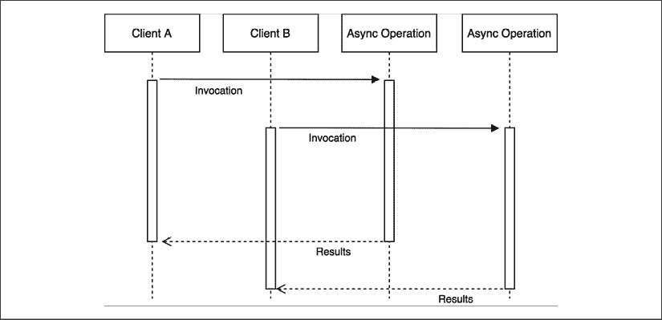
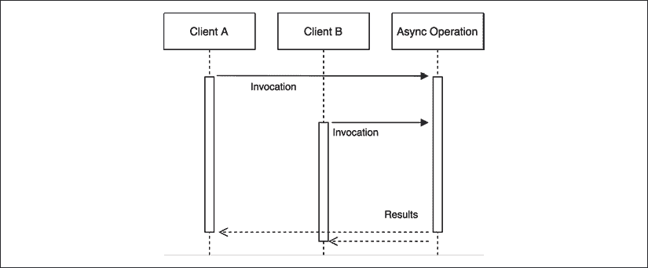
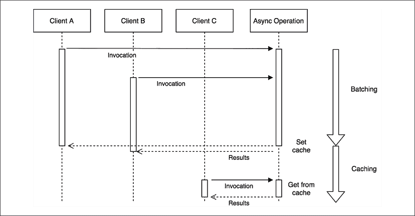

# 高级食谱

在本章中，我们将采用问题-解决方案的方法，就像在烹饪书中一样，我们将展示一系列现成的*食谱*来解决一些常见的 Node.js 编程问题。

当我们尝试异步做事时，本章中提出的许多问题并不令人惊讶。事实上，正如我们在本书的前几章中反复看到的，在传统同步编程中简单易行的任务，当应用于异步编程时可能会变得更加复杂。一个典型的例子是尝试使用需要异步初始化步骤的组件。在这种情况下，我们不得不推迟使用组件的任何尝试，直到初始化完成。我们将在稍后向您展示如何优雅地解决这个问题。

但这一章不仅仅关于涉及异步编程的食谱。您还将了解在 Node.js 中运行 CPU 密集型任务的最佳方式。

本章中您将学习的食谱包括：

+   处理异步初始化组件

+   异步请求批处理和缓存

+   取消异步操作

+   运行 CPU 密集型任务

让我们开始吧。

# 处理异步初始化组件

同步 API 存在于 Node.js 核心模块和许多 npm 包中的原因之一是因为它们在实现初始化任务时非常方便使用。对于简单的程序，在初始化时使用同步 API 可以大大简化事情，并且与它们的使用相关的缺点仍然被限制在很小的范围内，因为它们只在使用一次时使用，即程序或特定组件初始化时。

不幸的是，这并不总是可能的。同步 API 可能并不总是可用，尤其是在组件初始化阶段使用网络时，例如执行握手协议或检索配置参数。这种情况适用于许多数据库驱动程序和中间件系统（如消息队列）的客户端。

## 异步初始化组件的问题

让我们考虑一个例子，其中使用名为`db`的模块与远程数据库进行交互。`db`模块只有在与数据库服务器成功建立连接和握手之后才会接受 API 请求。因此，在初始化阶段完成之前，不能发送查询或其他命令。以下是一个这样的示例模块（`db.js`文件）的代码：

```js
import { EventEmitter } from 'events'
class DB extends EventEmitter {
  connected = false
  connect () {
    // simulate the delay of the connection
    setTimeout(() => {
      this.connected = true
      this.emit('connected')
    }, 500)
  }
  async query (queryString) {
    if (!this.connected) {
      throw new Error('Not connected yet')
    }
    console.log(`Query executed: ${queryString}`)
  }
}
export const db = new DB() 
```

这是一个异步初始化组件的典型例子。在这些假设下，我们通常有两个快速且简单的解决方案来解决这个问题，我们可以称之为*本地初始化检查*和*延迟启动*。让我们更详细地分析它们。

### 本地初始化检查

第一个解决方案确保在调用模块的任何 API 之前，模块已经初始化；否则，我们等待其初始化。每次我们想要在异步模块上执行操作时，都必须进行此检查：

```js
import { once } from 'events'
import { db } from './db.js'
db.connect()
async function updateLastAccess () {
  if (!db.connected) {
    await once(db, 'connected')
  }
  await db.query(`INSERT (${Date.now()}) INTO "LastAccesses"`)
}
updateLastAccess()
setTimeout(() => {
  updateLastAccess()
}, 600) 
```

正如我们之前预料的，每次我们想要在`db`组件上调用`query()`方法时，我们必须检查模块是否已经初始化；否则，我们通过监听`'connected'`事件来等待其初始化。这种技术的变体将检查操作放在`query()`方法内部本身，这样就将样板代码的负担从消费者转移到了服务提供者。

### 延迟启动

解决异步初始化组件问题的第二个快速且简单的方法是在组件完成其初始化例程之前，延迟依赖于该异步初始化组件的任何代码的执行。我们可以在以下代码片段中看到一个这样的技术示例：

```js
import { db } from './db.js'
import { once } from 'events'
async function initialize () {
  db.connect()
  await once(db, 'connected')
}
async function updateLastAccess () {
  await db.query(`INSERT (${Date.now()}) INTO "LastAccesses"`)
}
initialize()
  .then(() => {
    updateLastAccess()
    setTimeout(() => {
      updateLastAccess()
    }, 600)
  }) 
```

从前面的代码中我们可以看到，我们首先等待初始化完成，然后继续执行任何使用`db`对象的常规操作。

这种技术的缺点是它要求我们事先知道哪些组件将使用异步初始化组件，这使得我们的代码脆弱且容易出错。解决这个问题的一个方法是将整个应用程序的启动延迟到所有异步服务都初始化完成。这种方法的优势在于简单且有效；然而，它可能会显著增加应用程序的整体启动时间，而且它不会考虑到异步初始化组件需要重新初始化的情况。

如我们将在下一节中看到的，还有第三个替代方案，它允许我们透明且高效地延迟每个操作，直到异步初始化步骤完成。

## 预初始化队列

确保组件的服务仅在组件初始化之后被调用的另一个方法涉及使用队列和命令模式。想法是在组件尚未初始化时，将接收到的方法调用（仅限于需要组件初始化的调用）排队，然后在所有初始化步骤完成后立即执行它们。

让我们看看这种技术如何应用于我们的示例`db`组件：

```js
import { EventEmitter } from 'events'
class DB extends EventEmitter {
  connected = false
  commandsQueue = []
  async query (queryString) {
    if (!this.connected) {
      console.log(`Request queued: ${queryString}`)
      return new Promise((resolve, reject) => {            // (1)
        const command = () => {
          this.query(queryString)
            .then(resolve, reject)
        }
        this.commandsQueue.push(command)
      })
    }
    console.log(`Query executed: ${queryString}`)
  }
  connect () {
    // simulate the delay of the connection
    setTimeout(() => {
      this.connected = true
      this.emit('connected')
      this.commandsQueue.forEach(command => command())     // (2)
      this.commandsQueue = []
    }, 500)
  }
}
export const db = new DB() 
```

正如我们之前提到的，这里描述的技术包括两个部分：

1.  如果组件尚未初始化——在我们的例子中，这是当`connected`属性为`false`时——我们使用当前调用接收到的参数创建一个命令，并将其推送到`commandsQueue`数组。当命令执行时，它将再次运行原始的`query()`方法，并将结果转发到我们返回给调用者的`Promise`。

1.  当组件的初始化完成时——在我们的例子中，这意味着与数据库服务器的连接已建立——我们遍历`commandsQueue`，执行之前排队的所有命令。

在我们刚刚实现的`DB`类中，在调用其方法之前不需要检查组件是否已初始化。实际上，所有逻辑都嵌入在组件本身中，任何消费者都可以透明地使用它，无需担心其初始化状态。

我们还可以更进一步，尝试减少我们刚刚创建的`DB`类的样板代码，同时提高其模块化。我们可以通过应用我们在第九章“行为设计模式”中学到的状态模式，使用两个状态来实现这一点：

+   第一个状态实现了所有需要组件初始化的方法，并且只有在初始化成功时才会被激活。这些方法中的每一个都实现了自己的业务逻辑，而不必担心`db`组件的初始化状态。

+   第二个状态在初始化完成之前被激活，并实现了与第一个状态相同的方法，但它们在这里的唯一角色是使用传递给调用的参数将新命令添加到队列中。

让我们看看如何将我们刚刚描述的结构应用到我们的`db`组件中。首先，我们创建`InitializedState`，它实现了我们组件的实际业务逻辑：

```js
class InitializedState {
  async query (queryString) {
    console.log(`Query executed: ${queryString}`)
  }
} 
```

如我们所见，在`InitializedState`类中，我们只需要实现一个方法，即`query()`方法，当它接收到新的查询时，会在控制台打印一条消息。

接下来，我们实现`QueuingState`，这是我们的核心。这个状态实现了排队逻辑：

```js
const METHODS_REQUIRING_CONNECTION = ['query']
const deactivate = Symbol('deactivate')
class QueuingState {
  constructor (db) {
    this.db = db
    this.commandsQueue = []
    METHODS_REQUIRING_CONNECTION.forEach(methodName => {
      this[methodName] = function (...args) {
        console.log('Command queued:', methodName, args)
        return new Promise((resolve, reject) => {
          const command = () => {
            dbmethodName
              .then(resolve, reject)
          }
          this.commandsQueue.push(command)
        })
      }
    })
  }
  [deactivate] () {
    this.commandsQueue.forEach(command => command())
    this.commandsQueue = []
  }
} 
```

有趣的是，注意到`QueuingState`在创建时主要是动态构建的。对于每个需要活跃连接的方法，我们为当前实例创建一个新的方法，该方法排队一个新的表示函数调用的命令。当命令在稍后执行，即连接建立时，`db`实例上方法调用的结果会被转发给调用者（通过返回的承诺）。

这个状态类中的另一个重要部分是`[deactivate]()`方法。当状态被停用时（即组件初始化时）会调用此方法，并执行队列中的所有命令。注意我们是如何使用`Symbol`来命名这个方法的。

这将避免在未来添加更多方法到状态时发生名称冲突（例如，如果我们需要装饰`DB`类的假设`deactivate()`方法怎么办？）。

现在，是时候使用我们刚刚描述的两个状态来重新实现`DB`类了：

```js
class DB extends EventEmitter {
  constructor () {
    super()
    this.state = new QueuingState(this)                    // (1)
  }
  async query (queryString) {
    return this.state.query(queryString)                   // (2)
  }
  connect () {
    // simulate the delay of the connection
    setTimeout(() => {
      this.connected = true
      this.emit('connected')
      const oldState = this.state                          // (3)
      this.state = new InitializedState(this)
      oldState[deactivate] && oldState[deactivate]()
    }, 500)
  }
}
export const db = new DB() 
```

让我们进一步分析新`DB`类最重要的部分：

1.  在构造函数中，我们初始化实例的当前 `状态`。由于组件的异步初始化尚未完成，它将是 `QueuingState`。

1.  我们类实现一些（占位符）业务逻辑的唯一方法是 `query()` 方法。在这里，我们只需调用当前活动状态的同名方法。

1.  最后，当我们与数据库建立连接（初始化完成）时，我们将当前状态切换到 `InitializedState` 并停用旧的。停用 `QueuedState` 的效果，正如我们之前看到的，是任何已排队的命令现在都会被执行。

我们可以立即看到这种方法如何使我们减少样板代码，同时创建一个纯粹的业务逻辑类（`InitializedState`），不受任何重复初始化检查的影响。

我们刚才看到的方法只有在我们可以修改异步初始化的组件代码时才会有效。在所有那些我们无法修改组件的案例中，我们需要创建一个包装器或代理，但技术将主要与这里看到的方法相似。

## 在野外

我们刚才提出的模式被许多数据库驱动程序和 ORM 库所使用。最著名的是 Mongoose（[nodejsdp.link/mongoose](http://nodejsdp.link/mongoose)），它是 MongoDB 的 ORM。使用 Mongoose，不需要等待数据库连接打开就可以发送查询。这是因为每个操作都会排队，然后在数据库连接完全建立后执行，正如我们在本节中描述的那样。这对于任何希望提供良好 **开发者体验**（**DX**）的 API 来说显然是必须的。

查看 Mongoose 的代码，看看原生驱动程序中的每个方法是如何通过代理添加预初始化队列的。这也展示了实现本节中提出的配方的一种替代方法。相关代码片段可以在 [nodejsdp.link/mongoose-init-queue](http://nodejsdp.link/mongoose-init-queue) 找到。

类似地，`pg` 包（[nodejsdp.link/pg](http://nodejsdp.link/pg)），它是 PostgreSQL 数据库的客户端，利用了预初始化队列，但方式略有不同。`pg` 会将每个查询排队，无论数据库的初始化状态如何，然后立即尝试执行队列中的所有命令。请查看相关的代码行在 [nodejsdp.link/pg-queue](http://nodejsdp.link/pg-queue)。

# 异步请求批处理和缓存

在高负载应用中，**缓存**起着关键作用，并且在网络上几乎无处不在，从静态资源如网页、图像和样式表，到纯数据如数据库查询的结果。在本节中，我们将学习缓存如何应用于异步操作，以及如何将高请求吞吐量转化为我们的优势。

## 什么是异步请求批处理？

在处理异步操作时，最基本级别的缓存可以通过将一组对同一 API 的调用 **批处理** 在一起来实现。这个想法非常简单：如果我们在一个异步函数仍在挂起时调用它，我们可以利用已经运行的操作，而不是创建一个新的请求。看看下面的图示：



图 11.1：没有批处理的两个异步请求

之前的图示显示了两个客户端以 *完全相同的输入* 调用相同的异步操作。当然，描绘这种情况的自然方式是两个客户端启动两个不同的操作，这些操作将在不同的时刻完成。

现在，考虑以下场景：



图 11.2：两个异步请求的批处理

*图 11.2* 展示了两个相同的请求——它们使用相同的输入调用相同的 API——是如何进行批处理的，换句话说，是将它们附加到同一个正在运行的操作中。通过这样做，当操作完成时，两个客户端都会收到通知，尽管异步操作实际上只执行了一次。这代表了一种简单而又极其强大的优化应用程序负载的方法，同时无需处理更复杂的缓存机制，这些机制通常需要足够的内存管理和失效策略。

## 最佳异步请求缓存

如果操作足够快或者匹配的请求分布在更长的时间内，请求批处理的效果就会降低。此外，大多数情况下，我们可以安全地假设两个相同的 API 调用的结果不会经常改变，因此简单的请求批处理不会提供最佳性能。在这些所有情况下，减少应用程序负载并提高其响应性的最佳选择无疑是更激进的缓存机制。

这个想法很简单：一旦请求完成，我们就将其结果存储在缓存中，这可以是一个内存变量或一个专门的缓存服务器（如 Redis）中的项目。因此，下次调用 API 时，结果可以立即从缓存中检索，而不是启动另一个请求。

缓存的想法对于一个经验丰富的开发者来说可能并不陌生，但使这种技术在异步编程中与众不同的地方在于，它应该与请求批处理相结合以达到最佳效果。这样做的原因是因为在缓存未设置的情况下，可能会有多个请求同时运行，而当这些请求完成时，缓存会被设置多次。

基于这些假设，我们可以如下说明组合请求批处理和缓存模式：



图 11.3：结合批处理和缓存

前面的图显示了最优异步缓存算法的两个阶段：

+   第一个阶段完全等同于批处理模式。当缓存未设置时接收到的任何请求都将一起批处理。当请求完成时，缓存设置一次。

+   当缓存最终设置后，任何后续请求都将直接从缓存中提供服务。

另一个需要考虑的关键细节是*Zalgo*反模式（如我们在*第三章*，*回调和事件*中看到的）。由于我们处理的是异步 API，我们必须确保始终异步返回缓存值，即使访问缓存只涉及同步操作，例如，当从内存变量中检索缓存值时。

## 没有缓存或批处理的 API 服务器

在我们深入这个新挑战之前，让我们实现一个小型的演示服务器，我们将使用它作为参考来衡量我们将要实施的各项技术的效果。

让我们考虑一个管理电子商务公司销售的 API 服务器。特别是，我们希望查询服务器以获取特定类型商品所有交易的总和。为此，我们将通过`level` npm 包（[nodejsdp.link/level](http://nodejsdp.link/level)）使用 LevelUP 数据库。我们将使用的数据模型是一个简单的交易列表，存储在`sales`子级别（数据库的一个子部分）中，其组织格式如下：

```js
transactionId {amount, product} 
```

键由`transactionId`表示，值是一个包含销售金额（`amount`）和产品类型（`product`）的 JSON 对象。

要处理的数据非常基础，所以让我们实现一个简单的数据库查询，我们可以用它来进行实验。假设我们想要获取特定产品的总销售额。该程序将如下所示（文件`totalSales.js`）：

```js
import level from 'level'
import sublevel from 'subleveldown'
const db = level('example-db')
const salesDb = sublevel(db, 'sales', { valueEncoding: 'json' })
export async function totalSales (product) {
  const now = Date.now()
  let sum = 0
  for await (const transaction of salesDb.createValueStream()) {
    if (!product || transaction.product === product) {
      sum += transaction.amount
    }
  }
  console.log(`totalSales() took: ${Date.now() - now}ms`)
  return sum
} 
```

`totalSales()`函数遍历`sales`子级别的所有交易，并计算特定产品的金额总和。算法故意设计得较慢，以便我们稍后强调批处理和缓存的效果。在实际应用中，我们会使用索引通过`product`查询交易，甚至更好的方法是使用增量 map/reduce 算法来持续计算每个产品的总和。

现在，我们可以通过一个简单的 HTTP 服务器（`server.js`文件）公开`totalSales()` API：

```js
import { createServer } from 'http'
import { totalSales } from './totalSales.js'
createServer(async (req, res) => {
  const url = new URL(req.url, 'http://localhost')
  const product = url.searchParams.get('product')
  console.log(`Processing query: ${url.search}`)
  const sum = await totalSales(product)
  res.setHeader('Content-Type', 'application/json')
  res.writeHead(200)
  res.end(JSON.stringify({
    product,
    sum
  }))
}).listen(8000, () => console.log('Server started')) 
```

在我们第一次启动服务器之前，我们需要用一些示例数据填充数据库。我们可以使用`populateDb.js`脚本来完成这项工作，该脚本位于本书代码库中专门为此部分创建的文件夹中。此脚本在数据库中创建 100,000 个随机的销售交易，以便我们的查询花费一些时间处理数据：

```js
node populateDb.js 
```

好的！现在，一切准备就绪。让我们启动服务器：

```js
node server.js 
```

要查询服务器，您只需使用浏览器导航到以下 URL：

```js
http://localhost:8000?product=book 
```

然而，为了更好地了解我们服务器的性能，我们需要不止一个请求。因此，我们将使用一个名为 `loadTest.js` 的小脚本，该脚本每隔 200 毫秒发送 20 个请求。该脚本可以在本书的代码仓库中找到，并且已经配置为连接到服务器的本地 URL，因此，要运行它，只需执行以下命令：

```js
node loadTest.js 
```

我们将看到，20 个请求需要一段时间才能完成。请注意测试的总执行时间。现在，我们将应用我们的优化并测量我们可以节省多少时间。我们将首先通过利用承诺的特性来实现批量处理和缓存。

## 使用承诺进行批量处理和缓存

承诺是实现异步批量处理和请求缓存的一个很好的工具。让我们看看为什么。

如果我们回顾一下我们在 *第五章* 中学到的关于承诺的知识，*使用承诺和 Async/Await 的异步控制流模式*，在这种情况下，有两个属性可以为我们所用：

+   可以将多个 `then()` 监听器附加到同一个承诺上。

+   `then()` 监听器保证会被调用（只调用一次），即使它在承诺已经解决之后附加，它也能正常工作。此外，`then()` 保证总是异步调用。

简而言之，第一个属性正是我们用于批量请求所需的东西，而第二个属性意味着承诺已经是一个已解析值的缓存，并提供了一种在一致、异步的方式返回缓存值的自然机制。换句话说，这意味着使用承诺，批量处理和缓存变得极其简单和简洁。

### 在总销售额网络服务器中批量请求

现在，让我们在我们的 `totalSales` API 之上添加一个批量层。我们将使用的模式非常简单：如果 API 调用时还有另一个相同请求挂起，我们将等待该请求完成而不是启动一个新的请求。我们将看到，这可以通过承诺轻松实现。事实上，我们所有要做的就是将承诺保存在一个映射中，每次我们启动一个新的请求时，都将其与指定的请求参数（在我们的例子中是 `product` 类型）关联起来。然后，在后续的每个请求中，我们检查是否已经存在针对指定 `product` 的承诺，如果存在，我们就返回它；否则，我们启动一个新的请求。

现在，让我们看看这如何转化为代码。让我们创建一个名为 `totalSalesBatch.js` 的新模块。在这里，我们将在原始 `totalSales()` API 之上实现一个批量层：

```js
import { totalSales as totalSalesRaw } from './totalSales.js'
const runningRequests = new Map()
export function totalSales (product) {
  if (runningRequests.has(product)) {                      // (1)
    console.log('Batching')
    return runningRequests.get(product)
  }
  const resultPromise = totalSalesRaw(product)             // (2)
  runningRequests.set(product, resultPromise)
  resultPromise.finally(() => {
    runningRequests.delete(product)
  })
  return resultPromise
} 
```

`totalSalesBatch` 模块的 `totalSales()` 函数是原始 `totalSales()` API 的代理，它的工作方式如下：

1.  如果已经存在针对给定 `product` 的承诺，我们只需返回它。这就是我们利用已运行的请求来 * piggyback * 的地方。

1.  如果没有针对给定 `product` 的请求正在运行，我们将执行原始的 `totalSales()` 函数，并将结果承诺保存到 `runningRequests` 映射中。接下来，我们确保在请求完成时立即从 `runningRequests` 映射中移除相同的承诺。

新的 `totalSales()` 函数的行为与原始的 `totalSales()` API 完全相同，区别在于现在，使用相同输入对 API 进行多次调用将被批量处理，从而节省我们的时间和资源。

想知道与未经批量的原始 `totalSales()` API 相比，性能提升了多少吗？那么，我们将 HTTP 服务器使用的 `totalSales` 模块替换为我们刚刚创建的（`app.js` 文件）：

```js
// import { totalSales } from './totalSales.js'
**import** **{ totalSales }** **from****'./totalSalesBatch.js'**
createServer(async (req, res) => {
  // ... 
```

如果我们现在再次尝试启动服务器并对其运行负载测试，我们首先会看到请求是以 **批量** 形式返回的。这正是我们刚刚实施的方案的效应，并且是它如何工作的一个很好的实际演示。

此外，我们还应该观察到执行测试的总时间有相当大的减少。它应该至少比针对原始的纯 `totalSales()` API 执行的测试快四倍！

这个结果证实了，仅通过应用一个简单的批量层，我们就能获得巨大的性能提升，而不需要管理完整的缓存的所有复杂性，更重要的是，无需担心失效策略。

请求批量模式在高负载应用和缓慢的 API 中达到最佳潜力。这是因为正是在这些情况下，我们可以将大量请求批量在一起。

现在我们来看看如何通过稍微改变我们刚刚探索的技术来实现批量和缓存。

### 在总销售额网络服务器中缓存请求

由于承诺的存在，将缓存层添加到我们的批量 API 中非常简单。我们只需在请求完成后将承诺留在我们的请求映射中即可。

让我们立即实现 `totalSalesCache.js` 模块：

```js
import { totalSales as totalSalesRaw } from './totalSales.js'
const CACHE_TTL = 30 * 1000 // 30 seconds TTL
const cache = new Map()
export function totalSales (product) {
  if (cache.has(product)) {
    console.log('Cache hit')
    return cache.get(product)
  }
  const resultPromise = totalSalesRaw(product)
  cache.set(product, resultPromise)
  **resultPromise.then(****() =>** **{**
    **setTimeout****(****() =>** **{**
      **cache.delete(product)**
    **}, CACHE_TTL)**
  **},** **err** **=>** **{**
    **cache.delete(product)**
    **throw** **err**
  **})**
  return resultPromise
} 
```

允许缓存的相应代码被突出显示。我们只需在请求完成后的一定时间（`CACHE_TTL`）内从缓存中移除承诺，或者在请求失败时立即移除。这是一个非常基本的缓存失效技术，但对我们这个演示来说效果完美。

现在，我们已经准备好尝试我们刚刚创建的 `totalSales()` 缓存包装器。为此，我们只需要更新 `app.js` 模块，如下所示：

```js
// import { totalSales } from './totalSales.js'
// import { totalSales } from './totalSalesBatch.js'
**import** **{ totalSales }** **from****'./totalSalesCache.js'**
createServer(async (req, res) => {
  // ... 
```

现在，我们可以再次启动服务器并使用`loadTest.js`脚本进行性能分析，就像我们在前面的示例中所做的那样。使用默认的测试参数，我们应该看到与简单的批处理相比，执行时间减少了 10%。当然，这高度依赖于许多因素；例如，接收到的请求数量和请求之间的延迟。当请求数量更多且跨越更长的时间段时，使用缓存而不是批处理的优势将更加显著。

### 关于实现缓存机制的注意事项

我们必须记住，在实际应用中，我们可能需要使用更高级的缓存失效技术和存储机制。这是出于以下原因必要的：

+   大量的缓存值很容易消耗大量内存。在这种情况下，可以应用**最近最少使用**（**LRU**）或**先进先出**（**FIFO**）策略来维持恒定的内存利用率。

+   当应用程序分布在多个进程之间时，将缓存保存在内存中可能会在每个服务器实例上产生不同的结果。如果我们正在实施的应用程序不希望出现这种情况，解决方案是使用共享存储来保存缓存。这比简单的内存解决方案性能更好，因为缓存是在多个实例之间共享的。流行的缓存解决方案包括 Redis ([nodejsdp.link/redis](http://nodejsdp.link/redis)) 和 Memcached ([nodejsdp.link/memcached](http://nodejsdp.link/memcached))。

+   与基于时间的过期时间相比，手动缓存失效（例如，当相关的非缓存值发生变化时）可以使缓存的生命周期更长，同时提供更及时的数据，但当然，管理起来会更复杂。我们不要忘记 Phil Karlton（Netscape、Silicon Graphics 等公司的首席工程师）的著名引言：“在计算机科学中，只有两件难事：缓存失效和命名事物。”

通过这种方式，我们结束了关于请求批处理和缓存的这一节。接下来，我们将学习如何处理一个棘手的问题：取消异步操作。

# 取消异步操作

能够停止长时间运行的操作特别有用，如果操作被用户取消或变得冗余。在多线程编程中，我们只需终止线程即可，但在单线程平台如 Node.js 上，事情可能会变得稍微复杂一些。

在本节中，我们将讨论取消异步操作，而不是取消承诺，这两者完全是不同的事情。顺便说一句，Promises/A+标准并没有包括用于取消承诺的 API。然而，如果您需要这样的功能，可以使用像 bluebird 这样的第三方承诺库（更多信息请参阅[nodejsdp.link/bluebird-cancelation](http://nodejsdp.link/bluebird-cancelation)）。请注意，取消承诺并不意味着与之相关的操作也会被取消；实际上，bluebird 在承诺构造函数中提供了一个`onCancel`回调，除了`resolve`和`reject`之外，可以在承诺被取消时用来取消底层的异步操作。这正是本节要讨论的内容。

## 创建可取消函数的基本配方

实际上，在异步编程中，取消函数执行的基本原则非常简单：我们在每次异步调用后检查操作是否已被取消，如果是这样，我们就提前退出操作。例如，考虑以下代码：

```js
import { asyncRoutine } from './asyncRoutine.js'
import { CancelError } from './cancelError.js'
async function cancelable (cancelObj) {
  const resA = await asyncRoutine('A')
  console.log(resA)
  **if** **(cancelObj.cancelRequested) {**
    **throw****new** **CancelError()**
  **}**
  const resB = await asyncRoutine('B')
  console.log(resB)
  **if** **(cancelObj.cancelRequested) {**
    **throw****new** **CancelError()**
  **}**
  const resC = await asyncRoutine('C')
  console.log(resC)
} 
```

`cancelable()`函数接收一个包含单个属性`cancelRequested`的对象（`cancelObj`）作为输入。在函数中，我们在每次异步调用后检查`cancelRequested`属性，如果它是`true`，则抛出一个特殊的`CancelError`异常来中断函数的执行。

`asyncRoutine()`函数只是一个演示函数，它将字符串打印到控制台，并在 100 毫秒后返回另一个字符串。您可以在本书的代码库中找到它的完整实现，以及`CancelError`的实现。

重要的是要注意，任何在`cancelable()`函数外部编写的代码只能在`cancelable()`函数将控制权交还给事件循环之后设置`cancelRequested`属性，这通常发生在异步操作被等待时。这就是为什么我们只在异步操作完成后而不是更频繁地检查`cancelRequested`属性是值得的。

以下代码演示了如何取消`cancelable()`函数：

```js
const cancelObj = { cancelRequested: false }
cancelable(cancelObj)
  .catch(err => {
    if (err instanceof CancelError) {
      console.log('Function canceled')
    } else {
      console.error(err)
    }
  })
setTimeout(() => {
  cancelObj.cancelRequested = true
}, 100) 
```

如我们所见，要取消函数，我们只需将`cancelObj.cancelRequested`属性设置为`true`。这将导致函数停止并抛出一个`CancelError`。

## 包装异步调用

创建和使用基本异步可取消函数非常简单，但其中涉及大量的模板代码。实际上，它涉及了如此多的额外代码，以至于很难识别函数的实际业务逻辑。

我们可以通过在包装函数中包含取消逻辑来减少模板代码，我们可以使用这个函数来调用异步例程。

这样的包装器看起来如下（`cancelWrapper.js`文件）：

```js
import { CancelError } from './cancelError.js'
export function createCancelWrapper () {
  let cancelRequested = false
  function cancel () {
    cancelRequested = true
  }
  function cancelWrapper (func, ...args) {
    if (cancelRequested) {
      return Promise.reject(new CancelError())
    }
    return func(...args)
  }
  return { cancelWrapper, cancel }
} 
```

我们通过一个名为 `createCancelWrapper()` 的工厂函数创建包装器。工厂返回两个函数：包装函数（`cancelWrapper`）和一个用于触发异步操作取消的函数（`cancel`）。这允许我们创建一个包装函数来包装多个异步调用，然后使用单个 `cancel()` 函数来取消所有这些调用。

`cancelWrapper()` 函数接收一个要调用的函数（`func`）和一组要传递给函数的参数（`args`）作为输入。包装器简单地检查是否请求了取消操作，如果是的话，它将返回一个以 `CancelError` 对象作为拒绝原因的拒绝承诺；否则，它将调用 `func`。

现在我们来看看我们的包装器工厂如何极大地提高我们的 `cancelable()` 函数的可读性和模块化：

```js
import { asyncRoutine } from './asyncRoutine.js'
import { createCancelWrapper } from './cancelWrapper.js'
import { CancelError } from './cancelError.js'
async function cancelable (cancelWrapper) {
  const resA = await cancelWrapper(asyncRoutine, 'A')
  console.log(resA)
  const resB = await cancelWrapper(asyncRoutine, 'B')
  console.log(resB)
  const resC = await cancelWrapper(asyncRoutine, 'C')
  console.log(resC)
}
const { cancelWrapper, cancel } = createCancelWrapper()
cancelable(cancelWrapper)
  .catch(err => {
    if (err instanceof CancelError) {
      console.log('Function canceled')
    } else {
      console.error(err)
    }
  })
setTimeout(() => {
  cancel()
}, 100) 
```

我们可以立即看到使用包装函数实现我们的取消逻辑的好处。事实上，`cancelable()` 函数现在更加简洁和可读。

## 带有生成器的可取消异步函数

我们刚刚创建的 `cancelable` 包装函数与直接在我们的代码中嵌入取消逻辑相比已经前进了一大步。然而，它仍然不是理想的，原因有两个：它容易出错（如果我们忘记包装一个函数怎么办？）并且它仍然会影响我们代码的可读性，这使得它不适合实现已经很大很复杂的可取消异步操作。

一个更简洁的解决方案涉及到生成器的使用。在 *第九章*，*行为设计模式* 中，我们介绍了生成器作为实现迭代器的手段。然而，它们是一个非常通用的工具，可以用来实现各种算法。在这种情况下，我们将使用生成器来构建一个监督器来控制函数的异步流程。结果将是一个透明可取消的异步函数，其行为类似于一个异步函数，其中 `await` 指令被 `yield` 替换。

让我们看看我们如何使用生成器实现这个可取消函数（`createAsyncCancelable.js` 文件）：

```js
import { CancelError } from './cancelError.js'
export function createAsyncCancelable (generatorFunction) {   // (1)
  return function asyncCancelable (...args) {
    const generatorObject = generatorFunction(...args)        // (3)
    let cancelRequested = false
    function cancel () {
      cancelRequested = true
    }
    const promise = new Promise((resolve, reject) => {
      async function nextStep (prevResult) {                  // (4)
        if (cancelRequested) {
          return reject(new CancelError())
        }
        if (prevResult.done) {
          return resolve(prevResult.value)
        }
        try {                                                 // (5)
          nextStep(generatorObject.next(await prevResult.value))
        } catch (err) {
          try {                                               // (6)
            nextStep(generatorObject.throw(err))
          } catch (err2) {
            reject(err2)
          }
        }
      }
      nextStep({})
    })
    return { promise, cancel }                                // (2)
  }
} 
```

`createAsyncCancelable()` 函数可能看起来很复杂，所以让我们更详细地分析它：

1.  首先，我们应该注意，`createAsyncCancelable()` 函数接收一个生成器函数（受监督的函数）作为输入，并返回另一个函数（`asyncCancelable()`），该函数将生成器函数用我们的监督逻辑包装起来。`asyncCancelable()` 函数是我们用来调用异步操作的工具。

1.  `asyncCancelable()` 函数返回一个包含两个属性的对象：

    1.  `promise` 属性，它包含表示异步操作最终解决（或拒绝）的承诺。

    1.  `cancel` 属性，它是一个可以用来取消受监督的异步流程的函数。

1.  当调用`asyncCancelable()`时，其首要任务是使用作为输入的参数（`args`）调用生成器函数，并获取一个生成器对象，我们可以使用它来控制正在运行的协程的执行流程。

1.  监督器的整个逻辑都实现在`nextStep()`函数中，该函数负责遍历由被监督的协程（`prevResult`）产生的值。这些可以是实际值或承诺。如果请求取消，我们抛出常规的`CancelError`；否则，如果协程已被终止（例如，`prevResult.done`为`true`），我们立即解析外部承诺并完成返回。

1.  `nextStep()`函数的核心部分是我们检索由被监督的协程（别忘了，它是一个生成器）产生的下一个值。我们在该值上`await`，以确保在处理承诺的情况下我们得到实际的解析值。这也确保了如果`prevResult.value`是一个承诺并且它被拒绝，我们将结束在`catch`语句中。即使被监督的协程实际上抛出了异常，我们也可以进入`catch`语句。

1.  在`catch`语句中，我们在协程内部抛出捕获到的错误。如果该错误已经被协程抛出，这将是多余的，但如果它是承诺拒绝的结果，则不是。即使不是最优的，这个技巧可以为了这个演示的目的稍微简化我们的代码。我们使用抛出后在协程内部抛出的任何值来调用`nextStep()`，但如果结果是另一个异常（例如，异常没有被协程捕获或抛出了另一个异常），我们立即拒绝外部承诺并完成异步操作。

正如我们所见，`createAsyncCancelable()`函数中有很多动态部分。但我们应该赞赏这样一个事实，即仅仅几行代码，我们就能够创建一个不需要任何手动取消逻辑的可取消函数。正如我们现在将要看到的，结果是令人印象深刻的。

让我们使用在`createAsyncCancelable()`函数中实现的监督器重写我们的示例异步可取消操作：

```js
import { asyncRoutine } from './asyncRoutine.js'
import { createAsyncCancelable } from './createAsyncCancelable.js'
import { CancelError } from './cancelError.js'
const cancelable = createAsyncCancelable(function * () {
  const resA = yield asyncRoutine('A')
  console.log(resA)
  const resB = yield asyncRoutine('B')
  console.log(resB)
  const resC = yield asyncRoutine('C')
  console.log(resC)
})
const { promise, cancel } = cancelable()
promise.catch(err => {
  if (err instanceof CancelError) {
    console.log('Function canceled')
  } else {
    console.error(err)
  }
})
setTimeout(() => {
  cancel()
}, 100) 
```

我们可以立即看出，`createAsyncCancelable()`包裹的生成器非常类似于异步函数，但我们使用`yield`而不是`await`。而且，根本看不到任何取消逻辑。生成器函数保持了异步函数的优秀特性（例如，使异步代码看起来像同步代码），但与异步函数不同，多亏了`createAsyncCancelable()`引入的监督器，我们还可以取消操作。

第二个有趣的特点是，`createAsyncCancelable()`创建了一个函数（称为`cancelable`），它可以像任何其他函数一样被调用，但同时返回一个表示操作结果的承诺和一个用于取消操作的功能。

使用生成器的这种技术代表了我们实现可取消异步操作的最佳选择。

对于生产使用，大多数时候，我们可以依赖 Node.js 生态系统中的一个广泛使用的包，如`caf`（该缩写代表可取消异步流），您可以在[nodejsdp.link/caf](http://nodejsdp.link/caf)找到它。

# 运行 CPU-bound 任务

在*异步请求批处理和缓存*部分中，我们实现的`totalSales()` API（故意）在资源方面很昂贵，运行需要几百毫秒。尽管如此，调用`totalSales()`函数并没有影响应用程序处理并发传入请求的能力。我们在*第一章*，*Node.js 平台*中关于事件循环的了解应该可以解释这种行为：调用异步操作总是导致堆栈回滚到事件循环，使其能够处理其他请求。

但当我们运行一个耗时很长且在完成前永远不会将控制权交还给事件循环的任务时，会发生什么？这类任务也被称为**CPU-bound**，因为其主要特点是 CPU 利用率高，而不是 I/O 操作量大。

让我们立即通过一个例子来看看这些类型任务在 Node.js 中的表现。

## 解决子集和问题

让我们现在选择一个计算上昂贵的难题作为实验的基础。一个好的候选者是**子集和**问题，它决定一个整数集（或多重集）是否包含一个非空子集，其和等于零。例如，如果我们输入的集合是[1, 2, –4, 5, –3]，满足该问题的子集是[1, 2, –3]和[2, –4, 5, –3]。

最简单的算法是检查任何大小的子集的所有可能组合，其计算成本为*O*(2^n)，换句话说，它随着输入大小的增加呈指数增长。这意味着一个包含 20 个整数的集合需要检查高达 1,048,576 种组合，这对于测试我们的假设来说还不错。在我们的例子中，我们将考虑以下子集和问题的变体：给定一个整数集合，我们想要计算所有可能的组合，其和等于一个给定的任意整数，而不仅仅是零。

现在，让我们努力实现这样一个算法。首先，让我们创建一个名为`subsetSum.js`的新模块。我们将首先创建一个名为`SubsetSum`的类：

```js
export class SubsetSum extends EventEmitter {
  constructor (sum, set) {
    super()
    this.sum = sum
    this.set = set
    this.totalSubsets = 0
  }
//... 
```

`SubsetSum`类扩展了`EventEmitter`。这允许我们在找到与输入接收到的和匹配的新子集时产生一个事件。正如我们将看到的，这将给我们带来很大的灵活性。

接下来，让我们看看我们如何生成所有可能的子集组合：

```js
_combine (set, subset) {
  for (let i = 0; i < set.length; i++) {
    const newSubset = subset.concat(set[i])
    this._combine(set.slice(i + 1), newSubset)
    this._processSubset(newSubset)
  }
} 
```

我们不会过多地详细介绍算法，但有几点需要注意：

+   `_combine()`方法完全是同步的。它递归地生成每个可能的子集，而不会将控制权交还给事件循环。

+   每次生成一个新的组合时，我们都会将其提供给`_processSubset()`方法进行进一步处理。

`_processSubset()`方法负责验证给定子集的元素之和是否等于我们正在寻找的数字：

```js
_processSubset (subset) {
  console.log('Subset', ++this.totalSubsets, subset)
  const res = subset.reduce((prev, item) => (prev + item), 0)
  if (res === this.sum) {
    this.emit('match', subset)
  }
} 
```

显然，`_processSubset()`方法对子集应用`reduce`操作以计算其元素之和。然后，当结果之和等于我们感兴趣寻找的值（`this.sum`）时，它发出一个类型为`match`的事件。

最后，`start()`方法将所有前面的部分组合在一起：

```js
start () {
  this._combine(this.set, [])
  this.emit('end')
} 
```

`start()`方法通过调用`_combine()`触发所有组合的生成，最后发出一个`end`事件，表示所有组合都已检查，并且任何可能的匹配都已发出。这是可能的，因为`_combine()`是同步的；因此，`end`事件在函数返回时立即发出，这意味着所有组合都已计算。

接下来，我们必须将我们刚刚创建的算法暴露在网络上。像往常一样，我们可以使用简单的 HTTP 服务器来完成这个任务。特别是，我们想要创建一个端点，该端点接受格式为`/subsetSum?data=<Array>&sum=<Integer>`的请求，该请求使用给定的整数数组和总和来调用`SubsetSum`算法以匹配。

让我们在名为`index.js`的模块中实现这个简单的服务器：

```js
import { createServer } from 'http'
import { SubsetSum } from './subsetSum.js'
createServer((req, res) => {
  const url = new URL(req.url, 'http://localhost')
  if (url.pathname !== '/subsetSum') {
    res.writeHead(200)
    return res.end('I\'m alive!\n')
  }
  const data = JSON.parse(url.searchParams.get('data'))
  const sum = JSON.parse(url.searchParams.get('sum'))
  res.writeHead(200)
  const subsetSum = new SubsetSum(sum, data)
  subsetSum.on('match', match => {
    res.write(`Match: ${JSON.stringify(match)}\n`)
  })
  subsetSum.on('end', () => res.end())
  subsetSum.start()
}).listen(8000, () => console.log('Server started')) 
```

由于`SubsetSum`对象使用事件返回其结果，我们可以实时地流式传输由算法生成的匹配子集。另一个需要提及的细节是，我们的服务器在每次我们访问不同于`/subsetSum`的 URL 时都会以文本`I'm alive!`响应。我们将使用此来检查我们服务器的响应性，就像我们一会儿会看到的那样。

现在，我们准备尝试我们的子集和算法。好奇我们的服务器会如何处理它？让我们启动它，然后：

```js
node index.js 
```

服务器启动后，我们就可以发送我们的第一个请求了。让我们用一个包含 17 个随机数字的多集来尝试，这将生成 131,071 个组合，这是一个让我们的服务器忙碌一段时间的好数量：

```js
curl -G http://localhost:8000/subsetSum --data-urlencode "data=[16, 19,1,1,-16,9,1,-5,-2,17,-15,-97,19,-16,-4,-5,15]" --data-urlencode "sum=0" 
```

几秒钟后，我们应该看到来自服务器的结果。但如果我们在第一个请求仍在运行的同时在另一个终端尝试以下命令，我们会发现一个巨大的问题：

```js
curl -G http://localhost:8000 
```

我们会立即看到最后一个请求会挂起，直到第一个请求的子集和算法完成：服务器无响应！这实际上是预期的。Node.js 事件循环在单个线程中运行，如果这个线程被长时间同步计算阻塞，它将无法执行单个周期来简单地响应`I'm alive!`

我们很快就会明白，这种行为对于任何旨在处理多个并发请求的应用程序都不适用。但不要绝望。在 Node.js 中，我们可以用几种方式处理这种类型的场景。因此，让我们分析三种最流行的方法，它们是“使用 `setImmediate` 交错”、“使用外部进程”和“使用工作线程”。

## 使用 `setImmediate` 交错

通常，一个 CPU 密集型算法建立在一系列步骤之上。这可以是一系列递归调用、循环，或者这些步骤的任何变化/组合。因此，解决我们问题的简单方法是在这些步骤的每个步骤完成后（或完成一定数量的步骤后）将控制权交还给事件循环。这样，任何挂起的 I/O 仍然可以在长时间运行的算法释放 CPU 的那些间隔内由事件循环处理。实现这一点的一个简单方法是在处理完任何挂起的 I/O 请求后安排算法的下一步运行。这似乎是 `setImmediate()` 函数（我们已经在 *第三章*，*回调和事件* 中介绍了这个 API）的完美用例。

### 子集和算法的步骤交错

现在，让我们看看这种技术是如何应用于我们的子集和算法的。我们只需要稍微修改一下 `subsetSum.js` 模块。为了方便起见，我们将创建一个新的模块，名为 `subsetSumDefer.js`，以原始 `subsetSum` 类的代码作为起点。

我们将要进行的第一个改变是添加一个名为 `_combineInterleaved()` 的新方法，这是我们正在实施技术的核心：

```js
_combineInterleaved (set, subset) {
  this.runningCombine++
  setImmediate(() => {
    this._combine(set, subset)
    if (--this.runningCombine === 0) {
      this.emit('end')
    }
  })
} 
```

如我们所见，我们所需做的只是使用 `setImmediate()` 延迟调用原始（同步）的 `_combine()` 方法。然而，现在，知道函数何时完成生成所有组合变得更加困难，因为算法不再是同步的。

为了解决这个问题，我们必须使用与我们在 *第四章*，*使用回调的异步控制流模式* 中看到的异步并行执行流程非常相似的模式来跟踪所有正在运行 `_combine()` 方法的实例。当 `_combine()` 方法的所有实例都运行完成后，我们可以发出 `end` 事件，通知任何监听器该过程已完成。

为了完成子集和算法的重构，我们需要进行一些额外的调整。首先，我们需要将 `_combine()` 方法中的递归步骤替换为其延迟对应的版本：

```js
_combine (set, subset) {
  for (let i = 0; i < set.length; i++) {
    const newSubset = subset.concat(set[i])
    **this****._combineInterleaved(set.slice(i +** **1****), newSubset)**
    this._processSubset(newSubset)
  }
} 
```

通过前面的更改，我们确保算法的每个步骤都将使用 `setImmediate()` 在事件循环中排队，因此将在任何挂起的 I/O 请求之后而不是同步执行。

另一个小调整是在 `start()` 方法中：

```js
start () {
  this.runningCombine = 0
  this._combineInterleaved(this.set, [])
} 
```

在前面的代码中，我们将 `_combine()` 方法的运行实例数初始化为 `0`。我们还用对 `_combineInterleaved()` 的调用替换了对 `_combine()` 的调用，并移除了 `end` 事件的发射，因为现在这已经在 `_combineInterleaved()` 中异步处理了。

通过这个最后的更改，我们的子集和算法现在应该能够以交错的方式分步骤运行其 CPU 密集型代码，在这些间隔期间，事件循环可以运行并处理任何其他挂起的请求。

最后缺少的部分是更新 `index.js` 模块，使其能够使用 `SubsetSum` API 的新版本。实际上，这是一个微不足道的更改：

```js
import { createServer } from 'http'
// import { SubsetSum } from './subsetSum.js'
**import** **{ SubsetSum }** **from****'./subsetSumDefer.js'**
createServer((req, res) => {
  // ... 
```

我们现在可以尝试这个子集和服务器的新版本了。再次启动服务器，然后尝试发送一个请求来计算所有匹配给定总和的子集：

```js
curl -G http://localhost:8000/subsetSum --data-urlencode "data=[16, 19,1,1,-16,9,1,-5,-2,17,-15,-97,19,-16,-4,-5,15]" --data-urlencode "sum=0" 
```

在请求运行期间，再次检查服务器是否响应：

```js
curl -G http://localhost:8000 
```

太棒了！第二个请求应该几乎立即返回，即使 `SubsetSum` 任务仍在运行，这也证实了我们的技术运行良好。

### 关于交错方法的考虑

正如我们所看到的，在保持应用程序响应性的同时运行 CPU 密集型任务并不复杂；只需使用 `setImmediate()` 来安排算法的下一步在所有挂起的 I/O 之后运行。然而，从效率的角度来看，这并不是最佳方案。事实上，延迟一个任务会引入一点开销，当乘以算法必须运行的步骤总数时，可能会对总运行时间产生重大影响。当我们运行 CPU 密集型任务时，这通常是我们最不希望看到的事情。缓解这个问题的可能解决方案是在一定数量的步骤之后使用 `setImmediate()`——而不是在每一步都使用它——但即便如此，这也不会解决问题的根源。

此外，如果每一步运行时间都很长，这种技术效果并不好。在这种情况下，实际上，事件循环会失去响应性，整个应用程序开始滞后，这在生产环境中是不理想的。

请记住，这并不意味着我们应该不惜一切代价避免我们刚刚看到的技巧。在某些情况下，如果同步任务执行得零星且运行时间不长，使用 `setImmediate()` 来交错其执行有时是避免阻塞事件循环的最简单和最有效的方法。

注意，不能使用 `process.nextTick()` 来交错执行一个长时间运行的任务。正如我们在 *第三章*，*回调和事件* 中所看到的，`nextTick()` 会安排一个任务在所有挂起的 I/O 之前运行，如果重复调用，这将会导致 I/O 饥饿。您可以通过在之前的示例中将 `setImmediate()` 替换为 `process.nextTick()` 来自行验证这一点。

## 使用外部进程

延迟算法步骤不是我们运行 CPU 密集型任务的唯一选择。另一种防止事件循环阻塞的模式是使用 **子进程**。我们已经知道 Node.js 在运行 I/O 密集型应用程序，如 Web 服务器时表现最佳，这使得我们可以通过其异步架构优化资源利用。因此，我们保持应用程序响应性的最佳方式是在主应用程序上下文中不运行昂贵的 CPU 密集型任务，而是使用单独的进程。这有三个主要优势：

+   同步任务可以全速运行，无需在执行步骤中交错。

+   在 Node.js 中与进程一起工作很简单，可能比修改算法以使用 `setImmediate()` 更容易，并且允许我们轻松地使用多个处理器，而无需扩展主应用程序本身。

+   如果我们真的需要最大性能，外部进程可以用底层语言创建，例如古老的 C 语言或更现代的编译语言，如 Go 或 Rust。始终使用最适合工作的工具！

Node.js 有一套丰富的 API 用于与外部进程交互。我们可以在 `child_process` 模块中找到我们所需的一切。此外，当外部进程只是另一个 Node.js 程序时，将其连接到主应用程序非常简单，并允许与本地应用程序进行无缝通信。这种魔法得益于 `child_process.fork()` 函数，它创建一个新的子 Node.js 进程，并自动创建与它的通信通道，允许我们使用与 `EventEmitter` 非常相似的接口交换信息。让我们通过再次重构我们的子集和服务器来了解它是如何工作的。

### 将子集和任务委托给外部进程

重构 `SubsetSum` 任务的目的是创建一个负责处理同步处理的单独子进程，从而让主服务器的事件循环空闲，以便处理来自网络的请求。我们将遵循以下配方来实现这一点：

1.  我们将创建一个名为 `processPool.js` 的新模块，它将允许我们创建一个运行进程池。启动一个新的进程成本高昂且耗时，因此保持它们持续运行并准备好处理请求可以节省时间和 CPU 周期。此外，该池将帮助我们限制同时运行的进程数量，以防止应用程序暴露于 **拒绝服务**（**DoS**）攻击。

1.  接下来，我们将创建一个名为 `subsetSumFork.js` 的模块，负责封装在子进程中运行的 `SubsetSum` 任务。其角色是与子进程通信，并将任务的输出结果转发，仿佛它们来自当前应用程序。

1.  最后，我们需要一个 **worker**（我们的子进程），一个仅用于运行子集和算法并将结果转发给父进程的新 Node.js 程序。

拒绝服务攻击（DoS）的目的是使机器对其用户不可用。这通常是通过利用漏洞或通过大量请求（DDoS - 分布式 DoS）耗尽该机器的容量来实现的。

#### 实现进程池

让我们从逐步构建 `processPool.js` 模块开始：

```js
import { fork } from 'child_process'
export class ProcessPool {
  constructor (file, poolMax) {
    this.file = file
    this.poolMax = poolMax
    this.pool = []
    this.active = []
    this.waiting = []
  }
//... 
```

在模块的第一部分，我们导入 `fork()` 函数，来自 `child_process` 模块，我们将使用它来创建新进程。然后，我们定义 `ProcessPool` 构造函数，它接受一个 `file` 参数，表示要运行的 Node.js 程序，以及池中运行实例的最大数量 (`poolMax`)。然后我们定义三个实例变量：

+   `pool` 是一组准备使用的运行进程。

+   `active` 包含当前正在使用的进程列表。

+   `waiting` 包含所有那些由于缺乏可用进程而无法立即满足的请求的回调队列。

`ProcessPool` 类的下一部分是 `acquire()` 方法，它负责在可用时最终返回一个准备使用的进程：

```js
acquire () {
  return new Promise((resolve, reject) => {
    let worker
    if (this.pool.length > 0) {                            // (1)
      worker = this.pool.pop()
      this.active.push(worker)
      return resolve(worker)
    }
    if (this.active.length >= this.poolMax) {              // (2)
      return this.waiting.push({ resolve, reject })
    }
    worker = fork(this.file)                               // (3)
    worker.once('message', message => {
      if (message === 'ready') {
        this.active.push(worker)
        return resolve(worker)
      }
      worker.kill()
      reject(new Error('Improper process start'))
    })
    worker.once('exit', code => {
      console.log(`Worker exited with code ${code}`)
      this.active = this.active.filter(w => worker !== w)
      this.pool = this.pool.filter(w => worker !== w)
    })
  })
} 
```

`acquire()` 的逻辑非常简单，解释如下：

1.  如果 `pool` 中有一个准备使用的进程，我们只需将其移动到 `active` 列表，然后使用它通过 `resolve()` 来履行外部承诺。

1.  如果 `pool` 中没有可用的进程，并且我们已经达到了运行进程的最大数量，我们必须等待一个进程变得可用。我们通过排队外部承诺的 `resolve()` 和 `reject()` 回调来实现这一点，以供以后使用。

1.  如果我们还没有达到运行进程的最大数量，我们使用 `child_process.fork()` 创建一个新的进程。然后，我们等待来自新启动进程的 `ready` 消息，这表明进程已启动并准备好接受新工作。这个基于消息的通道是自动提供给所有使用 `child_process.fork()` 启动的进程的。

`ProcessPool` 类的最后一个方法是 `release()`，其目的是在我们完成使用进程后将其放回 `pool`：

```js
release (worker) {
  if (this.waiting.length > 0) {                           // (1)
    const { resolve } = this.waiting.shift()
    return resolve(worker)
  }
  this.active = this.active.filter(w => worker !== w)      // (2)
  this.pool.push(worker)
} 
```

这就是 `release()` 方法的工作原理：

1.  如果 `waiting` 列表中有一个请求，我们只需将释放的 `worker` 通过传递给 `waiting` 队列头部的 `resolve()` 回调来重新分配。

1.  否则，我们将释放的 worker 从 `active` 列表中移除，并将其放回 `pool`。

如我们所见，进程永远不会停止，只是重新分配，这样我们就可以通过不在每次请求时重新启动它们来节省时间。然而，重要的是要注意，这并不总是最佳选择，这很大程度上取决于应用程序的需求。

其他可能的调整，以减少长期内存使用并增加进程池的弹性：

+   在一段时间不活动后，终止空闲进程以释放内存。

+   添加一个机制来终止无响应的进程或重启已崩溃的进程。

在这个例子中，我们将保持我们的进程池实现简单，因为我们能添加的细节实际上是无限的。

#### 与子进程通信

现在我们已经准备好了 `ProcessPool` 类，我们可以用它来实现 `SubsetSumFork` 类，其作用是与工作进程通信并转发它产生的结果。正如我们之前提到的，使用 `child_process.fork()` 启动进程也给我们提供了一个简单的基于消息的通信通道，所以让我们通过实现 `subsetSumFork.js` 模块来看看它是如何工作的：

```js
import { EventEmitter } from 'events'
import { dirname, join } from 'path'
import { fileURLToPath } from 'url'
import { ProcessPool } from './processPool.js'
const __dirname = dirname(fileURLToPath(import.meta.url))
const workerFile = join(__dirname,
  'workers', 'subsetSumProcessWorker.js')
const workers = new ProcessPool(workerFile, 2)
export class SubsetSum extends EventEmitter {
  constructor (sum, set) {
    super()
    this.sum = sum
    this.set = set
  }
  async start () {
    const worker = await workers.acquire()                 // (1)
    worker.send({ sum: this.sum, set: this.set })
    const onMessage = msg => {
      if (msg.event === 'end') {                           // (3)
        worker.removeListener('message', onMessage)
        workers.release(worker)
      }
      this.emit(msg.event, msg.data)                       // (4)
    }
    worker.on('message', onMessage)                        // (2)
  }
} 
```

首先要注意的是，我们使用文件 `./workers/subsetSumProcessWorker.js` 作为子工作进程创建了一个新的 `ProcessPool` 对象。我们还设置了池的最大容量为 `2`。

另一个值得注意的点是，我们试图保持原始 `SubsetSum` 类的相同公共 API。实际上，`SubsetSumFork` 是一个 `EventEmitter`，其构造函数接受 `sum` 和 `set`，而 `start()` 方法触发算法的执行，这次是在一个单独的进程中运行。这是调用 `start()` 方法时发生的情况：

1.  我们尝试从池中获取一个新的子进程。当操作完成后，我们立即使用 `worker` 处理器向子进程发送一条消息，其中包含要运行作业的数据。`send()` API 是 Node.js 自动提供给所有使用 `child_process.fork()` 启动的进程的。这本质上是我们之前讨论的通信通道。

1.  我们然后开始使用 `on()` 方法监听工作进程发送的任何消息，以附加一个新的监听器（这也是所有使用 `child_process.fork()` 启动的进程提供的通信通道的一部分）。

1.  在 `onMessage` 监听器中，我们首先检查是否收到了 `end` 事件，这意味着 `SubsetSum` 任务已完成，在这种情况下，我们移除 `onMessage` 监听器并释放 `worker`，将其放回池中。

1.  工作进程以 `{"event", "data"}` 格式产生消息，使我们能够无缝地转发（重新发射）子进程产生的任何事件。

这就是 `SubsetSumFork` 包装器的全部内容。现在让我们来实现工作进程（我们的子进程）。

值得知道的是，在子进程实例上可用的 `send()` 方法也可以用来从主应用程序传播套接字处理到子进程（请参阅 [nodejsdp.link/childprocess-send](http://nodejsdp.link/childprocess-send) 上的文档）。这实际上是 `cluster` 模块用来在多个进程中分配 HTTP 服务器负载的技术。我们将在下一章中更详细地了解这一点。

#### 实现工作进程

让我们现在创建`workers/subsetSumProcessWorker.js`模块，我们的工作进程：

```js
import { SubsetSum } from '../subsetSum.js'
process.on('message', msg => {                             // (1)
  const subsetSum = new SubsetSum(msg.sum, msg.set)
  subsetSum.on('match', data => {                          // (2)
    process.send({ event: 'match', data: data })
  })
  subsetSum.on('end', data => {
    process.send({ event: 'end', data: data })
  })
  subsetSum.start()
})
process.send('ready') 
```

我们可以立即看到我们正在重用原始的（和同步的）`SubsetSum`，就像它现在这样。既然我们现在是在一个单独的进程中，我们不再需要担心阻塞事件循环了；所有的 HTTP 请求将继续由主应用程序的事件循环处理，而不会中断。

当工作进程作为子进程启动时，会发生以下情况：

1.  它立即开始监听来自父进程的消息。这可以通过使用`process.on()`函数（当使用`child_process.fork()`启动进程时提供的通信 API 的一部分）轻松完成。

    我们期望从父进程接收的唯一消息是提供新`SubsetSum`任务的输入的消息。一旦收到这样的消息，我们就创建`SubsetSum`类的新实例，并注册`match`和`end`事件的监听器。最后，我们使用`subsetSum.start()`开始计算。

1.  每次从运行中的算法接收到事件时，我们将其包装在一个具有`{event, data}`格式的对象中，并将其发送到父进程。然后，这些消息在`subsetSumFork.js`模块中处理，正如我们在上一节中看到的。

如我们所见，我们只需将我们已构建的算法包装起来，而不需要修改其内部结构。这清楚地表明，应用程序的任何部分都可以通过简单地使用我们刚刚看到的技巧轻松地放入外部进程。

当子进程不是 Node.js 程序时，我们刚才描述的简单通信通道（`on()`，`send()`）不可用。在这些情况下，我们仍然可以通过在标准输入和标准输出流上实现自己的协议来与子进程建立接口，这些流被暴露给父进程。要了解更多关于`child_process` API 的所有功能，您可以参考官方 Node.js 文档[`nodejsdp.link/child_process`](http://nodejsdp.link/child_process)。

### 关于多进程方法的考虑

和往常一样，为了尝试这个新的子集和算法版本，我们只需简单地替换 HTTP 服务器使用的模块（`index.js`文件）：

```js
import { createServer } from 'http'
// import { SubsetSum } from './subsetSum.js'
// import { SubsetSum } from './subsetSumDefer.js'
**import** **{ SubsetSum }** **from****'./subsetSumFork.js'**
createServer((req, res) => {
//... 
```

我们现在可以再次启动服务器并尝试发送一个示例请求：

```js
curl -G http://localhost:8000/subsetSum --data-urlencode "data=[16, 19,1,1,-16,9,1,-5,-2,17,-15,-97,19,-16,-4,-5,15]" --data-urlencode "sum=0" 
```

至于我们之前看到的交错方法，在这个新的`SubsetSum`模块版本中，在运行 CPU 密集型任务时事件循环不会被阻塞。这可以通过发送另一个并发请求来确认，如下所示：

```js
curl -G http://localhost:8000 
```

上述命令应立即返回文本`I'm alive!`

更有趣的是，我们还可以尝试同时启动两个`SubsetSum`任务，我们将能够看到它们将充分利用两个不同处理器的全部能力来运行（当然，如果你的系统有多个处理器的话）。相反，如果我们尝试同时运行三个`SubsetSum`任务，结果应该是最后一个启动的任务会挂起。这并不是因为主进程的事件循环被阻塞，而是因为我们为`SubsetSum`任务设置了两个进程的并发限制，这意味着第三个请求将至少在池中的两个进程之一再次可用时被处理。

正如我们所见，与交错方法相比，多进程方法具有许多优势。首先，在运行算法时不会引入任何计算惩罚。其次，它可以充分利用多处理器机器。

现在，让我们看看一种使用线程而不是进程的替代方法。

## 使用工作线程

从 Node 10.5.0 版本开始，我们有一个新的机制，可以在主事件循环之外运行 CPU 密集型算法，称为**工作线程**。工作线程可以被视为`child_process.fork()`的一个轻量级替代方案，并附带一些额外的好处。与进程相比，工作线程具有更小的内存占用和更快的启动时间，因为它们在主进程中运行，但位于不同的线程中。

尽管工作线程基于真实的线程，但它们不允许像 Java 或 Python 等其他语言支持的深度同步和共享能力。这是因为 JavaScript 是一种单线程语言，它没有内置的机制来同步多个线程对变量的访问。具有线程的 JavaScript 简单地就不是 JavaScript 了。在实际上不改变语言的情况下，将线程的所有优点带入 Node.js 的解决方案是工作线程。

工作线程本质上是在默认情况下不与主应用程序线程共享任何内容的线程；它们在自己的 V8 实例中运行，具有独立的 Node.js 运行时和事件循环。通过基于消息的通信通道、`ArrayBuffer`对象的传输以及使用由用户（通常在`Atomics`的帮助下）管理的同步的`SharedArrayBuffer`对象，可以与主线程进行通信。

你可以在以下文章中了解更多关于`SharedArrayBuffer`和`Atomics`的信息：[nodejsdp.link/shared-array-buffer](http://nodejsdp.link/shared-array-buffer)。尽管这篇文章侧重于 Web Workers，但其中许多概念与 Node.js 的工作线程相似。

这种将工作线程与主线程隔离到广泛程度，保护了语言的完整性。同时，基本的通信设施和数据共享能力对于 99%的使用场景来说已经足够。

现在，让我们在我们的`SubsetSum`示例中使用工作线程。

### 在工作线程中运行子集和任务

工作线程 API 与`ChildProcess`有很多相似之处，因此我们代码的改动将会很小。

首先，我们需要创建一个新的类`ThreadPool`，这是我们针对工作线程而不是进程操作而适配的`ProcessPool`。以下代码显示了新`ThreadPool`类与`ProcessPool`类之间的差异。在`acquire()`方法中只有几个差异被突出显示；其余代码完全相同：

```js
import { Worker } from 'worker_threads'
export class ThreadPool {
  // ...
  acquire () {
    return new Promise((resolve, reject) => {
      let worker
      if (this.pool.length > 0) {
        worker = this.pool.pop()
        this.active.push(worker)
        return resolve(worker)
      }
      if (this.active.length >= this.poolMax) {
        return this.waiting.push({ resolve, reject })
      }
      **worker =** **new** **Worker(****this****.file)**
      **worker.once(****'online'****,** **()** **=>** **{**
        **this****.active.push(worker)**
        **resolve(worker)**
      **})**
      worker.once('exit', code => {
        console.log(`Worker exited with code ${code}`)
        this.active = this.active.filter(w => worker !== w)
        this.pool = this.pool.filter(w => worker !== w)
      })
    })
  }
  //...
} 
```

接下来，我们需要适配工作线程并将其放置在一个名为`subsetSumThreadWorker.js`的新文件中。与我们的旧工作线程相比，主要区别在于我们不再使用`process.send()`和`process.on()`，而是必须使用`parentPort.postMessage()`和`parentPort.on()`：

```js
import { parentPort } from 'worker_threads'
import { SubsetSum } from '../subsetSum.js'
parentPort.on('message', msg => {
  const subsetSum = new SubsetSum(msg.sum, msg.set)
  subsetSum.on('match', data => {
    parentPort.postMessage({ event: 'match', data: data })
  })
  subsetSum.on('end', data => {
    parentPort.postMessage({ event: 'end', data: data })
  })
  subsetSum.start()
}) 
```

同样，`subsetSumThreads.js`模块基本上与`subsetSumFork.js`模块相同，除了几行代码有所不同，这些代码在下面的代码片段中被突出显示：

```js
import { EventEmitter } from 'events'
import { dirname, join } from 'path'
import { fileURLToPath } from 'url'
**import** **{ ThreadPool }** **from****'./threadPool.js'**
const __dirname = dirname(fileURLToPath(import.meta.url))
**const** **workerFile = join(__dirname,**
  **'workers'****,** **'subsetSumThreadWorker.js'****)**
**const** **workers =** **new** **ThreadPool(workerFile,** **2****)**
export class SubsetSum extends EventEmitter {
  constructor (sum, set) {
    super()
    this.sum = sum
    this.set = set
  }
  async start () {
    const worker = await workers.acquire()
    **worker.postMessage({** **sum****:** **this****.sum,** **set****:** **this****.set })**
    const onMessage = msg => {
      if (msg.event === 'end') {
        worker.removeListener('message', onMessage)
        workers.release(worker)
      }
      this.emit(msg.event, msg.data)
    }
    worker.on('message', onMessage)
  }
} 
```

正如我们所见，将现有应用程序适配为使用工作线程而不是分叉进程是一个简单的操作。这是因为这两个组件的 API 非常相似，而且也因为工作线程与完整的 Node.js 进程有很多共同之处。

最后，我们需要更新`index.js`模块，使其能够使用新的`subsetSumThreads.js`模块，正如我们之前对算法的其他实现所做的那样：

```js
import { createServer } from 'http'
// import { SubsetSum } from './subsetSum.js'
// import { SubsetSum } from './subsetSumDefer.js'
// import { SubsetSum } from './subsetSumFork.js'
**import** **{ SubsetSum }** **from****'./subsetSumThreads.js'**
createServer((req, res) => {
  // ... 
```

现在，您可以使用工作线程尝试子集和服务器的新版本。至于前两种实现，由于子集和算法在单独的线程中运行，主应用程序的事件循环不会被阻塞。

我们所看到的示例仅使用了工作线程提供的所有功能中的一小部分。对于更高级的主题，例如传输`ArrayBuffer`对象或`SharedArrayBuffer`对象，您可以在[nodejsdp.link/worker-threads](http://nodejsdp.link/worker-threads)的官方 API 文档中阅读。

## 在生产环境中运行 CPU 密集型任务

我们迄今为止所看到的示例应该能给您一个关于我们在 Node.js 中运行 CPU 密集型操作所拥有的工具的思路。然而，像进程池和线程池这样的组件是复杂的机械装置，需要适当的机制来处理超时、错误和其他类型的故障，这些我们在实现中为了简洁而省略了。因此，除非您有特殊要求，否则最好依赖于经过更多实战考验的库来用于生产环境。其中两个这样的库是`workerpool`([nodejsdp.link/workerpool](http://nodejsdp.link/workerpool))和`piscina`([nodejsdp.link/piscina](http://nodejsdp.link/piscina))，它们基于我们在本节中看到的概念。它们允许我们使用外部进程或工作线程来协调 CPU 密集型任务的执行。

最后一个观察结果是，如果我们有特别复杂的算法要运行，或者 CPU 密集型任务的数量超过了单个节点的容量，我们可能需要考虑将计算扩展到多个节点。这是一个完全不同的问题，我们将在接下来的两章中了解更多关于这个问题的内容。

# 摘要

本章为我们工具箱添加了一些全新的武器，正如你所见，我们的旅程正变得更加专注于高级问题。因此，我们开始深入探讨更复杂的解决方案。本章不仅为我们提供了一组可重用和定制的食谱，还展示了掌握一些原则和模式如何帮助我们解决 Node.js 开发中最复杂的问题。

接下来的两章代表了我们的旅程的巅峰。在研究了 Node.js 开发的各种策略之后，我们现在准备继续前进，探索扩展和分布式 Node.js 应用程序的架构模式。

# 练习

+   **11.1 带有预初始化队列的代理**：使用 JavaScript 代理，为任何对象创建一个包装器，添加预初始化队列。你应该允许包装器的消费者决定要增强哪些方法以及表示组件是否已初始化的属性/事件的名称。

+   **11.2 使用回调进行批处理和缓存**：仅使用回调、流和事件（不使用承诺或 async/await）实现 `totalSales` API 示例的批处理和缓存。提示：在返回缓存值时请注意 Zalgo！

+   **11.3 深度可取消异步**：扩展 `createAsyncCancelable()` 函数，使其能够在主可取消函数内部调用其他可取消函数。取消主操作也应取消所有嵌套操作。提示：允许在生成器函数内部 `yield` `asyncCancelable()` 的结果。

+   **11.4 计算农场**：创建一个具有 `POST` 端点的 HTTP 服务器，接收作为输入的函数代码（作为字符串）和参数数组，在工作线程或单独的进程中使用给定的参数执行函数，并将结果返回给客户端。提示：你可以使用 `eval()`、`vm.runInContext()` 或两者都不用。注意：无论你为这个练习产生什么代码，请务必意识到在生产环境中允许用户运行任意代码可能会带来严重的安全风险，除非你确切知道其影响，否则你绝不应该这样做。
