# 12

# 可扩展性与架构模式

在 Node.js 的早期，它只是一个用 C++ 和 JavaScript 编写的非阻塞 Web 服务器，被称为 web.js。它的创造者 Ryan Dahl 很快意识到这个平台的前景，并开始通过工具扩展它，以在 JavaScript 和非阻塞范式之上创建不同类型的后端应用程序。

Node.js 的特性非常适合实现分布式系统，从几个节点到数千个节点通过网络进行通信：Node.js 从诞生之日起就是为了分布式而生的。

与其他 Web 平台不同，在 Node.js 中开发应用程序时，可扩展性是一个很快就会被探讨的话题。这通常是因为 Node.js 的单线程特性，它无法充分利用多核机器的所有资源。但这只是硬币的一面。实际上，关于 Node.js 的可扩展性还有更深刻的理由。

正如我们将在本章中看到的那样，扩展应用程序不仅意味着增加其容量，使其能够更快地处理更多请求：它也是实现高可用性和容错性的关键途径。

有时，我们甚至在谈论将应用程序的复杂性分解成更易于管理的部分的方法时，会提到可扩展性。可扩展性是一个具有多个面孔的概念，确切地说，有六个面孔，就像立方体的面一样——**可扩展性立方体**。

在本章中，你将学习以下主题：

+   为什么你应该关注可扩展性

+   可扩展性立方体是什么以及为什么理解可扩展性是有用的

+   如何通过运行同一应用程序的多个实例进行扩展

+   在扩展应用程序时如何利用负载均衡器

+   服务注册表是什么以及如何使用它

+   使用 Kubernetes 等容器编排平台运行和扩展 Node.js 应用程序

+   如何从单体应用程序设计微服务架构

+   如何通过使用一些简单的架构模式整合大量服务

# 应用程序扩展简介

可扩展性可以描述为系统增长和适应不断变化条件的能力。可扩展性不仅限于纯技术增长；它还依赖于业务及其背后的组织的增长。

如果你正在构建下一个“独角兽初创公司”，并预期你的产品将迅速覆盖全球数百万用户，你将面临严重的可扩展性挑战。你的应用程序如何才能维持不断增长的需求？系统是否会随着时间的推移而变慢或经常崩溃？你如何存储大量数据并保持 I/O 在控制之下？随着你雇佣更多的人，你如何有效地组织不同的团队，并使他们能够在代码库的不同部分之间无需争用的情况下独立工作？

即使你不在一个大规模项目中工作，这并不意味着你将摆脱可扩展性的担忧。你只是会面临不同类型的可扩展性挑战。对这些挑战没有准备可能会严重阻碍项目的成功，并最终损害其背后的公司。在特定项目背景下考虑可扩展性，并理解当前和未来业务需求是至关重要的。

由于可扩展性是一个如此广泛的话题，在本章中，我们将关注讨论 Node.js 在可扩展性背景下的作用。我们将讨论用于扩展 Node.js 应用的几个有用的模式和架构。

在你的工具箱中有了这些，并且对业务背景有扎实的理解，你将能够设计和实现能够适应并满足你的业务需求，并保持客户满意的 Node.js 应用。

## 扩展 Node.js 应用

我们已经知道，典型的 Node.js 应用的大部分工作负载都是在单个线程的上下文中运行的。在*第一章*，*Node.js 平台*中，我们了解到这并不一定是一个限制，而是一个优势，因为它允许应用优化处理并发请求所需的资源的使用，这得益于非阻塞 I/O 范式。这种模式对于每秒处理中等数量请求的应用程序来说非常出色（通常每秒几百个），特别是如果应用程序主要是执行 I/O 密集型任务（例如，从文件系统和网络中读取和写入）而不是 CPU 密集型任务（例如，数值计算和数据处理）。

在任何情况下，如果我们使用的是通用硬件，单个线程所能支持的容量是有限的。这无论服务器有多强大，所以如果我们想使用 Node.js 处理高负载应用，唯一的方法就是将其扩展到多个进程和机器上。

然而，工作负载并不是扩展 Node.js 应用的唯一原因。实际上，使用允许我们扩展工作负载的相同技术，我们可以获得其他期望的特性，如高**可用性**和**容错性**。可扩展性也是一个适用于应用程序大小和复杂性的概念。事实上，构建能够随着时间增长而扩展的架构是设计软件时另一个重要的因素。

JavaScript 是一种需要谨慎使用的工具。缺乏类型检查和它的许多陷阱可能会成为应用增长的障碍，但通过纪律和准确的设计，我们可以将一些缺点转化为宝贵的优势。使用 JavaScript，我们经常被迫保持应用程序简单，并将其组件拆分成小而易于管理的部分。这种思维方式可以使得构建分布式和可扩展的应用程序变得更容易，同时也便于随着时间的推移进行演变。

## 可扩展性的三个维度

当谈到可伸缩性时，首先要理解的基本原则是**负载分布**，这是在多个进程和机器之间分配应用负载的科学。有许多方法可以实现这一点，马丁·L·艾博特（Martin L. Abbott）和迈克尔·T·费舍尔（Michael T. Fisher）合著的《可伸缩性艺术》（The Art of Scalability）一书中提出了一种巧妙的模型来表示这些方法，称为**规模立方体**。该模型从以下三个维度描述可伸缩性：

+   *X*-轴 — 克隆

+   *Y*-轴 — 通过服务/功能分解

+   *Z*-轴 — 通过数据分区拆分

这三个维度可以表示为一个立方体，如图 12.1 所示：

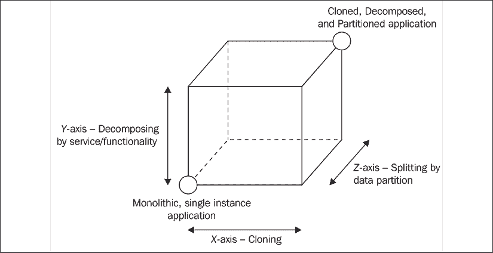

图 12.1：规模立方体

立方体的左下角（即 *X*-轴和 *Y*-轴的交点）表示应用具有所有功能在一个代码库中，并且在一个实例上运行。这是我们通常所说的**单体应用**。这对于处理小工作量或在开发早期阶段的应用来说是一个常见的情况。对于一个单体应用，有三种不同的扩展策略。通过观察规模立方体，这些策略被表示为沿着立方体的不同轴（*X*、*Y* 和 *Z*）的增长：

+   **X**-轴 — 克隆：单体、未扩展应用的直观演变是沿着 *X*-轴向右移动，这很简单，大多数情况下成本较低（从开发成本的角度来看），并且非常有效。这种技术背后的原理很简单，即克隆相同的应用程序 *n* 次，让每个实例处理 1/*n* 的工作量。

+   **Y**-轴 — 通过服务/功能分解：沿着 *Y*-轴进行扩展意味着根据应用的功能、服务或用例来分解应用。在这个例子中，“分解”意味着创建不同的、独立的程序，每个程序都有自己的代码库，可能还有自己的专用数据库，甚至还有独立的用户界面。

    例如，一个常见的情况是将负责管理的一部分应用与面向公众的产品分开。另一个例子是提取负责用户认证的服务，从而创建一个专门的认证服务器。

    根据功能拆分应用的标准主要取决于其业务需求、用例、数据以及许多其他因素，正如我们将在本章后面看到的那样。有趣的是，这是具有最大影响的扩展维度，不仅影响应用的架构，还影响其从开发和运营角度的管理方式。正如我们将看到的，“**微服务**”这个术语最常与细粒度的 *Y*-轴扩展相关联。

+   **Z 轴 — 数据分区划分**：最后一个缩放维度是*Z*轴，应用程序在这里被分割，使得每个实例只负责整个数据的一部分。这是一种在数据库中常用的技术，也称为**水平/垂直分区**。在这个配置中，有多个相同应用程序的实例，每个实例都在处理数据的一个分区，分区是通过不同的标准确定的。

    例如，我们可以根据用户的国籍（*列表分区*）或根据他们姓氏的首字母（*范围分区*）来划分应用程序的用户，或者让哈希函数决定每个用户所属的分区（*哈希分区*）。

    然后，每个分区都可以分配给应用程序的特定实例。使用数据分区要求每个操作之前都有一个查找步骤，以确定哪个应用程序实例负责给定的数据项。正如我们所说的，数据分区通常在数据存储级别应用和处理，因为其主要目的是克服处理大型单体数据集（有限的磁盘空间、内存和网络容量）相关的问题。仅在复杂、分布式架构或非常特定的用例（例如，当构建依赖于自定义数据持久性解决方案的应用程序时，当使用不支持分区的数据库时，或当构建在谷歌规模的应用程序时）中，才值得考虑在应用级别应用它。考虑到其复杂性，在充分利用了扩展立方体的*X*和*Y*轴之后，才应考虑沿着*Z*轴扩展应用程序。

在接下来的章节中，我们将重点关注用于扩展 Node.js 应用程序的两种最常见和最有效的方法，即通过**功能/服务**进行**克隆**和**分解**。

# 克隆和负载均衡

传统的、多线程的 Web 服务器通常只有在分配给机器的资源无法再升级，或者这样做会涉及比简单地启动另一台机器更高的成本时，才会进行水平扩展。

通过使用多个线程，传统的 Web 服务器可以利用服务器的所有处理能力，使用所有可用的处理器和内存。相反，Node.js 应用程序因为是单线程的，通常比传统的 Web 服务器更早地进行扩展。即使在单机环境中，我们也需要找到方法来“扩展”应用程序，以便利用所有可用的资源。

在 Node.js 中，**垂直扩展**（向单个机器添加更多资源）和**水平扩展**（向基础设施添加更多机器）几乎是等效的概念：事实上，两者都涉及类似的技术来利用所有可用的处理能力。

不要被这种想法误导，认为这是缺点。相反，几乎被迫进行扩展对应用程序的其他属性有积极的影响，特别是可用性和容错性。实际上，通过克隆来扩展 Node.js 应用程序相对简单，即使没有收集更多资源的需要，也常常为了拥有冗余、容错的环境而实现。

这也促使开发者从应用程序的早期阶段就考虑可扩展性，确保应用程序不依赖于任何不能在多个进程或机器之间共享的资源。事实上，扩展应用程序的一个绝对前提是每个实例不需要在不能共享的资源上存储公共信息，例如内存或磁盘。例如，在 Web 服务器中，将会话数据存储在内存或磁盘上是不适合扩展的实践。相反，使用共享数据库将确保每个实例都可以访问相同的会话信息，无论它部署在哪里。

现在我们来介绍扩展 Node.js 应用程序最基本的方法：`cluster` 模块。

## `cluster` 模块

在 Node.js 中，将应用程序的负载分散到单台机器上运行的不同实例的最简单模式是使用 `cluster` 模块，它是核心库的一部分。`cluster` 模块简化了相同应用程序新实例的派生，并自动将进入的连接分配给它们，如图 *12.2* 所示：

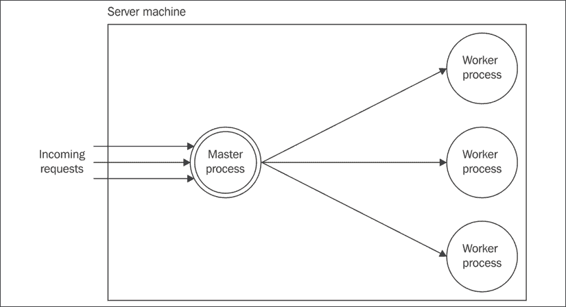

图 12.2：`cluster` 模块示意图

**主进程**负责启动多个进程（**工作者**），每个进程代表我们想要扩展的应用程序的一个实例。随后，每个进入的连接都会分配到克隆的工作者中，从而在它们之间分散负载。

由于每个工作者都是一个独立的进程，你可以使用这种方法来启动与系统可用 CPU 数量相同数量的工作者。使用这种方法，你可以轻松地让 Node.js 应用程序利用系统中的所有计算能力。

### 关于 `cluster` 模块行为的相关说明

在大多数系统中，`cluster` 模块使用显式的轮询负载均衡算法。该算法在主进程中使用，确保请求在所有工作者之间均匀分布。轮询调度默认在所有平台上启用，除了 Windows，可以通过设置变量 `cluster.schedulingPolicy` 并使用常量 `cluster.SCHED_RR`（轮询）或 `cluster.SCHED_NONE`（由操作系统处理）来全局修改。

轮询算法基于旋转方式在可用的服务器之间均匀分配负载。第一个请求被转发到第一个服务器，第二个请求转发到列表中的下一个服务器，依此类推。当到达列表的末尾时，迭代从开始处重新开始。在 `cluster` 模块中，轮询逻辑比传统实现要“聪明”一些。事实上，它增加了一些额外的行为，旨在避免给定的工作进程过载。

当我们使用 `cluster` 模块时，工作进程中对 `server.listen()` 的每次调用都会委托给主进程。这允许主进程接收所有传入的消息并将它们分配给工作进程池。`cluster` 模块使大多数用例中的委托过程变得非常简单，但也有一些边缘情况，在工作模块中调用 `server.listen()` 可能不会产生预期的结果：

+   `server.listen({fd})`: 如果工作进程使用特定的文件描述符进行监听，例如通过调用 `server.listen({fd: 17})`，此操作可能会产生意外的结果。文件描述符在进程级别进行映射，因此如果工作进程映射了一个文件描述符，这不会与主进程中的相同文件匹配。克服这种限制的一种方法是在主进程中创建文件描述符，然后将其传递给工作进程。这样，工作进程就可以使用主进程已知描述符来调用 `server.listen()`。

+   `server.listen(handle)`: 在工作进程中显式使用 `handle` 对象（`FileHandle`）进行监听将导致工作进程直接使用提供的句柄，而不是将操作委托给主进程。

+   `server.listen(0)`: 调用 `server.listen(0)` 通常会导致服务器监听随机端口。然而，在集群中，每个工作进程在每次调用 `server.listen(0)` 时都会收到相同的“随机”端口。换句话说，端口在第一次调用时是随机的；从第二次调用开始将是固定的。如果您希望每个工作进程都监听不同的随机端口，您必须自己生成端口号。

### 构建简单的 HTTP 服务器

现在我们开始工作在一个示例上。让我们构建一个小的 HTTP 服务器，使用 `cluster` 模块进行克隆和负载均衡。首先，我们需要一个可扩展的应用程序，对于这个例子，我们不需要太多，只需要一个非常基本的 HTTP 服务器。

因此，让我们创建一个名为 `app.js` 的文件，包含以下代码：

```js
import { createServer } from 'http'
const { pid } = process
const server = createServer((req, res) => {
  // simulates CPU intensive work
  let i = 1e7; while (i > 0) { i-- }
  console.log(`Handling request from ${pid}`)
  res.end(`Hello from ${pid}\n`)
})
server.listen(8080, () => console.log(`Started at ${pid}`)) 
```

我们刚刚构建的 HTTP 服务器通过发送包含其**进程标识符**（**PID**）的消息来响应任何请求；这对于识别正在处理请求的应用程序实例非常有用。在这个应用程序版本中，我们只有一个进程，所以响应和日志中看到的 PID 总是相同的。

此外，为了模拟一些实际的 CPU 工作，我们执行了一个空循环 1000 万次：没有这个，服务器的负载几乎可以忽略不计，并且从我们将要运行的基准测试中得出结论将非常困难。

我们在这里创建的`app`模块只是一个针对通用 Web 服务器的简单抽象。出于简洁考虑，我们没有使用 Express 或 Fastify 这样的 Web 框架，但请随意使用您选择的 Web 框架重写这些示例。

您现在可以通过像往常一样运行应用程序并发送一个请求到`http://localhost:8080`，使用浏览器或`curl`来检查所有操作是否按预期进行。

您还可以尝试测量服务器在一个进程上能够处理的每秒请求数。为此，您可以使用网络基准测试工具，例如`autocannon`（[nodejsdp.link/autocannon](http://nodejsdp.link/autocannon)）：

```js
npx autocannon -c 200 -d 10 http://localhost:8080 
```

之前的命令将在 10 秒内以 200 个并发连接加载服务器。作为一个参考，我们在我们的机器上（2.5 GHz 四核 Intel Core i7 使用 Node.js v14）得到的结果是每秒大约 300 个事务。

请记住，在本章中我们将进行的负载测试是故意简单和最小的，仅提供参考和学习目的。它们的结果不能提供对我们正在分析的各种技术性能的 100%准确评估。当您尝试优化一个真实的生产应用程序时，请确保在每次更改后都运行自己的基准测试。您可能会发现，在我们将要展示的不同技术中，有些可能比其他技术对您的特定应用程序更有效。

现在我们已经有一个简单的测试 Web 应用程序和一些参考基准，我们准备尝试一些技术来提高应用程序的性能。

### 使用集群模块进行扩展

让我们现在更新`app.js`，使用`cluster`模块来扩展我们的应用程序：

```js
import { createServer } from 'http'
import { cpus } from 'os'
import cluster from 'cluster'
if (cluster.isMaster) {                                    // (1)
  const availableCpus = cpus()
  console.log(`Clustering to ${availableCpus.length} processes`)
  availableCpus.forEach(() => cluster.fork())
} else {                                                   // (2)
  const { pid } = process
  const server = createServer((req, res) => {
    let i = 1e7; while (i > 0) { i-- }
    console.log(`Handling request from ${pid}`)
    res.end(`Hello from ${pid}\n`)
  })
  server.listen(8080, () => console.log(`Started at ${pid}`))
} 
```

如我们所见，使用`cluster`模块几乎不需要做任何工作。让我们分析一下正在发生的事情：

1.  当我们从命令行启动`app.js`时，我们实际上是在执行主进程。在这种情况下，`cluster.isMaster`变量被设置为`true`，我们唯一需要做的工作是使用`cluster.fork()`来分叉当前进程。在前面的例子中，我们启动了与系统中逻辑 CPU 核心数量相同的工人，以充分利用所有可用的处理能力。

1.  当`cluster.fork()`从主进程执行时，当前模块（`app.js`）再次运行，但这次是在工作模式（`cluster.isWorker`设置为`true`，而`cluster.isMaster`设置为`false`）。当应用程序作为工作进程运行时，它可以开始做一些实际的工作。在这种情况下，它启动了一个新的 HTTP 服务器。

重要的是要记住，每个工作进程都是一个具有自己的事件循环、内存空间和加载的模块的不同 Node.js 进程。

有趣的是，`cluster` 模块的使用基于一个重复出现的模式，这使得运行应用程序的多个实例变得非常容易：

```js
if (cluster.isMaster) {
  // fork()
} else {
  // do work
} 
```

在底层，`cluster.fork()` 函数使用 `child_process.fork()` API，因此，我们也在主进程和工作者进程之间有一个可用的通信通道。工作者进程可以通过变量 `cluster.workers` 访问，所以向所有这些进程广播消息就像运行以下代码行一样简单：

```js
Object.values(cluster.workers).forEach(worker => worker.send('Hello from the master')) 
```

现在，让我们尝试以集群模式运行我们的 HTTP 服务器。如果我们的机器有多个核心，我们应该看到主进程依次启动了多个工作者进程。例如，在一个有四个逻辑核心的系统上，终端应该看起来像这样：

```js
Started 14107
Started 14099
Started 14102
Started 14101 
```

如果我们现在再次尝试使用 URL `http://localhost:8080` 来访问我们的服务器，我们应该注意到每个请求都会返回一个包含不同 PID 的消息，这意味着这些请求是由不同的工作者处理的，这证实了负载正在它们之间分配。

现在，我们可以再次尝试对我们的服务器进行负载测试：

```js
npx autocannon -c 200 -d 10 http://localhost:8080 
```

这样，我们应该能够发现通过扩展我们的应用程序到多个进程所获得的性能提升。作为一个参考，在我们的机器上，我们看到了大约 3.3 倍的性能提升（1,000 交易/秒与 300 交易/秒相比）。

### 使用集群模块实现弹性和可用性

因为工作者都是独立的进程，所以可以根据程序的需求将它们杀死或重新启动，而不会影响其他工作者。只要还有一些工作者仍然存活，服务器将继续接受连接。如果没有工作者存活，现有的连接将被丢弃，新的连接将被拒绝。Node.js 不会自动管理工作者数量；然而，管理工作者池的责任在于应用程序根据其自身需求进行。

正如我们之前提到的，扩展应用程序也带来了其他优势，特别是能够在出现故障或崩溃的情况下保持一定水平的服务。这种特性也被称为 ****弹性****，它有助于提高系统的可用性。

通过启动同一应用程序的多个实例，我们创建了一个冗余系统，这意味着如果其中一个实例因为任何原因而关闭，我们仍然有其他实例准备好处理请求。使用 `cluster` 模块实现这种模式非常直接。让我们看看它是如何工作的！

让我们把上一节中的代码作为起点。特别是，让我们修改 `app.js` 模块，使其在随机的时间间隔后崩溃：

```js
// ...
} else {
  // Inside our worker block
  setTimeout(
    () => { throw new Error('Ooops') },
    Math.ceil(Math.random() * 3) * 1000
  )
  // ... 
```

实施这一更改后，我们的服务器在 1 到 3 秒之间的随机秒数后以错误退出。在现实情况下，这最终会导致我们的应用程序停止处理请求，除非我们使用一些外部工具来监控其状态并自动重启它。然而，如果我们只有一个实例，由于应用程序的启动时间，重启之间可能会有一个不可忽视的延迟。这意味着在这些重启期间，应用程序是不可用的。拥有多个实例将确保我们始终有一个备份进程来处理传入的请求，即使其中一个工作进程失败。

使用 `cluster` 模块，我们只需在检测到一个工作进程以错误代码终止时立即启动一个新的工作进程。让我们修改 `app.js` 以考虑这一点：

```js
// ...
if (cluster.isMaster) {
  // ...
  cluster.on('exit', (worker, code) => {
    if (code !== 0 && !worker.exitedAfterDisconnect) {
      console.log(
        `Worker ${worker.process.pid} crashed. ` +
        'Starting a new worker'
      )
      cluster.fork()
    }
  })
} else {
  // ...
} 
```

在前面的代码中，一旦主进程收到一个 `'exit'` 事件，我们就检查进程是因错误而有意终止还是意外终止。我们通过检查状态码和标志 `worker.exitedAfterDisconnect` 来做这件事，该标志指示工作进程是否被主进程明确终止。如果我们确认进程是因为错误而终止的，我们就启动一个新的工作进程。值得注意的是，虽然崩溃的工作进程被替换了，但其他工作进程仍然可以处理请求，因此不会影响应用程序的可用性。

为了测试这个假设，我们可以再次使用 `autocannon` 压力测试我们的服务器。当压力测试完成后，我们会在输出中的各种指标中注意到，也有关于失败次数的指示。在我们的案例中，它可能看起来像这样：

```js
[...]
8k requests in 10.07s, 964 kB read
674 errors (7 timeouts) 
```

这应该达到大约 92% 的可用性。请记住，这个结果可能会有很大的变化，因为它很大程度上取决于运行实例的数量以及它们在测试期间崩溃的次数，但它应该能给我们提供一个很好的指标，了解我们的解决方案是如何工作的。前面的数字告诉我们，尽管我们的应用程序不断崩溃，但我们只有 674 次失败的请求在 8,000 次点击中。

在我们刚刚构建的示例场景中，大多数失败的请求将是由崩溃期间已建立的连接中断引起的。不幸的是，我们几乎无法做些什么来防止这些类型的失败，尤其是在应用程序由于崩溃而终止的情况下。尽管如此，我们的解决方案证明是有效的，并且对于经常崩溃的应用程序来说，其可用性相当不错！

### 无中断重启

当我们想要向生产服务器发布新版本时，Node.js 应用程序可能也需要重启。因此，在这种场景下，拥有多个实例可以帮助保持我们应用程序的可用性。

当我们有意重启应用程序以更新它时，应用程序重启并无法处理请求的窗口很小。如果我们正在更新我们的个人博客，这可能可以接受，但对于具有**服务级别协议**（**SLA**）的专业应用程序，或者作为持续交付过程的一部分经常更新的应用程序来说，这甚至不是一个选项。解决方案是实现**零停机时间重启**，这样应用程序的代码更新不会影响其可用性。

使用`cluster`模块，这再次是一个相当简单的任务：模式涉及逐个重启工人。这样，剩余的工人可以继续运行并维护应用程序的服务可用。

让我们把这个新特性添加到我们的集群服务器中。我们只需要添加一些新代码，由主进程执行：

```js
import { once } from 'events'
// ...
if (cluster.isMaster) {
  // ...
  process.on('SIGUSR2', async () => {                        // (1)
    const workers = Object.values(cluster.workers)
    for (const worker of workers) {                          // (2)
      console.log(`Stopping worker: ${worker.process.pid}`)
      worker.disconnect()                                    // (2)
      await once(worker, 'exit')
      if (!worker.exitedAfterDisconnect) continue
      const newWorker = cluster.fork()                       // (4)
      await once(newWorker, 'listening')                     // (5)
    }
  })
} else {
  // ...
} 
```

这就是前面的代码块是如何工作的：

1.  工人的重启是在接收到`SIGUSR2`信号时触发的。请注意，我们正在使用`async`函数来实现事件处理器，因为我们在这里需要执行一些异步任务。

1.  当接收到`SIGUSR2`信号时，我们遍历`cluster.workers`对象的所有值。每个元素都是一个`worker`对象，我们可以用它来与当前在工人池中活动的特定工人进行交互。

1.  对于当前工人，我们首先调用`worker.disconnect()`，这会优雅地停止工人。这意味着如果工人目前正在处理请求，这将不会突然中断；相反，它将完成。只有当所有进行中的请求完成后，工人才会退出。

1.  当终止进程退出时，我们可以启动一个新的工人。

1.  在我们继续重启下一个工人之前，我们等待新工人准备好并监听新的连接。

由于我们的程序使用了 Unix 信号，它不会在 Windows 系统上正常工作（除非你正在使用 Windows 子系统中的 Linux）。信号是实现我们解决方案的最简单机制。然而，这并不是唯一的方法。实际上，其他方法包括监听来自套接字、管道或标准输入的命令。

现在，我们可以通过运行应用程序并发送`SIGUSR2`信号来测试我们的零停机时间重启。然而，我们首先需要获取主进程的 PID。以下命令可以用来从所有运行进程的列表中识别它：

```js
ps -af 
```

主进程应该是`node`进程集的父进程。一旦我们找到了我们想要的 PID，我们就可以向它发送信号：

```js
kill -SIGUSR2 <PID> 
```

现在，应用程序的输出应该显示如下：

```js
Restarting workers
Stopping worker: 19389
Started 19407
Stopping worker: 19390
Started 19409 
```

我们可以再次尝试使用`autocannon`来验证在工人重启期间，我们没有对我们的应用程序的可用性产生任何重大影响。

`pm2`（[nodejsdp.link/pm2](http://nodejsdp.link/pm2)）是一个基于`cluster`的小型实用工具，它提供了负载均衡、进程监控、零停机时间重启和其他优点。

## 处理有状态通信

`cluster`模块在有状态通信中表现不佳，其中应用程序状态没有在各个实例之间共享。这是因为属于同一有状态会话的不同请求可能由应用程序的不同实例处理。这不仅仅是一个`cluster`模块的问题，但一般来说，它适用于任何无状态、负载均衡算法。例如，考虑*图 12.3*中描述的情况：

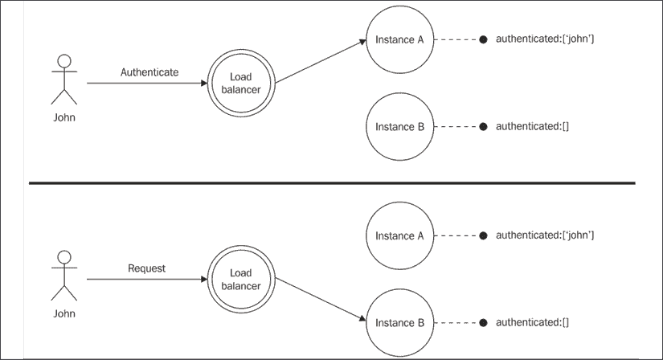

图 12.3：负载均衡器后有状态应用程序的一个示例问题

用户**John**最初向我们的应用程序发送请求以进行身份验证，但操作结果是在本地注册的（例如，在内存中），因此只有接收身份验证请求的应用程序实例（**实例 A**）知道 John 已成功认证。当 John 发送新的请求时，负载均衡器可能会将其转发到应用程序的不同实例，而这个实例实际上没有 John 的认证详情，因此拒绝执行操作。我们刚刚描述的应用程序不能按原样扩展，但幸运的是，我们可以应用两个简单的解决方案来解决这个问题。

### 在多个实例之间共享状态

使用有状态通信扩展应用程序的第一个选择是在所有实例之间共享状态。

这可以通过使用共享数据存储轻松实现，例如，例如，像 PostgreSQL（[nodejsdp.link/postgresql](http://nodejsdp.link/postgresql)）、MongoDB（[nodejsdp.link/mongodb](http://nodejsdp.link/mongodb)）或 CouchDB（[nodejsdp.link/couchdb](http://nodejsdp.link/couchdb)）这样的数据库，或者，更好的是，我们可以使用内存存储，如 Redis（[nodejsdp.link/redis](http://nodejsdp.link/redis)）或 Memcached（[nodejsdp.link/memcached](http://nodejsdp.link/memcached)）。

*图 12.4*概述了这个简单而有效的解决方案：

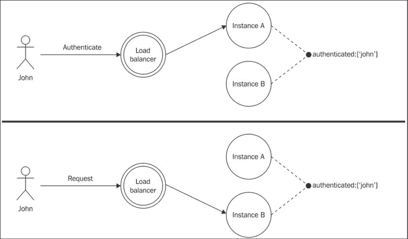

图 12.4：使用共享数据存储的负载均衡器后的应用程序

使用共享存储进行通信状态的唯一缺点是，应用此模式可能需要大量重构代码库。例如，我们可能正在使用一个将通信状态保存在内存中的现有库，因此我们必须找出如何配置、替换或重新实现这个库以使用共享存储。

在重构可能不可行的情况下，例如，因为需要太多更改或对提高应用程序可扩展性有严格的时间限制，我们可以依赖一个不那么侵入性的解决方案：**粘性负载均衡**（或**粘性会话**）。

### 粘性负载均衡

我们支持有状态通信的另一种替代方案是让负载均衡器始终将所有与会话关联的请求路由到应用程序的同一实例。这种技术也称为**粘性负载均衡**。

*图 12.5*展示了涉及此技术的简化场景：

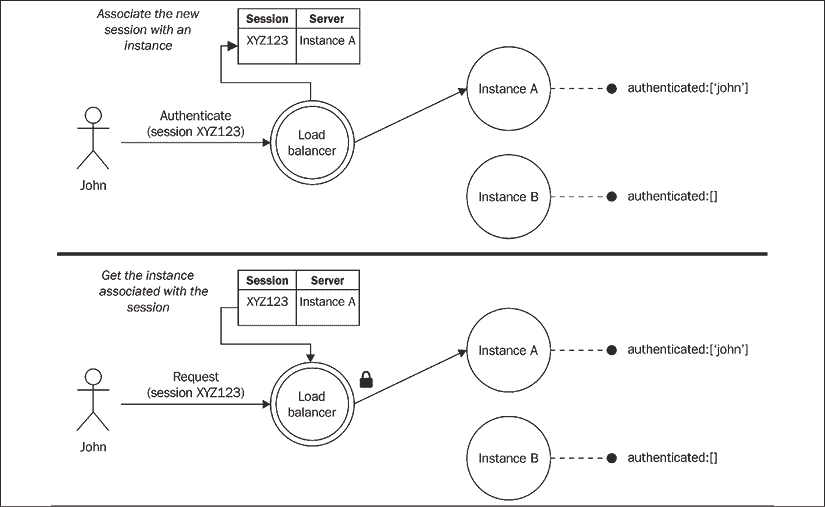

图 12.5：说明粘性负载均衡工作原理的示例

如*图 12.5*所示，当负载均衡器接收到与新的会话相关联的请求时，它会通过负载均衡算法选择一个特定的实例创建一个映射。下一次负载均衡器接收到来自同一会话的请求时，它会绕过负载均衡算法，选择之前与该会话关联的应用实例。我们刚才描述的特定技术涉及检查与请求关联的会话 ID（通常由应用程序或负载均衡器本身包含在 cookie 中）。

将有状态的连接关联到单个服务器的简单替代方案是使用执行请求的客户端的 IP 地址。通常，IP 地址提供给哈希函数，该函数生成一个代表指定接收请求的应用实例的 ID。这种技术的优点是不需要负载均衡器记住关联。然而，它不适用于经常更改 IP 的设备，例如在不同网络上漫游时。

默认情况下，`cluster`模块不支持粘性负载均衡，但可以通过名为`sticky-session`的 npm 库添加（[nodejsdp.link/sticky-session](http://nodejsdp.link/sticky-session)）。

粘性负载均衡的一个大问题是它抵消了具有冗余系统的大多数优势，其中所有应用程序的实例都是相同的，并且一个实例最终可以替换停止工作的另一个实例。出于这些原因，建议始终尝试避免粘性负载均衡并构建在共享存储中维护会话状态的应用程序。或者，在可行的情况下，可以尝试构建根本不需要有状态通信的应用程序；例如，通过在请求本身中包含状态。 

对于需要粘性负载均衡的库的实际示例，我们可以提到 Socket.IO ([nodejsdp.link/socket-io](http://nodejsdp.link/socket-io))。

## 使用反向代理进行扩展

`cluster`模块虽然非常方便且易于使用，但并不是我们扩展 Node.js Web 应用程序的唯一选择。在高度可用的生产环境中，传统技术通常更受欢迎，因为它们提供了更多的控制和能力。

使用`cluster`的替代方案是启动多个相同应用的单例实例，这些实例在不同的端口或机器上运行，然后使用一个**反向代理**（或网关）来提供对这些实例的访问，并将流量分配到它们之间。在这种配置中，我们没有将请求分配给一组工作进程的主进程，而是一组在相同机器上运行的不同进程（使用不同的端口）或在网络内部不同机器上分散的进程。为了提供一个单一的应用程序访问点，我们可以使用反向代理，这是一种放置在客户端和我们的应用程序实例之间的特殊设备或服务，它接受任何请求并将其转发到目标服务器，然后将结果返回给客户端，就像它本身是原始源一样。在这种情况下，反向代理也被用作负载均衡器，在应用程序的实例之间分配请求。

对于反向代理和正向代理之间差异的清晰解释，您可以参考 Apache HTTP 服务器文档在[nodejsdp.link/forward-reverse](http://nodejsdp.link/forward-reverse)。

*图 12.6*显示了具有反向代理作为前端负载均衡器的典型多进程、多机配置：

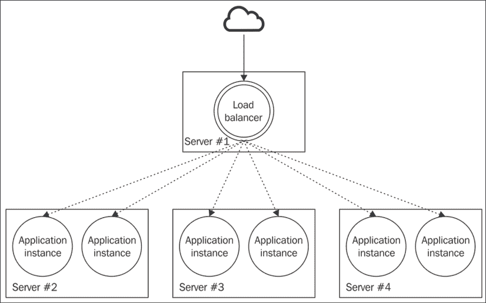

图 12.6：具有反向代理作为负载均衡器的典型多进程、多机配置

对于 Node.js 应用程序，有许多原因选择这种方法而不是`cluster`模块：

+   反向代理可以在多台机器之间分配负载，而不仅仅是多个进程。

+   市场上最受欢迎的反向代理支持开箱即用的粘性负载均衡。

+   反向代理可以将请求路由到任何可用的服务器，无论其编程语言或平台如何。

+   我们可以选择更强大的负载均衡算法。

+   许多反向代理提供额外的强大功能，例如 URL 重写、缓存、SSL 终止点、安全功能（例如，拒绝服务保护），甚至可以用于例如服务静态文件的完整功能的 Web 服务器。

话虽如此，如果需要，`cluster`模块也可以很容易地与反向代理结合使用，例如，通过使用`cluster`在单个机器内部进行垂直扩展，然后使用反向代理在不同节点之间进行水平扩展。

**模式**

使用反向代理平衡运行在不同端口或机器上的多个实例的应用程序的负载。

我们有许多选项可以使用反向代理实现负载均衡。以下是最受欢迎的解决方案列表：

+   **Nginx**([nodejsdp.link/nginx](http://nodejsdp.link/nginx))：这是一个基于非阻塞 I/O 模型的 Web 服务器、反向代理和负载均衡器。

+   **HAProxy**([nodejsdp.link/haproxy](http://nodejsdp.link/haproxy))：这是一个用于 TCP/HTTP 流量的快速负载均衡器。

+   **基于 Node.js 的代理**：在 Node.js 中实现反向代理和负载均衡器有许多解决方案。这可能会带来优势和劣势，我们将在稍后看到。

+   **基于云的代理**：在云计算时代，利用负载均衡器作为服务并不罕见。这可能会很方便，因为它需要最少的维护，通常具有高度的扩展性，有时它还可以支持动态配置，以实现按需扩展性。

在本章接下来的几节中，我们将分析使用 Nginx 的一个示例配置。稍后，我们将使用 Node.js 来构建我们自己的负载均衡器！

### 使用 Nginx 进行负载均衡

为了让您了解反向代理是如何工作的，我们将现在基于 Nginx 构建一个可扩展的架构，但首先，我们需要安装它。我们可以通过遵循 [nodejsdp.link/nginx-install](http://nodejsdp.link/nginx-install) 中的说明来完成此操作。

在最新的 Ubuntu 系统上，您可以使用命令 `sudo apt-get install nginx` 快速安装 Nginx。在 macOS 上，您可以使用 `brew` ([nodejsdp.link/brew](http://nodejsdp.link/brew))：`brew install nginx`。请注意，对于以下示例，我们将使用写作时的最新版本的 Nginx（1.17.10）。

由于我们不会使用 `cluster` 来启动我们服务器的多个实例，因此我们需要稍微修改我们应用程序的代码，以便我们可以使用命令行参数指定监听端口。这将允许我们在不同的端口上启动多个实例。让我们考虑我们示例应用程序的主要模块（`app.js`）：

```js
import { createServer } from 'http'
const { pid } = process
const server = createServer((req, res) => {
  let i = 1e7; while (i > 0) { i-- }
  console.log(`Handling request from ${pid}`)
  res.end(`Hello from ${pid}\n`)
})
const port = Number.parseInt(
  process.env.PORT || process.argv[2]
) || 8080
server.listen(port, () => console.log(`Started at ${pid}`)) 
```

与我们网络服务器的第一个版本相比，这个版本唯一的区别是，在这里，我们通过 `PORT` 环境变量或命令行参数来使端口号可配置。这是必要的，因为我们希望能够启动多个服务器实例，并允许它们监听不同的端口。

另一个重要的特性，没有 `cluster` 我们将无法使用，就是在崩溃情况下的自动重启。幸运的是，这很容易通过使用专门的监控器来解决，即一个外部进程，它会监控我们的应用程序并在必要时重启它。以下是一些可能的选择：

+   基于 Node.js 的监控器，例如 **forever** ([nodejsdp.link/forever](http://nodejsdp.link/forever)) 或 **pm2** ([nodejsdp.link/pm2](http://nodejsdp.link/pm2))。

+   基于 OS 的监控器，例如 **systemd** ([nodejsdp.link/systemd](http://nodejsdp.link/systemd)) 或 **runit** ([nodejsdp.link/runit](http://nodejsdp.link/runit))。

+   更高级的监控解决方案，例如 **monit** ([nodejsdp.link/monit](http://nodejsdp.link/monit)) 或 **supervisord** ([nodejsdp.link/supervisord](http://nodejsdp.link/supervisord))。

+   基于容器的运行时，例如 **Kubernetes** ([nodejsdp.link/kubernetes](http://nodejsdp.link/kubernetes))、**Nomad** ([nodejsdp.link/nomad](http://nodejsdp.link/nomad)) 或 **Docker Swarm** ([nodejsdp.link/swarm](http://nodejsdp.link/swarm))。

对于这个示例，我们将使用 `forever`，这是最简单、最直接的方法。我们可以通过运行以下命令全局安装它：

```js
npm install forever -g 
```

下一步是启动我们应用程序的四个实例，所有实例都在不同的端口上运行，并由 `forever` 监督：

```js
forever start app.js 8081
forever start app.js 8082
forever start app.js 8083
forever start app.js 8084 
```

我们可以使用以下命令检查已启动的进程列表：

```js
forever list 
```

你可以使用 `forever stopall` 停止之前使用 `forever` 启动的所有 Node.js 进程。或者，你可以使用 `forever stop <id>` 停止 `forever list` 显示的特定进程。

现在，是时候配置 Nginx 服务器作为负载均衡器了。

首先，我们需要在我们的工作目录中创建一个最小的配置文件，我们将称之为 `nginx.conf`。

注意，由于 Nginx 允许你在同一个服务器实例后面运行多个应用程序，因此更常见的是使用全局配置文件。在 Unix 系统中，这个配置文件通常位于 `/usr/local/nginx/conf`、`/etc/nginx` 或 `/usr/local/etc/nginx` 之下。在这里，我们在我们的工作目录中有一个配置文件，我们采取了一种更简单的方法。对于这个演示来说，这是可以的，因为我们只想在本地上运行一个应用程序，但我们建议你在生产部署中遵循推荐的最佳实践。

接下来，让我们编写 `nginx.conf` 文件并应用以下配置，这是获取一个可工作的负载均衡器所需的最小配置：

```js
daemon off;                                                ## (1)
error_log /dev/stderr info;                                ## (2)
events {                                                   ## (3)
  worker_connections 2048;
}
http {                                                     ## (4)
  access_log /dev/stdout;
  upstream my-load-balanced-app {
    server 127.0.0.1:8081;
    server 127.0.0.1:8082;
    server 127.0.0.1:8083;
    server 127.0.0.1:8084;
  }
  server {
    listen 8080;
    location / {
      proxy_pass http://my-load-balanced-app;
    }
  }
} 
```

让我们一起来讨论这个配置：

1.  声明 `daemon off` 允许我们以当前非特权用户身份运行 Nginx 作为独立进程，并保持进程在当前终端的前台运行（这允许我们使用 Ctrl + C 来关闭它）。

1.  我们使用 `error_log`（稍后在 `http` 块中，`access_log`）将错误日志和访问日志分别流式传输到标准输出和标准错误，这样我们就可以实时从我们的终端读取日志。

1.  `events` 块允许我们配置 Nginx 如何管理网络连接。在这里，我们正在设置 Nginx 工作进程可以打开的最大并发连接数为 `2048`。

1.  `http` 块允许我们定义特定应用程序的配置。在 `upstream my-load-balanced-app` 部分中，我们正在定义用于处理网络请求的后端服务器列表。在 `server` 部分中，我们使用 `listen 8080` 指示服务器监听端口 `8080`，最后，我们指定了 `proxy_pass` 指令，它本质上告诉 Nginx 将任何请求转发到我们之前定义的服务器组（`my-load-balanced-app`）。

就这些了！现在，我们只需要使用以下命令启动 Nginx，并使用我们的配置文件：

```js
nginx -c ${PWD}/nginx.conf 
```

我们的系统现在应该已经启动并运行，准备好接受请求并在我们的 Node.js 应用程序的四个实例之间平衡流量。只需将你的浏览器指向地址`http://localhost:8080`，就可以看到我们的 Nginx 服务器如何平衡流量。你也可以再次尝试使用`autocannon`对这个应用程序进行负载测试。由于我们仍然在一个本地机器上运行所有进程，你的结果应该不会与使用`cluster`模块方法进行基准测试时得到的结果相差太大。

这个示例演示了如何使用 Nginx 进行流量均衡。为了简单起见，我们将所有内容都保留在我们的机器上，但这仍然是一个很好的练习，让我们为在多个远程服务器上部署应用程序做好准备。如果你想尝试这样做，你基本上必须遵循以下步骤：

1.  配置*n*个运行 Node.js 应用程序的后端服务器（通过使用像`forever`这样的服务监控器运行多个实例，或者使用`cluster`模块）。

1.  配置一个安装了 Nginx 并具有所有必要配置以将流量路由到*n*个后端服务器的负载均衡器机器。每个服务器上的每个进程都应该使用网络中各种机器的正确地址列在你的 Nginx 配置文件的`upstream`块中。

1.  通过使用公共 IP 地址和可能的一个公共域名，使你的负载均衡器在互联网上公开可用。

1.  尝试使用浏览器或像`autocannon`这样的基准测试工具向负载均衡器的公共地址发送一些流量。

为了简单起见，你可以通过在云提供商的管理界面中启动服务器，并使用 SSH 登录到这些服务器来手动执行所有这些步骤。或者，你也可以选择允许你通过编写**基础设施即代码**（如**Terraform** ([nodejsdp.link/terraform](http://nodejsdp.link/terraform))）、**Ansible** ([nodejsdp.link/ansible](http://nodejsdp.link/ansible))和**Packer** ([nodejsdp.link/packer](http://nodejsdp.link/packer)))来自动化这些任务的工具。

在这个示例中，我们使用了预定义的后端服务器数量。在下一节中，我们将探讨一种技术，它允许我们将流量均衡到一组动态的后端服务器。

## 动态水平扩展

现代基于云的基础设施的一个重要优势是能够根据当前的或预测的流量动态调整应用程序的容量。这也被称为**动态扩展**。如果实施得当，这种做法可以极大地降低 IT 基础设施的成本，同时仍然保持应用程序的高度可用性和响应性。

简单来说：如果我们的应用程序因流量峰值导致性能下降，系统会自动启动新服务器以应对增加的负载。同样，如果我们看到分配的资源利用率不足，我们可以关闭一些服务器以降低运行基础设施的成本。我们还可以决定根据计划执行扩展操作；例如，我们可以在我们知道流量较轻的某些时段关闭一些服务器，并在高峰时段前再次启动它们。这些机制要求负载均衡器始终了解当前的网络安全拓扑，知道任何时刻哪个服务器是启动的。

### 使用服务注册表

解决此问题的常见模式是使用一个称为**服务注册表**的中央存储库，它跟踪运行的服务器和它们提供的服务。

*图 12.7*展示了具有前端负载均衡器的多服务架构，使用服务注册表动态配置：

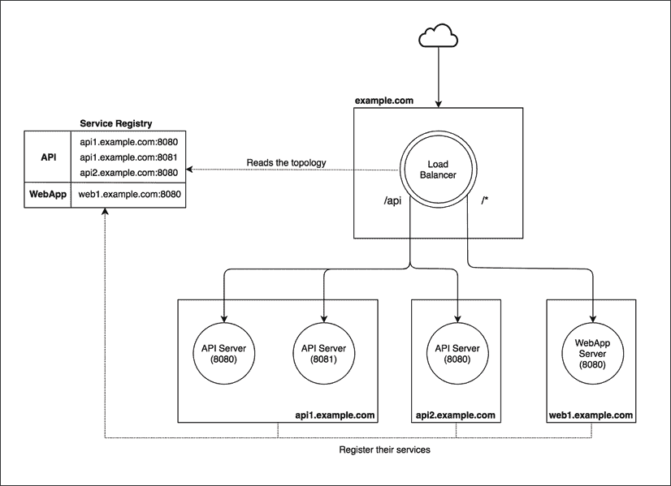

图 12.7：一个具有前端负载均衡器的多服务架构，使用服务注册表动态配置

*图 12.7*中的架构假设存在两个服务，**API**和**WebApp**。每个服务可以有一个或多个实例，分布在不同服务器上。

当接收到对`example.com`的请求时，负载均衡器检查请求路径的前缀。如果前缀是`/api`，则请求在**API**服务的可用实例之间进行负载均衡。在*图 12.7*中，我们有两个实例在服务器`api1.example.com`上运行，一个实例在`api2.example.com`上运行。对于所有其他路径前缀，请求在**WebApp**服务的可用实例之间进行负载均衡。在图中，我们只有一个**WebApp**实例，它在服务器`web1.example.com`上运行。负载均衡器使用服务注册表获取每个服务器上运行的列表和服务器上的服务实例。

为了实现完全自动化，每个应用程序实例在上线时必须将自己注册到服务注册表，并在停止时注销自己。这样，负载均衡器总能有一个最新的服务器和网络上可用的服务视图。

**模式（服务注册表**）

使用中央存储库存储系统中的服务器和服务的始终最新的视图。

虽然这种模式对负载均衡流量很有用，但它还有一个额外的优点，即能够将服务实例与其运行的服务器解耦。我们可以将服务注册表模式视为将服务定位器设计模式应用于网络服务的一种实现。

### 使用 http-proxy 和 Consul 实现动态负载均衡器

为了支持动态网络基础设施，我们可以使用像**Nginx**或**HAProxy**这样的反向代理：我们只需要使用自动化的服务更新它们的配置，然后强制负载均衡器选择更改。对于 Nginx，可以使用以下命令行来完成：

```js
nginx -s reload 
```

使用基于云的解决方案也可以达到相同的结果，但我们还有一个第三种更熟悉的替代方案，它利用了我们最喜欢的平台。

我们都知道 Node.js 是构建任何类型网络应用的优秀工具，正如我们在本书中所述，这正是其主要设计目标之一。那么，为什么不只用 Node.js 来构建负载均衡器呢？这将给我们带来更多的自由和权力，并允许我们将任何类型的模式或算法直接实现到我们自定义构建的负载均衡器中，包括我们现在将要探索的：使用服务注册表的动态负载均衡。此外，完成这个练习肯定能帮助我们更好地理解像 Nginx 和 HAProxy 这样的生产级产品实际上是如何工作的。

在这个例子中，我们将使用**Consul** ([nodejsdp.link/consul](http://nodejsdp.link/consul))作为服务注册表来复制我们在*图 12.7*中看到的多元服务架构。为此，我们将主要使用三个 npm 包：

+   `http-proxy` ([nodejsdp.link/http-proxy](http://nodejsdp.link/http-proxy))：在 Node.js 中简化反向代理/负载均衡器的创建

+   `portfinder` ([nodejsdp.link/portfinder](http://nodejsdp.link/portfinder))：在系统中查找一个空闲端口

+   `consul` ([nodejsdp.link/consul-lib](http://nodejsdp.link/consul-lib))：用于与 Consul 交互

让我们先实现我们的服务。这些是像我们之前用来测试`cluster`和 Nginx 的简单 HTTP 服务器，但这次，我们希望每个服务器在启动时将自己注册到服务注册表中。

让我们看看这个样子（文件`app.js`）：

```js
import { createServer } from 'http'
import consul from 'consul'
import portfinder from 'portfinder'
import { nanoid } from 'nanoid'
const serviceType = process.argv[2]
const { pid } = process
async function main () {
  const consulClient = consul()
  const port = await portfinder.getPortPromise()            // (1)
  const address = process.env.ADDRESS || 'localhost'
  const serviceId = nanoid()
  function registerService () {                             // (2)
    consulClient.agent.service.register({
      id: serviceId,
      name: serviceType,
      address,
      port,
      tags: [serviceType]
    }, () => {
      console.log(`${serviceType} registered successfully`)
    })
  }
  function unregisterService (err) {                        // (3)
    err && console.error(err)
    console.log(`deregistering ${serviceId}`)
    consulClient.agent.service.deregister(serviceId, () => {
      process.exit(err ? 1 : 0)
    })
  }
  process.on('exit', unregisterService)                     // (4)
  process.on('uncaughtException', unregisterService)
  process.on('SIGINT', unregisterService)
  const server = createServer((req, res) => {               // (5)
    let i = 1e7; while (i > 0) { i-- }
    console.log(`Handling request from ${pid}`)
    res.end(`${serviceType} response from ${pid}\n`)
  })
  server.listen(port, address, () => {
    registerService()
    console.log(`Started ${serviceType} at ${pid} on port ${port}`)
  })
}
main().catch((err) => {
  console.error(err)
  process.exit(1)
}) 
```

在前面的代码中，有一些部分值得我们注意：

1.  首先，我们使用`portfinder.getPortPromise()`来发现系统中的一个空闲端口（默认情况下，`portfinder`从端口`8000`开始搜索）。我们还允许用户根据环境变量`ADDRESS`来配置地址。最后，我们使用`nanoid` ([nodejsdp.link/nanoid](http://nodejsdp.link/nanoid))生成一个随机 ID 来识别这个服务。

1.  接下来，我们声明`registerService()`函数，该函数使用`consul`库在注册表中注册一个新的服务。服务定义需要几个属性：`id`（服务的唯一标识符）、`name`（标识服务的通用名称）、`address`和`port`（用于标识如何访问服务），以及`tags`（一个可选的标签数组，可以用于过滤和分组服务）。我们使用`serviceType`（我们从命令行参数中获取）来指定服务名称并添加一个标签。这将使我们能够识别集群中所有相同类型的可用服务。

1.  在这一点上，我们定义了一个名为`unregisterService()`的函数，它允许我们从 Consul 中移除我们刚刚注册的服务。

1.  我们使用`unregisterService()`作为清理函数，以便当程序关闭（无论是故意还是意外）时，服务将从 Consul 中注销。

1.  最后，我们在`portfinder`发现的端口和为当前服务配置的地址上启动我们的服务的 HTTP 服务器。请注意，当服务器启动时，我们确保调用`registerService()`函数以确保服务已注册以供发现。

使用这个脚本，我们将能够启动和注册不同类型的应用程序。

现在，是时候实现负载均衡器了。让我们通过创建一个新的模块`loadBalancer.js`来实现它：

```js
import { createServer } from 'http'
import httpProxy from 'http-proxy'
import consul from 'consul'
const routing = [                                            // (1)
  {
    path: '/api',
    service: 'api-service',
    index: 0
  },
  {
    path: '/',
    service: 'webapp-service',
    index: 0
  }
]
const consulClient = consul()                                // (2)
const proxy = httpProxy.createProxyServer()
const server = createServer((req, res) => {
  const route = routing.find((route) =>                      // (3)
    req.url.startsWith(route.path))
  consulClient.agent.service.list((err, services) => {       // (4)
    const servers = !err && Object.values(services)
      .filter(service => service.Tags.includes(route.service))
    if (err || !servers.length) {
      res.writeHead(502)
      return res.end('Bad gateway')
    }
    route.index = (route.index + 1) % servers.length         // (5)
    const server = servers[route.index]
    const target = `http://${server.Address}:${server.Port}`
    proxy.web(req, res, { target })
  })
})
server.listen(8080, () => {
  console.log('Load balancer started on port 8080')
}) 
```

这就是我们如何实现基于 Node.js 的负载均衡器：

1.  首先，我们定义我们的负载均衡器路由。`routing`数组中的每个项目都包含用于处理映射`path`上到达的请求的`service`。`index`属性将用于对特定服务的请求进行**轮询**。

1.  我们需要实例化一个`consul`客户端，以便我们可以访问注册表。接下来，我们实例化一个`http-proxy`服务器。

1.  在服务器的请求处理器中，我们首先做的事情是将 URL 与我们的路由表进行匹配。结果将是一个包含服务名称的描述符。

1.  我们从`consul`获取实现所需服务的服务器列表。如果这个列表为空或者获取列表时发生错误，那么我们将错误返回给客户端。我们使用`Tags`属性来过滤所有可用的服务，并找到实现当前服务类型的服务器地址。

1.  最后，我们可以将请求路由到其目的地。我们更新`route.index`以指向列表中的下一个服务器，采用轮询的方式。然后我们使用索引从列表中选择一个服务器，将其传递给`proxy.web()`，同时传递请求（`req`）和响应（`res`）对象。这将简单地将请求转发到我们选择的服务器。

现在已经很清楚，仅使用 Node.js 和服务注册表就可以实现负载均衡器是多么简单，以及通过这种方式我们可以获得多少灵活性。

注意，为了保持实现简单，我们故意省略了一些有趣的优化机会。例如，在这个实现中，我们每次请求都会查询`consul`以获取注册服务的列表。这可能会增加显著的开销，尤其是如果我们的负载均衡器以高频率接收请求时。更有效的方法是缓存服务列表，并定期刷新它（例如，每 10 秒刷新一次）。另一个优化可能是使用`cluster`模块来运行我们负载均衡器的多个实例，并将负载分配到机器的所有可用核心上。

现在，我们应该准备好尝试我们的系统，但首先，让我们按照官方文档在[nodejsdp.link/consul-install](http://nodejsdp.link/consul-install)中的说明来安装 Consul 服务器。

这允许我们在开发机器上使用以下简单的命令行启动 Consul 服务注册：

```js
consul agent -dev 
```

现在，我们准备好启动负载均衡器（使用`forever`确保在崩溃的情况下应用程序会重新启动）：

```js
forever start loadBalancer.js 
```

现在，如果我们尝试访问负载均衡器暴露的一些服务，我们会注意到它返回了一个`HTTP 502`错误，因为我们还没有启动任何服务器。自己试一试：

```js
curl localhost:8080/api 
```

前一个命令应该返回以下输出：

```js
Bad Gateway 
```

如果我们启动我们服务的某些实例，情况将会改变，例如，两个`api-service`和一个`webapp-service`：

```js
forever start --killSignal=SIGINT app.js api-service
forever start --killSignal=SIGINT app.js api-service
forever start --killSignal=SIGINT app.js webapp-service 
```

现在，负载均衡器应该自动看到新的服务器，并开始在这些服务器之间分配请求。让我们用以下命令再次尝试：

```js
curl localhost:8080/api 
```

前一个命令现在应该返回以下内容：

```js
api-service response from 6972 
```

再次运行这个命令后，我们应该现在收到来自另一个服务器的消息，确认请求正在不同服务器之间均匀分配：

```js
api-service response from 6979 
```

如果你想查看`forever`管理的实例并停止其中的一些，可以使用`forever list`和`forever stop`命令。要停止所有正在运行的实例，可以使用`forever stopall`。为什么不尝试停止`api-service`的一个运行实例，看看整个应用程序会发生什么？

这种模式的优点是立即的。现在，我们可以根据需求或计划动态地扩展我们的基础设施，而负载均衡器将自动根据新的配置进行调整，无需额外努力！

Consul 默认提供了一个方便的 Web UI，地址为`localhost:8500`。在玩这个示例时检查它，看看服务是如何在注册或注销时出现和消失的。

Consul 还提供健康检查功能来监控已注册的服务。这个功能可以集成到我们的示例中，使我们的基础设施对故障的抵抗能力更强。实际上，如果一个服务对健康检查没有响应，它会被自动从注册表中移除，因此，它将不再接收流量。如果你好奇如何实现这个功能，你可以查看官方文档中的*检查*部分，链接为[nodejsdp.link/consul-checks](http://nodejsdp.link/consul-checks)。

现在我们知道了如何使用负载均衡器和服务注册表执行动态负载均衡，我们准备探索一些有趣的替代方法，比如对等式负载均衡。

## 对等式负载均衡

当我们想要将复杂的内部网络架构暴露给公共网络，如互联网时，使用反向代理几乎是一种必要性。它有助于隐藏复杂性，提供了一个外部应用程序可以轻松使用并依赖的单一点访问。然而，如果我们需要扩展仅用于内部使用的服务，我们可以拥有更多的灵活性和控制。

让我们假设有一个服务，**服务 A**，它依赖于**服务 B**来实现其功能。**服务 B**在多台机器上进行了扩展，并且仅在内部网络中可用。我们到目前为止所学的是，**服务 A**将通过负载均衡器连接到**服务 B**，该负载均衡器将流量分发到所有实现**服务 B**的服务器。

然而，有一个替代方案。我们可以从画面中移除负载均衡器，并将请求直接从客户端（**服务 A**）分发出去，现在**服务 A**直接负责在其请求之间负载均衡**服务 B**的各种实例。这只有在**服务器 A**知道暴露**服务 B**的服务器细节的情况下才可能，在一个内部网络中，这通常是已知信息。采用这种方法，我们实际上是在实施**对等式负载均衡**。

*图 12.8*比较了我们刚刚描述的两个替代方案：

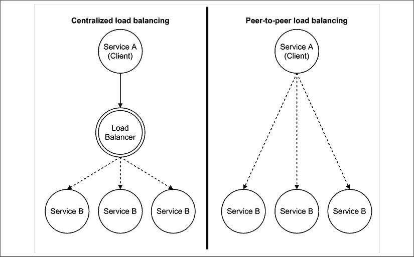

图 12.8：集中式负载均衡与对等式负载均衡

这是一个极其简单且有效的模式，它能够实现真正分布式的通信，没有瓶颈或单点故障。除此之外，它还具有以下特性：

+   通过移除网络节点来降低基础设施复杂性

+   由于消息将通过更少的节点传输，因此允许更快的通信

+   扩展性更好，因为性能不受负载均衡器处理能力的限制

另一方面，通过移除负载均衡器，我们实际上暴露了其底层基础设施的复杂性。此外，每个客户端都需要通过实现负载均衡算法，以及可能的方式保持其对基础设施的了解更新。

对等负载均衡是一种在 ZeroMQ ([nodejsdp.link/zeromq](http://nodejsdp.link/zeromq)) 库中广泛使用的模式，我们将在下一章中使用它。

在下一节中，我们将展示一个示例，实现 HTTP 客户端中的对等负载均衡。

### 实现一个可以跨多个服务器平衡请求的 HTTP 客户端

我们已经知道如何仅使用 Node.js 实现负载均衡器，并将传入的请求分布到可用服务器上，因此，在客户端实现相同的机制不应该有很大不同。实际上，我们只需要包装客户端 API，并为其添加负载均衡机制。请看以下模块（`balancedRequest.js`）：

```js
import { request } from 'http'
import getStream from 'get-stream'
const servers = [
  { host: 'localhost', port: 8081 },
  { host: 'localhost', port: 8082 }
]
let i = 0
export function balancedRequest (options) {
  return new Promise((resolve) => {
    i = (i + 1) % servers.length
    options.hostname = servers[i].host
    options.port = servers[i].port
    request(options, (response) => {
      resolve(getStream(response))
    }).end()
  })
} 
```

前面的代码非常简单，不需要太多解释。我们包装了原始的`http.request` API，使其能够使用轮询算法从可用服务器列表中选择那些来覆盖请求的`hostname`和`port`。请注意，为了简单起见，我们使用了`get-stream`模块 ([nodejsdp.link/get-stream](http://nodejsdp.link/get-stream)) 来“累积”响应流到一个缓冲区，该缓冲区将包含完整的响应体。

新的包装 API 可以无缝使用（`client.js`）：

```js
import { balancedRequest } from './balancedRequest.js'
async function main () {
  for (let i = 0; i < 10; i++) {
    const body = await balancedRequest({
      method: 'GET',
      path: '/'
    })
    console.log(`Request ${i} completed:`, body)
  }
}
main().catch((err) => {
  console.error(err)
  process.exit(1)
}) 
```

要运行前面的代码，我们必须启动两个样本服务器实例：

```js
node app.js 8081
node app.js 8082 
```

这后面跟着我们刚刚构建的客户端应用程序：

```js
node client.js 
```

我们应该注意，每个请求都发送到不同的服务器，这证实我们现在能够在不使用专用负载均衡器的情况下进行负载均衡！

对我们之前创建的包装器的一个明显改进是将服务注册表直接集成到客户端，并动态获取服务器列表。

在下一节中，我们将探讨容器和容器编排领域，并了解在这个特定上下文中，运行时如何接管许多可扩展性问题。

## 使用容器扩展应用程序

在本节中，我们将演示如何使用容器和容器编排平台，如 Kubernetes，帮助我们编写更简单的 Node.js 应用程序，这些应用程序可以将大多数可扩展性问题（如负载均衡、弹性扩展和可用性）委托给底层的容器平台。

容器和容器编排平台是一个相当广泛的话题，很大程度上超出了本书的范围。因此，在这里，我们的目标是仅提供一些基本示例，帮助您使用 Node.js 开始这项技术。最终，我们的目标是鼓励您探索新的现代模式，以便运行和扩展 Node.js 应用程序。

### 容器是什么？

**容器**，特别是由**开放容器倡议**（**OCI**）[nodejsdp.link/opencontainers](http://nodejsdp.link/opencontainers)标准化的**Linux 容器**，被定义为“一个标准的软件单元，它将代码及其所有依赖项打包在一起，以便应用程序能够快速且可靠地在不同的计算环境中运行。”

换句话说，通过使用容器，你可以在不同的机器上无缝打包和运行应用程序，从你桌上的本地开发笔记本电脑到云中的生产服务器。

除了极其可移植之外，作为容器运行的应用程序还有一个优点，那就是在执行时开销非常小。实际上，容器运行的速度几乎与直接在操作系统上运行原生应用程序一样快。

简单来说，你可以将容器视为一个标准的软件单元，它允许你直接在 Linux 操作系统上定义和运行一个**隔离**的过程。

与**虚拟机**相比，容器因其可移植性和性能而被认为是一个巨大的进步。

有多种方法和工具可以创建和运行符合 OCI 标准的容器，其中最受欢迎的是**Docker**[nodejsdp.link/docker](http://nodejsdp.link/docker)。

你可以通过遵循官方文档中针对你操作系统的说明来在你的系统中安装 Docker：[nodejsdp.link/docker-docs](http://nodejsdp.link/docker-docs)。

### 使用 Docker 创建和运行容器

让我们用一些小的改动重新编写我们的简单网络服务器应用程序（`app.js`）：

```js
import { createServer } from 'http'
**import** **{ hostname }** **from****'os'**
**const** **version =** **1**
const server = createServer((req, res) => {
  let i = 1e7; while (i > 0) { i-- }
  res.end(`Hello from **${****hostname()****}** **(v****${version}****)**`)
})
server.listen(8080) 
```

与此前的这个网络服务器版本相比，这里我们向用户发送机器主机名和应用程序版本。如果你运行这个服务器并发出请求，你应该得到类似以下的内容：

```js
Hello from my-amazing-laptop.local (v1) 
```

让我们看看如何将这个应用程序作为容器运行。首先我们需要为项目创建一个`package.json`文件：

```js
{
  "name": "my-simple-app",
  "version": "1.0.0",
  "main": "app.js",
  "type": "module",
  "scripts": {
    "start": "node app.js"
  }
} 
```

为了将我们的应用程序**容器化**，我们需要遵循两步流程：

+   构建容器镜像

+   从镜像运行容器实例

为了创建我们应用程序的**容器镜像**，我们必须定义一个 Dockerfile。容器镜像（或 Docker 镜像）是实际的包，符合 OCI 标准。它包含所有源代码和必要的依赖项，并描述了应用程序必须如何执行。**Dockerfile**是一个文件（实际上命名为`Dockerfile`），它定义了用于构建应用程序容器镜像的构建脚本。因此，无需多言，让我们为我们的应用程序编写 Dockerfile：

```js
FROM node:14-alpine
EXPOSE 8080
COPY app.js package.json /app/
WORKDIR /app
CMD ["npm", "start"] 
```

我们的 Dockerfile 相当简短，但这里有很多有趣的东西，所以让我们逐一讨论：

+   `FROM node:14-alpine` 指定了我们想要使用的基镜像。基镜像允许我们在现有镜像的基础上构建。在这种情况下，我们从一个已经包含 Node.js 版本 14 的镜像开始。这意味着我们不必担心描述 Node.js 需要如何打包到容器镜像中。

+   `EXPOSE 8080` 通知 Docker 应用程序将在端口 `8080` 上监听 TCP 连接。

+   `COPY app.js package.json /app/` 将文件 `app.js` 和 `package.json` 复制到容器文件系统的 `/app` 文件夹中。容器是隔离的，所以默认情况下，它们不能与宿主操作系统共享文件；因此，我们需要将项目文件复制到容器中，以便能够访问和执行它们。

+   `WORKDIR /app` 设置容器的当前工作目录为 `/app`。

+   `CMD ["npm", "start"]` 指定了在从镜像运行容器时执行的命令。在这里，我们只是运行 `npm start`，这反过来会运行 `node app.js`，正如我们在 `package.json` 中指定的那样。记住，我们能够在容器中运行 `node` 和 `npm`，仅仅是因为这两个可执行文件是通过基础镜像提供的。

现在，我们可以使用 Dockerfile 使用以下命令构建容器镜像：

```js
docker build . 
```

这个命令将在当前工作目录中查找 Dockerfile 并执行它以构建我们的镜像。

这个命令的输出应该是这样的：

```js
Sending build context to Docker daemon  7.168kB
Step 1/5 : FROM node:14-alpine
 ---> ea308280893e
Step 2/5 : EXPOSE 8080
 ---> Running in 61c34f4064ab
Removing intermediate container 61c34f4064ab
 ---> 6abfcdf0e750
Step 3/5 : COPY app.js package.json /app/
 ---> 9d498d7dbf8b
Step 4/5 : WORKDIR /app
 ---> Running in 70ea26158cbe
Removing intermediate container 70ea26158cbe
 ---> fc075a421b91
Step 5/5 : CMD ["npm", "start"]
 ---> Running in 3642a01224e8
Removing intermediate container 3642a01224e8
 ---> bb3bd34bac55
Successfully built bb3bd34bac55 
```

注意，如果你以前从未使用过 `node:14-alpine` 镜像（或者如果你最近清除了 Docker 缓存），你还会看到一些额外的输出，表明正在下载这个容器镜像。

最终的哈希是容器镜像的 ID。我们可以使用以下命令运行容器的一个实例：

```js
docker run -it -p 8080:8080 bb3bd34bac55 
```

这个命令本质上是在告诉 Docker 以“交互模式”运行来自镜像 `bb3bd34bac55` 的应用程序（这意味着它不会进入后台），并且容器上的端口 `8080` 将映射到宿主机的端口 `8080`（我们的操作系统）。

现在，我们可以在 `localhost:8080` 访问应用程序。所以，如果我们使用 `curl` 向 web 服务器发送请求，我们应该得到以下类似的响应：

```js
Hello from f2ffa85c8ff8 (v1) 
```

注意，主机名现在不同了。这是因为每个容器都在一个沙盒环境中运行，默认情况下，它无法访问底层操作系统的大多数资源。

在这一点上，你只需在运行容器的终端窗口中按下 Ctrl + C，就可以停止容器。

当构建镜像时，我们可以使用 `-t` 标志来 **标记** 生成的镜像。标记可以用作比生成的哈希更可预测的替代品，用于识别和运行容器镜像。例如，如果我们想将我们的容器镜像命名为 `hello-web:v1`，我们可以使用以下命令：

```js
docker build -t hello-web:v1 .
docker run -it -p 8080:8080 hello-web:v1 
```

当使用标记时，你可能想遵循 `image-name:version` 的传统格式。

### 什么是 Kubernetes？

我们刚刚使用容器运行了一个 Node.js 应用程序，太棒了！尽管这看起来像是一个特别令人兴奋的成就，但我们在这里只是触及了表面。容器真正的力量在构建更复杂的应用程序时才显现出来。例如，当构建由多个独立服务组成的应用程序，这些服务需要部署并在多个云服务器上协调时。在这种情况下，仅使用 Docker 已经不再足够。我们需要一个更复杂的系统，使我们能够编排云集群中所有运行容器实例：我们需要一个容器编排工具。

容器编排工具有多项职责：

+   它允许我们将多个云服务器（节点）组合成一个逻辑集群，其中节点可以动态添加和移除，而不会影响每个节点上运行的服务可用性。

+   它确保没有停机时间。如果一个容器实例停止或对健康检查无响应，它将被自动重启。此外，如果集群中的某个节点失败，该节点上运行的工作负载将被自动迁移到另一个节点。

+   提供实现服务发现和负载均衡的功能。

+   提供对持久存储的编排访问，以便根据需要持久化数据。

+   应用程序的零停机时间自动部署和回滚。

+   用于敏感数据和配置管理系统的秘密存储。

最受欢迎的容器编排系统之一是 Kubernetes ([nodejsdp.link/kubernetes](http://nodejsdp.link/kubernetes))，它最初由谷歌在 2014 年开源。Kubernetes 这个名字来源于希腊语 ，意为“舵手”或“飞行员”，但也指“管理者”或更普遍的“指挥者”。Kubernetes 结合了谷歌工程师在云中大规模运行工作负载多年的经验。

它的一个特点是声明性配置系统，允许您定义一个“最终状态”，并让编排器找出达到所需状态的必要步骤序列，而不会破坏集群上运行的服务稳定性。

Kubernetes 配置的整体思想围绕着“对象”这一概念。对象是您云部署中的一个元素，它可以被添加、移除，并且其配置可以在一段时间内发生变化。Kubernetes 对象的一些好例子包括：

+   容器化应用程序

+   容器的资源（CPU 和内存分配、持久存储、访问网络接口或 GPU 等设备等）

+   应用程序行为的策略（重启策略、升级、容错）

Kubernetes 对象是一种“意图记录”，这意味着一旦在集群中创建了一个对象，Kubernetes 将不断监控（并在需要时更改）对象的状态，以确保它符合定义的期望。

Kubernetes 集群通常通过一个名为`kubectl`的命令行工具进行管理([nodejsdp.link/kubectl-install](http://nodejsdp.link/kubectl-install))。

有几种方式可以创建用于开发、测试和生产目的的 Kubernetes 集群。开始实验 Kubernetes 最简单的方式是通过一个本地单节点集群，这可以通过一个名为`minikube`的工具轻松创建([nodejsdp.link/minikube-install](http://nodejsdp.link/minikube-install))。

请确保在你的系统上安装了`kubectl`和`minikube`，因为我们在下一节将部署我们的示例容器化应用程序到本地 Kubernetes 集群！

另一种了解 Kubernetes 的绝佳方式是通过使用官方的交互式教程([nodejsdp.link/kubernetes-tutorials](http://nodejsdp.link/kubernetes-tutorials))。

### 在 Kubernetes 上部署和扩展应用程序

在本节中，我们将在本地的`minikube`集群上运行我们的简单 Web 服务器应用程序。所以，请确保你已经正确安装并启动了`kubectl`和`minikube`。

在 macOS 和 Linux 环境中，请确保运行`minikube start`和`eval $(minikube docker-env)`来初始化工作环境。第二个命令确保当你当前终端中使用`docker`和`kubectl`时，你会与本地 Minikube 集群交互。如果你打开了多个终端，你应该在每个终端上运行`eval $(minikube docker-env)`。你也可以运行`minikube dashboard`来运行一个方便的 Web 仪表板，它允许你可视化并交互你的集群中的所有对象。

我们首先要做的是构建我们的 Docker 镜像，并给它一个有意义的名字：

```js
docker build -t hello-web:v1 . 
```

如果你已经正确配置了你的环境，`hello-web`镜像将可用于在你的本地 Kubernetes 集群中使用。

在本地开发中使用本地镜像就足够了。当你准备进入生产环境时，最佳选择是将你的镜像发布到 Docker 容器注册库，例如 Docker Hub ([nodejsdp.link/docker-hub](http://nodejsdp.link/docker-hub))、Docker Registry ([nodejsdp.link/docker-registry](http://nodejsdp.link/docker-registry))、Google Cloud Container Registry ([nodejsdp.link/gc-container-registry](http://nodejsdp.link/gc-container-registry)) 或 Amazon Elastic Container Registry ([nodejsdp.link/ecr](http://nodejsdp.link/ecr))。一旦你的镜像发布到容器注册库，你就可以轻松地将你的应用程序部署到不同的主机，而无需每次都重新构建相应的镜像。

#### 创建 Kubernetes 部署

现在，为了在 Minikube 集群中运行这个容器的实例，我们必须使用以下命令创建一个**部署**（这是一个 Kubernetes 对象）：

```js
kubectl create deployment hello-web --image=hello-web:v1 
```

这应该会产生以下输出：

```js
deployment.apps/hello-web created 
```

这个命令基本上是在告诉 Kubernetes 运行一个`hello-web:v1`容器的实例，作为名为`hello-web`的应用程序。

你可以使用以下命令来验证部署是否正在运行：

```js
kubectl get deployments 
```

这应该会打印出类似以下内容：

```js
NAME        READY   UP-TO-DATE   AVAILABLE   AGE
hello-web   1/1     1            1           7s 
```

这个表格基本上是说我们的`hello-web`部署是活跃的，并且有一个**Pod**为其分配。Pod 是 Kubernetes 中的基本单元，代表一组必须在同一 Kubernetes 节点上一起运行的容器。同一 Pod 中的容器共享资源，如存储和网络。通常，一个 Pod 只包含一个容器，但当一个容器运行紧密耦合的应用程序时，在 Pod 中看到多个容器并不罕见。

你可以使用以下命令列出集群中运行的所有 Pod：

```js
kubectl get pods 
```

这应该会打印出类似以下内容：

```js
NAME                         READY   STATUS    RESTARTS   AGE
hello-web-65f47d9997-df7nr   1/1     Running   0          2m19s 
```

现在，为了能够从我们的本地机器访问 Web 服务器，我们需要将部署*暴露*出来：

```js
kubectl expose deployment hello-web --type=LoadBalancer --port=8080
minikube service hello-web 
```

第一个命令告诉 Kubernetes 创建一个`LoadBalancer`对象，该对象暴露了`hello-web`应用的实例，连接到每个容器的`8080`端口。

第二个命令是一个`minikube`辅助命令，它允许我们获取访问负载均衡器的本地地址。此命令还会为您打开一个浏览器窗口，因此现在您应该在浏览器中看到容器响应，它应该看起来像这样：

```js
Hello from hello-web-65f47d9997-df7nr (v1) 
```

#### Kubernetes 部署的扩展

现在我们应用程序正在运行并且可以访问，让我们实际上开始尝试一些 Kubernetes 的功能。例如，为什么不尝试通过运行五个实例而不是一个来扩展我们的应用程序？这就像运行以下命令一样简单：

```js
kubectl scale --replicas=5 deployment hello-web 
```

现在，`kubectl get deployments`应该会显示以下状态：

```js
NAME        READY   UP-TO-DATE   AVAILABLE   AGE
hello-web   5/5     5            5           9m18s 
```

并且`kubectl get pods`应该会显示类似以下内容：

```js
NAME                         READY   STATUS    RESTARTS   AGE
hello-web-65f47d9997-df7nr   1/1     Running   0          9m24s
hello-web-65f47d9997-g98jb   1/1     Running   0          14s
hello-web-65f47d9997-hbdkx   1/1     Running   0          14s
hello-web-65f47d9997-jnfd7   1/1     Running   0          14s
hello-web-65f47d9997-s54g6   1/1     Running   0          14s 
```

如果你现在尝试访问负载均衡器，很可能会看到不同的主机名，因为流量被分配到可用的实例上。如果你在给应用程序施加压力的同时尝试访问负载均衡器，例如，通过运行针对负载均衡器 URL 的`autocannon`负载测试，这种情况应该会更加明显。

#### Kubernetes 滚动更新

现在，让我们尝试 Kubernetes 的另一个功能：滚动更新。如果我们想发布应用程序的新版本怎么办？

我们可以在`app.js`文件中设置`const version = 2`并创建一个新的镜像：

```js
docker build -t hello-web:v2 . 
```

在这一点上，为了将所有正在运行的 Pod 升级到这个新版本，我们必须运行以下命令：

```js
kubectl set image deployment/hello-web hello-web=hello-web:v2 --record 
```

这个命令的输出应该是这样的：

```js
deployment.apps/hello-web image updated 
```

如果一切按预期工作，你现在应该能够刷新浏览器页面并看到以下内容：

```js
Hello from hello-web-567b986bfb-qjvfw (**v2**) 
```

注意那里的**v2**标志。

在幕后发生的事情是 Kubernetes 开始通过逐个替换容器来推出我们镜像的新版本。当一个容器被替换时，正在运行的实例会优雅地停止。这样，在容器关闭之前，当前正在进行的请求可以被完成。

这就完成了我们的迷你 Kubernetes 教程。这里的教训是，当使用像 Kubernetes 这样的容器编排平台时，我们可以保持应用程序代码相当简单，因为我们不需要包括诸如扩展到多个实例或处理软发布和应用程序重启等问题。这是这种方法的主要优势。

当然，这种简单性并非免费获得。它是通过学习和管理编排平台来支付的。如果你在生产中运行小型应用程序，可能不值得承担安装和管理像 Kubernetes 这样的容器编排平台的复杂性和成本。然而，如果你每天为数百万人提供服务，构建和维护这样一个强大的基础设施肯定有很大的价值。

另一个有趣的观察是，当在 Kubernetes 中运行容器时，容器通常被认为是“可丢弃的”，这基本上意味着它们可以在任何时候被终止并重新启动。虽然这看起来可能是一个无关紧要的细节，但实际上你应该考虑这种行为，并尽量使你的应用程序尽可能无状态。事实上，容器默认情况下不会保留本地文件系统中的任何更改，所以每次你需要存储一些持久信息时，你将不得不依赖外部存储机制，如数据库或持久卷。

如果你想要清理你刚刚在前面示例中运行的容器，并停止 `minikube`，你可以使用以下命令：

```js
kubectl scale --replicas=0 deployment hello-web
kubectl delete -n default service hello-web
minikube stop 
```

在本章的下一部分和最后一部分，我们将探讨一些有趣的模式，将这些单体应用程序分解成一系列解耦的微服务，这对于你已经构建了单体应用程序并且现在正遭受可扩展性问题的人来说至关重要。

# 解构复杂应用程序

到目前为止，在本章中，我们主要关注了规模立方体的 *X* 轴。我们看到了它如何代表分布负载和扩展应用程序的最简单和最直接的方式，同时也提高了其可用性。在接下来的部分，我们将关注规模立方体的 *Y* 轴，其中应用程序通过按功能和服务分解来扩展。正如我们将学到的，这种技术不仅允许我们扩展应用程序的容量，而且更重要的是，它的复杂性。

## 单体架构

单体这个词可能会让我们想到一个没有模块化的系统，其中应用程序的所有服务都是相互连接的，几乎无法区分。然而，这并不总是如此。通常，单体系统具有高度模块化的架构，以及它们内部组件之间良好的解耦程度。

一个完美的例子是 Linux 操作系统内核，它是被称为**单体内核**的类别的一部分（与它的生态系统和 Unix 哲学完美对立）。Linux 有成千上万的服务和模块，我们可以在系统运行时动态地加载和卸载它们。然而，它们都在内核模式下运行，这意味着任何其中一个的故障都可能使整个操作系统崩溃（你见过内核恐慌吗？）。这种方法与微内核架构相反，在微内核架构中，只有操作系统的核心服务在内核模式下运行，其余的则在用户模式下运行，通常每个服务都有自己的进程。这种方法的主要优势是，任何这些服务的问题更有可能单独崩溃，而不是影响整个系统的稳定性。

托瓦兹-坦能鲍姆关于内核设计的辩论可能是计算机科学史上最著名的*火焰战*之一，其中主要的争议点正是单体与微内核设计。你可以在[nodejsdp.link/torvalds-tanenbaum](http://nodejsdp.link/torvalds-tanenbaum)找到讨论的网页版本（它最初出现在 Usenet 上）。

这些设计原则已经超过 30 年，但今天仍然可以应用于完全不同的环境中，这一点非常引人注目。现代单体应用程序可以与单体内核相提并论：如果它们的任何组件失败，整个系统都会受到影响，用 Node.js 的话来说，这意味着所有服务都是同一代码库的一部分，并且在一个单独的进程中运行（除非克隆）。

*图 12.9* 展示了一个示例单体架构：

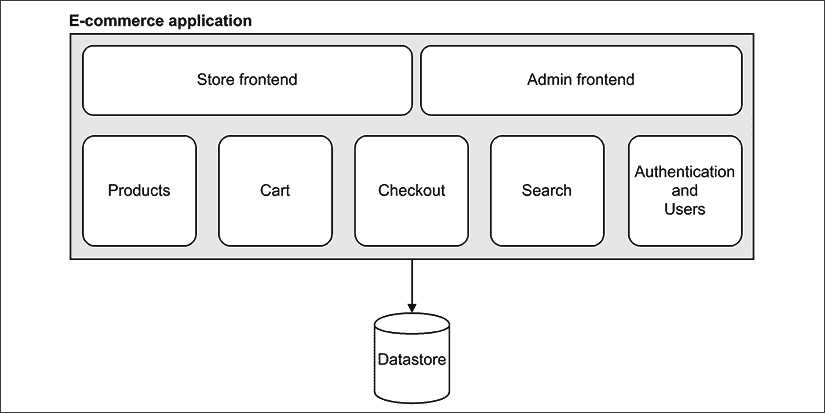

图 12.9：单体架构示例

*图 12.9* 展示了一个典型电子商务应用的架构。其结构是模块化的：我们有两个不同的前端，一个用于主商店，另一个用于管理界面。内部，应用程序实现的服务有明确的分离。每个服务负责应用程序业务逻辑的特定部分：**产品**、**购物车**、**结账**、**搜索**和**认证与用户**。然而，前面的架构是单体的，因为每个模块都是同一代码库的一部分，并且作为单个应用程序的一部分运行。任何组件的故障都可能潜在地摧毁整个在线商店。

这种类型架构的另一个问题是其模块之间的互连；它们都生活在同一个应用程序中的事实使得开发者很容易构建模块之间的交互和耦合。例如，考虑一个产品被购买的使用案例：**结账**模块必须更新**产品**对象的可用性，如果这两个模块在同一个应用程序中，开发者直接获取一个**产品**对象的引用并更新其可用性就太容易了。在单体应用程序中保持内部模块之间的低耦合非常困难，部分原因是它们之间的边界并不总是清晰或得到适当的执行。

**高耦合**通常是阻碍应用程序增长的主要障碍之一，并阻止其在复杂性方面的可扩展性。实际上，一个复杂的依赖图意味着系统的每个部分都是一个负担，它必须在整个产品生命周期内维护，任何更改都应仔细评估，因为每个组件都像是一个 Jenga 塔中的木块：移动或移除其中一个都可能使整个塔倒塌。这通常会导致建立惯例和开发流程来应对项目日益增加的复杂性。

## 微服务架构

现在，我们将揭示 Node.js 编写大型应用程序最重要的模式：避免编写大型应用程序。这似乎是一个显而易见的陈述，但它是一种非常有效的策略，可以扩展软件系统的复杂性和容量。那么，编写大型应用程序的替代方案是什么？答案是位于“*Y*”轴的规模立方体的分解和按服务和功能拆分。想法是将应用程序分解为其基本组件，创建独立的、独立的应用程序。这实际上与单体架构相反。这与 Unix 哲学以及我们在本书开头讨论的 Node.js 原则完美契合；特别是口号“让每个程序做好一件事”。

**微服务架构**是目前此类方法的主要参考模式，其中一组自给自足的服务取代了庞大的单体应用程序。前缀“微”意味着服务应该尽可能小，但始终在合理的范围内。不要被认为创建一个包含一百个不同应用程序（仅暴露一个网络服务）的架构必然是一个好选择所误导。实际上，并没有严格的规定服务应该有多小或多大。在微服务架构的设计中，重要的是尺寸，而是一个由不同因素组合而成的，主要是**松耦合**、**高内聚**和**集成复杂性**。

### 一个微服务架构的例子

让我们现在看看使用微服务架构的单一电子商务应用将是什么样子：

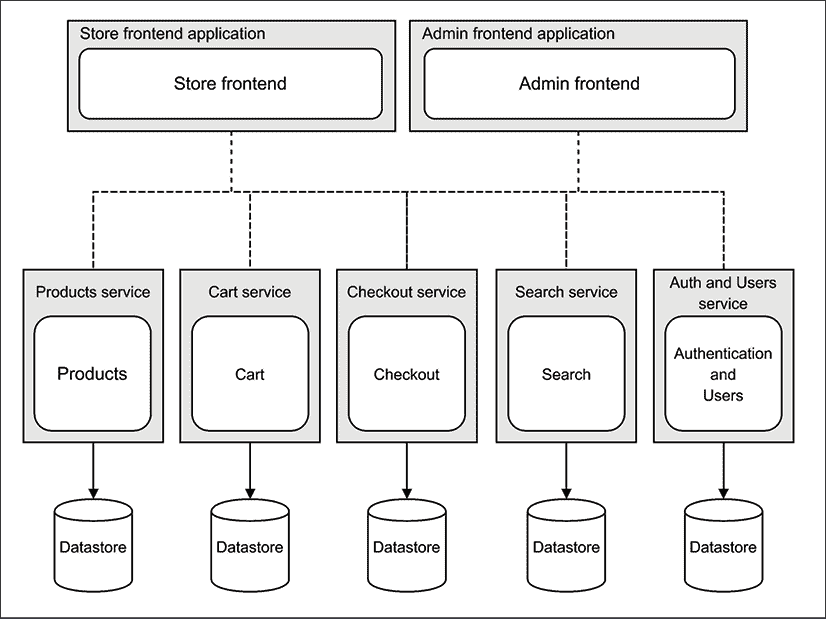

图 12.10：使用微服务模式实现的电子商务系统示例

如*图 12.10*所示，电子商务应用的基本组成部分现在都是一个自我维持和独立的实体，生活在自己的环境中，拥有自己的数据库。在实践中，它们都是独立的应用程序，提供一系列相关的服务。

服务的**数据所有权**是微服务架构的一个重要特征。这就是为什么数据库也必须分割，以保持适当的隔离和独立性。如果使用唯一的共享数据库，服务之间协作将变得更加容易；然而，这也会在服务之间（基于数据）引入耦合，从而抵消了拥有不同应用程序的一些优势。

连接所有节点的虚线告诉我们，以某种方式，它们必须进行通信和交换信息，以便整个系统完全功能正常。由于服务不共享相同的数据库，因此需要更多的通信来维护整个系统的一致性。例如，**Checkout**服务需要了解有关**产品**的一些信息，例如价格和运输限制，同时，它还需要在结账完成后更新存储在**产品**服务中的数据，例如产品的可用性。在*图 12.10*中，我们试图以通用方式表示节点之间的通信方式。当然，最流行的策略是使用 Web 服务，但正如我们稍后将看到的，这并非唯一的选择。

**模式（微服务架构**）

通过创建几个小型、自包含的服务来分割复杂的应用程序。

### 微服务 - 优点和缺点

在本节中，我们将突出实施微服务架构的一些优缺点。正如我们将看到的，这种方法承诺将彻底改变我们开发应用程序的方式，彻底改变我们看待可扩展性和复杂性的方式，但另一方面，它也引入了新的非平凡挑战。

Martin Fowler 撰写了一篇关于微服务的优秀文章，您可以在[nodejsdp.link/microservices](http://nodejsdp.link/microservices)找到。

#### 每个服务都是可替换的

每个服务都生活在自己的应用程序上下文中的主要技术优势是，崩溃不会传播到整个系统。目标是构建真正独立的、更小、更容易更改，甚至可以从头开始重建的服务。例如，如果我们的电子商务应用的**结账**服务突然因为一个严重的错误而崩溃，系统的其余部分将继续正常工作。一些功能可能会受到影响；例如，购买产品的能力，但系统的其余部分将继续工作。

此外，设想如果我们突然意识到我们用来实现组件的数据库或编程语言不是一个好的设计决策。在单体应用程序中，我们几乎无法在不影响整个系统的情况下改变任何事情。相反，在微服务架构中，我们可以更容易地从零开始重新实现整个服务，使用不同的数据库或平台，只要新的实现保持与系统其余部分相同的接口，系统的其余部分甚至不会注意到这一点。

#### 横跨平台和语言的复用性

将大型单体应用程序拆分为许多小型服务，使我们能够创建可以更容易复用的独立单元。**Elasticsearch** ([nodejsdp.link/elasticsearch](http://nodejsdp.link/elasticsearch)) 是一个可复用搜索服务的绝佳例子。**ORY** ([nodejsdp.link/ory](http://nodejsdp.link/ory)) 是另一个可复用开源技术的例子，它提供了一个完整的身份验证和授权服务，可以轻松集成到微服务架构中。

微服务方法的主要优势是，与单体应用程序相比，信息隐藏的水平通常要高得多。这是可能的，因为交互通常通过远程接口，如 Web API 或消息代理进行，这使得隐藏实现细节和屏蔽客户端免受服务实现或部署方式变化的影响变得容易得多。例如，如果我们只需要调用一个 Web 服务，我们就被屏蔽了基础设施扩展的方式、它使用的编程语言、它用来存储数据的数据库等等。所有这些决策都可以根据需要重新审视和调整，可能对系统的其余部分没有影响。

#### 一种扩展应用程序的方法

回到规模立方体，很明显，微服务相当于沿着*Y*轴扩展应用程序，因此它已经是一个在多台机器之间分配负载的解决方案。此外，我们不应忘记我们可以将微服务与其他两个立方体维度结合起来，以进一步扩展应用程序。例如，每个服务都可以复制以处理更多的流量，有趣的是，它们可以独立扩展，从而实现更好的资源管理。

在这个阶段，看起来微服务是解决我们所有问题的方案。然而，这远非事实。让我们看看我们使用微服务时面临的挑战。

#### 微服务的挑战

管理更多的节点引入了更高的复杂性，这在集成、部署和代码共享方面尤为明显：它解决了传统架构的一些痛点，但也提出了许多新问题。我们如何使服务交互？我们如何保持部署、扩展和监控如此众多应用程序的理智？我们如何在服务之间共享和重用代码？

幸运的是，云服务和现代 DevOps 方法可以为这些问题提供一些答案，而且使用 Node.js 也能大有帮助。它的模块系统是不同项目之间共享代码的完美伴侣。Node.js 被设计成分布式系统中的一个节点，如微服务架构中的节点。

在接下来的章节中，我们将介绍一些可以帮助在微服务架构中管理和集成服务的集成模式。

## 微服务架构中的集成模式

微服务中最具挑战性的问题之一是连接所有节点以使它们协作。例如，我们电子商务应用的**购物车**服务如果没有一些**产品**添加进去就几乎没有什么意义，而**结账**服务如果没有要购买的产品列表（购物车）也将毫无用处。正如我们之前提到的，还有其他因素需要各种服务之间的交互。例如，**搜索**服务需要知道哪些**产品**是可用的，并且必须确保它保持其信息是最新的。同样，对于**结账**服务，当购买完成时，它必须更新关于**产品**可用性的信息。

在设计集成策略时，考虑它将在系统中的服务之间引入的耦合也很重要。我们不应忘记，设计分布式架构涉及我们在本地设计模块或子系统时使用的相同实践和原则。因此，我们还需要考虑服务的可重用性和可扩展性等属性。

### API 代理

我们将要展示的第一个模式是使用**API 代理**（也常被称为**API 网关**），这是一个代理客户端和一组远程 API 之间通信的服务器。在微服务架构中，其主要目的是为多个 API 端点提供一个单一的访问点，但它还可以提供负载均衡、缓存、身份验证和流量限制等功能，所有这些功能在实现一个坚实的 API 解决方案中都非常有用。

这个模式对我们来说可能并不陌生，因为我们已经在本章中通过使用`http-proxy`和`consul`构建自定义负载均衡器时看到了它的实际应用。在那个例子中，我们的负载均衡器只暴露了两个服务，然后，多亏了服务注册表，它能够将 URL 路径映射到服务，进而映射到服务器列表。API 代理的工作方式与此相同；它本质上是一个反向代理，通常也是一个负载均衡器，专门配置来处理 API 请求。*图 12.11*展示了我们如何将这种解决方案应用到我们的电子商务应用中：

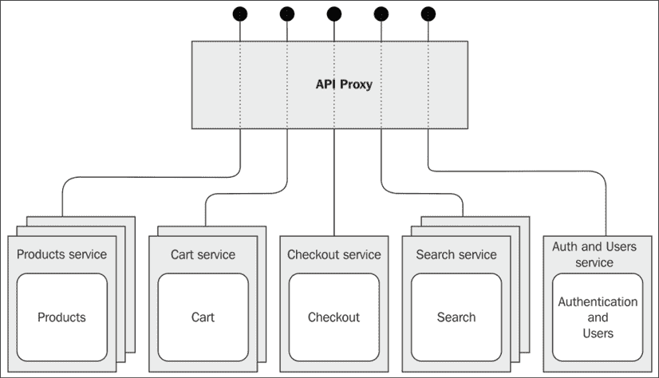

图 12.11：在电子商务应用中使用 API 代理模式

从前面的图中，应该很清楚一个 API 代理如何隐藏其底层基础设施的复杂性。这在微服务基础设施中非常有用，因为节点数量可能很高，尤其是如果每个服务都扩展到多台机器上。因此，API 代理实现的集成仅是结构性的，因为没有语义机制。它仅仅提供了一个熟悉的大型单体视图，用于复杂的微服务基础设施。

由于 API 代理模式本质上抽象了连接到系统中所有不同 API 的复杂性，它可能也允许对各种服务进行重构的自由。也许，随着您需求的改变，您可能需要将现有的微服务拆分为两个或更多个解耦的微服务，或者相反，您可能意识到，在您的业务环境中，将两个或更多服务合并在一起可能更好。在这两种情况下，API 代理模式将允许您进行所有必要的更改，可能不会对通过代理访问数据的上游系统产生影响。

在一段时间内使架构能够实现增量变化是现代分布式系统的一个重要特性。如果您对深入研究这个广泛的主题感兴趣，我们推荐阅读书籍《构建可演化架构》：[nodejsdp.link/evolutionary-architectures](http://nodejsdp.link/evolutionary-architectures)。

### API 编排

我们接下来要描述的模式可能是集成和组合一组服务最自然和最明确的方式，它被称为**API 编排**。Netflix API 工程副总裁 Daniel Jacobson 在他的博客文章([nodejsdp.link/orchestration-layer](http://nodejsdp.link/orchestration-layer))中定义了 API 编排如下：

> “一个 API **编排层**（**OL**）是一个抽象层，它将通用的建模数据元素和/或特性以更具体的方式准备，以便为特定的开发人员或应用服务。”

“通用的建模元素和/或特性”完美地符合微服务架构中服务的描述。想法是创建一个抽象层，将这些零散的部分连接起来，以实现针对特定应用的新服务。

让我们通过电子商务应用的示例来了解一下。参考 *图 12.12*：

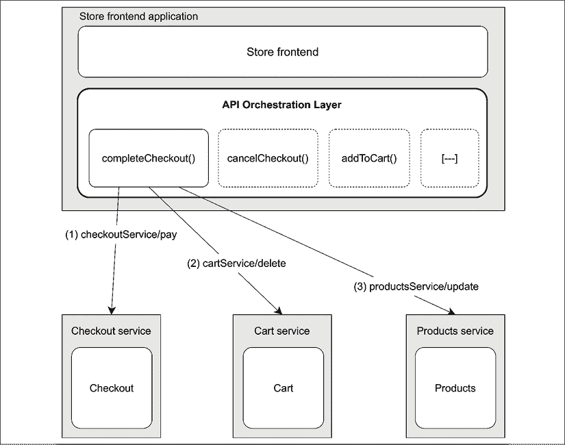

图 12.12：使用编排层与多个微服务交互的示例

*图 12.12* 展示了 **商店前端** 应用如何通过组合和编排现有服务来构建更复杂和特定的功能。所描述的场景以一个假设的 `completeCheckout()` 服务为例，该服务在客户在结账末尾点击 **支付** 按钮时被调用。

该图显示了 `completeCheckout()` 是由三个不同步骤组成的复合操作：

1.  首先，我们通过调用 `checkoutService/pay` 来完成交易。

1.  然后，当支付成功处理时，我们需要通知 **购物车** 服务，所购商品已被购买，并且可以从购物车中移除。我们通过调用 `cartService/delete` 来完成这一操作。

1.  此外，当支付完成时，我们需要更新刚刚购买的产品可用性。这是通过 `productsService/update` 来完成的。

如我们所见，我们从三个不同的服务中提取了三个操作，并构建了一个新的 API 来协调这些服务，以保持整个系统的一致状态。

**API 编排层** 执行的另一个常见操作是 **数据聚合**，换句话说，就是将来自不同服务的数据组合成一个单一响应。想象一下，如果我们想列出购物车中包含的所有产品。在这种情况下，编排需要从 **购物车** 服务中检索产品 ID 列表，然后从 **产品** 服务中检索关于产品的完整信息。我们可以组合和协调服务的方式是无限的，但需要记住的重要模式是编排层的作用，它作为多个服务与特定应用程序之间的抽象。

编排层是进一步功能拆分的绝佳候选者。实际上，将其实现为一个专用、独立的服务是非常常见的，在这种情况下，它被称为 **API 编排器**。这种做法与微服务哲学完全一致。

*图 12.13* 展示了我们对架构的进一步改进：

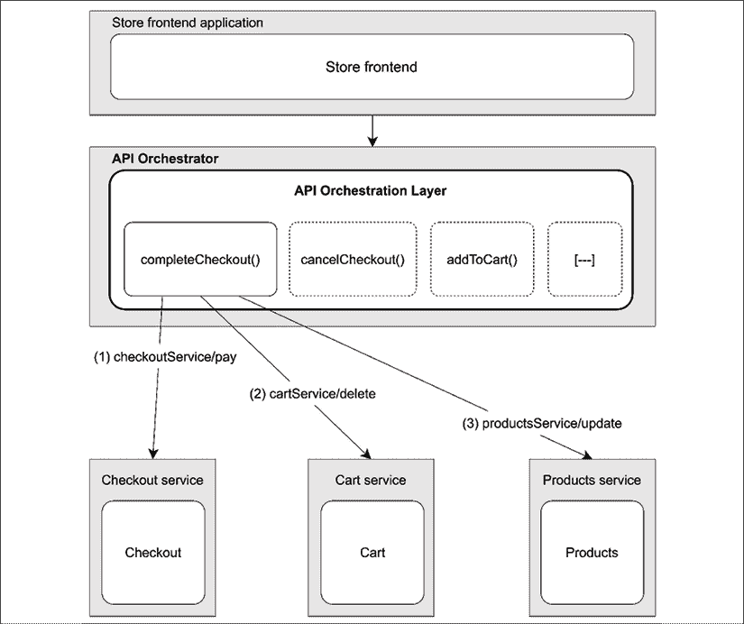

图 12.13：API 编排器模式在我们的电子商务示例中的应用

如前图所示，创建一个独立的编排器可以帮助将客户端应用程序（在我们的案例中是 **商店前端**）从微服务基础设施的复杂性中解耦。这与 API 代理类似，但有一个关键的区别：编排器执行各种服务的 *语义整合*，它不仅仅是一个简单的代理，并且它通常暴露一个与底层服务暴露的 API 不同的 API。

### 与消息代理的集成

**编排器**模式为我们提供了一种以显式方式集成各种服务的机制。这既有优点也有缺点。它易于设计、易于调试和易于扩展，但遗憾的是，它必须对底层架构以及每个服务的工作方式有完整的了解。如果我们谈论的是对象而不是架构节点，那么编排器将是一个被称为**上帝对象**的反模式，它定义了一个知道并做得太多的对象，这通常会导致高耦合、低内聚，但最重要的是，高复杂性。

我们现在将要展示的模式试图将同步整个系统信息的责任分散到各个服务中。然而，我们最不想做的事情就是创建服务之间的直接关系，这将导致高耦合，并由于节点之间交互数量的增加，进一步增加系统的复杂性。目标是保持每个服务解耦：每个服务都应能够工作，即使没有系统中的其他服务或与新的服务和节点结合。

解决方案是使用消息代理，这是一个能够解耦消息发送者和接收者的系统，使我们能够实现集中式发布/订阅模式。在实践中，这是分布式系统中观察者模式的实现。我们将在第十三章“消息和集成模式”中更详细地讨论这种模式。*图 12.14*展示了这种模式如何应用于电子商务应用：

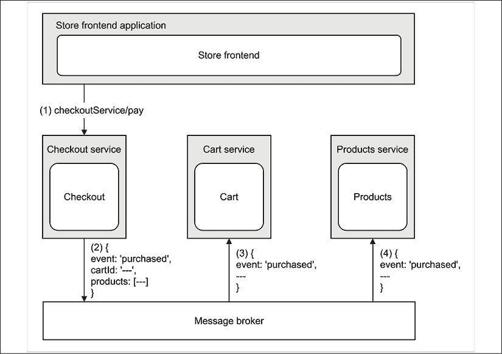

图 12.14：在电子商务应用中使用消息代理来分发事件

如*图 12.14*所示，**结账**服务的客户端，即前端应用，不需要与其他服务进行任何显式的集成。

它所需要做的只是调用`checkoutService/pay`来完成结账过程并从客户那里收取款项；所有集成工作都在后台进行：

1.  **商店前端**调用**结账**服务的`checkoutService/pay`操作。

1.  当操作完成时，**结账**服务生成一个事件，附加操作详情，即`cartId`和刚刚购买的`products`列表。事件被发布到消息代理。此时，**结账**服务并不知道谁将接收这条消息。

1.  **购物车**服务订阅了代理，因此它将接收由**结账**服务刚刚发布的`purchased`事件。**购物车**服务通过从其数据库中删除包含在消息中的 ID 所标识的购物车来做出反应。

1.  **产品**服务也订阅了消息代理，因此它接收相同的`购买`事件。然后根据这个新信息更新其数据库，调整消息中包含的产品可用性。

整个过程无需外部实体（如编排器）的明确干预。传播知识和保持信息同步的责任分布在各个服务本身。没有必须知道如何移动整个系统齿轮的“上帝”服务，因为每个服务负责其自身的集成部分。

消息代理是一个用于解耦服务和减少它们交互复杂性的基本元素。它还可能提供其他有趣的功能，例如持久消息队列和消息的保证顺序。我们将在下一章中详细讨论这一点。

# 摘要

在本章中，我们学习了如何设计既能在容量上又能在复杂性上扩展的 Node.js 架构。我们了解到扩展应用程序不仅关乎处理更多流量或减少响应时间，而且是一种实践，无论何时我们想要更好的可用性和对失败的容忍度，都应该应用。我们了解到这些属性通常处于同一波长上，并理解到早期扩展不是一种坏习惯，尤其是在 Node.js 中，它允许我们轻松且资源较少地完成扩展。

规模立方体告诉我们，应用程序可以在三个维度上进行扩展。在本章中，我们专注于两个最重要的维度，即 X 轴和 Y 轴，使我们能够发现两个基本架构模式，即负载均衡和微服务。你现在应该知道如何启动同一 Node.js 应用程序的多个实例，如何在这些实例之间分配流量，以及如何利用这种设置来实现其他目的，如容错和零停机时间重启。我们还分析了如何处理动态和自动扩展的基础设施问题。通过这一点，我们看到了服务注册表在这些情况下确实非常有用。我们学习了如何通过使用纯 Node.js、外部负载均衡器（如 Nginx）和服务发现系统（如 Consul）来实现这些目标。我们还学习了 Kubernetes 的基础知识。

到目前为止，我们应该已经掌握了应对可扩展性的实用方法，可以比以前更加无畏地面对。

然而，克隆和负载均衡仅覆盖了规模立方体的一个维度，因此我们将分析转向了另一个维度，更详细地研究通过构建微服务架构来按其组成部分服务拆分应用程序意味着什么。我们看到了微服务如何使项目开发和管理的革命性变革成为可能，提供了一种自然的方式来分配应用程序的负载并分割其复杂性。然而，我们了解到这也意味着将复杂性从 *如何构建一个大型的单体应用程序* 转移到 *如何集成一组服务*。这个最后方面是我们分析的重点，展示了将一组独立服务集成的某些架构解决方案。

在本书的下一章和最后一章中，我们将有机会通过分析本章讨论的消息模式，以及更多在实现复杂分布式架构时有用的先进集成技术，来完成我们的 *Node.js 设计模式* 之旅。

# 练习

+   **12.1 可扩展的书库**：回顾我们在 *第十章*，*Web 应用程序的通用 JavaScript* 中构建的书库应用程序，在了解本章内容后重新考虑它。你能否使我们的原始实现更具可扩展性？一些想法可能包括使用 `cluster` 模块来运行服务器的多个实例，确保通过重启可能意外死亡的 worker 来处理故障。或者，为什么不尝试在 Kubernetes 上运行整个应用程序呢？

+   **12.2 探索 Z 轴**：在本章中，我们没有向你展示如何跨多个实例分片数据的任何示例，但我们探讨了构建一个沿规模立方体 Z 轴实现可扩展性的所有必要模式。在这个练习中，你被挑战构建一个 REST API，允许你获取以给定字母开头的（随机生成的）人名列表。你可以使用像 `faker`（[nodejsdp.link/faker](http://nodejsdp.link/faker)）这样的库来生成随机人的样本，然后你可以将这些数据存储在不同的 JSON 文件中（或不同的数据库中），将数据分成三个不同的组。例如，你可能有三个组，分别称为 A-D、E-P 和 Q-Z。*Ada* 将进入第一个组，*Peter* 进入第二个组，*Ugo* 进入第三个组。现在，你可以为每个组运行一个或多个 Web 服务器实例，但你应该只暴露一个公共 API 端点，以便能够检索以给定字母开头（例如，`/api/people/byFirstName/{letter}`）的所有人名。提示：你可以使用负载均衡器，并将所有可能的字母映射到负责相关组的实例的后端。或者，你可以创建一个 API 调度层，该层编码映射逻辑并相应地重定向流量。你还能将服务发现工具加入其中，并应用动态负载均衡，以便接收更多流量的组能够按需扩展吗？

+   **12.3 音乐成瘾**：想象一下，你需要设计类似 Spotify 或 Apple Music 这样的服务架构。你能尝试应用本章讨论的一些原则，将这个服务设计为一组微服务吗？如果你能用 Node.js 实现这个想法的最小版本，那么你将获得额外的分数！如果这个想法成为下一个大型的创业点子，让你成为百万富翁，那么……别忘了感谢这本书的作者们。 :)
