# 13

# 消息和集成模式

如果可扩展性是关于分布式系统，那么集成就是关于连接它们。在前一章中，我们学习了如何分布一个应用程序，将其碎片化到多个进程和机器上。为了使其正常工作，所有这些部分都必须以某种方式通信，因此它们必须被集成。

整合分布式应用程序主要有两种技术：一种是用共享存储作为所有信息的中心协调者和守护者，另一种是使用消息在系统的节点之间传播数据、事件和命令。这种最后一种选项是真正使分布式系统扩展化的关键，也是使这个主题如此吸引人并且有时复杂的原因。

消息被用于软件系统的每一层。我们在互联网上通过交换消息进行通信；我们可以使用消息通过管道将信息发送到其他进程；我们可以在应用程序中使用消息作为直接函数调用的替代（命令模式），设备驱动程序也使用消息与硬件进行通信。任何用作组件和系统之间信息交换的离散和结构化数据都可以被视为一种*消息*。然而，在处理分布式架构时，术语**消息系统**被用来描述一类旨在促进网络信息交换的特定解决方案、模式和架构。

正如我们将看到的，这些类型的系统有几个特点。我们可能会选择使用代理而不是对等结构，我们可能会使用请求/回复消息交换或单向通信类型，或者我们可能会使用队列来更可靠地传递我们的消息；这个主题的范围真的很广。Gregor Hohpe 和 Bobby Woolf 所著的《企业集成模式》一书为我们提供了关于这个主题广度的概念。从历史上看，它被认为是消息和集成模式的**圣经**，有超过 700 页描述了 65 种不同的集成模式。在本章的最后，我们将探讨这些众所周知模式中最重要的一些——以及一些更现代的替代方案——从 Node.js 及其生态系统的角度来考虑。

总结来说，在本章中，我们将学习以下主题：

+   消息系统的基本原理

+   发布/订阅模式

+   任务分配模式和管道

+   请求/回复模式

让我们从基本原理开始。

# 消息系统的基本原理

当谈到消息和消息系统时，有四个基本要素需要考虑：

+   通信的方向，可以是单向的，也可以是请求/回复的交换

+   消息的目的，这也决定了其内容

+   消息的时机，可以是同步（在上下文中发送和接收）或异步（不在上下文中）

+   消息的传递，可以是直接发生或通过代理

在接下来的章节中，我们将对这些方面进行形式化，为我们的后续讨论提供一个基础。

## 单向与请求/回复模式

在消息系统中，最基本的一个方面是通信的方向，这通常也决定了其语义。

最简单的通信模式是消息从源到目的地单向推送；这是一个简单的情况，不需要太多解释：


图 13.1：单向通信

单向通信的一个典型例子是电子邮件或使用 WebSockets 向连接的浏览器发送消息的 Web 服务器，或者将任务分配给一组工作者的系统。

另一方面，我们有请求/回复交换模式，其中一条方向的消息总是与相反方向的消息相匹配（排除错误条件）。这种交换模式的典型例子是调用 Web 服务或向数据库发送查询。以下图表显示了这种简单且众所周知的情况：


图 13.2：请求/回复消息交换模式

请求/回复模式可能看起来是一个简单的实现模式，然而，正如我们稍后将看到的，当通信通道是异步的或涉及多个节点时，它变得更加复杂。看看下一个图表中代表的例子：

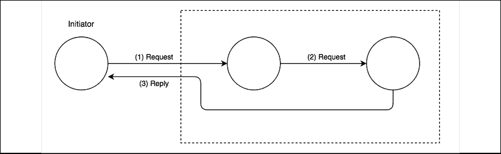

图 13.3：多节点请求/回复通信

通过图 13.3 所示的设置，我们可以更好地理解某些请求/回复模式的复杂性。如果我们考虑任意两个节点之间的通信方向，我们可以说它一定是单向的。然而，从全局角度来看，发起者发送一个请求，然后相应地收到一个来自不同节点的响应。在这些情况下，真正区分请求/回复模式与裸单向循环的是请求和回复之间的关系，这种关系被保存在发起者那里。回复通常与请求在相同的环境中处理。

## 消息类型

**消息**本质上是一种连接不同软件组件的手段，这样做有不同的原因：可能是因为我们想要获取另一个系统或组件持有的某些信息，远程执行操作，或者通知一些对等体刚刚发生了某些事情。

消息内容也会根据通信的原因而变化。一般来说，我们可以根据其目的识别三种类型的消息：

+   命令消息

+   事件消息

+   文档消息

### 命令消息

你应该已经熟悉**命令消息**，因为它本质上是一个序列化的命令对象（我们在第九章的*命令*部分中学习了这一点，*行为设计模式*）

这种类型消息的目的是触发接收器上动作或任务的执行。为了实现这一点，命令消息必须包含运行任务所需的基本信息，这通常包括操作名称和参数列表。命令消息可以用来实现**远程过程调用（RPC**）系统、分布式计算，或者更简单地用来请求某些数据。RESTful HTTP 调用是命令的简单例子；每个 HTTP 动词都有特定的含义，并与一个精确的操作相关联：`GET`，用于检索资源；`POST`，用于创建新资源；`PUT`/`PATCH`，用于更新资源；和`DELETE`，用于销毁资源。

### 事件消息

**事件消息**用于通知另一个组件发生了某些事情。它通常包含事件的*类型*，有时也包含一些细节，如上下文、主题或涉及的参与者。

在 Web 开发中，当我们利用 WebSockets 从服务器向客户端发送通知，以通知某些数据的变化或系统状态的突变时，我们会使用事件消息。

事件是分布式应用中非常重要的集成机制，因为它们使我们能够保持系统所有节点的同步。

### 文档消息

**文档消息**主要用于在组件和机器之间传输数据。一个典型的例子是用于传输数据库查询结果的消息。

区分文档消息和命令消息（可能也包含数据）的主要特征是，消息不包含任何信息告诉接收者如何处理数据。另一方面，文档消息和事件消息之间的主要区别是它们与特定事件发生的关联的缺失。通常，命令消息的回复是文档消息，因为它们通常只包含请求的数据或操作的结果。

现在我们已经了解了如何对消息的语义进行分类，让我们来了解用于移动我们消息的通信通道的语义。

## 异步消息、队列和流

在这本书的这一部分，你应该已经熟悉了异步操作的特点。嗯，结果证明，同样的原则也可以应用于消息和通信。

我们可以将同步通信比作电话通话：两个对等方必须同时连接到相同的频道，并且他们应该实时交换消息。通常，如果我们想给其他人打电话，我们要么需要另一部电话，要么终止正在进行的通信以开始新的通话。

异步通信类似于短信：它不需要接收者在发送时连接到网络；我们可能会立即收到回复，或者在一个未知的延迟后收到回复，或者根本收不到回复。我们可能会连续给多个接收者发送多条短信，并按任何顺序收到他们的回复（如果有的话）。简而言之，我们使用更少的资源就实现了更好的并行性。

异步通信的另一个重要特征是消息可以被存储，然后尽可能快地或稍后交付。当接收者太忙而无法处理新消息，或者我们想要保证交付时，这可能很有用。在消息系统中，这是通过使用**消息队列**来实现的，这是一个组件，它协调消息生产者和消费者之间的通信，在消息被交付到目的地之前存储任何消息，如图中所示：


图 13.4：消息队列

如果消费者由于任何原因崩溃、断开网络连接或速度减慢，消息将积累在队列中，并在消费者重新上线时立即分发。队列可以位于生产者处，或者在生产者和消费者之间分割（在对等架构中），或者存在于一个专门的外部系统中，作为通信的中间件（**代理**）。

另一个与消息队列有类似（但不同！）目标的数据结构是**日志**。日志是一个只追加的数据结构，它是持久的，其消息可以按到达顺序读取或通过访问其历史记录来读取。在消息和集成系统的上下文中，这也被称为数据**流**。

与队列相比，在流中，当消息被检索或处理时，消息不会被移除。这样，消费者可以在消息到达时检索消息，或者在任何时候查询流以检索过去的消息。这意味着流在访问消息方面提供了更多的自由度，而队列通常一次只向消费者暴露一条消息。最重要的是，流可以被多个消费者共享，他们可以使用不同的方法访问消息（甚至是相同的消息）。

*图 13.5* 给出了流与消息队列结构的比较：

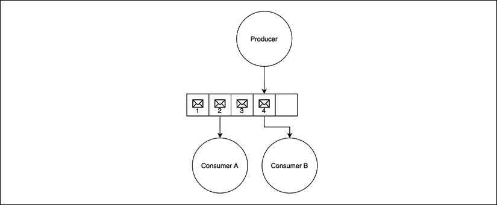

图 13.5：流

在本章后面，当我们使用这两种方法实现一个示例应用程序时，你将能够更好地欣赏队列和流之间的差异。

在一个消息系统中需要考虑的最后一个基本元素是系统节点之间的连接方式，这可以是直接的，也可以是通过中介实现的。

## 对等或基于代理的消息

消息可以直接以**对等**方式发送给接收者，或者通过一个称为**消息代理**的集中式中介系统。代理的主要作用是将消息的接收者与发送者解耦。以下图表显示了两种方法之间的架构差异：

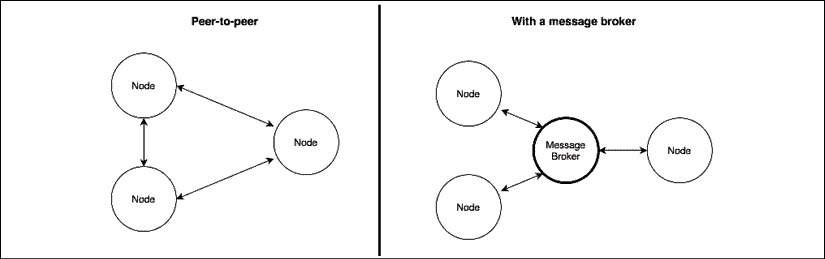

图 13.6：对等通信与消息代理的比较

在对等架构中，每个节点直接负责将消息发送给接收者。这意味着节点必须知道接收者的地址和端口号，并且它们必须就协议和消息格式达成一致。代理消除了这些复杂性：每个节点可以完全独立，并且可以与未直接了解其详情的不确定数量的对等节点进行通信。

代理还可以充当不同通信协议之间的桥梁。例如，流行的 RabbitMQ 代理([nodejsdp.link/rabbitmq](http://nodejsdp.link/rabbitmq))支持**高级消息队列协议**(**AMQP**)、**消息队列遥测传输**(**MQTT**)和**简单/流文本定向消息协议**(**STOMP**)，使支持不同消息协议的多个应用程序能够交互。

MQTT([nodejsdp.link/mqtt](http://nodejsdp.link/mqtt))是一种轻量级消息协议，专门设计用于机器到机器通信（如物联网）。AMQP([nodejsdp.link/amqp](http://nodejsdp.link/amqp))是一种更复杂的消息协议，旨在成为专有消息中间件的开放源代码替代品。STOMP([nodejsdp.link/stomp](http://nodejsdp.link/stomp))是一种轻量级基于文本的协议，源自“HTTP 设计学校”。所有三者都是应用层协议，基于 TCP/IP。

除了解耦和互操作性的优势之外，代理还可以提供诸如持久队列、路由、消息转换和监控等附加功能，而不必提及许多代理默认支持的广泛的消息模式。

当然，我们没有任何阻止我们使用对等架构实现所有这些功能的，但不幸的是，这需要更多的努力。尽管如此，选择对等方法而不是代理可能存在不同的原因：

+   通过移除代理，我们消除了系统中的单个故障点

+   代理需要扩展，而在对等架构中，我们只需要扩展应用程序的单个节点

+   无中介交换消息可以大大减少通信的延迟

通过使用对等消息系统，我们可以拥有更多的灵活性和能力，因为我们不受任何特定技术、协议或架构的约束。

现在我们已经了解了消息系统的基本知识，让我们探索一些最重要的消息模式。让我们从发布/订阅模式开始。

# 发布/订阅模式

**发布/订阅**（通常缩写为 Pub/Sub）可能是最知名的单向消息模式。我们应该已经熟悉它，因为它不过是一个分布式观察者模式。正如观察者模式的情况一样，我们有一组*订阅者*注册他们对接收特定类别消息的兴趣。在另一边，*发布者*产生消息，这些消息被分发到所有相关的订阅者。*图 13.7* 展示了 Pub/Sub 模式的两个主要变体；第一个是基于对等架构，第二个使用代理来调解通信：

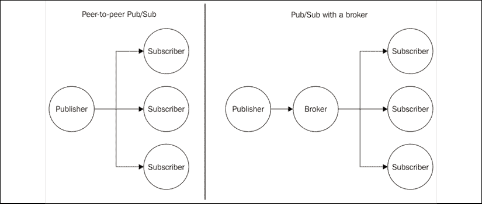

图 13.7：发布/订阅消息模式

Pub/Sub 之所以特别，是因为发布者事先不知道消息的接收者是谁。正如我们所说的，是订阅者必须注册其兴趣以接收特定消息，这使得发布者可以与不确定数量的接收者一起工作。换句话说，Pub/Sub 模式的两边是*松散耦合*的，这使得它成为集成不断发展的分布式系统节点的理想模式。

代理的存在进一步提高了系统节点之间的解耦，因为订阅者只与代理交互，不知道哪个节点是消息的发布者。正如我们稍后将看到的，代理还可以提供消息队列系统，即使在节点之间存在连接问题的情况下也能保证可靠地交付。

现在，让我们通过一个例子来演示这个模式。

## 构建简约的实时聊天应用程序

为了展示 Pub/Sub 模式如何帮助我们集成分布式架构的一个真实例子，我们现在将使用纯 WebSocket 构建一个非常基本的实时聊天应用程序。然后，我们将通过运行多个实例来扩展它，最后，使用消息系统，我们将在所有服务器实例之间建立一个通信通道。

### 实现服务器端

现在，让我们一步一步来。首先，我们将构建一个基本的聊天应用程序，然后将其扩展到多个实例。

为了实现典型聊天应用程序的实时功能，我们将依赖于`ws`包（[nodejsdp.link/ws](http://nodejsdp.link/ws)），这是一个针对 Node.js 的纯 WebSocket 实现。在 Node.js 中实现实时应用程序相当简单，我们将要编写的代码将证实这一假设。因此，让我们在名为`index.js`的文件中创建我们聊天应用程序的服务器端：

```js
import { createServer } from 'http'
import staticHandler from 'serve-handler'
import ws from 'ws'
// serve static files
const server = createServer((req, res) => {                // (1)
  return staticHandler(req, res, { public: 'www' })
})
const wss = new ws.Server({ server })                      // (2)
wss.on('connection', client => {
  console.log('Client connected')
  client.on('message', msg => {                            // (3)
    console.log(`Message: ${msg}`)
    broadcast(msg)
  })
})
function broadcast (msg) {                                 // (4)
  for (const client of wss.clients) {
    if (client.readyState === ws.OPEN) {
      client.send(msg)
    }
  }
}
server.listen(process.argv[2] || 8080) 
```

就这样！这就是我们需要实现我们聊天应用程序服务器端组件的所有内容。这是它的工作方式：

1.  我们首先创建一个 HTTP 服务器，并将每个请求转发到特殊的处理程序([nodejsdp.link/serve-handler](http://nodejsdp.link/serve-handler))，该处理程序将负责从`www`目录中提供所有静态文件。这是为了访问我们应用的客户端资源（例如，HTML、JavaScript 和 CSS 文件）。

1.  然后，我们创建 WebSocket 服务器的新实例，并将其附加到现有的 HTTP 服务器上。接下来，我们通过附加对`connection`事件的监听器来开始监听传入的 WebSocket 客户端连接。

1.  每当一个新的客户端连接到我们的服务器时，我们开始监听传入的消息。当收到一条新消息时，我们将它广播给所有已连接的客户端。

1.  `broadcast()`函数是对所有已知客户端的简单迭代，其中在每个已连接客户端上调用`send()`函数。

这就是 Node.js 的魔力！当然，我们刚刚实现的服务器非常简单和基础，但正如我们将看到的，它确实完成了它的任务。

### 实现客户端

接下来，是时候实现我们聊天应用的客户端了。这可以通过另一段紧凑且简单的代码片段来完成，本质上是一个包含一些基本 JavaScript 代码的最小 HTML 页面。让我们在名为`www/index.html`的文件中创建这个页面，如下所示：

```js
<!DOCTYPE html>
<html>
  <body>
    Messages:
    <div id="messages"></div>
    <form id="msgForm">
      <input type="text" placeholder="Send a message" id="msgBox"/>
      <input type="submit" value="Send"/>
    </form>
    <script>
      const ws = new WebSocket(
        `ws://${window.document.location.host}`
      )
      ws.onmessage = function (message) {
        const msgDiv = document.createElement('div')
        msgDiv.innerHTML = message.data
        document.getElementById('messages').appendChild(msgDiv)
      }
      const form = document.getElementById('msgForm')
      form.addEventListener('submit', (event) => {
        event.preventDefault()
        const message = document.getElementById('msgBox').value
        ws.send(message)
        document.getElementById('msgBox').value = ''
      })
    </script>
  </body>
</html> 
```

我们刚刚创建的 HTML 页面实际上并不需要很多注释，它只是一段直接的 Web 开发。我们使用原生的 WebSocket 对象初始化与我们的 Node.js 服务器的连接，然后开始监听来自服务器的消息，当消息到达时，在新的`div`元素中显示它们。对于发送消息，我们则使用一个简单的文本框和一个表单内的按钮。

请注意，当停止或重新启动聊天服务器时，WebSocket 连接将被关闭，客户端不会尝试自动重新连接（正如我们可能从生产级应用中期望的那样）。这意味着在服务器重启后，需要刷新浏览器以重新建立连接（或者实现重新连接机制，这里为了简洁我们不涉及）。此外，在我们应用的这个初始版本中，客户端将不会收到在他们未连接到服务器时发送的任何消息。

### 运行和扩展聊天应用

我们可以立即尝试运行我们的应用。只需使用以下命令启动服务器：

```js
node index.js 8080 
```

然后，打开几个浏览器标签或甚至两个不同的浏览器，将它们指向`http://localhost:8080`，并开始聊天：

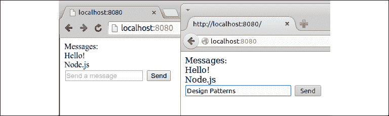

图 13.8：我们的新聊天应用正在运行

现在，我们想看看当我们尝试通过启动多个实例来扩展我们的应用时会发生什么。让我们试试。让我们在另一个端口上启动另一个服务器：

```js
node index.js 8081 
```

所期望的结果是，两个连接到不同服务器的不同客户端应该能够交换聊天消息。不幸的是，我们的当前实现并不是这样。我们可以通过打开另一个浏览器标签到`http://localhost:8081`来测试这一点。

在实际应用中，我们会使用负载均衡器来分配负载到我们的实例，但在这个演示中我们不会使用。这允许我们以确定性的方式访问每个服务器实例，以验证它如何与其他实例交互。

当在一个实例上发送聊天消息时，我们只在本地广播消息，只将其分发到连接到该特定服务器的客户端。实际上，这两个服务器并没有相互交谈。我们需要将它们整合起来，这正是我们接下来要看到的。

## 使用 Redis 作为简单的消息代理

我们通过介绍**Redis**([nodejsdp.link/redis](http://nodejsdp.link/redis))开始分析最常用的 Pub/Sub 实现，它是一个非常快速且灵活的内存数据结构存储。Redis 常常被用作数据库或缓存服务器，然而，在其众多特性中，有一对专门设计用于实现集中式 Pub/Sub 消息交换模式的命令。

Redis 的消息代理能力（有意）非常简单和基本，尤其是如果我们将其与更高级的消息导向中间件相比。然而，这正是其受欢迎的主要原因之一。通常，Redis 已经存在于现有的基础设施中，例如，用作缓存服务器或会话数据存储。它的速度和灵活性使其成为在分布式系统中共享数据的非常受欢迎的选择。因此，一旦在项目中出现发布/订阅代理的需求，最简单和最直接的选择就是重用 Redis 本身，避免安装和维护专用的消息代理。

现在我们来做一个示例，以展示使用 Redis 作为消息代理的简单性和强大功能。

此示例需要一个在默认端口上监听的正常安装的 Redis。更多详细信息可以在[nodejsdp.link/redis-quickstart](http://nodejsdp.link/redis-quickstart)找到。

我们的行动计划是使用 Redis 作为消息代理来整合我们的聊天服务器。每个实例都会将其从客户端接收到的任何消息发布到代理，同时，它也会订阅来自其他服务器实例的任何消息。正如我们所看到的，我们架构中的每个服务器既是订阅者也是发布者。以下图表展示了我们想要获得的架构表示：

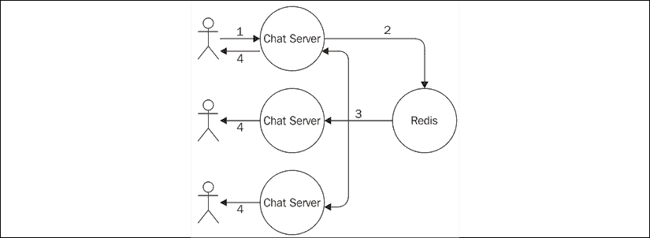

图 13.9：使用 Redis 作为聊天应用的消息代理

根据图 13.9 中描述的架构，我们可以总结消息的旅程如下：

1.  消息被输入到网页的文本框中，并发送到我们聊天服务器的连接实例。

1.  消息随后被发布到代理。

1.  代理将消息分发给所有订阅者，在我们的架构中，这些订阅者都是聊天服务器的实例。

1.  在每个实例中，消息被分发到所有连接的客户端。

让我们看看实际操作是如何工作的。让我们通过添加发布/订阅逻辑来修改服务器代码：

```js
import { createServer } from 'http'
import staticHandler from 'serve-handler'
import ws from 'ws'
**import** **Redis** **from****'ioredis'**                                // (1)
**const** **redisSub =** **new** **Redis()**
**const** **redisPub =** **new** **Redis()**
// serve static files
const server = createServer((req, res) => {
  return staticHandler(req, res, { public: 'www' })
})
const wss = new ws.Server({ server })
wss.on('connection', client => {
  console.log('Client connected')
  client.on('message', msg => {
    console.log(`Message: ${msg}`)
    **redisPub.publish(****'chat_messages'****, msg)**                 // (2)
  })
})
**redisSub.subscribe(****'chat_messages'****)**                        // (3)
**redisSub.on(****'message'****,** **(****channel, msg****) =>** **{**
  for (const client of wss.clients) {
    if (client.readyState === ws.OPEN) {
      client.send(msg)
    }
  }
})
server.listen(process.argv[2] || 8080) 
```

我们对原始聊天服务器所做的更改在前面代码中突出显示。这就是新实现的工作方式：

1.  为了将我们的 Node.js 应用程序连接到 Redis 服务器，我们使用`ioredis`包([nodejsdp.link/ioredis](http://nodejsdp.link/ioredis))，这是一个支持所有可用 Redis 命令的完整 Node.js 客户端。接下来，我们实例化两个不同的连接，一个用于订阅频道，另一个用于发布消息。这在 Redis 中是必要的，因为一旦连接被置于订阅模式，就只能使用与订阅相关的命令。这意味着我们需要第二个连接来发布消息。

1.  当从连接的客户端接收到新消息时，我们在`chat_messages`频道中发布该消息。我们不直接将消息广播给我们的客户端，因为我们的服务器订阅了相同的频道（正如我们稍后将看到的），所以它将通过 Redis 返回给我们。在这个示例的范围内，这是一个简单而有效的机制。然而，根据您应用程序的需求，您可能希望立即广播消息并忽略来自 Redis 的消息，这些消息来自当前服务器实例。我们将此留作您的练习。

1.  正如我们所说，我们的服务器也需要订阅`chat_messages`频道，因此我们注册了一个监听器来接收发布到该频道的所有消息（无论是当前服务器实例还是任何其他聊天服务器实例）。当接收到消息时，我们只需将其广播给所有连接到当前 WebSocket 服务器的客户端。

这些小小的改动就足以集成我们可能决定启动的所有聊天服务器实例。为了证明这一点，您可以尝试启动我们应用程序的多个实例：

```js
node index.js 8080
node index.js 8081
node index.js 8082 
```

然后，您可以将多个浏览器标签连接到每个实例，并验证您发送到其中一个实例的消息是否被所有连接到其他实例的其他客户端成功接收。

恭喜！我们刚刚使用发布/订阅模式集成了分布式实时应用程序的多个节点。

Redis 允许我们通过字符串标识的频道发布和订阅，例如，`chat.nodejs`。但它还允许我们使用 glob 样式模式来定义可以潜在匹配多个频道的订阅，例如，`chat.*`。

## 使用 ZeroMQ 的 P2P 发布/订阅

代理的存在可以大大简化信息系统的架构。然而，在某些情况下，这可能不是最佳解决方案。这包括所有低延迟至关重要的情形，或者在扩展复杂的分布式系统时，或者当单点故障的存在不是可选项时。当然，使用代理的替代方案是实现对等网络信息系统。

### 介绍 ZeroMQ

如果我们的项目适合对等网络架构，那么当然值得评估的最佳解决方案之一是**ZeroMQ**（[nodejsdp.link/zeromq](http://nodejsdp.link/zeromq)，也称为 zmq 或ØMQ）。ZeroMQ 是一个网络库，提供了构建各种信息传递模式的基本工具。它是低层的，非常快，具有最小化的 API，但它提供了创建坚固信息系统的所有基本构建块，例如原子消息、负载均衡、队列等等。它支持许多类型的传输，例如进程内通道（`inproc://`）、进程间通信（`ipc://`）、使用 PGM 协议的组播（`pgm://`或`epgm://`），当然还有经典的 TCP（`tcp://`）。

在 ZeroMQ 的特性中，我们也可以找到实现发布/订阅模式的工具，这正是我们示例中需要的。因此，我们现在要做的就是从我们的聊天应用架构中移除代理（Redis），并让各个节点以对等的方式通信，利用 ZeroMQ 的发布/订阅套接字。

可以将 ZeroMQ 套接字视为强化版的网络套接字，它提供了额外的抽象来帮助实现最常见的信息传递模式。例如，我们可以找到设计用于实现发布/订阅、请求/响应或单向推送通信的套接字。

### 为聊天服务器设计对等网络架构

当我们从架构中移除代理时，聊天服务器的每个实例都必须直接连接到其他可用的实例，以便接收它们发布的消息。在 ZeroMQ 中，我们有两种专门为此目的设计的套接字类型：`PUB`和`SUB`。典型的模式是将一个`PUB`套接字绑定到本地端口，它将开始监听来自类型为`SUB`的套接字的订阅请求。

订阅可以有一个*过滤器*，用于指定哪些消息被发送到连接的`SUB`套接字。过滤器是一个简单的**二进制缓冲区**（因此它也可以是一个字符串），它将与消息的开始部分（也是一个二进制缓冲区）进行匹配。当通过`PUB`套接字发送消息时，它将被广播到所有连接的`SUB`套接字，但只有在它们的订阅过滤器应用之后。如果使用*连接*协议，如 TCP，则过滤器将只应用于发布方。

以下图显示了应用于我们的分布式聊天服务器架构的模式（为了简单起见，只包含两个实例）：

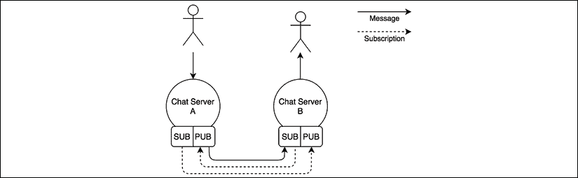

图 13.10：使用 ZeroMQ PUB/SUB 套接字的聊天服务器消息架构

*图 13.10* 展示了当我们有两个聊天应用程序实例时的信息流，但相同的原理也可以应用于 *N* 个实例。这种架构告诉我们，每个节点必须意识到系统中的其他节点，才能建立所有必要的连接。它还展示了订阅是如何从 `SUB` 套接字流向 `PUB` 套接字的，而消息则相反方向传输。

### 使用 ZeroMQ PUB/SUB 套接字

让我们通过修改我们的聊天服务器来了解 ZeroMQ `PUB`/`SUB` 套接字在实际中的应用：

```js
import { createServer } from 'http'
import staticHandler from 'serve-handler'
import ws from 'ws'
import yargs from 'yargs'                                    // (1)
import zmq from 'zeromq'
// serve static files
const server = createServer((req, res) => {
  return staticHandler(req, res, { public: 'www' })
})
let pubSocket
async function initializeSockets () {
  pubSocket = new zmq.Publisher()                            // (2)
  await pubSocket.bind(`tcp://127.0.0.1:${yargs.argv.pub}`)
  const subSocket = new zmq.Subscriber()                     // (3)
  const subPorts = [].concat(yargs.argv.sub)
  for (const port of subPorts) {
    console.log(`Subscribing to ${port}`)
    subSocket.connect(`tcp://127.0.0.1:${port}`)
  }
  subSocket.subscribe('chat')
  for await (const [msg] of subSocket) {                     // (4)
    console.log(`Message from another server: ${msg}`)
    broadcast(msg.toString().split(' ')[1])
  }
}
initializeSockets()
const wss = new ws.Server({ server })
wss.on('connection', client => {
  console.log('Client connected')
  client.on('message', msg => {
    console.log(`Message: ${msg}`)
    broadcast(msg)
    pubSocket.send(`chat ${msg}`)                            // (5)
  })
})
function broadcast (msg) {
  for (const client of wss.clients) {
    if (client.readyState === ws.OPEN) {
      client.send(msg)
    }
  }
}
server.listen(yargs.argv.http || 8080) 
```

上述代码清楚地表明，我们应用程序的逻辑变得稍微复杂了一些，然而，考虑到我们正在实现一个点对点发布/订阅模式，它仍然很简单。让我们看看所有这些部分是如何组合在一起的：

1.  我们导入两个新的包。首先，我们导入 `yargs` ([nodejsdp.link/yargs](http://nodejsdp.link/yargs))，这是一个命令行参数解析器；我们需要这个来轻松接受命名参数。其次，我们导入 `zeromq` 包([nodejsdp.link/zeromq](http://nodejsdp.link/zeromq))，这是一个 ZeroMQ 的 Node.js 客户端。

1.  在 `initializeSockets()` 函数中，我们立即创建我们的 `Publisher` 套接字并将其绑定到 `--pub` 命令行参数中提供的端口。

1.  我们创建 `Subscriber` 套接字并将其连接到我们应用程序其他实例的 `Publisher` 套接字。目标 `Publisher` 套接字的端口在 `--sub` 命令行参数中提供（可能不止一个）。然后，我们通过提供 `chat` 作为过滤器来创建实际的订阅，这意味着我们只会接收到以 `chat` 开头的消息。

1.  我们使用 `for await...of` 循环开始监听到达我们的 `Subscriber` 套接字的消息，因为 `subSocket` 是一个异步可迭代对象。对于收到的每条消息，我们进行一些简单的解析以移除 `chat` 前缀，然后通过 `broadcast()` 将实际的有效负载广播给连接到当前 WebSocket 服务器的所有客户端。

1.  当当前实例的 WebSocket 服务器接收到一条新消息时，我们将它广播给所有连接的客户端，但我们也会通过我们的 `Publisher` 套接字发布它。我们使用 `chat` 作为前缀，后面跟着一个空格，这样消息就会被发布到所有使用 `chat` 作为过滤器的订阅中。

我们现在已经构建了一个简单的分布式系统，使用点对点发布/订阅模式进行集成！

让我们启动它，确保通过正确连接它们的 `Publisher` 和 `Subscriber` 套接字来启动我们应用程序的三个实例：

```js
node index.js --http 8080 --pub 5000 --sub 5001 --sub 5002
node index.js --http 8081 --pub 5001 --sub 5000 --sub 5002
node index.js --http 8082 --pub 5002 --sub 5000 --sub 5001 
```

第一个命令将启动一个实例，该实例有一个监听在端口`8080`的 HTTP 服务器，同时将其`Publisher`套接字绑定在端口`5000`上，并将`Subscriber`套接字连接到端口`5001`和`5002`，这是其他两个实例的`Publisher`套接字应该监听的地方。其他两个命令以类似的方式工作。

现在，你首先会看到的是，如果`Subscriber`套接字无法连接到`Publisher`套接字，ZeroMQ 不会抱怨。例如，在第一次命令执行时，没有`Publisher`套接字监听在端口`5001`和`5002`上，然而，ZeroMQ 并没有抛出任何错误。这是因为 ZeroMQ 被设计成具有容错性，并实现了内置的连接重试机制。如果任何节点宕机或重启，这个特性尤其有用。同样的**宽容**逻辑也适用于`Publisher`套接字：如果没有订阅，它将简单地丢弃所有消息，但会继续工作。

在这一点上，我们可以尝试使用浏览器导航到我们启动的任何服务器实例，并验证消息是否被正确传播到所有聊天服务器。

在前面的例子中，我们假设了一个静态架构，其中实例的数量和它们的地址是事先已知的。我们可以引入一个服务注册表，如第十二章*可扩展性和架构模式*中所述，以动态连接我们的实例。重要的是要指出，ZeroMQ 可以使用我们在这里展示的相同原语来实现一个代理。

## 使用队列进行可靠的消息交付

在消息系统中，一个重要的抽象是**消息队列**（**MQ**）。有了消息队列，消息的发送者和接收者不必同时活跃和连接以建立通信，因为排队系统负责存储消息，直到目的地能够接收它们。这种行为与*火速遗忘*范例相反，其中订阅者只能在连接到消息系统时接收消息。

能够始终可靠地接收所有消息的订阅者，即使是在它没有监听时发送的消息，被称为**持久订阅者**。

我们可以将消息系统的**交付语义**总结为三个类别：

+   **最多一次**：也称为*火速遗忘*，消息不会被持久化，交付也不会得到确认。这意味着在接收者崩溃或断开连接的情况下，消息可能会丢失。

+   **至少一次**：消息保证至少被接收一次，但如果例如接收者在通知发送者接收之前崩溃，可能会发生重复。这意味着消息必须在可能需要再次发送的情况下持久化。

+   **恰好一次**：这是最可靠的投递语义。它保证消息只被接收一次。这以牺牲较慢和更密集的数据确认机制为代价。

当我们的消息系统可以实现“至少一次”或“恰好一次”的投递语义时，我们就拥有了一个持久订阅者，为了做到这一点，系统必须使用消息队列在订阅者断开连接时积累消息。队列可以存储在内存中或持久化到磁盘上，以便在队列系统重启或崩溃时恢复其消息。

以下图表显示了由消息队列支持的可持久订阅者的图形表示：

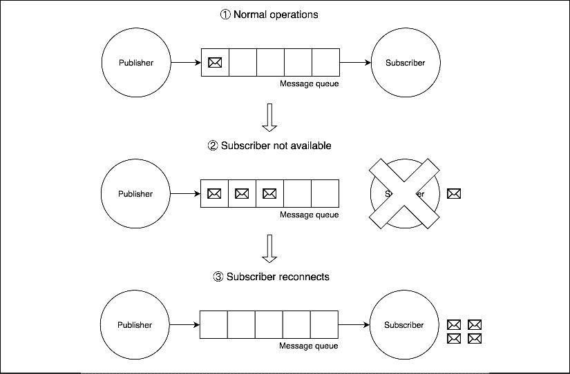

图 13.11：基于队列的消息系统的示例行为

*图 13.11* 展示了消息队列如何帮助我们实现持久订阅者模式。正如我们所见，在正常操作期间（1），消息通过消息队列从发布者传输到订阅者。当订阅者因崩溃、故障或简单的计划维护期而离线（2）时，发布者发送的任何消息都会安全地存储和积累在消息队列中。之后，当订阅者重新上线（3）时，队列中积累的所有消息都会发送给订阅者，因此不会丢失任何消息。

持久订阅者可能是消息队列所启用的最重要的模式，但绝对不是唯一的，正如我们将在本章后面看到的那样。

接下来，我们将学习 AMQP，这是我们将在本章的其余部分用来实现消息队列示例的协议。

### 介绍 AMQP

消息队列通常用于消息不能丢失的情况，这包括银行系统、空中交通管理及控制系统、医疗应用等关键任务应用。这通常意味着典型的企业级消息队列是一个非常复杂的软件组件，它利用了防弹协议和持久化存储来确保即使在出现故障的情况下也能保证消息的投递。因此，多年来，企业消息中间件一直是像 Oracle 和 IBM 这样的科技巨头的专属领域，他们通常实施自己的专有协议，导致客户锁定现象严重。幸运的是，自从消息系统进入主流以来，已经有几年时间了，这得益于像 AMQP、STOMP 和 MQTT 这样的开放协议的增长。在接下来的章节中，我们将使用 AMQP 作为我们的队列系统的消息协议，因此让我们给它一个适当的介绍。

**AMQP** 是由许多消息队列系统支持的开放标准协议。除了定义一个通用的通信协议外，它还提供了一个模型来描述路由、过滤、队列、可靠性和安全性。

以下图表展示了所有 AMQP 组件的概览：

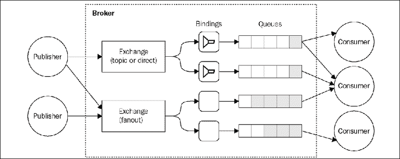

图 13.12：基于 AMQP 的消息系统示例

如 *图 13.12* 所示，在 AMQP 中有三个基本组件：

+   **队列**：负责存储客户端消费的消息的数据结构。队列中的消息会被推送到一个或多个消费者。如果同一队列连接了多个消费者，消息将在它们之间进行负载均衡。队列可以是以下任何一种：

    +   **持久**：这意味着如果代理重启，队列将自动重新创建。持久队列并不意味着其内容也会被保留；实际上，只有标记为持久的消息才会保存到磁盘并在重启时恢复。

    +   **专用**：这意味着队列仅绑定到特定的订阅者连接。当连接关闭时，队列将被销毁。

    +   **自动删除**：这将导致当最后一个订阅者断开连接时删除队列。

+   **交换**：这是消息发布的地点。交换根据其实现的算法将消息路由到一个或多个队列：

    +   **直接交换**：通过匹配整个路由键（例如，`chat.msg`）来路由消息

    +   **主题交换**：它使用与路由键匹配的 glob-like 模式来分发消息（例如，`chat.#` 匹配以 `chat.` 开头的所有路由键）。

    +   **扇出交换**：它将消息广播到所有连接的队列，忽略任何提供的路由键。

+   **绑定**：这是交换机和队列之间的链接。它还定义了用于过滤从交换机到达的消息的路由键或模式。

这些组件由一个代理管理，该代理公开了一个用于创建和操作它们的 API。当连接到代理时，客户端创建一个 **通道**——连接的抽象，它负责维护与代理的通信状态。

在 AMQP 中，我们可以通过创建任何非专用或自动删除的队列来获得持久订阅者模式。

AMQP 模型比我们迄今为止使用的消息系统（Redis 和 ZeroMQ）要复杂得多。然而，它提供了一套功能和可靠性级别，仅使用原始的发布/订阅机制很难获得。

您可以在 RabbitMQ 网站上找到对 AMQP 模型的详细介绍：[nodejsdp.link/amqp-components](http://nodejsdp.link/amqp-components)。

### AMQP 和 RabbitMQ 的持久订阅者

现在我们来练习我们关于持久订阅者和 AMQP 的知识，并工作在一个小例子上。一个重要的场景是，当我们想要保持微服务架构中不同服务的同步时（我们已经在上一章中描述了这种集成模式）。如果我们想使用代理来确保所有服务保持一致，那么我们很重要的一点是不要丢失任何信息，否则我们可能会陷入不一致的状态。

#### 设计聊天应用的历史服务

现在我们将使用微服务方法扩展我们的小型聊天应用。让我们添加一个历史服务，将我们的聊天消息持久化存储在数据库中，这样当客户端连接时，我们可以查询该服务并检索整个聊天历史。我们将使用 RabbitMQ 代理([nodejsdp.link/rabbitmq](http://nodejsdp.link/rabbitmq))和 AMQP 将历史服务与聊天服务器集成。

下面的图示显示了我们的计划架构：

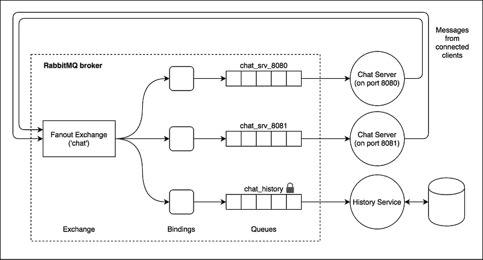

图 13.13：我们的聊天应用架构与 AMQP 和历史服务

如*图 13.13*所示，我们将使用单个 fanout 交换机；我们不需要任何复杂的路由逻辑，因此我们的场景不需要比这更复杂的交换机。接下来，我们将为每个聊天服务器的实例创建一个队列。

这些队列是专用的，因为我们不感兴趣在聊天服务器离线时接收任何丢失的消息；这是历史服务的任务，它最终也可以对存储的消息执行更复杂的查询。在实践中，这意味着我们的聊天服务器不是持久订阅者，它们的队列将在连接关闭时被销毁。而历史服务不能承受任何消息的丢失，否则它将无法实现其根本目的。因此，我们将为它创建的队列必须是持久的，这样任何在历史服务断开连接时发布的消息都将被保留在队列中，并在它重新上线时交付。

我们将使用熟悉的 LevelUP 作为历史服务的存储引擎，同时我们将使用`amqplib`包([nodejsdp.link/amqplib](http://nodejsdp.link/amqplib))通过 AMQP 协议连接到 RabbitMQ。

下面的例子需要一个正在运行的 RabbitMQ 服务器，监听其默认端口。更多信息，请参阅其官方安装指南[`nodejsdp.link/rabbitmq-getstarted`](http://nodejsdp.link/rabbitmq-getstarted)。

#### 使用 AMQP 实现历史服务

现在，让我们实现我们的历史服务！我们将创建一个独立的应用程序（一个典型的微服务），它实现于`historySvc.js`模块。该模块由两部分组成：一个 HTTP 服务器，用于向客户端公开聊天历史；以及一个 AMQP 消费者，负责捕获聊天消息并将它们存储在本地数据库中。

让我们看看下面的代码中它是如何实现的：

```js
import { createServer } from 'http'
import level from 'level'
import timestamp from 'monotonic-timestamp'
import JSONStream from 'JSONStream'
import amqp from 'amqplib'
async function main () {
  const db = level('./msgHistory')
  const connection = await amqp.connect('amqp://localhost')  // (1)
  const channel = await connection.createChannel()
  await channel.assertExchange('chat', 'fanout')             // (2)
  const { queue } = channel.assertQueue('chat_history')      // (3)
  await channel.bindQueue(queue, 'chat')                     // (4)
  channel.consume(queue, async msg => {                      // (5)
    const content = msg.content.toString()
    console.log(`Saving message: ${content}`)
    await db.put(timestamp(), content)
    channel.ack(msg)
  })
  createServer((req, res) => {
    res.writeHead(200)
    db.createValueStream()
      .pipe(JSONStream.stringify())
      .pipe(res)
  }).listen(8090)
}
main().catch(err => console.error(err)) 
```

我们可以立即看到，AMQP 需要一点设置，这是创建和连接模型所有组件所必需的。让我们详细看看它是如何工作的：

1.  我们首先与 AMQP 代理建立连接，在我们的例子中是 RabbitMQ。然后，我们创建一个通道，它类似于一个会话，将保持我们通信的状态。

1.  接下来，我们设置一个名为`chat`的交换机。正如我们之前提到的，它是一个`fanout`交换机。`assertExchange()`命令将确保交换机在代理上存在，否则它将创建它。

1.  我们还创建了一个名为`chat_history`的队列。默认情况下，队列是持久的（不是`exclusive`也不是`auto-delete`），因此我们不需要传递任何额外的选项来支持持久的订阅者。

1.  接下来，我们将队列绑定到我们之前创建的交换机。在这里，我们不需要任何其他特定的选项（如路由键或模式），因为交换机是`fanout`类型，所以它不执行任何过滤。

1.  最后，我们可以开始监听来自我们刚刚创建的队列的消息。我们使用单调时间戳作为键将我们接收到的每条消息保存到 LevelDB 数据库中（见[nodejsdp.link/monotonic-timestamp](http://nodejsdp.link/monotonic-timestamp)），以按日期排序消息。同时，我们也注意到我们使用`channel.ack(msg)`来确认每条消息，但只有在消息成功保存到数据库后才会这样做。如果代理没有收到 ACK（确认），则消息将保留在队列中以便再次处理。

如果我们不想发送显式的确认，我们可以将`{ noAck: true }`选项传递给`channel.consume()`API。

#### 将聊天应用程序与 AMQP 集成

要使用 AMQP 集成聊天服务器，我们必须使用与我们在历史服务中实现的方式非常相似的设置，但有一些小的变化。因此，让我们看看引入 AMQP 后新的`index.js`模块看起来如何：

```js
import { createServer } from 'http'
import staticHandler from 'serve-handler'
import ws from 'ws'
import amqp from 'amqplib'
import JSONStream from 'JSONStream'
import superagent from 'superagent'
const httpPort = process.argv[2] || 8080
async function main () {
  const connection = await amqp.connect('amqp://localhost')
  const channel = await connection.createChannel()
  await channel.assertExchange('chat', 'fanout')
  const { queue } = await channel.assertQueue(               // (1)
    `chat_srv_${httpPort}`,
    { exclusive: true }
  )
  await channel.bindQueue(queue, 'chat')
  channel.consume(queue, msg => {                            // (2)
    msg = msg.content.toString()
    console.log(`From queue: ${msg}`)
    broadcast(msg)
  }, { noAck: true })
  // serve static files
  const server = createServer((req, res) => {
    return staticHandler(req, res, { public: 'www' })
  })
  const wss = new ws.Server({ server })
  wss.on('connection', client => {
    console.log('Client connected')
    client.on('message', msg => {
      console.log(`Message: ${msg}`)
      channel.publish('chat', '', Buffer.from(msg))          // (3)
    })
    // query the history service
    superagent                                               // (4)
      .get('http://localhost:8090')
      .on('error', err => console.error(err))
      .pipe(JSONStream.parse('*'))
      .on('data', msg => client.send(msg))
  })
  function broadcast (msg) {
    for (const client of wss.clients) {
      if (client.readyState === ws.OPEN) {
        client.send(msg)
      }
    }
  }
  server.listen(httpPort)
}
main().catch(err => console.error(err)) 
```

如我们所见，AMQP 在这个场合也让代码变得稍微冗长了一些，但到目前为止，我们应该已经熟悉了其中大部分。只是有几个方面需要注意：

1.  正如我们提到的，我们的聊天服务器不需要是一个持久的订阅者：一个“发射并忘记”的范式就足够了。因此，当我们创建我们的队列时，我们传递了`{ exclusive: true }`选项，表示队列的作用域仅限于当前连接，因此当聊天服务器关闭时，它将被销毁。

1.  由于与前一点相同的原因，当我们从队列中读取消息时，我们不需要发送任何确认。因此，为了使事情更简单，我们在开始从队列中消费消息时传递了 `{ noAck: true }` 选项。

1.  发布一条新消息也非常简单。我们只需指定目标交换机（`chat`）和一个路由键，在我们的例子中，这是一个空字符串（`''`），因为我们使用的是扇出交换机，所以不需要执行任何路由。

1.  我们聊天服务器的另一个独特之处在于，我们现在可以向用户展示完整的聊天历史，这要归功于我们的历史微服务。我们通过查询历史微服务，并在建立新连接时立即将每条过去的信息发送给客户端来实现这一点。

现在我们可以运行我们新的改进后的聊天应用了。为此，首先确保你的机器上运行着 RabbitMQ，然后让我们在三个不同的终端中启动两个聊天服务器和历史服务：

```js
node index.js 8080
node index.js 8081
node historySvc.js 
```

我们现在应该关注我们的系统，特别是历史服务，在出现故障时的行为。如果我们停止历史服务器，并继续使用聊天应用的 Web UI 发送消息，我们会看到当历史服务器重新启动时，它会立即接收到它错过的所有消息。这是一个完美的演示，说明了持久订阅模式是如何工作的！

看到微服务方法如何使我们的系统即使在缺少其组件之一——历史服务的情况下也能生存，这很有趣。虽然功能会有暂时性的减少（没有聊天历史可用），但人们仍然能够实时交换聊天消息。太棒了！

## 使用流进行可靠的消息传递

在本章的开头，我们提到消息队列的一个可能替代方案是**流**。这两个范例在范围上相似，但在处理消息的方法上根本不同。在本节中，我们将通过利用 Redis Streams 来实现我们的聊天应用，来揭示流的力量。

### 流媒体平台的特征

在系统集成的情况下，一个**流**（或**日志**）是一个有序的、只追加的、持久的数据结构。消息——在流的情况下，更恰当地称为**记录**——总是添加到流的末尾，并且与队列不同，它们在消费后不会自动删除。本质上，这个特征使流更像是一个数据存储，而不是消息代理。像数据存储一样，流可以被查询以检索一批过去的记录或从特定记录开始回放。

流的另一个重要特征是，记录是由消费者从流中拉取的。这本质上是允许消费者以自己的节奏处理记录，而不会风险被淹没。

基于这些特性，流使我们能够直接实现可靠的消息传递，因为从流中永远不会丢失任何数据（尽管数据仍然可以被显式删除，或者可以在可选的保留期后删除）。事实上，如 *图 13.14* 所示，如果消费者崩溃，它只需从上次停止的地方开始读取流：

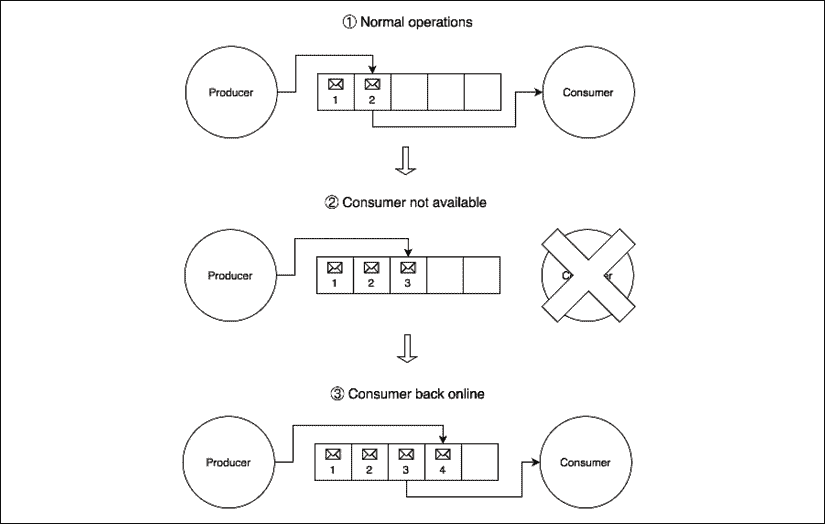

图 13.14：使用流实现可靠的消息传递

如 *图 13.14* 所示，在正常操作期间（1）消费者在生产者添加记录后立即处理流中的记录。当消费者因问题或计划维护而不可用（2）时，生产者会继续像往常一样向流中添加记录。当消费者重新上线（3）时，它从上次离开的地方开始处理记录。这个机制的主要方面是它非常简单和基础，但它在确保即使消费者不可用时也不会丢失任何消息方面非常有效。

### 流与消息队列的比较

如我们所见，消息队列和流之间有很多不同之处，也有很多相似之处。那么，在什么情况下你应该使用其中一个而不是另一个呢？

好吧，流的最明显用途是在我们需要处理顺序数据（流数据）时，这些数据可能还需要消费者批量处理消息或查找过去消息中的相关性。此外，现代流平台允许每秒处理数吉字节的数据，并将数据及其处理分布在多个节点上。

无论是消息队列还是流，都非常适合实现简单的发布/订阅模式，即使是有可靠的消息传递。然而，消息队列更适合复杂的系统集成任务，因为它们提供了高级的消息路由，并允许我们对不同消息有不同的优先级（在流中，记录的顺序始终被保留）。

正如我们稍后将会看到的，两者也可以用来实现任务分配模式，尽管在标准架构中，由于消息优先级和更高级的路由机制，消息队列可能更适合。

### 使用 Redis Streams 实现聊天应用

在撰写本文时，最受欢迎的流平台是 Apache Kafka ([nodejsdp.link/kafka](http://nodejsdp.link/kafka)) 和 Amazon Kinesis ([nodejsdp.link/kinesis](http://nodejsdp.link/kinesis))。然而，对于更简单的任务，我们还可以依赖 Redis，它实现了一个称为 **Redis Streams** 的日志数据结构。

在接下来的代码示例中，我们将通过调整我们的聊天应用来展示 Redis 流的实际应用。使用流而不是消息队列的即时优势是，我们不需要依赖一个专门的组件来存储和检索聊天室中交换的消息的历史记录，而只需在需要访问旧消息时简单地查询流。正如我们将看到的，这极大地简化了我们的应用程序架构，并且确实使流比消息队列成为一个更好的选择，至少对于我们的非常简单的用例来说是这样。

那么，让我们深入一些代码。让我们更新我们的聊天应用程序的`index.js`以使用 Redis 流：

```js
import { createServer } from 'http'
import staticHandler from 'serve-handler'
import ws from 'ws'
import Redis from 'ioredis'
const redisClient = new Redis()
const redisClientXRead = new Redis()
// serve static files
const server = createServer((req, res) => {
  return staticHandler(req, res, { public: 'www' })
})
const wss = new ws.Server({ server })
wss.on('connection', async client => {
  console.log('Client connected')
  client.on('message', msg => {
    console.log(`Message: ${msg}`)
    redisClient.xadd('chat_stream', '*', 'message', msg)     // (1)
  })
  // Load message history
  const logs = await redisClient.xrange(                     // (2)
    'chat_stream', '-', '+')
  for (const [, [, message]] of logs) {
    client.send(message)
  }
})
function broadcast (msg) {
  for (const client of wss.clients) {
    if (client.readyState === ws.OPEN) {
      client.send(msg)
    }
  }
}
let lastRecordId = '$'
async function processStreamMessages () {                    // (3)
  while (true) {
    const [[, records]] = await redisClientXRead.xread(
      'BLOCK', '0', 'STREAMS', 'chat_stream', lastRecordId)
    for (const [recordId, [, message]] of records) {
      console.log(`Message from stream: ${message}`)
      broadcast(message)
      lastRecordId = recordId
    }
  }
}
processStreamMessages().catch(err => console.error(err))
server.listen(process.argv[2] || 8080) 
```

总体而言，应用程序的结构保持不变；改变的是我们用来与其他应用程序实例交换消息的 API。

让我们更仔细地看看这些 API：

1.  我们想要分析的第一个命令是`xadd`。这个命令将一个新的记录追加到流中，我们使用它来添加从连接的客户端接收到的新的聊天消息。我们向`xadd`传递以下参数：

    1.  流的名称，在我们的例子中是`chat_stream`。

    1.  记录的 ID。在我们的例子中，我们提供了一个星号（`*`），这是一个特殊的 ID，请求 Redis 为我们生成一个 ID。这通常是我们的需求，因为 ID 必须是单调的，以保持记录的字典序，而 Redis 会为我们处理这一点。

    1.  它遵循一系列键值对。在我们的例子中，我们只指定了`'message'`键的值`msg`（这是我们从客户端接收到的消息）。

1.  这是有趣的流使用的一个方面：我们查询流的过去记录来检索聊天历史。每次客户端连接时，我们都会这样做。我们使用`xrange`命令来完成这项任务，正如其名称所暗示的，它允许我们在两个指定的 ID 之间检索流中的所有记录。在我们的例子中，我们使用了特殊的 ID `'-'`（减号）和`'+'`（加号），它们表示最低可能的 ID 和最高可能的 ID。这实际上意味着我们想要检索流中当前的所有记录。

1.  我们新聊天应用程序中最有趣的部分之一是我们等待新记录被添加到流中。这允许每个应用程序实例在消息被添加到队列时读取新的聊天消息，这对于集成工作至关重要。我们使用无限循环和`xread`命令来完成这项任务，提供以下参数：

    1.  `BLOCK`表示我们希望调用阻塞，直到有新消息到达。

    1.  接下来，我们指定命令超时后直接返回一个`null`结果。在我们的例子中，`0`表示我们希望无限期地等待。

    1.  `STREAMS`是一个关键字，告诉 Redis 我们现在将指定我们想要读取的流的详细信息。

    1.  `chat_stream`是我们想要读取的流的名称。

    1.  最后，我们提供记录 ID（`lastRecordId`），这是我们想要开始读取新消息之后的 ID。最初，这设置为`$`（美元符号），这是一个特殊 ID，表示当前流中最高的 ID，应该基本上在流中的最后一个记录之后开始读取流。在我们读取第一个记录后，我们使用读取的最后一个记录的 ID 更新`lastRecordId`变量。

在前面的例子中，我们还使用了一些巧妙的解构指令。例如，考虑以下代码：

```js
for (const [, [, message]] of logs) {...} 
```

这个指令可以扩展为以下内容：

```js
for (const [recordId, [propertyId, message]] of logs) {...} 
```

但由于我们不对获取`recordId`和`propertyId`感兴趣，所以我们只是将它们从解构指令中排除。这种特定的解构，与`for...of 循环`结合使用，是解析`xrange`命令返回的数据所必需的，在我们的案例中，其形式如下：

```js
[
  ["1588590110918-0", ["message", "This is a message"]],
  ["1588590130852-0", ["message", "This is another message"]]
] 
```

我们应用了类似的原则来解析`xread`的返回值。请参考这些指令的 API 文档以获取它们返回值的详细解释。

你可以在官方 Redis 文档中了解更多关于`xadd`命令和记录 ID 格式的信息，[nodejsdp.link/xadd](http://nodejsdp.link/xadd)。

`xread`命令也有一个相当复杂的参数列表和返回值，你可以在[nodejsdp.link/xread](http://nodejsdp.link/xread)了解更多。

还请查看`xrange`的文档，[nodejsdp.link/xrange](http://nodejsdp.link/xrange)。

现在，你可以再次启动几个服务器实例，测试应用程序以查看新实现的效果。

再次强调一个有趣的事实，我们不需要依赖专门的组件来管理我们的聊天历史，而只需从流中检索过去的记录即可，使用`xrange`。流这一特性使得它们本质上可靠，因为没有消息是*丢失*的，除非明确删除。

可以使用`xdel` ([nodejsdp.link/xdel](http://nodejsdp.link/xdel))或`xtrim`命令([nodejsdp.link/xtrim](http://nodejsdp.link/xtrim))，或者使用`xadd`命令的`MAXLEN`选项([nodejsdp.link/xadd-maxlen](http://nodejsdp.link/xadd-maxlen))从流中删除记录。

这就结束了我们对发布/订阅模式的探索。现在，是时候发现另一个重要的消息模式类别：任务分配模式。

# 任务分配模式

在*第十一章*，*高级食谱*中，你学习了如何将耗时的任务委派给多个本地进程。尽管这是一个有效的方法，但它不能扩展到单台机器的边界之外，因此在本节中，我们将看到如何在一个分布式架构中使用类似的模式，使用位于网络任何位置的远程工作者。

理念是拥有一种消息模式，使我们能够将任务分散到多台机器上。这些任务可能是单个工作块或使用 *分而治之* 方法分割的大任务的一部分。

如果我们查看以下图中表示的逻辑架构，我们应该能够识别出一个熟悉的模式：

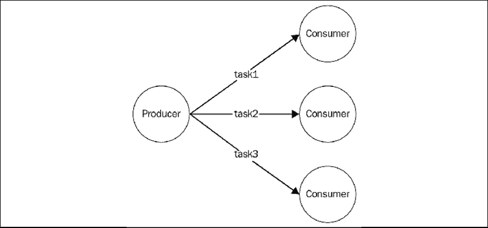

图 13.15：将任务分配给一组消费者

如我们从 *图 13.15* 的图中可以看到，发布/订阅模式不适用于此类应用程序，因为我们绝对不希望任务被多个工作者接收。我们需要的，是一个类似于负载均衡器的消息分配模式，将每条消息分配给不同的消费者（在这种情况下也称为 **工作者**）。在消息系统术语中，这种模式也称为 **竞争消费者**、fanout 分配或 **通风器**。

与我们在上一章中看到的 HTTP 负载均衡器的一个重要区别是，在这里，消费者有更积极的角色。实际上，正如我们稍后将看到的，大多数时候不是生产者连接到消费者，而是消费者自己连接到任务生产者或任务队列以接收新工作。这在可扩展系统中是一个巨大的优势，因为它允许我们无缝地增加工作者的数量，而无需修改生产者或采用服务注册表。

此外，在通用消息系统中，我们不一定在生产者和工作者之间有请求/回复通信。相反，大多数情况下，首选的方法是使用单向异步通信，这可以实现更好的并行性和可扩展性。在这种架构中，消息可能始终单向传输，创建 **管道**，如下图中所示：

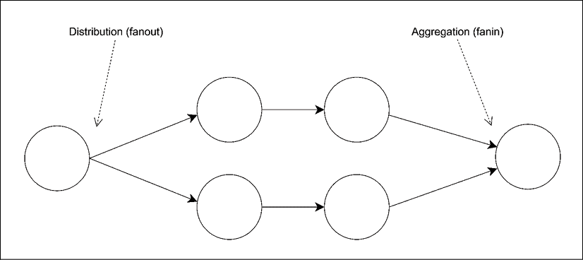

图 13.16：消息管道

管道允许我们构建非常复杂的处理架构，而不需要同步请求/回复通信的开销，通常会导致更低的延迟和更高的吞吐量。在 *图 13.16* 中，我们可以看到消息如何被分配到一组工作者（fanout），转发到其他处理单元，然后聚合到一个单一节点（fanin），通常称为 **汇点**。

在本节中，我们将关注这类架构的构建块，通过分析两种最重要的变体：对等和基于代理的。

管道与任务分配模式的组合也称为 **并行管道**。

## ZeroMQ Fanout/Fanin 模式

我们已经发现了 ZeroMQ 在构建对等分布式架构方面的某些功能。实际上，在前一节中，我们使用了 `PUB` 和 `SUB` 插座将单条消息传播给多个消费者，现在我们将看到如何使用另一对称为 `PUSH` 和 `PULL` 的插座构建并行管道。

### PUSH/PULL 插座

直观地说，我们可以认为 `PUSH` 插座是为 *发送* 消息而设计的，而 `PULL` 插座是为 *接收* 消息而设计的。然而，它们有一些额外的功能，使它们非常适合构建单向通信系统：

+   它们都可以在 *连接* 模式或 *绑定* 模式下工作。换句话说，我们可以创建一个 `PUSH` 插座并将其绑定到本地端口，以监听来自 `PULL` 插座的传入连接，或者反之亦然，一个 `PULL` 插座可能会监听来自 `PUSH` 插座的连接。消息始终沿同一方向传输，从 `PUSH` 到 `PULL`，只是连接的发起者可能不同。绑定模式是 *持久* 节点（例如，任务生产者和汇入点）的最佳解决方案，而连接模式是 *短暂* 节点（例如，任务工作者）的完美选择。这允许短暂节点的数量任意变化，而不会影响更稳定、持久的节点。

+   如果有多个 `PULL` 插座连接到单个 `PUSH` 插座，消息将均匀地分布在所有 `PULL` 插座上。在实践中，它们是负载均衡的（对等负载均衡！）。另一方面，接收来自多个 `PUSH` 插座的消息的 `PULL` 插座将使用公平队列系统处理消息，这意味着它们从所有来源均匀消费——对入站消息应用轮询。

+   没有连接任何 `PULL` 插座的 `PUSH` 插座发送的消息不会丢失。相反，它们会被排队，直到节点上线并开始拉取消息。

我们现在开始理解 ZeroMQ 与传统 Web 服务有何不同，以及为什么它是构建分布式消息系统的完美工具。

### 使用 ZeroMQ 构建分布式哈希校验破解器

现在是时候构建一个示例应用程序，以查看我们刚才描述的 `PUSH`/`PULL` 插座的特性了。

一个简单而迷人的应用示例是 *哈希校验破解器*：一个使用暴力破解法尝试将给定的哈希值（如 MD5 或 SHA1）与给定字母表中每个可能字符变体的哈希值相匹配的系统，从而发现原始字符串是由给定的哈希值创建的。

这是一个 *令人尴尬的并行* 工作负载 ([nodejsdp.link/embarrassingly-parallel](http://nodejsdp.link/embarrassingly-parallel))，非常适合构建一个展示并行管道力量的示例。

永远不要使用纯哈希值来加密密码，因为它们很容易被破解。相反，使用专门设计的算法，如**bcrypt**([nodejsdp.link/bcrypt](http://nodejsdp.link/bcrypt))、**scrypt**([nodejsdp.link/scrypt](http://nodejsdp.link/scrypt))、**PBKDF2**([nodejsdp.link/pbkdf2](http://nodejsdp.link/pbkdf2))或**Argon2**([nodejsdp.link/argon2](http://nodejsdp.link/argon2))。

对于我们的应用程序，我们希望实现一个典型的并行管道，其中包含以下内容：

+   一个节点用于创建和分配任务到多个工作者

+   多个工作节点（实际计算发生的地方）

+   一个节点用于收集所有结果

我们刚才描述的系统可以使用以下架构在 ZeroMQ 中实现：

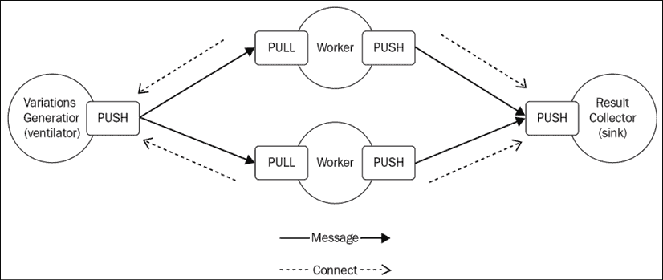

图 13.17：使用 ZeroMQ 的典型管道架构

在我们的架构中，我们有一个*通风器*生成给定字母表（例如，'aa'到'bb'的区间包括变体'aa'、'ab'、'ba'、'bb'）的字符变体区间，并将这些区间作为任务分配给工作者。然后，每个工作者计算给定区间中每个变体的哈希值，尝试将每个生成的哈希值与作为输入提供的控制哈希值匹配。如果找到匹配项，结果将被发送到结果收集节点（汇点）。

我们架构中的持久节点是通风器和汇点，而临时节点是工作者。这意味着每个工作者将其`PULL`套接字连接到通风器，将其`PUSH`套接字连接到汇点，这样我们就可以启动和停止任意数量的工作者，而无需在通风器或汇点中更改任何参数。

#### 实现生产者

为了表示变体区间，我们将使用索引 n 叉树。如果我们想象有一个每个节点恰好有*n*个子节点的树，其中每个子节点是给定字母表中的*n*个元素之一，并且我们按广度优先顺序为每个节点分配一个索引，那么，给定字母表`[a, b]`，我们应该得到如下所示的树：

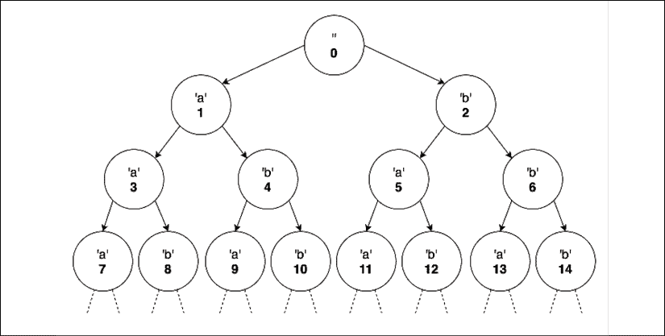

图 13.18：字母表[a, b]的索引 n 叉树

通过从根节点遍历到指定的索引，并将沿途找到的节点元素添加到正在计算的变体中，可以获取对应索引的变体。例如，给定*图 13.18*中的树，对应索引 13 的变体将是'bb'。

我们将利用`indexed-string-variation`包([nodejsdp.link/indexed-string-variation](http://nodejsdp.link/indexed-string-variation))来帮助我们根据其在 n 叉树中的索引计算相应的变体。此操作在工作者节点上完成，因此我们只需要在通风器中生成要提供给工作者的索引区间，然后工作者将计算这些区间中字符的所有变体的哈希值，尝试将每个生成的哈希值与作为输入提供的控制哈希值匹配。如果找到匹配项，结果将被发送到结果收集节点（汇点）。

现在，在必要的理论之后，让我们开始通过实现负责生成要分配的任务的组件来构建我们的系统（在`generateTasks.js`文件中）：

```js
export function * generateTasks (searchHash, alphabet,
  maxWordLength, batchSize) {
  let nVariations = 0
  for (let n = 1; n <= maxWordLength; n++) {
    nVariations += Math.pow(alphabet.length, n)
  }
  console.log('Finding the hashsum source string over ' +
    `${nVariations} possible variations`)
  let batchStart = 1
  while (batchStart <= nVariations) {
    const batchEnd = Math.min(
      batchStart + batchSize - 1, nVariations)
    yield {
      searchHash,
      alphabet: alphabet,
      batchStart,
      batchEnd
    }
    batchStart = batchEnd + 1
  }
} 
```

`generateTasks()`生成器创建大小为`batchSize`的整数区间，从`1`开始（我们排除了`0`，它是树的根，对应于空变体）到给定`alphabet`和提供的最大单词长度（`maxLength`）的最大可能索引。然后，我们将所有关于任务的数据打包到一个对象中，并将其`yield`给调用者。

请注意，为了生成更长的字符串，可能需要切换到`BigInt` ([nodejsdp.link/bigint](http://nodejsdp.link/bigint))来表示它们的索引，因为 JavaScript 当前可以管理的最大安全整数是 2⁵³ – 1，即`Number.MAX_SAFE_INTEGER`的值。请注意，使用非常大的整数可能会对变体生成器的性能产生负面影响。

现在，我们需要实现我们的生产者逻辑，它负责将任务分配给所有工作器（在`producer.js`文件中）：

```js
import zmq from 'zeromq'
import delay from 'delay'
import { generateTasks } from './generateTasks.js'
const ALPHABET = 'abcdefghijklmnopqrstuvwxyz'
const BATCH_SIZE = 10000
const [, , maxLength, searchHash] = process.argv
async function main () {
  const ventilator = new zmq.Push()                          // (1)
  await ventilator.bind('tcp://*:5016')
  await delay(1000) // wait for all the workers to connect
  const generatorObj = generateTasks(searchHash, ALPHABET,
    maxLength, BATCH_SIZE)
  for (const task of generatorObj) {
    await ventilator.send(JSON.stringify(task))              // (2)
  }
}
main().catch(err => console.error(err)) 
```

为了避免生成过多的变体，我们的生成器仅使用英语字母表的小写字母，并限制生成单词的大小。这个限制作为命令行参数（`maxLength`）提供，与要匹配的哈希值（`searchHash`）一起。

但我们最感兴趣分析的部分是如何在工作器之间分配任务：

1.  我们首先创建一个`PUSH`套接字，并将其绑定到本地端口`5016`，这是工作器的`PULL`套接字连接以接收其任务的地方。然后我们等待 1 秒钟，以便所有工作器都连接：我们这样做是因为如果生产者在工作器已经运行时开始，工作器可能会在不同时间连接（因为它们的基于计时器的重新连接算法），这可能会导致第一个连接的工作器接收大部分任务。

1.  对于每个生成的任务，我们将其转换为字符串并发送到一个工作器，使用`ventilator`套接字的`send()`函数。每个连接的工作器将根据轮询方法接收不同的任务。

#### 实现工作器

现在是时候实现工作器了，但首先，让我们创建一个组件来处理传入的任务（在`processTask.js`文件中）：

```js
import isv from 'indexed-string-variation'
import { createHash } from 'crypto'
export function processTask (task) {
  const variationGen = isv.generator(task.alphabet)
  console.log('Processing from ' +
    `${variationGen(task.batchStart)} (${task.batchStart}) ` +
    `to ${variationGen(task.batchEnd)} (${task.batchEnd})`)
  for (let idx = task.batchStart; idx <= task.batchEnd; idx++) {
    const word = variationGen(idx)
    const shasum = createHash('sha1')
    shasum.update(word)
    const digest = shasum.digest('hex')
    if (digest === task.searchHash) {
      return word
    }
  }
} 
```

`processTask()`函数的逻辑相当简单：它遍历给定的区间内的索引，然后对于每个索引，它生成相应的字符变体（`word`）。接下来，它计算`word`的 SHA1 校验和，并尝试将其与`task`对象中传递的`searchHash`匹配。如果两个摘要匹配，则它将源`word`返回给调用者。

现在我们已经准备好实现我们工作器的主逻辑（在`worker.js`文件中）：

```js
import zmq from 'zeromq'
import { processTask } from './processTask.js'
async function main () {
  const fromVentilator = new zmq.Pull()
  const toSink = new zmq.Push()
  fromVentilator.connect('tcp://localhost:5016')
  toSink.connect('tcp://localhost:5017')
  for await (const rawMessage of fromVentilator) {
    const found = processTask(JSON.parse(rawMessage.toString()))
    if (found) {
      console.log(`Found! => ${found}`)
      await toSink.send(`Found: ${found}`)
    }
  }
}
main().catch(err => console.error(err)) 
```

正如我们所说，我们的工作者代表我们架构中的一个临时节点，因此，它的套接字应该连接到远程节点而不是监听传入的连接。这正是我们在工作者中做的，我们创建了两个套接字：

+   一个连接到通风器的`PULL`套接字，用于接收任务

+   一个连接到接收器的`PUSH`套接字，用于传播结果

此外，我们的工作者完成的工作非常简单：它处理收到的每个任务，如果找到匹配项，我们就通过`toSink`套接字向结果收集器发送消息。

#### 实现结果收集器

对于我们的示例，结果收集器（接收器）是一个非常基础的程序，它只是将工作者接收到的消息打印到控制台。`collector.js`文件的内容如下：

```js
import zmq from 'zeromq'
async function main () {
  const sink = new zmq.Pull()
  await sink.bind('tcp://*:5017')
  for await (const rawMessage of sink) {
    console.log('Message from worker: ', rawMessage.toString())
  }
}
main().catch(err => console.error(err)) 
```

有趣的是看到结果收集器（就像生产者一样）也是我们架构中的一个持久节点，因此我们绑定它的`PULL`套接字而不是将其显式连接到工作者的`PUSH`套接字。

#### 运行应用程序

现在我们已经准备好启动我们的应用程序；让我们启动几个工作者和结果收集器（每个在不同的终端中）：

```js
node worker.js
node worker.js
node collector.js 
```

然后是启动生产者的时候了，指定要生成的单词的最大长度和我们想要匹配的 SHA1 校验和。以下是一个示例命令行：

```js
node producer.js 4 f8e966d1e207d02c44511a58dccff2f5429e9a3b 
```

当运行前面的命令时，生产者将开始生成任务并将它们分配给我们启动的工作者集合。我们告诉生产者生成所有可能的 4 个小写字母组成的单词（因为我们的字母表只包含小写字母），我们还提供了一个与秘密 4 字母单词对应的 SHA1 校验和样本。

如果有计算结果，将出现在结果收集器应用程序的终端中。

请注意，鉴于 ZeroMQ 中`PUSH`/`PULL`套接字的低级性质以及特别是缺乏消息确认，如果一个节点崩溃，那么它正在处理的全部任务都将丢失。可以在 ZeroMQ 之上实现自定义确认机制，但我们将把这个留作读者的练习。

这种实现的一个已知限制是，如果找到匹配项，工作者不会停止处理任务。这个特性是有意被省略的，以便尽可能使示例专注于正在讨论的模式。你可以尝试添加这个“停止”机制作为练习。

## AMQP 中的管道和竞争消费者

在上一节中，我们看到了如何在点对点环境中实现并行管道。现在，我们将探索当在基于代理的架构中使用 RabbitMQ 时应用此模式的情况。

### 点对点通信和竞争消费者

在对等网络配置中，管道是一个非常直观的概念。然而，在中间有消息代理的情况下，系统各个节点之间的关系就稍微难以理解了：代理本身充当我们通信的中介，而且我们通常并不真正知道谁在另一端监听消息。例如，当我们使用 AMQP 发送消息时，我们并不是直接将其发送到目的地，而是发送到一个交换机，然后到一个队列。最后，代理将根据交换机中定义的规则来决定将消息路由到何处。

如果我们想在类似 AMQP 的系统中实现管道和任务分配模式，我们必须确保每个消息只被一个消费者接收，但如果一个交换机可能绑定到多个队列，这就无法保证。因此，解决方案是直接将消息发送到目标队列，完全绕过交换机。这样，我们可以确保只有一个队列会收到消息。这种通信模式被称为**点对点**。

一旦我们能够直接将一组消息发送到单个队列，我们就已经完成了任务分配模式的一半。实际上，下一步自然而然地到来：当多个消费者监听同一个队列时，消息将均匀地分配给它们，遵循扇出分配模式。正如我们之前提到的，在消息代理的上下文中，这通常被称为**竞争消费者**模式。

接下来，我们将使用 AMQP 重新实现我们的简单哈希值破解器，这样我们可以欣赏到与之前章节中讨论的对等网络方法之间的差异。

### 使用 AMQP 实现哈希值破解器

我们刚刚了解到，交换机是代理中消息被多播到一组消费者的点，而队列是消息进行负载均衡的地方。带着这些知识，现在让我们在 AMQP 代理（在我们的例子中是 RabbitMQ）上实现我们的暴力破解哈希值破解器。以下图示为我们想要实现的系统的概述：

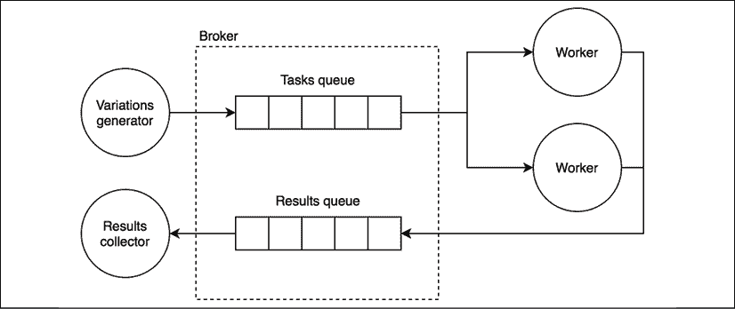

图 13.19：使用消息队列代理的任务分配架构

正如我们讨论的，为了将一组任务分配给多个工作者，我们需要使用单个队列。在*图 13.19*中，我们称这个队列为**任务队列**。在任务队列的另一侧，我们有一组工作者，它们是**竞争消费者**：换句话说，每个都会从队列中接收不同的消息。结果是，多个任务将在不同的工作者上并行执行。

工作进程生成的结果被发布到另一个队列，我们称之为*结果队列*，然后由结果收集器消费，实际上相当于一个接收器。在整个架构中，我们没有使用任何交换，我们只是直接将消息发送到它们的目标队列，实现了点对点类型的通信。

#### 实现生产者

让我们看看如何实现这样一个系统，从生产者（在`producer.js`文件中）开始：

```js
import amqp from 'amqplib'
import { generateTasks } from './generateTasks.js'
const ALPHABET = 'abcdefghijklmnopqrstuvwxyz'
const BATCH_SIZE = 10000
const [, , maxLength, searchHash] = process.argv
async function main () {
  const connection = await amqp.connect('amqp://localhost')
  const channel = await connection.createConfirmChannel()    // (1)
  await channel.assertQueue('tasks_queue')
  const generatorObj = generateTasks(searchHash, ALPHABET,
    maxLength, BATCH_SIZE)
  for (const task of generatorObj) {
    channel.sendToQueue('tasks_queue',                       // (2)
      Buffer.from(JSON.stringify(task)))
  }
  await channel.waitForConfirms()
  channel.close()
  connection.close()
}
main().catch(err => console.error(err)) 
```

如我们所见，没有交换或绑定的存在使得基于 AMQP 的应用程序的设置变得非常简单。然而，有几个细节需要注意：

1.  我们不是创建一个标准的通道，而是在创建一个`confirmChannel`。这是必要的，因为它创建了一个具有一些额外功能的通道，特别是它提供了我们在代码中稍后使用的`waitForConfirms()`函数，该函数用于等待代理确认接收了所有消息。这是必要的，以防止应用程序在所有消息从本地队列发送之前过早地关闭与代理的连接。

1.  生产者的核心是`channel.sendToQueue()` API，实际上对我们来说是个新概念。正如其名称所示，这是负责将消息直接发送到队列的 API——在我们的例子中是`tasks_queue`——绕过任何交换或路由。

#### 实现工作进程

在`tasks_queue`的另一侧，我们有监听传入任务的工人。让我们更新现有的`worker.js`模块代码以使用 AMQP：

```js
import amqp from 'amqplib'
import { processTask } from './processTask.js'
async function main () {
  const connection = await amqp.connect('amqp://localhost')
  const channel = await connection.createChannel()
  const { queue } = await channel.assertQueue('tasks_queue')
  channel.consume(queue, async (rawMessage) => {
    const found = processTask(
      JSON.parse(rawMessage.content.toString()))
    if (found) {
      console.log(`Found! => ${found}`)
      await channel.sendToQueue('results_queue',
        Buffer.from(`Found: ${found}`))
    }
    await channel.ack(rawMessage)
  })
}
main().catch(err => console.error(err)) 
```

我们的新工作进程与我们在上一节中使用 ZeroMQ 实现的类似，除了与消息交换相关的部分。在前面的代码中，我们可以看到我们首先获取名为`tasks_queue`的队列的引用，然后我们开始使用`channel.consume()`监听传入的任务。然后，每次找到匹配项时，我们通过`results_queue`将结果发送到收集器，再次使用点对点通信。同样重要的是要注意，我们在消息完全处理完毕后使用`channel.ack()`对每条消息进行确认。

如果启动了多个工作进程，它们都将监听同一个队列，导致消息在它们之间进行负载均衡（它们成为*竞争消费者*）。

#### 实现结果收集器

结果收集器再次是一个简单的模块，只是将接收到的任何消息打印到控制台。这实现在`collector.js`文件中，如下所示：

```js
import amqp from 'amqplib'
async function main () {
  const connection = await amqp.connect('amqp://localhost')
  const channel = await connection.createChannel()
  const { queue } = await channel.assertQueue('results_queue')
  channel.consume(queue, msg => {
    console.log(`Message from worker: ${msg.content.toString()}`)
  })
}
main().catch(err => console.error(err)) 
```

#### 运行应用程序

现在一切准备就绪，我们可以尝试我们的新系统。首先，确保 RabbitMQ 服务器正在运行，然后你可以启动几个工作进程（在两个不同的终端中），它们都将连接到同一个队列（`tasks_queue`），这样每个消息都会在它们之间进行负载均衡：

```js
node worker.js
node worker.js 
```

然后，你可以运行`collector`模块，然后运行`producer`（提供最大单词长度和要破解的哈希）：

```js
node collector.js
node producer.js 4 f8e966d1e207d02c44511a58dccff2f5429e9a3b 
```

有了这个，我们使用 AMQP 实现了一个消息管道和竞争消费者模式。

值得注意的是，我们基于 AMQP 的新版哈希值破解器在执行所有任务和找到匹配项方面花费的时间略长（与基于 ZeroMQ 的版本相比）。这实际上是一个演示，说明与更底层的点对点方法相比，代理可以如何引入负面的性能影响。然而，我们不应忘记，与我们的 ZeroMQ 实现相比，使用 AMQP 我们可以获得更多开箱即用的功能。例如，使用 AMQP 实现时，如果工作进程崩溃，它正在处理的消息不会丢失，最终会被传递给另一个工作进程。因此，记住在选择适用于您应用程序的正确方法时，始终要考虑大局：短暂的延迟与系统整体复杂性的大幅增加或某些重要功能的缺失相比可能微不足道。

现在，让我们考虑另一种基于代理的任务分配模式实现方法，这次是在 Redis Streams 之上构建的。

## 使用 Redis Streams 分配任务

在了解了如何使用 ZeroMQ 和 AMQP 实现任务分配模式之后，我们现在将看到如何利用 Redis Streams 来实现这个模式。

### Redis 消费者组

在深入研究代码之前，我们需要了解 Redis 的一个关键特性，它允许我们使用 Redis Streams 实现任务分配模式。这个特性被称为 **消费者组**，它是在 Redis Streams 之上实现竞争消费者模式（添加了一些有用的附件）的一个实现。

消费者组是一个有状态的实体，由一个名称标识，它包含一组由名称标识的消费者。当组中的消费者尝试读取流时，它们将以轮询配置接收记录。

每条记录都必须被显式地确认，否则，记录将保持在 *待处理* 状态。每个消费者只能访问其自己的待处理记录历史，除非它显式地 *声明* 另一个消费者的记录。这在消费者在处理记录时崩溃时很有用。当消费者重新上线时，它应该做的第一件事是检索其待处理记录列表并处理这些记录，然后再从流中请求新的记录。*图 13.20* 提供了消费者组在 Redis 中如何工作的视觉表示。

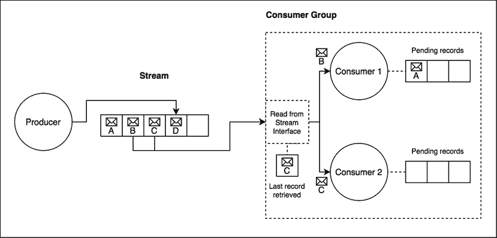

图 13.20：Redis Stream 消费者组

我们可以注意到，当两个消费者尝试从流中读取时，他们接收到了两个不同的记录（B 为消费者 1 和 C 为消费者 2）。消费者组还存储了最后检索到的记录的 ID（记录 C），这样在后续的读取操作中，消费者组就知道下一个要读取的记录是什么。我们还可以注意到消费者 1 有一个挂起的记录（A），这是一个它仍在处理或无法处理的记录。消费者 1 可以实现重试算法，以确保处理分配给它的所有挂起记录。

Redis Stream 可以有多个消费者组。这样，就可以同时对相同的数据应用不同类型的处理。

现在，让我们将我们刚刚学到的关于 Redis 消费者组的知识付诸实践，以实现我们的 hashsum 破解器。

### 使用 Redis Streams 实现 hashsum 破解器

我们使用 Redis Streams 的 hashsum 破解器的架构将非常类似于之前的 AMQP 示例。实际上，我们将有两个不同的流（在 AMQP 示例中它们是队列）：一个流用于存储要处理的任务（`tasks_stream`）和另一个流用于存储来自工作进程的结果（`results_stream`）。

然后，我们将使用消费者组将`tasks_stream`中的任务分配给我们的应用程序的工作进程（我们的工作进程是消费者）。

#### 实现生产者

让我们从实现生产者（在`producer.js`文件中）开始：

```js
import Redis from 'ioredis'
import { generateTasks } from './generateTasks.js'
const ALPHABET = 'abcdefghijklmnopqrstuvwxyz'
const BATCH_SIZE = 10000
const redisClient = new Redis()
const [, , maxLength, searchHash] = process.argv
async function main () {
  const generatorObj = generateTasks(searchHash, ALPHABET,
    maxLength, BATCH_SIZE)
  for (const task of generatorObj) {
    await redisClient.xadd('tasks_stream', '*',
      'task', JSON.stringify(task))
  }
  redisClient.disconnect()
}
main().catch(err => console.error(err)) 
```

如我们所见，在新的`producer.js`模块的实现中，对我们来说没有什么新的东西。事实上，我们非常清楚如何向流中添加记录；我们只需要调用*可靠消息传递与流*部分中讨论的`xadd()`即可。

#### 实现工作进程

接下来，我们需要调整我们的工作进程，使其能够通过消费者组与 Redis Stream 接口。这是所有架构的核心，因为在工作进程中，我们利用消费者组和它们的特性。因此，让我们实现新的`worker.js`模块：

```js
import Redis from 'ioredis'
import { processTask } from './processTask.js'
const redisClient = new Redis()
const [, , consumerName] = process.argv
async function main () {
  await redisClient.xgroup('CREATE', 'tasks_stream',         // (1)
    'workers_group', '$', 'MKSTREAM')
    .catch(() => console.log('Consumer group already exists'))
  const [[, records]] = await redisClient.xreadgroup(        // (2)
    'GROUP', 'workers_group', consumerName, 'STREAMS',
    'tasks_stream', '0')
  for (const [recordId, [, rawTask]] of records) {
    await processAndAck(recordId, rawTask)
  }
  while (true) {
    const [[, records]] = await redisClient.xreadgroup(      // (3)
      'GROUP', 'workers_group', consumerName, 'BLOCK', '0',
      'COUNT', '1', 'STREAMS', 'tasks_stream', '>')
    for (const [recordId, [, rawTask]] of records) {
      await processAndAck(recordId, rawTask)
    }
  }
}
async function processAndAck (recordId, rawTask) {           // (4)
  const found = processTask(JSON.parse(rawTask))
  if (found) {
    console.log(`Found! => ${found}`)
    await redisClient.xadd('results_stream', '*', 'result',
      `Found: ${found}`)
  }
  await redisClient.xack('tasks_stream', 'workers_group', recordId)
}
main().catch(err => console.error(err)) 
```

好的，新的工作代码中有许多动态部分。因此，让我们一步一步地分析它：

1.  首先，在我们能够使用它之前，我们需要确保消费者组存在。我们可以使用`xgroup`命令来做到这一点，我们通过以下参数来调用它：

    1.  `'CREATE'`是我们想要创建消费者组时使用的关键字。实际上，使用`xgroup`命令，我们还可以使用不同的子命令来销毁消费者组、删除消费者或更新最后读取的记录 ID。

    1.  `'tasks_stream'`是我们想要读取的流的名称。

    1.  `'workers_group'`是消费者组的名称。

    1.  第四个参数表示消费者组应该从流中开始消费记录的记录 ID。使用`'$'`（美元符号）表示消费者组应该从流中当前最后一条记录的 ID 开始读取。

    1.  `'MKSTREAM'` 是一个额外的参数，指示 Redis 在不存在的情况下创建流。

1.  接下来，我们读取属于当前消费者的所有待处理记录。这些是从消费者之前运行中遗留的记录，由于应用程序的突然中断（如崩溃）而没有被处理。如果相同的消费者（具有相同的名称）在上次运行中正确终止，没有错误，那么这个列表很可能是空的。正如我们之前提到的，每个消费者只能访问其自己的待处理记录。我们使用 `xreadgroup` 命令和以下参数检索此列表：

    1.  `'GROUP', 'workers_group', consumerName` 是一个强制性的三联组，其中我们指定消费者组的名称（`'workers_group'`）和从命令行输入读取的消费者名称（`consumerName`）。

    1.  然后我们指定我们想要读取的流，使用 `'STREAMS', 'tasks_stream'`。

    1.  最后，我们指定 `'0'` 作为最后一个参数，这是我们应开始读取的 ID。本质上，我们是在说我们想要从第一条消息开始读取属于当前消费者的所有待处理消息。

1.  然后，我们再次调用 `xreadgroup()`，但这次它具有完全不同的语义。在这种情况下，实际上，我们想要从流中开始读取新的记录（而不是访问消费者的历史记录）。这可以通过以下参数列表实现：

    1.  与之前的 `xreadgroup()` 调用一样，我们使用三个参数指定我们想要用于读取操作的消费者组：`'GROUP', 'workers_group', consumerName`。

    1.  然后，我们指示如果当前没有新记录可用，调用应阻塞而不是返回空列表。我们使用以下两个参数来实现这一点：`'BLOCK', '0'`。最后一个参数是函数返回的超时时间，即使没有结果也会返回。`'0'` 表示我们希望无限期地等待。

    1.  下两个参数 `'COUNT'` 和 `'1'` 告诉 Redis 我们对每次调用获取一条记录感兴趣。

    1.  接下来，我们使用 `'STREAMS', 'tasks_stream'` 指定我们想要读取的流。

    1.  最后，使用特殊的 ID `'>'`（大于符号），我们表明我们感兴趣的是任何尚未被此消费者组检索的记录。

1.  最后，在 `processAndAck()` 函数中，我们检查是否有匹配项，如果是的话，我们将一条新的记录追加到 `results_stream`。最后，当 `xreadgroup()` 返回的记录的所有处理都完成后，我们调用 Redis 的 `xack` 命令来确认该记录已被成功消费，这将导致记录从当前消费者的待处理列表中移除。

呼吸！在 `worker.js` 模块中发生了很多事情。值得注意的是，大部分复杂性都来自于各种 Redis 命令所需的大量参数。

你可能会惊讶地发现，这个例子只是触及了表面，因为关于 Redis Streams 还有很多东西要了解，特别是消费者组。查看官方 Redis 关于流的介绍，了解更多详情，请访问[nodejsdp.link/redis-streams](http://nodejsdp.link/redis-streams)。

现在，一切准备就绪，我们可以尝试这个 hashsum 破解器的新版本了。让我们启动几个工作进程，但这次记得给他们分配一个名称，这个名称将用于在消费者组中识别它们：

```js
node worker.js workerA
node worker.js workerB 
```

然后，你可以像之前的示例那样运行收集器和生产者：

```js
node collector.js
node producer.js 4 f8e966d1e207d02c44511a58dccff2f5429e9a3b 
```

这标志着我们对任务分配模式的探索结束，因此现在我们将更深入地研究请求/回复模式。

# 请求/回复模式

单向通信可以在并行性和效率方面给我们带来巨大的优势，但仅凭它们并不能解决我们所有的集成和通信问题。有时，一个简单的请求/回复模式可能正是完成这项工作的完美工具。但是，也存在这样的情况，我们唯一拥有的只是一个异步的单向通道。因此，了解构建抽象所需的多种模式和方法是重要的，这样我们才能在单向通道上以请求/回复的方式交换消息。这正是我们接下来要学习的。

## 关联标识符

我们将要学习的第一个请求/回复模式被称为**关联标识符**，它是在单向通道上构建请求/回复抽象的基本块。

这种模式涉及在每个请求上标记一个标识符，然后由接收者将其附加到响应上：这样，请求的发送者就可以关联这两个消息，并将响应返回给正确的处理者。这种方式优雅地解决了单向异步通道中的问题，其中消息可以在任何时间以任何方向旅行。让我们看一下以下图中的示例：

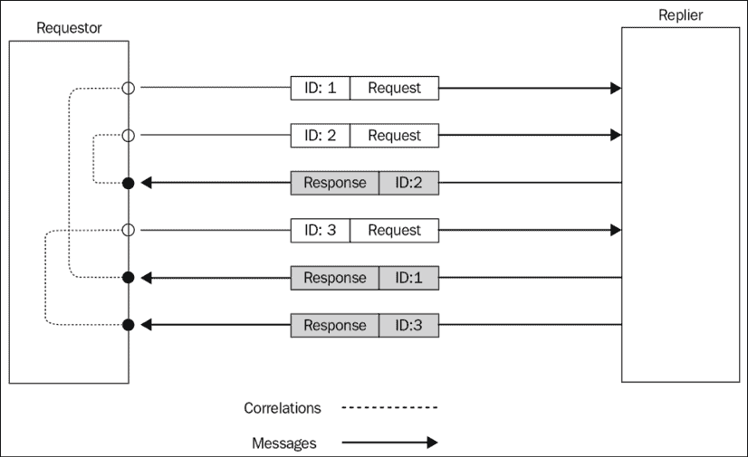

图 13.21：使用关联标识符进行请求/回复消息交换

*图 13.21*中描述的场景展示了如何使用关联 ID 来匹配每个响应与正确的请求，即使它们是按不同的顺序发送和接收的。一旦我们开始处理下一个示例，这种工作方式将变得更加清晰。

### 使用关联标识符实现请求/回复抽象

让我们现在通过选择最简单类型的单向通道来开始一个示例；这是一个点对点（直接连接系统中的两个节点）且全双工（消息可以双向旅行）的通道。

在这个*简单通道*类别中，我们可以找到，例如，WebSocket：它们在服务器和浏览器之间建立一个点对点连接，消息可以双向传输。另一个例子是使用`child_process.fork()`（我们在*第十一章*，*高级食谱*中已经遇到这个 API）创建的通信通道。这个通道也是异步的、点对点的、全双工的，因为它只连接父进程和子进程，并允许消息双向传输。这可能是这个类别中最基本的通道，所以这就是我们将在下一个示例中使用的。

下一个应用程序的计划是构建一个抽象，以封装父进程和子进程之间创建的通道。这个抽象应该通过自动标记每个请求的关联标识符，然后匹配任何传入回复的 ID 与等待响应的请求处理程序列表，来提供一个请求/回复通信通道。

从*第十一章*，*高级食谱*，我们应该记住，父进程可以使用`child.send(message)`向子进程发送消息，而接收消息则是通过`child.on('message', callback)`事件处理程序实现的。

以类似的方式，子进程可以使用`process.send(message)`向父进程发送消息，并使用`process.on('message', callback)`接收消息。

这意味着父进程中可用的通道接口与子进程中可用的接口相同。这将允许我们构建一个可以从通道两端使用的通用抽象。

#### 抽象请求

让我们通过考虑负责发送新请求的部分来开始构建这个抽象。让我们创建一个名为`createRequestChannel.js`的新文件，内容如下：

```js
import { nanoid } from 'nanoid'
export function createRequestChannel (channel) {             // (1)
  const correlationMap = new Map()
  function sendRequest (data) {                              // (2)
    console.log('Sending request', data)
    return new Promise((resolve, reject) => {
      const correlationId = nanoid()
      const replyTimeout = setTimeout(() => {
        correlationMap.delete(correlationId)
        reject(new Error('Request timeout'))
      }, 10000)
      correlationMap.set(correlationId, (replyData) => {
        correlationMap.delete(correlationId)
        clearTimeout(replyTimeout)
        resolve(replyData)
      })
      channel.send({
        type: 'request',
        data,
        id: correlationId
      })
    })
  }
  channel.on('message', message => {                         // (3)
    const callback = correlationMap.get(message.inReplyTo)
    if (callback) {
      callback(message.data)
    }
  })
  return sendRequest
} 
```

这就是我们的请求抽象是如何工作的：

1.  `createRequestChannel()`是一个工厂，它包装输入通道并返回一个`sendRequest()`函数，用于发送请求并接收回复。这个模式的魔力在于`correlationMap`变量，它存储了出站请求和它们的回复处理程序之间的关联。

1.  `sendRequest()`函数用于发送新的请求。它的任务是使用`nanoid`包（[nodejsdp.link/nanoid](http://nodejsdp.link/nanoid)）生成一个关联 ID，然后将请求数据包装在一个允许我们指定关联 ID 和消息类型的信封中。关联 ID 和负责将回复数据返回给调用者（在底层使用`resolve()`）的处理程序随后被添加到`correlationMap`中，以便可以使用关联 ID 稍后检索处理程序。我们还实现了一个非常简单的请求超时逻辑。

1.  当工厂被调用时，我们也会开始监听传入的消息。如果消息的相关 ID（包含在 `inReplyTo` 属性中）与 `correlationMap` 映射中包含的任何 ID 匹配，我们知道我们刚刚收到了一个回复，所以我们获取相关响应处理器的引用，并使用消息中的数据调用它。

这就是 `createRequestChannel.js` 模块的结束。让我们继续下一部分。

#### 抽象回复

我们离实现完整模式只有一步之遥，所以让我们看看请求通道的对立面，即回复通道，是如何工作的。让我们创建另一个名为 `createReplyChannel.js` 的文件，该文件将包含包装回复处理器的抽象：

```js
export function createReplyChannel (channel) {
  return function registerHandler (handler) {
    channel.on('message', async message => {
      if (message.type !== 'request') {
        return
      }
      const replyData = await handler(message.data)      // (1)
      channel.send({                                     // (2)
        type: 'response',
        data: replyData,
        inReplyTo: message.id
      })
    })
  }
} 
```

我们的 `createReplyChannel()` 函数再次是一个工厂，它返回另一个用于注册新回复处理器的函数。这是注册新处理器时发生的情况：

1.  当我们收到一个新的请求时，我们立即通过传递消息中的数据调用处理器。

1.  一旦处理器完成其工作并返回其回复，我们就在数据周围构建一个信封，包括消息的类型和请求的相关 ID（`inReplyTo` 属性），然后将所有内容放回通道中。

这个模式令人惊叹的地方在于，在 Node.js 中它非常容易实现：对我们来说，一切都是异步的，所以基于单向通道的异步请求/回复通信与其他任何异步操作没有太大区别，特别是如果我们构建一个抽象来隐藏其实现细节。

#### 尝试完整的请求/回复周期

现在，我们已经准备好尝试我们新的异步请求/回复抽象。让我们在名为 `replier.js` 的文件中创建一个示例 *回复者*：

```js
import { createReplyChannel } from './createReplyChannel.js'
const registerReplyHandler = createReplyChannel(process)
registerReplyHandler(req => {
  return new Promise(resolve => {
    setTimeout(() => {
      resolve({ sum: req.a + req.b })
    }, req.delay)
  })
})
process.send('ready') 
```

我们的回复者简单地计算请求中接收到的两个数字之间的和，并在一定延迟后（该延迟也在请求中指定）返回结果。这将允许我们验证响应的顺序可以与发送请求的顺序不同，以确认我们的模式正在工作。模块的最后一条指令，我们向父进程发送一条消息，表示子进程已准备好接受请求。

完成示例的最终步骤是在名为 `requestor.js` 的文件中创建请求者，该文件还具有使用 `child_process.fork()` 启动回复者的任务：

```js
import { fork } from 'child_process'
import { dirname, join } from 'path'
import { fileURLToPath } from 'url'
import { once } from 'events'
import { createRequestChannel } from './createRequestChannel.js'
const __dirname = dirname(fileURLToPath(import.meta.url))
async function main () {
  const channel = fork(join(__dirname, 'replier.js'))          // (1)
  const request = createRequestChannel(channel)
  try {
    const [message] = await once(channel, 'message')       // (2)
    console.log(`Child process initialized: ${message}`)
    const p1 = request({ a: 1, b: 2, delay: 500 })         // (3)
      .then(res => {
        console.log(`Reply: 1 + 2 = ${res.sum}`)
      })
    const p2 = request({ a: 6, b: 1, delay: 100 })         // (4)
      .then(res => {
        console.log(`Reply: 6 + 1 = ${res.sum}`)
      })
    await Promise.all([p1, p2])                            // (5)
  } finally {
    channel.disconnect()                                   // (6)
  }
}
main().catch(err => console.error(err)) 
```

请求者启动回复者（1）然后将其引用传递给我们的 `createRequestChannel()` 抽象。然后我们等待子进程可用（2）并运行几个示例请求（3，4）。最后，我们等待两个请求都完成（5）并断开通道（6），以便子进程（以及父进程）能够优雅地退出。

要尝试示例，只需启动 `requestor.js` 模块。输出应该类似于以下内容：

```js
Child process initialized: ready
Sending request { a: 1, b: 2, delay: 500 }
Sending request { a: 6, b: 1, delay: 100 }
Reply: 6 + 1 = 7
Reply: 1 + 2 = 3 
```

这证实了我们的请求/回复消息模式实现得非常完美，并且回复被正确地关联到它们各自的请求，无论它们的发送或接收顺序如何。

我们在本节中讨论的技术在只有一个点对点通道时效果很好。但如果我们有一个更复杂的架构，包含多个通道或队列，会发生什么呢？这正是我们接下来要看到的。

## 返回地址

相关标识符是在单通道上创建请求/回复通信的基本模式。然而，当我们的消息架构有多个通道或队列，或者可能存在多个请求者时，这就不够了。在这些情况下，除了相关 ID 之外，我们还需要知道**返回地址**，这是一条信息，允许回复者将响应发送回请求的原始发送者。

### 在 AMQP 中实现返回地址模式

在基于 AMQP 的架构中，返回地址是请求者监听传入回复的队列。因为响应只应该被一个请求者接收，所以队列必须是私有的，并且不能在不同消费者之间共享。从这些属性中，我们可以推断出我们需要一个作用域限于请求者连接的短暂队列，并且回复者必须与返回队列建立点对点通信，以便能够发送其响应。

以下图表为我们提供了一个这种场景的示例：

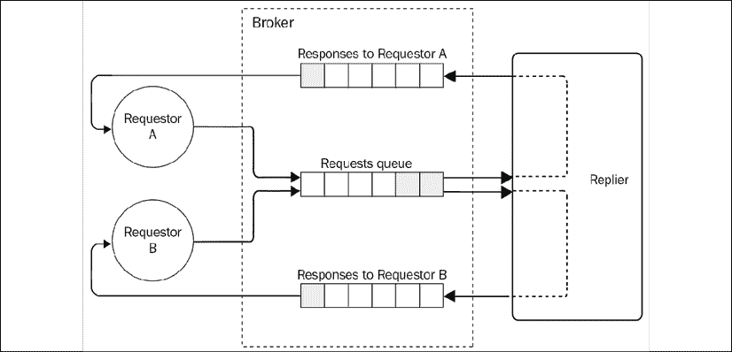

图 13.22：使用 AMQP 的请求/回复消息架构

*图 13.22* 展示了每个请求者都有自己的私有队列，专门用于处理其请求的回复。所有请求都发送到一个单一的队列，然后由回复者消费。回复者将利用请求中指定的 *返回地址* 信息将回复路由到正确的响应队列。

实际上，为了在 AMQP 之上创建请求/回复模式，我们只需要在消息属性中指定响应队列的名称，这样回复者就知道响应消息应该发送到哪个位置。

理论看起来非常直接，那么让我们看看如何在实际应用中实现它。

#### 实现请求抽象

现在我们将在 AMQP 之上构建一个请求/回复抽象。我们将使用 RabbitMQ 作为代理，但任何兼容的 AMQP 代理都应该可以完成这项工作。让我们从请求抽象开始，它在`amqpRequest.js`模块中实现。我们将分步骤展示代码，以便更容易解释。让我们从`AMQPRequest`类的构造函数开始：

```js
export class AMQPRequest {
  constructor () {
    this.correlationMap = new Map()
  }
  //... 
```

如前述代码所示，我们还将再次使用相关标识符模式，因此我们需要一个映射来保存消息 ID 和相对处理器的关联。

然后，我们需要一个方法来初始化 AMQP 连接及其对象：

```js
async initialize () {
  this.connection = await amqp.connect('amqp://localhost')
  this.channel = await this.connection.createChannel()
  const { queue } = await this.channel.assertQueue('',       // (1)
    { exclusive: true })
  this.replyQueue = queue
  this.channel.consume(this.replyQueue, msg => {             // (2)
    const correlationId = msg.properties.correlationId
    const handler = this.correlationMap.get(correlationId)
    if (handler) {
      handler(JSON.parse(msg.content.toString()))
    }
  }, { noAck: true })
} 
```

这里值得观察的有趣之处在于我们如何创建一个用于存储回复的队列（1）。其特殊性在于我们没有指定任何名称，这意味着将为我们随机选择一个。除此之外，队列是**独占的**，这意味着它绑定到当前活动的 AMQP 连接，并在连接关闭时被销毁。我们没有必要将队列绑定到交换机，因为我们不需要任何路由或多队列的分配，这意味着消息必须直接发送到我们的响应队列。在函数的第二部分（2）中，我们开始从`replyQueue`消费消息。在这里，我们将传入消息的 ID 与我们`correlationMap`中的 ID 进行匹配，并调用相关处理程序。

接下来，让我们看看如何发送新的请求：

```js
send (queue, message) {
  return new Promise((resolve, reject) => {
    const id = nanoid()                                    // (1)
    const replyTimeout = setTimeout(() => {
      this.correlationMap.delete(id)
      reject(new Error('Request timeout'))
    }, 10000)
    this.correlationMap.set(id, (replyData) => {           // (2)
      this.correlationMap.delete(id)
      clearTimeout(replyTimeout)
      resolve(replyData)
    })
    this.channel.sendToQueue(queue,                        // (3)
      Buffer.from(JSON.stringify(message)),
      { correlationId: id, replyTo: this.replyQueue }
    )
  })
} 
```

`send()`方法接受要发送的请求`queue`名称和要发送的`message`作为输入。正如我们在上一节中学到的，我们需要生成一个关联 ID（1）并将其关联到负责向调用者返回回复的处理程序（2）。最后，我们发送消息（3），指定`correlationId`和`replyTo`属性作为元数据。实际上，在 AMQP 中，我们可以指定一组要传递给消费者的属性（或元数据），与主要消息一起传递。元数据对象作为`sendToQueue()`方法的第三个参数传递。

需要注意的是，我们使用`channel.sentToQueue()` API 而不是`channel.publish()`来发送消息。这是因为我们并不感兴趣使用交换来实现发布/订阅的分布模式，而是更基本的点对点直接发送到目标队列。

我们`AMQPRequest`类的最后一部分是实现`destroy()`方法的地方，该方法用于关闭连接和通道：

```js
 destroy () {
    this.channel.close()
    this.connection.close()
  }
} 
```

`amqpRequest.js`模块的内容到此结束。

#### 实现回复抽象

现在是时候在一个名为`amqpReply.js`的新模块中实现回复抽象了：

```js
import amqp from 'amqplib'
export class AMQPReply {
  constructor (requestsQueueName) {
    this.requestsQueueName = requestsQueueName
  }
  async initialize () {
    const connection = await amqp.connect('amqp://localhost')
    this.channel = await connection.createChannel()
    const { queue } = await this.channel.assertQueue(        // (1)
      this.requestsQueueName)
    this.queue = queue
  }
  handleRequests (handler) {                                 // (2)
    this.channel.consume(this.queue, async msg => {
      const content = JSON.parse(msg.content.toString())
      const replyData = await handler(content)
      this.channel.sendToQueue(                              // (3)
        msg.properties.replyTo,
        Buffer.from(JSON.stringify(replyData)),
        { correlationId: msg.properties.correlationId }
      )
      this.channel.ack(msg)
    })
  }
} 
```

在`AMQPReply`类的`initialize()`方法中，我们创建一个将接收传入请求的队列（1）：我们可以为此目的使用一个简单的持久队列。`handleRequests()`方法（2）用于从新请求处理器注册新请求，以便可以发送新回复。在发送回复（3）时，我们使用`channel.sendToQueue()`将消息直接发布到消息的`replyTo`属性指定的队列（我们的返回地址）。我们还设置了回复中的`correlationId`，以便接收者可以将消息与挂起的请求列表进行匹配。

#### 实现请求者和回复者

现在一切准备就绪，可以尝试我们的系统了，但首先，让我们构建一对示例请求者和回复者，看看如何使用我们的新抽象。

让我们从`replier.js`模块开始：

```js
import { AMQPReply } from './amqpReply.js'
async function main () {
  const reply = new AMQPReply('requests_queue')
  await reply.initialize()
  reply.handleRequests(req => {
    console.log('Request received', req)
    return { sum: req.a + req.b }
  })
}
main().catch(err => console.error(err)) 
```

很好地看到我们构建的抽象如何使我们能够隐藏处理关联 ID 和返回地址的所有机制。我们所需做的只是初始化一个新的`reply`对象，指定我们希望接收请求的队列名称（`'requests_queue'`）。其余的代码只是微不足道的；在实践中，我们的样本 replier 只是计算接收到的两个数字之和，并将结果作为一个对象发送回去。

在另一边，我们在`requestor.js`文件中实现了一个样本请求者：

```js
import { AMQPRequest } from './amqpRequest.js'
import delay from 'delay'
async function main () {
  const request = new AMQPRequest()
  await request.initialize()
  async function sendRandomRequest () {
    const a = Math.round(Math.random() * 100)
    const b = Math.round(Math.random() * 100)
    const reply = await request.send('requests_queue', { a, b })
    console.log(`${a} + ${b} = ${reply.sum}`)
  }
  for (let i = 0; i < 20; i++) {
    await sendRandomRequest()
    await delay(1000)
  }
  request.destroy()
}
main().catch(err => console.error(err)) 
```

我们的样本请求者以一秒的间隔向`requests_queue`队列发送 20 个随机请求。在这种情况下，也很有趣地看到我们的抽象正在完美地完成其工作，隐藏了异步请求/回复模式实现背后的所有细节。

现在，为了尝试这个系统，只需运行`replier`模块，然后是几个`requestor`实例：

```js
node replier.js
node requestor.js
node requestor.js 
```

您将看到请求者发布的一组操作，然后由 replier 接收，然后 replier 将响应发送回正确的请求者。

现在我们可以尝试其他实验。一旦 replier 首次启动，它将创建一个持久队列，这意味着如果我们现在停止它，然后再次运行 replier，则不会丢失任何请求。所有消息都将存储在队列中，直到 replier 再次启动！

注意，根据我们的应用程序实现方式，请求将在 10 秒后超时。因此，为了使回复及时到达请求者，replier 可以承受有限的停机时间（肯定小于 10 秒）。

通过使用 AMQP，我们还获得了一个免费的好特性，那就是我们的 replier 是即插即用的可扩展的。为了测试这个假设，我们可以尝试启动两个或更多个 replier 实例，并观察请求如何在它们之间进行负载均衡。这是因为每次请求者启动时，它都会将自己附加为监听器到同一个持久队列，结果，代理将消息在队列的所有消费者之间进行负载均衡（记得竞争消费者模式吗？）。太棒了！

ZeroMQ 有一对专门用于实现请求/回复模式的套接字，称为`REQ`/`REP`，然而，它们是同步的（一次只能有一个请求/响应）。通过更复杂的技术可以实现更复杂的请求/回复模式。更多信息，您可以阅读[官方指南](http://nodejsdp.link/zeromq-reqrep)。

在 Redis Streams 之上也可以实现带有返回地址的请求/回复模式，并且与我们使用 AMQP 实现的系统非常相似。我们将把这个留给你作为练习来实现。

# 摘要

您已到达本章的结尾。在这里，您学习了最重要的消息和集成模式以及它们在分布式系统设计中的作用。现在，您应该已经掌握了三种最重要的消息交换模式：发布/订阅、任务分配和请求/回复，这些模式可以在对等架构之上实现，或者使用代理来实现。我们分析了每种模式和架构的优缺点，并看到通过使用代理（实现消息队列或数据流），可以轻松实现可靠和可扩展的应用程序，但代价是需要维护和扩展一个额外的系统。

您还学习了 ZeroMQ 如何让您构建可以完全控制架构每个方面的分布式系统，并根据您自己的需求对属性进行微调。

最终，这两种方法都将为您提供构建任何类型分布式系统所需的所有工具，从基本的聊天应用程序到数百万用户使用的 Web 规模平台。

本章也标志着本书的结束。到目前为止，您应该已经拥有一套充满模式和技术的工具箱，可以将其应用于您的项目。您还应该对 Node.js 开发的工作方式以及其优势和劣势有更深入的了解。在整个书中，您也有机会与许多杰出开发者开发的众多包和解决方案一起工作。最终，这是 Node.js 最美好的方面：其人，一个每个人都在为回馈社会贡献自己力量的社区。

我们希望您喜欢我们的小小贡献，并期待看到您的作品。

诚挚地，马里奥·卡西亚罗和卢西亚诺·马米诺。

# 练习

+   **13.1 使用流的记录服务**：在我们的 Redis Stream 发布/订阅示例中，我们不需要记录服务（如我们在相关的 AMQP 示例中所做的那样），因为所有消息历史都已经在流中保存了。现在，实现这样一个记录服务，将所有传入的消息存储在单独的数据库中，并在新客户端连接时使用此服务检索聊天历史。提示：记录服务需要记住在重启之间检索的最后一条消息的 ID。

+   **13.2 多房间聊天**：更新本章中我们创建的聊天应用程序示例，使其能够支持多个聊天室。应用程序还应支持在客户端连接时显示消息历史。您可以选择您喜欢的消息系统，甚至混合不同的系统。

+   **13.3 停止的任务**：更新本章中我们实现的 hashsum cracker 示例，并添加必要的逻辑，以便在找到匹配项后停止所有节点的计算。

+   **13.4 使用 ZeroMQ 进行可靠的作业处理**：实现一种机制，使我们的 ZeroMQ 哈希校验器示例更加可靠。正如我们之前提到的，在本章中我们看到的实现中，如果一个工作进程崩溃，它正在处理的全部任务都会丢失。实现一个对等队列系统和确认机制，以确保消息总是至少被处理一次（排除由于假设不可处理的任务导致的错误）。

+   **13.5 数据聚合器**：创建一个抽象，可以用来向连接到系统的所有节点发送请求，然后返回这些节点接收到的所有回复的聚合。提示：你可以使用发布/回复来发送请求，并使用任何单向通道来发送回复。可以使用我们学到的任何技术组合。

+   **13.6 工作状态 CLI**：使用*练习 13.5*中定义的数据聚合器组件来实现一个命令行应用程序，当调用时，显示哈希校验器应用程序中所有工作进程的当前状态（例如，它们正在处理哪个块，是否找到了匹配项等）。

+   **13.7 工作状态 UI**：实现一个从客户端到服务器的 Web 应用程序，通过一个可以实时报告找到匹配项的 Web UI 来公开哈希校验器应用程序中工作进程的状态。

+   **13.8 预初始化队列回归**：在 AMQP 请求/回复示例中，我们实现了一个**延迟启动**模式来处理`initialize()`方法是异步的事实。现在，通过添加我们在*第十一章*，*高级食谱*中学到的预初始化队列来重构该示例。

+   **13.9 使用 Redis Streams 进行请求/回复**：在 Redis Streams 之上构建请求/回复抽象。

+   **13.10 Kafka**：如果你足够勇敢，尝试使用 Apache Kafka ([nodejsdp.link/kafka](http://nodejsdp.link/kafka))而不是 Redis Streams 来重新实现本章中所有相关的示例。
