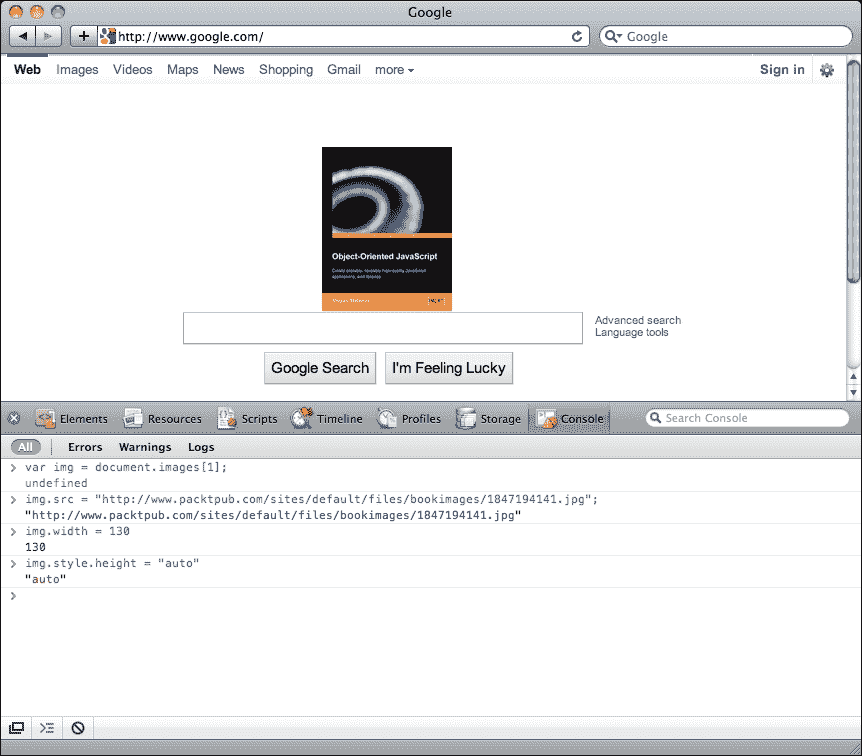
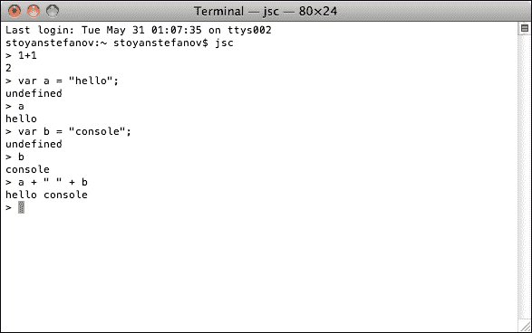
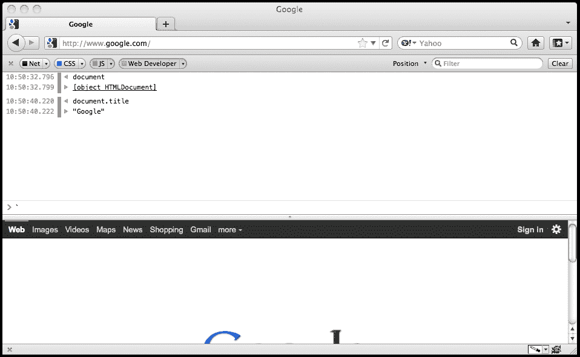
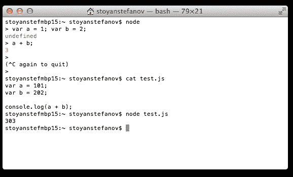

# 第一章. 面向对象的 JavaScript

自从网络早期以来，就需要更动态和响应式的界面。虽然阅读静态的 HTML 文本页面是可以的，而且当它们在 CSS 的帮助下以美观的方式呈现时更好，但与浏览器中的应用程序互动，如电子邮件、日历、银行、购物、绘图、玩游戏和文本编辑，则更有趣。所有这些都得益于 JavaScript，这是网络编程语言。JavaScript 最初是嵌入 HTML 中的简单单行代码，但现在以更复杂的方式被使用。开发者利用语言的面向对象特性来构建由可重用组件组成的可扩展代码架构。

如果你看看网络开发的过去和现在的热门词汇，DHTML、Ajax、Web 2.0、HTML5，它们本质上都意味着 HTML、CSS 和 JavaScript——HTML 用于**内容**，CSS 用于**表现**，JavaScript 用于**行为**。换句话说，JavaScript 是使一切协同工作的粘合剂，使我们能够构建丰富的网络应用程序。

然而，这还不是全部；JavaScript 可以用于不仅仅是网络。

JavaScript 程序在宿主环境中运行。网络浏览器是最常见的环境，但并非唯一。使用 JavaScript，你可以创建各种小工具、应用程序扩展和其他软件组件，正如你很快就会看到的。花时间学习 JavaScript 是一种明智的投资；你学习一种语言，然后可以编写在多个平台上运行的各种不同应用程序，包括移动端和服务器端应用程序。如今，可以说 JavaScript 无处不在。

这本书从零开始，不假设任何先前的编程知识，除了对 HTML 的基本理解。尽管书中有一章专门介绍网络浏览器环境，但本书的其余部分都是关于 JavaScript 的通用知识，因此适用于所有环境。

让我们从以下内容开始：

+   JavaScript 背后的故事的简要介绍

+   你将在面向对象编程讨论中遇到的的基本概念

# 一点历史

最初，网络只不过是一系列以静态 HTML 文档形式存在的科学出版物，通过超链接相互连接。信不信由你，曾经有一段时间，无法在页面上放置图片。然而，这种情况很快发生了变化。随着网络的普及和规模的扩大，创建 HTML 页面的网络管理员感到他们需要更多东西。他们希望创建更丰富的用户交互，主要是由简化如表单验证等简单任务的服务器往返次数的需求驱动的。出现了两种选择——Java 小程序和 LiveScript，这是一种由 Brendan Eich 在 1995 年的 Netscape 公司构思的语言，后来在 Netscape 2.0 浏览器中以 JavaScript 的名称包含在内。

小程序并没有真正流行起来，但 JavaScript 则不然。能够在 HTML 文档中嵌入简短的代码片段并改变网页上原本静态的元素，这一能力得到了网站管理员社区的欢迎。不久，竞争浏览器供应商微软推出了带有 JScript 的 **Internet Explorer** (**IE**) 3.0，这是一个对 JavaScript 的逆向工程版本，并增加了一些 IE 特有的功能。最终，人们努力使语言的多种实现标准化，这就是 ECMAScript 诞生的原因。**欧洲计算机制造商协会** (**ECMA**) 制定了名为 ECMA-262 的标准，该标准描述了 JavaScript 编程语言的核心部分，不包括浏览器和网页特定的功能。

你可以将 JavaScript 视为一个包含以下三个部分的术语：

+   **ECMAScript**: 核心语言——变量、函数、循环等。这部分与浏览器无关，这种语言可以在许多其他环境中使用。

+   **文档对象模型** (**DOM**): 这提供了处理 HTML 和 XML 文档的方法。最初，JavaScript 只提供了对页面可脚本化内容的有限访问，主要是表单、链接和图像。后来，它被扩展到使所有元素都可以被脚本化。这导致了 **万维网联盟** (**W3C**) 创建 DOM 标准，作为一种与语言无关（不再与 JavaScript 相关联）的方式来操作结构化文档。

+   **浏览器对象模型** (**BOM**): 这是一组与浏览器环境相关的对象，直到 HTML5 开始标准化跨浏览器存在的某些常见对象之前，它从未成为任何标准的一部分。

尽管这本书中有一章专门介绍浏览器、DOM 和 BOM，但本书的大部分内容描述了核心语言，并教你可以在任何 JavaScript 程序运行的环境中使用的技能。

## 浏览器战争与复兴

不管是好事还是坏事，JavaScript 的即时流行发生在浏览器战争 I（大约 1996 年至 2001 年）期间。那是在互联网初期繁荣时期，当时两大浏览器供应商，网景和微软，为了市场份额而竞争。两者都在不断为他们的浏览器及其版本的 JavaScript、DOM 和 BOM 增加更多功能。这自然导致了许多不一致性。在增加更多功能的同时，浏览器供应商在提供适当的开发和调试工具以及充足的文档方面落后了。通常，开发过程很痛苦；你会在一个浏览器中编写脚本并进行测试，一旦开发完成，你会在另一个浏览器中进行测试，结果发现你的脚本没有任何明显原因地失败了，你能得到的最好的结果就是一条神秘的错误信息，例如操作已中止。

不一致的实现、缺失的文档和缺乏适当的工具，使得 JavaScript 在这样的背景下显得黯淡无光，许多程序员甚至不愿去理会它。

另一方面，那些试图尝试使用 JavaScript 的开发者有些过于冲动，他们在页面上添加了过多的特效，而很少考虑最终结果的可用性。开发者们急于利用浏览器提供的每一个新功能，结果在网页上添加了诸如状态栏动画、闪烁的颜色、闪烁的文本、跟随鼠标光标的对象等许多创新，这些实际上损害了用户体验。这些滥用 JavaScript 的各种方式现在大多已经消失，但它们是导致这种语言有某种不良声誉的原因之一。许多严肃的程序员将 JavaScript 视为设计师们玩耍的小玩具，并认为它不适合用于严肃的应用程序。JavaScript 的反动导致一些网络项目完全禁止任何客户端编程，并只信任他们可预测且严格控制的服务器。实际上，为什么要将交付成品的时间加倍，然后花额外的时间调试不同浏览器的问题呢？

在浏览器战争结束后的几年里，一切都发生了变化。一些事件以积极的方式重塑了网络开发格局。其中一些如下：

+   微软通过推出当时最好的浏览器 IE6 赢得了战争，此后多年他们停止了 Internet Explorer 的开发。这为其他浏览器追赶甚至超越 IE 的功能提供了时间。

+   网络标准运动得到了开发者和浏览器供应商的普遍欢迎。自然，开发者们不喜欢为了应对浏览器的差异而不得不两次（或更多次）编写代码；因此，他们喜欢有一个大家都同意的标准，这样每个人都会遵循。

+   开发者和技术成熟了，越来越多的人开始关注诸如可用性、渐进增强技术和可访问性等问题。例如 Firebug 这样的工具使开发者们的工作效率大大提高，开发过程不再那么痛苦。

在这个更健康的环境中，开发者们开始发现使用现有工具的新方法和更好的方式。在 Gmail 和 Google Maps 等客户端编程丰富的应用程序公开发布之后，这些应用程序的发布表明 JavaScript 是一种成熟、在某些方面独特的强大原型面向对象语言。其重新发现的最佳例子是 `XMLHttpRequest` 对象功能的广泛采用，这个对象最初是 IE 独有的创新，但后来被大多数其他浏览器实现。`XMLHttpRequest` 对象允许 JavaScript 发送 HTTP 请求并从服务器获取新鲜内容，以更新页面的一些部分而无需完全重新加载页面。由于 `XMLHttpRequest` 对象的广泛使用，一种新的类似桌面应用程序的 Web 应用程序诞生了，被称为 Ajax 应用程序。

## 现在

关于 JavaScript 的一个有趣之处在于它总是在宿主环境中运行。网页浏览器只是众多可用宿主之一。JavaScript 也可以在服务器、桌面和移动设备上运行。今天，你可以使用 JavaScript 完成以下所有任务：

+   创建丰富强大的 Web 应用程序（在网页浏览器中运行的应用程序）。HTML5 的补充，如应用缓存、客户端存储和数据库，使浏览器编程对在线和离线应用程序都越来越强大。Chrome WebKit 的强大补充还包括对服务工作者和浏览器推送通知的支持。

+   使用`Node.js`编写服务器端代码，以及可以使用 Rhino（用 Java 编写的 JavaScript 引擎）运行的代码。

+   开发移动应用程序；你可以使用**PhoneGap**或**Titanium**完全用 JavaScript 为 iPhone、Android 和其他手机和平板电脑创建应用程序。此外，为移动手机的 Firefox OS 开发的应用程序完全使用 JavaScript、HTML 和 CSS。Facebook 的 React Native 是一个令人兴奋的新方法，使用 JavaScript 开发原生 iOS、Android 和 Windows（实验性）应用程序。

+   使用基于 ECMAScript 的 ActionScript 创建丰富的媒体应用程序，如 Flash 或 Flex。

+   编写命令行工具和脚本，使用**Windows Scripting Host**（**WSH**）或所有 Mac 上可用的 WebKit 的**JavaScriptCore**来自动化桌面上的管理任务。

+   为 Dreamweaver、Photoshop 和大多数其他浏览器编写扩展和插件。

+   使用 Mozilla 的**XULRunner**和**Electron**创建跨操作系统的桌面应用程序。Electron 被用于构建桌面上的许多最受欢迎的应用程序，例如 Slack、Atom 和 Visual Studio Code。

+   **Emscripten**，另一方面，允许用 C/C++编写的代码编译成`asm.js`格式，然后可以在浏览器中运行。

+   使用 JavaScript 编写的测试框架，如**PhantomJS**。

+   这绝对不是一份详尽的列表。JavaScript 最初是在网页中使用的，但今天可以说它几乎无处不在。此外，浏览器供应商现在将速度作为竞争优势，竞相创建最快的 JavaScript 引擎，这对用户和开发者来说都是一件好事，并为 JavaScript 在图像、音频和视频处理以及游戏开发等新领域的更强大用途打开了大门。

## 未来

我们只能推测未来会怎样，但可以肯定的是，它将包括 JavaScript。在相当长的一段时间里，JavaScript 可能被低估和未充分利用（或者可能以错误的方式过度使用），但每天都有新的应用方式出现，这些方式更加有趣和富有创意。这一切都始于简单的单行代码，通常嵌入在 HTML 标签属性中，例如`onclick`。如今，开发者们发布了复杂、设计良好且架构合理的应用程序和库，通常使用单一代码库支持多个平台。JavaScript 确实被认真对待，开发者们开始越来越多地重新发现并享受其独特的特性。

曾经在招聘启事中列为“希望拥有”的部分，如今，JavaScript 的知识通常在招聘网页开发者时是一个决定性因素。你今天可能会听到的一些常见面试问题是——JavaScript 是一种面向对象的语言吗？很好。现在，你是如何在 JavaScript 中实现继承的？阅读这本书后，你将准备好在 JavaScript 面试中表现出色，甚至可能会用一些他们可能不知道的细节来给面试官留下深刻印象。

# ECMAScript 5

ECMAScript 修订的最后一个最重要的里程碑是**ECMAScript 5**（**ES5**），于 2009 年 12 月正式接受。ECMAScript 5 标准在所有主要浏览器和服务器端技术中得到实现和支持。

ES5 是一个重大的修订，因为它除了几个重要的语法更改和标准库的扩展之外，还引入了语言中的几个新结构。

例如，ES5 引入了一些新的对象和属性，还引入了所谓的**严格模式**。严格模式是语言的一个子集，排除了已弃用的特性。严格模式是可选的，不是必需的，这意味着如果你想让你的代码在严格模式下运行，你将使用以下字符串（每个函数一次，或整个程序一次）来声明你的意图：

```js
    "use strict"; 

```

这只是一个 JavaScript 字符串，保留未分配给任何变量的字符串是可以的。因此，不支持 ES5 的旧浏览器将简单地忽略它，所以这种严格模式是向后兼容的，不会破坏旧浏览器。

为了保持向后兼容性，本书中的所有示例都适用于 ES3，但与此同时，本书中的所有代码都是按照能够在 ES5 严格模式下无警告运行的方式来编写的。此外，任何特定的 ES5 部分都将被明确标注。附录 C，*内置对象*，详细列出了 ES5 中新增的内容。

## ES6 中的严格模式

虽然在 ES5 中严格模式是可选的，但所有 ES6 模块和类默认都是严格的。正如你很快就会看到的，我们大多数在 ES6 中编写的代码都位于模块中；因此，严格模式默认生效。然而，重要的是要理解，所有其他构造并没有隐式地强制执行严格模式。曾有人努力使新的构造，如箭头函数和生成器函数，也强制执行严格模式，但后来决定这样做会导致语言规则和代码非常碎片化。

# ECMAScript 6

ECMAScript 6 的修订历时很久，最终于 2015 年 6 月 17 日被接受。ES6 功能正逐渐成为主流浏览器和服务器技术的组成部分。我们可以使用转译器将 ES6 编译为 ES5，并在尚未完全支持 ES6 的环境中运行代码（我们将在后面详细讨论转译器）。

ES6 在语言层面上对 JavaScript 进行了大幅升级，并引入了许多令人兴奋的语法变化和语言结构。总的来说，ECMAScript 这次修订中包含两种基本变化，具体如下：

+   现有特性和标准库的改进；例如，类和 Promise

+   新的语言特性；例如，生成器

ES6 让你能够以不同的方式思考你的代码。新的语法变化可以使你编写的代码更简洁、更容易维护，并且不需要特殊技巧。语言本身现在支持一些之前需要第三方模块才能实现的构造。ES6 中引入的语言变化需要我们对 JavaScript 的编码方式进行严肃的反思。

关于命名法的说明——ECMAScript 6、ES6 和 ECMAScript 2015 是相同的，但可以互换使用。

## 浏览器对 ES6 的支持

大多数浏览器和服务器框架都在朝着实现 ES6 功能的方向发展。你可以通过点击[`kangax.github.io/compat-table/es6/`](http://kangax.github.io/compat-table/es6/)来查看支持和不支持的功能。

虽然 ES6 并非所有浏览器和服务器框架都完全支持，但我们可以借助**转译器**来使用 ES6 的几乎所有功能。转译器是源到源的编译器。ES6 转译器允许你使用 ES6 语法编写代码，并将它们编译/转换成等价的 ES5 语法，这样就可以在不支持 ES6 全部功能的浏览器上运行。

目前事实上的 ES6 转译器是 Babel。在这本书中，我们将使用 Babel 来编写和测试我们的示例。

## Babel

Babel 几乎支持所有 ES6 功能，或者通过自定义插件来实现。Babel 可以从各种构建系统、框架和语言中用于模板引擎，并且内置了良好的命令行和**读取-评估-打印循环**（**REPL**）。

要了解 Babel 如何将 ES6 代码转换为其 ES5 等价形式，请访问 Babel REPL（[`babeljs.io/repl/`](http://babeljs.io/repl/)）。

Babel REPL 允许你快速测试 ES6 的小片段。当你打开浏览器中的 Babel REPL 时，你会看到一些默认的 ES6 代码。在左侧面板中，删除代码并输入以下文本：

```js
    var name = "John", mood = "happy"; 
    console.log(`Hey ${name}, are you feeling ${mood} today?`) 

```

当你输入这段代码并从左侧面板中按 Tab 键退出时，你会看到 REPL 将这段 ES6 代码转换成类似以下代码的形式：

```js
    "use strict"; 
    var name = "John", 
      mood = "happy"; 
    console.log("Hey " + name + ", 
      are you feeling " + mood + " today?"); 

```

这是我们在左侧面板中编写的代码的 ES5 等价物。你可以看到右侧面板中的结果代码是熟悉的 ES5。正如我们所说的，Babel REPL 是一个尝试和实验各种 ES6 构造的好地方。然而，我们需要 babel 自动将你的 ES6 代码转换为 ES5，为此，你可以将 Babel 包含到现有的构建系统或框架中。

让我们从将 Babel 作为命令行工具安装开始。为此，我们假设你熟悉 node 和**Node 包管理器**（**npm**）。使用`npm`安装 Babel 很简单。让我们首先创建一个目录，我们将在这个目录中将 Babel 作为模块安装，并将其余的源代码放在那里。在我的 Mac 上，以下命令将创建一个名为`babel_test`的目录，使用`npm init`初始化项目，并使用`npm`安装 Babel 命令行：

```js
 mkdir babel_test
 cd babel_test && npm init
 npm install --save-dev babel-cli

```

如果你熟悉`npm`，你可能会被诱惑全局安装 Babel。然而，将 Babel 作为全局模块安装通常不是一个好主意。一旦你在项目中安装了 Babel，你的`package.json`文件将类似于以下代码块：

```js
    { 
      "name": "babel_test", 
      "version": "1.0.0", 
      "description": "", 
      "main": "index.js", 
      "scripts": { 
        "test": "echo "Error: no test specified" && exit 1" 
      }, 
      "author": "", 
      "license": "ISC", 
      "devDependencies": { 
        "babel-cli": "⁶.10.1" 
      } 
    } 

```

你可以看到为 Babel 创建的开发依赖项，适用于版本> 6.10.1。你可以通过从命令行调用它或将它作为构建步骤的一部分来使用 Babel 转换你的代码。对于任何非平凡的工作，你都需要后一种方法。要将 Babel 作为项目构建步骤的一部分来调用，你可以在`package.json`文件中添加一个调用 Babel 的`build`步骤，例如：

```js
    "scripts": { 
      "build": "babel src -d lib" 
    }, 

```

当你执行 npm 构建时，Babel 将会在你的`src`目录上运行，并将转换后的代码放置在`lib`目录中。或者，你也可以通过以下命令手动运行 Babel：

```js
 $ ./node_modules/.bin/babel src -d lib

```

我们将在本书的后面部分讨论各种 Babel 选项和插件。本节将帮助你开始探索 ES6。

# 面向对象编程

在深入 JavaScript 之前，让我们花一点时间回顾一下人们说面向对象时所指的含义，以及这种编程风格的主要特点。以下是在谈论**面向对象编程**（**OOP**）时最常使用的概念列表：

+   对象、方法和属性

+   类

+   封装

+   聚合

+   可重用性/继承

+   多态

让我们更深入地研究这些概念中的每一个。如果你对面向对象编程的术语不熟悉，这些概念可能听起来过于理论化，你可能难以从一次阅读中掌握或记住它们。不用担心，这确实需要尝试几次，在概念层面上，这个主题可能有点枯燥。然而，我们将在本书的后面部分看到大量的代码示例，你会发现实际操作要简单得多。

## 对象

如同面向对象的名字所暗示的，对象很重要。对象是事物的表示（某人或某物），这种表示是通过编程语言来表达的。事物可以是任何东西，现实生活中的物体，或者更复杂的概念。以一个常见的物体，比如猫为例，你可以看到它具有某些特征——颜色、名字、体重等等，并且可以执行某些动作——喵喵叫、睡觉、躲藏、逃跑等等。在面向对象中，这些特征被称为属性，而动作被称为方法。

与口语的类比如下：

+   对象通常使用名词命名，例如书、人等等

+   方法是动词，例如，读取、运行等等

+   属性的值是形容词

以句子 "The black cat sleeps on the mat" 为例。 "The cat"（名词）是宾语，"black"（形容词）是颜色属性的价值，而 "sleep"（动词）是面向对象中的动作或方法。为了类比，我们可以更进一步地说，“on the mat”指定了关于动作`sleep`的某些信息，因此它充当传递给 `sleep` 方法的参数。

## 类

在现实生活中，可以根据某些标准将类似的对象分组。蜂鸟和鹰都是鸟，所以它们可以被归类为属于某个虚构的 `Birds` 类。在面向对象中，类是对象的蓝图或配方。对象的另一个名称是实例，所以我们可以这样说，鹰是通用 `Birds` 类的一个具体实例。你可以使用相同的类创建不同的对象，因为类只是一个模板，而对象是基于模板的具体实例。

JavaScript 与经典面向对象语言（如 C++ 和 Java）之间存在差异。你应该从一开始就意识到，在 JavaScript 中，没有类；一切都是基于对象的。JavaScript 有原型的概念，它们也是对象（我们将在后面详细讨论）。在经典面向对象语言中，你会说创建一个名为 `Bob` 的新对象，它属于 `Person` 类。在原型面向对象语言中，你会说——我将使用这个名为 Bob 的父亲对象，它就在我身边（在电视前的沙发上？）并作为新对象的原型来重用它，我将称之为 `Bob`。

## 封装

封装是另一个与面向对象相关的概念，它说明了对象包含（封装）以下内容：

+   数据（存储在属性中）

+   使用数据的方法（使用方法）

与封装一起使用的另一个术语是信息隐藏。这是一个相当宽泛的术语，可以指不同的事情，但让我们看看当人们在 OOP 的上下文中使用它时通常意味着什么。

想象一个对象，比如说，一个 MP3 播放器。作为该对象的使用者，你被赋予了与对象交互的一些接口，例如按钮、显示屏等。你使用这个接口来让对象为你做些有用的事情，比如播放一首歌曲。你并不知道设备内部是如何工作的，而且，大多数情况下，你也不关心。换句话说，接口的实现对你来说是隐藏的。在面向对象编程（OOP）中，当你的代码通过调用对象的方法来使用对象时，情况也是一样的。无论你是自己编写的对象，还是来自某个第三方库的对象，你的代码都不需要知道方法是如何内部工作的。在编译型语言中，实际上你不能阅读使对象工作的代码。在 JavaScript 中，因为它是一种解释型语言，你可以看到源代码，但概念仍然是相同的——你与对象的接口打交道，而不必担心其实现。

信息隐藏的另一个方面是方法和属性的可见性。在某些语言中，对象可以有`public`、`private`和`protected`方法和属性。这种分类定义了对象使用者可以访问的级别。例如，只有同一对象的方法可以访问`private`方法，而任何人都可以访问`public`方法。在 JavaScript 中，所有方法和属性都是`public`的，但我们将看到有方法可以保护对象内部的数据并实现隐私。

## 聚合

将几个对象组合成一个新的对象被称为聚合或组合。这是一种强大的方法，可以将问题分解成更小、更易于管理的部分（分而治之）。当一个问题的范围如此复杂，以至于无法在整体上详细思考时，你可以将问题分解成几个较小的区域，然后可能再将每个区域进一步分解成更小的部分。这样，你就可以在几个抽象级别上思考问题。

以个人电脑为例。它是一个复杂的对象。当你启动电脑时，你不能思考所有需要发生的事情。但是，你可以抽象这个问题，说你需要初始化你的`Computer`对象所包含的所有单独的对象，比如`Monitor`对象、`Mouse`对象、`Keyboard`对象等。然后，你可以深入到每个子对象中。这样，你通过组装可重用部分来组合复杂的对象。

使用另一个类比，一个`Book`对象可以包含（聚合）一个或多个`Author`对象，一个`Publisher`对象，几个`Chapter`对象，一个`TOC`（目录），等等。

## 继承

继承是重用现有代码的一种优雅方式。例如，你可以有一个通用的对象 `Person`，它具有 `name` 和 `date_of_birth` 等属性，并且实现了 `walk`、`talk`、`sleep` 和 `eat` 功能。然后，你发现你需要另一个名为 `Programmer` 的对象。你可以重新实现 `Person` 对象的所有方法和属性，但更明智的做法是直接说 `Programmer` 对象继承了一个 `Person` 对象，这样就可以节省一些工作。`Programmer` 对象只需要实现更具体的功能，例如 `writeCode` 方法，同时重用 `Person` 对象的所有功能。

在经典面向对象编程中，类继承自其他类，但在 JavaScript 中，因为没有类，对象继承自其他对象。

当一个对象从另一个对象继承时，它通常会向继承的方法中添加新的方法，从而扩展旧对象。通常，以下短语可以互换使用——B 继承自 A，B 扩展 A。此外，继承的对象可以选择一个或多个方法并重新定义它们，以适应其自身需求。这样，接口保持不变，方法名也相同，但当在新的对象上调用时，方法的行为会不同。这种重新定义继承方法的方式被称为 **重写**。

## 多态

在前面的例子中，`Programmer` 对象继承了父 `Person` 对象的所有方法。这意味着这两个对象都提供了 `talk` 方法等。现在想象一下，在你的代码中有一个名为 `Bob` 的变量，而你恰好不知道 `Bob` 是一个 `Person` 对象还是一个 `Programmer` 对象。你仍然可以在 `Bob` 对象上调用 `talk` 方法，并且代码会正常工作。这种在不同的对象上调用相同的方法，并且每个对象都以自己的方式响应的能力被称为多态。

# 面向对象编程总结

下面是一个快速表格，总结了迄今为止讨论的概念：

| **特性** | **说明概念** |
| --- | --- |
| Bob 是一个男人（一个对象）。 | 对象 |
| Bob 的出生日期是 1980 年 6 月 1 日，性别 - 男，头发 - 黑色。 | 属性 |
| Bob 可以吃饭、睡觉、喝水、做梦、说话，并计算自己的年龄。 | 方法 |
| Bob 是 `Programmer` 类的一个实例。 | 类（在经典面向对象编程中） |
| Bob 基于另一个名为 `Programmer` 的对象。 | 原型（在原型式面向对象编程中） |
| Bob 拥有数据，如 `birth_date`，以及与数据一起工作的方法，如 `calculateAge()`。 | 封装 |
| 你不需要知道计算方法内部是如何工作的。对象可能有一些私有数据，例如闰年二月份的天数。你不知道，也不想知道。 | 信息隐藏 |
| Bob 与 Jill（一个 `Designer` 对象）、Jack（一个 `ProjectManager` 对象）一起是 `WebDevTeam` 对象的一部分。 | 聚合和组合 |
| `Designer`、`ProjectManager` 和 `Programmer` 都基于并扩展了 `Person` 对象。 | 继承 |
| 您可以调用方法 `Bob.talk()`、`Jill.talk()` 和 `Jack.talk()`，它们都会正常工作，尽管会产生不同的结果。鲍勃可能会更多地谈论性能，吉尔可能会更多地谈论美观，杰克可能会更多地谈论截止日期。每个对象都从 Person 继承了 talk 方法并对其进行了定制。 | 多态性和方法重写 |

# 设置您的训练环境

在编写代码方面，本书采取了一种 DIY（自己动手做）的方法，因为我坚信真正学习编程语言的最佳方式是通过编写代码。没有现成的代码下载可以直接放入您的页面中。相反，您需要输入代码，查看其工作方式，然后对其进行调整并加以实验。在尝试代码示例时，鼓励您将代码输入到 JavaScript 控制台中。让我们看看您是如何操作的。

作为一名开发者，您很可能已经在系统上安装了多个网络浏览器，例如 Firefox、Safari、Chrome 或 Internet Explorer。所有现代浏览器都具有 JavaScript 控制台功能，您将在本书中多次使用它来帮助您学习和实验语言。更具体地说，本书使用 WebKit 的控制台，它在 Safari 和 Chrome 中可用，但示例应该可以在任何其他控制台中工作。

## WebKit 的网页检查器

这个例子展示了您如何使用控制台输入一些代码，将 google.com 主页上的标志替换为您选择的图片。如您所见，您可以在任何页面上实时测试 JavaScript 代码：



要在 Chrome 或 Safari 中打开控制台，在页面上的任何位置右键单击并选择**检查元素**。出现的附加窗口是网页检查器功能。选择**控制台**选项卡，您就可以开始了。

您直接在控制台中输入代码，当您按下 *Enter* 键时，代码将被执行。代码的返回值将在控制台中打印出来。代码是在当前加载的页面上下文中执行的，因此，例如，如果您输入 `location.href`，它将返回当前页面的 URL。

控制台还具有自动完成功能。它的工作方式与操作系统中的正常命令行提示符或完整 IDE 的自动完成功能类似。例如，如果您输入 `docu` 并按 *Tab* 键或右箭头键，`docu` 将自动完成为 `document`。然后，如果您输入 `.`（点操作符），您可以遍历所有可用的属性和方法，这些属性和方法可以在 `document` 对象上调用。

通过使用上箭头键和下箭头键，您可以在已执行的命令列表中导航，并将它们带回控制台。

控制台只给你一行来输入，但你可以通过分号分隔来执行多个 JavaScript 语句。如果你需要更多行，你可以按 *Shift* + *Enter* 来进入新的一行，而无需立即执行结果。

## Mac 上的 JavaScriptCore

在 Mac 上，你实际上不需要浏览器；你可以直接从你的命令行 **终端** 应用程序中探索 JavaScript。

如果你从未使用过 **终端**，你可以在 **Spotlight 搜索** 中简单地搜索它。一旦你启动了它，输入以下命令：

```js
 alias jsc='/System/Library/Frameworks/JavaScriptCore.framework/
      Versions/Current/Resources/jsc'

```

这个命令创建了一个指向代表 JavaScriptCore 的 `jsc` 小应用程序的别名，它是 WebKit 引擎的一部分。JavaScriptCore 与 Mac 操作系统一起发货。

你可以将之前显示的 `alias` 行添加到你的 `~/.profile` 文件中，这样 `jsc` 就会在你需要时始终可用。

现在，为了启动交互式 shell，你只需在任何目录中输入 `jsc`。然后，你可以输入 JavaScript 表达式，当你按下 **Enter** 键时，你会看到表达式的结果。看看下面的截图：



## 更多控制台

所有现代浏览器都内置了控制台。你之前已经看到了 Chrome/Safari 控制台。在任何 Firefox 版本中，你可以安装 Firebug 扩展程序，它自带一个控制台。此外，在较新的 Firefox 版本中，有一个内置的控制台，可以通过 **工具** | **Web 开发者** | **Web 控制台** 菜单访问。



自从版本 8 以来，Internet Explorer 具有一个 F12 开发者工具功能，其中在其 **脚本** 选项卡中有一个控制台。

熟悉 `Node.js` 也是一件好事，你可以从尝试其控制台开始。从 [`nodejs.org`](http://nodejs.org) 安装 `Node.js` 并在你的命令提示符（终端）中尝试控制台。



如你所见，你可以使用 `Node.js` 控制台尝试快速示例。但是，你也可以编写较长的 shell 脚本（截图中的 `test.js`）并使用 `scriptname.js` 节点运行它们。

Node REPL 是一个强大的开发工具。当你在命令行中输入 'node' 时，REPL 会自动启动。你可以在这个 REPL 上尝试 JavaScript：

```js
    node 
    > console.log("Hellow World"); 
    Hellow World 
    undefined 
    > a=10, b=10; 
    10 
    > console.log(a*b); 
    100 
    undefined 

```

# 摘要

在本章中，你学习了 JavaScript 的诞生以及它今天的地位。你还介绍了面向对象编程的概念，并看到了 JavaScript 并不是一个基于类的 OO 语言，而是一个基于原型的语言。最后，你学习了如何使用你的训练环境——JavaScript 控制台。现在，你准备好深入 JavaScript 并学习如何使用其强大的 OO 特性了。然而，让我们从基础开始。

下一章将引导你了解 JavaScript 中的数据类型（只有少数几种），条件语句、循环和数组。如果你认为你已经掌握了这些主题，可以自由地跳过下一章，但在那之前，请确保你能完成章节末尾的几个简短练习。
