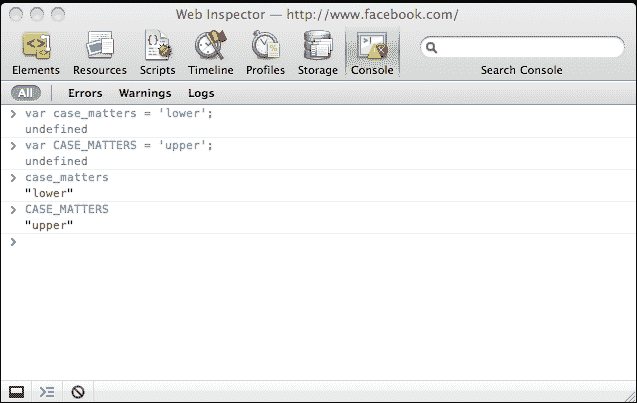
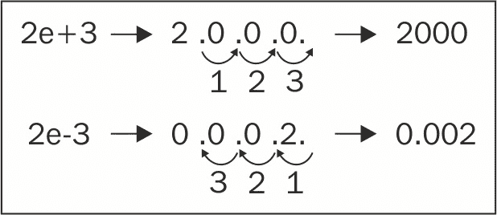
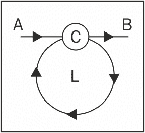
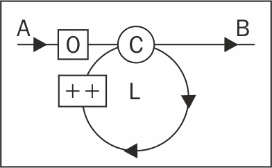

# 第二章：原始数据类型、数组、循环和条件

在深入探讨 JavaScript 面向对象特性之前，让我们先看看一些基础知识。本章将带你了解以下主题：

+   JavaScript 中的原始数据类型，例如字符串和数字

+   数组

+   常见运算符，例如`+`、`-`、`delete`和`typeof`

+   流程控制语句，例如循环和`if...else`条件

# 变量

变量用于存储数据；它们是具体值的占位符。在编写程序时，使用变量而不是实际数据更方便，例如，用`pi`代替`3.141592653589793`要容易得多；尤其是在程序内部多次出现时。变量中存储的数据在最初赋值后可以更改，因此得名**变量**。你还可以使用变量来存储你在编写代码时不知道的数据，例如后续操作的結果。

使用变量需要以下两个步骤。你需要：

+   声明变量

+   初始化它，即给它赋值

要声明一个变量，你将使用类似于以下代码片段的`var`语句：

```js
    var a; 
    var thisIsAVariable;  
    var _and_this_too;  
    var mix12three; 

```

对于变量的命名，你可以使用字母、数字、下划线字符和美元符号的任意组合。然而，变量不能以数字开头，这意味着以下代码声明是无效的：

```js
    var 2three4five; 

```

初始化一个变量意味着给它第一次（初始）赋值。以下有两种这样做的方式：

+   首先声明变量，然后初始化它

+   使用单个语句声明并初始化它

后者的一个例子如下：

```js
    var a = 1; 

```

现在名为`a`的变量包含值`1`。

你可以使用单个`var`语句声明并可选地初始化多个变量；只需用逗号分隔声明，如下面的代码行所示：

```js
    var v1, v2, v3 = 'hello', v4 = 4, v5; 

```

为了可读性，通常使用每行一个变量的方式来编写，如下所示：

```js
    var v1,  
        v2,  
        v3 = 'hello',  
        v4 = 4,  
        v5; 

```

### 注意

**变量名中的$字符**

你可能会在变量名中看到美元符号字符（`$`），例如`$myvar`或较少见的`my$var`。这个字符可以在变量名中的任何位置出现，尽管 ECMA 标准的早期版本不建议在手工编写的程序中使用它，并建议它只应在由其他程序编写的代码（生成代码）中使用。这个建议并没有得到 JavaScript 社区的广泛尊重，实际上`$`在实践中被广泛用作函数名。

## 变量名是区分大小写的

变量名是区分大小写的。你可以通过使用 JavaScript 控制台轻松验证此声明。尝试在每行后按*Enter*键输入以下代码：

```js
    var case_matters = 'lower'; 
    var CASE_MATTERS = 'upper';  
    case_matters; 
    CASE_MATTER; 

```

为了在输入第三行时节省按键，你可以输入`case`并按*Tab*键或右箭头键。**控制台**会自动补全变量名为`case_matters`。同样，对于最后一行，输入`CASE`并按*Tab*键。最终结果如下所示：



在本书的其余部分，只给出了示例代码，而不是截图，如下所示：

```js
    > var case_matters = 'lower'; 
    > var CASE_MATTERS = 'upper'; 
    > case_matters; 
    "lower" 
    > CASE_MATTERS; 
    "upper" 

```

大于号（`>`）显示你输入的代码；其余的是在**控制台**中打印的结果。再次提醒，当你看到这样的代码示例时，强烈建议你自己输入代码。然后，你可以通过稍作调整来实验，以更好地了解它的工作原理。

### 注意

你可以在前面的截图看到，有时你在**控制台**中输入的内容会导致出现**未定义**这个词。你可以简单地忽略它，但如果你想知道，这里是你输入（执行）的内容时会发生什么——**控制台**会打印出返回的值。有些表达式，例如`var a = 1;`，不会明确返回任何内容，在这种情况下，它们隐式地返回特殊值**未定义**（稍后会有更多介绍）。当一个表达式返回某个值（例如，前一个例子中的`case_matters`或`1 + 1`）时，该值会被打印出来。并非所有控制台都会打印**未定义**值；例如，Firebug 控制台。

# 运算符

运算符接受一个或两个值（或变量），执行一个操作，并返回一个值。让我们通过一个简单的例子来看看如何使用运算符，以便澄清术语：

```js
    > 1 + 2; 
    3 

```

在前面的代码中：

+   `+`符号是运算符

+   操作是加法

+   输入值是`1`和`2`（它们也被称为操作数）

+   结果值是`3`

+   整个东西被称为表达式

在表达式中直接使用`1`和`2`的值，你可以使用变量。你还可以使用变量来存储操作的结果，如下面的例子所示：

```js
    > var a = 1; 
    > var b = 2; 
    > a + 1; 
    2 
    > b + 2; 
    4 
    > a + b; 
    3 
    > var c = a + b; 
    > c; 
    3 

```

下表列出了基本的算术运算符：

| **运算符符号** | **操作** | **示例** |
| --- | --- | --- |
| `+` | 加法 |

```js
> 1 + 2;   
3   

```

|

| `-` | 减法 |
| --- | --- |

```js
> 99.99 - 11;   
88.99   

```

| `=` | 赋值运算符 |

| `*` | 乘法 |
| --- | --- |

```js
> 2 * 3;   
6   

```

|

| `/` | 除法 |
| --- | --- |

```js
> 6 / 4;   
1.5   

```

|

| `%` | 取模，除法的余数 |
| --- | --- |

```js
> 6 % 3;   
0   
> 5 % 3;   
2   

```

有时候测试一个数字是偶数还是奇数是有用的。使用取模运算符，这样做很容易。所有奇数除以`2`时都返回`1`，而所有偶数都返回`0`，例如：

```js
> 4 % 2;   
0   
> 5 % 2;   
1   

```

|

| `++` | 将值增加`1` | 后增量是在返回输入值之后增加输入值，例如：

```js
> var a = 123;    
> var b = a++;   
> b;   
123   
> a;   
124   

```

预增量的相反是后增量。输入值首先增加`1`，然后返回，例如：

```js
> var a = 123;    
> var b = ++a;   
> b;   
124   
> a;   
124   

```

|

| `--` | 将值减`1` | 后减量：

```js
> var a = 123;    
> var b = a--;   
> b;   
123   
> a;   
122   

```

预减量：

```js
> var a = 123;    
> var b = --a;   
> b;   
122   
> a;   
122   

```

|

`var a = 1;`也是一个操作；它是简单的赋值操作，`=`是**简单** **赋值** **运算符**。

也有一系列运算符，它们是赋值运算符和算术运算符的组合。这些被称为**复合运算符**。它们可以使你的代码更加紧凑。让我们通过以下示例来看看其中的一些：

```js
    > var a = 5; 
    > a += 3; 
    8 

```

在这个例子中，`a += 3;` 只是一种更简短的方式来执行 `a = a + 3;`。例如：

```js
    > a -= 3; 
    5 

```

这里，`a -= 3;` 与 `a = a - 3;` 相同：

```js
    > a *= 2; 
    10 
    > a /= 5; 
    2 
    > a %= 2; 
    0 

```

除了之前讨论的算术和赋值运算符之外，还有其他类型的运算符，你将在后面的章节中看到。

### **注意**

**最佳实践**

总是以分号结束你的表达式。JavaScript 有一个分号插入机制，它可以在你忘记在行尾添加分号时添加它。然而，这也可能成为错误的一个来源，所以最好确保你总是明确地指出你想要在哪里结束你的表达式。换句话说，表达式 `> 1 + 1` 和 `> 1 + 1;` 都可以工作；但在这本书中，你将始终看到第二种类型，以分号结束，只是为了强调这个习惯。

# 原始数据类型

你使用的任何值都是某种类型。在 JavaScript 中，以下只是一些原始数据类型：

1.  **数字**：这包括浮点数和整数。例如，这些值都是数字 - `1`，`100`，`3`.`14`。

1.  **字符串**：这些由任意数量的字符组成，例如，`a`，`one`，和 `one 2 three`。

1.  **布尔值**：这可以是 `true` 或 `false`。

1.  **未定义**：当你尝试访问一个不存在的变量时，你会得到特殊的值 `undefined`。同样，当你声明一个变量但尚未为其分配值时，也会发生这种情况。JavaScript 在幕后将变量的值初始化为 `undefined`。未定义数据类型只能有一个值 - 特殊值 `undefined`。

1.  **空值**：这是另一种只能有一个值 - `null` 值的特殊数据类型。它表示没有值，空值或无。与 `undefined` 的区别在于，如果一个变量有 `null` 值，它仍然是已定义的；只是恰好它的值是空的。你很快就会看到一些例子。

任何不属于这里列出的五种原始类型的值都是对象。即使是 `null` 也是一个对象，这有点尴尬，因为一个实际上什么都没有的对象（某物）。我们将在 第四章 中学习更多关于对象的内容，但在此期间，请记住，在 JavaScript 中，数据类型如下：

+   原始数据类型（前面列出的五种类型）

+   非原始数据类型（对象）

## 查找值类型 - typeof 操作符

如果你想知道变量或值的类型，你可以使用特殊的 `typeof` 操作符。此运算符返回一个表示数据类型的字符串。使用 `typeof` 的返回值可以是以下之一：

+   数字

+   字符串

+   布尔值

+   未定义

+   对象

+   函数

在接下来的几节中，你将通过每个五种原始数据类型的示例来看到 `typeof` 的实际应用。

## 数字

最简单的数字是整数。如果你将 `1` 分配给一个变量，然后使用 `typeof` 操作符，它将返回字符串 `number`，如下所示：

```js
    > var n = 1; 
    > typeof n; 
    "number" 
    > n = 1234; 
    > typeof n; 
    "number" 

```

在前面的例子中，你可以看到第二次设置变量的值时，不需要`var`语句。

数字也可以是浮点数（小数），例如：

```js
    > var n2 = 1.23; 
    > typeof n; 
    "number" 

```

你可以直接在值上调用`typeof`而不需要先将其赋给变量，例如：

```js
    > typeof 123; 
    "number" 

```

### 八进制和十六进制数

当一个数字以`0`开头时，它被认为是八进制数。例如，八进制`0377`是十进制的`255`：

```js
    > var n3 = 0377; 
    > typeof n3; 
    "number" 
    > n3; 
    255 

```

前面的例子中的最后一行打印了八进制值的十进制表示。

ES6 提供了一个前缀`0o`（或`0O`，但在大多数等宽字体中看起来非常混乱）来表示八进制。以下代码行为例：

```js
    console.log(0o776); //510 

```

虽然你可能对八进制数字不太熟悉，但你可能已经使用十六进制值在 CSS 样式表中定义颜色。

在 CSS 中，你有几种定义颜色的选项，其中两个如下：

+   使用十进制值来指定 R（红色）、G（绿色）和 B（蓝色）的量，范围从`0`到`255`。例如，*rgb(0, 0, 0)*是黑色，而*rgb(255, 0, 0)*是红色（红色量最大，没有绿色或蓝色）。

+   使用十六进制并指定每个 R、G 和 B 值两个字符。例如，*#000000*是黑色，而*#ff0000*是红色。这是因为*ff*是表示`255`的十六进制值。

在 JavaScript 中，你可以在十六进制值前加上`0x`，也简称为 hex，例如：

```js
    > var n4 = 0x00; 
    > typeof n4; 
    "number" 
    > n4; 
    0 
    > var n5 = 0xff; 
    > typeof n5; 
    "number" 
    > n5; 
    255 

```

### 二进制字面量

在 ES6 之前，如果你需要整数的二进制表示，你必须将它们作为基数`2`的字符串传递给`parseInt()`函数，如下所示：

```js
    console.log(parseInt('111',2)); //7 

```

在 ES6 中，你可以使用`0b`（或`0B`）前缀来表示二进制整数。例如：

```js
    console.log(0b111); //7 

```

### 指数字面量

`1e1`（也写作`1e+1`或`1E1`或`1E+1`）表示数字 1 后面跟着一个 0，换句话说，`10`。同样，`2e+3`表示数字 2 后面跟着三个 0，即`2000`，例如：

```js
    > 1e1; 
    10 
    > 1e+1; 
    10 
    > 2e+3; 
    2000 
    > typeof 2e+3; 
    "number" 

```

`2e+3`意味着将数字**2**的小数点向右移动三位。还有`2e-3`，意味着将数字**2**的小数点向左移动三位。 以下是一个图示：



以下是一段代码：

```js
    > 2e-3; 
    0.002 
    > 123.456E-3; 
    0.123456 
    > typeof 2e-3; 
    "number" 

```

### Infinity

在 JavaScript 中有一个特殊值叫做 Infinity。它表示一个 JavaScript 无法处理的非常大的数。Infinity 确实是一个数字，如你在控制台中输入`typeof Infinity`可以确认。你也可以快速检查一个有`308`个零的数字是可行的，但`309`个零就太多了。精确地说，JavaScript 可以处理的最大数字是`1.7976931348623157e+308`，而最小的是`5e-324`。以下是一个例子：

```js
    > Infinity; 
    Infinity 
    > typeof Infinity; 
    "number" 
    > 1e309; 
    Infinity 
    > 1e308; 
    1e+308 

```

除以零会得到无限大，例如：

```js
    > var a = 6 / 0; 
    > a; 
    Infinity 

```

`Infinity`是最大的数字（或者说是比最大的数字略大），那么最小的是什么呢？它是在前面带有负号的无限大；例如`-Infinity`：

```js
    > var i = -Infinity; 
    > i; 
    -Infinity 
    > typeof i; 
    "number" 

```

这是否意味着你可以有一个正好是无穷大两倍的东西，从 0 到无穷大，然后从 0 到负无穷大？实际上并不是这样。当你将 `Infinity` 和 `-Infinity` 相加时，你不会得到 `0`，而是得到一个被称为 **非数字**（**NaN**）的东西。例如：

```js
    > Infinity - Infinity; 
    NaN 
    > -Infinity + Infinity; 
    NaN 

```

任何包含 `Infinity` 作为操作数的其他算术运算都会得到 `Infinity`，例如：

```js
    > Infinity - 20; 
    Infinity 
    > -Infinity * 3; 
    -Infinity 
    > Infinity / 2; 
    Infinity 
    > Infinity - 99999999999999999; 
    Infinity 

```

还有一个不太为人所知的全局方法，`isFinite()`，它可以告诉你一个值是否是无穷大。ES6 添加了一个 `Number.isFinite()` 方法来执行这个操作。你可能会问，为什么还需要另一个方法呢？全局版本的 `isFinite()` 会尝试将值通过 `Number(value)` 转换，而 `Number.isFinite()` 则不会，因此它更准确。

### NaN

在上一个例子中，这个 `NaN` 是什么？实际上，尽管它的名字叫“非数字”，`NaN` 也是一个特殊的值，它也是一个数字：

```js
    > typeof NaN; 
    "number" 
    > var a = NaN; 
    > a; 
    NaN 

```

当你尝试执行一个假设数字的操作，但操作失败时，你会得到 `NaN`。例如，如果你尝试将 `10` 乘以字符 `"f"`，结果就是 `NaN`，因为 `"f"` 显然不是一个有效的乘法操作数：

```js
    > var a = 10 * "f"; 
    > a;   
    NaN 

```

`NaN` 是具有传染性的，所以如果你在算术运算中有一个 `NaN`，整个结果都会变成 `NaN`，例如：

```js
    > 1 + 2 + NaN; 
    NaN 

```

#### Number.isNaN

ES5 拥有一个全局方法-`isNaN()`。它用于判断一个值是否为 `NaN`。ES6 提供了一个非常类似的方法-`Number.isNaN()`（注意，这个方法不是全局的）。

全局 `isNaN()` 和 `Number.isNaN()` 之间的区别在于，全局 `isNaN()` 在评估为 `NaN` 之前会将非数字值转换为数字。让我们看看以下例子。我们使用 ES6 的 `Number.isNaN()` 方法来测试某个值是否是 `NaN`：

```js
    console.log(Number.isNaN('test')); //false : Strings are not NaN 
    console.log(Number.isNaN(123)); //false : integers are not NaN 
    console.log(Number.isNaN(NaN)); //true : NaNs are NaNs 
    console.log(Number.isNaN(123/'abc')); //true : 123/'abc' results in an NaN 

```

我们看到 ES5 的全局 `isNaN()` 方法首先将非数字值转换为数字，然后进行比较；以下结果将与其 ES6 对应版本不同：

```js
    console.log(isNaN('test')); //true 

```

通常来说，与它的全局版本相比，`Number.isNaN()` 更准确。然而，它们都不能用来判断一个值是否不是数字——它们只是回答值是否是 `NaN`。实际上，你可能更感兴趣的是知道一个值是否被识别为数字。Mozilla 建议使用以下 polyfill 方法来实现这一点：

```js
    function isNumber(value) { 
      return typeof value==='number' && !Number.isNaN(value); 
    } 

```

#### Number.isInteger

这是一个 ES6 中的新方法。如果数字是有限的且不包含任何小数点（是一个整数），它会返回 `true`：

```js
    console.log(Number.isInteger('test')); //false 
    console.log(Number.isInteger(Infinity)); //false 
    console.log(Number.isInteger(NaN)); //false 
    console.log(Number.isInteger(123)); //true 
    console.log(Number.isInteger(1.23)); //false 

```

## 字符串

字符串是一系列用于表示文本的字符。在 JavaScript 中，任何放在单引号或双引号之间的值都被认为是字符串。这意味着 `1` 是一个数字，但 `"1"` 是一个字符串。当与字符串一起使用时，`typeof` 返回字符串 `"string"`，例如：

```js
    > var s = "some characters"; 
    > typeof s; 
    "string" 
    > var s = 'some characters and numbers 123 5.87'; 
    > typeof s; 
    "string" 

```

这是一个在字符串上下文中使用数字的例子：

```js
    > var s = '1'; 
    > typeof s; 
    "string" 

```

如果你什么也不在引号里放，它仍然是一个字符串（一个空字符串），例如：

```js
    > var s = ""; typeof s; 
    "string" 

```

如您所知，当您使用两个数字的加号时，这是算术加法运算。然而，如果您使用字符串的加号，这将是一个字符串连接操作，并返回两个粘合在一起的字符串：

```js
    > var s1 = "web";  
    > var s2 = "site";  
    > var s = s1 + s2;  
    > s; 
    "website" 
    > typeof s; 
    "string" 

```

`+` 运算符的双重用途是错误的一个来源。因此，如果您打算连接字符串，最好确保所有的运算符都是字符串。同样适用于加法；如果您打算加数，请确保运算符是数字。您将在本章和书中进一步了解如何做到这一点。

### 字符串转换

当您使用类似数字的字符串，例如 `"1"`，作为算术运算的运算符时，字符串在幕后被转换为数字。这适用于所有算术运算，除了加法，因为它具有歧义。考虑以下示例：

```js
    > var s = '1';  
    > s = 3 * s;  
    > typeof s; 
    "number" 
    > s; 
    3 
    > var s = '1'; 
    > s++; 
    > typeof s; 
    "number" 
    > s; 
    2 

```

将任何类似数字的字符串转换为数字的一种懒惰方法是将其乘以 `1`（另一种方法是使用名为 `parseInt()` 的函数，您将在下一章中看到）：

```js
    > var s = "100"; typeof s; 
    "string" 
    > s = s * 1; 
    100 
    > typeof s; 
    "number" 

```

如果转换失败，您将得到 `NaN`：

```js
    > var movie = '101 dalmatians'; 
    > movie * 1; 
    NaN 

```

您可以通过将其乘以 `1` 将字符串转换为数字。相反的转换——将任何内容转换为字符串——可以通过将其与空字符串连接来实现，如下所示：

```js
    > var n = 1; 
    > typeof n; 
    "number" 
    > n = "" + n; 
    "1" 
    > typeof n; 
    "string" 

```

### 特殊字符串

以下表格列出了具有特殊含义的字符串：

| **字符串** | **含义** | **示例** |
| --- | --- | --- |

| `\\``'``"` | `\` 是转义字符。当您想在字符串中包含引号时，您可以转义它们，这样 JavaScript 就不会认为它们是字符串的结尾。如果您想在字符串中包含实际的反斜杠，请使用另一个反斜杠来转义它。 | `> var s = 'I don't know';`：这是一个错误，因为 JavaScript 认为字符串是 `I don`，其余部分是无效代码。以下代码是有效的：

```js
> var s = 'I don't know';   
> var s = "I don't know";   
> var s = "I don't know";   
> var s = '"Hello",   he said.';   
> var s = ""Hello",   he said.";   
Escaping the escape:   
> var s = "1\\2"; s;   
"1\2"   

```

|

| `\n` | 行尾。 |
| --- | --- |

```js
> var s = '\n1\n2\n3\n';   
> s;   
"   
1   
2   
3   
"   

```

|

| `\r` | 回车符。 | 考虑以下声明：

```js
> var s = '1\r2';   
> var s = '1\n\r2';   
> var s = '1\r\n2';   

```

所有这些的结果如下：

```js
> s;   
"1   
2"   

```

|

| `\t` | 制表符。 |
| --- | --- |

```js
> var s = "1\t2";   
> s;   
"1 2"   

```

|

| `\u` | `\u` 后跟一个字符码允许您使用 Unicode。 | 这里是我的名字，用西里尔字母在保加利亚语中写成：

```js
> "\u0421\u0442\u043E\u044F\u043D";   
"Стoян"   

```

|

也有一些很少使用的附加字符：`\b`（退格），`\v`（垂直制表符），和 `\f`（换页符）。

### 字符串模板字符串

ES6 引入了模板字符串。如果您熟悉其他编程语言，Perl 和 Python 已经支持模板字符串一段时间了。模板字符串允许在普通字符串中嵌入表达式。ES6 有两种类型的字面量：模板字符串和标签模板字符串。

模板字符串是包含嵌入表达式的单行或多行字符串。例如，您必须已经做过类似以下的事情：

```js
    var log_level="debug"; 
    var log_message="meltdown"; 
    console.log("Log level: "+ log_level + 
      " - message : " + log_message); 
    //Log level: debug - message : meltdown 

```

您可以使用模板字符串完成相同的事情，如下所示：

```js
    console.log(`Log level: ${log_level} - message: ${log_message}`) 

```

模板字面量由反引号（```js `` ```）（重音符号）字符包围，而不是通常的双引号或单引号。模板字面量占位符由美元符号和花括号（`${expression}`）表示。默认情况下，它们被连接成一个单独的字符串。以下示例显示了一个带有稍微复杂表达式的模板字面量：

```js
    var a = 10; 
    var b = 10; 
    console.log(`Sum is ${a + b} and Multiplication would be ${a * b}.`);   
    //Sum is 20 and Multiplication would be 100\. 

```

那么嵌入一个函数调用如何？

```js
    var a = 10; 
    var b = 10; 
    function sum(x,y){ 
      return x+y 
    } 
    function multi(x,y){ 
      return x*y 
    } 
    console.log(`Sum is ${sum(a,b)} and Multiplication 
      would be ${multi(a,b)}.`); 

```

模板字面量还简化了多行字符串语法。而不是编写以下代码行：

```js
    console.log("This is line one \n" + "and this is line two"); 

```

您可以使用模板字面量获得更干净的语法，如下所示：

```js
    console.log(`This is line one and this is line two`); 

```

ES6 有另一种有趣的字面量类型，称为 **标签模板字面量**。标签模板允许您使用函数修改模板字面量的输出。如果您在模板字面量前缀一个表达式，那么该前缀被认为是将被调用的函数。在我们可以使用标签模板字面量之前，需要定义该函数。例如，以下表达式：

```js
    transform`Name is ${lastname}, ${firstname} ${lastname}` 

```

前面的表达式被转换为函数调用：

```js
    transform([["Name is ", ", ", " "],firstname, lastname) 

```

标签函数 `transform` 接收两个参数——模板字符串，如 `Name is`，以及由 `${}` 定义的替换。替换仅在运行时才知道。让我们扩展 `transform` 函数：

```js
    function transform(strings, ...substitutes){ 
      console.log(strings[0]); //"Name is" 
      console.log(substitutes[0]); //Bond 
    }   
    var firstname = "James"; 
    var lastname = "Bond" 
    transform`Name is ${lastname}, ${firstname} ${lastname}` 

```

当模板字符串（`Name is`）传递给标签函数时，每个模板字符串有两种形式，如下所示：

+   反斜杠不被解释的原始形式

+   反斜杠有特殊意义的已处理形式

您可以使用 `raw` 属性访问原始字符串形式，如下例所示：

```js
    function rawTag(strings,...substitutes){ 
      console.log(strings.raw[0]) 
    } 
    rawTag`This is a raw text and \n are not treated differently` 
    //This is a raw text and \n are not treated differently 

```

## 布尔值

只有两个值属于布尔数据类型——不带引号的 `true` 和 `false` 值：

```js
    > var b = true;  
    > typeof b; 
    "boolean" 
    > var b = false;  
    > typeof b; 
    "boolean" 

```

如果您引用 `true` 或 `false`，它们将成为字符串，如下例所示：

```js
    > var b = "true";  
    > typeof b; 
    "string" 

```

### 逻辑运算符

有三个运算符，称为逻辑运算符，它们与布尔值一起工作。这些如下：

```js
    ! - logical NOT (negation) 
    && - logical AND 
    || - logical OR 

```

您知道当某事不是真的时，它必须是假的。以下是使用 JavaScript 和逻辑 `!` 运算符如何表达这一点：

```js
    > var b = !true; 
    > b; 
    false 

```

如果您使用逻辑 `NOT` 两次，您将得到原始值，如下所示：

```js
    > var b = !!true; 
    > b; 
    true 

```

如果您在非布尔值上使用逻辑运算符，则该值在幕后被转换为布尔值，如下所示：

```js
    > var b = "one"; 
    > !b; 
    false 

```

在前面的情况下，字符串值 `"one"` 被转换为布尔值 `true`，然后取反。取反 `true` 的结果是 `false`。在以下示例中，有一个双重取反，所以结果是 `true`：

```js
    > var b = "one"; 
    > !!b; 
    true 

```

您可以使用双重取反将任何值转换为它的布尔等价物。了解任何值如何转换为布尔值很重要。大多数值转换为 `true`，除了以下这些，它们转换为 `false`：

+   空字符串 `""`

+   `null`

+   `undefined`

+   数字 `0`

+   数字 `NaN`

+   布尔值 `false`

这六个值被称为假值，而所有其他值都是真值（包括例如字符串 `"0"`、`" "` 和 `"false"`）。

让我们看看其他两个运算符的示例——逻辑`AND`（`&&`）和逻辑`OR`（`||`）。当你使用`&&`时，只有当所有操作数都为`true`时，结果才是`true`。当你使用`||`时，如果至少有一个操作数是`true`，则结果为`true`：

```js
    > var b1 = true, b2 = false; 
    > b1 || b2; 
    true 
    > b1 && b2; 
    false 

```

下面是一个可能的操作及其结果的列表：

| **操作** | **结果** |
| --- | --- |
| `true && true` | `true` |
| `true && false` | `false` |
| `false && true` | `false` |
| `false && false` | `false` |
| `true | | true` | `true` |
| `true | | false` | `true` |
| `false | | true` | `true` |
| `false | | false` | `false` |

你可以连续使用几个逻辑运算，如下所示：

```js
    > true && true && false && true; 
    false 
    > false || true || false; 
    true 

```

你也可以在同一个表达式中混合使用`&&`和`||`。在这种情况下，你应该使用括号来明确你打算如何进行操作。考虑以下示例：

```js
    > false && false || true && true; 
    true 
    > false && (false || true) && true; 
    false 

```

### 运算符优先级

你可能会想知道为什么前面的表达式（`false && false || true && true`）返回了`true`。答案在于运算符优先级，正如你所知，来自数学：

```js
    > 1 + 2 * 3; 
    7 

```

这是因为乘法比加法具有更高的优先级，所以`2 * 3`首先被评估，就像你输入了：

```js
    > 1 + (2 * 3); 
    7 

```

对于逻辑运算，同样，`!`具有最高的优先级，并且首先执行，前提是没有括号要求其他操作。然后，按照优先级顺序，是`&&`，最后是`||`。换句话说，以下两个代码片段是相同的。第一个如下所示：

```js
    > false && false || true && true; 
    true 

```

第二个代码片段如下所示：

```js
    > (false && false) || (true && true); 
    true 

```

### 注意

**最佳实践**

使用括号而不是依赖运算符优先级。这使得你的代码更容易阅读和理解。

ECMAScript 标准定义了运算符的优先级。虽然这可能是一个很好的记忆练习，但本书并不提供它。首先，你会忘记它，其次，即使你设法记住它，你也不应该依赖它。阅读和维护你代码的人可能会感到困惑。

### 惰性求值

如果你有一系列逻辑运算一个接一个，但在某个点之前结果已经明确，则最终的操作将不会执行，因为它们不会影响最终结果。以下代码行可以作为示例：

```js
    > true || false || true || false || true; 
    true 

```

由于这些都是`OR`运算，并且具有相同的优先级，因此如果至少有一个操作数是`true`，则结果将是`true`。在评估第一个操作数之后，很明显结果将是`true`，无论后续的值是什么。因此，JavaScript 引擎决定采取惰性（好吧，高效）的策略，通过评估不影响最终结果的代码来避免不必要的操作。你可以通过在控制台中实验来验证这种短路行为，如下面的代码块所示：

```js
    > var b = 5; 
    > true || (b = 6); 
    true 
    > b; 
    5 
    > true && (b = 6); 
    6 
    > b; 
    6 

```

这个例子还展示了另一个有趣的行为——如果 JavaScript 在逻辑运算中遇到非布尔表达式作为操作数，则非布尔值将作为结果返回：

```js
    > true || "something"; 
    true 
    > true && "something"; 
    "something" 
    > true && "something" && true; 
    true 

```

这种行为不应该依赖于它，因为它会使代码更难以理解。通常使用这种行为来定义变量，当你不确定它们是否之前已定义时。在下一个示例中，如果 `mynumber` 变量已定义，其值将被保留；否则，它将被初始化为值 `10`：

```js
    > var mynumber = mynumber || 10; 
    > mynumber; 
    10 

```

这很简单，看起来也很优雅，但请注意，它并不完全万无一失。如果 `mynumber` 已定义并初始化为 `0`，或任何六个假值之一，这段代码可能不会按您期望的方式运行，如下所示：

```js
    > var mynumber = 0; 
    > var mynumber = mynumber || 10; 
    > mynumber; 
    10 

```

### 比较操作

另有一组操作符，它们在操作后都会返回一个布尔值。这些是比较操作符。以下表格列出了它们以及示例用法：

| **操作符符号** | **描述** | **示例** |
| --- | --- | --- |
| `==` | **等价比较**：当两个操作数相等时返回 `true`。在比较之前，操作数会被转换为相同的类型。它们也被称为松散比较。 |

```js
> 1 == 1;   
true   
> 1 == 2;   
false   
> 1 =='1';   
true   

```

|

| `===` | **等价和类型比较**：如果两个操作数相等且类型相同，则返回 `true`。这种方式比较更好、更安全，因为没有幕后类型转换。它也被称为严格比较。 |
| --- | --- |

```js
> 1 === '1';   
false   
> 1 === 1;   
true   

```

|

| `!=` | **非等价比较**：如果操作数在类型转换后不相等，则返回 `true`。 |
| --- | --- |

```js
> 1 != 1;   
false   
> 1 != '1';   
false   
> 1 != '2';   
true   

```

|

| `!==` | **无类型转换的非等价比较**：如果操作数不相等或它们是不同类型，则返回 `true`。 |
| --- | --- |

```js
> 1 !== 1;   
false   
> 1 !== '1';   
true   

```

|

| `>` | 如果左操作数大于右操作数，则返回 `true`。 |
| --- | --- |

```js
> 1 > 1;   
false   
> 33 > 22;   
true   

```

|

| `>=` | 如果左操作数大于或等于右操作数，则返回 `true`。 |
| --- | --- |

```js
> 1 >= 1;   
true   

```

|

| `<` | 如果左操作数小于右操作数，则返回 `true`。 |
| --- | --- |

```js
> 1 < 1;   
false   
> 1 < 2;   
true   

```

|

| `<=` | 如果左操作数小于或等于右操作数，则返回 `true`。 |
| --- | --- |

```js
> 1 <= 1;   
true   
> 1 <= 2;   
true   

```

|

注意，`NaN` 不等于任何值，甚至不等于它自己。看看以下代码行：

```js
    > NaN == NaN; 
    false 

```

## 未定义和空值

如果你尝试使用一个不存在的变量，你会得到以下错误：

```js
    > foo; 
    ReferenceError: foo is not defined 

```

在一个不存在的变量上使用 `typeof` 操作符不会产生错误。你将得到 `"undefined"` 字符串，如下所示：

```js
    > typeof foo; 
    "undefined" 

```

如果你声明一个变量而没有给它赋值，这当然不是错误。但是，`typeof` 仍然返回 `"undefined"`：

```js
    > var somevar; 
    > somevar; 
    > typeof somevar; 
    "undefined" 

```

这是因为，当你声明一个未初始化的变量时，JavaScript 会自动将其初始化为 `undefined` 值，如下所示：

```js
    > var somevar; 
    > somevar === undefined; 
    true 

```

另一方面，`null` 值不是由 JavaScript 在幕后分配的；它是由你的代码分配的，如下所示：

```js
    > var somevar = null; 
    null 
    > somevar; 
    null 
    > typeof somevar; 
    "object" 

```

虽然 `null` 和 `undefined` 之间的区别很小，但在某些时候可能是关键的。例如，如果你尝试进行算术运算，你会得到不同的结果：

```js
    > var i = 1 + undefined; 
    > i; 
    NaN 
    > var i = 1 + null; 
    > i; 
    1 

```

这是因为`null`和`undefined`转换为其他原始类型的方式不同。以下示例显示了可能的转换：

+   转换为数字：

    ```js
            > 1 * undefined; 

    ```

+   转换为`NaN`：

    ```js
            > 1 * null; 
            0 

    ```

+   转换为布尔值：

    ```js
            > !!undefined; 
            false 
            > !!null; 
            false 

    ```

+   转换为字符串：

    ```js
            > "value: " + null; 
            "value: null" 
            > "value: " + undefined; 
            "value: undefined" 

    ```

## 符号

ES6 引入了一种新的原始类型——符号。几种语言有类似的概念。符号看起来与普通字符串非常相似，但它们非常不同。让我们看看这些符号是如何创建的：

```js
    var atom = Symbol() 

```

注意，在创建符号时我们没有使用`new`运算符。当你使用它时，你会得到一个错误：

```js
    var atom = new Symbol() //Symbol is not a constructor 

```

你也可以这样描述`符号`：

```js
    var atom = Symbol('atomic symbol') 

```

在调试大型程序时，其中有很多符号散布各处，描述符号非常有用。

`Symbol`（因此它们存在的原因）最重要的属性是它们是唯一的且不可变的：

```js
    console.log(Symbol() === Symbol()) //false 
    console.log(Symbol('atom') === Symbol('atom')) // false 

```

目前，我们不得不暂停对符号的讨论。符号用作属性键和需要唯一标识符的地方。我们将在本书的后续部分讨论符号。

# 原始数据类型回顾

让我们快速总结一下到目前为止讨论的一些主要观点：

+   JavaScript 中有五种原始数据类型：

    +   数字

    +   字符串

    +   布尔值

    +   未定义

    +   空值

+   一切不是原始数据类型的东西都是对象。

    原始数字数据类型可以存储正数和负整数或浮点数、十六进制数、八进制数、指数和特殊数字——`NaN`、`Infinity`和`-Infinity`。

+   字符串数据类型包含引号内的字符。模板字符串允许在字符串中嵌入表达式。

+   布尔数据类型的唯一值是`true`和`false`。

+   空数据类型的唯一值是`null`值。

+   未定义数据类型的唯一值是`undefined`值。

+   所有值在转换为布尔值时都变为`true`，但有以下六个假值例外：

    +   `""`

    +   `null`

    +   `undefined`

    +   `0`

    +   `NaN`

    +   `false`

# 数组

现在你已经了解了 JavaScript 中的基本原始数据类型，是时候转向更强大的数据结构——数组了。

那么，什么是数组呢？它只是一个值列表（一个序列）。你不需要使用一个变量来存储一个值，而是可以使用一个数组变量来存储任何数量的值作为数组的元素。

要声明一个包含空数组的变量，你可以使用没有任何内容之间的方括号，如下面的代码行所示：

```js
    > var a = []; 

```

要定义一个包含三个元素的数组，你可以写下以下代码行：

```js
    > var a = [1, 2, 3]; 

```

当你在控制台中简单地键入数组的名称时，你可以获取数组的全部内容：

```js
    > a; 
    [1, 2, 3] 

```

现在的问题是，如何访问存储在这些数组元素中的值。数组中的元素使用连续的数字进行索引，从零开始。第一个元素的索引（或位置）是 0，第二个是 1，以此类推。以下是从上一个示例中的三个元素的数组：

| **索引** | **值** |
| --- | --- |
| 0 | 1 |
| 1 | 2 |
| 2 | 3 |

要访问数组元素，您可以在方括号中指定该元素的索引。因此，`a[0]`给您提供了数组`a`的第一个元素，`a[1]`给您提供了第二个，依此类推，如下面的示例所示：

```js
    > a[0]; 
    1 
    > a[1]; 
    2 

```

## 添加/更新数组元素

使用索引，您还可以更新数组元素的值。下一个示例更新了第三个元素（索引 2），并打印了新数组的内容，如下所示：

```js
    > a[2] = 'three'; 
    "three" 
    > a; 
    [1, 2, "three"] 

```

您可以通过引用之前不存在的索引来添加更多元素，如下面的代码行所示：

```js
    > a[3] = 'four'; 
    "four" 
    > a; 
    [1, 2, "three", "four"] 

```

如果您添加了一个新元素，但在数组中留下了一个空隙，那么在之间的元素不存在，如果访问它们，将返回`undefined`值。查看以下示例：

```js
    > var a = [1, 2, 3]; 
    > a[6] = 'n`xew'; 
    "new" 
    > a; 
    [1, 2, 3, undefined x 3, "new"] 

```

## 删除元素

要删除元素，您可以使用`delete`运算符。然而，删除后，数组的长度不会改变。在某种程度上，您可能在数组中有一个空隙：

```js
    > var a = [1, 2, 3]; 
    > delete a[1]; 
    true 
    > a; 
    [1, undefined, 3] 
    > typeof a[1]; 
    "undefined" 

```

## 数组数组

数组可以包含所有类型的值，包括其他数组：

```js
    > var a = [1, "two", false, null, undefined]; 
    > a; 
    [1, "two", false, null, undefined] 
    > a[5] = [1, 2, 3]; 
    [1, 2, 3] 
    > a; 
    [1, "two", false, null, undefined, Array[3]] 

```

结果中的`Array[3]`在控制台中是可点击的，并且展开数组值。让我们看看一个例子，其中您有一个包含两个元素的数组，这两个元素都是其他数组：

```js
    > var a = [[1, 2, 3], [4, 5, 6]]; 
    > a; 
    [Array[3], Array[3]] 

```

数组的第一个元素是`[0]`，它也是一个数组：

```js
    > a[0]; 
    [1, 2, 3] 

```

要访问嵌套数组中的元素，您可以在另一组方括号中引用该元素的索引，如下所示：

```js
    > a[0][0]; 
    1 
    > a[1][2]; 
    6 

```

注意，您可以使用数组符号来访问字符串内部的单个字符，如下面的代码块所示：

```js
    > var s = 'one'; 
    > s[0]; 
    "o" 
    > s[1]; 
    "n" 
    > s[2]; 
    "e" 

```

### 注意

数组对字符串的支持在许多浏览器中已经存在了一段时间（不是老版本的 IE），但直到 ECMAScript 5 才被正式认可。

有更多方法可以与数组（我们在第四章中介绍这些，*对象*），但现在让我们停下来，记住以下要点：

+   数组是一个数据存储

+   数组包含索引元素

+   索引从零开始，并且对于数组中的每个元素递增一。

+   要访问数组中的元素，您可以使用方括号中的索引

+   数组可以包含任何类型的数据，包括其他数组

# 条件和循环

条件提供了一种简单但强大的方式来控制代码执行的流程。循环允许您用更少的代码执行重复操作。让我们看看：

+   `if`条件

+   `switch`语句

+   `while`、`do...while`、`for`和`for...in`循环

### 注意

下面的示例需要您切换到多行 Firebug 控制台。或者，如果您使用 WebKit 控制台，请按*Shift* + *Enter*而不是*Enter*来添加新行。

## 代码块

在前面的示例中，您看到了代码块的使用。让我们花一点时间来明确一下什么是代码块，因为在构建条件和循环时，您将广泛地使用代码块。

代码块由零个或多个用大括号括起来的表达式组成，如下面的代码行所示：

```js
    { 
      var a = 1; 
      var b = 3; 
    } 

```

你可以在每个代码块内部无限嵌套其他代码块，如下面的示例所示：

```js
    { 
      var a = 1; 
      var b = 3; 
      var c, d; 
      { 
        c = a + b; 
        { 
          d = a - b; 
        } 
      } 
    } 

```

### 注意

**最佳实践技巧**

使用行尾分号，如本章之前所述。虽然当每行只有一个表达式时，分号是可选的，但养成使用它们的习惯是好的。为了最佳的可读性，块内的单个表达式应放在每行一个，并用分号分隔。

在花括号内放置的任何代码都要缩进。一些程序员喜欢使用一个制表符缩进，一些使用四个空格，还有一些使用两个空格。这真的不重要，只要保持一致即可。在上面的示例中，外层代码块使用两个空格缩进，第一层嵌套代码使用四个空格缩进，最内层代码块使用六个空格缩进。

使用花括号。当一个代码块只包含一个表达式时，花括号是可选的，但为了可读性和可维护性，你应该养成即使它们是可选的也始终使用它们的习惯。

### `if` 条件

这是一个简单的 `if` 条件示例：

```js
    var result = '', a = 3; 
    if (a > 2) { 
      result = 'a is greater than 2'; 
    } 

```

`if` 条件的各个部分如下：

+   `if` 语句

+   括号内的条件-`是否大于 2`？

+   一个代码块，如果条件满足则执行

条件（括号内的部分）总是返回一个布尔值，并且可能还包含以下内容：

+   逻辑运算符-`!`、`&&` 或 `||`

+   比较运算符，如 `===`、`!=`、`>` 等

+   任何可以转换为布尔值的值或变量

+   以上内容的组合

### `else` 子句

`if` 条件的可选部分也可以是 `else`。`else` 语句后面跟着一个代码块，如果条件评估为 `false` 则执行：

```js
    if (a > 2) { 
      result = 'a is greater than 2'; 
    } else { 
      result = 'a is NOT greater than 2'; 
    } 

```

在 `if` 和 `else` 语句之间，也可以有无限数量的 `else...if` 条件。以下是一个示例：

```js
    if (a > 2 || a < -2) { 
      result = 'a is not between -2 and 2'; 
    } else if (a === 0 && b === 0) { 
      result = 'both a and b are zeros'; 
    } else if (a === b) { 
      result = 'a and b are equal'; 
    } else { 
      result = 'I give up'; 
    } 

```

你也可以通过在任意代码块内放置新的条件来嵌套条件，如下面的代码片段所示：

```js
    if (a === 1) { 
      if (b === 2) { 
        result = 'a is 1 and b is 2'; 
      } else { 
        result = 'a is 1 but b is definitely not 2'; 
     } 
    } else { 
      result = 'a is not 1, no idea about b'; 
    } 

```

### 检查变量是否存在

让我们应用关于条件的新知识来处理一些实际应用。通常需要检查变量是否存在。最懒惰的方法是将变量简单地放在 `if` 语句的条件部分，例如，`if (somevar) {...}`。但是，这不一定是最优的方法。让我们看看一个测试 `somevar` 变量是否存在，如果存在，则将 `result` 变量设置为 `yes` 的示例：

```js
    > var result = ''; 
    > if (somevar) {  
        result = 'yes';  
      } 
    ReferenceError: somevar is not defined 
    > result;   
    "" 

```

这段代码显然是有效的，因为最终结果不是 `yes`。但是首先，代码生成了一个错误-`somevar` 未定义，你不想你的代码表现得像这样。其次，`if (somevar)` 返回 `false` 并不意味着 `somevar` 未定义。可能是 `somevar` 已定义并初始化，但包含一个假值，如 `false` 或 `0`。

检查变量是否定义的更好方法是使用 `typeof`：

```js
    > var result = ""; 
    > if (typeof somevar !== "undefined") {  
        result = "yes";  
      } 
    > result; 
    "" 

```

`typeof`运算符始终返回一个字符串，你可以将这个字符串与字符串`"undefined"`进行比较。注意，`somevar`变量可能已经被声明但尚未分配值，你仍然会得到相同的结果。所以，当用`typeof`进行测试时，你实际上是在测试变量是否有除了`undefined`值之外的任何值：

```js
    > var somevar; 
    > if (typeof somevar !== "undefined") {  
        result = "yes";  
      } 
    > result; 
    "" 
    > somevar = undefined; 
    > if (typeof somevar !== "undefined") {  
        result = "yes";  
      } 
    > result; 
    "" 

```

如果一个变量被定义并且用除了`undefined`之外的任何值初始化，那么`typeof`返回的类型就不再是`"undefined"`，如下面的代码片段所示：

```js
    > somevar = 123; 
    > if (typeof somevar !== "undefined") {  
        result = 'yes';  
      } 
    > result; 
    "yes" 

```

### 交替的`if`语法

当你有一个简单条件时，你可以考虑使用交替的`if`语法。看看这个：

```js
    var a = 1; 
    var result = ''; 
    if (a === 1) { 
      result = "a is one"; 
    } else { 
      result = "a is not one"; 
    } 

```

你也可以这样写：

```js
    > var a = 1; 
    > var result = (a === 1) ? "a is one" : "a is not one"; 

```

你应该只为简单条件使用这种语法。小心不要滥用它，因为它很容易使你的代码难以阅读。以下是一个例子。

假设你想要确保一个数字在某个范围内，比如说在`50`和`100`之间：

```js
    > var a = 123; 
    > a = a > 100 ? 100 : a < 50 ? 50: a; 
    > a; 
    100 

```

由于存在多个`?`，这段代码的工作原理可能不是很清楚。添加括号可以使它稍微清晰一些，如下面的代码块所示：

```js
    > var a = 123; 
    > a = (a > 100 ? 100 : a < 50) ? 50 : a; 
    > a; 
    50 
    > var a = 123; 
    > a = a > 100 ? 100 : (a < 50 ? 50 : a); 
    > a; 
    100 

```

`?:`被称为三元运算符，因为它有三个操作数。

### `switch`

如果你发现自己正在使用`if`条件并且有太多的`else...if`部分，你可以考虑将`if`改为`switch`，如下所示：

```js
    var a = '1', 
        result = ''; 
    switch (a) { 
    case 1: 
      result = 'Number 1'; 
      break; 
    case '1': 
      result = 'String 1'; 
      break; 
    default: 
      result = 'I don't know'; 
      break; 
    } 

```

执行此操作后的结果是`"String 1"`。让我们看看`switch`的各个部分：

+   `switch`语句。

+   括号中的表达式。这个表达式通常包含一个变量，但可以是任何返回值的任何东西。

+   包含在花括号中的一系列`case`块。

+   每个`case`语句后面跟着一个表达式。这个表达式的结果与`switch`语句后面的表达式进行比较。如果比较的结果是`true`，则执行冒号后面的`case`之后的代码。

+   有一个可选的`break`语句用来表示`case`块的结束。如果达到了这个`break`语句，`switch`语句就完成了。否则，如果缺少`break`，程序执行将进入下一个`case`块。

+   有一个可选的默认情况，用`default`语句标记，并跟随一个代码块。如果没有之前的任何情况评估为`true`，则执行默认情况。

换句话说，执行`switch`语句的逐步过程如下：

1.  评估括号中找到的`switch`表达式；记住它。

1.  移动到第一个`case`，并将其值与第 1 步中的值进行比较。

1.  如果第 2 步的比较返回`true`，则执行`case`块中的代码。

1.  在执行完`case`块之后，如果它的末尾有一个`break`语句，则退出`switch`。

1.  如果没有`break`或第 2 步返回`false`，则继续到下一个`case`块。

1.  重复步骤 2 到 5。

1.  如果你仍然在这里（第 4 步没有退出），执行`default`语句之后的代码。

### 小贴士

缩进 `case` 行后面的代码。你也可以从 `switch` 中缩进 `case`，但这在可读性方面帮助不大。

#### 不要忘记使用 `break`

有时候，你可能故意省略 `break`，但这很少见。这被称为“穿透”，应该始终记录下来，因为它可能看起来像是一个意外的遗漏。另一方面，有时候你可能想省略一个 `case` 后面的整个代码块，让两个 `case` 共享相同的代码。这是可以的，但这并不改变规则：如果有一个 `case` 后面跟着代码，那么这段代码应该以 `break` 结尾。至于缩进，将 `break` 与 `case` 或 `case` 内的代码对齐是个人喜好；再次强调，一致性才是关键。

使用默认情况。这有助于确保在 `switch` 语句之后，你总是有一个有意义的输出，即使没有 `case` 与被切换的值匹配。

## 循环

`if...else` 和 `switch` 语句允许你的代码根据条件选择不同的路径，就像你站在一个十字路口，根据条件决定走哪条路。另一方面，循环允许你的代码在合并回主路之前绕几个弯。重复多少次？这取决于在每个迭代之前（或之后）评估条件的结果。

假设你正在从 **A** 到 **B** 的旅途中（或者说你的程序执行正在旅途中）。在某个时刻，你将到达一个需要评估条件 **C** 的地方。评估 **C** 的结果会告诉你是否应该进入循环 **L**。你进行一次迭代并再次到达 **C**。然后，你再次评估条件以查看是否需要另一个迭代。最终，你继续前往 **B**：



无限循环是指条件始终为 `true`，你的代码会永远卡在循环中。这当然是一个逻辑错误，你应该注意这种场景。

在 JavaScript 中，以下有四种循环类型：

+   `while` 循环

+   `do-while` 循环

+   `for` 循环

+   `for-in` 循环

### `while` 循环

`while` 循环是最简单的一种迭代类型。它们看起来像这样：

```js
    var i = 0; 
    while (i < 10) { 
      i++; 
    } 

```

`while` 语句后面跟着一个括号中的条件和花括号中的代码块。只要条件评估为 `true`，代码块就会反复执行。

### `do-while` 循环

`do...while` 循环是 `while` 循环的一种轻微变化。以下是一个示例：

```js
    var i = 0; 
    do { 
      i++; 
    } while (i < 10); 

```

在这里，`do` 语句后面跟着一个代码块，然后在块后面跟着一个条件。这意味着代码块在评估条件之前（至少一次）总是被执行。

如果你将最后一个例子中的 `i` 初始化为 `11` 而不是 `0`，那么第一个例子（`while` 循环）中的代码块将不会执行，并且 `i` 在结束时仍然是 `11`，而在第二个（`do...while` 循环）中，代码块将执行一次，`i` 将变为 `12`。

### `for` 循环

`for`循环是最广泛使用的循环类型，你应该确保你对这个循环感到舒适。它在语法方面只需要稍微多一点：



除了**C**条件语句和**L**代码块之外，你还有以下内容：

+   **初始化**：这是在进入循环之前执行的代码（在图中标记为**0**）

+   **增量**：这是在每次迭代后执行的代码（在图中标记为**++**）

以下是最常用的`for`循环模式：

+   在初始化部分，你可以定义一个变量（或设置现有变量的初始值），通常称为`i`

+   在条件部分，你可以将`i`与一个边界值进行比较，例如`i < 100`

+   在增量部分，你可以将`i`增加`1`，例如`i++`

这里有一个例子：

```js
    var punishment = ''; 
    for (var i = 0; i < 100; i++) { 
      punishment += 'I will never do this again, '; 
    } 

```

所有三个部分（初始化、条件和增量）都可以包含由逗号分隔的多个表达式。比如说，你想重写示例并在循环的初始化部分定义变量`punishment`：

```js
    for (var i = 0, punishment = ''; i < 100; i++) { 
      punishment += 'I will never do this again, '; 
    } 

```

你可以将循环体移动到增量部分吗？是的，你可以，尤其是当它是一行代码时。这会使循环看起来有些不自然，因为它没有主体。请注意，这只是一个智力练习；不建议你编写看起来不自然的代码：

```js
    for ( 
      var i = 0, punishment = ''; 
      i < 100; 
      i++, punishment += 'I will never do this again, ') { 

      // nothing here 

    } 

```

这三个部分都是可选的。这里有另一种重写相同示例的方法：

```js
    var i = 0, punishment = ''; 
    for (;;) { 
      punishment += 'I will never do this again, '; 
      if (++i == 100) { 
        break; 
      } 
    } 

```

虽然最后的重写与原始版本完全一样，但它更长，更难阅读。也可以使用`while`循环达到相同的结果。但是，`for`循环使代码更紧凑、更健壮，因为`for`循环的语法本身就会让你思考三个部分（初始化、条件和增量），从而帮助你重新确认你的逻辑并避免陷入无限循环的情况。

`for`循环可以嵌套在彼此内部。以下是一个嵌套在另一个循环内部的循环示例，它组装了一个包含十行十列星号的字符串。想象一下`i`是图像的行，`j`是列：

```js
    var res = '\n'; 
    for (var i = 0; i < 10; i++) { 
      for (var j = 0; j < 10; j++) { 
        res += '* '; 
      } 
      res += '\n'; 
    } 

```

结果是一个字符串，如下所示：

```js
    " 
    * * * * * * * * * *  
    * * * * * * * * * *  
    * * * * * * * * * *  
    * * * * * * * * * *  
    * * * * * * * * * *  
    * * * * * * * * * *  
    * * * * * * * * * *  
    * * * * * * * * * *  
    * * * * * * * * * *  
    * * * * * * * * * *  
    " 

```

这里还有一个使用嵌套循环和取模运算来绘制类似雪花结果的示例：

```js
    var res = '\n', i, j; 
    for (i = 1; i <= 7; i++) { 
      for (j = 1; j <= 15; j++) { 
        res += (i * j) % 8 ? ' ' : '*'; 
      } 
      res += '\n'; 
    } 

```

结果如下：

```js
    " 
           *        
       *   *   *    
           *        
     * * * * * * *  
           *        
       *   *   *    
           *        
    " 

```

### For...in 循环

`for...in`循环用于遍历数组或对象中的元素，正如你稍后将会看到的。这是它的唯一用途；它不能用作通用重复机制来替换`for`或`while`。让我们看看使用`for-in`遍历数组元素的示例。但请注意，这只是为了信息目的，因为`for...in`主要适用于对象，而常规的`for`循环应该用于数组。

在这个例子中，你可以遍历数组的所有元素，并打印出每个元素的索引（键）和值，例如：

```js
    // example for information only 
    // for-in loops are used for objects 
    // regular for is better suited for arrays 

    var a = ['a', 'b', 'c', 'x', 'y', 'z']; 

    var result = '\n'; 

    for (var i in a) { 
      result += 'index: ' + i + ', value: ' + a[i] + '\n'; 
    } 
    The result is: 
    " 
    index: 0, value: a 
    index: 1, value: b  
    index: 2, value: c  
    index: 3, value: x 
    index: 4, value: y  
    index: 5, value: z 
    " 

```

# 注释

本章的最后一点——注释。在你的 JavaScript 程序中，你可以添加注释。这些注释被 JavaScript 引擎忽略，并且对程序的工作没有影响。但它们在你几个月后回顾代码或把代码转交给他人维护时非常有价值。

允许以下两种类型的注释：

+   单行注释以 `//` 开始，并在行尾结束。

+   多行注释以 `/*` 开始，以 `*/` 结束，可以在同一行或任何后续行。请注意，注释开始和结束之间的任何代码都将被忽略。

以下是一些示例：

```js
    // beginning of line 

    var a = 1; // anywhere on the line 

    /* multi-line comment on a single line */ 

    /* 
      comment that spans several lines 
    */ 

```

甚至还有一些工具，如 JSDoc 和 YUIDoc，可以解析你的代码并根据你的注释提取有意义的文档。

# 练习

1.  执行这些行在控制台中的结果是什么？为什么？

    ```js
            > var a; typeof a; 
            > var s = '1s'; s++; 
            > !!"false"; 
            > !!undefined; 
            > typeof -Infinity; 
            > 10 % "0"; 
            > undefined == null; 
            > false === ""; 
            > typeof "2E+2"; 
            > a = 3e+3; a++; 

    ```

1.  在以下操作之后，v 的值是多少？

    ```js
            > var v = v || 10; 

    ```

    通过首先将`v`设置为`100`，`0`，或`null`来实验。

1.  编写一个小程序，打印出乘法表。提示：使用嵌套循环。

# 概述

在本章中，你了解了 JavaScript 程序的基本构建块。现在你已知以下原始数据类型：

+   数字

+   字符串

+   布尔

+   未定义

+   空值

你还了解了很多运算符，如下所示：

+   **算术运算符**：`+`, `-`, `*`, `/`, 和 `%`

+   **增量运算符**：`++` 和 `-`

+   **赋值运算符**：`=`, `+=`, `-=`, `*=`, `/=`, 和 `%=` 

+   **特殊运算符**：`typeof` 和 `delete`

+   **逻辑运算符**：`&&`, `||`, 和 `!`

+   **比较运算符**：`==`, `===`, `!=`, `!==`, `<`, `>`, `>=`, 和 `<=`

+   **三元运算符**：`?`

然后你学习了如何使用数组来存储和访问数据，最后你看到了使用条件（`if...else` 或 `switch`）和循环（`while`, `do...while`, `for`, 和 `for...in`）来控制程序流程的不同方法。

这已经是一大堆信息了；在进入下一章之前，给自己一个应得的掌声。更多乐趣即将到来！
