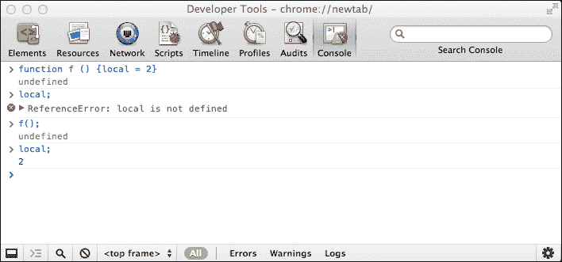
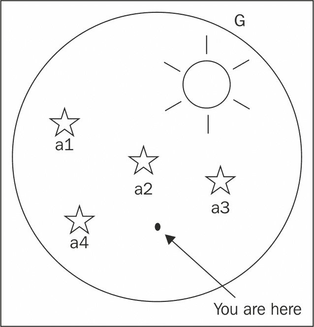
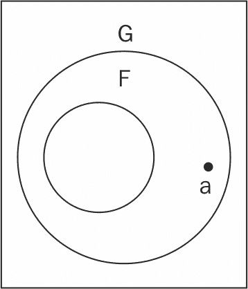
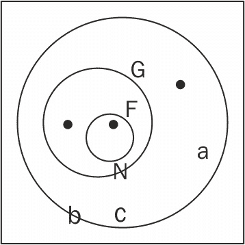
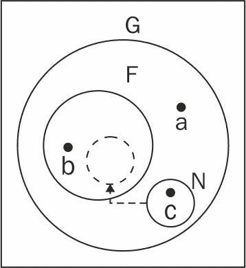

# 第三章 函数

精通函数是学习任何编程语言时的重要技能，尤其是在学习 JavaScript 时更是如此。这是因为 JavaScript 有很多用途，而且语言的大部分灵活性和表现力都来自于函数。大多数编程语言都有特殊语法来表示某些面向对象特性，而 JavaScript 只是使用函数。本章将涵盖以下主题：

+   如何定义和使用函数

+   将参数传递给函数

+   可免费使用的预定义函数

+   JavaScript 中变量的作用域

+   函数只是数据的概念，尽管是一种特殊类型的数据

理解这些主题将为你提供一个坚实的基础，这将使你能够深入到本章的第二部分，该部分展示了函数的一些有趣应用，如下所示：

+   使用匿名函数

+   回调

+   立即（自调用）函数

+   内部函数（在其它函数内部定义的函数）

+   返回函数的函数

+   重新定义自己的函数

+   闭包

# 函数是什么？

函数允许你将代码分组，给它一个名字，并在以后通过这个名字重用它。让我们考虑以下代码作为例子：

```js
    function sum(a, b) { 
      var c = a + b; 
      return c; 
    } 

```

函数的组成部分如下所示：

+   `function`关键字。

+   函数的名称；在这种情况下，`sum`。

+   函数参数；在这种情况下，`a` 和 `b`。一个函数可以接受任意数量的参数，或者不接受任何参数，参数之间用逗号分隔。

+   代码块，也称为函数体。

+   `return`语句。函数总是返回一个值。如果它没有显式返回值，它隐式地返回`undefined`值。

注意，一个函数只能返回一个值。如果你需要返回多个值，你可以简单地返回一个包含所有所需值的数组。

上述语法称为函数声明。这只是创建函数在 JavaScript 中的多种方式之一，还有更多方式即将到来。

## 调用函数

为了使用一个函数，你需要调用它。你可以简单地通过其名称来调用一个函数，后面可以跟任意数量的括号内的值。调用函数是另一种说法。

调用`sum()`函数，传递两个参数，并将函数返回的值赋给变量`result`：

```js
    > var result = sum(1, 2); 
    > result; 
    3 

```

## 参数

在定义函数时，你可以指定函数在调用时期望接收哪些参数。一个函数可能不需要任何参数，但如果它需要，而你忘记了传递它们，JavaScript 将把`undefined`值分配给你跳过的那些参数。在下一个示例中，函数调用返回`NaN`，因为它试图将`1`和`undefined`相加：

```js
    > sum(1); 
    NaN 

```

从技术上讲，参数和参数之间有一个区别，尽管这两个词经常被互换使用。参数是在定义函数时定义的，而参数是在函数被调用时传递给函数的。考虑以下示例：

```js
    > function sum(a, b) { 
        return a + b; 
      } 
    > sum(1, 2); 

```

在这里，`a`和`b`是参数，而`1`和`2`是参数。

当涉及到接受参数时，JavaScript 非常宽容。如果你传递的参数多于函数期望的，额外的参数将被静默忽略，如下面的示例所示：

```js
    > sum(1, 2, 3, 4, 5); 
    3 

```

此外，你可以创建对接受参数数量灵活的函数。这是由于在函数内部自动创建的特殊值`arguments`。以下是一个简单地返回传递给它的任何参数的函数：

```js
    > function args() { 
        return arguments; 
      } 
    > args(); 
    [] 
    > args( 1, 2, 3, 4, true, 'ninja'); 
    [1, 2, 3, 4, true, "ninja"] 

```

使用`arguments`，你可以改进`sum()`函数，使其能够接受任意数量的参数并将它们全部相加，如下面的示例所示：

```js
    function sumOnSteroids() { 
      var i, 
          res = 0, 
          number_of_params = arguments.length; 
      for (i = 0; i < number_of_params; i++) { 
        res += arguments[i]; 
      } 
      return res; 
    } 

```

如果你通过调用该函数并传递不同数量的参数，甚至一个都不传递来测试这个函数，你可以验证它按预期工作，如下面的示例所示：

```js
    > sumOnSteroids(1, 1, 1); 
    3 
    > sumOnSteroids(1, 2, 3, 4); 
    10 
    > sumOnSteroids(1, 2, 3, 4, 4, 3, 2, 1); 
    20 
    > sumOnSteroids(5); 
    5 
    > sumOnSteroids(); 
    0 

```

`arguments.length`表达式返回函数被调用时传递的参数数量。不必担心语法不熟悉，我们将在下一章详细检查它。你也会看到`arguments`不是一个数组（尽管它看起来像），而是一个类似数组的对象。

ES6 在函数参数方面引入了几个重要的改进。ES6 函数参数现在可以有默认值、剩余参数，并允许解构。下一节将详细讨论这些概念。

# 默认参数

函数参数可以指定默认值。在调用函数时，如果省略了参数，则使用分配给该参数的默认值：

```js
    function render(fog_level=0, spark_level=100){ 
      console.log(`Fog Level: ${fog_level} and spark_level:
       ${spark_level}`) 
    } 
    render(10); //Fog Level: 10 and spark_level: 100 

```

在这个例子中，我们省略了`spark_level`参数，因此使用了分配给该参数的默认值。重要的是要注意，`undefined`被视为参数值的缺失；例如，考虑以下代码行：

```js
    render(undefined,10); //Fog Level: 0 and spark_level: 10 

```

在提供参数的默认值时，也可以引用其他参数：

```js
    function t(fog_level=1, spark_level=fog_level){
      console.log(`Fog Level: ${fog_level} and spark_level: 
       ${spark_level}`) 
      //Fog Level: 10 and spark_level: 10 
    } 
    function s(fog_level=10, spark_level = fog_level*10){ 
      console.log(`Fog Level: ${fog_level} and spark_level:
       ${spark_level}`) 
      //Fog Level: 10 and spark_level: 100 
    } 
    t(10); 
    s(10); 

```

默认参数有自己的作用域；这个作用域位于外部函数作用域和函数内部作用域之间。如果参数被内部作用域中的变量所覆盖，出人意料的是，内部变量不可用。以下示例将有助于解释这一点：

```js
    var scope="outer_scope"; 
    function scoper(val=scope){ 
      var scope="inner_scope"; 
      console.log(val); //outer_scope 
    } 
    scoper(); 

```

你可能会预期`val`会被`scope`变量的内部定义所覆盖，但由于默认参数有自己的作用域，因此分配给`val`的值不会受到内部作用域的影响。

# 剩余参数

ES6 引入了剩余参数。剩余参数允许我们将任意数量的参数以数组的形式发送给函数。剩余参数只能是参数列表中的最后一个，并且只能有一个剩余参数。在最后一个形式参数之前放置剩余运算符（`...`）表示该参数是剩余参数。以下示例显示了在最后一个形式参数之前添加剩余运算符：

```js
    function sayThings(tone, ...quotes){ 
      console.log(Array.isArray(quotes)); //true 
      console.log(`In ${tone} voice, I say ${quotes}`) 
    } 
    sayThings("Morgan Freeman","Something serious"," 
     Imploding Universe"," Amen"); 
    //In Morgan Freeman voice, I say Something serious,
     Imploding Universe,Amen 

```

传递给函数的第一个参数在 `tone` 中接收，其余参数作为数组接收。可变参数（var-args）是许多其他语言的一部分，也是 ES6 的受欢迎的补充。剩余参数可以替代有争议的 `arguments` 变量。剩余参数与 `arguments` 变量的主要区别在于剩余参数是真正的数组。所有数组方法都对剩余参数可用。

# 扩展运算符

扩展运算符看起来与剩余运算符非常相似，但执行的是完全相反的功能。扩展运算符在调用函数或定义数组时使用。扩展运算符接受一个数组并将其元素拆分为单独的变量。以下示例说明了扩展运算符在调用接受数组作为参数的函数时提供了更清晰的语法：

```js
    function sumAll(a,b,c){ 
      return a+b+c 
    } 
    var numbers = [6,7,8] 
    //ES5 way of passing array as an argument of a function 
    console.log(sumAll.apply(null,numbers)); //21 
    //ES6 Spread operator 
    console.log(sumAll(...numbers))//21 

```

在 ES5 中，当将数组作为参数传递给函数时，通常使用 `apply()` 函数。在上一个示例中，我们有一个需要传递给函数的数组，该函数接受三个变量。将数组传递给此函数的 ES5 方法使用 `apply()` 函数，其中第二个参数允许将数组传递给被调用的函数。ES6 扩展运算符提供了处理这种情况的更简洁、更精确的方法。在调用 `sumAll()` 时，我们使用扩展运算符（`...`）并将 `numbers` 数组传递给函数调用。然后数组被拆分为单独的变量 - `a`、`b` 和 `c`。

扩展运算符增强了 JavaScript 中数组的功能。如果你想要创建一个由另一个数组组成的数组，现有的数组语法不支持这一点。你必须使用 `push`、`splice` 和 `concat` 来实现这一点。然而，使用扩展运算符，这变得非常简单：

```js
    var midweek = ['Wed', 'Thu']; 
    var weekend = ['Sat', 'Sun']; 
    var week = ['Mon','Tue', ...midweek, 'Fri', ...weekend]; 
     //["Mon","Tue","Wed","Thu","Fri","Sat","Sun"] 
    console.log(week); 

```

在上一个示例中，我们使用扩展运算符构建了一个 `week` 数组，该数组由两个数组 `midweek` 和 `weekend` 组成。

## 预定义函数

有许多函数是内置在 JavaScript 引擎中的，可供你使用。让我们来看看它们。在这样做的时候，你将有机会实验函数、它们的参数和返回值，并熟悉与函数一起工作。以下是一个内置函数的列表：

+   parseInt()

+   parseFloat()

+   isNaN()

+   isFinite()

+   encodeURI()

+   decodeURI()

+   encodeURIComponent()

+   decodeURIComponent()

+   eval()

### 注意

**黑盒函数**

通常，当你调用函数时，你的程序不需要知道这些函数的内部工作方式。你可以将函数视为一个黑盒，给它一些值（作为输入参数），然后获取它返回的输出结果。这对任何函数都适用——无论是内置在 JavaScript 引擎中的，还是你自己创建的，或者是同事或其他人创建的。

### parseInt()

`parseInt()` 函数接受任何类型的输入（通常是字符串）并尝试将其转换为整数。如果失败，它返回 `NaN`，如下面的代码所示：

```js
    > parseInt('123'); 
    123 
    > parseInt('abc123'); 
    NaN 
    > parseInt('1abc23'); 
    1 
    > parseInt('123abc'); 
    123 

```

函数接受一个可选的第二个参数，即基数，告诉函数期望哪种类型的数字。例如，尝试从 `FF` 字符串中提取十进制数字没有意义，所以结果是 `NaN`，但如果你尝试将 `FF` 作为十六进制，那么你得到 `255`，如下面的代码片段所示：

```js
    > parseInt('FF', 10); 
    NaN 
    > parseInt('FF', 16); 
    255 

```

另一个例子是解析以基数 `10`（十进制）和基数 `8`（八进制）开头的字符串：

```js
    > parseInt('0377', 10); 
    377 
    > parseInt('0377', 8); 
    255 

```

如果你调用 `parseInt()` 时省略第二个参数，该函数将假定 `10`（十进制），但有以下例外：

+   如果你传递以 `0x` 开头的字符串，则基数假定是 `16`（假设为十六进制数）。

+   如果你传递的字符串以 `0` 开头，该函数假定基数 `8`（假设为八进制数）。考虑以下示例：

    ```js
            > parseInt('377'); 
            377 
            > console.log(0o377); 
            255 
            > parseInt('0x377'); 
            887 

    ```

最安全的事情是始终指定基数。如果你省略基数，你的代码在 99% 的情况下可能仍然可以工作（因为通常你解析的是十进制数）；然而，偶尔它可能会在调试一些边缘情况时让你头疼。例如，想象你有一个接受日历天数或月份的表单字段，用户输入 `06` 或 `08`。

### 注意

ECMAScript 5 移除了八进制字面量值，并避免了与 `parseInt()` 和未指定基数混淆。

### parseFloat()

`parseFloat()` 函数与 `parseInt()` 函数类似，但在尝试从输入中解析数字时也会寻找小数。此函数只接受一个参数，如下所示：

```js
    > parseFloat('123'); 
    123 
    > parseFloat('1.23'); 
    1.23 
    > parseFloat('1.23abc.00'); 
    1.23 
    > parseFloat('a.bc1.23'); 
    NaN 

```

与 `parseInt()` 一样，`parseFloat()` 在遇到第一个意外的字符时会放弃，即使字符串的其余部分可能包含可用的数字：

```js
    > parseFloat('a123.34'); 
    NaN 
    > parseFloat('12a3.34'); 
    12 

```

`parseFloat()` 函数理解输入中的指数（与 `parseInt()` 不同）：

```js
    > parseFloat('123e-2'); 
    1.23 
    > parseFloat('1e10'); 
    10000000000 
    > parseInt('1e10'); 
    1 

```

### isNaN()

使用 `isNaN()`，你可以检查输入值是否为有效的数字，可以安全地用于算术运算。此函数也是检查 `parseInt()`、`parseFloat()` 或任何算术操作是否成功的一个方便方法：

```js
    > isNaN(NaN); 
    true 
    > isNaN(123); 
    false 
    > isNaN(1.23); 
    false 
    > isNaN(parseInt('abc123')); 
    true 

```

函数还会尝试将输入转换为数字：

```js
    > isNaN('1.23'); 
    false 
    > isNaN('a1.23'); 
    true 

```

`isNaN()` 函数很有用，因为特殊值 `NaN` 与任何东西都不相等，包括它自己。换句话说，`NaN === NaN` 是 `false`。因此，`NaN` 不能用来检查一个值是否为有效的数字。

### isFinite()

`isFinite()`函数检查输入是否是一个既不是`Infinity`也不是`NaN`的数字：

```js
    > isFinite(Infinity); 
    false 
    > isFinite(-Infinity); 
    false 
    > isFinite(12); 
    true 
    > isFinite(1e308); 
    true 
    > isFinite(1e309); 
    false 

```

如果您对最后两个调用的结果感到好奇，请记住，在前一章中提到 JavaScript 中的最大数字是`1.7976931348623157e+308`，因此`1e309`实际上是无穷大。

### 编码/解码 URI

在**统一资源定位符**（**URL**）或**统一资源标识符**（**URI**）中，一些字符具有特殊含义。如果您想转义这些字符，可以使用`encodeURI()`或`encodeURIComponent()`函数。第一个会返回一个可用的 URL，而第二个假设您只传递 URL 的一部分，例如查询字符串，例如，它将编码所有适用的字符，如下所示：

```js
    > var url = 'http://www.packtpub.com/script.php?q=this and that'; 
    > encodeURI(url); 
    "http://www.packtpub.com/script.php?q=this%20and%20that" 
    > encodeURIComponent(url); 
    "http%3A%2F%2Fwww.packtpub.com%2Fscript.php%3Fq%3Dthis%20and%20that" 

```

`encodeURI()`和`encodeURIComponent()`的反义词分别是`decodeURI()`和`decodeURIComponent()`。

有时，在旧代码中，您可能会看到使用`escape()`和`unescape()`函数来编码和解码 URL，但这些函数已被弃用；它们以不同的方式编码，不应使用。

### `eval()`

`eval()`函数接受一个字符串输入，并将其作为 JavaScript 代码执行，如下所示：

```js
    > eval('var ii = 2;'); 
    > ii; 
    2 

```

因此，`eval('var ii = 2;')`与`var ii = 2;`相同

`eval()`函数有时很有用，但如果还有其他选择，应避免使用。大多数时候，都有替代方案，而且在大多数情况下，替代方案更优雅，更容易编写和维护。“*Eval 是邪恶的*”是经验丰富的 JavaScript 程序员经常听到的一个咒语。使用`eval()`的缺点如下：

+   **安全性**：JavaScript 功能强大，这也意味着它可以造成损害。如果您不相信传递给`eval()`的输入源，就请不要使用它。

+   **性能**：评估实时代码比直接在脚本中拥有代码要慢。

#### 一个额外的功能 - alert()函数

让我们看看另一个常见的函数-`alert()`。它不是 JavaScript 的核心部分（在 ECMA 规范中找不到），但它由宿主环境提供-浏览器。它在一个消息框中显示文本字符串。它也可以用作原始的调试工具，尽管现代浏览器的调试器更适合这个目的。

这里是一个显示执行`alert("Hi There")`代码结果的截图：


在使用此函数之前，请记住它阻止了浏览器线程，这意味着在用户关闭警告之前，不会执行其他代码。如果您有一个繁忙的 Ajax 类型的应用程序，通常不建议使用`alert()`。

# 变量的作用域

需要注意的是，特别是如果你是从其他语言转向 JavaScript 的，JavaScript 中的变量不是在块作用域中定义的，而是在函数作用域中定义的。这意味着如果一个变量在函数内部定义，它在外部函数中是不可见的。然而，如果它在`if`或`for`代码块内部定义，它在外部是可见的。全局变量这个术语描述的是你定义在任何函数之外的变量（在全局程序代码中），与局部变量相对，局部变量是在函数内部定义的。函数内部的代码可以访问所有全局变量以及它自己的局部变量。

在下一个例子中：

+   `f()`函数可以访问`global`变量

+   在`f()`函数外部，`local`变量不存在

    ```js
            var global = 1; 
            function f() { 
              var local = 2; 
              global++; 
              return global; 
            } 

    ```

让我们来测试一下：

```js
    > f(); 
    2 
    > f(); 
    3 
    > local; 
    ReferenceError: local is not defined 

```

还需要指出的是，如果你不使用`var`来声明一个变量，这个变量会自动被分配一个全局作用域。让我们看一个例子：



发生了什么？`f()`函数包含`local`变量。在调用函数之前，该变量不存在。当你第一次调用函数时，`local`变量会以全局作用域的形式创建。然后，如果你在函数外部访问`local`变量，它将是可用的。

### 注意

**最佳实践提示**

最小化全局变量的数量，以避免命名冲突。想象两个人在同一个脚本中分别工作两个不同的函数，他们都决定为他们的全局变量使用相同的名称。这很容易导致意外的结果和难以发现的错误。始终使用`var`语句声明你的变量。考虑单一的`var`模式。在函数的顶部定义所有需要的变量，这样你就有了一个查找变量的单一位置，并希望防止意外创建全局变量。

## 变量提升

这里有一个有趣的例子，展示了局部作用域与全局作用域的重要区别：

```js
    var a = 123; 

    function f() { 
      alert(a); 
      var a = 1; 
      alert(a); 
    } 

    f(); 

```

你可能预期第一个`alert()`函数将显示`123`（全局变量`a`的值），第二个将显示`1`（局部变量`a`）。但这并不是事实。第一个`alert()`将显示`undefined`。这是因为，在函数内部，局部作用域比全局作用域更重要。所以，一个局部变量会覆盖任何同名的全局变量。在第一次`alert()`时，`a`变量尚未定义（因此显示`undefined`值），但它仍然由于称为**提升**的特殊行为而在局部空间中存在。

当你的 JavaScript 程序执行进入一个新的函数时，该函数中任何地方声明的所有变量都会被移动、提升或提升到函数的顶部。这是一个需要记住的重要概念。此外，只有声明被提升，这意味着只有变量的存在被移动到顶部。任何赋值都保持原位。在先前的例子中，局部变量 `a` 的声明被提升到顶部。只有声明被提升，但赋值给 `1` 的操作没有。这就像函数是以以下方式编写的：

```js
    var a = 123; 

    function f() { 
      var a; // same as: var a = undefined; 
      alert(a); // undefined 
      a = 1; 
      alert(a); // 1 
    } 

```

你还可以采用之前在最佳实践部分提到的单 `var` 模式。在这种情况下，你将进行一种手动变量提升，以防止与 JavaScript 提升行为混淆。

# 块作用域

ES6 在声明变量时提供了额外的范围。我们讨论了函数作用域以及它如何影响使用 `var` 关键字声明的变量。如果你在 ES6 中编码，块作用域将主要取代你使用使用 `var` 声明变量的需求。尽管如此，如果你仍然使用 ES5，我们希望确保你仔细查看提升行为。

ES6 引入了 `let` 和 `const` 关键字，允许我们声明变量。

使用 `let` 声明的变量是块作用域的。它们只存在于当前块内。使用 `var` 声明的变量是函数作用域的，正如我们之前看到的。以下示例说明了块作用域：

```js
    var a = 1; 
    { 
        let a = 2; 
        console.log( a );   // 2 
    } 
    console.log( a );       // 1 

```

开放花括号 `'{ '` 和闭合花括号 `'}'` 之间的范围是一个块。如果你来自 Java 或 C/C++ 的背景，块作用域的概念将非常熟悉。在这些语言中，程序员引入块只是为了定义作用域。然而，在 JavaScript 中，由于没有与之关联的作用域，因此需要以惯用的方式引入块。但是，ES6 允许你使用 `let` 关键字创建块作用域变量。正如先前的例子所示，在块内创建的变量 `a` 在块内可用。在声明块作用域变量时，通常建议在块的顶部添加 `let` 声明。让我们看看另一个例子，以清楚地区分函数作用域和块作用域：

```js
    function swap(a,b){ // <--function scope starts here 
      if(a>0 && b>0){   // <--block scope starts here 
        let tmp=a; 
        a=b; 
        b=tmp; 
      }                // <--block scope ends here 
      console.log(a,b); 
      console.log(tmp); // tmp is not defined as it is available
       only in the block scope 
      return [a,b]; 
    } 
    swap(1,2); 

```

如你所见，`tmp` 使用 `let` 声明，并且仅在定义它的块内可用。从实际应用的角度来看，你应该最大限度地使用块作用域变量。除非你有非常具体的目标，需要使用 `var` 声明，否则请确保你优先选择块作用域变量。然而，不正确地使用 `let` 关键字可能会导致一些问题。首先，你不能在同一个函数或块作用域内使用 `let` 关键字重新声明相同的变量：

```js
    function blocker(x){ 
      if(x){ 
        let f; 
        let f; //duplicate declaration "f" 
      } 
    } 

```

在 ES6 中，使用 `let` 关键字声明的变量会被提升到块作用域。然而，在声明之前引用变量是一个错误。

ES6 中引入的另一个关键字是`const`。使用`const`关键字声明的变量创建了对值的只读引用。这并不意味着该引用所持有的值是不可变的。然而，变量标识符不能被重新赋值。常量与使用`let`关键字创建的变量具有相同的块作用域。此外，你必须在声明它们时为变量赋值。

虽然听起来是这样，但`const`与不可变值无关。常量创建不可变绑定。这是一个重要的区别，需要正确理解。让我们考虑以下示例：

```js
    const car = {} 
    car.tyres = 4 

```

这是一段有效的代码；在这里，我们将空对象`{}`赋值给一个常量`car`。一旦赋值，这个引用就不能更改。在 ES6 中，你应该这样做：

+   尽可能使用`const`。将它们用于所有值不改变的变量：

    ```js
            Use let 

    ```

+   避免使用`var`。

# 函数是数据

JavaScript 中的函数实际上是数据。这是一个重要的概念，我们稍后会用到。这意味着你可以创建一个函数并将其赋值给一个变量，如下所示：

```js
    var f = function () { 
      return 1; 
    }; 

```

这种定义函数的方式有时被称为**函数字面量表示法**。

`function () { return 1;}`部分是一个**函数表达式**。函数表达式可以有一个可选的名称，在这种情况下，它成为一个**命名函数表达式**（**NFE**）。因此，这也是允许的，尽管在实践中很少见（并且会导致 IE 在封装作用域中错误地创建两个变量-`f`和`myFunc`）：

```js
    var f = function myFunc() { 
      return 1; 
    }; 

```

如你所见，命名函数表达式和函数声明之间没有区别。但实际上，它们是不同的。区分这两种方法的唯一方法是查看它们被使用的上下文。函数声明只能出现在程序代码中（在另一个函数的主体中或在主程序中）。你将在本书后面的部分看到更多关于函数的示例，这些示例将阐明这些概念。

当你在包含函数值的变量上使用`typeof`运算符时，它将返回字符串`"function"`，如下面的示例所示：

```js
    > function define() { 
        return 1;  
      } 

    > var express = function () {  
        return 1;  
      }; 

    > typeof define; 
    "function" 

    > typeof express; 
    "function" 

```

因此，JavaScript 函数是数据，但具有以下两个重要特性的特殊数据：

+   它们包含代码

+   它们是可执行的（它们可以被调用）

如你之前所见，执行函数的方法是在其名称后添加括号。正如下一个示例所演示的，这适用于函数定义的任何方式。在示例中，你还可以看到函数如何被视为常规值；它可以被复制到不同的变量中，如下所示：

```js
    > var sum = function (a, b) { 
        return a + b; 
      }; 

    > var add = sum; 
    > typeof add; 
    function 
    > add(1, 2); 
    3 

```

由于函数是分配给变量的数据，因此命名函数的规则与命名变量的规则相同——函数名不能以数字开头，它可以包含任何字母、数字、下划线字符和美元符号的组合。

## 匿名函数

如你所知，存在一种函数表达式语法，你可以定义函数如下：

```js
    var f = function (a) { 
      return a; 
    }; 

```

这也常被称为一个**匿名函数**（因为它没有名字），尤其是在这种函数表达式被使用，甚至没有分配给变量的情况下。在这种情况下，这样的匿名函数可以有如下两种优雅的使用方式：

+   你可以将匿名函数作为参数传递给另一个函数。接收函数可以使用你传递的函数做一些有用的事情。

+   你可以定义一个匿名函数并立即执行它。

让我们更详细地看看匿名函数的这两个应用。

## 回调函数

由于函数就像任何其他分配给变量的数据一样，它可以被定义、复制，也可以作为参数传递给其他函数。

这里有一个例子，该函数接受两个函数作为参数，执行它们，并返回每个函数返回值的总和：

```js
    function invokeAdd(a, b) { 
      return a() + b(); 
    } 

```

现在，让我们使用函数声明模式定义两个简单的附加函数，该模式只返回硬编码的值：

```js
    function one() { 
      return 1; 
    } 

    function two() { 
      return 2; 
    } 

```

现在，你可以将这些函数传递给原始函数`invokeAdd()`，并得到以下结果：

```js
    > invokeAdd(one, two); 
    3 

```

将函数作为参数传递的另一个例子是使用匿名函数（函数表达式）。你不需要定义`one()`和`two()`，你可以简单地做以下操作：

```js
    > invokeAdd(function () {return 1; }, function () {return 2; }); 
    3 

```

或者，你可以让它更易于阅读，如下面的代码所示：

```js
    > invokeAdd( 
        function () { return 1; },  
        function () { return 2; } 
      ); 
    3 

```

或者，你可以这样做：

```js
    > invokeAdd( 
        function () { 
          return 1; 
        },  
        function () { 
          return 2; 
        } 
      ); 
    3 

```

当你将一个函数 A 传递给另一个函数 B，然后 B 执行 A 时，通常说 A 是一个**回调**函数。如果 A 没有名字，那么你可以称它为匿名回调函数。

当回调函数有用时？让我们看看一些示例，展示回调函数的好处，特别是：

+   它们允许你传递函数而不需要命名它们，这意味着浮动的变量更少

+   你可以将调用函数的责任委托给另一个函数，这意味着需要编写的代码更少

+   它们可以通过延迟执行或解除阻塞调用来帮助提高性能

### 回调示例

看看这个常见的场景——你有一个返回值的函数，然后你将其传递给另一个函数。在我们的例子中，第一个函数`multiplyByTwo()`接受三个参数，遍历它们，将它们乘以二，并返回包含结果的数组。第二个函数`addOne()`接受一个值，将其加一，并返回它，如下所示：

```js
    function multiplyByTwo(a, b, c) { 
      var i, ar = []; 
      for (i = 0; i < 3; i++) { 
        ar[i] = arguments[i] * 2; 
      } 
      return ar; 
    } 

    function addOne(a) { 
      return a + 1; 
    } 

```

让我们来测试这些函数：

```js
    > multiplyByTwo(1, 2, 3); 
    [2, 4, 6] 
    > addOne(100); 
    101 

```

现在，假设你想要一个包含三个元素的数组`myarr`，并且每个元素都要通过这两个函数。首先，让我们从调用`multiplyByTwo()`函数开始：

```js
    > var myarr = []; 
    > myarr = multiplyByTwo(10, 20, 30); 
    [20, 40, 60] 

```

现在，遍历每个元素，将其传递给`addOne()`函数：

```js
    > for (var i = 0; i < 3; i++) { 
        myarr[i] = addOne(myarr[i]); 
      } 
    > myarr; 
    [21, 41, 61] 

```

如你所见，一切正常，但仍有改进的空间。例如，有两个循环。如果循环进行了很多次重复，循环可能会很昂贵。你可以只用一个循环达到相同的结果。以下是修改 `multiplyByTwo()` 以使其接受一个回调函数并在每次迭代中调用该回调函数的方法：

```js
    function multiplyByTwo(a, b, c, callback) { 
      var i, ar = []; 
      for (i = 0; i < 3; i++) { 
        ar[i] = callback(arguments[i] * 2); 
      } 
      return ar; 
    } 

```

使用修改后的函数，所有的工作只需一个函数调用就能完成，该调用传递起始值和 `callback` 函数，如下所示：

```js
    > myarr = multiplyByTwo(1, 2, 3, addOne); 
    [3, 5, 7] 

```

你不需要定义 `addOne()`，可以使用匿名函数，因此可以节省一个额外的全局变量：

```js
    > multiplyByTwo(1, 2, 3, function (a) { 
        return a + 1; 
      }); 
    [3, 5, 7] 

```

如果需要，匿名函数很容易更改：

```js
    > multiplyByTwo(1, 2, 3, function (a) { 
        return a + 2; 
      }); 
    [4, 6, 8] 

```

## 立即函数

到目前为止，我们已经讨论了使用匿名函数作为回调。让我们看看匿名函数的另一个应用——在定义后立即调用函数。以下是一个例子：

```js
    ( 
      function () { 
        alert('boo'); 
      } 
    )(); 

```

语法一开始可能看起来有点吓人，但你只需简单地将一个函数表达式放在括号内，然后跟另一组括号。第二组括号表示立即执行，也是放置匿名函数可能接受的任何参数的地方，例如：

```js
    ( 
      function (name) { 
        alert('Hello ' + name + '!'); 
      } 
    )('dude'); 

```

或者，你可以将第一组括号的关闭移到末尾。这两种方法都有效：

```js
    (function () { 
      // ... 
    }()); 

    // vs.  

    (function () { 
      // ... 
    })(); 

```

立即（自调用）匿名函数的一个很好的应用场景是当你想在不需要创建额外的全局变量的情况下完成一些工作。当然，缺点是你不能两次执行同一个函数。这使得立即函数最适合一次性或初始化任务。

如果需要，立即函数也可以选择性地返回一个值。看到如下代码并不罕见：

```js
    var result = (function () { 
      // something complex with 
      // temporary local variables... 
      // ... 

      // return something; 
    }()); 

```

在这种情况下，你不需要将函数表达式包裹在括号内；你只需要调用函数的括号。所以，以下这段代码也有效：

```js
    var result = function () { 
      // something complex with 
      // temporary local variables 
      // return something; 
    }(); 

```

这种语法是有效的，但可能看起来有点令人困惑；如果不阅读函数的结尾，你不知道 `result` 是一个函数还是立即函数的返回值。

## 内部（私有）函数

考虑到函数就像任何其他值一样，没有什么是阻止你在另一个函数内部定义函数的。以下是一个例子：

```js
    function outer(param) { 
      function inner(theinput) { 
        return theinput * 2; 
      } 
      return 'The result is ' + inner(param); 
    } 

```

使用函数表达式，这也可以写成如下形式：

```js
    var outer = function (param) { 
      var inner = function (theinput) { 
        return theinput * 2; 
      }; 
      return 'The result is ' + inner(param); 
    }; 

```

当你调用全局的 `outer()` 函数时，它将内部调用局部的 `inner()` 函数。由于 `inner()` 是局部的，它不能在 `outer()` 之外访问，所以可以说它是一个私有函数：

```js
    > outer(2); 
    "The result is 4" 
    > outer(8); 
    "The result is 16" 
    > inner(2); 
    ReferenceError: inner is not defined 

```

使用私有函数的好处如下：

+   你可以保持全局命名空间干净，这减少了命名冲突的可能性

+   隐私——你可以只暴露你决定暴露给外界的那些函数，并将那些不打算被应用程序其他部分消费的功能保留给自己

## 返回函数的函数

如前所述，函数总是返回一个值，如果它没有使用`return`显式地返回，那么它就隐式地通过返回`undefined`来返回。函数只能返回一个值，而这个值也可以是一个函数，例如：

```js
    function a() { 
      alert('A!'); 
      return function () { 
        alert('B!'); 
      }; 
    } 

```

在这个例子中，`a()`函数完成了它的任务（说`A!`）并返回另一个执行其他操作（说`B!`）的函数。你可以将返回值分配给一个变量，然后像使用普通函数一样使用这个变量，如下所示：

```js
    > var newFunc = a(); 
    > newFunc(); 

```

在这里，第一行会提示`A!`，第二行会提示`B!`。

如果你想要立即执行返回的函数而不将其分配给新变量，你可以简单地使用另一组括号。最终结果将是相同的：

```js
    > a()(); 

```

## 函数，重写你自己！

由于函数可以返回一个函数，你可以使用新函数来替换旧函数。继续前面的例子，你可以使用对`a()`的调用返回的值来覆盖实际的`a()`函数：

```js
    > a = a(); 

```

上一行代码会提示`A!`，但下次调用`a()`时会提示`B!`。这在函数需要执行一些初始的一次性工作时很有用。函数在第一次调用后会覆盖自身，以避免每次调用时都执行不必要的重复工作。

在前面的例子中，函数是从外部重新定义的，返回值被分配回函数。但实际上，函数可以从内部重新编写自己，如下面的例子所示：

```js
    function a() { 
      alert('A!'); 
      a = function () { 
        alert('B!'); 
      }; 
    } 

```

如果你第一次调用这个函数，它将执行以下操作：

+   提示`A!`（可以将其视为一次性准备工作）

+   重新定义全局变量`a`并将其分配给一个新的函数

每次函数被调用后的后续时间，它将提示`B!`。

这里是另一个例子，它结合了本章最后几节讨论的几种技术：

```js
    var a = (function () { 

      function someSetup() { 
        var setup = 'done'; 
      } 

      function actualWork() { 
        alert('Worky-worky'); 
      } 

      someSetup(); 
      return actualWork; 

    }()); 

```

从这个例子中，你可以注意以下几点：

+   你有私有函数；`someSetup()`和`actualWork()`。

+   你有一个立即执行的函数：一个匿名函数，它使用其定义后的括号调用自身。

+   函数首次执行时，调用`someSetup()`，然后返回`actualWork`变量的引用，该变量是一个函数。请注意，在`return`语句中没有括号，因为您返回的是函数引用，而不是调用此函数的结果。

+   由于整个操作从`var a =`开始，自调用的函数返回的值被分配给`a`。

如果你想测试你对刚才讨论的主题的理解，请回答以下问题。在以下情况下，前面的代码会提示什么：

+   它最初被加载？

+   你之后调用`a()`吗？

这些技术在工作在浏览器环境中时可能非常有用。不同的浏览器可能有不同的实现相同结果的方式。如果你知道浏览器特性在函数调用之间不会改变，你可以让一个函数确定在当前浏览器中完成工作的最佳方式，然后重新定义自己，以便浏览器能力检测只进行一次。你将在本书后面的具体例子中看到这种情况。

# 闭包

本章的其余部分将关于闭包（还有什么比结束章节更好的方式？）。闭包可能一开始有点难以理解，所以如果你在第一次阅读时没有完全理解，不要气馁。你应该阅读本章的其余部分，并亲自尝试这些例子，但如果你觉得你还没有完全理解这个概念，你可以在本章前面讨论的主题有所沉淀后再回来学习。

在继续讨论闭包之前，让我们首先回顾和扩展 JavaScript 中的作用域概念。

## 作用域链

如你所知，在 JavaScript 中，没有花括号作用域，但有一个函数作用域。在函数中定义的变量在函数外部是不可见的，但在代码块（例如`if`或`for`循环）中定义的变量在块外部是可见的，例如：

```js
    > var a = 1;  
    > function f() { 
        var b = 1;  
        return a; 
      } 
    > f(); 
    1 
    > b; 
    ReferenceError: b is not defined 

```

变量`a`在全局空间中，而`b`在函数`f()`的作用域中。因此，我们有以下情况：

+   在`f()`内部，`a`和`b`都是可见的

+   在`f()`外部，`a`是可见的，但`b`是不可见的

如果你在一个嵌套在`outer()`中的`inner()`函数中定义，它将有权访问它自己的作用域中的变量，以及其父作用域中的变量。这被称为作用域链，链的长度（深度）可以是你需要的任何长度：

```js
    var global = 1; 
    function outer() { 
      var outer_local = 2; 
      function inner() { 
        var inner_local = 3; 
        return inner_local + outer_local + global; 
      } 
      return inner(); 
    } 

```

让我们测试`inner()`函数是否有权访问所有变量：

```js
    > outer(); 
    6 

```

## 使用闭包打破链

让我们通过一个示例来介绍闭包，并查看以下代码，看看那里发生了什么：

```js
    var a = "global variable"; 
    var F = function () { 
      var b = "local variable"; 
      var N = function () { 
        var c = "inner local"; 
      }; 
    }; 

```

首先，有全局作用域**G**。把它想象成宇宙，就像它包含了一切：



它可以包含全局变量，如**a1**和**a2**，以及全局函数，如**F**：



函数有自己的私有空间，并可以使用它来存储其他变量，如**b**，以及内部函数，如**N**（表示内部）。在某个时刻，你最终会得到以下这样的图：



如果你处于点 a，你处于全局空间内。如果你处于点**b**，它位于**F**函数的空间内，那么你可以访问全局空间和**F**空间。如果你处于点**c**，它位于**N**函数内，那么你可以访问全局空间、**F**空间和**N**空间。你不能从**a**到达**b**，因为**b**在**F**外部是不可见的。但是，如果你想从**c**到达**b**或者从**N**到达**b**，是可以的。有趣的部分是，当**N**以某种方式从**F**中跳出并最终进入全局空间时，闭包效果就会发生。



那么，接下来会发生什么？**N**与**a**处于同一个全局空间。而且，由于函数会记住它们定义时的环境，**N**仍然可以访问**F**空间，因此可以访问**b**。这很有趣，因为**N**在**a**的位置，但**N**确实可以访问**b**，而**a**则不能。

此外，**N**是如何打破链的？通过将其自身变为全局的（省略`var`）或者通过让**F**将其传递（或`return`）到全局空间。让我们看看这在实践中是如何实现的。

### 闭包 #1

看看下面的函数，它与之前相同，只是`F`返回`N`，而`N`也返回`b`，它可以通过作用域链访问：

```js
    var a = "global variable"; 
    var F = function () { 
      var b = "local variable"; 
      var N = function () { 
        var c = "inner local"; 
        return b; 
      }; 
      return N; 
    }; 

```

`F`函数包含一个局部变量`b`，因此无法从全局空间访问：

```js
    > b; 
    ReferenceError: b is not defined 

```

`N`函数可以访问其私有空间、`F()`函数的空间和全局空间。因此，它可以看到`b`。由于`F()`可以从全局空间调用（它是一个全局函数），你可以调用它并将返回值赋给另一个全局变量。结果是 - 一个新的全局函数，它可以访问`F()`函数的私有空间：

```js
    > var inner = F(); 
    > inner(); 
    "local variable" 

```

### 闭包 #2

下一个示例的最终结果将与上一个示例相同，但实现它的方法略有不同。`F()`函数不返回一个函数，而是在其体内创建一个新的全局函数`inner()`。

让我们从声明一个全局函数占位符开始。这是可选的，但总是好的，要声明你的变量。然后，你可以定义`F()`函数如下：

```js
    var inner; // placeholder 
    var F = function () { 
      var b = "local variable"; 
      var N = function () { 
        return b; 
      }; 
      inner = N; 
    }; 

```

现在，让我们看看调用`F()`会发生什么：

```js
    > F(); 

```

在`F()`内部定义了一个新的函数`N()`，并将其赋值给全局的`inner`函数。在定义时，`N()`位于`F()`内部，因此它可以访问`F()`函数的作用域。`inner()`函数将保持对`F()`函数作用域的访问，即使它现在是全局空间的一部分，例如：

```js
    > inner(); 
    "local variable". 

```

### 定义和闭包 #3

每个函数都可以被视为一个闭包。这是因为每个函数都维护着一个秘密的链接到其创建时的环境（作用域）。但是，大多数情况下，这个作用域会被销毁，除非发生了某些有趣的事情（如前述代码所示），导致它被保留。

根据你迄今为止所看到的，你可以这样说，当一个函数在父作用域返回后仍然保持对其的链接时，就会创建一个闭包。而且，每个函数都是一个闭包，因为至少每个函数都保持对全局作用域的访问，而全局作用域永远不会被销毁。

让我们看看另一个闭包的例子，这次使用函数参数。函数参数对这个函数的行为就像局部变量一样，但它们是隐式创建的；你不需要为它们使用`var`。你可以创建一个函数，该函数返回另一个函数，而该函数又返回其父参数，如下所示：

```js
    function F(param) { 
      var N = function () { 
        return param; 
      }; 
      param++; 
      return N; 
    } 

```

你可以使用该函数如下：

```js
    > var inner = F(123); 
    > inner(); 
    124 

```

注意观察`param++`在函数定义之后被增加，然而，当调用`inner()`时，它返回了更新后的值。这表明函数保持对其定义的作用域的引用，而不是在函数执行期间在该作用域中找到的变量及其值。

## 循环中的闭包

让我们看看关于闭包的一个典型的初学者错误。它很容易导致难以发现的错误，因为从表面上看，一切看起来都很正常。

让我们循环三次，每次创建一个新的函数，该函数返回循环的序列号。新函数将被添加到数组中，并在最后返回该数组。以下是该函数：

```js
    function F() { 
      var arr = [], i; 
      for (i = 0; i < 3; i++) { 
        arr[i] = function () { 
          return i; 
        }; 
      } 
      return arr; 
    } 

```

让我们运行这个函数，将结果赋值给`arr`数组：

```js
    > var arr = F(); 

```

现在你有一个包含三个函数的数组。让我们通过在每个数组元素后添加括号来调用它们。预期的行为是打印出循环序列`0`、`1`和`2`。让我们试试：

```js
    > arr[0](); 
    3 
    > arr[1](); 
    3 
    > arr[2](); 
    3 

```

嗯，并不完全符合预期。这里发生了什么？所有三个函数都指向同一个局部变量：`i`。为什么？函数不记得值，它们只保持对它们创建的环境的链接（引用）。在这种情况下，`i`变量恰好存在于定义三个函数的环境中。因此，所有函数在需要访问值时都会回溯到环境，并找到`i`的最新值。循环结束后，`i`变量的值是`3`。所以，所有三个函数都指向同一个值。

为什么是三个而不是两个，这是另一个值得思考的问题，以更好地理解`for`循环。

那么，你该如何实现正确的行为呢？答案是使用另一个闭包，如下面的代码片段所示：

```js
    function F() { 
      var arr = [], i; 
      for (i = 0; i < 3; i++) { 
        arr[i] = (function (x) { 
          return function () { 
            return x; 
          }; 
        }(i)); 
      } 
      return arr; 
    } 

```

这将给出以下预期的结果：

```js
    > var arr = F(); 
    > arr[0](); 
    0 
    > arr[1](); 
    1 
    > arr[2](); 
    2 

```

在这里，你不仅创建了一个返回`i`的函数，而且还传递了`i`变量当前值到另一个立即执行的函数。在这个函数中，`i`成为局部值`x`，而`x`每次都有不同的值。

或者，你可以使用一个正常的（而不是立即执行的）内部函数来达到相同的结果。关键是使用中间函数在每个迭代中将`i`的值本地化，如下所示：

```js
    function F() { 

      function binder(x) { 
        return function () { 
          return x; 
        }; 
      } 

      var arr = [], i; 
      for (i = 0; i < 3; i++) { 
        arr[i] = binder(i); 
      } 
      return arr; 
    } 

```

## 获取器和设置器

让我们看看使用闭包的另外两个示例。第一个示例涉及创建获取器和设置器函数。想象一下，你有一个变量应该包含特定类型的值或特定范围的值。你不希望暴露这个变量，因为你不想让代码的任何部分都能改变它的值。你可以在函数内部保护这个变量，并提供两个额外的函数——一个用于获取值，一个用于设置值。设置值时，可以包含一些逻辑来验证值，然后再将其分配给受保护的变量。为了使示例简短，让我们简化验证部分，并只接受数值。

你可以将获取器和设置器函数放在包含`secret`变量的同一个函数中，这样它们就共享相同的范围：

```js
    var getValue, setValue; 

    (function () { 

      var secret = 0; 

      getValue = function () { 
        return secret; 
      }; 

      setValue = function (v) { 
        if (typeof v === "number") { 
          secret = v; 
        } 
      }; 

    }()); 

```

在这种情况下，包含所有内容的函数是一个立即函数。它将`setValue()`和`getValue()`定义为全局函数，而`secret`变量保持局部且无法直接访问，如下例所示：

```js
    > getValue(); 
    0 
    > setValue(123); 
    > getValue(); 
    123 
    > setValue(false); 
    > getValue(); 
    123 

```

## 迭代器

最后一个闭包示例（也是本章的最后一个示例）展示了如何使用闭包来实现迭代器功能。

你已经知道如何遍历简单的数组，但可能存在更复杂的数据结构，其值的序列有不同的规则。你可以将复杂的“下一个”逻辑包装在一个易于使用的`next()`函数中。然后，每次你需要连续的值时，只需简单地调用`next()`。

对于这个例子，我们只需使用一个简单的数组，而不是复杂的数据结构。以下是一个初始化函数，它接受一个输入数组，并定义一个秘密指针`i`，该指针始终指向数组中的下一个元素：

```js
    function setup(x) { 
      var i = 0; 
      return function () { 
        return x[i++]; 
      }; 
    } 

```

使用数据数组调用`setup()`函数将为你创建`next()`函数，如下所示：

```js
    > var next = setup(['a', 'b', 'c']); 

```

从那里开始，操作变得简单且有趣；反复调用相同的函数会给你下一个元素，如下所示：

```js
    > next(); 
    "a" 
    > next(); 
    "b" 
    > next(); 
    "c" 

```

# IIFE 与块级作用域的比较

由于 ES5 没有提供块级作用域，实现块级作用域的一种流行模式是使用**立即调用的函数表达式**（**IIFE**），例如：

```js
    (function () { 
      var block_scoped=0; 
    }()); 
    console.log(block_scoped); //reference error 

```

由于 ES6 支持块级作用域，你可以简单地使用`let`或`const`声明。

# 箭头函数

JavaScript 几乎使用了所有箭头函数的变体。随着 ES6 的引入，它为编写函数引入了一种新的语法。在 JavaScript 中，编写这样的代码是惯用的（以下示例使用 jQuery）：

```js
    $("#submit-btn").click(function (event) { 
      validateForm(); 
      submitMessage(); 
    }); 

```

这是一个典型的 jQuery 事件处理器。事件处理器`click()`函数接受一个函数作为参数，我们将简单地创建一个内联匿名函数表达式并将其传递给`click`函数。这种编写匿名函数表达式的风格被称为**Lambda 函数**。几种其他语言也支持这个特性。尽管 Lambda 在新的语言中或多或少是标准的，但 JavaScript 负责推广它们的用法。然而，JavaScript 中的 Lambda 语法并不十分简洁。ES6 箭头函数填补了这个空白，并提供了一种简洁的语法来编写函数。

箭头函数提供了比传统函数表达式更简洁的语法；例如，考虑以下代码片段：

```js
    const num = [1,2,3] 
    const squares = num.map(function(n){ 
      return n*n; 
    }); 
    console.log(squares); //[1,4,9] 

```

箭头函数的语法可以将函数简化为以下一行代码：

```js
    const squares_6 =num.map( n=> n*n) 

```

如您所见，任何地方都没有`function`或`return`关键字。如果您的函数只有一个参数，您最终会写成`identifier => expression`的形式。

当您需要多个参数时，您需要将参数列表用大括号括起来：

+   **无参数**：`() => {...}`

+   **一个参数**：`a => {...}`

+   **多个参数**：`(a,b) => {...}`

箭头函数可以同时具有语句块体和表达式体：

```js
    n => { return n+n}  //statement block 
    n =>n+n            //expression 

```

这两种方法都等效，但第二种变化更为简洁，更受欢迎。箭头函数始终是匿名的。我们稍后会讨论箭头函数的一个重要方面，即箭头函数不会绑定它们自己的`this`关键字值——这个值是从周围的作用域中按词法推导出来的。由于我们还没有详细查看`this`关键字，我们将把这个讨论推迟到本书的后面部分。

# 练习

1.  编写一个函数，将十六进制颜色（例如蓝色`#0000FF`）转换为它的 RGB 表示形式，`rgb(0, 0, 255)`。将您的函数命名为`getRGB()`，并使用以下代码进行测试（提示：将字符串视为字符数组）：

    ```js
            > var a = getRGB("#00FF00"); 
            > a; 
            "rgb(0, 255, 0)" 

    ```

1.  以下每一行代码在控制台打印什么？

    ```js
            > parseInt(1e1); 
            > parseInt('1e1'); 
            > parseFloat('1e1'); 
            > isFinite(0/10); 
            > isFinite(20/0); 
            > isNaN(parseInt(NaN)); 

    ```

1.  以下代码会弹出什么？

    ```js
            var a = 1; 

            function f() { 
             function n() { 
                alert(a); 
              } 
              var a = 2; 
              n(); 
            } 

            f(); 

    ```

1.  所有以下示例都会弹出`"Boo!"`。你能解释为什么吗？

    +   示例 1:

        ```js
                var f = alert; 
                eval('f("Boo!")'); 

        ```

    +   示例 2:

        ```js
                var e; 
                var f = alert; 
                eval('e=f')('Boo!'); 

        ```

    +   示例 3:

        ```js
                (function(){ 
                  return alert;} 
                )()('Boo!'); 

        ```

# 概述

您现在已经完成了与 JavaScript 中函数相关的基本概念的介绍。这为快速掌握面向对象的 JavaScript 概念和现代 JavaScript 编程中使用的模式奠定了基础。到目前为止，我们一直在避免使用 OO 特性，但随着您达到本书的这一部分，从现在开始只会越来越有趣。让我们花点时间回顾本章讨论的主题：

+   使用函数声明语法或函数表达式语法定义和调用函数的基本方法

+   函数参数及其灵活性

+   内置函数-`parseInt()`、`parseFloat()`、`isNaN()`、`isFinite()`和`eval()`-以及用于编码/解码 URL 的四个函数

+   JavaScript 中变量的作用域-没有花括号作用域，变量只有函数作用域和作用域链

+   函数作为数据-一个函数就像任何其他分配给变量的数据一样，由此产生了许多有趣的应用，例如：

    +   私有函数和私有变量

    +   匿名函数

    +   回调函数

    +   立即执行函数

    +   自写函数覆盖

+   闭包

+   箭头函数
