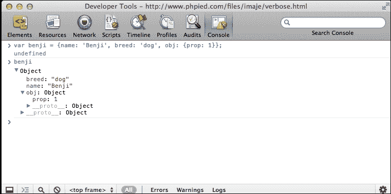
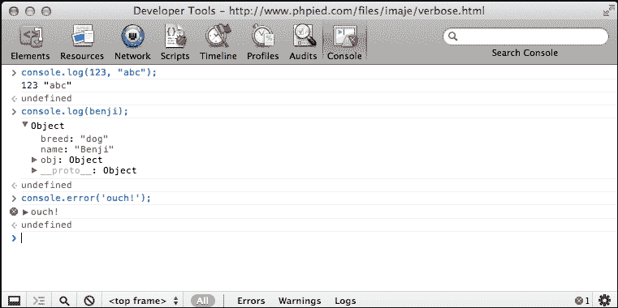
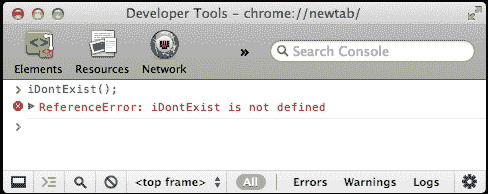

# 第四章 对象

现在您已经掌握了 JavaScript 的原始数据类型、数组和函数，是时候履行书名所承诺的内容，谈谈对象了。

JavaScript 对经典面向对象编程有独特的看法。面向对象编程是最受欢迎的编程范式之一，并且在大多数编程语言（如 Java 和 C++）中都是主流。这些语言都采纳了经典 OOP 提出的明确理念。然而，JavaScript 对此有不同的看法。我们将探讨 JavaScript 支持面向对象编程的方式。

在本章中，您将学习以下主题：

+   如何创建和使用对象

+   构造函数函数有哪些

+   存在哪些内置 JavaScript 对象类型，以及它们能为您做什么

# 从数组到对象

如您从第二章, *原始数据类型、数组、循环和条件* 中所知，数组只是一个值列表。每个值都有一个索引（一个数字键），它从零开始，并为每个值递增。考虑以下示例：

```js
    > var myarr = ['red', 'blue', 'yellow', 'purple']; 
    > myarr; 
    ["red", "blue", "yellow", "purple"]. 
    > myarr[0]; 
    "red" 
    > myarr[3]; 
    "purple" 

```

如果您将索引放在一列，将值放在另一列，您将得到以下所示的关键字/值对表：

| **键** | **值** |
| --- | --- |
| 0 | red |
| 1 | blue |
| 2 | yellow |
| 3 | purple |

对象类似于数组，但不同之处在于您自己定义键。您不仅限于使用仅数字索引，还可以使用更友好的键，如 `first_name`、`age` 等。

让我们看看一个简单的对象，并检查其各个部分：

```js
    var hero = { 
      breed: 'Turtle',  
      occupation: 'Ninja' 
    }; 

```

您可以看到：

+   指向对象的变量的名称是 `hero`

+   与您用来定义数组的 `[` 和 `]` 不同，您使用 `{` 和 `}` 来定义对象

+   您使用逗号分隔对象中包含的元素（称为属性）

+   键/值对由冒号分隔，如 `key:value`

键（属性的名称）可以可选地放在引号内。例如，这些键都是相同的：

```js
    var hero = {occupation: 1}; 
    var hero = {"occupation": 1}; 
    var hero = {'occupation': 1}; 

```

建议您不要引用属性的名称（这样可以减少输入），但在某些情况下您必须使用引号。以下是一些情况：

+   如果属性名称是 JavaScript 的保留字之一（见附录 A, *保留字*）

+   如果它包含空格或特殊字符（除字母、数字以及 `_` 和 `$` 字符之外的其他任何字符）

+   如果它以数字开头

换句话说，如果您为属性选择的名称不是 JavaScript 中变量的有效名称，那么您需要将其用引号括起来。

看看这个看起来很奇怪的对象：

```js
    var o = { 
      $omething: 1, 
      'yes or no': 'yes', 
      '!@#$%^&*': true 
    }; 

```

这是一个有效的对象。第二个和第三个属性的引号是必需的；否则，您将得到一个错误。

在本章的后面部分，你将看到除了 `[]` 和 `{}` 之外，还有其他定义对象和数组的方法。然而，首先，让我们介绍一些术语——使用 `[]` 定义数组称为 **数组字面量表示法**，使用花括号 `{}` 定义对象称为 **对象字面量表示法**。

## 元素、属性、方法和成员

当谈论数组时，你说它们包含元素。当谈论对象时，你说它们包含属性。在 JavaScript 中，这之间没有显著的区别；这只是人们习惯的术语，可能来自其他编程语言。

对象的属性可以指向一个函数，因为函数只是数据。指向函数的属性也称为方法。在以下示例中，`talk` 是一个方法：

```js
    var dog = { 
      name: 'Benji', 
      talk: function () { 
        alert('Woof, woof!'); 
      } 
    }; 

```

正如你在上一章中看到的，将函数作为数组元素存储并调用也是可能的，但在实际中你不会看到很多这样的代码：

```js
    > var a = []; 
    > a[0] = function (what) { alert(what); }; 
    > a0; 

```

你也可以看到人们使用单词 members 来指代对象的属性，通常在属性是函数与否并不重要时。

## 散列和关联数组

在某些编程语言中，存在以下区别：

+   正规数组，也称为 **索引** 或 **枚举** 数组（键是数字）

+   关联数组，也称为 **散列** 或 **字典**（键是字符串）

JavaScript 使用数组来表示索引数组，使用对象来表示关联数组。如果你想在 JavaScript 中使用散列，你可以使用对象。

## 访问对象的属性

访问对象属性有两种方式：

+   使用方括号表示法，例如，`hero['occupation']`

+   例如，使用点表示法，`hero.occupation`

点表示法更容易阅读和编写，但并不总是可以使用。引用属性名称的规则也适用。如果属性名称不是一个有效的变量名，则不能使用点表示法。

让我们再次看看 `hero` 对象：

```js
    var hero = { 
      breed: 'Turtle', 
      occupation: 'Ninja' 
    }; 

```

下面是一个使用点表示法访问属性示例：

```js
    > hero.breed; 
    "Turtle" 

```

让我们看看使用方括号表示法访问属性的一个示例：

```js
    > hero['occupation']; 
    "Ninja" 

```

考虑以下示例，访问一个不存在的属性返回 `undefined`：

```js
    > 'Hair color is ' + hero.hair_color; 
    "Hair color is undefined" 

```

对象可以包含任何数据，包括其他对象：

```js
    var book = { 
      name: 'Catch-22', 
      published: 1961, 
      author: { 
        firstname: 'Joseph', 
        lastname: 'Heller' 
      } 
    }; 

```

要访问包含在 `book` 对象的 `author` 属性中的对象的 `firstname` 属性，你可以使用以下代码行：

```js
    > book.author.firstname; 
    "Joseph" 

```

让我们看看使用方括号表示法的示例：

```js
    > book['author']['lastname']; 
    "Heller" 

```

即使混合使用也有效：

```js
    > book.author['lastname']; 
    "Heller" 
    > book['author'].lastname; 
    "Heller" 

```

需要使用方括号的其他情况是，当你需要访问的属性名称事先未知时。在运行时，它被动态地存储在一个变量中：

```js
    > var key = 'firstname'; 
    > book.author[key]; 
    "Joseph" 

```

## 调用对象的方法

你知道一个方法只是碰巧是函数的属性，所以你访问方法的方式与访问属性的方式相同——使用点符号或使用方括号。调用（调用）方法与调用任何其他函数相同——你只需在方法名后添加括号，这实际上是在说执行！：

```js
    > var hero = { 
        breed: 'Turtle', 
        occupation: 'Ninja', 
        say: function () { 
          return 'I am ' + hero.occupation; 
        } 
      }; 
    > hero.say(); 
    "I am Ninja" 

```

如果你想要传递任何参数给一个方法，你可以像处理普通函数一样进行：

```js
    > hero.say('a', 'b', 'c'); 

```

由于你可以使用类似数组的方括号来访问属性，这意味着你也可以使用方括号来访问和调用方法：

```js
    > hero['say'](); 

```

这不是一种常见的做法，除非在编写代码时不知道方法名，而是在运行时定义：

```js
    var method = 'say'; 
    hero[method](); 

```

### 注意

除非你需要使用点符号来访问方法和属性，否则不要加引号，也不要在对象字面量中加引号属性。

## 修改属性/方法

JavaScript 允许你在任何时间更改现有对象的属性和方法。这包括添加新属性或删除它们。你可以从一个空白对象开始，然后添加属性。让我们看看你如何做到这一点。

没有属性的对象如下所示：

```js
    > var hero = {}; 

```

### 注意

**“空白”对象**

在本节中，你从一个“空白”对象开始，`var hero = {}`。空白加引号是因为这个对象并不是真的空和无用。尽管在这个阶段它没有自己的属性，但它已经继承了一些。

你将在后面学习关于自有属性与继承属性的知识。所以，在 ES3 中，一个对象永远不会真正是空白或空的。然而，在 ES5 中，有一种方法可以创建一个完全不继承任何内容的完全空白对象，但让我们不要走得太远。

1.  以下是如何访问一个不存在的属性的代码：

    ```js
            > typeof hero.breed; 
            "undefined" 

    ```

1.  添加两个属性和一个方法：

    ```js
            > hero.breed = 'turtle'; 
            > hero.name = 'Leonardo'; 
            > hero.sayName = function () { 
                return hero.name;  
              }; 

    ```

1.  调用方法：

    ```js
            > hero.sayName(); 
            "Leonardo" 

    ```

1.  删除属性：

    ```js
            > delete hero.name; 
            true 

    ```

1.  如果你再次调用该方法，它将不再找到已删除的`name`属性：

    ```js
            > hero.sayName(); 
            "undefined" 

    ```

### 注意

**可塑对象**

你可以随时更改任何对象，例如添加和删除属性以及更改它们的值。然而，这个规则有一些例外。一些内置对象的某些属性是不可更改的（例如，`Math.PI`，你将在后面看到）。此外，ES5 允许你防止对象的变化。你将在附录 C*内置对象*中了解更多。

## 使用 this 值

在前面的例子中，`sayName()`方法使用`hero.name`来访问`hero`对象的`name`属性。但是当你在一个方法内部时，还有另一种方法可以访问该方法所属的对象。这种方法是使用特殊值`this`：

```js
    > var hero = { 
        name: 'Rafaelo', 
        sayName: function () { 
          return this.name; 
        } 
      }; 
    > hero.sayName(); 
    "Rafaelo" 

```

所以，当你说`this`时，你实际上是在说——这个对象或当前对象。

## 构造函数

有另一种创建对象的方法——使用构造函数。让我们看一个例子：

```js
    function Hero() { 
      this.occupation = 'Ninja'; 
    } 

```

为了使用此函数创建对象，你可以使用`new`运算符如下所示：

```js
    > var hero = new Hero(); 
    > hero.occupation; 
    "Ninja" 

```

使用构造函数的一个好处是它们可以接受参数，这些参数可以在创建新对象时使用。让我们修改构造函数以接受一个参数并将其分配给`name`属性：

```js
    function Hero(name) { 
      this.name = name; 
      this.occupation = 'Ninja'; 
      this.whoAreYou = function () { 
        return "I'm " + 
               this.name + 
               " and I'm a " + 
               this.occupation; 
      }; 
    } 

```

现在，你可以使用相同的构造函数创建不同的对象：

```js
    > var h1 = new Hero('Michelangelo'); 
    > var h2 = new Hero('Donatello'); 
    > h1.whoAreYou(); 
    "I'm Michelangelo and I'm a Ninja" 
    > h2.whoAreYou(); 
    "I'm Donatello and I'm a Ninja" 

```

### 注意

按照惯例，你应该将构造函数的第一个字母大写，以便有一个视觉提示，表明它们不应该被当作常规函数调用。

如果你调用一个设计为构造函数的函数但省略了`new`运算符，这不是一个错误。然而，它不会给你预期的结果：

```js
    > var h = Hero('Leonardo'); 
    > typeof h; 
    "undefined" 

```

这里发生了什么？没有`new`运算符，所以没有创建新的对象。函数像任何其他函数一样被调用，所以变量`h`包含函数返回的值。该函数没有返回任何内容（没有`return`语句），所以实际上返回`undefined`，并将其分配给变量`h`。

在这种情况下，`this`指的是什么？它指的是全局对象。

## 全局对象

你已经了解了一些关于全局变量的知识（以及你应该如何避免它们）。你还知道 JavaScript 程序在宿主环境中运行（例如，浏览器）。现在，你已经了解了对象，是时候了解整个真相了，宿主环境提供了一个全局对象，所有全局变量都可以作为全局对象属性的访问。

如果你的宿主环境是网页浏览器，全局对象被称为**window**。另一种访问全局对象的方法（这在大多数其他环境中也是正确的）是在构造函数外部使用`this`关键字，例如在任何函数之外的全球程序代码中。

作为一个例子，你可以在任何函数外部声明一个全局变量，如下所示：

```js
    > var a = 1; 

```

然后，你可以通过各种方式访问这个全局变量：

+   作为变量`a`

+   作为全局对象的一个属性，例如，`window['a']`或`window.a`

+   作为称为`this`的全局对象的一个属性：

    ```js
        > var a = 1; 
        > window.a; 
        1 
        > this.a; 
        1 

    ```

让我们回到你定义一个构造函数并使用`new`运算符调用它的例子。在这种情况下，`this`指向全局对象，并且设置到`this`上的所有属性都成为`window`的属性。

声明一个构造函数并使用`new`运算符调用它返回`"undefined"`：

```js
    > function Hero(name) { 
        this.name = name; 
      } 
    > var h = Hero('Leonardo'); 
    > typeof h; 
    "undefined" 
    > typeof h.name; 
    TypeError: Cannot read property 'name' of undefined 

```

由于你在`Hero`函数内部有`this`关键字，所以创建了一个全局变量（全局对象的一个属性）名为`name`：

```js
    > name; 
    "Leonardo" 
    > window.name; 
    "Leonardo" 

```

如果你使用`new`调用相同的构造函数，则返回一个新的对象，并且`this`指向它：

```js
    > var h2 = new Hero('Michelangelo'); 
    > typeof h2; 
    "object" 
    > h2.name; 
    "Michelangelo" 

```

你在第三章“函数”中看到的内置全局函数也可以作为`window`对象的方法来调用。因此，以下两个调用具有相同的结果：

```js
    > parseInt('101 dalmatians'); 
    101 
    > window.parseInt('101 dalmatians') 
    101 

```

## 构造函数属性

当创建一个对象时，幕后会分配一个特殊属性给它——`constructor`属性。它包含一个指向用于创建`this`对象的构造函数的引用。

继续上一个例子：

```js
    > h2.constructor; 
    function Hero(name) { 
      this.name = name; 
    } 

```

由于 `constructor` 属性包含对函数的引用，你不妨调用这个函数来生成一个新的对象。以下代码就像说，“我不关心对象 `h2` 是如何创建的，但我想要另一个完全一样的”：

```js
    > var h3 = new h2.constructor('Rafaello'); 
    > h3.name; 
    "Rafaello" 

```

如果一个对象是使用对象字面量表示法创建的，其构造函数是内置的 `Object()` 构造函数（关于这一点，本章后面会详细介绍）：

```js
    > var o = {}; 
    > o.constructor; 
    function Object() { [native code] } 
    > typeof o.constructor; 
    "function" 

```

## instanceof 操作符

使用 `instanceof` 操作符，你可以测试一个对象是否是由特定的 `constructor` 函数创建的：

```js
    > function Hero() {} 
    > var h = new Hero(); 
    > var o = {}; 
    > h instanceof Hero; 
    true 
    > h instanceof Object; 
    true 
    > o instanceof Object; 
    true 

```

注意，你不需要在函数名后加括号（你不需要使用 `h instanceof Hero()`）。这是因为你并没有调用这个函数，而是像任何其他变量一样通过名称引用它。

## 返回对象的函数

除了使用 `constructor` 函数和 `new` 操作符来创建对象外，你还可以使用一个普通函数来创建对象，而不使用 `new` 操作符。你可以有一个执行一些准备工作并返回对象的函数。

例如，这里有一个简单的 `factory()` 函数，它可以生成对象：

```js
    function factory(name) { 
      return { 
        name: name 
      }; 
    } 

```

考虑以下使用 `factory()` 函数的例子：

```js
    > var o = factory('one'); 
    > o.name; 
    "one" 
    > o.constructor; 
    function Object() { [native code] } 

```

实际上，你也可以使用与 `this` 关键字不同的 `constructor` 函数和返回对象。这意味着你可以修改 `constructor` 函数的默认行为。让我们看看如何。

这里是正常的构造函数场景：

```js
    > function C() { 
        this.a = 1; 
      } 
    > var c = new C(); 
    > c.a; 
    1 

```

然而，现在，看看这个场景：

```js
    > function C2() { 
        this.a = 1; 
        return {b: 2}; 
      } 
    > var c2 = new C2(); 
    > typeof c2.a; 
    "undefined" 
    > c2.b; 
    2 

```

这里发生了什么？不是返回包含属性 `a` 的 `this` 对象，而是构造函数返回了另一个包含属性 `b` 的对象。只有当返回值是对象时，这才能实现。否则，如果你尝试返回任何非对象，构造函数将按照其常规行为继续执行并返回 `this`。

如果你考虑构造函数内部对象的创建方式，你可以想象在函数顶部定义了一个名为 `this` 的变量，然后在函数末尾返回它。考虑以下代码：

```js
    function C() { 
      // var this = {}; // pseudo code, you can't do this 
      this.a = 1; 
      // return this; 
    } 

```

## 传递对象

当你将一个对象分配给另一个变量或将其传递给函数时，你实际上只传递了该对象的引用。因此，如果你修改了引用，你实际上是在修改原始对象。

这里有一个例子，说明你可以将一个对象分配给另一个变量，然后对副本进行修改。结果，原始对象也被修改了：

```js
    > var original = {howmany: 1}; 
    > var mycopy = original; 
    > mycopy.howmany; 
    1 
    > mycopy.howmany = 100; 
    100 
    > original.howmany; 
    100 

```

当将对象传递给函数时，同样适用：

```js
    > var original = {howmany: 100}; 
    > var nullify = function (o) { o.howmany = 0; }; 
    > nullify(original); 
    > original.howmany; 
    0 

```

## 比较对象

当你比较对象时，只有当你比较两个指向同一对象的引用时，你才会得到 `true`。如果你比较两个恰好具有完全相同方法和属性的独立对象，结果将是 `false`。

让我们创建两个看起来相同的对象：

```js
    > var fido  = {breed: 'dog'}; 
    > var benji = {breed: 'dog'}; 

```

比较它们返回 `false`：

```js
    > benji === fido; 
    false 
    > benji == fido; 
    false 

```

你可以创建一个新的变量，`mydog`，并将其中一个对象分配给它。这样，变量 `mydog` 实际上指向的是同一个对象：

```js
    > var mydog = benji; 

```

在这种情况下，`benji` 是 `mydog`，因为它们是同一个对象（改变 `mydog` 变量的属性将改变 `benji` 变量的属性）。比较的结果返回 `true`：

```js
    > mydog === benji; 
    true 

```

由于 `fido` 是一个不同的对象，它不与 `mydog` 相等：

```js
    > mydog === fido; 
    false 

```

## WebKit 控制台中的对象

在深入探讨 JavaScript 的内置对象之前，让我们简要地谈谈在 WebKit 控制台中与对象一起工作的方法。

在本章的示例中尝试一番后，你可能已经注意到了对象在控制台中的显示方式。如果你创建了一个对象并输入它的名称，你会得到一个指向“对象”一词的箭头。

对象是可点击的，并且可以展开以显示对象的所有属性列表。如果一个属性也是一个对象，那么它旁边也会有箭头，这样你也可以展开它。这很方便，因为它让你可以深入了解这个对象包含的内容。考虑以下示例：



### 注意

你现在可以忽略 `__proto__`；关于它的更多内容将在下一章中介绍。

### 使用 console.log 方法进行记录

控制台还提供了一个名为 `console` 的对象和一些方法，例如 `console.log()` 和 `console.error()`，你可以使用它们在控制台中显示任何你想要的内容。



当你想快速测试某些内容，或者想在真实脚本中输出一些中间调试信息时，`console.log()` 方法非常方便。例如，你可以这样进行实验：

```js
    > for (var i = 0; i < 5; i++) { 
        console.log(i);  
      } 
    0 
    1 
    2 
    3 
    4 

```

## ES6 对象字面量

ES6 在使用对象字面量时引入了一种更简洁的语法。ES6 为属性初始化和函数定义提供了几个简写。ES6 的简写与熟悉的 JSON 语法非常相似。考虑以下代码片段：

```js
    let a = 1 
    let b = 2 
    let val = {a: a, b: b} 
    console.log(val) //{"a":1,"b":2} 

```

这是一种典型的分配属性值的方式。如果变量的名称和属性键名相同，ES6 允许你使用简写语法。前面的代码可以写成如下形式：

```js
    let a = 1 
    let b = 2 
    let val = {a, b} 
    console.log(val) //{"a":1,"b":2} 

```

同样的语法也适用于方法定义。正如我们讨论过的，方法只是对象的属性，其值是函数。考虑以下示例：

```js
    var obj = { 
      prop: 1, 
      modifier:  function() { 
        console.log(this.prop);   
      } 
    } 

```

在 ES6 中定义方法有一种紧凑的方式。你只需省略 `function` 关键字和 `:`。在 ES6 中的等效代码如下所示：

```js
    var obj = { 
      prop: 1, 
      modifier () { 
        console.log(this.prop); 
      } 
    } 

```

ES6 允许你计算属性的键。在 ES6 之前，你只能使用固定的属性名。以下是一个示例：

```js
    var obj = { 
      prop: 1, 
      modifier: function () { 
        console.log(this.prop);   
      } 
    } 
    obj.prop = 2; 
    obj.modifier(); //2 

```

如你所见，我们限制使用固定的键名：在这种情况下是 `prop` 和 `modifier`。然而，ES6 允许你使用计算属性键。你可以使用函数返回的值动态创建属性键：

```js
    let vehicle = "car" 
    function vehicleType(){ 
      return "truck" 
    } 
    let car = { 
      [vehicle+"_model"]: "Ford" 
    } 
    let truck= { 
      [vehicleType() + "_model"]: "Mercedez" 
    } 
    console.log(car) //{"car_model":"Ford"} 
    console.log(truck) //{"truck_model":"Mercedez"} 

```

我们正在使用变量 `vehicle` 的值与一个固定字符串连接来推导出 `car` 对象的属性键。在第二个片段中，我们通过将固定字符串与函数返回的值连接来创建属性。这种方式计算属性键在创建对象时提供了极大的灵活性，并且可以消除大量的样板和重复代码。

此语法也适用于方法定义：

```js
    let object_type = "Vehicle" 
    let obj = { 
      ["get"+object_type]() { 
        return "Ford" 
      } 
    } 

```

# 对象属性和属性

每个对象都有一些属性。每个属性又包含一个键和属性。属性的状态存储在这些属性中。所有属性都具有以下属性：

+   **可枚举（布尔值）**：这表示你是否可以枚举对象的属性。系统属性是不可枚举的，而用户属性是可枚举的。除非有充分的理由，否则这个属性应该保持不变。

+   **可配置（布尔值）**：如果此属性为 `false`，则属性不能被删除或编辑（它不能更改其任何属性）。

您可以使用 `Object.getOwnPropertyDescriptor()` 方法来检索对象的自身属性：

```js
    let obj = { 
      age: 25 
    } 
    console.log(Object.getOwnPropertyDescriptor(obj, 'age')); 
    //{"value":25,"writable":true,"enumerable":true,"configurable":true} 

```

同时，可以使用 `Object.defineProperty()` 方法来定义属性：

```js
    let obj = { 
      age: 25 
    } 
    Object.defineProperty(obj, 'age', { configurable: false }) 
    console.log(Object.getOwnPropertyDescriptor(obj, 'age')); 
    //{"value":25,"writable":true,"enumerable":true,"configurable":false} 

```

虽然您永远不会使用这些方法，但了解对象属性和属性很重要。在下一节中，我们将讨论一些 `object` 方法是如何在涉及这些属性的情况下使用的。

# ES6 对象方法

ES6 引入了一些针对对象的静态辅助方法。`Object.assign` 是一个辅助方法，它取代了流行的混入来执行对象的浅拷贝。

## 使用 `Object.assign` 复制属性

此方法用于将目标对象的属性复制到源对象中。换句话说，此方法将源对象与目标对象合并，并修改目标对象：

```js
    let a = {} 
    Object.assign(a, { age: 25 }) 
    console.log(a)  //{"age":25} 

```

`Object.assign` 的第一个参数是要复制源属性的目标对象。返回给调用者的对象是相同的。现有属性会被覆盖，而源对象中不存在的属性会被忽略：

```js
    let a = {age : 23, gender: "male"} 
    Object.assign(a, { age: 25 })    // age overwritten, but gender ignored 
    console.log(a)  //{"age":25, "gender":"male"} 

```

`Object.assign` 可以接受多个源对象。您可以写 `Object.assign(target, source1, source2)`。以下是一个示例：

```js
    console.log(Object.assign({a:1, b:2}, {a: 2}, {c: 4}, {b: 3})) 
    //Object { 
    //"a": 2,  
    //"b": 3, 
    //"c": 4 
    // 

```

在这个片段中，我们正在从多个源对象中分配属性。同时，请注意 `Object.assign()` 返回的目标对象，我们随后在 `console.log()` 中使用它。

需要注意的一点是，只有可枚举的自身（非继承的）属性才能使用 `Object.assign()` 进行复制。原型链上的属性（将在本章后面讨论继承时讨论）不被考虑。我们之前关于可枚举属性的讨论将帮助您理解这种区别。

在以下示例中，我们将使用 `defineProperty()` 创建一个不可枚举的属性，并验证 `Object.assign()` 忽略该属性的事实：

```js
    let a = {age : 23, gender: "male"} 
    Object.defineProperty(a, 'superpowers', {enumberable:false, value: 'ES6'}) 
    console.log(
```

被定义为 `superpowers` 的属性将可枚举属性设置为 `false`。在复制属性时，此属性将被忽略。

## 使用 Object.is 比较值

ES6 提供了一种稍微精确的比较值的方法。我们已经讨论了严格相等操作符 `===`。然而，对于 `NaN`、`-0` 和 `+0`，严格相等操作符的行为不一致。以下是一个例子：

```js
    console.log(NaN===NaN) //false 
    console.log(-0===+0) //true 
    //ES6 Object.is 
    console.log(Object.is(NaN,NaN)) //true 
    console.log(Object.is(-0,+0)) //false 

```

除了这两种情况，`Object.is()` 可以安全地替换为 `===` 操作符。

# 解构

当你编码时，你将始终与对象和数组打交道。JavaScript 对象和数组表示法类似于 JSON 格式。你将定义对象和数组，然后从它们中检索元素。ES6 提供了一种方便的语法，显著改进了我们访问对象和数组属性/成员的方式。让我们考虑你经常会编写的典型代码：

```js
    var config = { 
      server: 'localhost', 
      port: '8080' 
    } 
    var server = config.server; 
    var port = config.port; 

```

在这里，我们从 `config` 对象中提取了 `server` 和 `port` 的值，并将它们分配给局部变量。非常直接！然而，当这个对象有很多属性，其中一些是嵌套的，这个简单的操作可能会变得非常繁琐。

ES6 解构语法允许在赋值语句的左侧使用对象字面量。在下面的例子中，我们将定义一个具有几个属性的 `config` 对象。稍后，我们将使用解构将对象 `config` 分配给赋值语句左侧的单独属性：

```js
    let config = { 
      server: 'localhost', 
      port: '8080', 
      timeout: 900, 
    } 
    let {server,port} = config  
    console.log(server, port) //"localhost" "8080" 

```

正如你所见，`server` 和 `port` 是从 `config` 对象中获取属性值的局部变量，因为它们的属性名与局部变量的名称相同。你还可以在将属性分配给局部变量时选择特定的属性。以下是一个例子：

```js
    let {timeout : t} =config 
    console.log(t) //900 

```

在这里，我们只从 `config` 对象中选取 `timeout` 并将其分配给局部变量 `t`。

你还可以使用解构语法将值分配给已经声明的变量。在这种情况下，你必须将赋值表达式放在括号内：

```js
    let config = { 
      server: 'localhost', 
      port: '8080', 
      timeout: 900, 
    } 
    let server = '127.0.0.1'; 
    let port = '80'; 
    ({server,port} = config) //assignment surrounded by () 
    console.log(server, port) //"localhost" "8080" 

```

由于解构表达式计算结果为表达式的右侧，因此它可以在任何期望值的地方使用。例如，在函数调用中，如下所示：

```js
    let config = { 
      server: 'localhost', 
      port: '8080', 
      timeout: 900, 
    } 
    let server='127.0.0.1'; 
    let port ='80'; 
    let timeout ='100'; 

    function startServer(configValue){ 
      console.log(configValue) 
    } 
    startServer({server,port,timeout} = config) 

```

如果你指定了一个具有对象中不存在属性名的局部变量，该局部变量将获得一个 `undefined` 值。然而，在使用解构赋值中的变量时，你可以选择性地指定默认值：

```js
    let config = { 
      server: 'localhost', 
      port: '8080' 
    } 
    let {server,port,timeout=0} = config 
    console.log(timeout) 

```

在这个例子中，对于不存在的属性 `timeout`，我们提供了一个默认值以防止将 `undefined` 值分配给局部变量。

解构同样适用于数组，其语法与对象也非常相似。我们只需将对象字面量语法替换为 `array:literals`：

```js
    const arr = ['a','b'] 
    const [x,y] = arr 
    console.log (x,y) /"a" "b" 

```

如你所见，这正是我们之前看到的相同语法。我们定义了一个数组`arr`，后来使用解构语法将数组的元素分配给两个局部变量`x`和`y`。在这里，赋值是基于数组中元素的顺序进行的。既然你只关心元素的顺序，如果你想的话，可以跳过一些元素。以下是一个示例：

```js
    const days = ['Thursday','Friday','Saturday','Sunday'] 
    const [,,sat,sun] = days 
    console.log (sat,sun) //"Saturday" "Sunday" 

```

在这里，我们知道我们需要从位置 2 和 3 获取元素（数组的索引从 0 开始），因此，我们忽略位置 0 和 1 的元素。数组解构可以消除交换两个变量值时使用`temp`变量的需求。考虑以下示例：

```js
    let a=1, b=2; 
    [b,a] = [a,b] 
    console.log(a,b) //2 1 

```

你可以使用剩余操作符（`...`）提取剩余元素并将它们分配给一个数组。剩余操作符只能在解构时作为最后一个操作符使用：

```js
    const [x, ...y] = ['a', 'b', 'c']; // x='a'; y=['b', 'c'] 

```

# 内置对象

在本章前面，你遇到了`Object()`构造函数。当你使用对象字面量表示法创建对象并访问它们的`constructor`属性时，它会返回。`Object()`是内置构造函数之一；还有几个其他的，在本章的其余部分你将看到所有这些。

内置对象可以分为三组：

+   **数据包装对象**：这些是`Object`、`Array`、`Function`、`Boolean`、`Number`和`String`。这些对象对应于 JavaScript 中的不同数据类型。对于`typeof`（在第二章中讨论）返回的每个不同值都有一个数据包装对象，除了`undefined`和`null`。

+   **实用对象**：这些是`Math`、`Date`和`RegExp`，它们可能会很有用。

+   **错误对象**：这些包括通用的`Error`对象以及其他更具体的对象，可以帮助你的程序在发生意外情况时恢复其工作状态。

本章将讨论内置对象的一小部分方法。对于完整参考，请参阅附录 C，*内置对象*。

如果你对于什么是内置对象和什么是内置构造函数感到困惑，那么，它们是同一件事。稍后，你会看到函数以及因此构造函数也是对象。

## 对象

对象是所有 JavaScript 对象的父对象，这意味着你创建的每个对象都继承自它。要创建一个新的空对象，你可以使用字面量表示法或`Object()`构造函数。以下两行是等价的：

```js
    > var o = {}; 
    > var o = new Object(); 

```

如前所述，一个空（或空白）对象并不是完全没有用，因为它已经包含了一些继承的方法和属性。在这本书中，空指的是像`{}`这样的对象，它没有任何自己的属性，除了它自动获取的属性。让我们看看一些即使空白对象也已有的属性：

+   `o.constructor` 属性返回对构造函数的引用

+   `o.toString()` 是一个返回对象字符串表示形式的方法

+   `o.valueOf()` 返回对象的单值表示形式；通常情况下，这就是对象本身

让我们看看这些方法在实际中的应用。首先，创建一个对象：

```js
    > var o = new Object(); 

```

调用 `toString()` 返回对象的字符串表示形式：

```js
    > o.toString(); 
    "[object Object]" 

```

当对象在字符串上下文中使用时，JavaScript 会内部调用 `toString()` 方法。例如，`alert()` 只能处理字符串，所以如果你调用 `alert()` 函数并传递一个对象，后台会调用 `toString()` 方法。这两行代码会产生相同的结果：

```js
    > alert(o); 
    > alert(o.toString()); 

```

另一种字符串上下文是字符串连接。如果你尝试将一个对象与一个字符串连接，首先会调用对象的 `toString()` 方法：

```js
    > "An object: " + o; 
    "An object: [object Object]" 

```

`valueOf()` 方法是所有对象都提供的一个方法。对于简单对象（其构造函数为 `Object()`），`valueOf()` 方法返回对象本身：

```js
    > o.valueOf() === o; 
    true 

```

总结如下：

+   你可以通过 `var o = {};`（对象字面量表示法，推荐的方法）或 `var o = new Object();` 来创建对象

+   任何对象，无论多么复杂，都继承自 `Object` 对象，因此提供了如 `toString()` 这样的方法和如构造函数这样的属性

## Array

`Array()` 是一个内置函数，你可以将其用作构造函数来创建数组：

```js
    > var a = new Array(); 

```

这与数组字面量表示法等价：

```js
    > var a = []; 

```

无论数组是如何创建的，你都可以像往常一样向其中添加元素：

```js
    > a[0] = 1; 
    > a[1] = 2; 
    > a; 
    [1, 2] 

```

当使用 `Array()` 构造函数时，你也可以传递将被分配给新数组元素的值：

```js
    > var a = new Array(1, 2, 3, 'four'); 
    > a; 
    [1, 2, 3, "four"] 

```

例外情况是当你向构造函数传递一个单个数字时。在这种情况下，这个数字被认为是数组的长度：

```js
    > var a2 = new Array(5); 
    > a2; 
     [undefined x 5] 

```

由于数组是通过构造函数创建的，这意味着数组实际上也是对象？是的，你可以使用 `typeof` 操作符来验证这一点：

```js
    > typeof [1, 2, 3]; 
    "object" 

```

由于数组是对象，这意味着它们继承了父对象的属性和方法：

```js
    > var a = [1, 2, 3, 'four']; 
    > a.toString(); 
    "1,2,3,four" 
    > a.valueOf(); 
    [1, 2, 3, "four"] 
    > a.constructor; 
    function Array() { [native code] } 

```

数组是对象，但属于特殊类型，因为：

+   它们的属性名会自动使用从 0 开始的数字进行分配。

+   它们有一个包含数组中元素数量的 `length` 属性。

+   除了从父对象继承的方法之外，它们还有更多内置方法。

让我们通过创建空数组 `a` 和空对象 `o` 来检查数组和对象之间的差异：

```js
    > var a = [], o = {}; 

```

数组对象自动定义了一个 `length` 属性，而普通对象则没有：

```js
    > a.length; 
    0 
    > typeof o.length; 
    "undefined" 

```

向数组和对象中添加数字和非数字属性都是可以的：

```js
    > a[0] = 1;  
    > o[0] = 1; 
    > a.prop = 2; 
    > o.prop = 2; 

```

`length` 属性始终与数字属性的数量保持一致，而忽略非数字属性：

```js
    > a.length; 
    1 

```

`length` 属性也可以由你设置。将其设置为大于数组当前项目数量的值，可以为额外的元素腾出空间。如果你尝试访问这些不存在的元素，你会得到值 `undefined`：

```js
    > a.length = 5; 
    5 
    > a; 
    [1, undefined x 4] 

```

将 `length` 属性设置为较小的值会移除尾部元素：

```js
    > a.length = 2; 
    2 
    > a; 
    [1, undefined x 1] 

```

### 几种数组方法

除了从父对象继承的方法外，数组对象还有专门用于处理数组的特定方法，例如 `sort()`、`join()` 和 `slice()` 等（有关完整列表，请参阅 附录 C，*内置对象*）。

让我们拿一个数组并实验一些这些方法：

```js
    > var a = [3, 5, 1, 7, 'test']; 

```

`push()` 方法将新元素追加到数组的末尾。`pop()` 方法移除最后一个元素。`a.push('new')` 方法类似于 `a[a.length] = 'new'`，而 `a.pop()` 则类似于 `a.length-`。

`push()` 方法返回更改后数组的长度，而 `pop()` 返回被移除的元素：

```js
    > a.push('new'); 
    6 
    > a; 
    [3, 5, 1, 7, "test", "new"] 
    > a.pop(); 
    "new" 
    > a; 
    [3, 5, 1, 7, "test"] 

```

`sort()` 方法对数组进行排序并返回它。在下一个示例中，排序后，`a` 和 `b` 都指向同一个数组：

```js
    > var b = a.sort(); 
    > b; 
    [1, 3, 5, 7, "test"] 
    > a === b; 
    true 

```

`join()` 方法返回一个字符串，其中包含数组中所有元素的值，这些值使用传递给 `join()` 的字符串参数粘合在一起：

```js
    > a.join(' is not '); 
    "1 is not 3 is not 5 is not 7 is not test" 

```

`slice()` 方法返回数组的部分，而不修改源数组。`slice()` 的第一个参数是起始索引（基于零），第二个参数是结束索引（两个索引都是基于零的）。起始索引包含在内，而结束索引不包含。请看以下示例：

```js
    > b = a.slice(1, 3); 
    [3, 5] 
    > b = a.slice(0, 1); 
    [1] 
    > b = a.slice(0, 2); 
    [1, 3] 

```

在所有切片之后，源数组仍然是相同的：

```js
    > a; 
    [1, 3, 5, 7, "test"] 

```

`splice()` 方法修改源数组。它移除一个片段，返回它，并可选择用新元素填充空缺。前两个参数定义要移除的片段的起始索引和长度（元素数量）；其他参数传递新值：

```js
    > b = a.splice(1, 2, 100, 101, 102); 
    [3, 5] 
    > a; 
    [1, 100, 101, 102, 7, "test"] 

```

使用新元素填充空缺是可选的，因此你可以跳过它：

```js
    > a.splice(1, 3);  
    [100, 101, 102] 
    > a; 
    [1, 7, "test"] 

```

# ES6 数组方法

数组获得了一组有用的方法。例如 **lodash** 和 **underscore** 这样的库提供了语言之前所缺少的功能。有了这些新的辅助方法，数组的创建和操作变得更加功能化和易于编码。

## Array.from

在 JavaScript 中，将类似数组的值转换为数组一直是一个挑战。人们已经使用了几种技巧并编写了库，以便有效地处理数组。

ES6 引入了一种非常有用的方法，可以将类似数组的对象和可迭代值转换为数组。类似数组的值是具有长度属性和索引元素的对象。每个函数都有一个隐含的 `arguments` 变量，它包含传递给函数的所有参数的列表。这个变量是一个类似数组的对象。在 ES6 之前，我们只能通过迭代它并将值复制到一个新数组中来将 `arguments` 对象转换为数组：

```js
    function toArray(args) { 
        var result = []; 
        for (var i = 0, len = args.length; i < len; i++) { 
            result.push(args[i]); 
        } 
        return result; 
    } 
    function doSomething() { 
        var args = toArray(arguments); 
        console.log(args) 
    } 
    doSomething("hellow", "world") 
    //Array [ 
    //  "hellow", 
    //  "world" 
    //] 

```

在这里，我们正在创建一个新的数组来复制 `arguments` 对象的所有元素。这是浪费的，并且需要大量的不必要的编码。`Array.from()` 是将类似数组的对象转换为数组的一种简洁方式。我们可以使用 `Array.from()` 将此示例转换为更简洁的一个：

```js
    function doSomething() { 
        console.log(Array.from(arguments)) 
    } 
    doSomething("hellow", "world") 
    //Array [ 
    //  "hellow", 
    //  "world" 
    //] 

```

在调用 `Array.from()` 时，你可以通过提供一个映射函数来提供自己的映射方案。这个函数会在对象的所有元素上被调用，并将它们转换。这对于许多常见用例非常有用，例如：

```js
    function doSomething() { 
       console.log(Array.from(arguments, function(elem) 
      { return elem + " mapped"; })); 
    } 

```

在这个例子中，我们正在使用 `Array.from` 解构 `arguments` 对象，并对 `arguments` 对象中的每个元素调用一个函数。

## 使用 Array.of 创建数组

使用 `Array()` 构造函数创建数组会导致一些问题。构造函数的行为根据参数的数量和类型而有所不同。当你向 `Array()` 构造函数传递单个数值时，会创建一个包含未定义元素的数组，其长度值被分配给参数值：

```js
    let arr = new Array(2) 
    console.log(arr) //[undefined, undefined] 
    console.log(arr.length) //2 

```

另一方面，如果你只传递一个非数值，它将成为数组中的唯一项：

```js
    let arr = new Array("2") 
    console.log(arr) //["2"] 
    console.log(arr.length) //1 

```

这还不算完。如果你传递多个值，它们将成为数组的元素：

```js
    let arr = new Array(1,"2",{obj: "3"}) 
    console.log(arr.length) //3 

```

因此，显然需要一个更好的方法来创建数组，以避免这种混淆。ES6 引入了 `Array.of` 方法，它的工作方式类似于 `Array()` 构造函数，但保证了统一的行为。`Array.of` 从其参数创建一个数组，无论它们的数量和类型如何：

```js
    let arr = Array.of(1,"2",{obj: "3"}) 
    console.log(arr.length) //3 

```

## 数组原型方法

ES6 在数组实例中引入了几个有趣的方法。这些方法有助于数组迭代和在数组中搜索元素，这两者都是非常频繁且有用的操作。

这里是用于遍历数组的几种方法：

+   `Array.prototype.entries()`

+   `Array.prototype.values()`

+   `Array.prototype.keys()`

所有三种方法都返回一个迭代器。这个迭代器可以用来使用 `Array.from()` 创建数组，也可以在循环中用于迭代：

```js
    let arr = ['a','b','c'] 
    for (const index of arr.keys()){ 
      console.log(index) //0 1 2 
    } 
    for (const value of arr.values()){ 
      console.log(value) //a b c 
    } 
    for (const [index,value] of arr.entries()){ 
      console.log(index,value)  
    } 
    //0 "a" 
    //1 "b" 
    //2 "c" 

```

类似地，还有用于在数组中搜索的新方法。在数组中查找一个元素通常涉及遍历整个列表并将它们与一个值进行比较，因为没有内置的方法来做这件事。尽管 `indexOf()` 和 `lastIndexOf()` 有助于找到单个值，但没有方法可以根据复杂条件找到元素。随着 ES6 的到来，以下内置方法帮助使用 `this` 关键字。

+   `Array.prototype.find`

+   `Array.prototype.findIndex`

这两种方法接受两个参数——第一个是 `callback` 函数（包含谓词条件），第二个是可选的 `this` 关键字。`callback` 接受三个参数：数组元素、该元素的索引和数组。如果元素匹配谓词，则 `callback` 返回 `true`：

```js
    let numbers = [1,2,3,4,5,6,7,8,9,10]; 
    console.log(numbers.find(n => n > 5)); //6 
    console.log(numbers.findIndex(n => n > 5)); //5 

```

## 函数

你已经知道函数是一种特殊的数据类型。然而，实际上还有更多：函数实际上是对象。存在一个内置的 `constructor` 函数称为 `Function()`，它允许以另一种（但不一定推荐）方式创建函数。

以下示例展示了定义函数的三个方法：

```js
    > function sum(a, b) { // function declaration 
        return a + b; 
      } 
    > sum(1, 2); 
    3 
    > var sum = function (a, b) { // function expression 
        return a + b; 
      }; 
    > sum(1, 2) 
    3 
    > var sum = new Function('a', 'b', 'return a + b;'); 
    > sum(1, 2) 
    3 

```

当使用 `Function()` 构造函数时，你首先传递参数名称（作为字符串），然后是函数主体的源代码（再次作为字符串）。JavaScript 引擎需要评估你传递的源代码并为你创建新函数。这种源代码评估与 `eval()` 函数具有相同的缺点，因此当可能时，应避免使用 `Function()` 构造函数定义函数。

如果你使用 `Function()` 构造函数创建具有许多参数的函数，请记住参数可以作为一个逗号分隔的单个列表传递；例如，这些是相同的：

```js
    > var first = new Function( 
        'a, b, c, d', 
        'return arguments;' 
      ); 
    > first(1, 2, 3, 4); 
           [1, 2, 3, 4] 
    > var second = new Function( 
        'a, b, c', 
        'd', 
        'return arguments;' 
       ); 
    > second(1, 2, 3, 4); 
           [1, 2, 3, 4] 
    > var third = new Function( 
        'a', 
        'b', 
        'c', 
        'd', 
        'return arguments;' 
      ); 
    > third(1, 2, 3, 4);  
          [1, 2, 3, 4] 

```

### 注意

不要使用 `Function()` 构造函数。就像 `eval()` 和 `setTimeout()`（本书后面将讨论）一样，始终尝试避免将 JavaScript 代码作为字符串传递。

### 函数对象的属性

就像任何其他对象一样，函数有一个 `constructor` 属性，它包含对 `Function()` 构造函数的引用。这适用于你创建函数时使用的任何语法：

```js
    > function myfunc(a) { 
        return a;  
      } 
    > myfunc.constructor; 
    function Function() { [native code] } 

```

函数还有一个 `length` 属性，它包含函数期望的正式参数数量：

```js
    > function myfunc(a, b, c) { 
        return true; 
      } 
    > myfunc.length; 
       3 

```

### 使用原型属性

函数对象最广泛使用的属性之一是 `prototype` 属性。你将在下一章中详细讨论这个属性，但现在是这样的：

+   函数对象的 `prototype` 属性指向另一个对象

+   它的好处只有在将此 `function` 用作构造函数时才会显现

+   使用这个 `function` 创建的所有对象都保留了对 `prototype` 属性的引用，并且可以使用其属性作为自己的属性

让我们通过一个快速示例来演示 `prototype` 属性。考虑一个简单的对象，它有一个属性名和一个 `say()` 方法：

```js
    var ninja = { 
      name: 'Ninja', 
      say: function () { 
        return 'I am a ' + this.name; 
      } 
    }; 

```

当你创建一个函数（即使是没有主体的函数），你可以验证它自动具有一个指向新对象的 `prototype` 属性：

```js
    > function F() {} 
    > typeof F.prototype; 
    "object" 

```

当你修改 `prototype` 属性时，事情变得有趣。你可以向其中添加属性，或者用任何其他对象替换默认对象。让我们将 `ninja` 赋值给 `prototype`：

```js
    > F.prototype = ninja; 

```

现在，这里发生魔法的地方，使用 `F()` 函数作为构造函数，你可以创建一个新的对象 `baby_ninja`，它将能够访问 `F.prototype`（指向 `ninja`）的属性，就像它们是自己的属性一样：

```js
    > var baby_ninja = new F(); 
    > baby_ninja.name; 
    "Ninja" 
    > baby_ninja.say(); 
    "I am a Ninja" 

```

关于这个话题将有更多内容。实际上，下一章全部都是关于 `prototype` 属性的。

### 函数对象的属性

函数对象作为顶级父对象的子类，继承了默认方法，如`toString()`。当在函数上调用时，`toString()`方法返回函数的源代码：

```js
    > function myfunc(a, b, c) { 
        return a + b + c; 
      } 
    > myfunc.toString(); 
    "function myfunc(a, b, c) { 
      return a + b + c; 
    }" 

```

如果你尝试查看内置函数的源代码，你会得到`[native code]`字符串而不是函数体：

```js
    > parseInt.toString(); 
    "function parseInt() { [native code] }" 

```

如你所见，你可以使用`toString()`来区分原生方法和开发者定义的方法。

### 注意

函数的`toString()`行为与环境相关，在空格和换行符方面，不同浏览器之间有所不同。

### 调用和应用

函数对象有`call()`和`apply()`方法。你可以使用它们来调用函数并传递任何参数。

这些方法还允许你的对象从其他对象借用方法并作为自己的方法调用。这是一种简单而强大的代码重用方式。

假设你有一个包含`say()`方法的`some_obj`对象：

```js
    var some_obj = { 
      name: 'Ninja', 
      say: function (who) { 
        return 'Haya ' + who + ', I am a ' + this.name; 
      } 
   }; 

```

你可以调用`say()`方法，它内部使用`this.name`来访问其自身的名称属性：

```js
    > some_obj.say('Dude'); 
    "Haya Dude, I am a Ninja" 

```

现在，让我们创建一个简单的对象`my_obj`，它只有一个名称属性：

```js
    > var my_obj = {name: 'Scripting guru'}; 

```

`my_obj`非常喜欢`some_obj`对象的`say()`方法，以至于它想将其作为自己的方法调用。这可以通过使用`say()`函数对象的`call()`方法来实现：

```js
    > some_obj.say.call(my_obj, 'Dude'); 
    "Haya Dude, I am a Scripting guru" 

```

这成功了！但这里发生了什么？你通过传递两个参数（`my_obj`对象和`Dude`字符串）调用了`say()`函数对象的`call()`方法。结果是，当`say()`被调用时，它包含的`this`值引用指向`my_obj`。这样，`this.name`就不返回`Ninja`，而是返回`Scripting guru`。

如果你调用`call()`方法时还有更多参数要传递，你只需继续添加它们：

```js
    some_obj.someMethod.call(my_obj, 'a', 'b', 'c'); 

```

如果你没有将对象作为`call()`的第一个参数传递，或者传递了`null`，则假定全局对象。

方法`apply()`与`call()`的工作方式相同，但不同之处在于，你想要传递给其他对象方法的全部参数都作为数组传递。以下两行是等效的：

```js
    some_obj.someMethod.apply(my_obj, ['a', 'b', 'c']); 
    some_obj.someMethod.call(my_obj, 'a', 'b', 'c'); 

```

继续上一个例子，你可以使用以下代码行：

```js
    > some_obj.say.apply(my_obj, ['Dude']); 
    "Haya Dude, I am a Scripting guru" 

```

### 再次审视`arguments`对象

在上一章中，你已经看到，从函数内部，你可以访问一个名为`arguments`的东西，它包含传递给函数的所有参数的值：

```js
    > function f() { 
        return arguments; 
      } 
    > f(1, 2, 3); 
    [1, 2, 3] 

```

`arguments`看起来像数组，但实际上是一个类似数组的对象。它之所以像数组，是因为它包含索引元素和`length`属性。然而，相似之处到此为止，因为`arguments`不提供任何数组方法，如`sort()`或`slice()`。

然而，你可以将`arguments`转换为数组，并从中受益所有数组的好处。以下是你能做的事情，练习你刚刚学到的`call()`方法：

```js
    > function f() { 
        var args = [].slice.call(arguments); 
        return args.reverse(); 
      } 

    > f(1, 2, 3, 4); 
     [4, 3, 2, 1] 

```

如你所见，你可以使用`[].slice`或更冗长的`Array.prototype.slice`来借用`slice()`。

# 箭头函数中的词法`this`

我们在上章详细讨论了 ES6 箭头函数和其语法。然而，箭头函数的一个重要特性是它们的行为与普通函数不同。这种差异微妙但很重要。箭头函数没有自己的 `this` 值。箭头函数中的 `this` 值是从封闭（词法）作用域继承的。

函数有一个特殊的变量 `this`，它通过调用方法的对象来引用。由于 `this` 的值是基于函数调用的动态给出的，它有时被称为动态 `this`。函数在两个作用域中执行——词法和动态。词法作用域是围绕函数作用域的作用域，动态作用域是调用函数的作用域（通常是对象）。

在 JavaScript 中，传统函数扮演着几个角色。它们是非方法函数（也称为子程序或函数）、方法（对象的一部分）和构造函数。当函数执行子程序的任务时，由于动态 `this` 而存在一个小问题。由于子程序不是在对象上调用，因此在严格模式下 `this` 的值未定义，否则设置为全局作用域。这使得编写 `callbacks` 变得困难。考虑以下示例：

```js
    var greeter = { 
      default: "Hello ", 
      greet: function (names){ 
        names.forEach(function(name) { 
    console.log(this.default + name); //Cannot read property 
      'default' of undefined 
       }) 
      } 
    }     
    console.log(greeter.greet(['world', 'heaven'])) 

```

我们正在将子程序传递给 `names` 数组上的 `forEach()` 函数。这个子程序有一个未定义的 `this` 值，并且不幸的是，它无法访问外部方法 `greet` 的 `this`。显然，这个子程序需要一个词法 `this`，从 `greet` 方法的周围作用域中派生 `this`。传统上，为了修复这种限制，我们将词法 `this` 赋值给一个变量，然后通过闭包使子程序可以访问它。

我们可以按照以下方式修复前面的示例：

```js
    var greeter = { 
      default: "Hello ", 
      greet: function (names){ 
        let that = this 
        names.forEach(function(name) { 
          console.log(that.default + name);  
       }) 
      } 
    }     
    console.log(greeter.greet(['world', 'heaven'])) 

```

这是一个模拟词法 `this` 的合理技巧。然而，这种技巧的问题在于它为编写或审查此类代码的人带来了太多的噪音。首先，你必须理解 `this` 行为的怪癖。即使你很好地理解了 `this` 的行为，你也需要持续关注代码中的此类技巧。

箭头函数具有词法 `this` 并且不需要此类技巧。由于 `this`，它们更适合作为子程序。我们可以使用箭头函数将前面的示例转换为使用词法 `this`：

```js
    var greeter = { 
      default: "Hello ", 
      greet: function (names){ 
        names.forEach(name=> { 
          console.log(this.default + name);   //lexical 'this' 
           available for this subroutine 
       }) 
     } 
    }     
    console.log(greeter.greet(['world', 'heaven'])) 

```

## 推断对象类型

你可以看到这个类似数组的 arguments 对象看起来非常像数组对象。你如何可靠地区分这两个对象？此外，当与数组一起使用时，`typeof` 返回对象。因此，你如何区分对象和数组？

火箭弹是 `Object` 对象的 `toString()` 方法。它提供了创建给定对象所使用的内部类名：

```js
    > Object.prototype.toString.call({}); 
    "[object Object]" 
    > Object.prototype.toString.call([]); 
    "[object Array]" 

```

您必须调用在 `Object` 构造函数的原型中定义的原始 `toString()` 方法。否则，如果您调用 `Array` 函数的 `toString()`，它将给出不同的结果，因为已经针对数组对象的具体目的进行了覆盖：

```js
    > [1, 2, 3].toString(); 
    "1,2,3" 

```

前面的代码与以下代码相同：

```js
    > Array.prototype.toString.call([1, 2, 3]); 
    "1,2,3" 

```

让我们再来一些关于 `toString()` 的有趣操作。创建一个方便的参考以节省输入：

```js
    > var toStr = Object.prototype.toString; 

```

以下示例显示了我们可以如何区分数组与类似数组的对象 `arguments`：

```js
    > (function () { 
        return toStr.call(arguments); 
      }()); 
    "[object Arguments]" 

```

您甚至可以检查 DOM 元素：

```js
    > toStr.call(document.body); 
    "[object HTMLBodyElement]" 

```

## Boolean

您在 JavaScript 内置对象中的旅程仍在继续，接下来的三个对象相当直接。它们是布尔值、数字和字符串。它们只是包装了原始数据类型。

您已经从 第二章, *原始数据类型、数组、循环和条件* 中了解了大量关于布尔值的知识。现在，让我们来认识 `Boolean()` 构造函数：

```js
    > var b = new Boolean(); 

```

重要的是要注意，这会创建一个新的对象 `b`，而不是原始布尔值。要获取原始值，您可以调用 `valueOf()` 方法（从 `Object` 类继承并进行了自定义）：

```js
    > var b = new Boolean(); 
    > typeof b; 
    "object" 
    > typeof b.valueOf(); 
    "boolean" 
    > b.valueOf(); 
    false 

```

总体而言，使用 `Boolean()` 构造函数创建的对象并不太有用，因为它们除了继承的属性和方法之外，不提供任何其他方法或属性。

当作为普通函数调用而不使用 `new` 时，`Boolean()` 函数将非布尔值转换为布尔值（这类似于使用双重否定 `!!` 值）：

```js
    > Boolean("test"); 
    true 
    > Boolean(""); 
    false 
    > Boolean({}); 
    true 

```

除了六个 `false` 值之外，JavaScript 中的一切都是 `true`，包括所有对象。这也意味着使用 `new Boolean()` 创建的所有布尔对象也是 `true`，因为它们是对象：

```js
    > Boolean(new Boolean(false)); 
    true 

```

这可能会令人困惑，并且由于布尔对象不提供任何特殊方法，最好只坚持使用常规的原始布尔值。

## Number

与 `Boolean()` 类似，`Number()` 函数也可以用作：

+   一个带有 `new` 的 `constructor` 函数来创建对象。

+   一个普通函数，旨在尝试将任何值转换为数字。这与 `parseInt()` 或 `parseFloat()` 的使用类似：

    ```js
        > var n = Number('12.12'); 
        > n; 
        12.12 
        > typeof n; 
        "number" 
        > var n = new Number('12.12'); 
        > typeof n; 
        "object" 

    ```

由于函数是对象，它们也可以有属性。`Number()` 函数具有不可修改的内置常量属性：

```js
    > Number.MAX_VALUE; 
    1.7976931348623157e+308 
    > Number.MIN_VALUE; 
    5e-324 
    > Number.POSITIVE_INFINITY; 
    Infinity 
    > Number.NEGATIVE_INFINITY; 
    -Infinity 
    > Number.NaN; 
    NaN 

```

数字对象提供了三种方法 - `toFixed()`、`toPrecision()` 和 `toExponential()`（有关更多详细信息，请参阅 附录 C, *内置对象*）：

```js
    > var n = new Number(123.456); 
    > n.toFixed(1); 
    "123.5" 

```

注意，您可以在不首先显式创建 `Number` 对象的情况下使用这些方法。在这种情况下，`Number` 对象会在幕后为您创建（并销毁）：

```js
    > (12345).toExponential(); 
    "1.2345e+4" 

```

与所有对象一样，`Number` 对象也提供了 `toString()` 方法。当与 `Number` 对象一起使用时，此方法接受一个可选的基数参数（默认为 10）：

```js
    > var n = new Number(255); 
    > n.toString(); 
    "255" 
    > n.toString(10); 
    "255" 
    > n.toString(16); 
    "ff" 
    > (3).toString(2); 
    "11" 
    > (3).toString(10); 
    "3" 

```

## String

您可以使用 `String()` 构造函数来创建字符串对象。字符串对象提供了方便的文本操作方法。

以下是一个示例，展示了`String`对象和原始字符串数据类型之间的区别：

```js
    > var primitive = 'Hello'; 
    > typeof primitive; 
    "string" 
    > var obj = new String('world'); 
    > typeof obj; 
    "object" 

```

`String`对象类似于字符数组。字符串对象为每个字符都有一个索引属性（在 ES5 中引入，但在许多浏览器中已经长期支持，除了旧版的 IE），它们还有一个`length`属性。

```js
    > obj[0]; 
    "w" 
    > obj[4]; 
    "d" 
    > obj.length; 
    5 

```

要从`String`对象中提取原始值，你可以使用从`Object`继承的`valueOf()`或`toString()`方法。你可能永远不需要这样做，因为如果你在原始字符串上下文中使用对象，`toString()`会在幕后被调用：

```js
    > obj.valueOf(); 
    "world" 
    > obj.toString(); 
    "world" 
    > obj + ""; 
    "world" 

```

原始字符串不是对象，因此它们没有任何方法或属性。然而，JavaScript 也提供了将原始字符串作为对象处理的语法（就像你已经看到原始数字那样）：

在以下示例中，每次将原始字符串作为对象处理时，都会在幕后创建（然后销毁）`String`对象：

```js
    > "potato".length; 
    6 
    > "tomato"[0]; 
    "t" 
    > "potatoes"["potatoes".length - 1]; 
    "s" 

```

这里有一个最终的例子来说明原始字符串和`String`对象之间的区别。在这个例子中，我们将它们转换为布尔值。空字符串是一个假值，但任何字符串对象都是真值（因为所有对象都是真值）：

```js
    > Boolean(""); 
    false 
    > Boolean(new String("")); 
    true 

```

与`Number()`和`Boolean()`类似，如果你使用不带`new`的`String()`函数，它将参数转换为原始值：

```js
    > String(1); 
    "1" 

```

如果你将一个对象传递给`String()`，这个对象的`toString()`方法将会首先被调用：

```js
    > String({p: 1}); 
       "[object Object]" 
    > String([1, 2, 3]); 
       "1,2,3" 
    > String([1, 2, 3]) === [1, 2, 3].toString(); 
       true 

```

### 字符串对象的一些方法

让我们实验一下可以在字符串对象上调用的一些方法（有关完整列表，请参阅附录 C, *内置对象*）：

首先，创建一个字符串对象：

```js
    > var s = new String("Couch potato"); 

```

`toUpperCase()`和`toLowerCase()`方法转换字符串的大小写：

```js
    > s.toUpperCase(); 
    "COUCH POTATO" 
    > s.toLowerCase(); 
    "couch potato" 

```

`charAt()`方法告诉你指定位置上找到的字符，这与使用方括号（将字符串视为字符数组）相同：

```js
    > s.charAt(0); 
    "C" 
    > s[0]; 
    "C" 

```

如果你向`charAt()`传递一个不存在的位置，你将得到一个空字符串：

```js
    > s.charAt(101); 
    "" 

```

`indexOf()`方法允许你在字符串中进行搜索。如果有匹配项，该方法返回第一个匹配项的位置。位置计数从 0 开始，所以`Couch`中的第二个字符`o`位于位置 1：

```js
    > s.indexOf('o'); 
    1 

```

你可以可选地指定搜索的起始位置（即位置）。以下示例找到第二个`o`，因为`indexOf()`被指示从位置 2 开始搜索：

```js
    > s.indexOf('o', 2); 
    7 

```

`lastIndexOf()`方法从字符串的末尾开始搜索（但匹配的位置仍然从开头计算）：

```js
    > s.lastIndexOf('o'); 
    11 

```

你不仅可以搜索字符，还可以搜索字符串，并且搜索是区分大小写的：

```js
    > s.indexOf('Couch'); 
    0 

```

如果没有匹配项，函数返回位置`-1`：

```js
    > s.indexOf('couch'); 
    -1 

```

对于不区分大小写的搜索，你可以先将字符串转换为小写，然后再进行搜索：

```js
    > s.toLowerCase().indexOf('couch'.toLowerCase()); 
    0 

```

如果你得到 `0`，这意味着字符串匹配的部分从位置 `0` 开始。当你用 `if` 检查时，这可能会引起混淆，因为 `if` 将位置 `0` 转换为布尔值 `false`。所以，虽然这在语法上是正确的，但在逻辑上是错误的：

```js
    if (s.indexOf('Couch')) {...} 

```

检查一个字符串是否包含另一个字符串的正确方法是将 `indexOf()` 的结果与数字 `-1` 进行比较：

```js
    if (s.indexOf('Couch') !== -1) {...} 

```

`slice()` 和 `substring()` 方法在你指定起始和结束位置时返回字符串的一部分：

```js
    > s.slice(1, 5); 
    "ouch" 
    > s.substring(1, 5); 
    "ouch" 

```

注意，你传递的第二个参数是子串的结束位置，而不是长度。这两种方法之间的区别在于它们如何处理负参数。`substring()` 将它们视为零，而 `slice()` 将它们加到字符串的长度上。所以，如果你向这两个方法传递参数 `(1, -1)`，它等同于 `substring(1,0)` 和 `slice(1,s.length-1)`：

```js
    > s.slice(1, -1); 
    "ouch potat" 
    > s.substring(1, -1); 
    "C" 

```

此外，还有非标准的 `substr()` 方法，但你应该尽量避免使用它，转而使用 `substring()`。

`split()` 方法使用你传递的另一个字符串作为分隔符，从字符串创建一个数组：

```js
    > s.split(" "); 
    ["Couch", "potato"] 

```

`split()` 方法是 `join()` 方法的反义词，它从数组创建一个字符串：

```js
    > s.split(' ').join(' '); 
    "Couch potato" 

```

`concat()` 方法将字符串粘合在一起，这与 `+` 运算符对 `primitive` 字符串所做的方式相同：

```js
    > s.concat("es"); 
    "Couch potatoes" 

```

注意，虽然前面讨论的一些方法返回新的 `primitive` 字符串，但它们都没有修改原始字符串。在调用前面列出的所有方法之后，原始字符串仍然是相同的：

```js
    > s.valueOf(); 
    "Couch potato" 

```

你已经看到了如何使用 `indexOf()` 和 `lastIndexOf()` 在字符串中搜索，但还有一些更强大的方法（`search()`、`match()` 和 `replace()`），它们接受正则表达式作为参数。你将在 `RegExp()` 构造函数中稍后看到这些方法。

到这一点，你已经处理完了所有的数据包装对象，所以让我们继续到实用对象 `Math`、`Date` 和 `RegExp`。

## Math

`Math` 与你之前看到的其他内置全局对象略有不同。它不是一个函数，因此不能使用 `new` 来创建对象。`Math` 是一个内置的全局对象，它提供了一系列用于数学运算的方法和属性。

`Math` 对象的属性是常量，所以你不能改变它们的值。它们的名称全部为大写，以强调它们与普通属性之间的区别（类似于 `Number()` 构造函数的常量属性）。让我们看看这些常量属性中的几个：

+   常量 PI：

    ```js
        > Math.PI; 
          3.141592653589793 

    ```

+   2 的平方根：

    ```js
        > Math.SQRT2; 
          1.4142135623730951 

    ```

+   欧拉常数：

    ```js
        > Math.E; 
          2.718281828459045 

    ```

+   2 的自然对数：

    ```js
        > Math.LN2; 
          0.6931471805599453 

    ```

+   10 的自然对数：

    ```js
        > Math.LN10; 
          2.302585092994046 

    ```

现在，你知道了如何在朋友下次（无论出于什么原因）开始好奇，“*e* 的值是多少？我记不清了。”时，给他们留下深刻印象。只需在控制台中输入 `Math.E`，你就有答案了。

让我们看看 `Math` 对象提供的一些方法（完整列表见 附录 C，*内置对象*）。

生成随机数：

```js
    > Math.random(); 
    0.3649461670235814 

```

`random()` 函数返回 `0` 到 `1` 之间的数字，所以如果你想得到一个介于，比如说 `0` 和 `100` 之间的数字，可以使用以下代码行：

```js
    > 100 * Math.random(); 

```

对于任意两个值之间的数字，使用公式 `((max-min) * Math.random())+min`。例如，可以使用以下公式获取 2 到 10 之间的随机数：

```js
    > 8 * Math.random() + 2; 
    9.175650496668485 

```

如果你只需要一个整数，可以使用以下舍入方法之一：

+   `floor()` 用于向下舍入

+   `ceil()` 用于向上舍入

+   `round()` 用于四舍五入到最接近的

例如，要得到 `0` 或 `1`，可以使用以下代码行：

```js
    > Math.round(Math.random()); 

```

如果你需要一组数字中的最小值或最大值，你有 `min()` 和 `max()` 方法。所以，如果你有一个页面上的表单要求有效的月份，你可以确保你始终处理合理的数据（一个介于 `1` 和 `12` 之间的值）：

```js
    > Math.min(Math.max(1, input), 12); 

```

`Math` 对象还提供了执行没有指定运算符的数学运算的能力。这意味着你可以使用 `pow()` 进行幂运算，使用 `sqrt()` 进行平方根运算，以及执行所有三角运算 - `sin()`、`cos()`、`atan()` 等等。

例如，要计算 `2` 的 `8` 次方，可以使用以下代码行：

```js
    > Math.pow(2, 8); 
    256 

```

要计算 `9` 的平方根，可以使用以下代码行：

```js
    > Math.sqrt(9); 
    3 

```

## 日期

`Date()` 是一个构造函数，用于创建日期对象。你可以通过传递以下内容来创建一个新的对象：

+   无（默认为今天的日期）

+   一个类似日期的字符串

+   分别为日、月、时间等设置值

+   一个时间戳

这是一个使用今天的日期和时间（使用浏览器的时区）实例化的对象：

```js
    > new Date(); 
    Wed Feb 27 2013 23:49:28 GMT-0800 (PST) 

```

控制台显示了在 `Date` 对象上调用 `toString()` 方法的结果，因此你得到一个表示日期对象的字符串 `Wed Feb 27 2013 23:49:28 GMT-0800 (PST)`。

这里有一些使用字符串初始化 `Date` 对象的例子。注意你可以使用多少种不同的格式来指定日期：

```js
    > new Date('2015 11 12'); 
    Thu Nov 12 2015 00:00:00 GMT-0800 (PST) 
    > new Date('1 1 2016'); 
    Fri Jan 01 2016 00:00:00 GMT-0800 (PST) 
    > new Date('1 mar 2016 5:30'); 
    Tue Mar 01 2016 05:30:00 GMT-0800 (PST) 

```

`Date` 构造函数可以从不同的字符串中解析出日期，但这并不是定义精确日期的可靠方式，例如，当将用户输入传递给构造函数时。更好的方法是向 `Date()` 构造函数传递表示以下内容的数值：

+   年份

+   月份 - 0（一月）到 11（十二月）

+   天 - 1 到 31

+   小时 - 0 到 23

+   分钟 - 0 到 59

+   秒 - 0 到 59

+   毫秒 - 0 到 999

让我们看看一些例子。

通过编写以下代码行来传递所有参数：

```js
    > new Date(2015, 0, 1, 17, 05, 03, 120); 
    Tue Jan 01 2015 17:05:03 GMT-0800 (PST) 

```

通过编写以下代码行来传递日期和时间：

```js
    > new Date(2015, 0, 1, 17); 
    Tue Jan 01 2015 17:00:00 GMT-0800 (PST) 

```

注意月份从 0 开始，所以 1 是二月：

```js
    > new Date(2016, 1, 28); 
    Sun Feb 28 2016 00:00:00 GMT-0800 (PST) 

```

如果你传递的值超过了允许的范围，你的日期会向前溢出。由于 2016 年没有 2 月 30 日，这意味着它必须是 3 月 1 日（2016 年是闰年）：

```js
    > new Date(2016, 1, 29); 
    Mon Feb 29 2016 00:00:00 GMT-0800 (PST) 
    > new Date(2016, 1, 30); 
    Tue Mar 01 2016 00:00:00 GMT-0800 (PST) 

```

同样，12 月 32 日变成下一年的一月 1 日：

```js
    > new Date(2012, 11, 31); 
    Mon Dec 31 2012 00:00:00 GMT-0800 (PST) 
    > new Date(2012, 11, 32); 
    Tue Jan 01 2013 00:00:00 GMT-0800 (PST) 

```

最后，可以使用时间戳（自 UNIX 纪元以来的毫秒数，其中 0 毫秒是 1970 年 1 月 1 日）初始化日期对象：

```js
    > new Date(1357027200000); 
    Tue Jan 01 2013 00:00:00 GMT-0800 (PST) 

```

如果你使用不带 `new` 的 `Date()`，你会得到一个表示当前日期的字符串，无论你是否传递任何参数。以下示例给出了当前时间（当此示例运行时的当前时间）：

```js
    > Date(); 
    Wed Feb 27 2013 23:51:46 GMT-0800 (PST) 
    > Date(1, 2, 3, "it doesn't matter"); 
    Wed Feb 27 2013 23:51:52 GMT-0800 (PST) 
    > typeof Date(); 
    "string" 
    > typeof new Date(); 
    "object" 

```

### 日期对象的工作方法

一旦创建了日期对象，你就可以在该对象上调用很多方法。大多数方法可以分为 `set*()` 和 `get*()` 方法，例如，`getMonth()`、`setMonth()`、`getHours()`、`setHours()` 等。让我们看看一些示例。

通过编写以下代码来创建日期对象：

```js
    > var d = new Date(2015, 1, 1); 
    > d.toString(); 
    Sun Feb 01 2015 00:00:00 GMT-0800 (PST) 

```

将月份设置为三月（月份从 0 开始）：

```js
    > d.setMonth(2); 
    1425196800000 
    > d.toString(); 
    Sun Mar 01 2015 00:00:00 GMT-0800 (PST) 

```

通过编写以下代码来获取月份：

```js
    > d.getMonth(); 
    2 

```

除了日期对象的所有方法之外，还有两个方法（ES5 中添加了一个）是 `Date()` 函数/对象的属性。这些不需要 `date` 对象；它们的工作方式就像 `Math` 对象的方法一样。在基于类的语言中，这样的方法会被称为静态，因为它们不需要实例。

`Date.parse()` 方法接受一个字符串并返回一个时间戳：

```js
    > Date.parse('Jan 11, 2018'); 
    1515657600000 

```

`Date.UTC()` 方法接受年、月、日等所有参数，并生成一个通用时间（UTC）的时间戳：

```js
    > Date.UTC(2018, 0, 11); 
    1515628800000 

```

由于 `new Date()` 构造函数可以接受时间戳，你可以传递 `Date.UTC()` 的结果。使用以下示例，你可以看到 `UTC()` 如何与通用时间（UTC）一起工作，而 `new Date()` 则与本地时间一起工作：

```js
    > new Date(Date.UTC(2018, 0, 11)); 
    Wed Jan 10 2018 16:00:00 GMT-0800 (PST) 
    > new Date(2018, 0, 11); 
    Thu Jan 11 2018 00:00:00 GMT-0800 (PST) 

```

`Date` 构造函数的 ES5 扩展是 `now()` 方法，它返回当前时间戳。它提供了一种更方便的方法来获取时间戳，而不是像在 ES3 中那样在 `Date` 对象上使用 `getTime()` 方法：

```js
    > Date.now(); 
    1362038353044 
    > Date.now() === new Date().getTime(); 
    true 

```

你可以将日期的内部表示想象成一个整数时间戳，所有其他方法都是其上的糖衣。因此，`valueOf()` 是一个时间戳是有意义的：

```js
    > new Date().valueOf(); 
    1362418306432 

```

此外，使用 `+` 操作符将日期转换为整数：

```js
    > +new Date(); 
    1362418318311 

```

#### 计算生日

让我们看看使用 `Date` 对象的一个最终示例。我对 2016 年我的生日是哪一天很感兴趣：

```js
    > var d = new Date(2016, 5, 20); 
    > d.getDay(); 
    1 

```

从 0（星期日）开始计数，1 表示星期一。是这样吗？

```js
    > d.toDateString(); 
    "Mon Jun 20 2016" 

```

好的，知道了这些很好，但星期一不一定是最适合派对的日期。那么，一个循环可以显示从 2016 年到 3016 年 6 月 20 日是星期几的次数，或者更好的是，让我们看看一周中所有日期的分布。毕竟，随着 DNA 破解的所有进步，我们都会在 3016 年还活着并充满活力。

首先，让我们初始化一个包含七个元素的数组，每个元素代表一周中的每一天。这些将用作计数器。然后，当循环增加到 3016 时，让我们增加计数器：

```js
    var stats = [0, 0, 0, 0, 0, 0, 0]; 

```

这里是循环：

```js
    for (var i = 2016; i < 3016; i++) { 
       stats[new Date(i, 5, 20).getDay()]++; 
    } 

```

这里是结果：

```js
    > stats; 
    [140, 146, 140, 145, 142, 142, 145] 

```

142 个星期五和 145 个星期六。哇哦！

## RegExp

正则表达式提供了一种强大的方式来搜索和操作文本。不同的语言有不同的正则表达式语法实现（想想方言）。JavaScript 使用 Perl 5 语法。

人们通常不会直接说正则表达式，而是简称为 regex 或 regexp。

正则表达式由以下组成：

+   你用来匹配文本的模式

+   零个或多个修饰符（也称为标志），提供有关如何使用模式的更多说明

模式可以是简单的文本，但要逐字匹配，这种情况很少见，在这种情况下，你最好使用 `indexOf()`。大多数情况下，模式更复杂，可能难以理解。掌握正则表达式的模式是一个大主题，这里不会详细讨论。相反，你会看到 JavaScript 在语法、对象和方法方面提供了什么，以支持正则表达式的使用。你还可以参考 附录 D，*正则表达式*，以帮助你编写模式。

JavaScript 提供了 `RegExp()` 构造函数，允许你创建正则表达式对象：

```js
    > var re = new RegExp("j.*t");  

```

还有更方便的 **正则表达式字面量表示法**：

```js
    > var re = /j.*t/; 

```

在前面的示例中，`j.*t` 是正则表达式模式。这意味着 `"` 匹配以 `j` 开头、以 `t` 结尾，并且在两者之间有零个或多个字符的任何字符串。星号 (`*`) 表示 `"` 前一个字符的零个或多个实例，点 (`.`) 表示 `"` 任何字符。当传递给 `RegExp()` 构造函数时，模式需要被引号引用。

### RegExp 对象的属性

正则表达式对象具有以下属性：

+   `global`: 如果此属性为 `false`，这是默认值，则搜索会在找到第一个匹配项时停止。如果你想找到所有匹配项，请将其设置为 `true`。

+   `ignoreCase`: 当匹配不区分大小写时，此属性默认为 `false`（意味着默认是区分大小写的匹配）。

+   `multiline`: 如果搜索匹配可能跨越多行，则默认为 `false`。

+   `lastIndex`: 搜索的起始位置；默认为 `0`。

+   `source`: 这包含 `RegExp` 模式。

除了 `lastIndex` 以外，这些属性一旦对象创建后就不能更改。

上述列表中的前三个项目代表正则表达式修饰符。如果你使用构造函数创建正则表达式对象，你可以将以下字符的任何组合作为第二个参数传递：

+   `g` 代表 `global`

+   `i` 代表 `ignoreCase`

+   `m` 代表 `multiline`

这些字母可以以任何顺序出现。如果传递了字母，则相应的修饰符属性被设置为 `true`。在以下示例中，所有修饰符都被设置为 `true`：

```js
    > var re = new RegExp('j.*t', 'gmi'); 

```

让我们验证：

```js
    > re.global; 
    true 

```

一旦设置，修饰符就不能更改：

```js
    > re.global = false; 
    > re.global; 
    true 

```

要使用正则表达式字面量设置任何修饰符，你需要在关闭斜杠后添加它们：

```js
    > var re = /j.*t/ig; 
    > re.global; 
    true 

```

### RegExp 对象的方法

正则表达式对象提供了两个你可以用来查找匹配的方法 - `test()` 和 `exec()`。它们都接受一个字符串参数。`test()` 方法返回一个布尔值（匹配时为 `true`，否则为 `false`），而 `exec()` 返回一个匹配字符串的数组。显然，`exec()` 做了更多的工作，所以只有当你真的需要处理匹配项时才使用 `test()`。人们经常使用正则表达式来验证数据。在这种情况下，`test()` 应该足够了。

在以下示例中，由于大写字母 `J`，没有匹配：

```js
    > /j.*t/.test("Javascript"); 
    false 

```

不区分大小写的测试给出一个正面的结果：

```js
    > /j.*t/i.test("Javascript"); 
    true 

```

使用 `exec()` 的相同测试返回一个数组，你可以像下面这样访问第一个元素：

```js
    > /j.*t/i.exec("Javascript")[0]; 
    "Javascript" 

```

### 接受正则表达式作为参数的字符串方法

在本章前面，你学习了字符串对象以及如何使用 `indexOf()` 和 `lastIndexOf()` 方法在文本中进行搜索。使用这些方法，你只能指定字面字符串模式进行搜索。一个更强大的解决方案是使用正则表达式来查找文本。字符串对象为你提供了这种能力。

字符串对象提供了以下方法，这些方法接受正则表达式对象作为参数：

+   `match()`：返回匹配项的数组

+   `search()`：返回第一个匹配的位置

+   `replace()`：允许你用另一个字符串替换匹配的文本

+   `split()`：在分割字符串为数组元素时接受正则表达式

### `search()` 和 `match()`

让我们看看使用 `search()` 和 `match()` 方法的几个例子。首先，你创建一个字符串对象：

```js
    > var s = new String('HelloJavaScriptWorld'); 

```

使用 `match()`，你得到一个只包含第一个匹配项的数组：

```js
    > s.match(/a/); 
    ["a"] 

```

使用 `g` 修饰符，你执行全局搜索，因此结果数组包含两个元素：

```js
    > s.match(/a/g); 
    ["a", "a"] 

```

不区分大小写的匹配如下：

```js
    > s.match(/j.*a/i); 
    ["Java"] 

```

`search()` 方法会给出匹配字符串的位置：

```js
    > s.search(/j.*a/i); 
    5 

```

### `replace()`

`replace()` 方法允许你用其他字符串替换匹配的文本。以下示例移除了所有大写字母（它们被替换为空字符串）：

```js
    > s.replace(/[A-Z]/g, ''); 
    "elloavacriptorld" 

```

如果你省略了 `g` 修饰符，你只会替换第一个匹配项：

```js
    > s.replace(/[A-Z]/, ''); 
    "elloJavaScriptWorld" 

```

当找到匹配时，如果你想将匹配的文本包含在替换字符串中，你可以使用 `$&` 来访问它。以下是如何在匹配前添加下划线同时保留匹配内容：

```js
    > s.replace(/[A-Z]/g, "_$&"); 
    "_Hello_Java_Script_World" 

```

当正则表达式包含组（由括号表示）时，每个组的匹配可用作第一个组的 `$1`，第二个组的 `$2`，依此类推：

```js
    > s.replace(/([A-Z])/g, "_$1"); 
    "_Hello_Java_Script_World" 

```

想象一下，在你的网页上有一个注册表单，要求用户输入电子邮件地址、用户名和密码。用户输入他们的电子邮件 ID，然后你的 JavaScript 开始工作，并建议用户名，从电子邮件地址中获取：

```js
    > var email = "stoyan@phpied.com"; 
    > var username = email.replace(/(.*)@.*/, "$1"); 
    > username; 
    "stoyan" 

```

### 替换回调

在指定替换时，你也可以传递一个返回字符串的函数。这让你能够在指定替换之前实现任何可能需要的特殊逻辑：

```js
    > function replaceCallback(match) { 
       return "_" + match.toLowerCase(); 
      } 

    > s.replace(/[A-Z]/g, replaceCallback); 
    "_hello_java_script_world" 

```

回调函数接收多个参数（前一个示例忽略了除了第一个以外的所有参数）：

+   第一个参数是 `match`

+   最后一个是正在搜索的字符串

+   最后一个之前的是 `match` 的位置

+   其余的参数包含由你的正则表达式模式中任何分组匹配的任何字符串

让我们来测试一下。首先，让我们创建一个变量来存储传递给回调函数的整个参数数组：

```js
    > var glob; 

```

接下来，定义一个有三个分组并匹配格式为 `something@something.something` 的电子邮件地址的正则表达式：

```js
    > var re = /(.*)@(.*)\.(.*)/; 

```

最后，让我们定义一个回调函数，它将参数存储在 `glob` 中，然后返回替换内容：

```js
    var callback = function () { 
      glob = arguments; 
      return arguments[1] + ' at ' + 
        arguments[2] + ' dot ' +  arguments[3]; 
    }; 

```

现在，进行一个测试：

```js
    > "stoyan@phpied.com".replace(re, callback); 
    "stoyan at phpied dot com" 

```

这是回调函数接收到的参数：

```js
    > glob; 
    ["stoyan@phpied.com", "stoyan", "phpied", "com", 0,  
    "stoyan@phpied.com"] 

```

### split()

你已经了解了 `split()` 方法，它可以从输入字符串和分隔符字符串创建一个数组。让我们用一个以逗号分隔的值字符串为例，并将其拆分：

```js
    > var csv = 'one, two,three ,four'; 
    > csv.split(','); 
    ["one", " two", "three ", "four"] 

```

因为输入字符串在逗号前后恰好有随机不一致的空格，所以数组结果也有空格。使用正则表达式，你可以使用`\s*`来修复这个问题，它表示零个或多个空格：

```js
    > csv.split(/\s*,\s*/); 
    ["one", "two", "three", "four"] 

```

### 当期望正则表达式时传递字符串

最后要注意的一点是，你刚才看到的四个方法（`split()`、`match()`、`search()` 和 `replace()`）也可以接受字符串，而不是正则表达式。在这种情况下，字符串参数被用作产生一个新的正则表达式，就像它被传递给 `new RegExp()` 一样。

以下是如何将字符串传递给 `replace` 的一个示例：

```js
    > "test".replace('t', 'r'); 
    "rest" 

```

上述代码行与以下一行相同：

```js
    > "test".replace(new RegExp('t'), 'r'); 
    "rest" 

```

当你传递一个字符串时，你不能像使用正常构造函数或正则表达式字面量那样设置修饰符。使用字符串而不是正则表达式对象进行字符串替换时，有一个常见的错误来源，这归因于 `g` 修饰符默认为 `false`。结果是只替换第一个字符串，这与大多数其他语言不一致，并且有点令人困惑。以下是一个示例：

```js
    > "pool".replace('o', '*'); 
    "p*ol" 

```

很可能，你想要替换所有出现：

```js
    > "pool".replace(/o/g, '*'); 
    "p**l" 

```

### 错误对象

错误会发生，并且有机制在位是好的，这样你的代码就可以意识到已经发生了错误条件，并且可以优雅地从中恢复。JavaScript 提供了 `try`、`catch` 和 `finally` 语句来帮助你处理错误。如果发生错误，会抛出一个错误对象。错误对象是通过以下内置构造函数之一创建的-`EvalError`、`RangeError`、`ReferenceError`、`SyntaxError`、`TypeError` 和 `URIError`。所有这些构造函数都继承自 `Error`。

让我们故意引发一个错误并看看会发生什么。引发错误的一个简单方法是什么？只需调用一个不存在的函数。在控制台中输入以下内容：

```js
    > iDontExist(); 

```

你会得到以下类似的内容：



错误的显示在浏览器和其他宿主环境之间可能会有很大的差异。实际上，大多数最新的浏览器倾向于隐藏错误给用户。然而，你不能假设所有用户都禁用了错误的显示，确保他们有一个无错误的体验是你的责任。之前的错误传播给了用户，因为代码没有尝试捕获（捕获）这个错误。代码没有预料到错误，也没有准备好处理它。幸运的是，捕获错误非常简单。你所需要的是 `try` 语句后面跟着一个 `catch` 语句。

这段代码隐藏了错误给用户：

```js
    try { 
      iDontExist(); 
    } catch (e) { 
      // do nothing 
     } 

```

这里是：

+   `try` 语句后面跟着一个代码块。

+   `catch` 语句后面跟着一个括号内的变量名和另一段代码块。

可以有一个可选的 `finally` 语句（在这个例子中没有使用）后面跟着一个代码块，无论是否有错误都会执行。

在上一个例子中，跟在 `catch` 语句后面的代码块没有做任何事情。然而，这是你放置可以帮助从错误中恢复的代码或至少向用户反馈你的应用程序意识到有特殊条件的地方。

`catch` 语句后面的括号中的变量 `e` 包含一个错误对象。像任何其他对象一样，它包含属性和方法。不幸的是，不同的浏览器以不同的方式实现这些方法和属性，但有两个属性是一直得到实现的 - `e.name` 和 `e.message`。

让我们现在尝试这段代码：

```js
    try { 
      iDontExist(); 
    } catch (e) { 
      alert(e.name + ': ' + e.message); 
    } finally { 
      alert('Finally!'); 
    } 

```

这将显示一个 `alert()`，显示 `e.name` 和 `e.message`，然后另一个 `alert()` 说 `Finally!`。

在 Firefox 和 Chrome 中，第一个警告将显示 **ReferenceError: iDontExist is not defined**。在 Internet Explorer 中，它将是 **TypeError: Object expected**。这告诉我们两件事：

+   `e.name` 方法包含用于创建错误对象的构造函数名称

+   由于错误对象在不同的宿主环境（浏览器）中并不一致，根据错误类型（`e.name` 的值）让你的代码以不同的方式执行可能会有些棘手。

你也可以使用 `new Error()` 或其他任何错误构造函数自己创建错误对象，然后使用 `throw` 语句让 JavaScript 引擎知道存在一个错误条件。

例如，想象一个场景，你调用 `maybeExists()` 函数，然后进行计算。你希望以一致的方式捕获所有错误，无论错误是 `maybeExists()` 不存在，还是你的计算发现了问题。考虑以下代码：

```js
    try { 
      var total = maybeExists(); 
      if (total === 0) { 
        throw new Error('Division by zero!'); 
      } else { 
        alert(50 / total); 
      } 
    } catch (e) { 
       alert(e.name + ': ' + e.message); 
     } finally { 
      alert('Finally!'); 
    } 

```

这段代码将根据 `maybeExists()` 是否定义以及它返回的值显示不同的消息：

+   如果 `maybeExists()` 不存在，在 Firefox 中你会得到 **ReferenceError: maybeExists() is not defined**，在 IE 中则是 **TypeError: Object expected**。

+   如果`maybeExists()`返回`0`，你会得到**错误：除以零！**

+   如果`maybeExists()`返回`2`，你会得到一个显示**25**的警报。

在所有情况下，都会有一个第二警报，显示**Finally!**。

与抛出通用错误`thrownewError('Divisionbyzero!')`相比，如果你选择的话，可以更具体，例如，抛出`thrownewRangeError('Divisionbyzero!')`。或者，你不需要构造函数；你可以简单地抛出一个普通对象：

```js
    throw { 
      name: "MyError", 
      message: "OMG! Something terrible has happened" 
    } 

```

这为您提供了对错误名称的跨浏览器控制。

# 练习

让我们解决以下练习：

1.  看看以下代码：

    ```js
            function F() { 
              function C() { 
               return this; 
              } 
              return C(); 
            } 
            var o = new F(); 

    ```

    `this`的值是指全局对象还是对象`o`？

1.  执行此代码块的结果是什么？

    ```js
            function C(){  
              this.a = 1; 
              return false; 
            } 
            console.log(typeof new C()); 

    ```

1.  执行以下代码块的结果是什么？

    ```js
            > c = [1, 2, [1, 2]]; 
            > c.sort(); 
            > c.join('--');  
            > console.log(c);  

    ```

1.  假设`String()`构造函数不存在。创建一个构造函数`MyString()`，使其尽可能像`String()`一样工作。不允许使用任何内置的字符串方法或属性，并记住`String()`不存在。你可以使用以下代码来测试你的构造函数：

    ```js
            > var s = new MyString('hello'); 
            > s.length; 
                  5 
            > s[0]; 
                  "h" 
            > s.toString(); 
                  "hello" 
            > s.valueOf(); 
                  "hello" 
            > s.charAt(1); 
                  "e" 
            > s.charAt('2'); 
                  "l" 
            > s.charAt('e'); 
                  "h" 
            > s.concat(' world!'); 
                  "hello world!" 
            > s.slice(1, 3); 
                  "el" 
            > s.slice(0, -1); 
                  "hell" 
            > s.split('e'); 
                  ["h", "llo"] 
            > s.split('l'); 
                  ["he", "", "o"] 

    ```

    ### 注意

    你可以使用`for`循环遍历输入字符串，将其视为一个数组。

1.  更新你的`MyString()`构造函数以包含一个`reverse()`方法。

    ### 注意

    尝试利用数组有`reverse()`方法的事实。

1.  假设`Array()`和数组字面量表示法不存在。创建一个名为`MyArray()`的构造函数，使其尽可能接近`Array()`的行为。用以下代码测试它：

    ```js
            > var a = new MyArray(1, 2, 3, "test"); 
            > a.toString(); 
                  "1,2,3,test" 
            > a.length; 
                  4 
            > a[a.length - 1]; 
                  "test" 
            > a.push('boo'); 
                  5 
            > a.toString(); 
                  "1,2,3,test,boo" 
            > a.pop(); 
                  "boo" 
            > a.toString(); 
                  "1,2,3,test" 
            > a.join(','); 
                  "1,2,3,test" 
            > a.join(' isn't '); 
                  "1 isn't 2 isn't 3 isn't test" 

    ```

    +   如果你觉得这个练习很有趣，不要只停留在`join()`方法上；尽可能多地继续使用其他方法。

1.  假设`Math`不存在。创建一个`MyMath`对象，它也提供以下附加方法：

    +   `MyMath.rand(min, max, inclusive)`：这生成一个介于`min`和`max`之间的随机数，如果`inclusive`为`true`（默认），则包含`max`

    +   `MyMath.min(array)`：这返回给定数组中的最小数字

    +   `MyMath.max(array)`：这返回给定数组中的最大数字

# 摘要

在第二章*基本数据类型、数组、循环和条件*中，你看到有五种基本数据类型（`number`、`string`、`Boolean`、`null`和`undefined`），我们也说过，所有不是原始数据片段的东西都是对象。现在，你也知道：

+   对象就像数组，但你可以指定键

+   对象包含属性

+   属性可以是函数（函数是数据；记住`var f = function () {};`）。属性是函数的也被称为方法

+   数组实际上是具有预定义的数字属性和自动递增的`length`属性的**对象**。

+   数组对象有许多方便的方法（例如`sort()`或`slice()`）

+   函数也是对象，并且它们有属性（如`length`和`prototype`）和方法（如`call()`和`apply()`）

关于五种原始数据类型，除了 `undefined` 和 `null` 之外，其他三种都有相应的构造函数 - `Number()`, `String()` 和 `Boolean()`。使用这些构造函数，你可以创建对象，称为包装对象，它们包含用于处理原始数据元素的方法。

可以调用 `Number()`, `String()` 和 `Boolean()`：

+   使用 `new` 操作符来创建新对象。

+   不使用 `new` 操作符，可以将任何值转换为相应的原始数据类型。

你现在所熟悉的其它内置构造函数包括 `Object()`, `Array()`, `Function()`, `Date()`, `RegExp()` 和 `Error()`。你也熟悉 `Math` - 这是一个全局对象，但它不是一个构造函数。

现在，你可以看到对象在 JavaScript 编程中扮演着核心角色，因为几乎一切都是对象或者可以被对象封装。

最后，让我们总结一下你现在所熟悉的字面量表示法：

| **名称** | **字面量** | **构造函数** | **示例** |
| --- | --- | --- | --- |
| 对象 | `{}` | `new Object()` | `{prop: 1}` |
| 数组 | `[]` | `new Array()` | `[1,2,3,'test']` |
| 正则表达式 | `/pattern/modifiers` | `new RegExp('pattern', 'modifiers')` | `/java.*/img` |
