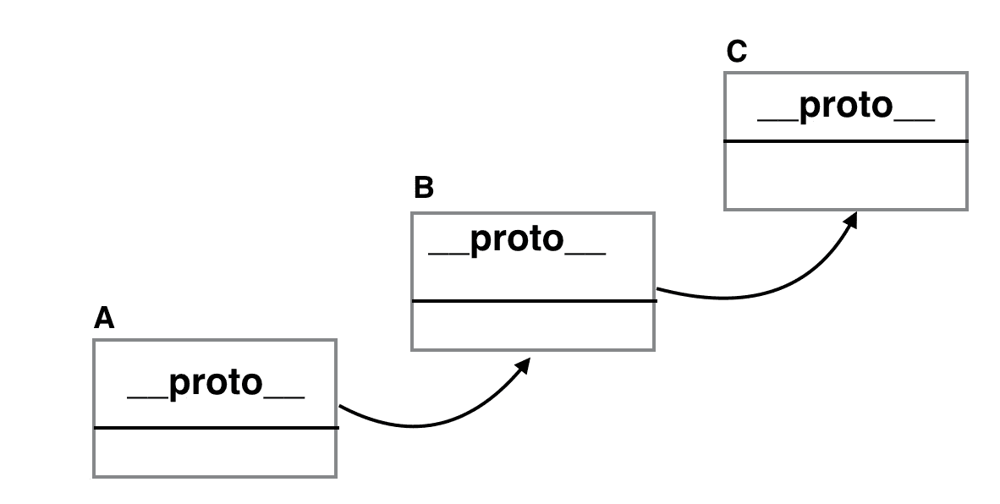
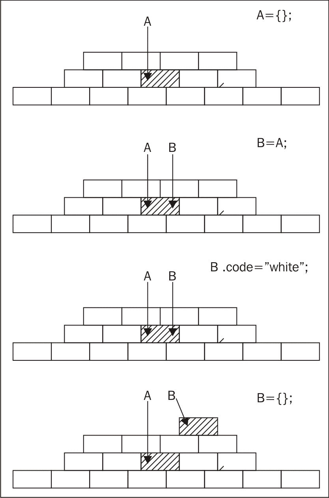
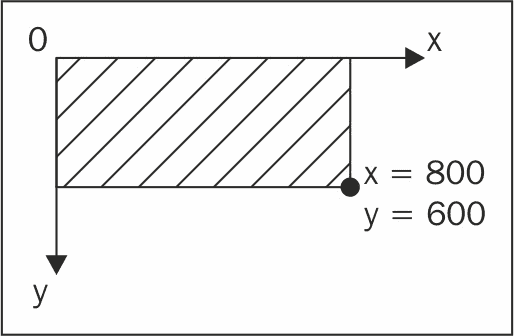
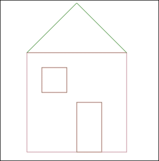

# 第七章。继承

如果您回到第一章，*面向对象的 JavaScript*，并回顾*面向对象编程*部分，您会发现您已经知道如何将其中大部分应用到 JavaScript 中。您知道对象、方法和属性是什么。您知道 ES5 中没有类，尽管您可以使用构造函数实现它们。ES6 引入了类的概念；我们将在下一章详细探讨 ES6 类的工作原理。封装？是的，对象封装了数据和操作数据的方法（方法）。聚合？当然，一个对象可以包含其他对象。事实上，这几乎总是如此，因为方法本身就是函数，而函数也是对象。

现在，让我们专注于继承部分。这是最有趣的功能之一，因为它允许您重用现有代码，从而促进懒惰，这可能是人类物种最初进入计算机编程的原因。

JavaScript 是一种动态语言，通常有多种方式可以完成任何给定的任务。继承也不例外。在本章中，您将看到一些实现继承的常见模式。对这些模式有良好的理解将帮助您根据任务、项目或风格选择正确的方法，或者选择正确的混合方式。

# 原型链

让我们从实现继承的默认方式开始——通过原型进行继承链。

如您所知，每个函数都有一个 `prototype` 属性，它指向一个对象。当使用 `new` 操作符调用函数时，会创建并返回一个对象。这个新对象有一个指向 `prototype` 对象的秘密链接。这个秘密链接（在某些环境中称为 `__proto__`）允许使用 `prototype` 对象的方法和属性，就像它们属于新创建的对象一样。

`prototype` 对象只是一个普通对象，因此它也有一个指向其原型的秘密链接。因此，就创建了一个称为原型链的链：



在这个示例中，对象 **A** 包含了许多属性。其中一个属性是隐藏的 `__proto__` 属性，它指向另一个对象，**B**。**B** 的 `__proto__` 属性指向 **C**。这个链以 `Object.prototype` 对象，即祖先对象结束，并且每个对象都继承自它。

所有这些都很重要，但它们如何帮助您呢？实用方面是，当对象 **A** 缺少属性但 **B** 有时，**A** 仍然可以访问这个属性，就像它自己的属性一样。如果 **B** 也没有所需的属性，但 **C** 有，这也适用。这就是继承发生的方式——一个对象可以访问继承链中任何地方找到的属性。

在本章中，你会看到使用以下层次结构的不同示例 - 一个通用的 `Shape` 父类被 `2D shape` 继承，而 `2D shape` 又被任何数量的特定二维形状（如三角形、矩形等）继承。

## 原型链示例

原型链是实现继承的默认方式。为了实现层次结构，让我们定义三个构造函数：

```js
    function Shape(){ 
    this.name = 'Shape'; 
    this.toString = function () { 
        return this.name; 
      }; 
    } 

    function TwoDShape(){ 
      this.name = '2D shape'; 
    } 

    function Triangle(side, height){ 
      this.name = 'Triangle'; 
      this.side = side; 
      this.height = height; 
      this.getArea = function () { 
        return this.side * this.height / 2; 
      }; 
    } 

```

执行继承魔法的代码如下：

```js
    TwoDShape.prototype = new Shape(); 
    Triangle.prototype = new TwoDShape(); 

```

这里发生了什么？你从 `TwoDShape` 的 `prototype` 属性中获取对象，而不是用单个属性增强它，而是用另一个对象完全覆盖它，这个对象是通过用 `new` 调用 `Shape()` 构造函数创建的。同样的过程也可以应用于 `Triangle` - 它的原型被用 `new TwoDShape()` 创建的对象替换。重要的是要记住，JavaScript 与对象一起工作，而不是与类一起工作。你需要使用 `new Shape()` 构造函数创建一个实例，然后你可以继承其属性；你并不是直接从 `Shape()` 继承。此外，在继承之后，你可以修改 `Shape()` 构造函数，覆盖它，甚至删除它，这将对 `TwoDShape` 没有影响，因为你所需要的就是一个用于继承的实例。

正如你在上一章所知，覆盖原型（而不是仅仅向其添加属性），会对 `constructor` 属性产生副作用。因此，在继承之后重置 `constructor` 属性是个好主意。考虑以下示例：

```js
    TwoDShape.prototype.constructor = TwoDShape; 
    Triangle.prototype.constructor = Triangle; 

```

现在，让我们测试到目前为止发生了什么。创建一个 `Triangle` 对象并调用它的 `getArea()` 方法，正如预期的那样工作：

```js
    >var my = new Triangle(5, 10); 
    >my.getArea(); 
    25 

```

尽管对象 `my` 没有自己的 `toString()` 方法，但它继承了该方法，你可以调用它。注意继承的方法 `toString()` 如何将 `this` 对象绑定到 `my`：

```js
    >my.toString(); 
    "Triangle" 

```

当你调用 `my.toString()` 时，考虑 JavaScript 引擎做了什么是非常有趣的：

+   它遍历 `my` 的所有属性，但没有找到名为 `toString()` 的方法。

+   它查看 `my.__proto__` 指向的对象，`this` 对象是在继承过程中创建的 `new TwoDShape()` 实例。

+   现在，JavaScript 引擎遍历 `TwoDShape` 的实例，但没有找到 `toString()` 方法。然后它检查那个对象的 `__proto__`。这次，`__proto__` 指向由 `new Shape()` 创建的实例。

+   检查 `new Shape()` 的实例，并最终找到 `toString()`。

+   这个方法是在 `my` 的上下文中调用的，这意味着 `this` 指向 `my`。

如果你询问 `my`，"你的构造函数是谁？"，它会正确地报告，因为继承之后`constructor`属性被重置了：

```js
    >my.constructor === Triangle; 
    true 

```

使用 `instanceof` 操作符，你可以验证 `my` 是否是所有三个构造函数的实例：

```js
    > my instanceof Shape; 
    true 
    > my instanceofTwoDShape; 
    true 
    > my instanceof Triangle; 
    true 
    > my instanceof Array; 
    false 

```

当你通过传递 `my` 调用构造函数的 `isPrototypeOf()` 时，也会发生相同的情况：

```js
    >Shape.prototype.isPrototypeOf(my); 
    true 
    >TwoDShape.prototype.isPrototypeOf(my); 
    true 
    >Triangle.prototype.isPrototypeOf(my); 
    true 
    >String.prototype.isPrototypeOf(my); 
    false 

```

您也可以使用其他两个构造函数来创建对象。使用 `new TwoDShape()` 创建的对象也会继承自 `Shape()` 的 `toString()` 方法：

```js
    >var td = new TwoDShape(); 
    >td.constructor === TwoDShape; 
    true 
    >td.toString(); 
    "2D shape" 
    >var s = new Shape(); 
    >s.constructor === Shape; 
    true 

```

## 将共享属性移动到原型

当您使用构造函数创建对象时，使用 `this` 添加自己的属性。在属性在实例之间不发生变化的情况下，这可能会效率低下。在上一个例子中，`Shape()` 被定义为如下所示：

```js
    function Shape(){ 
    this.name = 'Shape'; 
    } 

```

这意味着每次使用 `new Shape()` 创建新对象时，都会创建一个新的 `name` 属性，并将其存储在内存中的某个位置。另一种选择是将 `name` 属性添加到原型中，并在所有实例之间共享：

```js
    function Shape() {} 
    Shape.prototype.name = 'Shape'; 

```

现在，每次使用 `new Shape()` 创建对象时，该对象不会获得自己的属性 `name`，而是使用添加到原型的那个。这更有效率，但您应该只为那些从一个实例到另一个实例不发生变化的属性使用它。方法对于这种共享是理想的。

让我们通过将所有方法和合适的属性添加到 `prototype` 来改进前面的例子。在 `Shape()` 和 `TwoDShape()` 的情况下，一切都是为了共享：

```js
    // constructor 
    function Shape() {} 

    // augment prototype 
    Shape.prototype.name = 'Shape'; 
    Shape.prototype.toString = function () { 
      return this.name; 
    }; 

    // another constructor 
    function TwoDShape() {} 

    // take care of inheritance 
    TwoDShape.prototype = new Shape(); 
    TwoDShape.prototype.constructor = TwoDShape; 

    // augment prototype 
    TwoDShape.prototype.name = '2D shape'; 

```

如您所见，在增强原型之前，您必须首先处理继承。否则，您添加到 `TwoDShape.prototype` 中的任何内容，在继承时都会被清除。

`Triangle` 构造函数略有不同，因为它创建的每个对象都是一个新三角形，其尺寸可能不同。因此，保留 `side` 和 `height` 作为自己的属性，共享其余部分是好的。例如，`getArea()` 方法与每个三角形的实际尺寸无关。再次强调，您首先进行继承部分，然后增强原型：

```js
    function Triangle(side, height) { 
    this.side = side; 
    this.height = height; 
    } 
    // take care of inheritance 
    Triangle.prototype = new TwoDShape(); 
    Triangle.prototype.constructor = Triangle; 

    // augment prototype 
    Triangle.prototype.name = 'Triangle'; 
    Triangle.prototype.getArea = function () { 
    return this.side * this.height / 2; 
    }; 

```

所有的前述测试代码都完全相同。以下是一个示例：

```js
    >var my = new Triangle(5, 10); 
    >my.getArea(); 
    25 
    >my.toString(); 
    "Triangle" 

```

当调用 `my.toString()` 时，幕后只有细微的差别。差别在于，在 `Shape.prototype` 中找到该方法之前，需要多进行一次查找，而不是像上一个例子中在 `new Shape()` 实例中那样。

您还可以使用 `hasOwnProperty()` 来查看自己的属性与从原型链下来的属性之间的区别：

```js
    >my.hasOwnProperty('side'); 
    true 
    >my.hasOwnProperty('name'); 
    false 

```

前一个例子中 `isPrototypeOf()` 调用和 `instanceof` 操作符的工作方式完全相同：

```js
    >TwoDShape.prototype.isPrototypeOf(my); 
    true 
    > my instanceof Shape; 
    true 

```

# 仅继承原型

如前所述，出于效率的考虑，您应该将可重用的属性和方法添加到原型中。如果您这样做，那么只继承原型是一个好主意，因为所有可重用的代码都在那里。这意味着继承 `Shape.prototype` 对象比继承使用 `new Shape()` 创建的对象更好。毕竟，`new Shape()` 只提供了自己的形状属性，这些属性不应该被重用（否则，它们会在原型中）。通过以下方式，您可以获得一点额外的效率：

+   仅为了继承而创建新对象

+   在运行时（当搜索 `toString()` 时）查找次数更少

例如，这是更新的代码；更改已突出显示：

```js
    function Shape() {} 
    // augment prototype 
    Shape.prototype.name = 'Shape'; 
    Shape.prototype.toString = function () { 
      return this.name; 
    }; 

    function TwoDShape() {} 
    // take care of inheritance 
    TwoDShape.prototype = Shape.prototype; 
    TwoDShape.prototype.constructor = TwoDShape; 
    // augment prototype 
    TwoDShape.prototype.name = '2D shape'; 

    function Triangle(side, height) { 
      this.side = side; 
      this.height = height; 
    } 

    // take care of inheritance 
    Triangle.prototype = TwoDShape.prototype; 
    Triangle.prototype.constructor = Triangle; 
    // augment prototype 
    Triangle.prototype.name = 'Triangle'; 
    Triangle.prototype.getArea = function () { 
      return this.side * this.height / 2; 
    }; 

```

测试代码给出相同的结果：

```js
    >var my = new Triangle(5, 10); 
    >my.getArea(); 
    25 
    >my.toString(); 
    "Triangle" 

```

当调用 `my.toString()` 时，查找有什么不同？首先，像往常一样，JavaScript 引擎会查找 `my` 对象自身的 `toString()` 方法。引擎没有找到这样的方法，因此它检查原型。结果原型指向的对象与 `TwoDShape` 的原型指向的对象相同，也指向 `Shape.prototype` 指向的对象。记住，对象不是按值复制，而是按引用复制。因此，查找过程只有两步，而不是之前的四个（在先前的例子中）或三个（在第一个例子中）。

简单地复制原型更高效，但它有一个副作用，因为所有子类和父类的原型都指向同一个对象，当子类修改原型时，父类会接收到这些更改，以及兄弟姐妹也会。

看看以下行：

```js
    Triangle.prototype.name = 'Triangle'; 

```

它改变了 `name` 属性，因此实际上也改变了 `Shape.prototype.name`。如果您使用 `new Shape()` 创建一个实例，它的 `name` 属性会显示 `"Triangle"`：

```js
    >var s = new Shape(); 
    >s.name; 
    "Triangle" 

```

此方法更高效，但可能不适合所有您的用例。

## 一个临时的构造函数 - new F()

解决之前概述的问题（即所有原型都指向同一个对象，并且父类会接收到子类的属性）的一种方法是使用中介来断开链。中介的形式是一个临时的构造函数。创建一个空的函数 `F()` 并将其 `prototype` 设置为父构造函数的原型，允许您调用 `new F()` 并创建没有任何自身属性但继承父类 `prototype` 的对象。

让我们看看修改后的代码：

```js
    function Shape() {} 
    // augment prototype 
    Shape.prototype.name = 'Shape'; 
    Shape.prototype.toString = function () { 
    return this.name; 
    }; 

    function TwoDShape() {} 
    // take care of inheritance 
    var F = function () {}; 
    F.prototype = Shape.prototype; 
    TwoDShape.prototype = new F(); 
    TwoDShape.prototype.constructor = TwoDShape; 
    // augment prototype 
    TwoDShape.prototype.name = '2D shape'; 

    function Triangle(side, height) { 
    this.side = side; 
    this.height = height; 
    } 

    // take care of inheritance 
    var F = function () {}; 
    F.prototype = TwoDShape.prototype; 
    Triangle.prototype = new F(); 
    Triangle.prototype.constructor = Triangle; 
    // augment prototype 
    Triangle.prototype.name = 'Triangle'; 
    Triangle.prototype.getArea = function () { 
    return this.side * this.height / 2; 
    }; 

```

创建 `my` 三角形并测试方法：

```js
    >var my = new Triangle(5, 10); 
    >my.getArea(); 
    25 
    >my.toString(); 
    "Triangle" 

```

使用这种方法，原型链保持不变：

```js
    >my.__proto__ === Triangle.prototype; 
    true 
    >my.__proto__.constructor === Triangle; 
    true 
    >my.__proto__.__proto__ === TwoDShape.prototype; 
    true 
    >my.__proto__.__proto__.__proto__.constructor === Shape; 
    true 

```

此外，父类的属性不会被子类覆盖：

```js
    >var s = new Shape(); 
    >s.name; 
    "Shape" 
    >"I am a " + new TwoDShape(); // calling toString() 
    "I am a 2D shape" 

```

同时，这种方法支持这样一个观点：只有添加到原型的属性和方法应该被继承，而自身的属性则不应该被继承。背后的理由是，自身的属性可能过于特定，难以复用。

# Uber - 从子对象访问父对象

经典的面向对象语言通常有特殊的语法，可以让你访问父类，也称为超类。当子类想要有一个执行父类方法所有操作，并在此基础上添加额外操作的方法时，这可能很方便。在这种情况下，子类会调用具有相同名称的父类方法，并处理结果。

在 JavaScript 中，没有这样的特殊语法，但实现相同功能很简单。让我们重写最后一个例子，同时注意继承，并创建一个指向父类 `prototype` 对象的 `uber` 属性：

```js
    function Shape() {} 
    // augment prototype 
    Shape.prototype.name = 'Shape'; 
    Shape.prototype.toString = function () { 
    var const = this.constructor; 
    returnconst.uber 
        ? this.const.uber.toString() + ', ' + this.name 
        : this.name; 
    }; 

    function TwoDShape() {} 
    // take care of inheritance 
    var F = function () {}; 
    F.prototype = Shape.prototype; 
    TwoDShape.prototype = new F(); 
    TwoDShape.prototype.constructor = TwoDShape; 
    TwoDShape.uber = Shape.prototype; 
    // augment prototype 
    TwoDShape.prototype.name = '2D shape'; 

    function Triangle(side, height) { 
    this.side = side; 
    this.height = height; 
    } 

    // take care of inheritance 
    var F = function () {}; 
    F.prototype = TwoDShape.prototype; 
    Triangle.prototype = new F(); 
    Triangle.prototype.constructor = Triangle; 
    Triangle.uber = TwoDShape.prototype; 
    // augment prototype 
    Triangle.prototype.name = 'Triangle'; 
    Triangle.prototype.getArea = function () { 
    return this.side * this.height / 2; 
    }; 

```

这里的新特性包括：

+   新的 `uber` 属性指向父对象的 `prototype`

+   更新的 `toString()` 方法

之前，`toString()` 只返回 `this.name`。现在，除了这个之外，还有一个检查来查看 `this.constructor.uber` 是否存在，如果存在，则首先调用它的 `toString()`。`this.constructor` 是函数本身，`this.constructor.uber` 指向父对象的 `prototype`。结果是，当你为 `Triangle` 实例调用 `toString()` 时，原型链上的所有 `toString()` 方法都会被调用：

```js
    >var my = new Triangle(5, 10); 
    >my.toString(); 
    "Shape, 2D shape, Triangle" 

```

`uber` 属性的名称原本可以是 superclass，但这会暗示 JavaScript 有类。理想情况下，它可以是 super（就像 Java 一样），但 super 是 JavaScript 中的一个保留字。Douglas Crockford 提出的德语词 uber 大约意味着与 super 相同的意思，而且你必须承认，它听起来超级酷。

# 将继承部分隔离到函数中

让我们把处理所有继承细节的代码从上一个例子移动到一个可重用的 `extend()` 函数中：

```js
    function extend(Child, Parent) { 
    var F = function () {}; 
    F.prototype = Parent.prototype; 
    Child.prototype = new F(); 
    Child.prototype.constructor = Child; 
    Child.uber = Parent.prototype; 
    } 

```

使用这个函数（或你自己的自定义版本）可以帮助你保持代码的整洁，特别是关于重复的继承相关任务。这样，你只需使用以下两行代码就可以继承：

```js
    extend(TwoDShape, Shape); 
    extend(Triangle, TwoDShape); 

```

让我们看看一个完整的例子：

```js
    // inheritance helper 
    function extend(Child, Parent) { 
      var F = function () {}; 
      F.prototype = Parent.prototype; 
      Child.prototype = new F(); 
      Child.prototype.constructor = Child; 
      Child.uber = Parent.prototype; 
    } 

    // define -> augment 
    function Shape() {} 
    Shape.prototype.name = 'Shape'; 
    Shape.prototype.toString = function () { 
      return this.constructor.uber 
        ? this.constructor.uber.toString() + ', ' + this.name 
        : this.name; 
    }; 

    // define -> inherit -> augment 
    function TwoDShape() {} 
    extend(TwoDShape, Shape); 
    TwoDShape.prototype.name = '2D shape'; 

    // define 
    function Triangle(side, height) { 
      this.side = side; 
      this.height = height; 
    } 
    // inherit 
    extend(Triangle, TwoDShape); 
    // augment 
    Triangle.prototype.name = 'Triangle'; 
    Triangle.prototype.getArea = function () { 
      return this.side * this.height / 2; 
    }; 

```

让我们测试以下代码：

```js
    > new Triangle().toString(); 
    "Shape, 2D shape, Triangle" 

```

# 复制属性

现在，让我们尝试一种稍微不同的方法。既然继承全部是关于代码重用，你能否简单地从一个对象复制你喜欢的属性到另一个对象？或者从父对象到子对象？保持与前面的 `extend()` 函数相同的接口，你可以创建一个 `extend2()` 函数，它接受两个构造函数并将父对象的 `prototype` 中的所有属性复制到子对象的 `prototype` 中。当然，这也会携带方法，因为方法只是碰巧是函数的属性：

```js
    function extend2(Child, Parent) { 
      var p = Parent.prototype; 
      var c = Child.prototype; 
      for (var i in p) { 
        c[i] = p[i]; 
      } 
      c.uber = p; 
    } 

```

如你所见，只需简单地遍历属性即可。与前面的例子一样，如果你想从子对象方便地访问父对象的方法，可以设置一个 `uber` 属性。然而，与前面的例子不同，没有必要重置 `Child.prototype.constructor`，因为在这里，子 `prototype` 是被增强，而不是完全覆盖。所以，`constructor` 属性指向初始值。

与之前的方法相比，这个方法在效率上略低，因为子 `prototype` 的属性是在执行期间被复制的，而不是简单地通过原型链查找。请注意，这仅适用于包含原始类型的属性。所有对象（包括函数和数组）都不会被复制，因为这些是通过引用传递的。

让我们看看使用两个构造函数 `Shape()` 和 `TwoDShape()` 的一个例子。`Shape()` 函数的 `prototype` 对象包含一个原始属性 `name` 和一个非原始属性，即 `toString()` 方法：

```js
    var Shape = function () {}; 
    var TwoDShape = function () {}; 
    Shape.prototype.name = 'Shape'; 
    Shape.prototype.toString = function () { 
      return this.uber 
        ? this.uber.toString() + ', ' + this.name 
        : this.name; 
    }; 

```

如果你使用 `extend()` 继承，使用 `TwoDShape()` 创建的对象及其原型都不会获得自己的 `name` 属性，但它们可以访问它们继承的属性：

```js
    > extend(TwoDShape, Shape); 
    >var td = new TwoDShape(); 
    >td.name; 
    "Shape" 
    >TwoDShape.prototype.name; 
    "Shape" 
    >td.__proto__.name; 
    "Shape" 
    >td.hasOwnProperty('name'); 
    false 
    > td.__proto__.hasOwnProperty('name'); 
    false 

```

然而，如果你使用 `extend2()` 继承，`TwoDShape()` 的原型会获得 `name` 属性的自己的副本。它也会获得自己的 `toString()` 副本，但这是一个引用，所以函数不会再次创建：

```js
    >extend2(TwoDShape, Shape); 
    >var td = new TwoDShape(); 
    > td.__proto__.hasOwnProperty('name'); 
    true 
    > td.__proto__.hasOwnProperty('toString'); 
    true 
    > td.__proto__.toString === Shape.prototype.toString; 
    true 

```

如你所见，两个 `toString()` 方法是同一个函数对象。这是好事，因为它意味着不会创建不必要的重复方法。

因此，可以说 `extend2()` 比起 `extend()` 效率更低，因为它重新创建了原型的属性。然而，这并不那么糟糕，因为只有原始数据类型被复制。此外，这在原型链查找期间是有益的，因为找到属性之前需要遵循的链链接更少。

再次看看 `uber` 属性。这次，为了改变一下，它被设置在 `Parent` 对象的原型 `p` 上，而不是在 `Parent` 构造函数上。这就是为什么 `toString()` 使用 `this.uber` 而不是 `this.constructor.uber` 作为 `this.uber` 的原因。这只是一个说明，你可以以任何你想要的方式塑造你喜欢的继承模式。让我们来测试一下：

```js
    >td.toString(); 
    "Shape, Shape" 

```

`TwoDShape` 没有重新定义 `name` 属性，因此出现了重复。它可以在任何时候这样做，并且（由于原型链是活跃的）所有实例都会看到更新：

```js
    >TwoDShape.prototype.name = "2D shape"; 
    >td.toString(); 
    "Shape, 2D shape" 

```

# 注意在通过引用复制时的操作

由于对象（包括函数和数组）是通过引用进行复制的，这有时可能会导致你意想不到的结果。

让我们创建两个构造函数，并将属性添加到第一个函数的原型上：

```js
    > function Papa() {} 
    >function Wee() {} 
    >Papa.prototype.name = 'Bear';  
    >Papa.prototype.owns = ["porridge", "chair", "bed"]; 

```

现在，让我们让 `Wee` 从 `Papa` 继承（无论是 `extend()` 还是 `extend2()` 都可以）：

```js
    >extend2(Wee, Papa); 

```

使用 `extend2()`，`Wee` 函数的原型继承了 `Papa.prototype` 的属性作为它自己的属性：

```js
    >Wee.prototype.hasOwnProperty('name'); 
    true 
    >Wee.prototype.hasOwnProperty('owns'); 
    true 

```

`name` 属性是原始类型，因此会创建一个新的副本。`owns` 属性是一个数组对象，所以它是通过引用进行复制的：

```js
    >Wee.prototype.owns; 
    ["porridge", "chair", "bed"] 
    >Wee.prototype.owns=== Papa.prototype.owns; 
    true 

```

修改 `Wee` 函数的 `name` 副本不会影响 `Papa`：

```js
    >Wee.prototype.name += ', Little Bear'; 
    "Bear, Little Bear" 
    >Papa.prototype.name; 
    "Bear" 

```

然而，修改 `Wee` 函数的 `owns` 属性会影响 `Papa`，因为这两个属性都指向内存中的同一个数组：

```js
    >Wee.prototype.owns.pop(); 
    "bed" 
    >Papa.prototype.owns; 
    ["porridge", "chair"] 

```

当你完全覆盖 `Wee` 函数的 `owns` 副本为另一个对象（而不是修改现有的一个）时，情况就不同了。在这种情况下，`Papa.owns` 继续指向旧对象，而 `Wee.owns` 指向一个新的对象：

```js
    >Wee.prototype.owns= ["empty bowl", "broken chair"]; 
    >Papa.prototype.owns.push('bed'); 
    >Papa.prototype.owns; 
    ["porridge", "chair", "bed"] 

```

将对象想象成在内存中某个物理位置创建和存储的东西。变量和属性仅仅指向这个位置，所以当你将一个全新的对象赋值给 `Wee.prototype.owns` 时，你本质上是在说——嘿，忘了这个其他旧对象，把你的指针移动到这个新对象上。

以下图表说明了如果你想象内存是一个堆叠的对象（就像一堵砖墙）并且你指向（引用）其中的一些对象会发生什么：

+   创建了一个新对象，并且 **A** 指向它。

+   创建了一个新的变量 **B** 并将其设置为等于 **A**，这意味着它现在指向 **A** 指向的地方。

+   使用 **B** 处理器（指针）更改属性颜色。砖现在变白了。对 `A.color === "white"` 的检查将是真实的。

+   创建了一个新对象，并且将 **B** 变量/指针回收以指向那个新对象。现在 **A** 和 **B** 指向内存堆的不同部分。它们没有任何共同点，对其中一个的更改不会影响另一个：



如果你想要解决对象通过引用复制的问题，可以考虑稍后在章节中描述的深度复制。

# 对象继承自对象

本章迄今为止的所有示例都假设你使用构造函数创建对象，并且你希望使用一个构造函数创建的对象继承来自另一个构造函数的属性。然而，你也可以不使用构造函数的帮助，仅使用对象字面量来创建对象，这实际上更少打字。那么，如何继承这些属性呢？

在 Java 或 PHP 中，你定义类并让它们继承自其他类。这就是为什么你会看到“经典”这个词，因为面向对象的功能来自于类的使用。在 JavaScript 中，没有类，所以来自经典背景的程序员会求助于构造函数，因为构造函数是他们最熟悉的。此外，JavaScript 提供了 `new` 操作符，这进一步暗示 JavaScript 类似于 Java。事实是，最终，一切都归结于对象。本章的第一个例子使用了这种语法：

```js
    Child.prototype = new Parent(); 

```

在这里，`Child` 构造函数（或者如果你愿意，类）从 `Parent` 继承。然而，这是通过使用 `new Parent()` 创建一个对象并从中继承来完成的。这就是为什么这也被称为 **伪经典继承模式**，因为它类似于经典继承，尽管它不是（没有涉及类）。

那么，为什么不摆脱中间人（构造函数/类）而直接让对象继承自对象呢？在 `extend2()` 中，父 `prototype` 对象的属性被复制为子 `prototype` 对象的属性。这两个原型本质上只是对象。忘记原型和构造函数，你可以简单地取一个对象并将其所有属性复制到另一个对象中。

你已经知道对象可以从一个没有任何自身属性的空白画布开始，使用 `var o = {};`，然后后来再添加属性。然而，你不必从头开始，你可以通过复制现有对象的所有属性来开始。这里有一个执行这一操作的确切函数：它接受一个对象并返回它的一个新副本：

```js
    function extendCopy(p) { 
      var c = {}; 
      for (var i in p) { 
        c[i] = p[i]; 
      } 
      c.uber = p; 
      return c; 
    } 

```

简单地复制所有属性是一个直接的模式，并且它被广泛使用。让我们看看这个函数的实际效果。你首先有一个基础对象：

```js
    var shape = { 
    name: 'Shape', 
    toString: function () { 
    return this.name; 
    } 
    }; 

```

为了创建一个基于旧对象的新对象，你可以调用 `extendCopy()` 函数，它返回一个新的对象。然后，你可以通过添加额外的功能来增强这个新对象：

```js
    var twoDee = extendCopy(shape); 
    twoDee.name = '2D shape'; 
    twoDee.toString = function () { 
    return this.uber.toString() + ', ' + this.name; 
    }; 

```

这里有一个继承自 `2D shape` 对象的三角形对象：

```js
    var triangle = extendCopy(twoDee); 
    triangle.name = 'Triangle'; 
    triangle.getArea = function () { 
    return this.side * this.height / 2; 
    }; 

```

例如，使用三角形：

```js
    >triangle.side = 5; 
    >triangle.height = 10; 
    >triangle.getArea(); 
    25 
    >triangle.toString(); 
    "Shape, 2D shape, Triangle" 

```

这种方法的可能缺点是初始化新的 `triangle` 对象的方式有些冗长，你必须手动设置 `side` 和 `height` 的值，而不是将它们作为值传递给构造函数。然而，这可以通过有一个函数来解决，例如，称为 `init()`（如果你来自 PHP，则称为 `__construct()`），它充当构造函数并接受初始化参数。或者，让 `extendCopy()` 接受两个参数，一个要继承的对象和另一个要在返回之前添加到副本中的对象字面量属性。换句话说，就是合并两个对象。

# 深拷贝

之前讨论的 `extendCopy()` 函数创建了一个浅拷贝的对象，就像之前的 `extend2()`。浅拷贝的相反自然是深拷贝。正如之前所讨论的（在本章的 *拷贝引用时的注意事项* 部分中），当你复制对象时，你只复制对象存储在内存中的位置的指针。这就是浅拷贝发生的情况。如果你修改了副本中的对象，你也会修改原始对象。深拷贝避免了这个问题。

深拷贝的实现方式与浅拷贝相同——你遍历属性并将它们逐个复制。然而，当你遇到指向对象的属性时，你会再次调用 `deepcopy` 函数：

```js
    function deepCopy(p, c) { 
      c = c || {}; 
      for (var i in p) { 
        if (p.hasOwnProperty(i)) { 
          if (typeof p[i] === 'object') { 
            c[i] = Array.isArray(p[i]) ? [] : {}; 
    deepCopy(p[i], c[i]); 
          } else { 
            c[i] = p[i]; 
          } 
        } 
      } 
      return c; 
    } 

```

让我们创建一个具有数组和子对象属性的对象：

```js
    var parent = { 
      numbers: [1, 2, 3], 
      letters: ['a', 'b', 'c'], 
      obj: { 
        prop: 1 
      }, 
      bool: true 
    }; 

```

让我们通过创建一个深拷贝和一个浅拷贝来测试这一点。与浅拷贝不同，当你更新深拷贝的 `numbers` 属性时，原始对象不会受到影响：

```js
    >var mydeep = deepCopy(parent); 
    >var myshallow = extendCopy(parent); 
    >mydeep.numbers.push(4,5,6); 
    6 
    >mydeep.numbers; 
    [1, 2, 3, 4, 5, 6] 
    >parent.numbers; 
    [1, 2, 3] 
    >myshallow.numbers.push(10); 
    4 
    >myshallow.numbers; 
    [1, 2, 3, 10] 
    >parent.numbers; 
    [1, 2, 3, 10] 
    >mydeep.numbers; 
    [1, 2, 3, 4, 5, 6] 

```

关于 `deepCopy()` 函数的两个注意事项：

+   使用 `hasOwnProperty()` 过滤掉非自身属性总是一个好主意，以确保你不会将某人的添加应用到核心原型上。

+   `Array.isArray()` 自从 ES5 以来就存在，因为否则很难区分真正的数组和对象。如果你需要在 ES3 浏览器中定义 `isArray()`，那么最好的跨浏览器解决方案看起来有点像黑客手段，但它有效：

    ```js
        if (Array.isArray !== "function") { 
        Array.isArray = function (candidate) { 
            return  
        Object.prototype.toString.call(candidate) ===  
        '[object Array]'; 
        }; 
        } 

    ```

# 使用 object() 方法

基于对象继承自对象的想法，道格拉斯·克罗克福德提倡使用一个接受对象并返回一个新的具有父对象作为原型的 `object()` 函数：

```js
    function object(o) { 
    function F() {} 
    F.prototype = o; 
    return new F(); 
    } 

```

如果你需要访问一个 `uber` 属性，你可以按如下方式修改 `object()` 函数：

```js
    function object(o) { 
    var n; 
    function F() {} 
    F.prototype = o; 
    n = new F(); 
    n.uber = o; 
    return n; 
    } 

```

使用 `this` 函数与使用 `extendCopy()` 函数相同，你从一个对象，例如 `twoDee`，创建一个新的对象，然后继续增强这个新对象：

```js
    var triangle = object(twoDee); 
    triangle.name = 'Triangle'; 
    triangle.getArea = function () { 
    return this.side * this.height / 2; 
    }; 

```

新的三角形仍然以相同的方式表现：

```js
    >triangle.toString(); 
    "Shape, 2D shape, Triangle" 

```

这种模式也被称为**原型继承**，因为你可以使用父对象作为子对象的原型。它也被 ES5 采用并扩展，称为`Object.create()`。以下是一个示例：

```js
    >var square = Object.create(triangle); 

```

# 使用原型继承和复制属性的混合

当你使用继承时，你很可能会想要使用已经存在的功能，并在其基础上进行扩展。这意味着通过从一个现有对象继承并添加额外的方法和属性来创建一个新的对象。你可以通过一个函数调用，使用前面讨论的最后两种方法的组合来实现这一点。

你可以：

+   使用原型继承将现有对象作为新对象的原型

+   将另一个对象的全部属性复制到新创建的对象中：

    ```js
        function objectPlus(o, stuff) { 
          var n; 
          function F() {} 
          F.prototype = o; 
          n = new F(); 
          n.uber = o; 

         for (var i in stuff) { 
            n[i] = stuff[i]; 
            } 
          return n; 
        } 

    ```

这个函数接受一个要继承的对象`o`和另一个具有要复制的额外方法和属性的对象`stuff`。让我们看看它是如何工作的。

从一个基本的`shape`对象开始：

```js
    var shape = { 
    name: 'Shape', 
    toString: function () { 
    return this.name; 
    } 
    }; 

```

通过继承形状并添加更多属性来创建一个二维对象。额外的属性只是用对象字面量创建的：

```js
    var twoDee = objectPlus(shape, { 
      name: '2D shape', 
      toString: function () { 
        return this.uber.toString() + ', ' + this.name; 
      } 
    }); 

```

现在，让我们创建一个继承自 2D 并添加更多属性的`triangle`对象：

```js
    var triangle = objectPlus(twoDee, { 
      name: 'Triangle', 
      getArea: function () { return this.side * this.height / 2; 
     }, 
      side: 0, 
      height: 0 
    }); 

```

你可以通过创建一个具有定义的`side`和`height`的具象三角形`my`来测试这一切是如何工作的：

```js
    var my = objectPlus(triangle, { 
      side: 4, height: 4 
    }); 
    >my.getArea(); 
    8 
    >my.toString(); 
    "Shape, 2D shape, Triangle, Triangle" 

```

在这里的不同之处在于，当执行`toString()`时，`Triangle`名称会重复两次。这是因为具体的实例是通过继承`triangle`创建的，所以有另一个继承层级。你可以给这个新实例一个名字：

```js
    >objectPlus(triangle, { 
      side: 4,  
      height: 4, 
      name: 'My 4x4' 
    }).toString(); 
    "Shape, 2D shape, Triangle, My 4x4" 

```

这个`objectPlus()`函数甚至更接近 ES5 的`Object.create();`，只是 ES5 的那个使用某种称为属性描述符的东西（在附录 C, *内置对象*中讨论）来获取额外的属性。

# 多重继承

多重继承是指一个子对象从多个父对象继承。一些面向对象的语言默认支持多重继承，而另一些则不支持。你可以从两个角度进行争论，即多重继承既方便又没有必要，它会使应用程序设计复杂化，最好使用继承链。关于多重继承的优缺点，我们留待漫长的寒冷冬夜再讨论，现在让我们看看如何在 JavaScript 中实际操作。

实现可以像通过复制属性继承的概念一样简单，只是将其扩展到可以继承无限数量的输入对象。

让我们创建一个`multi()`函数，该函数接受任意数量的输入对象。你可以将复制属性的循环包裹在另一个循环中，该循环遍历传递给函数的所有作为`arguments`的对象：

```js
    function multi() { 
      var n = {}, stuff, j = 0, len = arguments.length; 
      for (j = 0; j <len; j++) { 
        stuff = arguments[j]; 
        for (var i in stuff) { 
          if (stuff.hasOwnProperty(i)) { 
            n[i] = stuff[i]; 
          } 
        } 
      } 
      return n; 
    } 

```

让我们通过创建三个对象——`shape`、`twoDee`和第三个未命名的对象来测试这一点。然后，创建一个`triangle`对象意味着调用`multi()`并传递所有三个对象：

```js
    var shape = { 
      name: 'Shape', 
      toString: function () { 
        return this.name; 
      } 
    }; 

    var twoDee = { 
      name: '2D shape', 
      dimensions: 2 
    }; 

    var triangle = multi(shape, twoDee, { 
      name: 'Triangle', 
      getArea: function () { 
        return this.side * this.height / 2; 
      }, 
      side: 5, 
      height: 10 
    }); 

```

这行得通吗？让我们看看。`getArea()` 方法应该是一个自有属性，`dimensions` 应该来自 `twoDee`，而 `toString()` 应该来自 `shape`：

```js
    >triangle.getArea(); 
    25 
    >triangle.dimensions; 
    2 
    >triangle.toString(); 
    "Triangle" 

```

请记住，`multi()` 方法按照输入对象出现的顺序遍历它们，如果其中两个对象具有相同的属性，则最后一个获胜。

## 混合

你可能会遇到术语 mixin。将 mixin 想象成一个提供一些有用功能但不是旨在被子对象继承和扩展的对象。之前概述的多种继承方法可以被认为是 mixin 想法的实现。当你创建一个新的对象时，你可以挑选并选择任何其他对象将其混合到你的新对象中。通过将它们全部传递给 `multi()`，你就可以获得它们的所有功能，而无需使它们成为继承树的一部分。

# 寄生继承

如果你喜欢 JavaScript 中实现继承的多种方式，并且渴望更多，这里还有一个。这个模式，由 Douglas Crockford 提供，被称为寄生继承。它涉及到一个函数通过将另一个对象的所有功能都带到新对象中，增强新对象，并返回它，假装它已经完成了所有工作。

这里有一个普通对象，使用对象字面量定义，并且不知道它很快将成为寄生行为的受害者：

```js
    var twoD = { 
      name: '2D shape', 
      dimensions: 2 
    }; 

```

创建 `triangle` 对象的函数可能包括：

+   使用 `twoD` 对象作为名为该（类似于 this 以方便起见）的对象的原型。这可以通过任何你之前看到的方式完成，例如，使用 `object()` 函数或复制所有属性。

+   增加更多属性。

+   返回 `that`：

    ```js
            function triangle(s, h) { 
              var that = object(twoD); 
              that.name ='Triangle'; 
              that.getArea = function () { 
                return this.side * this.height / 2; 
              }; 
              that.side = s; 
              that.height = h; 
              return that; 
            } 

    ```

因为 `triangle()` 是一个普通函数，而不是构造函数，它不需要 `new` 操作符。然而，因为它返回一个对象，所以错误地使用 `new` 也可以：

```js
    >var t = triangle(5, 10); 
   >t.dimensions; 
    2 
    >var t2 = new triangle(5,5); 
    >t2.getArea(); 
    12.5 

```

注意，`that` 只是一个名字，它没有特殊含义，就像 `this` 一样。

# 借用构造函数

实现继承的另一种方式（章节中的最后一个，我保证）再次与构造函数有关，而不是直接与对象有关。在这个模式中，子构造函数使用 `call()` 或 `apply()` 方法调用父构造函数。如果你想更微妙一些，这可以被称为**偷取构造函数**或**通过借用构造函数进行继承**。

在第四章 *对象* 中讨论了 `call()` 和 `apply()` 方法，但这里是一个复习；它们允许你调用一个函数并传递一个对象，该对象应该绑定到函数的 `this` 值。因此，为了继承的目的，子构造函数调用父构造函数并将新创建的子 `this` 对象绑定到父的 `this`。

让我们有一个这个父构造函数 `Shape()`：

```js
    function Shape(id) { 
      this.id = id; 
    } 
    Shape.prototype.name = 'Shape'; 
    Shape.prototype.toString = function () { 
      return this.name; 
    }; 

```

现在，让我们定义 `Triangle()`，它使用 `apply()` 来调用 `Shape()` 构造函数，传递 `this`（使用 `new Triangle()` 创建的实例）和任何额外的参数：

```js
   function Triangle() { 
    Shape.apply(this, arguments); 
    } 
    Triangle.prototype.name = 'Triangle'; 

```

注意，`Triangle()` 和 `Shape()` 都已经向它们的原型添加了一些额外的属性。

现在，让我们通过创建一个新的 `triangle` 对象来测试：

```js
    >var t = new Triangle(101); 
    >t.name; 
    "Triangle" 

```

新的 `triangle` 对象从父类继承了 `id` 属性，但它没有继承添加到父类 `prototype` 中的任何内容：

```js
    >t.id; 
    101 
    >t.toString(); 
    "[object Object]" 

```

三角形未能获取 `Shape` 函数的原型属性，因为没有创建 `new Shape()` 实例，所以原型从未被使用。然而，你已经在本章的开头看到了如何做到这一点。你可以如下重新定义 `Triangle`：

```js
    function Triangle() { 
      Shape.apply(this, arguments); 
    } 
    Triangle.prototype = new Shape(); 
    Triangle.prototype.name = 'Triangle'; 

```

在这种继承模式中，父类的自有属性被重新创建为子类的自有属性。如果一个子类继承了一个数组或其他对象，它将是一个全新的值（而不是引用），修改它不会影响父类。

缺点是父构造函数被调用了两次——一次是使用 `apply()` 来继承自有属性，一次是使用 `new` 来继承原型。实际上，父类的自有属性被继承了两次。让我们考虑这个简化的场景：

```js
    function Shape(id) { 
      this.id = id; 
    } 
    function Triangle() { 
      Shape.apply(this, arguments); 
    } 
    Triangle.prototype = new Shape(101); 

```

这里，我们将创建一个新的实例：

```js
    >var t = new Triangle(202); 
    >t.id; 
    202 

```

有一个自有属性 `id`，但还有一个从原型链下来的属性，准备闪耀：

```js
    >t.__proto__.id; 
    101 
    > delete t.id; 
    true 
    >t.id; 
    101 

```

## 借用一个构造函数并复制其原型

调用构造函数两次导致的双重工作问题可以很容易地纠正。你可以在父构造函数上调用 `apply()` 来获取所有自有属性，然后通过简单的迭代（或之前讨论过的 `extend2()`）来复制原型属性：

```js
    function Shape(id) { 
      this.id = id; 
    } 
    Shape.prototype.name = 'Shape'; 
    Shape.prototype.toString = function () { 
      return this.name; 
    }; 

    function Triangle() { 
      Shape.apply(this, arguments); 
    } 
    extend2(Triangle, Shape); 
    Triangle.prototype.name = 'Triangle'; 

```

让我们测试以下代码：

```js
   >var t = new Triangle(101); 
    >t.toString(); 
    "Triangle" 
    >t.id; 
    101 

```

没有双重继承：

```js
    >typeoft.__proto__.id; 
    "undefined" 

```

`extend2()` 方法也提供了访问 `uber` 的权限，如果需要的话：

```js
    >t.uber.name; 
    "Shape" 

```

# 案例研究 - 绘制形状

让我们以一个更实际的例子来结束这一章，这个例子展示了如何使用继承。任务是能够计算不同形状的面积和周长，同时尽可能重用代码。

## 分析

让我们有一个包含所有公共部分的 `Shape` 构造函数。然后，让我们有 `Triangle`、`Rectangle` 和 `Square` 构造函数，它们都从 `Shape` 继承。一个正方形实际上是一个具有相同长度边的矩形，所以当构建 `Square` 时我们可以重用 `Rectangle`。

为了定义一个形状，你需要具有 `x` 和 `y` 坐标的点。一个通用的形状可以具有任意数量的点。三角形由三个点定义，为了简化，矩形只有一个点和边的长度。任何形状的周长是其边长的总和。计算面积是形状特定的，将由每个形状实现。

`Shape` 中的共同功能会是：

+   一个可以给定点绘制任何形状的 `draw()` 方法

+   一个 `getParameter()` 方法

+   一个包含 `points` 数组的属性

+   根据需要添加其他方法和属性

对于绘图部分，让我们使用一个`<canvas>`标签。它不支持早期的 IE，但嘿，这只是一个练习。

让我们有两个其他辅助构造函数——`Point`和`Line`。`Point`在定义形状时会有所帮助。`Line`将使计算更容易，因为它可以给出连接任意两个给定点的线的长度。

你可以在[`www.phpied.com/files/canvas/`](http://www.phpied.com/files/canvas/)上玩一个可工作的示例。只需打开你的控制台，然后像你一会儿看到的那样创建新的形状。

## 实现

让我们从向空白 HTML 页面添加一个`canvas`标签开始：

```js
    <canvas height="600" width="800" id="canvas" /> 

```

然后，将 JavaScript 代码放在`<script>`标签内：

```js
    <script> 
    // ... code goes here 
    </script> 

```

现在，让我们看看 JavaScript 部分的内容。首先是辅助`Point`构造函数。它不能比以下更简单了：

```js
    function Point(x, y) { 
      this.x = x; 
      this.y = y; 
    } 

```

请记住，`canvas`上点的坐标从`x=0`，`y=0`开始，这是左上角。右下角将是`x = 800`，`y = 600`：



接下来是`Line`构造函数。它接受两个点，并使用勾股定理计算它们之间的线长（想象一个直角三角形，其中斜边连接两个给定的点）：*a² + b² = c²*（想象一个直角三角形，其中斜边连接两个给定的点）：

```js
    function Line(p1, p2) { 
      this.p1 = p1; 
      this.p2 = p2; 
      this.length = Math.sqrt( 
      Math.pow(p1.x - p2.x, 2) + 
      Math.pow(p1.y - p2.y, 2) 
      ); 
    } 

```

接下来是`Shape`构造函数。形状将拥有它们自己的点（以及连接它们的线）作为自己的属性。构造函数还调用一个初始化方法`init()`，该方法将在原型中定义：

```js
    function Shape() { 
      this.points = []; 
      this.lines= []; 
      this.init(); 
    } 

```

现在，重要的部分——`Shape.prototype`的方法。让我们使用对象字面量表示法定义所有这些方法。请参考注释以了解每个方法的作用：

```js
    Shape.prototype = { 
      // reset pointer to constructor 
      constructor: Shape, 

      // initialization, sets this.context to point 
      // to the context if the canvas object 
      init: function () { 
        if (this.context === undefined) { 
          var canvas = document.getElementById('canvas'); 
          Shape.prototype.context = canvas.getContext('2d'); 
        } 
      }, 

      // method that draws a shape by looping through this.points 
      draw: function () { 
        var i, ctx = this.context; 
        ctx.strokeStyle = this.getColor(); 
        ctx.beginPath(); 
        ctx.moveTo(this.points[0].x, this.points[0].y); 
        for (i = 1; i<this.points.length; i++) { 
          ctx.lineTo(this.points[i].x, this.points[i].y); 
        } 
        ctx.closePath(); 
        ctx.stroke(); 
      }, 

      // method that generates a random color 
      getColor: function () { 
        var i, rgb = []; 
        for (i = 0; i< 3; i++) { 
          rgb[i] = Math.round(255 * Math.random()); 
        } 
        return 'rgb(' + rgb.join(',') + ')'; 
      }, 

      // method that loops through the points array, 
      // creates Line instances and adds them to this.lines 
     getLines: function () { 
        if (this.lines.length> 0) { 
          return this.lines; 
        } 
        var i, lines = []; 
        for (i = 0; i<this.points.length; i++) { 
          lines[i] = new Line(this.points[i],  
          this.points[i + 1] || this.points[0]); 
        } 
        this.lines = lines; 
        return lines; 
      }, 

     // shell method, to be implemented by children 
      getArea: function () {}, 

      // sums the lengths of all lines 
      getPerimeter: function () { 
        var i, perim = 0, lines = this.getLines(); 
        for (i = 0; i<lines.length; i++) { 
          perim += lines[i].length; 
        } 
        return perim; 
      } 
    }; 

```

现在是子构造函数。`Triangle`首先：

```js
    function Triangle(a, b, c) { 
      this.points = [a, b, c]; 

      this.getArea = function () { 
        var p = this.getPerimeter(), 
        s = p / 2; 
        return Math.sqrt( s * (s - this.lines[0].length) * 
          (s - this.lines[1].length) * (s - this.lines[2].length)); 
      }; 
    } 

```

`Triangle`构造函数接受三个点对象并将它们分配给`this.points`（它自己的点集合）。然后，它实现`getArea()`方法，使用海伦公式：

```js
    Area = s(s-a)(s-b)(s-c) 

```

`s`是半周长（周长除以二）。

接下来是`Rectangle`构造函数。它接收一个点（左上角点）和两条边的长度。然后，它从那个点开始填充其`points`数组：

```js
    function Rectangle(p, side_a, side_b){ 
    this.points = [ 
    p, 
    new Point(p.x + side_a, p.y),// top right 
    new Point(p.x + side_a, p.y + side_b), // bottom right 
    new Point(p.x, p.y + side_b)// bottom left 
    ]; 
    this.getArea = function () { 
    return side_a * side_b; 
    }; 
    } 

```

最后一个子构造函数是`Square`。正方形是矩形的特殊情况，因此重用`Rectangle`是有意义的。这里最简单的事情是借用构造函数：

```js
    function Square(p, side){ 
      Rectangle.call(this, p, side, side); 
    } 

```

现在所有构造函数都已完成，让我们来处理继承。任何伪经典模式（与构造函数一起工作而不是与对象一起工作）都可以。让我们尝试使用原型链模式（本章中描述的第一个方法）的修改和简化版本。这个模式要求创建一个父类的新实例并将其设置为子类的原型。在这种情况下，对于每个子类不需要有一个新实例——它们都可以共享它：

```js
    (function () { 
    var s = new Shape(); 
    Triangle.prototype = s; 
    Rectangle.prototype = s; 
    Square.prototype = s; 
    })(); 

```

## 测试

让我们通过绘制形状来测试这个。首先，定义一个三角形的三个点：

```js
    >var p1 = new Point(100, 100); 
    >var p2 = new Point(300, 100); 
    >var p3 = new Point(200, 0); 

```

现在你可以通过将三个点传递给`Triangle`构造函数来创建一个三角形：

```js
    >var t = new Triangle(p1, p2, p3); 

```

你可以调用方法在 `canvas` 上绘制三角形，并获取其面积和周长：

```js
    >t.draw(); 
    >t.getPerimeter(); 
    482.842712474619 
    >t.getArea(); 
    10000.000000000002 

```

现在让我们玩一个矩形实例：

```js
    >var r = new Rectangle(new Point(200, 200), 50, 100); 
    >r.draw(); 
    >r.getArea(); 
    5000 
    >r.getPerimeter(); 
    300 

```

最后，让我们玩一个正方形的例子：

```js
    >var s = new Square(new Point(130, 130), 50); 
    >s.draw(); 
    >s.getArea(); 
    2500 
    >s.getPerimeter(); 
    200 

```

绘制这些形状很有趣。你也可以像以下示例一样懒惰，它绘制了另一个正方形，重用了三角形的顶点：

```js
    > new Square(p1, 200).draw(); 

```

测试的结果将类似于以下内容：



# 练习

让我们做以下练习：

1.  实现多重继承，但使用原型继承模式，而不是属性复制。以下是一个示例：

    ```js
            var my = objectMulti(obj, another_obj, a_third, { 
            additional: "properties" 
            }); 

    ```

    `additional` 属性应该是一个自身属性；其余的都应该混合到原型中。

1.  使用 `canvas` 示例进行练习。尝试不同的事情。以下是一些示例：

    +   绘制几个三角形、正方形和矩形。

    +   为更多形状添加构造函数，例如 `Trapezoid`、`Rhombus`、`Kite` 和 `Pentagon`。如果你想了解更多关于 `canvas` 标签的信息，也可以创建一个 `Circle` 构造函数。它需要覆盖父对象的 `draw()` 方法。

    +   你能想到另一种解决问题的方法并使用另一种类型的继承吗？

    +   选择一种使用 `uber` 作为子对象访问其父对象的方法。添加功能，让父对象能够跟踪其子对象，可能使用一个包含 `children` 数组的属性？

# 摘要

在本章中，你学习了相当多的实现继承的方法（模式），以下表格总结了它们。不同类型可以大致分为以下几类：

+   与构造函数一起工作的模式

+   与对象一起工作的模式

你也可以根据它们是否：

+   使用原型

+   复制属性

+   都做（复制原型的属性）：

| **#** | **名称** | **示例** | **分类** | **注意** |
| --- | --- | --- | --- | --- |
| 1 | 原型链（伪经典） |

```js
Child.prototype = new Parent();   

```

|

+   与构造函数一起工作

+   使用原型链

|

+   默认机制

+   小贴士 - 将所有打算重用的属性/方法移动到原型中，并将不可重用的添加为自身属性

|

| 2 | 仅继承原型 |
| --- | --- |

```js
Child.prototype = Parent.prototype;   

```

|

+   与构造函数一起工作

+   复制原型（没有原型链，因为它们共享同一个原型对象）

|

+   更高效；无需仅为了继承而创建新实例

+   运行时原型链查找；因为它没有链，所以速度快

+   缺点：子对象可以修改父对象的功能

|

| 3 | 临时构造函数 |
| --- | --- |

```js
function extend(Child, Parent) {   
 var F = function(){};   
 F.prototype = Parent.prototype;   
Child.prototype = new F();   
Child.prototype.constructor = Child;   
Child.uber = Parent.prototype;   
}   

```

|

+   与构造函数一起工作

+   使用原型链

|

+   与 #1 不同，它只继承原型的属性；自身属性（在构造函数中使用 `this` 创建的）不继承。

+   通过 `uber` 提供方便的父对象访问

|

| 4 | 复制 `prototype` 属性 |
| --- | --- |

```js
function extend2(Child, Parent) {   
var p = Parent.prototype;   
var c = Child.prototype;   
 for (var i in p) {   
 c[i] = p[i];   
 }   
c.uber = p;   
}   

```

|

+   与构造函数一起工作

+   复制属性

+   使用原型链

|

+   父原型中的所有属性都成为子原型的属性

+   无需仅为了继承目的而创建新对象

+   较短的原型链

|

| 5 | 复制所有属性（浅复制） |
| --- | --- |

```js
function extendCopy(p) {   
var c = {};    
 for (var i in p) {   
 c[i] = p[i];   
 }   
c.uber = p;   
 return c;   
}   

```

|

+   与对象一起工作

+   复制属性

|

+   简单

+   不使用原型

|

| 6 | 深度复制 | 与上一个相同，但递归到对象中 |
| --- | --- | --- |

+   与对象一起工作

+   复制属性

|

+   与 #5 相同，但克隆对象和数组

|

| 7 | 原型继承 |
| --- | --- |

```js
function object(o){   
 function F() {}   
F.prototype = o;   
 return new F();   
}   

```

|

+   与对象一起工作

+   使用原型链

|

+   没有伪类，对象继承自对象

+   利用原型的优势

|

| 8 | 扩展和增强 |
| --- | --- |

```js
function objectPlus(o, stuff) {   
var n;   
 function F() {}   
F.prototype = o;   
 n = new F();   
n.uber = o;   
 for (var i in stuff) {   
 n[i] = stuff[i];   
 }   
 return n;   
}   

```

|

+   与对象一起工作

+   使用原型链

+   复制属性

|

+   原型继承（#7）和复制属性（#5）的混合

+   一个函数调用即可同时继承和扩展

|

| 9 | 多重继承 |
| --- | --- |

```js
function multi() {   
var n = {}, stuff, j = 0,   
len = arguments.length;   
 for (j = 0; j <len; j++) {   
 stuff = arguments[j];   
 for (var i in stuff) {   
 n[i] = stuff[i];   
 }   
 }   
 return n;   
}    

```

|

+   与对象一起工作

+   复制属性

|

+   混合式实现

+   按出现顺序复制所有父对象的属性

|

| 10 | 寄生继承 |
| --- | --- |

```js
function parasite(victim) {   
var that = object(victim);   
that.more = 1;   
 return that;   
}   

```

|

+   与对象一起工作

+   使用原型链

|

+   类似构造函数的函数创建对象

+   复制一个对象，并增强并返回副本

|

| 11 | 借用构造函数 |
| --- | --- |

```js
function Child() {   
Parent.apply(this, arguments);   
}   

```

|

+   与构造函数一起工作

|

+   只继承自己的属性

+   可以与 #1 结合以继承原型

+   当子类继承一个属性是对象（因此，通过引用传递）时处理问题的便捷方式

|

| 12 | 借用构造函数并复制原型 |
| --- | --- |

```js
function Child() {   
Parent.apply(this, arguments);   
}   

extend2(Child, Parent);   

```

|

+   与构造函数一起工作

+   使用原型链

+   复制属性

|

+   #11 和 #4 的组合

+   允许您在不调用父构造函数两次的情况下继承自己的属性和原型属性

|

给定如此多的选项，您可能想知道哪个是正确的。这取决于您的风格和偏好，您的项目、任务和团队。您是否更习惯于用类来思考？那么请选择一种与构造函数一起工作的方法。您是否只需要您类的单个或少数几个实例？那么请选择基于对象的模式。

这些就是实现继承的唯一方法吗？不。您可以从前面的表中选择一个模式，混合它们，或者您可以自己思考。重要的是要理解和熟悉对象、原型和构造函数；其余的都是纯粹的乐趣。
