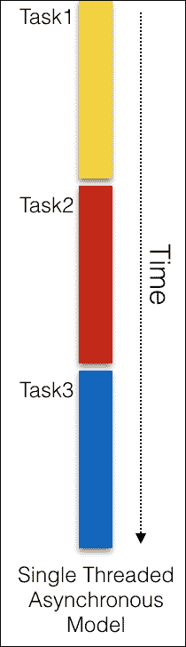
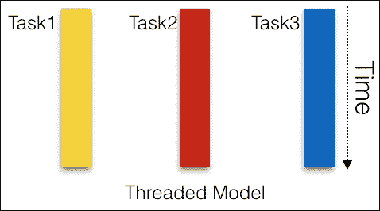
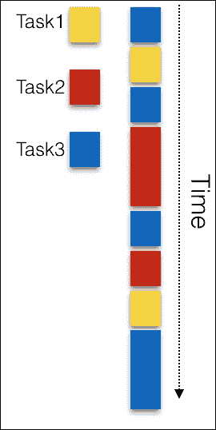
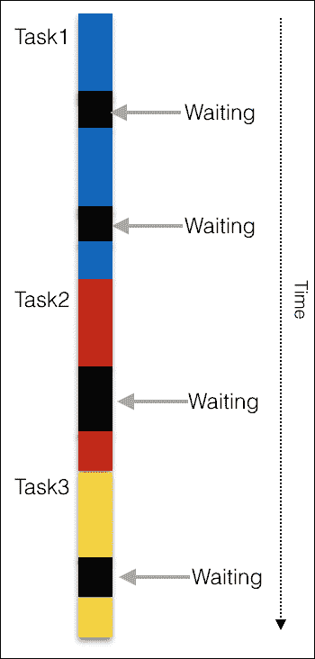
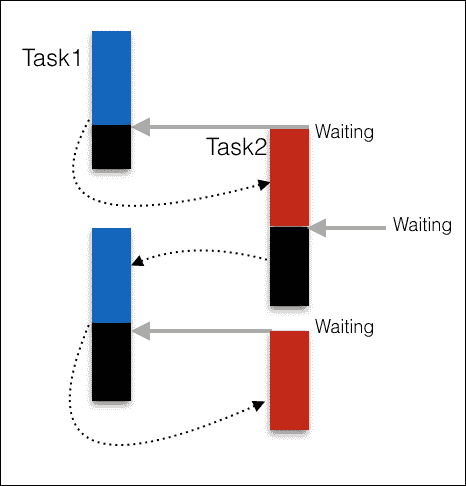

# 第九章。承诺和代理

本章介绍了重要的概念**异步编程**以及 JavaScript 如何成为利用这一特性的理想语言。本章还将涵盖使用代理的元编程。这两个概念都是在 ES6 中引入的。

在本章中，我们的主要重点是理解异步编程，在我们深入研究特定语言的构造之前，让我们花时间先理解这个概念。

第一个模型——**同步模型**——是所有一切的开始。这是编程中最简单的模型。每个任务一次执行一个，并且只有当第一个任务完成执行后，下一个任务才能开始。当你以这种模型编程时，我们期望当前任务之前的所有任务都已完成且没有错误。看看下面的图：



**单线程异步模型**是我们都熟悉的一个模型。然而，这个模型可能是浪费的并且可以优化。对于由几个不同任务组成的任何非平凡程序，这个模型可能会很慢。以下是一个假设场景的例子：

```js
    var result = database.query("SELECT * FROM table");      
    console.log("After reading from the database"); 

```

在考虑同步模型的情况下，两个任务一个接一个地执行。这意味着第二个语句只有在第一个语句完成执行后才会执行。假设第一个语句是一个昂贵的语句，需要 10 秒钟（从远程数据库读取可能需要更多时间是很正常的），第二个语句将被阻塞。

当你需要编写高性能和可扩展的系统时，这是一个严重的问题。当你编写需要编写用于人类交互的接口的程序时，比如我们在浏览器上运行的网站，也会出现另一个问题。当你执行可能需要一些时间的任务时，你不能阻塞用户。他们可能在输入字段中输入某些内容，而昂贵的任务正在运行；如果我们在我们忙于执行昂贵操作时阻塞用户输入，这将是一个糟糕的体验。在这种情况下，昂贵的任务需要在后台运行，同时我们可以愉快地接收用户的输入。

为了解决这个问题，一个解决方案是将每个任务分割成它自己的控制线程。这被称为**多线程**或**线程模型**。考虑以下图：



差异在于任务的分割方式。在线程模型中，每个任务都在自己的控制线程中执行。通常，线程由操作系统管理，可以在不同的 CPU 核心或单个核心上并行运行，这取决于 CPU 进行的适当线程调度。在现代 CPU 中，线程模型在性能上可以非常优化。几种语言支持这种流行的模型。尽管这是一个流行的模型，但在实践中实现线程模型可能会很复杂。线程需要相互通信和协调。线程间的通信可能会很快变得复杂。线程模型有变体，其中状态是不可变的。在这种情况下，模型变得更简单，因为每个线程负责不可变状态，且不需要在线程之间管理状态。

# 异步编程模型

第三个模型是我们最感兴趣的。在这个模型中，任务在一个控制线程中交错执行。考虑以下图示：



**异步模型**更简单，因为你只有一个线程。当你执行一个任务时，你可以确信只有那个任务正在执行。这种模型不需要复杂的线程间协调机制，因此更可预测。线程模型和异步模型之间还有一个区别；在线程模型中，你无法控制线程的执行，因为线程调度主要是由操作系统完成的。然而，在异步模型中，没有这样的挑战。

在哪些场景下异步模型能优于同步模型？如果我们只是简单地将任务分割成更小的块，直观上，当你最终将它们加起来时，即使是更小的块也会花费相当多的时间。

我们还没有考虑的一个显著因素是，当你执行一个任务时，你最终会等待某事——磁盘读取、数据库查询或网络调用；这些都是阻塞操作。当你进入阻塞模式时，在同步模型中，你的任务只是简单地等待。看看以下图示：



在前面的图中，黑色块表示任务正在等待某事。什么典型的操作会导致这种阻塞？任务在 CPU 和 RAM 中执行。典型的 CPU 和 RAM 可以比典型的磁盘读取或网络调用快几个数量级地处理数据传输命令。

### 提示

请参考 CPU、内部内存和磁盘之间延迟的比较([`gist.github.com/jboner/2841832`](https://gist.github.com/jboner/2841832))。

当你的任务等待来自这样的 I/O（**输入**/**输出**）源时，延迟是不可预测的。对于执行大量 I/O 的同步程序，这可能导致性能不佳。

同步模型和异步模型之间最重要的区别是它们处理阻塞操作的方式。在异步模型中，当程序遇到一个阻塞的任务时，它会执行另一个任务，而不等待阻塞操作完成。在一个可能存在阻塞的程序中，异步程序的性能优于等效的同步程序，因为花费在等待上的时间更少。这种模型的略微不准确的可视化可以参考以下图示：



带着异步模型的这一概念背景，我们可以查看特定于语言的构造来支持这一模型。

# JavaScript 调用栈

在 JavaScript 中，函数调用形成一个帧栈。考虑以下示例：

```js
    function c(z2) { 
        console.log(new Error().stack); 
    } 
    function b(z1) { 
        c(z1+ 1); 
    } 
    function a(z) { 
        b(z + 1); 
    } 
    a(1);  

    //at c (eval at <anonymous>) 
    //at b (eval at <anonymous>) 
    //at a (eval at <anonymous>) 

```

当我们调用函数`a()`时，栈中的第一个帧被创建，其中包含传递给函数的参数和`a()`函数中的所有局部变量。当函数`a()`调用函数`b()`时，第二个帧被创建并推送到栈顶。对于所有函数调用都是这样。当`c()`函数返回时，栈顶的帧被弹出，留下函数`b()`和`a()`；这个过程一直持续到整个栈为空。这是必要的，因为一旦函数执行完成，JavaScript 需要知道返回的位置。

## 消息队列

JavaScript 运行时包含一个消息队列。这个队列包含要处理的邮件列表。这些消息是在响应诸如`click`或接收到的 HTTP 响应等事件时入队的。每个消息都与一个回调函数相关联。

## 事件循环

浏览器标签页在一个单独的线程中运行——一个事件循环。这个循环持续地从消息队列中选取消息并执行与它们关联的回调函数。事件循环简单地从消息队列中选取任务，同时其他进程向消息队列添加任务。其他进程，如计时器和事件处理器，并行运行并持续向队列中添加任务。

## 计时器

`setTimeout()`方法创建一个计时器并等待它触发。当计时器执行时，一个任务被添加到消息队列中。`setTimeout()`方法接受两个参数：一个回调函数和以毫秒为单位的持续时间。在持续时间过后，回调函数被添加到消息队列中。一旦回调函数被添加到消息队列中，事件循环最终会选取它并执行。然而，没有保证回调函数何时会被事件循环选取。

### 运行至完成

当事件循环从队列中获取一条消息时，将执行相关的回调函数直到完成。这意味着在处理队列中的下一条消息之前，消息会被完全处理。这种特性使得异步模型具有可预测性。由于在执行过程中没有干预来中断任何消息，因此这种模型比其他模型简单得多，在其他模型中，任何执行单元都可能在中间被中断。然而，一旦获取到消息，即使执行时间过长，浏览器上的任何其他交互都将被阻塞。

### 事件

您可以为对象注册事件处理器并异步接收方法的结果。以下示例展示了我们如何为 `XMLHttpRequest` API 设置事件处理器：

```js
    var xhr = new XMLHttpRequest(); 
    xhr.open('GET', 'http://babeljs.io', true); 
    xhr.onload = function(e) { 
      if (this.status == 200) { 
        console.log("Works"); 
      } 
    }; 
    xhr.send(); 

```

在前面的代码片段中，我们正在创建 `XMLHttpRequest` 类的对象。一旦请求对象被创建，我们将为它注册事件处理器。事件处理器，如 `onload()`，在从 `open()` 方法接收到响应时异步触发。

`send()` 方法实际上并不启动请求，它只是将请求添加到事件循环的消息队列中，以便事件循环可以获取它并执行与之相关的必要回调。

### 回调

Node.js 应用程序普及了这种接收异步数据的方式。回调是一个函数，作为异步函数调用的最后一个参数传递。

为了说明用法，让我们使用以下 Node.js 中读取文件的示例：

```js
    fs.readFile('/etc/passwd', (err, data) => { 
      if (err) throw err; 
     console.log(data); 
    }); 

```

在这里不必担心一些细节。我们正在使用文件系统模块作为 `fs` 别名。此模块有一个 `readFile` 方法用于异步读取文件。我们将文件路径和文件名作为函数的第一个参数，将回调函数作为函数的最后一个参数传递。在示例中，我们使用匿名函数作为回调。

回调函数有两个参数——错误和数据。当 `readFile()` 方法成功时，回调函数接收 `data`，如果失败，`error` 参数将包含错误详情。

我们也可以使用稍微函数式的方式来编写相同的回调。考虑以下示例：

```js
    fs.readFile('/etc/passwd',  
      //success 
      function(data) { 
        console.log(data) 
      }, 
      //error 
      function(error) { 
        console.log(error) 
      } 
    );   

```

这种传递回调的方式也被称为**连续传递风格**（**CPS**）；执行的下一步或后续操作作为参数传递。以下示例进一步说明了 CPS 风格的回调：

```js
    console.log("1"); 
    cps("2", function cps_step2(val2){ 
      console.log(val2); 
      cps("3", function cos_step3(val3){ 
        console.log(val3); 
      }) 
      console.log("4"); 
    }); 
    console.log("5"); 
    //1 5 2 4 3 

    function cps(val, callback) { 
      setTimeout(function () { 
            callback(val); 
      }, 0); 
    } 

```

我们将为每个步骤提供后续操作（下一个回调）。这种嵌套回调风格有时也导致被称为回调地狱的问题。

回调和 CPS 引入了一种截然不同的编程风格。虽然与其它结构相比，回调更容易理解，但回调可能会创建稍微难以理解的代码。

# Promises

ES6 引入了承诺作为回调的替代方案。像回调一样，承诺用于检索异步函数调用的结果。使用承诺比回调更容易，并且生成的代码更易读。然而，为了为你的异步函数实现承诺需要做更多的工作。

承诺对象代表一个现在可能可用或在将来可能可用，或者可能永远不可用的值。正如其名所示，承诺可能被实现或拒绝。承诺充当最终结果的占位符。

承诺有三个互斥的状态，如下所示：

1.  在结果准备好之前，承诺是**挂起**的；这是初始状态。

1.  当结果准备好时，承诺会被**实现**。

1.  在出现错误时，承诺会被**拒绝**。

当一个挂起的承诺被实现或拒绝时，通过承诺的`then()`方法排队的相关回调/处理程序会被执行。

承诺的目的是为了提供一个更好的 CPS 回调语法。以下是一个典型的 CPS 风格异步函数：

```js
    asyncFunction(arg, result => { 
      //... 
    }) 

```

之前的代码可以用承诺稍微改写一下，如下面的代码行所示：

```js
    asyncFunction(arg). 
    then(result=>{ 
      //... 
    }); 

```

异步函数现在返回一个承诺，这是最终结果的占位符。当结果准备好时，通过`then()`方法注册的回调会被通知。

你可以链式调用`then()`方法。当`then()`方法看到回调触发了另一个返回承诺的异步操作时，它会返回那个承诺。看看下面的例子：

```js
    asyncFunction(arg) 
    .then(resultA=>{ 
      //... 
      return asyncFunctionB(argB); 
    }) 
    .then(resultB=>{ 
      //... 
    }) 

```

让我们看看如何使用承诺的一个真实例子。我们看到了 Node.js 中异步文件读取的典型例子；现在让我们看看当使用承诺时，这个例子会是什么样子。为了唤起我们的记忆，我们写了如下内容：

```js
    fs.readFile('text.json', 
      function (error, text) { 
          if (error) { 
              console.error('Error while reading text file'); 
          } else { 
              try { 
                  //... 
              } catch (e) { 
                  console.error('Invalid content'); 
              } 
          } 
      }); 

```

我们将回调视为这里的延续；现在让我们看看如何使用承诺来编写相同的函数：

```js
    readFileWithPromises('text.json') 
    .then(text=>{ 
      //...process text 
    }) 
    .catch(error=>{ 
      console.error('Error while reading text file'); 
    }) 

```

现在回调是通过结果和方法`then()`和`catch()`来调用的。错误处理变得更加清晰，因为我们不再需要编写`if...else`和`try...catch`结构了。

## 创建承诺

我们看到了如何消费承诺。现在，让我们看看我们如何产生它们。

作为生产者，你可以创建一个`Promise`对象，并通过`Promise`发送一个结果。该结构如下代码片段所示：

```js
    const p = new Promise( 
      function (resolve, reject) { // (1) 

          if (   ) { 
              resolve(value); // success 
          } else { 
              reject(reason); // failure 
          } 
      }); 

```

`Promise`的参数是一个执行器函数。执行器处理承诺的两个状态，如下所示：

+   **解决**：如果结果成功生成，执行器通过`resolve()`方法发送结果。此方法通常满足`Promise`对象。

+   **拒绝**：如果发生错误，执行器通过`reject()`方法通知消费者。如果发生异常，它也会通过`reject()`方法通知。

作为消费者，你通过`then()`和`catch()`方法被通知承诺的实现或拒绝。以下代码片段作为例子：

```js
    promise 
    .then(result => { /* promise fulfilled */ }) 
    .catch(error => { /* promise rejected */ }); 

```

现在我们已经了解了如何生成 `Promise`，让我们重写之前异步文件的 `read` 方法示例以生成 `Promise`。我们将使用 Node.js 的文件系统模块和 `readFile()` 方法，就像上次一样。如果你不理解以下代码片段中的任何 Node.js 特定结构，请不要担心。以下代码：

```js
    import {readFile} from 'fs'; 
    function readFileWithPromises(filename) { 
        return new Promise( 
            function (resolve, reject) { 
                readFile(filename,  
                    (error, data) => { 
                        if (error) { 
                            reject(error); 
                        } else { 
                            resolve(data); 
                        } 
                    }); 
            }); 
    } 

```

在前面的代码片段中，我们正在创建一个新的 `Promise` 对象并将其返回给消费者。正如我们之前看到的，`Promise` 对象的参数是执行器函数，执行器函数负责处理 `Promise` 的两种状态——已解决和被拒绝。执行器函数接受两个参数，`resolve` 和 `reject`。这些函数负责通知消费者 `Promise` 对象的状态。

在执行器函数内部，我们将调用实际函数——`readFile()` 方法；如果这个函数成功，我们将使用 `resolve()` 方法返回结果，如果发生错误，我们将使用 `reject()` 方法通知消费者。

如果在某个 `then()` 反应中发生错误，它们会被后续的 `catch()` 块捕获。看看以下代码：

```js
    readFileWithPromises('file.txt') 
    .then(result=> { 'something causes an exception'}) 
    .catch(error=> {'Something went wrong'}); 

```

在这种情况下，`then()` 反应导致异常或错误，后续的 `catch()` 块可以处理它。

类似地，在 `then()` 或 `catch()` 处理器内部抛出的异常会被传递给下一个错误处理器。考虑以下代码片段：

```js
    readFileWithPromises('file.txt') 
    .then(throw new Error()) 
    .catch(error=> {'Something went wrong'}); 

```

### Promise.all()

一个有趣的使用案例是创建一个遍历 `Promise` 的迭代器。假设你有一系列想要访问和解析的 URL，你可以为每个 `fetch URL` 调用创建 `Promise`，然后单独使用它们，或者你可以创建一个包含所有 URL 的迭代器，一次性使用这个 `Promise`。`Promise.all()` 方法接受一个 `Promise` 迭代器作为参数。当所有的 `Promise` 都被解决时，一个数组会被填充它们的返回结果。以下代码作为示例：

```js
    Promise.all([ 
        f1(), 
        f2() 
    ]) 
    .then(([r1,r2]) => { 
        //    
    }) 
    .catch(err => { 
        //.. 
    }); 

```

## 元编程和代理

元编程是指一种编程方法，其中程序了解其结构并可以操纵自身。许多语言通过宏的形式支持元编程。宏是函数式语言（如 **LISP** （**定位器/ID 分离协议**））中的重要结构。在 Java 和 C# 等语言中，反射是一种元编程形式，因为程序可以使用反射检查有关自身的信息。

在 JavaScript 中，可以说对象的方法允许你检查结构，因此它们提供了元编程。有三种元编程范式（*《元对象协议的艺术》，Kiczales 等人，[`mitpress.mit.edu/books/art-metaobject-protocol`](https://mitpress.mit.edu/books/art-metaobject-protocol)）：

+   **内省**：这提供了对程序内部的只读访问

+   **自我修改**：这使得对程序的结构进行更改成为可能

+   **干预**：这改变了语言语义

`Object.keys()`方法是一个内省的例子。在以下示例中，程序正在检查其自身的结构：

```js
    const introspection = { 
      intro() { 
        console.log("I think therefore I am"); 
      } 
    } 
    for (const key of Object.keys(introspection)){ 
      console.log(key);  //intro 
    } 

```

在 JavaScript 中，也可以通过修改对象的属性来实现自我修改。

然而，干预，或改变语言语义的能力，在 ES6 之前在 JavaScript 中是不可用的。代理的引入是为了打开这种可能性。

## 代理

您可以使用代理来确定目标对象的行为，目标对象是指当其属性被访问时的对象。代理用于定义对象基本操作上的自定义行为，例如查找属性、函数调用和赋值。

代理需要两个参数，如下所示：

+   **处理程序**：对于您想要定制的每个操作，您需要一个`handler`方法。这个方法拦截操作，有时也被称为陷阱。

+   **目标**：当`handler`没有拦截操作时，使用`target`作为后备。

让我们看看以下示例，以更好地理解这个概念：

```js
    var handler = { 
      get: function(target, name){ 
        return name in target ? target[name] :42; 
      } 
    } 
    var p = new Proxy({}, handler); 
    p.a = 100; 
    p.b = undefined; 
    console.log(p.a, p.b); // 100, undefined 
    console.log('c' in p, p.c); // false, 42 

```

在这个示例中，我们正在捕获从对象中获取属性的操作。如果属性不存在，我们返回`42`作为默认属性值。我们使用`get`处理程序来捕获这个操作。

您可以使用代理在将值设置到对象上之前验证这些值。为此，我们可以如下捕获`set`处理程序：

```js
    let ageValidator = { 
      set: function(obj, prop, value) { 
        if (prop === 'age') { 
          if (!Number.isInteger(value)) { 
            throw new TypeError('The age is not an number'); 
          } 
          if (value > 100) { 
            throw new RangeError('You cant be older than 100'); 
          } 
        } 
        // If no error - just store the value in the property 
        obj[prop] = value; 
      } 
    }; 
    let p = new Proxy({}, ageValidator); 
    p.age = 100; 
    console.log(p.age); // 100 
    p.age = 'Two'; // Exception 
    p.age = 300; // Exception 

```

在前面的示例中，我们正在捕获`set`处理程序。当我们设置对象的属性时，我们正在捕获这个操作并引入值的验证。如果值有效，我们将设置属性。

## 函数陷阱

如果目标是函数，有两种操作可以被捕获：`apply`和`construct`。

要拦截函数调用，您需要捕获`get`和`apply`操作。首先获取函数，然后应用以调用函数。所以，您`get`函数并返回函数。

让我们考虑以下示例，以了解方法拦截是如何工作的：

```js
    var car = { 
      name: "Ford", 
      method_1: function(text){ 
        console.log("Method_1 called with "+ text); 
      } 
    } 
    var methodInterceptorProxy = new Proxy(car, { 
     //target is the object being proxied, receiver is the proxy 
     get: function(target, propKey, receiver){ 
      //I only want to intercept method calls, not property access 
      var propValue = target[propKey]; 
      if (typeof propValue != "function"){ 
       return propValue; 
  } 
      else{ 
       return function(){ 
        console.log("intercepting call to " + propKey
          + " in car " + target.name); 
        //target is the object being proxied 
        return propValue.apply(target, arguments); 
       } 
      } 
     } 
    }); 
    methodInterceptorProxy.method_1("Mercedes"); 
    //"intercepting call to method_1 in car Ford" 
    //"Method_1 called with Mercedes" 

```

在前面的示例中，我们正在捕获`get`操作。如果正在`get`的属性的类型是函数，我们将使用`apply`来调用该函数。如果您看到输出，我们会得到两个`console.logs`；第一个是从捕获`get`操作的代理那里来的，第二个是从实际方法调用那里来的。

元编程是一个有趣的构造，可以使用。然而，任何类型的内省或反射都会以性能为代价。在使用代理时要小心，因为它们可能会很慢。

# 概述

本章我们探讨了两个重要概念。ES6 代理是用于定义基本操作（例如，属性查找、赋值、枚举、函数调用等）自定义行为的元编程结构。我们探讨了如何使用处理程序（handlers）、陷阱（traps）和代理目标（proxy targets）来拦截和修改操作的默认行为。这为我们提供了在 JavaScript 中早期缺乏的非常强大的元编程能力。

本章中我们讨论的另一个重要构造是 ES6 的承诺（promises）。承诺之所以重要，是因为它们使得异步编程结构更容易处理。承诺充当了一个代理，用于一个在承诺创建时可能未知的价值。这使得异步方法可以像同步方法一样返回值——而不是最终值，异步方法返回的是未来某个时刻该值的承诺。

这些是 ES6 中两个非常强大的构造，极大地增强了语言的核心功能。

在下一章中，我们将探讨使用 JavaScript 在浏览器和 DOM 操作方面的迷人可能性。
