# 第十章。浏览器环境

你知道 JavaScript 程序需要一个宿主环境。到目前为止，你在本书中学到的很多东西都与核心 ECMAScript/JavaScript 有关，并且可以在许多不同的宿主环境中使用。现在，让我们将重点转向浏览器，因为这是 JavaScript 程序最流行和最自然的宿主环境。在本章中，你将学习以下主题：

+   **浏览器对象模型**（**BOM**）

+   **文档对象模型**（**DOM**）

+   浏览器事件

+   `XMLHttpRequest` 对象

# 在 HTML 页面中包含 JavaScript

要在 HTML 页面中包含 JavaScript，你需要使用以下 `<script>` 标签：

```js
    <!DOCTYPE> 
    <html> 
      <head> 
        <title>JS test</title> 
        <script src="img/somefile.js"></script> 
      </head> 
      <body> 
        <script> 
          var a = 1; 
          a++; 
        </script> 
      </body> 
    </html> 

```

在这个例子中，第一个 `<script>` 标签包含一个外部文件 `somefile.js`，其中包含 JavaScript 代码。第二个 `<script>` 标签直接在页面的 HTML 代码中包含 JavaScript 代码。浏览器按照在页面上找到的顺序执行 JavaScript 代码，并且所有标签中的所有代码共享相同的全局命名空间。这意味着当你定义 `somefile.js` 中的变量时，它也存在于第二个 `<script>` 块中。

# BOM 和 DOM - 概览

页面中的 JavaScript 代码可以访问许多对象。这些对象可以分为以下类型：

+   **核心 ECMAScript 对象**: 这包括前几章中提到的所有对象

+   **DOM**: 这包括与当前加载的页面（也称为文档）相关的对象

+   **BOM**: 这包括处理页面外部所有内容的对象——浏览器窗口和桌面屏幕

DOM 代表文档对象模型，BOM 代表浏览器对象模型。

DOM 是由 **万维网联盟**（**W3C**）管理的标准，有不同的版本，称为级别，例如 DOM Level 1、DOM Level 2 等。当前使用的浏览器对标准的遵守程度不同，但总的来说，它们几乎都完全实现了 DOM Level 1。DOM 是在浏览器供应商各自实现了自己的文档访问方式之后标准化的。W3C 接管之前的遗留部分仍然存在，被称为 DOM 0，尽管，并没有真正的 DOM Level 0 标准。DOM 0 的一些部分已经成为事实上的标准，因为所有主流浏览器都支持它们；其中一些被添加到 DOM Level 1 标准。DOM 0 中其余没有进入 DOM 1 的部分过于特定于浏览器，这里不予讨论。

从历史上看，BOM 不是任何标准的一部分。类似于 DOM 0，它有一组所有主要浏览器都支持的子对象，以及一组特定于浏览器的子对象。HTML5 标准将浏览器之间的常见行为规范化，并包括常见的 BOM 对象。此外，移动设备带有它们自己的特定对象（HTML5 的目标是标准化这些对象），这些对象在传统上对桌面计算机不是必需的，但在移动世界中是有意义的，例如地理位置、相机访问、振动、触摸事件、电话和短信。

本章仅讨论 BOM 和 DOM Level 1 的跨浏览器子集，除非文本中另有说明。即使这些安全的子集也是一个很大的主题，完整的参考超出了本书的范围。您还可以参考以下参考资料：

+   Mozilla DOM 参考([`developer.mozilla.org/en/docs/Gecko_DOM_Reference`](http://developer.mozilla.org/en/docs/Gecko_DOM_Reference))

+   Mozilla 的 HTML5 维基([`developer.mozilla.org/en-US/docs/HTML/HTML5`](https://developer.mozilla.org/en-US/docs/HTML/HTML5))

+   Microsoft 的 Internet Explorer 文档([`msdn2.microsoft.com/en-us/library/ms533050(vs.85).aspx`](http://msdn2.microsoft.com/en-us/library/ms533050(vs.85).aspx))

+   W3C 的 DOM 规范([`www.w3.org/DOM/DOMTR`](http://www.w3.org/DOM/DOMTR))

# BOM

BOM 是一组对象，它为您提供了访问浏览器和计算机屏幕的权限。这些对象可以通过全局对象`window`访问。

## 再次审视 window 对象

正如您所知，在 JavaScript 中，宿主环境提供了一个全局对象。在浏览器环境中，这个全局对象可以通过`window`访问。所有全局变量也可以作为`window`对象属性的访问。例如，看看以下代码：

```js
    > window.somevar = 1; 
           1 
    > somevar; 
           1 

```

此外，所有在第二章中讨论的核心 JavaScript 函数，*原始数据类型、数组、循环和条件*，都是全局对象的方法。考虑以下代码片段：

```js
    > parseInt('123a456'); 
           123 
    > window.parseInt('123a456'); 
           123 

```

除了作为全局对象的引用之外，`window`对象还承担第二个作用——提供有关浏览器环境的信息。每个框架、iframe、弹出窗口或浏览器标签页都有一个`window`对象。

让我们看看`window`对象的一些与浏览器相关的属性。同样，这些属性可能因浏览器而异，所以我们只考虑在所有主要浏览器中一致且可靠实现的属性。

## 使用 window.navigator 属性

`navigator`是一个包含有关浏览器及其功能信息的对象。其中一个属性是`navigator.userAgent`，它是一个浏览器标识的长字符串。在 Firefox 中，您将得到以下输出：

```js
    > window.navigator.userAgent; 
        "Mozilla/5.0 (Macintosh; Intel Mac OS X 10_8_3) 
          AppleWebKit/536.28.10
          (KHTML, like Gecko) Version/6.0.3 Safari/536.28.10" 

```

在 Microsoft Internet Explorer 中，`userAgent`字符串如下所示：

```js
       "Mozilla/5.0 (compatible; MSIE 10.0; Windows NT 6.1; Trident/6.0)" 

```

由于浏览器具有不同的功能，开发者使用`userAgent`字符串来识别浏览器并提供不同版本的代码。例如，以下代码片段搜索`MSIE`字符串以识别 Internet Explorer：

```js
    if (navigator.userAgent.indexOf('MSIE') !== -1) { 
      // this is IE 
    } else { 
      // not IE 
    } 

```

最好不要依赖于`userAgent`字符串，而是使用特性嗅探（也称为能力检测）代替。原因是跟踪所有浏览器及其不同版本很困难。简单地检查您打算使用的功能是否确实可用在用户的浏览器中要容易得多。例如，看看以下代码片段：

```js
    if (typeof window.addEventListener === 'function') { 
      // feature is supported, let's use it 
    } else { 
      // hmm, this feature is not supported, will have to 
      // think of another way 
    } 

```

避免使用`userAgent`嗅探的另一个原因是，一些浏览器允许用户修改字符串，并假装他们正在使用不同的浏览器。

## 您的控制台是一个速查表

控制台允许您检查对象中的内容，这包括所有 BOM 和 DOM 属性。只需输入以下代码：

```js
    > navigator; 

```

然后点击结果。结果是属性及其值的列表，如下面的截图所示：

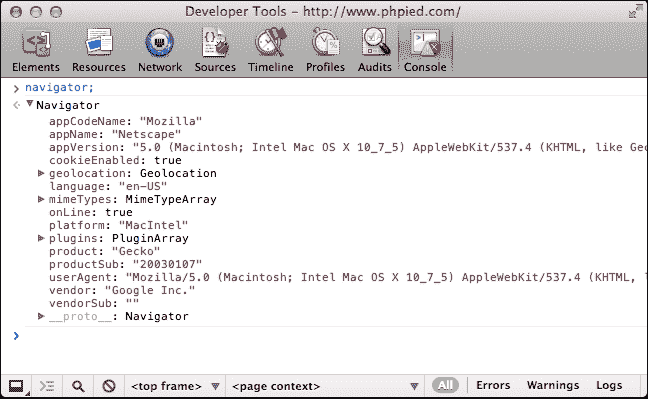

## 使用`window.location`属性

`location`属性指向一个包含当前加载页面 URL 信息的对象。例如，`location.href`是完整的 URL，而`location.hostname`仅是域名。通过简单的循环，您可以看到`location`对象的完整属性列表。

想象您正在一个具有以下 URL 的页面上：

[`search.phpied.com:8080/search?q=java&what=script#results`](http://search.phpied.com:8080/search?q=java&what=script#results).

考虑以下代码：

```js
    for (var i in location) { 
      if (typeof location[i] === "string") { 
        console.log(i + ' = "' + location[i] + '"'); 
      } 
    } 
           href = "http://search.phpied.com:8080/search?
             q=java&what=script#results" 
           hash = "#results" 
           host = "search.phpied.com:8080" 
           hostname = "search.phpied.com" 
           pathname = "/search" 
           port = <<8080>> 
           protocol = <<http:>> 
           search = "?q=java&what=script" 

```

`location`属性还提供了三种方法，即`reload()`、`assign()`和`replace()`。

有趣的是，存在许多不同的方式可以导航到另一个页面。以下是一些方法：

```js
    > window.location.href = 'http://www.packtpub.com'; 
    > location.href = 'http://www.packtpub.com'; 
    > location = 'http://www.packtpub.com'; 
    > location.assign('http://www.packtpub.com'); 

```

`replace()`方法几乎与`assign()`相同。区别在于它不会在浏览器的历史记录列表中创建条目，如下所示：

```js
    > location.replace('http://www.yahoo.com'); 

```

要重新加载页面，您可以使用以下代码：

```js
    > location.reload(); 

```

或者，您可以使用`location.href`将其指向自身，如下所示：

```js
    > window.location.href = window.location.href; 

```

或者，简单地使用以下代码：

```js
    > location = location; 

```

## 使用`window.history`属性

`window.history`属性允许对同一浏览器会话中之前访问的页面进行有限访问。例如，您可以看到用户在到达您的页面之前访问了多少页面，如下所示：

```js
    > window.history.length; 
           5 

```

您无法看到实际的 URL。出于隐私原因，这不起作用。请看以下代码：

```js
    > window.history[0]; 

```

您可以导航回用户会话的前后，就像用户点击了后退/前进浏览器按钮一样，如下所示：

```js
    > history.forward(); 
    > history.back(); 

```

您还可以使用`history.go()`来回跳转页面。这与调用`history.back()`相同。`history.go()`的代码如下：

```js
    > history.go(-1); 

```

要后退两页，请使用以下代码：

```js
    > history.go(-2); 

```

使用以下代码重新加载当前页面：

```js
    > history.go(0); 

```

更新的浏览器也支持 HTML5 历史 API，这允许你在不重新加载页面的情况下更改 URL。这对于动态页面来说非常完美，因为它们可以允许用户将特定的 URL 作为应用程序状态的表示进行书签，当他们回来或与朋友分享时，页面可以根据 URL 恢复应用程序状态。为了了解历史 API，请访问任何页面并在控制台中写下以下代码行：

```js
    > history.pushState({a: 1}, "", "hello"); 
    > history.pushState({b: 2}, "", "hello-you-too"); 
    > history.state; 

```

注意 URL 是如何变化的，但页面保持不变。现在，在浏览器中尝试使用后退和前进按钮，并再次检查`history.state`对象。

## 使用`window.frames`属性

`window.frames`属性是当前页面中所有框架的集合。它不区分框架和 iframe（内联框架）。无论页面上是否有框架，`window.frames`始终存在并指向`window`，如下所示：

```js
    > window.frames === window; 
           true 

```

让我们考虑一个例子，你有一个包含一个 iframe 的页面，如下所示：

```js
    <iframe name="myframe" src="img/hello.html" /> 

```

为了判断页面上是否有框架，你可以检查`length`属性。如果只有一个 iframe，你会看到以下输出：

```js
    > frames.length 
           1 

```

每个框架都包含另一个页面，该页面有自己的全局`window`对象。

要访问 iframe 的`window`，你可以执行以下任何一个：

```js
    > window.frames[0]; 
    > window.frames[0].window; 
    > window.frames[0].window.frames; 
    > frames[0].window; 
    > frames[0]; 

```

从父页面，你也可以访问子框架的属性。例如，你可以按照以下方式重新加载框架：

```js
    > frames[0].window.location.reload(); 

```

从子页面内部，你可以按照以下方式访问父页面：

```js
    > frames[0].parent === window; 
           true 

```

使用一个名为`top`的属性，你可以从任何框架中访问最顶层的页面——包含所有其他框架的那个页面，如下所示：

```js
    > window.frames[0].window.top === window; 
           true 
    > window.frames[0].window.top === window.top; 
           true 
    > window.frames[0].window.top === top; 
           true 

```

此外，`self`与`window`相同，正如以下代码片段所示：

```js
    > self === window; 
           true 
    > frames[0].self == frames[0].window; 
           true 

```

如果一个框架有`name`属性，你不仅可以按名称访问框架，还可以按索引访问，如下面的代码片段所示：

```js
    > window.frames['myframe'] === window.frames[0]; 
           true 

```

或者，你也可以使用以下代码：

```js
    > frames.myframe === window.frames[0]; 
           true 

```

## 使用`window.screen`属性

`screen`属性提供了关于浏览器外部环境的信息。例如，`screen.colorDepth`属性包含监视器的颜色位深度（颜色质量）。这主要用于统计目的。请查看以下代码行：

```js
    > window.screen.colorDepth; 
           32 

```

你还可以检查可用的屏幕空间（分辨率），如下所示：

```js
    > screen.width; 
           1440 
    > screen.availWidth; 
           1440 
    > screen.height; 
           900 
    > screen.availHeight; 
           847 

```

`height`和`availHeight`之间的区别在于`height`是整个屏幕，而`availHeight`减去了任何操作系统菜单，例如 Windows 任务栏。对于`width`和`availWidth`也是同样的情况。

与以下代码中提到的属性有些相关：

```js
    > window.devicePixelRatio; 
           1 

```

这告诉你物理像素和设备像素在移动设备上的视网膜显示屏中的差异（比率），例如，iPhone 中的值为 2。

## `window.open()/close()`方法

在探讨了 `window` 对象的一些最常用的跨浏览器属性之后，让我们转向一些方法。其中一种方法是 `open()`，它允许你打开新的浏览器窗口（弹出窗口）。各种浏览器策略和用户设置可能会阻止你打开弹出窗口（由于营销目的对该技术的滥用），但通常，如果你是由用户发起的，你应该能够打开一个新窗口。否则，如果你在页面加载时尝试打开一个弹出窗口，它很可能会被阻止，因为用户没有明确发起。

`window.open()` 方法接受以下参数：

+   在新窗口中要加载的 URL

+   可以用作表单 `target` 属性值的新窗口名称

+   以逗号分隔的功能列表，如下所示：

    +   `resizable`: 用户是否能够调整新窗口的大小

    +   `width`、`height`: 弹出窗口的宽度和高度

    +   `status`: 是否应显示状态栏

`window.open()` 方法返回对新创建浏览器实例的 `window` 对象的引用。以下是一个示例：

```js
    var win = window.open('http://www.packtpub.com', 'packt', 
      'width=300,height=300,resizable=yes'); 

```

`win` 变量指向弹出窗口的 `window` 对象。你可以检查 `win` 是否具有假值，这意味着弹出窗口被阻止了。

`win.close()` 方法关闭新窗口。

为了可访问性和可用性，最好避免打开新窗口。如果你不喜欢网站弹出窗口，为什么还要对你的用户这样做呢？有合法的目的，例如在填写表单时提供帮助信息，但通常，可以通过替代方案实现相同的效果，例如在页面内使用浮动 `<div>`。

## `window.moveTo()` 和 `window.resizeTo()` 方法

继续使用过去的可疑做法，以下是一些可能激怒用户的方法，前提是他们的浏览器和个人设置允许你这样做：

+   `window.moveTo(100, 100)`: 这将浏览器窗口移动到屏幕位置 `x = 100` 和 `y = 100`，从左上角开始计算。

+   `window.moveBy(10, -10)`: 这将窗口从当前位置向右移动 10 像素，向上移动 10 像素。

+   `window.resizeTo(x, y)` 和 `window.resizeBy(x, y)`: 它们接受与移动方法相同的参数，但它们调整窗口大小而不是移动它。

再次强调，尽量在不使用这些方法的情况下解决问题。

## `window.alert()`、`window.prompt()` 和 `window.confirm()` 方法

在 第二章 中，我们讨论了 `alert()` 函数。现在你知道全局函数可以作为全局对象的方法访问，所以 `alert('Watch out!')` 和 `window.alert('Watch out!')` 完全相同。

`alert()` 函数不是一个 ECMAScript 函数，而是一个 BOM 方法。除此之外，还有另外两种 BOM 方法允许你通过系统消息与用户交互。以下是一些方法：

+   `confirm()`: 这为用户提供了两个选项，**确定**和**取消**

+   `prompt()`: 这收集文本输入

这就是它的工作方式：

```js
    > var answer = confirm('Are you cool?');  
    > answer; 

```

它会显示一个类似于以下截图的窗口（具体外观取决于浏览器和操作系统）：

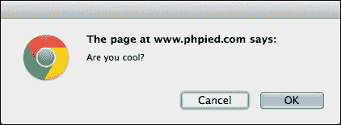

您会注意到以下事项：

+   只有在您关闭此消息之前，控制台才会写入任何内容，这意味着任何 JavaScript 代码执行都会冻结，等待用户的回答

+   点击**确定**返回`true`，点击**取消**或使用**X**图标、**ESC**键关闭消息，返回`false`

这对于确认用户操作很有用，如下面的代码片段所示：

```js
    if (confirm('Sure you want to delete this?')) { 
      // delete 
    } else { 
      // abort 
    } 

```

确保为禁用 JavaScript 的用户或搜索引擎蜘蛛提供另一种确认用户操作的方式。

`window.prompt()`方法向用户显示一个对话框以输入文本，如下所示：

```js
    > var answer = prompt('And your name was?');  
    > answer; 

```

这将导致以下对话框（Chrome，MacOS）：

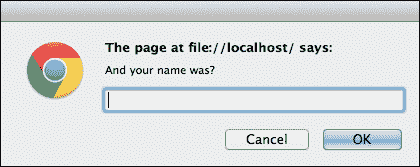

`answer`的值是以下之一：

+   `null`: 如果您点击**取消**、**X**图标或按**ESC**键，就会发生这种情况

+   `""`（空字符串）：如果您点击**确定**或按 Enter 键而没有输入任何内容，就会发生这种情况

+   文本字符串：这是如果你输入一些内容然后点击**确定**或按**Enter**键的情况

函数还接受一个字符串作为第二个参数，并将其显示为默认值，预先填充到输入字段中。

## 使用 window.setTimeout() 和 window.setInterval() 方法

`setTimeout()`和`setInterval()`方法允许安排代码的执行。`setTimeout()`方法尝试在指定数量的毫秒后执行给定的代码一次。`setInterval()`方法尝试在指定数量的毫秒后重复执行。

这将在大约 2 秒（2000 毫秒）后显示一个警告框。考虑以下代码：

```js
    > function boo() { alert('Boo!'); } 
    > setTimeout(boo, 2000); 
           4 

```

如您所见，该函数返回一个整数（在这种情况下，`4`），表示超时的 ID。您可以使用此 ID 使用`clearTimeout()`取消超时。在以下示例中，如果您足够快，并且在 2 秒之前清除超时，警告框将不会显示，如下面的代码所示：

```js
    > var id = setTimeout(boo, 2000); 
    > clearTimeout(id); 

```

让我们将`boo()`改为不那么侵扰性的内容，如下所示：

```js
    > function boo() { console.log('boo'); } 

```

现在，使用`setInterval()`，你可以安排`boo()`每 2 秒执行一次，直到你使用`clearInterval()`取消计划的执行。考虑以下代码：

```js
    > var id = setInterval(boo, 2000); 
           boo 
           boo 
           boo 
           boo 
           boo 
           boo 
    > clearInterval(id); 

```

注意，这两个函数都接受一个回调函数的指针作为第一个参数。它们也可以接受一个字符串，该字符串通过`eval();`进行评估；然而，正如您所知，`eval()`是邪恶的，因此应该避免。此外，如果您想向函数传递参数怎么办？在这种情况下，您只需将函数调用包装在另一个函数中即可。

以下代码是有效的，但不推荐使用：

```js
    // bad idea 
    var id = setInterval("alert('boo, boo')", 2000); 

```

这个替代方案更受欢迎：

```js
    var id = setInterval( 
      function () { 
        alert('boo, boo'); 
      }, 
      2000 
    ); 

```

请注意，以一定量的毫秒数安排一个函数并不能保证它将正好在那个时间执行。一个原因是大多数浏览器没有毫秒级的时间分辨率。如果您在 3 毫秒内安排某事，它将在较旧的 IE 浏览器中至少延迟 15 毫秒执行，在更现代的浏览器中则更早执行，但最可能的情况是，不会在 1 毫秒内执行。另一个原因是浏览器维护了一个您请求它们执行的任务队列。100 毫秒的超时意味着在 100 毫秒后添加到队列中。然而，如果队列因为某些缓慢发生的事情而延迟，您的函数将不得不等待，并在例如 120 毫秒后执行。

更新的浏览器实现了`requestAnimationFrame()`函数。它比超时函数更可取，因为您要求浏览器在可用资源时调用您的函数，而不是在预定义的毫秒数后。请尝试在您的控制台执行以下代码片段：

```js
    function animateMe() { 
      webkitRequestAnimationFrame(function(){ 
        console.log(new Date()); 
        animateMe(); 
      }); 
    } 

    animateMe(); 

```

## window.document 属性

`window.document`属性是一个 BOM 对象，它指向当前加载的文档（页面）。它的方法和属性属于 DOM 对象类别。深呼吸（也许首先看看本章末尾的 BOM 练习）然后让我们深入 DOM。

# DOM

DOM 将 XML 或 HTML 文档表示为节点树。使用 DOM 方法和属性，您可以访问页面上的任何元素，修改或删除元素，或添加新的元素。DOM 是一个与语言无关的 API，不仅可以在 JavaScript 中实现，也可以在任何其他语言中实现。例如，您可以使用 PHP 的 DOM 实现生成服务器端的页面([`php.net/dom`](http://php.net/dom))。

看看这个示例 HTML 页面：

```js
    <!DOCTYPE html> 
    <html> 
      <head> 
        <title>My page</title> 
      </head> 
      <body> 
        <p class="opener">first paragraph</p> 
        <p><em>second</em> paragraph</p> 
        <p id="closer">final</p> 
        <!-- and that's about it --> 
      </body> 
    </html> 

```

考虑第二个段落`(<p><em>second</em> paragraph</p>)`。您会看到它是一个`<p>`标签，并且它包含在`<body>`标签中。如果您从家庭关系的角度思考，可以说`<body>`是`<p>`的父级，而`<p>`是子级。第一段和第三段也会是`<body>`标签的子级，同时与第二个段落是兄弟关系。`<em>`标签是第二个`<p>`的子级，所以`<p>`是它的父级。父级-子级关系可以用图形化的家谱树表示，称为 DOM 树：

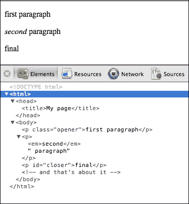

上一张截图显示了您在展开每个节点后将在 WebKit 控制台的**元素**选项卡中看到的内容。

您可以看到所有标签都显示为树上的可展开节点。虽然未显示，但存在所谓的文本节点，例如，`<em>`标签内的文本（单词 second）是一个文本节点。空白也被视为文本节点。HTML 代码中的注释也是树中的节点，HTML 源中的`<!- and that's about it ->`注释在树中是一个注释节点。

DOM 树中的每个节点都是一个对象，右侧的 **属性** 部分列出了你可以用来操作这些对象的全部属性和方法，按照对象创建时的继承链进行排列：

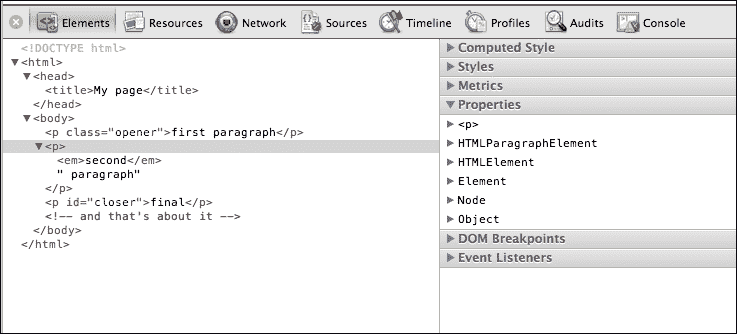

你还可以看到在幕后用于创建每个这些对象的构造函数。尽管这在日常任务中并不太实用，但了解例如 `<p>` 是由 `HTMLParagraphElement()` 构造函数创建的，表示 `head` 标签的对象是由 `HTMLHeadElement()` 创建的，等等，可能是有趣的。尽管如此，你不能直接使用这些构造函数来创建对象。

## 核心 DOM 和 HTML DOM

在转向更多实际示例之前，还有一个最后的分岔。正如你所知，DOM 代表了 XML 文档和 HTML 文档。实际上，HTML 文档是 XML 文档，但更具体一些。因此，作为 DOM Level 1 的一部分，有一个适用于所有 XML 文档的核心 DOM 规范，还有一个 HTML DOM 规范，它扩展并建立在核心 DOM 的基础上。当然，HTML DOM 不适用于所有 XML 文档，而只适用于 HTML 文档。让我们看看核心 DOM 和 HTML DOM 构造函数的一些示例：

| **构造函数** | **继承自** | **核心或 HTML** | **注释** |
| --- | --- | --- | --- |
| `Node` |  | 核心功能 | 树上的任何节点 |
| `Document` | `Node` | 核心功能 | 文档对象，任何 XML 文档的主要入口点 |
| `HTMLDocument` | `Document` | HTML | 这是 window.document 或简单地 document，是前一个对象的 HTML 特定版本，你将广泛使用它 |
| `Element` | `Node` | 核心功能 | 源代码中的每个标签都由一个元素表示。这就是为什么你说 `P` 元素意味着 `<p></p>` 标签 |
| `HTMLElement` | `Element` | HTML | 通用构造函数，所有 HTML 元素的构造函数都继承自它 |
| `HTMLBodyElement` | `HTMLElement` | HTML | 表示 `<body>` 标签的元素 |
| `HTMLLinkElement` | `HTMLElement` | HTML | A 元素：一个 `<a href="..."></a>` 标签 |
| 其他此类构造函数 | `HTMLElement` | HTML | 所有其他 HTML 元素 |
| `CharacterData` | `Node` | 核心功能 | 处理文本的通用构造函数 |
| `Text` | `CharacterData` | 核心功能 | 标签内的文本节点；在 `<em>second</em>` 中，你有元素节点 `EM` 和值为 "second" 的文本节点 |
| `Comment` | `CharacterData` | 核心功能 | `<!-- any comment -->` |
| `Attr` | `Node` | 核心功能 | 表示标签的一个属性；在 `<p id="closer">` 中，`id` 属性是由 `Attr()` 构造函数创建的 DOM 对象 |
| `NodeList` |  | 核心功能 | 节点列表，一个具有 `length` 属性的类似数组的对象 |
| `NamedNodeMap` |  | 核心功能 | 与 `NodeList` 相同，但节点可以通过名称访问，而不仅仅是通过数字索引。 |
| `HTMLCollection` |  | HTML | 与 `NamedNodeMap` 类似，但特定于 HTML。 |

这些绝不是所有核心 DOM 和 HTML DOM 对象。要获取完整列表，请参考[`www.w3.org/TR/DOM-Level-1/`](http://www.w3.org/TR/DOM-Level-1/)。

现在你已经了解了 DOM 理论的一部分，让我们关注一下使用 DOM 的实践方面。在接下来的几节中，你将学习以下主题：

+   访问 DOM 节点

+   修改节点

+   创建新节点

+   删除节点

## 访问 DOM 节点

在你可以在页面上验证用户输入或在页面上交换图片之前，你需要获取你想要检查或修改的元素。幸运的是，有很多方法可以到达任何元素，无论是通过在 DOM 树中导航遍历，还是使用快捷方式。

最好的方法是尝试所有新的对象和方法。你将看到的示例使用的是你在 DOM 部分开始时看到的相同简单的文档，并且你可以通过[`www.phpied.com/files/jsoop/ch7.html`](http://www.phpied.com/files/jsoop/ch7.html)访问它。打开你的控制台，让我们开始吧。

### 文档节点

`document`节点提供了访问当前文档的途径。要探索这个对象，你可以使用你的控制台作为速查表。输入`console.dir(document)`并点击结果：

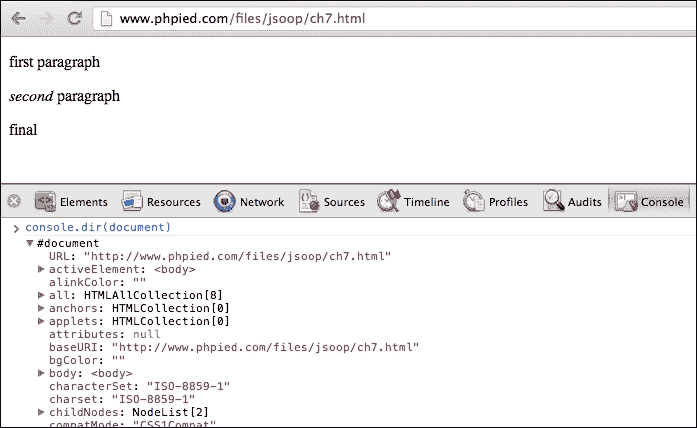

或者，你可以在**元素**面板中浏览`document`对象 DOM 属性的所有属性和方法：

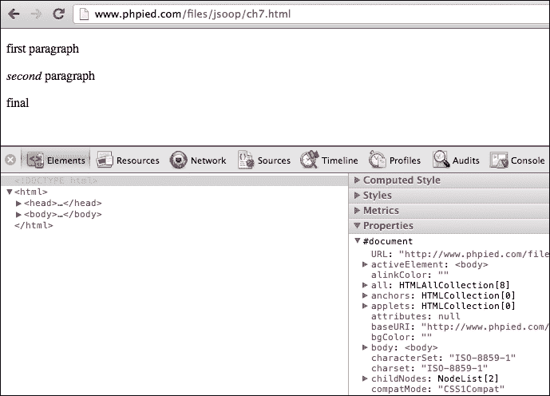

所有节点，包括文档节点、文本节点、元素节点和属性节点都有`nodeType`、`nodeName`和`nodeValue`属性：

```js
    > document.nodeType; 
           9 

```

有 12 种节点类型，由整数表示。正如你所看到的，文档节点类型是`9`。最常用的类型是`1`（元素）、`2`（属性）和`3`（文本）。

节点也有名称。对于 HTML 标签，节点名称是标签名称（`tagName`属性）。对于文本节点，它是`#text`，对于文档节点，名称如下：

```js
    > document.nodeName; 
           "#document" 

```

节点也可以有节点值。例如，对于文本节点，值是实际的文本。文档节点没有值，如下所示：

```js
    > document.nodeValue; 
           null 

```

### documentElement

现在，让我们在树中移动。XML 文档总是有一个根节点，它包含文档的其余部分。对于 HTML 文档，根是`<html>`标签。要访问根节点，你将使用`document`对象的`documentElement`属性。

```js
    > document.documentElement; 
           <html>...</html> 

```

`nodeType`为`1`（一个元素节点），如下所示：

```js
    > document.documentElement.nodeType; 
           1 

```

对于元素节点，`nodeName`和`tagName`属性都包含标签的名称，如下面的输出所示：

```js
    > document.documentElement.nodeName; 
           "HTML" 
    > document.documentElement.tagName; 
           "HTML" 

```

### 子节点

为了判断一个节点是否有子节点，你可以使用`hasChildNodes()`，如下所示：

```js
    > document.documentElement.hasChildNodes(); 
           true 

```

HTML 元素有三个子节点，即`head`和`body`元素以及它们之间的空白（在大多数浏览器中，空白也被计算在内）。你可以使用类似数组的`childNodes`集合来访问它们，如下所示：

```js
    > document.documentElement.childNodes.length; 
           3 
    > document.documentElement.childNodes[0]; 
           <head>...</head> 
    > document.documentElement.childNodes[1]; 
           #text 
    > document.documentElement.childNodes[2]; 
           <body>...</body> 

```

任何子节点都可以通过`parentNode`属性访问其父节点，如下面的代码所示：

```js
    > document.documentElement.childNodes[1].parentNode; 
           <html>...</html> 

```

让我们将`body`的引用分配给一个变量，如下所示：

```js
    > var bd = document.documentElement.childNodes[2]; 

```

`body`元素有多少个子元素？考虑以下代码片段

```js
    > bd.childNodes.length; 
           9 

```

作为复习，这里再次列出文档的主体：

```js
      <body> 
        <p class="opener">first paragraph</p> 
        <p><em>second</em> paragraph</p> 
        <p id="closer">final</p> 
        <!-- and that's about it --> 
      </body> 

```

为什么`body`有`9`个子元素？好吧，三个段落加上一个注释构成四个节点。这四个节点之间的空白产生了另外三个文本节点。这已经有七个了。`<body>`和第一个`<p>`之间的空白是第八个节点。注释和关闭的`</body>`之间的空白是另一个文本节点。这使得总共有九个子节点。只需在控制台中输入`bd.childNodes`来检查它们。

### 属性

由于`body`的第一个子元素是空白，第二个子元素（索引 1）是第一段。参考以下代码：

```js
    > bd.childNodes[1]; 
           <p class="opener">first paragraph</p> 

```

你可以使用`hasAttributes()`方法检查一个元素是否有属性，如下所示：

```js
    > bd.childNodes[1].hasAttributes(); 
            true 

```

有多少属性？在这个例子中，一个是`class`属性，如下所示：

```js
    > bd.childNodes[1].attributes.length; 
            1 

```

你可以通过索引和名称访问属性。你还可以使用`getAttribute()`方法获取值，如下所示：

```js
    > bd.childNodes[1].attributes[0].nodeName; 
           "class" 
    > bd.childNodes[1].attributes[0].nodeValue; 
           "opener" 
    > bd.childNodes[1].attributes['class'].nodeValue; 
           "opener" 
    > bd.childNodes[1].getAttribute('class'); 
           "opener" 

```

### 访问标签内的内容

让我们看看第一段：

```js
    > bd.childNodes[1].nodeName; 
           "P" 

```

你可以使用`textContent`属性获取段落中包含的文本。它不在旧版的 IE 中存在，但另一个名为`innerText`的属性返回相同的值，如下面的输出所示：

```js
    > bd.childNodes[1].textContent; 
           "first paragraph" 

```

此外，还有`innerHTML`属性。尽管它在所有主流浏览器中之前都存在，但作为 DOM 标准的相对较新添加项，它返回（或设置）节点中包含的 HTML 代码。你可以看到这有点不一致，因为 DOM 将文档视为节点树，而不是标签字符串。然而，`innerHTML`的使用非常方便，所以你会在各个地方看到它。参考以下代码：

```js
    > bd.childNodes[1].innerHTML; 
           "first paragraph" 

```

第一段只包含文本，所以`innerHTML`与`textContent`（或在 IE 中的`innerText`）相同。然而，第二段确实包含一个`em`节点，所以你可以看到以下差异：

```js
    > bd.childNodes[3].innerHTML; 
           "<em>second</em> paragraph" 
    > bd.childNodes[3].textContent; 
           "second paragraph" 

```

另一种获取第一段中包含的文本的方法是使用`p`节点内包含的文本节点的`nodeValue`方法，如下所示：

```js
    > bd.childNodes[1].childNodes.length; 
            1 
    > bd.childNodes[1].childNodes[0].nodeName; 
           "#text" 
    > bd.childNodes[1].childNodes[0].nodeValue; 
           "first paragraph" 

```

### DOM 访问快捷方式

使用`childNodes`、`parentNode`、`nodeName`、`nodeValue`和`attributes`，你可以上下导航树并对文档进行任何操作。然而，空白是一个文本节点的事实使得这种方式与 DOM 一起工作变得脆弱。如果页面发生变化，你的脚本可能不再正确工作。此外，如果你想到达树中的更深层次的节点，可能需要一些代码才能到达那里。这就是为什么你有快捷方法，即`getElementsByTagName()`、`getElementsByName()`和`getElementById()`。

`getElementsByTagName()`方法接受一个标签名（元素节点的名称）并返回一个匹配该标签名的 HTML 集合（类似数组的对象）。例如，以下示例请求给出所有段落的数量，如下所示：

```js
    > document.getElementsByTagName('p').length; 
            3 

```

你可以使用方括号表示法或`item()`方法来访问列表中的项目，并传递索引（第一个元素的索引为 0）。不建议使用`item()`，因为数组方括号更一致，也更短。请参考以下代码片段：

```js
    > document.getElementsByTagName('p')[0]; 
            <p class="opener">first paragraph</p> 
    > document.getElementsByTagName('p').item(0); 
            <p class="opener">first paragraph</p> 

```

获取第一个`p`元素的内容可以按照以下方式完成：

```js
    > document.getElementsByTagName('p')[0].innerHTML; 
           "first paragraph" 

```

访问最后一个`p`元素可以按照以下方式完成：

```js
    > document.getElementsByTagName('p')[2]; 
            <p id="closer">final</p> 

```

要访问元素的属性，你可以使用`attributes`集合或`getAttribute()`，如前所述。然而，有一个更短的方法是使用属性名作为你正在处理的元素的属性。因此，要获取`id`属性的值，你只需使用`id`作为属性，如下所示：

```js
    > document.getElementsByTagName('p')[2].id; 
           "closer" 

```

获取第一个段落的`class`属性将不起作用。这是一个例外，因为 class 恰好是 ECMAScript 中的一个保留字。你可以使用`className`代替，如下所示：

```js
    > document.getElementsByTagName('p')[0].className; 
           "opener" 

```

使用`getElementsByTagName()`，你可以获取页面上的所有元素，如下所示：

```js
    > document.getElementsByTagName('*').length; 
            8 

```

在 IE7 之前的早期版本 IE 中，`*`不是一个有效的标签名。要获取所有元素，可以使用 IE 的专有`document.all`集合，尽管通常不需要选择每个元素。

另一个提到的快捷方法是`getElementById()`。这可能是访问元素最常见的方式。你只需为打算操作的元素分配 ID，稍后就可以轻松访问它们，如下面的代码所示：

```js
    > document.getElementById('closer'); 
    <p id="closer">final</p> 

```

在较新的浏览器中，还有以下额外的快捷方法：

+   `getElementByClassName()`：此方法通过元素的 class 属性查找元素

+   `querySelector()`：此方法使用 CSS 选择器字符串查找元素

+   `querySelectorAll()`：此方法与上一个方法相同，但返回所有匹配的元素，而不仅仅是第一个

### 兄弟、body、第一个和最后一个子元素

`nextSibling`和`previousSibling`是另外两个方便的属性，一旦你有一个元素的引用，就可以用来导航 DOM 树。考虑以下代码：

```js
    > var para = document.getElementById('closer'); 
    > para.nextSibling; 
           #text 
    > para.previousSibling; 
           #text 
    > para.previousSibling.previousSibling; 
           <p>...</p> 
    > para.previousSibling.previousSibling.previousSibling; 
           #text 
    > para.previousSibling.previousSibling.nextSibling.nextSibling; 
           <p id="closer">final</p> 

```

`body`元素使用得非常频繁，因此它有自己的快捷方式，如下所示：

```js
    > document.body; 
            <body>...</body> 
    > document.body.nextSibling; 
            null 
    > document.body.previousSibling.previousSibling; 
            <head>...</head> 

```

`firstChild`和`lastChild`属性也非常方便。`firstChild`属性等同于`childNodes[0]`，而`lastChild`等同于`childNodes[childNodes.length - 1]`属性：

```js
    > document.body.firstChild; 
           #text 
    > document.body.lastChild; 
           #text 
    > document.body.lastChild.previousSibling; 
            <!-- and that's about it --> 
    > document.body.lastChild.previousSibling.nodeValue; 
           " and that's about it " 

```

以下截图显示了文档中 body 元素与其中三个段落之间的家族关系。为了简化，截图已从所有空白文本节点中删除：

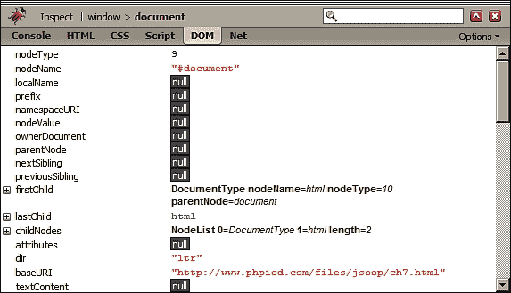

### 遍历 DOM

总结一下，以下是一个函数，它接受任何节点，并递归地遍历 DOM 树，从给定的节点开始，如下所示：

```js
   function walkDOM(n) { 
      do { 
        console.log(n); 
        if (n.hasChildNodes()) { 
          walkDOM(n.firstChild); 
        } 
      } while (n = n.nextSibling); 
    } 

```

你可以这样测试这个函数：

```js
    > walkDOM(document.documentElement); 
    > walkDOM(document.body); 

```

## 修改 DOM 节点

现在你已经知道了访问 DOM 树中任何节点及其属性的所有方法，让我们看看你如何修改这些节点：

让我们将最后一个段落到变量 `my` 中，如下所示：

```js
    > var my = document.getElementById('closer'); 

```

现在更改段落的文本可以像更改 `innerHTML` 值一样简单，如下所示：

```js
    > my.innerHTML = 'final!!!'; 
           "final!!!" 

```

由于 `innerHTML` 接受 HTML 源代码的字符串，你还可以在 DOM 树中创建一个新的 `em` 节点，如下所示：

```js
    > my.innerHTML = '<em>my</em> final'; 
           "<em>my</em> final" 

```

新的 `em` 节点成为树的一部分。让我们看看以下代码：

```js
    > my.firstChild; 
           <em>my</em> 
    > my.firstChild.firstChild; 
           "my" 

```

另一种更改文本的方法是获取实际的文本节点并更改它的 `nodeValue`，如下面的代码片段所示：

```js
    > my.firstChild.firstChild.nodeValue = 'your'; 
           "your" 

```

### 修改样式

通常你不会改变节点的内容，而是它的呈现方式。元素有一个 `style` 属性，它将每个 CSS 属性映射到一个属性。例如，将段落的样式更改为添加红色边框，如下所示：

```js
    > my.style.border = "1px solid red"; 
           "1px solid red" 

```

CSS 属性通常包含破折号，但破折号在 JavaScript 标识符中是不可接受的。在这种情况下，你跳过破折号并将下一个字母转换为大写。所以，`padding-top` 变成了 `paddingTop`，`margin-left` 变成了 `marginLeft`，依此类推。看看下面的代码：

```js
    > my.style.fontWeight = 'bold'; 
           "bold" 

```

你也可以访问 `style` 的 `cssText` 属性，这让你可以像字符串一样处理样式，如下面的代码片段所示：

```js
    > my.style.cssText; 
           "border: 1px solid red; font-weight: bold;" 

```

此外，修改样式是一种字符串操作：

```js
    > my.style.cssText += " border-style: dashed;" 
    "border: 1px dashed red; font-weight: bold; border-style: dashed;" 

```

### 与表单的乐趣

如前所述，JavaScript 在客户端输入验证方面非常出色，可以节省几次往返服务器的请求。让我们练习表单操作，并在一个流行的页面上稍作玩耍，[www.google.com](http://www.google.com)：

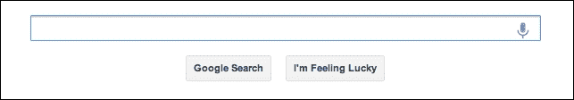

使用 `querySelector()` 方法和 CSS 选择器字符串查找第一个文本输入，如下所示：

```js
    > var input = document.querySelector('input[type=text]'); 

```

访问搜索框。考虑以下代码：

```js
    > input.name; 
           "q" 

```

通过设置 `value` 属性中包含的文本来更改搜索查询，如下所示：

```js
    > input.value = 'my query'; 
 "my query"

```

现在，让我们来点乐趣，将按钮中的单词 **Lucky** 更改为 **Tricky**：

```js
    > var feeling = document.querySelectorAll("button")[2]; 
    > feeling.textContent = feelingtextContent.replace(/Lu/, 'Tri'); 
 "I'm Feeling Tricky"

```

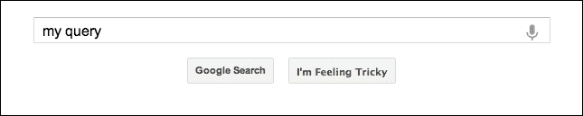

现在，让我们来实现这个棘手的部分，让按钮在一秒内显示和隐藏。你可以用一个简单的函数来完成这个任务。让我们称它为 `toggle()`。每次调用这个函数时，它会检查 CSS 属性 `visibility` 的值，如果它被隐藏，就将其设置为可见，反之亦然，如下面的代码片段所示：

```js
    function toggle() { 
      var st = document.querySelectorAll('button')[2].style; 
      st.visibility = (st.visibility === 'hidden') 
        ? 'visible' 
        : 'hidden'; 
    } 

```

我们不手动调用函数，而是设置一个间隔并在每秒调用它：

```js
    > var myint = setInterval(toggle, 1000); 

```

结果？按钮开始闪烁，使其更难点击。当你厌倦了追逐它时，只需编写以下代码行来删除超时间隔：

```js
    > clearInterval(myint); 

```

## 创建新节点

要创建新节点，你可以使用 `createElement()` 和 `createTextNode()` 方法。一旦你有新节点，你可以使用 `appendChild()`、`insertBefore()` 或 `replaceChild()` 将它们添加到 DOM 树中。

重新加载[`www.phpied.com/files/jsoop/ch7.html`](http://www.phpied.com/files/jsoop/ch7.html)并让我们来玩。

创建一个新的`p`元素并设置其`innerHTML`，如下面的代码所示：

```js
    > var myp = document.createElement('p'); 
    > myp.innerHTML = 'yet another'; 
           "yet another" 

```

新元素会自动获得所有默认属性，例如`style`，你可以按照以下方式修改：

```js
    > myp.style; 
           CSSStyleDeclaration 
    > myp.style.border = '2px dotted blue'; 
           "2px dotted blue" 

```

使用`appendChild()`，你可以将新节点添加到 DOM 树中。在`document.body`节点上调用此方法意味着在最后一个子节点之后创建一个额外的子节点，如下所示：

```js
    > document.body.appendChild(myp); 
           <p style="border: 2px dotted blue;">yet another</p> 

```

以下是新节点附加后页面外观的示例：

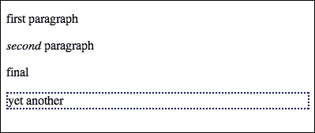

### 仅 DOM 方法

`innerHTML`属性比使用纯 DOM 更快地完成任务。在纯 DOM 中，你需要执行以下步骤：

1.  创建一个包含更多文本的新文本节点。

1.  创建一个新的段落节点。

1.  将文本节点作为子节点附加到段落上。

1.  将段落作为子节点附加到`body`上。

这样，你可以创建任意数量的文本节点和元素，并以你喜欢的任何方式嵌套它们。比如说，你想要将以下 HTML 添加到 body 的末尾：

```js
    <p>one more paragraph<strong>bold</strong></p> 

```

将前面的代码呈现为层次结构将类似于以下代码片段：

```js
    P element 
        text node with value "one more paragraph" 
        STRONG element 
            text node with value "bold" 

```

实现这一点的代码如下：

```js
    // create P 
    var myp = document.createElement('p'); 
    // create text node and append to P 
    var myt = document.createTextNode('one more paragraph'); 
    myp.appendChild(myt); 
    // create STRONG and append another text node to it 
    var str = document.createElement('strong'); 
    str.appendChild(document.createTextNode('bold')); 
    // append STRONG to P 
    myp.appendChild(str); 
    // append P to BODY 
    document.body.appendChild(myp); 

```

### 使用`cloneNode()`方法

创建节点另一种方式是通过复制或克隆现有的节点。`cloneNode()`方法就是这样做的，并接受一个布尔参数（`true` = 深拷贝包含所有子节点，`false` = 浅拷贝，只包含此节点）。让我们测试一下这个方法。

获取你想要克隆的元素的引用可以按照以下方式完成：

```js
    > var el = document.getElementsByTagName('p')[1]; 

```

现在，`el`指向页面的第二段，看起来如下所示：

```js
    <p><em>second</em> paragraph</p> 

```

让我们创建`el`的一个浅克隆并将其按照以下方式附加到`body`上：

```js
    > document.body.appendChild(el.cloneNode(false)); 

```

你在页面上不会看到任何区别，因为浅拷贝只复制了`P`节点而没有子节点。这意味着段落内的文本，作为一个文本节点子节点，没有被克隆。前面的行将与以下代码行等价：

```js
    > document.body.appendChild(document.createElement('p')); 

```

然而，如果你创建了一个深拷贝，从`P`开始的整个 DOM 子树都会被复制，这包括文本节点和`EM`元素。这一行将（在视觉上）将第二段复制到文档的末尾。考虑以下代码行：

```js
    > document.body.appendChild(el.cloneNode(true)); 

```

你也可以只复制`EM`，如下面的代码行所示：

```js
    > document.body.appendChild(el.firstChild.cloneNode(true)); 
           <em>second</em> 

```

或者，你可以只复制值为`second`的文本节点，如下所示：

```js
    > document.body.appendChild( 
        el.firstChild.firstChild.cloneNode(false)); 
           "second" 

```

### 使用`insertBefore()`方法

使用`appendChild()`，你只能将新子节点添加到所选元素的末尾。为了更精确地控制位置，有`insertBefore()`方法。这与`appendChild()`相同，但接受一个额外的参数，指定插入位置（在哪个元素之前）插入新节点。例如，以下代码在`body`元素的末尾插入一个文本节点：

```js
    > document.body.appendChild(document.createTextNode('boo!')); 

```

此外，这还会创建另一个文本节点并将其作为`body`元素的第一个子节点添加：

```js
    document.body.insertBefore( 
      document.createTextNode('first boo!'), 
      document.body.firstChild 
    ); 

```

## 移除节点

要从 DOM 树中移除节点，你可以使用 `removeChild()` 方法。再次，让我们从相同的页面和 `body` 开始：

```js
      <body> 
        <p class="opener">first paragraph</p> 
        <p><em>second</em> paragraph</p> 
        <p id="closer">final</p> 
        <!-- and that's about it --> 
      </body> 

```

这里是如何移除第二个段落的：

```js
    > var myp = document.getElementsByTagName('p')[1]; 
    > var removed = document.body.removeChild(myp); 

```

如果你想稍后使用它，该方法会返回被移除的节点。即使元素不再在树中，你仍然可以使用所有 DOM 方法。让我们看看以下代码：

```js
    > removed; 
           <p>...</p> 
    > removed.firstChild; 
           <em>second</em> 

```

此外，还有 `replaceChild()` 方法，它可以移除一个节点并替换另一个节点。

移除节点后，树看起来如下所示：

```js
      <body> 
        <p class="opener">first paragraph</p> 
        <p id="closer">final</p> 
        <!-- and that's about it --> 
      </body> 

```

现在，第二个段落是具有 ID `"closer"` 的段落，如下所示：

```js
    > var p = document.getElementsByTagName('p')[1]; 
    > p; 
           <p id="closer">final</p> 

```

让我们用 `removed` 变量中的段落替换这个段落。考虑以下代码：

```js
    > var replaced = document.body.replaceChild(removed, p); 

```

就像 `removeChild()` 一样，`replaceChild()` 返回一个引用，该引用现在已不在树中：

```js
    > replaced; 
           <p id="closer">final</p> 

```

现在，身体看起来像以下这段代码：

```js
      <body> 
        <p class="opener">first paragraph</p> 
        <p><em>second</em> paragraph</p> 
        <!-- and that's about it --> 
      </body> 

```

要快速清除子树的所有内容，可以将 `innerHTML` 设置为空字符串。这将移除 `body` 元素的所有子元素：

```js
    > document.body.innerHTML = ''; 
           "" 

```

测试如下进行：

```js
    > document.body.firstChild; 
           null 

```

使用 `innerHTML` 移除非常快且简单。仅使用 DOM 的方法将是遍历所有子节点并逐个移除它们。以下是一个从给定起始节点移除所有节点的简单函数：

```js
    function removeAll(n) { 
      while (n.firstChild) { 
        n.removeChild(n.firstChild); 
      } 
    } 

```

如果你想要从 `body` 元素中删除所有子元素，并使页面保留空的 `<body></body>`，请使用以下代码：

```js
    > removeAll(document.body); 

```

## HTML 仅有的 DOM 对象

如你所知，DOM 适用于 XML 和 HTML 文档。你之前学到的关于遍历树、添加、删除或修改节点的内容，适用于任何 XML 文档。然而，有一些仅适用于 HTML 的对象和属性。

`document.body` 是这样一个仅包含 HTML 的对象。在 HTML 文档中，`<body>` 标签非常常见，而且经常被访问，因此有一个比等效的 `document.getElementsByTagName('body')[0]` 更短、更友好的对象是有意义的。

`document.body` 元素是继承自史前 DOM Level 0 并移动到 DOM 规范 HTML 扩展的一个 `legacy` 对象的例子。还有其他与 `document.body` 元素类似的对象。对于其中一些，没有核心 DOM 等价物；对于其他一些，有等价物；然而，DOM 0 原始版本无论如何都被移植以简化并保留历史。

### 访问文档的原始方法

到 HTML 文档的元素。这主要是通过以下一些集合完成的：与 DOM 不同，DOM 可以让你访问任何元素，甚至注释和空白，最初 JavaScript 对 HTML 文档的元素只有有限的访问权限。这主要是通过以下一些集合完成的：

+   `document.images`：这是页面上所有图像的集合。其核心 DOM 等价物是 `document.getElementsByTagName('img')`。

+   `document.applets`：这与 `document.getElementsByTagName('applet')` 相同。

+   `document.links`：该`document.links`集合包含页面上的所有`<a href="..."></a>`标签的列表，即具有`href`属性的`<a>`标签。

+   `document.anchors`：`document.anchors`集合包含所有具有名称属性（`<a name="..."></a>`）的链接。

+   `document.forms`：最广泛使用的集合之一是`document.forms`，它包含`<form>`元素的列表。

让我们玩一个包含表单和输入字段的页面（[`www.phpied.com/files/jsoop/ch7-form.html`](http://www.phpied.com/files/jsoop/ch7-form.html)）。以下代码行提供了访问页面第一个表单的方法：

```js
    > document.forms[0]; 

```

这与以下代码行相同：

```js
    > document.getElementsByTagName('forms')[0]; 

```

`document.forms`集合包含输入字段和按钮的集合，可通过`elements`属性访问。以下是如何访问页面上的第一个表单的第一个输入字段的方法：

```js
    > document.forms[0].elements[0]; 

```

一旦您访问到某个元素，您就可以将其属性作为对象属性访问。测试页面中第一个表单的第一个字段如下：

```js
    <input name="search" id="search" type="text" size="50" 
        maxlength="255" value="Enter email..." /> 

```

您可以使用以下代码更改字段中的文本（`value`属性的值）：

```js
    > document.forms[0].elements[0].value = 'me@example.org'; 
        "me@example.org" 

```

如果您想动态禁用该字段，请使用以下代码：

```js
    > document.forms[0].elements[0].disabled = true; 

```

当表单或`form`元素具有`name`属性时，您也可以通过名称访问它们，如下所示：

```js
    > document.forms[0].elements['search']; // array notation 
    > document.forms[0].elements.search;    // object property 

```

### 使用`document.write()`方法

`document.write()`方法允许您在页面加载时将 HTML 插入页面。以下是一个类似代码的示例：

```js
    <p>It is now  
      <script> 
        document.write("<em>" + new Date() + "</em>"); 
      </script> 
    </p> 

```

这与您直接在 HTML 文档的源中拥有日期相同，如下所示：

```js
    <p>It is now
      <em>Fri Apr 26 2013 16:55:16 GMT-0700 (PDT)</em> 
    </p> 

```

注意，您只能在页面加载时使用`document.write()`方法。如果在页面加载后尝试使用，它将替换整个页面的内容。

很少需要使用`document.write()`方法，如果您认为需要，请尝试其他方法。DOM Level 1 提供的修改页面内容的方法更受欢迎，并且更加灵活。

### Cookies、标题、引用者和域名

在本节中您将看到的`document`的四个附加属性也是从 DOM Level 0 迁移到 DOM Level 1 的 HTML 扩展。与之前的属性不同，对于这些属性，没有核心 DOM 等价物。

`document.cookie`是一个包含字符串的属性。这个字符串是服务器和客户端之间交换的 cookie 内容。当服务器向浏览器发送页面时，它可能包括`Set-Cookie` HTTP 头。当客户端向服务器发送请求时，它通过`Cookie`头将 cookie 信息发送回服务器。使用`document.cookie`，您可以更改浏览器发送给服务器的 cookie。例如，访问`cnn.com`并在控制台中输入`document.cookie`会得到以下输出：

```js
    > document.cookie;
      "mbox=check#true#1356053765|session#1356053704195-121286#1356055565;... 

```

`document.title`属性允许您更改浏览器窗口中显示的页面标题。例如，查看以下代码：

```js
    > document.title = 'My title'; 
       "My title" 

```

注意，这不会改变`<title>`元素的价值，但只会改变浏览器窗口中的显示，所以它不等于`document.querySelector('title')`。

`document.referrer`属性告诉你之前访问的页面的 URL。这是浏览器在请求页面时在`Referer` HTTP 头中发送的相同值。（注意，`Referer`在 HTTP 头中拼写错误，但在 JavaScript 的`document.referrer`中是正确的）。如果你是通过 Yahoo 搜索访问了 CNN 页面，你可以看到以下内容：

```js
    > document.referrer; 
       "http://search.yahoo.com/search?p=cnn&ei=UTF-8&fr=moz2" 

```

`document.domain`属性让你可以访问当前加载页面的域名。这通常在需要执行所谓的域名放松时使用。想象你的页面是`www.yahoo.com`，在其中，你有一个在`music.yahoo.com`子域名上托管的内联框架。这些是两个不同的域名，所以浏览器的安全限制不会允许页面和内联框架进行通信。为了解决这个问题，你可以在两个页面上设置`document.domain`属性为`yahoo.com`，这样它们就能互相通信。

注意，你只能将域名设置为更不具体的一个，例如，你可以将`www.yahoo.com`改为`yahoo.com`，但不能将`yahoo.com`改为`www.yahoo.com`，或任何其他非 yahoo 域名。考虑以下代码：

```js
    > document.domain; 
       "www.yahoo.com" 
    > document.domain = 'yahoo.com'; 
       "yahoo.com" 
    > document.domain = 'www.yahoo.com'; 
       Error: SecurityError: DOM Exception 18 
    > document.domain = 'www.example.org'; 
       Error: SecurityError: DOM Exception 18 

```

在本章之前，你看到了`window.location`对象。嗯，同样的功能也作为`document.location`对象可用：

```js
    > window.location === document.location; 
       true 

```

# 事件

想象你正在收听一个广播节目，他们宣布，“重大事件！巨大！外星人已登陆地球！”你可能想，“嗯，随便吧”；一些其他听众可能会想“他们是来和平的”；还有一些人可能会想，“我们都要死了！”同样，浏览器会广播事件，如果你的代码决定调谐并监听这些事件，它会被通知。以下是一些示例事件：

+   用户点击一个按钮

+   用户在表单字段中输入一个字符

+   页面加载完成

你可以将一个名为事件监听器或事件处理器的 JavaScript 函数附加到特定事件上，浏览器将在事件发生时立即调用你的函数。让我们看看这是如何完成的。

## 内联 HTML 属性

将特定属性添加到标签中是最懒惰但最不可维护的方法；以下代码行为例：

```js
    <div onclick="alert('Ouch!')">click</div> 

```

在这种情况下，当用户点击`<div>`时，点击事件被触发，并且包含在`onclick`属性中的 JavaScript 代码字符串被执行。没有明确监听点击事件的函数；然而，幕后仍然创建了一个函数，它包含了你指定的`onclick`属性的值。

## 元素属性

另一种在点击事件触发时执行一些代码的方法是将函数分配给 DOM 节点元素的`onclick`属性。例如，看看以下代码片段：

```js
    <div id="my-div">click</div> 
    <script> 
      var myelement = document.getElementById('my-div'); 
      myelement.onclick = function () { 
        alert('Ouch!'); 
        alert('And double ouch!'); 
      }; 
    </script> 

```

这种方式更好，因为它可以帮助你保持`<div>`标签不包含任何 JavaScript 代码。始终记住，HTML 是用于内容的，JavaScript 是用于行为的，CSS 是用于格式的，你应该尽可能地将这三者分开。

这种方法的缺点是你只能将一个函数附加到事件上，就像广播节目只有一个听众一样。确实，你可以在同一个函数内部做很多事情，但这并不总是方便的，就像所有的广播听众都在同一个房间里一样。

## DOM 事件监听器

与浏览器事件交互的最佳方式是使用 DOM Level 2 中概述的事件监听器方法，其中可以有多个函数监听一个事件。当事件发生时，所有函数都会执行。所有的监听器不需要相互了解，可以独立工作。它们可以在任何时候加入或退出，而不会影响其他监听器。

让我们使用上一节中相同的简单标记，您可以在[`www.phpied.com/files/jsoop/ch7.html`](http://www.phpied.com/files/jsoop/ch7.html)上尝试使用它。它包含以下标记，具体如下：

```js
    <p id="closer">final</p> 

```

您可以使用`addEventListener()`方法将监听器分配给点击事件。以下是如何附加两个监听器的示例：

```js
    var mypara = document.getElementById('closer'); 
    mypara.addEventListener('click', function () { 
      alert('Boo!'); 
    }, false); 
    mypara.addEventListener( 
      'click', console.log.bind(console), false); 

```

正如你所见，`addEventListener`

## 捕获和冒泡

在`addEventListener()`的调用中，有一个第三个参数`false`。让我们看看它是用来做什么的。

假设你有一个链接在无序列表中，如下所示：

```js
    <body> 
      <ul> 
        <li><a href="http://phpied.com">my blog</a></li> 
      </ul> 
    </body> 

```

当你点击链接时，你实际上也在点击列表项`<li>`、`<ul>`列表、`<body>`标签，最终是整个文档。这被称为事件传播。点击链接也可以看作是点击文档。事件传播的过程可以通过以下两种方式实现：

+   **事件捕获**：这个点击事件首先发生在文档上，然后传播到 body、列表、列表项，最后到链接

+   **事件冒泡**：这个点击事件发生在链接上，然后冒泡到文档

DOM Level 2 事件规范建议事件在三个阶段传播，即捕获阶段、目标阶段和冒泡阶段。这意味着事件从文档传播到链接（目标），然后冒泡回文档。事件对象有一个`eventPhase`属性，它反映了当前阶段：

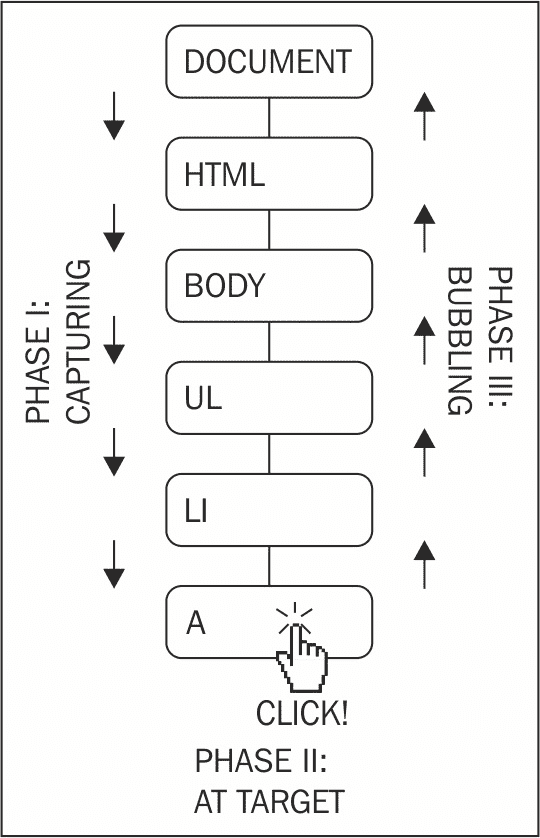

从历史上看，IE 和 Netscape（各自独立工作，没有遵循标准）实现了完全相反的方法。IE 只实现了冒泡，而 Netscape 只实现了捕获。今天，在 DOM 规范之后很久，现代浏览器实现了所有三个阶段。

与事件传播相关的实际影响如下：

+   `addEventListener()`的第三个参数指定是否使用捕获。为了使你的代码在浏览器之间更具可移植性，最好始终将此参数设置为`false`并仅使用冒泡。

+   你可以在你的监听器中停止事件的传播，这样它就不会冒泡并永远不会到达文档。为此，你可以调用事件对象的`stopPropagation()`方法；下一个部分有一个示例。

+   你还可以使用事件委托。如果你在`<div>`内部有十个按钮，你总是可以为每个按钮附加十个事件监听器。然而，更聪明的事情是只将一个监听器附加到包装的`<div>`上，一旦事件发生，检查哪个按钮是点击的目标。

作为旁注，在旧版 IE 中也有一种使用事件捕获的方法（使用`setCapture()`和`releaseCapture()`方法），但仅限于鼠标事件。捕获任何其他事件（例如按键事件）是不支持的。

## 停止传播

让我们看看如何停止事件冒泡的示例。回到测试文档，这里有这段代码：

```js
    <p id="closer">final</p> 

```

让我们定义一个处理段落点击的函数，如下所示：

```js
    function paraHandler() { 
      alert('clicked paragraph'); 
    } 

```

现在，让我们将此函数作为监听器附加到点击事件：

```js
    var para = document.getElementById('closer'); 
    para.addEventListener('click', paraHandler, false); 

```

让我们也将监听器附加到 body、文档和浏览器窗口上的点击事件：

```js
    document.body.addEventListener('click', function () { 
      alert('clicked body'); 
    }, false); 
    document.addEventListener('click', function () { 
      alert('clicked doc'); 
    }, false); 
    window.addEventListener('click', function () { 
      alert('clicked window'); 
    }, false); 

```

注意，DOM 规范没有提及窗口上的事件。为什么会有，因为 DOM 处理的是文档而不是浏览器。因此，浏览器对窗口事件的处理不一致。

现在，如果你点击段落，你会看到四个警告说：

+   点击段落

+   点击 body

+   点击文档

+   点击窗口

这说明了同一个点击事件是如何从目标向上传播（冒泡）到窗口的。

`addEventListener()`的反义词是`removeEventListener()`，它接受完全相同的参数。让我们通过编写以下代码行来移除附加到段落的监听器：

```js
    > para.removeEventListener('click', paraHandler, false); 

```

如果你现在尝试，你只会看到 body、文档和窗口上的点击事件的警告，而不会在段落上。

现在，让我们停止事件的传播。你添加为监听器的函数接收事件对象作为参数，你可以按照以下方式调用该事件对象的`stopPropagation()`方法：

```js
    function paraHandler(e) { 
      alert('clicked paragraph'); 
      e.stopPropagation(); 
    } 

```

添加修改后的监听器如下所示：

```js
    para.addEventListener('click', paraHandler, false); 

```

现在，当你点击段落时，你将只看到一个警告，因为事件不会冒泡到 body、文档或窗口。

注意，当你移除监听器时，你必须传递一个指向你之前附加的相同函数的指针。否则，执行以下操作不会起作用，因为第二个参数是一个新函数，而不是添加事件监听器时传递的相同函数，即使主体完全相同。考虑以下代码：

```js
    document.body.removeEventListener('click',  
      function () { 
        alert('clicked body'); 
      },  
    false); //  does NOT remove the handler 

```

## 阻止默认行为

一些浏览器事件具有预定义的行为。例如，点击链接会导致浏览器导航到另一个页面。你可以为链接的点击事件附加监听器，并且你也可以通过在事件对象上调用`preventDefault()`方法来禁用默认行为。

让我们看看你如何通过每次点击链接时都询问“你确定要跟随这个链接吗？”来烦扰你的访客？如果用户点击**取消**（导致`confirm()`返回`false`），则会调用`preventDefault()`方法，如下所示：

```js
    // all links 
    var all_links = document.getElementsByTagName('a');  
    for (var i = 0; i < all_links.length; i++) { // loop all links 
      all_links[i].addEventListener( 
        'click',       // event type 
        function (e) { // handler 
          if (!confirm('Sure you want to follow this link?')) { 
            e.preventDefault(); 
          } 
        }, 
        false // don't use capturing 
      );  
    } 

```

注意，并非所有事件都允许你阻止默认行为。大多数都允许，但如果你想确保，你可以检查事件对象的`cancellable`属性。

## 跨浏览器事件监听器

如你所知，大多数现代浏览器几乎完全实现了 DOM Level 1 规范。然而，事件直到 DOM 2 才被标准化。因此，IE 在版本 9 之前与现代浏览器在实现此功能方面存在相当多的差异。

查看一个示例，该示例将点击元素（目标元素）的`nodeName`写入控制台：

```js
    document.addEventListener('click', function (e) { 
      console.log(e.target.nodeName); 
    }, false); 

```

现在，让我们看看 IE 的不同之处：

+   在 IE 中，没有`addEventListener()`方法；尽管自 IE 版本 5 以来，有一个等效的`attachEvent()`方法。对于更早的版本，你唯一的选择是直接访问属性，例如`onclick`。

+   当使用`attachEvent()`时，`click`事件变为`onclick`。

+   如果你以传统方式监听事件（例如，通过将函数值设置为`onclick`属性），当回调函数被调用时，它不会接收到作为参数传递的事件对象。然而，无论你在 IE 中如何附加监听器，总有一个全局对象`window.event`指向最新的事件。

+   在 IE 中，事件对象没有提供目标属性来告诉你事件是在哪个元素上触发的，但它确实有一个等效的属性称为`srcElement`。

+   如前所述，事件捕获不适用于所有事件，因此应该只使用冒泡。

+   没有提供`stopPropagation()`方法，但你可以将 IE 特有的`cancelBubble`属性设置为`true`。

+   没有提供`preventDefault()`方法，但你可以将 IE 特有的`returnValue`属性设置为`false`。

+   要停止监听事件，而不是在 IE 中使用`removeEventListener()`，你需要使用`detachEvent()`。

因此，这是之前代码的修订版，它可以在所有浏览器中工作：

```js
    function callback(evt) { 
      // prep work 
      evt = evt || window.event; 
      var target = evt.target || evt.srcElement; 

     // actual callback work 
      console.log(target.nodeName); 
    } 

    //  start listening for click events 
    if (document.addEventListener) { // Modern browsers 
      document.addEventListener('click', callback, false); 
    } else if (document.attachEvent) { // old IE 
      document.attachEvent('onclick', callback); 
    } else { 
      document.onclick = callback; // ancient 
    } 

```

## 事件类型

现在你已经知道了如何处理跨浏览器事件。然而，所有前面的例子都只使用了点击事件。还有哪些事件正在发生呢？正如你可能猜到的，不同的浏览器提供了不同的事件。存在一组跨浏览器事件，还有一些特定于浏览器的。要获取事件的完整列表，你应该查阅浏览器的文档，但这里有一些跨浏览器事件的示例：

+   鼠标事件

    +   `mouseup`, `mousedown`, `click` (顺序是 mousedown-up-click), `dblclick`

    +   `mouseover` (鼠标悬停在元素上), `mouseout` (鼠标曾经悬停在元素上但已离开), `mousemove`

+   键盘事件

    +   `keydown`, `keypress`, `keyup` (按顺序发生)

+   加载/窗口事件

    +   `load` (图像或页面及其所有组件加载完成), `unload` (用户离开页面), `beforeunload` (脚本可以提供给用户一个停止卸载的选项)

    +   `abort` (用户停止加载页面或图像在 IE 中), `error` (JavaScript 错误，当图像在 IE 中无法加载时)

    +   `resize` (浏览器窗口大小改变), `scroll` (页面滚动), `contextmenu` (右键菜单出现)

+   表单事件

    +   `focus` (进入表单字段), `blur` (离开表单字段)

    +   `change` (值改变后离开字段), `select` (在文本字段中选择文本)

    +   `reset` (清除所有用户输入), `submit` (提交表单)

此外，现代浏览器提供了拖拽事件（`dragstart`, `dragend`, `drop` 等）和触摸设备提供了 `touchstart`, `touchmove`, 和 `touchend`。

这就结束了事件讨论。请参考本章末尾的练习部分，以创建自己的事件实用工具来处理跨浏览器事件。

# XMLHttpRequest

`XMLHttpRequest()` 是一个对象（一个构造函数），允许你从 JavaScript 发送 HTTP 请求。历史上，XHR (`XMLHttpRequest`) 是在 IE 中引入的，并作为 ActiveX 对象实现。从 IE7 开始，它是一个原生浏览器对象，就像在其他浏览器中一样。跨浏览器对此对象的常见实现催生了所谓的 Ajax 应用程序，其中不再需要在需要新内容时每次都刷新整个页面。使用 JavaScript，你可以向服务器发送 HTTP 请求，获取响应，并仅更新页面的一部分。这样，你可以构建更响应式、更类似桌面应用程序的网页。

**Ajax** 代表 **Asynchronous JavaScript and XML**：

+   异步的，因为发送 HTTP 请求后，你的代码不需要等待响应；然而，它可以执行其他操作，并通过事件在响应到达时得到通知。

+   JavaScript 因为很明显 XHR 对象是用 JavaScript 创建的。

+   XML 因为最初开发者是向 XML 文档发送 HTTP 请求，并使用其中包含的数据来更新页面。然而，这已经不再是一种常见的做法，因为你可以以纯文本、更方便的 JSON 格式或简单地作为准备插入页面的 HTML 格式请求数据。

使用 `XMLHttpRequest` 对象有两个步骤，如下所示：

+   **发送请求**：这包括创建一个 `XMLHttpRequest` 对象并附加一个事件监听器

+   **处理响应**：这发生在你的事件监听器通知你响应已到达时，你的代码开始忙于使用响应做一些令人惊叹的事情

## 发送请求

为了创建一个对象，你将简单地使用以下代码（让我们稍后处理浏览器不一致性）：

```js
    var xhr = new XMLHttpRequest(); 

```

接下来，需要将事件监听器附加到由对象触发的`readystatechange`事件：

```js
    xhr.onreadystatechange = myCallback; 

```

然后，你需要调用`open()`方法，如下所示：

```js
    xhr.open('GET', 'somefile.txt', true); 

```

第一个参数指定了 HTTP 请求的类型，例如`GET`、`POST`、`HEAD`等。`GET`和`POST`是最常见的两种。当你不需要在请求中发送大量数据，且你的请求不会修改（写入）服务器上的数据时，使用`GET`；否则，使用`POST`。第二个参数是你请求的 URL。在这个例子中，它是位于页面同一目录下的文本文件`somefile.txt`。最后一个参数是一个布尔值，指定请求是否为异步（`true`，始终推荐这样做）或不是（`false`，阻止所有 JavaScript 执行并等待响应到达）。

最后一步是触发请求，如下所示：

```js
    xhr.send(''); 

```

`send()`方法接受你想要与请求一起发送的任何数据。对于`GET`请求，这是一个空字符串，因为数据在 URL 中。对于`POST`请求，它是一个`key=value&key2=value2`形式的查询字符串。

到目前为止，请求已发送，你的代码和用户可以继续进行其他任务。当从服务器返回响应时，回调函数`myCallback`将被调用。

## 处理响应

一个监听器被附加到`readystatechange`事件。那么，究竟什么是就绪状态，它是如何变化的？

XHR 对象有一个名为`readyState`的属性。每次它改变时，`readystatechange`事件都会触发。`readyState`属性的可能的值如下：

+   0-未初始化

+   1-加载中

+   2-加载中

+   3-交互

+   4-完成

当`readyState`的值为`4`时，意味着响应已返回并准备好被处理。在`myCallback`中，确保`readyState`为`4`之后，还需要检查的是 HTTP 请求的状态码。你可能请求了一个不存在的 URL，例如，并得到了`404`（文件未找到）状态码。有趣的状态码是`200`（OK），所以`myCallback`应该检查这个值。状态码在 XHR 对象的`status`属性中可用。

一旦`xhr.readyState`为`4`且`xhr.status`为`200`，你可以使用`xhr.responseText`属性访问请求的 URL 的内容。让我们看看如何实现`myCallback`来简单地`alert()`请求 URL 的内容：

```js
    function myCallback() { 

      if (xhr.readyState < 4) { 
        return; // not ready yet 
      } 

      if (xhr.status !== 200) { 
        alert('Error!'); // the HTTP status code is not OK 
        return; 
      } 

      //  all is fine, do the work 
      alert(xhr.responseText); 
    } 

```

一旦你收到了请求的新内容，你可以将其添加到页面中，用于某些计算，或者用于你找到的任何其他合适的目的。

总体来说，这个两步过程（发送请求和处理响应）是整个 XHR/Ajax 功能的核心。现在你已经了解了基础知识，你可以继续构建下一个 Gmail。哦，是的，让我们看看一些浏览器的不一致性。

## 在版本 7 之前的 IE 中创建 XMLHttpRequest 对象

在 Internet Explorer 中，版本 7 之前，`XMLHttpRequest`对象是一个 ActiveX 对象，所以创建 XHR 实例略有不同。它如下所示：

```js
    var xhr = new ActiveXObject('MSXML2.XMLHTTP.3.0'); 

```

`MSXML2.XMLHTTP.3.0`是你想要创建的对象的标识符。`XMLHttpRequest`对象有几个版本，如果你的页面访问者没有安装最新版本，你可以在放弃之前尝试两个较旧的版本。

对于一个完全跨浏览器的解决方案，你应该首先测试用户的浏览器是否支持`XMLHttpRequest`作为原生对象，如果不支持，则尝试 IE 的方式。因此，创建 XHR 实例的整个过程可能如下所示：

```js
    var ids = ['MSXML2.XMLHTTP.3.0', 
           'MSXML2.XMLHTTP', 
           'Microsoft.XMLHTTP']; 

    var xhr; 
    if (XMLHttpRequest) { 
      xhr = new XMLHttpRequest(); 
    } else { 
      // IE: try to find an ActiveX object to use 
      for (var i = 0; i < ids.length; i++) { 
        try { 
          xhr = new ActiveXObject(ids[i]); 
          break; 
        } catch (e) {} 
      } 
    } 

```

这是在做什么？`ids`数组包含要尝试的 ActiveX 程序 ID 列表。`xhr`变量指向新的 XHR 对象。代码首先检查`XMLHttpRequest`是否存在。如果存在，这意味着浏览器原生支持`XMLHttpRequest()`，所以浏览器相对较新。如果不存在，代码会遍历`ids`尝试创建对象。`catch(e)`块会静默地忽略失败并继续循环。一旦创建了一个`xhr`对象，你就会退出循环。

如你所见，这是一段相当多的代码，所以最好将其抽象成一个函数。实际上，章节末尾的一个练习要求你创建自己的 Ajax 实用工具。

## A 代表异步

现在你已经知道了如何创建 XHR 对象，给它一个 URL 并处理请求的响应。当你异步发送两个请求时会发生什么？如果第二个请求的响应先于第一个到达怎么办？

在前面的例子中，XHR 对象是全局的，`myCallback`依赖于这个全局对象的存在来访问其`readyState`、`status`和`responseText`属性。另一种方法，可以防止你依赖于全局变量，就是将回调包装在闭包中。让我们看看如何做：

```js
    var xhr = new XMLHttpRequest(); 

    xhr.onreadystatechange = (function (myxhr) { 
      return function () {  
        myCallback(myxhr);  
      }; 
    }(xhr)); 

    xhr.open('GET', 'somefile.txt', true); 
    xhr.send(''); 

```

在这种情况下，`myCallback()`接收 XHR 对象作为参数，并且不会在全局空间中寻找它。这也意味着在收到响应时，原始的`xhr`可能会被用于第二个请求。闭包始终指向原始对象。

## X 代表 XML

尽管现在 JSON（将在下一章中讨论）作为数据传输格式比 XML 更受欢迎，但 XML 仍然是一个选项。除了 `responseText` 属性外，XHR 对象还有一个名为 `responseXML` 的属性。当您发送一个针对 XML 文档的 HTTP 请求时，`responseXML` 指向一个 XML DOM 文档对象。要处理此文档，您可以使用本章前面讨论的所有核心 DOM 方法，例如 `getElementsByTagName()`、`getElementById()` 等。

## 以下是一个示例

让我们用一个示例来总结不同的 XHR 主题。您可以访问位于 [`www.phpied.com/files/jsoop/xhr.html`](http://www.phpied.com/files/jsoop/xhr.html) 的页面，亲自尝试这个示例。

主页面 `xhr.html` 是一个简单的静态页面，它只包含三个 `<div>` 标签，如下所示：

```js
    <div id="text">Text will be here</div> 
    <div id="html">HTML will be here</div> 
    <div id="xml">XML will be here</div> 

```

使用控制台，您可以编写代码请求三个文件，并将它们各自的内容加载到每个 `<div>` 中。

需要加载的三个文件如下：

+   `content.txt`：这是一个包含文本 `I am a text file` 的简单文本文件

+   `content.html`：这是一个包含 HTML 代码 `I am <strong>formatted</strong> <em>HTML</em>` 的文件

+   `content.xml`：这是一个包含以下代码的 XML 文件：

    ```js
        <?xml version="1.0" ?> 
        <root> 
            I'm XML data. 
        </root> 

    ```

所有文件都存储在 `xhr.html` 所在的同一目录中。

### 注意

由于安全原因，您只能使用原始的 `XMLHttpRequest` 来请求同一域上的文件。然而，现代浏览器支持 XHR2，这使得您可以在适当设置 `Access-Control-Allow-Origin` HTTP 头的情况下进行跨域请求。

首先，让我们创建一个函数来抽象请求/响应部分：

```js
    function request(url, callback) { 
      var xhr = new XMLHttpRequest();  
      xhr.onreadystatechange = (function (myxhr) { 
        return function () { 
          if (myxhr.readyState === 4 && myxhr.status === 200) { 
            callback(myxhr); 
          } 
        }; 
      }(xhr)); 
      xhr.open('GET', url, true); 
      xhr.send(''); 
    } 

```

此函数接受一个请求的 URL 和一个回调函数，一旦响应到达就调用该函数。让我们将此函数调用三次，每次为一个文件，如下所示：

```js
    request( 
      'http://www.phpied.com/files/jsoop/content.txt', 
      function (o) { 
        document.getElementById('text').innerHTML = 
          o.responseText; 
      } 
    ); 
    request( 
      'http://www.phpied.com/files/jsoop/content.html', 
      function (o) { 
        document.getElementById('html').innerHTML = 
          o.responseText; 
      } 
    ); 
    request( 
      'http://www.phpied.com/files/jsoop/content.xml', 
      function (o) { 
        document.getElementById('xml').innerHTML = 
          o.responseXML 
           .getElementsByTagName('root')[0] 
           .firstChild 
           .nodeValue; 
      }   
    ); 

```

回调函数是直接定义的。前两个是相同的。它们只是用请求文件的相应内容替换对应的 `<div>` 的 HTML。第三个稍微不同，因为它处理 XML 文档。首先，您将作为 `o.responseXML` 访问 XML DOM 对象。然后，使用 `getElementsByTagName()`，您将获取所有 `<root>` 标签的列表（只有一个）。`<root>` 的 `firstChild` 是一个文本节点，`nodeValue` 是其中包含的文本（`I'm XML data`）。然后，只需将 `<div id="xml">` 的 HTML 替换为新的内容。结果如下面的截图所示：

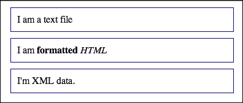

当处理 XML 文档时，您也可以使用 `o.responseXML.documentElement` 来获取 `<root>` 元素，而不是使用 `o.responseXML.getElementsByTagName('root')[0]`。请记住，`documentElement` 给您 XML 文档的根节点。HTML 文档中的根始终是 `<html>` 标签。

# 练习

在前几章中，练习题的答案可以在章节文本中找到。这次，一些练习需要你在本书之外进行更多阅读或实验。

1.  BOM：作为一个 BOM 练习，尝试编写一些错误、侵入性、用户不友好的代码，总体来说，非常 Web 1.0，摇动的浏览器窗口。尝试实现代码，打开一个 200 x 200 的弹出窗口，然后缓慢逐渐地将其调整为 400 x 400。然后，像有地震一样移动窗口。你只需要一个 `move*()` 函数，一个或多个 `setInterval()` 调用，可能还需要一个 `setTimeout()`/`clearInterval()` 来停止整个过程。或者，这里有一个更简单的：在 `document.title` 中打印当前日期/时间，并每秒更新一次，就像一个时钟。

1.  DOM：

    +   不同的实现 `walkDOM()`。同时，使其接受一个回调函数而不是硬编码 `console.log()`。

    +   使用 `innerHTML` 移除内容很容易（`document.body.innerHTML = ''`），但并不总是最佳选择。问题在于当有事件监听器附加到被移除的元素时；在 IE 中，它们不会被移除，导致浏览器泄漏内存，因为它存储了对不存在的对象的引用。实现一个通用函数，用于删除 DOM 节点，但首先删除任何事件监听器。你可以遍历一个节点的属性，并检查其值是否为函数。如果是，它很可能是像 `onclick` 这样的属性。在从树中删除元素之前，需要将其设置为 `null`。

    +   创建一个名为 `include()` 的函数，按需包含外部脚本。这意味着你需要动态创建一个新的 `<script>` 标签，设置其 `src` 属性，并将其附加到文档的 `<head>` 中。通过以下代码进行测试：

        ```js
                > include('somescript.js'); 

        ```

1.  事件：

    +   创建一个名为 `myevent` 的事件工具（对象），它具有以下跨浏览器的方法：

        +   `addListener(element, event_name, callback)`，其中 `element` 也可以是一个元素数组

        +   `removeListener(element, event_name, callback)`

        +   `getEvent(event)` 仅用于检查旧版 IE 的 `window.event`

        +   getTarget(event)

        +   stopPropagation(event)

        +   `preventDefault(event)`

    +   使用示例如下：

        ```js
                function myCallback(e) { 
                  e = myevent.getEvent(e); 
                  alert(myevent.getTarget(e).href); 
                  myevent.stopPropagation(e); 
                  myevent.preventDefault(e); 
                } 
                myevent.addListener(document.links, 'click', myCallback); 

        ```

    +   示例代码的结果应该是文档中的所有链接都无处可去，但只弹出一个 `href` 属性。

    +   创建一个绝对定位的 `<div>`，比如在 `x = 100px`，`y = 100px`。编写代码，使用箭头键或 *J*（左）、*K*（右）、*M*（下）和 *I*（上）键在页面上移动 div。重用 3.1 中的自己的事件工具。

1.  XMLHttpRequest：

    +   创建你自己的 XHR 工具（对象）名为 `ajax`。例如，看看以下代码：

        ```js
                function myCallback(xhr) { 
                  alert(xhr.responseText); 
                } 
                ajax.request('somefile.txt', 'get', myCallback); 
                ajax.request('script.php', 'post', myCallback, 
                'first=John&last=Smith'); 

        ```

# 摘要

你在本章中学到了很多。你学习了以下跨浏览器的 BOM 对象：

+   全局 `window` 对象的属性，如 `navigator`、`location`、`history`、`frames`、`screen`

+   `setInterval()`和`setTimeout()`方法；`alert()`、`confirm()`和`prompt()`；`moveTo/By()`和`resizeTo/By()`

然后，你学习了 DOM，这是一个 API，可以将 HTML 或 XML 文档表示为树结构，其中每个标签或文本都是树上的一个节点。你还学习了如何执行以下操作：

+   访问节点：

    +   使用父/子关系属性，如`parentNode`、`childNodes`、`firstChild`、`lastChild`、`nextSibling`和`previousSibling`

    +   使用`getElementsById()`、`getElementsByTagName()`、`getElementsByName()`和`querySelectorAll()`

+   修改节点：

    +   使用`innerHTML`或`innerText/textContent`

    +   使用`nodeValue`或`setAttribute()`，或者直接使用属性作为对象属性

+   使用`removeChild()`或`replaceChild()`移除节点

+   使用`appendChild()`、`cloneNode()`和`insertBefore()`添加新节点

你还学习了以下 DOM 0（标准化前）属性，已移植到 DOM Level 1：

+   集合，如`document.forms`、`images`、`links`、`anchors`、`applets`。使用这些是不推荐的，因为 DOM1 有更灵活的`getElementsByTagName()`方法。

+   `document.body`元素，它为你提供了方便访问`<body>`的方式。

+   `document.title`、`cookie`、`referrer`和`domain`。

接下来，你学习了浏览器如何广播你可以监听的事件。在跨浏览器环境中这样做并不简单，但这是可能的。事件会冒泡，因此你可以使用事件委托来更全局地监听事件。你还可以阻止事件的传播并干扰默认的浏览器行为。

最后，你学习了`XMLHttpRequest`对象，它允许你构建响应式网页，执行以下任务：

+   向服务器发送 HTTP 请求以获取数据片段

+   处理响应以更新页面部分
