# 第十二章 测试和调试

当你编写 JavaScript 应用程序时，你很快就会意识到拥有一个合理的测试策略是必不可少的。实际上，没有编写足够的测试几乎总是个坏主意。确保以下要点至关重要，即覆盖你代码的所有非平凡功能：

+   现有代码的行为符合规范

+   任何新的代码都不会破坏由规范定义的行为

这两点都非常重要。许多工程师认为只有第一个点是覆盖足够测试的唯一原因。测试覆盖的最明显优势是确保推送到生产系统的代码基本上是错误的。编写测试用例来智能地覆盖代码的最大功能区域，通常可以很好地反映代码的整体质量。在这方面不应该有任何争论或妥协。尽管如此，许多生产系统仍然缺乏足够的代码覆盖，这是非常不幸的。建立一种工程师将编写测试视为与编写代码一样重要的工程文化非常重要。

第二点甚至更重要。遗留系统通常很难管理。当你正在编写代码时，无论是别人写的还是由大型分布式团队写的，很容易引入错误并破坏东西。即使是最好的工程师也会犯错误。当你在一个你不太熟悉的代码库上工作时，如果没有合理的测试覆盖来帮助你，你会引入错误。由于没有测试用例来确认你的更改，你不会对你的更改有信心，因此你的代码发布将会不稳定、缓慢，并且显然充满了隐藏的错误。

你将避免重构或优化你的代码，因为你不会真正确定对代码库的哪些更改可能会破坏某些东西（再次强调，因为没有测试用例来确认你的更改）；所有这些都是一个恶性循环。这就像一个土木工程师说——虽然我建造了这座桥，但我对施工质量没有信心。它可能立即倒塌，也可能永远不会。虽然这听起来可能有些夸张，但我看到很多影响很大的生产代码被推送到生产环境而没有测试覆盖。这是有风险的，应该避免。当你编写足够的测试用例来覆盖大多数功能代码时，当你对这些部分进行更改时，你会立即意识到这个新更改是否有问题。如果你的更改使测试用例失败，你就会发现问题。如果你的重构破坏了测试场景，你就会发现问题；所有这些都在代码推送到生产之前发生。

近年来，像测试驱动开发和自测试代码这样的想法越来越受到重视，尤其是在敏捷方法中。这些想法在本质上都是合理的，并将帮助你编写健壮的代码——你自信的代码。我们将在本章中讨论所有这些想法。我们将了解如何在现代 JavaScript 中编写好的测试用例。我们还将探讨几个用于调试代码的工具和方法。JavaScript 传统的测试和调试有点困难，主要是因为缺乏工具，但现代工具使得这两者都变得容易且自然。

# 单元测试

当我们谈论测试用例时，我们主要指的是单元测试。假设我们想要测试的单元总是函数是不正确的。单元，或工作单元，是一个构成单个行为的逻辑单元。这个单元应该能够通过公共接口调用，并且应该能够独立进行测试。

因此，单元测试可以执行以下功能：

+   它测试单个逻辑函数

+   它可以无特定执行顺序地运行

+   它负责自己的依赖和模拟数据

+   它总是对相同的输入返回相同的结果

+   它应该是自我解释的、可维护的和可读的

马丁·福勒提倡使用 *测试金字塔* ([`martinfowler.com/bliki/TestPyramid.html`](http://martinfowler.com/bliki/TestPyramid.html)) 策略，以确保我们有大量的单元测试来确保最大的代码覆盖率。在本章中，我们将讨论两种重要的测试策略。

## 测试驱动开发

**测试驱动开发** (**TDD**) 在过去几年中获得了很大的关注。这个概念最初是在极限编程方法中作为一部分被提出的。想法是拥有短而重复的开发周期，其中重点在于首先编写测试用例。周期看起来如下：

1.  根据特定代码单元的规范添加测试用例。

1.  运行现有的测试用例套件，看看你编写的新测试用例是否失败；它应该会失败，因为该单元还没有代码。这一步确保当前的测试框架运行良好。

1.  编写主要服务于确认测试用例的代码。这段代码没有经过优化、重构，甚至可能完全不正确。然而，在这个阶段这是可以接受的。

1.  重新运行测试，看看所有测试用例是否通过。完成这一步后，你可以确信新代码没有破坏任何东西。

1.  重构代码以确保你正在优化单元并处理所有边界情况

这些步骤会重复应用于你添加的任何新代码。这是一种优雅的策略，非常适合敏捷方法。只有当代码的可测试单元很小，并且仅确认测试用例时，TDD 才会成功。

## 行为驱动开发

在尝试遵循 TDD（测试驱动开发）时，一个很常见的问题是词汇和正确性的定义。BDD（行为驱动开发）试图在遵循 TDD 编写测试用例时引入一种通用语言。这种语言确保业务和工程都在谈论同一件事情。

我们将使用 Jasmine 作为主要的 BDD（行为驱动开发）框架，并探索各种测试策略。

### 注意

你可以通过从[`github.com/jasmine/jasmine/releases/download/v2.3.4/jasmine-standalone-2.3.4.zip`](https://github.com/jasmine/jasmine/releases/download/v2.3.4/jasmine-standalone-2.3.4.zip)下载独立包来安装 Jasmine。

当你解压这个包时，你会看到以下目录结构：

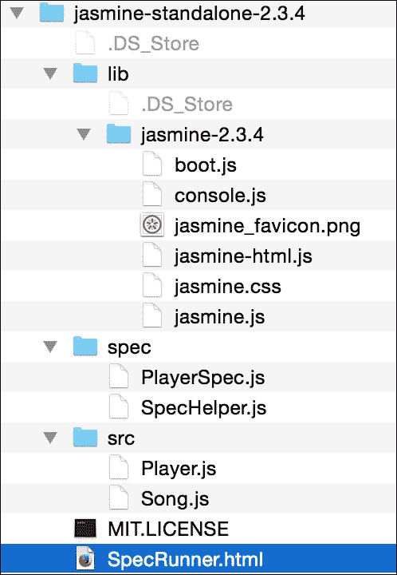

`lib`目录包含你在项目中需要编写 Jasmine 测试用例的 JavaScript 文件。如果你打开`SpecRunner.html`，你会在其中找到以下 JavaScript 文件：

```js
    <script src="img/jasmine.js"></script> 
    <script src="img/jasmine-html.js"></script> 
    <script src="img/boot.js"></script>     

    <!-- include source files here... -->    
    <script src="img/Player.js"></script>    
    <script src="img/Song.js"></script>     
    <!-- include spec files here... -->    
    <script src="img/SpecHelper.js"></script>    
    <script src="img/PlayerSpec.js"></script> 

```

前三个是 Jasmine 自己的框架文件。下一部分包括我们想要测试的源文件和实际的测试规范。

让我们通过一个非常普通的例子来实验一下 Jasmine。创建一个`bigfatjavascriptcode.js`文件，并将其放置在`src/`目录中。我们将要测试的函数如下：

```js
    function capitalizeName(name){ 
      return name.toUpperCase(); 
    } 

```

这是一个简单的函数，它只做一件事情。它接收一个字符串并返回一个大写字符串。我们将测试围绕这个函数的各种场景。这是之前讨论过的代码单元。

接下来，创建测试规范。创建一个 JavaScript 文件，`test.spec.js`，并将其放置在`spec/`目录中。你需要在你的`SpecRunner.html`中添加以下两行：文件应包含以下内容：

```js
    <script src="img/bigfatjavascriptcode.js"></script>     
    <script src="img/test.spec.js"></script>    

```

包含的顺序并不重要。当我们运行`SpecRunner.html`时，你会看到如下所示的图像：

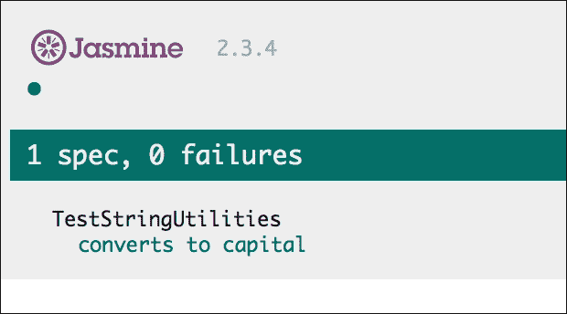

这是 Jasmine 报告，显示了已执行的测试数量以及失败和成功的计数。现在，让我们让测试用例失败。我们想要测试一个传递给函数的`undefined`变量的情况。让我们添加一个额外的测试用例，如下所示：

```js
    it("can handle undefined", function() { 
        var str= undefined; 
        expect(capitalizeName(str)).toEqual(undefined); 
    }); 

```

现在，当你运行`SpecRunner`时，你会看到以下结果：

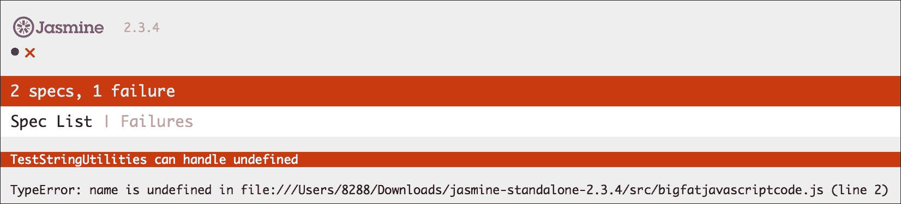

如你所见，这个测试用例的失败在详细的错误堆栈中显示。现在，我们将着手修复这个问题。在你的原始 JS 代码中，可以这样处理`undefined`：

```js
    function capitalizeName(name){ 
      if(name){ 
        return name.toUpperCase(); 
      }   
    } 

```

通过这个更改，你的测试用例将通过，你将在 Jasmine 报告中看到以下结果：

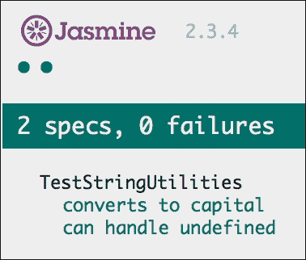

这与测试驱动开发的样子非常相似。你编写测试用例，然后填写必要的代码以符合规范，并重新运行测试套件。让我们了解 Jasmine 测试的结构。

我们的测试规范看起来像以下代码片段：

```js
    describe("TestStringUtilities", function() { 
          it("converts to capital", function() { 
              var str = "albert"; 
              expect(capitalizeName(str)).toEqual("ALBERT"); 
          }); 
          it("can handle undefined", function() { 
              var str= undefined; 
              expect(capitalizeName(str)).toEqual(undefined); 
          }); 
    }); 

```

`describe("TestStringUtilities"` 是测试套件。测试套件的名字应该描述我们正在测试的代码单元；这可以是一个函数或一组相关功能。在规格说明中，你将调用全局 Jasmine 函数`it`，并将传递规格的标题和验证测试用例条件的函数。这个函数是实际的测试用例。你可以使用`expect`函数捕获一个或多个断言或一般期望。当所有期望都为`true`时，你的规格通过。你可以在`describe`和`it`函数内部编写任何有效的 JavaScript 代码。你验证作为期望一部分的值是通过匹配器进行匹配的。在我们的例子中，`toEqual`是匹配两个值相等的匹配器。Jasmine 包含丰富的匹配器，以适应大多数常见用例。以下是一些 Jasmine 支持的常见匹配器：

+   `toBe`: 这个匹配器检查两个被比较的对象是否相等。这等同于`===`比较。例如，查看以下代码片段：

    ```js
            var a = { value: 1}; 
            var b = { value: 1 }; 

            expect(a).toEqual(b);  // success, same as == comparison 
            expect(b).toBe(b);     // failure, same as === comparison 
            expect(a).toBe(a);     // success, same as === comparison 

    ```

+   `not`: 你可以使用 not 前缀来否定一个匹配器。例如，`expect(1).not.toEqual(2);`将否定`toEqual()`所做的匹配。

+   `toContain`: 这用于检查一个元素是否是数组的一部分。它并不像`toBe`那样进行精确的对象匹配。例如，看看以下代码行：

    ```js
            expect([1, 2, 3]).toContain(3); 
            expect("astronomy is a science").toContain("science"); 

    ```

+   `toBeDefined` 和 `toBeUndefined`: 这两个匹配器便于检查变量是否为`undefined`。

+   `toBeNull`: 这用于检查变量的值是否为`null`。

+   `toBeGreaterThan` 和 `toBeLessThan`: 这些匹配器执行数值比较（也适用于字符串）。例如，考虑以下代码片段：

    ```js
            expect(2).toBeGreaterThan(1); 
            expect(1).toBeLessThan(2); 
            expect("a").toBeLessThan("b"); 

    ```

Jasmine 的一个有趣特性是间谍。当你编写一个大型系统时，你不可能确保所有系统总是可用且正确。同时，你也不想因为某个可能损坏或不可用的依赖而导致单元测试失败。为了模拟一个所有依赖都可用于我们想要测试的单元代码的情况，我们将模拟这个依赖以始终给出我们期望的响应。模拟是测试的重要方面，大多数测试框架都提供了对模拟的支持。Jasmine 允许使用一个称为**间谍**的功能进行模拟。Jasmine 间谍本质上是对我们在编写测试用例时可能没有准备好的函数进行存根，但作为功能的一部分，我们需要跟踪我们是否正在执行这些依赖而不是忽略它们。考虑以下示例：

```js
    describe("mocking configurator", function() { 
      var cofigurator = null; 
      var responseJSON = {}; 

      beforeEach(function() { 
        configurator = { 
          submitPOSTRequest: function(payload) { 
            //This is a mock service that will eventually be replaced  
            //by a real service 
            console.log(payload); 
            return {"status": "200"}; 
          } 
        }; 
        spyOn(configurator, 'submitPOSTRequest').and.returnValue
         ({"status": "200"}); 
       configurator.submitPOSTRequest({ 
          "port":"8000", 
          "client-encoding":"UTF-8" 
        }); 
      }); 

      it("the spy was called", function() { 
        expect(configurator.submitPOSTRequest).toHaveBeenCalled(); 
      }); 

      it("the arguments of the spy's call are tracked", function() { 
        expect(configurator.submitPOSTRequest).toHaveBeenCalledWith(
          {"port":"8000", "client-encoding":"UTF-8"}); 
      }); 
    }); 

```

在这个例子中，当我们编写这个测试用例时，我们可能没有依赖的真实实现，`configurator.submitPOSTRequest()`，或者有人在修复这个特定的依赖；无论如何，我们都没有它可用。为了使我们的测试工作，我们需要模拟它。Jasmine 间谍允许我们用一个模拟替换一个函数，并允许我们跟踪其执行。

在这种情况下，我们需要确保调用了依赖项。当实际的依赖项准备好时，我们将重新访问这个测试用例以确保它符合规范；然而，此时我们只需要确保调用了依赖项。Jasmine 函数`tohaveBeenCalled()`让我们跟踪可能是一个模拟的函数的执行。我们可以使用`toHaveBeenCalledWith()`，这允许我们确定占位函数是否以正确的参数被调用。你可以使用 Jasmine spies 创建几个其他有趣的场景。由于本章的范围不允许我们涵盖所有这些内容，但我鼓励你自己去发现这些领域。

## Mocha、Chai 和 Sinon

虽然 Jasmine 是最突出的 JavaScript 测试框架，但 mocha 和 chai 在`Node.js`环境中越来越受欢迎：

+   Mocha 是用于描述和运行测试用例的测试框架

+   Chai 是 Mocha 支持的断言库

+   Sinon 在创建测试的模拟和占位符时很有用

我们不会在本书中讨论这些框架；然而，如果你想要尝试这些框架，Jasmine 的经验将很有用。

# JavaScript 调试

如果你不是一个完全的新程序员，我敢肯定你一定花了一些时间调试你或别人的代码。调试几乎就像是一种艺术形式。每种语言都有不同的调试方法和挑战。JavaScript 传统上是一种难以调试的语言。我曾经花费了无数个日夜在痛苦中尝试使用`alert()`函数调试糟糕的 JavaScript 代码。幸运的是，现代浏览器，如 Mozilla、Firefox 和 Google Chrome，都有优秀的**开发者工具**来帮助在浏览器中调试 JavaScript。有一些 IDE，如 IntelliJ IDEA 和 WebStorm，提供了对 JavaScript 和 Node.js 的出色调试支持。在本章中，我们将主要关注 Google Chrome 内置的开发者工具。Firefox 也支持 Firebug 扩展，并拥有出色的内置开发者工具，但由于它们的行为与 Google Chrome 的**开发者工具**大致相同，我们将讨论在这两种工具中都适用的常见调试方法。

在我们讨论具体的调试技术之前，让我们了解在尝试调试代码时我们感兴趣的错误类型。

## 语法错误

当你的代码中有不符合 JavaScript 语言语法的内容时，解释器会拒绝这段代码。如果你的 IDE 在语法检查方面提供帮助，这些错误很容易被发现。大多数现代 IDE 都帮助处理这些错误。之前，我们讨论了使用 JSLint 和 JSHint 等工具来捕获代码中的语法问题的实用性。它们分析代码并标记语法错误。JSHint 的输出可以非常启发人心。例如，以下输出显示了我们可以更改代码中的许多内容。以下代码片段来自我的一个现有项目：

```js
    temp git:(dev_branch) X jshint test.js 
    test.js: line 1, col 1, Use the function form of "use strict". 
    test.js: line 4, col 1, 'destructuring expression' 
      is available in ES6 (use esnext option) or 
      Mozilla JS extensions (use moz). 
    test.js: line 44, col 70, 'arrow function syntax (=>)' 
      is only available in ES6 (use esnext option). 
    test.js: line 61, col 33, 'arrow function syntax (=>)'
      is only available in ES6 (use esnext option). 
    test.js: line 200, col 29, Expected ')' to match '(' from
      line 200 and instead saw ':'. 
    test.js: line 200, col 29, 'function closure expressions' 
      is only available in Mozilla JavaScript extensions (use moz option). 
    test.js: line 200, col 37, Expected '}' to match '{' from 
      line 36 and instead saw ')'. 
    test.js: line 200, col 39, Expected ')' and instead saw '{'. 
    test.js: line 200, col 40, Missing semicolon. 

```

### 使用严格模式

我们在前面章节中简要讨论了严格模式。当你启用严格模式时，JavaScript 将不再接受代码中的语法错误。严格模式不会静默失败，而是将这些失败抛出错误。它还有助于将错误转换为实际错误。有两种方法可以强制执行严格模式。如果你想为整个脚本启用严格模式，你只需将 `use strict` 语句（带引号）作为你的 JavaScript 程序的第一行即可。如果你想使一个特定的函数符合严格模式，你可以将该指令作为函数的第一行。例如，看看以下代码片段：

```js
    function strictFn(){    
      // This line makes EVERYTHING under this scrict mode 
      'use strict';    
      ... 
      function nestedStrictFn() {  
        //Everything in this function is also nested 
        ... 
      }    
    } 

```

## 运行时异常

这些错误在你执行代码、尝试引用一个 `undefined` 变量或尝试处理一个 `null` 时出现。当运行时异常发生时，导致异常的特定行之后的任何代码都不会被执行。在代码中正确处理这样的异常情况至关重要。虽然异常处理可以帮助防止崩溃，但它们也有助于调试。你可以将可能遇到运行时异常的代码包裹在一个 `try{ }` 块中。当这个块内的任何代码生成运行时异常时，相应的处理器会捕获它。处理器由一个 `catch(exception){}` 块定义。让我们通过以下示例来澄清这一点：

```js
    try { 
      var a = doesnotexist; // throws a runtime exception 
    } catch(e) {  
      console.log(e.message);  //handle the exception 
      //prints - "doesnotexist is not defined" 
    } 

```

在这个例子中，`var a = doesnotexist` 这一行尝试将一个 `undefined` 变量 `doesnotexist` 赋值给另一个变量 `a`。这会导致运行时异常。当我们将这段有问题的代码包裹在 `try{}catch(){}` 块中，或者当异常发生（或抛出）时，执行将停止在 `try{}` 块中，并直接跳转到 `catch() {}` 处理器。捕获处理器负责处理异常情况。在这种情况下，我们将在控制台上显示错误信息以进行调试。你可以显式地抛出一个异常来触发代码中的未处理情况。考虑以下示例：

```js
    function engageGear(gear){ 
      if(gear==="R"){ console.log ("Reversing");} 
      if(gear==="D"){ console.log ("Driving");} 
      if(gear==="N"){ console.log ("Neutral/Parking");} 
      throw new Error("Invalid Gear State"); 
    } 
    try 
    { 
      engageGear("R");  //Reversing 
      engageGear("P");  //Invalid Gear State 
    } 
    catch(e){ 
      console.log(e.message); 
    } 

```

在这个例子中，我们正在处理齿轮换挡的有效状态：`R`、`N` 和 `D`；然而，当我们收到一个无效状态时，我们会明确地抛出一个异常，清楚地说明原因。当我们调用我们认为可能会抛出异常的函数时，我们将代码包裹在 `try{}` 块中，并附上一个 `catch(){}` 处理器。当异常被 `catch()` 块捕获时，我们将适当地处理异常情况。

### Console.log 和断言

在调试过程中，在控制台上显示执行状态非常有用。尽管如此，现代的开发者工具允许你在运行时设置断点并暂停执行以检查特定的值。你可以通过在控制台上记录一些变量状态来快速检测小问题。

带着这些概念，让我们看看如何使用 Chrome **开发者工具** 来调试 JavaScript 代码。

### Chrome 开发者工具

你可以通过点击**菜单** | **更多工具** | **开发者工具**来启动 Chrome **开发者工具**。请参考以下截图：

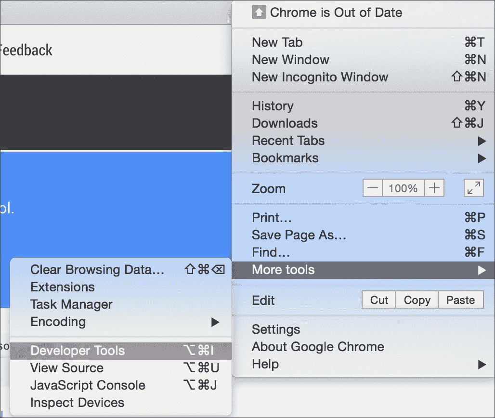

Chrome 开发者工具位于浏览器底部的面板，包含许多非常有用的部分。请参考以下截图：

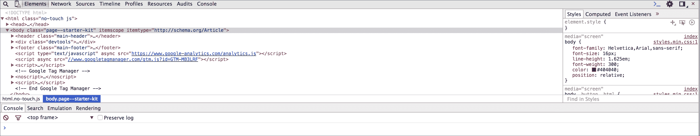

**元素**面板帮助你检查和监控每个组件的 DOM 树和关联样式表。

**网络**面板有助于理解网络活动。例如，你可以实时监控通过网络下载的资源。

对于我们来说，最重要的面板是**源**面板。这个面板是显示 JavaScript 和调试器的位置。让我们创建一个包含以下内容的示例 HTML：

```js
    <!DOCTYPE html> 
    <html> 
    <head> 
      <meta charset="utf-8"> 
      <title>This test</title> 
      <script type="text/javascript"> 
      function engageGear(gear){ 
        if(gear==="R"){ console.log ("Reversing");} 
        if(gear==="D"){ console.log ("Driving");} 
        if(gear==="N"){ console.log ("Neutral/Parking");} 
        throw new Error("Invalid Gear State"); 
      } 
      try 
      { 
        engageGear("R");  //Reversing 
        engageGear("P");  //Invalid Gear State 
      } 
      catch(e){ 
        console.log(e.message); 
      } 
      </script> 
    </head> 
    <body> 
    </body> 
    </html> 

```

保存此 HTML 文件，并在 Google Chrome 中打开它。在浏览器中打开**开发者工具**，你会看到以下屏幕：

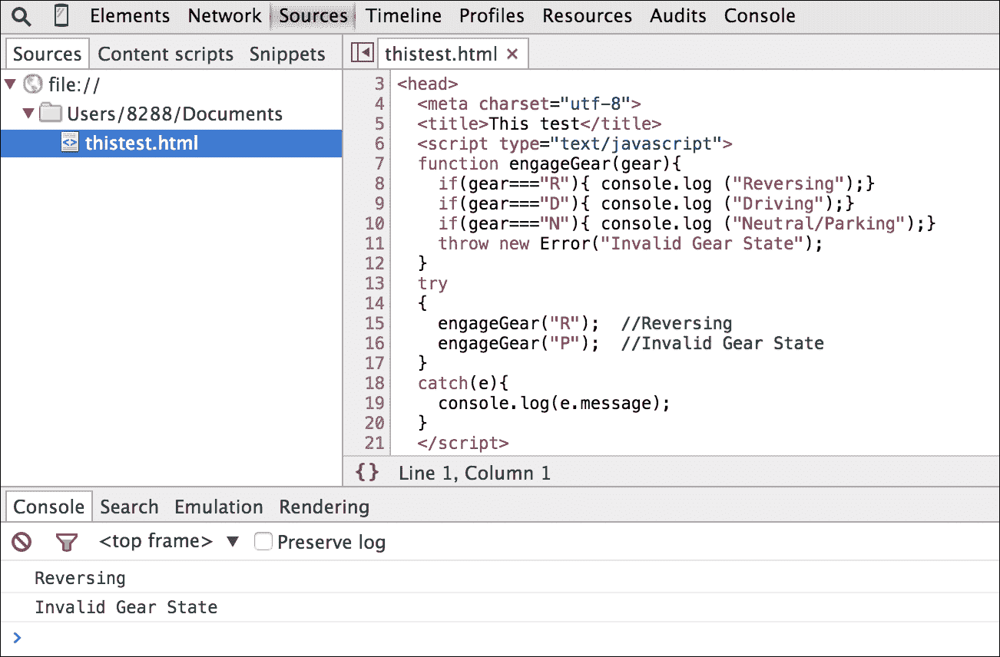

这是**源**面板的视图。你可以看到在这个面板中 HTML 和嵌入的 JavaScript 源代码。你还可以看到**控制台**窗口，并且可以看到文件正在执行，输出显示在控制台上。

在右侧，你会看到调试器窗口，如下截图所示：

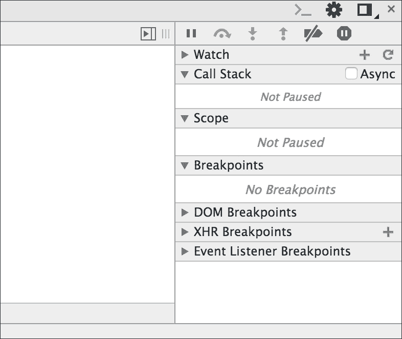

在**源**面板中，点击行号**8**和**15**以添加断点。断点允许你在指定的点停止脚本的执行。请参考以下截图：

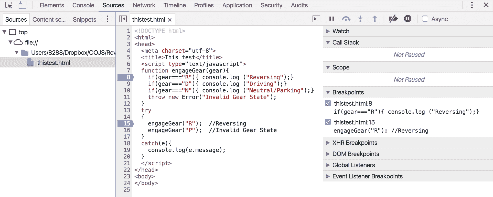

在调试面板中，你可以看到所有现有的断点。请参考以下截图：

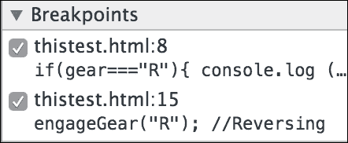

现在，当你重新运行同一页面时，你会看到执行在调试点处停止。请参考以下截图：

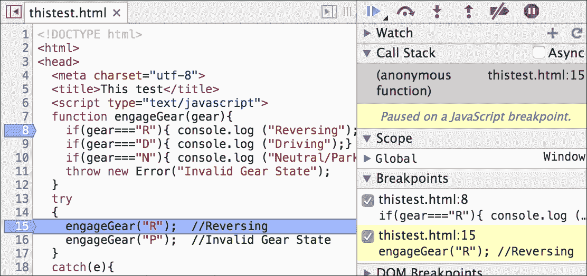

这个窗口现在有了所有动作。你可以看到执行在行**15**处暂停。在调试窗口中，你可以看到哪个断点被触发。你还可以看到**调用栈**并以多种方式恢复执行。调试命令窗口包含许多操作。请参考以下截图：


你可以通过点击以下按钮来恢复执行，这将执行到下一个断点：


当你这样做时，执行将继续，直到遇到下一个断点。在我们的例子中，我们将暂停在行**8**。请参考以下截图：

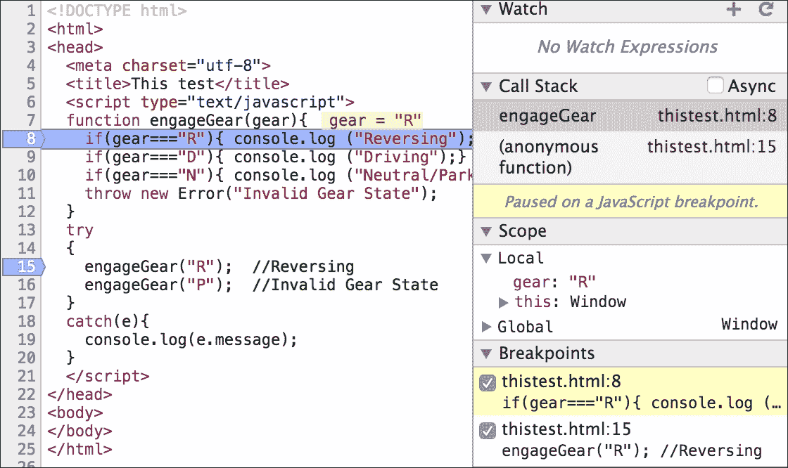

你可以观察到**调用栈**窗口显示了如何到达行**8**。**作用域**面板显示了断点到达时的**局部**作用域，你可以看到作用域中的变量。你还可以单步进入或单步跳过下一个函数。

使用 Chrome **开发者工具**调试和性能分析你的代码还有其他非常实用的机制。我建议你尝试使用这个工具，并将其作为你常规开发流程的一部分。

# 摘要

测试和调试阶段对于开发健壮的 JavaScript 代码至关重要。TDD 和 BDD 是与敏捷方法紧密相关的方法，并且被 JavaScript 开发者社区广泛接受。在本章中，我们回顾了关于 TDD 和 Jasmine 作为测试框架的使用最佳实践。此外，我们还看到了使用 Chrome **开发者工具**调试 JavaScript 的各种方法。

在下一章中，我们将探索 ES6、DOM 操作和跨浏览器策略这个新颖而激动人心的世界。
