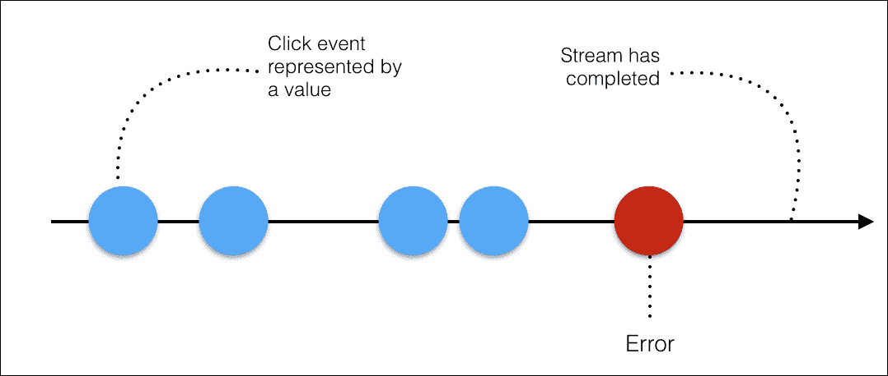
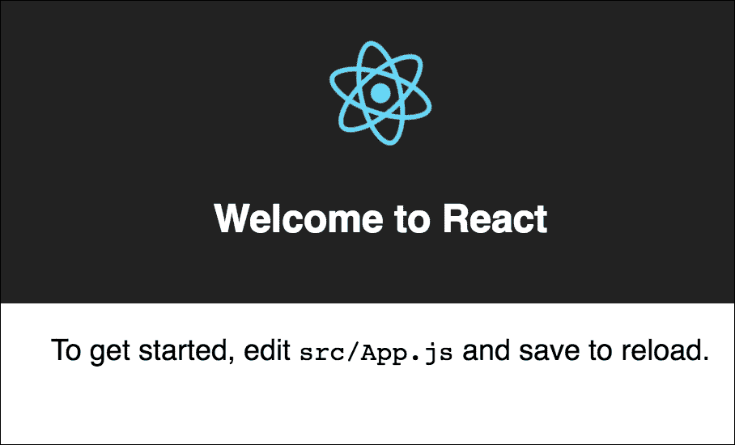
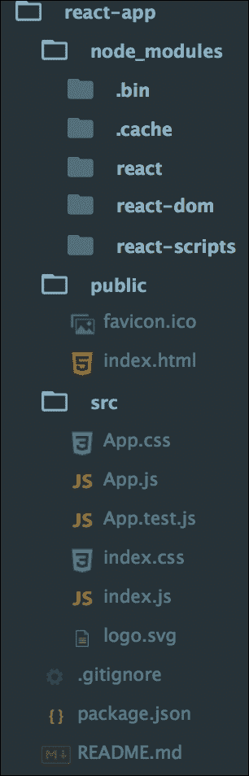
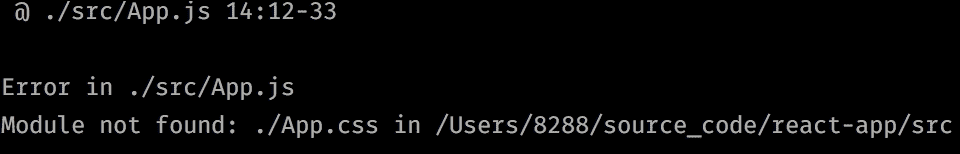
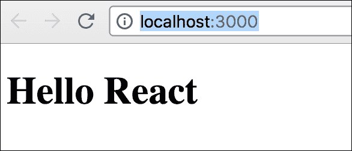
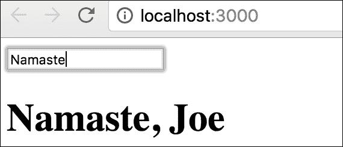
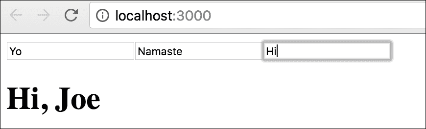
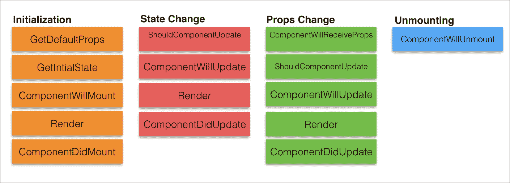

# 第十三章：响应式编程和 React

随着 ES6 的出现，一些新的想法正在涌现。这些想法非常强大，可以帮助你用更简洁的代码和设计构建强大的系统。在本章中，我们将向您介绍两个这样的想法——响应式编程和 React。尽管它们听起来很相似，但实际上它们非常不同。本章不会深入探讨这些想法的实践细节，但会提供必要的信息，让你了解这些想法的能力。有了这些信息，你就可以开始将这些想法和框架融入到你的项目中。我们将讨论响应式编程的基本概念，并对 React 进行更详细的探讨。

# 响应式编程

响应式编程最近受到了很多关注。这个想法相对较新，就像许多新想法一样，有很多令人困惑，有时甚至是相互矛盾的信息在流传。我们在本书中之前讨论了异步编程。JavaScript 通过提供支持异步编程的第一类语言结构，将异步编程提升到了新的高度。

响应式编程本质上是一种使用异步事件流的编程方式。事件流是随时间发生的一系列事件。考虑以下图示：



在前面的图中，时间从左到右流逝，不同的事件随时间发生。随着事件随时间发生，我们可以为整个序列添加事件监听器。每当发生事件时，我们都可以通过做些事情来对此做出反应。

JavaScript 中另一种类型的序列是数组。例如，考虑以下代码行：

```js
    var arr = [1,1,13,'Rx',0,0]; 
    console.log(arr); 
    >>> [1, 1, 13, "Rx", 0, 0] 

```

在这种情况下，整个序列同时存在于内存中。然而，在事件流的情况下，事件随时间发生，此时没有状态。考虑以下代码行：

```js
    var arr = Rx.Observable.interval(500).take(9).map(
      a=>[1,1,13,'Rx',0,0][a]); 
    var result = arr; 
    result.subscribe(x=>console.log(x)); 

```

目前不必太担心这个示例中正在发生的事情。在这里，事件随时间发生。与数组中固定的一组元素不同，这里的事件随时间发生，在 500 毫秒后。

我们将为 `arr` 事件流添加事件监听器，当事件发生时，我们将在控制台打印元素。你可以看到数组和事件流方法之间的相似性。现在，为了扩展这种相似性，假设你想从这个列表中过滤掉所有非数字。你可以使用 `map` 函数来处理这个事件流，就像你会在数组上使用它一样，然后你将想要过滤结果，只显示整数。考虑以下代码行：

```js
    var arr = [1,1,13,'Rx',0,0]; 
    var result = arr.map(x => parseInt(x)).filter(x => !isNan(x)); 
    console.log(result); 

```

有趣的是，同样的方法也适用于事件流。看看下面的代码示例：

```js
    var arr = Rx.Observable.interval(500).take(9).map(
      a=>[1,1,13,'Rx',0,0][a]); 
    var result = arr.map(x => parseInt(x)).filter(x => !isNaN(x)); 
    result.subscribe(x=>console.log(x)); 

```

这些只是简单的例子，只是为了确保你能开始看到事件流随时间流动的方式。请暂时不要担心语法和结构。在我们能够查看它们之前，我们需要确保我们理解了如何在响应式编程中思考。事件流是响应式编程的基础；它们允许你在声明时（定义来自 Andre Staltz 的博客）定义值的动态行为。

假设你有一个初始值为`3`的`a`变量。然后，你有一个`b`变量，它是`10 * a`。如果我们输出`b`的值，我们会看到`30`。考虑以下代码行：

```js
    let a = 3; 
    let b = a * 10; 
    console.log(b); //30 
    a = 4; 
    console.log(b); // Still 30 

```

我们知道结果非常直接。当我们把`a`的值改为`4`时，`b`的值不会改变。这就是静态声明的工作方式。当我们谈论响应式编程和事件流时，这是人们发现难以理解事件如何流动的领域。理想情况下，我们想要创建一个公式，*b=a*10*，并且随着时间的推移，每当`a`的值发生变化时，变化后的值都会反映在公式中。

这就是事件流所能实现的事情。假设`a`是一个只包含值`3`的事件流。那么，我们就有`streamB`，它是`streamA`的映射。这些`a`值中的每一个都将被映射到`10 * a`。

如果我们向`streamB`添加一个事件监听器，并在控制台输出日志，我们会看到`b`的值为`30`。请看以下示例：

```js
    var streamA = Rx.Observable.of(3, 4); 
    var streamB = streamA.map(a => 10 * a); 
    streamB.subscribe(b => console.log(b)); 

```

如果我们这样做，我们有一个只包含两个事件的事件流。它有一个事件`3`，然后是事件`4`，每当`a`的值发生变化时，`b`的值将相应地改变。如果我们运行这个程序，我们会看到`b`的值为`30`和`40`。

现在我们已经花了一些时间来整理响应式编程的基础，你可能会有以下问题。

## 为什么你应该考虑响应式编程？

当我们在现代 Web 和移动设备上编写高度响应和交互式的 UI 应用程序时，我们需要找到一种方法来处理实时事件，同时不停止用户与 UI 的交互。当你处理多个 UI 和服务器事件被触发时，你将花费大部分时间编写代码来处理这些事件。这是很繁琐的。响应式编程为你提供了一个结构化的框架，以最小的代码处理异步事件，同时你专注于应用程序的业务逻辑。

响应式编程并不仅限于 JavaScript。响应式扩展在许多平台和语言中都是可用的，例如 Java、Scala、Clojure、Ruby、Python 和 Objective C/Cocoa。`Rx.js`和`Bacon.js`是流行的 JavaScript 库，它们提供了响应式编程的支持。

本章的目的不是深入探讨 `Rx.js`。想法是向你介绍响应式编程的概念。如果你对你的项目采用响应式编程感兴趣，你应该看看 Andre Staltz 的优秀介绍（[`gist.github.com/staltz/868e7e9bc2a7b8c1f754`](https://gist.github.com/staltz/868e7e9bc2a7b8c1f754)）。

# React

React 正在 JavaScript 世界掀起一场风暴。Facebook 创建了 React 框架来解决一个古老的难题——如何高效地处理传统 **模型-视图-控制器** 应用程序中的视图部分。

React 提供了一种声明性和灵活的方式来构建用户界面。关于 React，最重要的是记住它只处理一件事——视图，或 UI。React 不处理数据、数据绑定或其他任何事情。有一些完整的框架，如 Angular，处理数据、绑定和 UI；React 不是那样。

React 提供了一种模板语言和一组小函数来渲染 HTML。React 组件可以在内存中存储它们自己的状态。要构建一个完整的应用程序，你还需要其他组件；React 只是用来处理该应用程序的视图部分。

在编写复杂 UI 时的一个大挑战是在模型变化时管理 UI 元素的状态。React 提供了一个声明式 API，这样你就不必担心每次更新时确切发生了什么变化。这使得编写应用程序变得容易得多。React 使用 **虚拟 DOM** 和 **diffing** 算法，使得组件更新既可预测又足够快，适用于高性能应用程序。

# 虚拟 DOM

让我们花一点时间来理解什么是虚拟 DOM。我们讨论了 **DOM**（**文档对象模型**），这是网页上 HTML 元素的树状结构。DOM 是事实上的，也是网络的主要渲染机制。DOM API，如 `getElementById()`，允许遍历和修改 DOM 树中的元素。DOM 是一个树，这种结构在遍历和更新元素方面表现得相当好。然而，DOM 的遍历和更新都不是很快。对于大型页面，DOM 树可能相当大。当你想要一个具有大量用户交互的复杂 UI 时，更新 DOM 元素可能会很繁琐且缓慢。我们尝试过 jQuery 和其他库来减少频繁 DOM 修改的繁琐语法，但 DOM 作为一种结构本身是相当有限的。

如果我们不必一次又一次地遍历 DOM 来修改元素会怎样？如果我们只是声明一个组件应该如何看起来，然后让某人处理如何渲染该组件的逻辑呢？React 正是这样做。React 允许你声明你希望你的 UI 元素看起来如何，并抽象出低级别的 DOM 操作 API。除了这个非常有用的抽象之外，React 还采取了一些相当聪明的措施来解决性能问题。

React 使用一种称为虚拟 DOM 的东西。虚拟 DOM 是 HTML DOM 的轻量级抽象。你可以把它想象成 HTML DOM 的本地内存副本。React 使用它来完成渲染 UI 组件状态所需的所有计算。

你可以在 [`facebook.github.io/react/docs/reconciliation.html`](https://facebook.github.io/react/docs/reconciliation.html) 找到更多关于此优化的详细信息。

然而，React 的主要优势并不仅仅是虚拟 DOM。React 是一个出色的抽象，它使得在开发大型应用程序时组合、单向数据流和静态建模变得更加容易。

# 安装和运行 React

首先，让我们安装 React。以前，在您的机器上安装和设置 React 需要处理许多依赖项。然而，我们将使用一种相对更快的方法来让 React 运行起来。我们将使用 `create-react-app`，这样我们就可以在不进行任何构建配置的情况下安装 React。安装是通过 `npm` 完成的，如下所示：

```js
    npm install -g create-react-app 

```

在这里，我们正在全局安装 `create-react-app` 节点模块。一旦 `create-react-app` 安装完成，你就可以为你的应用程序设置目录。考虑以下命令：

```js
    create-react-app react-app 
    cd react-app/ 
    npm start 

```

然后，打开 `http://localhost:3000/` 来查看您的应用。你应该会看到以下截图中的内容：



如果你在一个编辑器中打开该目录，你会看到为你创建的几个文件，如下面的截图所示：



在这个项目中，`node_modules` 是运行此项目所需的依赖项以及 React 本身的依赖项。重要的目录是 `src`，其中保存了源代码。对于这个例子，让我们只保留两个文件 - `App.js` 和 `index.js`。`/public/index.html` 文件应只包含根 `div`，它将被用作我们的 React 组件的目标。考虑以下代码片段：

```js
    <!doctype html> 
    <html lang="en"> 
      <head> 
        <title>React App</title> 
      </head> 
      <body> 
 <div id="root"></div> 
      </body> 
    </html> 

```

一旦你做出这个更改，你将看到以下错误：



使用 React 开发的美妙之处在于代码更改是实时重新加载的，你可以立即获得反馈。

接下来，清空 `App.js` 中的所有内容，并用以下代码行替换：

```js
    import React from 'react'; 
    const App = () => <h1>Hello React</h1> 
    export default App 

```

现在，转到 `index.js` 并删除 `import ./index.css;` 这一行。无需你做任何操作，例如重启服务器和刷新浏览器，你将在浏览器上看到修改后的页面。考虑以下截图：



在我们创建 `HelloWorld` React 组件之前，有一些重要的事情需要注意。

在 `App.js` 和 `index.js` 中，我们导入了创建 React 组件所必需的两个库。考虑以下代码行：

```js
    import React from 'react'; 
    import ReactDOM from 'react-dom'; 

```

这里，我们正在导入`React`，这是一个允许我们构建 React 组件的库。我们还在导入`ReactDOM`，这是一个允许我们在 DOM 上下文中放置我们的组件并与之交互的库。然后，我们导入我们刚刚工作的组件——`App`组件。

我们也在`App.js`中创建了我们的第一个组件。考虑以下代码行：

```js
    const App = () => <h1>Hello React</h1> 

```

这是一个无状态函数组件。创建组件的另一种方式是创建类组件。我们可以用以下类组件替换前面的组件：

```js
    class App extends React.Component { 
      render(){ 
        return <h1>Hello World</h1> 
      } 
    } 

```

这里发生了很多有趣的事情。首先，我们使用`class`关键字创建了一个从超类`React.Component`扩展的类组件。

我们的组件`App`是一个 React 组件类或 React 组件类型。组件接收参数，也称为`props`，并通过`render`函数返回一个要显示的视图层次结构。

`render`方法返回你想要渲染的描述，然后 React 将这个描述渲染到屏幕上。特别是，`render`返回一个 React 元素，这是要渲染内容的轻量级描述。大多数 React 开发者使用一种特殊的语法，称为 JSX，这使得编写这些结构更加容易。`<div />`语法在构建时被转换为`React.createElement`(`'div'`)。JSX 表达式`<h1>Hello World</h1>`在构建时被转换为以下内容：

```js
    return React.createElement('h1', null, 'Hello World'); 

```

类组件和无状态函数组件之间的区别在于，类组件可以包含状态，而无状态函数组件（因此得名）不能。

React 组件的`render`方法只能返回一个节点。如果你做如下操作：

```js
    return <h1>Hello World</h1><p>React Rocks</p> 

```

你将得到以下错误：

```js
    Error in ./src/App.js 
    Syntax error: Adjacent JSX elements must be wrapped in 
      an enclosing tag (4:31) 

```

这是因为你实际上返回了两个`React.createElement`函数，这在 JavaScript 中是不合法的。虽然这看起来像是一个大问题，但这很容易解决。我们可以将我们的节点包裹在一个父节点中，并从`render`函数中返回该父节点。我们可以创建一个父`div`并将其他节点包裹在其下。考虑以下示例：

```js
    render(){ 
        return ( 
          <div> 
            <h1>Hello World</h1> 
            <p>React Rocks</p> 
          </div> 
          ) 
    } 

```

## 组件和 props

从概念上讲，可以将组件视为 JavaScript 函数。它们像普通函数一样接受任意数量的输入。这些输入被称为 props。为了说明这一点，让我们考虑以下函数：

```js
    function Greet(props) { 
      return <h1>Hello, {props.name}</h1>; 
    } 

```

这是一个普通函数，也是一个有效的 React 组件。它接受一个名为`props`的输入并返回有效的 JSX。我们可以在 JSX 中使用花括号和标准对象表示法中的属性，如`name`。现在`Greet`是一个一等 React 组件，让我们在`render()`函数中使用它，如下所示：

```js
    render(){ 
      return ( 
       return <Greet name="Joe"/> 
      ) 
    } 

```

我们将 `Greet()` 作为普通组件调用，并将 `this.props` 传递给它。要求你对自己的组件进行大写。React 将以小写字母开头的组件名称视为标准 HTML 标签，并期望自定义组件名称以大写字母开头。正如我们之前所看到的，我们可以使用 ES6 类创建一个类组件。这个组件是 `React.component` 的子类。与我们的 `Greet` 函数等效的组件如下：

```js
    class Greet extends React.Component { 
      render(){ 
          return <h1>Hello, {this.props.name}</h1> 
      } 
    } 

```

出于所有实际目的，我们将使用这种方法来创建组件。我们很快就会知道为什么。

需要注意的一个重要点是，组件不能修改自己的 props。这可能会显得有些限制，因为在几乎所有非平凡的应用中，你都会希望用户交互能够改变 React 中的 UI 组件状态，例如，在表单中更新出生日期，`props` 是只读的，但有一个更强大的机制来处理 UI 更新。

## 状态

状态类似于 props，但它私有且完全由组件控制。正如我们之前所看到的，在 React 中，函数组件和类组件是等效的，一个重要的区别是状态仅在类组件中可用。因此，出于所有实际目的，我们将使用类组件。

我们可以将现有的问候示例更改为使用状态，并且每当状态发生变化时，我们将更新我们的 `Greet` 组件以反映变化后的值。

首先，我们将在 `App.js` 中设置状态，如下所示：

```js
    class Greet extends React.Component { 
 constructor(props) {
 super(props); 
 this.state = { 
greeting: "this is default greeting text" 
} 
 } 
      render(){ 
          return <h1>{this.state.greeting}, {this.props.name} </h1> 
      } 
    } 

```

在这个例子中，有几个重要的事情需要注意。首先，我们调用类 `constructor` 来初始化 `this.state`。我们还调用基类构造函数 `super()`，并将 `props` 传递给它。在调用 `super()` 之后，我们通过设置 `this.state` 为一个对象来初始化我们的默认状态。例如，我们在这里分配一个 `greeting` 属性。在 `render` 方法中，我们将使用这个属性，即 `{this.state.greeting}`。在设置好初始状态后，我们可以添加 UI 元素来更新这个状态。让我们添加一个输入框，并在输入框更改时更新我们的状态和 `greeting` 元素。考虑以下代码行：

```js
    class Greet extends React.Component { 
      constructor(props) { 
        super(props); 
        this.state = { 
          greeting: "this is default greeting text" 
        } 
      } 
 updateGreeting(event){ 
this.setState({ 
greeting:
      event.target.value,
 })
 } 
      render(){ 
          return ( 
          <div>   
 <input type="text" onChange={this.updateGreeting.bind(this)}/> 
            <h1>{this.state.greeting}, {this.props.name} </h1> 
           </div>  
          ) 
        } 
    } 

```

在这里，我们添加一个输入框，并在输入框的 `onChange` 方法被调用时更新组件的状态。我们使用自定义的 `updateGreeting()` 方法通过调用 `this.setState` 并更新属性来更新状态。当你运行这个示例时，你会注意到，当你开始在文本框中输入时，只有 `greeting` 元素被更新，而 `name` 没有变化。请看以下截图：



React 的重要特性之一是，一个 React 组件可以输出或渲染其他 React 组件。这里有一个非常简单的组件。它有一个值为 text 的状态。它有一个 `update` 方法，该方法将从事件中更新文本的值。我们将创建一个新的组件。这将是一个无状态的函数组件。我们将称之为 widget。它将接受 `props`。我们将返回这里的 JSX 输入。考虑以下代码片段：

```js
    render(){ 
        return ( 
          <div>   
 <Widget update={this.updateGreeting.bind(this)} /> 
 <Widget update={this.updateGreeting.bind(this)} /> 
 <Widget update={this.updateGreeting.bind(this)} /> 
          <h1>{this.state.greeting}, {this.props.name} </h1> 
          </div>  
        ) 
      } 
    } 
    const Widget = (props) => <input type="text" 
      onChange={props.update}/> 

```

首先，我们将我们的输入元素提取到一个无状态的函数组件中，并将其称为 `Widget`。我们将 `props` 传递给这个组件。然后，我们将 `onChange` 更改为使用 `props.update`。现在，在我们的 `render` 方法中，我们使用 `Widget` 组件并传递一个 `update` 属性，该属性绑定 `updateGreeting()` 方法。现在 `Widget` 是一个组件，我们可以在 `Greet` 组件的任何地方重用它。我们正在创建三个 `Widget` 实例，当任何一个 `Widget` 被更新时，问候文本也会更新，如以下截图所示：



## 生命周期事件

当你有一堆组件，它们有多个状态变化和事件时，维护变得很重要。React 为你提供了几个组件生命周期钩子来处理组件的生命周期事件。理解组件的生命周期将使你能够在组件创建或销毁时执行某些操作。此外，它还给你机会决定组件是否应该首先更新，并相应地响应 `props` 或状态变化。

组件会经历三个阶段：挂载、更新和卸载。对于每个阶段，我们都有钩子。看看以下图表：



当组件首次渲染时，会调用两个方法，`getDefaultProps` 和 `getInitialState`，正如它们的名称所暗示的，我们可以在这些方法中设置组件的默认 `props` 和初始状态。

`componentWillMount` 在 `render` 方法执行之前被调用。我们已经知道 `render` 是我们返回要渲染的组件的地方。一旦 `render` 方法完成，`componentDidMount` 方法就会被调用。你可以在该方法中访问 DOM，并且建议在这个方法中执行任何 DOM 交互。

状态变化会调用几个方法。`shouldComponentUpdate` 方法在 `render` 方法之前被调用，并允许我们决定是否允许重新渲染或跳过它。这个方法在初始渲染时永远不会被调用。`componentWillUpdate` 方法在 `shouldComponentUpdate` 方法返回 `true` 后立即被调用。`componentDidUpdate` 方法在 `render` 完成后被渲染。

对`props`对象的任何更改都会触发类似于状态变化的方法。还有一个额外的方法叫做`componentWillReceiveProps`；它仅在`props`发生变化时调用，并且不是初始渲染。您可以在该方法中根据新旧`props`更新状态。

当组件从 DOM 中移除时，会调用`componentWillUnmount`。这是一个执行清理的有用方法。

React 的伟大之处在于，当您开始使用它时，框架对您来说感觉非常自然。您需要学习的移动部件非常少，抽象程度恰到好处。

# 摘要

本章旨在介绍一些最近获得大量关注的重要新思想。响应式编程和 React 都可以显著提高程序员的效率。React 无疑是 Facebook 和 Netflix 等公司支持的最重要新兴技术之一。

本章旨在为您介绍这两种技术，并帮助您更深入地探索它们。
