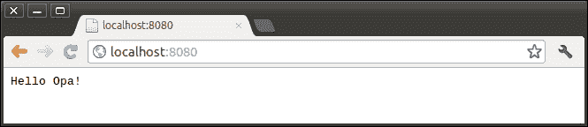
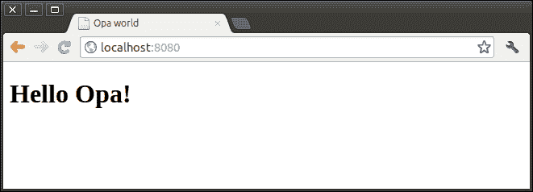
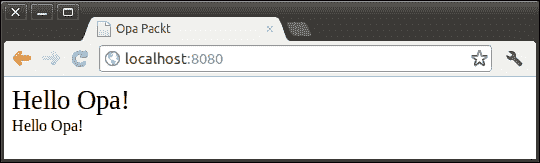

# 第三章：开发网络应用

Opa 是为快速和安全的网络开发而设计的。在本章中，我们将讨论在 Opa 中开发网络应用的基本知识。

# 启动网络服务器

我们开发一个网络应用首先需要的是一个网络服务器。在本节中，我们将了解如何使用 Opa 启动一个网络服务器。

## 一个简单的例子

作为网络应用，需要向用户提供服务，例如网页、图片和音频；因此，我们需要一个 HTTP 服务器。让我们暂时思考一下我们如何在 PHP 中做到这一点。典型的设置是一个安装了 mod_php5 的 Apache HTTP 服务器。

使用 Opa，事情有些不同。我们不仅实现了我们的应用，还实现了整个 HTTP 服务器。实际上，我们的网络应用及其网络服务器基本上是相同的。我们的代码在编译后将被转换为 Node.js 脚本，并使用 Node.js 运行。将服务器与网络应用集成的好处是提高了安全性。让我们从一个简单的例子开始：

```js
Server.start(Server.http, {text: "hello Opa"})
```

将此代码保存到一个文件中，例如 `301.opa`，然后编译并运行它。在编译完成后，需要两个结尾破折号来启动网络应用：

```js
$ opa 301.opa –-

```

输出将如下所示：

```js
Http serving on http://localhost:8080

```

在浏览器中输入此地址，你将看到类似以下的内容：



## 服务器模块

我们已经启动了一个网络服务器，并使用 `Server.start` 函数运行了我们的第一个 Opa 网络应用。现在让我们详细看看这个函数：

```js
void start(Server.conf arg1, Server.handler handler)
```

该函数使用两个参数启动网络服务器，第一个是配置信息，第二个是请求处理器。`Server.conf` 类型是服务器的配置。它是一个具有以下字段的记录类型：

```js
type Server.conf = {
  int port,                    //port server runs on
  ip netmask,                  //netmask
  Server.encryption encryption,//secure config if using https
  String name                  //server name
}
```

在大多数情况下，我们不想定义这个类型中的所有元素。我们可以从静态值 `Server.http` 继承。`Server.http` 是一个预定义的默认配置，端口号为 8080，服务器协议为 http，而 https 的默认配置为 `Server.https`。在接下来的两行中，我们正在重用 `Server.http` 配置，通过使用指令 `with port: 8088` 将端口号 8080 替换为 8088。

```js
conf = {Server.http with port: 8088}
Server.start(conf,{text: "Hello Opa!"})
```

### 注意

你也可以使用 `-p` 选项运行你的应用来更改端口号，这将覆盖此设置。

我们的 web 服务器需要根据请求的不同而给出不同的响应，这取决于请求的是哪个 URL。因此，我们需要 `Server.handler` 来处理这些请求。`Server.handler` 类型比 `Server.conf` 类型复杂得多。它定义了我们的 web 服务器将如何处理传入的请求。它是一个包含八个情况的变体：

```js
type Server.handler = 
  {string text} or
  {string title, (-> xhtml) page} or
  {stringmap(resource) resources} or
  {(Uri.relative -> resource) dispatch} or
  {Server.filter filter, (Uri.relative -> resource) dispatch} or
  {Server.registrable_resource register} or
  {Parser.general_parser(resource) custom} or
  list(Server.handler)
```

在本章开头的示例中，我们使用了最简单的情况——`{string text}`。它接受所有请求，并在页面上显示一些文本。让我们看看第二个情况，`{string title, (-> xhtml) page}` 是如何工作的：

```js
Server.start(Server.http, {
  title: "Opa world"
  page : function(){ <h1>Hello Opa!</h1> }
})
```

第二种情况也处理了所有请求，但它只服务一个页面。页面字段是一个类型为 `void -> xhtml` 的函数，这表示该函数不接受任何参数并产生一个 `xhtml` 类型的值。我们稍后会讨论 XHTML；结果看起来像这样：



从这个屏幕截图我们可以注意到，与第一个例子相比，变化的是我们发送给浏览器的网页包含了网页浏览器将其渲染为标题类型的 HTML 标记。

# 请求调度

我们已经讨论了 `Server.handler` 的前两种情况。它们都很简单并接受所有请求。但在实际的 Web 应用程序中，请求和响应要复杂得多，Web 服务器应根据不同的请求做出不同的响应。本节我们将讨论 `Server.handler` 的剩余情况，并展示如何处理不同类型的请求。

## 资源处理器

资源处理器通常用于服务静态资源，如图片和声音。`{stringmap(resource) resources}` 的情况在非解码的 URI（统一资源标识符）上执行，并返回与资源字符串映射匹配的资源。为了使问题更清晰，让我们假设在目录 `res` 中有三个图片：`opa1.png`、`opa2.png` 和 `opa3.png`。

如果我们手动创建资源字符串映射，它应该看起来像这样：

```js
"res/opa1.png" -> a resource of opa1.png
"res/opa2.png" -> a resource of opa2.png
"res/opa3.png" -> a resource of opa3.png
```

相对 URI 是键，`.png` 文件的资源是值，即 `"res/opa1.png"` 是键，`opa1.png` 作为资源是值。如果用户尝试访问 URL `http://localhost:8080/res/opa1.png`，非解码的相对 URI 将是 `res/opa1.png`。服务器将尝试找到相应的资源 `opa1.png` 并将其服务回用户。

那么，我们如何添加这些外部文件呢？在 Opa 中，我们可以使用以下两个指令。这些指令将在编译时被替换为适当的值：

+   `@static_content("foo.png")` 被一个返回 `compile-time foo.png` 内容的函数所替代

+   `@static_resource("foo.png")` 被一个表示 `foo.png` 的资源类型值所替代，包括最后修改时间、MIME 类型等。

这两个指令之间的区别在于，`@static_content` 被一个函数所替代，而 `@static_resource` 被一个资源所替代。这两个指令都有一个对应的指令，它不是处理并返回一个文件，而是处理一个目录并将其作为字符串映射返回：

+   `@static_content_directory("foo/")` 被目录 `foo/` 中的文件名 `f` 到 `@static_content("f")` 的字符串映射所替代

+   `@static_resource_directory("foo/")` 被目录 `foo/` 中的文件名 `f` 到 `@static_resource("f")` 的字符串映射所替代

现在，如果我们想在目录 `res` 中提供服务，我们只需要编写如下代码：

```js
Server.start(Server.http,{
  resources: @static_resource_directory("res")
})
```

我们可以在 `http://localhost:8080/res/opa1.png` 获取资源。

## 调度处理器

资源处理程序对于静态资源非常有用。但频繁地，服务器需要响应不同的请求。`{(Uri.relative -> resource) dispatch}` 的情况正是为此而设。在这种情况下，请求 URL 被解码为 `Uri.relative` 记录，它被定义为：

```js
type Uri.relative ={
  list(string) path,
  list((string, string)) query,
  option(string) fragment,
  bool is_directory,
  bool is_from_root
}
```

假设用户请求 URL 是 `http://localhost:8080/admin/find?name=Li&age=28`，记录将是：

```js
{ path: [admin,find],            //a list of path
  query: [(name,Li),(age,28)],   //a list of tuple2
  ...}                        //we do not care about the fields here.
```

有这个记录，我们应该返回相应的资源。大多数情况下，模式匹配用于分发请求。以下是一个示例：

```js
function dispatch(uri){
  match(uri){
  case {path:[],...} ：Resource.page("Login",<h1>Login</h1>);
  case {path:["admin"|_],...}:Resource.page("Admin", <h1>Admin</h1>);
  case {path:["user",x|_],...}:Resource.page("User", <h1>User:{x}</h1>);
  }
}
Server.start(Server.http,{~dispatch})
```

记得我们在上一章讨论的模式匹配吗？这里发生的事情不难理解。请注意，模式匹配不是分发请求的唯一方式。您可以为给定的 URI 返回资源执行几乎任何操作。此外，我们还可以添加一个带有情况 `{Server.filter filter, (Uri.relative->resource) dispatch}` 的过滤器：

```js
Server.start(Server.http,{
  filter: Server.Filter.path(["opa","packt"]),
  dispatch: function(_){
    Resource.page("opa packt",<h1> Hello Opa!</h1>)
  }
})
```

此代码将仅允许用户访问 `http://localhost:8080/opa/packt`。

## 注册处理程序

`{Server.registrable_resource register}` 的情况是一个空请求处理程序，这意味着它不会处理任何请求。但它对于注册外部资源（如 `js` 和 `css`）很有用，这样我们就可以在应用中使用它们。

```js
Server.start(Server.http,{
  register: [ 
    {doctype: {html5}}, 
    {js: ["/res/js/js1.js","/res/js/js2.js"]},
    {css: ["/res/css/style1.css","/res/css/style2.css"]}
  ]
});
```

在此示例中，我们将 `doctype` 注册为 `html5`，并注册了一些外部 JavaScript 和 CSS。这里注册的 JavaScript 和 CSS 是应用范围内的。这意味着我们可以在应用中创建的任何页面上使用 JavaScript 代码和 CSS 样式。

## 定制处理程序

`{Parser.general_parser(resource) custom}` 的情况是最可配置的请求处理程序。自定义解析器将来自传入请求的非解码 URI 作为输入，并计算相应的资源。考虑以下示例：

```js
custom = parser{
  case ("/admin".*) : Resource.page("Admin",<h1>Admin</h1>);
  case ("/user".*) : Resource.page("User",<h1>User</h1>);
  case (.*) : Resource.page("default",<h1>default</h1>);
}
Server.start(Server.http, {~custom});
```

此示例将匹配所有以 `"/admin"` 开头的请求到由代码 `Resource.page("Admin",<h1>Admin</h1>)` 创建的管理页面，所有以 `"/user"` 开头的请求到用户页面，以及所有其他请求到默认页面。您可以参考 Opa 中的解析器以获取更多关于如何处理更复杂情况的信息。

## 处理程序组

`{Server.handler}` 的情况将多个请求处理程序作为一组聚合，以响应传入的请求。所有处理程序将按照它们列出的顺序进行测试，直到其中一个成功并返回资源。例如：

```js
Server.start(Server.http,[
{resources: @static_resource_directory("resources")},
  {~dispatch},  //we omitted the definition here
  {~custom},    //we omitted the definition here
  {title:"404", page:function(){ <h1>Page Not Found!<h1> }}
]);
```

由于单个处理程序可能不足以处理所有请求，因此处理程序组是大多数由 Opa 开发的 Web 应用程序中常见的解决方案。

# 准备页面

我们已经讨论了如何启动服务器和分发用户请求。现在轮到前端问题，即网页。网页是用户看到并与之交互的内容。有许多技术可以用来构建优秀的网页，例如 PHP、Perl 和 Python。但基本的方法是使用 HTML 和 CSS。

## XHTML

在 Opa 中，HTML 和 CSS 都是第一等公民，并且编译器会理解和检查它们，无需将它们作为字符串包装。将 XHTML 作为原生类型意味着几乎完美的 XSS（跨站脚本）保护。这也意味着我们可以轻松地组合元素，也就是说，我们可以编写 `<div>{foo()}</div>`。HTML 值具有预定义的 `xhtml` 类型，并且存在用于构建 XHTML 值的内建语法。以下是 XHTML 语法的概述：

```js
// XHTML is a data-type with built-in syntax
xhtml span = <span class="test">Hello Opa!</span>
//named closing tag is optional,
// so are the quotes around literal attributes
another_span = <span class=test>Hello XHTML</>
```

在 XHTML 中，标签和属性的插入同样适用：

```js
function f(class, content){
  <span class="{class}"> {content} </span>
}
```

## 创建页面

通常，我们需要将我们的网页作为资源类型的值提供服务。函数 `Resource.page` 或其快捷方式 `Resource.html` 将帮助我们转换 XHTML 为资源。`Resource.page` 定义为：

```js
resource page(string title, xhtml body)
```

第一个参数是网页标题，第二个参数是使用 XHTML 编写的内联内容。它将返回一个资源类型的值，我们可以将其返回给用户。以下是一个简单的示例：

```js
function dispatch(_){
  Resource.page("Opa Packt", <h1>Hello Opa!</h1>)
}
Server.start(Server.http,{~dispathc})
```

此代码片段处理网页的所有请求。`Resource.page` 对于大多数开发者来说已经足够。但如果需要更多控制，可以参考 `Resource.styled_page` 和 `Resource.full_page`。

## 添加样式

添加样式有许多方法。首先，就像 XHTML 一样，CSS 是 Opa 中的预定义数据类型，我们可以在 Opa 代码中直接定义 CSS：

```js
red_style = css { color: red }
span = <span style={red_style} />
// one can use inserts inside css, i.e. height: {height}px;
function div(width, height, content) {
  <div style={ css { height: {height}px; width: {width}px }}>
   {content}
  </div>
}
```

另一种方法是使用我们之前提到过的注册处理器：

```js
Server.start(Server.http,
  [ {register: {css: ["resources/css/style.css"]}} , ...]
)
```

注册处理器注册的样式表在应用程序范围内可用，这意味着您可以在任何页面上使用它们。如果您想添加一些特定于页面的样式表，选择将是 `Resource.styled_page`。以下是一个示例：

```js
// save this as file: resources/hello.css
.hello1 { font-size: 20pt }
.hello2 { font-size: 12pt }
//save the following code as a file, compile and run it.
function dispatch(_){
  Resource.styled_page("Opa Packt", ["resources/hello.css"],
    <div class="hello1">Hello Opa!</div>
    <div class="hello2">Hello Opa!</div>
  )
}
Server.start(Server.http,[
  {resources: @static_resource_directory("resources")},
  {~dispatch}
])
```

编译并运行此代码；结果如下所示：



## 处理事件

事件处理器是一个函数，其调用由用户界面中的某些活动触发。典型的事件处理器对用户的点击（事件称为 `click`）、按回车（事件 `newline`）、移动鼠标（事件 `mousemove`）或加载页面（事件 `ready`）做出反应。

在 Opa 中，事件处理器始终具有类型 `Dom.event -> void`。以下是一个示例：

```js
function f1(_){ #test1 = "test1"}
function f2(_){ Dom.set_text(#test2,"clicked"}
function f3(_){ Dom.clear_value(#test3) }
function page(){
  <div id=#test1 onready={f1}></div>
  <button id=#test2 onclick={f2}>click</button>
  <input id=#test3 onnewline={f3}></input>
  <div id=#test4 onclick={function(_){ jlog("clicked") }}></div>
}
Server.start(Server.http, {title:"Opa Packt", ~page})
```

此代码示例展示了如何在 Opa 中编写事件处理器。

# 操作 DOM

文档对象模型（DOM）是一个平台和语言中立的接口，允许程序和脚本动态访问和更新文档的内容、结构和样式。

有时，我们可能想要动态地更改页面内容。为了实现这一点，我们通常需要与 DOM 交互。Opa 提供了 `Dom` 模块，用于操作浏览器当前显示的页面内容。您可以使用它向页面添加和删除元素，获取表单内容，或应用样式或特殊效果。

## DOM 选择

为了使用 DOMs，首先必要的一步是选择你想要与之工作的那个。Opa 提供了多种选择元素的方法。你可以在模块`Dom`中找到所有可用的选择函数。最常用的有：

```js
Dom.select_id("id")          //select element with a given id
Dom.select_document()        //select the complete document
Dom.select_class("class")    //select elements belongs to a class
Dom.select_children(parent)  //select all children
//and much more, search online Opa API for entry Dom
```

由于`Dom.select_id`被广泛且频繁地使用，Opa 为其提供了一个快捷方式。你可以简单地写`#id`。例如：

```js
#text   //the same as: dom = Dom.select_id("text")
#{test} //insert can be used in this in combination with the //shortcut notation.
Dom.select_children(#text)
```

## 读取值

经常我们需要从页面的某个元素中读取值或获取内容。例如，获取用户的输入或获取元素的宽度。Opa 提供了许多`get`函数来获取给定`Dom`项的信息。考虑以下代码：

```js
<input id=#test type="text" value="test1">test2</input>
x1 = Dom.get_value(#test)            // x1 = test1, x1 is a string
y1 = Dom.get_text(#test)             // y1 = test2, y1 is a string
x2 = Dom.get_attribute(#test,"type") // x2 = {some: text}
y2 = Dom.get_property(#test,"type")  // y2 = {some: text}
x3 = Dom.get_with(#test)             //x3 is the width of #test
y3 = Dom.get_height(#test)           //y3 is the height of #test
```

此示例说明了`Dom`上的一些常用函数，我们可以在在线 Opa API 的 Dom 条目中找到更多信息。请不要混淆`Dom.get_value`与`Dom.get_text`。前者将返回用户输入的内容（例如，来自输入、菜单等），而后者将返回插入到`Dom`中的内容。我们可以从刚才看到的示例的第二行和第三行中得出这一点。

## 更新内容

Opa 提供了三个语法快捷方式，简化了一些最常见的转换：

```js
#identifier = content  //replace the content
#identifier =+ content //prepend the content
#identifier += content //append the content
```

此外，还有许多其他函数可以用来添加、删除和更新页面内容：

```js
Dom.add_class(#test,"style")    //add a class "style" to #test
Dom.clear_value(#test)	          //clear the value of #test
Dom.put_after(#test,#item)      //move #item after #test
Dom.put_before(#test,#item)     //move #item before #test
Dom.put_replace(#test,#item)    //replace #test with #item
Dom.remove(#test)               //remove dom #test
Dom.remove_class(#test,"style") //remove class "style" in #test
Dom.remove_content(#test)       //remove #test's content
//and for more, search online Opa API for entry Dom
```

## 绑定事件处理器

在运行时动态绑定事件处理器相当常见，尤其是在你以编程方式创建控件时。在 Opa 中，我们可以通过`Dom.bind`来实现，它被定义为：

```js
Dom.event_handler bind(dom dom, Dom.event.kind event, 
  ( Dom.event -> void ) handler)
```

该函数返回一个`Dom.event_handler`类型的值，你可以使用它来解绑事件处理器。以下是一个示例：

```js
<input id=#test type="button" value="bind"></input>
//bind #test's click event with a function
handler = Dom.bind(#test,{click},function(_){ void })
Dom.unbind(#test, handler) //unbind the event handler
```

## 动画

Opa 提供了几种向网页添加动画的技术。这些包括常用的简单、标准动画，如淡入、淡出和隐藏。要将动画应用到`Dom`项上，你应该使用函数`Dom.transaction`，它被定义为：

```js
Dom.transaction transition(dom item, Dom.animation effect)
```

第一个参数是一个`Dom`项，第二个参数是你想要应用到这个`Dom`项上的效果。你可以在模块`Dom.Effect`中找到 Opa 支持的所有效果的完整列表。以下是一个动画的示例：

```js
function hide(_){
  _ = Dom.transition(#test,Dom.Effect.hide()); void
}
function page(){
  <div id=#test style="width:100px;height:100px;"></div>
  <button id=#btnanim onclick={hide}>Hide</button>
}
Server.start(Server.http,{title:"Opa Packt", ~page})
```

# 概述

在本章中，我们首先介绍了如何使用`Server.start`函数启动 Web 服务器，这是我们的 Web 应用的起点。然后我们详细讨论了`Server.handler`的不同情况，以及如何使用它们来分发用户请求。之后，我们讨论了准备网页。最后，我们学习了如何通过与 DOM 交互来动态更改页面内容。
