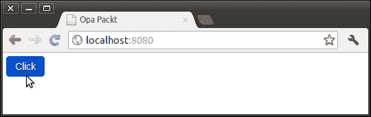
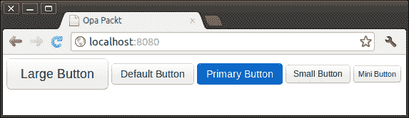
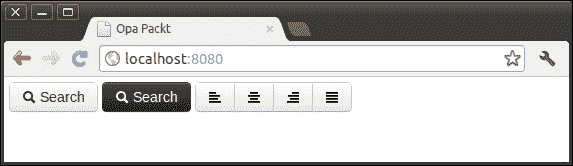
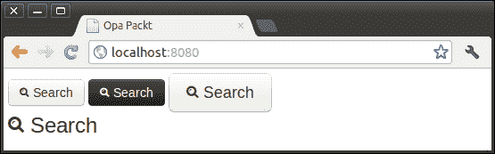
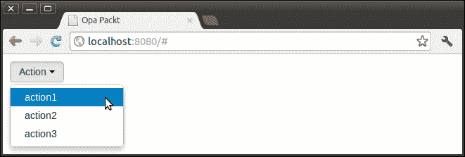
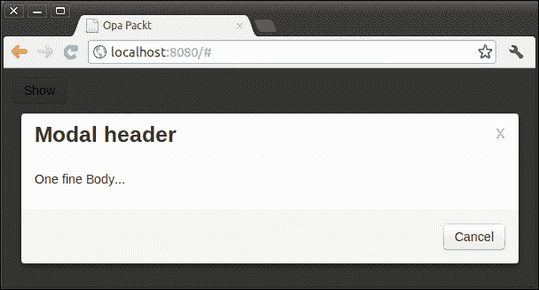

# 第四章。使用 Bootstrap

Bootstrap ([`twitter.github.com/bootstrap`](http://twitter.github.com/bootstrap)) 是一个简洁、直观且强大的前端框架，用于更快、更轻松地进行 Web 开发。Opa 提供了一种非常简单的方法来在代码中使用 Bootstrap。在本章中，我们将讨论如何在 Opa 中使用 Bootstrap 进行快速 Web 开发。

# 导入 Bootstrap

我们在 第三章 的 *资源处理器* 部分讨论了如何导入外部文件（JavaScript、CSS 等）。如果我们手动这样做，就必须导入所有必要的 Bootstrap 文件。为了简化操作，Opa 提供了一些使用 Bootstrap 的快捷方式。让我们通过一个示例开始：

```js
import stdlib.themes.bootstrap
function page(){
  <button class="btn btn-primary"style="margin:5px">Click</button>
}
Server.start(Server.http,{title:"Opa Packt",~page})
```

我们只需要一个导入语句，Opa 就会处理其余部分。上述代码的结果如下截图所示。我们可以看到，**点击**按钮是通过 Bootstrap 提供的 `btn` 和 `btn-primary` 类渲染的。



实际上，我们可以更详细地控制导入。通过这样做，我们可以防止加载不必要的资源，只加载我们需要的。请参考以下导入语句来完成此操作：

```js
// import bootstrap css and icons without responsive
import stdlib.themes.bootstrap
// import bootstrap responsive part
import stdlib.themes.bootstrap.responsive
// import bootstrap css (no icons, no responsive)
import stdlib.themes.bootstrap.css
// import bootstrap glyphicons
import stdlib.themes.bootstrap.icons
// import font awesome icons
import stdlib.themes.bootstrap.font-awesome
```

# 使用类

一旦我们导入了 Bootstrap CSS，我们就可以使用 Bootstrap 类和样式。这就像在 HTML 中编写代码一样，即 `<input class="btn btn-primary"/>`。您可以在 Bootstrap 网站上找到完整的指南（[`twitter.github.com/bootstrap/base-css.html`](http://twitter.github.com/bootstrap/base-css.html)）。

以按钮为例：

```js
import stdlib.themes.bootstrap
function page(){
  <div style="margin:5px">
    <button class="btn btn-large">Large Button</button>
    <button class="btn">Default Button</button>
    <button class="btn btn-primary">Primary Button</button>
    <button class="btn btn-small">Small Button</button>
    <button class="btn btn-mini">Mini Button</button>
  </div>
}
Server.start(Server.http,{title:"Opa Packt",~page})
```

就这么简单；在 Opa 中使用 Bootstrap 的类非常简单，结果如下所示：



# 使用图标

Bootstrap 包含了一组由 Glyphicons 提供的图标（[`glyphicons.com/`](http://glyphicons.com/)）。这些图标有深灰色和白色两种颜色。此外，Opa 还包括 Font Awesome ([`fortawesome.github.com/Font-Awesome/`](http://fortawesome.github.com/Font-Awesome/)) 图标。

## Bootstrap 图标

使用图标非常简单。所有图标都需要带有以 `icon-` 为前缀的唯一类的 `<i>` 标签。要使用它们，只需将以下代码放置在几乎任何位置：

```js
<i class="icon-search"></i>
```

默认颜色为深灰色。如果您需要使用白色图标，请将 `icon-white` 添加到 `class` 中。以下是一个示例：

```js
import stdlib.themes.bootstrap
function page(){
  <div style="margin:5px">
    <button class="btn">
      <i class="icon-search"></i> Search
    </button>
    <button class="btn btn-inverse">
      <i class="icon-search icon-white"></i> Search
    </button>
    <div class="btn-group">
      <a class="btn"><i class="icon-align-left"></i></a>
      <a class="btn"><i class="icon-align-center"></i></a>
      <a class="btn"><i class="icon-align-right"></i></a>
      <a class="btn"><i class="icon-align-justify"></i></a>
    </div>
  </div>
}
Server.start(Server.http,{title:"Opa Packt",~page})
```

结果看起来如下截图所示。我们使用 Bootstrap 图标创建了按钮和按钮组。



## Font Awesome 图标

Font Awesome 是为与 Twitter Bootstrap 一起使用而设计的标志性字体。它设计为完全与 Bootstrap 2.0 向后兼容。Font Awesome 中的图标是可缩放矢量图形，这意味着它们在任何尺寸下看起来都很棒。此外，您可以使用 CSS 控制图标颜色、大小、阴影等任何可能的内容。Opa 提供了对 Font Awesome 的语言支持，因此 Opa 开发者使用 Font Awesome 非常容易。以下是一个示例：

```js
import stdlib.themes.bootstrap.css
import stdlib.themes.bootstrap.font-awesome
function page(){
  <div style="margin:5px">
    <button class="btn">
      <i class="icon-search"></i> Search
    </button>
    <button class="btn btn-inverse">
      <i class="icon-search"></i> Search
    </button>
    <button class="btn btn-large">
      <i class="icon-search"></i> Search
    </button>
  </div>
  <div style="margin:5px;font-size:24px">
    <i class="icon-search"></i> Search
  </div>
}
Server.start(Server.http,{title:"Opa Packt",~page})
```

如我们从以下截图可以看到，**搜索**图标会根据字体大小自动缩放：



# 使用小部件

在 Web 应用程序中，有一些常用的组件，例如警告信息、下拉按钮、按钮组和模态对话框。Bootstrap 对此提供了很好的支持，您可以在 Opa 中创建这些小部件。让我们首先看看如何在 Opa 中创建下拉按钮：

```js
import stdlib.themes.bootstrap.css
function page(){
  <div class="btn-group" style="margin:10px">
    <a class="btn dropdown-toggle" data-toggle="dropdown" href="#">
      Action <span class="caret"></span>
    </a>
    <ul class="dropdown-menu">
      <li><a href="#">action1</a></li>
      <li><a href="#">action2</a></li>
      <li><a href="#">action3</a></li>
    </ul>
  </div>
}
Server.start(Server.http,[
  {resources: @static_resource_directory("resources")},
  {register: [{js: ["resources/bootstrap.min.js"]}] },
  {title:"Opa Packt", ~page}
])
```

注意，我们使用`bootstrap.min.js`作为外部 JavaScript 来启用 Bootstrap 提供的效果。您可以从 Bootstrap 网站下载此文件。

**动作**下拉按钮看起来如下所示：



让我们看看另一个例子——模态对话框。在这里，我们只展示了`function page(` `)`的代码片段。我们省略了其余的代码，因为它与下拉按钮的代码相同：

```js
function page(){
  <div class="modal hide" id=#mymodal>
    <div class="modal-header">
      <button class="close" data-dismiss="modal">x</button>
      <h3>Modal header</h3>
    </div>
    <div class="modal-body"> <p>One fine Body...</p> </div>
    <div class="modal-footer">
      <a href="#" data-dismiss="modal" class="btn">Cancel</a>
    </div>
  </div>
  <a class="btn" data-toggle="modal" href="#mymodal">Show</a>
}
```

编译并运行代码；结果看起来如下：



这里还有一些未展示的小部件。您可以参考 Bootstrap 的主页([`twitter.github.com/bootstrap`](http://twitter.github.com/bootstrap))获取更多信息。

# 摘要

如我们从本章中可以看到，在 Opa 中使用 Bootstrap 相当简单。您只需导入您想要的适当资源，其余的几乎与纯 HTML 开发相同。Bootstrap 的主页([`twitter.github.com/bootstrap`](http://twitter.github.com/bootstrap))是获取更多信息的好地方。
