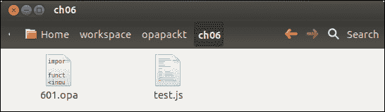
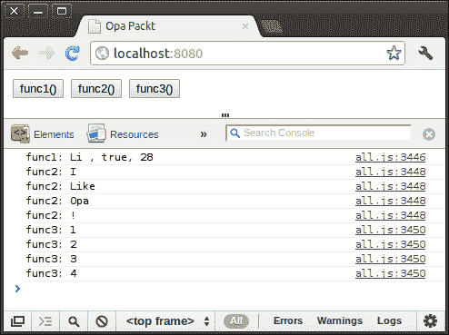
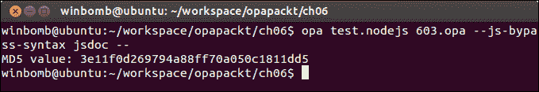

# 第六章。与其他语言的绑定

如同在第三章的*注册处理程序*部分所述，*开发 Web 应用程序*，我们可以通过使用`Resource.register_external_js`函数来注册外部 JavaScript 代码。但是，这不是我们从 Opa 调用外部 JavaScript 函数的方式。这仅在我们希望调用 Node.js 函数时才成立。在这种情况下，我们使用 Opa 的绑定能力绑定外部函数。在本章中，我们将解释如何绑定外部 JavaScript 或 Node.js 函数。

# 绑定 JavaScript

Opa 允许通过其**绑定系统库**（**BSL**）绑定外部函数。如果我们浏览 Opa 的源代码，我们会发现它在许多地方绑定了 JavaScript。实际上，Opa 提供了三种绑定语法：`classic`、`jsdoc`和`new`。`jsdoc`语法现在是（Opa 1.1.0）的默认语法。

## 第一个示例

让我们从 JavaScript 的绑定示例开始。假设我们在`test.js` JavaScript 文件中完成了一个`test`函数，然后我们想在`601.opa` Opa 文件中使用它。



`test.js`文件的内容如下：

```js
/**
* A test function of Opa binding
* @register {string -> void}
*/
function test(str){
         alert(str);
}
```

我们使用注解`@register {string -> void}`注册了`test`函数。这表示正在注册的函数具有`string -> void`类型。要在 Opa 代码中调用`test`函数，我们将函数指定为外部 JavaScript 函数，通过将函数名用特殊标识符`%%`包围来实现。在以下示例中，我们从`601.opa`文件中调用位于`test.js`中的 JavaScript `test`函数：

```js
function page(){
    <input type="button" value="click" onclick={function(_){
         %%test.test%%("Hello Opa!")
    }}/>
}
Server.start(Server.http,{title:"Opa Packt", ~page})
```

我们使用`%%test.test%%("Hello Opa!")`调用函数。在这个例子中，“test”出现了两次，一次在点号之前，一次在点号之后。第一个“test”是插件模块的名称；在这种情况下，它是`test.js`的文件名。第二个“test”是我们在这个文件中定义的函数的名称。我们可以通过以下命令行一起编译 JavaScript 代码和 Opa 代码：

```js
opa test.js 601.opa  --

```

默认情况下，注册的函数名与我们在 JavaScript 文件中定义的原始函数名相同。然而，我们可以按以下方式修改名称：

```js
/** 
* @register {string -> void} test2
*/
function test(str){ 
         alert(str);
}
```

注意，我们在注册函数的行末添加了`test2`。现在，我们可以使用`%%test.test2%%("Hello Opa!")`来调用它。

## 使用外部类型

有时候，我们可能想在 JavaScript 中处理 Opa 类型，例如列表（`a`）、选项（`'a'`）或我们在 Opa 中定义的外部 Opa 类型。在下面的示例中，我们定义了一个类型`Student`及其变量`stu`；变量`lst`是 Opa 类型`list(string)`，我们可能无法直接在 JavaScript 中使用它；变量`arr`是一个外部类型。

```js
/** 602.opa */
type Student = {string name, bool sex, int age} //Type we defined
Student      stu = {name:"Li", sex: {true}, age: 28}
list(string) lst = ["I ","Like ","Opa ","!"];   //Opa's types
llarray(int) arr = @llarray(1,2,3,4);           //Extern types
function page(){
    <input type="button" value="func1()" onclick={function(_){
         %%test2.func1%%(stu)
    }}/>
    <input type="button" value="func2()" onclick={function(_){
         %%test2.func2%%(lst)
    }}/>
    <input type="button" value="func3()" onclick={function(_){
         %%test2.func3%%(arr)
    }}/>
}
Server.start(Server.http, {title:"Opa Packt", ~page});
```

在我们的 JavaScript 文件中，我们定义了三个函数：`func1`、`func2` 和 `func3`。`func1` 接受类型 `Student`，`func2` 接受类型 `list(string)`，`func3` 接受类型 `llarray(int)`。所有这三个函数只是将它们各自参数的内容打印到控制台。我们应该做的第一件事是使用指令 `@opaType` 和 `@externType` 分别声明 Opa 类型和外部的类型。

文件 `test2.js` 的内容如下：

```js
/** test2.js */
/** @opaType list('a) */
/** @opaType Student */
/** @externType llarray('a) */
/** @register {opa[Student] -> void} */
function func1(stu){ 
    console.log("func1: "+ stu.name +" , "+stu.sex+", "+stu.age);
}
/** @register {opa[list(string)] -> void} */
function func2(lst){
    //use list2js to convert Opa list to js list.
    var lst2 = list2js(lst); 
    for(var i=0; i<lst2.length; i++) 
        console.log("func2: " + lst2[i]);
}
/** @register {llarray(int) -> void} */
function func3(arr){
    for(var i=0; i<arr.length; i++) 
        console.log("func3: " + arr[i]);
}
```

编译并运行 `opa test2.js 602.opa --`

在您的 Chrome 浏览器中按 *F12* 打开开发者工具，您将看到我们在控制台打印的输出。



# 绑定 Node.js

绑定 Node.js 代码与绑定 JavaScript 一样简单。让我们看一个例子：假设我们在名为 `test.nodejs` 的 Node.js 文件中编写了一个名为 `calcMD5` 的函数。该函数接受一个字符串并返回其 MD5 哈希值。`test.nodejs` 文件包含以下代码：

```js
/** test.nodejs */
var crypto = require('crypto');
/**
 * Calculates the MD5 hash value of a string.
 * @register {string -> string}
 */
var calcMD5 = function(str){
    return crypto.createHash('md5').update(str).digest('hex');
}
```

从前面的代码中我们可以看到，我们以与之前绑定客户端 JavaScript 代码相同的方式绑定了 Node.js。我们也是以相同的方式调用的：

```js
/** 603.opa */
md5 = %%test.calcMD5%%("Hello Opa!");
println("MD5 value: {md5}");
```

最后，我们编译并运行应用程序：

```js
opa test.nodejs 603.opa --
```

结果如下所示：



# 使用经典语法绑定外部函数

我们也可以使用 `classic` 语法绑定外部函数。`classic` 语法与 `jsdoc` 语法略有不同。它使用 `##` 来注册函数。一个典型的注册体如下：

```js
##register function_name: function_type
##args(argment_list)
{
    //function body
}
```

在 `classic` 语法中，`test2.js` 将包含以下代码：

```js
##opa-type Student
##opa-type list('a)
##extern-type llarray('a)
##register func1: opa[Student] -> void
##args(stu)
{ 
  console.log("func1: "+ stu.name +" , "+stu.sex+", "+stu.age);
}

##register func2: opa[list(string)] -> void
##args(lst)
{ 
    var lst2 = list2js(lst); 
    for(var i=0; i<lst2.length; i++) 
          console.log("func2: " + lst2[i]);
}

##register func3: llarray(int) -> void
##args(arr)
{ 
  for(var i=0; i<arr.length; i++) 
        console.log("func3: " + arr[i]);
}
```

我们现在可以使用以下命令编译重写的文件：

```js
opa test2.js 601.opa --js-bypass-syntax classic

```

# 摘要

在本章中，我们讨论了如何将客户端 JavaScript 和服务器端 Node.js 绑入我们的 Opa 代码。我们描述了两种语法变体：`classic` 语法和 `jsdoc` 语法。本章中使用的示例演示了在 Opa 中绑定 JavaScript 和 Node.js 非常简单。
