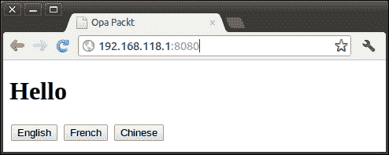

# 第八章 国际化

在本章中，我们将讨论**国际化**（**i18n**）。它被缩写为 i18n，因为从初始的*i*到最后的*n*之间有 18 个字母。Opa 现在提供了两种 i18n 方法：内部方法和外部方法。要使用内部方法，我们直接在我们的 Opa 代码中包含翻译函数。然而，如果我们希望将翻译与我们的主要代码分离，我们可以通过使用外部方法来实现。为了使问题清晰，我们将讨论一个非常简单的应用程序，该程序以三种不同的语言显示单词“hello”：英语、法语和中文。

# 内部方法

Opa 现在通过`@i18n`指令提供了对翻译的支持。我们可以在`@i18n`指令中放置一个翻译函数，并且它将根据不同的语言被替换为适当的值。一个例子胜过千言万语，所以让我们从一个简单的例子开始：

```js
import stdlib.web.client
hello = function {
  case "en": "Hello"
  case "fr": "Bonjour"
  case "zh": "你好"
  default: "Hi"
}
function page(){
  <h1> {@i18n(hello)} </h1>
  <input type="button" value="English" onclick={set_lang("en")}/>
  <input type="button" value="French"  onclick={set_lang("fr")}/>
  <input type="button" value="Chinese" onclick={set_lang("zh")}/>
}
function set_lang(lang)(_){
  I18n.set_lang(lang)
  Client.reload()
}
Server.start(Server.http, {title:"Opa Packt", ~page})
```

将此代码保存到文件`801.opa`中，然后使用以下命令编译和运行它：

```js
opa 801.opa --

```

结果看起来如下面的截图所示：



页面以三种不同的语言显示**Hello**：英语、法语和中文，我们可以通过点击语言按钮来更改语言。

如我们从代码中可以看到的，我们通过将翻译函数`hello`包裹在`@i18n`指令中来实现页面国际化——`@i18n(hello)`。

函数`hello`将语言代码（例如，`en`、`fr`和`zh`，类型为`I18n.language`）映射到一个字符串。请注意，函数`hello`的编写方式很方便，即`…`。如果函数的初始几行代码是将其参数与某些值匹配，那么这种表示法是被允许的，就像我们在`hello`函数中所做的那样。相应的长表示法将是：

```js
hello = function(lang){
  match(lang){
    case "en": "Hello"
    ...
  }
}
```

还请注意，翻译函数的返回类型不仅限于`String`类型；函数也可以返回 XHTML 片段：

```js
hello = function{
  case "en": <font color="red"> Hello </font>
  case "fr": <font color="blue"> Bonjour </font>
  case "zh": <font color="green"> 你好 </font>
  default:   <font color="yellow"> Hi </font>
}
```

现在我们已经回顾了如何编写翻译函数，我们现在需要明确用户如何控制他们所看到的网站的语言。国际化模块`I18n`包含了答案。`I18n.lang()`函数返回当前选定的语言。请注意，这并不是浏览器的语言，而是用户所选的语言。我们可以通过调用函数`I18n.set_lang(lang)`来程序化地更改选定的语言。这正是我们在刚才看到的示例中点击三个语言按钮**英语**、**法语**和**中文**后所做的事情。这个函数允许我们为特定的客户端更改语言。我们的程序定义的语言随后被存储在一个 cookie 中。由于我们的程序所做的更改只会在下一个页面请求期间生效，为了立即使其生效，我们的程序必须通过调用函数`Client.reload`来刷新页面。

# 外部方法

内部方法存在一个重要问题，那就是它将源代码和翻译混合在一起。解决这个问题的方法是外部方法。使用它，我们可以将程序代码和翻译分开。

要使用外部翻译，我们使用相同的`@i18n`指令，但提供给它一个键字符串而不是一个函数。因此，`@i18n(hello)`可以被替换为：

```js
@i18n("hello")
```

这里是一个外部方法的示例：

```js
//802.opa
function page(){
  <div onready={function(_) { I18n.set_lang("fr") }}>
    <h1>{@i18n("hello")}</h1>
  </div>
}
Server.start(Server.http, {title:"Opa Packt", ~page})
```

将文件保存为`802.opa`。如果我们不提供任何翻译，`@i18n("hello")`将被替换为字符串`"hello"`。我们如何添加翻译？解决方案是使用带有翻译开关`--i18n-template-opa`编译我们的源代码：

```js
opa 802.opa --i18n-template-opa --i18n-pkg trans --i18n-dir langs
```

创建一个名为`langs`的目录并执行此行。这将创建一个名为`trans.opa`的文件，位于`langs`目录中。选项`--i18n-pkg`指定了翻译代码的包名。如果没有提供，默认名称将是`linking.translation`。选项`--i18n-dir`指定了翻译代码的目录。如果没有提供，将使用当前目录。`trans.opa`的内容如下所示：

```js
package trans
import stdlib.core.i18n

// Template for 801.opa
// "hello"
// string, 15
__i18n_5d41402abc4b2a76b9719d911017c592()= match I18n.lang()
  _   -> "hello"
```

文件包含给定包中所有源代码文件中需要翻译的所有消息。长序列`5d41402abc4b2a76b9719d911017c592`是一个自动生成的标识符。

接下来，我们必须编辑 Opa 生成的翻译文件，将我们的翻译信息添加到文件中。例如，在我们的示例案例中，我们可以添加以下翻译指令：

```js
package trans
import stdlib.core.i18n
// Template for 801.opa
// "hello"
// string, 15
__i18n_5d41402abc4b2a76b9719d911017c592()= match I18n.lang()
 "en" -> "Hello"
 "fr" -> "Bonjour"
 "zh" -> "你好"
  _   -> "hello"
```

翻译文件是一个普通的 Opa 文件，其内容可以直观理解。这种表示法被称为经典语法。当我们编译翻译时，我们必须告诉编译器我们正在使用经典 Opa 源代码：

```js
opa --parser classic langs/trans.opa

```

最后，使用翻译编译我们的源代码：

```js
opa 801.opa --i18n-dir langs --i18n-pkg trans

```

# 总结

在本章中，我们讨论了如何在 Opa 中国际化一个网页。我们可以使用在代码中编写翻译函数的内部方法，或者使用从代码中单独翻译的外部方法。
