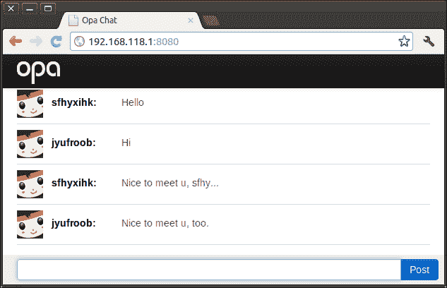
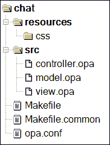

# 第九章. 构建聊天应用

我们已经了解了 Opa 的基本概念，现在是时候构建一个真正的 Web 应用了。在本章中，我们将构建一个聊天应用。该应用提供了一个聊天室。连接到应用的用户将自动加入聊天室并可以立即开始讨论。为了简单起见，当用户加入时，我们提供了一个随机用户名。该应用的源代码可以在[`github.com/winbomb/opapackt`](https://github.com/winbomb/opapackt)找到。

以下是我们聊天应用的截图：



# 创建项目

要开始开发我们的聊天应用，我们需要使用以下 Opa 命令创建一个 Opa 项目：

```js
opa create chat

```

此命令将创建一个空白的 Opa 项目。同时，它将自动生成所需的目录和文件，结构如下所示截图所示：



让我们简要看看这些源代码文件的作用：

+   `controller.opa`：此文件作为聊天应用的入口点；我们在`controller.opa`中启动了网络服务器。

+   `view.opa`：此文件作为用户界面

+   `model.opa`：这是聊天应用的模式；它定义了消息、网络和聊天室

+   `style.css`：这是一个外部样式表文件

+   `Makefile`：此文件用于构建应用

由于聊天应用不需要数据库支持，我们可以从`Makefile`中的 FLAG 选项中删除`--import-package stdlib.database.mongo`。输入`make`和`make run`来运行空的应用程序。

# 启动网络服务器

让我们从`controller.opa`开始，这是我们的聊天应用的入口点，在这里我们启动了网络服务器。我们已经在第三章的*服务器模块*部分讨论了函数`Server.start`，*开发 Web 应用*。在我们的聊天应用中，我们将使用一个处理器组来处理用户请求。

```js
Server.start(Server.http, [
  {resources: @static_resource_directory("resources")},
  {register: [{css:["/resources/css/style.css"]}]},
  {title:"Opa Chat", page: View.page }
])
```

那么，我们到底传递给`Server.start`函数的参数是什么呢？

这行代码`{resources: @static_resource_direcotry("resources")}`注册了一个资源处理器，并将为`resources`目录中的资源文件提供服务。

接下来，这行代码`{register: [{css:["/resources/css/style.css"]}]}`注册了一个外部 CSS 文件——`style.css`。这允许我们在`style.css`应用范围内使用样式。

最后，这行代码`{title:"Opa Chat", page: View.page}`注册了一个单页处理器，它将把所有其他请求分派到函数`View.page`。

服务器使用默认配置`Server.http`，并将运行在 8080 端口。

# 设计用户界面

当应用启动时，所有请求（除了资源请求）都将被分配到函数`View.page`，该函数在浏览器上显示聊天页面。让我们看看视图部分；我们在`view.opa`中定义了一个名为`View`的模块。

```js
import stdlib.themes.bootstrap.css
module View {
  function page(){
    user = Random.string(8)
    <div id=#title class="navbar navbar-inverse navbar-fixed-top">
      <div class=navbar-inner>
        <div id=#logo /> 
      </div>
    </div>
    <div id=#conversation class=container-fluid
      onready={function(_){Model.join(updatemsg)}} />
    <div id=#footer class="navbar navbar-fixed-bottom">
      <div class=input-append>
        <input type=text id=#entry class=input-xxlarge
          onnewline={broadcast(user)}/>
        <button class="btn btn-primary" 
          onclick={broadcast(user)}>Post</button>
      </div>
    </div>
  }
  ...
}
```

模块 `View` 包含用于在浏览器上显示页面的函数。在第一行 `import stdlib.themes.bootstrap.css` 中，我们导入 Bootstrap 样式。

这允许我们在代码中使用 Bootstrap 标记，例如 `navbar`、`navbar-fix-top` 和 `btn-primary`。我们还注册了一个外部 `style.css` 文件，这样我们就可以在 `style.css` 中使用样式，如 `conversation` 和 `footer`。

如我们所见，该函数页面中的代码几乎遵循与 HTML 相同的语法。如第三章 XHTML 中所述，在 开发 Web 应用程序 一节中讨论过，我们可以在 Opa 代码中自由使用 HTML，HTML 值在 Opa 中具有预定义的类型 `xhtml`。

# 构建应用程序逻辑

聊天应用程序完全是关于用户之间交换消息的，因此我们需要定义一个消息类型。我们可以在 `model.opa` 的第一行找到其定义：

```js
type message = {string user, string text}
```

这是一个具有两个字段的非常简单的类型。`user` 字段表示消息的作者，而 `text` 字段表示消息的内容。

现在我们有了消息的定义，我们需要一种方法在不同客户端之间传递消息。如第五章 客户端与服务器之间的通信 中所述，*客户端与服务器之间的通信*，Opa 提供了三种在客户端和服务器之间通信的方式：会话、单元和网络。会话用于单向异步通信；单元是会话的特殊情况，用于双向同步通信；网络用于向所有观察者广播消息。网络是我们目的的正确选择：

```js
server private Network.network(message) room = Network.empty();
```

此代码片段定义了一个名为 `room` 的空网络。该网络类型为 `Network.network(message)`，这意味着它是一个用于传输类型为 `message` 的数据的网络。关键字 `private` 表示它不能从其他模块访问，关键字 `server` 指示 Opa 在服务器上而不是在客户端实现此网络。

我们也可以使用 `Network.cloud(key)` 来创建一个云网络。如果应用程序以 `cloud` 选项（例如，`./chat.js --cloud`）执行，此类网络将在多个服务器之间自动共享。当一个或多个服务器使用相同值 key 调用 `Network.cloud(key)` 时，实际上只有一个网络在参与服务器之一（任意选择）上创建，并且该网络将在服务器之间共享。

现在我们已经有了网络，下一步是将客户端添加到我们的网络中并向客户端广播消息。因此，我们需要两个新的函数：

```js
  function register(callback) {
    Network.add_callback(callback,room);
  }
  @async function broadcast(message) {
    Network.broadcast(message, room);
  }
```

`register` 函数将回调函数注册到给定的网络。每当有新消息到达时，将调用此注册的函数。

`broadcast` 函数将消息广播到属于给定网络的全部客户端。请注意，客户端接收消息的顺序是不确定的。

`model.opa` 的完整代码如下：

```js
type message = {string user, string text}
module Model {
  server private Network.network(message) room = Network.empty();
  @async function broadcast(message) {
    Network.broadcast(message, room);
  }
  function register(callback) {
    Network.add_callback(callback,room);
  }
}
```

# 广播和接收消息

我们需要做什么剩下的工作是将模型和视图连接起来。我们需要完成两个不同的函数。

当在 **Post** 按钮上点击或当在文本字段中按下 *Enter* 时，我们必须广播当前用户的消息。我们还必须显示到达的新消息。

让我们先看看当用户按下 *Enter* 时，我们是如何广播用户消息的：

```js
<button class="btn btn-primary"
onclick={broadcast(user)}>Post</button>
...
function broadcast(user)(_){
  text = Dom.get_value(#entry);
  Model.broadcast(~{user, text});
  Dom.clear_value(#entry);
}
```

当用户按下 *Enter* 时，`broadcast` 函数将被调用。在这个函数中，我们首先使用 `Dom.get_value` 获取用户的输入，然后在第二行通过调用模块 `Model` 中的 `broadcast` 方法来广播消息。最后，我们清除输入字段的内容。这就是将消息广播给所有已连接客户端的全部过程。现在让我们回顾一下我们是如何处理新消息到达的。我们已经在 `model.opa` 中提到了函数 `Model.register`。回想一下，它将一个回调函数注册到网络中。考虑以下在 `view.opa` 中找到的代码：

```js
<div id=#conversation class=container-fluid
  onready={function(_){Model.register(updatemsg)}} />
```

当 `div #conversation` 准备就绪时，它会调用 `Model.register` 来注册回调函数 `updatemsg`，该函数将在收到新消息时被调用：

```js
function updatemsg(msg){
  line = <div class="row-fluid line">
         <div class="span1 userpic" />
         <div class="span2 user">{msg.user}:</>
         <div class="span9 message">{msg.text}</>
         </div>;
  #conversation =+ line;
  Dom.scroll_to_bottom(#conversation);
}
```

在 `updatemsg` 函数中，我们首先构建一个代表我们收到的消息的 HTML 片段。然后，我们向具有 id `conversation` 的 `Dom` 元素的末尾添加一行。请注意，我们正在使用快捷语法 `=+`。最后，我们使用 `Dom.scroll_to_bottom` 函数将内容滚动到最底部。

# 摘要

在本章中，我们使用 Opa 构建了一个真正的网络应用程序。该应用程序使用了我们在前几章中讨论的概念和方法。首先，我们回顾了如何创建 Opa 项目以及如何启动网络服务器。然后，我们使用了 Bootstrap 标记和自定义样式来构建模块 `View` 中的聊天页面。

随后，我们在模块 `Model` 中定义了聊天消息和聊天室。最后，我们将它们组合起来创建聊天应用程序。
