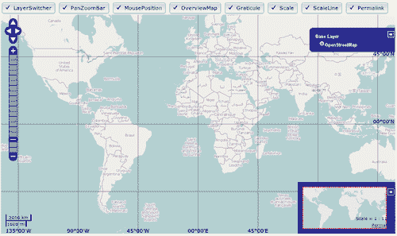
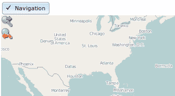
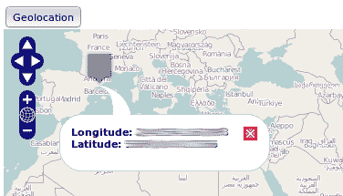
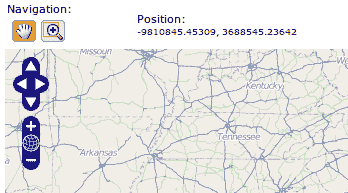
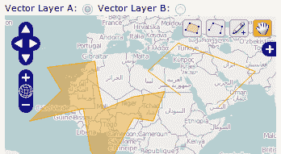
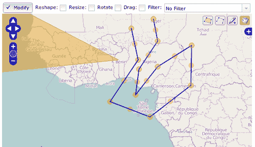
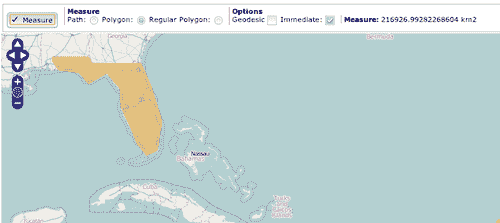
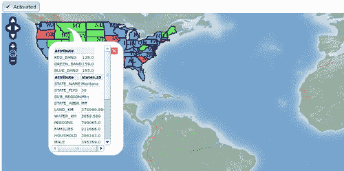

添加控件

在本章中，我们将介绍以下内容：

+   添加一些视觉控件

+   添加 NavigationHistory 控件

+   处理地理位置

+   将控件放置在地图外部

+   在多个矢量图层上编辑要素

+   修改要素

+   测量距离和面积

+   从数据源获取要素信息

+   从 WMS 服务器获取信息

# 第五章：简介

本章从基础知识出发，探讨了 OpenLayers 为我们开发者提供的最重要和最常用的控件。控件使我们能够导航地图、操作图层、放大或缩小，执行编辑要素、测量距离等操作。本质上，控件允许我们进行交互。

`OpenLayers.Control`类是所有控件的基类，包含控件可能具有的常见属性和方法。我们可以总结如下：

+   控件附加到地图上

+   控件可以触发事件

+   控件可以被激活或禁用

+   控件可以有视觉表示（如按钮）或没有视觉表示（如拖动操作）

控件与**处理器**密切相关。虽然控件旨在包含动作的逻辑，但它们将**低级任务**委托给处理器，例如了解鼠标或键盘事件。例如，`OpenLayers.Control.DragPan`控件负责通过响应鼠标事件来拖动地图。虽然监听鼠标事件的任务委托给`OpenLayers.Handler.DragPan`类的内部实例，但移动地图的任务由控件本身完成。

与控件类似，`OpenLayers.Handler`类是所有控件使用的现有处理器的基础类。

让我们看看一些菜谱，这将帮助我们更好地理解控件。

# 添加和删除控件

OpenLayers 提供了大量的控件，这些控件在地图应用中常用。

本菜谱展示了如何使用具有视觉表示的最常用控件。列表包括 OverviewMap 控件、Scale 和 ScaleLine 控件、Graticule 控件、LayerSwitcher 控件、PanZoomBar 控件、MousePosition 控件和 Permalink 控件：



## 如何操作...

1.  首先添加按钮的代码：

    ```js
    <button data-dojo-type="dijit.form.ToggleButton" data-dojo-props="iconClass:'dijitCheckBoxIcon', checked: true, onChange: layerSwitcherChanged">LayerSwitcher</button>
    <button data-dojo-type="dijit.form.ToggleButton" data-dojo-props="iconClass:'dijitCheckBoxIcon', checked: true, onChange: panZoomBarChanged">PanZoomBar</button>
    <button data-dojo-type="dijit.form.ToggleButton" data-dojo-props="iconClass:'dijitCheckBoxIcon', checked: true, onChange: mousePositionChanged">MousePosition</button>
    <button data-dojo-type="dijit.form.ToggleButton" data-dojo-props="iconClass:'dijitCheckBoxIcon', checked: true, onChange: overviewMapChanged">OverviewMap</button>
    <button data-dojo-type="dijit.form.ToggleButton" data-dojo-props="iconClass:'dijitCheckBoxIcon', checked: true, onChange: graticuleChanged">Graticule</button>
    <button data-dojo-type="dijit.form.ToggleButton" data-dojo-props="iconClass:'dijitCheckBoxIcon', checked: true, onChange: scaleChanged">Scale</button>
    <button data-dojo-type="dijit.form.ToggleButton" data-dojo-props="iconClass:'dijitCheckBoxIcon', checked: true, onChange: scaleLineChanged">ScaleLine</button>
    <button data-dojo-type="dijit.form.ToggleButton" data-dojo-props="iconClass:'dijitCheckBoxIcon', checked: true, onChange: permalinkChanged">Permalink</button>

    ```

    ### 注意

    我们正在使用**Dojo Toolkit**([`dojotoolkit.org/`](http://dojotoolkit.org/))来创建最丰富的用户界面，多亏了它提供的精美组件。本菜谱的目标不是教授 Dojo，而是教授 OpenLayers，因此我们可以自由地更改与 HTML 相关的代码，使用复选框元素作为输入，而不是 Dojo 切换按钮，并处理`onclick`事件。

    本菜谱的重要性在于读者学习了创建不同控件、将它们附加到地图上以及激活或禁用它们。

1.  接下来，添加`div`元素以容纳地图：

    ```js
    <div id="ch05_visual_controls" style="width: 100%; height: 90%;"></div>

    ```

1.  创建地图实例并添加基本图层：

    ```js
    <!-- The magic comes here -->
    <script type="text/javascript">
        // Create map
        var map = new OpenLayers.Map("ch05_visual_controls", {
            controls: []
        });    
        var osm = new OpenLayers.Layer.OSM();        
        map.addLayer(osm);

    ```

1.  添加控件集：

    ```js
        // Add controls
        var layerSwitcher = new OpenLayers.Control.LayerSwitcher({'ascending':false});
        var panZoomBar = new OpenLayers.Control.PanZoomBar();
        var mousePosition = new OpenLayers.Control.MousePosition();
        var overviewMap = new OpenLayers.Control.OverviewMap({maximized: true});
        var graticule = new OpenLayers.Control.Graticule({displayInLayerSwitcher: false});
        var scale = new OpenLayers.Control.Scale();
        var scaleline = new OpenLayers.Control.ScaleLine();
        var permalink = new OpenLayers.Control.Permalink();

        map.addControls([layerSwitcher, panZoomBar, mousePosition, overviewMap,
            graticule, scale, scaleline, permalink]);

        map.setCenter(new OpenLayers.LonLat(0, 0), 2);

    ```

1.  最后，根据相应按钮的状态添加或删除控件的代码：

    ```js
        function layerSwitcherChanged(checked) {
            if(checked) {
                layerSwitcher = new OpenLayers.Control.LayerSwitcher({'ascending':false});
                map.addControl(layerSwitcher);
            } else {
                map.removeControl(layerSwitcher);
                layerSwitcher.destroy();
            }
        }
        function panZoomBarChanged(checked) {
            if(checked) {
                panZoomBar = new OpenLayers.Control.PanZoomBar();
                map.addControl(panZoomBar);
            } else {
                map.removeControl(panZoomBar);
                panZoomBar.destroy();
            }
        }
        function mousePositionChanged(checked) {
            if(checked) {
                mousePosition = new OpenLayers.Control.MousePosition();
                map.addControl(mousePosition);
            } else {
                map.removeControl(mousePosition);
                mousePosition.destroy();
            }
        }

    ```

1.  每个函数都接收一个 `checked` 参数，表示按钮是否被按下。根据其值，我们简单地从地图中添加或删除控件：

    ```js
    function overviewMapChanged(checked) {
            if(checked) {
                overviewMap = new OpenLayers.Control.OverviewMap({maximized: true});
                map.addControl(overviewMap);
            } else {
                map.removeControl(overviewMap);
                overviewMap.destroy();
            }
        }
        function graticuleChanged(checked) {
            if(checked) {
                graticule = new OpenLayers.Control.Graticule({displayInLayerSwitcher: false});
                map.addControl(graticule);
            } else {
                map.removeControl(graticule);
                graticule.destroy();
            }
        }
        function scaleChanged(checked) {
            if(checked) {
                scale = new OpenLayers.Control.Scale();
                map.addControl(scale);
            } else {
                map.removeControl(scale);
                scale.destroy();
            }
        }
        function scaleLineChanged(checked) {
            if(checked) {
                scaleline = new OpenLayers.Control.ScaleLine();
                map.addControl(scaleline);
            } else {
                map.removeControl(scaleline);
                scaleline.destroy();
            }
        }
        function permalinkChanged(checked) {
            if(checked) {
                permalink = new OpenLayers.Control.Permalink();
                map.addControl(permalink);
            } else {
                map.removeControl(permalink);
                permalink.destroy();
            } 
        }
    </script>

    ```

### 它是如何工作的...

我们首先做的事情是创建地图实例，强制它没有任何控件附加到它。这是通过将 `controls` 属性设置为空数组来完成的：

```js
    // Create map
    var map = new OpenLayers.Map("ch05_visual_controls", {
        controls: []
    }); 

```

### 注意

当我们创建一个没有指定 `controls` 属性的 `OpenLayers.Map` 实例时，OpenLayers 会自动向其中添加下一组默认控件：导航、平移缩放、ArgParser 和版权信息。

接下来，我们创建了控件，并使用 `addControls` 方法将所有控件添加到地图中：

```js
    var layerSwitcher = new OpenLayers.Control.LayerSwitcher({'ascending':false});
    ...
    ...
    ...
    var permalink = new OpenLayers.Control.Permalink();

    map.addControls([layerSwitcher, panZoomBar, mousePosition, overviewMap, graticule, scale, scaleline, permalink]);

```

在继续之前，让我们看看在控件实例化中使用的属性。

在图层切换器上，我们已经将属性 `ascending` 设置为 `false`。这意味着图层将按降序排序，即它们将以相反的顺序添加到地图中：

```js
    var layerSwitcher = new OpenLayers.Control.LayerSwitcher({'ascending':false});

```

在 OverviewMap 控件上，`maximized` 属性允许我们扩展创建的控件：

```js
    var overviewMap = new OpenLayers.Control.OverviewMap({maximized: true});

```

最后，对于 Graticule 控件，`displayInLayerSwitcher` 属性允许在 LayerSwitcher 控件中打开或关闭它：

```js
    var graticule = new OpenLayers.Control.Graticule({ displayInLayerSwitcher: false});

```

多亏了 Dojo Toolkit，我们创建的按钮具有切换按钮的行为。每个按钮都有一个与之关联的函数，该函数在按钮状态从选中变为未选中时执行。在概述地图按钮的情况下，关联的函数是 `overviewMapChanged`，它在 `data-dojo-props` 属性中的 `onChange` 事件内指定：

```js
<button data-dojo-type="dijit.form.ToggleButton" data-dojo-props="iconClass:'dijitCheckBoxIcon', checked: true, onChange: overviewMapChanged">OverviewMap</button>

```

作为 `onChange` 事件监听器的函数接收一个布尔参数，指示按钮是否被选中或取消选中。

所有监听函数都很相似。根据检查参数的值，它从地图中删除（并销毁）控件或创建一个新的控件：

```js
    function overviewMapChanged(checked) {
        if(checked) {
            overviewMap = new OpenLayers.Control.OverviewMap({maximized: true});
            map.addControl(overviewMap);
        } else {
            map.removeControl(overviewMap);
            overviewMap.destroy();
        }
    }

```

与图层一样，使用 `removeControl()` 方法从地图实例中删除控件不会释放控件可能使用的资源。我们需要使用 `destroy()` 方法显式地这样做。

### 参见

+   *将控件放置在地图外部* 的配方

+   在 第六章 的 *使用 img 文件夹理解主题如何工作* 配方（为主题化 PanZoomBar 控件）中，*主题化*

# 添加导航历史记录控件

在我们的地图应用程序中，最常用的控件可能是导航控件。`OpenLayers.Control.Navigation` 控件集成了（使用了）一些其他控件，例如 `OpenLayers.Control.DragPan`、`OpenLayers.Control.ZoomBox` 或滚轮处理程序，这允许我们平移和缩放地图。

在导航、移动或缩放时，存储用户执行的导航操作的历史可能很有趣，这样他/她就可以回到或前进到先前的地方。幸运的是，我们不需要重新发明轮子。OpenLayers 为我们提供了`OpenLayers.Control.NavigationHistory`控件。

这个示例展示了将其添加到我们的应用程序中并从中受益是多么容易。



如截图所示，我们将在地图上方添加一个按钮，该按钮将启用或禁用导航组件。

## 如何实现...

1.  创建一个包含所需 OpenLayers 依赖项的 HTML 文件。添加用于启用/禁用导航控件的切换按钮代码：

    ```js
    <button data-dojo-type="dijit.form.ToggleButton" data-dojo-props="iconClass:'dijitCheckBoxIcon', checked: true, onChange: navigationChanged">Navigation</button>

    ```

1.  接下来，添加一个`div`元素来包含地图：

    ```js
    <div id="ch05_nav_history" style="width: 100%; height: 90%;"></div>

    ```

1.  现在，创建地图实例并添加一个基础图层：

    ```js
    <script type="text/javascript">
        // Create map
        var map = new OpenLayers.Map("ch05_nav_history", {
            controls: []
        });    
        var osm = new OpenLayers.Layer.OSM();        
        map.addLayer(osm);

    ```

1.  添加导航和导航历史控件：

    ```js
        // Add controls
        var navigation = new OpenLayers.Control.Navigation();
        var history = new OpenLayers.Control.NavigationHistory();
        var panel = new OpenLayers.Control.Panel();
        panel.addControls([history.next, history.previous]);

        map.addControls([navigation, history, panel]);
        map.setCenter(new OpenLayers.LonLat(0, 0), 4);

    ```

1.  实现负责启用/禁用导航控件的函数：

    ```js
        function navigationChanged(checked) {
            if(checked) {
                navigation.activate();
            } else {
                navigation.deactivate();
            }
        }
    </script>

    ```

### 它是如何工作的...

首先，让我们谈谈导航控件。使用它并不神秘。只需创建一个控件实例并将其添加到地图中：

```js
    var navigation = new OpenLayers.Control.Navigation();
    ....
    ....
    map.addControls([navigation, ...]);

```

在开始创建的按钮使用了 Dojo Toolkit，这使得我们能够轻松地将其转换为切换按钮。此外，我们还添加了一个监听函数来检查按钮的状态是否在选中和不选中之间改变。`navigationChanged`函数根据`checked`值激活或禁用控件：

```js
    function navigationChanged(checked) {
        if(checked) {
            navigation.activate();
        } else {
            navigation.deactivate();
        }
    }

```

每个控件都有一个`activate()`和`deactivate()`方法。它们在基类`OpenLayers.Control`中定义，并且所有具体的控件都继承或覆盖了这些方法。

相比于从地图中移除和添加控件，使用`activate`和`deactivate`更受欢迎。这样，就不需要创建或附加控件的实例。控件只是处于待机状态，直到我们再次激活它。

这一切都与导航控件相关，让我们看看如何添加导航历史控件，因为这只是一个两步的过程。

`OpenLayers.Control.NavigationHistory`控件有点特别。它包含用于存储先前和后续访问位置的栈，以及其他内容，还包含对两个按钮（`OpenLayers.Control.Button`控件类的实例）的引用，这允许我们在导航历史中前进和后退。这些按钮的引用可以在`previous`和`next`属性中找到。

默认情况下，在地图中添加 NavigationHistory 控件后，不会出现任何按钮。显示上一个和下一个按钮的责任在我们。为此，以及其他类似的目的，OpenLayers 为我们提供了`OpenLayers.Control.Panel`控件类。这是一种特殊的控件，可以包含或组合其他控件。所以，考虑到所有这些，我们现在可以解释如何将导航历史控件添加到地图中。

首先，我们需要创建 `OpenLayers.Control.NavigationHistory` 实例并将其添加到地图中。其次，我们需要添加一个面板来显示两个按钮，并添加这两个按钮：

```js
    var history = new OpenLayers.Control.NavigationHistory();
    var panel = new OpenLayers.Control.Panel();
    panel.addControls([history.next, history.previous]);

```

最后，必须将面板本身作为新的控件添加到地图中：

```js
    map.addControls([navigation, history, panel]);

```

如您所见，我们已经添加了导航、导航历史和带有按钮的面板作为地图控件，仅仅是因为这三者都是控件。

在 第六章 的 *主题* 中，我们将看到如何更改此控件使用的图标。

### 相关内容

+   *添加和删除控件* 的配方

+   *将控件放置在地图外部* 的配方

+   在 第六章 的 *主题* 中的 *使用主题文件夹理解主题工作方式* 配方

# 处理地理位置

随着 **HTML5** 的到来，规范中引入了许多新的 API 和概念之一是识别加载网页的客户端位置的可能性，通过 **地理位置 API** ([`dev.w3.org/geo/api/spec-source.html`](http://dev.w3.org/geo/api/spec-source.html))。当然，在网络地图应用的世界中，这开辟了新的巨大可能性。

在这个配方中，我们将展示如何轻松地识别用户的当前位置并将地图的视口中心对准它：



每当用户点击 **地理位置** 按钮，地图的视口将移动到当前用户的当前位置，并在其上放置一个标记。此外，当鼠标悬停在标记上时，将显示一个包含当前位置的弹出窗口。

## 准备工作

如我们在配方开头所述，地理位置是浏览器必须实现的功能，因此我们需要一个符合 HTML5 的浏览器才能使此控件工作。

## 如何操作...

1.  首先创建包含 OpenLayers 依赖项的 HTML 文件，然后添加按钮和地图元素的 HTML 代码：

    ```js
    <button data-dojo-type="dijit.form.Button" data-dojo-props="onClick: geolocationClick">Geolocation</button>
    <div id="ch05_geolocating" style="width: 100%; height: 90%;"></div>

    ```

1.  然后，初始化地图实例并添加一个基本图层：

    ```js
    <script type="text/javascript">
        // Create map
        var map = new OpenLayers.Map("ch05_geolocating");    
        var osm = new OpenLayers.Layer.OSM();        
        map.addLayer(osm);

    ```

1.  现在，将 `OpenLayers.Control.Geolocate` 控制器添加到地图中：

    ```js
        // Add controls
        var geolocate = new OpenLayers.Control.Geolocate({
            eventListeners: {
                "locationupdated": locateMarker,
                "locationfailed": function() {
                    console.log('Location detection failed');
                }
            }
        });
        map.addControl(geolocate);

    ```

1.  创建并添加到地图中，放置标记的标记层：

    ```js
        var markers = new OpenLayers.Layer.Markers("Markers");
        map.addLayer(markers);

    ```

1.  为视图设置初始位置：

    ```js
        map.setCenter(new OpenLayers.LonLat(0, 0), 6);

    ```

1.  实现与 **地理位置** 按钮关联的监听器函数：

    ```js
        function geolocationClick() {
            geolocate.deactivate();
            geolocate.activate();
        }

    ```

1.  最后，实现每次检测到客户端位置时执行的功能。此函数的目的是在当前客户端的位置上向地图添加一个标记，并在鼠标悬停在标记上时显示一个带有坐标的弹出窗口：

    ```js
        function locateMarker(event) {

    ```

1.  首先删除任何之前的标记：

    ```js
            // Remove any existing marker
            markers.clearMarkers();

    ```

1.  然后，创建用于标记的图标：

    ```js
            var size = new OpenLayers.Size(32, 37);
            var offset = new OpenLayers.Pixel(-(size.w/2), -size.h);
            var icon = new OpenLayers.Icon('./recipes/data/icons/symbol_blank.png', size, offset);
            icon.setOpacity(0.7);

            // Create a lonlat instance from the event location.
            // NOTE: The coordinates are transformed to the map's projection by
            // the geolocate control.
            var lonlat = new OpenLayers.LonLat(event.point.x, event.point.y);

            // Add the marker
            var popup = null;
            var marker = new OpenLayers.Marker(lonlat, icon);

    ```

1.  然后，注册一个鼠标悬停事件的监听器，该监听器将显示弹出窗口：

    ```js
            marker.events.on({
                "mouseover": function() {
                    if(popup) {
                        map.removePopup(popup);
                    }

                    var content = "<strong>Longitude:</strong> " + lonlat.lon + "<br/>" + "<strong>Latitude:</strong> " + lonlat.lat;

                    popup = new OpenLayers.Popup.FramedCloud(
                    "popup", lonlat, new OpenLayers.Size(250, 100), content,
                    null, true, null);

                    map.addPopup(popup);
                }
            });

            markers.addMarker(marker);
        }
    </script>

    ```

### 它是如何工作的...

第一步是创建 `OpenLayers.Control.Geolocate` 控制器实例并将其添加到地图中：

```js
    var geolocate = new OpenLayers.Control.Geolocate({
        eventListeners: {
            "locationupdated": locateMarker,
            "locationfailed": function() {
                console.log('Location detection failed');
            }
        }
    });

```

控件可以触发三个事件：

+   `locationupdated:` 当浏览器返回新位置时触发此事件

+   `locationfailed:` 如果地理位置失败，则触发此事件

+   `locationuncapable:` 如果你在不支持地理位置的浏览器中激活控件，则会触发此事件。

在这个菜谱中，我们为`locationupdated`和`locationfailed`事件附加了一个事件监听器函数。

要使用 Geolocate 控件，我们需要调用其`activate()`方法。然后，OpenLayers 将请求浏览器获取当前用户的位置，浏览器会询问我们是否想要分享我们的位置。如果我们接受，则将触发一个带有当前位置作为参数的`locationupdated`事件。

在菜谱中，当按钮被点击时，会调用`geolocationClick`函数，并强制激活控件：

```js
    function geolocationClick() {
        geolocate.deactivate();
        geolocate.activate();
    }

```

然后，当`locationupdated`事件被触发时，`locateMarker`函数被执行，传递一个带有所有相关事件信息的`event`参数，包括客户端坐标：

```js
    function locateMarker(event) {...}

```

### 注意

存储在`event.point`中的坐标由**Geolocate**控件转换，以与地图相同的坐标系一致。

此函数的目的是在地图上添加一个标记到当前客户端的位置，并在鼠标悬停在标记上时显示一个带有坐标的弹出窗口。

### 还有更多...

`OpenLayers.Control.Geolocate`控件有几个有趣的属性。

首先，`bind`属性默认设置为`true`，允许我们指定地图的中心是否必须更新为控件检测到的位置。

`watch`属性默认设置为`false`，允许定期更新位置。

此外，我们还可以向控件传递一个`geolocationOptions`对象，该对象在规范中定义（见[`dev.w3.org/geo/api/spec-source.html#position_options_interface)`](http://dev.w3.org/geo/api/spec-source.html#position_options_interface))，以更好地配置控件。

### 参见

+   *添加和删除控件*菜谱

+   *修改特征*菜谱

# 将控件放置在地图外部

默认情况下，所有控件都放置在地图上。这样，像 PanPanel、EditingToolbar 或 MousePosition 这样的控件就会渲染在地图上方，覆盖任何图层。这是默认行为，但 OpenLayers 足够灵活，允许我们将控件放置在地图之外：



在这个菜谱中，我们将创建一个地图，其中导航工具栏和鼠标位置控件放置在地图外部和上方。

## 如何操作...

1.  创建一个 HTML 文件并添加 OpenLayers 依赖项。添加以下 CSS 代码，用于重新定义我们将要使用的控件的一些方面：

    ```js
    <style>
        .olControlNavToolbar {
            top: 0px;
            left: 0px;
            float: left;
        }
        .olControlNavToolbar div {
            float: left;
        }
    </style>

    ```

1.  现在，添加 HTML 代码以将两个控件放置在地图上方：

    ```js
    <table>
        <tr>
            <td>
                Navigation: <div id="navigation" class="olControlNavToolbar"></div>
            </td>
            <td>
                Position: <div id="mouseposition" style="font-size: smaller;"></div>
            </td>
        </tr>
    </table>

    <div id="ch05_control_outside" style="width: 100%; height: 90%;"></div>

    ```

1.  创建地图实例并添加基本图层：

    ```js
    <script type="text/javascript">
        // Create map
        var map = new OpenLayers.Map("ch05_control_outside");    
        var osm = new OpenLayers.Layer.OSM();        
        map.addLayer(osm);
        map.setCenter(new OpenLayers.LonLat(0, 0), 3);

    ```

1.  现在，添加鼠标位置和导航工具栏控件：

    ```js
        var mousePosition = new OpenLayers.Control.MousePosition({
            div: document.getElementById('mouseposition') 
        });
        map.addControl(mousePosition);

        var navToolbarControl = new OpenLayers.Control.NavToolbar({
            div: document.getElementById("navigation")
        });
        map.addControl(navToolbarControl);
    </script>

    ```

### 它是如何工作的...

之前的代码看起来相当简单。我们向地图添加了两个控件：一个`OpenLayers.Control.MousePosition`控件，它显示鼠标在地图上的当前坐标，以及`OpenLayers.Control.NavToolbar`。

`OpenLayers.Control.NavToolbar` 控件只不过是一个包含其他控件的面板控件：一个 `OpenLayers.Control.Navigation` 控件（用于移动地图的手形图标），以及一个 `OpenLayers.Control.ZoomBox` 控件（用于在给定框上缩放的放大镜图标）。

那么，将控件放置在地图外的秘诀在哪里？答案是每个控件的构建中。

基类 `OpenLayers.Control` 有一个指向用于存放控件的 `div` 元素的 `div` 属性。默认情况下，构造函数中没有指定 `div` 元素，因此控件会创建一个新的用于此目的。

如果你指定了一个 `div` 元素用于控件实例化，那么它将用作控件将被渲染的位置。

对于鼠标位置控件，我们使用了以下代码：

```js
Position: <div id="mouseposition" style="font-size: smaller;"></div>
...
var mousePosition = new OpenLayers.Control.MousePosition({
    div: document.getElementById('mouseposition') 
});

```

这意味着我们将控件放置在之前创建的 `div` 元素上，该元素由 `mouseposition` 字符串标识。

对于导航工具栏，它略有不同：

```js
Navigation: <div id="navigation" class="olControlNavToolbar"></div>
...
var navToolbarControl = new OpenLayers.Control.NavToolbar({
    div: document.getElementById("navigation")
});

```

在这种情况下，我们设置了 OpenLayers 定义的 CSS 类 `olControlNavToolbar`。为什么？

### 注意

当我们没有指定 `div` 属性时，控件会创建一个并应用一些默认的 CSS 类，这些类设置了控件图标、边框、背景颜色等。从导航工具栏中移除 `div` 属性并查看结果。将创建一个 `div` 元素并将其放置在地图上，并附加一些类，例如 `olControlNavToolbar`，它将包含表示平移和缩放操作的按钮等元素。

当我们指定要使用的 `div` 属性时，不会自动创建样式，因此如果未指定一些 CSS，控件可能会消失或无法很好地渲染。

一旦这一点明确，我们可以说我们没有使用鼠标位置控件的 CSS 类，因为它只包含一些文本。好吧，我们只设置了字体大小。

导航控件是一个更复杂的控件，它包含两个其他控件，我们需要对其样式进行一点调整。

### 注意

正如我们将在 第六章 中看到的，*主题*，OpenLayers 在处理控件时的大部分灵活性都归因于 CSS 类的使用。所有控件默认都有一个与之关联的 CSS 类，它定义了其位置、图标、颜色等。

在菜谱开头设置的 CSS 代码中，我们重新定义了导航工具栏在 `div` 中的位置，并指出我们希望包含的元素、按钮和流向在 `left` 方向上：

```js
<style>
    .olControlNavToolbar {
        top: 0px;
        left: 0px;
        float: left;
    }
    .olControlNavToolbar div {
        float: left;
    }
</style>

```

### 参见

+   第六章，*主题*

# 在多个矢量图层上编辑要素

当处理矢量信息时，在 GIS 应用程序中，我们最可能做的最常见的事情之一是：添加新要素。

OpenLayers 有很多控件，因此没有必要重新发明轮子。我们有一套工具，我们唯一需要做的就是学习如何使用每一个。

对于这个具体目的，添加新要素。OpenLayers 有 `OpenLayers.Control.EditingToolbar` 控件，它显示一个带有一些按钮的工具栏，用于添加多边形、折线和点：



由于地图中可以包含多个矢量图层，控制需要我们指定它必须工作的图层。

除了展示如何轻松使用控件外，本菜谱的目标是展示我们如何使用相同的控件向多个图层添加要素。

这样，这个小应用程序将包含一个具有两个矢量图层的地图。多亏了单选按钮，我们将能够选择我们想要创建新要素的图层。

## 如何做到这一点...

1.  首先，添加 HTML 代码以创建几个单选按钮，这将允许我们选择我们想要在哪个矢量图层上绘制：

    ```js
    <form action="">
        Vector Layer A: <input id="rbA" type="radio" dojoType="dijit.form.RadioButton" onChange="layerAChanged" name="layer" value="layerA" checked/>
        Vector Layer B: <input id="rbB" type="radio" dojoType="dijit.form.RadioButton" onChange="layerBChanged" name="layer" value="layerB"/>
    </form>
    <div id="ch05_editing_vector" style="width: 100%; height: 100%;"></div>

    ```

1.  现在，创建一个地图实例并添加一个基本图层：

    ```js
    <script type="text/javascript">
        // Create map
        var map = new OpenLayers.Map("ch05_editing_vector");    
        var osm = new OpenLayers.Layer.OSM();        
        map.addLayer(osm);
        map.addControl(new OpenLayers.Control.LayerSwitcher());
        map.setCenter(new OpenLayers.LonLat(0, 0), 3);

    ```

1.  添加两个矢量图层：

    ```js
        var vectorLayerA = new OpenLayers.Layer.Vector("Vector layer A");
        var vectorLayerB = new OpenLayers.Layer.Vector("Vector layer B");
        map.addLayers([vectorLayerA, vectorLayerB]);

    ```

1.  添加编辑工具栏控件，最初与第一个矢量图层相关联：

    ```js
        var editingToolbarControl = new OpenLayers.Control.EditingToolbar(vectorLayerA);
        map.addControl(editingToolbarControl);

    ```

1.  最后，实现处理单选按钮更改的代码。它将更改与编辑工具栏控件关联的图层：

    ```js
        function layerAChanged(checked) {
            if(checked) {
                var controls = editingToolbarControl.getControlsByClass("OpenLayers.Control.DrawFeature");
                for(var i=0; i< controls.length; i++) {
                    controls[i].layer = vectorLayerA;
                }
            }
        }
        function layerBChanged(checked) {
            if(checked) {
                var controls = editingToolbarControl.getControlsByClass("OpenLayers.Control.DrawFeature");
                for(var i=0; i< controls.length; i++) {
                    controls[i].layer = vectorLayerB;
                }
            }
        }
    </script>

    ```

### 它是如何工作的...

使用 `OpenLayers.Control.EditingToolbar` 控件并没有多少神秘之处。在构造函数中，我们需要指定我们想要添加新要素的矢量图层。

控件将在地图上方显示一些按钮，允许我们创建新的多边形、折线或点。这些新要素将被添加到指定的图层。

因此，将要素添加到其他矢量图层的秘密在于如何更改控件引用的图层。

`OpenLayers.Control.EditingToolbar` 控制不过是一个包含四个控件的面板。我们鼓励读者查看其 `initialize` 方法。

编辑工具栏包含一个导航控件，由手形图标表示，以及三个 `OpenLayers.Control.DrawFeature` 控件的实例。

DrawFeature 控制是编辑工具栏控制的精髓。给定一个矢量图层和一个处理器，该控制允许在图层上绘制要素。

如我们在本章开头所述，控件与处理器密切相关。在这里，我们可以看到处理器负责检测鼠标事件并将其转换为点、路径或多边形创建事件。另一方面，draw feature 控制监听这些事件并创建相应的地图要素。

让我们总结一下关键点：

+   编辑工具栏，作为一个面板，包含了一系列控件：一个导航控件和三个 DrawFeature 控件

+   此外，EditingToolbar 控件需要一个要编辑的矢量图层的引用

+   矢量图层引用被传递给三个 DrawFeature 控件，因此它们可以在图层上添加新要素

现在，我们可以看到通过更改绘制要素控件中的图层引用，我们改变了添加要素的图层。这正是监听单选按钮事件的功能所做的事情：

```js
    function layerAChanged(checked) {
        if(checked) {
            var controls = editingToolbarControl.getControlsByClass("OpenLayers.Control.DrawFeature");
            for(var i=0; i< controls.length; i++) {
                controls[i].layer = vectorLayerA;
            }
        }
    }

```

如代码所示，我们从编辑工具栏中通过调用 `getControlsByClass` 方法获取所有绘制要素控件，然后对每个控件通过更改 `layer` 属性来更改图层引用。

### 还有更多...

如果我们查看 `OpenLayers.Control.EditingToolbar` 类的 `initialize()` 方法的代码：

```js
        var controls = [
          new OpenLayers.Control.DrawFeature(layer, OpenLayers.Handler.Point, {'displayClass': 'olControlDrawFeaturePoint'}),
          new OpenLayers.Control.DrawFeature(layer, OpenLayers.Handler.Path, {'displayClass': 'olControlDrawFeaturePath'}),
          new OpenLayers.Control.DrawFeature(layer, OpenLayers.Handler.Polygon, {'displayClass': 'olControlDrawFeaturePolygon'})
        ];

```

我们可以看到它正在将 `displayClass` 属性传递给 `OpenLayers.Control.DrawFeature` 控件。

这个属性也适用于从 `OpenLayers.Control` 类继承的所有控件，并指定必须应用于将要用于绘制控件的 `div` 元素的 CSS 类。

### 参见

+   *将控件放置在地图外部* 菜谱

+   *修改要素* 菜谱

# 修改要素

当在网页地图应用上工作时，很可能允许用户添加新功能的能力是一个期望的要求，但修改诸如移动顶点、旋转要素、缩放等功能又如何呢？

再次，OpenLayers 简化了我们的开发生活，为我们提供了强大的 `OpenLayers.Control.ModifyFeature` 控件：



这次我们将创建一个小应用程序，它将为我们提供两个重要的控件：首先，添加新功能；其次，修改它们。为此，我们将使用 `OpenLayers.Control.EditingToolbar` 和 `OpenLayers.Control.ModifyFeature` 控件。

具体来说，我们将看到如何重塑、调整大小、旋转和拖动要素。此外，我们还将看到如何过滤哪些类型的要素可以被修改所影响。

## 如何实现...

1.  让我们从创建管理修改要素控件的控件开始：

    ```js
    <form action="">
        <button data-dojo-type="dijit.form.ToggleButton" data-dojo-props="iconClass:'dijitCheckBoxIcon', checked: false, onChange: modifyChanged">Modify</button>
        Reshape: <input id="reshape" dojoType="dijit.form.CheckBox"onChange="changeMode" name="layer"/>
        Resize: <input id="resize" dojoType="dijit.form.CheckBox" onChange="changeMode" name="layer"/>
        Rotate <input id="rotate" dojoType="dijit.form.CheckBox" onChange="changeMode" name="layer"/>
        Drag: <input id="drag" dojoType="dijit.form.CheckBox" onChange="changeMode" name="layer"/>
        Filter: <select dojoType="dijit.form.Select" id="filter" onChange="changeFilter" name="filter" style="width: 200px;">
            <option value="ALL" selected>No Filter</option>
            <option value="POINT">POINT</option>
            <option value="PATH">PATH</option>
            <option value="POLYGON">POLYGON</option>
        </select>
    </form>

    ```

1.  添加用于承载地图的元素：

    ```js
    <div id="ch05_modify" style="width: 100%; height: 100%;"></div>

    ```

1.  通过初始化地图并添加基本图层开始 JavaScript 编码：

    ```js
    <script type="text/javascript">
        // Create map
        var map = new OpenLayers.Map("ch05_modify");    
        var osm = new OpenLayers.Layer.OSM();        
        map.addLayer(osm);
        map.addControl(new OpenLayers.Control.LayerSwitcher());
        map.setCenter(new OpenLayers.LonLat(0, 0), 3);

    ```

1.  现在，添加一个矢量图层来添加和修改其要素：

    ```js
        var vectorLayer = new OpenLayers.Layer.Vector("Vector layer");
        map.addLayer(vectorLayer);

    ```

1.  将编辑工具栏控件附加到之前的图层，并将其添加到地图中：

    ```js
        var editingToolbarControl = new OpenLayers.Control.EditingToolbar(vectorLayer);
        map.addControl(editingToolbarControl);

    ```

1.  类似地，将 ModifyFeature 控件附加到矢量图层，并将其添加到地图中：

    ```js
        var modifyControl = new OpenLayers.Control.ModifyFeature(vectorLayer);
        map.addControl(modifyControl);

    ```

1.  添加修改修改要素控件行为的监听器函数。首先添加一个激活或停用控件的功能：

    ```js
        function modifyChanged(checked) {
            if(checked) {
                modifyControl.activate();
            } else {
                modifyControl.deactivate();
            }
        }

    ```

1.  接下来，添加一个改变修改方式的功能：

    ```js
        function changeMode() {
            var reshape = dijit.byId("reshape").get("checked");
            var resize = dijit.byId("resize").get("checked");
            var rotate = dijit.byId("rotate").get("checked");
            var drag = dijit.byId("drag").get("checked");

            var mode = null;
            if(reshape) {
                mode |= OpenLayers.Control.ModifyFeature.RESHAPE;
            }
            if(resize) {
                mode |= OpenLayers.Control.ModifyFeature.RESIZE;
            }
            if(rotate) {
                mode |= OpenLayers.Control.ModifyFeature.ROTATE;
            }
            if(drag) {
                mode |= OpenLayers.Control.ModifyFeature.DRAG;
            }

            modifyControl.deactivate();
            modifyControl.mode = mode;
            modifyControl.activate();
        }

    ```

1.  最后添加一个函数来过滤受控制影响的几何类型：

    ```js
        function changeFilter(value) {

            modifyControl.deactivate();
            map.removeControl(modifyControl);
            modifyControl.destroy();

            var geometryTypes = null;
            if(value=="POINT") {
                geometryTypes = ["OpenLayers.Geometry.Point"];
            } else if(value=="PATH") {
                geometryTypes = ["OpenLayers.Geometry.LineString"];
            } else if(value=="POLYGON") {
                geometryTypes = ["OpenLayers.Geometry.Polygon"];
            } 
            modifyControl = new OpenLayers.Control.ModifyFeature(vectorLayer, {
                geometryTypes: geometryTypes
            });
            map.addControl(modifyControl);
            modifyControl.activate();
        }
    </script>

    ```

### 它是如何工作的...

编辑工具栏允许我们绘制点、路径和多边形。一旦将一些要素添加到图层中，我们可以点击 **修改** 切换按钮来激活或停用修改要素控件。这个动作由 `modifyChanged` 函数处理：

```js
    function modifyChanged(checked) {
        if(checked) {
            modifyControl.activate();
        } else {
            modifyControl.deactivate();
        }
    }

```

默认情况下，修改功能控制器允许重塑任何类型的功能，无论它是点、路径还是多边形，也就是说我们可以移动或向功能添加一个新顶点。

使用复选框，我们可以修改控制器的行为，例如，允许调整大小或拖动选定的功能。

函数`changeMode`正在监听任何复选框的变化，并负责修改控制器处理的操作。

有关动作的指定是通过控制器的`mode`属性来完成的。我们可以在实例化时设置它，或者稍后通过修改属性来设置，就像我们在本食谱中所做的那样。

此外，控制器允许同时处理许多动作。我们可以使用逻辑或运算符指定所有这些动作。例如：

```js
mode = OpenLayers.Control.ModifyFeature.RESHAPE | OpenLayers.Control.ModifyFeature.RESIZE;

```

如您所见，我们强制停用控制器，然后激活它，以便新的`mode`值生效。

最后，我们可以控制控制器行为的另一个方面，那就是我们可以修改的功能类型。使用选择框，我们可以选择可以被控制器修改的几何类型。函数`changeFilter`正在监听选择框的变化，并更改修改功能控制的配置。

此几何过滤器是通过使用控制器的`geometryType`属性来完成的。

不幸的是，此属性只能在实例化时设置，稍后做出的更改没有效果。因此，我们需要从地图中删除控制器，并创建一个新的控制器，带有要过滤的期望几何形状。

### 注意

从地图中删除控制器不会释放控制器可能使用的资源。我们需要销毁它以释放资源。

### 更多...

在阅读本食谱后，我们知道如何修改功能。但是，如果我们想在功能被修改时监听事件怎么办？如何知道何时将进行修改？

答案很简单，我们需要监听我们正在修改的矢量层中的事件。

注册事件，如`beforefeaturemodified`、`featureselected`或`vertexremoved`，使我们能够确切地知道正在发生什么，并根据我们的要求做出反应。

### 参考内容

+   *多矢量层编辑功能*食谱

+   *添加和删除控制器*食谱

+   在第四章 *控制*中的*监听矢量层功能事件*食谱

# 测量距离和面积

在许多 GIS 应用中，测量距离或面积的能力是非常重要的。

在本食谱中，我们将看到 OpenLayers 中的测量控制器为开发者提供了哪些功能。

应用程序将显示一个简单的地图，上面有一些按钮，如下面的截图所示。**测量**切换按钮激活或停用控制器，而单选按钮则为我们提供了选择要测量的内容：路径或区域：



此外，我们还可以设置两个控件选项。**测地线**控件表示面积计算的距离是否必须使用测地线度量而不是平面度量。**立即**选项在每次移动鼠标时更新测量很有用。

## 如何实现...

在这里，我们将只编写重要的代码片段，而不是整个源代码。因此，我们避免在这里放置构建测量按钮、复选框、选项单选按钮以及包含地图实例的`div`元素的 HTML 代码。

1.  让我们看看 JavaScript 代码。首先，实例化地图，添加一个基本图层，并居中地图显示：

    ```js
        var map = new OpenLayers.Map("ch05_measure");    
        var osm = new OpenLayers.Layer.OSM();        
        map.addLayer(osm);
        map.addControl(new OpenLayers.Control.LayerSwitcher());
        map.setCenter(new OpenLayers.LonLat(0, 0), 3);

    ```

1.  现在，添加测量控制。请注意，我们为事件`measure`和`measurepartial:`注册了两个监听函数：

    ```js
        var measureControl = new OpenLayers.Control.Measure(OpenLayers.Handler.Path, {
            persist: true,
            eventListeners: {
                'measure': measure,
                'measurepartial': measurepartial
            }
        });

    ```

1.  接下来，放置用于激活或禁用控制的**测量**切换按钮的代码：

    ```js
        function measureClick(checked) {
            var path = dijit.byId('path').get('checked');
            var polygon = dijit.byId('polygon').get('checked');
            var regular = dijit.byId('regular').get('checked');

            if(checked){
                if(path) {
                    measureControl.updateHandler(OpenLayers.Handler.Path, {persist: true});
                } else if(polygon) {
                    measureControl.updateHandler(OpenLayers.Handler.Polygon, {persist: true});
                } else if(regular) {
                    measureControl.updateHandler(OpenLayers.Handler.RegularPolygon, {persist: true});
                }
                map.addControl(measureControl);
                measureControl.activate();
            } else {
                measureControl.deactivate();
                map.removeControl(measureControl);
            }

            dojo.byId('value').innerHTML = "";
        }

    ```

1.  实现对`measure`和`measurepartial`控件事件的监听函数：

    ```js
        function measure(event) {
            var message = event.measure + " " + event.units;
            if(event.order>1) {
                message += "2";
            }
            dojo.byId('value').innerHTML = message;
        }

        function measurepartial(event) {
            var message = event.measure + " " + event.units;
            dojo.byId('value').innerHTML = message;
        }

    ```

1.  最后，放置用于更改**测地线**和**立即**选项的函数的代码：

    ```js
        function changeImmediate(checked) {
            measureControl.setImmediate(checked);
        }
        function changeGeodesic(checked) {
            measureControl.geodesic = checked;
        }

    ```

### 它是如何工作的...

让我们分析一下我们是如何初始化测量控制的：

```js
    var measureControl = new OpenLayers.Control.Measure(OpenLayers.Handler.Path, {
        persist: true,
        eventListeners: {
            'measure': measure,
            'measurepartial': measurepartial
        }
    });

```

我们需要传递给控件的一个参数是用于处理程序。

像许多其他控件一样，`OpenLayers.Control.Measure`类利用处理程序与地图进行交互。在这种情况下，测量控件可以利用任何允许绘制几何形状的处理程序。总结一下，流程如下：

+   控件被激活，并将绘制地图上某些几何形状的任务委托给处理程序

+   一旦处理程序绘制了所需的几何形状（例如路径或多边形），该要素就被返回到控件

+   控件计算几何形状的距离或面积，并触发一个事件

### 注意

实际上，我们使用返回实现`getArea()`或`getLength()`方法的几何形状处理程序有限制。例如，如果您尝试使用`OpenLayers.Handler.Box`处理程序与测量控件一起使用，一旦激活控件并绘制一个矩形，您将在浏览器控制台中收到一个错误。这是因为矩形处理程序返回一个没有`getLength`或`getArea`方法的`OpenLayers.Bounds`实例。

在我们的代码中，我们初始化测量控制设置如下：

+   将`persist`属性设置为`true`。此属性表示由处理程序创建的几何形状必须保留在地图上，直到新的测量开始。

+   两个事件监听器，针对`measure`和`measurepartial`事件。`measure`事件在测量动作完成后触发。`measurepartial`在每次测量更新时触发（仅当`immediate`属性为`true`时）。

当按下**测量**切换按钮时，执行`measureClick`函数。此函数检查必须用于测量的处理程序类型，并将其设置在控件上。

这可以通过测量控制上的`updateHandler`方法来完成。例如：

```js
measureControl.updateHandler(OpenLayers.Handler.Polygon, {persist: true});

```

此外，`measureClick`函数将控制添加到地图上，并在按钮开启时激活，或者在按钮关闭时停用并从地图中移除控制。

对于控制选项按钮，我们设置了两个与复选框关联的监听函数。

当**立即**复选框改变时，`changeImmediate`函数将被执行。这通过使用`setImmediate`方法，改变控制的`immediate`属性，允许在每次测量更新时通过鼠标移动触发事件：

```js
    function changeImmediate(checked) {
        measureControl.setImmediate(checked);
    }

```

**大地测量**复选框设置`geodesic`属性的值。这次我们可以直接修改属性，而不需要 setter 函数：

```js
    function changeGeodesic(checked) {
        measureControl.geodesic = checked;
    }

```

当`geodesic`属性设置为`true`时，控制将使用大地测量度量而不是平面度量来计算测量值。

### 更多...

测量的一个重要部分是用几何实例完成的。

所有的几何类，如`OpenLayers.Geometry.Polygon`或`OpenLayers.Geometry.LineString`，都包含计算它们的面积或长度的方法。

通过查看测量控制源代码，我们可以看到一旦其关联的处理程序返回一个几何体，它就简单地调用几何方法来获取面积或长度并触发一个事件。

### 参考内容

+   *使用地理位置*菜谱

+   *在多个矢量层上编辑要素*菜谱

+   *修改要素*菜谱

# 从数据源获取要素信息

我们几乎每天都在处理网络地图应用。我们知道如何创建地图并添加栅格和矢量层。不仅如此，我们还知道如何从不同的数据源获取矢量数据：GeoJSON 文件、KML 文件或从 WFS 服务器。

在这一点上，与矢量层相关，我们可能有一个问题：我们如何检索要素的信息？幸运的是，OpenLayers 为我们提供了一些可以回答这个问题的控制。

在这个菜谱中，我们将看到`OpenLayers.Control.GetFeature`控制类在查询要素数据源方面的实际应用。

我们将创建一个包含一个底图层和两个矢量层的地图。一个来自 WFS 服务器，包含美国，另一个来自 GML 文件，包含欧洲国家。

在地图上方，一个按钮允许我们激活/停用`GetFeature`控制，两个单选按钮允许我们在要查询的美国或欧洲层之间进行选择。

## 如何做到这一点...

1.  让我们开始创建带有 OpenLayers 依赖项的 HTML 文件。然后添加地图和按钮的 HTML 代码：

    ```js
    <button dojoType="dijit.form.ToggleButton" id="getfeatureButton" onChange="getFeatureClick" iconClass='dijitCheckBoxIcon' checked="false">Activated</button>
    Get Information from:
    USA <input id="usa" dojoType="dijit.form.RadioButton" onChange="changeHandler" checked name="layer"/>
    Europe <input id="europe" dojoType="dijit.form.RadioButton" onChange="changeHandler" name="layer"/>

    <div id="ch05_getfeature" style="width: 100%; height: 100%;"></div>

    ```

1.  在 JavaScript 部分，设置要使用的代理脚本：

    ```js
        OpenLayers.ProxyHost = "./utils/proxy.php?url=";

    ```

1.  初始化地图并添加一个底图层：

    ```js
        var map = new OpenLayers.Map("ch05_getfeature");    
        // Add a WMS layer
        var wms = new OpenLayers.Layer.WMS("Basic", "http://labs.metacarta.com/wms/vmap0",
        {
            layers: 'basic'
        });
        map.addLayer(wms);
        map.addControl(new OpenLayers.Control.LayerSwitcher());
        map.setCenter(new OpenLayers.LonLat(0, 40), 3);

    ```

1.  添加两个矢量层，第一个来自 WFS 服务器，第二个来自 GML 文件：

    ```js
        var statesLayer = new OpenLayers.Layer.Vector("States", {
            protocol: new OpenLayers.Protocol.WFS({
                url: "http://demo.opengeo.org/geoserver/wfs",
                featureType: "states",
                featureNS: "http://www.openplans.org/topp"
            }),
            strategies: [new OpenLayers.Strategy.BBOX()]
        });
        map.addLayer(statesLayer);

        var europeLayer = new OpenLayers.Layer.Vector("Europe (GML)", {
            protocol: new OpenLayers.Protocol.HTTP({
                url: "http://localhost:8080/openlayers-cookbook/recipes/data/europe.gml",
                format: new OpenLayers.Format.GML()
            }),
            strategies: [new OpenLayers.Strategy.Fixed()]
        });
        map.addLayer(europeLayer);

    ```

1.  添加一个第三层，用于显示选定的要素：

    ```js
        var selected = new OpenLayers.Layer.Vector("Selected", {
            styleMap: new OpenLayers.Style(OpenLayers.Feature.Vector.style["temporary"])
        });
        map.addLayer(selected);

    ```

1.  现在添加`GetFeature`控制：

    ```js
        var getFeature = new OpenLayers.Control.GetFeature({
            protocol: statesLayer.protocol,
            box: true,
            hover: false,
            multipleKey: "shiftKey",
            toggleKey: "ctrlKey",
            eventListeners: {
                "featureselected": function(event) {
                    selected.addFeatures([event.feature]);
                },
                "featureunselected": function(event) {
                    selected.removeFeatures([event.feature]);
                }
            }
        });
        map.addControl(getFeature);

    ```

1.  插入激活/停用控制的代码：

    ```js
        function getFeatureClick(checked) {
            if(checked) {
                getFeature.activate();
            } else {
                getFeature.deactivate();
            }
        }

    ```

1.  最后，添加将改变由控制查询的层的代码：

    ```js
        function changeHandler() {
            var usa = dijit.byId('usa').get('checked');
            if(usa) {
                getFeature.protocol = statesLayer.protocol;
            } else {
                getFeature.protocol = europeLayer.protocol;
            }
        }

    ```

### 它是如何工作的...

由于我们正在使用 WFS 层，并且后续的`GetFeature`控制查询也使用 AJAX，因此我们需要配置一个要使用的代理脚本。

在初始化地图后，我们仅使用`OpenLayers.Layer.WMS`类添加了一个基本 WMS 层，并指定了服务器的 URL 和 WMS 层名称：

```js
    var wms = new OpenLayers.Layer.WMS("Basic", "http://labs.metacarta.com/wms/vmap0",
    {
        layers: 'basic'
    });

```

这两个矢量层没有太多秘密。多亏了`OpenLayers.Protocol`子类，我们可以通过简单地指定正确的协议轻松地从不同的数据源创建矢量层：

```js
    var statesLayer = new OpenLayers.Layer.Vector("States", {
        protocol: new OpenLayers.Protocol.WFS(...),
        strategies: [new OpenLayers.Strategy.BBOX()]
    });

    var europeLayer = new OpenLayers.Layer.Vector("Europe (GML)", {
        protocol: new OpenLayers.Protocol.HTTP(...),
        strategies: [new OpenLayers.Strategy.Fixed()]
    });

```

此外，我们创建了一个名为`selected`的第三个矢量层。为什么？让我们首先解释一下`OpenLayers.Control.GetFeature`是如何工作的：

```js
    var getFeature = new OpenLayers.Control.GetFeature({
        protocol: statesLayer.protocol,
        box: true,
        hover: false,
        multipleKey: "shiftKey",
        toggleKey: "ctrlKey",
        eventListeners: {
            "featureselected": function(event) {
                selected.addFeatures([event.feature]);
            },
            "featureunselected": function(event) {
                selected.removeFeatures([event.feature]);
            }
        }
    });

```

默认情况下，`OpenLayers.Control.GetFeature`在发生点击事件时开始工作。然后，使用指定的`protocol`实例，它查询点击位置下的数据源特征。

此外，通过使用`box`属性，我们可以允许使用选择绑定框选择特征。第三次选择是通过悬停动作完成的，但我们已将其设置为`false`来禁用它。

如其名所示，`multipleKey`和`toggleKey`属性用于定义用于选择多个特征和切换其选择状态的控件键。

最后，`eventListeners`属性允许我们在构造函数调用时注册我们想要监听的事件。在这种情况下，我们将被通知当特征被选中或取消选中时。

让我们回到第三个矢量层，即`selected`层。

与其他控制（如`OpenLayers.Control.SelectFeature`和`OpenLayers.Control.GetFeature`）不同，`OpenLayers.Control.GetFeature`没有修改特征的可视样式。也就是说，如果你使用`SelectFeature`控制，你会看到每次选择一个特征时，其颜色和边框都会改变以指示它已被选中。

另一方面，使用`OpenLayers.Control.GetFeature`，当选择一个特征时不会发生任何事情。控制会对数据源进行查询并触发一个事件。你负责对那个事件进行操作。

在这个菜谱中，我们从事件中检索特征并将其添加到所选层：

```js
            "featureselected": function(event) {
                selected.addFeatures([event.feature]);
            },
            "featureunselected": function(event) {
                selected.removeFeatures([event.feature]);
            }

```

如果我们查看所选层的实例化代码，它看起来像以下代码：

```js
    var selected = new OpenLayers.Layer.Vector("Selected", {
        styleMap: new OpenLayers.Style(OpenLayers.Feature.Vector.style["temporary"])
    });

```

我们为该层提供了不同的样式。在这种情况下，我们正在获取在`OpenLayers.Feature.Vector`中定义的`"temporary"`样式并将其应用于层，以便特征具有不同的外观。

### 注意

关于样式的更多讨论请参阅第七章，*样式化特征*。

### 还有更多...

重要的是要注意，`OpenLayers.Control.SelectFeature`控制与`OpenLayers.control.GetFeature`控制类似，但它们有重要的区别。

首先，`OpenLayers.control.GetFeature`控件会对数据源进行查询，返回由选择涉及的特征。`openLayers.Control.SelectFeature`控件不进行请求，它在客户端工作，并从指定的矢量图层检索选定的特征。

其次，每次使用`OpenLayers.Control.SelectFeature`控件选择特征时，矢量层都会触发一个`featureselected`事件。因此，我们可以在矢量层中注册监听器以通知选择事件。

使用`OpenLayers.control.GetFeature`控件，矢量层不会触发任何事件。事件是由控件触发的，因此我们需要在控件中注册监听器。

最后，使用`OpenLayers.control.GetFeature`控件，我们可以使用任何支持空间过滤的协议。正因为如此，我们可以将`GetFeature`控件用于 WFS 服务器或 GML 文件。

### 参见

+   *选择和转换特征*配方

+   *从 WMS 服务器获取信息*配方

+   第三章中的*添加 GML 图层*配方，*矢量图层*

+   第三章中的*在 WFS 请求中过滤特征*，*矢量图层*

+   第四章中的*监听矢量图层特征事件*，*控件*

# 从 WMS 服务器获取信息

现在，**Web 地图服务（WMS）**在 GIS 世界中扮演着重要的角色，主要是因为在客户端渲染大量的矢量数据，无论其是在桌面上的浏览器，都会消耗很多资源。

如果我们考虑 OpenStreetMap 项目，其中我们拥有大量关于街道、地点等的矢量数据，我们可以看到渲染数据的主要方式是栅格方式。

在这种情况下，WMS 服务器允许我们从 shapefile、从`.geotiff`文件、从空间数据库等获取矢量或栅格数据，并将它们全部渲染成一张单独的图像。不仅如此，如果配置得当，WMS 服务器还允许我们查询给定点的特征信息。

使用 OpenLayers，可以通过`OpenLayers.Control.WMSGetFeatureInfo`控件轻松实现。

在下面的屏幕截图中，我们可以看到我们当前的配方看起来是什么样子。给定一些关于美国各州的矢量信息，服务器返回一个栅格图像。



一旦激活了控件，地图上的任何点击事件都会触发对 WMS 服务器的请求以获取特征信息。

## 如何实现...

1.  创建一个包含 OpenLayers 库依赖项的 HTML 文件，并添加按钮和地图`div`元素的代码：

    ```js
    <button dojoType="dijit.form.ToggleButton" id="featureInfoButton" onChange="featureInfoChange" iconClass='dijitCheckBoxIcon' checked="false">Activated</button>
    <div id="ch05_wmsfeatureinfo" style="width: 100%; height: 100%;"></div>

    ```

1.  设置代理脚本，并初始化地图实例：

    ```js
        OpenLayers.ProxyHost = "./utils/proxy.php?url=";
        // Create map
        var map = new OpenLayers.Map("ch05_wmsfeatureinfo"); 

    ```

1.  现在，添加两个 WMS 图层。第一个将作为基础图层，而第二个将是一个带有美国各州的叠加图层：

    ```js
        var wms = new OpenLayers.Layer.WMS("Basic", "http://demo.opengeo.org/geoserver/wms",
        {
            layers: 'topp:naturalearth'
        });
        map.addLayer(wms);
         var wms2 = new OpenLayers.Layer.WMS("Basic", "http://demo.opengeo.org/geoserver/wms",
        {
            layers: 'topp:states',
            transparent: true
        },{
            isBaseLayer: false
        });
        map.addLayer(wms2);

    ```

1.  添加图层切换控件并居中地图的视口：

    ```js
        map.addControl(new OpenLayers.Control.LayerSwitcher());
        map.setCenter(new OpenLayers.LonLat(-90, 40), 4);

    ```

1.  然后添加 `WMSGetFeatureInfo` 控件的代码：

    ```js
        var featureInfo = new OpenLayers.Control.WMSGetFeatureInfo({
            url: 'http://demo.opengeo.org/geoserver/wms', 
            title: 'Identify features by clicking',
            queryVisible: true,
            eventListeners: {
                "getfeatureinfo": function(event) {
                    map.addPopup(new OpenLayers.Popup.FramedCloud(
                    "chicken", 
                    map.getLonLatFromPixel(event.xy),
                    null,
                    event.text,
                    null,
                    true
                ));
                }
            }
        });
        map.addControl(featureInfo);

    ```

1.  最后，添加代码以在按钮点击时激活/停用控件：

    ```js
        function featureInfoChange(checked) {
            if(checked) {
                featureInfo.activate();
            } else {
                featureInfo.deactivate();
            }
        }

    ```

### 它是如何工作的...

WMS 服务器实现了不同的请求类型。最重要的是 `GetMap` 请求，它允许我们根据一些参数（如边界框、图层名称等）获取图像。

### 注意

所有这些解释更接近于理解 WMS 标准，而不是使用 OpenLayers。因此，花时间学习 WMS 标准提供了什么以及它是如何工作的。你可以在维基百科上找到一个非常简短的描述：[`en.wikipedia.org/wiki/Web_Map_Service`](http://en.wikipedia.org/wiki/Web_Map_Service)，以及完整的规范在 OGC：[`www.opengeospatial.org/standards/wms`](http://www.opengeospatial.org/standards/wms)。

此外，WMS 服务器可以实现 `GetFeatureInfo` 请求。这种类型的请求允许我们，给定一个点和在 WMS 服务器上配置的一些图层名称，从特征中检索信息，即我们可以从作为栅格图像渲染的图层中获取特征属性。

让我们描述这个菜谱的代码，这是本书的目标，而不是解释 WMS 服务器是如何工作的。

因为，控件将执行 AJAX 请求，我们需要设置一个代理脚本来使用：

```js
    OpenLayers.ProxyHost = "./utils/proxy.php?url=";

```

WMS 图层来自令人惊叹的 **OpenGeo** 项目（[`opengeo.org`](http://opengeo.org)）的公共服务器。第一个图层充当基础图层。第二个图层必须是一个叠加图层，因为我们已将 `isBaseLayer` 属性设置为 `false`。此外，为了避免图层隐藏基础图层，我们已将用于 WMS 请求的 `transparent` 属性设置为 `true`：

```js
     var wms2 = new OpenLayers.Layer.WMS("Basic", "http://demo.opengeo.org/geoserver/wms",
    {
        layers: 'topp:states',
        transparent: true
    },{
        isBaseLayer: false
    });

```

添加 `WMSGetFeatureInfo` 控件很简单，我们需要设置 WMS 服务器 URL、一些期望的属性，并注册一些事件监听器来处理返回的信息：

```js
    var featureInfo = new OpenLayers.Control.WMSGetFeatureInfo({
        url: 'http://demo.opengeo.org/geoserver/wms', 
        queryVisible: true,
        eventListeners: {...}
    });

```

因为我们想显示包含数据的弹出窗口，我们在 `getfeatureinfo` 事件上注册了一个函数，该事件在控件获取服务器数据时触发：

```js
        eventListeners: {
            "getfeatureinfo": function(event) {
                map.addPopup(new OpenLayers.Popup.FramedCloud(
                "chicken", 
                map.getLonLatFromPixel(event.xy),
                null,
                event.text,
                null,
                true
            ));
            }
        }

```

### 注意

要查询 WMS 服务器中图层的详细信息，它必须配置为可查询图层。如果我们请求一个不可查询的图层，则控件将触发 `nogetfeatureinfo` 事件。

默认情况下，控件请求地图中所有 WMS 图层的数据。使用 `queryVisible` 属性，我们可以限制查询仅限于当前可见的图层，并忽略那些隐藏的图层。

### 还有更多...

`WMSGetFeatureInfo` 控件还有其他有趣的属性。

将 `hover` 属性设置为 `true`，我们可以强制控件在鼠标点击地图时查询服务器，同时也在鼠标悬停事件上查询。

使用 `layers` 属性，它接受一个 `OpenLayers.Layer.WMS` 图层数组的对象，我们可以控制哪些图层必须在服务器上查询。如果没有指定，图层将从地图中获取。

此外，如果图层被配置为与多个服务器一起工作，则仅使用第一个服务器进行查询。

此外，需要注意的是，WMS 服务器可以以不同的格式返回数据，例如，纯文本、HTML 响应，或者 GML 格式。

使用`infoFormat`属性，我们可以向服务器指示我们期望的响应类型。默认情况下是 HTML。

### 参见

+   *从数据源获取要素信息* 菜单

+   *选择和转换特征* 菜单

+   *添加 WMS 图层* 菜单
