# 第二章。让我们社交起来！

社交网络已经改变了我们在这个世界上分享信息的方式。过去，它可能是一封发往朋友的电子邮件（甚至是一封信！），现在它可能是一条 Twitter 或 Facebook 帖子，常常是供全世界看到的。更令人惊讶的是，各种社交网络相对较年轻，它们是如何迅速改变我们的沟通和信息消费方式的。正因为这种转变，我们的应用程序需要支持社交网络分享，否则我们的应用程序可能会显得过时。

# 我们要构建什么？

在这个项目中，我们将构建一个应用程序，展示社交网络方程的两个方面。一方面是消费来自各种来源的信息；我们将使用 Twitter 流来完成这项工作。另一方面是分享信息；我们将使用每个平台的本地分享功能来完成这项工作，但在 iOS 上，我们将使用一个名为 ShareKit 的项目来实现分享。（请注意，iOS 5 支持 Twitter 分享，iOS 6 将其扩展到 Facebook。迟早会有一个插件支持这些功能，但 ShareKit 提供了更多的目标。）

## 它能做什么？

我们的应用程序，名为 Socializer，将显示来自五个预设 Twitter 账户的 Twitter 流。用户可以阅读这些流，如果他们发现一条有趣的推文，他们可以点击它来进行更多操作。例如，他们可能希望查看推文中嵌入的链接。更重要的是，最终用户可能希望使用他们自己的社交网络来分享信息，应用程序将提供一个分享按钮来实现这一点。

为了实现这一点，我们将与 Twitter 的 JSON API 合作，这对于主要用 JavaScript 编写的应用程序来说是一个自然的选择。唯一的缺点是 Twitter 对 API 请求的速率限制设定了一个相当低的上限，因此我们还将为这种情况构建一些基本支持。（说实话，这种情况更有可能发生在我们作为开发者身上，而不是用户，因为我们经常重新加载应用程序来测试新功能，这会导致新的 API 请求比最终用户通常产生的要快得多。）

我们还将介绍 PhoneGap 插件的概念，因为默认情况下，典型的 PhoneGap 安装中不包含分享功能。插件本质上是在一定数量的本地代码（如 Java、Objective-C 或 C#）和我们的 JavaScript 代码之间的一座桥梁。

对于这个项目，我们将为每个我们支持的平台使用两个插件。一个是`ChildBrowser`，它在大多数平台上都受到支持，这使得编写使用它的代码变得容易得多。第二个是基于平台的分享能力和该平台和 PhoneGap 可用的插件。由于这些各不相同，我们将不得不为每个平台处理不同的代码路径，但理念将是相同的——分享内容。

## 为什么它很棒？

这个项目是使用 JSON 处理 API（包括 Twitter 的 API）的绝佳入门，尽管我们只使用了 Twitter API 的一小部分，但在这个项目中学到的经验可以扩展到处理其他 API。此外，JSON API 在许多网络平台上被广泛使用，学习如何处理 Twitter 的 API 是学习如何处理任何 JSON API 的绝佳方法。

我们还将处理如何共享内容。虽然 Android 为所有提供良好共享应用列表的应用程序提供了一个共享机制，但 iOS 没有。因此，我们还需要编写特定于平台的代码来处理每个平台（以及相应的插件）在支持共享方面的差异。

我们还将与 PhoneGap 插件一起工作，许多应用最终都会以某种方式需要这些插件。例如，我们的应用应该能够处理指向外部网站的链接；最好的方式是让`ChildBrowser`插件来处理。这使用户能够留在我们的应用中，并在完成操作后轻松返回。如果没有它，我们就需要将用户从应用中移出，进入默认浏览器。

## 我们将如何进行？

为了做到这一点，我们将把我们的应用创建过程分解成几个不同的部分，如下所示：

+   设计应用 – UI/交互设计

+   设计应用 – 数据模型

+   实现数据模型

+   配置插件

+   实现社交视图

+   实现推文视图

就像在之前的那个项目中一样，在处理实现之前，我们将专注于应用的设计。

## 我需要准备些什么才能开始？

您需要继续创建您的项目，就像我们在上一个项目中做的那样。在一定程度上，您可以复制上一个项目，并替换必要的文件和设置。还有一个额外的 iOS 设置需要修改，但这完全取决于个人喜好（您是否喜欢黑色或灰色的状态栏）：

1.  打开`Socializer-info.plist`。

1.  添加`状态栏样式`并将其设置为`UIStatusBarStyleOpaqueBlack`。

我们还将使用与上一个项目相同的目录结构，但有两个例外：我们将添加一个`www/childbrowser`目录和一个`www/plugins`目录。在`www/plugins`目录下，我们将为每个平台创建一个目录：即`/www/plugins/Android`和`/www/plugins/iOS`。我们将在稍后填充这些目录，但现在请先创建它们。

我们将使用相同的框架，所以请确保复制框架文件。我们不会担心本地化内容，但即便如此，我们也会使用所有本地化功能，以便于将来进行本地化。我们还将使用一个名为`scroller.js`的脚本来处理`www/framework`中的滚动，您需要将其添加到索引文件中才能正确使用，如下面的代码片段所示：

```js
    <script type="application/javascript" charset="utf-8" src="img/scroller.js"></script>
```

你还需要下载位于[`www.github.com/phonegap/phonegap-plugins`](http://www.github.com/phonegap/phonegap-plugins)的 PhoneGap 插件库。这将确保你拥有我们需要的所有必要插件，以及你可能感兴趣自己使用的任何插件。

最后，对于 iOS，我们需要获取位于[`github.com/ShareKit/ShareKit`](https://github.com/ShareKit/ShareKit)的 ShareKit 2.0 插件。由于它的分发方式，你需要安装 Git 并确保为项目启用 Git。（或者，你可以使用下载文件中的`/Submodules`目录）。

# 设计应用程序 – UI/交互设计

我们的首要任务是设计用户界面以及各种小部件和视图之间的交互。就像在之前的任务中一样，我们将有三个视图：开始视图、社会视图和推文视图。

## 开始行动

我们将从开始视图开始。就像在最后一个项目中一样，这将是一个非常简单的视图，在这个应用程序中完全是可选的。我们将会解释应用程序并提供一种方式来移动到主视图。

考虑到这一点，以下是我们开始视图的截图：

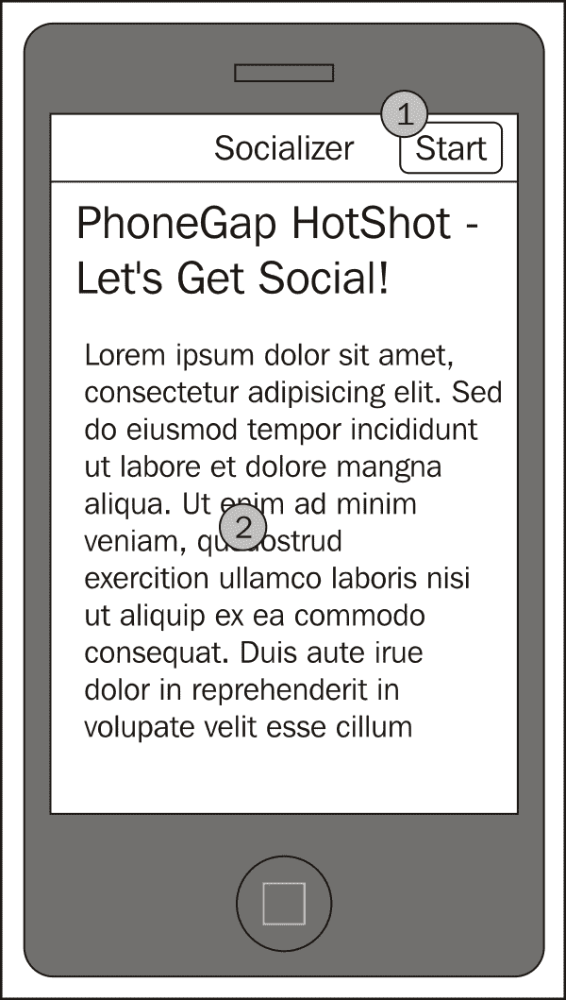

在这个截图中，我们有一个**开始**按钮（1），它将社会视图推入视图堆栈。我们还有一些说明性文字（2）。

我们下一个视图是社会视图，如下面的截图所示：

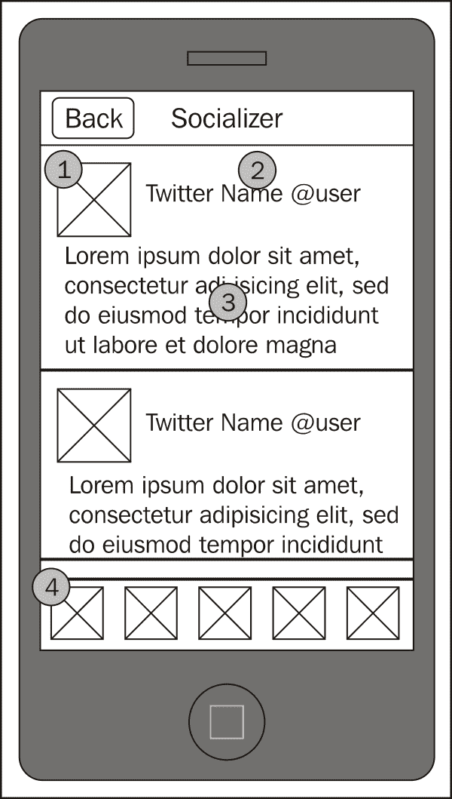

社会观点本质上是一系列推文的列表，一个接一个。我们将一次显示几条推文，因此我们不得不处理滚动问题。虽然你可以使用各种库来完成这个任务，但我们将使用我们自己的极简滚动库。

每条推文将包括一个个人资料图片（1），屏幕名称和真实姓名（如果可用）（2），以及推文文本（3）。当用户点击一条推文时，我们将过渡到推文视图。

在视图底部（4），我们有五个不同 Twitter 账户的系列个人资料图片。这些图片将从 Twitter 本身检索；我们不会自己存储这些图片。当图片被点击时，我们将加载相应的 Twitter 流。

我们的推文视图看起来如下面的截图所示：

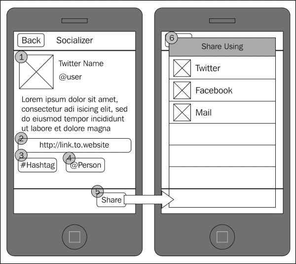

首先，请注意，我们的推文视图重复了用户在流视图中点击的推文（1）。相同的信息被重复，但我们还列出了推文可能包含的各种网页链接（2），任何标签（3），以及任何用户提及（4）。项目（2）到（4）旨在可点击：也就是说，如果用户点击（2），他们应该被带到特定的网站。如果他们点击（3），他们应该返回到包含该标签的推文流的社会视图。如果他们点击（4），也应该发生同样的情况，除了它会是那个特定用户的流。

在我们的导航栏中，我们还有一个 **返回** 按钮用于将用户带回到上一个视图，以及工具栏中的 **分享** 按钮（5）。当按下此按钮时，应该显示一个包含各种社交网络服务的列表（6）。这个列表的外观将取决于应用程序所在的平台以及设备上安装的社交网络。

现在我们已经创建了我们的草图，我们需要定义我们将需要的某些资源。让我们打开我们的编辑程序，开始设计我们的应用程序。


上一张截图相当好地展示了我们的最终产品将是什么样子。其中很多都可以通过 CSS 完成。Twitter 流和导航栏的背景是唯一两个可能比较困难的部分，因此我们应该将它们保存到我们的 `www/images` 目录中，分别命名为 `Background.png` 和 `NavigationBar.png`。注意，它们都有纹理，所以请确保以这种方式保存它们，以便它们可以无缝拼接。

## 我们做了什么？

对于这个任务，我们已经定义了我们的 UI 应该看起来什么样，以及小部件和视图之间的各种交互。我们还使用我们的图形编辑器创建了一个应用程序的草图，并为后续使用创建了一些图像资源。

# 设计应用程序 – 数据模型

在这个任务中，我们将设计我们的数据模型来处理 Twitter 用户和流。我们的模型在一定程度上将依赖于 Twitter 的模型。我们将未修改地使用它从其 API 返回的结果。我们将在这个任务中定义模型的其他部分。

## 开始行动

让我们看看我们的数据模型：

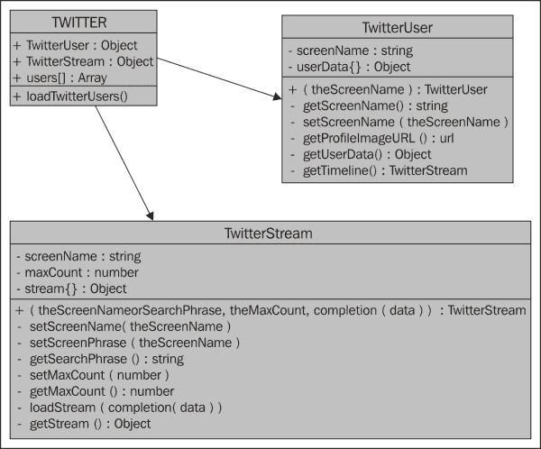

我们将使用 `TWITTER` 作为命名空间，并在其中，我们将使用两个经常使用的对象：`TwitterUser` 和 `TwitterStream`。`TwitterUser` 的理念是作为一个特定用户的实例，我们将通过在流视图的工具栏上的一个图像来表示它。`TwitterStream` 对象将表示一个单一的流。

让我们更仔细地检查 `TwitterUser`。该对象有两个属性：`screenName` 和 `userData`。`screenName` 属性包含用户的 Twitter 用户名。`userData` 属性将包含来自 Twitter API 的响应。它将包含有关用户的大量不同信息，包括他们的个人资料图片 URL、他们的真实姓名等等。

构造函数将根据提供的屏幕名称返回一个初始化的 `TwitterUser`。内部，构造函数只是调用 `setScreenName()` 方法，该方法将从 Twitter 请求用户数据。`getScreenName()` 方法简单地返回屏幕名称。`getProfileImageUrl()` 方法将返回用户个人资料的图片 URL。`getUserData()` 方法将返回 Twitter 返回的数据，而 `getTimeline()` 方法将为特定用户创建一个 `TwitterStream` 对象。

`TwitterStream`对象基于类似的想法：它将存储 Twitter 返回的数据。`TwitterStream`对象还提供了获取特定用户流的能力，以及返回任何搜索（如标签）流的能力。

当构造时，我们传递三个选项：屏幕名或搜索短语，要返回的最大推文数量（最多 200 条），以及当流完全加载时调用的函数。它将调用`loadStream()`方法来进行实际的加载。

我们有一些与对象中的属性相关的方法，例如`setScreenName()`、`setSearchPhrase()`、`getSearchPhrase()`、`setMaxCount()`、`getMaxCount()`和`getStream()`。

`setScreenName()`方法与设置`searchPhrase()`方法做的是同样的事情，只不过它会在名字前添加一个`@`字符。然后`loadStream()`方法可以决定在加载流时调用哪个 API，要么调用 API 返回用户的流，要么调用搜索 API。

## 我们做了什么？

我们为我们的应用程序创建并定义了数据模型。我们定义了两个对象：即`TwitterUser`和`TwitterStream`，并看到了它们是如何交互的。

# 实现数据模型

我们将创建两个文件：即`twitter.js`和`twitterUsers.js`。将这些文件放在`www/models`目录下。

## 继续前进

让我们从`twitter.js`文件开始：

```js
var TWITTER = TWITTER || {};
```

和往常一样，我们定义了我们的命名空间，在这个例子中，是`TWITTER`，如下代码片段所示：

```js
TWITTER._baseURL = "http://api.twitter.com/1/";
TWITTER._searchBase = "http://search.twitter.com/";
```

我们定义了两个属于`TWITTER`命名空间的全局变量：即`_baseURL`和`_searchBase`。这两个 URL 指向 Twitter 的 JSON API；第一个用于 API 请求，如用户查找、用户流等，而后者仅用于搜索。我们在这里定义它们有两个原因：使 URL 在接下来的代码中不那么令人讨厌，并且如果 Twitter 决定有不同版本的 API（并且你想更改它），你可以在这里进行更改。

接下来，我们定义我们的第一个对象，`TwitterUser`：

```js
TWITTER.TwitterUser = function ( theScreenName, completion )
{
    var self = this;

    self._screenName = "";
    self._userData   = {};
```

我们已经定义了我们的两个属性：`_screenName`和`_userData`。与上一个项目不同，我们使用下划线来表示这些是内部（私有）变量，外部对象不应访问。相反，外部对象应使用我们定义的下一个`get`/`set`方法：

```js
    self.getScreenName = function ()
    {
       return self._screenName;
    }
```

这个很简单，它只是当被请求时返回私有成员。但下一个更复杂：

```js
    self.setScreenName = function ( theScreenName, completion 
         )
    {
        self._screenName = theScreenName;
```

就像正常的`set`方法一样，我们将`theScreenName`赋值给`_screenName`。但在这个时候，我们希望从 Twitter 加载用户信息。这就是为什么在私有方法前有`get`/`set`方法很重要的原因。你可能只需要在值改变或读取时做一些重要的事情。

```js
        var getUserURL = TWITTER._baseURL + "users/lookup.json?screen_name=" + encodeURIComponent(theScreenName);
```

在这里，我们定义了我们将要用来请求 Twitter 查找特定用户的 URL。有关此特定 URL 如何工作的更多信息，请参阅 Twitter 文档[`dev.twitter.com/docs/api/1/get/users/lookup`](https://dev.twitter.com/docs/api/1/get/users/lookup)。您可以在页面底部看到一个完整的返回示例。

现在我们有了我们的 URL，我们将使用在`PKUTIL`中为我们定义的另一个实用函数`loadJSON()`。它使用 AJAX 向前面的 URL 发送请求，然后 Twitter 以 JSON 的形式发送响应。当它完成时，该函数将调用作为`getUserURL`的第二个参数传递的`completion`函数。此方法可以检查请求是否成功，并设置任何必要的私有成员。我们还将调用传递给`setScreenName()`方法的`completion`函数。这些操作在下面的代码片段中定义：

```js
        PKUTIL.loadJSON ( getUserURL, function ( 
                success, data )
        {
            if (success)
            {
              self._userData = data;
```

如果成功为真，那么 JSON 已经被正确返回并解析到数据参数中。我们只需将其分配给前面代码块中看到的私有`_userData`成员。

```js
            }
            else
            {
              self._userData = { "error": "Twitter error; rate 
                  limited?" };
```

但如果成功为假，那么可能出了问题。可能发生了任何数量的情况，Twitter 可能宕机（并非闻所未闻），网络连接可能失败，或者 Twitter 可能对我们进行了速率限制。目前我们只是假设后者，但您当然可以构建更复杂的错误检测方案来确定是哪一个。

```js
            }
            if (completion)
            {
                completion ();
            }
```

最后，无论成功与否，我们都会调用传递给我们的`completion`函数。这很重要，这样我们就可以知道何时可以安全地访问`_userData`成员（通过稍低一点的`getUserData`）。

```js
            }
        );
    }

    self.getProfileImageURL = function ()
    {
        if (self._userData[0])
        {
            return self._userData[0].profile_image_url;
        }
        return "";
    }
```

在前面的代码片段中，`getProfileImageURL()`方法是一个便利函数，用于返回用户的个人资料图片 URL。这是一个指向 Twitter 所使用的头像的链接。首先我们检查`_userData[0]`是否存在，如果存在，则返回`profile_image_url`，这是一个由 Twitter API 定义的值。如果不存在，我们只返回一个空字符串。

```js
    self.getUserData = function ()
    {
        return self._userData;
    }
```

接下来，使用`getUserData()`方法来返回`_userData`成员。如果它已经被正确加载，它将包含很多值，所有这些值都是由 Twitter 决定的。如果它未能加载，它将包含一个错误属性，如果它根本未加载，它将是空的。

```js
    self.getTimeline = function ( theMaxCount, completion )
    {
        return new TWITTER.TwitterStream ( "@" + 
            self._theScreenName, completion, theMaxCount || 25 
            );
    }
```

`getTimeline()`也是一个便利函数，用于获取 Twitter 用户的微博。`theMaxCount`是返回的最大推文数（最多 200 条），而`completion`是一个在所有操作完成后要调用的函数。我们通过创建一个新的`TwitterStream`对象（在下面的代码片段中定义）并在 Twitter 屏幕名称前加上一个`@`字符来实现这一点。

如果未指定`theMaxCount`，我们使用一个小的`||`技巧来表示默认值，即`25`条推文。

```js
    self.setScreenName ( theScreenName, completion );
}
```

我们最后要做的事情实际上是调用`setScreenName()`方法，并将构造函数中传入的`theScreenName`和`completion`函数传递给它。如果你还记得你的 JavaScript，这个整个函数，虽然我们可以将其视为定义一个对象，但实际上也是该对象的构造函数。在这种情况下，一旦你创建了`TwitterUser`对象，我们就会向 Twitter 发送一个请求来加载用户数据并将其设置为`_userData`。

我们下一个对象是`TwitterStream`对象，定义如下：

```js
TWITTER.TwitterStream = function ( 
    theScreenNameOrSearchPhrase, completion, theMaxCount )
{
    var self = this;

    self._searchPhrase  = "";
    self._stream        = {};
    self._theMaxCount   = 25;
```

在这里，我们定义了三个属性，即`_searchPhrase`、`_stream`和`_theMaxCount`。`_searchPhrase`属性可以是用户的屏幕名称或一个字面搜索词，如标签。`_stream`属性是从 Twitter 获取的实际推文集合，而`_theMaxCount`属性是请求的推文最大数量。（请记住，Twitter 可以返回少于这个数量的推文。）

你可能会问为什么我们要存储搜索词或屏幕名称。原因是我们在尝试促进代码重用。假设 Twitter 流是 Twitter 流，这是合乎逻辑的，无论它是通过请求特定用户的流还是通过搜索一个词来找到的。这是一个很好的假设，对吧？

是的，完全错误。流非常接近，足够接近以至于我们可以处理差异，但仍然不是同一个。所以尽管我们在这里将它们视为同一事物，但实际上它们并不是，至少直到 Twitter 决定更改其搜索 API 以更好地匹配其非搜索 API。

```js
    self.setMaxCount = function ( theMaxCount )
    {
        self._theMaxCount = theMaxCount;
    }
    self.getMaxCount = function ()
    {
        return self._theMaxCount;
    }
```

在这里，我们有`_theMaxCount`的`get`/`set`方法。我们只是设置和检索值。有一点要注意的是，这应该在实际上载流之前调用；这个值是我们发送给 Twitter 的最终 URL 的一部分。

```js
    self.setScreenName = function ( theScreenName )
    {
        self._searchPhrase = "@" + theScreenName;
    }

    self.setSearchPhrase = function ( theSearchPhrase )
    {
        self._searchPhrase = theSearchPhrase;
    }
    self.getSearchPhrase = function ()
    {
        return self._searchPhrase;
    }
```

注意，当我们只有一个`get`方法时，我们有两个`set`方法作用于`_searchPhrase`。我们在这里做的是允许某人调用`setScreenName()`而不带`@`字符。然后`_searchPhrase`属性将被设置为在屏幕名称前添加的`@`。下一个`set`方法（`setSearchPhrase()`）是为了在设置真实搜索词（如标签）时使用。

在内部，我们将使用前面的`@`来表示特殊含义，但你会看到这一点。

```js
    self.getStream = function ()
    {
        return self._stream;
    }
```

`getStream()`方法只是返回我们的`_stream`，如果我们还没有加载一个，它将是空的。所以让我们看看`loadStream()`方法：

```js
    self.loadStream = function ( completion )
    {
        var theStreamURL;
        var forScreenName = false;
```

`loadStream()`方法接受一个`completion`函数；无论操作结果如何，我们都会在操作结束时调用它。它让我们的其他代码知道何时可以通过`getStream()`安全地访问`_stream`成员。

另一个组件是`forScreenName`变量；如果为真，我们将请求 Twitter 获取存储在`_searchPhrase`中的屏幕名称所属的流；否则，我们将请求 Twitter 对`_searchPhrase`进行实际搜索。这个变量在以下代码片段中定义：

```js
        if (self._searchPhrase.substr(0,1)=="@")
        {
            theStreamURL = TWITTER._baseURL + 
            "statuses/user_timeline.json?include_entities=
             true&include_rts=true&count=" +
            self._theMaxCount + "&screen_name=" + 
                encodeURIComponent(self._searchPhrase);
            forScreenName = true;
        }
        else
        {
            theStreamURL = TWITTER._searchBase + 
                "search.json?q=" + 
                encodeURIComponent(self._searchPhrase) + 
                "&include_entities=true" + 
                "&include_rts=true&rpp=" + self._theMaxCount;
            forScreenName = false;
        }
```

我们到目前为止所做的一切只是定义`theStreamURL`指向搜索 API（对于搜索词）或非搜索 API（对于屏幕名的流）。接下来，我们将使用以下代码片段中的`loadJSON(` `)`来加载它：

```js
        PKUTIL.loadJSON ( theStreamURL, function (success, 
           data)
        {
            if (success)
            {
                if (forScreenName)
                  {
                    self._stream = data;
                  }
                else
                  {
                    self._stream = data.results;
                  }
            }
```

这里是另一个我们需要知道我们是在处理屏幕名还是搜索的原因，我们得到的 JSON 略有不同。在搜索时，Twitter 会很有帮助地包括其他信息（例如执行搜索所需的时间）。在我们的情况下，我们只对结果感兴趣，因此有两个不同的代码路径。

```js
            else
            {
              self._stream = { "error": "Twitter error; rate 
                  limited?" };
            }
```

再次，如果我们遇到失败，我们假设我们受到了速率限制。

```js
            if (completion)
            {
              completion( self._stream );
            }
```

完成后，我们调用`completion`方法，并帮助传递数据流。

```js
            }
        );
    }
    self.setSearchPhrase ( theScreenNameOrSearchPhrase );
    self.setMaxCount ( theMaxCount || 25 );
    self.loadStream ( completion );
}
```

就像在上一个对象的末尾一样，我们也在这个对象的末尾调用了一些方法。首先，我们设置搜索短语，然后设置要返回的最大推文数量（如果没有给出，则为 25），然后使用`completion`函数调用`loadStream()`方法。这意味着当我们创建一个新的`TwitterStream`对象时，它已经开始加载我们将要访问的所有推文。

我们已经处理了几乎所有的数据模型，但在`twitterUsers.js`中我们还有一小部分工作要做：

```js
TWITTER.users = Array();
```

首先，我们在`TWITTER`命名空间中创建一个`users()`数组。我们将使用这个数组来存储预定义的 Twitter 用户，这些用户将通过以下`loadTwitterUsers()`方法加载：

```js
TWITTER.loadTwitterUsers = function ( completion )
{
  TWITTER.users.push ( new TWITTER.TwitterUser ( "photoKandy"  , function () 
    { TWITTER.users.push ( new TWITTER.TwitterUser ( "CNN"  , 
    function ()
        { TWITTER.users.push ( new TWITTER.TwitterUser ( 
      "BBCWorld" , function ()
        { TWITTER.users.push ( new TWITTER.TwitterUser ( 
        "espn", function ()
            { TWITTER.users.push ( new TWITTER.TwitterUser ( 
          "lemondefr", completion ) ); }
            ) ); }
        ) ) ; }
      ) ) ; }
    ) ) ;
}
```

我们在这里本质上只是将针对五个不同 Twitter 账户的五个请求连接在一起。你可以将它们存储在数组中并一次性请求它们，是的，但我们的应用程序需要知道它们何时全部加载。你也可以通过使用用户数组的递归来完成这个任务，但我们将把它作为一个例子留给读者。

## 我们做了什么？

我们实现了我们的数据模型，并预定义了我们想要使用的五个 Twitter 账户。我们还介绍了`PKUTIL`中的`loadJSON()`方法，它有助于整个流程。我们还介绍了 Twitter API。

## 我还需要知道什么？

在我们继续之前，让我们看看你刚刚接触到的`loadJSON()`方法。它已被添加到这个项目的`www/framework/utility.js`文件中，定义如下：

```js
PKUTIL.loadJSON = function ( theURL, completion )
{
  PKUTIL.load( theURL, true, function ( success, data )
    {
```

首先，这是一个相当简单的函数。我们真正做的是利用`PKUTIL.load()`来完成调用 URL 并传递给我们响应的繁重工作，但是当响应被接收时，它将作为数据变量返回给我们。

```js
      var theParsedData = {};
```

`theParsedData`变量将存储实际已完全解析的 JSON 数据。

```js
      if (success)
      {
        try
        {
          theParsedData = JSON.parse ( data );
```

如果 URL 返回成功的结果，我们尝试解析数据。假设它是一个有效的 JSON 字符串，它将被放入`theParsedData`中。如果不是，`JSON.parse()`将抛出一个异常，如下面的代码块所示：

```js
        }
        catch (err)
        {
          console.log ("Failed to parse JSON from " + theURL);
          success = COMPLETION_FAILURE;
        }
```

任何异常都将记录到控制台，并且我们将告诉我们的`completion`函数请求失败，如下面的代码块所示：

```js
      }
      if (completion)
      {
        completion (success, theParsedData);
      }
```

最后，我们调用我们的`completion`函数，并告诉它请求是否失败或成功，以及 JSON 数据（如果成功解析）。

```js
    }
  );
}
```

# 配置插件

大多数 PhoneGap 插件安装或配置并不特别困难，但它们无疑将在您的应用中扮演至关重要的角色，尤其是如果您需要使用 PhoneGap 本身不提供的功能。

在我们的案例中，我们需要两个插件，一个用于在我们的应用中显示网站，另一个用于分享内容。对于前者，我们将使用名为`ChildBrowser`的插件在所有我们支持的平台上使用，但对于后者，我们将不得不为 iOS 和 Android 使用不同的插件。

完成后，每个分享插件将看起来如下，从 iOS 开始：

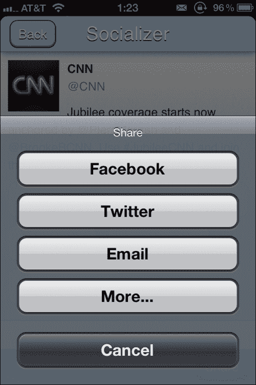

对于 Android，分享插件将如下所示：

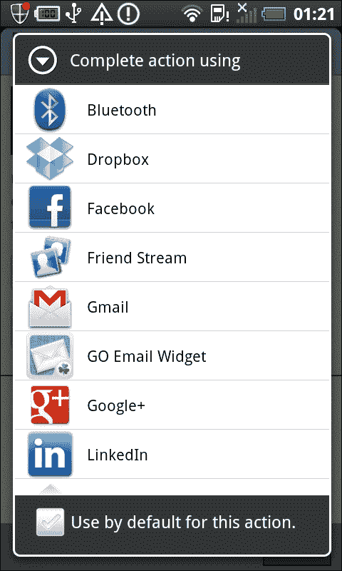

## 准备工作

如果您还没有做，您应该下载位于[`github.com/phonegap/phonegap-plugins`](https://github.com/phonegap/phonegap-plugins)的整个社区 PhoneGap 插件仓库。这将为您提供使用插件所需的几乎所有内容。

如果您希望在 iOS 上支持分享，您还需要下载 ShareKit 2.0，它可在[`github.com/ShareKit/ShareKit`](https://github.com/ShareKit/ShareKit)找到，或者使用本书提供的代码捆绑的分支。它位于每个项目的目录之外，在一个标记为`Submodules`的目录中。

## 开始行动

我们将根据每个平台的不同步骤和环境来拆分这项工作。

### iOS 插件配置

您可能不知道，但我们的第一个平台也是最难的一个。实际上，它会让剩下的两个平台感觉有点像儿戏。

`ChildBrowser`插件本身易于安装和配置，但 ShareKit 2.0 则不然，尤其是在与 PhoneGap 一起使用时。问题源于当您将 PhoneGap 和 ShareKit 2.0 一起编译项目时，一些符号会重复，链接器会抛出一个讨厌的小错误。长话短说，您的应用无法编译。这可不是什么好事。

让我们首先看看安装`ChildBrowser`插件所需的步骤，因为这些步骤对于大多数插件来说更为典型：

1.  打开您下载的插件集合，导航到`iOS/ChildBrowser`。

1.  将`ChildBrowser.bundle`、`ChildBrowserCommand.h`、`ChildBrowserCommand.m`、`ChildBrowserViewController.h`、`ChildBrowserViewController.m`和`ChildBrowserViewController.xib`拖入 XCode 的`Socializer/Plugins`中，如下面的截图所示：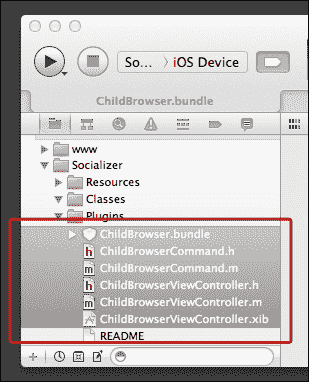

1.  在提示时，请确保复制文件（而不是链接到它们）。这可以通过勾选**将项目复制到目标组的文件夹中**选项来完成，如下截图所示：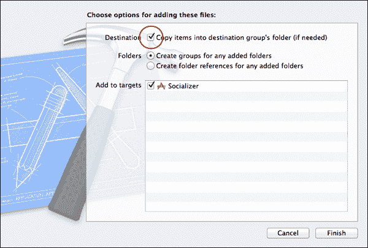

1.  将`ChildBrowser.js`复制到您的`www/plugins/iOS`目录。您可以在 XCode 或 Finder 中完成此操作。

1.  在 XCode 中的`Socializer/Supporting Files`中的`Cordova.plist`中添加插件。找到**插件**行，并添加一个新条目，如下表所示：

    | `ChildBrowserCommand` | `String` | `ChildBrowserCommand` |
    | --- | --- | --- |

    这可以通过以下截图更好地解释：

    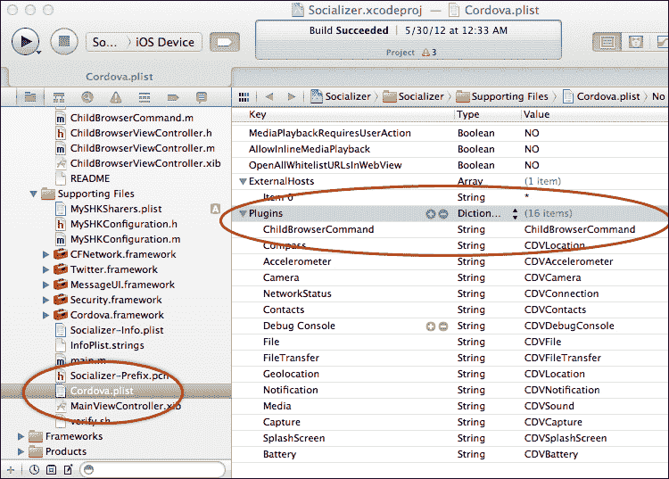

好了，很简单，不是吗？现在来点难的，安装并使 ShareKit 2.0 运行起来。为此，我们将参考附录 B，*安装 ShareKit 2.0*，因为这个过程相当长。

完成后，我们需要复制为`ChildBrowser`所做的插件设置，除了 ShareKit，按照以下步骤进行：

1.  导航到插件仓库中的`iOS/ShareKitPlugin`目录。

1.  将`ShareKitPlugin.h`、`ShareKitPlugin.m`、`SHKSharer+Phonegap.h`、`SHKSharer+Phonegap.m`复制到项目中的`Plugins`文件夹。

1.  将`ShareKitPlugin.js`复制到您的`www/plugins/iOS`文件夹。

1.  修改`Cordova.plist`以添加此新插件到列表中。

1.  找到**插件**行，并添加一个新条目，如下表所示：

    | `ShareKitPlugin` | `String` | `ShareKitPlugin` |
    | --- | --- | --- |

    这可以通过以下截图更好地解释：

    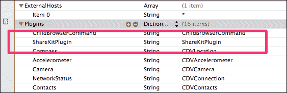

最后一步是更新我们的`www/index.html`文件，以包含这两个插件。在加载`cordova-2.2.0-ios.js`脚本之后的行后添加以下行：

```js
<script type="application/javascript" charset="utf-8"   
    src="img/ShareKitPlugin.js"></script>
<script type="application/javascript" charset="utf-8" 
    src="img/ChildBrowser.js"></script>
```

呼呼！我们做到了，我们为 iOS 设备安装了两个插件。现在，让我们解决剩余的平台。别晕倒。Android 要简单得多。

### Android 插件配置

对于 Android，我们将使用两个插件：即`ChildBrowser`和`Share`。这两个插件都位于您应该已经从 GitHub 下载的仓库中。让我们先按照以下步骤安装和配置`ChildBrowser`：

1.  在项目的`src`文件夹下创建一个新的包（**文件** | **新建** | **包**）。将其命名为`com.phonegap.plugins.childBrowser`。

1.  导航到`Android/ChildBrowser/src/com/phonegap/plugins/childBrowser`，并将`ChildBrowser.java`拖到新创建的包中。

1.  前往项目中的`res/xml`，并使用文本编辑器打开`plugins.xml`（通常是通过右键单击然后导航到**打开方式** | **文本编辑器**）。

1.  在文件的底部添加以下行，位于`</plugins>`结束标签之上：

    ```js
    <plugin name="ChildBrowser" value="com.phonegap.plugins.childBrowser.ChildBrowser"/>
    ```

1.  导航到仓库中的`Android/ChildBrowser/www`文件夹。

1.  将`childbrowser.js`复制到`assets/www/plugins/Android`。

1.  将 `childbrowser` 文件夹复制到 `assets/www`（复制文件夹，而不是内容，完成后你应该会有 `assets/www/childbrowser`）。

对于我们的下一个插件 `Share`，请按照以下步骤操作：

1.  在 Eclipse 中，在你的项目 `src` 目录下创建一个名为 `com.schaul.plugins.share` 的包。

1.  导航到插件库中的 `Android/Share`，并将 `Share.java` 复制到 Eclipse 中的包。

1.  在 `plugins.xml` 文件的底部添加以下一行：

    ```js
    <plugin name="Share" value="com.schaul.plugins.share.Share"/>
    ```

1.  将 `share.js` 复制到你的项目 `assets/www/plugins/Android` 目录。

1.  最后一步是更新我们的 `www/index_Android.html` 文件，在加载 `cordova-2.2.0-android.js` 文件的部分下方添加以下几行：

    ```js
        <script type="application/javascript" charset="utf-8" src="img/childbrowser.js"></script>
        <script type="application/javascript" charset="utf-8" src="img/share.js"></script>
    ```

就这样！我们的插件已经正确安装并配置好了 Android。

## 我们做了什么？

我们在我们的两个支持平台上设置了 `ChildBrowser` 插件。我们为 iOS 设置了 ShareKit 2.0 和 `ShareKitPlugin`，以及 Android 的 `Share` 插件。

## 我还需要了解什么？

我们实际上并没有处理如何使用插件；我们只是安装了它们。当我们实施项目时，我们会处理必要的步骤。但有一个重要的细节需要注意：插件的 `readme` 文件，如果有的话。

此文件通常会指示必要的安装步骤，或者你可能需要注意的任何怪癖。插件的正确使用通常也会详细说明。不幸的是，一些插件没有提供说明。在这种情况下，最好的做法是尝试以 *正常* 方式安装它（就像我们之前为 `ChildBrowser` 和所有其他插件（除了 ShareKit）所做的那样）并查看它是否工作。

另一个需要注意的事情是，PhoneGap 是一个持续的项目。这意味着有些插件已经过时（实际上，有些作者已经为此书更新了它们），并且无法与 PhoneGap 的最新版本正确工作。你需要注意插件，以便知道它支持哪个版本，以及是否需要修改以与较新的 PhoneGap 版本兼容。修改通常并不特别困难，但它确实涉及到进入原生代码，所以你可能需要向社区寻求修改帮助。（请参阅项目末尾的社区链接。）

# 实现社交视图

虽然我们的应用有三个视图，但起始视图与之前项目的起始视图非常相似，所以我们不会在这个项目中详细说明它是如何工作的。你可以查看 `www/views/startView.html` 文件中的代码。

我们的大部分代码将驻留在社交视图和推文视图中，因此我们的主要关注点将在这里。那么，让我们开始吧！

## 准备工作

现在根据我们讨论的内容创建 `socialView.html` 文件。然后我们将回顾你之前没有看到的部分。

## 继续前进

完成这个任务后，我们应该有一个看起来像这样的视图，适用于 iOS：

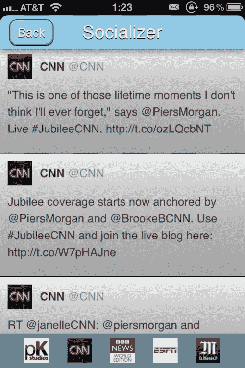

Android 的视图将如下所示：

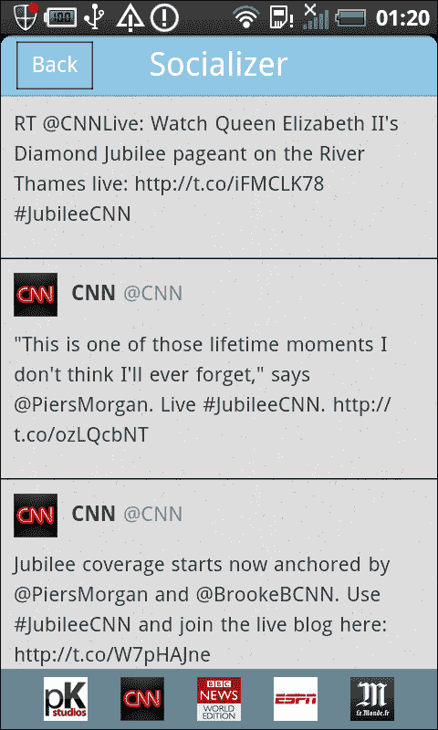

就像到目前为止的所有视图一样，我们将从描述实际视图的 HTML 部分开始；它如下所示：

```js
<div class="viewBackground">
 <div class="navigationBar">
  <div id="socialView_title"></div>
  <button class="barButton backButton"   
      id="socialView_backButton" style="left:10px" ></button>
 </div>
 <div class="content avoidNavigationBar avoidToolBar" 
     style="padding:0; overflow: scroll;" 
     id="socialView_scroller">
   <div id="socialView_contentArea" style="padding: 0; 
     height: auto; position: relative;">
   </div>
 </div>
 <div class="toolBar" id="socialView_toolbar" style="text-
      align: center">
 </div>
</div>
```

通常，这看起来非常像我们之前的视图，除了有几个关键细节。我们给内部`div`元素添加了一个样式。这移除了我们的默认`div`样式（来自`www/framework/base.css`）并强制高度适应内容（而不是屏幕）。这意味着当我们想要滚动时，我们将有整个内容可以滚动。

实际上，这是我们第一次在我们的应用中讨论滚动，而且有很好的理由：在移动平台上这通常很困难。在一个完美的世界里，我们可以仅仅依靠`overflow:scroll`在所有平台上工作，但这根本不起作用。我们可以依赖 iOS 5 及以后的本地滚动，但这也有它自己的问题（取决于 PhoneGap 的版本和各种其他 WebKit 的陷阱），并且排除了任何低版本的平台，当然，在任何版本的 Android 上都不起作用。所以对于 iOS 和 Android，我们将不得不使用我们自己的滚动实现或使用第三方滚动库，如 iScroll 4。在这种情况下，我们正在使用我们自己的实现，我们稍后会对其进行简要介绍。

首先，我们需要确定我们的工具栏将如何使用以下模板来显示其个人头像：

```js
<div class="hidden" id="socialView_profileImageIcon">
 <a class="profileImage" style="background-
     image:url(%PROFILE_IMAGE_URL%)"
   href="javascript:socialView.loadStreamFor
     ('@%SCREEN_NAME%');"></a>
</div>
```

注意，我们有一段 JavaScript 代码在用户触摸图像时触发，这是为了加载该图像的适当流。

接下来，我们需要定义推文在我们视图中的样子。这是通过以下代码片段完成的：

```js
<div class="hidden" id="socialView_twitterTemplate">
 <div class="twitterItem" onclick="socialView.selectTweet(%INDEX%);">
  
  <div class="twitterName">
   <span class="twitterRealName">%REAL_NAME%</span>
   <span class="twitterScreenName">@%SCREEN_NAME%</span>
  </div>
  <div class="twitterTweet">%TWEET%</div>
 </div>
</div>
```

在这个 HTML 段中，我们定义了推文的其余部分应该看起来像什么。我们给每个`div`和`span`都添加了一个类，这样我们就可以在`style.css`文件中定位它们（位于`www/style`）。这主要是为了尽可能地将推文的显示与推文的内容分开，并且使我们可以轻松地更改推文的样式。请查看`style.css`文件以了解它们是如何工作的，以给我们的推文添加一些样式。

接下来是我们的代码：

```js
  var socialView = $ge("socialView") || {};
  socialView.firstTime = true;
  socialView.currentStream = {}; 
  socialView.lastScrollTop = 0;
  socialView.myScroll = {};
```

和往常一样，我们给自己定义了一个命名空间，在这个例子中是`socialView`。我们还声明了一些属性：`firstTime`，它将跟踪这个视图是否是第一次显示，以及`currentStream`，它将保存从 Twitter 当前可见的流。`lastScrollTop`属性将记录用户在我们当前页面上滚动的位置，这样我们就可以在他们从查看单个推文返回时恢复它，而`myScroll`将保存我们的实际滚动器。

```js
  socialView.initializeView = function ()
  {
 PKUTIL.include ( ["./models/twitterStreams.js", 
 "./models/twitterStream.js"], function ()
 {
 // load our toolbar
 TWITTER.loadTwitterUsers ( 
 socialView.initializeToolbar );
 }
 );

    socialView.viewTitle = $ge("socialView_title");
    socialView.viewTitle.innerHTML = __T("APP_TITLE");

    socialView.backButton = $ge("socialView_backButton");
    socialView.backButton.innerHTML = __T("BACK");
    PKUI.CORE.addTouchListener(socialView.backButton, 
        "touchend", function () { PKUI.CORE.popView(); });

 if (device.platform != "WinCE")
 {
 socialView.myScroll = new SCROLLER. 
 GenericScroller ('socialView_contentArea');
 } 

  }
```

我们的`initializeView()`方法与我们的前一个项目没有太大区别。我突出显示了几个行，但是请注意，我们加载我们的模型，当它们完成时，我们调用`TWITTER.loadTwitterUsers()`。我们传递一个完成函数，我们将在下一部分定义它，这样当 Twitter 返回我们五个 Twitter 用户的用户数据时，我们就可以调用它。

我们还定义了我们的滚动器。如果你想查看完整的代码，请查看`www/framework/scroller.js`，但可以说，它是一个相当不错的滚动器，使用简单。它并不比原生滚动更好，但也没有什么可以做到这一点。你可以自由地用任何你喜欢的库替换它，但在这个项目的目的上，我们已经选择了这条路。

```js
  socialView.initializeToolbar = function ()
  {

    var toolbarHtml = "";
    var profileImageTemplate = 
        $ge("socialView_profileImageIcon").innerHTML;
    var users = TWITTER.users;

    if (users.error)
    {
        console.log (streams.error);
        alert ("Rate limited. Please try again later.");
    }
```

在获取模板的 HTML 之后，我们首先要检查我们的`TWITTER.users`数组。这个数组应该已经填充了各种用户数据，但如果 Twitter 出于某种原因限制了我们的请求频率，它可能没有。因此，我们会检查是否存在错误条件，如果有，我们会通知用户。当然，这不是通知用户的最优方法，但对我们这个示例应用来说，这已经足够了。

```js
    // go through each stream and request the profile image
    for (var i=0; i<users.length; i++)
    {
        var theTemplate = profileImageTemplate.replace 
           ("%SCREEN_NAME%", users[i].getScreenName())
                          .replace ("%PROFILE_IMAGE_URL%", 
                             users[i].getProfileImageURL());
        toolbarHtml += theTemplate;
    }
```

接下来，我们遍历每个用户。应该有五个，但你可以配置为不同的数量，并构建一个 HTML 字符串，然后按照以下方式将其放入工具栏中：

```js
    $ge("socialView_toolbar").innerHTML = toolbarHtml;
  }
```

我们下一个函数`loadStreamFor()`在这个视图中做了真正困难的工作。它从 Twitter 请求一个流，然后对其进行处理以供显示。它的代码片段如下：

```js
  socialView.loadStreamFor = function ( searchPhrase )
  {
    var aStream = new TWITTER.TwitterStream ( searchPhrase, 
    function ( theStream )
      {
```

需要注意的是，我们现在处于`completion`函数中，这个函数将在获取 Twitter 流时被调用。

```js
        var theTweetTemplate = 
           $ge("socialView_twitterTemplate").innerHTML;
        var theContentArea = $ge("socialView_contentArea");
        var theStreamHTML = "";
        if (theStream.error)
        {
            console.log (theStream.error);
            alert ("Rate limited. Please try again later.");
        }
```

由于 Twitter 可能在任何时候限制我们的请求频率，我们在前面的代码片段中再次检查流中的任何错误。

```js
        for (var i=0; i<theStream.length; i++)
        {
          var theTweet = theStream[i];
          var theTemplate = 
              theTweetTemplate.replace("%INDEX%", i)
                           .replace ("%PROFILE_IMAGE_URL%",  
                            theTweet.profile_image_url ||    
                            theTweet.user.profile_image_url)
                           .replace ("%REAL_NAME%", 
                            theTweet.from_user || 
                            theTweet.user.name)
                           .replace ("%SCREEN_NAME%", 
                            theTweet.from_user || 
                            theTweet.user.screen_name)
                           .replace ("%TWEET%", 
                            theTweet.text);
          theStreamHTML += theTemplate;
        }
```

在这里，我们正在遍历流中的每个项目，并从我们之前定义的模板构建一个大的 HTML 字符串。

一个需要注意的重要部分是我们如何获取推文的数据，使用`theTweet.from_user || theTweet.user.screen_name`等。这是为了处理 Twitter 在搜索单词或标签时返回的数据格式与返回用户时间线时的数据格式略有不同的情况。如果其中一个未定义，我们将加载另一个，因为我们只能获取其中一个，所以这比构建大量 if 语句来处理它要简单得多。

```js
        theContentArea.innerHTML = theStreamHTML;
        socialView.currentStream = theStream;
        if (socialView.myScroll.scrollTo)
        {
            socialView.myScroll.scrollTo ( 0, 0 );
        }
```

一旦我们的流 HTML 构建完成，我们就将其分配给内容区域，以便用户可以看到它。我们还将其存储到`currentStream`属性中，以便我们稍后可以引用它。完成这些后，我们滚动到页面顶部，以便用户可以看到最新的推文。

```js
}
      , 100
    );
  }
```

那最后的`100`？实际上它是`TwitterStream()`调用的一部分。这是流中要返回的项目数量。

我们下一个函数处理的是当用户点击显示的推文时应该发生的事情：

```js
  socialView.selectTweet = function ( theIndex )
  {
     var theTweet = socialView.currentStream[theIndex];
     tweetView.setTweet ( theTweet );
     PKUI.CORE.pushView ( tweetView );
  }
```

这个功能相当简单。我们只是告诉推文视图哪个推文被点击了，然后将其推送到视图堆栈中。

```js
  socialView.viewWillAppear = function ()
  {
    document.addEventListener("backbutton", 
        socialView.backButtonPressed, false );
    if (socialView.firstTime)
    {
        socialView.loadStreamFor ( "@photokandy" ); 
        socialView.firstTime = false;
    }
    if (socialView.myScroll.scrollTo)
    {
      PKUTIL.delay ( 50, function ()
        {
          socialView.myScroll.scrollTo ( 0, 
             socialView.lastScrollTop );
        }
      );
    }
  }
```

这个`viewWillAppear()`方法与上一个项目非常相似，除了中间和最后部分。在中间，我们检查这是否是视图第一次显示。如果是，我们希望为用户加载默认流。记住，到目前为止，我们只在用户在工具栏中点击个人资料图片时加载流。但我们不希望每次我们的视图显示时都重新加载这个流；我们可能正从推文视图返回，用户可能想要继续他们在上一个流中的位置。在最后部分，我们检查是否有之前的滚动位置，如果有，我们将视图滚动到那个点。我们必须在这里创建一个延迟，因为如果我们设置得太早，视图将不在屏幕上（并且不会滚动），或者它将在屏幕上，这将让用户注意到。

剩下的两个函数`viewWillHide()`和`backButtonPressed()`没有提供新的功能，所以虽然你需要在你的代码中包含它们，但这里我们不会详细说明。

就这样，并不特别困难，但它做到了我们需要的——显示推文列表。一旦用户点击推文，他们就会被带到推文视图进行更多操作，这就是我们将在下一个任务中要查看的内容。

## 我们做了什么？

在这个任务中，我们定义了我们的社交视图的 HTML 代码和模板。我们还使用了 Twitter 流数据来构建一个最终用户可以与之交互的 Twitter 流。

# 实现推文视图

我们的推文视图将是用户与特定推文交互的地方。他们可以使用`ChildBrowser`插件打开推文内的任何链接，或者他们可以搜索推文（或提及）中包含的任何标签（或任何提及）。视图还给了用户分享推文到他们任何社交网络的机会。

## 准备中

根据我们讨论的内容，创建你自己的`www/tweetView.html`文件。我们将讨论新的代码，其余的留给你自己审查。

## 继续前进

对于下一个任务，我们应该得到一个在 iOS 上看起来如下所示的观点：

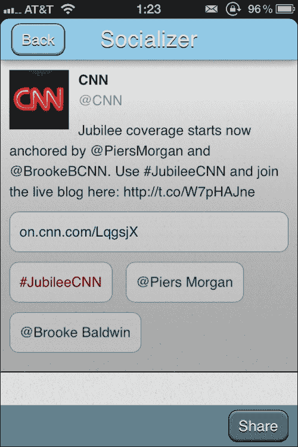

对于 Android，视图将如下所示：

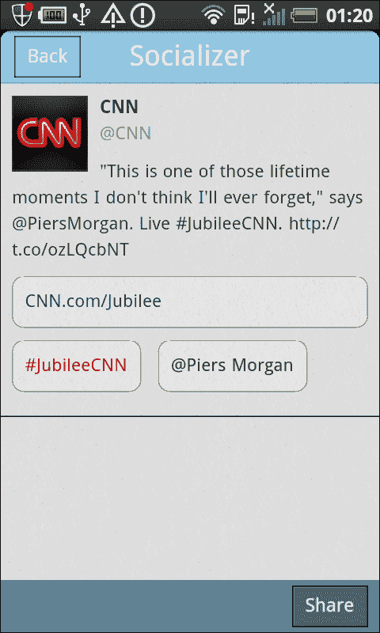

这次，我们不会显示定义视图布局的 HTML。你可能会问为什么？这是因为你之前已经看过几次，可以在本项目的代码中查找。我们将从定义内容的模板开始：

```js
<div class="hidden" id="tweetView_tweetTemplate">
 <div class="twitterItem" onclick="tweetView.selectTweet(%INDEX%);">
 
  <div class="twitterRealName">%REAL_NAME%</div>
  <div class="twitterScreenName">@%SCREEN_NAME%</div>
  <div class="twitterTweet">%TWEET%</div>
 <div class="twitterEntities">%ENTITIES%</div>
 </div>
</div>
```

这段代码与上一个视图中的模板非常相似，有几个例外：我们使个人资料图片更大，并且添加了一个`div`元素，列出了推文中的所有*实体*。Twitter 将实体定义为 URL、标签或对其他 Twitter 用户的提及。我们将显示推文中包含的任何这些内容，以便用户可以点击它们以获取更多信息。

```js
<div class="hidden" id="tweetView_entityTemplate">
  <DIV class="entity %TYPE%">%ENTITY%</DIV>
</div>
```

这是我们的任何实体的模板。请注意，我们给它分配了 `entity` 类，这样我们的所有实体都可以有相似的外观。

接下来，我们定义每个特定实体看起来像什么，在这个例子中，是 URL 模板。

```js
<div class="hidden" id="tweetView_urlEntityTemplate">
 <a href="javascript:PKUTIL.showURL('%URL%');" 
  class="openInNewWindow url" target="_blank">%DISPLAYURL%</a>
</div>
```

注意这个模板中 `PKUTIL.showURL()` 的使用。这是我们在 `PKUTIL` 中定义的一个便利方法，用于使用 `ChildBrowser` 显示网页。我们已经完成了在每个平台上如何工作的组合工作，并将其放入一个函数中，以便于调用。我们稍后会看看它。

```js
<div class="hidden" id="tweetView_hashEntityTemplate">
 <a href="javascript:socialView.loadStreamFor('%23%HASHTAG%'); 
  PKUI.CORE.popView();" class="hash">#%TEXT%</a>
</div>
```

这个模板是为标签设计的。与之前的模板相比，最大的不同之处在于它实际上是在引用我们之前的视图！这样做是为了告诉它加载一个标签的流，然后我们调用 `popView()` 返回到视图。很可能会是，视图还没有加载来自 Twitter 的信息，但给它一点时间，它会重新加载并显示新的流。

类似地，提及的代码如下：

```js
<div class="hidden" id="tweetView_userEntityTemplate">
 <a href="javascript:socialView.loadStreamFor('@%USER%'); 
  PKUI.CORE.popView();" class="user" >@%TEXT%</a>
</div>
```

因此，定义了我们的推文的外观和工作方式，让我们看看视图实际上是如何创建推文的：

```js
  var tweetView = $ge("tweetView") || {};
  tweetView.theTweet = {};
  tweetView.setTweet = function ( aTweet )
  {
      tweetView.theTweet = aTweet;
  }
```

在这里，我们定义了 `setTweet()` 方法，它将一个特定的推文存储到我们的 `theTweet` 属性中。记住，当点击推文以发送给我们显示的推文时，这个方法是从 Twitter 流视图调用的。

下一个我们感兴趣的方法是 `loadTweet()`。我们将跳过 `initializeView()` 方法，因为它与之前的视图相似。`loadTweet()` 方法的定义如下：

```js
  tweetView.loadTweet = function ()
  {
    var theTweet = tweetView.theTweet;

    var theTweetTemplate = 
        $ge("tweetView_tweetTemplate").innerHTML;
    var theEntityTemplate = 
        $ge("tweetView_entityTemplate").innerHTML;
    var theURLEntityTemplate = 
        $ge("tweetView_urlEntityTemplate").innerHTML;
    var theHashEntityTemplate = 
        $ge("tweetView_hashEntityTemplate").innerHTML;
    var theUserEntityTemplate = 
        $ge("tweetView_userEntityTemplate").innerHTML;
```

首先，我们获取我们需要的每个模板的 HTML——而且有很多！这些如下所示：

```js
    var theContentArea = $ge("tweetView_contentArea");
    var theTweetHTML = "";
    var theEntitiesHTML = "";    

    var theURLEntities = theTweet.entities.urls;
    for (var i=0;i<theURLEntities.length;i++)
    {
        var theURLEntity = theURLEntities[i];
        theEntitiesHTML += theEntityTemplate.replace 
                                 ("%TYPE%", "url")
                                .replace ("%ENTITY%",
            theURLEntityTemplate.replace ("%URL%", 
                                 theURLEntity.url )
                                .replace ("%DISPLAYURL%", 
                                 theURLEntity.display_url )
                           );
    }
```

在这段代码中，我们已经遍历了 Twitter 发送给我们的每个 URL 实体，并将其添加到我们的实体 HTML 字符串中。我们将对标签和提及重复这一过程，但由于代码非常相似，这里不再重复。

```js
    var theTemplate = theTweetTemplate
                      .replace ("%PROFILE_IMAGE_URL%", 
                       theTweet.profile_image_url || 
                       theTweet.user.profile_image_url)
                      .replace ("%REAL_NAME%", 
                       theTweet.from_user || 
                       theTweet.user.name)
                      .replace ("%SCREEN_NAME%", 
                       theTweet.from_user || 
                       theTweet.user.screen_name)
                      .replace ("%TWEET%", theTweet.text)
                      .replace ("%ENTITIES%", theEntitiesHTML );
    theTweetHTML += theTemplate;        
    theContentArea.innerHTML = theTweetHTML;
```

一旦我们处理完所有实体，我们就会处理推文本身。注意，我们必须先处理实体，因为我们之前已经处理了替换。就像之前的视图一样，我们正确地处理了推文来自搜索或来自时间线的情况。

下一个我们感兴趣的方法是 `share()` 方法，所以我们将跳过 `viewWillAppear()`、`viewWillHide()` 和 `backButtonPressed()`。简单来说，`viewWillAppear()` 方法与其它方法唯一的不同之处在于，当我们的视图显示时，它会调用 `loadTweet()` 方法来显示推文。

`share()` 方法是我们调用每个平台的插件进行分享的地方。每个平台都有略微不同的语法，因此我们必须检查我们所在的平台，并根据这个决定调用哪个插件。我们可以使用以下代码片段来完成：

```js
  tweetView.share = function ()
  {
    switch (device.platform)
    {
case "Android": window.plugins.share.show(
          { subject: 'Share',
            text: tweetView.theTweet.text,
          },
          function() {},
          function() { alert ('Error sharing.'); }
          );
                break;
```

对于 Android，我们使用`Share`插件，以下是使用它的方法。如果用户已经安装了这些服务，Android 将显示一个支持分享的服务列表，包括 Twitter 和 Facebook。我们给它的文本将被包含在消息中，而且 Android 足够友好，允许我们在推文后发送成功和失败函数。

```js
default:
                window.plugins.shareKit.share ( 
                     tweetView.theTweet.text );
    }
  }
```

我们默认的方法是针对 iOS 的，它将显示一个动作表，列出一些服务，可能是 Twitter 和 Facebook，用户可以点击他们想要分享的服务按钮。一旦他们验证了服务，他们就可以发送消息。

## 我们做了什么？

我们展示了一条推文，并处理了其中的各种实体。我们通过使用`PKUTIL.showURL()`演示了如何在`ChildBrowser`插件中加载外部网站。我们还演示了如何使用各种分享插件。

## 我还需要了解什么？

让我们快速看一下`PKUTIL.showURL()`，这是用来显示带有外部网站的`ChildBrowser`的方法。这是一个相当简单的函数，但由于它以三种不同的方式显示`ChildBrowser`，我们将其打包成一个易于使用的函数。

```js
PKUTIL.showURL = function ( theURL )
{
    switch (device.platform)
    {
case "Android":
        window.plugins.childBrowser.showWebPage( theURL );
        break;
```

对于 Android，调用`ChildBrowser`很简单。通常，这就是你在 PhoneGap 中调用任何插件的方式。

```js
case "WinCE":
      var options = 
      {
       url:theURL,
       geolocationEnabled:false
      };
          Cordova.exec(null, null,"ChildBrowserCommand",
              "showWebPage", options);
        break;
```

WP7 也在这里，因为该平台支持它，而且稍微困难一些。我们必须将 URL 打包到一个选项数组中，然后发送到插件以显示。

```js
default:
        cordova.exec("ChildBrowserCommand.showWebPage", 
            theURL);
    }
}
```

对于 iOS，方法与 Android 非常相似，只是我们直接调用它，而不是使用`window.plugins.*`。

# 游戏结束..... 结束语

嗯，你已经做到了。你成功地编写了一个应用程序，显示从 Twitter 获取的信息，并允许用户在自己的社交网络上分享它。对于某些平台，配置完成这项工作的插件并不太难，而对于 iOS，你可能比预期的更熟悉 Xcode 和头文件路径等。其余的都是容易的；添加插件越做越容易，而且几乎在每一个项目中你都需要至少`ChildBrowser`插件。幸运的是，安装它也很简单！

一些你可能觉得有价值的资源如下：

+   ShareKit: [`github.com/ShareKit/ShareKit`](https://github.com/ShareKit/ShareKit)

+   JSON: [`www.json.org/`](http://www.json.org/)

+   Twitter JSON 文档: [`dev.twitter.com/docs/api/1`](https://dev.twitter.com/docs/api/1)

+   Phonegap 插件: [`www.github.com/phonegap/phonegap-plugins`](http://www.github.com/phonegap/phonegap-plugins)

+   Phonegap 社区: [`groups.google.com/group/phonegap`](http://groups.google.com/group/phonegap)

+   iScroll 4: [`cubiq.org/iscroll-4`](http://cubiq.org/iscroll-4)

# 你能承受压力吗？热手挑战

作为项目，Socializer 完成了它设定的目标，但实际上你还可以做更多的事情来使其真正有用。为什么不尝试以下一个或多个挑战：

+   允许最终用户选择他们自己的初始 Twitter 账户，而不仅仅是我们的前五个。

+   在加载 Twitter 流时显示一个加载图形，以便用户知道应用正在处理某事。

+   将 Twitter 流中的任何链接、提及或标签样式化，使它们更加突出。

+   尝试使用你喜欢的任何社交网络的 API 进行操作。

+   尝试添加 OAuth 身份验证。
