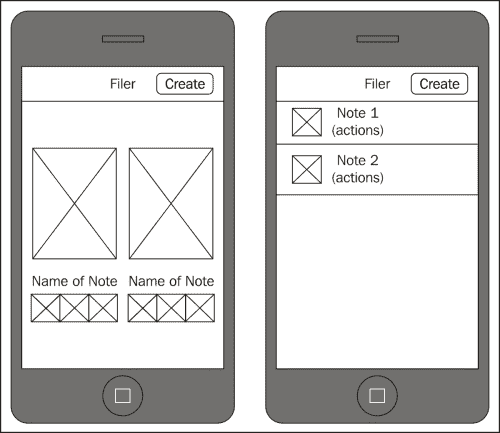
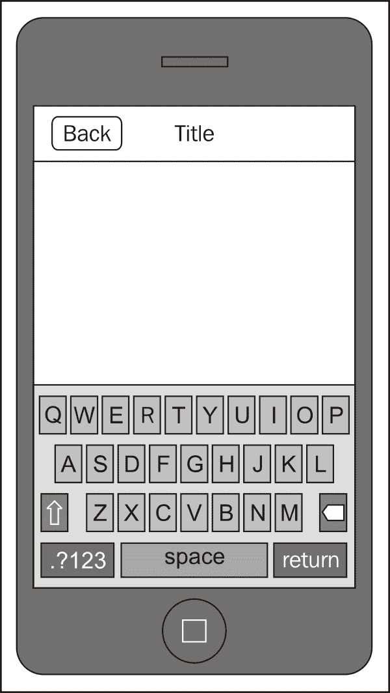
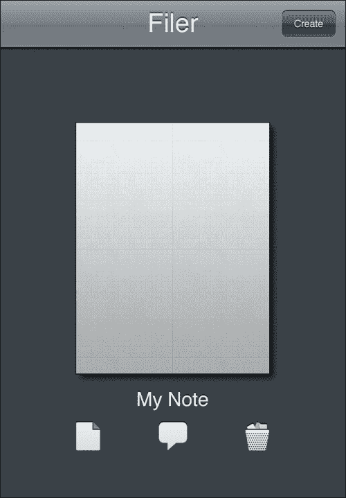
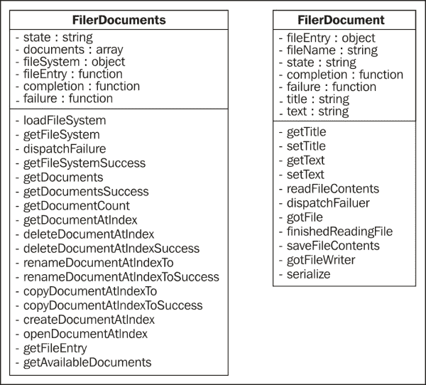
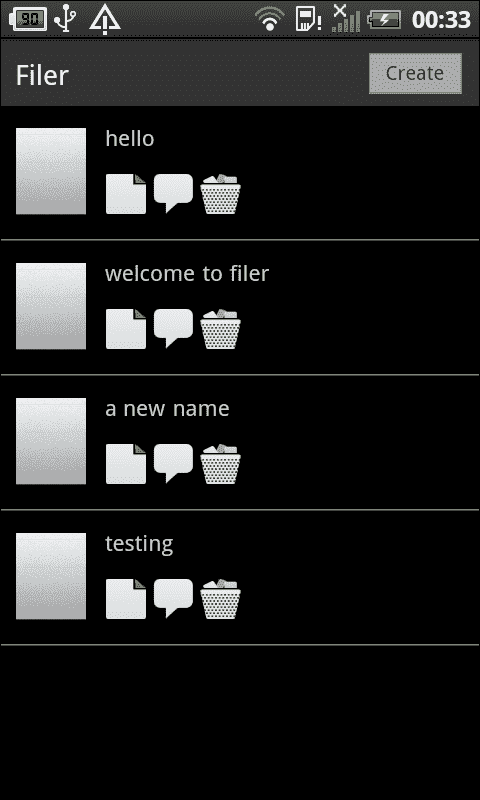
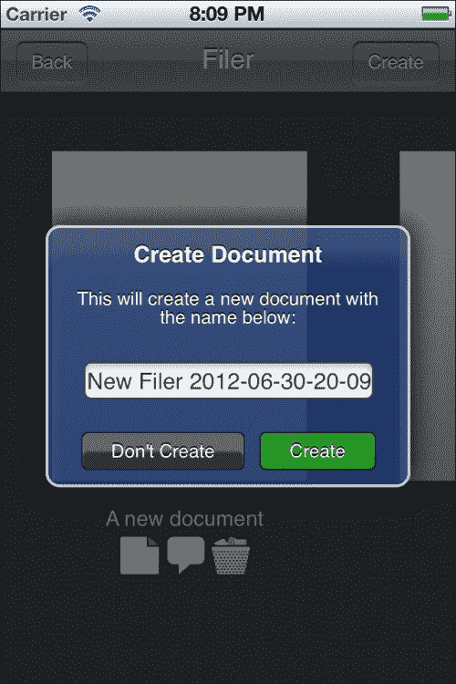
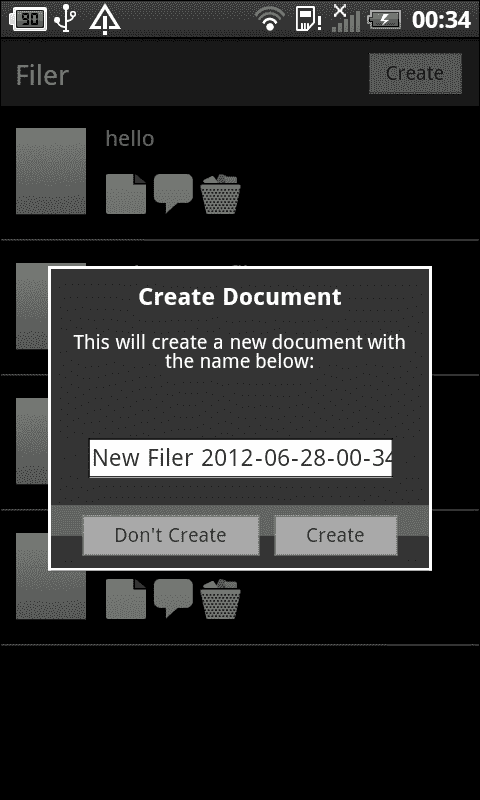
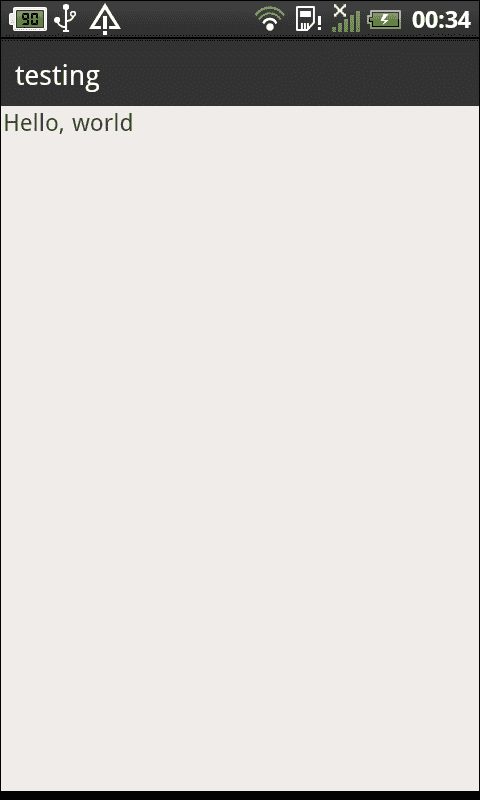

# 第三章. 提高生产力

PhoneGap 不仅可以用于简单的游戏和社交媒体应用；它还可以用于创建非常有用的生产力应用。然而，为了做到这一点，我们需要了解如何使用 PhoneGap 的文件 API 存储持久数据。在这个项目中，我们将这样做。我们将构建一个名为 Filer 的简单记事本应用，它使用文件 API 来管理可用的笔记。

# 我们将构建什么？

在本质上，Filer 更关注文件管理而不是记笔记，但正确管理文件至关重要。当应用损坏或丢失用户数据时，用户不会友好地对待，因此你必须确保正确管理。一旦完成，你就可以继续使应用更复杂。幸运的是，你在本项目中学习的概念可以应用于你未来的所有应用。

## 它能做什么？

如其名所示，该应用允许用户将笔记*存档*起来以供以后检索。这样做需要使用 PhoneGap 提供的文件 API。我们不仅需要能够保存和加载笔记，还需要管理它们。这包括根据用户的要求删除笔记、重命名它们以及复制它们。

一旦创建或打开笔记，应用本身就变得非常简单，本质上是一个大型的`TEXTAREA`元素，可以接受你想要放入的任何类型的文本。我们还将探讨保存和检索你输入的数据的好方法。

## 为什么它很棒？

这个应用是学习 PhoneGap 中用于管理应用需要保存和检索数据的文件 API 的绝佳方式。我们还将考虑如何以用户易于理解的形式展示这些内容。

## 我们将如何实现？

我们将按照创建过去应用的方式创建这个应用，使用以下指南：

+   设计用户界面

+   设计数据模型

+   实现数据模型

+   实现文档视图

+   实现文件视图

## 我需要什么来开始？

你应该能够以与先前应用相同的方式创建你的项目并设置它。将这个项目命名为`Filer`。

注意，如果你愿意，你可以包含第二个项目中的共享库。我们不会直接使用它们，但在项目的最后有一个挑战要求你添加共享功能。如果你打算这样做，你不妨现在就添加所有内容。

# 设计用户界面

首先，拿出你的纸和铅笔，或者使用你最喜欢的图像编辑器。像以前的项目一样，我们首先使用草图和线框来设计我们的视图，然后进一步细化以设计图形资产。

## 开始行动

与之前的项目一样，第一个视图是起始视图，但由于它与所有先前的应用相同，我们这里不会详细介绍它（请参阅项目 1 的*设计 UI/交互*部分，*让我们本地化!*）。相反，让我们转到文档视图，如下面的截图所示：



在这个视图中，我们实际上有两种外观；左边是 iPhone 的，而右边是 Android 的。这两种不同外观的原因仅仅是许多应用在每个平台上处理事情的方式。在 iOS 上，你通常看到大型的水平滚动界面，而在 Android 上，你通常看到代表文件的垂直列表。

让我们来看看这个视图是如何工作的。导航栏中的按钮，命名为**创建**，允许用户创建一个新的笔记。在导航栏下方是可用的文件列表。当然，在第一次运行时，这将是一个空列表，但随着文件的创建，它们会被添加到这里。这个视图将根据需要滚动，以显示整个列表。

列表中的每一项都将包含相同的内容，尽管它们的排列和大小不同。首先是表示该项的图标；许多应用都会以这种图标的形式呈现内容。为了避免复杂性，我们这里不会这么做；我们将使用静态图像。点击图标将打开笔记。接下来是图标的标签，这显示了文件名。但是，当按下时，它将允许用户重命名文件。

在文件名下方有三个图标：

+   用于复制（复制）笔记

+   用于分享笔记

+   用于销毁（删除）笔记

起初，这一切并不特别困难，实际上，也并不困难。但是，由于文件 API 的实现方式，要正确实现它确实需要一些工作。

让我们继续到文件视图，如下面的截图所示：



这个视图非常简单：它显示笔记的内容，并允许用户编辑它。请注意，这里没有**保存**按钮；想法是笔记将自动保存。

当视图首次出现时，键盘将不可见。这使用户能够看到笔记填满整个屏幕。但是，一旦点击笔记，键盘就会出现，用户就可以将笔记更改为他们想要的。

现在我们已经创建了线框，让我们进入我们的图形程序并创建我们的资源。这是我们得到的结果：



我们将大部分界面以图像的形式展示，包括图标、大纸张图像以及导航栏和视图背景本身。对于 Android，只有图标和纸张图像是重要的；后两者仅适用于 iOS。

图标本身可以从 App-Bits 免费获得（[`app-bits.com/free-icons.html`](http://app-bits.com/free-icons.html)），背景纹理来自 Subtle Patterns，同样免费（[`subtlepatterns.com`](http://subtlepatterns.com)）。

## 我们做了什么？

在这个任务中，我们创建了所需的外观和感觉，并为我们的应用程序生成了必要的资源。

# 设计数据模型

再次拿出你的纸和铅笔。我们需要为应用程序设计数据模型。我们将有两个部分：一个用于管理可用文档的列表，另一个用于管理单个文档。

## 继续前进

下面是我们的模型看起来像什么：



第一个模型，命名为 **FilerDocuments**，负责管理应用程序可用的所有文件，而右侧的模型，命名为 **FilerDocument**，仅负责单个笔记。后者负责加载笔记和保存笔记，而前者负责读取整个笔记目录，然后通过重命名、复制和删除来管理它们。

在完成这个任务之前，我们注意到一些有趣的笔记。注意所有以 `…Success` 结尾的方法。这仅仅是由于文件 API 的结构方式；所有操作都是异步进行的，因此你必须为每个调用编写回调函数，以指向一个 `success` 和一个 `failure` 函数。`success` 函数指向相应的 `Success` 方法，而 `failure` 函数指向通用的 `dispatchFailure` 方法。（失败相当通用；我们希望记录失败，而成功可能需要额外的步骤来完成操作。）

`fileSystem` 和 `fileEntry` 属性也与文件 API 有关。`fileEntry` 属性是指向特定文件的指针，而 `fileSystem` 属性是指向设备上特定目录的指针。（PhoneGap 允许你指定目录应该是持久的还是临时的；我们使用持久目录。）

在第二个模型中，注意标题和文本属性以及相关的 `get`/`set` 方法。这是单个笔记的实际数据；其他一切都是为了管理它。

## 我们做了什么？

我们为文档管理器和单个笔记创建了数据模型。在下一个任务中，我们将实现这两个模型。

# 实现数据模型

到目前为止，你应该已经创建了你的项目。我们将在 `www/models` 目录下创建两个模型，分别命名为 `filerDocuments.js` 和 `filerDocument.js`。

## 继续前进

让我们开始工作，先从管理所有可用文档的 Documents 模型入手：

```js
var DOCS = DOCS || {};

DOCS.Filers = function ( completion, failure )
{
    var self = this;
```

这是 `Filers` 对象构造函数的开始。`completion` 和 `failure` 变量被传递进来，因为在构造函数的末尾，我们将启动目录读取操作，并且我们希望在完成时（或遇到错误时）通知应用程序。

```js
    self.state = "";
```

`state` 属性将存储操作的当前进度，这将在操作失败时使调试更容易。

```js
    self.completion = completion;
```

在这里，`completion` 函数最初接收完成信息，但它还存储了对象内部其他函数使用的 `completion` 函数。这是因为一个操作可能需要几个步骤，每个步骤都需要一个临时的 `completion` 方法。这恰好是应用程序中的一个，而不是我们对象内部的一个。

```js
    self.documents = [];
```

`documents` 属性存储了我们从文件系统中读取的每个文件的接收信息。它不是实际的文档。

```js
    self.fileSystem = {};
```

`fileSystem` 属性指向设备上的持久存储。大多数操作都是从请求文件系统开始的，我们可以在第一次请求时保存它，这样其他操作就可以使用我们的缓存值。

```js
    self.failure = failure;
```

就像 `completion` 一样，这也是一个 `failure` 函数。`dispatchFailure()` 将首先被调用，然后如果它非空，将调用这个函数。

```js
    self.fileEntry = {};
```

对于我们的某些操作，我们必须存储有关特定文件的信息；我们使用 `fileEntry` 属性来完成此操作。

```js
    self.loadFileSystem = function ( completion, failure )
    {
        self.completion = completion;
        self.failure = failure;
        self.getFileSystem();
    }
```

`loadFileSystem()` 函数可以在任何时间由应用程序调用，但它通常是在应用程序怀疑我们可用的文档已更改时调用。比如说，可能有一个新的文档出现，我们想要确保向用户显示它。这个类中的大多数操作都会在操作（如重命名文件）之后尝试重新读取目录，但并非每个操作都支持此操作，这并不会阻止出现我们没有明确创建的文档（比如说，来自 iTunes 导入）。

```js
    self.getFileSystem = function()
    {
        self.state = "Requesting File System";
        window.requestFileSystem ( LocalFileSystem.PERSISTENT, 0, self.getFileSystemSuccess, self.dispatchFailure );
    }
```

`getFilesystem()` 函数在我们请求查看我们可用的文件时必须做的第一件事：请求文件系统。在这种情况下，我们请求持久文件系统，以便数据永久存储。

```js
    self.dispatchFailure = function ( e )
    {
        console.log ("While " + self.State + ", encountered error: " + JSON.stringify(e));
        if (self.failure)
        {
            self.failure ( e );
        }
    }
```

通常，我喜欢将 `success`/`failure` 方法与调用方法保持接近，但失败可以相当通用地处理（在我们的情况下），所以我只有一个 `failure` 函数，我们的所有操作都可以调用。它为我们记录了一条漂亮的日志消息，然后检查应用程序是否注册了失败回调，如果有，我们也会调用它。

```js
    self.getFileSystemSuccess = function ( fileSystem )
    {
        self.state = "Received File System";
        self.fileSystem = fileSystem;
        self.getDocuments ( fileSystem.root );
    }
```

当我们在前面的函数中时，我们有一个有效的文件系统。我们将其保存以供以后使用，然后我们还会调用 `getDocuments()` 以开始获取应用程序可以访问的每个文档的过程。

```js
    self.getDocuments = function ( directoryEntry )
    {
        self.state = "Requesting Reader";
        var directoryReader = directoryEntry.createReader();

        self.state = "Requesting Entries from Reader";
        directoryReader.readEntries ( 
          self.getDocumentsSuccess, self.dispatchFailure );
    }
```

为了遍历文件系统目录中的每个条目，我们必须创建一个目录读取器。我们可以通过使用传递给我们的 `directoryEntry` 函数（它指向我们请求的文件系统）来完成此操作。一旦我们有了它，我们就要求它读取所有条目，并在完成后调用 `getDocumentsSuccess()`。

```js
    self.getDocumentsSuccess = function ( entries )
    {
        var theDocuments = [];
        for (var i=0; i<entries.length; i++)
        {
            // is the entry a file? (we won't iterate subdirs)
            if (entries[i].isFile)
            {
                var theFileName = entries[i].name;
                var theFileType = 
                  theFileName.substr(theFileName.length-4,4);
                if (theFileType === ".fln")
                {
                    // a file we know we can process
                    theDocuments.push ( entries[i] );
            }
            }
        }
        self.documents = theDocuments;
        self.state = "";
        if (self.completion)
        {
            self.completion ( self );
        }
    }
```

在前面的函数中，我们阅读了我们得到的所有条目。一个人永远不应该假设目录中的所有条目都是我们的应用可以处理的，因此我们会筛选子目录（我们不会创建，所以它不会是我们能处理的任何东西），然后我们也会检查文件扩展名。如果是`.fln`，我们假设文件是我们的文件之一，并将其添加到列表中。如果有其他任何东西，我们就会忽略它。

一旦我们遍历完列表，我们就会调用`completion`方法（如果存在），这样应用就可以对列表做它想做的事情。

```js
    self.getDocumentCount = function ()
    {
        return self.documents.length;
    }

    self.getDocumentAtIndex = function ( idx )
    {
        return self.documents[ idx ];
    }
```

前两个方法相当直观。第一个返回我们从目录中获取的文档数量，第二个返回特定文档获取的信息。

```js
    self.deleteDocumentAtIndex = function ( idx, completion, failure )
    {
        self.completion = completion;
        self.failure = failure;
        self.state = "Removing a Document";
        self.documents [ idx ].remove ( 
             self.deleteDocumentAtIndexSuccess, 
             self.dispatchFailure);
    }
```

这个方法并不是在玩弄文字；它将物理地删除指定索引处的文档。我们的应用会先询问用户是否想要删除文档，这样就不会意外调用，但这个函数本身不会询问任何人是否可以这样做。所以调用时要小心。

```js
    self.deleteDocumentAtIndexSuccess = function ()
    {
        self.state = "";
        self.getFileSystem();
    }
```

在成功删除后，我们需要重新读取文件系统，以便我们的`documents`数组保持最新。我们通过调用`getFileSystem()`来实现这一点。你可能想知道在`deleteDocumentAtIndex`中定义的`completion`方法是如何被调用的。它是在`getFileSystem()`的末尾被调用的。它会检查`completion`属性是否已经设置（我们在`deleteDocumentAtIndex`的开始处这样做），如果设置了，就会调用它。这是我们许多操作将遵循的模式。

```js
    self.renameDocumentAtIndexTo = function ( idx, newName, 
       completion, failure )
    {
        self.completion = completion;
        self.failure = failure;
        self.state = "Renaming a Document";
        self.documents [ idx ].moveTo ( 
             self.fileSystem.root, newName, 
             self.renameDocumentAtIndexToSuccess, 
             self.dispatchFailure);
    }

    self.renameDocumentAtIndexToSuccess = function ()
    {
        self.state = "";
        self.getFileSystem();
    }
```

重命名文档只是将`moveTo`操作应用于同一目录。它遵循与前面的`delete`操作相同的操作模式。请注意，这里没有检查新文件名是否已被现有文件使用。如果有名称冲突，新文件将覆盖旧文件，这很可能不是你想要发生的事情。由于前面的`deletion`方法没有询问，我们这里也不会询问，但这是你在应用本身中应该做的事情。

```js
    self.copyDocumentAtIndexTo = function ( idx, newName, 
      completion, failure )
    {
        self.completion = completion;
        self.failure = failure;
        self.state = "Duplicating a Document";
        self.documents [ idx ].copyTo ( self.fileSystem.root, 
          newName, self.copyDocumentAtIndexToSuccess, 
          self.dispatchFailure);
    }
    self.copyDocumentAtIndexToSuccess = function ()
    {
        self.state = "";
        self.getFileSystem();
    }
```

复制与重命名非常相似，如前代码所示；区别在于我们使用`copyTo`而不是`moveTo`。操作也略有不同；如果你尝试复制一个现有的文档，尝试会失败，这与移动现有文档不同。

```js
    self.createDocument = function ( theDocumentName, 
      completion, failure )
    {
        self.completion = completion;
        self.failure = failure;
        self.state = "Creating a Document";
        self.fileSystem.root.getFile ( theDocumentName, 
          {create: true, exclusive: false},
                function ( theFileEntry )
                    {
                        self.fileEntry = theFileEntry;
                        self.state = "";
                        self.getFileSystem();
                     }, self.dispatchFailure );
    }
```

`createDocument()`方法在目录中创建一个新文件，并在这样做之后重新读取文件系统。这展示了使用`…Success()`方法的替代方案。它的工作方式完全相同。就像重命名一样，如果已经存在具有相同名称的文件，这可能会很危险，所以调用此方法之前一定要检查。

```js
    self.openDocumentAtIndex = function ( idx, completion, 
      failure )
    {
        self.completion = completion;
        self.failure = failure;
        self.state = "Opening a Document";
        self.fileSystem.root.getFile ( 
           self.documents[idx].name, {create: false, 
             exclusive: false},
          function ( theFileEntry )
          {
            self.fileEntry = theFileEntry;
            self.state = "";
            self.getFileSystem();
            }, self.dispatchFailure );
    }
```

如前代码所示，打开文档与创建文档非常相似，只是我们不会要求文件系统在它不存在时创建它。

```js
    self.getFileEntry = function ()
    {
        return self.fileEntry;
    }
```

一些操作，如创建和打开文档，也会将`fileEntry`属性设置为新打开的文档。这在要求笔记打开自身时很有用。它可以读取此属性中的文件内容。

```js
    self.getFileSystem ();
}
```

在查看我们模型的代码之前，我们提到过，我们会在创建时初始化目录读取，这就是模型末尾所做的工作。这样，当我们创建一个对象时，它会立即开始读取目录中的条目。

现在，让我们看看单个文档的代码：

```js
var DOC = DOC || {};

DOC.Filer = function ( theFileEntry, completion, failure )
{
    var self = this;

    // file and state
    self.fileEntry = theFileEntry;
    self.fileName = self.fileEntry.name;
    self.completion = completion;
    self.failure = failure;
    self.state = "";
    // file-specific
    self.title = "My Filer";
    self.text = "";

    self.getTitle = function ()
    {
        return self.title;
    }

    self.setTitle = function ( theTitle )
    {
        self.title = theTitle;
    }

    self.getText = function ()

        return self.text;
    }

    self.setText = function ( theText )
    {
        self.text = theText;
    }
```

前面的代码现在应该是自解释的。接下来，在下面的代码中，我们看到如何读取文件的内容：

```js
    self.readFileContents = function()
    {
        self.state = "Reading a File";
        self.fileEntry.file ( self.gotFile, self.dispatchFailure );
    }

    self.dispatchFailure = function( e )
    {
        console.log ("While " + self.State + ", encountered 
           error: " + e.target.error.code);
        if (self.failure)
        {
            self.failure ( e );
        }
    }
```

在请求读取文件时，我们必须调用文件对应的`fileEntry`的`file()`方法。如果它找到了文件，它会调用`gotFile()`，但如果由于某种原因它无法读取，它会调用`dispatchFailure()`。

```js
    self.gotFile = function ( theFile )
    {
        var reader = new FileReader ();
        reader.onloadend = self.finishedReadingFile;
        reader.onloaderror = self.dispatchFailure;
        reader.readAsText ( theFile );
    }
```

一旦我们有了文件，我们必须为它创建一个`FileReader`变量。与其他 API 调用不同，我们必须设置一些事件处理程序，但它们在这里与`completion`和`failure`意味着相同的事情。然后我们要求读者读取文件。

```js
    self.finishedReadingFile = function ( e )
    {
        var theFileContents = e.target.result;
```

一旦我们到达这里，`e.target.result`就有整个文件的内容。现在我们可以尝试加载它。

```js
        if (!theFileContents)
        {
            theFileContents = '{"title":"New 
              File","text":""}';
        }
```

如果文件中没有内容，我们会设置一些合理的默认值。注意，我们在这里使用`JSON`。这是因为我们将文件存储在`JSON`文件格式中。

接下来，我们尝试将文件内容解析为`JSON`。这就是`try/catch`块发挥作用的地方。如果我们无法解析文件内容，我们会得到一个错误，并可以调用`failure`函数。但如果我们正确解析了它，我们可以将我们自己的`title`和`text`设置为文件的`title`和`text`，这样我们就成功加载了文件的内容。

```js
    self.saveFileContents = function ( completion , failure )
    {
        self.completion = completion;
        self.failure = failure;
        self.fileEntry.createWriter ( self.gotFileWriter, 
            self.dispatchFailure );
    }
    self.gotFileWriter = function ( writer )
    {
        writer.onerror = self.failure;
        writer.onwriteend = function ( e )
            {
                if (self.completion)
                    {
                        self.completion();
                    }
            };
        writer.write ( JSON.stringify ( self.serialize() ) );
    }
```

保存文件与加载文件并没有太大的不同，只是我们可以直接从`fileEntry`属性创建文件写入器，而不是首先调用`file()`。然而，在`gotFileWriter`中，在调用`write()`文件内容之前，我们必须设置类似的事件。我们将`serialize()`的结果`stringify`，使其成为正确的`JSON`格式。

```js
    self.serialize = function ()
    {
        return { "title": self.title, "text": self.text };
    }
```

谈到序列化，这里就是实现它的方法。并不难，但你可能会问为什么我们不是直接将`self`转换为字符串。这是一个很好的问题。实际上，你不能将包含方法的对象转换为字符串，因为这会丢失那些方法；所以这是其中一个原因。另一个原因是，我们实际上并不需要保存整个对象，只需要标题和文本；所以，我们不会保存我们不需要的大量东西，而是只返回一个包含我们所需内容的对象。

```js
    self.readFileContents();
}
```

就像我们的第一个模型一样，我们要求文档在创建时立即加载其文件内容。

## 我们做了什么？

在本节中，我们创建了两个数据模型，一个用于目录中可用的文档列表，另一个用于实际的笔记本身。

## 我还需要知道什么？

文件 API 因其难以适应而闻名，尤其是对于认为处理顺序总是紧随其后语句的程序员来说。然而，文件 API 的工作方式却不同，它要求每个操作都必须有一个`success`和`failure`回调。此外，在读取或保存文件（或读取目录）时，有几个操作，因此回调链可能会变得相当混乱。这通常是我尝试使用单独的函数而不是内联回调的原因，但有时内联回调才是最合适的。

文件 API 可以做的不仅仅是这里所涵盖的，所以你最好去查看一下[`docs.phonegap.com/en/edge/cordova_file_file.md.html#File`](http://docs.phonegap.com/en/edge/cordova_file_file.md.html#File)。只需记住回调的工作方式，你就可以做得很好，即使你的代码可能感觉有点像意大利面一样。

# 实现文档视图

文档视图将用于向最终用户显示可用的文档列表。它还将允许用户创建文档、重命名文档、复制文档和删除文档。

让我们快速看一下最终产品，首先是 iOS 版本：


对于 Android，视图将如下所示：



注意，iPhone 的截图与 Android 的截图在外观和感觉上完全不同。虽然许多 iPhone 应用使用 Android 使用的替代方法，但在 iPhone 上，通过水平滚动大文档表示的方法更为常见，这也是我们在这里使用的方法。幸运的是，这只需要少量的代码更改和一些 CSS 即可渲染两种截然不同的外观。否则，它们的功能是相同的。

## 开始吧

和往常一样，我们将从视图的 HTML 部分开始。样板部分几乎与我们的前一个应用相同，所以我们将从模板开始：

```js
<div id="documentsView_documentTemplate" class="hidden">
    <div class="documentContainer">
        <div class="documentImage">
            
        </div>
        <div class="documentTitle" onclick="documentsView.renameDocument(%INDEX%)">
            <span >%TITLE%</span>
        </div>
        <div class="documentActions">
            
            
            
        </div>
    </div>
</div>
```

此模板定义了我们显示的每个文档的 HTML。它并不复杂。注意，我们为模板的每个可以响应触摸的部分都设置了`onClick`处理程序，但除此之外，样式由`style.css`控制。

让我们看看驱动这个视图的代码：

```js
  var documentsView = $ge("documentsView") || {};
  documentsView.lastScrollLeft = 0;
  documentsView.myScroll = {};
  documentsView.availableDocuments = {};
```

首先，是我们的属性。`lastScrollLeft`用于在切换视图时保持我们的滚动位置。`myScroll`将保存我们的滚动器（用于 iOS 和 Android），而`availableDocuments`将保存文件系统为我们应用提供的所有文档。

`initializeView()`方法与我们的前一个项目非常相似（参考项目 1 中的*实现起始视图*部分），我将跳过它，直接跳到`displayAvailableDocuments()`（`initializeView()`方法确实调用了它）。

```js
  documentsView.displayAvailableDocuments = function ()
  {

    documentsView.availableDocuments = new DOCS.Filers (
        documentsView.documentIterator
        ,
        function () // failure function
        {
            var anAlert = new PKUI.MESSAGE.Alert 
              (__T("Oops!"),
                __T("I couldn't read your persistent 
                      storage!"));
            anAlert.show();
        }
    );

  }
```

首先，我们创建一个新的 `DOCS.Filers` 对象。记住，这将立即向文件系统发送请求，获取我们可用的所有文件。当它成功完成请求时，它将调用 `documentsView.documentIterator()` 方法，该方法将遍历列表中的每个项目并渲染前面的模板。如果失败，它将调用之前定义的 `failure` 函数并显示一个警告消息。

这是一个很大的变化；我们不再使用内置的 `alert()` 方法！相反，我们创建了一个新的 `Alert` 对象，标题为 `Oops!` 和 `I couldn't read your persistent storage!` 虽然这并不是世界上最好的错误消息，但如果这种情况发生，我们实际上已经失败了。更大的问题是，这个对象，我们将在完成这个任务的过程中更详细地介绍，为我们提供了平台特定的非原生警告。这意味着我们可以根据需要自定义它们；在这种情况下，这并不多，我们只是显示一个错误消息，但 `PKUI.MESSAGE` 命名空间提供了提示选项。`Alert` 对象还允许我们在按钮按下时指定一个回调，这在需要询问是/否问题时非常有用。

下一个方法是 `reloadAvailableDocuments()`，它与之前的方法非常相似，所以我也会跳过它。它仅在文件视图从视图堆栈中弹出时使用。

```js
  documentsView.documentIterator = function ( o )
    {
        var theHTML = "";
        var theNumberOfDocuments = 0;
        for (var i=0; i<o.getDocumentCount(); i++)
        {
            var theDocumentEntry = o.getDocumentAtIndex ( i );

            theHTML += PKUTIL.instanceOfTemplate ( 
                       $ge("documentsView_documentTemplate"),
                        { "title": 
                         theDocumentEntry.name.substr(0, 
                         theDocumentEntry.name.length-4),
                         "index": i
                       }
                       );
          theNumberOfDocuments++;
        }
        if (PKDEVICE.platform()=="ios")
        {
            $ge("documentsView_contentArea").style.width = 
                (((theNumberOfDocuments) * 246)) + "px";
        }

        $ge("documentsView_contentArea").innerHTML = theHTML;
    }
```

这是一个相当简单的函数：我们只是遍历从文件系统返回的文档，并为 `documentsView_documentTemplate` 模板创建一个新的实例。我们使用一个新的便利方法 `PKUTIL.instanceOfTemplate()` 来简化这个过程。它将接受一个 DOM 元素和一个包含应替换的属性的对象，在这个例子中是 `title` 和 `index` 以及它们对应的值。（使用 `substr()` 方法来截断文件扩展名。）

这个方法执行的是我们之前手动执行的任务，使用 `replace()`，但它做得更好。如果你没有注意到，我们巧妙地避免在我们的模板中多次使用相同的替换变量。这是因为 `replace()` 只能一次替换一个实例。我们的便利方法会一直调用 `replace()`，直到所有实例都被替换，这意味着我们现在可以随意使用 `%TITLE%` 和 `%INDEX%`。

专门针对 iOS 的代码部分只是确定内容区域的宽度，以便进行滚动。对于 Android，这段代码不会执行。

```js
  documentsView.openDocument = function ( idx )
  {
        documentsView.availableDocuments.openDocumentAtIndex
            ( idx,
              function ()
              {
                fileView.setFileEntry ( documentsView.
                    availableDocuments.getFileEntry() );
                PKUI.CORE.pushView ( fileView );
              },
              function (e) { console.log (JSON.stringify(e)) 
                         }
            );
  }
```

打开文档发生在用户点击文档图标时。（对于 Android，这是你应该考虑更改的事情，但为了这个应用的目的，我们将保持一致。）

我们调用`openDocumentAtIndex()`并传递当文档打开时被调用的`completion`和`failure`函数。`success`方法将设置`fileView`方法的`fileEntry`属性，并将其推送到屏幕上。这一行为将触发加载内容。失败将错误记录到控制台，尽管您可能还应该添加一个有意义的错误警报。

```js
  documentsView.createNewDocument = function ()
  {
    {
        var anAlert = new PKUI.MESSAGE.Prompt 
                    (__T("Create Document"),
                        __T("This will create a new document 
                             with the name below:"),
                        "text",
                         "New Filer " + __D(new Date(),
                             "yyyy-MM-dd-HH-mm-ss"),
                        __T("Don't Create<|Create>"),
                        function (i)
                        {
                          if (i===1)
                          {
                           documentsView.availableDocuments.
                           createDocument ( "" +
                            anAlert.inputElement.value+".fln",
                            function ()
                            {
                            fileView.setFileEntry ( 
                              documentsView.
                               availableDocuments.
                                getFileEntry() );
                            PKUI.CORE.pushView ( fileView );
                            },
                            function (e)
                            {
                            var anAlert = new 
                              PKUI.MESSAGE.Alert (
                               __T("Oops!"),
                                __T("Couldn't create the 
                                    file.") );
                             anAlert.show();
                            }
                          );
                        }
                      }
                    );
        anAlert.show();
    }
  }
```

欢迎来到链式回调的奇妙世界！创建一个文档需要两个步骤。首先，我们询问用户希望将文档命名为什么（使用一个公认的晦涩的默认值）。然后我们创建文档，这意味着我们必须有另一个成功/失败回调。如果我们无法创建文档，我们将创建另一个警报来进一步混淆问题。

然而，真正重要的是，我们最初对用户的请求实际上是在给他们一个机会在我们的警报消息中输入一些内容！在我们所有的应用中，我们还没有这样做过，这是一个巨大的进步。此外，我们还有自定义按钮——一个“不创建”按钮和一个“创建”按钮。

如果您想知道前面代码中按钮旁边的`<`和`>`是什么——太棒了！这些主要用于 iOS，尽管您也可以将这些扩展到其他平台。iOS 有破坏性行动的概念；这些按钮应该总是用红色。或者，如果您要针对的本地使用不同的颜色，请使用该颜色。它还有**取消**按钮颜色的概念（通常是较深的灰色）。为了增加这一点，我们决定将进行下一步操作的按钮涂成绿色。

这些按钮的每个都将在按钮名称的末尾得到一个特殊字符。例如，`Cancel<`将使按钮颜色变深，并使用`Cancel`的文本作为按钮。`Go>`将使用`Go`作为文本，并将按钮涂成绿色。另一方面，`Delete*`将使用`Delete`作为文本，但将按钮涂成红色。

为了让您对每个系统上的警报/提示有一个良好的了解，这里是一个 iOS 的示例：



对于 Android，视图将如下所示：



重命名文档与创建新文档有些相似，但我们在最后不会显示文档。我们将询问用户新的名称应该是什么，如果他们选择继续，我们将尝试执行该功能。以下代码片段可以用于此操作：

```js
  documentsView.renameDocument = function ( idx )
  {
    var theFileName = documentsView.availableDocuments.
                    getDocumentAtIndex(idx).name;
    theFileName = theFileName.substr(0,theFileName.length-4);

    var anAlert = new PKUI.MESSAGE.Prompt (
                     __T("Rename Document"),
                        __T("Rename your document to the 
                             following:"),
                        "text",
                        theFileName,
                        __T("Cancel<|Rename>"),
                        function (i)
                        { 
                         if (i==1)
                         {
                          var theNewFileName = 
                         ""+anAlert.inputElement.value+".fln";
                          try {
                           documentsView.availableDocuments.
                           renameDocumentAtIndexTo
                           ( idx, theNewFileName,  
                             documentsView.documentIterator,
                             function ( e )
                            {
                             var anAlert = new 
                                  PKUI.MESSAGE.Alert 
                                  (__T("Oops!"),
                                    __T("Couldn't rename the 
                                        file.") );
                                    anAlert.show();
                            }
                           );
                          }
                        catch (e)
                          {
                           var anotherAlert = new 
                           PKUI.MESSAGE.Alert (
                               __T("Oops!"),
                               __T("Couldn't rename the 
                                    file.") );
                            anotherAlert.show();
                            }
                         }
                        }
                       );
    anAlert.show();
  }
```

如果发生某种类型的失败，我们将通过显示一个错误来表示，一次作为“失败”函数，第二次在`try`/`catch`块的`catch`部分。

注意，按照目前的写法，我们没有检查新的名称是否会与其他文件冲突。因此，如果用户将一个文件重命名为另一个文件的名称，则之前的文件将被覆盖。您应该在代码中添加一个额外的检查，以确保新的文件名尚未存在。

`copyDocument()`方法几乎相同，所以我们将跳过它，转到以下代码片段中显示的`deleteDocument()`方法：

```js
  documentsView.deleteDocument = function ( idx )
  {
    var anAlert = new PKUI.MESSAGE.Confirm (
                __T("Remove Document"),
                __T("This will remove the document. This 
                       action is unrecoverable."),
                  __T("Don't Remove<|Remove*"),
                  function (i)
                  {
                  if (i==1)
                   {
                    documentsView.availableDocuments.
                    deleteDocumentAtIndex
                     ( idx, documentsView.documentIterator,
                      function (e)
                      {
                       var anAlert = new PKUI.MESSAGE.Alert 
                      (__T("Oops!"),
                          __T("Couldn't delete the file.") );
                      anAlert.show();
                      }
                    );
                  }
    );
    anAlert.show();
  }
```

删除文档比复制或重命名文档要简单得多，所以我们在这里不会深入回调链。我想强调的主要一点是使用`*`来表示“删除”按钮将以红色按钮的形式显示，以警告用户在 iOS 上这是一个破坏性操作。尽管如此，你仍然可以修改框架，在 Android 上也显示类似的颜色。

剩余的方法与之前视图中的方法类似，所以我们将跳过它们。

## 我们做了什么？

虽然还有很多改进的空间，但我们已经为我们的应用程序创建了一个相当不错的文档管理器。我们允许用户重命名文件、删除文件、复制文件、打开文件和创建文件，这些都是一个好的文件管理器应该做的。唯一我们没有做的是允许用户共享文件，尽管有一个愉快的**分享**图标表示这个意图。这只是为了节省空间，并且因为这是一个我们之前已经讨论过的话题。

## 我还需要了解什么？

在我们这个文件管理器中，还有很多我们没有涉及的内容，它们都是重要的问题，而且肯定是你需要考虑自己实现的功能。代码本身是自我解释的，所以我们不会深入细节，但以下是一些主要问题：

+   文件名不能包含某些字符：每个人处理这个问题的方式都有些不同；你可以向用户显示一个错误信息，告诉他们需要选择不同的字符，或者你可以默默地将其更改为其他内容（这在 iOS 中很常见）。无论如何，你都应该在创建新文件或重命名/复制文档之前检查这些字符。

+   创建/重命名操作可能会覆盖现有数据：你会认为由于复制操作如果目标文件存在会失败，那么重命名/创建也会失败。不幸的是，并非如此。它们会直接覆盖文件。你必须遍历整个目录结构，以确定你是否即将覆盖一个现有的文件！用户不喜欢丢失数据，即使他们自己是原因。

+   为非 iOS 用户打开文档：Android 用户不应该需要知道点击图标会打开文档；他们会假设整个区域都是可点击的（除了图标）。因此，为它们提供一个用于重命名文件的另一个图标，并允许文件名本身（以及文档图标）打开文件，而不是重命名文件，这会是一个好主意。

+   iOS 文档图像应反映文件的内容：这个实现起来可能更困难，但通常文档图标会包含文件实际内容的某个部分。有各种方法可以实现这一点，从读取实际内容并在 DOM 上显示它们（并在某个部分后剪辑它们）到将它们渲染到 HTML `canvas` 标签并将结果保存为缩略图。无论如何，这是用户会期望的。

# 实现文件视图

这个视图相当简单；实际上它本质上是一个大的 `TEXTAREA` 元素，带有一些代码，每隔几秒自动保存内容。让我们看看它将在每个平台上如何渲染，首先是 iOS：


对于 Android，视图将如下所示：



所有这些都看起来很相似，反映了视图的简单性。

## 继续前进

视图的 HTML 部分与先前的视图非常相似，所以我们现在先跳过它。只需知道，有一个名为 `fileView_text` 的 `TEXTAREA` 元素，我们的代码将引用它。还有一个在标题栏上的 `onClick` 处理器，用于启用更改笔记标题。这些在以下代码片段中可以看到：

```js
  var fileView = $ge("fileView") || {};

  fileView.theFileEntry = {};
  fileView.theFilerDocument = {};
  fileView.theSaveTimer = -1;
```

和往常一样，我们有几个属性。第一个是用来存储我们目前正在处理的文件的信息，而第二个是实际的文档内容。最后一个属性将存储由 `setInterval()` 返回的值，这用于每隔几秒调用我们的自动保存功能。

```js
  fileView.setFileEntry = function ( theNewFileEntry )
  {
      fileView.theFileEntry = theNewFileEntry;
      fileView.theFilerDocument = {};
  }
```

在这里，我们只是提供了一个方法，让 `documentView` 方法告诉我们要使用哪个文件。

下一个方法 `initializeView()` 与其他视图足够相似，所以我们将其跳过。接下来是 `entitleDocument()`，如下代码片段所示：

```js
  fileView.entitleDocument = function ()
  {
    var anAlert = new PKUI.MESSAGE.Prompt (
                        __T("Entitle"),
                      __T("What's the title of this document?"),
                      "text",
                    fileView.theFilerDocument.getTitle(),
                    __T("Cancel<|Entitle>"),
                    function (i)
                    { 
                     if (i==1)
                     {
                      fileView.theFilerDocument.setTitle (
                        anAlert.inputElement.value );
                      fileView.viewTitle.innerHTML = 
                      fileView.theFilerDocument.getTitle();
                     }
                    }
                   );
    anAlert.show();
  }
```

当点击标题时，我们将向用户显示一个提示，使他们能够更改笔记的标题。

```js
  fileView.loadDocument = function ()
  {
    fileView.viewTitle = $ge("fileView_title");
    fileView.viewTitle.innerHTML = fileView.theFileEntry.name.substr(0,fileView.theFileEntry.name.length-4);
    fileView.theTextElement = $ge("fileView_text");
    fileView.theTextElement.value = "";

    fileView.theFilerDocument = new DOC.Filer (fileView.theFileEntry,function ()
            {
                 fileView.viewTitle.innerHTML = fileView.theFilerDocument.getTitle();
                 fileView.theTextElement.value = fileView.theFilerDocument.getText();
                 fileView.theSaveTimer = setInterval ( 
                 fileView.saveDocument, 5000 );
             },
                 function (e)
                 {
                 PKUI.CORE.popView();
                 var anAlert = new PKUI.MESSAGE.Alert 
                 (__T("Oops!"),
                 __T("Couldn't open the file.") );
                 anAlert.show();
                 }
                 );
  }
```

通过创建一个新的 `DOC.Filer()` 对象并使用我们的 `fileEntry` 属性的内容来加载特定文档的内容。这假设在将我们推入视图堆栈之前已经由 `documentView` 设置。

在成功解析文档后，我们将导航栏的标题设置为文档的标题，并将 `TEXTAREA` 元素的文本内容设置为笔记的文本。然后我们设置每五秒自动保存一次。

如果由于某种原因我们无法打开文件，我们将显示一个错误，但也会从视图堆栈中弹出我们自身。如果我们甚至无法打开文件，就没有必要显示编辑器。

```js
  fileView.saveDocument = function ()
  {
      fileView.theFilerDocument.setText ( fileView.theTextElement.value );
      fileView.theFilerDocument.saveFileContents (
      function ()
      {
       console.log ("Auto save successful.");
       },
       function (e)
       {
       PKUI.CORE.popView();
       var anAlert = new PKUI.MESSAGE.Alert (
                             __T("Oops!"),
                        __T("Couldn't save to the file.") );
        anAlert.show();
       }
      );
  }
```

保存内容是一件简单的事情。我们从 `TEXTAREA` 元素中复制文本，并将其放入 `Filer` 对象中。然后我们要求它保存文件的内容。如果成功，我们只需在控制台（在生产应用中你会移除它）中记录一条消息，如果不成功，我们显示一个错误并弹出视图。（弹出视图是否是一个好主意是有争议的。）

```js
  fileView.viewWillAppear = function ()
  {

    fileView.loadDocument();
  }
```

我们的`viewWillAppear()`方法相当简单：我们启动加载我们的笔记。这意味着通过设置`fileEntry`并将我们推入视图堆栈，我们将自动加载笔记的内容。

```js
  fileView.viewWillHide = function ()
  {
    if (fileView.theSaveTimer!==-1)
    {
        clearInterval (fileView.theSaveTimer);
        fileView.theSaveTimer = -1;
    }
    fileView.saveDocument();
    documentsView.reloadAvailableDocuments();
  }
```

我们的`viewWillHide()`方法稍微复杂一些。在这里，我们禁用了自动保存功能。毕竟，我们不想保存一个已经不再打开的文档。然后我们强制保存文档。也许用户在自动保存间隔之间正在导航；他们不希望丢失任何数据，对吧？

在保存内容后，我们还强制`documentsView`方法重新加载文档列表。当我们编辑现有文档时，这并不是什么大问题，但当我们创建新文档时，这却是一个大问题，因为我们希望文件管理器能够显示我们新创建的笔记。

## 我们做了什么？

我们创建了一个简单的文本编辑视图，可以打开文件内容并将其保存回来。它还实现了一个简单的自动保存功能。

## 我还需要了解什么？

你将要针对的大多数设备都使用软键盘进行输入。这意味着屏幕的一部分将被屏幕键盘覆盖。

每个设备如何做这取决于平台和键盘类型。例如，Android 允许安装许多不同的键盘，而且不是每个键盘都以相同的方式操作。

实质上，所发生的情况是可用的空间被移动或调整大小，以允许显示屏幕键盘。这意味着我们的用户界面也会随着键盘一起移动。这种操作是否流畅取决于平台（在 Android 上，键盘本身在一定程度上也起到作用）。iOS 在这方面做得最好；涉及到的麻烦最小，显示屏滚动得也很整洁，以确保文本保持在屏幕上。

不幸的是，在执行此操作时，Android 会有一些闪烁，而我们几乎无法控制键盘本身的外观。

一个有趣的选择可能是我们自己用纯 HTML、CSS 和 JavaScript 实现软键盘。技术上这可以行得通，但这仍然是一个相当大的漏洞，而且你的软键盘永远不会像平台上的合法键盘那样工作。（在 Android 上，喜欢特定键盘配置的用户会立刻讨厌它。）你还得考虑用户连接了蓝牙键盘的情况。这通常会导致软键盘不显示，这意味着屏幕的全部空间都被用于我们的显示。由于没有方法（除非开发我们自己的插件）来确定是否连接了物理键盘，我们强烈建议不要使用这个选项。

一些 Android 发行版还添加了一个有趣的特性。看起来当`input`和`textarea`元素被编辑时，实际上会在它们自己上方显示另一个可编辑区域。在我的手机上，这通过当前编辑器下方可见的闪烁光标的一部分来体现，几乎就像 DOM 元素只是原生输入元素的镜像。如果不是因为它们略有错位，这不会引起注意。无论如何，我觉得应该提一下。

# 游戏结束..... 结束语

我们在这个任务中已经取得了相当多的成就，虽然这些成就并不特别辉煌，但对于接下来的工作来说绝对是必要的。我们的应用程序必须能够永久存储数据，并且它们还必须能够检索相同的数据。同样，它们需要提供管理这些数据的方法，包括重命名、复制和删除。

# 你能承受高温吗？热手挑战

有几种方法可以改进这个应用程序：

+   我们的应用程序只询问用户是否真的想要删除文件，但其他操作同样危险。如果用户即将执行的操作会覆盖数据（例如，将文档重命名为现有文档的名称或创建与现有文档同名的新文档），则应添加确认提示。

+   添加功能以检查用户提供的文件名是否有效。然后，要么向用户指示这一点，要么将无效字符静默地更改为有效字符。

+   我们没有提供子目录功能，但你完全有能力做到。实际上，我们在代码中明确忽略了子目录，因为它们会给文件管理系统增加很多复杂性。你为什么不给应用程序添加子目录管理功能呢？

+   而不是存储笔记，也许你可以存储一些表格。也许是一些简单的地址或提醒——实际上，几乎可以是任何东西。
