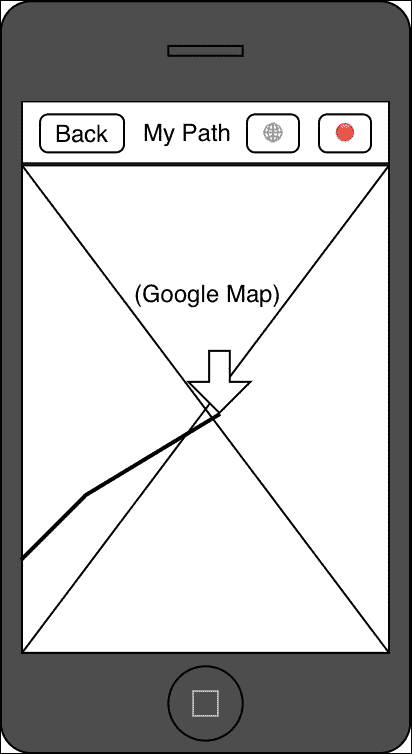
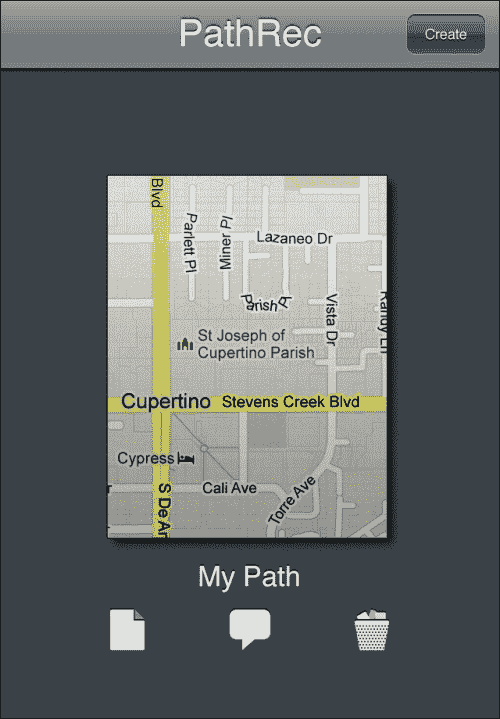
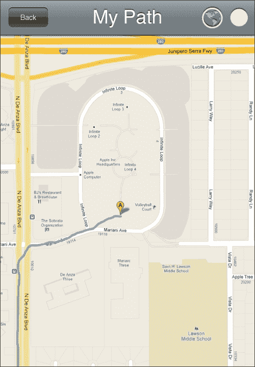
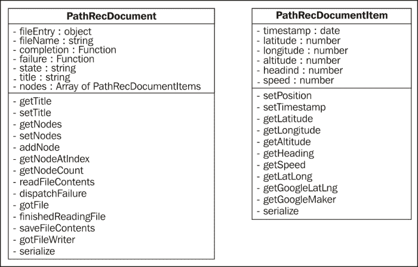
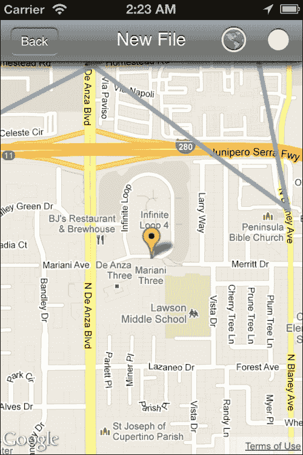
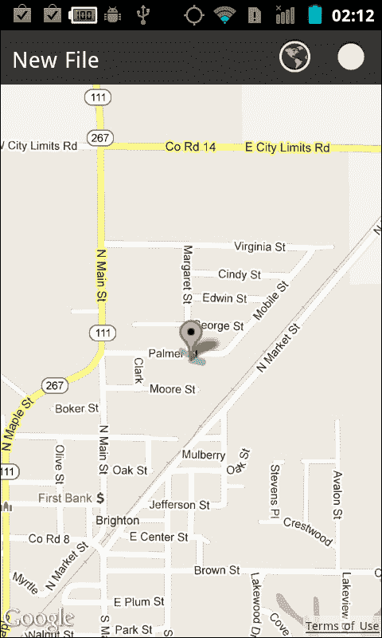

# 第四章。让我们去旅行

地理定位在当今世界变得非常重要，尤其是在大多数手机都有能力以惊人的精确度确定你的位置之后。鉴于这曾经（不久前）是昂贵 GPS 设备的主要功能，这种能力迅速普及真是令人惊讶。因此，用户期望有位置感知的应用程序，不仅如此，他们还期望有一个能够响应他们输入的漂亮地图。

# 我们要构建什么？

我们的项目旨在实现两个概念，第一个是简单地使用（非常）小部分的 Google Maps API（截至本文写作时，3.9）。我们将使用这个 API 来显示一个以用户当前位置为中心的完整功能地图。其次，我们将使用 PhoneGap 提供的地理定位功能来获取用户的当前位置。完成之后，我们将有一个应用程序，不仅可以显示以用户当前位置为中心的地图，还可以记录他们的移动并在屏幕上显示。与其想象成录音机，不如想象成位置记录器。

## 它做什么？

在上一个项目中，我们引入了文档管理，在这个项目中我们将进一步巩固这些功能。幸运的是，大部分工作已经为我们完成，但正如你所回忆的，有几个情况下用户可能会遇到麻烦（如果他们使用了一个与现有文件冲突的名称）。在这个项目中，我们将解决这个问题，以便我们有一个更加健壮的解决方案。

我们还将介绍我们可以使用的各种方法来加载 Google Maps API，这比最初想象的要困难一些，而且我们还要处理可能失去（或没有）网络访问的可能性。我们不会使用整个 Google Maps API，它值得一本自己的书，但我们将使用一些基本功能，包括标记和线条。

最后，我们将使用地理定位。一些浏览器足够好，提供了良好的地理定位实现，由于 PhoneGap 的实现遵循 W3C 标准，如果浏览器解决方案足够好，它将使用浏览器解决方案。这也意味着，如果我们使用`localStorage`而不是持久文件，我们构建的内容甚至可以在 PhoneGap 之外工作。

当我们将所有这些整合在一起时，我们将有一个相当有趣的应用程序。一个可以记录我们的位置（在我们允许的情况下）并显示它的应用程序。这为扩展提供了各种可能性：你可以与朋友分享路径，你可以导出为 KML 以供其他应用程序使用，等等。

## 它为什么很好？

地理定位和交互式地图是现代应用中用户所期望的功能。如果你显示地址，至少应该能够显示一个地图与之配合。如果你提供基于位置的搜索，你应该能够定位用户的位置并向他们提供相关结果。地理定位和交互式地图不仅用于路线导航或帮助迷路的人；它们在许多其他应用中也非常有价值。

## 我们该如何进行？

在许多方面，这个任务比之前的任务更容易。一方面，我们的框架已经变得相当稳定（尽管这个项目有一些变化），我们在文档管理方面也有了一个良好的开端。真正剩下的是创建一个能够存储位置信息并保存和检索它的数据模型。这也是我们第一个不需要开始视图的应用——从现在起，我们将直接进入应用。

为了实现这一点，我们将使用之前使用过的相同熟悉步骤：

+   设计我们的 UI 和外观感受

+   设计我们的数据模型

+   实现我们的数据模型

+   更改我们的文档管理器

+   实现我们的地图视图

## 我需要什么来开始？

和往常一样，继续创建你的项目。虽然你不需要担心插件支持；我们不需要任何本机插件来为这个应用。

此外，也请查看一下谷歌地图 API ([`developers.google.com/maps/documentation/javascript/3.9/reference`](https://developers.google.com/maps/documentation/javascript/3.9/reference))。在那里，你可能还想注册一个 API 密钥。虽然你可以不使用密钥使用 API（我们在这里就是这样做的），但拥有一个密钥可以提供使用指标，并且如果你的应用足够受欢迎，你将能够为你的使用付费，这样你就不会受到为非密钥用户强制执行的低 API 配额的限制。务必查看他们的文档；那里有很多内容，足以填满几个章节，但它非常值得浏览。这样说吧：有些谷歌地图能做的事情，我以前从未知道它能够做到，你也可能会发现同样的情况。

# 设计我们的 UI 和外观感受

和往常一样，在我们对应用的外观有一个很好的想法之前，不要开始编码。幸运的是，我们实际上只需要关注地图视图。我们在上一个项目中已经涵盖了文档管理器的外观和感受，这里并没有太大的变化。此外，由于视图的大部分实际上将由谷歌提供的交互式地图占据，所以我们甚至不需要做太多。

## 准备就绪

再次，拿出你的铅笔和纸或者你最喜欢的图形编辑器；我们将使用它们来设计我们的线框图，然后构建我们可能以后需要的任何资产。

## 开始行动吧

以下截图展示了我们地图视图的最终原型：



初看之下，这似乎是一个相当简单的视图——确实如此——但不要被它欺骗。其下隐藏着巨大的力量！

让我们回顾一下各种项目：

+   **返回**按钮将用户带回到文档管理界面。当然，对于 Android 来说，这个按钮将不会出现；设备的物理返回按钮将起到作用。

+   导航栏上的标题将是文档的标题。用户可以点击它，通过我们框架的提示警报来更改文档。

+   带有*地球仪*的按钮打算作为*找到我*按钮。当显示时，视图将自动执行此操作，但交互式地图的一个显著特点是您应该能够自己探索它，而无需不断被拖回到当前位置。此按钮的目的是在您进行了一些探索后重新定位您的地图。

+   带有*红点*的按钮是*记录*按钮。当点击时，视图将开始记录您的位置（每次位置改变时）并绘制一条跟随您进度的线。如果再次点击，它将停止跟踪您的位置。

+   在导航栏下方是谷歌地图（此处为*X*图像）。当然，这将由谷歌提供。用手指移动地图将平移地图，但更重要的是，我们将捕捉这个事件，以便我们可以*解锁*地图，使其从您的当前位置开始。

+   向下的箭头是典型的*谷歌标记*的表示；这将指示您的当前位置。

+   线条是表示已经记录的一些路径的表示；它将指示在记录过程中路径的每次更新。

既然我们已经定义了所有东西应该如何协同工作，让我们进入我们的图形程序，创建我们需要的图形资产。

文档视图将如下所示：



地图视图将如下所示：



通常，我们使用了与先前项目相同的资产，尽管我们的文档图像已更改为地图。我们还需要使用按钮上的图像，一个用于标准的*找到我*图标，两个用于记录按钮的各种状态——一个圆圈（用于记录）和一个暂停图标（未显示）。这些图标来自 App-Bits 的免费图标集，可在[`app-bits.com/free-icons.html`](http://app-bits.com/free-icons.html)找到。如果您还没有，您可能想先下载这个图标集。

## 我们做了什么？

在这个任务中，我们介绍了用户界面的设计以及它的各个部分如何工作。我们跳过了文档管理器的讨论，因为它与先前项目几乎相同，唯一的变化是我们使用的图像和文件扩展名。

# 设计我们的数据模型

在这个任务中，我们将致力于设计我们的数据模型。我们将关注文档及其包含的项目；文档管理器模型与先前项目保持不变。

## 准备工作

如果你查阅地理位置的文档，你会注意到位置信息包含相当多的信息，包括纬度、经度、海拔、航向和速度。大多数实现也会返回位置和海拔的精度，但我们现在将忽略这一点。由于我们的地图将显示当前位置，我们假设用户只有在当前位置正确的情况下才会开始记录，因此等待精度稳定下来就不那么重要了。如果我们打算立即开始记录，我们需要等待精度缩小到可接受的极限，这就是这些值变得有用的地方。

拿出你的纸和笔，我们将开始构建我们的数据模型。

## 继续前进

我们的数据模型将类似于以下截图：



技术上，我们有三个模型：前一个截图显示的两个模型和 `PathRecDocumentCollection` 模型，后者与我们在上一个项目中看到的文档管理器模型相同。由于它相同，我们将跳过它，专注于前一个截图显示的两个模型。让我们从 `PathRecDocumentItem` 开始：

+   `timestamp`、`latitude`、`longitude`、`altitude`、`heading` 和 `speed` 都是项目需要存储的属性。我们将在对象创建时收集这些属性，并通过 `setPosition()` 存储它们，以便我们的项目能够立即填充。与用于地理位置的 `position` 对象不同，我们不会在 `coords` 对象中存储坐标，但我们必须稍后处理这个问题。

+   `setPosition()` 方法可以接受一个地理位置位置（带有 `coords` 对象）或一个序列化的 `PathRecDocumentItem` 对象（不带 `coords` 对象）。它将适当地更新属性。

+   `get…()` 属性将返回请求的属性值。

+   `getLatLong()` 属性以 `lat, long` 的形式返回纬度和经度。

+   `getGoogleLatLng()` 属性返回一个 Google Maps `LatLng` 对象。

+   `getGoogleMarker()` 属性返回一个 Google Maps `Marker` 对象。

+   `serialize()` 属性返回一个准备好存储在 JSON 文档中的对象。

请记住，前面的模型只存储单个地理位置位置；要将多个位置串联起来，需要下一个模型 `PathRecDocument`，它包括以下内容：

+   `fileEntry`、`filename`、`completion`、`failure` 和 `state` 都与我们在上一个项目中使用的文档相同。

+   `title` 属性存储文档的标题。

+   `nodes` 是先前列出的项的数组；这是我们存储一系列地理位置位置的方式。将它们全部放在一行中，我们就会得到用户在录制过程中走过的路径。

+   `get`/`setTitle()` 方法返回并设置文档的标题。

+   `get`/`setNodes()` 方法将返回并设置节点；这些需要数组。

+   `addNode()` 方法将节点推送到笔记列表中；这必须是一个 `PathRecDocumentItem`。

+   `getNodeAtIndex()` 方法将返回给定索引处的节点。

+   `getNodeCount()` 方法将返回路径中的节点数量。

+   剩余的方法与上一个项目的文档模型相同。

+   `serialize()` 方法将返回一个适合存储在文件中的对象。与上一个项目不同，这次 `serialize()` 必须遍历每个节点，调用其 `serialize()` 方法来构建一个不包含 `PathRecDocumentItem` 中所有额外方法的节点数组。（毕竟，没有理由存储这些。）结果将是一个具有标题属性和仅包含位置信息的节点数组的对象；其他所有内容都将被删除。

## 我们做了什么？

在这个任务中，我们创建了我们的数据模型，并重用了我们之前项目数据模型的部分。毕竟，为什么要重新发明轮子，对吧？

接下来，我们需要实际实现这个数据模型。我们将在下一个任务中处理这个问题。

# 实现我们的数据模型

我们将创建两个文件，即 `PathRecDocumentCollection.js` 和 `PathRecDocument.js`，以存储我们的三个数据模型。由于第一个与上一个项目的文档管理器非常相似，我们将跳过项目中的大部分代码，并专注于后面的脚本。

## 准备工作

打开你的编辑器，并将 `www/models` 目录中的 `PathRecDocument.js` 和 `PathRecDocumentCollection.js` 文件复制到你的项目中，这样你就可以跟随我们关于实现的讨论。

## 开始吧

在我们开始真正的重点之前，让我们快速看一下 `PathRecDocumentCollection.js` 文件中我们的 `PathRecDocumentCollection` 模型的一些变化：

```js
    self.renameDocumentAtIndexTo = function ( idx, newName, completion, failure )
    {
        self.completion = completion;
        self.failure = failure;
        self.state = "Renaming a Document";
        for (var i=0; i<self.documents.length;i++)
        {
          if (self.documents[i].name.toLowerCase().trim() == newName.toLowerCase().trim())
            {
              self.dispatchFailure ( { "error": "The file already exists" } );
              return;
            }
        }
        self.documents [ idx ].moveTo ( self.fileSystem.root, newName.trim(), self.renameDocumentAtIndexToSuccess, self.dispatchFailure);
    }
```

你会注意到我们的 `renameDocumentAtIndexTo` 现在多了几行代码，以确保我们不会覆盖已经存在的文件。如果存在同名文件，我们会向 `failure` 方法发送错误，我们的文档管理器会愉快地阻止用户进行任何危险的操作。我们对创建文档和复制文档也做了同样的事情。

在处理完这些之后，让我们转到 `PathRecDocument.js` 中的 `PathRecDocumentItem`：

```js
var DOC = DOC || {};

DOC.PathRecDocumentItem = function ( position )
{
    var self = this;

    self.timestamp = {};
    self.latitude = 0;
    self.longitude = 0;
    self.altitude = 0;
    self.heading = 0;
    self.speed = 0;
```

与我们的模型一样，前面的定义了我们的属性。

```js
    self.setPosition = function ( position )
    {
        self.timestamp = position.timestamp;

        if (position.coords)
        {
            self.latitude = position.coords.latitude;
            self.longitude = position.coords.longitude;
            self.altitude = position.coords.altitude;
            self.heading = position.coords.heading;
            self.speed = position.coords.speed;
        }
        else
        {
            self.latitude = position.latitude;
            self.longitude = position.longitude;
            self.altitude = position.altitude;
            self.heading = position.heading;
            self.speed = position.speed;
        }
    }
```

`setPosition()` 方法会将属性设置为传入的位置。如果是一个地理位置位置（它将有一个 `coords` 对象），我们使用这些值，但如果它是一个序列化的 `PathRecDocumentItem`，我们则只使用这些值。

```js
    self.getLatitude = function ()
    {
        return self.latitude;
    }
```

像所有好的对象一样，我们为所有属性提供了获取器。由于它们都非常简单，我们不会逐一介绍每一个。

```js
    self.getLatLong = function ()
    {
      return self.latitude + "," + self.longitude;
    }

    self.getGoogleLatLng = function ()
    {
      return new google.maps.LatLng( self.latitude, self.longitude );
    }
```

前两个方法实际上是便利方法。一个是返回 `lat, long` 格式的经纬度，另一个是返回一个 Google Maps `LatLng` 对象。这个对象是 Google Maps API 中的一个关键对象。

```js
    self.getGoogleMarker = function ( withMap )
    {
      return new google.maps.Marker(
        {
            map:withMap,
            title:self.getLatLong(),
            draggable:false,
            position:self.getGoogleLatLng()
          }
        );
    }
```

这也是一个便利的方法，但它返回一个 Google Maps `Marker`。这需要一个已经初始化的 Google 地图，否则它将设置一个带有标题`Lat,` `Long`的标记，位置相同。

```js
    self.serialize = function ()
    {
      return {
        "timestamp": self.timestamp,
        "latitude": self.latitude,
        "longitude": self.longitude,
        "altitude": self.altitude,
        "heading": self.heading,
        "speed": self.speed
        };
    }
```

为了将项目保存到文件中，它需要被序列化。由于我们不需要序列化方法，我们只需返回一个包含位置的物体对象。

```js
    if (position)
    {
        self.setPosition ( position );
    }
}
```

最后，在构造函数的末尾，我们将设置位置，如果传给了我们。如果没有，对象将没有任何位置数据设置。

接下来，我们将查看`PathRecDocument`对象。其中大部分与上一个项目中的文档对象相似，所以我们将省略那些部分。

```js
DOC.PathRecDocument = function ( theFileEntry, completion, failure )
{

    self.title = "My Path";
    self.nodes = []; 
```

到目前为止，唯一的真正区别是，我们不再存储文本，而是存储一个`PathRecDocumentItems`数组。这些将用于存储路径内的坐标。

```js
    self.getNodes = function ()
    {
      return self.nodes;
    }

    self.setNodes = function ( theNodes )
    {
      self.nodes = theNodes;
    }
```

到目前为止，这些获取器和设置器相当典型。我们可以请求项目列表（`getNodes`），并给对象一个新的列表（`setNodes`）。

```js
    self.addNode = function ( aNode )
    {
      self.nodes.push ( aNode );
    }
```

`addNode()`方法会将一个新的`PathRecDocumentItem`放入我们的节点列表中。

```js
    self.getNodeAtIndex = function ( idx )
    {
      return self.nodes[idx];
    }

      self.getNodeCount = function ()
    {
      return self.nodes.length;
    }
```

虽然我们可以使用`getNodes()`方法来返回整个列表，但逐个处理它们也很方便；因此，我们使用`getNodeAtIndex`和`getNodeCount`。

```js
    self.finishedReadingFile = function ( e )
    {
      var theFileContents = e.target.result;
      if (!theFileContents)
      {
        theFileContents = '{"title":"New File","nodes":[]}';
      }
```

到实际加载我们的文档之前的代码大部分在这里被省略了。它与前一个项目相同，但这里我们开始看到一些差异。首先，如果没有内容在文件中，我们假设它是一个空白文档，但我们需要用默认标题和空节点列表初始化我们的文档。

```js
        try
        {
          var data = JSON.parse ( theFileContents );
          self.title = data.title;
          for (var i=0; i<data.nodes.length; i++)
          {
            self.addNode ( new DOC.PathRecDocumentItem ( data.nodes[i] ) );
          }
        }
```

接下来，虽然设置标题很容易，但我们必须遍历文件中的节点列表并将它们添加到文档中。当我们完成时，我们的文档将包含文件中保存的所有节点。

```js
    self.serialize = function ()
    {
      var serializedNodes = [];
      for (var i=0; i<self.nodes.length; i++)
      {
        serializedNodes.push ( self.nodes[i].serialize() );
      }
      return { "title": self.title, "nodes": serializedNodes };
    }
```

保存文件内容实际上与上一个项目相同，但前一个代码片段中改变的是`serialize()`方法。首先，我们创建一个空数组，然后遍历我们的位置列表。然后我们序列化每一个，并将序列化的结果添加到我们的数组中。这确保了数组中只有位置数据而没有方法定义。然后我们返回标题和序列化的位置，这足以保存文档！

## 我们做了什么？

在这个任务中，我们为每个地理位置位置创建了数据模型，包含它们的文档，然后重新使用了上一个项目中的文档管理器实现。

# 改变我们的文档管理器

我们对文档管理器的工作方式做了一些小的改动。虽然不是什么大改动，但确实值得一看。

## 准备工作

在编辑器中打开`www/views/documentsView.html`，以便你可以跟随讨论。

## 继续前进

最大的变化是我们如何根据我们所在的平台处理文档列表显示部分的点击。如果您还记得上一个项目，Android 感觉并不那么舒适，因为必须点击图标才能打开文档，但如果他们点击了名称，就会提示重命名文档。在我们的新管理器中，我们已经将其反转，点击名称将打开文档，点击图标将提示重命名操作。

这些更改在以下文档模板中显示：

```js
<div id="documentsView_documentTemplate" class="hidden">
  <div class="documentContainer">
 <div class="documentTapArea" onclick="documentsView.documentContainerTapped(%INDEX%)"></div>
  <div class="documentImage">
 
  </div>
 <div class="documentTitle" onclick="documentsView.documentNameTapped(%INDEX%)">
    <span >%TITLE%</span>
  </div>
  <div class="documentActions">
    
    
    
  </div>
  </div>
</div>
```

已经突出显示了关键差异。首先，我们引入了一个名为 `documentTapArea` 的新 `div` 元素。它位于整个文档详情之后，以便它可以成为 Android 的点击目标。它将触发 `documentContainerTapped()`，以便我们可以在事件发生时做出响应。

下一个差异是对于图标：我们触发 `documentIconTapped()` 而不是 `openDocument`。

最后的区别是标题：我们触发 `documentNameTapped()` 而不是 `renameDocument`。

这些更改在代码中很容易被发现，如下面的代码片段所示：

```js
  documentsView.documentIconTapped = function ( idx )
  {
    if (PKDEVICE.platform() == "ios")
    {
      documentsView.openDocument(idx);
    }
    else
    {
      documentsView.renameDocument(idx);
    }
  }

  documentsView.documentNameTapped = function ( idx )
  {
    if (PKDEVICE.platform() == "ios")
    {
      documentsView.renameDocument(idx);
    }
    else
    {
      documentsView.openDocument(idx);
    }
  }

  documentsView.documentContainerTapped = function ( idx )
  {
    if (PKDEVICE.platform() == "ios")
    {
      return;
    }
    else
    {
      documentsView.openDocument(idx);
    }
  }
```

在这些方法中，我们做的是根据当前平台确定如何反应。如果我们是 iOS 设备，图标应该打开文档（它是最大的点击目标），文档下的点击目标应该什么都不做，标题应该提示重命名。另一方面，所有其他设备如果点击了名称或点击目标，应该打开文档，只有当点击了图标时才提示重命名。

## 我们做了什么？

在这个任务中，我们介绍了一些对文档管理器进行的微妙更改，以帮助它在 Android 平台上感觉更加舒适。

# 实现我们的地图视图

实际上，我们的地图视图的外观将会相当简单。Google 地图将负责交互内容（以及滚动，感谢上帝），因此我们的主要关注点将是导航栏和与 Google 地图的交互。

当我们完成时，我们应该在 iOS 上看到以下内容：



Android 设备上的视图应该是这样的：



## 准备工作

我们将从 `www/views` 目录下的 `mapView.js` 文件开始工作，所以请打开它，以便您可以跟上。

## 开始行动

让我们先看看视图的 HTML：

```js
<div class="viewBackground">
  <div class="navigationBar">
    <div id="mapView_title"></div>
    <span style="display: block; position: absolute; right:10px; top: 6px; width:auto; text-align: right;">
    <span class="iconButton " id="mapView_trackButton" style="margin-right: 10px;" ></span>
    <span class="iconButton " id="mapView_actionButton" ></span>
    </span>
    <button class="barButton backButton" id="mapView_backButton" style="left:10px;" ></button>
  </div>
```

首先，我们的导航栏中包含几个按钮。`trackButton` 的目的是在地图被移动后重新将地图中心定位到用户的位置。`actionButton` 实际上是 *记录* 按钮，但我们将其命名为 *action*，因为它控制着记录的状态，本质上就是 *开始* 和 *停止*。

```js
  <div class="content avoidNavigationBar" style="padding:0; overflow:hidden; " id="mapView_scroller">
    <div id="mapView_contentArea">
    <div id="mapView_mapCanvas" style="width:100%; height:100%;">
    </div>
    </div>
  </div>
</div>
```

在代码的这个阶段，我们其他视图与这个视图之间唯一的真正区别是名为 `mapView_mapCanvas` 的 `div` 元素；这个元素将被用来包含我们的 Google 地图。我们给它设置了 `100%` 的宽度和高度，以便它填充视图。

这就是视图的全部内容。现在让我们看看背后的代码：

```js
  var mapView = $ge("mapView") || {};

  mapView.theFirstTime = true;
  mapView.theFileEntry = {};
  mapView.thePathDocument = {};
  mapView.theSaveTimer = -1;

  mapView.map = {};
  mapView.watchID = -1;
  mapView.polyline;
  mapView.currentPositionMarker = {};
  mapView.keepMapCentered = true;
  mapView.lastKnownPosition = {};
  mapView.recordingPath = false;
```

初始属性应该看起来很熟悉，它们与上一个项目中的属性类似。但除此之外，我们还有一些将对我们观点至关重要的属性。在继续之前，让我们来回顾一下：

+   `map` 属性将存储我们将最终创建的 Google 地图的引用。

+   `watchID` 属性将存储为我们创建的地理位置创建的计时器 ID。想法是 PhoneGap 将在位置每次变化时调用一个 `update` 函数，并给我们这个 ID，以便在需要时取消此更新功能。当我们处于视图状态时，我们可以获取所需的所有位置更新，但当我们离开视图时，我们应该取消监视。

+   `Polyline` 是另一个 Google Maps API 对象。它将在一个数组中存储一系列位置，就像我们自己的 `PathRecDocument.nodes` 属性一样，但它以 *Google* 的方式这样做。为了在地图上显示路径，我们必须将我们的位置项转换为这个对象。

+   `currentPositionMarker` 属性将存储一个 Google Maps `Marker` 对象。我们将使用这个标记来指示用户的当前位置。你可以对标记做得很花哨，包括动画和自定义图像，但就目前而言，我们将使用默认设置。

+   `keepMapCentered` 属性跟踪我们是否应该，正如其名所示，保持地图在用户的当前位置上。如果为真，我们将在每次更新时将地图中心平移到当前位置。但如果为假，则不会这样做。我们会在检测到地图上的 *拖动* 时更改此值。这意味着用户想要探索当前位置周围的地图，如果我们不将其设置为 `false`，则每次位置变化时地图都会弹回到当前位置，从而产生令人不安和痛苦的经历。

+   `lastKnownPosition` 属性将存储我们最后已知的位置。这将始终保持更新，以便我们可以在 `keepMapCentered` 设置为 `true` 后，一旦设置为 `false`，就可以平移到最后已知的位置。

+   `recordingPath` 属性指示我们是否正在记录当前位置。如果为真，我们将存储位置更新并将它们添加到文档中，但如果为假，则不会存储任何更新。用户可以通过点击 `actionButton` 来切换此功能。

    ```js
      mapView.actionButtonPressed = function ()
      {
        mapView.recordingPath = !mapView.recordingPath;
        if (mapView.recordingPath)
        {
          mapView.actionButton.innerHTML = __T("STOP");
    ```

    ```js
        }
        else
        {
          mapView.actionButton.innerHTML = __T("RECORD");
        }
        mapView.geolocationUpdate ( mapView.lastKnownPosition );
      }
    ```

`initializeView()` 方法本身与我们的其他视图类似，所以我们将跳到 `actionButtonPressed()`。这个函数将只切换我们是否正在记录（并相应地更新按钮）。然后它将带有最后已知位置的地定位更新发送到我们的视图。这样，记录就会立即开始，而不是等待接收到新的位置。

```js
  mapView.trackButtonPressed = function ()
  {
    mapView.keepMapCentered = true;
    mapView.geolocationUpdate ( mapView.lastKnownPosition );
  }
```

如果用户平移地图，我们将`keepMapCentered`设置为`false`，这样地图就不会总是弹回到当前位置。此方法将将其重新设置为`true`并发送新的更新，以便地图立即移动到当前位置（而不是等待新的更新）。这确保了地图能够立即响应，否则用户可能不会认为有任何事情发生。

如果我们在记录，这当然会在我们的路径中增加一个额外的位置，但它将位于之前已知的位置，因此不会显示。可以添加代码以防止添加与上一个节点完全相同的节点。

```js
  mapView.geolocationUpdate = function ( position )
  {
    var theLatLng = new google.maps.LatLng ( 
      position.coords.latitude,
        position.coords.longitude );

    mapView.lastKnownPosition = position;

    if (mapView.keepMapCentered)
    {
      mapView.map.panTo ( theLatLng );
    }

    mapView.currentPositionMarker.setPosition (theLatLng);

    if (mapView.recordingPath)
    {
      mapView.polyline.getPath().push ( theLatLng );
      mapView.thePathDocument.addNode ( new 
         DOC.PathRecDocumentItem ( position ) );
    }
  }
```

每当用户的地理位置发生变化时（或者如果您愿意，以设定频率），就会调用`geolocationUpdate()`方法。我们首先创建一个新的`LatLng`对象，包含坐标，以便我们可以更新我们的标记。我们还把位置存储到我们的`lastKnownPosition`属性中，这样我们可以在任何时刻重新居中地图。

如果`keepMapCentered`是`true`，我们在地图上调用`panTo()`方法，这将平滑地将地图平移到新位置，如果可能的话。如果新位置远离当前地图视图，谷歌地图将直接跳转到新位置而没有任何动画。幸运的是，我们不必自己跟踪这一点；我们可以确信地图将居中在正确的位置。

然后我们更新我们的标记到正确的位置，以便它也是最新的。如果用户正在与地图互动，这意味着他们可以始终看到当前位置（如果处于视图中）。

最后，如果我们在记录，我们调用路径的`push()`方法。这有一个很好的好处，就是自动更新谷歌地图视图以包括路径的变化。然后我们将节点添加到我们的文档中，这样我们也可以跟踪它。

```js
  mapView.geolocationError = function ( error )
  { 
    var anAlert =
      new PKUI.MESSAGE.Alert (
        __T("Geolocation Error"),
        __T(error.message) );
    anAlert.show();
  }
```

地理位置功能还允许一个错误函数。您在这里可以执行许多不同的事情，因为错误对象将以某种粒度指示函数被调用的原因：超时（在特定时间段内无法检索位置）、位置本身不可用，或者我们请求位置被拒绝（用户有权这样做）。在我们的情况下，我们只是在警告框中显示消息。

```js
...
  mapView.loadDocument = function ()
  {
    mapView.viewTitle = $ge("mapView_title");
    mapView.viewTitle.innerHTML =  mapView.theFileEntry.name.substr(0,mapView.theFileEntry.name.length-4);

    mapView.thePathDocument = new DOC.PathRecDocument (mapView.theFileEntry,function ()
        { 
          mapView.viewTitle.innerHTML = mapView.thePathDocument.getTitle();
          mapView.theSaveTimer = setInterval ( mapView.saveDocument, 5000 );
          for (var i=0; i<mapView.thePathDocument.getNodeCount(); i++)
            {
              var theNode = mapView.thePathDocument.getNodeAtIndex ( i );
              mapView.polyline.getPath().push ( new google.maps.LatLng ( theNode.latitude, theNode.longitude ) );
            }
        },
        function (e)
        {
          PKUI.CORE.popView();
          var anAlert = new PKUI.MESSAGE.Alert (__T("Oops!"),__T("Couldn't open the file.") );
          anAlert.show();
        }
      );

    mapView.polyline = new google.maps.Polyline ( { strokeColor: '#80A0C0', strokeOpacity:0.85, strokeWeight:5 } );
    mapView.polyline.setMap ( mapView.map );
  }
```

加载我们的文档与上一个项目非常相似，只是在文档完全加载到内存之后发生的事情不同。为了在谷歌地图上显示我们的路径，我们必须将所有加载的位置推送到多线中，这是在方法接近结束时创建的。

```js
…
  mapView.viewWillAppear = function ()
  {
    document.addEventListener("backbutton", mapView.backButtonPressed, false );
    mapView.actionButton.innerHTML = __T("RECORD");
    mapView.trackButton.innerHTML = __T("CENTER");
  }
  mapView.viewDidAppear = function ()
  {

    if (mapView.theFirstTime)
    {
      mapView.map = new google.maps.Map ( $ge("mapView_mapCanvas"),
        {  disableDefaultUI: true,
              center: new google.maps.LatLng(40,-90),
              zoom: 15,
              mapTypeId: google.maps.MapTypeId.ROADMAP
         }
        );
        google.maps.event.addListener ( mapView.map, 'dragstart', function () { 
        mapView.keepMapCentered = false; } );
        mapView.currentPositionMarker = new 
        google.maps.Marker(
          {
            map:mapView.map,
            title: "Current Position"
          }
        );
    }
        mapView.watchID = navigator.geolocation.watchPosition (         mapView.geolocationUpdate, mapView.geolocationError,
        {
          enableHighAccuracy: true
        }
    );

    mapView.loadDocument(); 
  }
```

当首次展示视图时，我们将创建谷歌地图。没有真正的原因要在之后再次创建它，这就是为什么我们只做一次。地图使用我们的`mapView_mapCanvas`元素，该元素被设置为填充整个视图。请注意，我们向构造函数传递了几个属性：

+   当`disableDefaultUI`为`true`时，将关闭谷歌地图上的所有 UI 元素。这意味着像在卫星图和道路图类型之间切换的按钮将消失，以及街景、平移和缩放。与地图的交互仍然有效，但在这个情况下，移除控制元素是个好主意，因为其中一些会导致应用打开新的浏览器（如街景）。

+   `center`表示地图应该最初居中的位置。纬度和经度没有特别的意义。当我们获得第一次地理定位更新时，它将被重置。

+   `zoom`表示地图应该缩放多远。15 级允许用户看到他们当前的街道，所以这是一个很好的起始级别。当然，用户可以稍后更改他们的缩放级别，以满足他们的需求。

+   `mapTypeId`表示地图的类型，在这种情况下，是道路图类型。

一旦我们创建了一个地图，我们也会为它添加一个监听器，当用户自己平移地图时，这个监听器会被触发。如果他们这样做，我们将`keepMapCentered`设置为`false`，这样未来的更新就不会重新居中地图。

之后，我们初始化我们的当前位置标记。我们必须告诉标记它将显示在哪个地图上（我们刚刚创建的那个），以及标记的标题。标题默认不显示，所以我们选择了一些既漂亮又通用的东西。

在方法接近结束时，我们使用`navigator.geolocation.watchPosition()`创建一个对用户位置的监视。第一个参数指示要调用的`success`方法，第二个参数指示`failure`方法，第三个参数表示各种选项。在这个选项列表中，我们只请求 GPS 返回一个高度精确的位置。这可能需要几秒钟才能获得，尤其是如果 GPS 一段时间内没有使用过，所以用户会看到位置更新随着 GPS 缩小范围。这就是为什么我们不立即开始记录显示视图；否则，我们就必须实现某种容差方法来确定位置何时足够准确。在我们的情况下，用户只有在他们对屏幕上的当前位置满意后才会开始记录，这样他们就在为我们工作了。

在方法结束时，我们启动加载我们的文档，以便尽可能快地填充视图。

哦，如果你在问我们为什么使用`viewWillAppear`和`viewDidAppear`，那是因为谷歌地图不喜欢在视图正在动画过程中被创建。因此，我们让动画发生，然后在一切平静下来后加载地图。

```js
  mapView.viewWillHide = function ()
  {
    navigator.geolocation.clearWatch ( mapView.watchID );
    mapView.recordingPath = false;
    mapView.keepMapCentered = true;
    mapView.polyline.setMap (null); // remove from the map.
    mapView.polyline = null; // and destroy.

  }
```

当视图即将被关闭时，我们清除用户位置的监视。毕竟，当视图不是堆栈中的当前视图时，继续接收更新几乎没有理由。我们还关闭了录制（以防用户在关闭视图之前没有停止录制），并将地图居中功能重新打开。然后我们告诉折线它不再应该在地图上可见，并销毁它。如果我们不这样做，以前加载的文档中的先前路径很容易就会显示在地图上。

## 我们做了什么？

在这个任务中，我们创建了一个交互式谷歌地图，显示记录的路径以及用户的当前位置。我们处理了折线（实际上在地图上显示路径）以及标记。我们还处理了记录路径和地图居中。

## 我还需要了解什么？

这里是我们当前应用的悲惨现实：当手机锁定或应用处于后台时，不会发生更新。这是预期行为，因为手机没有真正的方式知道我们想要继续接收更新。你可以使用特定于平台的方法来注册你的应用，以便在锁定或后台运行时继续工作，但我们会让你自己深入了解这些内容。目前，应用只有在屏幕开启且应用处于前台时才会接收更新。

# 游戏结束..... 结束一切

在这个项目中，我们取得了相当大的成就。我们创建了一个用户可以平移和缩放的交互式谷歌地图。我们还创建了在地图上显示的标记和折线。我们还创建了一种记录路径并在以后显示的方法。我们还创建了一个文档模型，可以存储位置信息，以便可以保存和加载。最后，我们还对文档管理器进行了一些小的修改，使其对 Android 设备更加友好。

一些你可能觉得有用的资源：

+   Google Maps API (3.9) at [`developers.google.com/maps/documentation/javascript/3.9/reference`](https://developers.google.com/maps/documentation/javascript/3.9/reference)

+   KML at [`developers.google.com/kml/documentation/`](https://developers.google.com/kml/documentation/)

# 你能承受压力吗？热手挑战

在这个项目中，我们已经做了很多，但总有改进和扩展的空间。你为什么不看看自己能否完成一些这些挑战？

+   添加与朋友分享路径的功能。这可能包括路径的图片、文件或一些创意表示。或者，你可以深入了解*原生*部分，看看如何告诉手机你的应用可以打开某些类型的文件。

+   添加导出路径到 KML 的功能。这是地理定位数据的标准交换格式。

+   添加显示我们正在捕获的附加数据。我们只显示使用纬度和经度的路径，但我们还捕获航向、速度和高度。

+   添加在记录路径后编辑路径的能力，包括移动、删除和添加点。

+   想出一个减少记录数据量的方法。我们跟踪用户位置变化时的每一个点，但这种情况通常并不必要。如果某人正在直线驾驶，那么丢弃中间的点（以及节省内存）将是最合理的选择。

+   这可能需要一些本地编码，但调查并实现所需的功能，以便即使在后台运行或设备锁定时，应用程序也能捕获地理位置数据。（这将节省电池寿命，因为不需要显示可见。）
