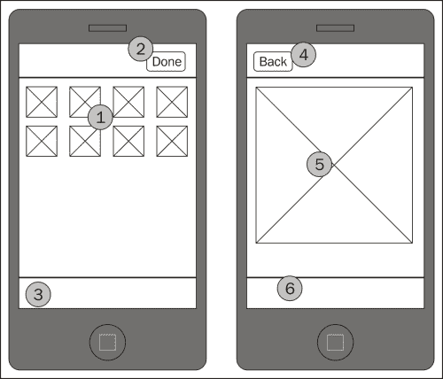
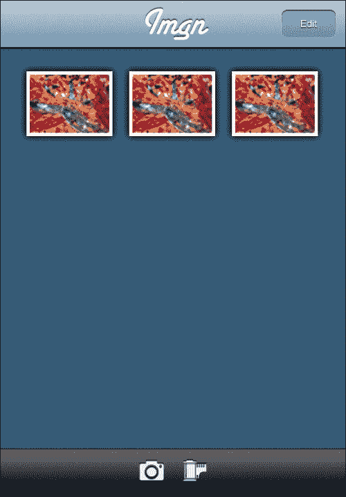
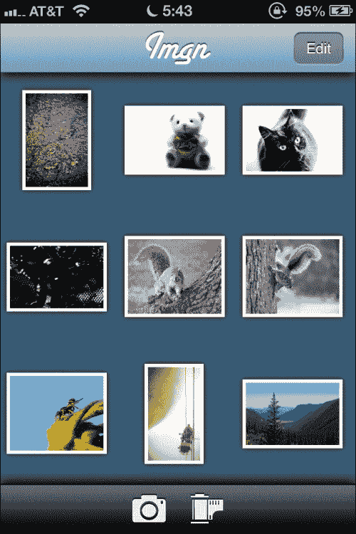
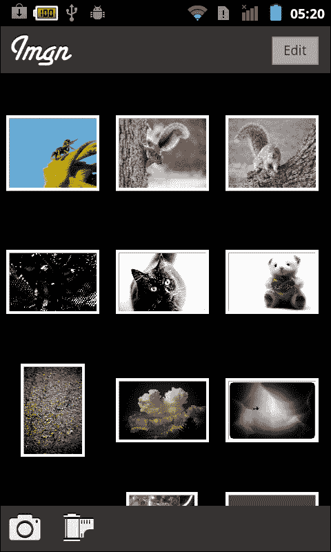
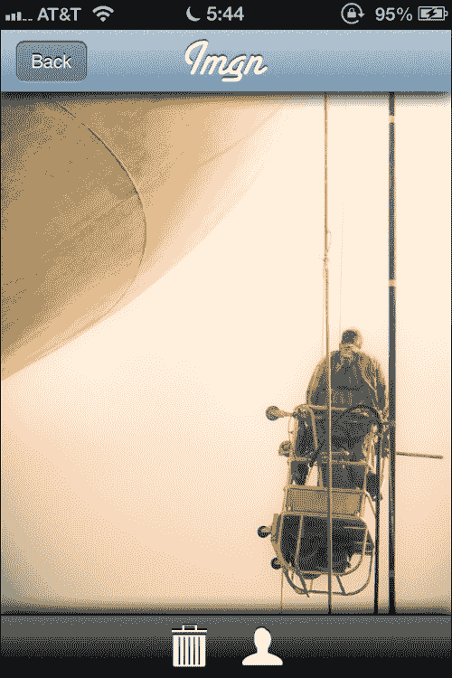
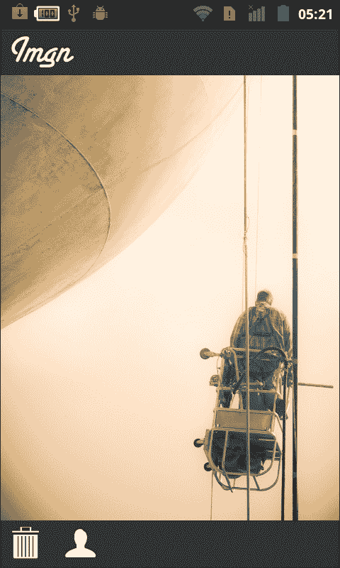

# 第六章. 拍照吧！

曾经有一段时间，手机上还没有摄像头。然后又有一段时间，那些摄像头非常糟糕，它们实际上只适用于拍一些提醒照片，例如，拍下你想要稍后查找更多信息商店物品的照片。但现在，许多移动设备都配备了优秀的摄像头，可以拍摄出令人惊叹的照片。在这个项目中，我们将探讨如何在我们的应用程序中使用这些摄像头。

# 我们要构建什么？

在这个项目中，我们将构建一个名为`Imgn`的应用程序。它不会是一个完整的应用程序；它只会拍照并允许你查看它们。但你可以添加很多其他功能，比如分享功能或创意滤镜，这些功能可以在拍照后改变图像。

然而，这个应用程序将展示通过设备摄像头拍照的过程，以及访问用户照片库以导入图像的过程。就像我们之前的应用程序一样，我们将拥有完整的文件管理功能，因此可以随意删除、复制和重命名图像。不过，我们将以不同的方式实现这一点；我们将实现许多照片应用程序中看到的功能——图像网格。

## 它能做什么？

最终，这个应用程序将允许你拍照或从你的照片库中导入一张照片，然后查看它。虽然听起来很简单，但这个应用程序具有完整的图像管理功能，这意味着我们将介绍如何删除、复制和重命名图像。在大多数照片应用程序中，通常有批量删除图像的选项（比如说你拍了几张模糊的照片，不再需要它们），而使用`File` API 批量删除图像可能有点棘手。

大多数照片应用程序也使用所谓的图像网格，这是一个小图像缩略图的网格，允许用户在屏幕上同时查看多张图像并滚动浏览它们。这个网格并不难实现；它实际上只是一系列使用古老的 HTML 进行包装的缩略图。这个想法失败的地方在于，PhoneGap 中没有创建缩略图的功能；这意味着作为缩略图显示的图像实际上是全尺寸图像，它们只是被缩小到一个小缩略图。这种缩放引入了许多性能问题，作为解决方案，我们将使用 HTML5 的`Canvas`标签来恢复一些性能。

## 为什么它很棒？

在这个项目中，我们将涵盖许多技术，如果你想要制作一个性能良好的照片应用程序，这些技术都是至关重要的。我们将探讨如何拍照以及如何从用户的照片库中导入照片——这两者在大量应用程序中都是至关重要的。社交应用程序经常使用这种功能，但还有其他应用程序也这样做。

和往常一样，我们将涵盖文件管理，这从来都不是那么容易。在这个项目中，我们将介绍`File` API 包装器的概念，这应该会使处理文件变得稍微容易一些。然而，最终我们仍然在处理文件时需要变得有些巧妙，所以请准备好让你的大脑变得错综复杂。

我们将使用在移动网络世界中越来越受欢迎的东西：**HTML5 Canvas**。它已经在桌面网站上得到了很好的应用，但现在我们的移动设备才开始足够快，能够以有趣的方式使用 Canvas。

## 我们将如何实现？

就像我们之前的所有任务一样，我们将采用我们经过验证的方法来处理这个问题：

+   设计用户界面和外观

+   设计数据模型

+   实现文档视图

+   实现图像视图

## 我需要准备些什么才能开始？

为了开始，你需要创建项目，就像你之前在每一个项目中做的那样。你还应该查看项目文件中的资源目录。我们有一些图标文件，你可能觉得很有趣。

# 设计用户界面和外观

从用户界面角度来看，这个应用程序在概念上非常简单。如果你在手机上看过照片应用程序，你很可能已经知道我们将要走向何方。即便如此，让我们设计一个原型，然后对其进行一些扩展，以确定我们需要的外观和感觉资产。

## 开始行动

让我们检查这个项目的原型：



最左侧的屏幕只是一个网格（1），显示了用户添加到应用程序中的所有图片。这些图片可能是用相机拍摄的，也可能是以各种方式导入的。

在导航栏中，我们将有一个花哨的标题——不知何故，照片应用程序似乎需要比我们最近的一些应用程序更少的功能性。我们还将包括一个可以改变状态为**完成**按钮（2）的**编辑**按钮。此按钮表示当前状态；如果用户点击**编辑**，图片将变为可选择的，以便进行批量操作，如**删除**操作。在此模式下，按钮切换到**完成**。如果用户再次点击按钮，他们将退出选择模式，按钮将再次指示**编辑**。用户所做的任何选择都将被丢弃。

自从我们有了工具栏（3）以来已经有一段时间了。我们将根据当前的编辑状态显示各种图标。如果我们不在选择模式（导航栏按钮显示**编辑**），我们将显示一个相机和一个胶卷。这两个图标将允许与相机和相册进行交互。如果我们处于选择模式（导航栏按钮显示**完成**），并且至少选择了一张图片，我们将显示一个垃圾桶图标和一个人物图标，分别表示**删除**和**分享**。

如果我们不在选择模式中，用户可以点击一个图像来查看它放大。此时，我们将移动到前一个截图中最右侧的屏幕。导航栏将有一个**返回**按钮（4）。图像将在内容区域（5）显示。如果图像比屏幕大，它将可以滚动。在工具栏（6）中，我们将提供删除图像或分享图像的方式。

现在我们已经讨论了原型，让我们更详细地展开。这是在我们最喜欢的图形编辑器中做一些工作后的最终结果：



虽然我们所有应用的基本元素都存在，但很明显，它们已经被大大改进了。导航栏被涂上了新的油漆，并为应用的标题使用了俏皮的字体。工具栏也被升级到了更深的颜色。

每个图像都会被赋予一个简单的白色边框和阴影，以帮助它从背景中脱颖而出。这些效果可以通过 CSS 轻松实现，因此我们不需要为这个特定部分使用图像。

然而，对于应用的其他部分，情况就不同了。我们将有四个图标，分别是相机、胶卷、垃圾桶和人物。这些图标将始终位于工具栏中，并且可以点击执行操作。导航栏和工具栏本身也需要是图形资源。仅使用 CSS 渲染这些图标将非常困难（特别是由于它们都有一些细微的*噪声*来增加它们的纹理）。最后，标题本身也需要是图像资源，因为我们使用的字体可能不在设备上可用。在这个工作中，除了照片本身之外，我们唯一可以不使用图像完成的事情就是导航栏上的**编辑**按钮。我们将使用我们一直在使用的相同 CSS 来完成按钮的显示。

这个应用的第二屏，即图像查看器，在这里没有制作原型——它将只是一个中间的大图像，其余的设计保持不变。工具栏中的两个图标将是垃圾桶和人物，但这就是所有不同的地方。

既然我们已经确定了需要成为图形资源的部分，那么就是时候从我们的原型中提取它们了。您可以在我们项目的`www/images`目录中看到最终结果。

### 小贴士

我们将标题制作成独立于导航栏的图像。这是因为导航栏可以自由拼接，我们不想让标题与它一起拼接！

## 我们做了什么？

在这个任务中，我们制作了用户界面并详细说明了所有部分是如何协同工作的。我们还完善了原型，以便我们能够生成应用实现所需的图像资源。

# 设计数据模型

我们的数据库模型将首次非常简单。这里实际上没有太多需要跟踪的内容。从某种意义上说，我们的数据模型与持久存储中的内容完全相同——即图像本身。

## 继续前进

就像在之前的任务中一样，我们确实有一个文档集合模型，它读取持久存储中的所有图像，并允许我们的文档视图与之交互。这个特定模型几乎没有任何变化（除了名称之外），所以在这里我们不会对其进行介绍。

我们将要介绍的内容并不完全是一个数据模型，但仍然很重要。当用户点击**编辑**按钮时，我们希望他们能够选择多张图片进行批量操作（例如删除）。为了做到这一点，我们需要跟踪哪些图像被选中，哪些没有被选中。

该模型本身非常简单，实际上并没有自己的代码文件。它只是一个数组，结合一个表示我们是否处于选择模式的单个属性。它看起来是这样的：

+   `inSelectionMode`

+   `selectedItems[]`

就这些。非常简单，是的，但理解它是如何工作的对于提供选择机制非常重要。

当应用开始时，我们不会处于选择模式，所以`inSelectionMode`将是`false`。如果用户点击**编辑**，我们将将其改为`true`，并将所有图像周围的边框颜色改为浅黄色。颜色本身并不重要；这样做只是为了表明设备对点击做出了响应，并且所有图像目前都是未选择的（我们将使用红色来表示已选择的图像）。这也意味着`selectedItems`数组也将是空的。

我们有几种方法可以跟踪哪些图像被选中。我们可以设置一个数组，其项目数量与屏幕上的图像数量相同。这可以工作，但可能性很大，大多数这些图像在整个选择操作中都将保持未选择状态。除非用户有意删除所有图像（虽然这是可能的，但这种情况并不常见），否则真的没有必要浪费那么多空间。

相反，我们将使用一个`稀疏`数组来跟踪这些选择；数组中的每个项目将指向所选的图像。这意味着，如果我们选择了三幅图像，数组只需要三个项目长。任何不在数组中的图像都可以被认为是未选择的，而那些在数组中的被认为是已选择的。

虽然这确实在如何管理这个数组方面带来了一些困难。幸运的是，理解这一点并不太难。

让我们假设用户在选择模式下点击了图像 3。首先，我们将边框颜色改为引人注目的颜色（在我们的例子中是红色）以表明我们“听到了”用户。然后，我们将使用数组的`push`方法将图像添加到选择中。此时，我们的数组中恰好有一个值为`3`的项目。用户继续选择一些其他项目，最终我们可能得到一个包含`3`、`1`、`9`的数组。这意味着图像 1、3 和 9 被选中。（请注意，顺序并不重要。）

现在，让我们假设用户再次点击图像 1。它已经选中了，所以我们应该取消选中它。为了做到这一点，我们需要从数组中删除第二个元素，这样我们就剩下了一个包含`3`、`9`的数组。虽然这些方法的名称可能不是立即显而易见的，但 JavaScript 确实使这个过程变得非常简单。

首先，我们将使用`indexOf`来找到`1`在数组中的位置。一旦我们找到了位置，我们将使用`splice()`来告诉 JavaScript 删除那个特定的项。`splice()`方法可以用于非常酷的数组操作，但它也特别擅长进行项删除。

在数组上有这三种方法后，我们可以跟踪任何图像的选择状态。如果我们无法在数组中找到图像，我们知道它没有被选中。如果我们确实在数组中找到了图像，我们知道它已被选中。而这实际上就是我们需要知道的所有内容。

当用户完成他们的选择后，他们可以选择对它们进行一些操作。这里可能会有一些困难。假设他们想一次性删除多张图片。`File` API 有点痛苦，正如我们从之前的任务中看到的，现在我们必须想出一种方法来连续多次调用它。在其他具有同步文件操作的语言中，我们会使用简单的`for`循环，但我们在 PhoneGap 提供的`File` API 中没有这样的便利，因为它是一个异步 API。

用户还可以做的另一件事是结束他们的选择，他们可以通过点击**完成**来做到这一点。当这种情况发生时，我们将将所有图像边框变回白色，以表明我们已经听到了用户的要求，并且也表明任何已选图像现在已取消选择。

## 我们做了什么？

在这个任务中，我们检查了一个简单的数据模型，该模型跟踪数组中的选择。我们讨论了我们将如何使用`push()`、`indexOf()`和`splice()`来维护这个数组，以及所有这些将如何对用户显示。

由于这个模型非常简单，我们没有费心给它一个单独的文件；我们将将其作为我们将在下一个实现中实现的文档视图的一部分。

# 实现文档视图

虽然我们的文档视图中有一些部分与之前的项目相同或类似，但也有相当多的不同。视图必须处理拍照、导入图片，并在批量操作之前处理用户一次性选择多张图片。这意味着即使底层模型相当简单，也有很多事情要做。

这就是视图的外观，首先是 iOS 版本：



对于 Android，视图如下所示：



## 准备就绪

如果你想跟进，我们的视图位于此项目的文件`www/views/documentsView.html`中。

## 开始行动

和往常一样，让我们从视图的 HTML 部分开始：

```js
<div class="viewBackground">
  <div class="navigationBar">
    <div style="padding-top:7px" id="documentsView_title"></div>
    <button class="barButton" id="documentsView_editButton" style="right:10px" ></button>
  </div>
  <div class="content avoidNavigationBar avoidToolBar" style="padding:0; overflow: scroll;" id="documentsView_scroller">
    <div id="documentsView_contentArea" style="padding: 0; height: auto; position: relative;"></div>
  </div>
  <div class="toolBar">
    <span class="icon" id="documentsView_cameraButton"></span>
    <span class="icon" id="documentsView_importButton"></span>
    <span class="icon" id="documentsView_deleteButton"></span>
    <span class="icon" id="documentsView_shareButton"></span>
  </div>
</div>
```

这段代码的大部分与之前项目中的文档视图相似。`div` 元素 `documentsView_title` 有一个内联样式，将标题图片向下移动一点；否则，它将与导航栏的顶部对齐。其余的更改都在 `div` 类名为 `toolBar` 的部分，其中定义了四个图标，分别是照片（`photo_64.png`）图标、电影（`film_64.png`）图标、垃圾箱（`trash_64.png`）图标和人物（`man_64.png`）图标。由于这些图标不会根据本地化而改变，因此在这里放置它们而不是在 `initializeView()` 中定义内容是安全的。

接下来，让我们看看我们将为每张图片使用的模板：

```js
<div id="documentsView_documentTemplate" class="hidden">
  <div class="documentContainer" id="documentsView_item%INDEX%">
    <div class="documentImage">
      <canvas width=84 height=84
      id="documentsView_item%INDEX%_canvas"
      onclick="documentsView.documentContainerTapped(%INDEX%);"></canvas>
    </div>
  </div>
</div>
```

这可能是我们很长时间以来最简单的模板了。其中只包含一个具有唯一 `id` 值的 `canvas` 标签和一个 `click` 处理器。不要被使用 `canvas` 标签而不是 `img` 标签的简单性所欺骗，这意味着我们稍后必须编写代码将图像绘制到 `canvas` 标签上。然而，使用 `canvas` 带来的好处是值得这段额外代码的。

### 提示

我们已经给 `canvas` 标签指定了特定的 `width` 和 `height`；这给它一个定义的形状，直到我们可以稍后用实际图像的宽度和高度覆盖它。这只是为了使从未加载的图像到已加载的图像的过渡更加平滑。

HTML 部分处理完毕后，让我们看看代码：

```js
  var documentsView = $ge("documentsView") || {};
  documentsView.firstTime = true;
  documentsView.lastScrollLeft = 0;
  documentsView.lastScrollTop = 0;
  documentsView.myScroll = {};
  documentsView.availableDocuments = {};
  documentsView.inSelectionMode = false;
  documentsView.selectedItems = [];
  documentsView.globalAlert = null;
```

大部分这些仅使用的属性都是我们从之前的项目中熟悉的。然而，有三个属性对于这个特定项目非常重要，如下所述：

+   `inSelectionMode`：这表示用户是否已将我们置于选择模式。在选择模式下，用户可以选择多张图像进行批量操作（如删除操作），而在选择模式之外，点击图片将导致查看其大图。

+   `selectedItems`：这是一个数组，如前一个任务中讨论的，它包含选定的图像。这是一个 *稀疏* 数组，因为它只包含实际选定的图像，而不包含未选定的图像。

+   `globalAlert`：这是一个占位符，用于显示警告。当进行批量删除时，我们将使用它。如果用户一次性删除多张图片，可能需要几秒钟，因此我们希望能够在下面的操作上显示一个警告。

在此之后，我们有视图的初始化代码，如下所示：

```js
  documentsView.initializeView = function()
  {
    PKUTIL.include(["./models/ImageDocumentCollection.js", "./models/VoiceRecDocument.js"], function()
    {
      documentsView.displayAvailableDocuments();
    });

    documentsView.viewTitle = $ge("documentsView_title");
    documentsView.viewTitle.innerHTML = __T("APP_TITLE_IMG");

    documentsView.editButton = $ge("documentsView_editButton");
    documentsView.editButton.innerHTML = __T("EDIT");
    PKUI.CORE.addTouchListener(documentsView.editButton, "touchend",
      function(e)
      {
        documentsView.toggleSelection();
      }
    );
```

到目前为止，与我们的前几个项目没有太大区别。在前面的代码中，我们向 **编辑** 按钮添加了文本和代码——如果被点击，我们将调用 `toggleSelection()`，这将切换选择模式。

接下来，我们将使用以下代码片段定义工具栏上每个图标的处理程序：

```js
    documentsView.cameraButton = $ge("documentsView_cameraButton");
    PKUI.CORE.addTouchListener(documentsView.cameraButton, "touchend",
      function(e)
    {
    documentsView.takePicture();
      }
    );

    documentsView.importButton = $ge("documentsView_importButton");
    PKUI.CORE.addTouchListener(documentsView.importButton, "touchend",
      function(e)
      {
        documentsView.importPicture();
      }
    );

    documentsView.deleteButton = $ge("documentsView_deleteButton");
    documentsView.deleteButton.style.display="none";
    PKUI.CORE.addTouchListener(documentsView.deleteButton, "touchend",
      function(e)
      {
        documentsView.confirmDeletePictures();
      }
    );

    documentsView.shareButton = $ge("documentsView_shareButton");
    documentsView.shareButton.style.display="none";
```

### 提示

我们目前还没有将触摸监听器附加到 **分享** 按钮上。如果您想实现分享功能，请参考 项目 2，*让我们社交吧！*

需要注意的重要事项是，最后两个图标被设置为`display`为`none`，这意味着它们不会显示在屏幕上。这是因为它们仅适用于选中图片，如果它们无法执行任何操作，就没有必要显示它们。当我们更改选择模式并且至少选中了一张图片时，我们将重新显示它们。

在视图初始化后，让我们看看`toggleSelection()`。这是当用户点击**编辑**按钮时的处理程序：

```js
  documentsView.toggleSelection = function ()
  {
    var i;
    var anElement;
    documentsView.inSelectionMode = !documentsView.inSelectionMode;
```

根据方法名称，我们首先需要做的事情是切换选择模式。我们将利用布尔值的工作原理来简单地切换值：如果它进来时是`false`，我们将将其切换为`true`，反之亦然。

```js
    if (documentsView.inSelectionMode)
    {
      documentsView.editButton.innerHTML=__T("DONE");
      documentsView.selectedItems=[];
      for (i=0; i<documentsView.availableDocuments.getDocumentCount(); i++)
      {
        anElement = $ge("documentsView_item"+i+"_canvas");
        anElement.style.border = "3px solid #FF8";
      }

      documentsView.cameraButton.style.display="none";
      documentsView.importButton.style.display="none";
      documentsView.deleteButton.style.display="none";
      documentsView.shareButton.style.display="none";

    }
```

如前述代码所示，如果我们现在处于选择模式，我们将更改**编辑**按钮以显示**完成**，以便用户知道如何结束选择模式。接下来，我们将清空`selectedItems`数组，以便删除任何之前的选中项。由于我们使用图片边框来指示选择状态，我们需要遍历每个图片并将它的边框设置为未选择状态（浅黄色）。最后，我们将隐藏工具栏中的所有图标，因为它们都不立即适用。

```js
    else
    {
      documentsView.editButton.innerHTML=__T("EDIT");
      for (i=0; i<documentsView.availableDocuments.getDocumentCount(); i++)
      {
        anElement = $ge("documentsView_item"+i+"_canvas");
        anElement.style.border = "3px solid #FFF";
      }

      documentsView.cameraButton.style.display="inline";
      documentsView.importButton.style.display="inline";
      documentsView.deleteButton.style.display="none";
      documentsView.shareButton.style.display="none";

    }
  }
```

另一方面，如果我们正在结束选择，我们需要将**完成**按钮切换回**编辑**，然后将所有图片边框恢复为白色。我们还需要重新启用前两个图标（相机和导入），因为它们现在适用于我们的当前状态。最后两个图标被隐藏（因为它们可能在结束选择之前是可见的）。

当然，切换选择模式本身不足以实际实现选择，让我们看看`documentContainerTapped()`，它每次点击图片时都会被调用：

```js
  documentsView.documentContainerTapped = function(idx)
  {
    var theElement = $ge("documentsView_item" + idx + "_canvas");
    if (documentsView.inSelectionMode)
    {
```

点击图片的含义取决于我们是否处于选择模式。如果我们处于选择模式，点击它应该选择图片（如果之前未选择），取消选择图片（如果之前已选择），然后更新工具栏；这是通过以下代码片段完成的：

```js
      if ( documentsView.selectedItems.indexOf (idx) > -1 )
      {
        theElement.style.border = "3px solid #FF8";
        documentsView.selectedItems.splice (
        documentsView.selectedItems.indexOf( idx), 1);
      }
```

要确定图片是否被选中，我们使用`indexOf()`。如果图片在数组中，我们知道图片当前被选中；因此，点击它应该取消选中，我们将边框颜色更改为浅黄色，并使用`splice()`方法从`selectedItems`数组中删除图片。

```js
      else
      {
        theElement.style.border = "3px solid #800";
        documentsView.selectedItems.push(idx);
      }
```

如果图片在`selectedItems`数组中找不到，我们知道我们需要选择它，因此我们更改边框颜色（红色）并通过`push()`方法将其添加到数组中。

```js
      if (documentsView.selectedItems.length>0)
      {
        documentsView.deleteButton.style.display="inline";
        documentsView.shareButton.style.display="inline";
      }
      else
      {
        documentsView.deleteButton.style.display="none";
        documentsView.shareButton.style.display="none";
      }
    }
```

无论我们是否选中或取消选中了图片，我们都需要处理工具栏。如果我们至少选中了一张图片，我们将显示**删除**和**分享**图标。如果选择变为空，我们将再次隐藏它们。

```js
    else
    {
      PKUI.CORE.pushView (imageView);
      PKUTIL.delay(500, function()
      {
        imageView.setImage ( documentsView.availableDocuments.getDocumentAtIndex(idx).fullPath, idx );
      } );
    }
  }
```

如果我们不在选择模式中，点击图片应该将视图移动到图片查看器，以便我们可以看到其全尺寸。我们首先推送视图，然后在 `500` 毫秒后，我们实际上告诉视图要显示的图片。这乍一看可能有些奇怪（我们通常会按相反的顺序这样做），但这是为了平滑过渡到新视图。从相机获取的图片可能相当大，加载这张图片需要一些时间。如果它在过渡的同时加载，过渡将会卡顿，使应用程序感觉比实际运行得慢。因此，我们等待过渡完成，然后告诉视图加载图片。

在选择完成后，让我们看看如何拍摄和导入图片。本质上，这些操作是相同的事情，只是图片的来源不同。当然，对于用户来说，它们是非常不同的。一个涉及拍照（构图、等待合适的时机、按下快门等），而另一个只涉及用户在相机中搜索已存在的图片。但对于应用程序来说，它们在技术上是一样的，只是图片来源不同。正因为如此，我们将有三个方法，前两个用于确定图片来源，最后一个用于实际拍摄或导入图片。

```js
  documentsView.takePicture = function()
  {
    documentsView.doPicture ( Camera.PictureSourceType.CAMERA );
  }
```

首先是拍照。我们将使用 `doPicture()` 函数，并传入 `CAMERA` 作为源，这表示图片将从设备相机获取。用户界面会根据平台和设备的不同而有所变化，但我们不需要担心这一点，因为 PhoneGap 已经为我们提供了接口。

```js
  documentsView.importPicture = function()
  {
    documentsView.doPicture ( Camera.PictureSourceType.PHOTOLIBRARY );
  }
```

要导入图片，我们使用 `PHOTOLIBRARY` 作为源调用 `doPicture()` 函数。这表示图片应来自用户的图像库。同样，用户界面会根据平台和设备的不同而有所变化，但我们的应用程序不需要担心这一点，因为 PhoneGap 会为我们处理所有细节。

```js
  documentsView.doPicture = function( source )
  {
    navigator.camera.getPicture ( 
      function (uri)
      {
        PKFILE.moveFileTo ( uri, "doc://" + PKUTIL.getUnixTime() + ".jpg",
        function ()
        {
          documentsView.reloadAvailableDocuments();
        },
        function (evt)
        {
          console.log (JSON.stringify(evt));
          var anAlert = new 
          PKUI.MESSAGE.Alert(__T("Oops!"), __T("Failed to save the image."));
          anAlert.show();
        } )
      },
      function (msg)
      {
        var anAlert = new PKUI.MESSAGE.Alert(__T("Oops!"), 
        msg);
        anAlert.show();
      },
      { quality: 50,
        destinationType: Camera.DestinationType.FILE_URI,
        sourceType: source,
        encodingType: Camera.EncodingType.JPEG,
        mediaType: Camera.MediaType.PICTURE,
        correctOrientation: true,
        saveToPhotoAlbum: false
      }
    );
  }
```

在这个函数中存在多层回调，每一层都依赖于前一步的正确执行。现在我们先看看外层回调。

要拍摄图片或导入图片，我们调用 `navigator.camera.getPicture()` 函数，并传入三个参数：`success` 函数、`failure` 函数和选项。我们函数中的选项位于方法的最后。以下是每个选项的含义：

+   `quality`：这是图像的压缩方式。我们使用 `50`，因为它在质量和文件大小之间提供了一个良好的平衡。此外，一些设备处理来自相机的质量高于 `50` 的图片时可能会出现问题。（通常，在质量大于 `50` 的设备上，应用程序可能会崩溃。这不是一个好的用户体验。）

+   `destinationType`: 它决定了目的地。这里有两种选择：我们可以请求一个表示图像数据的 base64 编码字符串，或者我们可以请求图像保存的文件位置。我们请求文件位置而不是 base64，主要是因为处理方便和内存考虑。（Base64 至少是图像文件大小的两倍。）

+   `sourceType`: 它决定了图像应该来自哪里。如果设置为`CAMERA`，它将从相机获取图像。如果设置为`PHOTOLIBRARY`，它将从用户的库中获取。请注意，我们在这里接收传入的参数，这是`takePicture()`和`importPicture()`发送给我们的。

+   `encodingType`: 这是图像格式，通常是 JPEG 或 PNG。PNG 非常适合具有大量像素重复的图像（如图表），并且是无损的。然而，对于摄影来说，PNG 会太大。因此，我们将使用 JPEG。虽然是有损的，但它们不会大到难以处理。

+   `mediaType`: 相机通常可以用来拍摄视频而不是静态图像。在这种情况下，我们想要的只是一个静态图像，所以我们发送`PICTURE`。这也限制了导入图像时可用格式。如果没有这个，用户可能会导入一个视频，而我们无法处理。

+   `correctOrientation`: 这个参数可以用来纠正拍照时使用的方向。例如，如果手机被旋转了，而我们没有纠正方向，图像可能会显示为侧放或颠倒。启用此功能后，我们得到的是正立的图像。

+   `saveToPhotoAlbum`: 这可以是`true`或`false`。如果为`true`，相机拍摄的图像将被保存到相册和我们的应用中。如果为`false`，只有我们的应用接收图像。虽然我们在这里使用`false`，但这实际上是一个选择问题。将图像保存到相册以及您的应用中是否有意义？对这个问题的答案取决于您的应用及其目标受众。

如果我们进入`navigator.camera.getPicture()`的`success`函数，我们会看到这一行：

```js
        PKFILE.moveFileTo ( uri, "doc://" + PKUTIL.getUnixTime() + ".jpg",
```

相机给我们的文件可能位于临时位置（尤其是在 iOS 上），所以我们首先将文件移动到一个更永久的位置。我们使用`PKFILE FILE` API 包装器来完成此操作，我们将在本任务的稍后部分讨论。使用`doc://`确保文件被写入持久存储，使用 Unix 时间（自 1970 年 1 月 1 日起的毫秒数）确保文件名几乎唯一。（用户不可能在足够短的时间内连续拍摄两张图像，以至于它们落在同一个毫秒上。）

当移动完成时，我们调用另一个`success`函数，该函数简单地重新加载可用的文档，在我们的例子中，它重新显示包含新图像的图像网格。

在过程中，我们还有`failure`函数，其中包含`alerts`。如果相机由于某种原因无法拍照或导入出现问题，这些是很重要的。

接下来，让我们处理一次性删除多张图片的情况（删除单张图片的方式与我们在过去项目中删除文档的方式相同）：

```js
  documentsView.confirmDeletePictures = function ()
  {
    var anAlert = new PKUI.MESSAGE.Confirm(__T("Delete Image(s)"), __T("This will delete the selected image(s). This action is unrecoverable."), __T("Don't Delete<|Delete*"), function(i)
    {
      if (i == 1)
      {
        PKUTIL.delay ( 100, documentsView.deleteSelectedPictures );
      }
    });
    anAlert.show();
  }
```

首先，我们询问用户是否真的想要删除选定的图片，因为这个操作是不可恢复的。如果他们同意，我们将在短暂的延迟后调用`deleteSelectedPictures()`。这个延迟是为了确保在`deleteSelectedPictures()`显示自己的警告之前，第一个警告已经消失。

```js
  documentsView.deleteSelectedPictures = function ()
  {
    if (documentsView.selectedItems.length > 0)
    {
      var currentIndex = documentsView.selectedItems.pop();
      if (documentsView.globalAlert == null)
      {
        documentsView.globalAlert = new PKUI.MESSAGE.Alert(__T("Please Wait"), __T("Deleting Selected Images..."));
        documentsView.globalAlert.show();
      }
      PKUTIL.delay (100, function () {
      PKFILE.removeFile ( documentsView.availableDocuments.getDocumentAtIndex(currentIndex).fullPath,
      documentsView.deleteSelectedPictures,
      function (e)
      {
        documentsView.globalAlert.hide();
        var anAlert = new PKUI.MESSAGE.Alert (__T("Oops!"), __T("Failed to remove file."));
        anAlert.show();
        documentsView.reloadAvailableDocuments();
      }
      );
    }
    );
    }
    else
    {
      if (documentsView.globalAlert)
      {
        documentsView.toggleSelection();
        documentsView.reloadAvailableDocuments();
        documentsView.globalAlert.hide();
        PKUTIL.delay (750, function() { documentsView.globalAlert = null; } );
      }
      else
      {
        console.log ("ASSERT: We shouldn't be able to delete anything without having prior selected something.");
      }
    }
  }
```

这个方法需要我们稍微转换一下思维方式，因为有一些我们通常期望存在的东西缺失——一个`for`循环。因为`FILE` API 都是异步的，我们不能在它们周围循环，我们需要确保在告诉用户我们已完成之前，所有的 API 请求都已经完成。

因此，我们使用类似递归的方法。这不是真正的递归，因为函数调用不是嵌套的，但它足够接近，以至于对我们的神经元来说有点痛苦。

我们首先检查`selectedItems`数组的长度。如果其中包含图片，我们知道我们需要删除一张。如果数组为空，我们知道我们已经完成了工作，可以清理一切。

如果我们需要删除一个图片，我们调用`PKFILE.removeFile`函数，并传入图片的完整路径。同时，我们也将当前方法传递给`success`函数。这意味着一旦图片成功删除，我们会被再次调用以重复此过程，直到`selectedImages`数组中的所有图片都被删除。只有在发生错误或`selectedImages`数组为空时，这个过程才会停止。

当`selectedImages`数组为空时，我们需要清理一些东西。我们清除在开始删除过程时创建的警告，并重新加载所有可用的文档。

在讨论重新加载文档列表的过程中，也许我们应该稍微深入一点：

```js
  documentsView.documentIterator = function(o)
  {
```

这个函数的第一部分与之前的工程相同，所以我们直接跳到下面代码片段中有趣的部分：

```js
    PKUTIL.delay(100, function()
    {
      for (var i = 0; i < theNumberOfDocuments; i++)
      {
        var theDocumentEntry = o.getDocumentAtIndex(i);
        var theElement = $ge("documentsView_item" + i + "");
        var theLPGesture = new GESTURES.LongPressGesture(theElement, function(o)
        {
          documentsView.longPressReceived(o.data);
        });
        theLPGesture.data = i;
```

就像在我们的上一个项目中一样，我们给每个图片附加了一个长按手势。当接收到长按手势时，我们会显示一个菜单，允许用户删除、复制或重命名图片。

更有趣的部分是下面的部分，我们在这里实际上将图片的缩略图渲染到每个`canvas`上：

```js
        var img = new Image();
        img.i = i;
```

首先，对于每个可用的文档，我们创建一个新的`Image`对象。同时，我们也会给对象的属性分配一个`index`，因为当图片加载完成后，我们还需要用到它。

```js
        img.onload = function ()
        {
```

然后，我们给图片的`onload`事件附加一个方法。这就是我们将图片渲染到画布上的地方。

```js
          var newWidth = 84;
          var newHeight = (this.height / this.width) * 84;
          if (newHeight > 84)
          {
            newHeight = 84;
            newWidth = (this.width / this.height) * 84;
          }
```

图像加载后，我们首先确定缩略图的大小。由于我们希望保持宽高比，我们必须知道图像的宽度和高度，这可以通过使用`this.height`和`this.width`来实现。首先我们假设图像将适合`84`像素的宽度，并使用高度与宽度的比例来确定高度。但有些图像可能会比`84`像素高，因此我们基于`84`像素的高度重新计算这些图像的尺寸。

```js
          var newLeft = 42 - (newWidth/2);
          var newTop = 42 - (newHeight/2);
```

一旦确定了缩略图的宽度和高度，我们就可以计算出顶部和左侧的位置，使图像在其 84 x 84 的容器中居中。

```js
          var theCanvas = $ge("documentsView_item" + this.i + "_canvas");
          theCanvas.setAttribute ("width", newWidth * window.devicePixelRatio);
          theCanvas.setAttribute ("height",newHeight * window.devicePixelRatio);
          theCanvas.style.width = ""+newWidth+"px"; theCanvas.style.height = ""+newHeight+"px";
          theCanvas.style.left  = ""+newLeft +"px"; theCanvas.style.top = ""+newTop+"px";
```

接下来，我们获取画布并将其宽度和高度设置为新的计算值。请注意，我们设置了 CSS 和 HTML 的宽度和高度；这是因为不同像素比率的显示上画布的实际大小可能不同。（在视网膜显示屏上，画布实际上大了一倍，但 CSS 将其压缩回原始大小以供视觉使用。）

```js
          var theCanvasCtx = theCanvas.getContext("2d");
          theCanvasCtx.save();
          theCanvasCtx.scale (window.devicePixelRatio, window.devicePixelRatio);
          theCanvasCtx.imageSmoothingEnabled = false;
```

接下来，我们从画布中获取一个上下文。然后我们将画布缩放到像素比例，这样我们就可以在每一点超过一个像素的设备上继续使用基于点的像素。然后我们关闭图像平滑；这是为了帮助加快下一行：

```js
          theCanvasCtx.drawImage (this, 0, 0, newWidth, newHeight);
```

这一行实际上将图像绘制到我们之前计算出的尺寸的画布上。一旦完成，我们就会有一个漂亮的缩略图而不是一个空白的画布。

然而，这个操作并不是免费的；将图像绘制到更小的比例需要时间，但我们必须只做一次（无论何时加载可用的文档）。如果我们为所有缩略图都使用了`IMG`标签，那么每次视图发生变化时都必须这样做，这将慢到无法使用。

```js
          theCanvasCtx.restore();
        }
        img.src = theDocumentEntry.fullPath;
      }
    });
  }
```

最后，我们设置图像的源。这会触发图像的加载，加载完成后会触发图像的`onload()`方法。这个操作也不是免费的，但同样，它只在我们加载文档列表时发生。

视图代码的其余部分与以前的项目非常相似，如果不是完全相同，所以我们不会再次介绍那段代码。

## 我们做了什么？

在这个任务中，我们已经涉及了很多内容。我们创建了可以获取和导入图片的代码，我们使用了 HTML5 的`canvas`标签，并且开始使用一个使文件操作变得稍微容易一点的`FILE` API 包装器。

## 我还需要知道什么？

我们提到过会更多地讨论`FILE` API 包装器，这里就是一个很好的地方。

将`PKFILE`视为一个方便的包装器，它使文件操作变得更容易一些。它并没有消除异步性，但它封装了一些文件操作通常必须执行的操作，特别是获取文件系统。它还使我们能够添加一些用于引用持久和临时存储的快捷方式。

首先，我们来覆盖最后一部分。任何包含以下之一的文件名都会自动转换为系统特定的值：

+   `doc://` 转换为 `/path/to/app/persistent/storage/`。

+   `tmp://` 转换为 `/path/to/app/temporary/stora`。

    +   `lhost` 被替换为 `""`；`FILE` API 无法处理以这个开头的路径。

    因为 `PKFILE` 会将任何路径或文件名中的这些值转换为系统特定的值，所以我们不再需要担心自己获取文件系统。这至少减少了回调链的数量，并简化了我们对自己应用存储中文件的引用方式。例如，我们可以用 `doc://photo.jpg` 而不是像 `/var/something/somethingelse/app/Documents/photo.jpg` 这样的路径来引用。

    `PKFILE` 中的每个方法都接受一些文件名、`success` 和 `failure` 参数的组合。`failure` 函数总是传递一个对象，表明失败的原因。`success` 函数不传递任何参数。

    我们不会详细讲解包装器的代码，主要是因为它并不是你以前没有见过的。如果你想看看，它位于 `framework/fileutil.js` 中，这是本项目提供的文件之一。

# 实现图片视图

图片视图本身非常简单：它只显示一个图片以及工具栏中的两个图标（**删除**和**分享**）。以下是我们的视图将如何看起来，首先是 iOS：



对于 Android，视图如下所示：



## 准备就绪

如果你想跟上来，代码在 `www/views/imageView.js`。

## 继续进行

通常我们会从视图的 HTML 开始，但这个与上一个项目非常相似。因此，我们将从用于显示图片的模板开始：

```js
<div id="imageView_documentTemplate" class="hidden">
  
</div>
```

这可能是我们见过的最简单的模板。它实际上只是一个指定宽度的图片。高度将根据图片的宽高比推断出来。

就像模板一样，代码也将非常简单：

```js
  var imageView = $ge("imageView") || {};
  imageView.imagePath = "";
  imageView.imageIndex = -1;
  imageView.setImage = function ( imagePath, imageIndex )
  {
    imageView.imagePath = imagePath;
    imageView.imageIndex = imageIndex;

    $ge("imageView_contentArea").innerHTML =
      PKUTIL.instanceOfTemplate($ge("imageView_documentTemplate"),
      { "src" : imageView.imagePath        });
  }
```

我们存储两个项目：图片的路径和图片的索引。我们还提供了一个名为 `setImage` 的方法，其他人可以使用它来告诉我们加载哪张图片。一旦调用，我们就用图片数据替换内容区域。

我们的观点也支持删除正在查看的图片。以下是处理方式：

```js
  imageView.confirmDeletePictures = function ()
  {
    var anAlert = new PKUI.MESSAGE.Confirm(__T("Delete Image"), __T("This will delete the selected image.This action is unrecoverable."), __T("Don't Delete<|Delete*"), function(i)
    {
      if (i == 1)
      {
        PKUTIL.delay ( 100, imageView.deleteSelectedPicture );
      }
    });
    anAlert.show();
  }

  imageView.deleteSelectedPicture = function ()
  {
    PKFILE.removeFile ( imageView.imagePath,
    function ()
      {
        PKUTIL.delay(100, function() { PKUI.CORE.popView(); } );
        documentsView.reloadAvailableDocuments();

        },
      function (e)
      {
        var anAlert = new PKUI.MESSAGE.Alert (__T("Oops!"), __T("Failed to remove file."));
        anAlert.show();
        documentsView.reloadAvailableDocuments();
      }
      );
  }
```

我们首先询问用户是否确定，如果是的话，我们将通过 `PKFILE.removeFile()` 删除文件。一旦删除，我们就从视图堆栈中移除自己，因为查看现在已被删除的图片没有太多意义。我们还告诉 `documentsView` 重新加载其文档，因为我们已经修改了文件系统。

```js
  imageView.viewDidHide = function ()
  {
    $ge("imageView_contentArea").innerHTML = "";
  }
```

还有一个方法需要介绍，那就是前面代码片段中看到的 `viewDidHide()` 方法。我们在这里所做的只是清除内容区域，这样当图像视图不被显示时，就不会有图像隐藏在那里占用内存。这也意味着下次视图显示时，不会出现一个奇怪的过渡，即最后加载的图像在新图像加载之前可见几秒钟。（记住，我们在加载新图片之前等待几毫秒，以确保平滑过渡。）

## 我们做了什么？

在这个任务中，我们实现了图像视图，处理了图像的加载，还处理了图像的删除。

# 游戏结束..... 结束语

嗯，这并不太难，对吧？我们已经能够使用内置相机拍照，并且我们还能直接从用户的照片库中导入图像。我们还通过使用 HTML5 的 `canvas` 标签来显示缩略图，从而提高了性能。最后，我们与 `FILE` API 包装器进行了一些工作，以帮助简化我们的代码编写。

# 你能承受高温吗？热手挑战

现有的项目还有很多可以改进的地方。你为什么不尝试几个呢？

+   为应用程序添加共享功能。同时，也要小心处理批量共享多张图片。

+   为图像添加过滤器，以便可以将它们转换为黑白、棕褐色等。如果你想保存文件，你需要编写一个本地插件来保存从画布返回的数据。

+   如果图像还没有缩略图，可以通过生成缩略图来加快速度。如果你想存储缩略图，可以将其存储在本地存储中，它不会很大，或者使用 `File` API 来存储。
